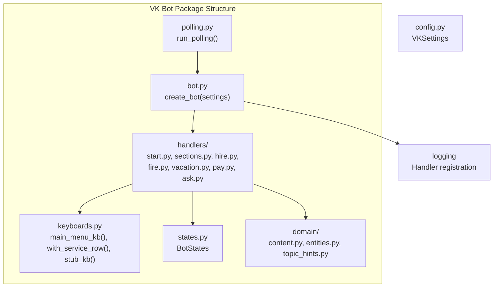
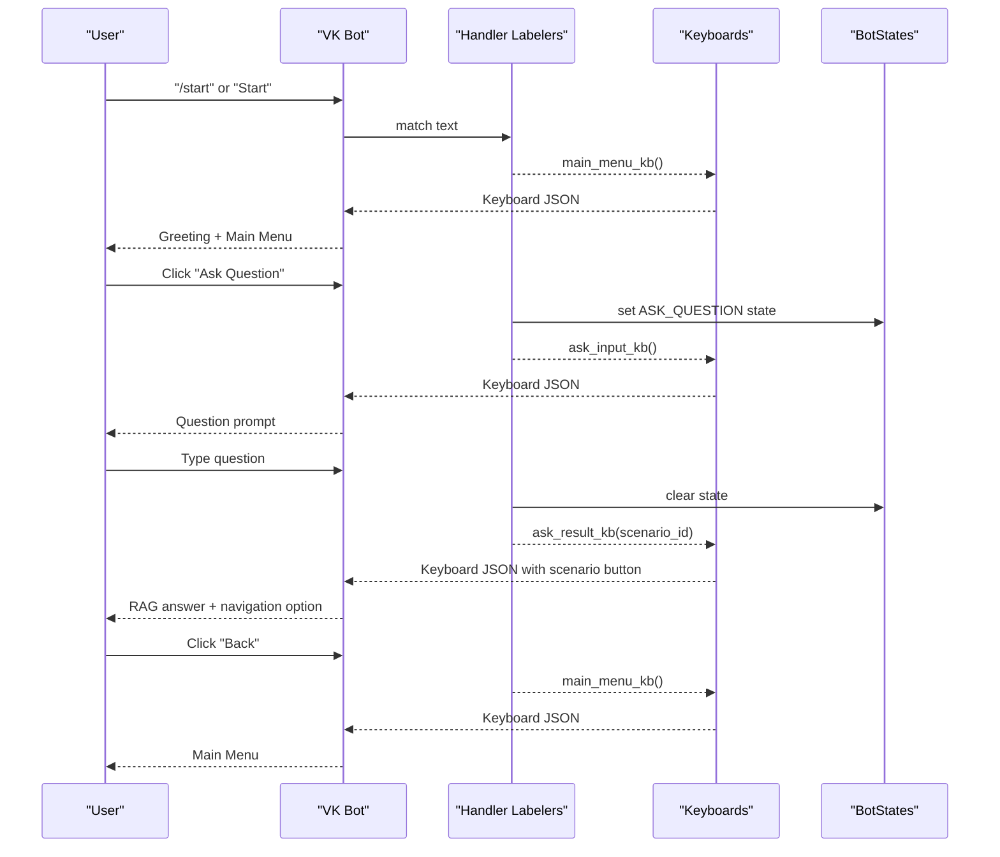
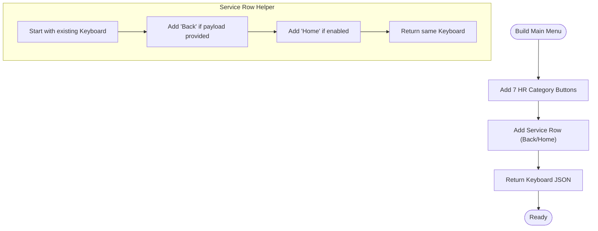
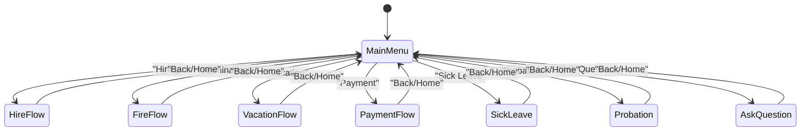
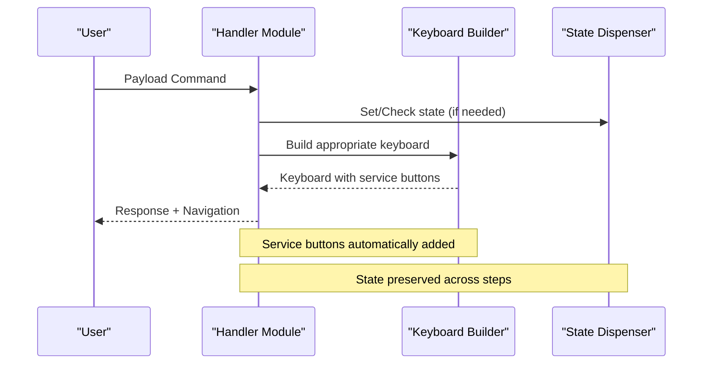
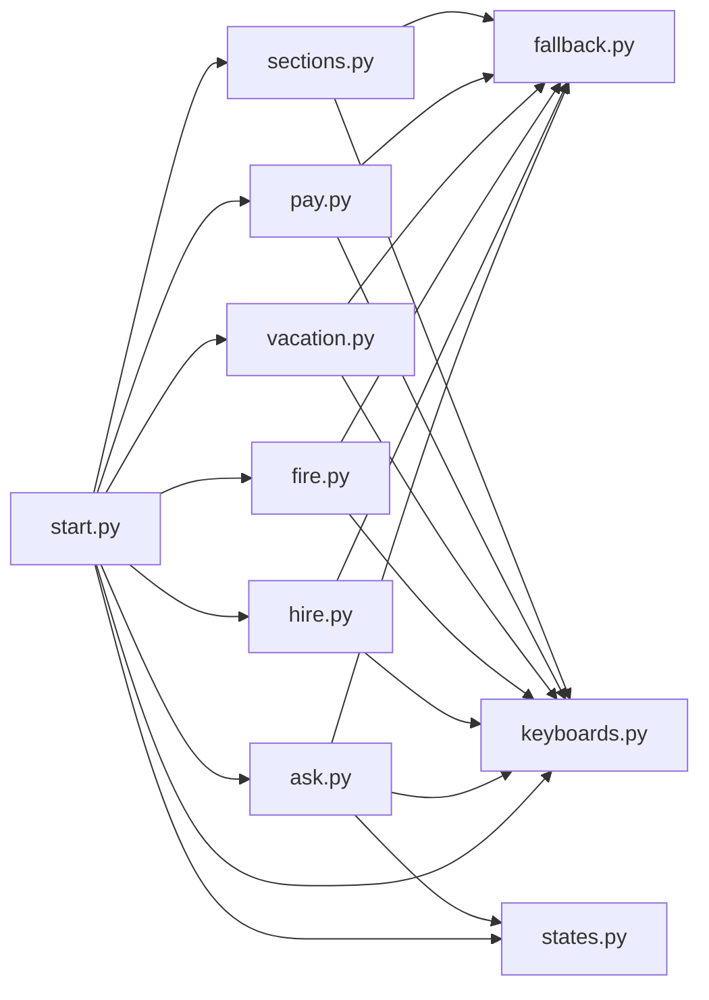

# Main Menu and Navigation

<cite>
**Referenced Files in This Document**
- [bot.py](file://packages/vk_bot/src/cafetera_vk_bot/bot.py)
- [keyboards.py](file://packages/vk_bot/src/cafetera_vk_bot/keyboards.py)
- [states.py](file://packages/vk_bot/src/cafetera_vk_bot/states.py)
- [start.py](file://packages/vk_bot/src/cafetera_vk_bot/handlers/start.py)
- [sections.py](file://packages/vk_bot/src/cafetera_vk_bot/handlers/sections.py)
- [hire.py](file://packages/vk_bot/src/cafetera_vk_bot/handlers/hire.py)
- [fire.py](file://packages/vk_bot/src/cafetera_vk_bot/handlers/fire.py)
- [vacation.py](file://packages/vk_bot/src/cafetera_vk_bot/handlers/vacation.py)
- [pay.py](file://packages/vk_bot/src/cafetera_vk_bot/handlers/pay.py)
- [ask.py](file://packages/vk_bot/src/cafetera_vk_bot/handlers/ask.py)
- [fallback.py](file://packages/vk_bot/src/cafetera_vk_bot/handlers/fallback.py)
- [polling.py](file://packages/vk_bot/src/cafetera_vk_bot/polling.py)
- [test_keyboards.py](file://tests/test_keyboards.py)
- [test_states.py](file://tests/test_states.py)
</cite>

## Update Summary
**Changes Made**
- Updated project structure to reflect new package organization under packages/vk_bot
- Revised all file references to use the new path structure
- Updated architecture diagrams to show the current handler organization
- Enhanced documentation to reflect the current seven-section HR categories system
- Added detailed coverage of the new handler modules (hire.py, fire.py, vacation.py, pay.py, ask.py)
- Updated navigation patterns to reflect the current payload-driven routing system

## Table of Contents
1. [Introduction](#introduction)
2. [Project Structure](#project-structure)
3. [Core Components](#core-components)
4. [Architecture Overview](#architecture-overview)
5. [Detailed Component Analysis](#detailed-component-analysis)
6. [Dependency Analysis](#dependency-analysis)
7. [Performance Considerations](#performance-considerations)
8. [Troubleshooting Guide](#troubleshooting-guide)
9. [Conclusion](#conclusion)
10. [Appendices](#appendices)

## Introduction
This document explains the main menu and navigation system of the VK HR bot. It covers the seven-section HR categories, the main menu structure, service buttons, and navigation patterns. The system features a payload-driven architecture with dedicated handlers for each HR category, supporting both simple click-based flows and complex multi-step dialogs. The navigation maintains user context across bot states and provides consistent service buttons (Back, Home) on every screen.

## Project Structure
The VK integration is now organized under packages/vk_bot/src/cafetera_vk_bot/ with a clean separation of concerns across domain, handlers, and infrastructure layers. The bot factory creates a fully-wired instance with all handlers registered in a specific order to ensure proper routing.

**Diagram sources**
- [bot.py:42-56](file://packages/vk_bot/src/cafetera_vk_bot/bot.py#L42-L56)
- [keyboards.py:78-114](file://packages/vk_bot/src/cafetera_vk_bot/keyboards.py#L78-L114)
- [states.py:4-9](file://packages/vk_bot/src/cafetera_vk_bot/states.py#L4-L9)
- [polling.py:1-50](file://packages/vk_bot/src/cafetera_vk_bot/polling.py#L1-L50)

**Section sources**
- [bot.py:1-56](file://packages/vk_bot/src/cafetera_vk_bot/bot.py#L1-L56)
- [polling.py:1-50](file://packages/vk_bot/src/cafetera_vk_bot/polling.py#L1-L50)

## Core Components
The navigation system consists of several key components working together to provide a seamless user experience:

- **Main Menu Keyboard Builder**: Constructs the seven HR categories plus service buttons
- **Service Button System**: Consistent Back/Home buttons on every screen via `with_service_row()`
- **Payload Constants**: Canonical commands defining navigation and section entry points
- **Handler Labelers**: Ordered registration system ensuring proper message routing
- **Multi-step State Management**: Support for complex flows using BotStates
- **Dedicated Handler Modules**: Specialized handlers for each HR category

Key responsibilities:
- keyboards.py: Build main menu, service rows, and specialized keyboards for each flow
- start.py: Handle /start command and Home navigation
- sections.py: Route to RAG-powered sections (Sick Leave, Probation)
- hire.py, fire.py, vacation.py, pay.py: Dedicated handlers for each HR category flow
- ask.py: Stateful question-answering with RAG integration
- fallback.py: Catch-all handler for unrecognized input
- states.py: Define multi-step dialog states

**Section sources**
- [keyboards.py:13-53](file://packages/vk_bot/src/cafetera_vk_bot/keyboards.py#L13-L53)
- [keyboards.py:57-72](file://packages/vk_bot/src/cafetera_vk_bot/keyboards.py#L57-L72)
- [keyboards.py:78-114](file://packages/vk_bot/src/cafetera_vk_bot/keyboards.py#L78-L114)
- [bot.py:30-39](file://packages/vk_bot/src/cafetera_vk_bot/bot.py#L30-L39)
- [states.py:4-9](file://packages/vk_bot/src/cafetera_vk_bot/states.py#L4-L9)

## Architecture Overview
The navigation architecture uses payload-driven routing with a strict handler load order. The main menu serves as the central hub, with every screen containing service buttons for Back/Home navigation. The system supports both simple click-based flows and complex multi-step dialogs with state persistence.

**Diagram sources**
- [start.py:31-42](file://packages/vk_bot/src/cafetera_vk_bot/handlers/start.py#L31-L42)
- [ask.py:38-45](file://packages/vk_bot/src/cafetera_vk_bot/handlers/ask.py#L38-L45)
- [ask.py:51-89](file://packages/vk_bot/src/cafetera_vk_bot/handlers/ask.py#L51-L89)
- [keyboards.py:246-262](file://packages/vk_bot/src/cafetera_vk_bot/keyboards.py#L246-L262)

## Detailed Component Analysis

### Main Menu Keyboard and Service Buttons
The main menu keyboard builder creates a responsive grid layout with seven HR category buttons and service row integration. Each button uses standardized payload constants for consistent routing.

**Diagram sources**
- [keyboards.py:78-114](file://packages/vk_bot/src/cafetera_vk_bot/keyboards.py#L78-L114)
- [keyboards.py:57-72](file://packages/vk_bot/src/cafetera_vk_bot/keyboards.py#L57-L72)

**Section sources**
- [keyboards.py:78-114](file://packages/vk_bot/src/cafetera_vk_bot/keyboards.py#L78-L114)
- [keyboards.py:57-72](file://packages/vk_bot/src/cafetera_vk_bot/keyboards.py#L57-L72)
- [keyboards.py:120-123](file://packages/vk_bot/src/cafetera_vk_bot/keyboards.py#L120-L123)

### Seven-Section HR Categories
The main menu defines seven distinct HR categories, each with its own handler module and specialized flow:

- **Hiring (CMD_HIRE)**: Multi-step entity selection → action menu → document delivery
- **Termination (CMD_FIRE)**: Menu-driven flow with resignation template and RAG for grounds
- **Vacation (CMD_VACATION)**: Complex flow with type selection, entity choice, and template generation
- **Payment (CMD_PAY)**: Simple menu with RAG-powered overtime and bonus information
- **Sick Leave (CMD_SICK)**: RAG-powered answers for medical leave procedures
- **Probation (CMD_PROBATION)**: RAG-powered answers for trial period regulations
- **Ask Question (CMD_ASK)**: Stateful question-answering with scenario detection

**Diagram sources**
- [keyboards.py:18-24](file://packages/vk_bot/src/cafetera_vk_bot/keyboards.py#L18-L24)
- [hire.py:39-44](file://packages/vk_bot/src/cafetera_vk_bot/handlers/hire.py#L39-L44)
- [fire.py:33-38](file://packages/vk_bot/src/cafetera_vk_bot/handlers/fire.py#L33-L38)
- [vacation.py:36-41](file://packages/vk_bot/src/cafetera_vk_bot/handlers/vacation.py#L36-L41)
- [pay.py:24-29](file://packages/vk_bot/src/cafetera_vk_bot/handlers/pay.py#L24-L29)
- [sections.py:24-28](file://packages/vk_bot/src/cafetera_vk_bot/handlers/sections.py#L24-L28)
- [sections.py:34-38](file://packages/vk_bot/src/cafetera_vk_bot/handlers/sections.py#L34-L38)
- [ask.py:38-45](file://packages/vk_bot/src/cafetera_vk_bot/handlers/ask.py#L38-L45)

**Section sources**
- [keyboards.py:18-24](file://packages/vk_bot/src/cafetera_vk_bot/keyboards.py#L18-L24)
- [hire.py:39-118](file://packages/vk_bot/src/cafetera_vk_bot/handlers/hire.py#L39-L118)
- [fire.py:33-75](file://packages/vk_bot/src/cafetera_vk_bot/handlers/fire.py#L33-L75)
- [vacation.py:36-133](file://packages/vk_bot/src/cafetera_vk_bot/handlers/vacation.py#L36-L133)
- [pay.py:24-50](file://packages/vk_bot/src/cafetera_vk_bot/handlers/pay.py#L24-L50)
- [sections.py:24-38](file://packages/vk_bot/src/cafetera_vk_bot/handlers/sections.py#L24-L38)
- [ask.py:38-89](file://packages/vk_bot/src/cafetera_vk_bot/handlers/ask.py#L38-L89)

### Navigation Patterns and User Context
The system maintains consistent navigation patterns across all HR categories:

- **Back Navigation**: Configurable back payload defaults to Home for most screens
- **Home Navigation**: Always returns to main menu via CMD_HOME payload
- **State Management**: Multi-step dialogs use BotStates for context preservation
- **Service Buttons**: Every screen includes Back/Home buttons via with_service_row()
- **Fallback Handling**: Unrecognized text routed to main menu via fallback handler

**Diagram sources**
- [start.py:39-41](file://packages/vk_bot/src/cafetera_vk_bot/handlers/start.py#L39-L41)
- [ask.py:40-45](file://packages/vk_bot/src/cafetera_vk_bot/handlers/ask.py#L40-L45)
- [keyboards.py:57-72](file://packages/vk_bot/src/cafetera_vk_bot/keyboards.py#L57-L72)
- [states.py:4-9](file://packages/vk_bot/src/cafetera_vk_bot/states.py#L4-L9)

**Section sources**
- [start.py:39-42](file://packages/vk_bot/src/cafetera_vk_bot/handlers/start.py#L39-L42)
- [ask.py:40-45](file://packages/vk_bot/src/cafetera_vk_bot/handlers/ask.py#L40-L45)
- [keyboards.py:57-72](file://packages/vk_bot/src/cafetera_vk_bot/keyboards.py#L57-L72)
- [states.py:4-9](file://packages/vk_bot/src/cafetera_vk_bot/states.py#L4-L9)

### Practical Examples

#### Customize a Menu Item
To modify an existing menu item, update the payload constant and corresponding handler:

1. Change label or payload in keyboards.py
2. Update handler to modify response or add new steps
3. Ensure service row is included via with_service_row()

Example paths:
- [keyboards.py:18-24](file://packages/vk_bot/src/cafetera_vk_bot/keyboards.py#L18-L24)
- [hire.py:39-44](file://packages/vk_bot/src/cafetera_vk_bot/handlers/hire.py#L39-L44)
- [keyboards.py:57-72](file://packages/vk_bot/src/cafetera_vk_bot/keyboards.py#L57-L72)

**Section sources**
- [keyboards.py:18-24](file://packages/vk_bot/src/cafetera_vk_bot/keyboards.py#L18-L24)
- [hire.py:39-44](file://packages/vk_bot/src/cafetera_vk_bot/handlers/hire.py#L39-L44)
- [keyboards.py:57-72](file://packages/vk_bot/src/cafetera_vk_bot/keyboards.py#L57-L72)

#### Add a New Category
To add a new HR category:

1. Define new payload constant in keyboards.py
2. Create dedicated handler module in handlers/
3. Add handler registration to bot.py
4. Include new button in main_menu_kb()
5. Add stub keyboard with appropriate back payload

Example paths:
- [keyboards.py:13-53](file://packages/vk_bot/src/cafetera_vk_bot/keyboards.py#L13-L53)
- [bot.py:30-39](file://packages/vk_bot/src/cafetera_vk_bot/bot.py#L30-L39)
- [keyboards.py:78-114](file://packages/vk_bot/src/cafetera_vk_bot/keyboards.py#L78-L114)

**Section sources**
- [keyboards.py:13-53](file://packages/vk_bot/src/cafetera_vk_bot/keyboards.py#L13-L53)
- [bot.py:30-39](file://packages/vk_bot/src/cafetera_vk_bot/bot.py#L30-L39)
- [keyboards.py:78-114](file://packages/vk_bot/src/cafetera_vk_bot/keyboards.py#L78-L114)

#### Implement Complex Navigation Across States
For multi-step flows using BotStates:

1. Define state in states.py
2. Set state in entry handler
3. Handle state-specific logic
4. Clear state when complete
5. Use state parameter in handler decorators

Example paths:
- [states.py:4-9](file://packages/vk_bot/src/cafetera_vk_bot/states.py#L4-L9)
- [ask.py:40-45](file://packages/vk_bot/src/cafetera_vk_bot/handlers/ask.py#L40-L45)
- [ask.py:51-89](file://packages/vk_bot/src/cafetera_vk_bot/handlers/ask.py#L51-L89)

**Section sources**
- [states.py:4-9](file://packages/vk_bot/src/cafetera_vk_bot/states.py#L4-L9)
- [ask.py:40-89](file://packages/vk_bot/src/cafetera_vk_bot/handlers/ask.py#L40-L89)

## Dependency Analysis
The bot's handler labelers are loaded in a specific order to ensure proper routing precedence. The main menu and service buttons are consistently applied across all handlers through the keyboard builders.

**Diagram sources**
- [bot.py:30-39](file://packages/vk_bot/src/cafetera_vk_bot/bot.py#L30-L39)
- [start.py:31-42](file://packages/vk_bot/src/cafetera_vk_bot/handlers/start.py#L31-L42)
- [ask.py:38-89](file://packages/vk_bot/src/cafetera_vk_bot/handlers/ask.py#L38-L89)
- [hire.py:39-118](file://packages/vk_bot/src/cafetera_vk_bot/handlers/hire.py#L39-L118)
- [fire.py:33-75](file://packages/vk_bot/src/cafetera_vk_bot/handlers/fire.py#L33-L75)
- [vacation.py:36-133](file://packages/vk_bot/src/cafetera_vk_bot/handlers/vacation.py#L36-L133)
- [pay.py:24-50](file://packages/vk_bot/src/cafetera_vk_bot/handlers/pay.py#L24-L50)
- [sections.py:24-38](file://packages/vk_bot/src/cafetera_vk_bot/handlers/sections.py#L24-L38)
- [keyboards.py:78-114](file://packages/vk_bot/src/cafetera_vk_bot/keyboards.py#L78-L114)
- [states.py:4-9](file://packages/vk_bot/src/cafetera_vk_bot/states.py#L4-L9)

**Section sources**
- [bot.py:30-39](file://packages/vk_bot/src/cafetera_vk_bot/bot.py#L30-L39)

## Performance Considerations
- Keyboard construction is lightweight and reusable across handlers
- Centralized payload constants prevent routing conflicts
- State management is efficient for multi-step flows
- Handler ordering ensures optimal performance and predictable routing

## Troubleshooting Guide
Common issues and resolutions:

- **Unexpected text input**: Fallback routes to main menu. Verify fallback handler is loaded last
  - [fallback.py](file://packages/vk_bot/src/cafetera_vk_bot/handlers/fallback.py)
- **Missing Back/Home buttons**: Ensure with_service_row() is used on every screen
  - [keyboards.py:57-72](file://packages/vk_bot/src/cafetera_vk_bot/keyboards.py#L57-L72)
- **Handler not triggered**: Verify payload constants match and labelers are loaded in correct order
  - [bot.py:30-39](file://packages/vk_bot/src/cafetera_vk_bot/bot.py#L30-L39)
- **State not persisting**: Ensure BotStates values are unique and correctly referenced
  - [states.py:4-9](file://packages/vk_bot/src/cafetera_vk_bot/states.py#L4-L9)
- **Keyboard layout issues**: Review test coverage for main menu and service row
  - [test_keyboards.py](file://tests/test_keyboards.py)

**Section sources**
- [fallback.py](file://packages/vk_bot/src/cafetera_vk_bot/handlers/fallback.py)
- [keyboards.py:57-72](file://packages/vk_bot/src/cafetera_vk_bot/keyboards.py#L57-L72)
- [bot.py:30-39](file://packages/vk_bot/src/cafetera_vk_bot/bot.py#L30-L39)
- [states.py:4-9](file://packages/vk_bot/src/cafetera_vk_bot/states.py#L4-L9)
- [test_keyboards.py](file://tests/test_keyboards.py)

## Conclusion
The VK HR bot's navigation system provides a robust, scalable foundation for HR-related interactions. The payload-driven architecture with dedicated handler modules enables easy customization and extension while maintaining consistent user experience. The seven-section HR categories system, combined with stateful multi-step flows and comprehensive service button integration, creates an intuitive and accessible interface for employees seeking HR information and services.

## Appendices

### Payload Constants Reference
- Home: CMD_HOME
- Back: CMD_BACK  
- Hiring: CMD_HIRE
- Termination: CMD_FIRE
- Vacation: CMD_VACATION
- Payment: CMD_PAY
- Sick Leave: CMD_SICK
- Probation: CMD_PROBATION
- Ask Question: CMD_ASK

**Section sources**
- [keyboards.py:15-24](file://packages/vk_bot/src/cafetera_vk_bot/keyboards.py#L15-L24)

### Handler Module Organization
- **start.py**: Entry point and Home navigation
- **ask.py**: Stateful question-answering with RAG
- **hire.py**: Multi-step hiring workflow
- **fire.py**: Termination process flow
- **vacation.py**: Complex vacation application flow
- **pay.py**: Payment and bonus information
- **sections.py**: RAG-powered sections (Sick Leave, Probation)

**Section sources**
- [start.py:1-42](file://packages/vk_bot/src/cafetera_vk_bot/handlers/start.py#L1-L42)
- [ask.py:1-90](file://packages/vk_bot/src/cafetera_vk_bot/handlers/ask.py#L1-L90)
- [hire.py:1-118](file://packages/vk_bot/src/cafetera_vk_bot/handlers/hire.py#L1-L118)
- [fire.py:1-75](file://packages/vk_bot/src/cafetera_vk_bot/handlers/fire.py#L1-L75)
- [vacation.py:1-133](file://packages/vk_bot/src/cafetera_vk_bot/handlers/vacation.py#L1-L133)
- [pay.py:1-50](file://packages/vk_bot/src/cafetera_vk_bot/handlers/pay.py#L1-L50)
- [sections.py:1-39](file://packages/vk_bot/src/cafetera_vk_bot/handlers/sections.py#L1-L39)

### Running the Bot Locally
- Use the polling script to start the bot in long-polling mode
- Configure VK access token in environment variables
- Ensure all handler modules are properly imported in bot factory

**Section sources**
- [polling.py:1-50](file://packages/vk_bot/src/cafetera_vk_bot/polling.py#L1-L50)
- [bot.py:42-56](file://packages/vk_bot/src/cafetera_vk_bot/bot.py#L42-L56)