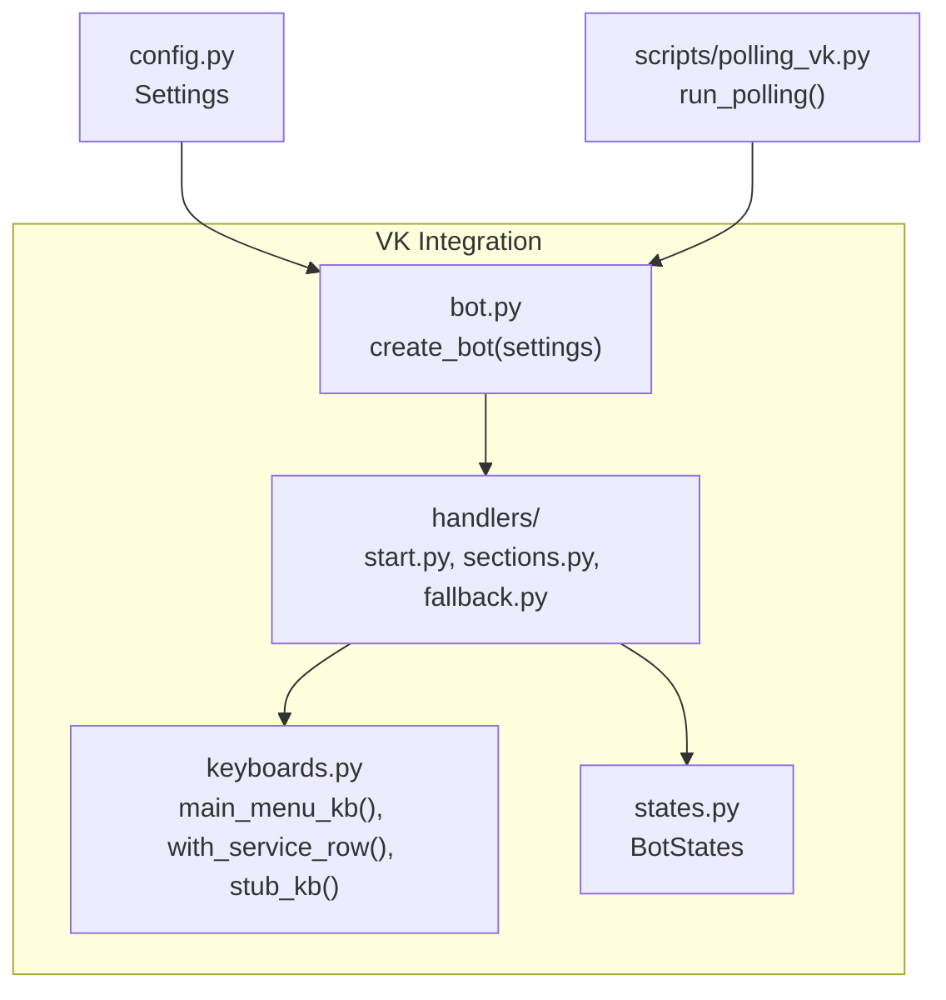
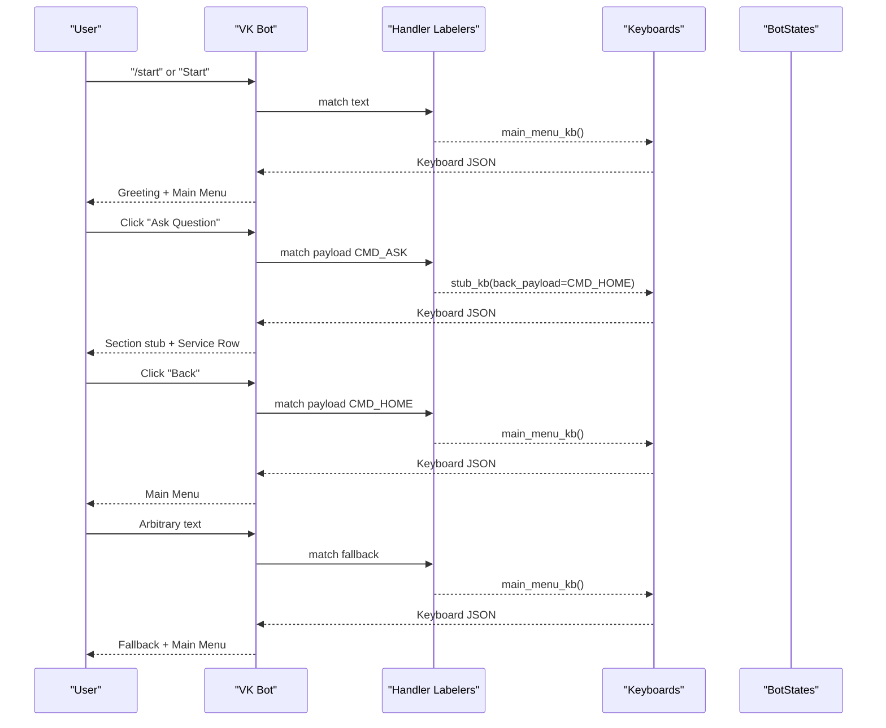
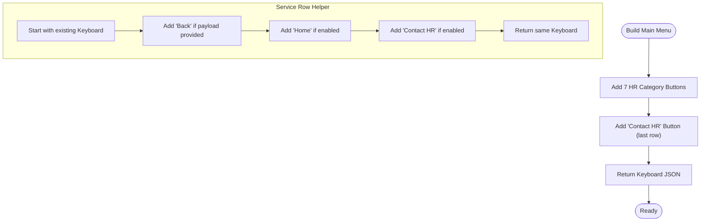
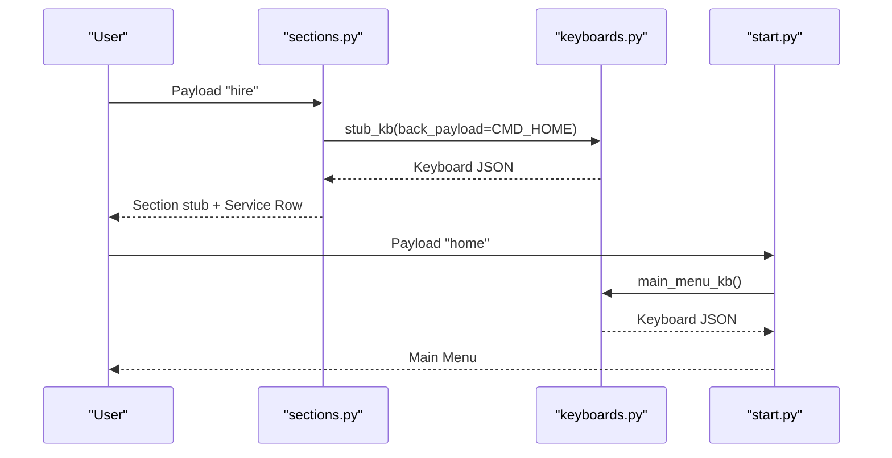
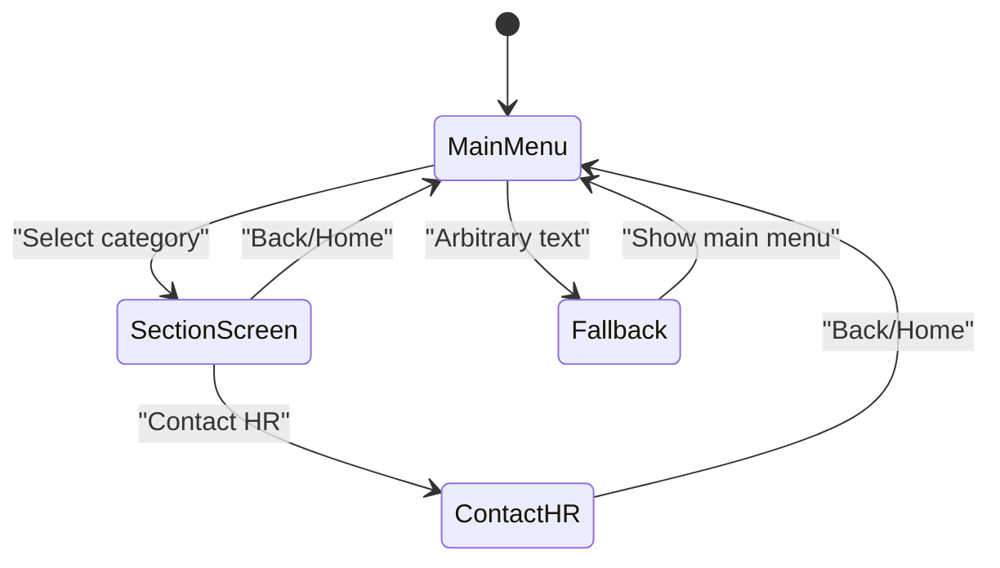
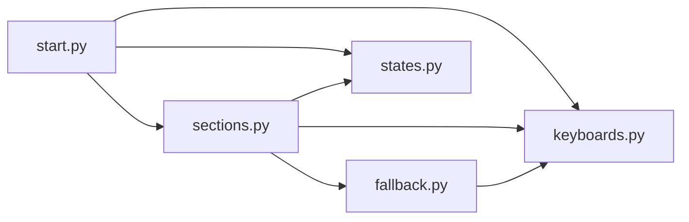

# Main Menu and Navigation

<cite>
**Referenced Files in This Document**
- [bot.py](file://app/integrations/vk/bot.py)
- [keyboards.py](file://app/integrations/vk/keyboards.py)
- [states.py](file://app/integrations/vk/states.py)
- [start.py](file://app/integrations/vk/handlers/start.py)
- [sections.py](file://app/integrations/vk/handlers/sections.py)
- [fallback.py](file://app/integrations/vk/handlers/fallback.py)
- [config.py](file://app/config.py)
- [polling_vk.py](file://scripts/polling_vk.py)
- [test_keyboards.py](file://tests/test_keyboards.py)
- [test_states.py](file://tests/test_states.py)
- [PLAN.md](file://PLAN.md)
</cite>

## Table of Contents
1. [Introduction](#introduction)
2. [Project Structure](#project-structure)
3. [Core Components](#core-components)
4. [Architecture Overview](#architecture-overview)
5. [Detailed Component Analysis](#detailed-component-analysis)
6. [Dependency Analysis](#dependency-analysis)
7. [Performance Considerations](#performance-considerations)
8. [Troubleshooting Guide](#troubleshooting-guide)
9. [Conclusion](#conclusion)
10. [Appendices](#appendices)

## Introduction
This document explains the main menu and navigation system of the VK HR bot. It covers the seven-section HR categories, the main menu structure, service buttons, and navigation patterns. It also documents how user context is maintained across bot states, how to customize menu items, add new categories, and implement complex navigation flows spanning multiple states.

## Project Structure
The VK integration is organized under app/integrations/vk/, with dedicated modules for bot wiring, keyboards, states, and handlers. The bot is created via a factory that loads labelers in a specific order to ensure proper routing.

**Diagram sources**
- [bot.py:23-31](file://app/integrations/vk/bot.py#L23-L31)
- [keyboards.py:56-98](file://app/integrations/vk/keyboards.py#L56-L98)
- [states.py:4-13](file://app/integrations/vk/states.py#L4-L13)
- [start.py:31-54](file://app/integrations/vk/handlers/start.py#L31-L54)
- [sections.py:28-81](file://app/integrations/vk/handlers/sections.py#L28-L81)
- [fallback.py:15-17](file://app/integrations/vk/handlers/fallback.py#L15-L17)
- [config.py:4-9](file://app/config.py#L4-L9)
- [polling_vk.py:24-28](file://scripts/polling_vk.py#L24-L28)

**Section sources**
- [bot.py:14-20](file://app/integrations/vk/bot.py#L14-L20)
- [polling_vk.py:24-28](file://scripts/polling_vk.py#L24-L28)

## Core Components
- Main menu keyboard builder constructs the seven HR categories plus a “Contact HR” button.
- Service buttons (Back, Home, Contact HR) are consistently appended to every keyboard via a shared helper.
- Payload constants define canonical commands for navigation and section entry.
- Handler labelers route messages by payload and text, with fallback catching unmatched text.
- Multi-step dialog states support complex flows like the HR request wizard.

Key responsibilities:
- keyboards.py: Build main menu, service row, and minimal stub keyboards.
- start.py: Handle /start, send main menu, and route Home and Contact HR payloads.
- sections.py: Route to each of the seven HR categories with consistent stub responses and back navigation.
- fallback.py: Catch arbitrary text input and redirect to the main menu.
- states.py: Define multi-step dialog states for complex flows.
- bot.py: Load labelers in order and create the bot instance.

**Section sources**
- [keyboards.py:13-24](file://app/integrations/vk/keyboards.py#L13-L24)
- [keyboards.py:56-98](file://app/integrations/vk/keyboards.py#L56-L98)
- [keyboards.py:29-51](file://app/integrations/vk/keyboards.py#L29-L51)
- [keyboards.py:104-108](file://app/integrations/vk/keyboards.py#L104-L108)
- [start.py:31-54](file://app/integrations/vk/handlers/start.py#L31-L54)
- [sections.py:28-81](file://app/integrations/vk/handlers/sections.py#L28-L81)
- [fallback.py:15-17](file://app/integrations/vk/handlers/fallback.py#L15-L17)
- [states.py:4-13](file://app/integrations/vk/states.py#L4-L13)
- [bot.py:23-31](file://app/integrations/vk/bot.py#L23-L31)

## Architecture Overview
The navigation architecture relies on payload-driven routing with a strict handler load order. The main menu is the central hub; every screen includes service buttons to navigate back, to the main menu, or to contact HR. Fallback ensures users always land on a navigable screen.

**Diagram sources**
- [start.py:31-54](file://app/integrations/vk/handlers/start.py#L31-L54)
- [sections.py:76-81](file://app/integrations/vk/handlers/sections.py#L76-L81)
- [fallback.py:15-17](file://app/integrations/vk/handlers/fallback.py#L15-L17)
- [keyboards.py:56-98](file://app/integrations/vk/keyboards.py#L56-L98)
- [keyboards.py:104-108](file://app/integrations/vk/keyboards.py#L104-L108)

## Detailed Component Analysis

### Main Menu Keyboard and Service Buttons
- The main menu keyboard is built with seven HR category buttons and a “Contact HR” button in the last row.
- The service row helper adds Back/Home/Contact HR buttons to any keyboard, with optional back payload and toggles for Home and HR visibility.
- Stub keyboards are minimal keyboards with only the service row, useful for placeholder screens.

**Diagram sources**
- [keyboards.py:56-98](file://app/integrations/vk/keyboards.py#L56-L98)
- [keyboards.py:29-51](file://app/integrations/vk/keyboards.py#L29-L51)
- [keyboards.py:104-108](file://app/integrations/vk/keyboards.py#L104-L108)

**Section sources**
- [keyboards.py:56-98](file://app/integrations/vk/keyboards.py#L56-L98)
- [keyboards.py:29-51](file://app/integrations/vk/keyboards.py#L29-L51)
- [keyboards.py:104-108](file://app/integrations/vk/keyboards.py#L104-L108)

### Seven-Section HR Categories
The main menu defines seven HR categories. Each category is routed to a handler that responds with a stub message and a keyboard that includes a Back button leading to the main menu.

- Hiring
- Termination
- Vacation
- Payment
- Sick Leave
- Probation
- Ask Question

**Diagram sources**
- [sections.py:28-33](file://app/integrations/vk/handlers/sections.py#L28-L33)
- [sections.py:36-41](file://app/integrations/vk/handlers/sections.py#L36-L41)
- [sections.py:44-49](file://app/integrations/vk/handlers/sections.py#L44-L49)
- [sections.py:52-57](file://app/integrations/vk/handlers/sections.py#L52-L57)
- [sections.py:60-65](file://app/integrations/vk/handlers/sections.py#L60-L65)
- [sections.py:68-73](file://app/integrations/vk/handlers/sections.py#L68-L73)
- [sections.py:76-81](file://app/integrations/vk/handlers/sections.py#L76-L81)
- [start.py:39-41](file://app/integrations/vk/handlers/start.py#L39-L41)
- [keyboards.py:104-108](file://app/integrations/vk/keyboards.py#L104-L108)

**Section sources**
- [sections.py:28-81](file://app/integrations/vk/handlers/sections.py#L28-L81)
- [keyboards.py:13-24](file://app/integrations/vk/keyboards.py#L13-L24)

### Navigation Patterns and User Context
- Back navigation uses a configurable back payload; by default, Back leads to Home.
- Home navigation always returns to the main menu.
- Contact HR is available on every screen and currently returns a placeholder message.
- Fallback routes any unrecognized text back to the main menu, ensuring users remain navigable.
- Multi-step dialogs use BotStates to maintain context across steps.

**Diagram sources**
- [start.py:39-41](file://app/integrations/vk/handlers/start.py#L39-L41)
- [sections.py:28-81](file://app/integrations/vk/handlers/sections.py#L28-L81)
- [fallback.py:15-17](file://app/integrations/vk/handlers/fallback.py#L15-L17)

**Section sources**
- [start.py:39-54](file://app/integrations/vk/handlers/start.py#L39-L54)
- [sections.py:28-81](file://app/integrations/vk/handlers/sections.py#L28-L81)
- [fallback.py:15-17](file://app/integrations/vk/handlers/fallback.py#L15-L17)
- [states.py:4-13](file://app/integrations/vk/states.py#L4-L13)

### Practical Examples

#### Customize a Menu Item
- Modify the label or payload constant for an existing category.
- Update the corresponding handler to change the response or add new steps.
- Ensure the service row is included on the resulting screen.

Example paths:
- Change label or payload: [keyboards.py:13-24](file://app/integrations/vk/keyboards.py#L13-L24)
- Route to handler: [sections.py:28-81](file://app/integrations/vk/handlers/sections.py#L28-L81)
- Include service row: [keyboards.py:29-51](file://app/integrations/vk/keyboards.py#L29-L51)

**Section sources**
- [keyboards.py:13-24](file://app/integrations/vk/keyboards.py#L13-L24)
- [sections.py:28-81](file://app/integrations/vk/handlers/sections.py#L28-L81)
- [keyboards.py:29-51](file://app/integrations/vk/keyboards.py#L29-L51)

#### Add a New Category
- Define a new payload constant.
- Add a new handler for the payload.
- Include the new button in main_menu_kb().
- Optionally add a stub keyboard with the appropriate back payload.

Example paths:
- Define payload: [keyboards.py:13-24](file://app/integrations/vk/keyboards.py#L13-L24)
- Build main menu: [keyboards.py:56-98](file://app/integrations/vk/keyboards.py#L56-L98)
- Add handler: [sections.py:28-81](file://app/integrations/vk/handlers/sections.py#L28-L81)

**Section sources**
- [keyboards.py:13-24](file://app/integrations/vk/keyboards.py#L13-L24)
- [keyboards.py:56-98](file://app/integrations/vk/keyboards.py#L56-L98)
- [sections.py:28-81](file://app/integrations/vk/handlers/sections.py#L28-L81)

#### Implement Complex Navigation Across States
- Use BotStates to define multi-step flows.
- Route state-dependent handlers using state=...
- Maintain context with state transitions and payloads.

Example paths:
- Define states: [states.py:4-13](file://app/integrations/vk/states.py#L4-L13)
- Plan stateful flows: [PLAN.md:61-66](file://PLAN.md#L61-L66)

**Section sources**
- [states.py:4-13](file://app/integrations/vk/states.py#L4-L13)
- [PLAN.md:61-66](file://PLAN.md#L61-L66)

## Dependency Analysis
The bot’s handler labelers are loaded in a specific order to ensure payload handlers take precedence over the fallback. The main menu and service buttons are reused across handlers to maintain consistency.

**Diagram sources**
- [bot.py:16-20](file://app/integrations/vk/bot.py#L16-L20)
- [start.py:31-54](file://app/integrations/vk/handlers/start.py#L31-L54)
- [sections.py:28-81](file://app/integrations/vk/handlers/sections.py#L28-L81)
- [fallback.py:15-17](file://app/integrations/vk/handlers/fallback.py#L15-L17)
- [keyboards.py:56-98](file://app/integrations/vk/keyboards.py#L56-L98)
- [states.py:4-13](file://app/integrations/vk/states.py#L4-L13)

**Section sources**
- [bot.py:16-20](file://app/integrations/vk/bot.py#L16-L20)

## Performance Considerations
- Keyboard construction is lightweight; reuse main_menu_kb() and stub_kb() to minimize duplication.
- Keep payload constants centralized to avoid mismatches and reduce maintenance overhead.
- Prefer stateless handlers for simple screens; use states only when multi-step context is required.

## Troubleshooting Guide
Common issues and resolutions:
- Unexpected text input: Fallback routes to the main menu. Verify fallback handler is loaded last.
  - [fallback.py:15-17](file://app/integrations/vk/handlers/fallback.py#L15-L17)
- Missing Back/Home/Contact HR buttons: Ensure with_service_row() is used on every screen.
  - [keyboards.py:29-51](file://app/integrations/vk/keyboards.py#L29-L51)
- Back does not lead to Home: Confirm back_payload is set to CMD_HOME on stub keyboards.
  - [keyboards.py:104-108](file://app/integrations/vk/keyboards.py#L104-L108)
- Handler not triggered: Verify payload constants match and labelers are loaded in the correct order.
  - [bot.py:16-20](file://app/integrations/vk/bot.py#L16-L20)
- Tests fail for keyboard layout or payloads: Review test coverage for main menu and service row.
  - [test_keyboards.py:49-84](file://tests/test_keyboards.py#L49-L84)
  - [test_keyboards.py:97-150](file://tests/test_keyboards.py#L97-L150)
  - [test_keyboards.py:155-171](file://tests/test_keyboards.py#L155-L171)
  - [test_keyboards.py:176-192](file://tests/test_keyboards.py#L176-L192)
- Multi-step states not recognized: Ensure BotStates values are unique and correctly referenced.
  - [test_states.py:8-31](file://tests/test_states.py#L8-L31)

**Section sources**
- [fallback.py:15-17](file://app/integrations/vk/handlers/fallback.py#L15-L17)
- [keyboards.py:29-51](file://app/integrations/vk/keyboards.py#L29-L51)
- [keyboards.py:104-108](file://app/integrations/vk/keyboards.py#L104-L108)
- [bot.py:16-20](file://app/integrations/vk/bot.py#L16-L20)
- [test_keyboards.py:49-84](file://tests/test_keyboards.py#L49-L84)
- [test_keyboards.py:97-150](file://tests/test_keyboards.py#L97-L150)
- [test_keyboards.py:155-171](file://tests/test_keyboards.py#L155-L171)
- [test_keyboards.py:176-192](file://tests/test_keyboards.py#L176-L192)
- [test_states.py:8-31](file://tests/test_states.py#L8-L31)

## Conclusion
The VK HR bot’s navigation system centers on a consistent main menu and service buttons, payload-driven routing, and a fallback mechanism to keep users navigable. The modular design of keyboards and handlers enables easy customization and extension. Multi-step flows are supported via BotStates, allowing complex navigation across multiple bot states while maintaining user context.

## Appendices

### Payload Constants Reference
- Home: CMD_HOME
- Back: CMD_BACK
- Contact HR: CMD_CONTACT_HR
- Hiring: CMD_HIRE
- Termination: CMD_FIRE
- Vacation: CMD_VACATION
- Payment: CMD_PAY
- Sick Leave: CMD_SICK
- Probation: CMD_PROBATION
- Ask Question: CMD_ASK

**Section sources**
- [keyboards.py:13-24](file://app/integrations/vk/keyboards.py#L13-L24)

### Running the Bot Locally
- Use the local polling script to start the bot in long-polling mode.
- Ensure environment variables for VK credentials are configured.

**Section sources**
- [polling_vk.py:24-28](file://scripts/polling_vk.py#L24-L28)
- [config.py:4-9](file://app/config.py#L4-L9)