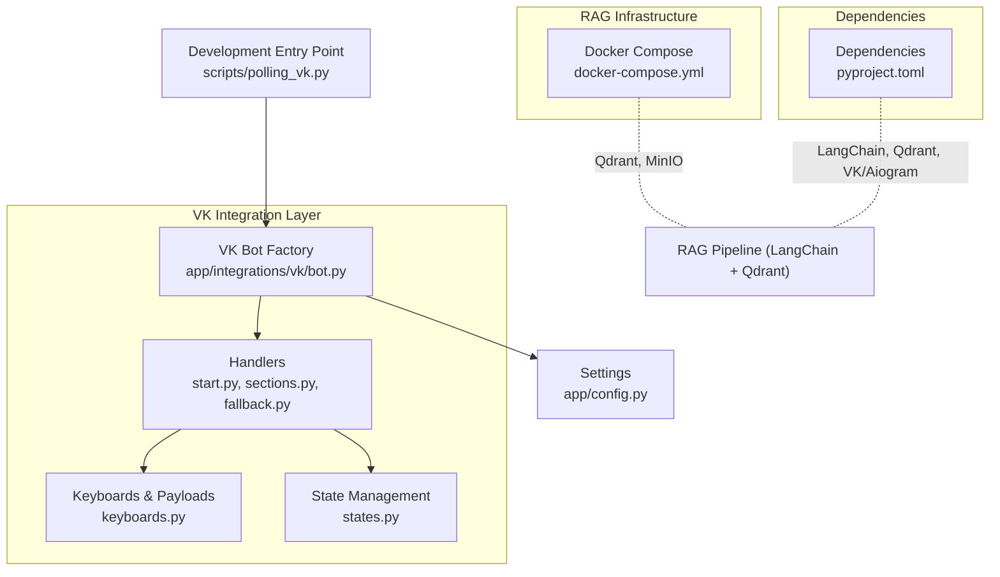
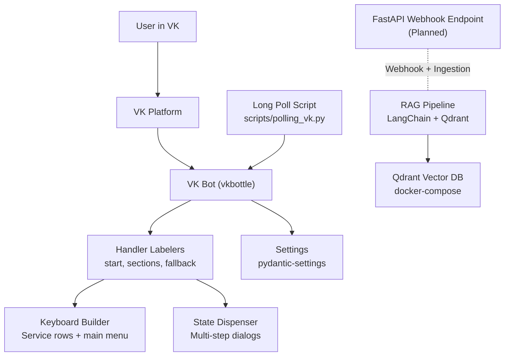
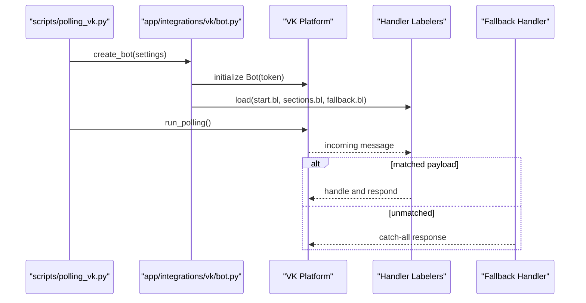
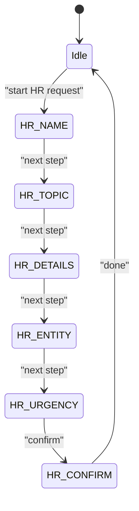
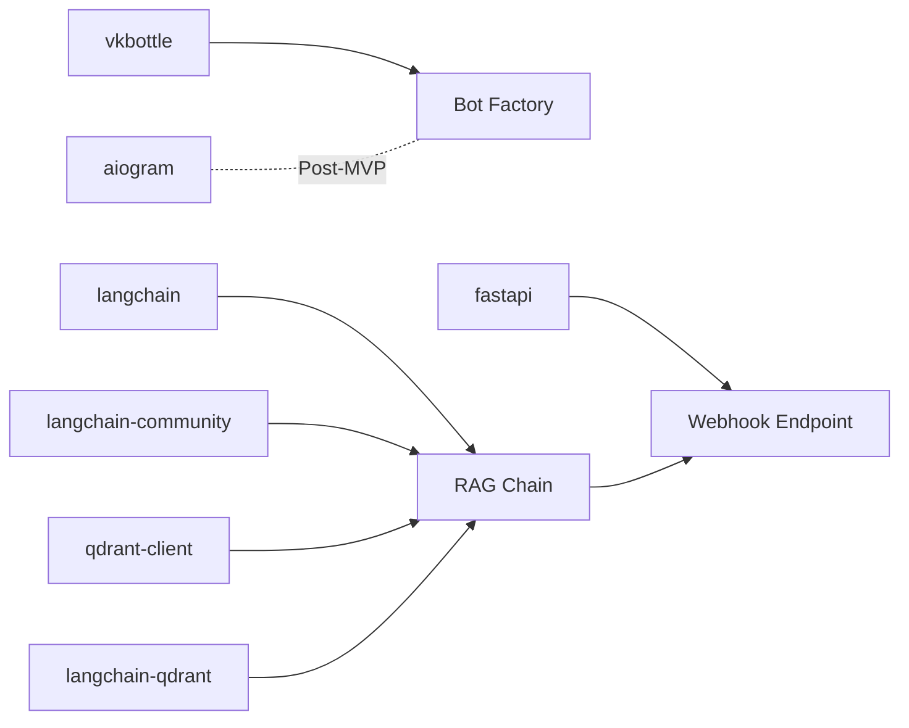

# Project Overview

<cite>
**Referenced Files in This Document**
- [PLAN.md](file://PLAN.md)
- [AGENTS.md](file://AGENTS.md)
- [app/config.py](file://app/config.py)
- [app/integrations/vk/bot.py](file://app/integrations/vk/bot.py)
- [app/integrations/vk/keyboards.py](file://app/integrations/vk/keyboards.py)
- [app/integrations/vk/states.py](file://app/integrations/vk/states.py)
- [app/integrations/vk/handlers/start.py](file://app/integrations/vk/handlers/start.py)
- [app/integrations/vk/handlers/sections.py](file://app/integrations/vk/handlers/sections.py)
- [app/integrations/vk/handlers/fallback.py](file://app/integrations/vk/handlers/fallback.py)
- [scripts/polling_vk.py](file://scripts/polling_vk.py)
- [docker-compose.yml](file://docker-compose.yml)
- [pyproject.toml](file://pyproject.toml)
- [tests/test_bot_factory.py](file://tests/test_bot_factory.py)
</cite>

## Table of Contents
1. [Introduction](#introduction)
2. [Project Structure](#project-structure)
3. [Core Components](#core-components)
4. [Architecture Overview](#architecture-overview)
5. [Detailed Component Analysis](#detailed-component-analysis)
6. [Dependency Analysis](#dependency-analysis)
7. [Performance Considerations](#performance-considerations)
8. [Troubleshooting Guide](#troubleshooting-guide)
9. [Conclusion](#conclusion)
10. [Appendices](#appendices)

## Introduction
Cafetera HR-bot is an HR assistance bot designed for Russian-speaking users through VKontakte (VK) integration. Its primary goal is to help employees quickly locate documents, templates, and answers to personnel-related questions, while offering a seamless conversational experience. The project targets internal corporate communication needs, focusing on click-driven navigation and a gradual rollout of Retrieval-Augmented Generation (RAG) capabilities powered by LangChain and Qdrant.

Why this solution was chosen:
- VK is the primary channel for internal communications, aligning with the project’s production focus on webhook deployments and the established ecosystem.
- The stack leverages proven libraries: vkbottle for VK, pydantic-settings for configuration, and LangChain with Qdrant for scalable RAG.
- The layered architecture separates transport, domain logic, and RAG concerns, enabling incremental development and maintainability.

Scope and vision:
- Phase 1 delivers a fully functional click-based navigator with Long Polling, robust fallback handling, and RAG stubs.
- Phase 2 introduces a full RAG pipeline with document ingestion, dense retrieval, and contextual prompts, replacing stubs with real answers.
- Future roadmap includes expanding to secondary channels (e.g., Telegram), webhook deployment, and advanced integrations (e.g., auto-submission of HR requests).

**Section sources**
- [PLAN.md:5-20](file://PLAN.md#L5-L20)
- [AGENTS.md:6-18](file://AGENTS.md#L6-L18)
- [AGENTS.md:52-56](file://AGENTS.md#L52-L56)

## Project Structure
The repository follows a layered architecture:
- app/integrations/vk: VK-specific adapters, handlers, keyboards, and states
- app/config.py: Centralized settings using pydantic-settings
- scripts: Local development entry-points (Long Polling)
- docker-compose.yml: RAG infrastructure (Qdrant) and auxiliary services (MinIO)
- pyproject.toml: Dependencies including FastAPI, LangChain, Qdrant, and VK/Aiogram integrations

**Diagram sources**
- [app/integrations/vk/bot.py:23-31](file://app/integrations/vk/bot.py#L23-L31)
- [app/integrations/vk/handlers/start.py:31-41](file://app/integrations/vk/handlers/start.py#L31-L41)
- [app/integrations/vk/handlers/sections.py:28-81](file://app/integrations/vk/handlers/sections.py#L28-L81)
- [app/integrations/vk/keyboards.py:56-98](file://app/integrations/vk/keyboards.py#L56-L98)
- [app/integrations/vk/states.py:4-14](file://app/integrations/vk/states.py#L4-L14)
- [app/config.py:4-9](file://app/config.py#L4-L9)
- [scripts/polling_vk.py:24-28](file://scripts/polling_vk.py#L24-L28)
- [docker-compose.yml:1-34](file://docker-compose.yml#L1-L34)
- [pyproject.toml:7-22](file://pyproject.toml#L7-L22)

**Section sources**
- [AGENTS.md:52-56](file://AGENTS.md#L52-L56)
- [pyproject.toml:7-22](file://pyproject.toml#L7-L22)
- [docker-compose.yml:1-34](file://docker-compose.yml#L1-L34)

## Core Components
- VK Bot Factory: Creates a fully wired vkbottle Bot and loads labelers in a specific order to ensure proper routing and fallback handling.
- Handler System: Payload-driven routing for main menu actions and section entry points, with a fallback handler catching unmatched text.
- Keyboard System: Standardized service buttons (Back, Home, Contact HR) and the main menu layout, ensuring consistent UX across screens.
- State Management: Multi-step dialog states for structured flows (e.g., HR request wizard), backed by vkbottle’s state dispenser.
- Configuration: Strongly-typed settings via pydantic-settings, supporting environment-based configuration for tokens and endpoints.
- Development Entry Point: Long Polling script initializes the bot and runs it locally for rapid iteration.

How they work together:
- The bot factory registers handlers in order, ensuring the fallback labeler is last.
- Handlers respond to payload actions and render keyboards with service rows.
- States track user context during multi-step dialogs.
- The development script wires up the bot and starts Long Polling for immediate testing.

**Section sources**
- [app/integrations/vk/bot.py:14-31](file://app/integrations/vk/bot.py#L14-L31)
- [app/integrations/vk/handlers/start.py:31-54](file://app/integrations/vk/handlers/start.py#L31-L54)
- [app/integrations/vk/handlers/sections.py:28-81](file://app/integrations/vk/handlers/sections.py#L28-L81)
- [app/integrations/vk/handlers/fallback.py:15-17](file://app/integrations/vk/handlers/fallback.py#L15-L17)
- [app/integrations/vk/keyboards.py:29-50](file://app/integrations/vk/keyboards.py#L29-L50)
- [app/integrations/vk/states.py:4-14](file://app/integrations/vk/states.py#L4-L14)
- [app/config.py:4-9](file://app/config.py#L4-L9)
- [scripts/polling_vk.py:24-28](file://scripts/polling_vk.py#L24-L28)
- [tests/test_bot_factory.py:8-21](file://tests/test_bot_factory.py#L8-L21)

## Architecture Overview
The system is designed with clear separation of concerns:
- Transport Layer: VK adapter (vkbottle) handles incoming events and dispatches to handlers.
- Domain Layer: Handlers encapsulate business logic for navigation, section entry, and fallback behavior.
- RAG Layer: Planned integration with LangChain and Qdrant for retrieval-augmented answers, with Qdrant orchestrated via docker-compose.
- Infrastructure: FastAPI for production webhooks and document ingestion endpoints; MinIO for file storage.

**Diagram sources**
- [app/integrations/vk/bot.py:23-31](file://app/integrations/vk/bot.py#L23-L31)
- [app/integrations/vk/handlers/start.py:31-41](file://app/integrations/vk/handlers/start.py#L31-L41)
- [app/integrations/vk/handlers/sections.py:28-81](file://app/integrations/vk/handlers/sections.py#L28-L81)
- [app/integrations/vk/handlers/fallback.py:15-17](file://app/integrations/vk/handlers/fallback.py#L15-L17)
- [app/integrations/vk/keyboards.py:29-50](file://app/integrations/vk/keyboards.py#L29-L50)
- [app/integrations/vk/states.py:4-14](file://app/integrations/vk/states.py#L4-L14)
- [app/config.py:4-9](file://app/config.py#L4-L9)
- [scripts/polling_vk.py:24-28](file://scripts/polling_vk.py#L24-L28)
- [docker-compose.yml:1-34](file://docker-compose.yml#L1-L34)
- [AGENTS.md:52-56](file://AGENTS.md#L52-L56)

## Detailed Component Analysis

### VK Bot Factory and Handler Wiring
The bot factory constructs a vkbottle Bot and loads labelers in a strict order to ensure deterministic routing. The fallback labeler is intentionally loaded last so it only matches messages not handled by earlier handlers.

**Diagram sources**
- [app/integrations/vk/bot.py:23-31](file://app/integrations/vk/bot.py#L23-L31)
- [app/integrations/vk/handlers/start.py:31-41](file://app/integrations/vk/handlers/start.py#L31-L41)
- [app/integrations/vk/handlers/sections.py:28-81](file://app/integrations/vk/handlers/sections.py#L28-L81)
- [app/integrations/vk/handlers/fallback.py:15-17](file://app/integrations/vk/handlers/fallback.py#L15-L17)
- [scripts/polling_vk.py:24-28](file://scripts/polling_vk.py#L24-L28)

**Section sources**
- [app/integrations/vk/bot.py:14-31](file://app/integrations/vk/bot.py#L14-L31)
- [tests/test_bot_factory.py:8-21](file://tests/test_bot_factory.py#L8-L21)

### Keyboard System and Navigation UX
The keyboard system enforces a consistent UX pattern with service buttons (Back, Home, Contact HR) on every screen. The main menu presents seven primary sections aligned with the project’s feature set.

**Diagram sources**
- [app/integrations/vk/handlers/start.py:14-25](file://app/integrations/vk/handlers/start.py#L14-L25)
- [app/integrations/vk/keyboards.py:56-98](file://app/integrations/vk/keyboards.py#L56-L98)
- [app/integrations/vk/keyboards.py:29-50](file://app/integrations/vk/keyboards.py#L29-L50)

**Section sources**
- [app/integrations/vk/keyboards.py:13-50](file://app/integrations/vk/keyboards.py#L13-L50)
- [app/integrations/vk/keyboards.py:56-98](file://app/integrations/vk/keyboards.py#L56-L98)
- [app/integrations/vk/handlers/start.py:14-25](file://app/integrations/vk/handlers/start.py#L14-L25)

### State Management for Multi-Step Dialogs
State management enables structured flows such as the HR request wizard. States are defined as typed keys and managed by vkbottle’s state dispenser, allowing stepwise progression and context preservation.

**Diagram sources**
- [app/integrations/vk/states.py:4-14](file://app/integrations/vk/states.py#L4-L14)

**Section sources**
- [app/integrations/vk/states.py:4-14](file://app/integrations/vk/states.py#L4-L14)

### Configuration and Environment
Centralized configuration via pydantic-settings supports environment-based tokens and endpoints. The VK access token and group ID are the minimum required settings for bot initialization.

**Section sources**
- [app/config.py:4-9](file://app/config.py#L4-L9)

### Development and Deployment Entrypoints
Local development runs the bot in Long Poll mode using a dedicated script. Production is intended to use FastAPI webhooks with lifecycle initialization (planned), avoiding polling in production environments.

**Section sources**
- [scripts/polling_vk.py:24-28](file://scripts/polling_vk.py#L24-L28)
- [AGENTS.md:16-18](file://AGENTS.md#L16-L18)

## Dependency Analysis
External dependencies include VK/Aiogram integrations, LangChain, Qdrant, and FastAPI. These enable:
- VK event handling and message routing
- RAG pipeline orchestration
- Vector storage and retrieval
- Webhook-based production deployments

**Diagram sources**
- [pyproject.toml:7-22](file://pyproject.toml#L7-L22)
- [docker-compose.yml:1-34](file://docker-compose.yml#L1-L34)

**Section sources**
- [pyproject.toml:7-22](file://pyproject.toml#L7-L22)
- [docker-compose.yml:1-34](file://docker-compose.yml#L1-L34)

## Performance Considerations
- Use production-grade webhooks instead of Long Polling for scalability and lower latency.
- Keep handler logic lightweight; delegate heavy operations to background tasks or RAG pipeline.
- Cache frequently accessed static content (e.g., main menu) to reduce response times.
- Monitor Qdrant performance and tune collection settings for retrieval speed.

## Troubleshooting Guide
Common issues and resolutions:
- Handlers not firing: Verify the fallback handler is last and payload routes match expectations.
- Keyboard rendering problems: Ensure service rows are appended consistently and payloads are correctly formed.
- State transitions failing: Confirm state keys match and state dispenser is properly initialized.
- Environment configuration: Validate settings loading and token correctness.

**Section sources**
- [tests/test_bot_factory.py:8-21](file://tests/test_bot_factory.py#L8-L21)
- [app/integrations/vk/keyboards.py:29-50](file://app/integrations/vk/keyboards.py#L29-L50)
- [app/integrations/vk/states.py:4-14](file://app/integrations/vk/states.py#L4-L14)
- [app/config.py:4-9](file://app/config.py#L4-L9)

## Conclusion
Cafetera HR-bot provides a solid foundation for HR assistance in Russian-speaking organizations via VK. Its layered architecture, payload-driven handler system, and standardized keyboard UX enable rapid feature delivery. The planned RAG integration with LangChain and Qdrant will further enhance the bot’s ability to provide accurate, context-aware answers while maintaining a clear separation between transport, domain, and retrieval logic.

## Appendices
- Roadmap highlights:
  - Phase 1: Click-based navigator with RAG stubs and robust fallback handling
  - Phase 2: Full RAG pipeline with document ingestion and contextual prompts
  - Post-MVP: Secondary channels, webhook deployments, and advanced integrations

**Section sources**
- [PLAN.md:113-121](file://PLAN.md#L113-L121)
- [PLAN.md:188-194](file://PLAN.md#L188-L194)
- [PLAN.md:197-207](file://PLAN.md#L197-L207)