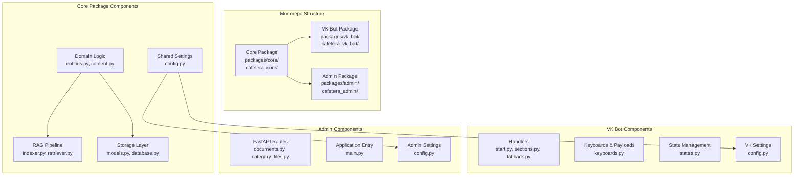
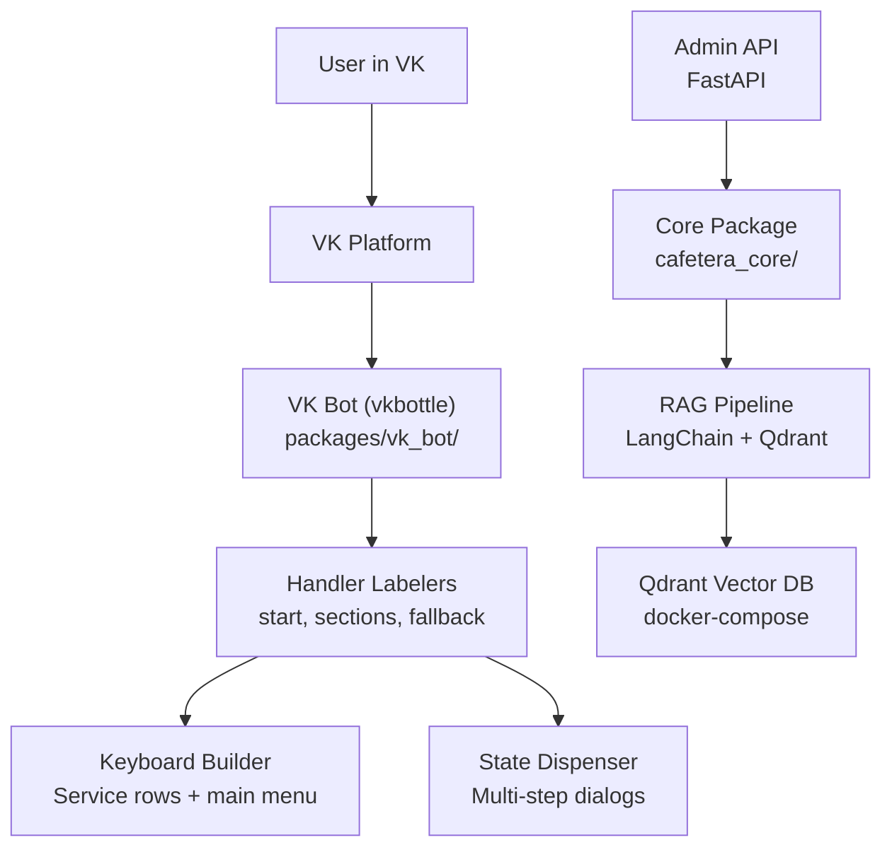
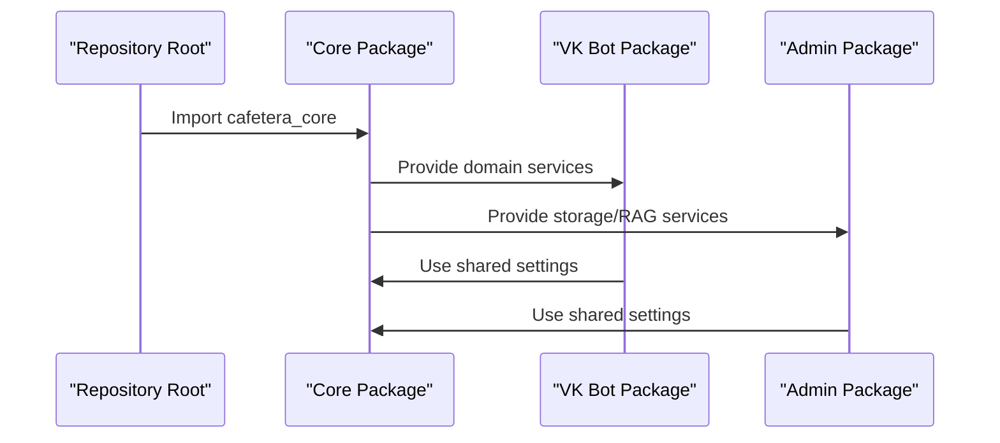
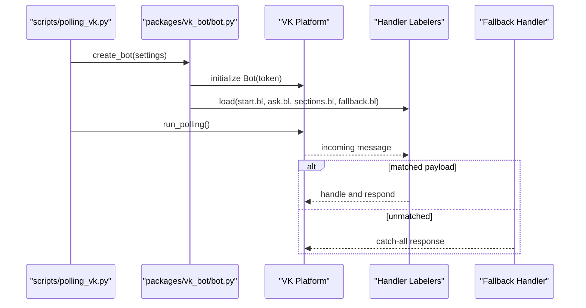
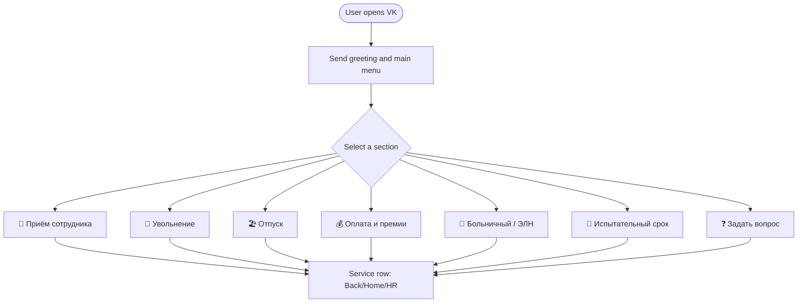
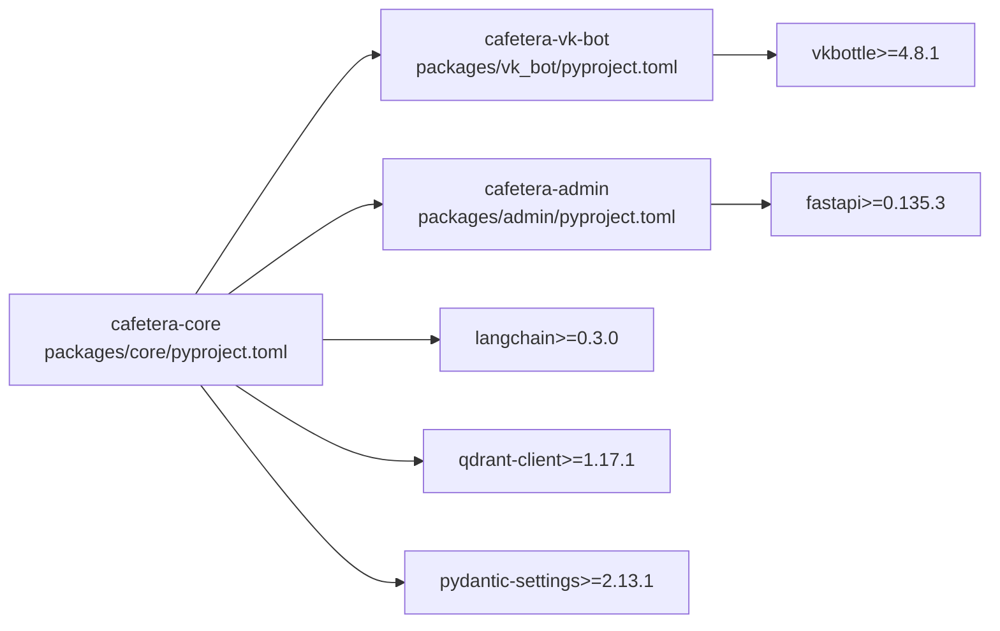

# Project Overview

<cite>
**Referenced Files in This Document**
- [pyproject.toml](file://pyproject.toml)
- [packages/core/pyproject.toml](file://packages/core/pyproject.toml)
- [packages/vk_bot/pyproject.toml](file://packages/vk_bot/pyproject.toml)
- [packages/admin/pyproject.toml](file://packages/admin/pyproject.toml)
- [packages/core/src/cafetera_core/config.py](file://packages/core/src/cafetera_core/config.py)
- [packages/vk_bot/src/cafetera_vk_bot/config.py](file://packages/vk_bot/src/cafetera_vk_bot/config.py)
- [packages/admin/src/cafetera_admin/config.py](file://packages/admin/src/cafetera_admin/config.py)
- [packages/core/src/cafetera_core/domain/entities.py](file://packages/core/src/cafetera_core/domain/entities.py)
- [packages/core/src/cafetera_core/rag/indexer.py](file://packages/core/src/cafetera_core/rag/indexer.py)
- [packages/core/src/cafetera_core/storage/models.py](file://packages/core/src/cafetera_core/storage/models.py)
- [packages/vk_bot/src/cafetera_vk_bot/bot.py](file://packages/vk_bot/src/cafetera_vk_bot/bot.py)
- [packages/vk_bot/src/cafetera_vk_bot/handlers/start.py](file://packages/vk_bot/src/cafetera_vk_bot/handlers/start.py)
- [packages/vk_bot/src/cafetera_vk_bot/keyboards.py](file://packages/vk_bot/src/cafetera_vk_bot/keyboards.py)
- [packages/admin/src/cafetera_admin/main.py](file://packages/admin/src/cafetera_admin/main.py)
- [scripts/polling_vk.py](file://scripts/polling_vk.py)
- [docker-compose.yml](file://docker-compose.yml)
- [tests/test_bot_factory.py](file://tests/test_bot_factory.py)
</cite>

## Update Summary
**Changes Made**
- Updated monorepo package architecture documentation to reflect new hierarchical structure
- Enhanced package-based configuration system with clear inheritance patterns
- Added detailed dependency relationships between core, admin, and vk_bot packages
- Updated component relationships to show improved interdependencies
- Revised architecture diagrams to reflect the new package-based design

## Table of Contents
1. [Introduction](#introduction)
2. [Project Structure](#project-structure)
3. [Core Components](#core-components)
4. [Architecture Overview](#architecture-overview)
5. [Detailed Component Analysis](#detailed-component-analysis)
6. [Dependency Analysis](#dependency-analysis)
7. [Performance Considerations](#performance-considerations)
8. [Troubleshooting Guide](#troubleshooting-guide)
9. [Conclusion](#conclusion)
10. [Appendices](#appendices)

## Introduction
Cafetera HR-bot is an HR assistance bot designed for Russian-speaking users through VKontakte (VK) integration. Its primary goal is to help employees quickly locate documents, templates, and answers to personnel-related questions, while offering a seamless conversational experience. The project targets internal corporate communication needs, focusing on click-driven navigation and a gradual rollout of Retrieval-Augmented Generation (RAG) capabilities powered by LangChain and Qdrant.

Why this solution was chosen:
- VK is the primary channel for internal communications, aligning with the project's production focus on webhook deployments and the established ecosystem.
- The stack leverages proven libraries: vkbottle for VK, pydantic-settings for configuration, and LangChain with Qdrant for scalable RAG.
- The hierarchical monorepo architecture separates transport, domain logic, and RAG concerns, enabling incremental development and maintainability across multiple packages.

Scope and vision:
- Phase 1 delivers a fully functional click-based navigator with Long Polling, robust fallback handling, and RAG stubs.
- Phase 2 introduces a full RAG pipeline with document ingestion, dense retrieval, and contextual prompts, replacing stubs with real answers.
- Future roadmap includes expanding to secondary channels (e.g., Telegram), webhook deployment, and advanced integrations (e.g., auto-submission of HR requests).

**Section sources**
- [pyproject.toml:1-49](file://pyproject.toml#L1-L49)

## Project Structure
The repository now follows a hierarchical monorepo structure with three main packages:

**Core Package** (`packages/core/`): Contains shared domain logic, RAG pipeline, and storage abstractions
- `src/cafetera_core/`: Core domain services, RAG components, and storage layer
- Shared configuration and utilities used across all packages

**VK Bot Package** (`packages/vk_bot/`): VK-specific integration and user interface
- `src/cafetera_vk_bot/`: VK bot factory, handlers, keyboards, and state management
- VK-specific configuration and bot wiring

**Admin Package** (`packages/admin/`): Web-based administration interface
- `src/cafetera_admin/`: FastAPI application, admin APIs, and web UI components
- Admin-specific configuration and resource management

**Diagram sources**
- [packages/core/src/cafetera_core/config.py:14-71](file://packages/core/src/cafetera_core/config.py#L14-L71)
- [packages/core/src/cafetera_core/domain/entities.py:8-24](file://packages/core/src/cafetera_core/domain/entities.py#L8-L24)
- [packages/core/src/cafetera_core/rag/indexer.py:1-50](file://packages/core/src/cafetera_core/rag/indexer.py#L1-L50)
- [packages/core/src/cafetera_core/storage/models.py:1-50](file://packages/core/src/cafetera_core/storage/models.py#L1-L50)
- [packages/vk_bot/src/cafetera_vk_bot/bot.py:42-56](file://packages/vk_bot/src/cafetera_vk_bot/bot.py#L42-L56)
- [packages/vk_bot/src/cafetera_vk_bot/config.py:4-16](file://packages/vk_bot/src/cafetera_vk_bot/config.py#L4-L16)
- [packages/admin/src/cafetera_admin/config.py:6-20](file://packages/admin/src/cafetera_admin/config.py#L6-L20)

**Section sources**
- [pyproject.toml:22-28](file://pyproject.toml#L22-L28)
- [packages/core/pyproject.toml:1-29](file://packages/core/pyproject.toml#L1-L29)
- [packages/vk_bot/pyproject.toml:1-17](file://packages/vk_bot/pyproject.toml#L1-L17)
- [packages/admin/pyproject.toml:1-20](file://packages/admin/pyproject.toml#L1-L20)

## Core Components
The monorepo structure enables better separation of concerns through specialized packages:

**Core Package Components:**
- **Domain Services**: Legal entities, document processing, and QA services
- **RAG Pipeline**: Indexing, parsing, embeddings, and retrieval components
- **Storage Layer**: Database models, repositories, and S3 integration
- **Shared Configuration**: Unified settings for LLMs, embeddings, and storage

**VK Bot Package Components:**
- **VK Bot Factory**: Creates a fully wired vkbottle Bot with ordered handler registration
- **Handler System**: Payload-driven routing for main menu actions and section entry points
- **Keyboard System**: Standardized service buttons and main menu layout
- **State Management**: Multi-step dialog states for structured flows
- **VK Configuration**: VK-specific settings and environment variables

**Admin Package Components:**
- **FastAPI Application**: Lifespan-managed application with resource initialization
- **Admin APIs**: Document management, category files, and bulk operations
- **Web Interface**: HTMX-based admin UI with static assets and templates
- **Resource Management**: S3, database, and RAG client lifecycle management

**Section sources**
- [packages/core/src/cafetera_core/config.py:14-71](file://packages/core/src/cafetera_core/config.py#L14-L71)
- [packages/vk_bot/src/cafetera_vk_bot/bot.py:42-56](file://packages/vk_bot/src/cafetera_vk_bot/bot.py#L42-L56)
- [packages/vk_bot/src/cafetera_vk_bot/config.py:4-16](file://packages/vk_bot/src/cafetera_vk_bot/config.py#L4-L16)
- [packages/admin/src/cafetera_admin/config.py:6-20](file://packages/admin/src/cafetera_admin/config.py#L6-L20)
- [packages/admin/src/cafetera_admin/main.py:59-88](file://packages/admin/src/cafetera_admin/main.py#L59-L88)

## Architecture Overview
The system maintains clear separation of concerns through the monorepo package structure:

**Transport Layer**: VK adapter (vkbottle) in the VK bot package handles incoming events and dispatches to handlers.

**Domain Layer**: Core package encapsulates business logic for documents, entities, and RAG processing.

**RAG Layer**: Core package provides the complete RAG pipeline with LangChain and Qdrant integration.

**Infrastructure Layer**: Admin package provides FastAPI endpoints for document ingestion and management.

**Diagram sources**
- [packages/vk_bot/src/cafetera_vk_bot/bot.py:42-56](file://packages/vk_bot/src/cafetera_vk_bot/bot.py#L42-L56)
- [packages/vk_bot/src/cafetera_vk_bot/handlers/start.py:14-25](file://packages/vk_bot/src/cafetera_vk_bot/handlers/start.py#L14-L25)
- [packages/vk_bot/src/cafetera_vk_bot/keyboards.py:56-98](file://packages/vk_bot/src/cafetera_vk_bot/keyboards.py#L56-L98)
- [packages/core/src/cafetera_core/config.py:23-46](file://packages/core/src/cafetera_core/config.py#L23-L46)
- [packages/admin/src/cafetera_admin/main.py:59-88](file://packages/admin/src/cafetera_admin/main.py#L59-L88)

## Detailed Component Analysis

### Monorepo Package Architecture
The hierarchical structure enables better modularity and code reuse across different deployment targets.

**Core Package Benefits:**
- Single source of truth for domain logic and RAG components
- Shared configuration and utilities across all packages
- Consistent interfaces for different transport layers

**Package Interdependencies:**
- VK Bot depends on Core for domain logic and RAG services
- Admin depends on Core for document management and storage
- Core has no dependencies on transport-specific packages

**Diagram sources**
- [packages/core/pyproject.toml:1-29](file://packages/core/pyproject.toml#L1-L29)
- [packages/vk_bot/pyproject.toml:6-9](file://packages/vk_bot/pyproject.toml#L6-L9)
- [packages/admin/pyproject.toml:6-12](file://packages/admin/pyproject.toml#L6-L12)

**Section sources**
- [pyproject.toml:22-28](file://pyproject.toml#L22-L28)
- [packages/core/pyproject.toml:1-29](file://packages/core/pyproject.toml#L1-L29)
- [packages/vk_bot/pyproject.toml:1-17](file://packages/vk_bot/pyproject.toml#L1-L17)
- [packages/admin/pyproject.toml:1-20](file://packages/admin/pyproject.toml#L1-L20)

### Package-Based Configuration System
The enhanced configuration system provides clear inheritance patterns and environment variable isolation:

**Core Settings**: Centralized configuration with shared RAG, storage, and LLM settings
**VK Settings**: Extends CoreSettings with VK-specific tokens and group IDs
**Admin Settings**: Extends CoreSettings with admin API keys and web interface configuration

Each package maintains its own configuration class while inheriting shared settings, ensuring environment variables can coexist across different components.

**Section sources**
- [packages/core/src/cafetera_core/config.py:14-71](file://packages/core/src/cafetera_core/config.py#L14-L71)
- [packages/vk_bot/src/cafetera_vk_bot/config.py:4-16](file://packages/vk_bot/src/cafetera_vk_bot/config.py#L4-L16)
- [packages/admin/src/cafetera_admin/config.py:6-20](file://packages/admin/src/cafetera_admin/config.py#L6-L20)

### VK Bot Factory and Handler Wiring
The bot factory constructs a vkbottle Bot and loads labelers in a strict order to ensure deterministic routing. The fallback labeler is intentionally loaded last so it only matches messages not handled by earlier handlers.

**Diagram sources**
- [packages/vk_bot/src/cafetera_vk_bot/bot.py:42-56](file://packages/vk_bot/src/cafetera_vk_bot/bot.py#L42-L56)
- [packages/vk_bot/src/cafetera_vk_bot/handlers/start.py:31-41](file://packages/vk_bot/src/cafetera_vk_bot/handlers/start.py#L31-L41)
- [packages/vk_bot/src/cafetera_vk_bot/keyboards.py:29-50](file://packages/vk_bot/src/cafetera_vk_bot/keyboards.py#L29-L50)
- [scripts/polling_vk.py:24-28](file://scripts/polling_vk.py#L24-L28)

**Section sources**
- [packages/vk_bot/src/cafetera_vk_bot/bot.py:42-56](file://packages/vk_bot/src/cafetera_vk_bot/bot.py#L42-L56)
- [tests/test_bot_factory.py:8-21](file://tests/test_bot_factory.py#L8-L21)

### Keyboard System and Navigation UX
The keyboard system enforces a consistent UX pattern with service buttons (Back, Home, Contact HR) on every screen. The main menu presents seven primary sections aligned with the project's feature set.

**Diagram sources**
- [packages/vk_bot/src/cafetera_vk_bot/handlers/start.py:14-25](file://packages/vk_bot/src/cafetera_vk_bot/handlers/start.py#L14-L25)
- [packages/vk_bot/src/cafetera_vk_bot/keyboards.py:56-98](file://packages/vk_bot/src/cafetera_vk_bot/keyboards.py#L56-L98)
- [packages/vk_bot/src/cafetera_vk_bot/keyboards.py:29-50](file://packages/vk_bot/src/cafetera_vk_bot/keyboards.py#L29-L50)

**Section sources**
- [packages/vk_bot/src/cafetera_vk_bot/keyboards.py:13-50](file://packages/vk_bot/src/cafetera_vk_bot/keyboards.py#L13-L50)
- [packages/vk_bot/src/cafetera_vk_bot/keyboards.py:56-98](file://packages/vk_bot/src/cafetera_vk_bot/keyboards.py#L56-L98)
- [packages/vk_bot/src/cafetera_vk_bot/handlers/start.py:14-25](file://packages/vk_bot/src/cafetera_vk_bot/handlers/start.py#L14-L25)

### Domain Entities and Legal Structure
The core package defines legal entity structures used across HR flows, ensuring consistent representation of company entities throughout the system.

**Section sources**
- [packages/core/src/cafetera_core/domain/entities.py:8-24](file://packages/core/src/cafetera_core/domain/entities.py#L8-L24)

### RAG Indexing and Storage Operations
The core package provides comprehensive RAG operations including document chunking, embedding computation, and Qdrant vector storage management.

**Section sources**
- [packages/core/src/cafetera_core/rag/indexer.py:51-133](file://packages/core/src/cafetera_core/rag/indexer.py#L51-L133)
- [packages/core/src/cafetera_core/storage/models.py:20-37](file://packages/core/src/cafetera_core/storage/models.py#L20-L37)

### Admin Application Lifecycle Management
The admin package manages application resources through FastAPI lifespan context, ensuring proper initialization and cleanup of database connections, S3 clients, and RAG components.

**Section sources**
- [packages/admin/src/cafetera_admin/main.py:38-88](file://packages/admin/src/cafetera_admin/main.py#L38-L88)

### Development and Deployment Entrypoints
Local development runs the bot in Long Poll mode using a dedicated script. Production deployments use FastAPI webhooks with lifecycle initialization, avoiding polling in production environments.

**Section sources**
- [scripts/polling_vk.py:24-28](file://scripts/polling_vk.py#L24-L28)

## Dependency Analysis
The monorepo structure enables better dependency management through explicit package boundaries:

**Core Package Dependencies**: LangChain, Qdrant, PostgreSQL, and storage clients
**VK Bot Dependencies**: Core package plus vkbottle for VK integration  
**Admin Dependencies**: Core package plus FastAPI for web interface

**Diagram sources**
- [packages/core/pyproject.toml:6-24](file://packages/core/pyproject.toml#L6-L24)
- [packages/vk_bot/pyproject.toml:6-9](file://packages/vk_bot/pyproject.toml#L6-L9)
- [packages/admin/pyproject.toml:6-12](file://packages/admin/pyproject.toml#L6-L12)

**Section sources**
- [pyproject.toml:25-28](file://pyproject.toml#L25-L28)
- [packages/core/pyproject.toml:1-29](file://packages/core/pyproject.toml#L1-L29)
- [packages/vk_bot/pyproject.toml:1-17](file://packages/vk_bot/pyproject.toml#L1-L17)
- [packages/admin/pyproject.toml:1-20](file://packages/admin/pyproject.toml#L1-L20)

## Performance Considerations
- Use production-grade webhooks instead of Long Polling for scalability and lower latency.
- Keep handler logic lightweight; delegate heavy operations to background tasks or RAG pipeline.
- Cache frequently accessed static content (e.g., main menu) to reduce response times.
- Monitor Qdrant performance and tune collection settings for retrieval speed.
- Leverage the monorepo structure for better resource sharing and reduced memory footprint.

## Troubleshooting Guide
Common issues and resolutions:
- Handlers not firing: Verify the fallback handler is last and payload routes match expectations.
- Keyboard rendering problems: Ensure service rows are appended consistently and payloads are correctly formed.
- State transitions failing: Confirm state keys match and state dispenser is properly initialized.
- Environment configuration: Validate settings loading and token correctness across package boundaries.
- Package imports: Ensure proper module resolution in the monorepo structure.

**Section sources**
- [tests/test_bot_factory.py:8-21](file://tests/test_bot_factory.py#L8-L21)
- [packages/vk_bot/src/cafetera_vk_bot/keyboards.py:29-50](file://packages/vk_bot/src/cafetera_vk_bot/keyboards.py#L29-L50)
- [packages/admin/src/cafetera_admin/main.py:38-88](file://packages/admin/src/cafetera_admin/main.py#L38-L88)
- [packages/core/src/cafetera_core/config.py:14-71](file://packages/core/src/cafetera_core/config.py#L14-L71)

## Conclusion
Cafetera HR-bot provides a solid foundation for HR assistance in Russian-speaking organizations via VK. The hierarchical monorepo structure with packages/core/, packages/admin/, and packages/vk_bot/ enables better separation of concerns, code reuse, and maintainability. Its layered architecture, payload-driven handler system, and standardized keyboard UX enable rapid feature delivery. The planned RAG integration with LangChain and Qdrant will further enhance the bot's ability to provide accurate, context-aware answers while maintaining a clear separation between transport, domain, and retrieval logic across the package ecosystem.

## Appendices
- Roadmap highlights:
  - Phase 1: Click-based navigator with RAG stubs and robust fallback handling
  - Phase 2: Full RAG pipeline with document ingestion and contextual prompts
  - Post-MVP: Secondary channels, webhook deployments, and advanced integrations

**Section sources**
- [pyproject.toml:10-20](file://pyproject.toml#L10-L20)