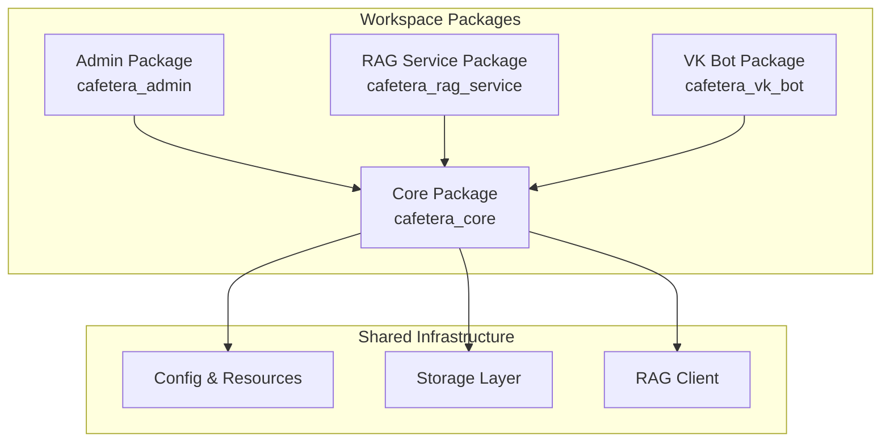
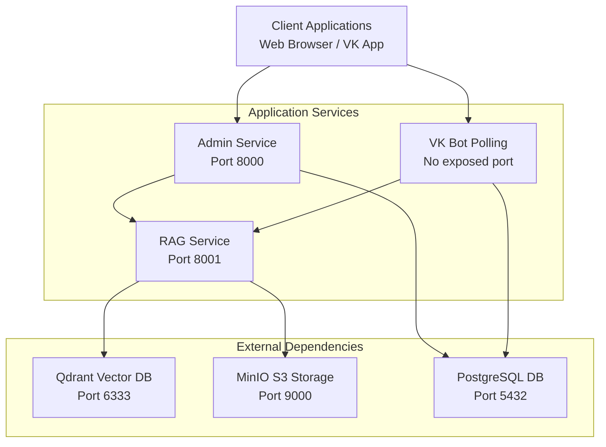
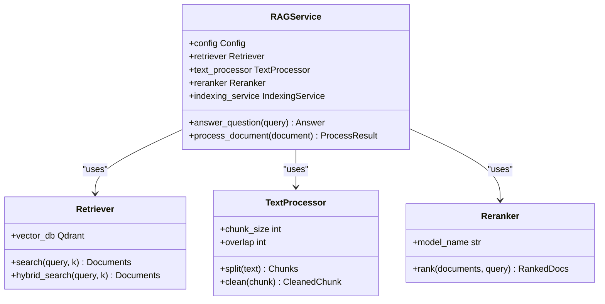
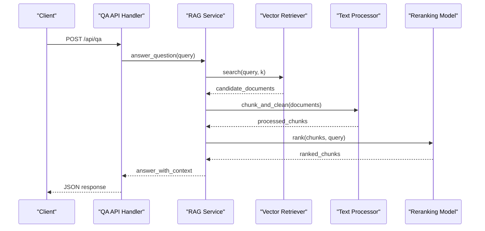
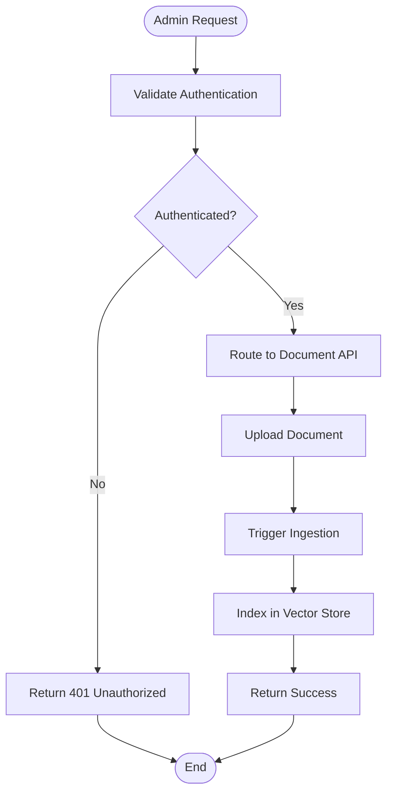
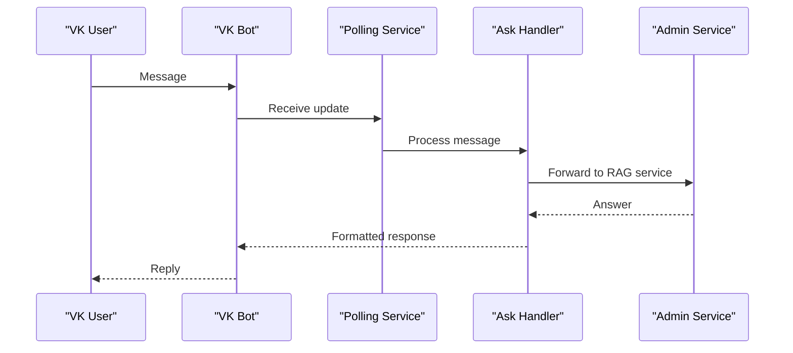
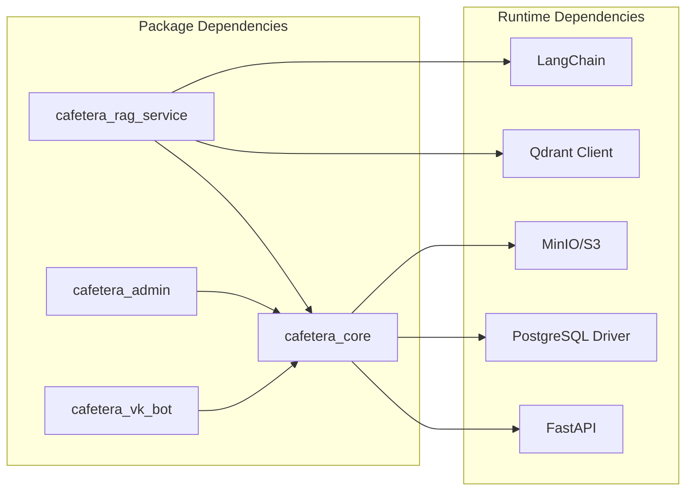

# Architecture Documentation

<cite>
**Referenced Files in This Document**
- [pyproject.toml](file://pyproject.toml)
- [docker-compose.yml](file://docker-compose.yml)
- [packages/core/src/cafetera_core/config.py](file://packages/core/src/cafetera_core/config.py)
- [packages/core/src/cafetera_core/rag_client.py](file://packages/core/src/cafetera_core/rag_client.py)
- [packages/core/src/cafetera_core/storage/database.py](file://packages/core/src/cafetera_core/storage/database.py)
- [packages/core/src/cafetera_core/storage/s3.py](file://packages/core/src/cafetera_core/storage/s3.py)
- [packages/rag_service/src/cafetera_rag_service/main.py](file://packages/rag_service/src/cafetera_rag_service/main.py)
- [packages/rag_service/src/cafetera_rag_service/server.py](file://packages/rag_service/src/cafetera_rag_service/server.py)
- [packages/rag_service/src/cafetera_rag_service/api/indexing.py](file://packages/rag_service/src/cafetera_rag_service/api/indexing.py)
- [packages/rag_service/src/cafetera_rag_service/api/ingest.py](file://packages/rag_service/src/cafetera_rag_service/api/ingest.py)
- [packages/rag_service/src/cafetera_rag_service/api/qa.py](file://packages/rag_service/src/cafetera_rag_service/api/qa.py)
- [packages/rag_service/src/cafetera_rag_service/rag/retriever.py](file://packages/rag_service/src/cafetera_rag_service/rag/retriever.py)
- [packages/rag_service/src/cafetera_rag_service/rag/text_processor.py](file://packages/rag_service/src/cafetera_rag_service/rag/text_processor.py)
- [packages/rag_service/src/cafetera_rag_service/rag/reranker.py](file://packages/rag_service/src/cafetera_rag_service/rag/reranker.py)
- [packages/rag_service/src/cafetera_rag_service/qa_service.py](file://packages/rag_service/src/cafetera_rag_service/qa_service.py)
- [packages/admin/src/cafetera_admin/main.py](file://packages/admin/src/cafetera_admin/main.py)
- [packages/admin/src/cafetera_admin/server.py](file://packages/admin/src/cafetera_admin/server.py)
- [packages/admin/src/cafetera_admin/api/documents.py](file://packages/admin/src/cafetera_admin/api/documents.py)
- [packages/vk_bot/src/cafetera_vk_bot/bot.py](file://packages/vk_bot/src/cafetera_vk_bot/bot.py)
- [packages/vk_bot/src/cafetera_vk_bot/polling.py](file://packages/vk_bot/src/cafetera_vk_bot/polling.py)
- [packages/vk_bot/src/cafetera_vk_bot/handlers/start.py](file://packages/vk_bot/src/cafetera_vk_bot/handlers/start.py)
- [packages/vk_bot/src/cafetera_vk_bot/handlers/ask.py](file://packages/vk_bot/src/cafetera_vk_bot/handlers/ask.py)
</cite>

## Table of Contents
1. [Introduction](#introduction)
2. [Project Structure](#project-structure)
3. [Core Components](#core-components)
4. [Architecture Overview](#architecture-overview)
5. [Detailed Component Analysis](#detailed-component-analysis)
6. [Dependency Analysis](#dependency-analysis)
7. [Performance Considerations](#performance-considerations)
8. [Troubleshooting Guide](#troubleshooting-guide)
9. [Conclusion](#conclusion)

## Introduction
This document describes the architecture of the Cafetera HR Bot system, a multi-service platform integrating RAG (Retrieval-Augmented Generation), document management, and VKontakte chatbot capabilities. The system is organized as a monorepo workspace with four primary packages: core infrastructure, RAG service, admin interface, and VK bot. It leverages Docker Compose for orchestration and provides health-checked microservices for scalable deployment.

## Project Structure
The project follows a workspace-based monorepo layout managed by uv, with each package encapsulating domain-specific functionality and shared core components.

**Diagram sources**
- [pyproject.toml:39-46](file://pyproject.toml#L39-L46)
- [packages/core/src/cafetera_core/config.py](file://packages/core/src/cafetera_core/config.py)
- [packages/core/src/cafetera_core/storage/database.py](file://packages/core/src/cafetera_core/storage/database.py)
- [packages/core/src/cafetera_core/rag_client.py](file://packages/core/src/cafetera_core/rag_client.py)

**Section sources**
- [pyproject.toml:39-46](file://pyproject.toml#L39-L46)
- [pyproject.toml:54-59](file://pyproject.toml#L54-L59)

## Core Components
The core package provides foundational services used across all modules:
- Configuration management and resource definitions
- Storage abstractions for PostgreSQL and S3-compatible object storage
- RAG client for interacting with the RAG service

Key responsibilities:
- Centralized configuration via environment variables and runtime settings
- Database connection pooling and transaction management
- S3 client abstraction for document storage and retrieval
- HTTP client for RAG service communication

**Section sources**
- [packages/core/src/cafetera_core/config.py](file://packages/core/src/cafetera_core/config.py)
- [packages/core/src/cafetera_core/storage/database.py](file://packages/core/src/cafetera_core/storage/database.py)
- [packages/core/src/cafetera_core/storage/s3.py](file://packages/core/src/cafetera_core/storage/s3.py)
- [packages/core/src/cafetera_core/rag_client.py](file://packages/core/src/cafetera_core/rag_client.py)

## Architecture Overview
The system operates as a distributed microservices architecture orchestrated by Docker Compose. Four primary services are deployed: Qdrant vector database, MinIO S3-compatible storage, Postgres relational database, and the main application services.

**Diagram sources**
- [docker-compose.yml:1-150](file://docker-compose.yml#L1-L150)

**Section sources**
- [docker-compose.yml:1-150](file://docker-compose.yml#L1-L150)

## Detailed Component Analysis

### RAG Service Module
The RAG service implements a complete retrieval-augmented generation pipeline with ingestion, indexing, and QA capabilities.

**Diagram sources**
- [packages/rag_service/src/cafetera_rag_service/rag/retriever.py](file://packages/rag_service/src/cafetera_rag_service/rag/retriever.py)
- [packages/rag_service/src/cafetera_rag_service/rag/text_processor.py](file://packages/rag_service/src/cafetera_rag_service/rag/text_processor.py)
- [packages/rag_service/src/cafetera_rag_service/rag/reranker.py](file://packages/rag_service/src/cafetera_rag_service/rag/reranker.py)

#### API Workflow: Document QA
The QA endpoint orchestrates the complete RAG pipeline from request to response.

**Diagram sources**
- [packages/rag_service/src/cafetera_rag_service/api/qa.py](file://packages/rag_service/src/cafetera_rag_service/api/qa.py)
- [packages/rag_service/src/cafetera_rag_service/qa_service.py](file://packages/rag_service/src/cafetera_rag_service/qa_service.py)

**Section sources**
- [packages/rag_service/src/cafetera_rag_service/api/qa.py](file://packages/rag_service/src/cafetera_rag_service/api/qa.py)
- [packages/rag_service/src/cafetera_rag_service/qa_service.py](file://packages/rag_service/src/cafetera_rag_service/qa_service.py)

### Admin Service Module
The admin service provides document management and administrative controls for the RAG system.

**Diagram sources**
- [packages/admin/src/cafetera_admin/api/documents.py](file://packages/admin/src/cafetera_admin/api/documents.py)

**Section sources**
- [packages/admin/src/cafetera_admin/api/documents.py](file://packages/admin/src/cafetera_admin/api/documents.py)

### VK Bot Module
The VK bot handles user interactions through VKontakte messaging, processing requests and delegating to the RAG service.

**Diagram sources**
- [packages/vk_bot/src/cafetera_vk_bot/bot.py](file://packages/vk_bot/src/cafetera_vk_bot/bot.py)
- [packages/vk_bot/src/cafetera_vk_bot/polling.py](file://packages/vk_bot/src/cafetera_vk_bot/polling.py)
- [packages/vk_bot/src/cafetera_vk_bot/handlers/ask.py](file://packages/vk_bot/src/cafetera_vk_bot/handlers/ask.py)

**Section sources**
- [packages/vk_bot/src/cafetera_vk_bot/bot.py](file://packages/vk_bot/src/cafetera_vk_bot/bot.py)
- [packages/vk_bot/src/cafetera_vk_bot/polling.py](file://packages/vk_bot/src/cafetera_vk_bot/polling.py)
- [packages/vk_bot/src/cafetera_vk_bot/handlers/start.py](file://packages/vk_bot/src/cafetera_vk_bot/handlers/start.py)
- [packages/vk_bot/src/cafetera_vk_bot/handlers/ask.py](file://packages/vk_bot/src/cafetera_vk_bot/handlers/ask.py)

## Dependency Analysis
The system exhibits clear separation of concerns with explicit dependencies between modules.

**Diagram sources**
- [pyproject.toml:9-25](file://pyproject.toml#L9-L25)

**Section sources**
- [pyproject.toml:9-25](file://pyproject.toml#L9-L25)

## Performance Considerations
- Vector similarity search performance scales with collection size; consider optimizing chunk sizes and embedding dimensions
- Database queries should utilize proper indexing on frequently queried fields
- S3 operations benefit from connection pooling and appropriate retry policies
- RAG service health checks ensure availability monitoring across all dependent services
- Container resource limits should be configured per service requirements

## Troubleshooting Guide
Common operational issues and resolutions:
- Service unavailability: Check Docker Compose health checks for Qdrant, MinIO, and Postgres readiness
- Authentication failures: Verify environment variables for database credentials and S3 access keys
- RAG service timeouts: Monitor vector database performance and adjust chunk processing parameters
- VK bot connectivity: Ensure proper webhook configuration and polling intervals

**Section sources**
- [docker-compose.yml:11-15](file://docker-compose.yml#L11-L15)
- [docker-compose.yml:30-35](file://docker-compose.yml#L30-L35)
- [docker-compose.yml:49-54](file://docker-compose.yml#L49-L54)

## Conclusion
The Cafetera HR Bot architecture demonstrates a well-structured microservices design with clear boundaries between document management, RAG processing, and user interaction layers. The workspace-based monorepo enables maintainable development while Docker Compose provides robust deployment orchestration. The modular design supports future extensions and scaling requirements.