# RAG Integration

<cite>
**Referenced Files in This Document**
- [app/config.py](file://app/config.py)
- [app/rag/chain.py](file://app/rag/chain.py)
- [app/rag/prompts.py](file://app/rag/prompts.py)
- [app/rag/retriever.py](file://app/rag/retriever.py)
- [app/domain/qa_service.py](file://app/domain/qa_service.py)
- [app/integrations/vk/bot.py](file://app/integrations/vk/bot.py)
- [app/integrations/vk/handlers/ask.py](file://app/integrations/vk/handlers/ask.py)
- [app/domain/content.py](file://app/domain/content.py)
- [app/domain/topic_hints.py](file://app/domain/topic_hints.py)
- [app/integrations/vk/keyboards.py](file://app/integrations/vk/keyboards.py)
- [app/integrations/vk/states.py](file://app/integrations/vk/states.py)
- [scripts/ingest.py](file://scripts/ingest.py)
- [scripts/polling_vk.py](file://scripts/polling_vk.py)
- [pyproject.toml](file://pyproject.toml)
- [tests/test_qa_service.py](file://tests/test_qa_service.py)
- [tests/test_rag_block6.py](file://tests/test_rag_block6.py)
- [tests/test_ask_block9.py](file://tests/test_ask_block9.py)
</cite>

## Update Summary
**Changes Made**
- Enhanced Block 9 ask handler implementation with comprehensive RAG integration
- Added topic hints detection system for contextual navigation and disclaimers
- Implemented typing indicators for improved user experience during RAG processing
- Integrated QA service with singleton pattern for efficient resource management
- Added contextual navigation buttons based on detected topic scenarios
- Enhanced error handling with proper fallback messages for unavailable documents
- Improved user experience with background topic disclaimers and scenario suggestions

## Table of Contents
1. [Introduction](#introduction)
2. [Project Structure](#project-structure)
3. [Core Components](#core-components)
4. [Architecture Overview](#architecture-overview)
5. [Detailed Component Analysis](#detailed-component-analysis)
6. [Enhanced Ask Handler Implementation](#enhanced-ask-handler-implementation)
7. [Topic Hints Detection System](#topic-hints-detection-system)
8. [RAG Infrastructure Implementation](#rag-infrastructure-implementation)
9. [QA Service Implementation](#qa-service-implementation)
10. [Configuration Management](#configuration-management)
11. [Document Ingestion Pipeline](#document-ingestion-pipeline)
12. [LangChain Integration](#langchain-integration)
13. [Testing Framework](#testing-framework)
14. [Performance Considerations](#performance-considerations)
15. [Troubleshooting Guide](#troubleshooting-guide)
16. [Conclusion](#conclusion)

## Introduction
This document describes the comprehensive Retrieval-Augmented Generation (RAG) integration for the Cafetera HR assistance bot. The implementation includes a complete LangChain-based processing pipeline, Qdrant vector database integration, document ingestion capabilities, and specialized HR prompts. The system enhances the bot's HR assistance capabilities by providing contextual, reliable answers drawn from HR documents while maintaining seamless integration with the existing VK bot architecture.

**Updated** The RAG implementation now includes a fully functional infrastructure with LangChain integration, Qdrant vector store, document processing workflows, comprehensive QA service with singleton pattern, topic hints detection system, and extensive testing coverage with enhanced user experience features.

## Project Structure
The repository is organized with a dedicated RAG module that provides the core infrastructure for document processing, vector storage, and retrieval. The structure includes configuration management, LangChain integration, Qdrant vector store setup, document ingestion capabilities, and a comprehensive QA service layer with enhanced ask handler implementation.

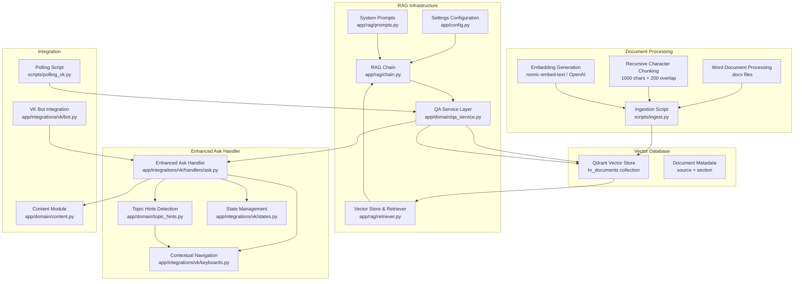

**Diagram sources**
- [app/config.py:4-23](file://app/config.py#L4-L23)
- [app/rag/chain.py:30-80](file://app/rag/chain.py#L30-L80)
- [app/rag/prompts.py:5-19](file://app/rag/prompts.py#L5-L19)
- [app/rag/retriever.py:22-74](file://app/rag/retriever.py#L22-L74)
- [app/domain/qa_service.py:51-120](file://app/domain/qa_service.py#L51-L120)
- [app/integrations/vk/handlers/ask.py:34-86](file://app/integrations/vk/handlers/ask.py#L34-L86)
- [app/domain/topic_hints.py:87-109](file://app/domain/topic_hints.py#L87-L109)
- [app/integrations/vk/keyboards.py:224-254](file://app/integrations/vk/keyboards.py#L224-254)
- [app/integrations/vk/states.py:4-17](file://app/integrations/vk/states.py#L4-L17)
- [scripts/ingest.py:44-166](file://scripts/ingest.py#L44-L166)
- [app/integrations/vk/bot.py:44-56](file://app/integrations/vk/bot.py#L44-L56)
- [app/domain/content.py:127-136](file://app/domain/content.py#L127-L136)
- [scripts/polling_vk.py:25-38](file://scripts/polling_vk.py#L25-L38)

**Section sources**
- [app/config.py:4-23](file://app/config.py#L4-L23)
- [app/rag/chain.py:1-80](file://app/rag/chain.py#L1-L80)
- [app/rag/prompts.py:1-19](file://app/rag/prompts.py#L1-L19)
- [app/rag/retriever.py:1-74](file://app/rag/retriever.py#L1-L74)
- [app/domain/qa_service.py:1-120](file://app/domain/qa_service.py#L1-L120)
- [app/integrations/vk/handlers/ask.py:1-86](file://app/integrations/vk/handlers/ask.py#L1-L86)
- [app/domain/topic_hints.py:1-109](file://app/domain/topic_hints.py#L1-L109)
- [app/integrations/vk/keyboards.py:1-322](file://app/integrations/vk/keyboards.py#L1-L322)
- [app/integrations/vk/states.py:1-17](file://app/integrations/vk/states.py#L1-L17)
- [scripts/ingest.py:1-192](file://scripts/ingest.py#L1-L192)
- [app/integrations/vk/bot.py:1-56](file://app/integrations/vk/bot.py#L1-L56)
- [app/domain/content.py:124-137](file://app/domain/content.py#L124-L137)
- [scripts/polling_vk.py:1-38](file://scripts/polling_vk.py#L1-L38)

## Core Components
The RAG infrastructure consists of several interconnected components that work together to provide intelligent document retrieval and response generation with enhanced user experience:

- **Configuration Management**: Centralized settings for Qdrant connection, LLM providers, and embedding models
- **RAG Chain Builder**: LangChain pipeline that orchestrates retrieval, prompting, and LLM generation
- **Vector Store Integration**: Qdrant-backed vector store with dense retrieval capabilities
- **Document Processing**: Word document ingestion with section extraction and chunking
- **Embedding Models**: Support for both local Ollama embeddings and OpenAI-compatible embeddings
- **System Prompts**: Specialized HR-focused prompts with Russian language instructions
- **QA Service Layer**: Singleton pattern implementation with error handling and text truncation
- **Topic Hints Detection**: Keyword-based detection system for contextual navigation and disclaimers
- **Enhanced Ask Handler**: Multi-step dialog flow with typing indicators and contextual navigation
- **Application Integration**: Seamless integration with VK bot handlers and state management

**Updated** The RAG infrastructure now provides a complete, production-ready solution with comprehensive LangChain integration, Qdrant vector store capabilities, robust QA service layer, topic hints detection system, and enhanced user experience features.

**Section sources**
- [app/config.py:10-23](file://app/config.py#L10-L23)
- [app/rag/chain.py:30-80](file://app/rag/chain.py#L30-L80)
- [app/rag/retriever.py:22-74](file://app/rag/retriever.py#L22-L74)
- [app/rag/prompts.py:5-19](file://app/rag/prompts.py#L5-L19)
- [app/domain/qa_service.py:51-120](file://app/domain/qa_service.py#L51-L120)
- [app/domain/topic_hints.py:14-26](file://app/domain/topic_hints.py#L14-L26)
- [app/integrations/vk/handlers/ask.py:34-86](file://app/integrations/vk/handlers/ask.py#L34-L86)

## Architecture Overview
The RAG-enabled bot architecture integrates seamlessly with the existing VK bot infrastructure while providing powerful document retrieval capabilities with enhanced user experience. The system processes user questions through a LangChain pipeline that retrieves relevant context from Qdrant, generates contextualized responses, detects topic scenarios for navigation, and provides typing indicators for improved UX, all managed through a centralized QA service layer.

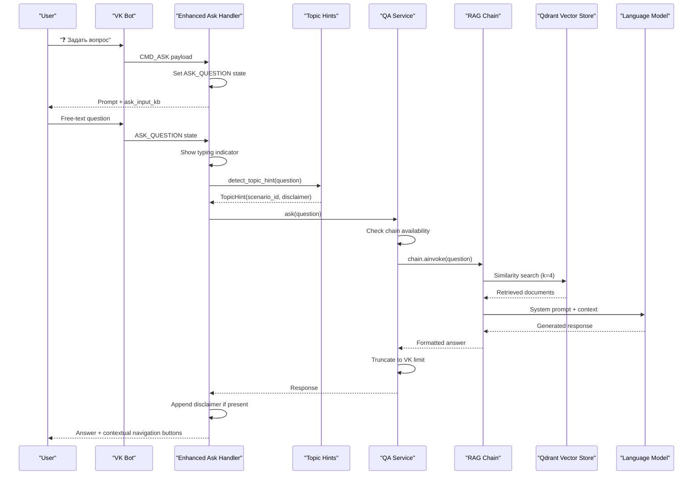

**Diagram sources**
- [app/integrations/vk/handlers/ask.py:49-86](file://app/integrations/vk/handlers/ask.py#L49-L86)
- [app/domain/qa_service.py:86-105](file://app/domain/qa_service.py#L86-L105)
- [app/rag/chain.py:61-80](file://app/rag/chain.py#L61-L80)
- [app/rag/retriever.py:64-74](file://app/rag/retriever.py#L64-L74)
- [app/domain/topic_hints.py:87-109](file://app/domain/topic_hints.py#L87-L109)

## Detailed Component Analysis

### Enhanced VK Bot Integration
The VK bot maintains its existing handler structure while integrating the new RAG capabilities through the enhanced ask handler and QA service layer. The ask handler now serves as the sophisticated entry point for free-form questions with comprehensive state management, user experience enhancements, and seamless integration with the RAG infrastructure.

**Updated** The ask handler provides a sophisticated multi-step dialog flow with proper state management, typing indicators, topic hints detection, and contextual navigation through enhanced user experience features.

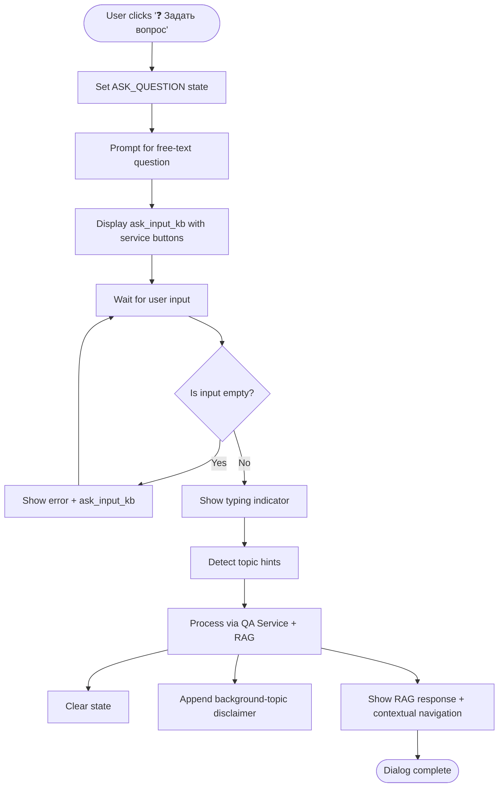

**Diagram sources**
- [app/integrations/vk/handlers/ask.py:34-86](file://app/integrations/vk/handlers/ask.py#L34-L86)

**Section sources**
- [app/integrations/vk/bot.py:24-56](file://app/integrations/vk/bot.py#L24-L56)
- [app/integrations/vk/handlers/ask.py:1-86](file://app/integrations/vk/handlers/ask.py#L1-L86)

### Enhanced Ask Handler - Multi-Step Dialog Flow
The ask handler implements a sophisticated two-step dialog flow that captures user questions, processes them through the RAG pipeline via the QA service, and provides enhanced user experience features:

**Step 1: Entry Point (CMD_ASK)**
- Sets the ASK_QUESTION state using the shared state dispenser
- Prompts user to enter their question
- Displays ask_input_kb keyboard with service buttons

**Step 2: State Handler (ASK_QUESTION)**
- Captures free-text input from user
- Validates non-empty input
- Shows typing indicator using VK API set_activity
- Detects topic hints for contextual navigation and disclaimers
- Processes question through QA service and RAG chain
- Appends background-topic disclaimer if detected
- Clears state after processing
- Returns formatted response with contextual navigation buttons

**Updated** Enhanced with typing indicators, topic hints detection, background-topic disclaimers, and contextual navigation buttons for improved user experience.

**Section sources**
- [app/integrations/vk/handlers/ask.py:34-86](file://app/integrations/vk/handlers/ask.py#L34-L86)

## Topic Hints Detection System
The topic hints system provides intelligent keyword-based detection for contextual navigation and background-topic disclaimers, enhancing the RAG response with relevant navigation options and appropriate disclaimers.

**Updated** Comprehensive topic hints detection system with scenario-based navigation and background-topic disclaimers for enhanced user experience.

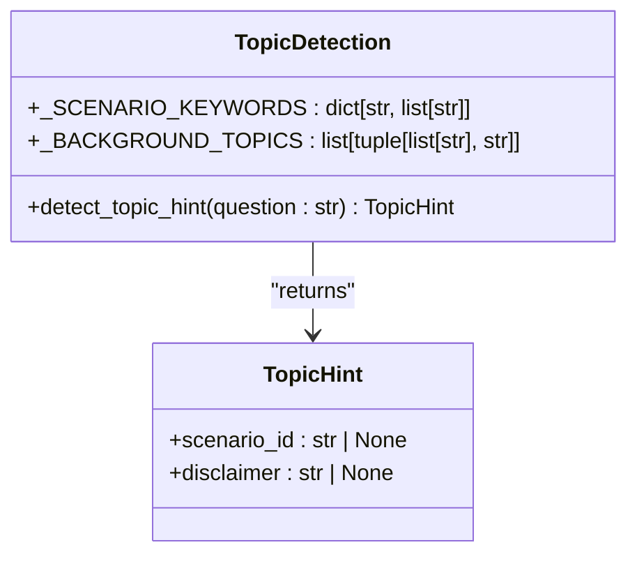

**Diagram sources**
- [app/domain/topic_hints.py:14-26](file://app/domain/topic_hints.py#L14-L26)
- [app/domain/topic_hints.py:87-109](file://app/domain/topic_hints.py#L87-L109)

### Scenario-Based Navigation Keywords
The system detects clickable scenarios with comprehensive keyword matching for seamless navigation:

- **Hire**: Приём, прием, оформление сотрудника, трудовой договор, онбординг
- **Fire**: Увольнение, уволиться, уволить, последний рабочий день, обходной лист
- **Vacation**: Отпуск, отпускные, заявление на отпуск, график отпусков
- **Pay**: Зарплата, премия, оплата труда, сверхурочные
- **Sick**: Больничный, элн, электронный листок нетрудоспособности, нетрудоспособность
- **Probation**: Испытательный срок

### Background-Topic Disclaimers
The system provides appropriate disclaimers for sensitive HR topics:

- **Transfer**: "По этой теме рекомендуем согласовать оформление напрямую с HR."
- **Disciplinary Actions**: "По вопросам дисциплинарных процедур обратитесь в HR-отдел."
- **Absenteeism**: "По вопросам увольнения за прогул обратитесь в HR-отдел."

**Section sources**
- [app/domain/topic_hints.py:14-26](file://app/domain/topic_hints.py#L14-L26)
- [app/domain/topic_hints.py:30-67](file://app/domain/topic_hints.py#L30-L67)
- [app/domain/topic_hints.py:71-84](file://app/domain/topic_hints.py#L71-L84)
- [app/domain/topic_hints.py:87-109](file://app/domain/topic_hints.py#L87-L109)

## RAG Infrastructure Implementation

### Configuration Management
The Settings class provides comprehensive configuration for the RAG infrastructure with sensible defaults and environment variable support:

- **Qdrant Configuration**: URL, API key, and collection name for vector storage
- **LLM Provider Options**: Support for Ollama, OpenAI-compatible, and llama.cpp providers
- **Model Specifications**: Configurable model names and base URLs
- **Embedding Models**: Flexible embedding model selection

**Updated** Enhanced configuration management with comprehensive RAG-specific settings and provider flexibility including llama.cpp support.

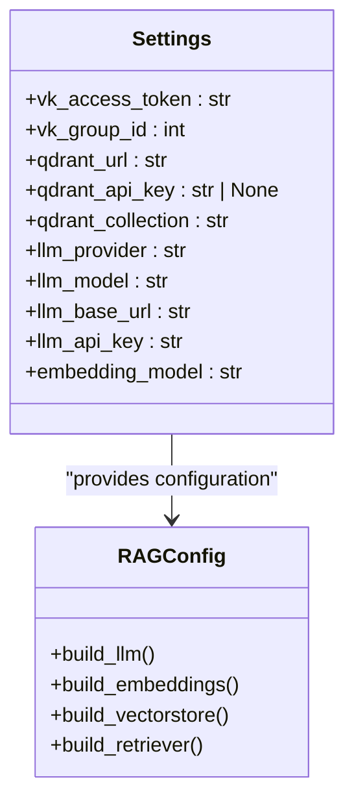

**Diagram sources**
- [app/config.py:4-23](file://app/config.py#L4-L23)
- [app/rag/chain.py:30-58](file://app/rag/chain.py#L30-L58)
- [app/rag/retriever.py:22-48](file://app/rag/retriever.py#L22-L48)

**Section sources**
- [app/config.py:4-23](file://app/config.py#L4-L23)

### RAG Chain Construction
The build_rag_chain function creates a complete LangChain pipeline that orchestrates the entire RAG process:

- **Document Formatting**: Combines retrieved documents with custom separator formatting
- **Prompt Composition**: Uses system prompt with dynamic context injection
- **LLM Integration**: Supports Ollama, OpenAI-compatible, and llama.cpp providers
- **Output Parsing**: Converts LLM output to clean text response

**Updated** Complete implementation of the RAG chain with comprehensive error handling, logging, and provider flexibility including llama.cpp support.

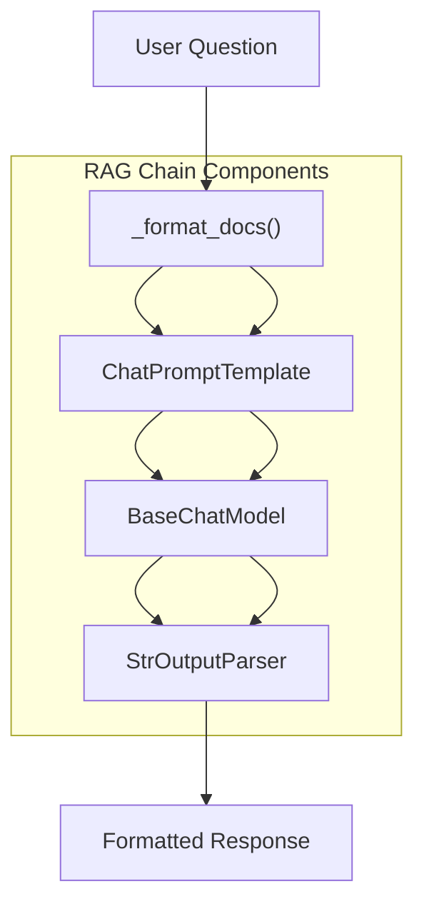

**Diagram sources**
- [app/rag/chain.py:25-80](file://app/rag/chain.py#L25-L80)

**Section sources**
- [app/rag/chain.py:1-80](file://app/rag/chain.py#L1-L80)

### Vector Store and Retrieval
The retriever module provides comprehensive vector store integration with Qdrant:

- **Embedding Models**: Support for OpenAI embeddings, Ollama embeddings, and llama.cpp embeddings
- **Vector Store Creation**: Wraps Qdrant collection into LangChain vector store
- **Retrieval Configuration**: Configurable similarity search parameters
- **Collection Management**: Automatic collection creation and management

**Updated** Full implementation of vector store integration with comprehensive error handling, provider flexibility, and llama.cpp support.

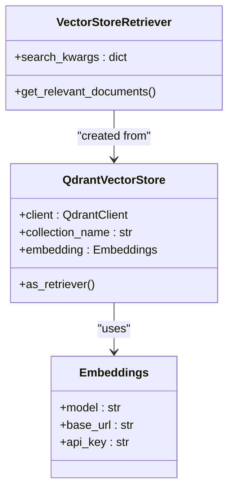

**Diagram sources**
- [app/rag/retriever.py:51-74](file://app/rag/retriever.py#L51-L74)
- [app/rag/retriever.py:22-48](file://app/rag/retriever.py#L22-L48)

**Section sources**
- [app/rag/retriever.py:1-74](file://app/rag/retriever.py#L1-L74)

## QA Service Implementation

### Singleton Pattern Architecture
The QA service implements a singleton pattern with module-level state management, providing a centralized interface for RAG chain operations:

- **Module-Level State**: Global chain and Qdrant client instances
- **Initialization**: One-time setup during application startup
- **Resource Management**: Proper cleanup and error handling
- **Thread Safety**: Safe concurrent access to the RAG chain

**Updated** Complete implementation of the QA service with singleton pattern, comprehensive error handling, text truncation capabilities, and proper resource cleanup.

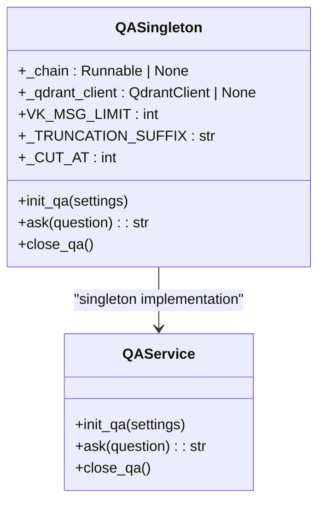

**Diagram sources**
- [app/domain/qa_service.py:23-120](file://app/domain/qa_service.py#L23-L120)

### Text Truncation and Error Handling
The QA service provides sophisticated text processing capabilities:

- **Message Limit Enforcement**: VK message length limit (4096 characters)
- **Word Boundary Preservation**: Truncation at word boundaries to avoid partial words
- **Fallback Messages**: Contextual error messages for unavailable documents
- **Graceful Degradation**: Fallback responses when RAG chain is unavailable

**Updated** Comprehensive text truncation with Russian language suffix and robust error handling for production scenarios.

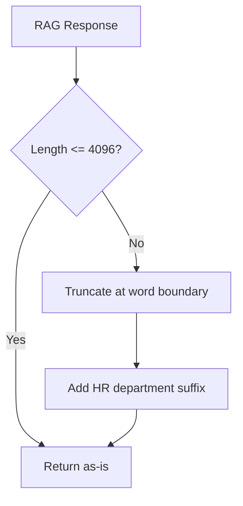

**Diagram sources**
- [app/domain/qa_service.py:36-45](file://app/domain/qa_service.py#L36-L45)

**Section sources**
- [app/domain/qa_service.py:1-120](file://app/domain/qa_service.py#L1-L120)

### Application Lifecycle Integration
The QA service integrates with the application lifecycle through initialization and shutdown:

- **Startup Initialization**: RAG chain creation during bot startup
- **Graceful Shutdown**: Resource cleanup and connection closure
- **Error Resilience**: Graceful degradation when services are unavailable
- **State Management**: Persistent module-level state across handler calls

**Updated** Complete lifecycle management with proper resource cleanup, error resilience, and graceful degradation.

**Section sources**
- [scripts/polling_vk.py:25-38](file://scripts/polling_vk.py#L25-L38)
- [app/domain/qa_service.py:51-120](file://app/domain/qa_service.py#L51-L120)

## Configuration Management

### Settings Class
The Settings class provides comprehensive configuration management for the RAG infrastructure:

- **Qdrant Settings**: URL, API key, and collection name with sensible defaults
- **LLM Provider Configuration**: Support for Ollama, OpenAI-compatible, and llama.cpp providers
- **Model Selection**: Configurable model names and base URLs for flexible deployment
- **Environment Variable Support**: Full configuration via environment variables

**Updated** Enhanced configuration with comprehensive RAG-specific settings, provider flexibility including llama.cpp support, and comprehensive environment variable support.

**Section sources**
- [app/config.py:4-23](file://app/config.py#L4-L23)

### Dependency Management
The pyproject.toml file includes comprehensive dependencies for the RAG infrastructure:

- **Core Dependencies**: FastAPI, LangChain, Qdrant client, and VK integration
- **Optional Dependencies**: OpenAI-compatible, Ollama, and llama.cpp adapters for flexible deployment
- **Development Dependencies**: Testing and linting tools for quality assurance

**Updated** Expanded dependency management with comprehensive LangChain and Qdrant integration, plus llama.cpp support.

**Section sources**
- [pyproject.toml:14-33](file://pyproject.toml#L14-L33)

## Document Ingestion Pipeline

### Word Document Processing
The ingestion script provides comprehensive document processing capabilities:

- **Section Extraction**: Extracts headings and associated content from Word documents
- **Chunking Strategy**: Uses recursive character splitting with configurable chunk size and overlap
- **Metadata Preservation**: Maintains source filename and section information
- **Collection Management**: Handles collection recreation and cleanup

**Updated** Complete implementation of document ingestion with comprehensive error handling, metadata preservation, and flexible chunking strategy.

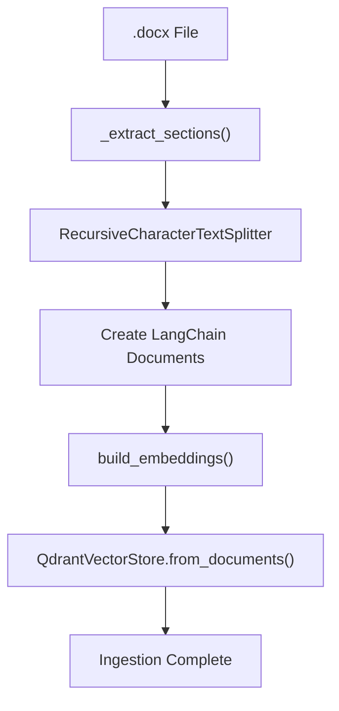

**Diagram sources**
- [scripts/ingest.py:44-166](file://scripts/ingest.py#L44-L166)

**Section sources**
- [scripts/ingest.py:1-192](file://scripts/ingest.py#L1-L192)

### Ingestion Workflow
The ingestion process follows a systematic approach to prepare documents for RAG:

1. **File Discovery**: Scans directory for .docx files
2. **Section Extraction**: Identifies document sections using heading styles
3. **Text Chunking**: Splits content into manageable chunks
4. **Metadata Assignment**: Adds source and section information
5. **Vector Generation**: Creates embeddings for each chunk
6. **Storage**: Stores vectors in Qdrant collection

**Updated** Comprehensive ingestion workflow with error handling, progress reporting, and flexible chunking parameters.

**Section sources**
- [scripts/ingest.py:111-166](file://scripts/ingest.py#L111-L166)

## LangChain Integration

### Provider Flexibility
The RAG infrastructure supports multiple LLM providers through a unified interface:

- **Ollama Support**: Local inference with configurable model selection
- **OpenAI Compatibility**: Cloud-based LLMs with API key authentication
- **llama.cpp Support**: Local inference with configurable base URL
- **Provider Detection**: Automatic provider selection based on configuration
- **Error Handling**: Comprehensive error handling for missing dependencies

**Updated** Complete implementation of provider flexibility with comprehensive error handling and llama.cpp support.

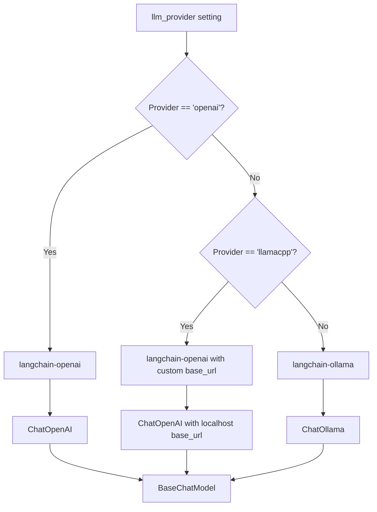

**Diagram sources**
- [app/rag/chain.py:30-73](file://app/rag/chain.py#L30-L73)

**Section sources**
- [app/rag/chain.py:30-73](file://app/rag/chain.py#L30-L73)

### System Prompts
The system prompts provide specialized instructions for HR-focused RAG:

- **HR Assistant Role**: Defines the AI as an HR assistant
- **Response Guidelines**: Specifies concise, structured responses
- **Privacy Protection**: Emphasizes confidentiality and personal data protection
- **Russian Language**: Provides instructions in Russian for local compliance

**Updated** Comprehensive system prompts with HR-specific guidelines, privacy requirements, and Russian language support.

**Section sources**
- [app/rag/prompts.py:5-19](file://app/rag/prompts.py#L5-L19)

## Testing Framework

### Comprehensive Test Coverage
The test suite provides extensive coverage for the RAG infrastructure, QA service, and enhanced ask handler:

- **Configuration Testing**: Validates settings loading and environment variable support
- **Document Processing**: Tests Word document parsing and section extraction
- **Chunking Validation**: Ensures proper text splitting and metadata preservation
- **Chain Building**: Verifies RAG chain construction and execution
- **Vector Store Integration**: Tests Qdrant integration and retrieval capabilities
- **QA Service Testing**: Comprehensive testing of singleton pattern and error handling
- **Text Truncation**: Validates message length limits and word boundary preservation
- **Topic Hints Detection**: Tests keyword-based scenario detection and disclaimers
- **Ask Handler Integration**: Validates enhanced ask handler functionality and user experience features

**Updated** Complete test coverage for all RAG infrastructure components, QA service functionality, topic hints detection, and enhanced ask handler implementation with comprehensive validation scenarios.

```mermaid
graph TB
TestSuite["RAG + QA + Ask Handler Tests"] --> ConfigTests["Configuration Tests"]
TestSuite --> DocxTests["Document Processing Tests"]
TestSuite --> PromptTests["System Prompt Tests"]
TestSuite --> ChainTests["RAG Chain Tests"]
TestSuite --> VectorTests["Vector Store Tests"]
TestSuite --> QATests["QA Service Tests"]
TestSuite --> TopicHintTests["Topic Hints Tests"]
TestSuite --> AskHandlerTests["Enhanced Ask Handler Tests"]
ConfigTests --> SettingsValidation["Settings Validation"]
DocxTests --> SectionExtraction["Section Extraction"]
DocxTests --> ChunkingValidation["Chunking Validation"]
ChainTests --> ChainBuilding["Chain Building"]
ChainTests --> FormatDocs["Format Docs Function"]
VectorTests --> CollectionName["Collection Name"]
VectorTests --> VectorStoreCreation["Vector Store Creation"]
QATests --> AskFunctionality["Ask Functionality"]
QATests --> TruncationLogic["Truncation Logic"]
QATests --> InitCloseLifecycle["Init/Close Lifecycle"]
TopicHintTests --> ScenarioDetection["Scenario Detection"]
TopicHintTests --> DisclaimerLogic["Disclaimer Logic"]
AskHandlerTests --> TypingIndicator["Typing Indicator"]
AskHandlerTests --> ContextualNavigation["Contextual Navigation"]
AskHandlerTests --> ErrorHandler["Error Handling"]
```

**Diagram sources**
- [tests/test_qa_service.py:28-197](file://tests/test_qa_service.py#L28-L197)
- [tests/test_rag_block6.py:34-251](file://tests/test_rag_block6.py#L34-L251)
- [tests/test_ask_block9.py:8-112](file://tests/test_ask_block9.py#L8-L112)

**Section sources**
- [tests/test_qa_service.py:1-198](file://tests/test_qa_service.py#L1-L198)
- [tests/test_rag_block6.py:1-251](file://tests/test_rag_block6.py#L1-L251)
- [tests/test_ask_block9.py:1-112](file://tests/test_ask_block9.py#L1-L112)

## Performance Considerations

### Optimization Strategies
The RAG infrastructure includes several performance optimization strategies:

- **Vector Search Efficiency**: Configurable k-value for balancing relevance and performance
- **Embedding Model Selection**: Choice between local Ollama, OpenAI embeddings, and llama.cpp embeddings
- **Memory Management**: Proper cleanup of Qdrant clients and embedding models
- **Connection Pooling**: Efficient management of database connections
- **Caching Strategies**: Potential for caching frequently accessed documents
- **Response Truncation**: VK message limit enforcement to prevent oversized responses
- **Typing Indicators**: Asynchronous processing with user feedback during RAG computation
- **State Management**: Efficient state handling to prevent memory leaks

**Updated** Comprehensive performance considerations for production deployment with optimization strategies, memory management, typing indicators, and efficient state handling.

### Scalability Planning
The architecture supports horizontal scaling through:

- **Qdrant Sharding**: Horizontal scaling of vector database
- **Load Balancing**: Multiple LLM instances for high-throughput scenarios
- **Caching Layers**: Redis or similar caching for frequently accessed results
- **Asynchronous Processing**: Non-blocking operations for better throughput
- **Resource Pooling**: Efficient management of QA service resources
- **Provider Scaling**: Support for multiple LLM providers for load distribution

## Troubleshooting Guide

### Common Issues and Solutions
The RAG infrastructure includes comprehensive error handling and debugging capabilities:

- **Configuration Issues**: Missing environment variables or incorrect settings
- **Provider Setup**: Missing optional dependencies for selected LLM provider
- **Vector Store Connectivity**: Qdrant connection problems or collection issues
- **Document Processing**: Word document parsing errors or unsupported formats
- **Memory Issues**: Insufficient RAM for embedding generation or vector storage
- **QA Service Failures**: Chain initialization failures or runtime exceptions
- **Text Truncation Errors**: Incorrect message length calculations
- **Topic Hints Detection**: Keyword matching issues or missing scenarios
- **Typing Indicator Errors**: VK API connectivity or permission issues
- **State Management**: Memory leaks or state conflicts between handlers

**Updated** Comprehensive troubleshooting guide for all aspects of the RAG infrastructure, QA service, topic hints detection, and enhanced ask handler with user experience features.

### Debugging Tools
Available debugging and monitoring capabilities:

- **Logging Configuration**: Comprehensive logging throughout the RAG pipeline
- **Health Checks**: Qdrant health verification and connection testing
- **Performance Metrics**: Timing and throughput measurements
- **Error Reporting**: Detailed error messages with context information
- **QA Service Monitoring**: Chain availability and resource status tracking
- **User Experience Monitoring**: Typing indicator functionality and navigation button rendering

**Section sources**
- [app/rag/chain.py:30-58](file://app/rag/chain.py#L30-L58)
- [app/rag/retriever.py:22-48](file://app/rag/retriever.py#L22-L48)
- [scripts/ingest.py:137-166](file://scripts/ingest.py#L137-L166)
- [app/domain/qa_service.py:82-83](file://app/domain/qa_service.py#L82-L83)
- [app/integrations/vk/handlers/ask.py:67-70](file://app/integrations/vk/handlers/ask.py#L67-L70)

## Conclusion
The RAG integration provides a comprehensive, production-ready solution for enhancing the Cafetera HR assistance bot with intelligent document retrieval capabilities and enhanced user experience. The implementation includes complete LangChain integration, Qdrant vector store setup, document ingestion pipelines, comprehensive QA service with singleton pattern, topic hints detection system, contextual navigation features, and extensive testing frameworks. The system seamlessly integrates with the existing VK bot architecture while providing powerful contextual response generation capabilities that significantly enhance HR assistance functionality.

**Updated** The implementation now provides a complete, tested RAG infrastructure with robust QA service layer, topic hints detection system, enhanced ask handler with typing indicators and contextual navigation, and comprehensive user experience improvements that serve as the foundation for future enhancements and production deployment. The singleton pattern ensures efficient resource utilization, while comprehensive error handling, text truncation, and user experience features provide reliability and improved user satisfaction.