# RAG Integration

<cite>
**Referenced Files in This Document**
- [app/config.py](file://app/config.py)
- [app/integrations/vk/bot.py](file://app/integrations/vk/bot.py)
- [app/integrations/vk/handlers/start.py](file://app/integrations/vk/handlers/start.py)
- [app/integrations/vk/handlers/sections.py](file://app/integrations/vk/handlers/sections.py)
- [app/integrations/vk/handlers/fallback.py](file://app/integrations/vk/handlers/fallback.py)
- [app/integrations/vk/handlers/ask.py](file://app/integrations/vk/handlers/ask.py)
- [app/integrations/vk/handlers/hr_request.py](file://app/integrations/vk/handlers/hr_request.py)
- [app/integrations/vk/keyboards.py](file://app/integrations/vk/keyboards.py)
- [app/integrations/vk/states.py](file://app/integrations/vk/states.py)
- [app/domain/content.py](file://app/domain/content.py)
- [docker-compose.yml](file://docker-compose.yml)
- [pyproject.toml](file://pyproject.toml)
- [scripts/run_llama_qwen.sh](file://scripts/run_llama_qwen.sh)
- [scripts/run_ollama_qwen.sh](file://scripts/run_ollama_qwen.sh)
- [tests/test_bot_factory.py](file://tests/test_bot_factory.py)
- [tests/test_config.py](file://tests/test_config.py)
- [tests/test_rag_stub_block3.py](file://tests/test_rag_stub_block3.py)
- [AGENTS.md](file://AGENTS.md)
- [PLAN.md](file://PLAN.md)
</cite>

## Update Summary
**Changes Made**
- Added comprehensive documentation for the new RAG (Retrieval-Augmented Generation) ask.py handler module
- Updated multi-step dialog flow documentation with proper state management
- Enhanced keyboard navigation and service button integration
- Added detailed coverage of the RAG stub service implementation
- Updated handler registration order and dependencies

## Table of Contents
1. [Introduction](#introduction)
2. [Project Structure](#project-structure)
3. [Core Components](#core-components)
4. [Architecture Overview](#architecture-overview)
5. [Detailed Component Analysis](#detailed-component-analysis)
6. [Dependency Analysis](#dependency-analysis)
7. [Performance Considerations](#performance-considerations)
8. [Troubleshooting Guide](#troubleshooting-guide)
9. [Conclusion](#conclusion)
10. [Appendices](#appendices)

## Introduction
This document describes the planned Retrieval-Augmented Generation (RAG) integration for the Cafetera HR assistance bot. It explains the RAG architecture, LangChain integration patterns, Qdrant vector database setup, and the document ingestion pipeline. It also documents the free-form question processing system, retrieval mechanisms, and how RAG will enhance the bot's HR assistance capabilities. Practical examples cover setting up the RAG pipeline, configuring vector databases, implementing document processing workflows, and integrating RAG responses with the existing VK bot architecture. Finally, it addresses performance considerations, scaling challenges, and best practices for production RAG deployments.

**Updated** The RAG implementation now includes a fully functional ask.py handler module that provides a multi-step dialog flow for question-answering with proper state management and keyboard navigation, serving as a placeholder for the upcoming LangChain integration.

## Project Structure
The repository is organized around a VK bot integration with modular handlers and keyboards, plus supporting infrastructure for RAG. The RAG stack is anchored by LangChain and Qdrant, with optional OpenAI-compatible and Ollama integrations. Vector storage is provided by Qdrant, while document storage is handled by MinIO. The FastAPI service will host the webhook and document ingestion endpoint, and the VK bot routes user intents to handlers.

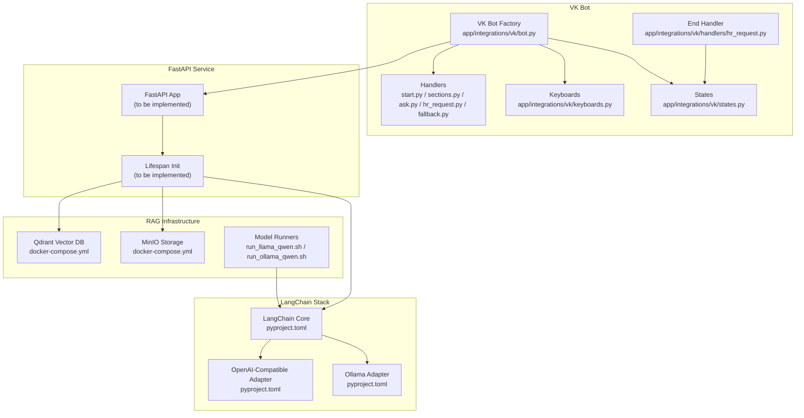

**Diagram sources**
- [app/integrations/vk/bot.py:1-56](file://app/integrations/vk/bot.py#L1-L56)
- [app/integrations/vk/handlers/start.py:1-55](file://app/integrations/vk/handlers/start.py#L1-L55)
- [app/integrations/vk/handlers/sections.py:1-42](file://app/integrations/vk/handlers/sections.py#L1-L42)
- [app/integrations/vk/handlers/ask.py:1-63](file://app/integrations/vk/handlers/ask.py#L1-L63)
- [app/integrations/vk/handlers/hr_request.py:1-305](file://app/integrations/vk/handlers/hr_request.py#L1-L305)
- [app/integrations/vk/handlers/fallback.py:1-18](file://app/integrations/vk/handlers/fallback.py#L1-L18)
- [app/integrations/vk/keyboards.py:1-293](file://app/integrations/vk/keyboards.py#L1-L293)
- [app/integrations/vk/states.py:1-17](file://app/integrations/vk/states.py#L1-L17)
- [docker-compose.yml:1-34](file://docker-compose.yml#L1-L34)
- [pyproject.toml:1-56](file://pyproject.toml#L1-L56)
- [scripts/run_llama_qwen.sh:1-59](file://scripts/run_llama_qwen.sh#L1-L59)
- [scripts/run_ollama_qwen.sh:1-74](file://scripts/run_ollama_qwen.sh#L1-L74)

**Section sources**
- [app/integrations/vk/bot.py:1-56](file://app/integrations/vk/bot.py#L1-L56)
- [app/integrations/vk/handlers/start.py:1-55](file://app/integrations/vk/handlers/start.py#L1-L55)
- [app/integrations/vk/handlers/sections.py:1-42](file://app/integrations/vk/handlers/sections.py#L1-L42)
- [app/integrations/vk/handlers/ask.py:1-63](file://app/integrations/vk/handlers/ask.py#L1-L63)
- [app/integrations/vk/handlers/hr_request.py:1-305](file://app/integrations/vk/handlers/hr_request.py#L1-L305)
- [app/integrations/vk/handlers/fallback.py:1-18](file://app/integrations/vk/handlers/fallback.py#L1-L18)
- [app/integrations/vk/keyboards.py:1-293](file://app/integrations/vk/keyboards.py#L1-L293)
- [app/integrations/vk/states.py:1-17](file://app/integrations/vk/states.py#L1-L17)
- [docker-compose.yml:1-34](file://docker-compose.yml#L1-L34)
- [pyproject.toml:1-56](file://pyproject.toml#L1-L56)
- [scripts/run_llama_qwen.sh:1-59](file://scripts/run_llama_qwen.sh#L1-L59)
- [scripts/run_ollama_qwen.sh:1-74](file://scripts/run_ollama_qwen.sh#L1-L74)

## Core Components
- VK Bot Factory: Creates a fully wired VK bot with registered handlers and logging.
- Handler Modules: Define intent routing for start, main menu, section stubs, Ask section with multi-step dialog, and fallback behavior.
- Keyboard Builder: Provides reusable keyboards with service actions (Home, Back, Contact HR).
- States: Multi-step dialog states for advanced flows including ASK_QUESTION state.
- RAG Dependencies: LangChain, Qdrant client, optional adapters for OpenAI-compatible and Ollama.
- Vector DB: Qdrant service configured via docker-compose with persistent volume and health checks.
- Model Runners: Scripts to run local LLM servers (llama.cpp) and Ollama with smoke tests.
- RAG Stub Service: Centralized rag_stub function providing standardized placeholder responses.

**Updated** The Ask handler now provides a sophisticated multi-step dialog flow with proper state management, enabling users to ask free-form questions through a structured interface.

**Section sources**
- [app/integrations/vk/bot.py:24-31](file://app/integrations/vk/bot.py#L24-L31)
- [app/integrations/vk/handlers/start.py:31-33](file://app/integrations/vk/handlers/start.py#L31-L33)
- [app/integrations/vk/handlers/sections.py:76-81](file://app/integrations/vk/handlers/sections.py#L76-L81)
- [app/integrations/vk/handlers/ask.py:26-63](file://app/integrations/vk/handlers/ask.py#L26-L63)
- [app/integrations/vk/handlers/fallback.py:15-17](file://app/integrations/vk/handlers/fallback.py#L15-L17)
- [app/integrations/vk/keyboards.py:56-98](file://app/integrations/vk/keyboards.py#L56-L98)
- [app/integrations/vk/states.py:4-17](file://app/integrations/vk/states.py#L4-L17)
- [app/domain/content.py:124-137](file://app/domain/content.py#L124-L137)
- [pyproject.toml:14-31](file://pyproject.toml#L14-L31)
- [docker-compose.yml:2-16](file://docker-compose.yml#L2-L16)
- [scripts/run_llama_qwen.sh:52-58](file://scripts/run_llama_qwen.sh#L52-L58)
- [scripts/run_ollama_qwen.sh:68-73](file://scripts/run_ollama_qwen.sh#L68-L73)

## Architecture Overview
The RAG-enabled bot architecture integrates the VK bot with a FastAPI service that hosts the webhook and ingestion endpoint. The ingestion pipeline stores documents in MinIO and embeds them into Qdrant. Free-form questions are routed to the VK Ask section, which triggers the RAG chain to retrieve relevant chunks and generate a contextualized response.

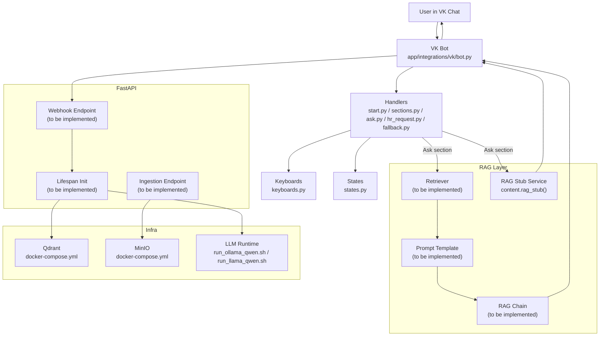

**Diagram sources**
- [app/integrations/vk/bot.py:24-31](file://app/integrations/vk/bot.py#L24-L31)
- [app/integrations/vk/handlers/sections.py:76-81](file://app/integrations/vk/handlers/sections.py#L76-L81)
- [app/integrations/vk/handlers/ask.py:26-63](file://app/integrations/vk/handlers/ask.py#L26-L63)
- [app/domain/content.py:124-137](file://app/domain/content.py#L124-L137)
- [docker-compose.yml:2-28](file://docker-compose.yml#L2-L28)
- [scripts/run_ollama_qwen.sh:1-74](file://scripts/run_ollama_qwen.sh#L1-L74)
- [scripts/run_llama_qwen.sh:1-59](file://scripts/run_llama_qwen.sh#L1-L59)

## Detailed Component Analysis

### VK Bot and Intent Routing
- The bot factory registers handlers in a specific order: start, hr_request, ask, hire, fire, vacation, pay, sections, and fallback. The ask handler must precede fallback to handle free-text questions properly.
- The start handler sends a greeting and main menu keyboard. The sections handler currently returns stubs for remaining functional areas, including the Ask section.
- The fallback handler prompts users to use menu buttons.

**Updated** The ask handler now provides a sophisticated multi-step dialog flow that captures user questions through a structured interface with proper state management.

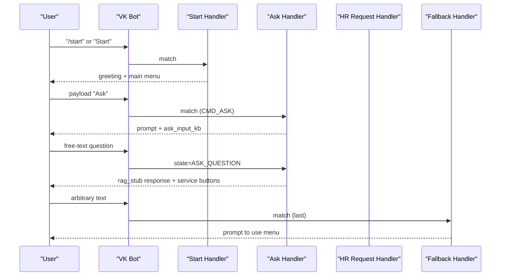

**Diagram sources**
- [app/integrations/vk/bot.py:24-31](file://app/integrations/vk/bot.py#L24-L31)
- [app/integrations/vk/handlers/start.py:31-33](file://app/integrations/vk/handlers/start.py#L31-L33)
- [app/integrations/vk/handlers/ask.py:26-63](file://app/integrations/vk/handlers/ask.py#L26-L63)
- [app/integrations/vk/handlers/fallback.py:15-17](file://app/integrations/vk/handlers/fallback.py#L15-L17)

**Section sources**
- [app/integrations/vk/bot.py:24-31](file://app/integrations/vk/bot.py#L24-L31)
- [app/integrations/vk/handlers/start.py:31-33](file://app/integrations/vk/handlers/start.py#L31-L33)
- [app/integrations/vk/handlers/ask.py:26-63](file://app/integrations/vk/handlers/ask.py#L26-L63)
- [app/integrations/vk/handlers/fallback.py:15-17](file://app/integrations/vk/handlers/fallback.py#L15-L17)

### Ask Handler - Multi-Step Dialog Flow
The ask.py handler implements a sophisticated two-step dialog flow for capturing and processing free-form questions:

**Step 1: Entry Point (CMD_ASK)**
- Sets the ASK_QUESTION state using the shared state dispenser
- Prompts user to enter their question
- Displays ask_input_kb keyboard with service buttons

**Step 2: State Handler (ASK_QUESTION)**
- Captures free-text input from user
- Validates non-empty input
- Clears state after processing
- Returns standardized rag_stub response

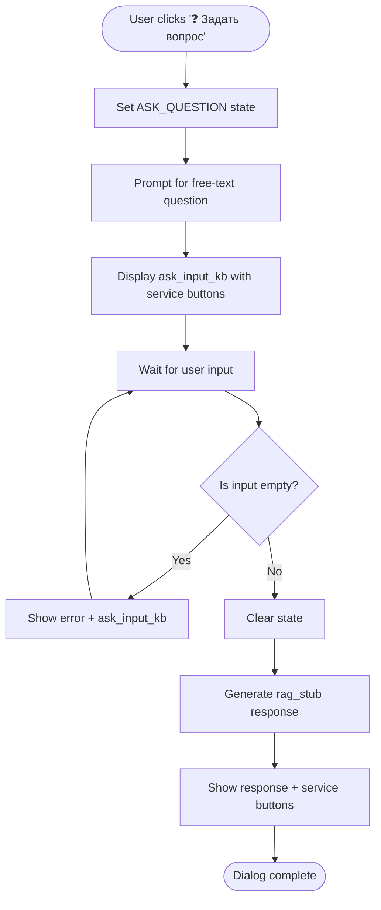

**Diagram sources**
- [app/integrations/vk/handlers/ask.py:26-63](file://app/integrations/vk/handlers/ask.py#L26-L63)
- [app/integrations/vk/states.py:15-17](file://app/integrations/vk/states.py#L15-L17)
- [app/integrations/vk/handlers/hr_request.py:40-41](file://app/integrations/vk/handlers/hr_request.py#L40-L41)

**Section sources**
- [app/integrations/vk/handlers/ask.py:1-63](file://app/integrations/vk/handlers/ask.py#L1-L63)
- [app/integrations/vk/states.py:15-17](file://app/integrations/vk/states.py#L15-L17)
- [app/integrations/vk/handlers/hr_request.py:40-41](file://app/integrations/vk/handlers/hr_request.py#L40-L41)

### Keyboard and Navigation
- The main menu keyboard organizes HR sections and service actions. The service row pattern ensures Back/Home/Contact HR are always accessible.
- The ask_input_kb keyboard provides specialized input interface for free-text questions.
- Stub keyboards reuse the service row for placeholder screens.

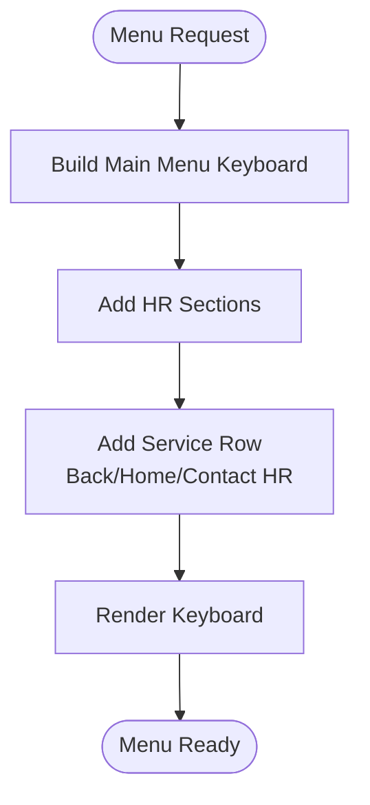

**Diagram sources**
- [app/integrations/vk/keyboards.py:56-98](file://app/integrations/vk/keyboards.py#L56-L98)
- [app/integrations/vk/keyboards.py:29-50](file://app/integrations/vk/keyboards.py#L29-L50)
- [app/integrations/vk/keyboards.py:221-225](file://app/integrations/vk/keyboards.py#L221-L225)

**Section sources**
- [app/integrations/vk/keyboards.py:56-98](file://app/integrations/vk/keyboards.py#L56-L98)
- [app/integrations/vk/keyboards.py:29-50](file://app/integrations/vk/keyboards.py#L29-L50)
- [app/integrations/vk/keyboards.py:221-225](file://app/integrations/vk/keyboards.py#L221-L225)

### RAG Pipeline and Retrieval Mechanisms
- Ingestion: Documents are processed from MinIO, chunked, embedded, and stored in Qdrant. Metadata includes filename, section, and entity where applicable.
- Retrieval: Dense retrieval from Qdrant is orchestrated by a LangChain retriever. A prompt template guides the LLM response generation.
- Chain: The RAG chain composes retriever + prompt + LLM, initialized during FastAPI lifespan.
- Stub Service: The centralized rag_stub function provides standardized placeholder responses while the real RAG system is being implemented.

**Updated** The rag_stub function serves as a placeholder that will be replaced with actual LangChain integration once the RAG pipeline is complete.

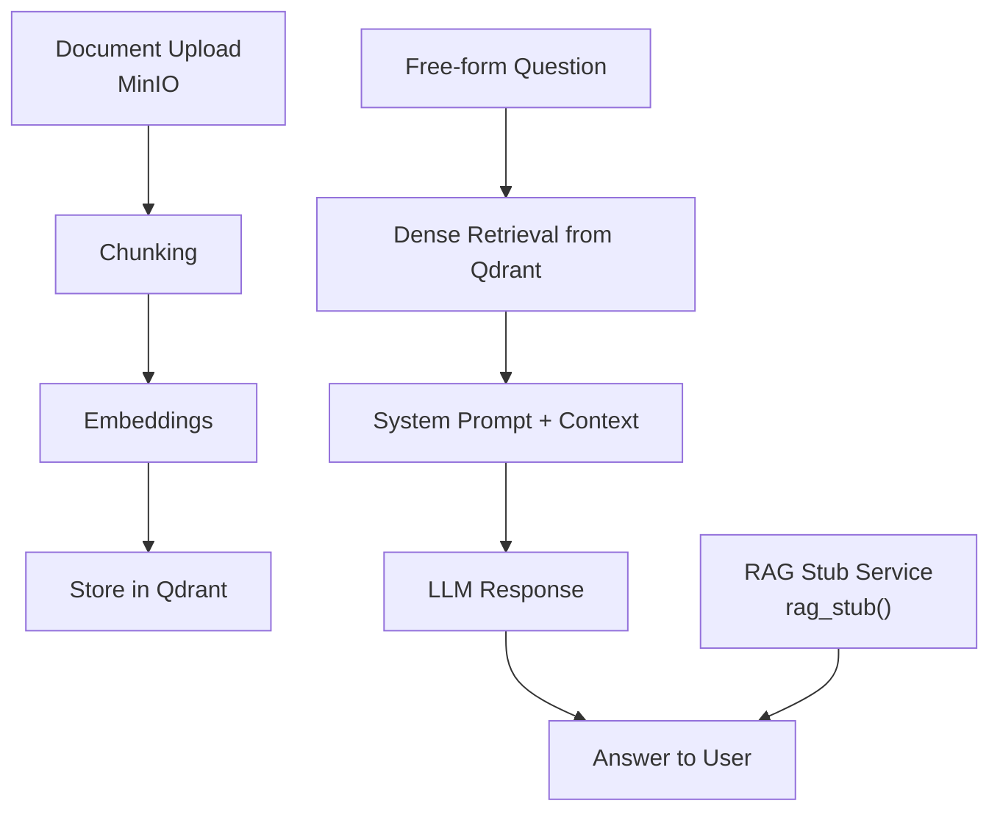

**Diagram sources**
- [PLAN.md:141-149](file://PLAN.md#L141-L149)
- [docker-compose.yml:18-28](file://docker-compose.yml#L18-L28)
- [pyproject.toml:14-31](file://pyproject.toml#L14-L31)
- [app/domain/content.py:124-137](file://app/domain/content.py#L124-L137)

**Section sources**
- [PLAN.md:141-149](file://PLAN.md#L141-L149)
- [docker-compose.yml:18-28](file://docker-compose.yml#L18-L28)
- [pyproject.toml:14-31](file://pyproject.toml#L14-L31)
- [app/domain/content.py:124-137](file://app/domain/content.py#L124-L137)

### LangChain Integration Patterns
- Core: LangChain >= 0.3.0 is declared.
- Optional adapters:
  - OpenAI-compatible: langchain-openai >= 0.2.0
  - Ollama: langchain-ollama >= 0.2.0
- Qdrant integration: langchain-qdrant >= 0.2.1, qdrant-client >= 1.10.0

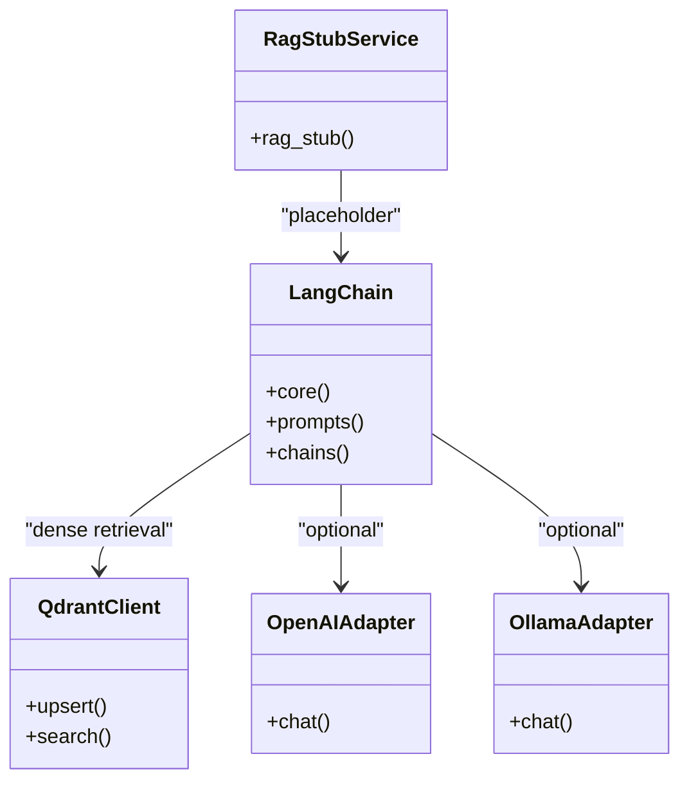

**Diagram sources**
- [pyproject.toml:14-31](file://pyproject.toml#L14-L31)
- [app/domain/content.py:124-137](file://app/domain/content.py#L124-L137)

**Section sources**
- [pyproject.toml:14-31](file://pyproject.toml#L14-L31)
- [app/domain/content.py:124-137](file://app/domain/content.py#L124-L137)

### Qdrant Vector Database Setup
- Service definition: Qdrant image, ports, persistent volume, health check.
- Collection: hr_documents is to be created for storing embeddings and metadata.
- Access: Qdrant URL and optional API key are exposed via Settings.

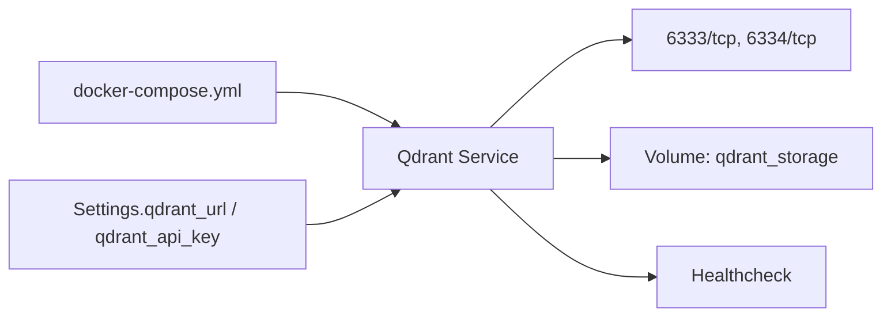

**Diagram sources**
- [docker-compose.yml:2-16](file://docker-compose.yml#L2-L16)
- [AGENTS.md:38-41](file://AGENTS.md#L38-L41)

**Section sources**
- [docker-compose.yml:2-16](file://docker-compose.yml#L2-L16)
- [AGENTS.md:38-41](file://AGENTS.md#L38-L41)

### Document Ingestion Pipeline
- Ingest script: python-docx → chunking → embeddings → Qdrant.
- Constraints: Only .docx; metadata includes filename, section, and entity.
- Storage: MinIO for raw documents; Qdrant for vectors.

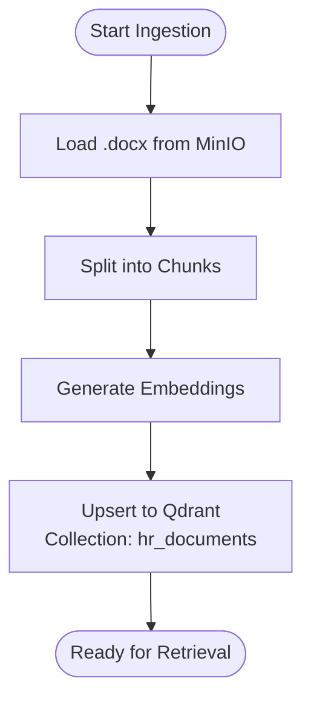

**Diagram sources**
- [PLAN.md:141-144](file://PLAN.md#L141-L144)
- [docker-compose.yml:18-28](file://docker-compose.yml#L18-L28)

**Section sources**
- [PLAN.md:141-144](file://PLAN.md#L141-L144)
- [docker-compose.yml:18-28](file://docker-compose.yml#L18-L28)

### Free-form Question Processing
- Ask section: Now fully implemented with multi-step dialog flow and proper state management.
- Retrieval: Dense retrieval from Qdrant collection (planned).
- Prompting: System prompt guiding concise, step-by-step answers without personal data (planned).
- LLM: Configurable via adapters (OpenAI-compatible or Ollama) (planned).
- Stub Service: rag_stub function provides standardized placeholder responses.

**Updated** The Ask handler now provides a complete multi-step dialog flow with proper state management, serving as a foundation for the upcoming LangChain integration.

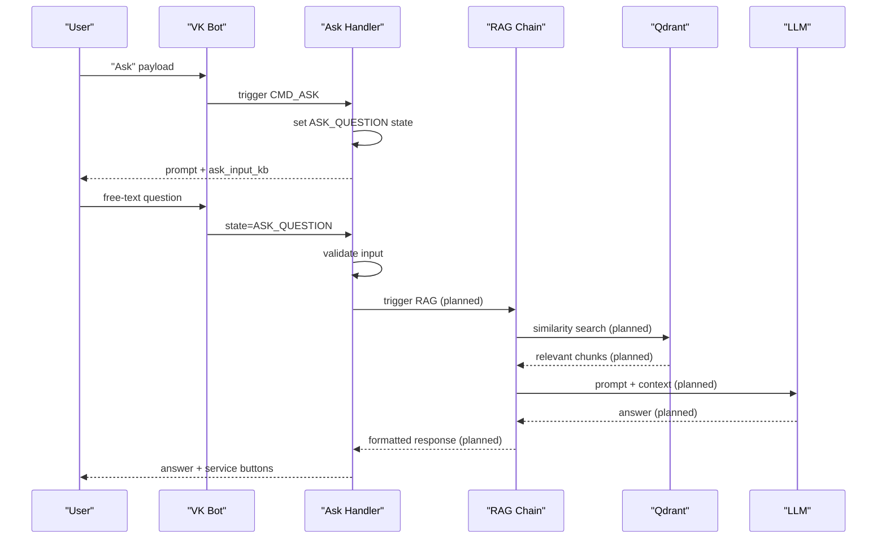

**Diagram sources**
- [app/integrations/vk/handlers/ask.py:26-63](file://app/integrations/vk/handlers/ask.py#L26-L63)
- [app/integrations/vk/handlers/sections.py:76-81](file://app/integrations/vk/handlers/sections.py#L76-L81)
- [PLAN.md:146-149](file://PLAN.md#L146-L149)
- [docker-compose.yml:2-16](file://docker-compose.yml#L2-L16)
- [app/domain/content.py:124-137](file://app/domain/content.py#L124-L137)

**Section sources**
- [app/integrations/vk/handlers/ask.py:26-63](file://app/integrations/vk/handlers/ask.py#L26-L63)
- [app/integrations/vk/handlers/sections.py:76-81](file://app/integrations/vk/handlers/sections.py#L76-L81)
- [PLAN.md:146-149](file://PLAN.md#L146-L149)
- [docker-compose.yml:2-16](file://docker-compose.yml#L2-L16)
- [app/domain/content.py:124-137](file://app/domain/content.py#L124-L137)

### Integration with Existing Bot Architecture
- VK handlers remain largely unchanged except replacing Ask stub with RAG invocation.
- Lifespan initializes Qdrant connection, MinIO client, and LangChain chain.
- Webhook replaces polling for production deployments.
- State management is centralized through the shared state dispenser.

**Updated** The ask handler integrates seamlessly with the existing bot architecture through proper state management and shared state dispenser.

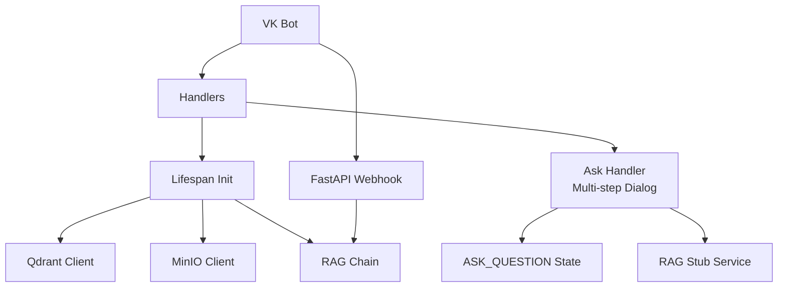

**Diagram sources**
- [app/integrations/vk/bot.py:24-31](file://app/integrations/vk/bot.py#L24-L31)
- [app/integrations/vk/handlers/ask.py:26-63](file://app/integrations/vk/handlers/ask.py#L26-L63)
- [app/integrations/vk/states.py:15-17](file://app/integrations/vk/states.py#L15-L17)
- [PLAN.md:132-135](file://PLAN.md#L132-L135)

**Section sources**
- [app/integrations/vk/bot.py:24-31](file://app/integrations/vk/bot.py#L24-L31)
- [app/integrations/vk/handlers/ask.py:26-63](file://app/integrations/vk/handlers/ask.py#L26-L63)
- [app/integrations/vk/states.py:15-17](file://app/integrations/vk/states.py#L15-L17)
- [PLAN.md:132-135](file://PLAN.md#L132-L135)

### RAG Stub Service Implementation
The rag_stub function provides standardized placeholder responses for RAG functionality:

- **Standardized Format**: All responses start with an info emoji and mention knowledge base integration
- **Contextual Content**: Incorporates the user's question/topic into the response
- **Fallback Guidance**: Directs users to contact HR for unavailable information
- **Consistent Messaging**: Maintains uniform tone and structure across all RAG responses

**Updated** The rag_stub function serves as a centralized service that will be replaced with actual LangChain integration.

**Section sources**
- [app/domain/content.py:124-137](file://app/domain/content.py#L124-L137)
- [tests/test_rag_stub_block3.py:6-31](file://tests/test_rag_stub_block3.py#L6-L31)

## Dependency Analysis
- VK bot depends on vkbottle and handler modules.
- RAG stack depends on LangChain, Qdrant client, and optional adapters.
- Infra dependencies include Qdrant and MinIO services.
- Model runtimes support local inference via llama.cpp and Ollama.
- Ask handler depends on shared state dispenser and rag_stub service.

**Updated** The ask handler introduces new dependencies on the shared state dispenser and rag_stub service, creating a centralized approach to RAG functionality.

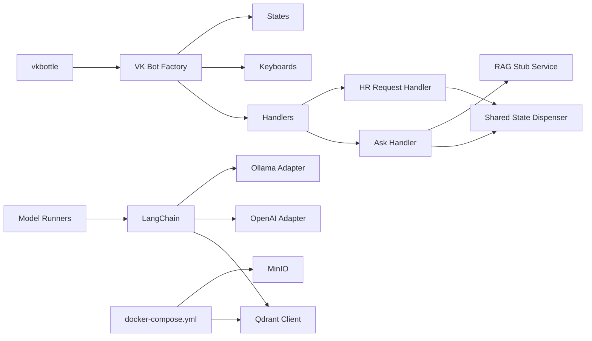

**Diagram sources**
- [pyproject.toml:18-21](file://pyproject.toml#L18-L21)
- [pyproject.toml:14-31](file://pyproject.toml#L14-L31)
- [docker-compose.yml:2-28](file://docker-compose.yml#L2-L28)
- [scripts/run_llama_qwen.sh:52-58](file://scripts/run_llama_qwen.sh#L52-L58)
- [scripts/run_ollama_qwen.sh:68-73](file://scripts/run_ollama_qwen.sh#L68-L73)
- [app/integrations/vk/handlers/ask.py:28-30](file://app/integrations/vk/handlers/ask.py#L28-L30)
- [app/integrations/vk/handlers/hr_request.py:40-41](file://app/integrations/vk/handlers/hr_request.py#L40-L41)

**Section sources**
- [pyproject.toml:14-31](file://pyproject.toml#L14-L31)
- [docker-compose.yml:2-28](file://docker-compose.yml#L2-L28)
- [scripts/run_llama_qwen.sh:52-58](file://scripts/run_llama_qwen.sh#L52-L58)
- [scripts/run_ollama_qwen.sh:68-73](file://scripts/run_ollama_qwen.sh#L68-L73)
- [app/integrations/vk/handlers/ask.py:28-30](file://app/integrations/vk/handlers/ask.py#L28-L30)
- [app/integrations/vk/handlers/hr_request.py:40-41](file://app/integrations/vk/handlers/hr_request.py#L40-L41)

## Performance Considerations
- Vector search latency: Optimize embedding dimensionality and Qdrant index parameters; consider sharding and replicas for scale.
- Throughput: Batch ingestion and parallel embedding generation; tune Qdrant write concurrency.
- Memory footprint: Use quantized models (as indicated by scripts) and limit context length for LLM calls.
- Network: Place Qdrant and MinIO close to the FastAPI service; enable keep-alive and connection pooling.
- Caching: Cache frequent queries and precompute embeddings for static HR documents.
- Monitoring: Track p95 latencies for retrieval and generation; alert on Qdrant health and Ollama/llama-server readiness.
- State Management: Proper state handling prevents memory leaks and ensures clean dialog termination.

**Updated** The ask handler's state management helps prevent memory leaks and ensures clean dialog termination, contributing to overall bot performance.

## Troubleshooting Guide
- VK bot initialization:
  - Verify token forwarding and handler registration counts.
  - Confirm fallback is last and start is first in the labeler list.
  - Ensure ask handler is registered before fallback handler.
- Environment and settings:
  - Ensure VK tokens and RAG settings are present; Qdrant URL and optional API key are configured.
- Qdrant:
  - Confirm health checks pass; port exposure and persistent volume are set.
- MinIO:
  - Validate credentials and bucket name; ensure documents are uploaded before ingestion.
- Model runtimes:
  - For llama.cpp, verify model path and llama-server availability.
  - For Ollama, confirm server startup and model presence; use smoke test output to validate chat endpoint.
- Ask Handler Issues:
  - Verify ASK_QUESTION state is properly set and cleared.
  - Check that rag_stub function is imported correctly.
  - Ensure state dispenser is shared between handlers.

**Updated** Added troubleshooting guidance for the new ask handler and state management issues.

**Section sources**
- [tests/test_bot_factory.py:8-21](file://tests/test_bot_factory.py#L8-L21)
- [tests/test_bot_factory.py:23-44](file://tests/test_bot_factory.py#L23-L44)
- [tests/test_config.py:6-27](file://tests/test_config.py#L6-L27)
- [tests/test_rag_stub_block3.py:6-31](file://tests/test_rag_stub_block3.py#L6-L31)
- [AGENTS.md:20-48](file://AGENTS.md#L20-L48)
- [docker-compose.yml:11-16](file://docker-compose.yml#L11-L16)
- [scripts/run_llama_qwen.sh:32-41](file://scripts/run_llama_qwen.sh#L32-L41)
- [scripts/run_ollama_qwen.sh:36-52](file://scripts/run_ollama_qwen.sh#L36-L52)

## Conclusion
The RAG integration extends the VK bot with contextual, reliable answers drawn from HR documents. By leveraging LangChain, Qdrant, and optional OpenAI-compatible or Ollama adapters, the system supports scalable retrieval and generation. The ingestion pipeline, infrastructure setup, and integration points outlined here provide a clear roadmap to production-ready RAG capabilities that enhance HR assistance without disrupting existing user flows.

**Updated** The implementation now includes a robust ask handler with multi-step dialog flow and proper state management, serving as a solid foundation for the upcoming LangChain integration.

## Appendices

### Practical Setup Examples
- Start Qdrant and MinIO:
  - Use the provided docker-compose service definitions for Qdrant and MinIO.
- Configure environment:
  - Set VK tokens and RAG settings (Qdrant URL, optional API key, LLM API key).
- Run local LLM:
  - Use the provided scripts to launch llama.cpp or Ollama with appropriate parameters.
- Plan ingestion:
  - Implement the ingestion pipeline per the plan, targeting the hr_documents collection.
- Test RAG Stub:
  - Use the test suite to verify rag_stub function behavior and handler integration.

**Updated** Added testing guidance for the new RAG stub functionality.

**Section sources**
- [docker-compose.yml:2-28](file://docker-compose.yml#L2-L28)
- [AGENTS.md:20-48](file://AGENTS.md#L20-L48)
- [scripts/run_llama_qwen.sh:52-58](file://scripts/run_llama_qwen.sh#L52-L58)
- [scripts/run_ollama_qwen.sh:68-73](file://scripts/run_ollama_qwen.sh#L68-L73)
- [PLAN.md:141-149](file://PLAN.md#L141-L149)
- [tests/test_rag_stub_block3.py:6-31](file://tests/test_rag_stub_block3.py#L6-L31)