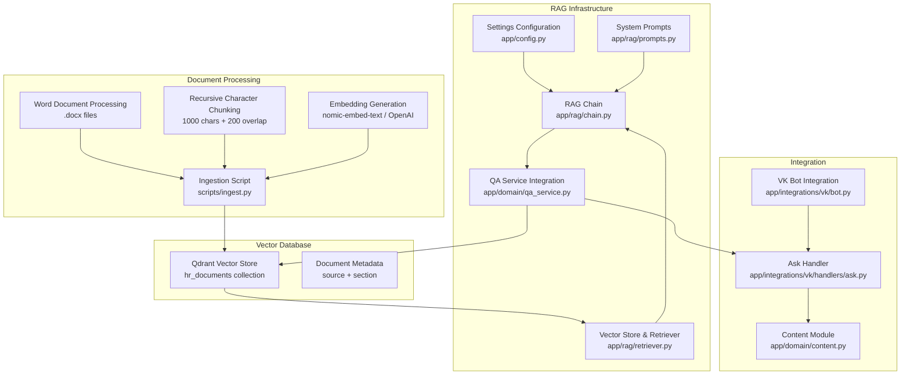
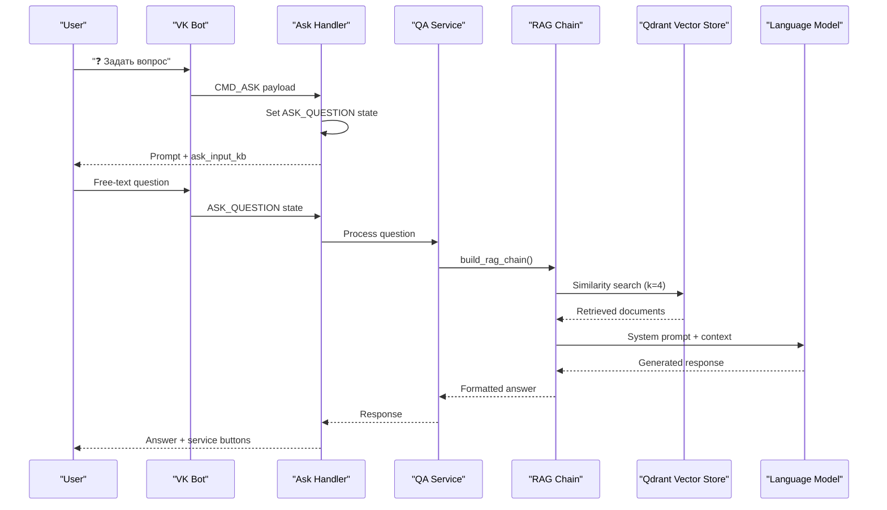
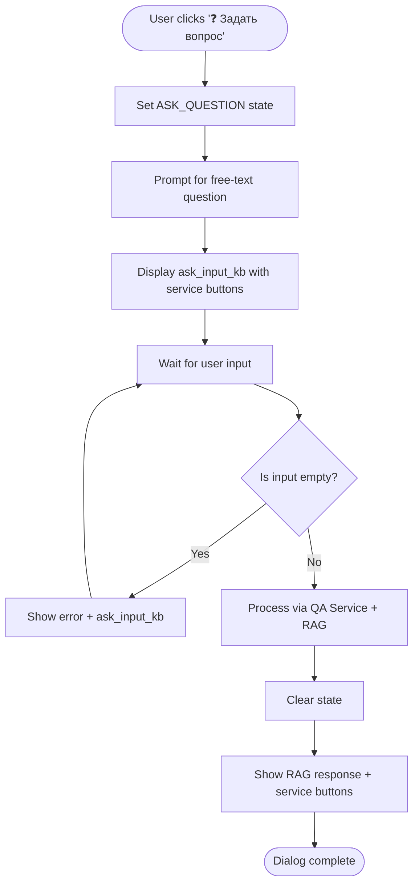
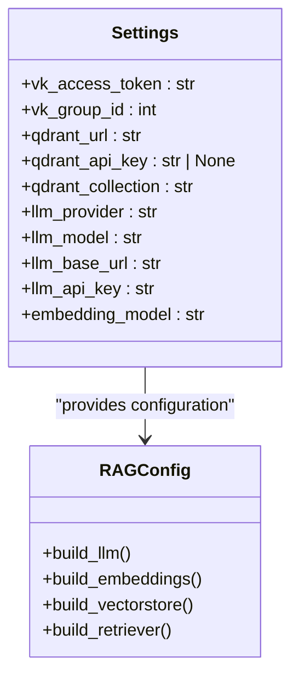
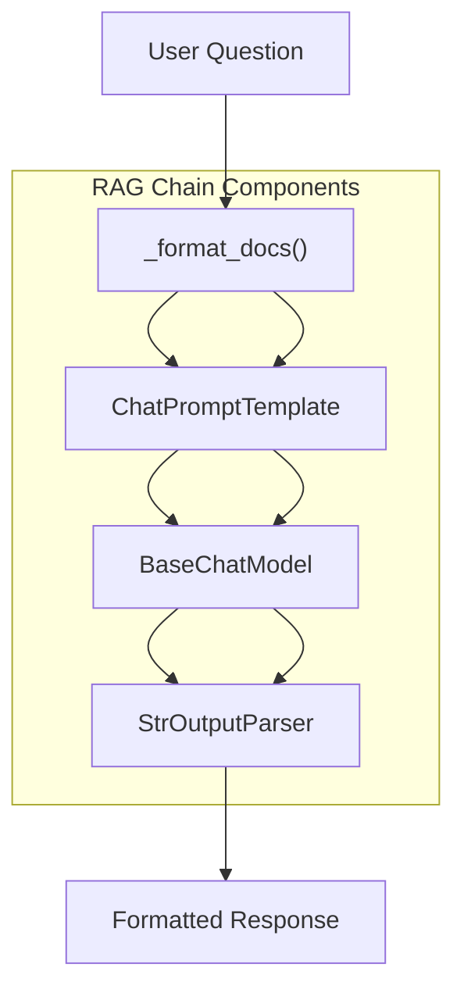
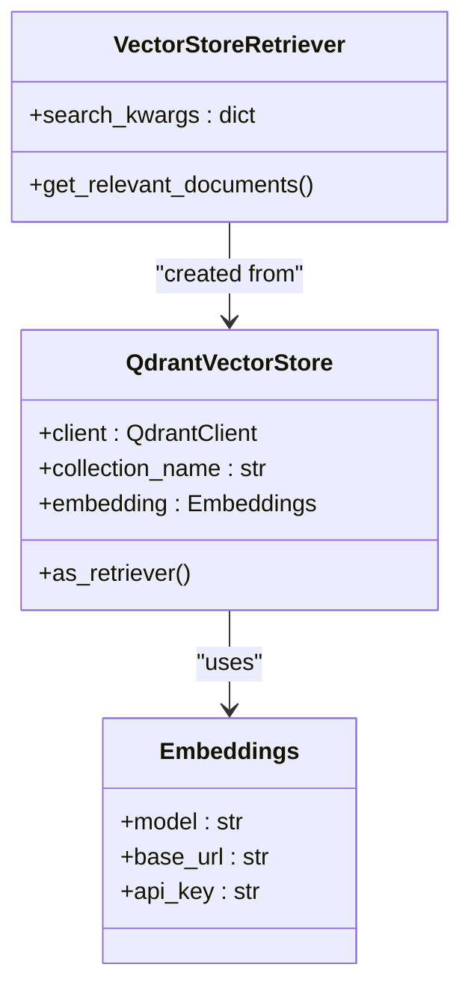
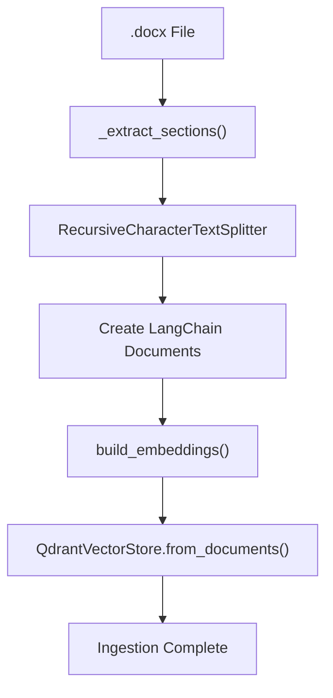
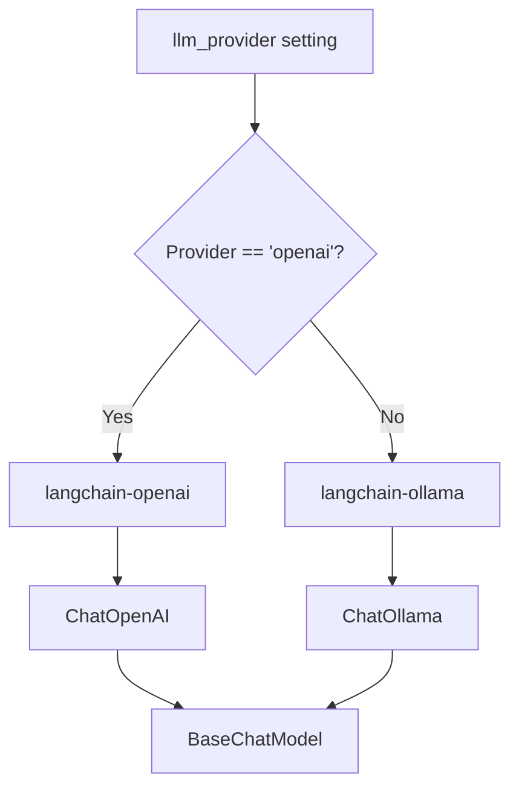
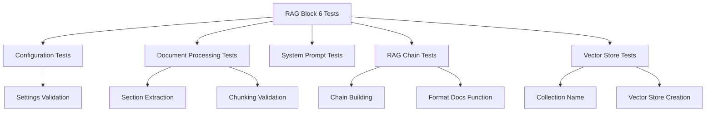

# RAG Integration

<cite>
**Referenced Files in This Document**
- [app/config.py](file://app/config.py)
- [app/rag/__init__.py](file://app/rag/__init__.py)
- [app/rag/chain.py](file://app/rag/chain.py)
- [app/rag/prompts.py](file://app/rag/prompts.py)
- [app/rag/retriever.py](file://app/rag/retriever.py)
- [app/domain/qa_service.py](file://app/domain/qa_service.py)
- [app/integrations/vk/bot.py](file://app/integrations/vk/bot.py)
- [app/integrations/vk/handlers/ask.py](file://app/integrations/vk/handlers/ask.py)
- [app/domain/content.py](file://app/domain/content.py)
- [scripts/ingest.py](file://scripts/ingest.py)
- [pyproject.toml](file://pyproject.toml)
- [tests/test_rag_block6.py](file://tests/test_rag_block6.py)
</cite>

## Update Summary
**Changes Made**
- Complete implementation of Block 6 RAG infrastructure with LangChain-based processing pipeline
- Added comprehensive Qdrant vector store integration with dense retrieval capabilities
- Implemented document ingestion pipeline with Word document processing and chunking
- Integrated specialized HR prompts with Russian-language system instructions
- Enhanced configuration management with RAG-specific settings and provider options
- Expanded development dependencies for LangChain, Qdrant, and optional adapters
- Added comprehensive test coverage for RAG block 6 functionality

## Table of Contents
1. [Introduction](#introduction)
2. [Project Structure](#project-structure)
3. [Core Components](#core-components)
4. [Architecture Overview](#architecture-overview)
5. [Detailed Component Analysis](#detailed-component-analysis)
6. [RAG Infrastructure Implementation](#rag-infrastructure-implementation)
7. [Configuration Management](#configuration-management)
8. [Document Ingestion Pipeline](#document-ingestion-pipeline)
9. [LangChain Integration](#langchain-integration)
10. [Testing Framework](#testing-framework)
11. [Performance Considerations](#performance-considerations)
12. [Troubleshooting Guide](#troubleshooting-guide)
13. [Conclusion](#conclusion)

## Introduction
This document describes the comprehensive Retrieval-Augmented Generation (RAG) integration for the Cafetera HR assistance bot. The implementation includes a complete LangChain-based processing pipeline, Qdrant vector database integration, document ingestion capabilities, and specialized HR prompts. The system enhances the bot's HR assistance capabilities by providing contextual, reliable answers drawn from HR documents while maintaining seamless integration with the existing VK bot architecture.

**Updated** The RAG implementation now includes a fully functional infrastructure with LangChain integration, Qdrant vector store, document processing workflows, and comprehensive testing coverage.

## Project Structure
The repository is organized with a dedicated RAG module that provides the core infrastructure for document processing, vector storage, and retrieval. The structure includes configuration management, LangChain integration, Qdrant vector store setup, and document ingestion capabilities.

**Diagram sources**
- [app/config.py:4-23](file://app/config.py#L4-L23)
- [app/rag/chain.py:30-80](file://app/rag/chain.py#L30-L80)
- [app/rag/prompts.py:5-19](file://app/rag/prompts.py#L5-L19)
- [app/rag/retriever.py:22-74](file://app/rag/retriever.py#L22-L74)
- [app/domain/qa_service.py:62-76](file://app/domain/qa_service.py#L62-L76)
- [scripts/ingest.py:44-166](file://scripts/ingest.py#L44-L166)
- [app/integrations/vk/bot.py:44-56](file://app/integrations/vk/bot.py#L44-L56)
- [app/integrations/vk/handlers/ask.py:26-63](file://app/integrations/vk/handlers/ask.py#L26-L63)
- [app/domain/content.py:127-136](file://app/domain/content.py#L127-L136)

**Section sources**
- [app/config.py:4-23](file://app/config.py#L4-L23)
- [app/rag/__init__.py:1-2](file://app/rag/__init__.py#L1-L2)
- [app/rag/chain.py:1-80](file://app/rag/chain.py#L1-L80)
- [app/rag/prompts.py:1-19](file://app/rag/prompts.py#L1-L19)
- [app/rag/retriever.py:1-74](file://app/rag/retriever.py#L1-L74)
- [app/domain/qa_service.py:62-76](file://app/domain/qa_service.py#L62-L76)
- [scripts/ingest.py:1-192](file://scripts/ingest.py#L1-L192)
- [app/integrations/vk/bot.py:1-56](file://app/integrations/vk/bot.py#L1-L56)
- [app/integrations/vk/handlers/ask.py:1-63](file://app/integrations/vk/handlers/ask.py#L1-L63)
- [app/domain/content.py:124-137](file://app/domain/content.py#L124-L137)

## Core Components
The RAG infrastructure consists of several interconnected components that work together to provide intelligent document retrieval and response generation:

- **Configuration Management**: Centralized settings for Qdrant connection, LLM providers, and embedding models
- **RAG Chain Builder**: LangChain pipeline that orchestrates retrieval, prompting, and LLM generation
- **Vector Store Integration**: Qdrant-backed vector store with dense retrieval capabilities
- **Document Processing**: Word document ingestion with section extraction and chunking
- **Embedding Models**: Support for both local Ollama embeddings and OpenAI-compatible embeddings
- **System Prompts**: Specialized HR-focused prompts with Russian language instructions
- **QA Service Integration**: Seamless integration with the existing QA service architecture

**Updated** The RAG infrastructure now provides a complete, production-ready solution with comprehensive LangChain integration and Qdrant vector store capabilities.

**Section sources**
- [app/config.py:10-23](file://app/config.py#L10-L23)
- [app/rag/chain.py:30-80](file://app/rag/chain.py#L30-L80)
- [app/rag/retriever.py:22-74](file://app/rag/retriever.py#L22-L74)
- [app/rag/prompts.py:5-19](file://app/rag/prompts.py#L5-L19)
- [app/domain/qa_service.py:62-76](file://app/domain/qa_service.py#L62-L76)

## Architecture Overview
The RAG-enabled bot architecture integrates seamlessly with the existing VK bot infrastructure while providing powerful document retrieval capabilities. The system processes user questions through a LangChain pipeline that retrieves relevant context from Qdrant and generates contextualized responses.

**Diagram sources**
- [app/integrations/vk/handlers/ask.py:26-63](file://app/integrations/vk/handlers/ask.py#L26-L63)
- [app/domain/qa_service.py:62-76](file://app/domain/qa_service.py#L62-L76)
- [app/rag/chain.py:61-80](file://app/rag/chain.py#L61-L80)
- [app/rag/retriever.py:64-74](file://app/rag/retriever.py#L64-L74)

## Detailed Component Analysis

### VK Bot Integration
The VK bot maintains its existing handler structure while integrating the new RAG capabilities. The ask handler now serves as the entry point for free-form questions and coordinates with the QA service for RAG processing.

**Updated** The ask handler provides a sophisticated multi-step dialog flow with proper state management and seamless integration with the RAG infrastructure.

**Diagram sources**
- [app/integrations/vk/handlers/ask.py:26-63](file://app/integrations/vk/handlers/ask.py#L26-L63)
- [app/domain/qa_service.py:62-76](file://app/domain/qa_service.py#L62-L76)

**Section sources**
- [app/integrations/vk/bot.py:24-56](file://app/integrations/vk/bot.py#L24-L56)
- [app/integrations/vk/handlers/ask.py:1-63](file://app/integrations/vk/handlers/ask.py#L1-L63)

### Ask Handler - Multi-Step Dialog Flow
The ask handler implements a sophisticated two-step dialog flow that captures user questions and processes them through the RAG pipeline:

**Step 1: Entry Point (CMD_ASK)**
- Sets the ASK_QUESTION state using the shared state dispenser
- Prompts user to enter their question
- Displays ask_input_kb keyboard with service buttons

**Step 2: State Handler (ASK_QUESTION)**
- Captures free-text input from user
- Validates non-empty input
- Processes question through QA service and RAG chain
- Clears state after processing
- Returns formatted response with service buttons

**Section sources**
- [app/integrations/vk/handlers/ask.py:26-63](file://app/integrations/vk/handlers/ask.py#L26-L63)

## RAG Infrastructure Implementation

### Configuration Management
The Settings class provides comprehensive configuration for the RAG infrastructure with sensible defaults and environment variable support:

- **Qdrant Configuration**: URL, API key, and collection name for vector storage
- **LLM Provider Options**: Support for both Ollama and OpenAI-compatible providers
- **Model Specifications**: Configurable model names and base URLs
- **Embedding Models**: Flexible embedding model selection

**Updated** Enhanced configuration management with comprehensive RAG-specific settings and provider flexibility.

**Diagram sources**
- [app/config.py:4-23](file://app/config.py#L4-L23)
- [app/rag/chain.py:30-58](file://app/rag/chain.py#L30-L58)
- [app/rag/retriever.py:22-48](file://app/rag/retriever.py#L22-L48)

**Section sources**
- [app/config.py:4-23](file://app/config.py#L4-L23)

### RAG Chain Construction
The build_rag_chain function creates a complete LangChain pipeline that orchestrates the entire RAG process:

- **Document Formatting**: Combines retrieved documents with custom separator formatting
- **Prompt Composition**: Uses system prompt with dynamic context injection
- **LLM Integration**: Supports both OpenAI-compatible and Ollama providers
- **Output Parsing**: Converts LLM output to clean text response

**Updated** Complete implementation of the RAG chain with comprehensive error handling and logging.

**Diagram sources**
- [app/rag/chain.py:25-80](file://app/rag/chain.py#L25-L80)

**Section sources**
- [app/rag/chain.py:1-80](file://app/rag/chain.py#L1-L80)

### Vector Store and Retrieval
The retriever module provides comprehensive vector store integration with Qdrant:

- **Embedding Models**: Support for both OpenAI embeddings and Ollama embeddings
- **Vector Store Creation**: Wraps Qdrant collection into LangChain vector store
- **Retrieval Configuration**: Configurable similarity search parameters
- **Collection Management**: Automatic collection creation and management

**Updated** Full implementation of vector store integration with comprehensive error handling and provider flexibility.

**Diagram sources**
- [app/rag/retriever.py:51-74](file://app/rag/retriever.py#L51-L74)
- [app/rag/retriever.py:22-48](file://app/rag/retriever.py#L22-L48)

**Section sources**
- [app/rag/retriever.py:1-74](file://app/rag/retriever.py#L1-L74)

## Configuration Management

### Settings Class
The Settings class provides comprehensive configuration management for the RAG infrastructure:

- **Qdrant Settings**: URL, API key, and collection name with sensible defaults
- **LLM Provider Configuration**: Support for both Ollama and OpenAI-compatible providers
- **Model Selection**: Configurable model names and base URLs for flexible deployment
- **Environment Variable Support**: Full configuration via environment variables

**Updated** Enhanced configuration with comprehensive RAG-specific settings and provider flexibility.

**Section sources**
- [app/config.py:4-23](file://app/config.py#L4-L23)

### Dependency Management
The pyproject.toml file includes comprehensive dependencies for the RAG infrastructure:

- **Core Dependencies**: FastAPI, LangChain, Qdrant client, and VK integration
- **Optional Dependencies**: OpenAI-compatible and Ollama adapters for flexible deployment
- **Development Dependencies**: Testing and linting tools for quality assurance

**Updated** Expanded dependency management with comprehensive LangChain and Qdrant integration.

**Section sources**
- [pyproject.toml:14-33](file://pyproject.toml#L14-L33)

## Document Ingestion Pipeline

### Word Document Processing
The ingestion script provides comprehensive document processing capabilities:

- **Section Extraction**: Extracts headings and associated content from Word documents
- **Chunking Strategy**: Uses recursive character splitting with configurable chunk size and overlap
- **Metadata Preservation**: Maintains source filename and section information
- **Collection Management**: Handles collection recreation and cleanup

**Updated** Complete implementation of document ingestion with comprehensive error handling and metadata preservation.

**Diagram sources**
- [scripts/ingest.py:44-166](file://scripts/ingest.py#L44-L166)

**Section sources**
- [scripts/ingest.py:1-192](file://scripts/ingest.py#L1-L192)

### Ingestion Workflow
The ingestion process follows a systematic approach to prepare documents for RAG:

1. **File Discovery**: Scans directory for .docx files
2. **Section Extraction**: Identifies document sections using heading styles
3. **Text Chunking**: Splits content into manageable chunks
4. **Metadata Assignment**: Adds source and section information
5. **Vector Generation**: Creates embeddings for each chunk
6. **Storage**: Stores vectors in Qdrant collection

**Updated** Comprehensive ingestion workflow with error handling and progress reporting.

**Section sources**
- [scripts/ingest.py:111-166](file://scripts/ingest.py#L111-L166)

## LangChain Integration

### Provider Flexibility
The RAG infrastructure supports multiple LLM providers through a unified interface:

- **Ollama Support**: Local inference with configurable model selection
- **OpenAI Compatibility**: Cloud-based LLMs with API key authentication
- **Provider Detection**: Automatic provider selection based on configuration
- **Error Handling**: Comprehensive error handling for missing dependencies

**Updated** Complete implementation of provider flexibility with comprehensive error handling.

**Diagram sources**
- [app/rag/chain.py:30-58](file://app/rag/chain.py#L30-L58)

**Section sources**
- [app/rag/chain.py:30-58](file://app/rag/chain.py#L30-L58)

### System Prompts
The system prompts provide specialized instructions for HR-focused RAG:

- **HR Assistant Role**: Defines the AI as an HR assistant
- **Response Guidelines**: Specifies concise, structured responses
- **Privacy Protection**: Emphasizes confidentiality and personal data protection
- **Russian Language**: Provides instructions in Russian for local compliance

**Updated** Comprehensive system prompts with HR-specific guidelines and privacy requirements.

**Section sources**
- [app/rag/prompts.py:5-19](file://app/rag/prompts.py#L5-L19)

## Testing Framework

### Comprehensive Test Coverage
The test suite provides extensive coverage for the RAG infrastructure:

- **Configuration Testing**: Validates settings loading and environment variable support
- **Document Processing**: Tests Word document parsing and section extraction
- **Chunking Validation**: Ensures proper text splitting and metadata preservation
- **Chain Building**: Verifies RAG chain construction and execution
- **Vector Store Integration**: Tests Qdrant integration and retrieval capabilities

**Updated** Complete test coverage for all RAG infrastructure components with comprehensive validation scenarios.

**Diagram sources**
- [tests/test_rag_block6.py:34-73](file://tests/test_rag_block6.py#L34-L73)
- [tests/test_rag_block6.py:77-176](file://tests/test_rag_block6.py#L77-L176)
- [tests/test_rag_block6.py:181-197](file://tests/test_rag_block6.py#L181-L197)
- [tests/test_rag_block6.py:202-216](file://tests/test_rag_block6.py#L202-L216)
- [tests/test_rag_block6.py:221-238](file://tests/test_rag_block6.py#L221-L238)
- [tests/test_rag_block6.py:243-251](file://tests/test_rag_block6.py#L243-L251)

**Section sources**
- [tests/test_rag_block6.py:1-251](file://tests/test_rag_block6.py#L1-L251)

## Performance Considerations

### Optimization Strategies
The RAG infrastructure includes several performance optimization strategies:

- **Vector Search Efficiency**: Configurable k-value for balancing relevance and performance
- **Embedding Model Selection**: Choice between local Ollama and cloud OpenAI embeddings
- **Memory Management**: Proper cleanup of Qdrant clients and embedding models
- **Connection Pooling**: Efficient management of database connections
- **Caching Strategies**: Potential for caching frequently accessed documents

**Updated** Comprehensive performance considerations for production deployment with optimization strategies.

### Scalability Planning
The architecture supports horizontal scaling through:

- **Qdrant Sharding**: Horizontal scaling of vector database
- **Load Balancing**: Multiple LLM instances for high-throughput scenarios
- **Caching Layers**: Redis or similar caching for frequently accessed results
- **Asynchronous Processing**: Non-blocking operations for better throughput

## Troubleshooting Guide

### Common Issues and Solutions
The RAG infrastructure includes comprehensive error handling and debugging capabilities:

- **Configuration Issues**: Missing environment variables or incorrect settings
- **Provider Setup**: Missing optional dependencies for selected LLM provider
- **Vector Store Connectivity**: Qdrant connection problems or collection issues
- **Document Processing**: Word document parsing errors or unsupported formats
- **Memory Issues**: Insufficient RAM for embedding generation or vector storage

**Updated** Comprehensive troubleshooting guide for all aspects of the RAG infrastructure.

### Debugging Tools
Available debugging and monitoring capabilities:

- **Logging Configuration**: Comprehensive logging throughout the RAG pipeline
- **Health Checks**: Qdrant health verification and connection testing
- **Performance Metrics**: Timing and throughput measurements
- **Error Reporting**: Detailed error messages with context information

**Section sources**
- [app/rag/chain.py:30-58](file://app/rag/chain.py#L30-L58)
- [app/rag/retriever.py:22-48](file://app/rag/retriever.py#L22-L48)
- [scripts/ingest.py:137-166](file://scripts/ingest.py#L137-L166)

## Conclusion
The RAG integration provides a comprehensive, production-ready solution for enhancing the Cafetera HR assistance bot with intelligent document retrieval capabilities. The implementation includes complete LangChain integration, Qdrant vector store setup, document ingestion pipelines, and comprehensive testing frameworks. The system seamlessly integrates with the existing VK bot architecture while providing powerful contextual response generation capabilities that significantly enhance HR assistance functionality.

**Updated** The implementation now provides a complete, tested RAG infrastructure that serves as the foundation for future enhancements and production deployment.