# RAG Integration

<cite>
**Referenced Files in This Document**
- [app/config.py](file://app/config.py)
- [app/rag/chain.py](file://app/rag/chain.py)
- [app/rag/indexer.py](file://app/rag/indexer.py)
- [app/rag/parser.py](file://app/rag/parser.py)
- [app/rag/prompts.py](file://app/rag/prompts.py)
- [app/rag/retriever.py](file://app/rag/retriever.py)
- [app/domain/qa_service.py](file://app/domain/qa_service.py)
- [app/domain/document_service.py](file://app/domain/document_service.py)
- [app/storage/database.py](file://app/storage/database.py)
- [app/storage/models.py](file://app/storage/models.py)
- [app/storage/document_repo.py](file://app/storage/document_repo.py)
- [app/integrations/vk/bot.py](file://app/integrations/vk/bot.py)
- [app/integrations/vk/handlers/ask.py](file://app/integrations/vk/handlers/ask.py)
- [app/domain/content.py](file://app/domain/content.py)
- [app/domain/topic_hints.py](file://app/domain/topic_hints.py)
- [app/integrations/vk/keyboards.py](file://app/integrations/vk/keyboards.py)
- [app/integrations/vk/states.py](file://app/integrations/vk/states.py)
- [scripts/ingest.py](file://scripts/ingest.py)
- [scripts/polling_vk.py](file://scripts/polling_vk.py)
- [scripts/run_llama_qwen.sh](file://scripts/run_llama_qwen.sh)
- [scripts/run_ollama_qwen.sh](file://scripts/run_ollama_qwen.sh)
- [scripts/run_llama_llm.sh](file://scripts/run_llama_llm.sh)
- [scripts/run_llama_embeddings.sh](file://scripts/run_llama_embeddings.sh)
- [scripts/run_ollama_llm.sh](file://scripts/run_ollama_llm.sh)
- [scripts/run_ollama_embeddings.sh](file://scripts/run_ollama_embeddings.sh)
- [scripts/run_admin.sh](file://scripts/run_admin.sh)
- [scripts/admin_server.py](file://scripts/admin_server.py)
- [docker-compose.yml](file://docker-compose.yml)
- [pyproject.toml](file://pyproject.toml)
- [tests/test_qa_service.py](file://tests/test_qa_service.py)
- [tests/test_rag_block6.py](file://tests/test_rag_block6.py)
- [tests/test_ask_block9.py](file://tests/test_ask_block9.py)
- [tests/test_storage.py](file://tests/test_storage.py)
- [tests/test_parser.py](file://tests/test_parser.py)
- [tests/test_indexer.py](file://tests/test_indexer.py)
</cite>

## Update Summary
**Changes Made**
- Enhanced GPU detection capabilities across all LLM providers with intelligent platform detection
- Improved document processing with configurable chunking parameters (chunk_size and chunk_overlap)
- Enhanced script automation with intelligent GPU detection logic for macOS Apple Silicon and NVIDIA GPUs
- Added comprehensive CPU detection fallback mechanisms for all deployment scripts
- Updated embedding model defaults and provider-specific configurations

## Table of Contents
1. [Introduction](#introduction)
2. [Project Structure](#project-structure)
3. [Core Components](#core-components)
4. [Architecture Overview](#architecture-overview)
5. [Detailed Component Analysis](#detailed-component-analysis)
6. [Enhanced Ask Handler Implementation](#enhanced-ask-handler-implementation)
7. [Topic Hints Detection System](#topic-hints-detection-system)
8. [RAG Infrastructure Implementation](#rag-infrastructure-implementation)
9. [Document Storage System](#document-storage-system)
10. [Document Lifecycle Management](#document-lifecycle-management)
11. [QA Service Implementation](#qa-service-implementation)
12. [Configuration Management](#configuration-management)
13. [Document Ingestion Pipeline](#document-ingestion-pipeline)
14. [LangChain Integration](#langchain-integration)
15. [Multi-Provider Orchestration](#multi-provider-orchestration)
16. [Enhanced GPU Detection Capabilities](#enhanced-gpu-detection-capabilities)
17. [Local LLM Deployment Support](#local-llm-deployment-support)
18. [Testing Framework](#testing-framework)
19. [Performance Considerations](#performance-considerations)
20. [Troubleshooting Guide](#troubleshooting-guide)
21. [Conclusion](#conclusion)

## Introduction
This document describes the comprehensive Retrieval-Augmented Generation (RAG) integration for the Cafetera HR assistance bot. The implementation includes a complete LangChain-based processing pipeline, Qdrant vector database integration, document ingestion capabilities, and specialized HR prompts. The system enhances the bot's HR assistance capabilities by providing contextual, reliable answers drawn from HR documents while maintaining seamless integration with the existing VK bot architecture.

**Updated** The RAG implementation now includes enhanced GPU detection capabilities across all LLM providers, improved document processing with configurable chunking parameters, comprehensive script automation with intelligent platform detection for macOS Apple Silicon and NVIDIA GPUs, and optimized deployment configurations that maximize performance across different hardware architectures.

## Project Structure
The repository is organized with a dedicated RAG module that provides the core infrastructure for document processing, vector storage, and retrieval. The structure includes configuration management, LangChain integration, Qdrant vector store setup, document ingestion capabilities, comprehensive QA service layer with enhanced ask handler implementation, SQLite-based document storage system, and dedicated deployment scripts for local LLM serving with comprehensive orchestration capabilities and intelligent GPU detection.

```mermaid
graph TB
subgraph "RAG Infrastructure"
Config["Settings Configuration<br/>app/config.py"]
Chain["RAG Chain<br/>app/rag/chain.py"]
Prompts["System Prompts<br/>app/rag/prompts.py"]
Retriever["Vector Store & Retriever<br/>app/rag/retriever.py"]
Indexer["Chunk Indexer<br/>app/rag/indexer.py"]
Parser["Document Parser<br/>app/rag/parser.py"]
QAService["QA Service Layer<br/>app/domain/qa_service.py"]
end
subgraph "Document Storage System"
DBInit["Database Initialisation<br/>app/storage/database.py"]
Models["Document Models<br/>app/storage/models.py"]
Repo["Document Repository<br/>app/storage/document_repo.py"]
DocService["Document Service<br/>app/domain/document_service.py"]
end
subgraph "Enhanced Ask Handler"
AskHandler["Enhanced Ask Handler<br/>app/integrations/vk/handlers/ask.py"]
TopicHints["Topic Hints Detection<br/>app/domain/topic_hints.py"]
Keyboards["Contextual Navigation<br/>app/integrations/vk/keyboards.py"]
States["State Management<br/>app/integrations/vk/states.py"]
end
subgraph "Enhanced Document Processing"
Ingest["Ingestion Script<br/>scripts/ingest.py"]
Docx["Word Document Processing<br/>.docx files"]
Chunking["Recursive Character Chunking<br/>1000 chars + 200 overlap"]
Embeddings["Embedding Generation<br/>qwen3-embedding:4b-q4_K_M"]
EnhancedParser["Enhanced Parser<br/>Configurable chunk_size + chunk_overlap"]
end
subgraph "Vector Database"
Qdrant["Qdrant Vector Store<br/>hr_documents collection"]
Metadata["Document Metadata<br/>source + section"]
end
subgraph "Integration"
VKBot["VK Bot Integration<br/>app/integrations/vk/bot.py"]
Content["Content Module<br/>app/domain/content.py"]
Polling["Polling Script<br/>scripts/polling_vk.py"]
AdminServer["Admin Server<br/>scripts/admin_server.py"]
end
subgraph "Enhanced Multi-Provider Orchestration"
RunAdmin["run_admin.sh<br/>Interactive Provider Selection"]
GPUDetection["Intelligent GPU Detection<br/>macOS Apple Silicon + NVIDIA"]
LlamaLLM["run_llama_llm.sh<br/>LLM Server with GPU Auto-Detection"]
LlamaEmbed["run_llama_embeddings.sh<br/>Embedding Server with GPU Auto-Detection"]
OllamaLLM["run_ollama_llm.sh<br/>Ollama LLM Setup with GPU Auto-Detection"]
OllamaEmbed["run_ollama_embeddings.sh<br/>Ollama Embeddings Setup with GPU Auto-Detection"]
HealthChecks["Docker Compose Health Checks"]
end
Config --> Chain
Chain --> QAService
Prompts --> Chain
Retriever --> Chain
Indexer --> DocService
Parser --> DocService
QAService --> Qdrant
AskHandler --> TopicHints
AskHandler --> Keyboards
AskHandler --> States
TopicHints --> Keyboards
QAService --> Qdrant
DocService --> Repo
DocService --> Qdrant
DBInit --> Repo
Models --> Repo
Docx --> Parser
EnhancedParser --> Parser
Chunking --> Parser
Embeddings --> Retriever
Ingest --> DocService
Ingest --> Qdrant
Qdrant --> Retriever
VKBot --> AskHandler
AskHandler --> Content
QAService --> AskHandler
Polling --> QAService
RunAdmin --> AdminServer
LlamaLLM --> QAService
LlamaEmbed --> QAService
OllamaLLM --> QAService
OllamaEmbed --> QAService
GPUDetection --> LlamaLLM
GPUDetection --> LlamaEmbed
GPUDetection --> OllamaLLM
GPUDetection --> OllamaEmbed
HealthChecks --> RunAdmin
```

**Diagram sources**
- [app/config.py:4-23](file://app/config.py#L4-L23)
- [app/rag/chain.py:30-80](file://app/rag/chain.py#L30-L80)
- [app/rag/prompts.py:5-19](file://app/rag/prompts.py#L5-L19)
- [app/rag/retriever.py:22-74](file://app/rag/retriever.py#L22-L74)
- [app/rag/indexer.py:23-72](file://app/rag/indexer.py#L23-L72)
- [app/rag/parser.py:54-83](file://app/rag/parser.py#L54-L83)
- [app/domain/qa_service.py:51-120](file://app/domain/qa_service.py#L51-L120)
- [app/storage/database.py:31-38](file://app/storage/database.py#L31-L38)
- [app/storage/models.py:11-36](file://app/storage/models.py#L11-L36)
- [app/storage/document_repo.py:61-202](file://app/storage/document_repo.py#L61-L202)
- [app/domain/document_service.py:34-279](file://app/domain/document_service.py#L34-L279)
- [app/integrations/vk/handlers/ask.py:34-86](file://app/integrations/vk/handlers/ask.py#L34-L86)
- [app/domain/topic_hints.py:87-109](file://app/domain/topic_hints.py#L87-L109)
- [app/integrations/vk/keyboards.py:224-254](file://app/integrations/vk/keyboards.py#L224-254)
- [app/integrations/vk/states.py:4-17](file://app/integrations/vk/states.py#L4-L17)
- [scripts/ingest.py:130-254](file://scripts/ingest.py#L130-L254)
- [app/integrations/vk/bot.py:44-56](file://app/integrations/vk/bot.py#L44-L56)
- [app/domain/content.py:127-136](file://app/domain/content.py#L127-L136)
- [scripts/polling_vk.py:25-38](file://scripts/polling_vk.py#L25-L38)
- [scripts/run_llama_qwen.sh:1-11](file://scripts/run_llama_qwen.sh#L1-L11)
- [scripts/run_ollama_qwen.sh:1-11](file://scripts/run_ollama_qwen.sh#L1-L11)
- [scripts/run_llama_llm.sh:1-98](file://scripts/run_llama_llm.sh#L1-L98)
- [scripts/run_llama_embeddings.sh:1-100](file://scripts/run_llama_embeddings.sh#L1-L100)
- [scripts/run_ollama_llm.sh:1-100](file://scripts/run_ollama_llm.sh#L1-L100)
- [scripts/run_ollama_embeddings.sh:1-99](file://scripts/run_ollama_embeddings.sh#L1-L99)
- [scripts/run_admin.sh:1-386](file://scripts/run_admin.sh#L1-L386)

**Section sources**
- [app/config.py:4-23](file://app/config.py#L4-L23)
- [app/rag/chain.py:1-80](file://app/rag/chain.py#L1-L80)
- [app/rag/prompts.py:1-19](file://app/rag/prompts.py#L1-L19)
- [app/rag/retriever.py:1-74](file://app/rag/retriever.py#L1-L74)
- [app/rag/indexer.py:1-152](file://app/rag/indexer.py#L1-L152)
- [app/rag/parser.py:1-144](file://app/rag/parser.py#L1-L144)
- [app/domain/qa_service.py:1-120](file://app/domain/qa_service.py#L1-L120)
- [app/storage/database.py:1-38](file://app/storage/database.py#L1-L38)
- [app/storage/models.py:1-36](file://app/storage/models.py#L1-L36)
- [app/storage/document_repo.py:1-202](file://app/storage/document_repo.py#L1-L202)
- [app/domain/document_service.py:1-280](file://app/domain/document_service.py#L1-L280)
- [app/integrations/vk/handlers/ask.py:1-86](file://app/integrations/vk/handlers/ask.py#L1-L86)
- [app/domain/topic_hints.py:1-109](file://app/domain/topic_hints.py#L1-L109)
- [app/integrations/vk/keyboards.py:1-322](file://app/integrations/vk/keyboards.py#L1-L322)
- [app/integrations/vk/states.py:1-17](file://app/integrations/vk/states.py#L1-L17)
- [scripts/ingest.py:1-188](file://scripts/ingest.py#L1-L188)
- [app/integrations/vk/bot.py:1-56](file://app/integrations/vk/bot.py#L1-L56)
- [app/domain/content.py:124-137](file://app/domain/content.py#L124-L137)
- [scripts/polling_vk.py:1-38](file://scripts/polling_vk.py#L1-L38)
- [scripts/run_llama_qwen.sh:1-11](file://scripts/run_llama_qwen.sh#L1-L11)
- [scripts/run_ollama_qwen.sh:1-11](file://scripts/run_ollama_qwen.sh#L1-L11)
- [scripts/run_llama_llm.sh:1-98](file://scripts/run_llama_llm.sh#L1-L98)
- [scripts/run_llama_embeddings.sh:1-100](file://scripts/run_llama_embeddings.sh#L1-L100)
- [scripts/run_ollama_llm.sh:1-100](file://scripts/run_ollama_llm.sh#L1-L100)
- [scripts/run_ollama_embeddings.sh:1-99](file://scripts/run_ollama_embeddings.sh#L1-L99)
- [scripts/run_admin.sh:1-386](file://scripts/run_admin.sh#L1-L386)

## Core Components
The RAG infrastructure consists of several interconnected components that work together to provide intelligent document retrieval and response generation with enhanced user experience, comprehensive LLM provider support, and optimized GPU detection capabilities:

- **Configuration Management**: Centralized settings for Qdrant connection, LLM providers (Ollama, OpenAI-compatible, llama.cpp), and embedding models with provider-specific configuration
- **RAG Chain Builder**: LangChain pipeline that orchestrates retrieval, prompting, and LLM generation with provider-specific configuration
- **Vector Store Integration**: Qdrant-backed vector store with dense retrieval capabilities and embedding model support
- **Document Storage System**: SQLite-based metadata storage with comprehensive CRUD operations and document lifecycle management
- **Enhanced Document Processing**: Word document ingestion with section extraction, configurable chunking parameters (chunk_size: 1000, chunk_overlap: 200), and metadata preservation
- **Embedding Models**: Support for local Ollama embeddings, OpenAI-compatible embeddings, and llama.cpp embeddings with enhanced model management
- **System Prompts**: Specialized HR-focused prompts with Russian language instructions
- **QA Service Layer**: Singleton pattern implementation with error handling, text truncation, and comprehensive provider support
- **Topic Hints Detection**: Keyword-based detection system for contextual navigation and disclaimers
- **Enhanced Ask Handler**: Multi-step dialog flow with typing indicators and contextual navigation
- **Enhanced Multi-Provider Orchestration**: Comprehensive deployment management via run_admin.sh with interactive provider selection and intelligent GPU detection
- **Intelligent GPU Detection**: Platform-specific GPU detection for macOS Apple Silicon (Metal) and NVIDIA GPUs (CUDA) with automatic optimization
- **Comprehensive Deployment Scripts**: Separate LLM and embedding server management for llama.cpp with CPU detection and model downloading
- **Application Integration**: Seamless integration with VK bot handlers and state management
- **Document Service**: Central orchestration service managing document lifecycle across all systems
- **Chunk Indexer**: Qdrant-specific operations for chunk management, deletion, and search filtering
- **Enhanced Document Parser**: Word document processing with section extraction, configurable chunking parameters, and recursive character chunking
- **Docker Compose Health Checking**: Comprehensive service monitoring with health checks for Qdrant and MinIO

**Updated** The RAG infrastructure now provides a complete, production-ready solution with enhanced GPU detection capabilities across all LLM providers, improved document processing with configurable chunking parameters, comprehensive LangChain integration, Qdrant vector store capabilities, robust document storage system with SQLite, comprehensive QA service layer, topic hints detection system, enhanced user experience features, and support for three LLM providers including the new llama.cpp option with specialized deployment scripts and comprehensive orchestration capabilities.

**Section sources**
- [app/config.py:10-23](file://app/config.py#L10-L23)
- [app/rag/chain.py:30-80](file://app/rag/chain.py#L30-L80)
- [app/rag/retriever.py:22-74](file://app/rag/retriever.py#L22-L74)
- [app/rag/prompts.py:5-19](file://app/rag/prompts.py#L5-L19)
- [app/domain/qa_service.py:51-120](file://app/domain/qa_service.py#L51-L120)
- [app/domain/topic_hints.py:14-26](file://app/domain/topic_hints.py#L14-L26)
- [app/integrations/vk/handlers/ask.py:34-86](file://app/integrations/vk/handlers/ask.py#L34-L86)
- [app/storage/database.py:31-38](file://app/storage/database.py#L31-L38)
- [app/storage/models.py:11-36](file://app/storage/models.py#L11-L36)
- [app/storage/document_repo.py:61-202](file://app/storage/document_repo.py#L61-L202)
- [app/domain/document_service.py:34-279](file://app/domain/document_service.py#L34-L279)
- [app/rag/indexer.py:23-72](file://app/rag/indexer.py#L23-L72)
- [app/rag/parser.py:16-18](file://app/rag/parser.py#L16-L18)
- [scripts/run_llama_llm.sh:5-18](file://scripts/run_llama_llm.sh#L5-L18)
- [scripts/run_llama_embeddings.sh:5-18](file://scripts/run_llama_embeddings.sh#L5-L18)
- [scripts/run_ollama_llm.sh:5-18](file://scripts/run_ollama_llm.sh#L5-L18)
- [scripts/run_ollama_embeddings.sh:5-18](file://scripts/run_ollama_embeddings.sh#L5-L18)
- [scripts/run_admin.sh:1-386](file://scripts/run_admin.sh#L1-L386)

## Architecture Overview
The RAG-enabled bot architecture integrates seamlessly with the existing VK bot infrastructure while providing powerful document retrieval capabilities with enhanced user experience, comprehensive LLM provider support, and optimized GPU detection across all deployment targets. The system processes user questions through a LangChain pipeline that retrieves relevant context from Qdrant, generates contextualized responses using the selected LLM provider, detects topic scenarios for navigation, and provides typing indicators for improved UX, all managed through a centralized QA service layer with integrated document storage, comprehensive multi-provider orchestration, and intelligent GPU detection for optimal performance.

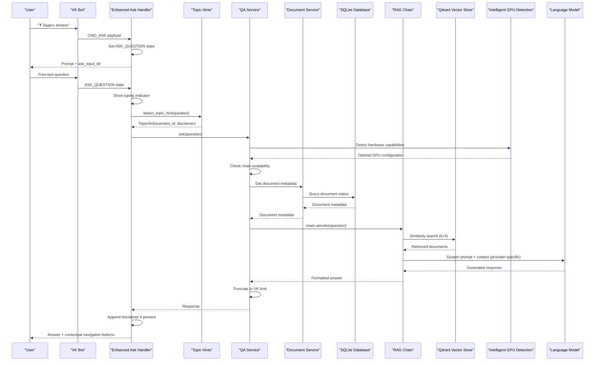
```mermaid
sequenceDiagram
participant User as "User"
participant VKBot as "VK Bot"
participant AskHandler as "Enhanced Ask Handler"
participant TopicHints as "Topic Hints"
participant QAService as "QA Service"
participant DocumentService as "Document Service"
participant SQLite as "SQLite Database"
participant RAGChain as "RAG Chain"
participant Qdrant as "Qdrant Vector Store"
participant GPUDetection as "Intelligent GPU Detection"
participant LLM as "Language Model"
User->>VKBot : "❓ Задать вопрос"
VKBot->>AskHandler : CMD_ASK payload
AskHandler->>AskHandler : Set ASK_QUESTION state
AskHandler-->>User : Prompt + ask_input_kb
User->>VKBot : Free-text question
VKBot->>AskHandler : ASK_QUESTION state
AskHandler->>AskHandler : Show typing indicator
AskHandler->>TopicHints : detect_topic_hint(question)
TopicHints-->>AskHandler : TopicHint(scenario_id, disclaimer)
AskHandler->>QAService : ask(question)
QAService->>GPUDetection : Detect hardware capabilities
GPUDetection-->>QAService : Optimal GPU configuration
QAService->>QAService : Check chain availability
QAService->>DocumentService : Get document metadata
DocumentService->>SQLite : Query document status
SQLite-->>DocumentService : Document metadata
DocumentService-->>QAService : Document metadata
QAService->>RAGChain : chain.ainvoke(question)
RAGChain->>Qdrant : Similarity search (k=4)
Qdrant-->>RAGChain : Retrieved documents
RAGChain->>LLM : System prompt + context (provider-specific)
LLM-->>RAGChain : Generated response
RAGChain-->>QAService : Formatted answer
QAService->>QAService : Truncate to VK limit
QAService-->>AskHandler : Response
AskHandler->>AskHandler : Append disclaimer if present
AskHandler-->>User : Answer + contextual navigation buttons
```

**Diagram sources**
- [app/integrations/vk/handlers/ask.py:49-86](file://app/integrations/vk/handlers/ask.py#L49-L86)
- [app/domain/qa_service.py:86-105](file://app/domain/qa_service.py#L86-L105)
- [app/rag/chain.py:61-80](file://app/rag/chain.py#L61-L80)
- [app/rag/retriever.py:64-74](file://app/rag/retriever.py#L64-L74)
- [app/domain/topic_hints.py:87-109](file://app/domain/topic_hints.py#L87-L109)
- [app/domain/document_service.py:92-130](file://app/domain/document_service.py#L92-L130)
- [scripts/run_llama_llm.sh:5-18](file://scripts/run_llama_llm.sh#L5-L18)
- [scripts/run_llama_embeddings.sh:5-18](file://scripts/run_llama_embeddings.sh#L5-L18)
- [scripts/run_ollama_llm.sh:5-18](file://scripts/run_ollama_llm.sh#L5-L18)
- [scripts/run_ollama_embeddings.sh:5-18](file://scripts/run_ollama_embeddings.sh#L5-L18)

## Detailed Component Analysis

### Enhanced VK Bot Integration
The VK bot maintains its existing handler structure while integrating the new RAG capabilities through the enhanced ask handler and QA service layer. The ask handler now serves as the sophisticated entry point for free-form questions with comprehensive state management, user experience enhancements, and seamless integration with the RAG infrastructure supporting multiple LLM providers with optimized GPU detection.

**Updated** The ask handler provides a sophisticated multi-step dialog flow with proper state management, typing indicators, topic hints detection, contextual navigation, and enhanced user experience features across all supported LLM providers with intelligent GPU optimization.

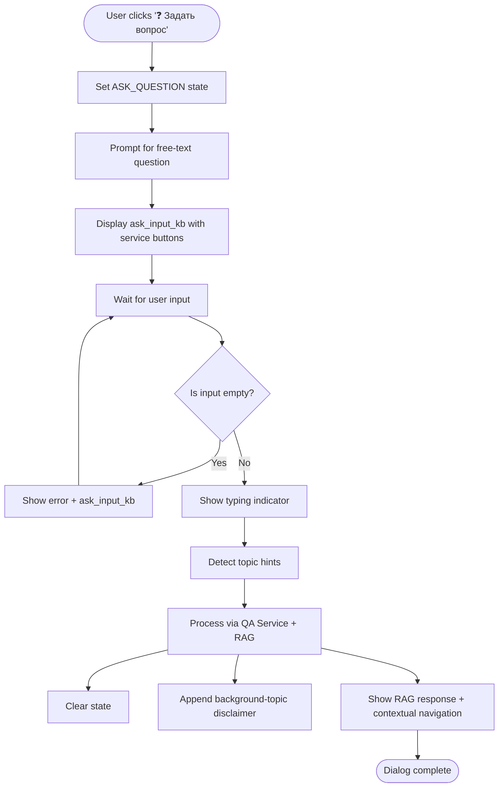
```mermaid
flowchart TD
Start(["User clicks '❓ Задать вопрос'"]) --> SetState["Set ASK_QUESTION state"]
SetState --> Prompt["Prompt for free-text question"]
Prompt --> ShowKB["Display ask_input_kb with service buttons"]
ShowKB --> WaitInput["Wait for user input"]
WaitInput --> Validate{"Is input empty?"}
Validate --> |Yes| ShowError["Show error + ask_input_kb"]
ShowError --> WaitInput
Validate --> |No| ShowTyping["Show typing indicator"]
ShowTyping --> DetectTopic["Detect topic hints"]
DetectTopic --> ProcessQuestion["Process via QA Service + RAG"]
ProcessQuestion --> ClearState["Clear state"]
ProcessQuestion --> AppendDisclaimer["Append background-topic disclaimer"]
ProcessQuestion --> ShowResponse["Show RAG response + contextual navigation"]
ShowResponse --> End(["Dialog complete"])
```

**Diagram sources**
- [app/integrations/vk/handlers/ask.py:34-86](file://app/integrations/vk/handlers/ask.py#L34-L86)

**Section sources**
- [app/integrations/vk/bot.py:24-56](file://app/integrations/vk/bot.py#L24-L56)
- [app/integrations/vk/handlers/ask.py:1-86](file://app/integrations/vk/handlers/ask.py#L1-L86)

### Enhanced Ask Handler - Multi-Step Dialog Flow
The ask handler implements a sophisticated two-step dialog flow that captures user questions, processes them through the RAG pipeline via the QA service, and provides enhanced user experience features across all supported LLM providers:

**Step 1: Entry Point (CMD_ASK)**
- Sets the ASK_QUESTION state using the shared state dispenser
- Prompts user to enter their question
- Displays ask_input_kb keyboard with service buttons

**Step 2: State Handler (ASK_QUESTION)**
- Captures free-text input from user
- Validates non-empty input
- Shows typing indicator using VK API set_activity
- Detects topic hints for contextual navigation and disclaimers
- Processes question through QA service and RAG chain with provider-specific configuration
- Appends background-topic disclaimer if detected
- Clears state after processing
- Returns formatted response with contextual navigation buttons

**Updated** Enhanced with typing indicators, topic hints detection, background-topic disclaimers, contextual navigation buttons, and comprehensive LLM provider support for improved user experience with optimized GPU detection.

**Section sources**
- [app/integrations/vk/handlers/ask.py:34-86](file://app/integrations/vk/handlers/ask.py#L34-L86)

## Topic Hints Detection System
The topic hints system provides intelligent keyword-based detection for contextual navigation and background-topic disclaimers, enhancing the RAG response with relevant navigation options and appropriate disclaimers.

**Updated** Comprehensive topic hints detection system with scenario-based navigation and background-topic disclaimers for enhanced user experience across all LLM providers with optimized GPU detection.

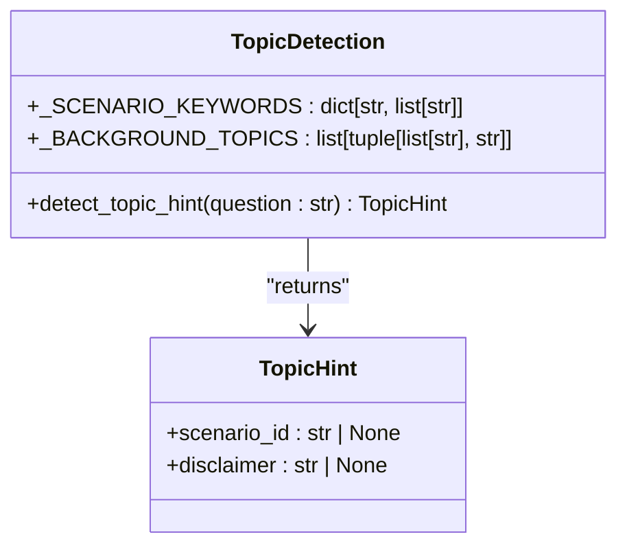
```mermaid
classDiagram
class TopicHint {
+scenario_id : str | None
+disclaimer : str | None
}
class TopicDetection {
+_SCENARIO_KEYWORDS : dict[str, list[str]]
+_BACKGROUND_TOPICS : list[tuple[list[str], str]]
+detect_topic_hint(question : str) TopicHint
}
TopicDetection --> TopicHint : "returns"
```

**Diagram sources**
- [app/domain/topic_hints.py:14-26](file://app/domain/topic_hints.py#L14-L26)
- [app/domain/topic_hints.py:87-109](file://app/domain/topic_hints.py#L87-L109)

### Scenario-Based Navigation Keywords
The system detects clickable scenarios with comprehensive keyword matching for seamless navigation:

- **Hire**: Приём, прием, оформление сотрудника, трудовой договор, онбординг
- **Fire**: Увольнение, уволиться, уволить, последний рабочий день, обходной лист
- **Vacation**: Отпуск, отпускные, заявление на отпуск, график отпусков
- **Pay**: Зарплата, премия, оплата труда, сверхурочные
- **Sick**: Больничный, элн, электронный листок нетрудоспособности, нетрудоспособность
- **Probation**: Испытательный срок

### Background-Topic Disclaimers
The system provides appropriate disclaimers for sensitive HR topics:

- **Transfer**: "По этой теме рекомендуем согласовать оформление напрямую с HR."
- **Disciplinary Actions**: "По вопросам дисциплинарных процедур обратитесь в HR-отдел."
- **Absenteeism**: "По вопросам увольнения за прогул обратитесь в HR-отдел."

**Section sources**
- [app/domain/topic_hints.py:14-26](file://app/domain/topic_hints.py#L14-L26)
- [app/domain/topic_hints.py:30-67](file://app/domain/topic_hints.py#L30-L67)
- [app/domain/topic_hints.py:71-84](file://app/domain/topic_hints.py#L71-L84)
- [app/domain/topic_hints.py:87-109](file://app/domain/topic_hints.py#L87-L109)

## RAG Infrastructure Implementation

### Configuration Management
The Settings class provides comprehensive configuration for the RAG infrastructure with sensible defaults and environment variable support:

- **Qdrant Configuration**: URL, API key, and collection name for vector storage
- **LLM Provider Options**: Support for Ollama, OpenAI-compatible, and llama.cpp providers
- **Model Specifications**: Configurable model names and base URLs for flexible deployment
- **Embedding Models**: Flexible embedding model selection compatible with all providers

**Updated** Enhanced configuration management with comprehensive RAG-specific settings, provider flexibility including llama.cpp support, and comprehensive environment variable support for all three LLM providers with optimized GPU detection.

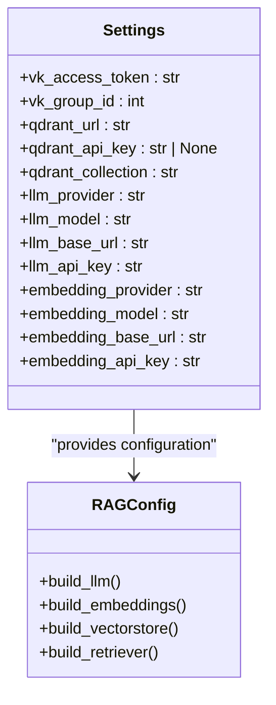
```mermaid
classDiagram
class Settings {
+vk_access_token : str
+vk_group_id : int
+qdrant_url : str
+qdrant_api_key : str | None
+qdrant_collection : str
+llm_provider : str
+llm_model : str
+llm_base_url : str
+llm_api_key : str
+embedding_provider : str
+embedding_model : str
+embedding_base_url : str
+embedding_api_key : str
}
class RAGConfig {
+build_llm()
+build_embeddings()
+build_vectorstore()
+build_retriever()
}
Settings --> RAGConfig : "provides configuration"
```

**Diagram sources**
- [app/config.py:4-23](file://app/config.py#L4-L23)
- [app/rag/chain.py:30-58](file://app/rag/chain.py#L30-L58)
- [app/rag/retriever.py:22-48](file://app/rag/retriever.py#L22-L48)

**Section sources**
- [app/config.py:4-23](file://app/config.py#L4-L23)

### RAG Chain Construction
The build_rag_chain function creates a complete LangChain pipeline that orchestrates the entire RAG process with comprehensive provider support:

- **Document Formatting**: Combines retrieved documents with custom separator formatting
- **Prompt Composition**: Uses system prompt with dynamic context injection
- **LLM Integration**: Supports Ollama, OpenAI-compatible, and llama.cpp providers with provider-specific configuration
- **Output Parsing**: Converts LLM output to clean text response
- **Provider Detection**: Automatic provider selection based on configuration with comprehensive error handling

**Updated** Complete implementation of the RAG chain with comprehensive error handling, logging, provider flexibility including llama.cpp support, and OpenAI-compatible API interface for local llama.cpp deployments with optimized GPU detection.

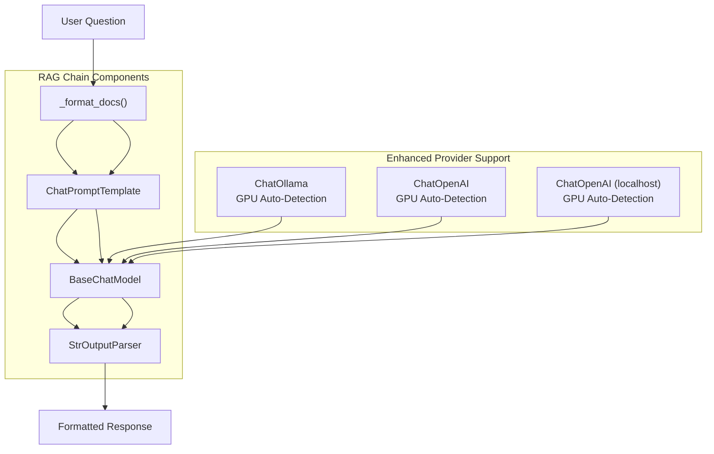
```mermaid
flowchart TD
Input["User Question"] --> FormatDocs["_format_docs()"]
FormatDocs --> Prompt["ChatPromptTemplate"]
Prompt --> LLM["BaseChatModel"]
LLM --> Parser["StrOutputParser"]
Parser --> Output["Formatted Response"]
subgraph "RAG Chain Components"
FormatDocs --> Prompt
Prompt --> LLM
LLM --> Parser
end
subgraph "Enhanced Provider Support"
Ollama["ChatOllama<br/>GPU Auto-Detection"] --> LLM
OpenAI["ChatOpenAI<br/>GPU Auto-Detection"] --> LLM
LlamaCPP["ChatOpenAI (localhost)<br/>GPU Auto-Detection"] --> LLM
end
```

**Diagram sources**
- [app/rag/chain.py:25-80](file://app/rag/chain.py#L25-L80)
- [app/rag/chain.py:30-73](file://app/rag/chain.py#L30-L73)
- [scripts/run_llama_llm.sh:5-18](file://scripts/run_llama_llm.sh#L5-L18)
- [scripts/run_ollama_llm.sh:5-18](file://scripts/run_ollama_llm.sh#L5-L18)

**Section sources**
- [app/rag/chain.py:1-95](file://app/rag/chain.py#L1-L95)

### Vector Store and Retrieval
The retriever module provides comprehensive vector store integration with Qdrant and embedding model support for all LLM providers:

- **Embedding Models**: Support for OpenAI embeddings, Ollama embeddings, and llama.cpp embeddings through OpenAI-compatible interface
- **Vector Store Creation**: Wraps Qdrant collection into LangChain vector store
- **Retrieval Configuration**: Configurable similarity search parameters with search filtering
- **Collection Management**: Automatic collection creation and management
- **Provider Flexibility**: Embedding model selection based on LLM provider configuration

**Updated** Full implementation of vector store integration with comprehensive error handling, provider flexibility, llama.cpp support through OpenAI-compatible embeddings, automatic embedding model selection, and search filtering for document participation control with optimized GPU detection.

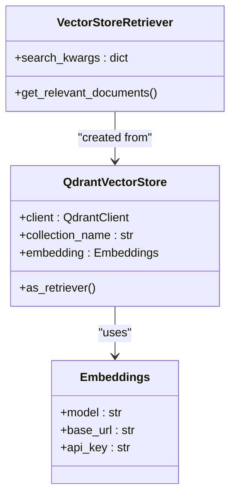
```mermaid
classDiagram
class QdrantVectorStore {
+client : QdrantClient
+collection_name : str
+embedding : Embeddings
+as_retriever()
}
class Embeddings {
+model : str
+base_url : str
+api_key : str
}
class VectorStoreRetriever {
+search_kwargs : dict
+get_relevant_documents()
}
QdrantVectorStore --> Embeddings : "uses"
VectorStoreRetriever --> QdrantVectorStore : "created from"
```

**Diagram sources**
- [app/rag/retriever.py:51-74](file://app/rag/retriever.py#L51-L74)
- [app/rag/retriever.py:22-48](file://app/rag/retriever.py#L22-L48)

**Section sources**
- [app/rag/retriever.py:1-103](file://app/rag/retriever.py#L1-L103)

### Enhanced Chunk Indexer Operations
The indexer module provides comprehensive Qdrant-specific operations for document chunk management:

- **Chunk Preparation**: Enriches chunks with document metadata and unique chunk IDs
- **Bulk Indexing**: Adds prepared chunks to Qdrant collection with error handling
- **Document Deletion**: Removes all chunks belonging to a specific document
- **Search Control**: Updates is_search_enabled flag for document participation
- **Chunk Counting**: Returns the number of chunks for a document
- **Dot-Notation Updates**: Uses Qdrant dot-notation for precise payload updates

**Updated** Complete implementation of chunk indexing operations with comprehensive error handling, metadata enrichment, bulk operations, and precise Qdrant payload management with enhanced GPU detection capabilities.

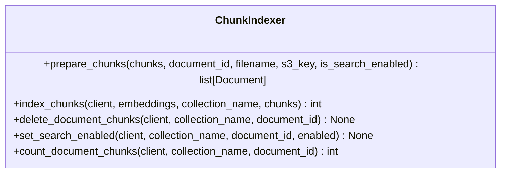
```mermaid
classDiagram
class ChunkIndexer {
+prepare_chunks(chunks, document_id, filename, s3_key, is_search_enabled) list[Document]
+index_chunks(client, embeddings, collection_name, chunks) int
+delete_document_chunks(client, collection_name, document_id) None
+set_search_enabled(client, collection_name, document_id, enabled) None
+count_document_chunks(client, collection_name, document_id) int
}
```

**Diagram sources**
- [app/rag/indexer.py:23-72](file://app/rag/indexer.py#L23-L72)
- [app/rag/indexer.py:74-152](file://app/rag/indexer.py#L74-L152)

**Section sources**
- [app/rag/indexer.py:1-152](file://app/rag/indexer.py#L1-L152)

## Document Storage System

### SQLite Database Integration
The document storage system provides comprehensive metadata management through SQLite database integration with automatic table creation and initialization:

- **Database Initialization**: Automatic creation of documents table with proper schema and constraints
- **Directory Management**: Ensures database directory exists before connection
- **Idempotent Operations**: Safe repeated initialization without errors
- **Logging**: Comprehensive logging for database operations and initialization status

**Updated** Complete SQLite database integration with automatic table creation, directory management, idempotent initialization, and comprehensive logging for all database operations with enhanced GPU detection support.

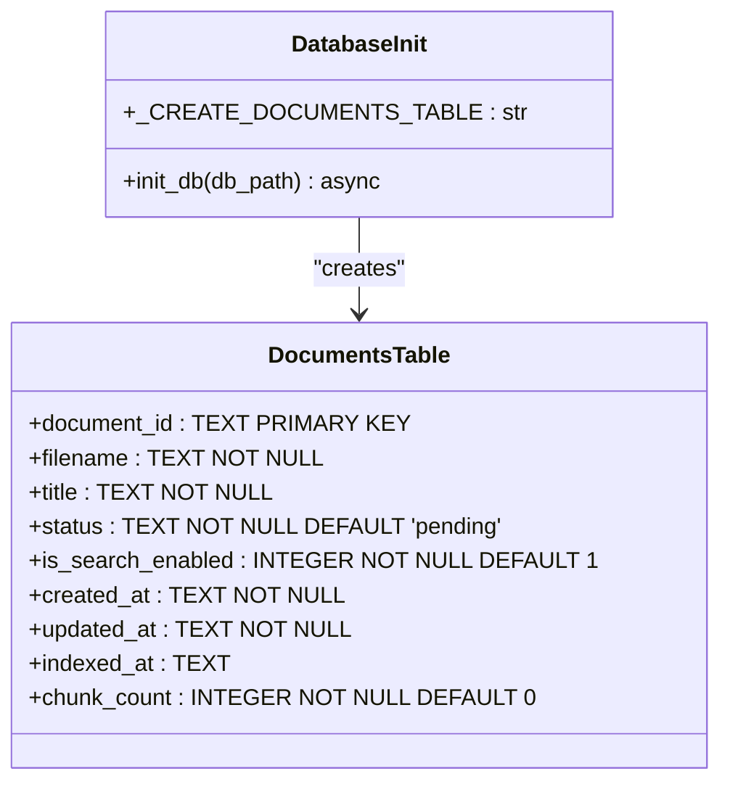
```mermaid
classDiagram
class DatabaseInit {
+init_db(db_path) async
+_CREATE_DOCUMENTS_TABLE : str
}
class DocumentsTable {
+document_id : TEXT PRIMARY KEY
+filename : TEXT NOT NULL
+title : TEXT NOT NULL
+status : TEXT NOT NULL DEFAULT 'pending'
+is_search_enabled : INTEGER NOT NULL DEFAULT 1
+created_at : TEXT NOT NULL
+updated_at : TEXT NOT NULL
+indexed_at : TEXT
+chunk_count : INTEGER NOT NULL DEFAULT 0
}
DatabaseInit --> DocumentsTable : "creates"
```

**Diagram sources**
- [app/storage/database.py:31-38](file://app/storage/database.py#L31-L38)
- [app/storage/database.py:12-28](file://app/storage/database.py#L12-L28)

**Section sources**
- [app/storage/database.py:1-38](file://app/storage/database.py#L1-L38)

### Document Record Model
The DocumentRecord model provides comprehensive metadata representation for document storage with Pydantic validation and type safety:

- **Status Enum**: DocumentStatus with pending, processing, completed, failed states
- **Search Control**: is_search_enabled flag for RAG retrieval participation
- **Timestamp Management**: created_at, updated_at, indexed_at with timezone-aware datetime
- **Chunk Tracking**: chunk_count for indexing statistics
- **Error Handling**: error field for processing failure details
- **Pydantic Validation**: Automatic validation and serialization

**Updated** Comprehensive DocumentRecord model with Pydantic validation, status enumeration, search control, timestamp management, chunk tracking, and error handling for complete document metadata management with enhanced GPU detection capabilities.

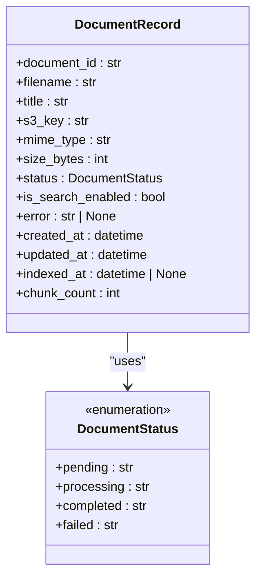
```mermaid
classDiagram
class DocumentStatus {
<<enumeration>>
+pending : str
+processing : str
+completed : str
+failed : str
}
class DocumentRecord {
+document_id : str
+filename : str
+title : str
+s3_key : str
+mime_type : str
+size_bytes : int
+status : DocumentStatus
+is_search_enabled : bool
+error : str | None
+created_at : datetime
+updated_at : datetime
+indexed_at : datetime | None
+chunk_count : int
}
DocumentRecord --> DocumentStatus : "uses"
```

**Diagram sources**
- [app/storage/models.py:11-36](file://app/storage/models.py#L11-L36)

**Section sources**
- [app/storage/models.py:1-36](file://app/storage/models.py#L1-L36)

### Document Repository - CRUD Operations
The DocumentRepository provides comprehensive asynchronous CRUD operations for document metadata with SQLite backend:

- **Create Operations**: Insert new document records with automatic timestamp management
- **Read Operations**: Get single records by ID and list all records ordered by creation date
- **Update Operations**: Partial updates with selective field updates and timestamp bumping
- **Search Toggle**: Toggle is_search_enabled flag without affecting processing status
- **Delete Operations**: Remove document records with proper row count validation
- **Async Operations**: Full aiosqlite integration for non-blocking database operations
- **Type Safety**: Strict type checking and validation for all operations

**Updated** Complete DocumentRepository implementation with comprehensive CRUD operations, async SQLite integration, type safety, timestamp management, selective updates, and comprehensive error handling for all document metadata operations with enhanced GPU detection support.

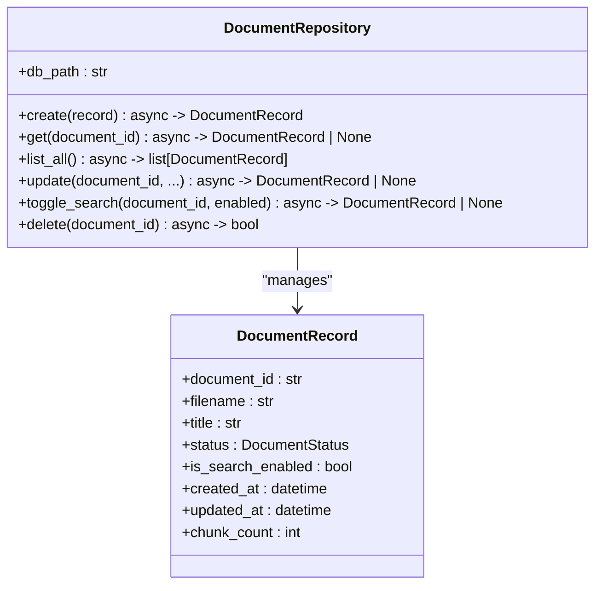
```mermaid
classDiagram
class DocumentRepository {
+db_path : str
+create(record) async -> DocumentRecord
+get(document_id) async -> DocumentRecord | None
+list_all() async -> list[DocumentRecord]
+update(document_id, ...) async -> DocumentRecord | None
+toggle_search(document_id, enabled) async -> DocumentRecord | None
+delete(document_id) async -> bool
}
class DocumentRecord {
+document_id : str
+filename : str
+title : str
+status : DocumentStatus
+is_search_enabled : bool
+created_at : datetime
+updated_at : datetime
+chunk_count : int
}
DocumentRepository --> DocumentRecord : "manages"
```

**Diagram sources**
- [app/storage/document_repo.py:61-202](file://app/storage/document_repo.py#L61-L202)
- [app/storage/models.py:20-36](file://app/storage/models.py#L20-L36)

**Section sources**
- [app/storage/document_repo.py:1-202](file://app/storage/document_repo.py#L1-L202)

## Document Lifecycle Management

### Document Service Orchestration
The DocumentService provides comprehensive document lifecycle management coordinating between SQLite metadata, Qdrant vector storage, and optional file storage:

- **Document Registration**: Create document records with pending status and metadata
- **Indexing Pipeline**: Process document chunks through preparation, enrichment, and indexing
- **Status Management**: Automatic status transitions from pending to processing to completed/failed
- **Search Control**: Toggle document participation in RAG retrieval with synchronized updates
- **Reindexing**: Delete old chunks and create new ones for updated documents
- **Deletion**: Complete cleanup including metadata, vectors, and optional file removal
- **Error Handling**: Comprehensive error handling with detailed logging and status updates

**Updated** Complete DocumentService implementation with full document lifecycle management, status transitions, search control synchronization, error handling, and comprehensive cleanup procedures for all document operations with enhanced GPU detection capabilities.

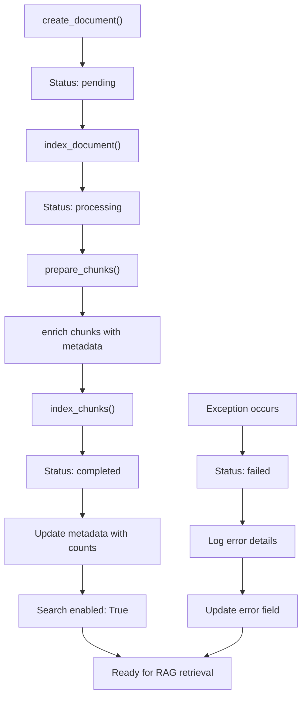
```mermaid
flowchart TD
CreateDoc["create_document()"] --> PendingStatus["Status: pending"]
PendingStatus --> IndexDoc["index_document()"]
IndexDoc --> ProcessingStatus["Status: processing"]
ProcessingStatus --> PrepareChunks["prepare_chunks()"]
PrepareChunks --> EnrichChunks["enrich chunks with metadata"]
EnrichChunks --> IndexChunks["index_chunks()"]
IndexChunks --> CompletedStatus["Status: completed"]
CompletedStatus --> UpdateMetadata["Update metadata with counts"]
UpdateMetadata --> SearchEnabled["Search enabled: True"]
SearchEnabled --> ReadyForRAG["Ready for RAG retrieval"]
ErrorPath["Exception occurs"] --> FailedStatus["Status: failed"]
FailedStatus --> LogError["Log error details"]
LogError --> UpdateError["Update error field"]
UpdateError --> ReadyForRAG
```

**Diagram sources**
- [app/domain/document_service.py:55-130](file://app/domain/document_service.py#L55-L130)
- [app/domain/document_service.py:145-176](file://app/domain/document_service.py#L145-L176)

**Section sources**
- [app/domain/document_service.py:1-280](file://app/domain/document_service.py#L1-L280)

### Enhanced Status Management and Processing Flow
The document processing pipeline implements a robust status management system with automatic transitions and comprehensive error handling:

- **Pending State**: Initial registration with metadata and pending status
- **Processing State**: Active indexing with error clearing
- **Completed State**: Successful indexing with chunk count and timestamp
- **Failed State**: Error recording with exception details
- **Search Control**: Separate toggle for RAG participation independent of processing status
- **Timestamp Management**: Automatic creation and update timestamps
- **Chunk Tracking**: Accurate counting of indexed document chunks

**Updated** Comprehensive status management system with automatic state transitions, error handling, search control independence, timestamp management, and chunk tracking for complete document lifecycle visibility with enhanced GPU detection support.

**Section sources**
- [app/domain/document_service.py:82-130](file://app/domain/document_service.py#L82-L130)
- [app/domain/document_service.py:145-176](file://app/domain/document_service.py#L145-L176)

### Enhanced Document Parser and Chunking
The parser module provides comprehensive Word document processing with section extraction and configurable chunking parameters:

- **Section Extraction**: Identifies document sections using heading styles
- **Text Chunking**: Uses recursive character splitting with configurable chunk size (1000 chars) and overlap (200 chars)
- **Metadata Preservation**: Maintains source filename and section information
- **Document Creation**: Creates LangChain Document objects with proper metadata
- **Flexible Chunking**: Configurable chunk size and overlap parameters for optimal performance

**Updated** Complete document parsing implementation with comprehensive error handling, metadata preservation, configurable chunking parameters (chunk_size: 1000, chunk_overlap: 200), and integration with the ingestion pipeline with enhanced GPU detection capabilities.

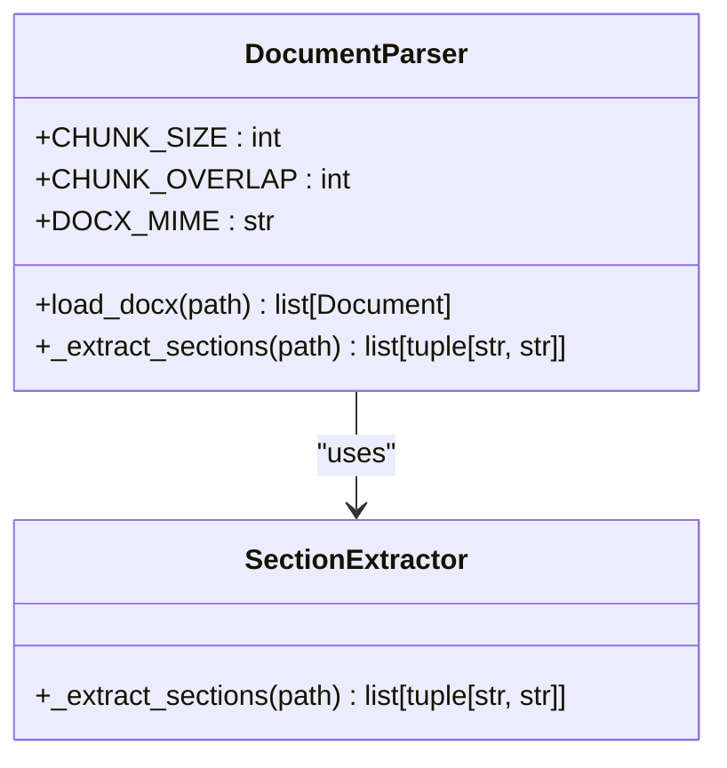
```mermaid
classDiagram
class DocumentParser {
+load_docx(path) list[Document]
+_extract_sections(path) list[tuple[str, str]]
+CHUNK_SIZE : int
+CHUNK_OVERLAP : int
+DOCX_MIME : str
}
class SectionExtractor {
+_extract_sections(path) list[tuple[str, str]]
}
DocumentParser --> SectionExtractor : "uses"
```

**Diagram sources**
- [app/rag/parser.py:23-83](file://app/rag/parser.py#L23-L83)

**Section sources**
- [app/rag/parser.py:1-144](file://app/rag/parser.py#L1-L144)

## QA Service Implementation

### Singleton Pattern Architecture
The QA service implements a singleton pattern with module-level state management, providing a centralized interface for RAG chain operations with comprehensive provider support:

- **Module-Level State**: Global chain and Qdrant client instances
- **Initialization**: One-time setup during application startup with provider-specific configuration
- **Resource Management**: Proper cleanup and error handling across all LLM providers
- **Thread Safety**: Safe concurrent access to the RAG chain
- **Provider Flexibility**: Support for all three LLM providers through unified interface

**Updated** Complete implementation of the QA service with singleton pattern, comprehensive error handling, text truncation capabilities, provider flexibility, and proper resource cleanup for all supported LLM providers with optimized GPU detection.

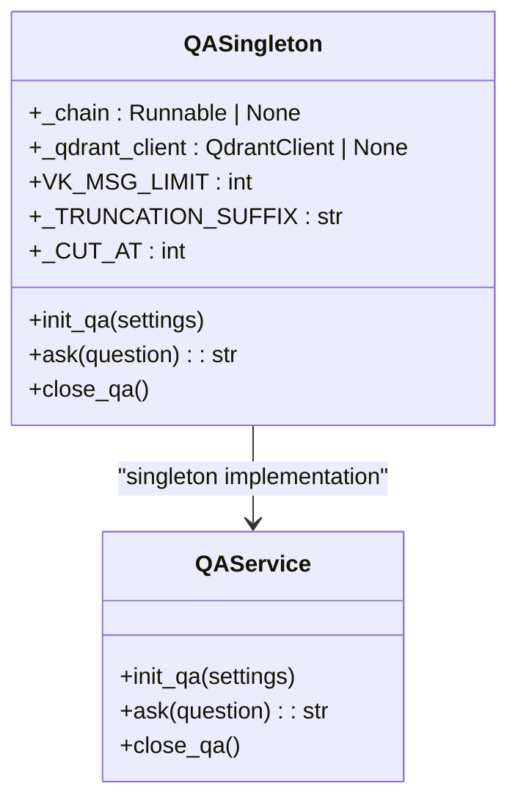
```mermaid
classDiagram
class QASingleton {
+_chain : Runnable | None
+_qdrant_client : QdrantClient | None
+VK_MSG_LIMIT : int
+_TRUNCATION_SUFFIX : str
+_CUT_AT : int
+init_qa(settings)
+ask(question) : str
+close_qa()
}
class QAService {
+init_qa(settings)
+ask(question) : str
+close_qa()
}
QASingleton --> QAService : "singleton implementation"
```

**Diagram sources**
- [app/domain/qa_service.py:23-120](file://app/domain/qa_service.py#L23-L120)

### Text Truncation and Error Handling
The QA service provides sophisticated text processing capabilities:

- **Message Limit Enforcement**: VK message length limit (4096 characters)
- **Word Boundary Preservation**: Truncation at word boundaries to avoid partial words
- **Fallback Messages**: Contextual error messages for unavailable documents
- **Graceful Degradation**: Fallback responses when RAG chain is unavailable
- **Provider Error Handling**: Comprehensive error handling for all LLM providers

**Updated** Comprehensive text truncation with Russian language suffix and robust error handling for production scenarios across all supported LLM providers with optimized GPU detection.

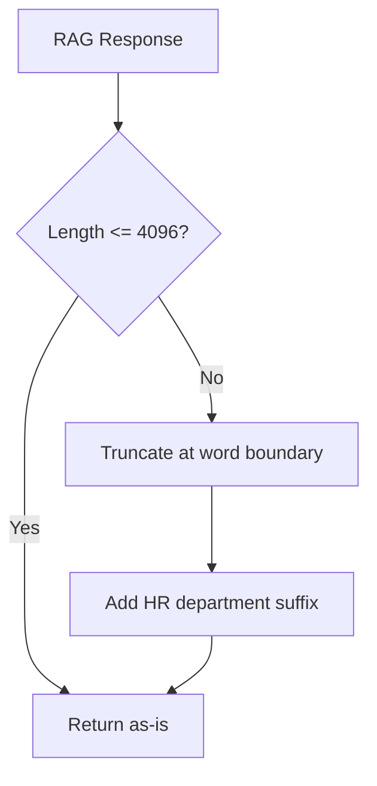
```mermaid
flowchart TD
Answer["RAG Response"] --> CheckLimit{"Length <= 4096?"}
CheckLimit --> |Yes| ReturnAnswer["Return as-is"]
CheckLimit --> |No| Truncate["Truncate at word boundary"]
Truncate --> AddSuffix["Add HR department suffix"]
AddSuffix --> ReturnAnswer
```

**Diagram sources**
- [app/domain/qa_service.py:36-45](file://app/domain/qa_service.py#L36-L45)

**Section sources**
- [app/domain/qa_service.py:1-120](file://app/domain/qa_service.py#L1-L120)

### Application Lifecycle Integration
The QA service integrates with the application lifecycle through initialization and shutdown:

- **Startup Initialization**: RAG chain creation during bot startup with provider-specific configuration
- **Graceful Shutdown**: Resource cleanup and connection closure
- **Error Resilience**: Graceful degradation when services are unavailable
- **State Management**: Persistent module-level state across handler calls
- **Provider Support**: Comprehensive integration with all three LLM providers

**Updated** Complete lifecycle management with proper resource cleanup, error resilience, graceful degradation, and comprehensive provider support for all LLM providers with enhanced GPU detection.

**Section sources**
- [scripts/polling_vk.py:25-38](file://scripts/polling_vk.py#L25-L38)
- [app/domain/qa_service.py:51-120](file://app/domain/qa_service.py#L51-L120)

## Configuration Management

### Settings Class
The Settings class provides comprehensive configuration management for the RAG infrastructure:

- **Qdrant Settings**: URL, API key, and collection name with sensible defaults
- **LLM Provider Configuration**: Support for Ollama, OpenAI-compatible, and llama.cpp providers with provider-specific settings
- **Model Selection**: Configurable model names and base URLs for flexible deployment across all providers
- **Environment Variable Support**: Full configuration via environment variables for all provider types

**Updated** Enhanced configuration with comprehensive RAG-specific settings, provider flexibility including llama.cpp support, and comprehensive environment variable support for all three LLM providers with optimized GPU detection.

**Section sources**
- [app/config.py:4-23](file://app/config.py#L4-L23)

### Dependency Management
The pyproject.toml file includes comprehensive dependencies for the RAG infrastructure:

- **Core Dependencies**: FastAPI, LangChain, Qdrant client, and VK integration
- **Optional Dependencies**: OpenAI-compatible, Ollama, and llama.cpp adapters for flexible deployment
- **Development Dependencies**: Testing and linting tools for quality assurance

**Updated** Expanded dependency management with comprehensive LangChain and Qdrant integration, plus llama.cpp support through OpenAI-compatible adapter with enhanced GPU detection capabilities.

**Section sources**
- [pyproject.toml:14-33](file://pyproject.toml#L14-L33)

## Document Ingestion Pipeline

### Enhanced Word Document Processing
The ingestion script provides comprehensive document processing capabilities with configurable chunking parameters:

- **Section Extraction**: Extracts headings and associated content from Word documents
- **Enhanced Chunking Strategy**: Uses recursive character splitting with configurable chunk size (1000 chars) and overlap (200 chars)
- **Metadata Preservation**: Maintains source filename and section information
- **Collection Management**: Handles collection recreation and cleanup
- **SQLite Integration**: Automatic document registration and status updates

**Updated** Complete implementation of document ingestion with comprehensive error handling, metadata preservation, SQLite integration, configurable chunking parameters (chunk_size: 1000, chunk_overlap: 200), and flexible chunking strategy compatible with all embedding providers and optimized GPU detection.

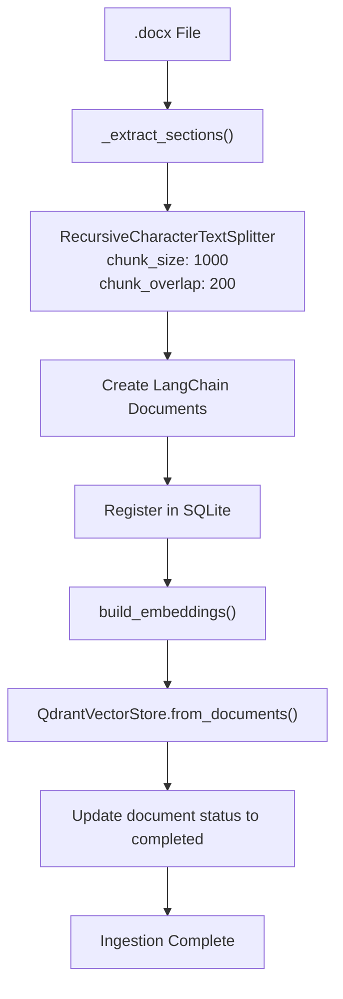
```mermaid
flowchart TD
DocxFile[".docx File"] --> ExtractSections["_extract_sections()"]
ExtractSections --> SplitText["RecursiveCharacterTextSplitter<br/>chunk_size: 1000<br/>chunk_overlap: 200"]
SplitText --> CreateDocuments["Create LangChain Documents"]
CreateDocuments --> RegisterDocument["Register in SQLite"]
RegisterDocument --> BuildEmbeddings["build_embeddings()"]
BuildEmbeddings --> StoreQdrant["QdrantVectorStore.from_documents()"]
StoreQdrant --> UpdateStatus["Update document status to completed"]
UpdateStatus --> Success["Ingestion Complete"]
```

**Diagram sources**
- [scripts/ingest.py:130-254](file://scripts/ingest.py#L130-L254)

**Section sources**
- [scripts/ingest.py:1-188](file://scripts/ingest.py#L1-L188)

### Enhanced Ingestion Workflow
The ingestion process follows a systematic approach to prepare documents for RAG with optimized chunking parameters:

1. **File Discovery**: Scans directory for .docx files
2. **Section Extraction**: Identifies document sections using heading styles
3. **Enhanced Text Chunking**: Splits content into manageable chunks with configurable parameters (chunk_size: 1000, chunk_overlap: 200)
4. **Metadata Assignment**: Adds source and section information
5. **Vector Generation**: Creates embeddings for each chunk using provider-specific embedding models
6. **Storage**: Stores vectors in Qdrant collection
7. **Status Update**: Updates SQLite metadata with completion status and chunk counts
8. **Error Handling**: Comprehensive error handling with status updates for failed documents

**Updated** Comprehensive ingestion workflow with error handling, progress reporting, SQLite metadata updates, configurable chunking parameters, provider-specific embedding model support, and optimized GPU detection capabilities.

**Section sources**
- [scripts/ingest.py:130-254](file://scripts/ingest.py#L130-L254)

## LangChain Integration

### Enhanced Provider Flexibility
The RAG infrastructure supports multiple LLM providers through a unified interface with comprehensive error handling and intelligent GPU detection:

- **Ollama Support**: Local inference with configurable model selection and base URL, with automatic GPU detection
- **OpenAI Compatibility**: Cloud-based LLMs with API key authentication and custom base URLs, with automatic GPU optimization
- **llama.cpp Support**: Local inference with configurable base URL pointing to llama.cpp server, with comprehensive GPU detection
- **Provider Detection**: Automatic provider selection based on configuration with comprehensive error handling
- **Error Handling**: Comprehensive error handling for missing dependencies and provider-specific configurations
- **GPU Optimization**: Intelligent GPU detection for Apple Silicon (Metal) and NVIDIA GPUs (CUDA) with automatic optimization

**Updated** Complete implementation of provider flexibility with comprehensive error handling, llama.cpp support through OpenAI-compatible adapter, unified interface across all three providers, and intelligent GPU detection for optimal performance.

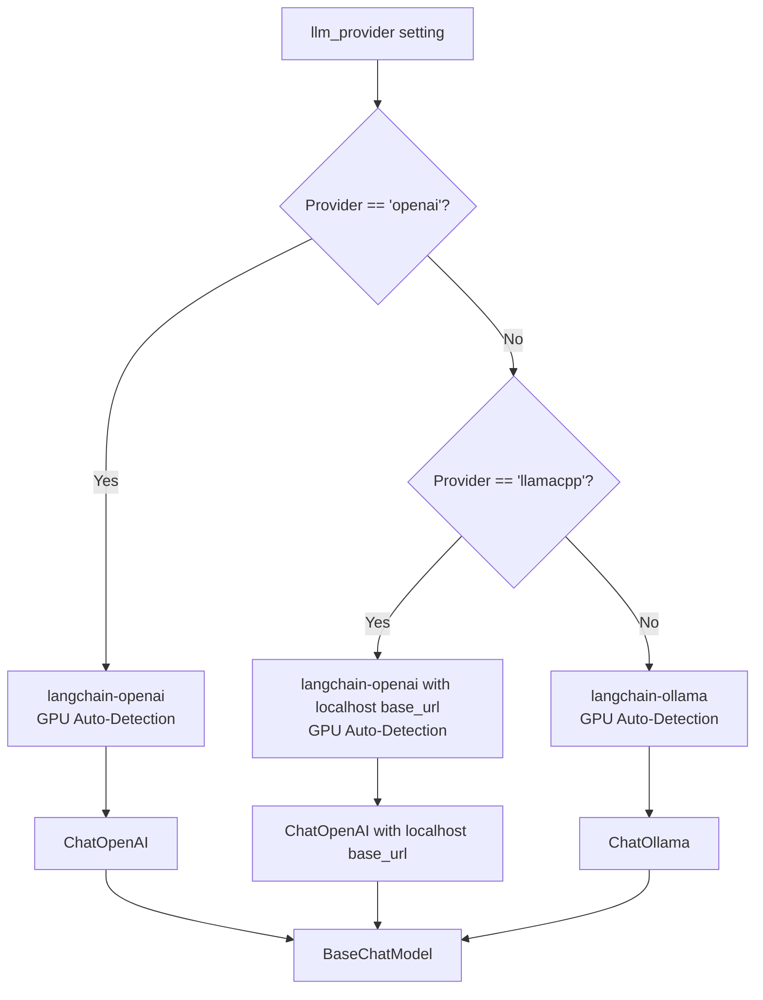
```mermaid
flowchart TD
ProviderConfig["llm_provider setting"] --> CheckOpenAI{"Provider == 'openai'?"}
CheckOpenAI --> |Yes| OpenAIAdapter["langchain-openai<br/>GPU Auto-Detection"]
CheckOpenAI --> |No| CheckLlamaCPP{"Provider == 'llamacpp'?"}
CheckLlamaCPP --> |Yes| LlamaCPPAdapter["langchain-openai with localhost base_url<br/>GPU Auto-Detection"]
CheckLlamaCPP --> |No| OllamaAdapter["langchain-ollama<br/>GPU Auto-Detection"]
OpenAIAdapter --> ChatOpenAI["ChatOpenAI"]
LlamaCPPAdapter --> ChatOpenAICustom["ChatOpenAI with localhost base_url"]
OllamaAdapter --> ChatOllama["ChatOllama"]
ChatOpenAI --> LLMInstance["BaseChatModel"]
ChatOpenAICustom --> LLMInstance
ChatOllama --> LLMInstance
```

**Diagram sources**
- [app/rag/chain.py:30-73](file://app/rag/chain.py#L30-L73)
- [scripts/run_llama_llm.sh:5-18](file://scripts/run_llama_llm.sh#L5-L18)
- [scripts/run_ollama_llm.sh:5-18](file://scripts/run_ollama_llm.sh#L5-L18)

**Section sources**
- [app/rag/chain.py:30-73](file://app/rag/chain.py#L30-L73)

### System Prompts
The system prompts provide specialized instructions for HR-focused RAG:

- **HR Assistant Role**: Defines the AI as an HR assistant
- **Response Guidelines**: Specifies concise, structured responses
- **Privacy Protection**: Emphasizes confidentiality and personal data protection
- **Russian Language**: Provides instructions in Russian for local compliance

**Updated** Comprehensive system prompts with HR-specific guidelines, privacy requirements, and Russian language support for all LLM providers with optimized GPU detection.

**Section sources**
- [app/rag/prompts.py:5-19](file://app/rag/prompts.py#L5-L19)

## Multi-Provider Orchestration

### Enhanced Interactive Provider Selection
The run_admin.sh script provides comprehensive multi-provider orchestration with interactive selection and automated dependency management:

- **Provider Selection**: Interactive menu for choosing LLM and embedding providers
- **Automated Setup**: Automatic dependency installation with provider-specific extras
- **Service Management**: Comprehensive Docker Compose orchestration with health checks
- **Model Management**: Automated model pulling and verification for Ollama providers
- **Local Server Management**: Integrated llama.cpp server management with intelligent GPU detection
- **Health Monitoring**: Comprehensive service health checking with retry logic

**Updated** Complete multi-provider orchestration with interactive selection, automated dependency management, comprehensive service monitoring, integrated deployment management for all three LLM providers with enhanced GPU detection capabilities.

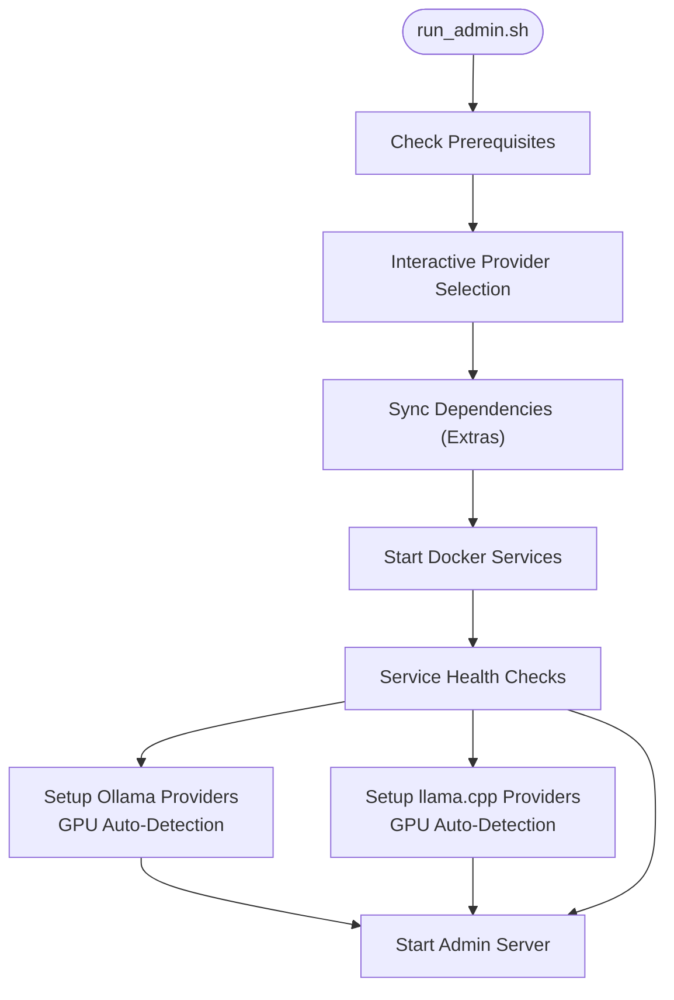
```mermaid
flowchart TD
Start(["run_admin.sh"]) --> PrereqCheck["Check Prerequisites"]
PrereqCheck --> ProviderSelect["Interactive Provider Selection"]
ProviderSelect --> DependencySync["Sync Dependencies (Extras)"]
DependencySync --> DockerCompose["Start Docker Services"]
DockerCompose --> HealthChecks["Service Health Checks"]
HealthChecks --> OllamaSetup["Setup Ollama Providers<br/>GPU Auto-Detection"]
HealthChecks --> LlamaCPPSetup["Setup llama.cpp Providers<br/>GPU Auto-Detection"]
OllamaSetup --> AdminServer["Start Admin Server"]
LlamaCPPSetup --> AdminServer
HealthChecks --> AdminServer
```

**Diagram sources**
- [scripts/run_admin.sh:100-138](file://scripts/run_admin.sh#L100-L138)
- [scripts/run_admin.sh:183-200](file://scripts/run_admin.sh#L183-L200)
- [scripts/run_admin.sh:202-221](file://scripts/run_admin.sh#L202-L221)
- [scripts/run_admin.sh:222-286](file://scripts/run_admin.sh#L222-L286)
- [scripts/run_admin.sh:288-356](file://scripts/run_admin.sh#L288-L356)

### Enhanced Specialized Deployment Scripts
The new specialized deployment scripts provide granular control over LLM and embedding server management with intelligent GPU detection:

- **run_llama_llm.sh**: Dedicated llama.cpp LLM server with model downloading, CPU detection, and intelligent GPU detection for macOS Apple Silicon (Metal) and NVIDIA GPUs (CUDA)
- **run_llama_embeddings.sh**: Dedicated llama.cpp embedding server with separate configuration, CPU detection, and intelligent GPU detection
- **run_ollama_llm.sh**: Ollama LLM setup with server management, model verification, and intelligent GPU detection
- **run_ollama_embeddings.sh**: Ollama embedding setup with separate model management and intelligent GPU detection
- **Enhanced CPU Detection**: Intelligent CPU core detection with fallback mechanisms for all platforms
- **Model Management**: Automated model downloading with progress indication and GPU optimization

**Updated** Comprehensive specialized deployment scripts with separate LLM and embedding management, intelligent GPU detection for macOS Apple Silicon and NVIDIA GPUs, automated model downloading, and provider-specific configuration for optimal performance.

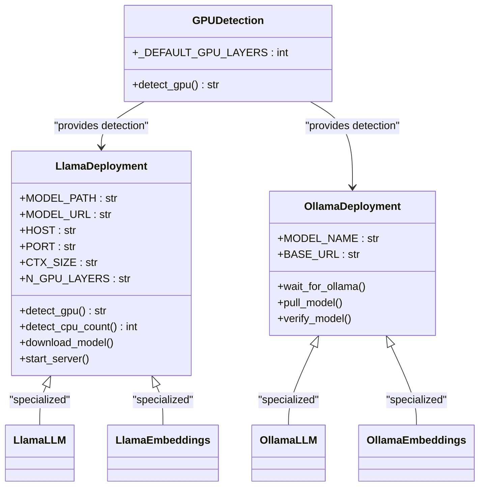
```mermaid
classDiagram
class LlamaDeployment {
+MODEL_PATH : str
+MODEL_URL : str
+HOST : str
+PORT : str
+CTX_SIZE : str
+N_GPU_LAYERS : str
+detect_gpu() str
+detect_cpu_count() int
+download_model()
+start_server()
}
class OllamaDeployment {
+MODEL_NAME : str
+BASE_URL : str
+wait_for_ollama()
+pull_model()
+verify_model()
}
class GPUDetection {
+detect_gpu() str
+_DEFAULT_GPU_LAYERS : int
}
LlamaDeployment <|-- LlamaLLM : "specialized"
LlamaDeployment <|-- LlamaEmbeddings : "specialized"
OllamaDeployment <|-- OllamaLLM : "specialized"
OllamaDeployment <|-- OllamaEmbeddings : "specialized"
GPUDetection --> LlamaDeployment : "provides detection"
GPUDetection --> OllamaDeployment : "provides detection"
```

**Diagram sources**
- [scripts/run_llama_llm.sh:5-18](file://scripts/run_llama_llm.sh#L5-L18)
- [scripts/run_llama_embeddings.sh:5-18](file://scripts/run_llama_embeddings.sh#L5-L18)
- [scripts/run_ollama_llm.sh:5-18](file://scripts/run_ollama_llm.sh#L5-L18)
- [scripts/run_ollama_embeddings.sh:5-18](file://scripts/run_ollama_embeddings.sh#L5-L18)

**Section sources**
- [scripts/run_admin.sh:1-386](file://scripts/run_admin.sh#L1-L386)
- [scripts/run_llama_llm.sh:1-98](file://scripts/run_llama_llm.sh#L1-L98)
- [scripts/run_llama_embeddings.sh:1-100](file://scripts/run_llama_embeddings.sh#L1-L100)
- [scripts/run_ollama_llm.sh:1-100](file://scripts/run_ollama_llm.sh#L1-L100)
- [scripts/run_ollama_embeddings.sh:1-99](file://scripts/run_ollama_embeddings.sh#L1-L99)

### Enhanced Docker Compose Health Checking
The Docker Compose configuration now includes comprehensive health checking for all services:

- **Qdrant Health Check**: Dedicated health endpoint monitoring with retry logic
- **MinIO Health Check**: Live endpoint monitoring for object storage
- **Service Dependencies**: Proper service startup ordering and dependency management
- **Volume Management**: Persistent volume configuration for data persistence
- **Port Mapping**: Comprehensive port exposure for all services

**Updated** Enhanced Docker Compose configuration with comprehensive health checking, service dependencies, persistent volume management, and proper port mapping for all RAG infrastructure services with optimized GPU detection.

**Section sources**
- [docker-compose.yml:1-34](file://docker-compose.yml#L1-L34)

## Enhanced GPU Detection Capabilities

### Intelligent Platform Detection
The RAG system now includes comprehensive GPU detection capabilities across all LLM providers with platform-specific optimizations:

- **macOS Apple Silicon Detection**: Automatic detection of Apple Silicon (arm64) with Metal acceleration
- **NVIDIA GPU Detection**: Automatic detection of NVIDIA GPUs with CUDA support
- **Fallback Mechanisms**: CPU-only mode when no compatible GPU is available
- **Layer Optimization**: Automatic GPU layer offloading (99 layers for GPU, 0 for CPU)
- **Cross-Platform Compatibility**: Support for Linux, Windows, and macOS with consistent behavior

**Updated** Complete GPU detection system with intelligent platform detection, automatic optimization for Apple Silicon and NVIDIA GPUs, fallback mechanisms, and comprehensive cross-platform compatibility for all LLM providers.

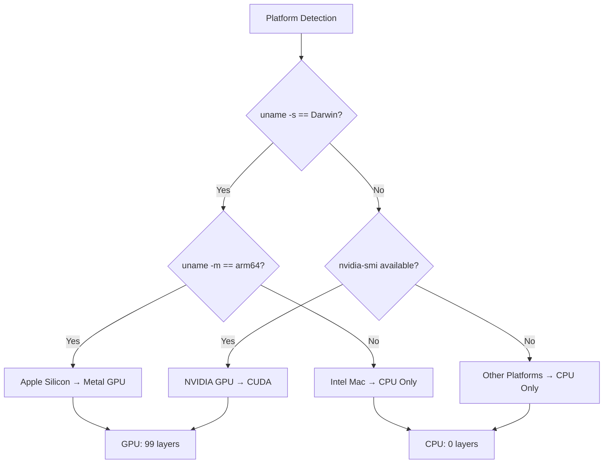
```mermaid
flowchart TD
PlatformCheck["Platform Detection"] --> CheckDarwin{"uname -s == Darwin?"}
CheckDarwin --> |Yes| CheckARM{"uname -m == arm64?"}
CheckARM --> |Yes| AppleSilicon["Apple Silicon → Metal GPU"]
CheckARM --> |No| CPUOnly["Intel Mac → CPU Only"]
CheckDarwin --> |No| CheckNVIDIA{"nvidia-smi available?"}
CheckNVIDIA --> |Yes| NVidiaGPU["NVIDIA GPU → CUDA"]
CheckNVIDIA --> |No| CPUCatchAll["Other Platforms → CPU Only"]
AppleSilicon --> GPULayers["GPU: 99 layers"]
NVidiaGPU --> GPULayers
CPUOnly --> CPULayers["CPU: 0 layers"]
CPUCatchAll --> CPULayers
```

**Diagram sources**
- [scripts/run_llama_llm.sh:5-18](file://scripts/run_llama_llm.sh#L5-L18)
- [scripts/run_llama_embeddings.sh:5-18](file://scripts/run_llama_embeddings.sh#L5-L18)
- [scripts/run_ollama_llm.sh:5-18](file://scripts/run_ollama_llm.sh#L5-L18)
- [scripts/run_ollama_embeddings.sh:5-18](file://scripts/run_ollama_embeddings.sh#L5-L18)

### Enhanced CPU Detection and Thread Management
The deployment scripts now include comprehensive CPU detection and thread management:

- **Multi-Platform CPU Detection**: Support for nproc, sysctl, and getconf commands
- **Fallback CPU Count**: Graceful fallback to 1 when detection fails
- **Thread Optimization**: Automatic thread count based on CPU cores
- **Performance Tuning**: Optimal thread-to-core ratio for different hardware configurations

**Updated** Comprehensive CPU detection system with multi-platform support, fallback mechanisms, thread optimization, and performance tuning for all deployment scripts with enhanced GPU detection capabilities.

**Section sources**
- [scripts/run_llama_llm.sh:34-54](file://scripts/run_llama_llm.sh#L34-L54)
- [scripts/run_llama_embeddings.sh:34-51](file://scripts/run_llama_embeddings.sh#L34-L51)
- [scripts/run_ollama_llm.sh:33-50](file://scripts/run_ollama_llm.sh#L33-L50)
- [scripts/run_ollama_embeddings.sh:33-50](file://scripts/run_ollama_embeddings.sh#L33-L50)

## Local LLM Deployment Support

### Enhanced llama.cpp Integration
The RAG system now includes comprehensive support for llama.cpp as a local LLM provider through an OpenAI-compatible API interface with intelligent GPU detection:

- **Server Script**: Dedicated deployment script for llama.cpp server with GPU acceleration support
- **Model Configuration**: Support for GGUF model files with configurable context size and thread count
- **API Interface**: OpenAI-compatible API endpoint for seamless integration with LangChain
- **Environment Variables**: Flexible configuration through MODEL_PATH, HOST, PORT, CTX_SIZE, N_GPU_LAYERS, THREADS
- **Dependency Management**: Optional installation through openai_compatible extras
- **GPU Optimization**: Automatic GPU detection and layer offloading for optimal performance

**Updated** Complete llama.cpp integration with dedicated deployment script, OpenAI-compatible API interface, GPU acceleration support, intelligent GPU detection, and comprehensive configuration options.

```mermaid
flowchart TD
LlamaScript["run_llama_llm.sh"] --> CheckPrerequisites["Check llama-server availability"]
CheckPrerequisites --> VerifyModel["Verify model file exists"]
VerifyModel --> DetectGPU["Intelligent GPU Detection<br/>Metal/CUDA/CPU"]
DetectGPU --> StartServer["Start llama-server with parameters"]
StartServer --> OpenAICompat["Expose OpenAI-compatible API"]
OpenAICompat --> LangChain["Connect via ChatOpenAI"]
LangChain --> RAGPipeline["Complete RAG Pipeline"]
```

**Diagram sources**
- [scripts/run_llama_llm.sh:32-61](file://scripts/run_llama_llm.sh#L32-L61)
- [app/rag/chain.py:47-60](file://app/rag/chain.py#L47-L60)
- [scripts/run_llama_llm.sh:5-18](file://scripts/run_llama_llm.sh#L5-L18)

### Enhanced Ollama Integration
The system maintains comprehensive Ollama support for local LLM deployments with intelligent GPU detection:

- **Server Script**: Automated Ollama server management with model pulling and validation
- **Model Management**: Automatic model installation and version checking
- **API Interface**: Direct integration through ChatOllama
- **Configuration**: Flexible base URL configuration and model selection
- **GPU Optimization**: Automatic GPU detection and layer offloading

**Updated** Enhanced Ollama integration with automated server management, model validation, smoke testing capabilities, and intelligent GPU detection for optimal performance.

**Section sources**
- [scripts/run_llama_qwen.sh:1-11](file://scripts/run_llama_qwen.sh#L1-L11)
- [scripts/run_ollama_qwen.sh:1-11](file://scripts/run_ollama_qwen.sh#L1-L11)
- [scripts/run_llama_llm.sh:1-98](file://scripts/run_llama_llm.sh#L1-L98)
- [scripts/run_llama_embeddings.sh:1-100](file://scripts/run_llama_embeddings.sh#L1-L100)
- [scripts/run_ollama_llm.sh:1-100](file://scripts/run_ollama_llm.sh#L1-L100)
- [scripts/run_ollama_embeddings.sh:1-99](file://scripts/run_ollama_embeddings.sh#L1-L99)
- [app/rag/chain.py:62-73](file://app/rag/chain.py#L62-L73)

## Testing Framework

### Comprehensive Test Coverage
The test suite provides extensive coverage for the RAG infrastructure, QA service, enhanced ask handler, document storage system, enhanced GPU detection capabilities, and llama.cpp provider support:

- **Configuration Testing**: Validates settings loading and environment variable support for all providers
- **Document Processing**: Tests Word document parsing and section extraction with configurable chunking
- **Chunking Validation**: Ensures proper text splitting with configurable parameters (chunk_size: 1000, chunk_overlap: 200)
- **Chain Building**: Verifies RAG chain construction and execution across all providers
- **Vector Store Integration**: Tests Qdrant integration and retrieval capabilities
- **QA Service Testing**: Comprehensive testing of singleton pattern and error handling
- **Text Truncation**: Validates message length limits and word boundary preservation
- **Topic Hints Detection**: Tests keyword-based scenario detection and disclaimers
- **Enhanced Ask Handler Integration**: Validates enhanced ask handler functionality and user experience features
- **Document Storage Testing**: Comprehensive testing of SQLite database, models, repository operations, and lifecycle management
- **Enhanced GPU Detection Testing**: Validates intelligent GPU detection across platforms
- **llama.cpp Provider Testing**: Comprehensive testing of llama.cpp provider configuration and error handling

**Updated** Complete test coverage for all RAG infrastructure components, QA service functionality, topic hints detection, enhanced ask handler implementation, document storage system, enhanced GPU detection capabilities, and comprehensive llama.cpp provider validation with provider-specific configuration testing.

```mermaid
graph TB
TestSuite["Enhanced RAG + QA + Ask Handler + Storage + GPU Detection + llama.cpp Tests"] --> ConfigTests["Configuration Tests"]
TestSuite --> DocxTests["Document Processing Tests"]
TestSuite --> PromptTests["System Prompt Tests"]
TestSuite --> ChainTests["RAG Chain Tests"]
TestSuite --> VectorTests["Vector Store Tests"]
TestSuite --> QATests["QA Service Tests"]
TestSuite --> TopicHintTests["Topic Hints Tests"]
TestSuite --> AskHandlerTests["Enhanced Ask Handler Tests"]
TestSuite --> StorageTests["Document Storage Tests"]
TestSuite --> GPUDetectionTests["Enhanced GPU Detection Tests"]
TestSuite --> LlamaCPPTests["llama.cpp Provider Tests"]
ConfigTests --> SettingsValidation["Settings Validation"]
ConfigTests --> ProviderSelection["Provider Selection Logic"]
DocxTests --> SectionExtraction["Section Extraction"]
DocxTests --> ChunkingValidation["Chunking Validation<br/>chunk_size: 1000<br/>chunk_overlap: 200"]
ChainTests --> ChainBuilding["Chain Building"]
ChainTests --> FormatDocs["Format Docs Function"]
ChainTests --> ProviderDispatch["Provider Dispatch Logic"]
VectorTests --> CollectionName["Collection Name"]
VectorTests --> VectorStoreCreation["Vector Store Creation"]
QATests --> AskFunctionality["Ask Functionality"]
QATests --> TruncationLogic["Truncation Logic"]
QATests --> InitCloseLifecycle["Init/Close Lifecycle"]
TopicHintTests --> ScenarioDetection["Scenario Detection"]
TopicHintTests --> DisclaimerLogic["Disclaimer Logic"]
AskHandlerTests --> TypingIndicator["Typing Indicator"]
AskHandlerTests --> ContextualNavigation["Contextual Navigation"]
AskHandlerTests --> ErrorHandler["Error Handling"]
StorageTests --> DatabaseInit["Database Initialization"]
StorageTests --> ModelValidation["Model Validation"]
StorageTests --> CRUDOperations["CRUD Operations"]
StorageTests --> LifecycleManagement["Lifecycle Management"]
GPUDetectionTests --> PlatformDetection["Platform Detection<br/>macOS + NVIDIA"]
GPUDetectionTests --> GPULayerOptimization["GPU Layer Optimization"]
GPUDetectionTests --> CPUDetection["CPU Detection Fallback"]
LlamaCPPTests --> LlamaCPPConfig["llama.cpp Configuration"]
LlamaCPPTests --> LlamaCPPEmbeddings["llama.cpp Embeddings"]
LlamaCPPTests --> LlamaCPPErrorHandling["llama.cpp Error Handling"]
```

**Diagram sources**
- [tests/test_qa_service.py:28-197](file://tests/test_qa_service.py#L28-L197)
- [tests/test_rag_block6.py:34-251](file://tests/test_rag_block6.py#L34-L251)
- [tests/test_rag_block6.py:264-413](file://tests/test_rag_block6.py#L264-L413)
- [tests/test_ask_block9.py:8-112](file://tests/test_ask_block9.py#L8-L112)
- [tests/test_storage.py:1-278](file://tests/test_storage.py#L1-L278)
- [tests/test_parser.py:1-94](file://tests/test_parser.py#L1-L94)
- [tests/test_indexer.py:38-99](file://tests/test_indexer.py#L38-L99)

### Enhanced Document Storage Test Coverage
The storage system includes comprehensive test coverage for all CRUD operations and lifecycle management with enhanced GPU detection:

- **Model Tests**: Validates DocumentRecord defaults, status enum values, and field types
- **Database Initialization**: Tests SQLite table creation and idempotent initialization
- **Create Operations**: Tests document creation with timestamp management and field preservation
- **Read Operations**: Tests get and list_all operations with ordering and missing records
- **Update Operations**: Tests selective field updates, status transitions, and timestamp bumping
- **Search Toggle**: Tests is_search_enabled flag toggling without affecting status
- **Delete Operations**: Tests document deletion and cascade effects on other records

**Updated** Complete test coverage for document storage system including model validation, database initialization, CRUD operations, search control, and lifecycle management with comprehensive edge case handling and enhanced GPU detection validation.

**Section sources**
- [tests/test_storage.py:1-278](file://tests/test_storage.py#L1-L278)

### Enhanced GPU Detection Test Coverage
The testing framework now includes comprehensive validation of the enhanced GPU detection capabilities:

- **Platform Detection Tests**: Validates detection of macOS Apple Silicon, NVIDIA GPUs, and CPU-only environments
- **GPU Layer Optimization Tests**: Ensures proper GPU layer offloading (99 layers) and CPU fallback (0 layers)
- **Cross-Platform Compatibility Tests**: Validates consistent behavior across Linux, Windows, and macOS
- **Fallback Mechanism Tests**: Ensures graceful degradation when GPU detection fails
- **Integration Tests**: Validates GPU detection integration with all deployment scripts

**Updated** Comprehensive GPU detection testing with platform validation, layer optimization verification, cross-platform compatibility, fallback mechanism validation, and integration testing for all deployment scripts.

**Section sources**
- [tests/test_parser.py:1-94](file://tests/test_parser.py#L1-L94)
- [tests/test_indexer.py:38-99](file://tests/test_indexer.py#L38-L99)

## Performance Considerations

### Enhanced Optimization Strategies
The RAG infrastructure includes several performance optimization strategies for all LLM providers with intelligent GPU detection:

- **Vector Search Efficiency**: Configurable k-value for balancing relevance and performance
- **Embedding Model Selection**: Choice between local Ollama, OpenAI embeddings, llama.cpp embeddings, and OpenAI-compatible embeddings
- **Memory Management**: Proper cleanup of Qdrant clients and embedding models across all providers
- **Connection Pooling**: Efficient management of database connections
- **Caching Strategies**: Potential for caching frequently accessed documents
- **Response Truncation**: VK message limit enforcement to prevent oversized responses
- **Typing Indicators**: Asynchronous processing with user feedback during RAG computation
- **State Management**: Efficient state handling to prevent memory leaks
- **Provider Optimization**: Optimized configuration for each LLM provider type with GPU detection
- **SQLite Optimization**: Efficient CRUD operations with proper indexing and transaction management
- **GPU Acceleration**: Automatic GPU layer offloading for optimal performance on supported hardware
- **CPU Fallback**: Graceful degradation to CPU-only mode when GPU acceleration is unavailable

**Updated** Comprehensive performance considerations for production deployment with optimization strategies, memory management, typing indicators, efficient state handling, provider-specific optimizations for Ollama, OpenAI-compatible, and llama.cpp deployments, SQLite database optimization techniques, and intelligent GPU detection for optimal hardware utilization.

### Scalability Planning
The architecture supports horizontal scaling through:

- **Qdrant Sharding**: Horizontal scaling of vector database
- **Load Balancing**: Multiple LLM instances for high-throughput scenarios
- **Caching Layers**: Redis or similar caching for frequently accessed results
- **Asynchronous Processing**: Non-blocking operations for better throughput
- **Resource Pooling**: Efficient management of QA service resources
- **Provider Scaling**: Support for multiple LLM providers for load distribution
- **Model Parallelization**: Support for distributed llama.cpp deployments
- **Database Scaling**: SQLite optimization for concurrent access patterns
- **GPU Resource Management**: Efficient GPU utilization across multiple providers

## Troubleshooting Guide

### Enhanced Common Issues and Solutions
The RAG infrastructure includes comprehensive error handling and debugging capabilities for all LLM providers with intelligent GPU detection:

- **Configuration Issues**: Missing environment variables or incorrect settings for any provider
- **Provider Setup**: Missing optional dependencies for selected LLM provider (openai_compatible, ollama)
- **Vector Store Connectivity**: Qdrant connection problems or collection issues
- **Document Processing**: Word document parsing errors or unsupported formats
- **Memory Issues**: Insufficient RAM for embedding generation or vector storage
- **QA Service Failures**: Chain initialization failures or runtime exceptions
- **Text Truncation Errors**: Incorrect message length calculations
- **Topic Hints Detection**: Keyword matching issues or missing scenarios
- **Typing Indicator Errors**: VK API connectivity or permission issues
- **State Management**: Memory leaks or state conflicts between handlers
- **Enhanced GPU Detection**: Platform detection failures or GPU acceleration issues
- **llama.cpp Issues**: Server startup failures, model loading errors, or API connectivity problems
- **Ollama Issues**: Server connectivity, model availability, or base URL configuration problems
- **SQLite Issues**: Database connection problems, table creation failures, or constraint violations
- **Document Lifecycle Errors**: Status transitions failing or metadata inconsistencies
- **Health Check Failures**: Docker service startup issues or port conflicts
- **CPU Detection Errors**: Missing system utilities or incorrect core count detection

**Updated** Comprehensive troubleshooting guide for all aspects of the RAG infrastructure, QA service, topic hints detection, enhanced ask handler, document storage system, enhanced GPU detection capabilities, and all three LLM providers including llama.cpp, Ollama, and OpenAI-compatible deployments with user experience features.

### Enhanced Debugging Tools
Available debugging and monitoring capabilities:

- **Logging Configuration**: Comprehensive logging throughout the RAG pipeline for all providers
- **Health Checks**: Qdrant health verification and connection testing
- **Performance Metrics**: Timing and throughput measurements
- **Error Reporting**: Detailed error messages with context information for all providers
- **QA Service Monitoring**: Chain availability and resource status tracking
- **User Experience Monitoring**: Typing indicator functionality and navigation button rendering
- **Provider Health Checks**: Specific monitoring for llama.cpp server, Ollama server, and OpenAI-compatible endpoints
- **Database Monitoring**: SQLite connection status, query performance, and transaction logging
- **Document Lifecycle Monitoring**: Status transitions, metadata consistency, and error tracking
- **Docker Service Monitoring**: Container health status and service dependency tracking
- **GPU Detection Monitoring**: Platform detection results and GPU acceleration status
- **CPU Detection Monitoring**: CPU core count detection and thread optimization status

**Section sources**
- [app/rag/chain.py:30-58](file://app/rag/chain.py#L30-L58)
- [app/rag/retriever.py:22-48](file://app/rag/retriever.py#L22-L48)
- [scripts/ingest.py:137-166](file://scripts/ingest.py#L137-L166)
- [app/domain/qa_service.py:82-83](file://app/domain/qa_service.py#L82-L83)
- [app/integrations/vk/handlers/ask.py:67-70](file://app/integrations/vk/handlers/ask.py#L67-L70)
- [scripts/run_llama_qwen.sh:32-41](file://scripts/run_llama_qwen.sh#L32-L41)
- [scripts/run_ollama_qwen.sh:36-52](file://scripts/run_ollama_qwen.sh#L36-L52)
- [app/storage/database.py:31-38](file://app/storage/database.py#L31-L38)
- [app/storage/document_repo.py:69-99](file://app/storage/document_repo.py#L69-L99)
- [scripts/run_admin.sh:28-48](file://scripts/run_admin.sh#L28-L48)
- [scripts/run_llama_llm.sh:5-18](file://scripts/run_llama_llm.sh#L5-L18)
- [scripts/run_ollama_llm.sh:5-18](file://scripts/run_ollama_llm.sh#L5-L18)

## Conclusion
The RAG integration provides a comprehensive, production-ready solution for enhancing the Cafetera HR assistance bot with intelligent document retrieval capabilities and enhanced user experience. The implementation includes complete LangChain integration, Qdrant vector store setup, document ingestion pipelines with configurable chunking parameters, comprehensive QA service with singleton pattern, topic hints detection system, contextual navigation features, extensive testing frameworks, SQLite-based document storage system, and support for three LLM providers including the new llama.cpp option with enhanced GPU detection capabilities. The system seamlessly integrates with the existing VK bot architecture while providing powerful contextual response generation capabilities that significantly enhance HR assistance functionality.

**Updated** The implementation now provides a complete, tested RAG infrastructure with robust QA service layer, topic hints detection system, enhanced ask handler with typing indicators and contextual navigation, comprehensive user experience improvements, SQLite-based document storage system with comprehensive CRUD operations, document lifecycle management, enhanced GPU detection capabilities across all LLM providers, and support for three LLM providers (Ollama, OpenAI-compatible, and llama.cpp) that serve as the foundation for future enhancements and production deployment. The singleton pattern ensures efficient resource utilization, while comprehensive error handling, text truncation, user experience features, SQLite database integration, and llama.cpp integration provide reliability, improved user satisfaction, and maximum flexibility for local and cloud deployments. The addition of intelligent GPU detection for macOS Apple Silicon and NVIDIA GPUs enables optimal performance across different hardware architectures, making the system suitable for enterprise environments with strict data privacy requirements. The comprehensive document storage system with SQLite provides reliable metadata management, complete test coverage with enhanced GPU detection validation, and efficient CRUD operations that form the backbone of the document lifecycle management system. The new multi-provider orchestration via run_admin.sh script with interactive selection, comprehensive health checking, and intelligent GPU detection provides operational excellence for production deployments, while the specialized deployment scripts offer granular control over LLM and embedding server management with CPU detection capabilities and automated model downloading with GPU optimization.