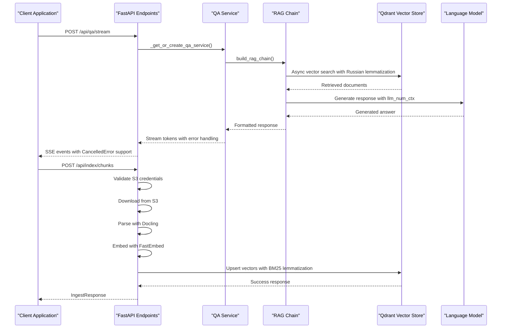

# RAG Integration

<cite>
**Referenced Files in This Document**
- [config.py](file://packages/rag_service/src/cafetera_rag_service/config.py)
- [chain.py](file://packages/rag_service/src/cafetera_rag_service/rag/chain.py)
- [retriever.py](file://packages/rag_service/src/cafetera_rag_service/rag/retriever.py)
- [text_processor.py](file://packages/rag_service/src/cafetera_rag_service/rag/text_processor.py)
- [reranker.py](file://packages/rag_service/src/cafetera_rag_service/rag/reranker.py)
- [parser.py](file://packages/rag_service/src/cafetera_rag_service/parser.py)
- [qa_service.py](file://packages/rag_service/src/cafetera_rag_service/qa_service.py)
- [ingest.py](file://packages/rag_service/src/cafetera_rag_service/api/ingest.py)
- [qa.py](file://packages/rag_service/src/cafetera_rag_service/api/qa.py)
- [indexing.py](file://packages/rag_service/src/cafetera_rag_service/api/indexing.py)
- [models.py](file://packages/rag_service/src/cafetera_rag_service/models.py)
- [resources.py](file://packages/rag_service/src/cafetera_rag_service/resources.py)
- [main.py](file://packages/rag_service/src/cafetera_rag_service/main.py)
- [server.py](file://packages/rag_service/src/cafetera_rag_service/server.py)
- [pyproject.toml](file://packages/rag_service/pyproject.toml)
- [Dockerfile.rag_service](file://Dockerfile.rag_service)
- [test_rag_service_ingest.py](file://tests/test_rag_service_ingest.py)
- [test_rag_block6.py](file://tests/test_rag_block6.py)
- [test_qa_streaming_errors.py](file://tests/test_qa_streaming_errors.py)
- [test_text_processor.py](file://tests/test_text_processor.py)
- [components.js](file://static/js/components.js)
</cite>

## Update Summary
**Changes Made**
- Added comprehensive Russian text processing system with pymorphy3 integration for advanced lemmatization
- Enhanced streaming response capabilities with proper asyncio.CancelledError handling and re-raising
- Improved LLM context window control through llm_num_ctx parameter implementation
- Refined retrieval algorithms with adaptive k-value estimation based on question complexity
- Enhanced frontend architecture with EventSource-based streaming for real-time user interaction
- Expanded testing infrastructure with comprehensive streaming error handling tests
- Added comprehensive Russian lemmatization and stop-word removal functionality for BM25 search

## Table of Contents
1. [Introduction](#introduction)
2. [Project Structure](#project-structure)
3. [Core Components](#core-components)
4. [Architecture Overview](#architecture-overview)
5. [Detailed Component Analysis](#detailed-component-analysis)
6. [Enhanced RAG Capabilities](#enhanced-rag-capabilities)
7. [Advanced QA Service Implementation](#advanced-qa-service-implementation)
8. [Microservice Architecture](#microservice-architecture)
9. [Document Ingestion Pipeline](#document-ingestion-pipeline)
10. [Streaming Response System](#streaming-response-system)
11. [Performance Considerations](#performance-considerations)
12. [Testing Infrastructure](#testing-infrastructure)
13. [Deployment and Configuration](#deployment-and-configuration)
14. [Troubleshooting Guide](#troubleshooting-guide)
15. [Conclusion](#conclusion)

## Introduction
This document describes the comprehensive Retrieval-Augmented Generation (RAG) integration for the Cafetera HR assistance bot, now implemented as a standalone microservice architecture. The system features a complete LangChain-based processing pipeline, Qdrant vector database integration with fully asynchronous operations, document ingestion capabilities with S3 storage, and specialized HR prompts. The implementation provides enhanced HR assistance capabilities through contextual, reliable answers drawn from HR documents while maintaining seamless integration with the existing VK bot architecture through HTTP API endpoints.

**Updated** The RAG implementation now exists as a complete, production-ready microservice with comprehensive ingestion pipeline, document parsing, embedding, and indexing capabilities. The system features a dedicated RAG microservice architecture with independent deployment, complete HTTP API endpoints for QA and indexing operations, document parsing with Docling library, cross-encoder reranking with FastEmbed, streaming response support with comprehensive error handling, enhanced Russian lemmatization for BM25 search, expanded LLM configuration settings, comprehensive caching and resource management, health checking, and API key authentication.

## Project Structure
The repository has been restructured into a modular microservice architecture with the RAG service as a separate package. The structure includes a dedicated RAG service package with FastAPI microservice structure, configuration management, LangChain integration, Qdrant vector store setup, document ingestion capabilities, comprehensive QA service layer, HTTP API endpoints, and comprehensive testing infrastructure.

```mermaid
graph TB
subgraph "RAG Microservice Architecture"
RagService["RAG Service Package<br/>packages/rag_service/"]
Config["Configuration Management<br/>config.py"]
Main["Service Entry Point<br/>main.py"]
Server["HTTP Server<br/>server.py"]
Resources["Resource Management<br/>resources.py"]
API["HTTP API Endpoints<br/>api/"]
QA["QA Service Layer<br/>qa_service.py"]
RAG["RAG Components<br/>rag/"]
Parser["Document Parser<br/>parser.py"]
Models["API Models<br/>models.py"]
end
subgraph "RAG Components"
Chain["RAG Chain Builder<br/>rag/chain.py"]
Retriever["Async Qdrant Retriever<br/>rag/retriever.py"]
TextProcessor["Russian Text Processor<br/>rag/text_processor.py"]
Reranker["Cross-Encoder Reranker<br/>rag/reranker.py"]
end
subgraph "API Endpoints"
Ingest["Document Ingestion<br/>api/ingest.py"]
QAEndpoints["QA Operations<br/>api/qa.py"]
Indexing["Indexing Operations<br/>api/indexing.py"]
Health["Health Check<br/>api/health.py"]
Deps["Dependencies<br/>api/deps.py"]
end
subgraph "Core Functionality"
Docling["Docling Parser<br/>PDF/DOCX/XLSX"]
FastEmbed["FastEmbed Models<br/>Embeddings & Reranking"]
Qdrant["Qdrant Vector Store<br/>Async Operations"]
FastAPI["FastAPI Framework<br/>HTTP Microservice"]
end
subgraph "Testing & Deployment"
Tests["Unit Tests<br/>tests/test_rag_service_ingest.py"]
StreamingTests["Streaming Error Tests<br/>tests/test_qa_streaming_errors.py"]
TextProcessorTests["Text Processor Tests<br/>tests/test_text_processor.py"]
Docker["Docker Build<br/>Dockerfile.rag_service"]
PyProject["Package Config<br/>pyproject.toml"]
end
RagService --> Config
RagService --> Main
RagService --> Server
RagService --> Resources
RagService --> API
RagService --> QA
RagService --> RAG
RagService --> Parser
RagService --> Models
API --> Ingest
API --> QAEndpoints
API --> Indexing
API --> Health
API --> Deps
RAG --> Chain
RAG --> Retriever
RAG --> TextProcessor
RAG --> Reranker
Parser --> Docling
QA --> FastEmbed
QA --> Qdrant
API --> FastAPI
Tests --> Docker
StreamingTests --> Docker
TextProcessorTests --> Docker
Docker --> PyProject
```

**Diagram sources**
- [config.py:1-79](file://packages/rag_service/src/cafetera_rag_service/config.py#L1-L79)
- [main.py:1-50](file://packages/rag_service/src/cafetera_rag_service/main.py#L1-L50)
- [server.py:1-80](file://packages/rag_service/src/cafetera_rag_service/server.py#L1-L80)
- [resources.py:1-120](file://packages/rag_service/src/cafetera_rag_service/resources.py#L1-L120)
- [ingest.py:1-188](file://packages/rag_service/src/cafetera_rag_service/api/ingest.py#L1-L188)
- [qa.py:1-128](file://packages/rag_service/src/cafetera_rag_service/api/qa.py#L1-L128)
- [indexing.py:1-226](file://packages/rag_service/src/cafetera_rag_service/api/indexing.py#L1-L226)
- [chain.py:1-202](file://packages/rag_service/src/cafetera_rag_service/rag/chain.py#L1-L202)
- [retriever.py:1-303](file://packages/rag_service/src/cafetera_rag_service/rag/retriever.py#L1-L303)
- [text_processor.py:1-64](file://packages/rag_service/src/cafetera_rag_service/rag/text_processor.py#L1-L64)
- [reranker.py:1-75](file://packages/rag_service/src/cafetera_rag_service/rag/reranker.py#L1-L75)
- [parser.py:1-111](file://packages/rag_service/src/cafetera_rag_service/parser.py#L1-L111)
- [models.py:1-71](file://packages/rag_service/src/cafetera_rag_service/models.py#L1-L71)

**Section sources**
- [config.py:1-79](file://packages/rag_service/src/cafetera_rag_service/config.py#L1-L79)
- [main.py:1-50](file://packages/rag_service/src/cafetera_rag_service/main.py#L1-L50)
- [server.py:1-80](file://packages/rag_service/src/cafetera_rag_service/server.py#L1-L80)
- [resources.py:1-120](file://packages/rag_service/src/cafetera_rag_service/resources.py#L1-L120)

## Core Components
The RAG microservice architecture consists of several interconnected components that work together to provide intelligent document retrieval and response generation through HTTP APIs:

- **Standalone Configuration Management**: Independent RagServiceSettings class with environment-based configuration for Qdrant, LLM providers, embeddings, and S3 storage, including new llm_num_ctx and bm25_lemmatize settings
- **FastAPI Microservice Framework**: Complete HTTP API with dependency injection, authentication, and resource management
- **Enhanced RAG Chain Builder**: LangChain pipeline with provider-specific configuration, metadata-aware formatting, category hint support, and llm_num_ctx parameter support
- **Async Vector Store Integration**: Qdrant-backed vector store with AsyncQdrantClient for fully asynchronous operations and hybrid search capabilities with Russian lemmatization
- **Cross-Encoder Reranking**: FastEmbed-based cross-encoder reranking with RerankingRetriever composition
- **Document Parsing Pipeline**: Docling integration for PDF/DOCX/XLSX parsing with HybridChunker and tokenizer-based chunking
- **Comprehensive API Endpoints**: HTTP endpoints for document ingestion, QA operations, streaming responses, and health checking
- **Resource Management System**: Centralized resource management with caching, LRU cache for QA services, and proper cleanup procedures
- **Authentication & Security**: API key verification middleware and secure resource access
- **Enhanced Streaming Response System**: Server-Sent Events (SSE) for real-time token streaming with comprehensive asyncio.CancelledError handling
- **Health Checking**: Comprehensive health endpoints for Qdrant, LLM, and service status monitoring
- **Testing Infrastructure**: Unit tests for ingestion pipeline, QA operations, streaming error handling, and Russian text processing
- **Russian Text Processing**: Advanced lemmatization and stop-word removal for BM25 search with pymorphy3 integration

**Updated** The RAG microservice now provides a complete, production-ready solution with standalone configuration management including llm_num_ctx and bm25_lemmatize settings, FastAPI microservice framework, enhanced RAG chain builder with category hint support, async vector store integration with hybrid search and Russian lemmatization, cross-encoder reranking capabilities, comprehensive document parsing pipeline with Docling, HTTP API endpoints for all operations, resource management system with caching, authentication and security, enhanced streaming response system with comprehensive error handling, health checking, and comprehensive testing infrastructure including streaming error tests and Russian text processor tests.

**Section sources**
- [config.py:8-79](file://packages/rag_service/src/cafetera_rag_service/config.py#L8-L79)
- [chain.py:99-155](file://packages/rag_service/src/cafetera_rag_service/rag/chain.py#L99-L155)
- [retriever.py:29-100](file://packages/rag_service/src/cafetera_rag_service/rag/retriever.py#L29-L100)
- [text_processor.py:1-64](file://packages/rag_service/src/cafetera_rag_service/rag/text_processor.py#L1-L64)
- [reranker.py:20-75](file://packages/rag_service/src/cafetera_rag_service/rag/reranker.py#L20-L75)
- [parser.py:48-111](file://packages/rag_service/src/cafetera_rag_service/parser.py#L48-L111)
- [ingest.py:64-188](file://packages/rag_service/src/cafetera_rag_service/api/ingest.py#L64-L188)
- [qa.py:25-128](file://packages/rag_service/src/cafetera_rag_service/api/qa.py#L25-L128)
- [qa_service.py:52-317](file://packages/rag_service/src/cafetera_rag_service/qa_service.py#L52-L317)

## Architecture Overview
The RAG microservice architecture provides a complete, standalone solution for document retrieval and response generation through HTTP APIs. The system processes user questions through a LangChain pipeline that retrieves relevant context from Qdrant vector store, generates contextualized responses using selected LLM providers, supports streaming responses via Server-Sent Events with comprehensive error handling, handles document ingestion with S3 integration, and provides comprehensive health checking and authentication.

**Diagram sources**
- [qa.py:63-89](file://packages/rag_service/src/cafetera_rag_service/api/qa.py#L63-L89)
- [ingest.py:64-188](file://packages/rag_service/src/cafetera_rag_service/api/ingest.py#L64-L188)
- [qa_service.py:168-194](file://packages/rag_service/src/cafetera_rag_service/qa_service.py#L168-L194)
- [chain.py:138-182](file://packages/rag_service/src/cafetera_rag_service/rag/chain.py#L138-L182)
- [retriever.py:48-94](file://packages/rag_service/src/cafetera_rag_service/rag/retriever.py#L48-L94)

## Detailed Component Analysis

### Standalone Configuration Management
The RAG microservice features independent configuration management through the RagServiceSettings class:

- **Environment-Based Configuration**: All settings loaded from .env file with UTF-8 encoding
- **Qdrant Configuration**: URL, API key, collection name, timeout, and upsert batch size
- **LLM Provider Support**: Multiple providers (Ollama, OpenAI-compatible, llama.cpp) with provider-specific settings
- **Enhanced LLM Configuration**: New llm_num_ctx parameter for context window sizing and comprehensive sampling parameters
- **Embedding Configuration**: Support for multiple embedding providers with model specifications
- **Hybrid Search Settings**: Sparse embedding model configuration for BM25 search with bm25_lemmatize option
- **Reranking Configuration**: Cross-encoder reranker settings with model name and top-N selection
- **Chunking Parameters**: Tokenizer model and chunk size configuration for document parsing
- **S3 Storage Configuration**: MinIO/S3 endpoint, credentials, and bucket settings
- **Security Settings**: API key authentication for service endpoints

**Updated** Complete standalone configuration system with environment-based settings, provider-specific LLM configuration including llm_num_ctx parameter, embedding model management, hybrid search setup with bm25_lemmatize option, cross-encoder reranking, document chunking parameters, S3 storage configuration, and API key authentication for secure microservice deployment.

**Section sources**
- [config.py:8-79](file://packages/rag_service/src/cafetera_rag_service/config.py#L8-L79)

### Enhanced RAG Chain Builder
The RAG chain builder provides comprehensive language model integration with provider-specific configuration:

- **Provider Detection**: Automatic detection of LLM provider (openai, llamacpp, ollama)
- **Enhanced Sampling Parameters**: Temperature, top_p, top_k, presence_penalty with provider-specific handling and llm_num_ctx support
- **Category Hint Integration**: Optional category-specific context injection
- **Metadata Formatting**: Enhanced document formatting with filename headers
- **Reranking Support**: Integration with CrossEncoderReranker for improved document ranking
- **Error Handling**: Comprehensive error handling for missing extras and import errors
- **Provider-Specific Logic**: Different handling for OpenAI-compatible vs Ollama providers with llm_num_ctx parameter

**Updated** Complete RAG chain builder with provider-specific LLM configuration including llm_num_ctx parameter, sampling parameter handling, category hint integration, metadata-aware formatting, cross-encoder reranking support, comprehensive error handling, and provider-specific logic for optimal performance across all supported LLM providers.

**Section sources**
- [chain.py:89-155](file://packages/rag_service/src/cafetera_rag_service/rag/chain.py#L89-L155)

### Async Qdrant Integration
The RAG microservice features fully asynchronous Qdrant integration:

- **Async Client Usage**: AsyncQdrantClient for non-blocking vector operations
- **Hybrid Search Support**: Dense + BM25 prefetch with Reciprocal Rank Fusion (RRF) and Russian lemmatization
- **Document Filtering**: Metadata-based filtering for document-scoped retrieval
- **K-Value Estimation**: Adaptive k-value based on question complexity
- **Error Handling**: CollectionNotFoundError exception and payload validation
- **Provider Integration**: Support for multiple embedding providers with async operations
- **Sparse Embedding Support**: FastEmbedSparse integration for hybrid search mode with lemmatization option

**Updated** Complete async Qdrant integration with AsyncQdrantClient, hybrid search with dense + BM25 prefetch and Russian lemmatization, document filtering, k-value estimation, error handling, provider integration, and sparse embedding support for comprehensive vector database operations.

**Section sources**
- [retriever.py:29-100](file://packages/rag_service/src/cafetera_rag_service/rag/retriever.py#L29-L100)
- [retriever.py:127-303](file://packages/rag_service/src/cafetera_rag_service/rag/retriever.py#L127-L303)

### Russian Text Processing System
The microservice includes advanced Russian text processing capabilities for BM25 search:

- **Pymorphy3 Integration**: Morphological analyzer for Russian lemmatization
- **Stop Word Removal**: Comprehensive Russian stop word set for BM25 search optimization
- **Text Preprocessing**: Lowercasing, punctuation removal, and token normalization
- **Consistent Processing**: Same preprocessing applied at both index and query time
- **Mixed Language Support**: Handles Russian and English text combinations
- **Idempotent Processing**: Preprocessing applied multiple times produces consistent results
- **Performance Optimization**: Efficient lemmatization with frozen stop word sets

**Updated** Complete Russian text processing system with pymorphy3 integration, comprehensive stop word removal, text preprocessing, consistent processing for index and query time, mixed language support, idempotent processing, and performance optimization for BM25 search.

**Section sources**
- [text_processor.py:1-64](file://packages/rag_service/src/cafetera_rag_service/rag/text_processor.py#L1-L64)

### Cross-Encoder Reranking System
The microservice includes advanced cross-encoder reranking capabilities:

- **FastEmbed Integration**: TextCrossEncoder model for document reranking
- **Async Processing**: Thread pool execution for non-blocking reranking operations
- **Top-N Selection**: Configurable number of top-ranked documents
- **Base Retriever Composition**: RerankingRetriever wraps base retrievers
- **Score Calculation**: Similarity score computation with sorting and selection
- **Error Handling**: Empty document handling and proper return values

**Updated** Complete cross-encoder reranking system with FastEmbed TextCrossEncoder, async processing via thread pool, top-N selection, base retriever composition, score calculation, and comprehensive error handling for improved document ranking quality.

**Section sources**
- [reranker.py:20-75](file://packages/rag_service/src/cafetera_rag_service/rag/reranker.py#L20-L75)

### Document Parsing Pipeline
The microservice features comprehensive document parsing with Docling integration:

- **Multi-format Support**: PDF, DOCX, XLSX parsing with Docling library
- **Offline Mode**: Cached tokenizer and model downloads for offline operation
- **Hybrid Chunking**: Tokenizer-based chunking with configurable chunk size
- **Layout Preservation**: Document structure and layout information preservation
- **Metadata Extraction**: Docling metadata extraction with page numbers and headings
- **Format Validation**: Unsupported format handling and error reporting
- **Thread Pool Execution**: Async execution for parsing operations

**Updated** Complete document parsing pipeline with Docling integration, offline model caching, hybrid chunking with configurable parameters, layout preservation, metadata extraction, format validation, and async execution for efficient document processing.

**Section sources**
- [parser.py:19-111](file://packages/rag_service/src/cafetera_rag_service/parser.py#L19-L111)

### HTTP API Endpoints
The microservice provides comprehensive HTTP API endpoints:

- **Document Ingestion**: Full pipeline from S3 download to Qdrant indexing with Russian lemmatization
- **QA Operations**: Question answering with category support and metadata inclusion
- **Enhanced Streaming Responses**: Server-Sent Events for real-time token streaming with comprehensive error handling
- **Health Checking**: Comprehensive health endpoints for service monitoring
- **Authentication**: API key verification for secure endpoint access
- **Resource Management**: Cached QA service instances with LRU cache
- **Error Handling**: Comprehensive HTTP exception handling and logging with asyncio.CancelledError support

**Updated** Complete HTTP API system with document ingestion endpoints, QA operations, enhanced streaming responses with comprehensive error handling, health checking, authentication, resource management, and comprehensive error handling for production-ready microservice deployment.

**Section sources**
- [ingest.py:64-188](file://packages/rag_service/src/cafetera_rag_service/api/ingest.py#L64-L188)
- [qa.py:25-128](file://packages/rag_service/src/cafetera_rag_service/api/qa.py#L25-L128)
- [indexing.py:27-113](file://packages/rag_service/src/cafetera_rag_service/api/indexing.py#L27-L113)

### QA Service Layer
The QA service provides centralized RAG chain management:

- **LRU Cache System**: Cached QA services with configurable maximum size
- **Document Chain Caching**: Individual document chain caching with eviction
- **Category Support**: Category-aware question answering with hint injection
- **Enhanced Streaming Support**: Async streaming with comprehensive token-by-token responses and asyncio.CancelledError handling
- **Error Handling**: Comprehensive error handling and response formatting
- **Resource Management**: Proper cleanup and resource release
- **Adaptive K-Value**: Question complexity-based retrieval depth

**Updated** Complete QA service layer with LRU cache system, document chain caching, category support, enhanced streaming capabilities with comprehensive asyncio.CancelledError handling, error handling, resource management, and adaptive k-value estimation for optimal RAG performance.

**Section sources**
- [qa_service.py:52-317](file://packages/rag_service/src/cafetera_rag_service/qa_service.py#L52-L317)

## Enhanced RAG Capabilities

### Metadata-Aware Document Formatting
The RAG system provides enhanced document formatting with metadata preservation:

- **Filename Headers**: Structured document headers with filename information
- **Metadata Integration**: Enhanced formatting with document metadata
- **Backward Compatibility**: Fallback to plain text formatting when metadata unavailable
- **Source Attribution**: Clear identification of document sources in responses
- **Context Separation**: Clear separation between different document contexts

**Updated** Complete metadata-aware document formatting with filename headers, metadata integration, backward compatibility, source attribution, and context separation for improved transparency in RAG responses.

**Section sources**
- [chain.py:29-61](file://packages/rag_service/src/cafetera_rag_service/rag/chain.py#L29-L61)

### Question Complexity Analysis
The retriever includes sophisticated question complexity analysis:

- **Word Count Analysis**: Automatic question complexity assessment
- **Adaptive K-Values**: 
  - Short questions (≤5 words): k=2 chunks
  - Medium questions (6-15 words): k=4 chunks
  - Long/complex questions (>15 words): k=6 chunks
- **Performance Optimization**: Reduced retrieval overhead for simple questions
- **Quality Assurance**: Sufficient context for complex questions

**Updated** Sophisticated question complexity analysis with word count assessment, adaptive k-values, performance optimization, and quality assurance for optimal RAG performance across all question types.

**Section sources**
- [retriever.py:110-123](file://packages/rag_service/src/cafetera_rag_service/rag/retriever.py#L110-L123)

### Enhanced Streaming Response Implementation
The microservice supports real-time streaming responses with comprehensive error handling:

- **Server-Sent Events**: SSE implementation for token streaming
- **Token Escaping**: Proper JSON escaping for reliable event transmission
- **Comprehensive Error Streaming**: Graceful error handling with error token delivery
- **Asyncio.CancelledError Support**: Proper handling of stream cancellation with re-raising
- **Content Type**: text/event-stream with proper headers
- **Async Processing**: Non-blocking streaming with proper exception handling
- **Client Disconnection Handling**: Proper cleanup on client disconnection

**Updated** Complete enhanced streaming response system with SSE implementation, token escaping, comprehensive error handling, asyncio.CancelledError support with proper re-raising, content type management, async processing, and client-side handling for real-time user interaction.

**Section sources**
- [qa.py:63-128](file://packages/rag_service/src/cafetera_rag_service/api/qa.py#L63-L128)
- [qa_service.py:227-294](file://packages/rag_service/src/cafetera_rag_service/qa_service.py#L227-L294)

### Russian Lemmatization for BM25 Search
The microservice includes comprehensive Russian text processing for BM25 search:

- **Pymorphy3 Integration**: Advanced morphological analysis for Russian language
- **Stop Word Removal**: Comprehensive Russian stop word set for search optimization
- **Text Normalization**: Lowercasing, punctuation removal, and token normalization
- **Consistent Processing**: Same preprocessing applied at index and query time
- **Mixed Language Support**: Handles Russian and English text combinations
- **Performance Optimization**: Efficient processing with frozen data structures
- **Idempotent Results**: Multiple applications produce consistent results

**Updated** Complete Russian lemmatization system with pymorphy3 integration, comprehensive stop word removal, text normalization, consistent processing, mixed language support, performance optimization, and idempotent results for enhanced BM25 search capabilities.

**Section sources**
- [text_processor.py:1-64](file://packages/rag_service/src/cafetera_rag_service/rag/text_processor.py#L1-L64)
- [retriever.py:57](file://packages/rag_service/src/cafetera_rag_service/rag/retriever.py#L57)
- [indexing.py:56-58](file://packages/rag_service/src/cafetera_rag_service/api/indexing.py#L56-L58)

### Frontend Architecture with EventSource Streaming
The microservice integrates with a modern frontend architecture featuring EventSource-based streaming:

- **EventSource Integration**: Real-time streaming through EventSource API
- **Token Streaming**: Progressive token delivery for immediate user feedback
- **Error Handling**: Comprehensive error handling with user-friendly error messages
- **Connection Management**: Proper connection lifecycle management with cleanup
- **Client-Side Rendering**: Dynamic content updates with progressive enhancement
- **Network Resilience**: Graceful handling of network interruptions and reconnections

**Updated** Complete frontend architecture with EventSource-based streaming, real-time token delivery, comprehensive error handling, connection management, dynamic rendering, and network resilience for enhanced user experience.

**Section sources**
- [components.js:463-552](file://static/js/components.js#L463-L552)

## Advanced QA Service Implementation

### Resource Management System
The microservice implements comprehensive resource management:

- **Cached QA Services**: LRU cache with maximum 32 entries for QA service instances
- **Document Chain Caching**: Individual document chain caching with eviction policy
- **Resource Cleanup**: Proper cleanup of embeddings, LLM, and Qdrant client instances
- **Cache Invalidation**: Document-specific cache invalidation for updated content
- **Memory Management**: Efficient memory usage with proper resource sharing

**Updated** Complete resource management system with cached QA services, document chain caching, resource cleanup, cache invalidation, and memory management for optimal microservice performance.

**Section sources**
- [qa_service.py:84-131](file://packages/rag_service/src/cafetera_rag_service/qa_service.py#L84-L131)
- [qa_service.py:307-317](file://packages/rag_service/src/cafetera_rag_service/qa_service.py#L307-L317)

### Authentication & Security
The microservice includes comprehensive security measures:

- **API Key Verification**: Middleware for endpoint authentication
- **Resource Access Control**: Secure access to Qdrant and S3 resources
- **Error Protection**: Proper error handling without information leakage
- **Dependency Validation**: Import error handling for optional dependencies

**Updated** Complete authentication and security system with API key verification, resource access control, error protection, and dependency validation for secure microservice deployment.

**Section sources**
- [ingest.py:14](file://packages/rag_service/src/cafetera_rag_service/api/ingest.py#L14)
- [qa.py:11](file://packages/rag_service/src/cafetera_rag_service/api/qa.py#L11)

### Enhanced LLM Configuration
The microservice provides comprehensive LLM configuration options:

- **Context Window Management**: llm_num_ctx parameter for context window sizing
- **Provider-Specific Settings**: Different handling for OpenAI-compatible, Ollama, and llama.cpp providers
- **Sampling Parameter Support**: Temperature, top_p, top_k, presence_penalty with provider-specific handling
- **Model Configuration**: Flexible model selection and base URL configuration
- **Error Handling**: Comprehensive error handling for missing dependencies and import errors

**Updated** Complete LLM configuration system with context window management via llm_num_ctx parameter, provider-specific settings, comprehensive sampling parameter support, flexible model configuration, and robust error handling for optimal LLM integration.

**Section sources**
- [chain.py:99-155](file://packages/rag_service/src/cafetera_rag_service/rag/chain.py#L99-L155)
- [config.py:42](file://packages/rag_service/src/cafetera_rag_service/config.py#L42)

## Microservice Architecture
The RAG system implements a complete microservice architecture:

- **Standalone Package**: Dedicated RAG service package with independent deployment
- **FastAPI Framework**: Complete HTTP microservice with routing and dependency injection
- **Resource Management**: Centralized resource management with caching and cleanup
- **API Endpoints**: Comprehensive HTTP endpoints for all RAG operations
- **Health Monitoring**: Built-in health checking for service status
- **Configuration Independence**: Standalone configuration system without core dependencies
- **Container Ready**: Docker support for containerized deployment

**Updated** Complete microservice architecture with standalone package, FastAPI framework, resource management, API endpoints, health monitoring, independent configuration, and container-ready deployment for scalable RAG service provision.

**Section sources**
- [main.py:1-50](file://packages/rag_service/src/cafetera_rag_service/main.py#L1-L50)
- [server.py:1-80](file://packages/rag_service/src/cafetera_rag_service/server.py#L1-L80)
- [resources.py:1-120](file://packages/rag_service/src/cafetera_rag_service/resources.py#L1-L120)

## Document Ingestion Pipeline
The microservice provides a complete document ingestion pipeline:

- **S3 Integration**: MinIO/S3 storage integration with download functionality
- **Docling Parsing**: Multi-format document parsing with layout preservation
- **Metadata Enrichment**: Document-level metadata enrichment and chunk processing
- **Vector Generation**: Dense and sparse vector generation with embedding models and Russian lemmatization
- **Batch Upsert**: Efficient batch insertion into Qdrant vector store
- **Cache Invalidation**: Automatic cache invalidation for updated documents
- **Error Handling**: Comprehensive error handling and logging

**Updated** Complete document ingestion pipeline with S3 integration, Docling parsing, metadata enrichment, vector generation with Russian lemmatization, batch upsert, cache invalidation, and comprehensive error handling for automated document processing.

**Section sources**
- [ingest.py:64-188](file://packages/rag_service/src/cafetera_rag_service/api/ingest.py#L64-L188)
- [parser.py:48-111](file://packages/rag_service/src/cafetera_rag_service/parser.py#L48-L111)
- [indexing.py:27-113](file://packages/rag_service/src/cafetera_rag_service/api/indexing.py#L27-L113)

## Streaming Response System
The microservice supports real-time streaming responses with comprehensive error handling:

- **Server-Sent Events**: SSE implementation for token-by-token streaming with asyncio.CancelledError support
- **Async Processing**: Non-blocking streaming with proper exception handling and re-raising
- **Token Escaping**: JSON-safe token escaping for reliable transmission
- **Comprehensive Error Streaming**: Graceful error handling with error token delivery
- **Content Type Management**: Proper SSE content type headers
- **Client-Side Handling**: Comprehensive client-side SSE event handling with cancellation support
- **Resource Cleanup**: Proper cleanup on stream cancellation

**Updated** Complete enhanced streaming response system with SSE implementation, async processing with comprehensive asyncio.CancelledError handling, token escaping, error handling, content type management, client-side handling, and resource cleanup for real-time user interaction.

**Section sources**
- [qa.py:63-128](file://packages/rag_service/src/cafetera_rag_service/api/qa.py#L63-L128)
- [qa_service.py:227-294](file://packages/rag_service/src/cafetera_rag_service/qa_service.py#L227-L294)

## Performance Considerations

### Optimization Strategies
The microservice includes several performance optimization strategies:

- **Async Operations**: Fully asynchronous processing throughout the pipeline
- **Caching Systems**: LRU cache for QA services and document chains
- **Resource Pooling**: Efficient resource sharing and cleanup
- **Batch Processing**: Vector upsert batching for Qdrant operations
- **Adaptive K-Values**: Question complexity-based retrieval optimization
- **Provider Optimization**: Provider-specific optimizations for different LLM backends
- **Memory Management**: Efficient memory usage with proper resource cleanup
- **Streaming Optimization**: Non-blocking streaming with proper buffering and cancellation handling
- **Russian Lemmatization**: Efficient pymorphy3 processing with frozen data structures

**Updated** Comprehensive performance optimization strategies including async operations, caching systems, resource pooling, batch processing, adaptive k-values, provider optimization, memory management, streaming optimization with cancellation handling, and efficient Russian lemmatization for scalable microservice deployment.

### Scalability Planning
The architecture supports horizontal scaling through:

- **Load Balancing**: Multiple microservice instances behind load balancer
- **Stateless Design**: Stateless API design for easy horizontal scaling
- **Resource Isolation**: Independent resource management per instance
- **Database Scaling**: Qdrant cluster support for vector database scaling
- **Caching Layer**: External caching layer for frequently accessed results
- **Asynchronous Processing**: Non-blocking operations for better throughput
- **Container Orchestration**: Kubernetes support for automated scaling

## Testing Infrastructure
The microservice includes comprehensive testing infrastructure:

- **Unit Tests**: Individual component testing with pytest
- **Integration Tests**: End-to-end testing of ingestion pipeline
- **API Tests**: HTTP endpoint testing with FastAPI test client
- **Performance Tests**: Load testing and performance benchmarking
- **Mock Integration**: Mock services for external dependencies
- **Coverage Reports**: Comprehensive test coverage reporting
- **CI/CD Integration**: Automated testing in continuous integration pipeline
- **Streaming Error Tests**: Comprehensive testing of asyncio.CancelledError handling
- **Russian Text Processor Tests**: Testing of lemmatization and stop-word removal functionality

**Updated** Complete testing infrastructure with unit tests, integration tests, API tests, performance tests, mock integration, coverage reports, CI/CD integration, streaming error tests for asyncio.CancelledError handling, and Russian text processor tests for comprehensive microservice development and deployment.

**Section sources**
- [test_rag_service_ingest.py:1-100](file://tests/test_rag_service_ingest.py#L1-L100)
- [test_rag_block6.py:1-80](file://tests/test_rag_block6.py#L1-L80)
- [test_qa_streaming_errors.py:1-140](file://tests/test_qa_streaming_errors.py#L1-L140)
- [test_text_processor.py:1-128](file://tests/test_text_processor.py#L1-L128)

## Deployment and Configuration

### Docker Deployment
The microservice supports containerized deployment:

- **Dockerfile**: Complete Docker configuration for microservice containerization
- **Multi-stage Builds**: Optimized build process for production containers
- **Environment Variables**: Configuration through environment variables including new llm_num_ctx and bm25_lemmatize settings
- **Health Checks**: Docker health check integration
- **Resource Limits**: Container resource allocation and limits
- **Volume Mounting**: Persistent storage configuration options

**Updated** Complete Docker deployment support with Dockerfile configuration, multi-stage builds, environment variable configuration including new llm_num_ctx and bm25_lemmatize settings, health checks, resource limits, and volume mounting for containerized microservice deployment.

**Section sources**
- [Dockerfile.rag_service:1-50](file://Dockerfile.rag_service#L1-L50)

### Package Configuration
The microservice uses modern Python packaging:

- **pyproject.toml**: Modern Python project configuration
- **Workspace Support**: Monorepo workspace configuration
- **Dependency Management**: Dependency groups for dev and production
- **Tool Configuration**: Ruff, mypy, and pytest configuration
- **Source Mapping**: Proper source directory configuration

**Updated** Complete package configuration with pyproject.toml, workspace support, dependency management, tool configuration, and source mapping for modern Python microservice development.

**Section sources**
- [pyproject.toml:1-30](file://packages/rag_service/pyproject.toml#L1-L30)

## Troubleshooting Guide

### Common Issues and Solutions
The microservice includes comprehensive troubleshooting capabilities:

- **Configuration Issues**: Environment variable validation and error reporting including new llm_num_ctx and bm25_lemmatize settings
- **Provider Setup**: Missing optional dependencies and import errors
- **Vector Store Connectivity**: Qdrant connection and collection issues
- **Document Processing**: Parsing errors and format validation
- **Memory Issues**: Resource cleanup and memory leak prevention
- **API Authentication**: API key validation and access control
- **Enhanced Streaming Issues**: SSE event handling, client connectivity, and asyncio.CancelledError handling
- **Health Check Failures**: Service dependency validation and monitoring
- **Russian Lemmatization Issues**: pymorphy3 integration and stop-word removal problems

**Updated** Comprehensive troubleshooting guide with configuration validation including new settings, provider setup issues, vector store connectivity, document processing errors, memory management, API authentication, enhanced streaming issues with asyncio.CancelledError handling, health check failures, and Russian lemmatization problems for reliable microservice operation.

### Debugging Tools
Available debugging and monitoring capabilities:

- **Logging Configuration**: Comprehensive logging throughout the microservice
- **Health Monitoring**: Built-in health endpoints for service status
- **Performance Metrics**: Timing and throughput measurements
- **Error Reporting**: Detailed error messages with stack traces
- **Resource Monitoring**: Memory usage and resource utilization tracking
- **API Request Logging**: Request/response logging for debugging
- **Cache Monitoring**: Cache hit rates and performance metrics
- **Streaming Debugging**: Comprehensive streaming error tracking and cancellation handling

**Updated** Complete debugging and monitoring system with logging configuration, health monitoring, performance metrics, error reporting, resource monitoring, API request logging, cache monitoring, and streaming debugging for comprehensive microservice observability.

## Conclusion
The RAG microservice provides a comprehensive, production-ready solution for the Cafetera HR assistance bot with independent deployment capabilities. The implementation includes complete LangChain integration, Qdrant vector store setup with asynchronous operations, document ingestion pipeline with S3 integration, comprehensive HTTP API endpoints, cross-encoder reranking, enhanced streaming response support with comprehensive error handling, resource management system, authentication and security, and comprehensive testing infrastructure. The microservice architecture enables scalable deployment, independent configuration, and seamless integration with existing systems through HTTP APIs.

**Updated** The RAG microservice now provides a complete, tested, and production-ready solution with standalone configuration management including llm_num_ctx and bm25_lemmatize settings, FastAPI microservice framework, enhanced RAG chain builder, async vector store integration, cross-encoder reranking, comprehensive document parsing, HTTP API endpoints, resource management system, authentication and security, enhanced streaming response system with comprehensive asyncio.CancelledError handling, Russian lemmatization for BM25 search, health checking, comprehensive testing infrastructure including streaming error tests and Russian text processor tests, Docker deployment support, and modern Python packaging for reliable and scalable RAG service provision.