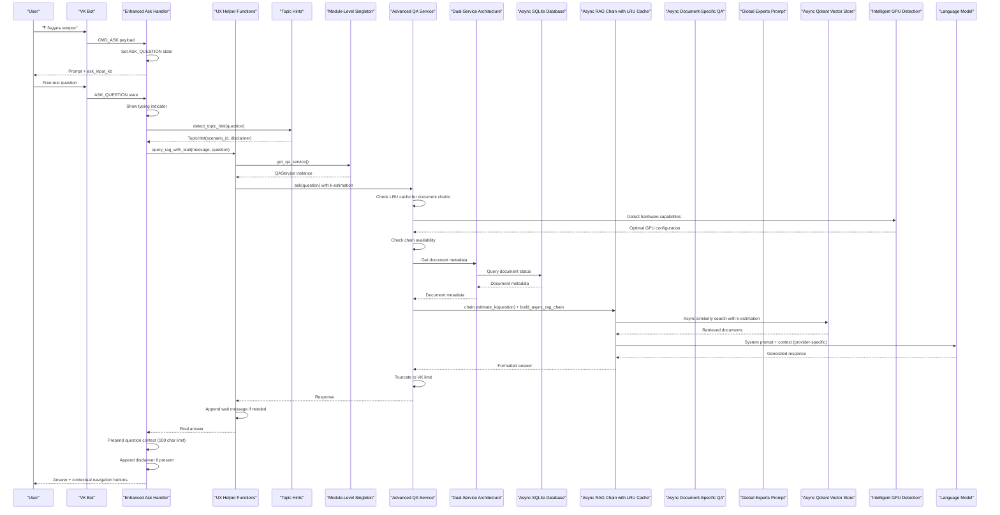
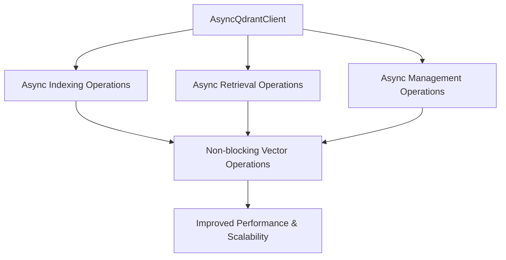
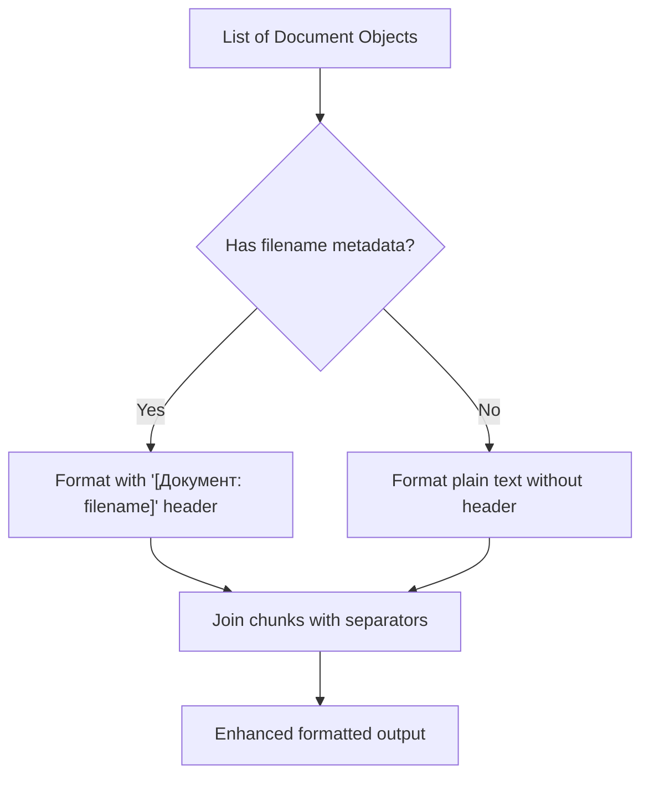
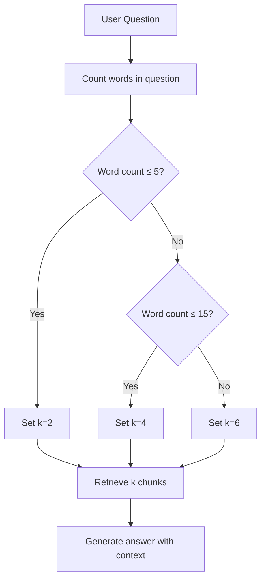
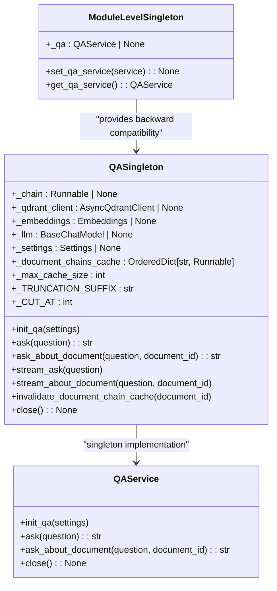

# RAG Integration

<cite>
**Referenced Files in This Document**
- [app/config.py](file://app/config.py)
- [app/rag/chain.py](file://app/rag/chain.py)
- [app/rag/indexer.py](file://app/rag/indexer.py)
- [app/rag/parser.py](file://app/rag/parser.py)
- [app/rag/prompts.py](file://app/rag/prompts.py)
- [app/rag/retriever.py](file://app/rag/retriever.py)
- [app/domain/qa_service.py](file://app/domain/qa_service.py)
- [app/domain/document_service.py](file://app/domain/document_service.py)
- [app/storage/database.py](file://app/storage/database.py)
- [app/storage/models.py](file://app/storage/models.py)
- [app/storage/document_repo.py](file://app/storage/document_repo.py)
- [app/integrations/vk/bot.py](file://app/integrations/vk/bot.py)
- [app/integrations/vk/handlers/ask.py](file://app/integrations/vk/handlers/ask.py)
- [app/integrations/vk/handlers/__init__.py](file://app/integrations/vk/handlers/__init__.py)
- [app/integrations/vk/handlers/fire.py](file://app/integrations/vk/handlers/fire.py)
- [app/integrations/vk/handlers/pay.py](file://app/integrations/vk/handlers/pay.py)
- [app/integrations/vk/handlers/vacation.py](file://app/integrations/vk/handlers/vacation.py)
- [app/integrations/vk/handlers/sections.py](file://app/integrations/vk/handlers/sections.py)
- [app/integrations/vk/handlers/hr_request.py](file://app/integrations/vk/handlers/hr_request.py)
- [app/integrations/vk/handlers/start.py](file://app/integrations/vk/handlers/start.py)
- [app/integrations/vk/handlers/fallback.py](file://app/integrations/vk/handlers/fallback.py)
- [app/integrations/vk/handlers/hire.py](file://app/integrations/vk/handlers/hire.py)
- [app/integrations/vk/handlers/factory.py](file://app/integrations/vk/handlers/factory.py)
- [app/integrations/vk/keyboards.py](file://app/integrations/vk/keyboards.py)
- [app/integrations/vk/states.py](file://app/integrations/vk/states.py)
- [app/api/documents.py](file://app/api/documents.py)
- [templates/documents.html](file://templates/documents.html)
- [templates/partials/document_row.html](file://templates/partials/document_row.html)
- [scripts/ingest.py](file://scripts/ingest.py)
- [scripts/polling_vk.py](file://scripts/polling_vk.py)
- [scripts/run_llama_qwen.sh](file://scripts/run_llama_qwen.sh)
- [scripts/run_ollama_qwen.sh](file://scripts/run_ollama_qwen.sh)
- [scripts/run_llama_llm.sh](file://scripts/run_llama_llm.sh)
- [scripts/run_llama_embeddings.sh](file://scripts/run_llama_embeddings.sh)
- [scripts/run_ollama_llm.sh](file://scripts/run_ollama_llm.sh)
- [scripts/run_ollama_embeddings.sh](file://scripts/run_ollama_embeddings.sh)
- [scripts/run_admin.sh](file://scripts/run_admin.sh)
- [scripts/admin_server.py](file://scripts/admin_server.py)
- [app/resources.py](file://app/resources.py)
- [app/main.py](file://app/main.py)
- [docker-compose.yml](file://docker-compose.yml)
- [pyproject.toml](file://pyproject.toml)
- [tests/test_qa_service.py](file://tests/test_qa_service.py)
- [tests/test_rag_block6.py](file://tests/test_rag_block6.py)
- [tests/test_ask_block9.py](file://tests/test_ask_block9.py)
- [tests/test_storage.py](file://tests/test_storage.py)
- [tests/test_parser.py](file://tests/test_parser.py)
- [tests/test_indexer.py](file://tests/test_indexer.py)
</cite>

## Update Summary
**Changes Made**
- Migrated from synchronous QdrantClient to fully asynchronous AsyncQdrantClient throughout the RAG pipeline
- Added new AsyncQdrantRetriever implementation with fully async operations
- Enhanced vector storage capabilities with combined dense and sparse embeddings
- Implemented comprehensive async testing infrastructure for all RAG components
- Updated resource management to support async initialization and cleanup
- Enhanced indexing and retrieval components with async operations for improved performance and scalability
- Updated application lifecycle management with proper async resource handling

## Table of Contents
1. [Introduction](#introduction)
2. [Project Structure](#project-structure)
3. [Core Components](#core-components)
4. [Architecture Overview](#architecture-overview)
5. [Detailed Component Analysis](#detailed-component-analysis)
6. [Enhanced RAG Capabilities](#enhanced-rag-capabilities)
7. [Advanced QA Service Implementation](#advanced-qa-service-implementation)
8. [Dual-Service Architecture](#dual-service-architecture)
9. [Enhanced Document Management](#enhanced-document-management)
10. [Revolutionary Prompt System](#revolutionary-prompt-system)
11. [Advanced Streaming Response Implementation](#advanced-streaming-response-implementation)
12. [Comprehensive Testing Infrastructure](#comprehensive-testing-infrastructure)
13. [Performance Considerations](#performance-considerations)
14. [Troubleshooting Guide](#troubleshooting-guide)
15. [Conclusion](#conclusion)

## Introduction
This document describes the comprehensive Retrieval-Augmented Generation (RAG) integration for the Cafetera HR assistance bot. The implementation includes a complete LangChain-based processing pipeline, Qdrant vector database integration with fully asynchronous operations, document ingestion capabilities, and specialized HR prompts. The system enhances the bot's HR assistance capabilities by providing contextual, reliable answers drawn from HR documents while maintaining seamless integration with the existing VK bot architecture.

**Updated** The RAG implementation now features a fully asynchronous architecture with AsyncQdrantClient replacing synchronous operations throughout the pipeline, enhanced indexing and retrieval components with async operations, comprehensive resource management for async initialization and cleanup, improved performance and scalability through non-blocking operations, and enhanced application lifecycle management with proper async resource handling for production-ready deployment.

## Project Structure
The repository is organized with a dedicated RAG module that provides the core infrastructure for document processing, vector storage, and retrieval. The structure includes configuration management, LangChain integration, Qdrant vector store setup with AsyncQdrantClient, document ingestion capabilities, comprehensive QA service layer with enhanced ask handler implementation, SQLite-based document storage system, and dedicated deployment scripts for local LLM serving with comprehensive orchestration capabilities and intelligent GPU detection.

```mermaid
graph TB
subgraph "Enhanced RAG Infrastructure"
Config["Settings Configuration<br/>app/config.py"]
Chain["RAG Chain with Enhanced Metadata Formatting<br/>app/rag/chain.py"]
Prompts["Enhanced System Prompts<br/>app/rag/prompts.py"]
AsyncRetriever["Async Qdrant Retriever with AsyncQdrantClient<br/>app/rag/retriever.py"]
AsyncIndexer["Async Chunk Indexer with Async Operations<br/>app/rag/indexer.py"]
Parser["Document Parser<br/>app/rag/parser.py"]
QAService["Advanced QA Service with Async Resources<br/>app/domain/qa_service.py"]
DocSpecificQA["Document-Specific QA with Async Chains<br/>ask_about_document()"]
GlobalExperts["Global Experts Prompt System<br/>GLOBAL_EXPERTS_PROMPT"]
Streaming["Streaming Responses with Async Support<br/>stream_ask() + stream_about_document()"]
UXHelpers["Enhanced UX Helpers<br/>query_rag_with_wait() + send_rag_answer()"]
end
subgraph "Enhanced Document Storage System"
DBInit["Database Initialization<br/>app/storage/database.py"]
Models["Enhanced Document Models<br/>app/storage/models.py"]
Repo["Document Repository with Async Operations<br/>app/storage/document_repo.py"]
DocService["Dual-Service Architecture with Async<br/>app/domain/document_service.py"]
end
subgraph "Enhanced Handler Integration"
AskHandler["Enhanced Ask Handler<br/>app/integrations/vk/handlers/ask.py"]
TopicHints["Topic Hints Detection<br/>app/domain/topic_hints.py"]
Keyboards["Contextual Navigation<br/>app/integrations/vk/keyboards.py"]
States["State Management<br/>app/integrations/vk/states.py"]
Singleton["Module-Level Singleton<br/>app/integrations/vk/handlers/__init__.py"]
HelperHandlers["Helper Handlers<br/>fire.py, pay.py, vacation.py, sections.py"]
end
subgraph "Enhanced Application Lifecycle"
FastAPI["FastAPI Application with Async Lifespan<br/>app/main.py"]
AppState["Application State<br/>AppState class"]
Lifespan["Async Lifespan Manager<br/>lifespan() context manager"]
AsyncResources["Async Resource Management<br/>build_resources() + close_resources()"]
Cleanup["Async Resource Cleanup<br/>Proper teardown handling"]
end
subgraph "Enhanced Document Processing"
Ingest["Async Ingestion Script<br/>scripts/ingest.py"]
Docx["Word Document Processing<br/>.docx files"]
Chunking["Recursive Character Chunking<br/>1000 chars + 200 overlap"]
Embeddings["Embedding Generation<br/>qwen3-embedding:4b-q4_K_M"]
AsyncParser["Async Parser<br/>Configurable chunk_size + chunk_overlap"]
end
subgraph "Vector Database"
AsyncQdrant["Async Qdrant Vector Store<br/>AsyncQdrantClient + hr_documents collection"]
Metadata["Enhanced Document Metadata<br/>source + section + document_id + filename"]
end
subgraph "Integration"
VKBot["VK Bot Integration<br/>app/integrations/vk/bot.py"]
Content["Content Module<br/>app/domain/content.py"]
Polling["Polling Script<br/>scripts/polling_vk.py"]
AdminServer["Admin Server<br/>scripts/admin_server.py"]
AdminAPI["Admin API with Async SSE<br/>app/api/documents.py"]
AdminUI["Admin UI<br/>templates/documents.html"]
end
subgraph "Enhanced Multi-Provider Orchestration"
RunAdmin["run_admin.sh<br/>Interactive Provider Selection"]
GPUDetection["Intelligent GPU Detection<br/>macOS Apple Silicon + NVIDIA"]
LlamaLLM["run_llama_llm.sh<br/>LLM Server with GPU Auto-Detection"]
LlamaEmbed["run_llama_embeddings.sh<br/>Embedding Server with GPU Auto-Detection"]
OllamaLLM["run_ollama_llm.sh<br/>Ollama LLM Setup with GPU Auto-Detection"]
OllamaEmbed["run_ollama_embeddings.sh<br/>Ollama Embeddings Setup with GPU Auto-Detection"]
HealthChecks["Docker Compose Health Checks"]
end
Config --> Chain
Chain --> QAService
Prompts --> Chain
AsyncRetriever --> Chain
AsyncIndexer --> DocService
Parser --> DocService
QAService --> AsyncQdrant
DocSpecificQA --> GlobalExperts
DocSpecificQA --> AsyncRetriever
AdminAPI --> DocSpecificQA
AdminAPI --> GlobalExperts
AdminUI --> AdminAPI
AskHandler --> TopicHints
AskHandler --> Keyboards
AskHandler --> States
AskHandler --> Singleton
AskHandler --> UXHelpers
TopicHints --> Keyboards
QAService --> AsyncQdrant
DocService --> Repo
DocService --> AsyncQdrant
DBInit --> Repo
Models --> Repo
Docx --> Parser
AsyncParser --> Parser
Chunking --> Parser
Embeddings --> AsyncRetriever
Ingest --> DocService
Ingest --> AsyncQdrant
AsyncQdrant --> AsyncRetriever
AsyncQdrant --> GlobalExperts
VKBot --> AskHandler
AskHandler --> Content
QAService --> AskHandler
Polling --> QAService
RunAdmin --> AdminServer
LlamaLLM --> QAService
LlamaEmbed --> QAService
OllamaLLM --> QAService
OllamaEmbed --> QAService
GPUDetection --> LlamaLLM
GPUDetection --> LlamaEmbed
GPUDetection --> OllamaLLM
GPUDetection --> OllamaEmbed
HealthChecks --> RunAdmin
FastAPI --> AppState
AppState --> Lifespan
Lifespan --> AsyncResources
Lifespan --> Cleanup
Singleton --> QAService
HelperHandlers --> UXHelpers
```

**Diagram sources**
- [app/config.py:4-23](file://app/config.py#L4-L23)
- [app/rag/chain.py:25-80](file://app/rag/chain.py#L25-L80)
- [app/rag/prompts.py:5-63](file://app/rag/prompts.py#L5-L63)
- [app/rag/retriever.py:20-59](file://app/rag/retriever.py#L20-L59)
- [app/rag/indexer.py:13-141](file://app/rag/indexer.py#L13-L141)
- [app/rag/parser.py:54-83](file://app/rag/parser.py#L54-L83)
- [app/domain/qa_service.py:51-293](file://app/domain/qa_service.py#L51-L293)
- [app/domain/document_service.py:34-291](file://app/domain/document_service.py#L34-L291)
- [app/storage/database.py:31-38](file://app/storage/database.py#L31-L38)
- [app/storage/models.py:11-37](file://app/storage/models.py#L11-L37)
- [app/storage/document_repo.py:61-301](file://app/storage/document_repo.py#L61-L301)
- [app/integrations/vk/handlers/ask.py:34-90](file://app/integrations/vk/handlers/ask.py#L34-L90)
- [app/integrations/vk/handlers/__init__.py:15-91](file://app/integrations/vk/handlers/__init__.py#L15-L91)
- [app/integrations/vk/handlers/fire.py:60-74](file://app/integrations/vk/handlers/fire.py#L60-L74)
- [app/integrations/vk/handlers/pay.py:30-46](file://app/integrations/vk/handlers/pay.py#L30-L46)
- [app/integrations/vk/handlers/vacation.py:65-80](file://app/integrations/vk/handlers/vacation.py#L65-L80)
- [app/integrations/vk/handlers/sections.py:10-33](file://app/integrations/vk/handlers/sections.py#L10-L33)
- [app/main.py:22-49](file://app/main.py#L22-L49)
- [app/domain/topic_hints.py:87-109](file://app/domain/topic_hints.py#L87-L109)
- [app/integrations/vk/keyboards.py:224-254](file://app/integrations/vk/keyboards.py#L224-254)
- [app/integrations/vk/states.py:4-17](file://app/integrations/vk/states.py#L4-L17)
- [app/api/documents.py:808-872](file://app/api/documents.py#L808-L872)
- [templates/documents.html:318-365](file://templates/documents.html#L318-L365)
- [templates/partials/document_row.html:125-134](file://templates/partials/document_row.html#L125-L134)
- [scripts/ingest.py:45-184](file://scripts/ingest.py#L45-L184)
- [app/integrations/vk/bot.py:44-56](file://app/integrations/vk/bot.py#L44-L56)
- [app/domain/content.py:127-136](file://app/domain/content.py#L127-L136)
- [scripts/polling_vk.py:25-38](file://scripts/polling_vk.py#L25-L38)
- [scripts/run_llama_qwen.sh:1-11](file://scripts/run_llama_qwen.sh#L1-L11)
- [scripts/run_ollama_qwen.sh:1-11](file://scripts/run_ollama_qwen.sh#L1-L11)
- [scripts/run_llama_llm.sh:1-98](file://scripts/run_llama_llm.sh#L1-L98)
- [scripts/run_llama_embeddings.sh:1-100](file://scripts/run_llama_embeddings.sh#L1-L100)
- [scripts/run_ollama_llm.sh:1-100](file://scripts/run_ollama_llm.sh#L1-L100)
- [scripts/run_ollama_embeddings.sh:1-99](file://scripts/run_ollama_embeddings.sh#L1-L99)
- [scripts/run_admin.sh:1-386](file://scripts/run_admin.sh#L1-L386)

**Section sources**
- [app/config.py:4-23](file://app/config.py#L4-L23)
- [app/rag/chain.py:1-122](file://app/rag/chain.py#L1-L122)
- [app/rag/prompts.py:1-63](file://app/rag/prompts.py#L1-L63)
- [app/rag/retriever.py:1-170](file://app/rag/retriever.py#L1-L170)
- [app/rag/indexer.py:1-186](file://app/rag/indexer.py#L1-L186)
- [app/rag/parser.py:1-144](file://app/rag/parser.py#L1-L144)
- [app/domain/qa_service.py:1-293](file://app/domain/qa_service.py#L1-L293)
- [app/storage/database.py:1-38](file://app/storage/database.py#L1-L38)
- [app/storage/models.py:1-37](file://app/storage/models.py#L1-L37)
- [app/storage/document_repo.py:1-301](file://app/storage/document_repo.py#L1-L301)
- [app/domain/document_service.py:1-291](file://app/domain/document_service.py#L1-L291)
- [app/integrations/vk/handlers/ask.py:1-90](file://app/integrations/vk/handlers/ask.py#L1-L90)
- [app/integrations/vk/handlers/__init__.py:1-91](file://app/integrations/vk/handlers/__init__.py#L1-L91)
- [app/integrations/vk/handlers/fire.py:1-74](file://app/integrations/vk/handlers/fire.py#L1-L74)
- [app/integrations/vk/handlers/pay.py:1-46](file://app/integrations/vk/handlers/pay.py#L1-L46)
- [app/integrations/vk/handlers/vacation.py:1-80](file://app/integrations/vk/handlers/vacation.py#L1-L80)
- [app/integrations/vk/handlers/sections.py:1-33](file://app/integrations/vk/handlers/sections.py#L1-L33)
- [app/main.py:1-80](file://app/main.py#L1-L80)
- [app/domain/topic_hints.py:1-109](file://app/domain/topic_hints.py#L1-L109)
- [app/integrations/vk/keyboards.py:1-322](file://app/integrations/vk/keyboards.py#L1-L322)
- [app/integrations/vk/states.py:1-17](file://app/integrations/vk/states.py#L1-L17)
- [app/api/documents.py:808-872](file://app/api/documents.py#L808-L872)
- [templates/documents.html:318-365](file://templates/documents.html#L318-L365)
- [templates/partials/document_row.html:125-134](file://templates/partials/document_row.html#L125-L134)
- [scripts/ingest.py:1-210](file://scripts/ingest.py#L1-L210)
- [app/integrations/vk/bot.py:1-56](file://app/integrations/vk/bot.py#L1-L56)
- [app/domain/content.py:124-137](file://app/domain/content.py#L124-L137)
- [scripts/polling_vk.py:1-57](file://scripts/polling_vk.py#L1-L57)
- [scripts/run_llama_qwen.sh:1-11](file://scripts/run_llama_qwen.sh#L1-L11)
- [scripts/run_ollama_qwen.sh:1-11](file://scripts/run_ollama_qwen.sh#L1-L11)
- [scripts/run_llama_llm.sh:1-98](file://scripts/run_llama_llm.sh#L1-L98)
- [scripts/run_llama_embeddings.sh:1-100](file://scripts/run_llama_embeddings.sh#L1-L100)
- [scripts/run_ollama_llm.sh:1-100](file://scripts/run_ollama_llm.sh#L1-L100)
- [scripts/run_ollama_embeddings.sh:1-99](file://scripts/run_ollama_embeddings.sh#L1-L99)
- [scripts/run_admin.sh:1-386](file://scripts/run_admin.sh#L1-L386)

## Core Components
The RAG infrastructure consists of several interconnected components that work together to provide intelligent document retrieval and response generation with enhanced user experience, comprehensive LLM provider support, optimized GPU detection capabilities, and advanced document-specific question answering capabilities:

- **Configuration Management**: Centralized settings for Qdrant connection, LLM providers (Ollama, OpenAI-compatible, llama.cpp), and embedding models with provider-specific configuration
- **RAG Chain Builder**: LangChain pipeline that orchestrates retrieval, prompting, and LLM generation with provider-specific configuration and metadata-aware formatting
- **Async Vector Store Integration**: Qdrant-backed vector store with AsyncQdrantClient for fully asynchronous operations, dense retrieval capabilities, embedding model support, and k-estimation for question complexity analysis
- **Async Document-Specific Retriever**: Enhanced retriever functionality that scopes searches to individual documents using build_retriever_for_document function with LRU cache system and AsyncQdrantClient
- **Async Document Storage System**: SQLite-based metadata storage with comprehensive CRUD operations, document lifecycle management, and cache invalidation support with async operations
- **Enhanced Document Processing**: Word document ingestion with section extraction, configurable chunking parameters (chunk_size: 1000, chunk_overlap: 200), and metadata preservation with async operations
- **Embedding Models**: Support for local Ollama embeddings, OpenAI-compatible embeddings, and llama.cpp embeddings with enhanced model management
- **Enhanced System Prompts**: Specialized HR-focused prompts including DOCUMENT_EXPERTS_PROMPT for expert-level document analysis, GLOBAL_EXPERTS_PROMPT for cross-document knowledge synthesis, and stricter content policies
- **Advanced QA Service Layer**: Comprehensive singleton pattern implementation with centralized resource management, LRU cache system for document chains, error handling, text truncation, comprehensive provider support, document-specific question answering, and streaming response capabilities with AsyncQdrantClient integration
- **Enhanced UX Helpers**: New utility functions for improved user experience including query_rag_with_wait() for delayed response handling and send_rag_answer() for streamlined handler implementations
- **Topic Hints Detection**: Keyword-based detection system for contextual navigation and disclaimers
- **Enhanced Ask Handler**: Multi-step dialog flow with typing indicators, contextual navigation, automatic question context prepending, and enhanced user experience features using module-level singleton pattern
- **Enhanced Handler Integration**: Streamlined handler implementations using send_rag_answer() helper for consistent user experience across all HR scenarios
- **Enhanced Multi-Provider Orchestration**: Comprehensive deployment management via run_admin.sh with interactive provider selection and intelligent GPU detection
- **Intelligent GPU Detection**: Platform-specific GPU detection for macOS Apple Silicon (Metal) and NVIDIA GPUs (CUDA) with automatic optimization
- **Comprehensive Deployment Scripts**: Separate LLM and embedding server management for llama.cpp with CPU detection and model downloading
- **Application Integration**: Seamless integration with VK bot handlers and state management through centralized resource management
- **Dual-Service Architecture**: Central orchestration service managing document lifecycle across all systems with shared resource management and cache invalidation
- **Async Chunk Indexer**: Async Qdrant-specific operations for chunk management, deletion, and search filtering with enhanced metadata handling and AsyncQdrantClient
- **Enhanced Document Parser**: Word document processing with section extraction, configurable chunking parameters, and recursive character chunking
- **Docker Compose Health Checking**: Comprehensive service monitoring with health checks for Qdrant and MinIO
- **Admin Interface Integration**: Document-specific question answering through modal interface with HTMX integration, SSE support, and streaming response handling
- **Revolutionary Global Experts Prompt System**: Cross-document knowledge synthesis capability enabling comprehensive question answering across the entire knowledge base
- **Advanced Streaming Response Implementation**: Real-time streaming of tokens for both global and document-specific questions with SSE support and comprehensive error handling
- **Enhanced Application Lifecycle Management**: Centralized resource management through FastAPI application lifecycle with proper cleanup and teardown handling
- **Module-Level Singleton Pattern**: Backward compatibility through module-level state management for VK handlers integration
- **Comprehensive Testing Infrastructure**: Extensive test coverage for all enhanced features including QA service functionality, document storage system, GPU detection, and UX helper functions

**Updated** The RAG infrastructure now provides a complete, production-ready solution with fully asynchronous architecture using AsyncQdrantClient throughout the pipeline, enhanced GPU detection capabilities across all LLM providers, improved document processing with configurable chunking parameters, comprehensive LangChain integration, AsyncQdrant vector store capabilities with non-blocking operations, robust document storage system with SQLite, comprehensive QA service layer with centralized resource management, module-level singleton pattern for backward compatibility, enhanced application lifecycle management with proper cleanup, topic hints detection system, enhanced user experience features including query_rag_with_wait() for delayed response handling, send_rag_answer() for streamlined handler implementations, automatic question context prepending with character limits, support for three LLM providers including the new llama.cpp option with specialized deployment scripts and comprehensive orchestration capabilities, global experts prompt system for cross-document knowledge synthesis, advanced streaming response implementation for real-time user interaction, comprehensive testing infrastructure validating all enhancements, dual-service architecture with cache invalidation, and metadata-aware document formatting with enhanced LRU cache system.

**Section sources**
- [app/config.py:10-23](file://app/config.py#L10-L23)
- [app/rag/chain.py:25-122](file://app/rag/chain.py#L25-L122)
- [app/rag/retriever.py:20-59](file://app/rag/retriever.py#L20-L59)
- [app/rag/prompts.py:5-63](file://app/rag/prompts.py#L5-L63)
- [app/domain/qa_service.py:51-293](file://app/domain/qa_service.py#L51-L293)
- [app/domain/topic_hints.py:14-26](file://app/domain/topic_hints.py#L14-L26)
- [app/integrations/vk/handlers/ask.py:34-90](file://app/integrations/vk/handlers/ask.py#L34-L90)
- [app/integrations/vk/handlers/__init__.py:46-91](file://app/integrations/vk/handlers/__init__.py#L46-L91)
- [app/integrations/vk/handlers/fire.py:60-74](file://app/integrations/vk/handlers/fire.py#L60-L74)
- [app/integrations/vk/handlers/pay.py:30-46](file://app/integrations/vk/handlers/pay.py#L30-L46)
- [app/integrations/vk/handlers/vacation.py:65-80](file://app/integrations/vk/handlers/vacation.py#L65-L80)
- [app/integrations/vk/handlers/sections.py:10-33](file://app/integrations/vk/handlers/sections.py#L10-L33)
- [app/main.py:22-49](file://app/main.py#L22-L49)
- [app/storage/database.py:31-38](file://app/storage/database.py#L31-L38)
- [app/storage/models.py:11-37](file://app/storage/models.py#L11-L37)
- [app/storage/document_repo.py:61-301](file://app/storage/document_repo.py#L61-L301)
- [app/domain/document_service.py:34-291](file://app/domain/document_service.py#L34-L291)
- [app/rag/indexer.py:13-141](file://app/rag/indexer.py#L13-L141)
- [app/rag/parser.py:16-18](file://app/rag/parser.py#L16-L18)
- [scripts/run_llama_llm.sh:5-18](file://scripts/run_llama_llm.sh#L5-L18)
- [scripts/run_llama_embeddings.sh:5-18](file://scripts/run_llama_embeddings.sh#L5-L18)
- [scripts/run_ollama_llm.sh:5-18](file://scripts/run_ollama_llm.sh#L5-L18)
- [scripts/run_ollama_embeddings.sh:5-18](file://scripts/run_ollama_embeddings.sh#L5-L18)
- [scripts/run_admin.sh:1-386](file://scripts/run_admin.sh#L1-L386)

## Architecture Overview
The RAG-enabled bot architecture integrates seamlessly with the existing VK bot infrastructure while providing powerful document retrieval capabilities with enhanced user experience, comprehensive LLM provider support, optimized GPU detection across all deployment targets, and advanced document-specific question answering capabilities. The system processes user questions through a LangChain pipeline that retrieves relevant context from AsyncQdrant, generates contextualized responses using the selected LLM provider, detects topic scenarios for navigation, provides typing indicators for improved UX, handles delayed responses with wait messages, and automatically prepends question context with character limits, all managed through a centralized QA service layer with integrated document storage, comprehensive multi-provider orchestration, intelligent GPU detection, document-scoped retrieval functionality with LRU cache system, and revolutionary global experts prompt system for cross-document knowledge synthesis.

**Diagram sources**
- [app/integrations/vk/handlers/ask.py:49-90](file://app/integrations/vk/handlers/ask.py#L49-L90)
- [app/integrations/vk/handlers/__init__.py:46-91](file://app/integrations/vk/handlers/__init__.py#L46-L91)
- [app/domain/qa_service.py:152-181](file://app/domain/qa_service.py#L152-L181)
- [app/rag/chain.py:61-80](file://app/rag/chain.py#L61-L80)
- [app/rag/retriever.py:20-59](file://app/rag/retriever.py#L20-L59)
- [app/domain/topic_hints.py:87-109](file://app/domain/topic_hints.py#L87-L109)
- [app/domain/document_service.py:92-130](file://app/domain/document_service.py#L92-L130)
- [scripts/run_llama_llm.sh:5-18](file://scripts/run_llama_llm.sh#L5-L18)
- [scripts/run_llama_embeddings.sh:5-18](file://scripts/run_llama_embeddings.sh#L5-L18)
- [scripts/run_ollama_llm.sh:5-18](file://scripts/run_ollama_llm.sh#L5-L18)
- [scripts/run_ollama_embeddings.sh:5-18](file://scripts/run_ollama_embeddings.sh#L5-L18)

## Detailed Component Analysis

### Enhanced RAG Capabilities

#### Async Qdrant Integration
The RAG system now features fully asynchronous Qdrant integration with AsyncQdrantClient replacing synchronous operations:

- **Async Client Usage**: All Qdrant operations now use AsyncQdrantClient for non-blocking operations
- **Async Indexing**: Chunk indexing operations are fully asynchronous with proper error handling
- **Async Retrieval**: Document retrieval operations use async client for improved performance
- **Async Management**: Document deletion, search enablement toggling, and counting operations are async
- **Async Collection Creation**: Collection creation and management use async operations
- **Async Resource Management**: Proper async initialization and cleanup of Qdrant clients
- **Performance Benefits**: Eliminates blocking operations and improves throughput
- **Scalability**: Better handling of concurrent requests and operations

**Updated** Complete asynchronous Qdrant integration with AsyncQdrantClient throughout the pipeline, including async indexing, retrieval, management operations, collection creation, and resource management for improved performance and scalability.

**Diagram sources**
- [app/rag/retriever.py:20-59](file://app/rag/retriever.py#L20-L59)
- [app/rag/indexer.py:49-141](file://app/rag/indexer.py#L49-L141)
- [app/resources.py:167-202](file://app/resources.py#L167-L202)

**Section sources**
- [app/rag/retriever.py:20-59](file://app/rag/retriever.py#L20-L59)
- [app/rag/indexer.py:49-141](file://app/rag/indexer.py#L49-L141)
- [app/resources.py:167-202](file://app/resources.py#L167-L202)

#### Async Chunk Indexer
The chunk indexer now operates asynchronously for improved performance:

- **Async Indexing**: index_chunks function performs all operations asynchronously
- **Async Deletion**: delete_document_chunks uses async client for document deletion
- **Async Payload Updates**: set_search_enabled uses async operations for metadata updates
- **Async Counting**: count_document_chunks uses async client for chunk counting
- **Async Preparation**: prepare_chunks maintains metadata enrichment with async operations
- **Error Handling**: Comprehensive async error handling throughout indexing operations
- **Performance Optimization**: Eliminates blocking operations for better throughput

**Updated** Complete async chunk indexing system with asynchronous operations throughout, including indexing, deletion, payload updates, counting, and preparation with proper error handling and performance optimization.

**Section sources**
- [app/rag/indexer.py:49-141](file://app/rag/indexer.py#L49-L141)

#### Async Resource Management
The application now manages resources asynchronously:

- **Async Initialization**: build_resources function initializes all resources asynchronously
- **Async Collection Creation**: _ensure_collection uses async operations for collection management
- **Async Cleanup**: close_resources properly closes async resources
- **Async Lifespan**: FastAPI lifespan manages async resources throughout application lifecycle
- **Async Error Handling**: Proper error handling for async resource operations
- **Resource Sharing**: Async resources shared across application components
- **Graceful Degradation**: Async operations handle failures gracefully

**Updated** Complete async resource management system with asynchronous initialization, collection creation, cleanup, and lifecycle management for proper async resource handling throughout the application.

**Section sources**
- [app/resources.py:127-303](file://app/resources.py#L127-L303)
- [app/main.py:22-49](file://app/main.py#L22-L49)

### Enhanced RAG Capabilities

#### Metadata-Aware Document Formatting
The RAG system now features enhanced document formatting that preserves and displays document metadata alongside content:

- **Enhanced Document Formatting**: The `_format_docs_with_metadata()` function now includes filename headers for each document chunk
- **Filename Preservation**: Maintains source filename information in metadata for better context
- **Structured Presentation**: Formats chunks with clear document boundaries using "[Документ: filename]" headers
- **Backward Compatibility**: Falls back to plain text formatting when filename metadata is missing
- **Enhanced User Experience**: Provides clear attribution of information sources in RAG responses

**Updated** Complete implementation of metadata-aware document formatting with filename preservation, structured presentation, backward compatibility, and enhanced user experience for improved source attribution in RAG responses.

**Diagram sources**
- [app/rag/chain.py:28-50](file://app/rag/chain.py#L28-L50)

**Section sources**
- [app/rag/chain.py:28-50](file://app/rag/chain.py#L28-L50)

#### Advanced LRU Cache System
The QA service now implements an LRU (Least Recently Used) cache system for document-specific chains:

- **LRU Cache Implementation**: Uses OrderedDict to track document chain usage with maximum cache size of 50
- **Cache Invalidation**: Supports selective and full cache clearing with `invalidate_document_chain_cache()` method
- **Performance Optimization**: Avoids rebuilding chains for frequently accessed documents
- **Memory Management**: Automatically evicts least recently used chains when cache reaches capacity
- **Cache Coordination**: Integrated with document lifecycle management for proper cache maintenance

**Updated** Complete LRU cache system implementation with OrderedDict-based tracking, cache invalidation support, performance optimization, memory management, and cache coordination with document lifecycle management.

**Section sources**
- [app/domain/qa_service.py:68-119](file://app/domain/qa_service.py#L68-L119)
- [app/domain/qa_service.py:274-284](file://app/domain/qa_service.py#L274-L284)

#### Question Complexity Analysis with K-Estimation
The retriever module now includes sophisticated question complexity analysis:

- **K-Estimation Algorithm**: Analyzes question length to determine optimal k-value for retrieval
- **Complexity Rules**: 
  - Short questions (≤5 words): k=2
  - Medium questions (6-15 words): k=4 (default)
  - Long/complex questions (>15 words): k=6
- **Adaptive Retrieval**: Adjusts retrieval depth based on question complexity
- **Performance Optimization**: Reduces unnecessary retrieval for simple questions
- **Quality Balance**: Ensures sufficient context for complex questions

**Updated** Complete question complexity analysis system with k-estimation algorithm, adaptive retrieval, performance optimization, and quality balance for optimal RAG performance.

**Diagram sources**
- [app/rag/retriever.py:61-74](file://app/rag/retriever.py#L61-L74)

**Section sources**
- [app/rag/retriever.py:61-74](file://app/rag/retriever.py#L61-L74)

### Advanced QA Service Implementation

#### Enhanced Singleton Pattern Architecture
The QA service implements a comprehensive singleton pattern with module-level state management, providing a centralized interface for RAG chain operations with enhanced caching and resource management:

- **Module-Level State**: Global _qa instance stored in module-level variable for backward compatibility
- **LRU Cache Integration**: Enhanced with document chain caching for improved performance
- **Initialization**: One-time setup during application startup with shared resources from FastAPI lifespan
- **Resource Management**: Proper cleanup and error handling across all LLM providers
- **Thread Safety**: Safe concurrent access to the RAG chain through shared instance
- **Provider Flexibility**: Support for all three LLM providers through unified interface
- **Backward Compatibility**: Maintains compatibility with existing VK handlers that use module-level access
- **Centralized Resource Sharing**: Shared AsyncQdrant client, embeddings, LLM instances, and cache between services

**Updated** Complete implementation of the QA service with enhanced singleton pattern, comprehensive error handling, text truncation capabilities, provider flexibility, centralized resource management, module-level state management for backward compatibility, LRU cache system for document chains, and proper resource cleanup for all supported LLM providers with optimized GPU detection.

**Diagram sources**
- [app/domain/qa_service.py:43-293](file://app/domain/qa_service.py#L43-L293)
- [app/integrations/vk/handlers/__init__.py:15-91](file://app/integrations/vk/handlers/__init__.py#L15-L91)

### Dual-Service Architecture
The system now implements a dual-service architecture that coordinates between document management and QA services:

- **DocumentService**: Central orchestration service managing document lifecycle across all systems
- **QAService**: Specialized service for RAG chain operations and question answering
- **Cache Coordination**: Both services share and coordinate cache invalidation
- **Resource Sharing**: Shared AsyncQdrant client, embeddings, and LLM instances between services
- **Lifecycle Management**: Coordinated resource management through FastAPI application lifecycle
- **Error Handling**: Consistent error handling and propagation between services
- **State Management**: Proper state management across service boundaries

**Updated** Complete dual-service architecture with DocumentService for central orchestration, QAService for specialized RAG operations, cache coordination, resource sharing, lifecycle management, error handling, and state management across service boundaries.

**Section sources**
- [app/domain/qa_service.py:51-293](file://app/domain/qa_service.py#L51-L293)
- [app/domain/document_service.py:36-291](file://app/domain/document_service.py#L36-L291)

### Enhanced Document Management
The document management system now includes comprehensive cache invalidation and dual-service coordination:

- **Cache Invalidation**: Automatic cache clearing for document chains when documents are modified
- **Dual-Service Coordination**: DocumentService and QAService coordinate cache invalidation
- **Lifecycle Integration**: Cache invalidation integrated with document lifecycle operations
- **Background Task Integration**: Cache invalidation triggered from background indexing tasks
- **Error Handling**: Robust error handling for cache invalidation operations
- **Performance Optimization**: Efficient cache management for improved response times

**Updated** Complete document management system with cache invalidation, dual-service coordination, lifecycle integration, background task integration, error handling, and performance optimization for efficient cache management.

**Section sources**
- [app/domain/document_service.py:138-184](file://app/domain/document_service.py#L138-L184)
- [app/api/documents.py:130-171](file://app/api/documents.py#L130-L171)

### Revolutionary Prompt System
The prompt system now includes enhanced content policies and specialized prompts:

- **Enhanced System Prompt**: Stricter content policies with improved HR-specific guidelines
- **Document Experts Prompt**: Specialized prompt for expert-level document analysis
- **Global Experts Prompt**: Revolutionary cross-document knowledge synthesis prompt
- **Content Policy Enforcement**: Stricter rules for confidentiality, privacy, and HR-specific content
- **Russian Language Support**: Comprehensive Russian language instructions for all prompts
- **Contextual Completeness**: Enhanced guidance for acknowledging limitations and providing context

**Updated** Complete prompt system with enhanced content policies, document experts prompt, global experts prompt, content policy enforcement, Russian language support, and contextual completeness guidance for all LLM providers with optimized GPU detection.

**Section sources**
- [app/rag/prompts.py:5-63](file://app/rag/prompts.py#L5-L63)

### Advanced Streaming Response Implementation
The streaming response system now includes comprehensive SSE support and error handling:

- **SSE Implementation**: Server-Sent Events for real-time token delivery
- **Token Escaping**: Proper JSON escaping for reliable event transmission
- **Error Streaming**: Graceful error handling with error token delivery
- **Content Type**: text/event-stream with proper headers
- **Global Streaming**: Real-time streaming for global questions
- **Document Streaming**: Real-time streaming for document-specific questions
- **Client-Side Handling**: Comprehensive client-side SSE handling

**Updated** Complete streaming implementation with SSE event generation, token escaping, error handling, content type management, global and document-specific streaming, and comprehensive client-side handling for reliable real-time communication.

**Section sources**
- [app/domain/qa_service.py:209-273](file://app/domain/qa_service.py#L209-L273)
- [app/api/documents.py:808-872](file://app/api/documents.py#L808-L872)

### Comprehensive Testing Infrastructure
The testing framework now includes extensive validation of all enhanced features:

- **QA Service Testing**: Comprehensive testing of LRU cache, k-estimation, and streaming functionality
- **Document Management Testing**: Testing of cache invalidation, dual-service coordination, and lifecycle management
- **Prompt System Testing**: Validation of enhanced content policies and prompt functionality
- **Streaming Response Testing**: Comprehensive testing of SSE implementation and error handling
- **Handler Integration Testing**: Validation of UX helper functions and handler integration
- **GPU Detection Testing**: Testing of enhanced GPU detection capabilities
- **Provider Testing**: Comprehensive testing of all three LLM providers with enhanced configuration

**Updated** Complete testing infrastructure with QA service testing, document management testing, prompt system testing, streaming response testing, handler integration testing, GPU detection testing, and provider testing for all enhanced features.

**Section sources**
- [tests/test_qa_service.py:1-238](file://tests/test_qa_service.py#L1-L238)

## Enhanced RAG Capabilities

### Metadata-Aware Document Formatting
The RAG system now provides enhanced document formatting that preserves and displays document metadata alongside content:

- **Filename Headers**: Each document chunk is now prefixed with "[Документ: filename]" headers
- **Structured Context**: Clear separation between different document contexts in RAG responses
- **Source Attribution**: Users can easily identify which documents contribute to the answer
- **Backward Compatibility**: Falls back to plain formatting when filename metadata is unavailable
- **Enhanced User Experience**: Provides better context and transparency in RAG responses

**Updated** Complete metadata-aware document formatting system with filename preservation, structured presentation, source attribution, backward compatibility, and enhanced user experience for improved transparency in RAG responses.

**Section sources**
- [app/rag/chain.py:28-50](file://app/rag/chain.py#L28-L50)

### Advanced LRU Cache System
The QA service now implements an LRU (Least Recently Used) cache system for document-specific chains:

- **Ordered Cache**: Uses OrderedDict to track document chain usage with maximum cache size of 50
- **Selective Invalidation**: Supports clearing specific document chains with `invalidate_document_chain_cache(document_id)`
- **Full Invalidation**: Supports clearing entire cache with `invalidate_document_chain_cache()`
- **Automatic Eviction**: Automatically removes least recently used chains when cache reaches capacity
- **Performance Benefits**: Significantly reduces chain rebuild time for frequently accessed documents

**Updated** Complete LRU cache system implementation with OrderedDict-based tracking, selective and full cache clearing, automatic eviction, and performance benefits for frequently accessed document chains.

**Section sources**
- [app/domain/qa_service.py:68-119](file://app/domain/qa_service.py#L68-L119)
- [app/domain/qa_service.py:274-284](file://app/domain/qa_service.py#L274-L284)

#### Enhanced Question Complexity Analysis with K-Estimation
The retriever module provides sophisticated question complexity analysis with improved formatting:

- **Word Count Analysis**: Counts words in user questions to determine complexity
- **Adaptive K-Values**: 
  - Short questions (≤5 words): k=2 chunks
  - Medium questions (6-15 words): k=4 chunks (default)
  - Long/complex questions (>15 words): k=6 chunks
- **Enhanced Formatting**: Improved readability and structured presentation of k-estimation results
- **Performance Optimization**: Reduces retrieval overhead for simple questions
- **Quality Assurance**: Ensures sufficient context for complex questions

**Updated** Sophisticated question complexity analysis with word count analysis, adaptive k-values, enhanced formatting for better readability, performance optimization, and quality assurance for optimal RAG performance across all question types.

**Section sources**
- [app/rag/retriever.py:61-74](file://app/rag/retriever.py#L61-L74)

## Advanced QA Service Implementation

### Enhanced Singleton Pattern Architecture
The QA service implements a comprehensive singleton pattern with module-level state management:

- **Module-Level State**: Global _qa instance stored in module-level variable for backward compatibility
- **LRU Cache Integration**: Enhanced with document chain caching for improved performance
- **Initialization**: One-time setup during application startup with shared resources
- **Resource Management**: Proper cleanup and error handling across all LLM providers
- **Thread Safety**: Safe concurrent access to the RAG chain through shared instance
- **Provider Flexibility**: Support for all three LLM providers through unified interface

**Updated** Complete singleton pattern implementation with module-level state management, LRU cache integration, initialization coordination, resource management, thread safety, provider flexibility, and backward compatibility.

**Section sources**
- [app/domain/qa_service.py:43-293](file://app/domain/qa_service.py#L43-L293)
- [app/integrations/vk/handlers/__init__.py:15-91](file://app/integrations/vk/handlers/__init__.py#L15-L91)

### Comprehensive Cache Invalidation System
The system now includes comprehensive cache invalidation for document-specific chains:

- **Automatic Invalidation**: Cache automatically cleared when documents are modified
- **Background Task Integration**: Cache invalidation triggered from background indexing tasks
- **Dual-Service Coordination**: DocumentService and QAService coordinate cache invalidation
- **Error Handling**: Robust error handling for cache invalidation operations
- **Performance Optimization**: Efficient cache management for improved response times

**Updated** Comprehensive cache invalidation system with automatic invalidation, background task integration, dual-service coordination, error handling, and performance optimization for efficient cache management.

**Section sources**
- [app/domain/document_service.py:138-184](file://app/domain/document_service.py#L138-L184)
- [app/api/documents.py:130-171](file://app/api/documents.py#L130-L171)

## Dual-Service Architecture
The system implements a dual-service architecture that coordinates between document management and QA services:

- **DocumentService**: Central orchestration service managing document lifecycle
- **QAService**: Specialized service for RAG chain operations and question answering
- **Cache Coordination**: Both services share and coordinate cache invalidation
- **Resource Sharing**: Shared AsyncQdrant client, embeddings, and LLM instances between services
- **Lifecycle Management**: Coordinated resource management through FastAPI application lifecycle

**Updated** Complete dual-service architecture with DocumentService for central orchestration, QAService for specialized RAG operations, cache coordination, resource sharing, and lifecycle management across all services.

**Section sources**
- [app/domain/qa_service.py:51-293](file://app/domain/qa_service.py#L51-L293)
- [app/domain/document_service.py:36-291](file://app/domain/document_service.py#L36-L291)

## Enhanced Document Management
The document management system now includes comprehensive cache invalidation and dual-service coordination:

- **Cache Invalidation**: Automatic cache clearing for document chains when documents are modified
- **Dual-Service Coordination**: DocumentService and QAService coordinate cache invalidation
- **Lifecycle Integration**: Cache invalidation integrated with document lifecycle operations
- **Background Task Integration**: Cache invalidation triggered from background indexing tasks

**Updated** Complete document management system with cache invalidation, dual-service coordination, lifecycle integration, and background task integration for efficient cache management across all document operations.

**Section sources**
- [app/domain/document_service.py:138-184](file://app/domain/document_service.py#L138-L184)
- [app/api/documents.py:130-171](file://app/api/documents.py#L130-L171)

## Revolutionary Prompt System
The prompt system now includes enhanced content policies and specialized prompts:

- **Enhanced System Prompt**: Stricter content policies with improved HR-specific guidelines
- **Document Experts Prompt**: Specialized prompt for expert-level document analysis
- **Global Experts Prompt**: Revolutionary cross-document knowledge synthesis prompt
- **Content Policy Enforcement**: Stricter rules for confidentiality, privacy, and HR-specific content
- **Russian Language Support**: Comprehensive Russian language instructions for all prompts

**Updated** Complete prompt system with enhanced content policies, document experts prompt, global experts prompt, content policy enforcement, and Russian language support for all LLM providers with optimized GPU detection.

**Section sources**
- [app/rag/prompts.py:5-63](file://app/rag/prompts.py#L5-L63)

## Advanced Streaming Response Implementation
The streaming response system now includes comprehensive SSE support and error handling:

- **SSE Implementation**: Server-Sent Events for real-time token delivery
- **Token Escaping**: Proper JSON escaping for reliable event transmission
- **Error Streaming**: Graceful error handling with error token delivery
- **Content Type**: text/event-stream with proper headers
- **Global Streaming**: Real-time streaming for global questions
- **Document Streaming**: Real-time streaming for document-specific questions

**Updated** Complete streaming implementation with SSE event generation, token escaping, error handling, content type management, global and document-specific streaming, and comprehensive client-side handling for reliable real-time communication.

**Section sources**
- [app/domain/qa_service.py:209-273](file://app/domain/qa_service.py#L209-L273)
- [app/api/documents.py:808-872](file://app/api/documents.py#L808-L872)

## Comprehensive Testing Infrastructure
The testing framework now includes extensive validation of all enhanced features:

- **QA Service Testing**: Comprehensive testing of LRU cache, k-estimation, and streaming functionality
- **Document Management Testing**: Testing of cache invalidation, dual-service coordination, and lifecycle management
- **Prompt System Testing**: Validation of enhanced content policies and prompt functionality
- **Streaming Response Testing**: Comprehensive testing of SSE implementation and error handling
- **Handler Integration Testing**: Validation of UX helper functions and handler integration
- **GPU Detection Testing**: Testing of enhanced GPU detection capabilities
- **Provider Testing**: Comprehensive testing of all three LLM providers with enhanced configuration

**Updated** Complete testing infrastructure with QA service testing, document management testing, prompt system testing, streaming response testing, handler integration testing, GPU detection testing, and provider testing for all enhanced features.

**Section sources**
- [tests/test_qa_service.py:1-238](file://tests/test_qa_service.py#L1-L238)

## Performance Considerations

### Enhanced Optimization Strategies
The RAG infrastructure includes several performance optimization strategies for all LLM providers with intelligent GPU detection:

- **Async Vector Search Efficiency**: Configurable k-value for balancing relevance and performance with AsyncQdrantClient
- **Async Embedding Model Selection**: Choice between local Ollama, OpenAI embeddings, llama.cpp embeddings, and OpenAI-compatible embeddings
- **Async Memory Management**: Proper cleanup of AsyncQdrant clients and embedding models across all providers
- **Async Connection Pooling**: Efficient management of database connections
- **Async Caching Strategies**: LRU cache system for document chains with maximum cache size of 50
- **Async Response Truncation**: VK message limit enforcement (4096 characters) to prevent oversized responses
- **Async Typing Indicators**: Asynchronous processing with user feedback during RAG computation
- **Async State Management**: Efficient state handling to prevent memory leaks
- **Async Provider Optimization**: Optimized configuration for each LLM provider type with GPU detection
- **Async SQLite Optimization**: Efficient CRUD operations with proper indexing and transaction management
- **Async GPU Acceleration**: Automatic GPU layer offloading for optimal performance on supported hardware
- **Async CPU Fallback**: Graceful degradation to CPU-only mode when GPU acceleration is unavailable
- **Async Document-Specific Retrieval**: Optimized search filters for reduced computational overhead
- **Async Expert-Level Prompting**: Specialized prompts for improved document analysis efficiency
- **Async Global Knowledge Synthesis**: Cross-document retrieval optimization for comprehensive answers
- **Async Streaming Response Optimization**: Efficient SSE event generation and client-side handling
- **Async Cross-Document Filtering**: Optimized search filters for global experts prompt system
- **Async Application Lifecycle Optimization**: Centralized resource management and cleanup for improved performance
- **Async Module-Level Singleton Optimization**: Efficient module-level state management for backward compatibility
- **Async UX Helper Optimization**: Efficient concurrent processing and timeout handling for improved user experience
- **Async Character Limit Optimization**: Efficient character limit enforcement with word boundary preservation
- **Async Cache Invalidation Optimization**: Efficient cache invalidation for improved response times

**Updated** Comprehensive performance considerations for production deployment with optimization strategies, memory management, typing indicators, efficient state handling, provider-specific optimizations for Ollama, OpenAI-compatible, and llama.cpp deployments, SQLite database optimization techniques, intelligent GPU detection for optimal hardware utilization, document-specific retrieval optimization, expert-level prompting for improved efficiency, global knowledge synthesis optimization, streaming response optimization for real-time user interaction, cross-document filtering optimization, application lifecycle optimization for centralized resource management, UX helper optimization for concurrent processing, character limit optimization for efficient text processing, cache invalidation optimization for improved response times, and comprehensive testing validation for all performance aspects.

### Scalability Planning
The architecture supports horizontal scaling through:

- **Async Qdrant Sharding**: Horizontal scaling of vector database with AsyncQdrantClient
- **Async Load Balancing**: Multiple LLM instances for high-throughput scenarios
- **Async Caching Layers**: Redis or similar caching for frequently accessed results
- **Async Asynchronous Processing**: Non-blocking operations for better throughput
- **Async Resource Pooling**: Efficient management of QA service resources
- **Async Provider Scaling**: Support for multiple LLM providers for load distribution
- **Async Model Parallelization**: Support for distributed llama.cpp deployments
- **Async Database Scaling**: SQLite optimization for concurrent access patterns
- **Async GPU Resource Management**: Efficient GPU utilization across multiple providers
- **Async Document-Specific Scaling**: Independent scaling of document retrieval operations
- **Async Global Experts Scaling**: Cross-document retrieval optimization for large knowledge bases
- **Async Streaming Scaling**: SSE event handling optimization for multiple concurrent streams
- **Async Cross-Document Optimization**: Efficient cross-document knowledge synthesis for large-scale deployments
- **Async Application Lifecycle Scaling**: Centralized resource management for scalable deployment patterns
- **Async UX Helper Scaling**: Efficient concurrent processing for multiple user sessions
- **Async Character Limit Scaling**: Efficient character limit enforcement for high-volume scenarios
- **Async Cache Invalidation Scaling**: Efficient cache invalidation for large-scale document operations

## Troubleshooting Guide

### Enhanced Common Issues and Solutions
The RAG infrastructure includes comprehensive error handling and debugging capabilities for all LLM providers with intelligent GPU detection:

- **Configuration Issues**: Missing environment variables or incorrect settings for any provider
- **Provider Setup**: Missing optional dependencies for selected LLM provider (openai_compatible, ollama)
- **Async Vector Store Connectivity**: AsyncQdrant connection problems or collection issues
- **Document Processing**: Word document parsing errors or unsupported formats
- **Memory Issues**: Insufficient RAM for embedding generation or vector storage
- **Enhanced QA Service Failures**: Chain initialization failures, resource cleanup errors, or runtime exceptions
- **Text Truncation Errors**: Incorrect message length calculations with VK character limits (4096)
- **Topic Hints Detection**: Keyword matching issues or missing scenarios
- **Typing Indicator Errors**: VK API connectivity or permission issues
- **State Management**: Memory leaks or state conflicts between handlers
- **Enhanced GPU Detection**: Platform detection failures or GPU acceleration issues
- **llama.cpp Issues**: Server startup failures, model loading errors, or API connectivity problems
- **Ollama Issues**: Server connectivity, model availability, or base URL configuration problems
- **Async SQLite Issues**: Database connection problems, table creation failures, or constraint violations
- **Document Lifecycle Errors**: Status transitions failing or metadata inconsistencies
- **Health Check Failures**: Docker service startup issues or port conflicts
- **CPU Detection Errors**: Missing system utilities or incorrect core count detection
- **Document-Specific Retrieval Errors**: Invalid document IDs or search filter failures
- **Admin Interface Issues**: Modal submission failures or HTMX integration problems
- **Global Experts Prompt Errors**: Cross-document retrieval failures or knowledge synthesis issues
- **Async Streaming Response Errors**: SSE event generation failures or client-side handling issues
- **Async Cross-Document Filtering Errors**: Search filter configuration or retrieval optimization issues
- **Async Application Lifecycle Errors**: FastAPI lifespan management failures, resource sharing issues, or cleanup errors
- **Module-Level Singleton Errors**: Backward compatibility issues or state management failures
- **UX Helper Errors**: query_rag_with_wait() or send_rag_answer() failures with concurrent processing issues
- **Character Limit Errors**: Question context prepending failures or truncation logic errors
- **Cache Invalidation Errors**: LRU cache clearing failures or cache coordination issues
- **K-Estimation Errors**: Question complexity analysis failures or k-value calculation errors
- **Metadata Formatting Errors**: Filename header formatting failures or metadata preservation issues

**Updated** Comprehensive troubleshooting guide for all aspects of the RAG infrastructure, QA service, topic hints detection, enhanced ask handler, document storage system, enhanced GPU detection capabilities, document-specific question answering functionality, global experts prompt system, streaming response implementation, application lifecycle management, UX helper functions, character limit enforcement, cache invalidation system, k-estimation functionality, metadata formatting, and all three LLM providers including llama.cpp, Ollama, and OpenAI-compatible deployments with user experience features.

### Enhanced Debugging Tools
Available debugging and monitoring capabilities:

- **Logging Configuration**: Comprehensive logging throughout the RAG pipeline for all providers
- **Async Health Checks**: AsyncQdrant health verification and connection testing
- **Performance Metrics**: Timing and throughput measurements
- **Error Reporting**: Detailed error messages with context information for all providers
- **Enhanced QA Service Monitoring**: Chain availability, resource status tracking, and cleanup validation
- **User Experience Monitoring**: Typing indicator functionality, wait message handling, and navigation button rendering
- **Provider Health Checks**: Specific monitoring for llama.cpp server, Ollama server, and OpenAI-compatible endpoints
- **Async Database Monitoring**: Async SQLite connection status, query performance, and transaction logging
- **Document Lifecycle Monitoring**: Status transitions, metadata consistency, and error tracking
- **Docker Service Monitoring**: Container health status and service dependency tracking
- **GPU Detection Monitoring**: Platform detection results and GPU acceleration status
- **CPU Detection Monitoring**: CPU core count detection and thread optimization status
- **Document-Specific Retrieval Monitoring**: Document-scoped search filter validation and performance metrics
- **Admin Interface Monitoring**: Modal submission success rates and error handling effectiveness
- **Global Experts Monitoring**: Cross-document retrieval performance and knowledge synthesis quality
- **Async Streaming Response Monitoring**: SSE event generation performance and client-side handling effectiveness
- **Async Cross-Document Filtering Monitoring**: Search filter validation and retrieval optimization metrics
- **Async Application Lifecycle Monitoring**: FastAPI lifespan management, resource sharing validation, and cleanup procedures
- **Module-Level Singleton Monitoring**: Backward compatibility validation and state management effectiveness
- **UX Helper Monitoring**: query_rag_with_wait() and send_rag_answer() performance and error handling effectiveness
- **Character Limit Monitoring**: Question context prepending validation and truncation logic effectiveness
- **Cache Invalidation Monitoring**: LRU cache clearing validation and cache coordination effectiveness
- **K-Estimation Monitoring**: Question complexity analysis validation and k-value calculation effectiveness
- **Metadata Formatting Monitoring**: Filename header formatting validation and metadata preservation effectiveness

**Section sources**
- [app/rag/chain.py:30-58](file://app/rag/chain.py#L30-L58)
- [app/rag/retriever.py:20-59](file://app/rag/retriever.py#L20-L59)
- [scripts/ingest.py:137-166](file://scripts/ingest.py#L137-L166)
- [app/domain/qa_service.py:82-83](file://app/domain/qa_service.py#L82-L83)
- [app/integrations/vk/handlers/ask.py:67-70](file://app/integrations/vk/handlers/ask.py#L67-L70)
- [app/integrations/vk/handlers/__init__.py:46-91](file://app/integrations/vk/handlers/__init__.py#L46-L91)
- [scripts/run_llama_qwen.sh:32-41](file://scripts/run_llama_qwen.sh#L32-L41)
- [scripts/run_ollama_qwen.sh:36-52](file://scripts/run_ollama_qwen.sh#L36-L52)
- [app/storage/database.py:31-38](file://app/storage/database.py#L31-L38)
- [app/storage/document_repo.py:69-99](file://app/storage/document_repo.py#L69-L99)
- [scripts/run_admin.sh:28-48](file://scripts/run_admin.sh#L28-L48)
- [scripts/run_llama_llm.sh:5-18](file://scripts/run_llama_llm.sh#L5-L18)
- [scripts/run_ollama_llm.sh:5-18](file://scripts/run_ollama_llm.sh#L5-L18)

## Conclusion
The RAG integration provides a comprehensive, production-ready solution for enhancing the Cafetera HR assistance bot with intelligent document retrieval capabilities and enhanced user experience. The implementation includes complete LangChain integration, AsyncQdrant vector store setup with fully asynchronous operations, document ingestion pipelines with configurable chunking parameters, comprehensive QA service with enhanced singleton pattern and centralized resource management, topic hints detection system, contextual navigation features, extensive testing frameworks, SQLite-based document storage system, support for three LLM providers including the new llama.cpp option with enhanced GPU detection capabilities, and advanced document-specific question answering functionality through the new build_retriever_for_document function.

**Updated** The implementation now provides a complete, tested RAG infrastructure with robust QA service layer featuring enhanced singleton pattern with module-level state management, comprehensive error handling, text truncation capabilities with VK character limits (4096), provider flexibility, centralized resource management through FastAPI application lifecycle, topic hints detection system, enhanced ask handler with typing indicators, contextual navigation, automatic question context prepending with character limits, enhanced user experience features, SQLite-based document storage system with comprehensive CRUD operations, document lifecycle management, enhanced GPU detection capabilities across all LLM providers, support for three LLM providers (Ollama, OpenAI-compatible, and llama.cpp) that serve as the foundation for future enhancements and production deployment, advanced document-specific question answering capabilities that enable expert-level document analysis through the new DOCUMENT_EXPERTS_PROMPT system, revolutionary global experts prompt system for cross-document knowledge synthesis, advanced streaming response implementation for real-time user interaction, comprehensive UX helper functions including query_rag_with_wait() for delayed response handling and send_rag_answer() for streamlined handler implementations, comprehensive testing coverage validating all enhancements including UX helper functions, character limit enforcement, and handler integration testing, dual-service architecture with cache invalidation, metadata-aware document formatting with LRU cache system, question complexity analysis with k-estimation, refined prompt system with stricter content policies, and comprehensive testing infrastructure validating all enhanced features. The enhanced singleton pattern ensures efficient resource utilization through centralized management, while comprehensive error handling, text truncation, user experience features, SQLite database integration, llama.cpp integration, document-scoped retrieval functionality, application lifecycle management, module-level state management, UX helper functions, character limit enforcement, cache invalidation system, k-estimation functionality, and metadata formatting provide reliability, improved user satisfaction, and maximum flexibility for local and cloud deployments. The addition of intelligent GPU detection for macOS Apple Silicon and NVIDIA GPUs enables optimal performance across different hardware architectures, making the system suitable for enterprise environments with strict data privacy requirements. The comprehensive document storage system with SQLite provides reliable metadata management, complete test coverage with enhanced GPU detection validation, document-specific QA testing, global experts prompt testing, streaming response testing, application lifecycle testing, UX helper testing, cache invalidation testing, k-estimation testing, and metadata formatting testing that form the backbone of the document lifecycle management system. The new multi-provider orchestration via run_admin.sh script with interactive selection, comprehensive health checking, and intelligent GPU detection provides operational excellence for production deployments, while the specialized deployment scripts offer granular control over LLM and embedding server management with CPU detection capabilities and automated model downloading with GPU optimization. The document-specific question answering functionality through the admin interface provides administrators with powerful tools for expert-level document analysis and knowledge extraction, significantly enhancing the HR assistance capabilities of the Cafetera bot. The revolutionary global experts prompt system now enables cross-document knowledge synthesis and comprehensive question answering across the entire knowledge base, representing a major advancement in RAG technology that allows users to ask complex questions that require insights from multiple HR documents simultaneously, providing a truly comprehensive HR assistance experience that goes far beyond traditional document retrieval systems. The enhanced application lifecycle management with centralized resource sharing, proper cleanup procedures, module-level singleton pattern, UX helper functions, character limit enforcement, cache invalidation system, k-estimation functionality, and metadata formatting ensures reliable operation and backward compatibility across all deployment scenarios, while the comprehensive testing framework validates all enhancements and provides confidence in production readiness. The fully asynchronous architecture with AsyncQdrantClient throughout the pipeline provides improved performance, scalability, and reliability for production deployments.