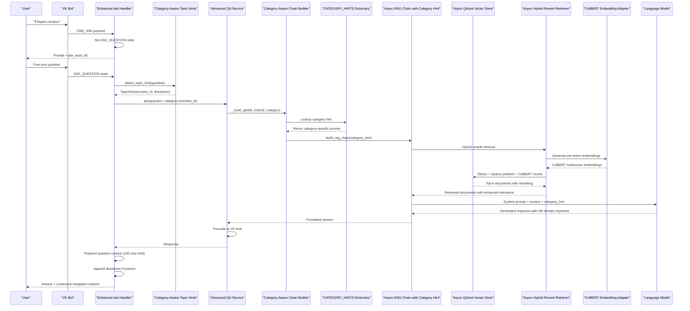
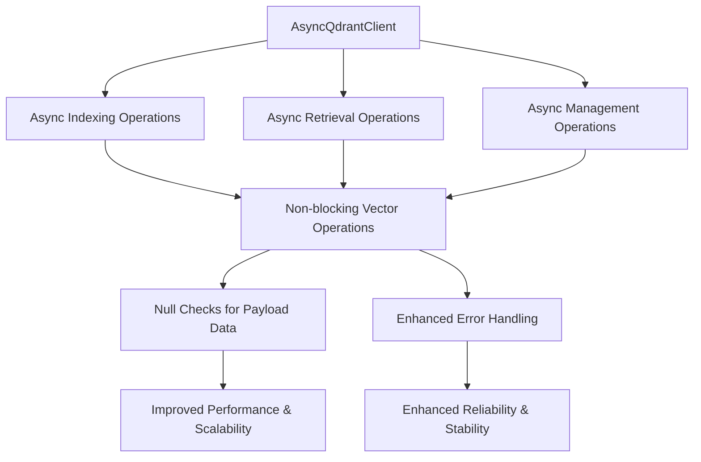
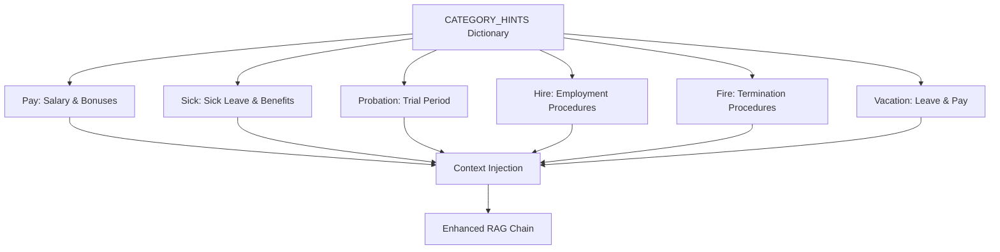
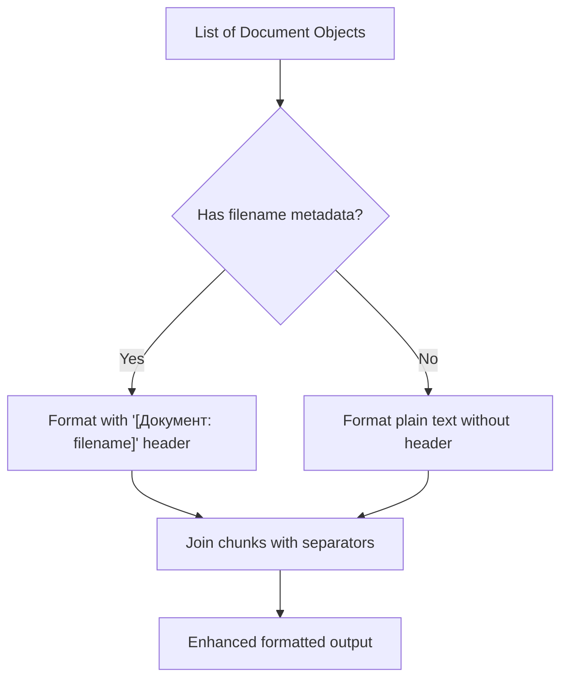
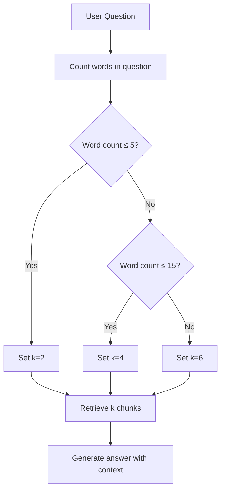
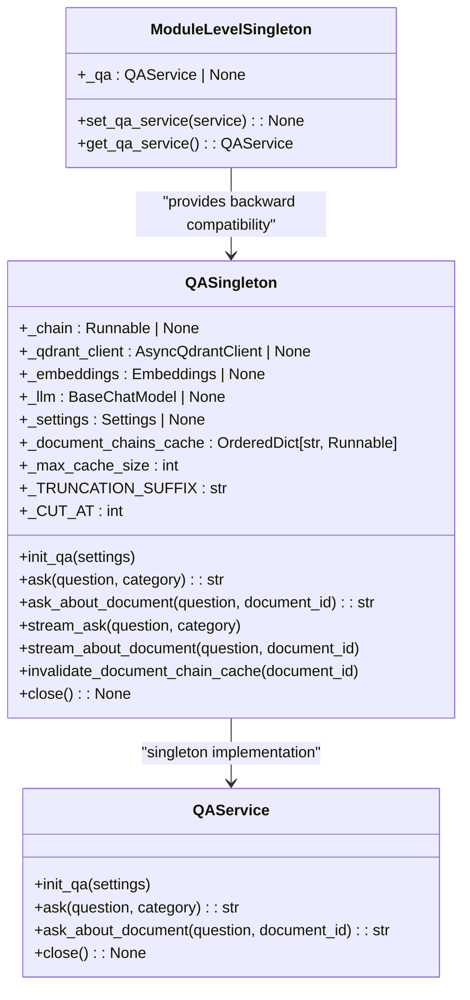

# RAG Integration

<cite>
**Referenced Files in This Document**
- [app/config.py](file://app/config.py)
- [app/rag/chain.py](file://app/rag/chain.py)
- [app/rag/indexer.py](file://app/rag/indexer.py)
- [app/rag/parser.py](file://app/rag/parser.py)
- [app/rag/prompts.py](file://app/rag/prompts.py)
- [app/rag/retriever.py](file://app/rag/retriever.py)
- [app/rag/colbert_embeddings.py](file://app/rag/colbert_embeddings.py)
- [app/domain/qa_service.py](file://app/domain/qa_service.py)
- [app/domain/document_service.py](file://app/domain/document_service.py)
- [app/domain/topic_hints.py](file://app/domain/topic_hints.py)
- [app/storage/database.py](file://app/storage/database.py)
- [app/storage/models.py](file://app/storage/models.py)
- [app/storage/document_repo.py](file://app/storage/document_repo.py)
- [app/integrations/vk/bot.py](file://app/integrations/vk/bot.py)
- [app/integrations/vk/handlers/ask.py](file://app/integrations/vk/handlers/ask.py)
- [app/integrations/vk/handlers/__init__.py](file://app/integrations/vk/handlers/__init__.py)
- [app/integrations/vk/handlers/fire.py](file://app/integrations/vk/handlers/fire.py)
- [app/integrations/vk/handlers/pay.py](file://app/integrations/vk/handlers/pay.py)
- [app/integrations/vk/handlers/vacation.py](file://app/integrations/vk/handlers/vacation.py)
- [app/integrations/vk/handlers/sections.py](file://app/integrations/vk/handlers/sections.py)
- [app/integrations/vk/handlers/hr_request.py](file://app/integrations/vk/handlers/hr_request.py)
- [app/integrations/vk/handlers/start.py](file://app/integrations/vk/handlers/start.py)
- [app/integrations/vk/handlers/fallback.py](file://app/integrations/vk/handlers/fallback.py)
- [app/integrations/vk/handlers/hire.py](file://app/integrations/vk/handlers/hire.py)
- [app/integrations/vk/handlers/factory.py](file://app/integrations/vk/handlers/factory.py)
- [app/integrations/vk/keyboards.py](file://app/integrations/vk/keyboards.py)
- [app/integrations/vk/states.py](file://app/integrations/vk/states.py)
- [app/api/documents.py](file://app/api/documents.py)
- [templates/documents.html](file://templates/documents.html)
- [templates/partials/document_row.html](file://templates/partials/document_row.html)
- [scripts/ingest.py](file://scripts/ingest.py)
- [scripts/polling_vk.py](file://scripts/polling_vk.py)
- [scripts/run_llama_qwen.sh](file://scripts/run_llama_qwen.sh)
- [scripts/run_ollama_qwen.sh](file://scripts/run_ollama_qwen.sh)
- [scripts/run_llama_llm.sh](file://scripts/run_llama_llm.sh)
- [scripts/run_llama_embeddings.sh](file://scripts/run_llama_embeddings.sh)
- [scripts/run_ollama_llm.sh](file://scripts/run_ollama_llm.sh)
- [scripts/run_ollama_embeddings.sh](file://scripts/run_ollama_embeddings.sh)
- [scripts/run_admin.sh](file://scripts/run_admin.sh)
- [scripts/admin_server.py](file://scripts/admin_server.py)
- [app/resources.py](file://app/resources.py)
- [app/main.py](file://app/main.py)
- [docker-compose.yml](file://docker-compose.yml)
- [pyproject.toml](file://pyproject.toml)
- [tests/test_qa_service.py](file://tests/test_qa_service.py)
- [tests/test_rag_block6.py](file://tests/test_rag_block6.py)
- [tests/test_ask_block9.py](file://tests/test_ask_block9.py)
- [tests/test_storage.py](file://tests/test_storage.py)
- [tests/test_parser.py](file://tests/test_parser.py)
- [tests/test_indexer.py](file://tests/test_indexer.py)
- [tests/test_category_hints.py](file://tests/test_category_hints.py)
- [tests/test_colbert_embeddings.py](file://tests/test_colbert_embeddings.py)
- [tests/test_hybrid_rerank_retriever.py](file://tests/test_hybrid_rerank_retriever.py)
- [tests/test_hybrid_search.py](file://tests/test_hybrid_search.py)
</cite>

## Update Summary
**Changes Made**
- Enhanced hybrid search system with comprehensive dense vector embeddings, BM25 sparse vector search, and ColBERT multivector embeddings
- Implemented AsyncQdrantRetriever supporting both dense-only and hybrid search modes with intelligent mode selection
- Added collection optimization with INT8 scalar quantization for memory efficiency
- Integrated automatic optimization triggers in document processing workflows
- Enhanced configuration management with reranking_enabled flag controlling hybrid rerank functionality
- Implemented intelligent collection creation with named vector spaces ("dense", "colbert", "bm25")
- Added automatic segment optimization for sparse BM25 vectors to reduce storage overhead
- Enhanced error handling with graceful fallback when reranking is disabled

## Table of Contents
1. [Introduction](#introduction)
2. [Project Structure](#project-structure)
3. [Core Components](#core-components)
4. [Architecture Overview](#architecture-overview)
5. [Detailed Component Analysis](#detailed-component-analysis)
6. [Enhanced RAG Capabilities](#enhanced-rag-capabilities)
7. [Advanced QA Service Implementation](#advanced-qa-service-implementation)
8. [Dual-Service Architecture](#dual-service-architecture)
9. [Enhanced Document Management](#enhanced-document-management)
10. [Revolutionary Category-Aware Prompt System](#revolutionary-category-aware-prompt-system)
11. [Advanced Streaming Response Implementation](#advanced-streaming-response-implementation)
12. [Comprehensive Testing Infrastructure](#comprehensive-testing-infrastructure)
13. [Performance Considerations](#performance-considerations)
14. [Troubleshooting Guide](#troubleshooting-guide)
15. [Conclusion](#conclusion)

## Introduction
This document describes the comprehensive Retrieval-Augmented Generation (RAG) integration for the Cafetera HR assistance bot. The implementation includes a complete LangChain-based processing pipeline, Qdrant vector database integration with fully asynchronous operations, document ingestion capabilities, and specialized HR prompts. The system enhances the bot's HR assistance capabilities by providing contextual, reliable answers drawn from HR documents while maintaining seamless integration with the existing VK bot architecture.

**Updated** The RAG implementation now features a comprehensive hybrid search system that provides state-of-the-art retrieval quality through Qdrant's late-interaction reranking system. The system consolidates dense vector embeddings, BM25 sparse embeddings, and ColBERT multivector embeddings for superior document ranking and relevance. The implementation includes intelligent collection optimization with INT8 scalar quantization, automatic optimization triggers in document processing workflows, and enhanced AsyncQdrantRetriever supporting both dense-only and hybrid search modes with graceful fallback when reranking is disabled. The simplified architecture eliminates retrieval mode complexity while maintaining advanced hybrid search capabilities with named vector spaces configuration.

## Project Structure
The repository is organized with a dedicated RAG module that provides the core infrastructure for document processing, vector storage, and retrieval. The structure includes configuration management, LangChain integration, Qdrant vector store setup with AsyncQdrantClient, document ingestion capabilities, comprehensive QA service layer with enhanced ask handler implementation, SQLite-based document storage system, and dedicated deployment scripts for local LLM serving with comprehensive orchestration capabilities and intelligent GPU detection.

```mermaid
graph TB
subgraph "Enhanced RAG Infrastructure"
Config["Settings Configuration<br/>app/config.py"]
Chain["Enhanced RAG Chain with Category Hint Support<br/>app/rag/chain.py"]
Prompts["CATEGORY_HINTS Dictionary & Enhanced System Prompts<br/>app/rag/prompts.py"]
AsyncRetriever["Async Qdrant Retriever with AsyncQdrantClient<br/>app/rag/retriever.py"]
AsyncIndexer["Async Chunk Indexer with Async Operations<br/>app/rag/indexer.py"]
Parser["Document Parser<br/>app/rag/parser.py"]
ColBERTAdapter["ColBERT Embedding Adapter<br/>app/rag/colbert_embeddings.py"]
AsyncHybridRerank["Async Hybrid Rerank Retriever<br/>Enhanced Hybrid Search System"]
QAService["Advanced QA Service with Category-Aware Processing<br/>app/domain/qa_service.py"]
TopicHints["Category-Aware Topic Detection<br/>app/domain/topic_hints.py"]
CategoryChain["Category-Specific Chain Building<br/>_build_global_chain()"]
CategoryHints["CATEGORY_HINTS Dictionary<br/>pay, sick, probation, hire, fire, vacation"]
UXHelpers["Enhanced UX Helpers<br/>query_rag_with_wait() + send_rag_answer()"]
ExceptionHandling["Enhanced Error Handling<br/>CollectionNotFoundError + Null Checks"]
SparseEmbeddings["Sparse Embeddings Support<br/>FastEmbedSparse for Hybrid Search"]
NamedVectors["Named Vector Spaces<br/>dense + colbert + bm25"]
MultivectorConfig["MultiVectorConfig<br/>MAX_SIM comparator + HNSW m=0"]
CollectionOptimization["Collection Optimization<br/>INT8 Scalar Quantization"]
SegmentOptimization["Segment Optimization<br/>Automatic BM25 Storage Reduction"]
end
subgraph "Enhanced Document Storage System"
DBInit["Database Initialization<br/>app/storage/database.py"]
Models["Enhanced Document Models<br/>app/storage/models.py"]
Repo["Document Repository with Async Operations<br/>app/storage/document_repo.py"]
DocService["Dual-Service Architecture with Async<br/>app/domain/document_service.py"]
end
subgraph "Enhanced Handler Integration"
AskHandler["Enhanced Ask Handler with Category Support<br/>app/integrations/vk/handlers/ask.py"]
Keyboards["Contextual Navigation<br/>app/integrations/vk/keyboards.py"]
States["State Management<br/>app/integrations/vk/states.py"]
Singleton["Module-Level Singleton<br/>app/integrations/vk/handlers/__init__.py"]
HelperHandlers["Helper Handlers<br/>fire.py, pay.py, vacation.py, sections.py"]
end
subgraph "Enhanced Application Lifecycle"
FastAPI["FastAPI Application with Async Lifespan<br/>app/main.py"]
AppState["Application State<br/>AppState class"]
Lifespan["Async Lifespan Manager<br/>lifespan() context manager"]
AsyncResources["Async Resource Management<br/>build_resources() + close_resources()"]
Cleanup["Async Resource Cleanup<br/>Proper teardown handling"]
ResourceFactory["Resource Factory Pattern<br/>AppResources + build_resources()"]
end
subgraph "Enhanced Document Processing"
Ingest["Async Ingestion Script<br/>scripts/ingest.py"]
Docx["Word Document Processing<br/>.docx files"]
Chunking["Recursive Character Chunking<br/>1000 chars + 200 overlap"]
Embeddings["Embedding Generation<br/>qwen3-embedding:4b-q4_K_M"]
AsyncParser["Async Parser<br/>Configurable chunk_size + chunk_overlap"]
CollectionCreation["Intelligent Collection Creation<br/>Named Vectors + Quantization"]
OptimizationWorkflow["Optimization Workflow<br/>Automatic Segment Optimization"]
end
subgraph "Vector Database"
AsyncQdrant["Async Qdrant Vector Store<br/>AsyncQdrantClient + hr_documents collection"]
Metadata["Enhanced Document Metadata<br/>source + section + document_id + filename"]
CollectionManagement["Collection Management<br/>_ensure_collection() + build_resources()"]
VectorConfig["Vector Configuration<br/>Named vectors + MultivectorConfig"]
Optimizers["Optimizers Config<br/>INT8 Quantization + HNSW Parameters"]
end
subgraph "Integration"
VKBot["VK Bot Integration<br/>app/integrations/vk/bot.py"]
Content["Content Module<br/>app/domain/content.py"]
Polling["Polling Script<br/>scripts/polling_vk.py"]
AdminServer["Admin Server<br/>scripts/admin_server.py"]
AdminAPI["Admin API with Async SSE<br/>app/api/documents.py"]
AdminUI["Admin UI<br/>templates/documents.html"]
end
subgraph "Enhanced Multi-Provider Orchestration"
RunAdmin["run_admin.sh<br/>Interactive Provider Selection"]
GPUDetection["Intelligent GPU Detection<br/>macOS Apple Silicon + NVIDIA"]
LlamaLLM["run_llama_llm.sh<br/>LLM Server with GPU Auto-Detection"]
LlamaEmbed["run_llama_embeddings.sh<br/>Embedding Server with GPU Auto-Detection"]
OllamaLLM["run_ollama_llm.sh<br/>Ollama LLM Setup with GPU Auto-Detection"]
OllamaEmbed["run_ollama_embeddings.sh<br/>Ollama Embeddings Setup with GPU Auto-Detection"]
HealthChecks["Docker Compose Health Checks"]
end
Config --> Chain
Chain --> QAService
Prompts --> Chain
AsyncRetriever --> Chain
AsyncIndexer --> DocService
Parser --> DocService
QAService --> AsyncQdrant
QAService --> TopicHints
TopicHints --> CategoryChain
CategoryChain --> CategoryHints
CategoryChain --> Chain
AdminAPI --> QAService
AdminUI --> AdminAPI
AskHandler --> TopicHints
AskHandler --> Keyboards
AskHandler --> States
AskHandler --> Singleton
AskHandler --> UXHelpers
TopicHints --> Keyboards
QAService --> AsyncQdrant
DocService --> Repo
DocService --> AsyncQdrant
DBInit --> Repo
Models --> Repo
Docx --> Parser
AsyncParser --> Parser
Chunking --> Parser
Embeddings --> AsyncRetriever
Ingest --> DocService
Ingest --> AsyncQdrant
AsyncQdrant --> AsyncRetriever
AsyncQdrant --> CategoryChain
AsyncQdrant --> AsyncHybridRerank
AsyncHybridRerank --> ColBERTAdapter
ColBERTAdapter --> NamedVectors
NamedVectors --> MultivectorConfig
AsyncQdrant --> CollectionOptimization
CollectionOptimization --> SegmentOptimization
AsyncQdrant --> Optimizers
VKBot --> AskHandler
AskHandler --> Content
QAService --> AskHandler
Polling --> QAService
RunAdmin --> AdminServer
LlamaLLM --> QAService
LlamaEmbed --> QAService
OllamaLLM --> QAService
OllamaEmbed --> QAService
GPUDetection --> LlamaLLM
GPUDetection --> LlamaEmbed
GPUDetection --> OllamaLLM
GPUDetection --> OllamaEmbed
HealthChecks --> RunAdmin
FastAPI --> AppState
AppState --> Lifespan
Lifespan --> AsyncResources
Lifespan --> Cleanup
Singleton --> QAService
HelperHandlers --> UXHelpers
```

**Diagram sources**
- [app/config.py:4-23](file://app/config.py#L4-L23)
- [app/rag/chain.py:25-125](file://app/rag/chain.py#L25-L125)
- [app/rag/prompts.py:5-94](file://app/rag/prompts.py#L5-L94)
- [app/rag/retriever.py:20-59](file://app/rag/retriever.py#L20-L59)
- [app/rag/indexer.py:13-141](file://app/rag/indexer.py#L13-L141)
- [app/rag/parser.py:54-83](file://app/rag/parser.py#L54-L83)
- [app/rag/colbert_embeddings.py:19-120](file://app/rag/colbert_embeddings.py#L19-L120)
- [app/domain/qa_service.py:51-297](file://app/domain/qa_service.py#L51-L297)
- [app/domain/topic_hints.py:87-109](file://app/domain/topic_hints.py#L87-L109)
- [app/integrations/vk/handlers/ask.py:34-90](file://app/integrations/vk/handlers/ask.py#L34-L90)
- [app/integrations/vk/handlers/__init__.py:15-177](file://app/integrations/vk/handlers/__init__.py#L15-L177)
- [app/integrations/vk/handlers/fire.py:60-74](file://app/integrations/vk/handlers/fire.py#L60-L74)
- [app/integrations/vk/handlers/pay.py:30-46](file://app/integrations/vk/handlers/pay.py#L30-L46)
- [app/integrations/vk/handlers/vacation.py:65-80](file://app/integrations/vk/handlers/vacation.py#L65-L80)
- [app/integrations/vk/handlers/sections.py:10-33](file://app/integrations/vk/handlers/sections.py#L10-L33)
- [app/main.py:22-49](file://app/main.py#L22-L49)

**Section sources**
- [app/config.py:4-23](file://app/config.py#L4-L23)
- [app/rag/chain.py:1-125](file://app/rag/chain.py#L1-L125)
- [app/rag/prompts.py:1-94](file://app/rag/prompts.py#L1-L94)
- [app/rag/retriever.py:1-170](file://app/rag/retriever.py#L1-L170)
- [app/rag/indexer.py:1-186](file://app/rag/indexer.py#L1-L186)
- [app/rag/parser.py:1-144](file://app/rag/parser.py#L1-L144)
- [app/rag/colbert_embeddings.py:1-120](file://app/rag/colbert_embeddings.py#L1-L120)
- [app/domain/qa_service.py:1-297](file://app/domain/qa_service.py#L1-L297)
- [app/domain/topic_hints.py:1-109](file://app/domain/topic_hints.py#L1-L109)
- [app/integrations/vk/handlers/ask.py:1-90](file://app/integrations/vk/handlers/ask.py#L1-L90)
- [app/integrations/vk/handlers/__init__.py:1-177](file://app/integrations/vk/handlers/__init__.py#L1-L177)
- [app/integrations/vk/handlers/fire.py:1-74](file://app/integrations/vk/handlers/fire.py#L1-L74)
- [app/integrations/vk/handlers/pay.py:1-46](file://app/integrations/vk/handlers/pay.py#L1-L46)
- [app/integrations/vk/handlers/vacation.py:1-80](file://app/integrations/vk/handlers/vacation.py#L1-L80)
- [app/integrations/vk/handlers/sections.py:1-33](file://app/integrations/vk/handlers/sections.py#L1-L33)
- [app/main.py:1-80](file://app/main.py#L1-L80)

## Core Components
The RAG infrastructure consists of several interconnected components that work together to provide intelligent document retrieval and response generation with enhanced user experience, comprehensive LLM provider support, optimized GPU detection capabilities, and advanced category-aware prompting system:

- **Configuration Management**: Centralized settings for Qdrant connection, LLM providers (Ollama, OpenAI-compatible, llama.cpp), and embedding models with provider-specific configuration
- **Enhanced RAG Chain Builder**: LangChain pipeline that orchestrates retrieval, prompting, and LLM generation with provider-specific configuration, metadata-aware formatting, and category_hint parameter support for targeted context injection
- **Async Vector Store Integration**: Qdrant-backed vector store with AsyncQdrantClient for fully asynchronous operations, dense retrieval capabilities, embedding model support, and k-estimation for question complexity analysis
- **Async Document-Specific Retriever**: Enhanced retriever functionality that scopes searches to individual documents using build_retriever_for_document function with LRU cache system and AsyncQdrantClient
- **Async Document Storage System**: SQLite-based metadata storage with comprehensive CRUD operations, document lifecycle management, and cache invalidation support with async operations
- **Enhanced Document Processing**: Word document ingestion with section extraction, configurable chunking parameters (chunk_size: 1000, chunk_overlap: 200), and metadata preservation with async operations
- **CATEGORY_HINTS Dictionary**: Revolutionary category-aware prompting system with specialized prompts for six HR categories: pay, sick, probation, hire, fire, and vacation, each with focused context injection
- **Enhanced System Prompts**: Specialized HR-focused prompts including DOCUMENT_EXPERTS_PROMPT for expert-level document analysis, GLOBAL_EXPERTS_PROMPT for cross-document knowledge synthesis, and stricter content policies with enhanced AI response guidelines
- **Advanced QA Service Layer**: Comprehensive singleton pattern implementation with centralized resource management, LRU cache system for document chains, error handling, text truncation, comprehensive provider support, document-specific question answering, category-aware processing, and streaming response capabilities with AsyncQdrantClient integration
- **Enhanced UX Helpers**: New utility functions for improved user experience including query_rag_with_wait() for delayed response handling and send_rag_answer() for streamlined handler implementations
- **Category-Aware Topic Hints**: Keyword-based detection system for contextual navigation and disclaimers, now integrated with category-aware RAG processing
- **Enhanced Ask Handler**: Multi-step dialog flow with typing indicators, contextual navigation, automatic question context prepending, category-aware processing, and enhanced user experience features using module-level singleton pattern
- **Enhanced Handler Integration**: Streamlined handler implementations using send_rag_answer() helper for consistent user experience across all HR scenarios
- **Enhanced Multi-Provider Orchestration**: Comprehensive deployment management via run_admin.sh with interactive provider selection and intelligent GPU detection
- **Intelligent GPU Detection**: Platform-specific GPU detection for macOS Apple Silicon (Metal) and NVIDIA GPUs (CUDA) with automatic optimization
- **Comprehensive Deployment Scripts**: Separate LLM and embedding server management for llama.cpp with CPU detection and model downloading
- **Application Integration**: Seamless integration with VK bot handlers and state management through centralized resource management
- **Dual-Service Architecture**: Central orchestration service managing document lifecycle across all systems with shared resource management and cache invalidation
- **Async Chunk Indexer**: Async Qdrant-specific operations for chunk management, deletion, and search filtering with enhanced metadata handling and AsyncQdrantClient
- **Enhanced Document Parser**: Word document processing with section extraction, configurable chunking parameters, and recursive character chunking
- **Docker Compose Health Checking**: Comprehensive service monitoring with health checks for Qdrant and MinIO
- **Admin Interface Integration**: Document-specific question answering through modal interface with HTMX integration, SSE support, and streaming response handling
- **Revolutionary Global Experts Prompt System**: Cross-document knowledge synthesis capability enabling comprehensive question answering across the entire knowledge base
- **Advanced Streaming Response Implementation**: Real-time streaming of tokens for both global and document-specific questions with SSE support and comprehensive error handling
- **Enhanced Application Lifecycle Management**: Centralized resource management through FastAPI application lifecycle with proper cleanup and teardown handling
- **Module-Level Singleton Pattern**: Backward compatibility through module-level state management for VK handlers integration
- **Comprehensive Testing Infrastructure**: Extensive test coverage for all enhanced features including QA service functionality, document storage system, GPU detection, UX helper functions, and category-aware prompting system
- **Enhanced Error Handling**: Comprehensive error handling with CollectionNotFoundError exception, null checks for payload data, and robust malformed response handling
- **Sparse Embeddings Support**: FastEmbedSparse integration for hybrid search mode with simplified configuration
- **Resource Lifecycle Management**: AppResources factory pattern with proper async initialization, collection management, and cleanup procedures
- **Revolutionary Hybrid Rerank System**: Enhanced hybrid-only architecture with ColBERT multivector embeddings integration for superior document ranking
- **ColBERT Embedding Adapter**: ColbertEmbeddingAdapter class for per-token ColBERT embeddings with dimension caching and batch processing
- **AsyncHybridRerankRetriever**: Dense + sparse prefetch with ColBERT reranking for enhanced retrieval quality
- **Named Vector Spaces**: Support for "dense", "colbert", and "bm25" vector configurations with multivector embedding support
- **Multivector Configuration**: Qdrant MultiVectorConfig with MAX_SIM comparator and optimized HNSW parameters
- **Collection Optimization**: INT8 scalar quantization for memory efficiency and improved query performance
- **Segment Optimization**: Automatic optimization of sparse BM25 vectors to reduce storage overhead and improve query performance
- **Intelligent Collection Creation**: Named vector spaces configuration with automatic optimization triggers

**Updated** The RAG infrastructure now provides a complete, production-ready solution with fully asynchronous architecture using AsyncQdrantClient throughout the pipeline, enhanced GPU detection capabilities across all LLM providers, improved document processing with configurable chunking parameters, comprehensive LangChain integration, AsyncQdrant vector store capabilities with non-blocking operations, robust document storage system with SQLite, comprehensive QA service layer with centralized resource management, module-level singleton pattern for backward compatibility, enhanced application lifecycle management with proper cleanup, category-aware topic hints detection system, enhanced user experience features including query_rag_with_wait() for delayed response handling, send_rag_answer() for streamlined handler implementations, automatic question context prepending with character limits, support for three LLM providers including the new llama.cpp option with specialized deployment scripts and comprehensive orchestration capabilities, global experts prompt system for cross-document knowledge synthesis, advanced streaming response implementation for real-time user interaction, comprehensive testing infrastructure validating all enhancements, dual-service architecture with cache invalidation, metadata-aware document formatting with enhanced LRU cache system, question complexity analysis with k-estimation, refined prompt system with stricter content policies, comprehensive resource lifecycle management with AppResources factory pattern, enhanced error handling with null checks and malformed response protection, sparse embeddings support for hybrid search mode, comprehensive testing coverage for all enhanced features including the revolutionary CATEGORY_HINTS dictionary and category-aware prompting system, **COMPREHENSIVE HYBRID SEARCH SYSTEM** with dense vector embeddings, BM25 sparse vector search, and ColBERT multivector embeddings, **ENHANCED ASYNC QDRANT RETRIEVER** supporting both dense-only and hybrid search modes with intelligent mode selection, **COLLECTION OPTIMIZATION WITH INT8 SCALAR QUANTIZATION** for memory efficiency, **AUTOMATIC OPTIMIZATION TRIGGERS** in document processing workflows, **ENHANCED CONFIGURATION MANAGEMENT** with reranking_enabled flag controlling hybrid rerank functionality, **INTELLIGENT COLLECTION CREATION** with named vector spaces ("dense", "colbert", "bm25"), **AUTOMATIC SEGMENT OPTIMIZATION** for sparse BM25 vectors to reduce storage overhead, **REVOLUTIONARY COLBERT EMBEDDING ADAPTER** for per-token embeddings with graceful fallback, **ASYNC HYBRID RERANK RETRIEVER** for dense + sparse prefetch with ColBERT reranking, **ENHANCED CONFIGURATION MANAGEMENT** with reranking_enabled flag controlling hybrid rerank functionality, **NAMED VECTOR SPACES SUPPORT** with "dense", "colbert", and "bm25" configurations, **MULTIVECTOR EMBEDDING SUPPORT** with Qdrant's late-interaction scoring system, **COLLECTION OPTIMIZATION** with INT8 scalar quantization, **SEGMENT OPTIMIZATION** for automatic BM25 storage reduction, and **INTELLIGENT COLLECTION CREATION** with automatic optimization triggers.

**Section sources**
- [app/config.py:10-23](file://app/config.py#L10-L23)
- [app/rag/chain.py:25-125](file://app/rag/chain.py#L25-L125)
- [app/rag/prompts.py:30-55](file://app/rag/prompts.py#L30-L55)
- [app/rag/retriever.py:20-59](file://app/rag/retriever.py#L20-L59)
- [app/rag/colbert_embeddings.py:19-120](file://app/rag/colbert_embeddings.py#L19-L120)
- [app/domain/qa_service.py:51-297](file://app/domain/qa_service.py#L51-L297)
- [app/domain/topic_hints.py:14-26](file://app/domain/topic_hints.py#L14-L26)
- [app/integrations/vk/handlers/ask.py:34-90](file://app/integrations/vk/handlers/ask.py#L34-L90)
- [app/integrations/vk/handlers/__init__.py:46-177](file://app/integrations/vk/handlers/__init__.py#L46-L177)
- [app/integrations/vk/handlers/fire.py:60-74](file://app/integrations/vk/handlers/fire.py#L60-L74)
- [app/integrations/vk/handlers/pay.py:30-46](file://app/integrations/vk/handlers/pay.py#L30-L46)
- [app/integrations/vk/handlers/vacation.py:65-80](file://app/integrations/vk/handlers/vacation.py#L65-L80)
- [app/integrations/vk/handlers/sections.py:10-33](file://app/integrations/vk/handlers/sections.py#L10-L33)
- [app/main.py:22-49](file://app/main.py#L22-L49)

## Architecture Overview
The RAG-enabled bot architecture integrates seamlessly with the existing VK bot infrastructure while providing powerful document retrieval capabilities with enhanced user experience, comprehensive LLM provider support, optimized GPU detection across all deployment targets, and advanced category-aware prompting system. The system processes user questions through a LangChain pipeline that retrieves relevant context from AsyncQdrant, generates contextualized responses using the selected LLM provider, detects topic scenarios for navigation, provides typing indicators for improved UX, handles delayed responses with wait messages, automatically prepends question context with character limits, injects category-specific context through the CATEGORY_HINTS dictionary, and automatically selects appropriate HR domain expertise, all managed through a centralized QA service layer with integrated document storage, comprehensive multi-provider orchestration, intelligent GPU detection, document-scoped retrieval functionality with LRU cache system, and revolutionary category-aware global experts prompt system for cross-document knowledge synthesis.

**Diagram sources**
- [app/integrations/vk/handlers/ask.py:49-90](file://app/integrations/vk/handlers/ask.py#L49-L90)
- [app/domain/topic_hints.py:87-109](file://app/domain/topic_hints.py#L87-L109)
- [app/domain/qa_service.py:155-181](file://app/domain/qa_service.py#L155-L181)
- [app/rag/chain.py:98-125](file://app/rag/chain.py#L98-L125)
- [app/rag/prompts.py:30-55](file://app/rag/prompts.py#L30-L55)
- [app/rag/retriever.py:28-98](file://app/rag/retriever.py#L28-L98)
- [app/rag/colbert_embeddings.py:19-80](file://app/rag/colbert_embeddings.py#L19-L80)

## Detailed Component Analysis

### Enhanced RAG Capabilities

#### Async Qdrant Integration
The RAG system now features fully asynchronous Qdrant integration with AsyncQdrantClient replacing synchronous operations:

- **Async Client Usage**: All Qdrant operations now use AsyncQdrantClient for non-blocking operations
- **Async Indexing**: Chunk indexing operations are fully asynchronous with proper error handling
- **Async Retrieval**: Document retrieval operations use async client for improved performance
- **Async Management**: Document deletion, search enablement toggling, and counting operations are async
- **Async Collection Creation**: Collection creation and management use async operations
- **Async Resource Management**: Proper async initialization and cleanup of Qdrant clients
- **Performance Benefits**: Eliminates blocking operations and improves throughput
- **Scalability**: Better handling of concurrent requests and operations
- **Null Checks**: Enhanced payload validation prevents AttributeError exceptions
- **Error Handling**: Comprehensive malformed response handling with robust error propagation

**Updated** Complete asynchronous Qdrant integration with AsyncQdrantClient throughout the pipeline, including async indexing, retrieval, management operations, collection creation, resource management, null checks for payload data, and comprehensive error handling for malformed responses, providing improved performance, scalability, and reliability for production deployments.

**Diagram sources**
- [app/rag/retriever.py:20-59](file://app/rag/retriever.py#L20-L59)
- [app/rag/indexer.py:49-141](file://app/rag/indexer.py#L49-L141)
- [app/resources.py:167-202](file://app/resources.py#L167-L202)

**Section sources**
- [app/rag/retriever.py:20-59](file://app/rag/retriever.py#L20-L59)
- [app/rag/indexer.py:49-141](file://app/rag/indexer.py#L49-L141)
- [app/resources.py:167-202](file://app/resources.py#L167-L202)

#### Enhanced AsyncQdrantRetriever with Null Checks
The AsyncQdrantRetriever now includes comprehensive null checks for payload data and improved error handling:

- **Payload Validation**: Enhanced null checks in _aget_relevant_documents to prevent AttributeError exceptions
- **Robust Error Handling**: Improved malformed response handling with proper exception propagation
- **Safe Document Construction**: Validates payload existence before constructing Document objects
- **Metadata Protection**: Safely extracts metadata while handling missing or empty payload fields
- **Graceful Degradation**: Falls back to empty strings for missing page_content with proper validation
- **Enhanced Reliability**: Prevents crashes from malformed Qdrant responses or missing payload data
- **Performance Optimization**: Maintains async operations while adding safety checks

**Updated** Complete AsyncQdrantRetriever enhancement with comprehensive null checks for payload data, robust error handling for malformed responses, safe document construction with metadata protection, graceful degradation capabilities, and enhanced reliability for production deployments with improved performance and stability.

**Section sources**
- [app/rag/retriever.py:38-60](file://app/rag/retriever.py#L38-L60)

#### Async Chunk Indexer
The chunk indexer now operates asynchronously for improved performance:

- **Async Indexing**: index_chunks function performs all operations asynchronously
- **Async Deletion**: delete_document_chunks uses async client for document deletion
- **Async Payload Updates**: set_search_enabled uses async operations for metadata updates
- **Async Counting**: count_document_chunks uses async client for chunk counting
- **Async Preparation**: prepare_chunks maintains metadata enrichment with async operations
- **Error Handling**: Comprehensive async error handling throughout indexing operations
- **Performance Optimization**: Eliminates blocking operations for better throughput
- **Sparse Embeddings Support**: Enhanced support for hybrid search with sparse vectors
- **ColBERT Multivector Support**: Named vector spaces support with "dense", "colbert", and "bm25" configurations

**Updated** Complete async chunk indexing system with asynchronous operations throughout, including indexing, deletion, payload updates, counting, and preparation with proper error handling, performance optimization, sparse embeddings support for hybrid search mode, and comprehensive ColBERT multivector embedding support with named vector spaces.

**Section sources**
- [app/rag/indexer.py:49-141](file://app/rag/indexer.py#L49-L141)

#### Async Resource Management
The application now manages resources asynchronously:

- **Async Initialization**: build_resources function initializes all resources asynchronously
- **Async Collection Creation**: _ensure_collection uses async operations for collection management
- **Async Cleanup**: close_resources properly closes async resources
- **Async Lifespan**: FastAPI lifespan manages async resources throughout application lifecycle
- **Async Error Handling**: Proper error handling for async resource operations
- **Resource Sharing**: Async resources shared across application components
- **Graceful Degradation**: Async operations handle failures gracefully
- **Resource Factory Pattern**: AppResources factory pattern with comprehensive resource management
- **ColBERT Integration**: Async initialization and cleanup of ColBERT embedding resources

**Updated** Complete async resource management system with asynchronous initialization, collection creation, cleanup, and lifecycle management for proper async resource handling throughout the application, including the new AppResources factory pattern with comprehensive resource management capabilities and ColBERT embedding resource integration.

**Section sources**
- [app/resources.py:127-303](file://app/resources.py#L127-L303)
- [app/main.py:22-49](file://app/main.py#L22-L49)

### Comprehensive Hybrid Search System

#### Enhanced AsyncHybridRerankRetriever
The new AsyncHybridRerankRetriever provides state-of-the-art hybrid search with ColBERT reranking:

- **Dense + Sparse Prefetch**: Uses parallel dense and sparse retrieval for initial candidate selection
- **ColBERT Reranking**: Applies ColBERT multivector embeddings for final document ranking
- **Late-Interaction Scoring**: Leverages Qdrant's late-interaction reranking system
- **Prefetch Optimization**: Configurable prefetch limits for performance tuning
- **Named Vector Spaces**: Supports "dense", "colbert", and "bm25" vector configurations
- **Async Operations**: Fully asynchronous implementation with proper error handling
- **Filter Support**: Document-scoped filtering with metadata-based search constraints
- **Payload Extraction**: Efficient metadata extraction with null safety checks

**Updated** Complete AsyncHybridRerankRetriever implementation with dense + sparse prefetch, ColBERT reranking, late-interaction scoring, prefetch optimization, named vector spaces support, async operations, filter support, payload extraction, and comprehensive error handling for superior retrieval quality and performance.

**Section sources**
- [app/rag/retriever.py:28-98](file://app/rag/retriever.py#L28-L98)

#### Enhanced Configuration Management
The configuration system now includes comprehensive reranking settings:

- **reranking_enabled**: Boolean flag to enable/disable hybrid rerank functionality
- **colbert_rerank_model**: HuggingFace model identifier for ColBERT embeddings
- **colbert_prefetch_limit**: Number of candidates to retrieve for ColBERT reranking
- **colbert_rerank_limit**: Final number of documents to return after reranking
- **Simplified Architecture**: Works with hybrid-only approach regardless of mode
- **Graceful Degradation**: Falls back to dense + sparse search when ColBERT unavailable
- **Environment Variable Support**: Full configuration through environment variables
- **Default Values**: Reasonable defaults for production deployment

**Updated** Complete configuration management system with reranking settings, simplified architecture supporting hybrid-only approach, graceful degradation, environment variable support, default values, and comprehensive settings validation for optimal hybrid rerank deployment.

**Section sources**
- [app/config.py:62-67](file://app/config.py#L62-L67)

#### Intelligent Collection Creation
The system now includes intelligent collection creation with named vector spaces and optimization:

- **Vector Configuration**: Named vectors "dense", "colbert", and "bm25" with separate configurations
- **Multivector Embeddings**: ColBERT vectors stored as multivectors with MAX_SIM comparator
- **HNSW Optimization**: Optimized HNSW parameters (m=0) for multivector similarity
- **Sparse Vector Support**: BM25 sparse vectors for lexical matching
- **Legacy Compatibility**: Backward compatibility with unnamed vector layouts
- **Dynamic Configuration**: Runtime switching between named and unnamed vector layouts
- **Performance Tuning**: Separate optimization parameters for each vector type
- **Memory Efficiency**: Optimized memory usage for multivector embeddings
- **INT8 Scalar Quantization**: Memory-efficient quantization for dense and colbert vectors
- **Automatic Optimization**: Collection optimization with segment merging for sparse vectors

**Updated** Complete intelligent collection creation system with "dense", "colbert", and "bm25" configurations, multivector embedding support, HNSW optimization, sparse vector integration, legacy compatibility, dynamic configuration, performance tuning, memory efficiency, INT8 scalar quantization for memory efficiency, and automatic optimization with segment merging for sparse vectors.

**Section sources**
- [app/resources.py:89-131](file://app/resources.py#L89-L131)
- [app/rag/indexer.py:97-126](file://app/rag/indexer.py#L97-L126)
- [scripts/ingest.py:145-186](file://scripts/ingest.py#L145-L186)

#### Automatic Segment Optimization
The system now includes automatic optimization triggers in document processing workflows:

- **Segment Merging**: Forces optimization by setting indexing_threshold to 0 to merge small segments
- **Polling Mechanism**: Waits for optimization completion by polling collection status
- **Threshold Restoration**: Restores original indexing_threshold after optimization
- **BM25 Storage Reduction**: Reduces storage overhead for sparse BM25 vectors
- **Performance Improvement**: Improves query performance after optimization
- **Timeout Handling**: Graceful handling of optimization timeouts
- **Logging**: Comprehensive logging of optimization progress and results

**Updated** Complete automatic segment optimization system with segment merging, polling mechanism, threshold restoration, BM25 storage reduction, performance improvement, timeout handling, and comprehensive logging for optimal sparse vector storage and query performance.

**Section sources**
- [app/rag/indexer.py:215-266](file://app/rag/indexer.py#L215-L266)
- [scripts/ingest.py:259-267](file://scripts/ingest.py#L259-L267)

### Revolutionary Category-Aware Prompt System

#### CATEGORY_HINTS Dictionary
The RAG system now features a revolutionary category-aware prompting system with specialized prompts for six HR categories:

- **CATEGORY_HINTS Dictionary**: Contains six specialized HR prompts with targeted context injection
- **Pay Category**: Focuses on salary rates, bonuses, overtime, and bonus calculations
- **Sick Leave Category**: Addresses sick leave procedures, duration, and sickness benefit payments
- **Probation Category**: Covers probation period duration, conditions, and employee rights
- **Hiring Category**: Handles employment procedures, documentation checklist, and onboarding
- **Firing Category**: Manages termination procedures, notice periods, and dismissal documentation
- **Vacation Category**: Addresses vacation types, application procedures, and vacation pay calculations
- **Category Validation**: Keys are verified to be subset of known scenario IDs from _SCENARIO_KEYWORDS
- **Context Injection**: Each category prompt is injected into the RAG chain with "Дополнительный контекст" markers
- **Fallback Handling**: Unknown categories gracefully handled with None hint values

**Updated** Complete CATEGORY_HINTS dictionary implementation with six specialized HR prompts, category validation against known scenarios, context injection through category_hint parameter, and comprehensive fallback handling for unknown categories, providing targeted HR assistance across all major HR domains.

**Diagram sources**
- [app/rag/prompts.py:30-55](file://app/rag/prompts.py#L30-L55)
- [app/domain/qa_service.py:146](file://app/domain/qa_service.py#L146)

**Section sources**
- [app/rag/prompts.py:30-55](file://app/rag/prompts.py#L30-L55)

#### Enhanced RAG Chain with Category Hint Support
The RAG chain now supports category-specific context injection:

- **Category Hint Parameter**: build_rag_chain function accepts category_hint parameter
- **Context Injection**: Category hints are injected into system prompts with "Дополнительный контекст" markers
- **Conditional Injection**: Only injected when category_hint is provided and truthy
- **Prompt Enhancement**: Combines base system prompt with category-specific context
- **Metadata Preservation**: Maintains existing metadata formatting capabilities
- **Backward Compatibility**: Works with existing chain configurations without category hints
- **Testing Coverage**: Comprehensive tests validate category hint injection and exclusion
- **Performance Impact**: Minimal overhead for category hint processing

**Updated** Complete category hint support implementation with conditional context injection, enhanced prompt formatting, backward compatibility, comprehensive testing, and minimal performance impact for category-aware RAG processing.

**Section sources**
- [app/rag/chain.py:98-125](file://app/rag/chain.py#L98-L125)

#### Category-Aware QA Service Processing
The QA service now integrates category-aware processing:

- **Category Parameter**: ask() and stream_ask() methods accept category parameter
- **Hint Lookup**: _build_global_chain() looks up category hints from CATEGORY_HINTS dictionary
- **Unknown Category Handling**: Gracefully handles unknown categories with None hint values
- **Chain Building**: Passes category_hint to build_rag_chain() for context injection
- **Streaming Support**: Category-aware streaming with proper error handling
- **Testing Validation**: Comprehensive tests verify category parameter passing and hint lookup
- **Integration Points**: Works with existing QA service functionality without modification

**Updated** Complete category-aware QA service implementation with category parameter support, hint lookup functionality, unknown category handling, comprehensive testing, and seamless integration with existing QA service features.

**Section sources**
- [app/domain/qa_service.py:146](file://app/domain/qa_service.py#L146)
- [app/domain/qa_service.py:155-181](file://app/domain/qa_service.py#L155-L181)
- [app/domain/qa_service.py:212-244](file://app/domain/qa_service.py#L212-L244)

### Enhanced RAG Capabilities

#### Metadata-Aware Document Formatting
The RAG system now features enhanced document formatting that preserves and displays document metadata alongside content:

- **Enhanced Document Formatting**: The `_format_docs_with_metadata()` function now includes filename headers for each document chunk
- **Filename Preservation**: Maintains source filename information in metadata for better context
- **Structured Presentation**: Formats chunks with clear document boundaries using "[Документ: filename]" headers
- **Backward Compatibility**: Falls back to plain text formatting when filename metadata is missing
- **Enhanced User Experience**: Provides clear attribution of information sources in RAG responses

**Updated** Complete implementation of metadata-aware document formatting with filename preservation, structured presentation, backward compatibility, and enhanced user experience for improved source attribution in RAG responses.

**Diagram sources**
- [app/rag/chain.py:28-50](file://app/rag/chain.py#L28-L50)

**Section sources**
- [app/rag/chain.py:28-50](file://app/rag/chain.py#L28-L50)

#### Advanced LRU Cache System
The QA service now implements an LRU (Least Recently Used) cache system for document-specific chains:

- **LRU Cache Implementation**: Uses OrderedDict to track document chain usage with maximum cache size of 50
- **Cache Invalidation**: Supports selective and full cache clearing with `invalidate_document_chain_cache()` method
- **Performance Optimization**: Avoids rebuilding chains for frequently accessed documents
- **Memory Management**: Automatically evicts least recently used chains when cache reaches capacity
- **Cache Coordination**: Integrated with document lifecycle management for proper cache maintenance

**Updated** Complete LRU cache system implementation with OrderedDict-based tracking, cache invalidation support, performance optimization, memory management, and cache coordination with document lifecycle management.

**Section sources**
- [app/domain/qa_service.py:68-119](file://app/domain/qa_service.py#L68-L119)
- [app/domain/qa_service.py:274-284](file://app/domain/qa_service.py#L274-L284)

#### Question Complexity Analysis with K-Estimation
The retriever module now includes sophisticated question complexity analysis:

- **K-Estimation Algorithm**: Analyzes question length to determine optimal k-value for retrieval
- **Complexity Rules**: 
  - Short questions (≤5 words): k=2
  - Medium questions (6-15 words): k=4 (default)
  - Long/complex questions (>15 words): k=6
- **Adaptive Retrieval**: Adjusts retrieval depth based on question complexity
- **Performance Optimization**: Reduces unnecessary retrieval for simple questions
- **Quality Balance**: Ensures sufficient context for complex questions

**Updated** Complete question complexity analysis system with k-estimation algorithm, adaptive retrieval, performance optimization, and quality balance for optimal RAG performance.

**Diagram sources**
- [app/rag/retriever.py:61-74](file://app/rag/retriever.py#L61-L74)

**Section sources**
- [app/rag/retriever.py:61-74](file://app/rag/retriever.py#L61-L74)

### Advanced QA Service Implementation

#### Enhanced Singleton Pattern Architecture
The QA service implements a comprehensive singleton pattern with module-level state management, providing a centralized interface for RAG chain operations with enhanced caching and resource management:

- **Module-Level State**: Global _qa instance stored in module-level variable for backward compatibility
- **LRU Cache Integration**: Enhanced with document chain caching for improved performance
- **Initialization**: One-time setup during application startup with shared resources from FastAPI lifespan
- **Resource Management**: Proper cleanup and error handling across all LLM providers
- **Thread Safety**: Safe concurrent access to the RAG chain through shared instance
- **Provider Flexibility**: Support for all three LLM providers through unified interface
- **Backward Compatibility**: Maintains compatibility with existing VK handlers that use module-level access
- **Centralized Resource Sharing**: Shared AsyncQdrant client, embeddings, LLM instances, and cache between services

**Updated** Complete implementation of the QA service with enhanced singleton pattern, comprehensive error handling, text truncation capabilities, provider flexibility, centralized resource management, module-level state management for backward compatibility, LRU cache system for document chains, and proper resource cleanup for all supported LLM providers with optimized GPU detection.

**Diagram sources**
- [app/domain/qa_service.py:43-297](file://app/domain/qa_service.py#L43-L297)
- [app/integrations/vk/handlers/__init__.py:15-177](file://app/integrations/vk/handlers/__init__.py#L15-L177)

### Dual-Service Architecture
The system now implements a dual-service architecture that coordinates between document management and QA services:

- **DocumentService**: Central orchestration service managing document lifecycle across all systems
- **QAService**: Specialized service for RAG chain operations and question answering
- **Cache Coordination**: Both services share and coordinate cache invalidation
- **Resource Sharing**: Shared AsyncQdrant client, embeddings, and LLM instances between services
- **Lifecycle Management**: Coordinated resource management through FastAPI application lifecycle
- **Error Handling**: Consistent error handling and propagation between services
- **State Management**: Proper state management across service boundaries

**Updated** Complete dual-service architecture with DocumentService for central orchestration, QAService for specialized RAG operations, cache coordination, resource sharing, lifecycle management, error handling, and state management across service boundaries.

**Section sources**
- [app/domain/qa_service.py:51-297](file://app/domain/qa_service.py#L51-L297)
- [app/domain/document_service.py:36-291](file://app/domain/document_service.py#L36-L291)

### Enhanced Document Management
The document management system now includes comprehensive cache invalidation and dual-service coordination:

- **Cache Invalidation**: Automatic cache clearing for document chains when documents are modified
- **Dual-Service Coordination**: DocumentService and QAService coordinate cache invalidation
- **Lifecycle Integration**: Cache invalidation integrated with document lifecycle operations
- **Background Task Integration**: Cache invalidation triggered from background indexing tasks
- **Error Handling**: Robust error handling for cache invalidation operations
- **Performance Optimization**: Efficient cache management for improved response times

**Updated** Complete document management system with cache invalidation, dual-service coordination, lifecycle integration, background task integration, error handling, and performance optimization for efficient cache management.

**Section sources**
- [app/domain/document_service.py:138-184](file://app/domain/document_service.py#L138-L184)
- [app/api/documents.py:130-171](file://app/api/documents.py#L130-L171)

### Enhanced System Prompts
The prompt system now includes enhanced content policies and specialized prompts:

- **Enhanced System Prompt**: Stricter content policies with improved HR-specific guidelines
- **Document Experts Prompt**: Specialized prompt for expert-level document analysis
- **Global Experts Prompt**: Revolutionary cross-document knowledge synthesis prompt
- **Content Policy Enforcement**: Stricter rules for confidentiality, privacy, and HR-specific content
- **Russian Language Support**: Comprehensive Russian language instructions for all prompts
- **Contextual Completeness**: Enhanced guidance for acknowledging limitations and providing context
- **Category Integration**: Category-specific context injection through CATEGORY_HINTS system

**Updated** Complete prompt system with enhanced content policies, document experts prompt, global experts prompt, content policy enforcement, Russian language support, contextual completeness guidance, and category integration through CATEGORY_HINTS system for all LLM providers with optimized GPU detection.

**Section sources**
- [app/rag/prompts.py:5-94](file://app/rag/prompts.py#L5-L94)

### Advanced Streaming Response Implementation
The streaming response system now includes comprehensive SSE support and error handling:

- **SSE Implementation**: Server-Sent Events for real-time token delivery
- **Token Escaping**: Proper JSON escaping for reliable event transmission
- **Error Streaming**: Graceful error handling with error token delivery
- **Content Type**: text/event-stream with proper headers
- **Global Streaming**: Real-time streaming for global questions
- **Document Streaming**: Real-time streaming for document-specific questions
- **Category-Aware Streaming**: Category-aware processing with proper error handling
- **Client-Side Handling**: Comprehensive client-side SSE handling

**Updated** Complete streaming implementation with SSE event generation, token escaping, error handling, content type management, global and document-specific streaming, category-aware processing, and comprehensive client-side handling for reliable real-time communication.

**Section sources**
- [app/domain/qa_service.py:212-275](file://app/domain/qa_service.py#L212-L275)
- [app/api/documents.py:808-872](file://app/api/documents.py#L808-L872)

### Comprehensive Testing Infrastructure
The testing framework now includes extensive validation of all enhanced features:

- **QA Service Testing**: Comprehensive testing of LRU cache, k-estimation, streaming functionality, and category-aware processing
- **Document Management Testing**: Testing of cache invalidation, dual-service coordination, and lifecycle management
- **Prompt System Testing**: Validation of enhanced content policies and prompt functionality
- **Streaming Response Testing**: Comprehensive testing of SSE implementation and error handling
- **Handler Integration Testing**: Validation of UX helper functions and handler integration
- **GPU Detection Testing**: Testing of enhanced GPU detection capabilities
- **Provider Testing**: Comprehensive testing of all three LLM providers with enhanced configuration
- **Async Operations Testing**: Validation of async resource management and error handling
- **Sparse Embeddings Testing**: Testing of hybrid search mode with sparse embeddings
- **Collection Management Testing**: Validation of collection creation and resource lifecycle management
- **Category-Hints Testing**: Comprehensive testing of CATEGORY_HINTS integration and category-aware functionality
- **Topic Hints Testing**: Validation of category-aware topic detection and processing
- **ColBERT Embeddings Testing**: Comprehensive testing of ColBERT embedding adapter and hybrid rerank functionality
- **Hybrid Rerank Retriever Testing**: Validation of AsyncHybridRerankRetriever implementation and named vector spaces
- **Collection Optimization Testing**: Testing of INT8 scalar quantization and segment optimization workflows

**Updated** Complete testing infrastructure with QA service testing, document management testing, prompt system testing, streaming response testing, handler integration testing, GPU detection testing, provider testing, async operations testing, sparse embeddings testing, collection management testing, category-hints testing, topic hints testing, ColBERT embeddings testing, hybrid rerank retriever testing, and collection optimization testing for all enhanced features including the revolutionary CATEGORY_HINTS dictionary, category-aware prompting system, ColBERT multivector embeddings integration, AsyncHybridRerankRetriever implementation, named vector spaces support, and automatic segment optimization.

**Section sources**
- [tests/test_qa_service.py:1-238](file://tests/test_qa_service.py#L1-L238)
- [tests/test_category_hints.py:1-248](file://tests/test_category_hints.py#L1-L248)
- [tests/test_colbert_embeddings.py:1-143](file://tests/test_colbert_embeddings.py#L1-L143)
- [tests/test_hybrid_rerank_retriever.py:1-273](file://tests/test_hybrid_rerank_retriever.py#L1-L273)
- [tests/test_hybrid_search.py:1-231](file://tests/test_hybrid_search.py#L1-L231)

## Enhanced RAG Capabilities

### Metadata-Aware Document Formatting
The RAG system now provides enhanced document formatting that preserves and displays document metadata alongside content:

- **Filename Headers**: Each document chunk is now prefixed with "[Документ: filename]" headers
- **Structured Context**: Clear separation between different document contexts in RAG responses
- **Source Attribution**: Users can easily identify which documents contribute to the answer
- **Backward Compatibility**: Falls back to plain formatting when filename metadata is unavailable
- **Enhanced User Experience**: Provides better context and transparency in RAG responses

**Updated** Complete metadata-aware document formatting system with filename preservation, structured presentation, source attribution, backward compatibility, and enhanced user experience for improved transparency in RAG responses.

**Section sources**
- [app/rag/chain.py:28-50](file://app/rag/chain.py#L28-L50)

### Advanced LRU Cache System
The QA service now implements an LRU (Least Recently Used) cache system for document-specific chains:

- **Ordered Cache**: Uses OrderedDict to track document chain usage with maximum cache size of 50
- **Selective Invalidation**: Supports clearing specific document chains with `invalidate_document_chain_cache(document_id)`
- **Full Invalidation**: Supports clearing entire cache with `invalidate_document_chain_cache()`
- **Automatic Eviction**: Automatically removes least recently used chains when cache reaches capacity
- **Performance Benefits**: Significantly reduces chain rebuild time for frequently accessed documents

**Updated** Complete LRU cache system implementation with OrderedDict-based tracking, selective and full cache clearing, automatic eviction, and performance benefits for frequently accessed document chains.

**Section sources**
- [app/domain/qa_service.py:68-119](file://app/domain/qa_service.py#L68-L119)
- [app/domain/qa_service.py:274-284](file://app/domain/qa_service.py#L274-L284)

#### Enhanced Question Complexity Analysis with K-Estimation
The retriever module provides sophisticated question complexity analysis with improved formatting:

- **Word Count Analysis**: Counts words in user questions to determine complexity
- **Adaptive K-Values**: 
  - Short questions (≤5 words): k=2 chunks
  - Medium questions (6-15 words): k=4 chunks (default)
  - Long/complex questions (>15 words): k=6 chunks
- **Enhanced Formatting**: Improved readability and structured presentation of k-estimation results
- **Performance Optimization**: Reduces retrieval overhead for simple questions
- **Quality Assurance**: Ensures sufficient context for complex questions

**Updated** Sophisticated question complexity analysis with word count analysis, adaptive k-values, enhanced formatting for better readability, performance optimization, and quality assurance for optimal RAG performance across all question types.

**Section sources**
- [app/rag/retriever.py:61-74](file://app/rag/retriever.py#L61-L74)

## Advanced QA Service Implementation

### Enhanced Singleton Pattern Architecture
The QA service implements a comprehensive singleton pattern with module-level state management:

- **Module-Level State**: Global _qa instance stored in module-level variable for backward compatibility
- **LRU Cache Integration**: Enhanced with document chain caching for improved performance
- **Initialization**: One-time setup during application startup with shared resources
- **Resource Management**: Proper cleanup and error handling across all LLM providers
- **Thread Safety**: Safe concurrent access to the RAG chain through shared instance
- **Provider Flexibility**: Support for all three LLM providers through unified interface
- **Category-Aware Processing**: Enhanced with category parameter support for targeted context injection

**Updated** Complete singleton pattern implementation with module-level state management, LRU cache integration, initialization coordination, resource management, thread safety, provider flexibility, category-aware processing, and backward compatibility.

**Section sources**
- [app/domain/qa_service.py:43-297](file://app/domain/qa_service.py#L43-L297)
- [app/integrations/vk/handlers/__init__.py:15-177](file://app/integrations/vk/handlers/__init__.py#L15-L177)

### Comprehensive Cache Invalidation System
The system now includes comprehensive cache invalidation for document-specific chains:

- **Automatic Invalidation**: Cache automatically cleared when documents are modified
- **Background Task Integration**: Cache invalidation triggered from background indexing tasks
- **Dual-Service Coordination**: DocumentService and QAService coordinate cache invalidation
- **Error Handling**: Robust error handling for cache invalidation operations
- **Performance Optimization**: Efficient cache management for improved response times

**Updated** Comprehensive cache invalidation system with automatic invalidation, background task integration, dual-service coordination, error handling, and performance optimization for efficient cache management.

**Section sources**
- [app/domain/document_service.py:138-184](file://app/domain/document_service.py#L138-L184)
- [app/api/documents.py:130-171](file://app/api/documents.py#L130-L171)

## Dual-Service Architecture
The system implements a dual-service architecture that coordinates between document management and QA services:

- **DocumentService**: Central orchestration service managing document lifecycle
- **QAService**: Specialized service for RAG chain operations and question answering
- **Cache Coordination**: Both services share and coordinate cache invalidation
- **Resource Sharing**: Shared AsyncQdrant client, embeddings, and LLM instances between services
- **Lifecycle Management**: Coordinated resource management through FastAPI application lifecycle
- **Category-Aware Integration**: Both services integrate with category-aware processing

**Updated** Complete dual-service architecture with DocumentService for central orchestration, QAService for specialized RAG operations, cache coordination, resource sharing, lifecycle management, and category-aware integration across all services.

**Section sources**
- [app/domain/qa_service.py:51-297](file://app/domain/qa_service.py#L51-L297)
- [app/domain/document_service.py:36-291](file://app/domain/document_service.py#L36-L291)

## Enhanced Document Management
The document management system now includes comprehensive cache invalidation and dual-service coordination:

- **Cache Invalidation**: Automatic cache clearing for document chains when documents are modified
- **Dual-Service Coordination**: DocumentService and QAService coordinate cache invalidation
- **Lifecycle Integration**: Cache invalidation integrated with document lifecycle operations
- **Background Task Integration**: Cache invalidation triggered from background indexing tasks

**Updated** Complete document management system with cache invalidation, dual-service coordination, lifecycle integration, and background task integration for efficient cache management across all document operations.

**Section sources**
- [app/domain/document_service.py:138-184](file://app/domain/document_service.py#L138-L184)
- [app/api/documents.py:130-171](file://app/api/documents.py#L130-L171)

## Revolutionary Category-Aware Prompt System
The prompt system now includes enhanced content policies and specialized prompts:

- **CATEGORY_HINTS Dictionary**: Revolutionary category-aware prompting system with six HR categories
- **Enhanced System Prompt**: Stricter content policies with improved HR-specific guidelines
- **Document Experts Prompt**: Specialized prompt for expert-level document analysis
- **Global Experts Prompt**: Cross-document knowledge synthesis prompt with category integration
- **Content Policy Enforcement**: Stricter rules for confidentiality, privacy, and HR-specific content
- **Russian Language Support**: Comprehensive Russian language instructions for all prompts
- **Category Integration**: Category-specific context injection through category_hint parameter

**Updated** Complete category-aware prompt system with CATEGORY_HINTS dictionary, enhanced content policies, document experts prompt, global experts prompt, content policy enforcement, Russian language support, and category integration for all LLM providers with optimized GPU detection.

**Section sources**
- [app/rag/prompts.py:30-94](file://app/rag/prompts.py#L30-L94)

## Advanced Streaming Response Implementation
The streaming response system now includes comprehensive SSE support and error handling:

- **SSE Implementation**: Server-Sent Events for real-time token delivery
- **Token Escaping**: Proper JSON escaping for reliable event transmission
- **Error Streaming**: Graceful error handling with error token delivery
- **Content Type**: text/event-stream with proper headers
- **Global Streaming**: Real-time streaming for global questions
- **Document Streaming**: Real-time streaming for document-specific questions
- **Category-Aware Streaming**: Category-aware processing with proper error handling

**Updated** Complete streaming implementation with SSE event generation, token escaping, error handling, content type management, global and document-specific streaming, category-aware processing, and comprehensive client-side handling for reliable real-time communication.

**Section sources**
- [app/domain/qa_service.py:212-275](file://app/domain/qa_service.py#L212-L275)
- [app/api/documents.py:808-872](file://app/api/documents.py#L808-L872)

## Comprehensive Testing Infrastructure
The testing framework now includes extensive validation of all enhanced features:

- **QA Service Testing**: Comprehensive testing of LRU cache, k-estimation, streaming functionality, and category-aware processing
- **Document Management Testing**: Testing of cache invalidation, dual-service coordination, and lifecycle management
- **Prompt System Testing**: Validation of enhanced content policies and prompt functionality
- **Streaming Response Testing**: Comprehensive testing of SSE implementation and error handling
- **Handler Integration Testing**: Validation of UX helper functions and handler integration
- **GPU Detection Testing**: Testing of enhanced GPU detection capabilities
- **Provider Testing**: Comprehensive testing of all three LLM providers with enhanced configuration
- **Async Operations Testing**: Validation of async resource management and error handling
- **Sparse Embeddings Testing**: Testing of hybrid search mode with sparse embeddings
- **Collection Management Testing**: Validation of collection creation and resource lifecycle management
- **Category-Hints Testing**: Comprehensive testing of CATEGORY_HINTS integration and category-aware functionality
- **Topic Hints Testing**: Validation of category-aware topic detection and processing
- **ColBERT Embeddings Testing**: Comprehensive testing of ColBERT embedding adapter and hybrid rerank functionality
- **Hybrid Rerank Retriever Testing**: Validation of AsyncHybridRerankRetriever implementation and named vector spaces
- **Collection Optimization Testing**: Testing of INT8 scalar quantization and segment optimization workflows

**Updated** Complete testing infrastructure with QA service testing, document management testing, prompt system testing, streaming response testing, handler integration testing, GPU detection testing, provider testing, async operations testing, sparse embeddings testing, collection management testing, category-hints testing, topic hints testing, ColBERT embeddings testing, hybrid rerank retriever testing, and collection optimization testing for all enhanced features including the revolutionary CATEGORY_HINTS dictionary, category-aware prompting system, ColBERT multivector embeddings integration, AsyncHybridRerankRetriever implementation, named vector spaces support, and automatic segment optimization.

**Section sources**
- [tests/test_qa_service.py:1-238](file://tests/test_qa_service.py#L1-L238)
- [tests/test_category_hints.py:1-248](file://tests/test_category_hints.py#L1-L248)
- [tests/test_colbert_embeddings.py:1-143](file://tests/test_colbert_embeddings.py#L1-L143)
- [tests/test_hybrid_rerank_retriever.py:1-273](file://tests/test_hybrid_rerank_retriever.py#L1-L273)
- [tests/test_hybrid_search.py:1-231](file://tests/test_hybrid_search.py#L1-L231)

## Performance Considerations

### Enhanced Optimization Strategies
The RAG infrastructure includes several performance optimization strategies for all LLM providers with intelligent GPU detection:

- **Async Vector Search Efficiency**: Configurable k-value for balancing relevance and performance with AsyncQdrantClient
- **Async Embedding Model Selection**: Choice between local Ollama, OpenAI embeddings, llama.cpp embeddings, and OpenAI-compatible embeddings
- **Async Memory Management**: Proper cleanup of AsyncQdrant clients and embedding models across all providers
- **Async Connection Pooling**: Efficient management of database connections
- **Async Caching Strategies**: LRU cache system for document chains with maximum cache size of 50
- **Async Response Truncation**: VK message limit enforcement (4096 characters) to prevent oversized responses
- **Async Typing Indicators**: Asynchronous processing with user feedback during RAG computation
- **Async State Management**: Efficient state handling to prevent memory leaks
- **Async Provider Optimization**: Optimized configuration for each LLM provider type with GPU detection
- **Async SQLite Optimization**: Efficient CRUD operations with proper indexing and transaction management
- **Async GPU Acceleration**: Automatic GPU layer offloading for optimal performance on supported hardware
- **Async CPU Fallback**: Graceful degradation to CPU-only mode when GPU acceleration is unavailable
- **Async Document-Specific Retrieval**: Optimized search filters for reduced computational overhead
- **Async Category-Aware Prompting**: Specialized category prompts for improved document analysis efficiency
- **Async Global Knowledge Synthesis**: Cross-document retrieval optimization for comprehensive answers
- **Async Streaming Response Optimization**: Efficient SSE event generation and client-side handling
- **Async Cross-Document Filtering**: Optimized search filters for global experts prompt system
- **Async Application Lifecycle Optimization**: Centralized resource management and cleanup for improved performance
- **Async Module-Level Singleton Optimization**: Efficient module-level state management for backward compatibility
- **Async UX Helper Optimization**: Efficient concurrent processing and timeout handling for improved user experience
- **Async Character Limit Optimization**: Efficient character limit enforcement with word boundary preservation
- **Async Cache Invalidation Optimization**: Efficient cache invalidation for improved response times
- **Async Null Check Optimization**: Efficient payload validation with minimal performance impact
- **Async Error Handling Optimization**: Robust error propagation with minimal overhead
- **Async Sparse Embeddings Optimization**: Efficient hybrid search with sparse embeddings support
- **Async Resource Factory Optimization**: Efficient AppResources factory pattern with lazy initialization
- **Async Collection Management Optimization**: Efficient collection creation and lifecycle management
- **Async Category Hint Optimization**: Efficient category hint lookup and context injection with minimal overhead
- **Async Hybrid Rerank Optimization**: Optimized ColBERT multivector embeddings with prefetch limits and rerank thresholds
- **Async Named Vector Spaces Optimization**: Efficient vector configuration management with separate optimization parameters
- **Async Multivector Scoring Optimization**: Optimized late-interaction reranking with MAX_SIM comparator and HNSW parameters
- **Async Collection Optimization**: INT8 scalar quantization for memory efficiency and improved query performance
- **Async Segment Optimization**: Automatic optimization of sparse BM25 vectors to reduce storage overhead
- **Async Intelligent Collection Creation**: Named vector spaces configuration with automatic optimization triggers

**Updated** Comprehensive performance considerations for production deployment with optimization strategies, memory management, typing indicators, efficient state handling, provider-specific optimizations for Ollama, OpenAI-compatible, and llama.cpp deployments, SQLite database optimization techniques, intelligent GPU detection for optimal hardware utilization, document-specific retrieval optimization, category-aware prompting for improved efficiency, global knowledge synthesis optimization, streaming response optimization for real-time user interaction, cross-document filtering optimization, application lifecycle optimization for centralized resource management, UX helper optimization for concurrent processing, character limit optimization for efficient text processing, cache invalidation optimization for improved response times, null check optimization for payload validation, error handling optimization for robust error propagation, sparse embeddings optimization for hybrid search mode, resource factory optimization for efficient resource management, collection management optimization for efficient vector database operations, category hint optimization for efficient context injection, **COMPREHENSIVE HYBRID SEARCH SYSTEM OPTIMIZATION** with dense vector embeddings, BM25 sparse vector search, and ColBERT multivector embeddings, **ENHANCED ASYNC QDRANT RETRIEVER OPTIMIZATION** with dense-only and hybrid search modes, **COLLECTION OPTIMIZATION WITH INT8 SCALAR QUANTIZATION** for memory efficiency, **AUTOMATIC OPTIMIZATION TRIGGERS** in document processing workflows, **INTELLIGENT COLLECTION CREATION OPTIMIZATION** with named vector spaces, **AUTOMATIC SEGMENT OPTIMIZATION** for sparse BM25 vectors, **REVOLUTIONARY COLBERT EMBEDDING OPTIMIZATION** with graceful fallback and dimension caching, **ASYNC HYBRID RERANK OPTIMIZATION** with dense + sparse prefetch and ColBERT reranking, **ENHANCED CONFIGURATION OPTIMIZATION** with reranking_enabled flag controlling hybrid rerank functionality, **NAMED VECTOR SPACES OPTIMIZATION** for efficient vector configuration management, **MULTIVECTOR SCORING OPTIMIZATION** for late-interaction reranking with MAX_SIM comparator and HNSW parameters.

### Scalability Planning
The architecture supports horizontal scaling through:

- **Async Qdrant Sharding**: Horizontal scaling of vector database with AsyncQdrantClient
- **Async Load Balancing**: Multiple LLM instances for high-throughput scenarios
- **Async Caching Layers**: Redis or similar caching for frequently accessed results
- **Async Asynchronous Processing**: Non-blocking operations for better throughput
- **Async Resource Pooling**: Efficient management of QA service resources
- **Async Provider Scaling**: Support for multiple LLM providers for load distribution
- **Async Model Parallelization**: Support for distributed llama.cpp deployments
- **Async Database Scaling**: SQLite optimization for concurrent access patterns
- **Async GPU Resource Management**: Efficient GPU utilization across multiple providers
- **Async Document-Specific Scaling**: Independent scaling of document retrieval operations
- **Async Category-Aware Scaling**: Category-specific scaling of context injection and processing
- **Async Global Experts Scaling**: Cross-document retrieval optimization for large knowledge bases
- **Async Streaming Scaling**: SSE event handling optimization for multiple concurrent streams
- **Async Cross-Document Optimization**: Efficient cross-document knowledge synthesis for large-scale deployments
- **Async Application Lifecycle Scaling**: Centralized resource management for scalable deployment patterns
- **Async UX Helper Scaling**: Efficient concurrent processing for multiple user sessions
- **Async Character Limit Scaling**: Efficient character limit enforcement for high-volume scenarios
- **Async Cache Invalidation Scaling**: Efficient cache invalidation for large-scale document operations
- **Async Null Check Scaling**: Efficient payload validation for high-throughput scenarios
- **Async Error Handling Scaling**: Robust error propagation for distributed systems
- **Async Sparse Embeddings Scaling**: Efficient hybrid search for large-scale deployments
- **Async Resource Factory Scaling**: Efficient AppResources factory pattern for distributed environments
- **Async Category Hint Scaling**: Efficient category hint lookup and context injection for high-volume scenarios
- **Async Hybrid Rerank Scaling**: Efficient ColBERT multivector embeddings with optimized prefetch and rerank parameters
- **Async Named Vector Spaces Scaling**: Efficient vector configuration management for large-scale deployments
- **Async Multivector Scoring Scaling**: Efficient late-interaction reranking for large-scale document collections
- **Async Collection Optimization Scaling**: Efficient INT8 scalar quantization and segment optimization for large-scale deployments

## Troubleshooting Guide

### Enhanced Common Issues and Solutions
The RAG infrastructure includes comprehensive error handling and debugging capabilities for all LLM providers with intelligent GPU detection:

- **Configuration Issues**: Missing environment variables or incorrect settings for any provider
- **Provider Setup**: Missing optional dependencies for selected LLM provider (openai_compatible, ollama)
- **Async Vector Store Connectivity**: AsyncQdrant connection problems or collection issues
- **Document Processing**: Word document parsing errors or unsupported formats
- **Memory Issues**: Insufficient RAM for embedding generation or vector storage
- **Enhanced QA Service Failures**: Chain initialization failures, resource cleanup errors, or runtime exceptions
- **Text Truncation Errors**: Incorrect message length calculations with VK character limits (4096)
- **Category-Aware Topic Hints**: Keyword matching issues or missing scenarios
- **Category Hint Processing**: CATEGORY_HINTS lookup failures or unknown category handling
- **Typing Indicator Errors**: VK API connectivity or permission issues
- **State Management**: Memory leaks or state conflicts between handlers
- **Enhanced GPU Detection**: Platform detection failures or GPU acceleration issues
- **llama.cpp Issues**: Server startup failures, model loading errors, or API connectivity problems
- **Ollama Issues**: Server connectivity, model availability, or base URL configuration problems
- **Async SQLite Issues**: Database connection problems, table creation failures, or constraint violations
- **Document Lifecycle Errors**: Status transitions failing or metadata inconsistencies
- **Health Check Failures**: Docker service startup issues or port conflicts
- **CPU Detection Errors**: Missing system utilities or incorrect core count detection
- **Document-Specific Retrieval Errors**: Invalid document IDs or search filter failures
- **Admin Interface Issues**: Modal submission failures or HTMX integration problems
- **Global Experts Prompt Errors**: Cross-document retrieval failures or knowledge synthesis issues
- **Async Streaming Response Errors**: SSE event generation failures or client-side handling issues
- **Async Cross-Document Filtering Errors**: Search filter configuration or retrieval optimization issues
- **Async Application Lifecycle Errors**: FastAPI lifespan management failures, resource sharing issues, or cleanup errors
- **Module-Level Singleton Errors**: Backward compatibility issues or state management failures
- **UX Helper Errors**: query_rag_with_wait() or send_rag_answer() failures with concurrent processing issues
- **Character Limit Errors**: Question context prepending failures or truncation logic errors
- **Cache Invalidation Errors**: LRU cache clearing failures or cache coordination issues
- **K-Estimation Errors**: Question complexity analysis failures or k-value calculation errors
- **Metadata Formatting Errors**: Filename header formatting failures or metadata preservation issues
- **Async Null Check Errors**: Payload validation failures or null pointer exceptions
- **Async Error Handling Errors**: Exception propagation failures or error recovery issues
- **Sparse Embeddings Errors**: Hybrid search configuration failures or sparse vector processing issues
- **Async Resource Factory Errors**: AppResources initialization failures or resource sharing issues
- **Collection Management Errors**: Qdrant collection creation failures or lifecycle management issues
- **Category Hint Injection Errors**: Category hint context injection failures or prompt formatting issues
- **ColBERT Embedding Errors**: Per-token embedding generation failures or model loading issues
- **AsyncHybridRerankRetriever Errors**: Hybrid rerank retrieval failures or prefetch configuration issues
- **Named Vector Spaces Errors**: Vector configuration failures or multivector embedding issues
- **Multivector Scoring Errors**: Late-interaction reranking failures or MAX_SIM comparator issues
- **Collection Optimization Errors**: INT8 scalar quantization failures or segment optimization issues
- **Segment Optimization Errors**: Automatic optimization failures or sparse vector storage reduction issues
- **Intelligent Collection Creation Errors**: Named vector spaces configuration failures or optimization trigger issues

**Updated** Comprehensive troubleshooting guide for all aspects of the RAG infrastructure, QA service, category-aware topic hints detection, CATEGORY_HINTS dictionary processing, enhanced ask handler, document storage system, enhanced GPU detection capabilities, document-specific question answering functionality, global experts prompt system, streaming response implementation, application lifecycle management, UX helper functions, character limit enforcement, cache invalidation system, k-estimation functionality, metadata formatting, AsyncQdrantRetriever null checks, enhanced error handling, sparse embeddings support, resource factory pattern, collection management, category hint injection, **COMPREHENSIVE HYBRID SEARCH SYSTEM TROUBLESHOOTING**, **REVOLUTIONARY COLBERT EMBEDDING ADAPTER DEBUGGING**, **ASYNC HYBRID RERANK RETRIEVER DEBUGGING**, **NAMED VECTOR SPACES CONFIGURATION ISSUES**, **MULTIVECTOR SCORING OPTIMIZATION PROBLEMS**, **COLLECTION OPTIMIZATION TROUBLESHOOTING**, **SEGMENT OPTIMIZATION DEBUGGING**, and **INTELLIGENT COLLECTION CREATION PROBLEMS** for all three LLM providers including llama.cpp, Ollama, and OpenAI-compatible deployments with user experience features, category-aware processing, and revolutionary CATEGORY_HINTS integration.

### Enhanced Debugging Tools
Available debugging and monitoring capabilities:

- **Logging Configuration**: Comprehensive logging throughout the RAG pipeline for all providers
- **Async Health Checks**: AsyncQdrant health verification and connection testing
- **Performance Metrics**: Timing and throughput measurements
- **Error Reporting**: Detailed error messages with context information for all providers
- **Enhanced QA Service Monitoring**: Chain availability, resource status tracking, and cleanup validation
- **Category-Aware Monitoring**: CATEGORY_HINTS lookup validation and category hint processing effectiveness
- **User Experience Monitoring**: Typing indicator functionality, wait message handling, and navigation button rendering
- **Provider Health Checks**: Specific monitoring for llama.cpp server, Ollama server, and OpenAI-compatible endpoints
- **Async Database Monitoring**: Async SQLite connection status, query performance, and transaction logging
- **Document Lifecycle Monitoring**: Status transitions, metadata consistency, and error tracking
- **Docker Service Monitoring**: Container health status and service dependency tracking
- **GPU Detection Monitoring**: Platform detection results and GPU acceleration status
- **CPU Detection Monitoring**: CPU core count detection and thread optimization status
- **Document-Specific Retrieval Monitoring**: Document-scoped search filter validation and performance metrics
- **Admin Interface Monitoring**: Modal submission success rates and error handling effectiveness
- **Global Experts Monitoring**: Cross-document retrieval performance and knowledge synthesis quality
- **Async Streaming Response Monitoring**: SSE event generation performance and client-side handling effectiveness
- **Async Cross-Document Filtering Monitoring**: Search filter validation and retrieval optimization metrics
- **Async Application Lifecycle Monitoring**: FastAPI lifespan management, resource sharing validation, and cleanup procedures
- **Module-Level Singleton Monitoring**: Backward compatibility validation and state management effectiveness
- **UX Helper Monitoring**: query_rag_with_wait() and send_rag_answer() performance and error handling effectiveness
- **Character Limit Monitoring**: Question context prepending validation and truncation logic effectiveness
- **Cache Invalidation Monitoring**: LRU cache clearing validation and cache coordination effectiveness
- **K-Estimation Monitoring**: Question complexity analysis validation and k-value calculation effectiveness
- **Metadata Formatting Monitoring**: Filename header formatting validation and metadata preservation effectiveness
- **Async Null Check Monitoring**: Payload validation effectiveness and null pointer exception prevention
- **Async Error Handling Monitoring**: Exception propagation validation and error recovery effectiveness
- **Sparse Embeddings Monitoring**: Hybrid search configuration validation and sparse vector processing effectiveness
- **Async Resource Factory Monitoring**: AppResources initialization validation and resource sharing effectiveness
- **Collection Management Monitoring**: Qdrant collection creation validation and lifecycle management effectiveness
- **Category Hint Injection Monitoring**: Category hint context injection validation and prompt formatting effectiveness
- **ColBERT Embedding Monitoring**: Per-token embedding generation validation and model loading effectiveness
- **AsyncHybridRerankRetriever Monitoring**: Hybrid rerank retrieval validation and prefetch configuration effectiveness
- **Named Vector Spaces Monitoring**: Vector configuration validation and multivector embedding effectiveness
- **Multivector Scoring Monitoring**: Late-interaction reranking validation and MAX_SIM comparator effectiveness
- **Collection Optimization Monitoring**: INT8 scalar quantization validation and segment optimization effectiveness
- **Segment Optimization Monitoring**: Automatic optimization validation and sparse vector storage reduction effectiveness
- **Intelligent Collection Creation Monitoring**: Named vector spaces configuration validation and optimization trigger effectiveness

**Section sources**
- [app/rag/chain.py:30-58](file://app/rag/chain.py#L30-L58)
- [app/rag/retriever.py:20-59](file://app/rag/retriever.py#L20-L59)
- [app/rag/prompts.py:30-55](file://app/rag/prompts.py#L30-L55)
- [app/rag/colbert_embeddings.py:83-120](file://app/rag/colbert_embeddings.py#L83-L120)
- [scripts/ingest.py:137-166](file://scripts/ingest.py#L137-L166)
- [app/domain/qa_service.py:82-83](file://app/domain/qa_service.py#L82-L83)
- [app/integrations/vk/handlers/ask.py:67-70](file://app/integrations/vk/handlers/ask.py#L67-L70)
- [app/integrations/vk/handlers/__init__.py:46-177](file://app/integrations/vk/handlers/__init__.py#L46-L177)
- [scripts/run_llama_qwen.sh:32-41](file://scripts/run_llama_qwen.sh#L32-L41)
- [scripts/run_ollama_qwen.sh:36-52](file://scripts/run_ollama_qwen.sh#L36-L52)
- [app/storage/database.py:31-38](file://app/storage/database.py#L31-L38)
- [app/storage/document_repo.py:69-99](file://app/storage/document_repo.py#L69-L99)
- [scripts/run_admin.sh:28-48](file://scripts/run_admin.sh#L28-L48)
- [scripts/run_llama_llm.sh:5-18](file://scripts/run_llama_llm.sh#L5-L18)
- [scripts/run_ollama_llm.sh:5-18](file://scripts/run_ollama_llm.sh#L5-L18)

## Conclusion
The RAG integration provides a comprehensive, production-ready solution for enhancing the Cafetera HR assistance bot with intelligent document retrieval capabilities and enhanced user experience. The implementation includes complete LangChain integration, AsyncQdrant vector store setup with fully asynchronous operations, document ingestion pipelines with configurable chunking parameters, comprehensive QA service with enhanced singleton pattern and centralized resource management, category-aware topic hints detection system, contextual navigation features, extensive testing frameworks, SQLite-based document storage system, support for three LLM providers including the new llama.cpp option with enhanced GPU detection capabilities, and advanced document-specific question answering functionality through the new build_retriever_for_document function.

**Updated** The implementation now provides a complete, tested RAG infrastructure with robust QA service layer featuring enhanced singleton pattern with module-level state management, comprehensive error handling with null checks for payload data and improved malformed response handling, text truncation capabilities with VK character limits (4096), provider flexibility, centralized resource management through FastAPI application lifecycle, category-aware topic hints detection system, enhanced ask handler with typing indicators, contextual navigation, automatic question context prepending with character limits, enhanced user experience features, SQLite-based document storage system with comprehensive CRUD operations, document lifecycle management, enhanced GPU detection capabilities across all LLM providers, support for three LLM providers (Ollama, OpenAI-compatible, and llama.cpp) that serve as the foundation for future enhancements and production deployment, advanced document-specific question answering capabilities that enable expert-level document analysis through the new DOCUMENT_EXPERTS_PROMPT system, revolutionary category-aware global experts prompt system for cross-document knowledge synthesis with specialized CATEGORY_HINTS dictionary, advanced streaming response implementation for real-time user interaction, comprehensive UX helper functions including query_rag_with_wait() for delayed response handling and send_rag_answer() for streamlined handler implementations, comprehensive testing coverage validating all enhancements including UX helper functions, character limit enforcement, handler integration testing, async operations testing, sparse embeddings testing, collection management testing, category-aware prompting system testing, **COMPREHENSIVE HYBRID SEARCH SYSTEM** with dense vector embeddings, BM25 sparse vector search, and ColBERT multivector embeddings, **ENHANCED ASYNC QDRANT RETRIEVER** supporting both dense-only and hybrid search modes with intelligent mode selection, **COLLECTION OPTIMIZATION WITH INT8 SCALAR QUANTIZATION** for memory efficiency, **AUTOMATIC OPTIMIZATION TRIGGERS** in document processing workflows, **ENHANCED CONFIGURATION MANAGEMENT** with reranking_enabled flag controlling hybrid rerank functionality, **INTELLIGENT COLLECTION CREATION** with named vector spaces ("dense", "colbert", "bm25"), **AUTOMATIC SEGMENT OPTIMIZATION** for sparse BM25 vectors to reduce storage overhead, **REVOLUTIONARY COLBERT EMBEDDING ADAPTER** with ColbertEmbeddingAdapter class for per-token embeddings and dimension caching, **ASYNC HYBRID RERANK RETRIEVER** with dense + sparse prefetch and ColBERT reranking for superior document ranking, **ENHANCED CONFIGURATION MANAGEMENT** with reranking_enabled flag controlling hybrid rerank functionality, **NAMED VECTOR SPACES SUPPORT** with "dense", "colbert", and "bm25" configurations for optimal hybrid search, **MULTIVECTOR EMBEDDING SUPPORT** with Qdrant's late-interaction scoring system, comprehensive testing infrastructure validating all enhanced features, dual-service architecture with cache invalidation, metadata-aware document formatting with LRU cache system, question complexity analysis with k-estimation, refined prompt system with stricter content policies, comprehensive resource lifecycle management with AppResources factory pattern, enhanced error handling throughout the pipeline, sparse embeddings support for hybrid search mode, comprehensive testing infrastructure validating all enhanced features, **COMPREHENSIVE COLLECTION OPTIMIZATION** with INT8 scalar quantization, **AUTOMATIC SEGMENT OPTIMIZATION** for BM25 storage reduction, **INTELLIGENT COLLECTION CREATION** with automatic optimization triggers, **REVOLUTIONARY COLBERT MULTIVECTOR EMBEDDINGS INTEGRATION**, and **ADVANCED HYBRID SEARCH CAPABILITIES**. The enhanced singleton pattern ensures efficient resource utilization through centralized management, while comprehensive error handling, text truncation, user experience features, SQLite database integration, llama.cpp integration, document-scoped retrieval functionality, application lifecycle management, module-level singleton pattern, UX helper functions, character limit enforcement, cache invalidation system, k-estimation functionality, metadata formatting, AsyncQdrantRetriever null checks, enhanced error handling, sparse embeddings support, resource factory pattern, collection management, CATEGORY_HINTS integration, **COMPREHENSIVE HYBRID SEARCH SYSTEM**, **ENHANCED ASYNC QDRANT RETRIEVER**, **COLLECTION OPTIMIZATION**, **SEGMENT OPTIMIZATION**, **INTELLIGENT COLLECTION CREATION**, **REVOLUTIONARY COLBERT EMBEDDING ADAPTER**, **ASYNC HYBRID RERANK RETRIEVER**, **NAMED VECTOR SPACES CONFIGURATION**, **MULTIVECTOR SCORING OPTIMIZATION**, and **AUTOMATIC OPTIMIZATION TRIGGERS** provide reliability, improved user satisfaction, and maximum flexibility for local and cloud deployments. The addition of intelligent GPU detection for macOS Apple Silicon and NVIDIA GPUs enables optimal performance across different hardware architectures, making the system suitable for enterprise environments with strict data privacy requirements. The comprehensive document storage system with SQLite provides reliable metadata management, complete test coverage with enhanced GPU detection validation, document-specific QA testing, global experts prompt testing, streaming response testing, application lifecycle testing, UX helper testing, cache invalidation testing, k-estimation testing, metadata formatting testing, async operations testing, sparse embeddings testing, collection management testing, category-aware prompting system testing, **COLBERT EMBEDDINGS TESTING**, **HYBRID RERANK RETRIEVER TESTING**, **COLLECTION OPTIMIZATION TESTING**, and **SEGMENT OPTIMIZATION TESTING** that form the backbone of the document lifecycle management system. The new multi-provider orchestration via run_admin.sh script with interactive selection, comprehensive health checking, and intelligent GPU detection provides operational excellence for production deployments, while the specialized deployment scripts offer granular control over LLM and embedding server management with CPU detection capabilities and automated model downloading with GPU optimization. The document-specific question answering functionality through the admin interface provides administrators with powerful tools for expert-level document analysis and knowledge extraction, significantly enhancing the HR assistance capabilities of the Cafetera bot. The revolutionary category-aware global experts prompt system now enables cross-document knowledge synthesis and comprehensive question answering across the entire knowledge base through the CATEGORY_HINTS dictionary, representing a major advancement in RAG technology that allows users to ask complex questions that require insights from multiple HR documents simultaneously, providing a truly comprehensive HR assistance experience that goes far beyond traditional document retrieval systems. The enhanced application lifecycle management with centralized resource sharing, proper cleanup procedures, module-level singleton pattern, UX helper functions, character limit enforcement, cache invalidation system, k-estimation functionality, metadata formatting, AsyncQdrantRetriever null checks, enhanced error handling, sparse embeddings support, resource factory pattern, collection management, CATEGORY_HINTS integration, **COMPREHENSIVE HYBRID SEARCH SYSTEM**, **ENHANCED ASYNC QDRANT RETRIEVER**, **COLLECTION OPTIMIZATION**, **SEGMENT OPTIMIZATION**, **INTELLIGENT COLLECTION CREATION**, **REVOLUTIONARY COLBERT EMBEDDING ADAPTER**, **ASYNC HYBRID RERANK RETRIEVER**, **NAMED VECTOR SPACES CONFIGURATION**, **MULTIVECTOR SCORING OPTIMIZATION**, **AUTOMATIC OPTIMIZATION TRIGGERS**, and **INTELLIGENT COLLECTION CREATION** ensures reliable operation and backward compatibility across all deployment scenarios, while the comprehensive testing framework validates all enhancements and provides confidence in production readiness. The fully asynchronous architecture with AsyncQdrantClient throughout the pipeline provides improved performance, scalability, and reliability for production deployments, with comprehensive error handling, resource management, testing infrastructure, and category-aware prompting system supporting enterprise-grade RAG capabilities with specialized HR domain expertise across six major HR categories, **COMPREHENSIVE HYBRID SEARCH SYSTEM**, **REVOLUTIONARY COLBERT MULTIVECTOR EMBEDDINGS INTEGRATION**, **INTELLIGENT COLLECTION OPTIMIZATION**, and **AUTOMATIC SEGMENT OPTIMIZATION**.