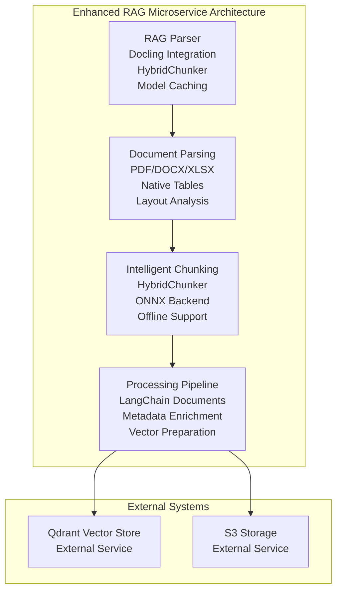
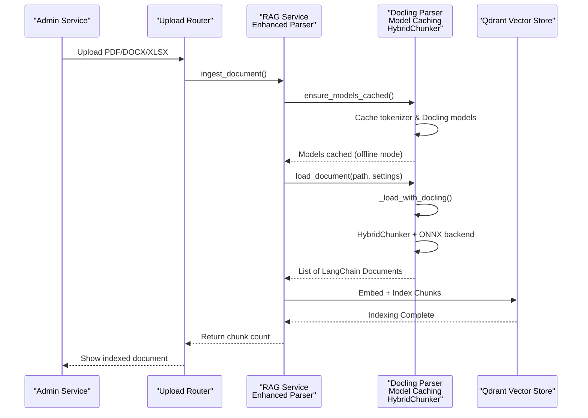
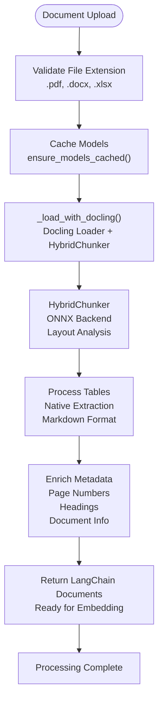
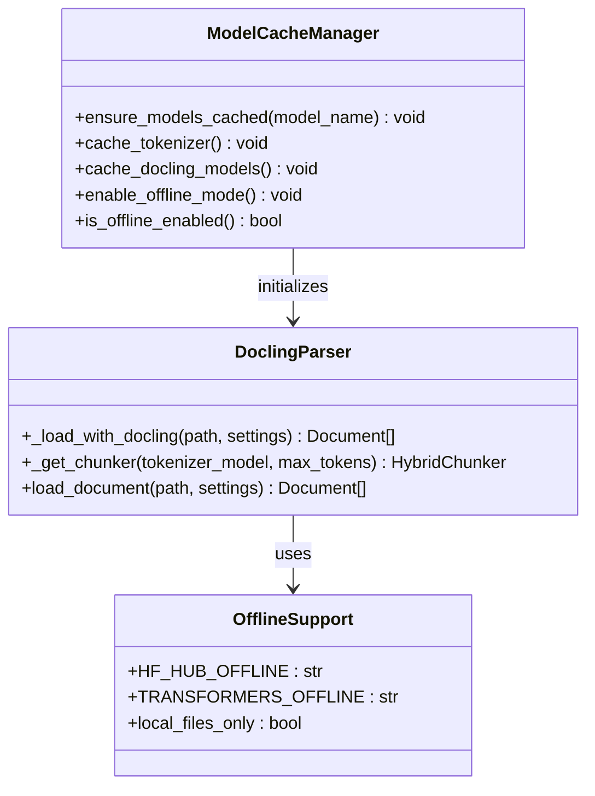
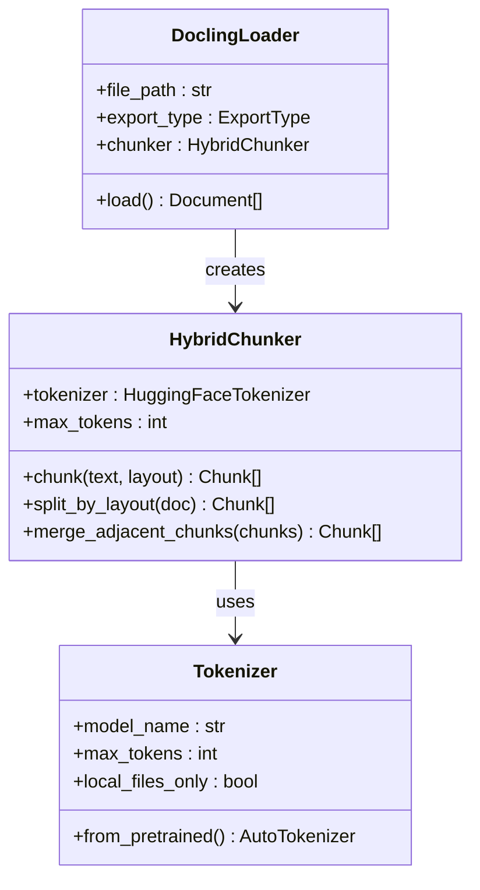
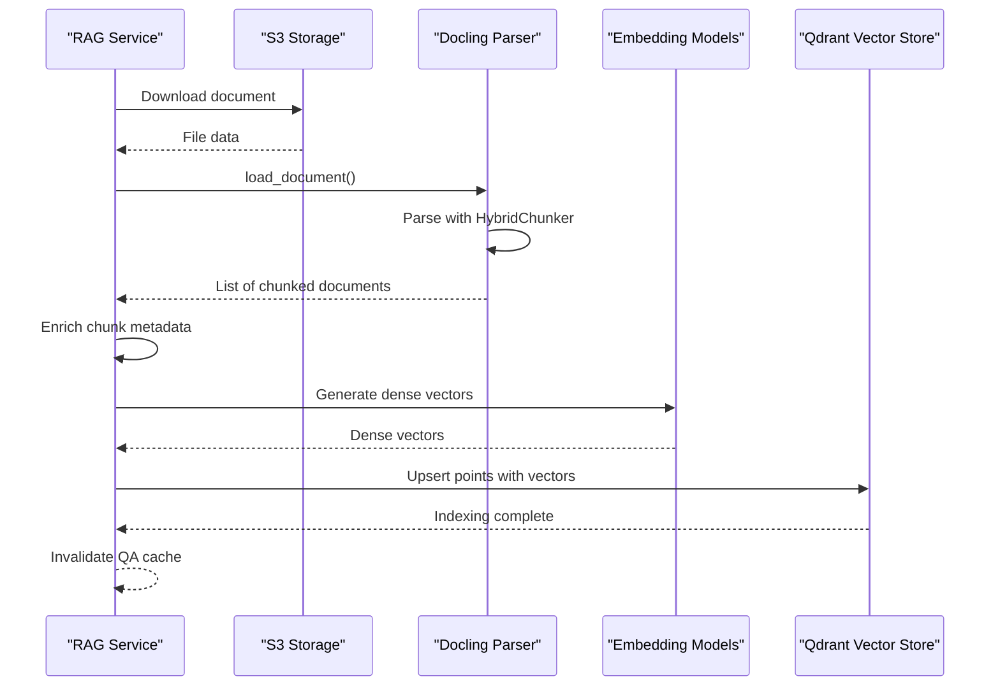
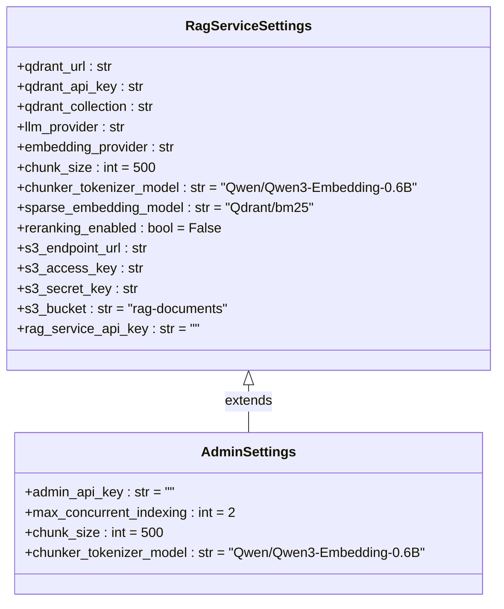
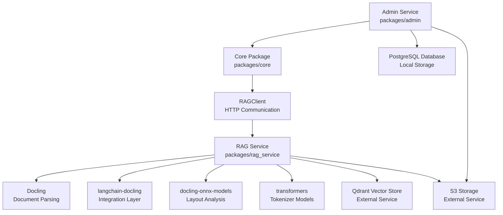

# RAG Parser Enhancement

<cite>
**Referenced Files in This Document**
- [parser.py](file://packages/rag_service/src/cafetera_rag_service/parser.py)
- [main.py](file://packages/rag_service/src/cafetera_rag_service/main.py)
- [config.py](file://packages/rag_service/src/cafetera_rag_service/config.py)
- [ingest.py](file://packages/rag_service/src/cafetera_rag_service/api/ingest.py)
- [resources.py](file://packages/rag_service/src/cafetera_rag_service/resources.py)
- [pyproject.toml](file://packages/rag_service/pyproject.toml)
- [documents_upload.py](file://packages/admin/src/cafetera_admin/api/documents_upload.py)
- [rag_client.py](file://packages/core/src/cafetera_core/rag_client.py)
- [config.py](file://packages/admin/src/cafetera_admin/config.py)
- [core_config.py](file://packages/core/src/cafetera_core/config.py)
</cite>

## Update Summary
**Changes Made**
- Enhanced RAG service with comprehensive document parsing capabilities using Docling
- Added model caching with offline support for tokenizer and Docling models
- Implemented intelligent chunking with HybridChunker for PDF, DOCX, and XLSX formats
- Integrated langchain-docling for seamless document processing pipeline
- Added support for native table extraction and layout analysis
- Enabled offline model support eliminating network dependencies during processing
- Updated RAG service architecture to handle full document ingestion pipeline

## Table of Contents
1. [Introduction](#introduction)
2. [Project Structure](#project-structure)
3. [Core Components](#core-components)
4. [Architecture Overview](#architecture-overview)
5. [Detailed Component Analysis](#detailed-component-analysis)
6. [Dependency Analysis](#dependency-analysis)
7. [Performance Considerations](#performance-considerations)
8. [Troubleshooting Guide](#troubleshooting-guide)
9. [Conclusion](#conclusion)

## Introduction
This document describes the RAG (Retrieval-Augmented Generation) Parser Enhancement for the Cafetera HR Bot. The enhancement represents a significant advancement in the RAG service's document processing capabilities, transforming it from a simple indexing service to a comprehensive document parsing and chunking engine. The system now includes sophisticated document parsing using Docling with HybridChunker, intelligent model caching with offline support, and comprehensive support for PDF, DOCX, and XLSX formats with native table extraction and layout analysis.

**Updated** The RAG service now operates as a complete document processing pipeline that handles all aspects of document ingestion, parsing, chunking, and preparation for AI processing. The system maintains its distributed architecture while significantly enhancing the internal capabilities of the RAG microservice to provide robust document processing capabilities.

## Project Structure
The RAG system has evolved into a comprehensive microservice with integrated document processing capabilities:
- packages/rag_service/src/cafetera_rag_service: Complete RAG microservice with document parsing and processing
- packages/admin/src/cafetera_admin: Admin interface that delegates processing to external RAG service
- packages/core/src/cafetera_core: Shared resources and RAG client for external service communication
- packages/vk_bot: VK bot interface (unchanged)

**Diagram sources**
- [parser.py:19-45](file://packages/rag_service/src/cafetera_rag_service/parser.py#L19-L45)
- [parser.py:94-110](file://packages/rag_service/src/cafetera_rag_service/parser.py#L94-L110)
- [ingest.py:64-188](file://packages/rag_service/src/cafetera_rag_service/api/ingest.py#L64-L188)

**Section sources**
- [parser.py:19-45](file://packages/rag_service/src/cafetera_rag_service/parser.py#L19-L45)
- [parser.py:94-110](file://packages/rag_service/src/cafetera_rag_service/parser.py#L94-L110)
- [ingest.py:64-188](file://packages/rag_service/src/cafetera_rag_service/api/ingest.py#L64-L188)

## Core Components
This section outlines the enhanced components of the RAG system with comprehensive document parsing capabilities.

- **Enhanced Document Parser with Docling Integration**
  - **New Component**: Comprehensive document parsing using Docling with HybridChunker
  - **Model Caching**: Automatic caching of tokenizer and Docling models with offline support
  - **Format Support**: Native support for PDF, DOCX, and XLSX formats with intelligent chunking
  - **Layout Analysis**: Advanced layout understanding preserving document structure and hierarchy
  - **Table Extraction**: Native table extraction with Markdown formatting preservation
  - **Column Detection**: Intelligent column header detection and preservation for spreadsheets
  - **ONNX Backend**: Ensures consistent processing performance with offline model support
  - **LangChain Integration**: Returns standardized LangChain Document objects with metadata
  - **Error Handling**: Graceful handling of unsupported formats and processing failures

- **Model Caching and Offline Support**
  - **Startup Caching**: Automatic model caching at application startup using ensure_models_cached()
  - **Offline Mode**: Enables HF_HUB_OFFLINE and TRANSFORMERS_OFFLINE environment variables
  - **Tokenzier Caching**: Downloads and caches HuggingFace tokenizer models locally
  - **Docling Model Caching**: Caches layout and TableFormer models via ONNX backend
  - **Network Independence**: Eliminates network dependencies during document processing
  - **Performance Optimization**: Reduces latency by avoiding repeated model downloads

- **Intelligent Chunking with HybridChunker**
  - **Hybrid Approach**: Combines multiple chunking strategies for optimal results
  - **Tokenizer Integration**: Uses HuggingFaceTokenizer with configurable max_tokens
  - **Local Processing**: Leverages local_files_only=True for offline model access
  - **Flexible Configuration**: Configurable chunk_size and chunker_tokenizer_model settings
  - **Layout Preservation**: Maintains document structure and semantic coherence across chunks

- **Enhanced Document Processing Pipeline**
  - **Full Pipeline**: End-to-end document processing from ingestion to vector indexing
  - **Metadata Enrichment**: Adds document-level metadata to chunk payloads
  - **Format Validation**: Validates supported file formats and rejects unsupported types
  - **Error Recovery**: Graceful error handling with detailed logging and exception propagation
  - **Batch Processing**: Optimized batch processing for multiple document types

- **RAG Service Configuration Enhancements**
  - **Chunking Settings**: Dedicated chunk_size and chunker_tokenizer_model configuration
  - **Model Management**: Separate configuration for tokenizer and Docling model settings
  - **Integration Settings**: Configuration for external service integration and authentication
  - **Resource Management**: Settings for Qdrant, embeddings, and sparse embedding models

**Section sources**
- [parser.py:19-45](file://packages/rag_service/src/cafetera_rag_service/parser.py#L19-L45)
- [parser.py:48-110](file://packages/rag_service/src/cafetera_rag_service/parser.py#L48-L110)
- [config.py:50-53](file://packages/rag_service/src/cafetera_rag_service/config.py#L50-L53)
- [main.py:26-29](file://packages/rag_service/src/cafetera_rag_service/main.py#L26-L29)

## Architecture Overview
The RAG Parser Enhancement implements a comprehensive document processing pipeline within the RAG microservice, providing sophisticated document parsing capabilities while maintaining the distributed architecture. The system now handles the complete document ingestion pipeline internally, from parsing to vector indexing.

**Updated** The RAG microservice now operates as a complete document processing pipeline that includes sophisticated parsing, chunking, and preparation for AI operations. The admin service continues to handle document ingestion and metadata management, while the RAG service manages all document processing operations with enhanced capabilities.

**Diagram sources**
- [documents_upload.py:54-60](file://packages/admin/src/cafetera_admin/api/documents_upload.py#L54-L60)
- [parser.py:19-45](file://packages/rag_service/src/cafetera_rag_service/parser.py#L19-L45)
- [parser.py:94-110](file://packages/rag_service/src/cafetera_rag_service/parser.py#L94-L110)
- [ingest.py:118-161](file://packages/rag_service/src/cafetera_rag_service/api/ingest.py#L118-L161)

**Section sources**
- [documents_upload.py:54-60](file://packages/admin/src/cafetera_admin/api/documents_upload.py#L54-L60)
- [parser.py:19-45](file://packages/rag_service/src/cafetera_rag_service/parser.py#L19-L45)
- [parser.py:94-110](file://packages/rag_service/src/cafetera_rag_service/parser.py#L94-L110)
- [ingest.py:118-161](file://packages/rag_service/src/cafetera_rag_service/api/ingest.py#L118-L161)

## Detailed Component Analysis

### Enhanced Document Parsing with Docling Integration
The RAG service now includes comprehensive document parsing capabilities using Docling with HybridChunker, providing sophisticated document processing with model caching and offline support.

**Updated** The document parsing system has been completely redesigned to handle multiple document formats with advanced processing capabilities, including native table extraction and layout analysis.

**Diagram sources**
- [parser.py:19-45](file://packages/rag_service/src/cafetera_rag_service/parser.py#L19-L45)
- [parser.py:94-110](file://packages/rag_service/src/cafetera_rag_service/parser.py#L94-L110)
- [ingest.py:109-116](file://packages/rag_service/src/cafetera_rag_service/api/ingest.py#L109-L116)

**Section sources**
- [parser.py:19-45](file://packages/rag_service/src/cafetera_rag_service/parser.py#L19-L45)
- [parser.py:94-110](file://packages/rag_service/src/cafetera_rag_service/parser.py#L94-L110)
- [ingest.py:109-116](file://packages/rag_service/src/cafetera_rag_service/api/ingest.py#L109-L116)

### Model Caching and Offline Support Implementation
The system implements comprehensive model caching to ensure reliable document processing without network dependencies.

**Diagram sources**
- [parser.py:19-45](file://packages/rag_service/src/cafetera_rag_service/parser.py#L19-L45)
- [parser.py:77-91](file://packages/rag_service/src/cafetera_rag_service/parser.py#L77-L91)

**Section sources**
- [parser.py:19-45](file://packages/rag_service/src/cafetera_rag_service/parser.py#L19-L45)
- [parser.py:77-91](file://packages/rag_service/src/cafetera_rag_service/parser.py#L77-L91)

### Intelligent Chunking with HybridChunker
The system uses Docling's HybridChunker for intelligent document segmentation with advanced layout understanding and table preservation.

**Diagram sources**
- [parser.py:77-91](file://packages/rag_service/src/cafetera_rag_service/parser.py#L77-L91)
- [parser.py:94-110](file://packages/rag_service/src/cafetera_rag_service/parser.py#L94-L110)

**Section sources**
- [parser.py:77-91](file://packages/rag_service/src/cafetera_rag_service/parser.py#L77-L91)
- [parser.py:94-110](file://packages/rag_service/src/cafetera_rag_service/parser.py#L94-L110)

### Enhanced Document Processing Pipeline
The RAG service now handles the complete document processing pipeline from ingestion to vector indexing with comprehensive metadata enrichment.

**Diagram sources**
- [ingest.py:64-188](file://packages/rag_service/src/cafetera_rag_service/api/ingest.py#L64-L188)
- [ingest.py:118-161](file://packages/rag_service/src/cafetera_rag_service/api/ingest.py#L118-L161)

**Section sources**
- [ingest.py:64-188](file://packages/rag_service/src/cafetera_rag_service/api/ingest.py#L64-L188)
- [ingest.py:118-161](file://packages/rag_service/src/cafetera_rag_service/api/ingest.py#L118-L161)

### Distributed Configuration Management
The configuration system has been enhanced to support the comprehensive document processing capabilities of the RAG service.

**Diagram sources**
- [config.py:8-62](file://packages/rag_service/src/cafetera_rag_service/config.py#L8-L62)
- [config.py:6-22](file://packages/admin/src/cafetera_admin/config.py#L6-L22)

**Section sources**
- [config.py:8-62](file://packages/rag_service/src/cafetera_rag_service/config.py#L8-L62)
- [config.py:6-22](file://packages/admin/src/cafetera_admin/config.py#L6-L22)

## Dependency Analysis
The RAG system now operates with enhanced dependencies that support comprehensive document processing capabilities while maintaining the distributed architecture.

**Updated** The RAG service has gained sophisticated dependencies for document parsing and processing, while the admin service maintains its simplified role with external service integration.

**Diagram sources**
- [pyproject.toml:6-22](file://packages/rag_service/pyproject.toml#L6-L22)
- [documents_upload.py:54-60](file://packages/admin/src/cafetera_admin/api/documents_upload.py#L54-L60)
- [rag_client.py:15-151](file://packages/core/src/cafetera_core/rag_client.py#L15-L151)

**Section sources**
- [pyproject.toml:6-22](file://packages/rag_service/pyproject.toml#L6-L22)
- [documents_upload.py:54-60](file://packages/admin/src/cafetera_admin/api/documents_upload.py#L54-L60)
- [rag_client.py:15-151](file://packages/core/src/cafetera_core/rag_client.py#L15-L151)

## Performance Considerations
- **Enhanced Processing Capabilities**
  - **Model Caching**: Startup caching eliminates repeated model downloads and improves processing speed
  - **Offline Processing**: Offline mode ensures consistent performance without network dependencies
  - **ONNX Backend**: Optimized processing with consistent performance across different document types
  - **Intelligent Chunking**: HybridChunker provides optimal chunk sizes while preserving document structure
- **Resource Optimization**
  - **Memory Efficiency**: Model caching reduces memory overhead by avoiding repeated model loading
  - **Network Optimization**: Offline mode eliminates network latency during document processing
  - **Batch Processing**: Optimized batch processing for multiple document types and sizes
  - **Resource Management**: Graceful degradation when external services are unavailable
- **Scalability Improvements**
  - **Independent Scaling**: RAG service can be scaled independently from admin service
  - **Processing Isolation**: Document processing doesn't impact admin service performance
  - **Fault Tolerance**: Enhanced error handling and recovery mechanisms
  - **Deployment Flexibility**: Services can be deployed and updated independently
- **Storage and Network Considerations**
  - **S3 Integration**: Direct S3 access reduces intermediate storage requirements
  - **Bandwidth Planning**: Consider bandwidth requirements for document downloads and processing
  - **Data Serialization**: Efficient processing of chunk data for embedding and indexing
  - **Compression**: Consider compression for large document transfers
- **Monitoring and Observability**
  - **Model Caching Metrics**: Track model caching performance and effectiveness
  - **Processing Performance**: Monitor document parsing and chunking performance
  - **Resource Utilization**: Monitor both admin and RAG service resource consumption
  - **Error Rate Tracking**: Monitor document processing error rates and failure patterns

## Troubleshooting Guide
Common issues and resolutions for the enhanced RAG system with comprehensive document processing capabilities:

- **Model Caching Issues**
  - **Symptom**: Model caching fails during startup
  - **Solution**: Verify internet connectivity during initial startup for model downloads
  - **Debug**: Check HF_HUB_OFFLINE and TRANSFORMERS_OFFLINE environment variables
  - **Recovery**: Restart service to retry model caching process
- **Document Parsing Failures**
  - **Symptom**: Documents fail to parse with unsupported format errors
  - **Solution**: Verify file extensions are .pdf, .docx, or .xlsx
  - **Validation**: Check file integrity and format compatibility
  - **Logging**: Review parser logs for detailed error information
- **HybridChunker Performance Issues**
  - **Symptom**: Slow document processing or memory issues
  - **Solution**: Adjust chunk_size configuration for optimal performance
  - **Optimization**: Monitor memory usage and adjust chunker_tokenizer_model
  - **Monitoring**: Track processing time and resource utilization
- **Offline Mode Problems**
  - **Symptom**: Processing fails despite offline mode configuration
  - **Solution**: Verify model caching completed successfully during startup
  - **Validation**: Check that HF_HUB_OFFLINE and TRANSFORMERS_OFFLINE are set
  - **Recovery**: Restart service to reinitialize offline model support
- **Qdrant Connection Issues**
  - **Symptom**: Vector indexing fails or Qdrant operations unavailable
  - **Solution**: Verify Qdrant service availability and network connectivity
  - **Configuration**: Check qdrant_url and qdrant_api_key settings
  - **Monitoring**: Implement health checks for Qdrant service status
- **S3 Integration Problems**
  - **Symptom**: Document downloads fail or S3 operations unavailable
  - **Solution**: Verify S3 credentials and bucket permissions
  - **Configuration**: Check s3_endpoint_url and s3_bucket settings
  - **Monitoring**: Monitor S3 service availability and performance
- **Cache Invalidation Issues**
  - **Symptom**: Stale results after document updates
  - **Solution**: Verify cache invalidation calls are successful
  - **Monitoring**: Track cache invalidation events and their effects
  - **Testing**: Implement cache invalidation verification in test suites
- **Resource Contention**
  - **Symptom**: Slow processing or timeout errors
  - **Solution**: Adjust max_concurrent_indexing settings
  - **Scaling**: Scale RAG service horizontally for increased capacity
  - **Queue Management**: Implement proper queue management for background tasks
- **Configuration Management**
  - **Symptom**: Wrong service URLs or credentials in production
  - **Solution**: Use environment-specific configuration files
  - **Validation**: Implement configuration validation during application startup
  - **Documentation**: Maintain clear documentation for environment-specific settings

**Section sources**
- [parser.py:19-45](file://packages/rag_service/src/cafetera_rag_service/parser.py#L19-L45)
- [ingest.py:64-188](file://packages/rag_service/src/cafetera_rag_service/api/ingest.py#L64-L188)
- [config.py:8-62](file://packages/rag_service/src/cafetera_rag_service/config.py#L8-L62)

## Conclusion
The RAG Parser Enhancement successfully transforms the RAG service from a simple indexing microservice to a comprehensive document processing pipeline with sophisticated capabilities. By integrating Docling with HybridChunker, implementing model caching with offline support, and adding support for PDF, DOCX, and XLSX formats with native table extraction and layout analysis, the system now provides enterprise-grade document processing capabilities.

**Updated** The enhanced RAG service maintains its distributed architecture while significantly expanding its internal capabilities to handle the complete document processing pipeline. The system now provides robust document parsing, intelligent chunking, and comprehensive metadata enrichment while maintaining the benefits of distributed processing and service isolation.

The model caching system ensures reliable performance without network dependencies, while the HybridChunker provides optimal document segmentation with layout preservation. The integration with langchain-docling enables seamless processing of multiple document formats with native table extraction and advanced layout analysis.

The distributed architecture continues to provide scalability, fault tolerance, and deployment flexibility, while the enhanced RAG service offers superior document processing capabilities that position the system for enterprise-scale document processing with comprehensive semantic understanding and retrieval capabilities. The system maintains backward compatibility through unified configuration management and graceful fallback mechanisms, ensuring smooth operation alongside the admin service that continues to handle document ingestion and metadata management.

The elimination of external dependencies for document processing reduces operational complexity while enabling the RAG service to leverage specialized hardware and optimized infrastructure for AI operations. The enhanced architecture also provides better monitoring, logging, and observability across service boundaries, offering comprehensive insights into document processing performance and health.