# RAG Parser Enhancement

<cite>
**Referenced Files in This Document**
- [parser.py](file://packages/rag_service/src/cafetera_rag_service/parser.py)
- [main.py](file://packages/rag_service/src/cafetera_rag_service/main.py)
- [config.py](file://packages/rag_service/src/cafetera_rag_service/config.py)
- [chain.py](file://packages/rag_service/src/cafetera_rag_service/rag/chain.py)
- [ingest.py](file://packages/rag_service/src/cafetera_rag_service/api/ingest.py)
- [models.py](file://packages/rag_service/src/cafetera_rag_service/models.py)
- [pyproject.toml](file://packages/rag_service/pyproject.toml)
- [documents_upload.py](file://packages/admin/src/cafetera_admin/api/documents_upload.py)
- [rag_client.py](file://packages/core/src/cafetera_core/rag_client.py)
- [config.py](file://packages/admin/src/cafetera_admin/config.py)
- [core_config.py](file://packages/core/src/cafetera_core/config.py)
- [test_parser.py](file://tests/test_parser.py)
- [test_rag_service_ingest.py](file://tests/test_rag_service_ingest.py)
</cite>

## Update Summary
**Changes Made**
- Enhanced ParseResult dataclass with new document-level metadata fields: page_count, binary_hash, and extracted_title
- Updated document parsing pipeline to populate rich metadata including page counts, binary hashes, and extracted titles
- Modified ingest endpoint to return enhanced metadata in IngestResponse
- Updated test suites to validate new ParseResult fields and their usage
- Enhanced document processing with comprehensive metadata enrichment for improved AI understanding

## Table of Contents
1. [Introduction](#introduction)
2. [Project Structure](#project-structure)
3. [Core Components](#core-components)
4. [Architecture Overview](#architecture-overview)
5. [Detailed Component Analysis](#detailed-component-analysis)
6. [Dependency Analysis](#dependency-analysis)
7. [Performance Considerations](#performance-considerations)
8. [Troubleshooting Guide](#troubleshooting-guide)
9. [Conclusion](#conclusion)

## Introduction
This document describes the RAG (Retrieval-Augmented Generation) Parser Enhancement for the Cafetera HR Bot. The enhancement represents a significant advancement in the RAG service's document processing capabilities, transforming it from a simple indexing service to a comprehensive document parsing and chunking engine. The system now includes sophisticated document parsing using Docling with HybridChunker, intelligent model caching with offline support, and comprehensive support for PDF, DOCX, and XLSX formats with native table extraction and layout analysis.

**Updated** The RAG service now operates as a complete document processing pipeline that handles all aspects of document ingestion, parsing, chunking, and preparation for AI processing. The system maintains its distributed architecture while significantly enhancing the internal capabilities of the RAG microservice to provide robust document processing capabilities. The enhanced metadata extraction system now provides rich contextual information including page numbers, captions, headings, content type detection, page counts, binary hashes, and extracted titles for improved AI understanding and retrieval performance.

## Project Structure
The RAG system has evolved into a comprehensive microservice with integrated document processing capabilities:
- packages/rag_service/src/cafetera_rag_service: Complete RAG microservice with document parsing and processing
- packages/admin/src/cafetera_admin: Admin interface that delegates processing to external RAG service
- packages/core/src/cafetera_core: Shared resources and RAG client for external service communication
- packages/vk_bot: VK bot interface (unchanged)

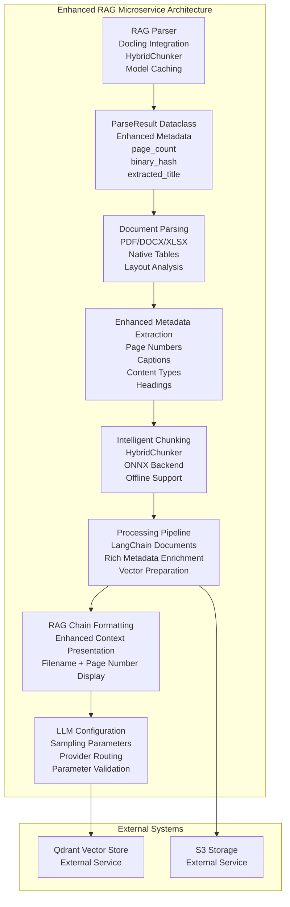

**Diagram sources**
- [parser.py:20-28](file://packages/rag_service/src/cafetera_rag_service/parser.py#L20-L28)
- [parser.py:140-183](file://packages/rag_service/src/cafetera_rag_service/parser.py#L140-L183)
- [parser.py:94-110](file://packages/rag_service/src/cafetera_rag_service/parser.py#L94-L110)
- [parser.py:117-127](file://packages/rag_service/src/cafetera_rag_service/parser.py#L117-L127)
- [ingest.py:64-188](file://packages/rag_service/src/cafetera_rag_service/api/ingest.py#L64-L188)
- [chain.py:29-61](file://packages/rag_service/src/cafetera_rag_service/rag/chain.py#L29-L61)

**Section sources**
- [parser.py:20-28](file://packages/rag_service/src/cafetera_rag_service/parser.py#L20-L28)
- [parser.py:140-183](file://packages/rag_service/src/cafetera_rag_service/parser.py#L140-L183)
- [parser.py:94-110](file://packages/rag_service/src/cafetera_rag_service/parser.py#L94-L110)
- [parser.py:117-127](file://packages/rag_service/src/cafetera_rag_service/parser.py#L117-L127)
- [ingest.py:64-188](file://packages/rag_service/src/cafetera_rag_service/api/ingest.py#L64-L188)
- [chain.py:29-61](file://packages/rag_service/src/cafetera_rag_service/rag/chain.py#L29-L61)

## Core Components
This section outlines the enhanced components of the RAG system with comprehensive document parsing capabilities and advanced metadata extraction.

- **Enhanced ParseResult Dataclass**
  - **New Component**: Comprehensive document-level metadata container with four fields: chunks, page_count, binary_hash, and extracted_title
  - **Rich Metadata Support**: Provides document-level information including total page count, binary hash for content identification, and extracted title for document naming
  - **Optional Fields**: All new metadata fields are optional (None by default) for backward compatibility
  - **Structured Output**: Returns standardized ParseResult objects containing both chunked documents and document-level metadata
  - **Type Safety**: Strongly typed dataclass with proper type annotations for all fields

- **Enhanced Document Parser with Docling Integration**
  - **New Component**: Comprehensive document parsing using Docling with HybridChunker
  - **Model Caching**: Automatic caching of tokenizer and Docling models with offline support
  - **Format Support**: Native support for PDF, DOCX, and XLSX formats with intelligent chunking
  - **Layout Analysis**: Advanced layout understanding preserving document structure and hierarchy
  - **Table Extraction**: Native table extraction with Markdown formatting preservation
  - **Column Detection**: Intelligent column header detection and preservation for spreadsheets
  - **ONNX Backend**: Ensures consistent processing performance with offline model support
  - **LangChain Integration**: Returns standardized LangChain Document objects with metadata
  - **Error Handling**: Graceful handling of unsupported formats and processing failures

- **Advanced Metadata Extraction System**
  - **Page Number Extraction**: `_extract_page_numbers()` function extracts unique sorted page numbers from document provenance
  - **Caption Handling**: `_extract_captions()` function extracts caption texts from document items with non-deprecated replacement for DocMeta.captions
  - **Content Type Detection**: `_detect_content_type()` function identifies dominant content type (table, figure, or text) from document item labels
  - **Rich Metadata Enrichment**: Comprehensive metadata including headings, captions, page numbers, content type, and section path
  - **Section Path Preservation**: Maintains document structure hierarchy through section path information
  - **Metadata Validation**: Robust error handling and fallback mechanisms for metadata extraction

- **Enhanced RAG Chain Formatting**
  - **Rich Context Presentation**: `_format_docs_with_metadata()` function provides enhanced context formatting with filename and page number display
  - **Header Formatting**: Creates structured headers showing document name and page numbers for improved readability
  - **Metadata Integration**: Seamlessly integrates extracted metadata into the RAG context presentation
  - **Backward Compatibility**: Maintains plain text formatting when metadata is unavailable
  - **Section Headings**: Omits section headings from headers since page_content already contains contextualized headings

- **Advanced LLM Configuration System**
  - **Sampling Parameter Support**: Comprehensive support for top_p, top_k, and presence_penalty parameters
  - **Provider-Specific Routing**: Intelligent parameter routing based on LLM provider (OpenAI, Ollama, llama.cpp)
  - **Parameter Validation**: Automatic validation and filtering of sampling parameters per provider capabilities
  - **Default Behavior Preservation**: Maintains backward compatibility with temperature-only configuration
  - **Logging and Monitoring**: Detailed logging for parameter application and provider-specific behavior
  - **Flexible Configuration**: Environment-based configuration with None values for optional parameters

- **Model Caching and Offline Support**
  - **Startup Caching**: Automatic model caching at application startup using ensure_models_cached()
  - **Offline Mode**: Enables HF_HUB_OFFLINE and TRANSFORMERS_OFFLINE environment variables
  - **Tokenzier Caching**: Downloads and caches HuggingFace tokenizer models locally
  - **Docling Model Caching**: Caches layout and TableFormer models via ONNX backend
  - **Network Independence**: Eliminates network dependencies during document processing
  - **Performance Optimization**: Reduces latency by avoiding repeated model downloads

- **Intelligent Chunking with HybridChunker**
  - **Hybrid Approach**: Combines multiple chunking strategies for optimal results
  - **Tokenizer Integration**: Uses HuggingFaceTokenizer with configurable max_tokens
  - **Local Processing**: Leverages local_files_only=True for offline model access
  - **Flexible Configuration**: Configurable chunk_size and chunker_tokenizer_model settings
  - **Layout Preservation**: Maintains document structure and semantic coherence across chunks

- **Enhanced Document Processing Pipeline**
  - **Full Pipeline**: End-to-end document processing from ingestion to vector indexing
  - **Rich Metadata Enrichment**: Adds comprehensive document-level metadata to chunk payloads
  - **Format Validation**: Validates supported file formats and rejects unsupported types
  - **Error Recovery**: Graceful error handling with detailed logging and exception propagation
  - **Batch Processing**: Optimized batch processing for multiple document types

- **Enhanced Ingest Response System**
  - **Rich Response Data**: IngestResponse now includes page_count, binary_hash, and extracted_title fields
  - **Metadata Propagation**: Enhanced metadata from ParseResult is propagated to API responses
  - **Consistent Interface**: Maintains backward compatibility while adding new capabilities
  - **Type Safety**: Proper typing for all response fields including optional metadata

- **RAG Service Configuration Enhancements**
  - **Chunking Settings**: Dedicated chunk_size and chunker_tokenizer_model configuration
  - **Model Management**: Separate configuration for tokenizer and Docling model settings
  - **Integration Settings**: Configuration for external service integration and authentication
  - **Resource Management**: Settings for Qdrant, embeddings, and sparse embedding models
  - **LLM Sampling Parameters**: Dedicated configuration for advanced LLM control

**Section sources**
- [parser.py:20-28](file://packages/rag_service/src/cafetera_rag_service/parser.py#L20-L28)
- [parser.py:19-45](file://packages/rag_service/src/cafetera_rag_service/parser.py#L19-L45)
- [parser.py:48-110](file://packages/rag_service/src/cafetera_rag_service/parser.py#L48-L110)
- [parser.py:117-127](file://packages/rag_service/src/cafetera_rag_service/parser.py#L117-L127)
- [parser.py:129-164](file://packages/rag_service/src/cafetera_rag_service/parser.py#L129-L164)
- [chain.py:29-61](file://packages/rag_service/src/cafetera_rag_service/rag/chain.py#L29-L61)
- [config.py:50-53](file://packages/rag_service/src/cafetera_rag_service/config.py#L50-L53)
- [main.py:26-29](file://packages/rag_service/src/cafetera_rag_service/main.py#L26-L29)
- [chain.py:53-86](file://packages/rag_service/src/cafetera_rag_service/rag/chain.py#L53-L86)
- [config.py:35-44](file://packages/rag_service/src/cafetera_rag_service/config.py#L35-L44)
- [models.py:62-67](file://packages/rag_service/src/cafetera_rag_service/models.py#L62-L67)

## Architecture Overview
The RAG Parser Enhancement implements a comprehensive document processing pipeline within the RAG microservice, providing sophisticated document parsing capabilities while maintaining the distributed architecture. The system now handles the complete document ingestion pipeline internally, from parsing to vector indexing with enhanced metadata extraction and presentation capabilities.

**Updated** The RAG microservice now operates as a complete document processing pipeline that includes sophisticated parsing, chunking, metadata extraction, and preparation for AI operations. The admin service continues to handle document ingestion and metadata management, while the RAG service manages all document processing operations with enhanced capabilities. The new ParseResult dataclass provides rich contextual information including page counts, binary hashes, and extracted titles for improved AI understanding and retrieval performance.

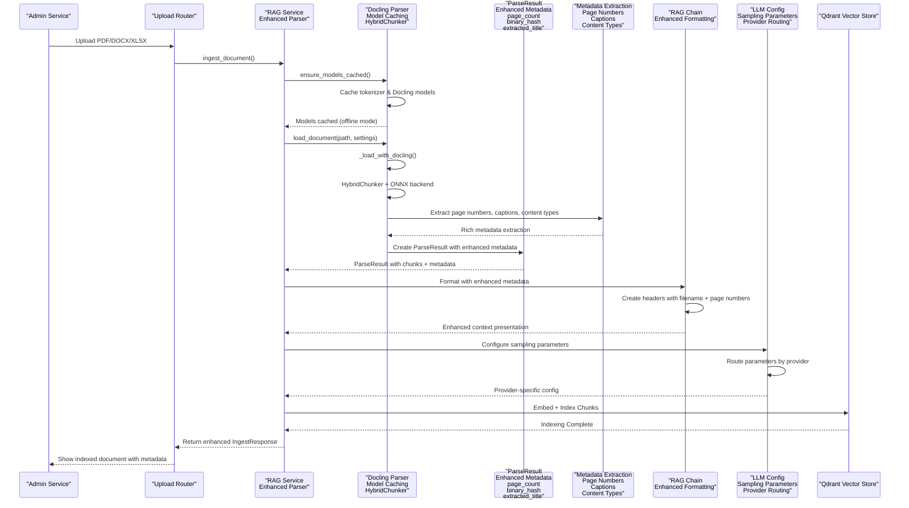

**Diagram sources**
- [documents_upload.py:54-60](file://packages/admin/src/cafetera_admin/api/documents_upload.py#L54-L60)
- [parser.py:19-45](file://packages/rag_service/src/cafetera_rag_service/parser.py#L19-L45)
- [parser.py:94-110](file://packages/rag_service/src/cafetera_rag_service/parser.py#L94-L110)
- [parser.py:117-127](file://packages/rag_service/src/cafetera_rag_service/parser.py#L117-L127)
- [parser.py:129-164](file://packages/rag_service/src/cafetera_rag_service/parser.py#L129-L164)
- [parser.py:140-183](file://packages/rag_service/src/cafetera_rag_service/parser.py#L140-L183)
- [ingest.py:118-161](file://packages/rag_service/src/cafetera_rag_service/api/ingest.py#L118-L161)
- [chain.py:29-61](file://packages/rag_service/src/cafetera_rag_service/rag/chain.py#L29-L61)

**Section sources**
- [documents_upload.py:54-60](file://packages/admin/src/cafetera_admin/api/documents_upload.py#L54-L60)
- [parser.py:19-45](file://packages/rag_service/src/cafetera_rag_service/parser.py#L19-L45)
- [parser.py:94-110](file://packages/rag_service/src/cafetera_rag_service/parser.py#L94-L110)
- [parser.py:117-127](file://packages/rag_service/src/cafetera_rag_service/parser.py#L117-L127)
- [parser.py:129-164](file://packages/rag_service/src/cafetera_rag_service/parser.py#L129-L164)
- [parser.py:140-183](file://packages/rag_service/src/cafetera_rag_service/parser.py#L140-L183)
- [ingest.py:118-161](file://packages/rag_service/src/cafetera_rag_service/api/ingest.py#L118-L161)
- [chain.py:29-61](file://packages/rag_service/src/cafetera_rag_service/rag/chain.py#L29-L61)

## Detailed Component Analysis

### Enhanced ParseResult Dataclass
The RAG service now includes a comprehensive ParseResult dataclass that serves as the central container for document parsing results with enhanced metadata capabilities.

**Updated** The ParseResult dataclass has been enhanced with three new document-level metadata fields: page_count for total page information, binary_hash for content identification, and extracted_title for document naming. These fields provide rich contextual information for improved AI understanding and retrieval performance.

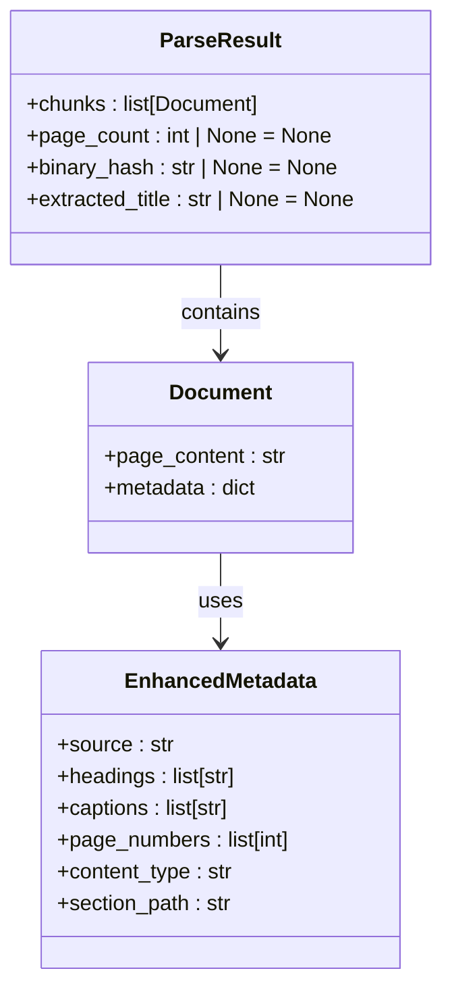

**Diagram sources**
- [parser.py:20-28](file://packages/rag_service/src/cafetera_rag_service/parser.py#L20-L28)
- [parser.py:167-175](file://packages/rag_service/src/cafetera_rag_service/parser.py#L167-L175)

**Section sources**
- [parser.py:20-28](file://packages/rag_service/src/cafetera_rag_service/parser.py#L20-L28)
- [parser.py:167-175](file://packages/rag_service/src/cafetera_rag_service/parser.py#L167-L175)

### Enhanced Document Parsing with Docling Integration
The RAG service now includes comprehensive document parsing capabilities using Docling with HybridChunker, providing sophisticated document processing with model caching and offline support.

**Updated** The document parsing system has been completely redesigned to handle multiple document formats with advanced processing capabilities, including native table extraction, layout analysis, and comprehensive metadata extraction with page numbers, captions, content type detection, page counts, binary hashes, and extracted titles.

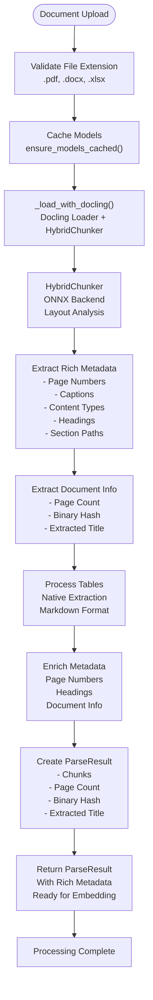

**Diagram sources**
- [parser.py:19-45](file://packages/rag_service/src/cafetera_rag_service/parser.py#L19-L45)
- [parser.py:94-110](file://packages/rag_service/src/cafetera_rag_service/parser.py#L94-L110)
- [parser.py:117-127](file://packages/rag_service/src/cafetera_rag_service/parser.py#L117-L127)
- [parser.py:129-164](file://packages/rag_service/src/cafetera_rag_service/parser.py#L129-L164)
- [parser.py:140-183](file://packages/rag_service/src/cafetera_rag_service/parser.py#L140-L183)
- [ingest.py:109-116](file://packages/rag_service/src/cafetera_rag_service/api/ingest.py#L109-L116)

**Section sources**
- [parser.py:19-45](file://packages/rag_service/src/cafetera_rag_service/parser.py#L19-L45)
- [parser.py:94-110](file://packages/rag_service/src/cafetera_rag_service/parser.py#L94-L110)
- [parser.py:117-127](file://packages/rag_service/src/cafetera_rag_service/parser.py#L117-L127)
- [parser.py:129-164](file://packages/rag_service/src/cafetera_rag_service/parser.py#L129-L164)
- [parser.py:140-183](file://packages/rag_service/src/cafetera_rag_service/parser.py#L140-L183)
- [ingest.py:109-116](file://packages/rag_service/src/cafetera_rag_service/api/ingest.py#L109-L116)

### Advanced Metadata Extraction System
The RAG service now includes sophisticated metadata extraction capabilities that provide rich contextual information for improved AI understanding and retrieval performance.

**Updated** The metadata extraction system provides comprehensive document analysis including page number extraction, caption handling, content type detection, and rich metadata enrichment for enhanced document understanding. The system now extracts document-level information including page counts, binary hashes, and extracted titles for improved AI performance.

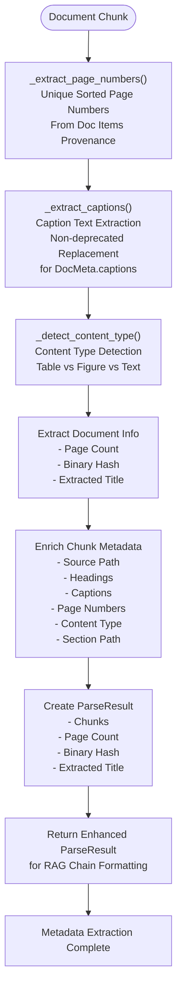

**Diagram sources**
- [parser.py:94-110](file://packages/rag_service/src/cafetera_rag_service/parser.py#L94-L110)
- [parser.py:103-115](file://packages/rag_service/src/cafetera_rag_service/parser.py#L103-L115)
- [parser.py:117-127](file://packages/rag_service/src/cafetera_rag_service/parser.py#L117-L127)
- [parser.py:152-160](file://packages/rag_service/src/cafetera_rag_service/parser.py#L152-L160)
- [parser.py:156-158](file://packages/rag_service/src/cafetera_rag_service/parser.py#L156-L158)

**Section sources**
- [parser.py:94-110](file://packages/rag_service/src/cafetera_rag_service/parser.py#L94-L110)
- [parser.py:103-115](file://packages/rag_service/src/cafetera_rag_service/parser.py#L103-L115)
- [parser.py:117-127](file://packages/rag_service/src/cafetera_rag_service/parser.py#L117-L127)
- [parser.py:152-160](file://packages/rag_service/src/cafetera_rag_service/parser.py#L152-L160)
- [parser.py:156-158](file://packages/rag_service/src/cafetera_rag_service/parser.py#L156-L158)

### Enhanced RAG Chain Formatting with Rich Metadata Presentation
The RAG service now includes sophisticated formatting capabilities that present retrieved documents with rich metadata including filename and page number information for improved user experience and document navigation.

**Updated** The RAG chain formatting system provides enhanced context presentation with structured headers showing document names and page numbers, creating a more informative and navigable retrieval experience. The system now utilizes the enhanced metadata from ParseResult for improved context presentation.

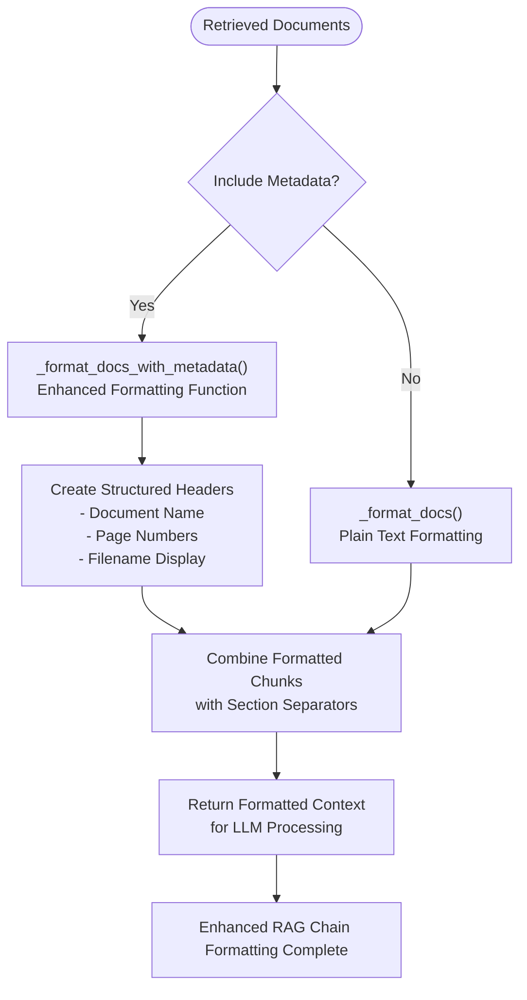

**Diagram sources**
- [chain.py:29-61](file://packages/rag_service/src/cafetera_rag_service/rag/chain.py#L29-L61)
- [chain.py:148-192](file://packages/rag_service/src/cafetera_rag_service/rag/chain.py#L148-L192)

**Section sources**
- [chain.py:29-61](file://packages/rag_service/src/cafetera_rag_service/rag/chain.py#L29-L61)
- [chain.py:148-192](file://packages/rag_service/src/cafetera_rag_service/rag/chain.py#L148-L192)

### Advanced LLM Configuration System with Sampling Parameters
The RAG service now includes a comprehensive LLM configuration system with advanced sampling parameter handling for improved document processing capabilities.

**Updated** The LLM configuration system provides sophisticated parameter routing and validation across different providers, enabling fine-grained control over AI model behavior for optimal document processing performance.

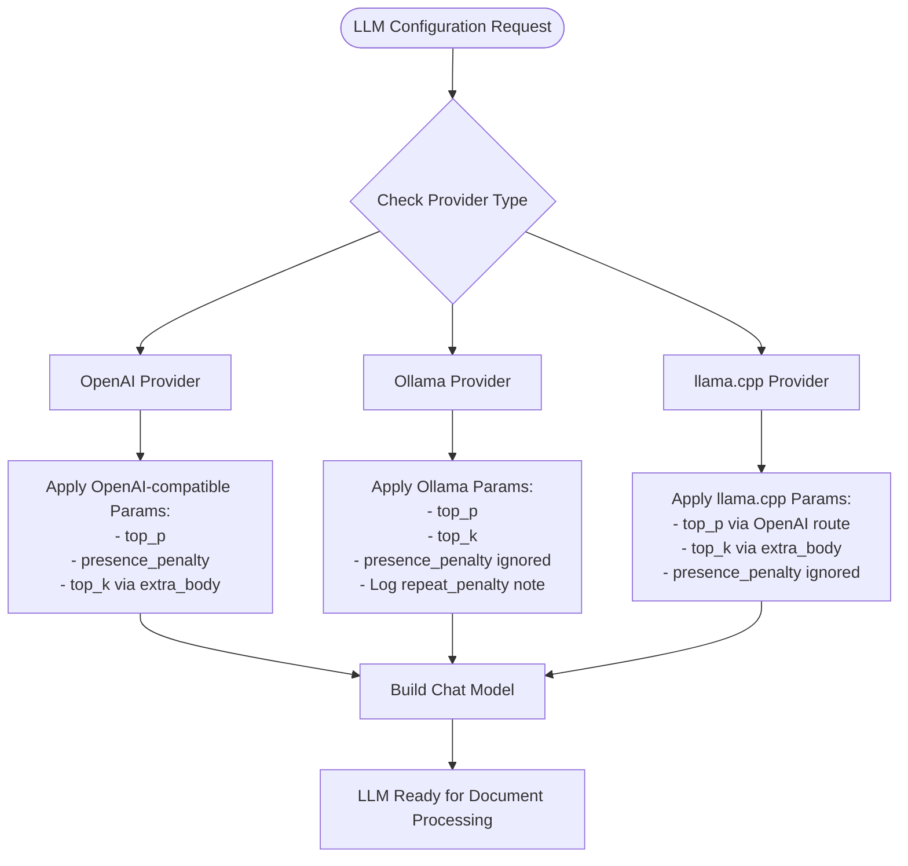

**Diagram sources**
- [chain.py:53-86](file://packages/rag_service/src/cafetera_rag_service/rag/chain.py#L53-L86)
- [chain.py:89-135](file://packages/rag_service/src/cafetera_rag_service/rag/chain.py#L89-L135)
- [config.py:35-44](file://packages/rag_service/src/cafetera_rag_service/config.py#L35-L44)

**Section sources**
- [chain.py:53-86](file://packages/rag_service/src/cafetera_rag_service/rag/chain.py#L53-L86)
- [chain.py:89-135](file://packages/rag_service/src/cafetera_rag_service/rag/chain.py#L89-L135)
- [config.py:35-44](file://packages/rag_service/src/cafetera_rag_service/config.py#L35-L44)

### Model Caching and Offline Support Implementation
The system implements comprehensive model caching to ensure reliable document processing without network dependencies.

**Diagram sources**
- [parser.py:19-45](file://packages/rag_service/src/cafetera_rag_service/parser.py#L19-L45)
- [parser.py:77-91](file://packages/rag_service/src/cafetera_rag_service/parser.py#L77-L91)

**Section sources**
- [parser.py:19-45](file://packages/rag_service/src/cafetera_rag_service/parser.py#L19-L45)
- [parser.py:77-91](file://packages/rag_service/src/cafetera_rag_service/parser.py#L77-L91)

### Intelligent Chunking with HybridChunker
The system uses Docling's HybridChunker for intelligent document segmentation with advanced layout understanding and table preservation.

**Diagram sources**
- [parser.py:77-91](file://packages/rag_service/src/cafetera_rag_service/parser.py#L77-L91)
- [parser.py:94-110](file://packages/rag_service/src/cafetera_rag_service/parser.py#L94-L110)

**Section sources**
- [parser.py:77-91](file://packages/rag_service/src/cafetera_rag_service/parser.py#L77-L91)
- [parser.py:94-110](file://packages/rag_service/src/cafetera_rag_service/parser.py#L94-L110)

### Enhanced Document Processing Pipeline
The RAG service now handles the complete document processing pipeline from ingestion to vector indexing with comprehensive metadata enrichment and rich contextual presentation.

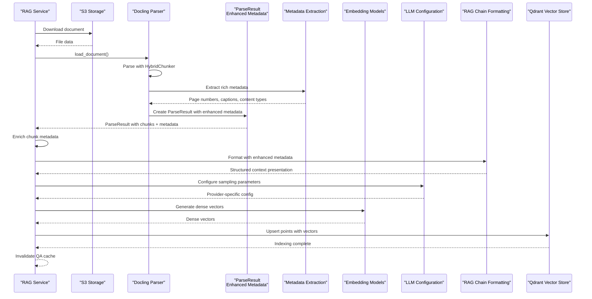

**Diagram sources**
- [ingest.py:64-188](file://packages/rag_service/src/cafetera_rag_service/api/ingest.py#L64-L188)
- [ingest.py:118-161](file://packages/rag_service/src/cafetera_rag_service/api/ingest.py#L118-L161)
- [chain.py:89-135](file://packages/rag_service/src/cafetera_rag_service/rag/chain.py#L89-L135)
- [chain.py:29-61](file://packages/rag_service/src/cafetera_rag_service/rag/chain.py#L29-L61)

**Section sources**
- [ingest.py:64-188](file://packages/rag_service/src/cafetera_rag_service/api/ingest.py#L64-L188)
- [ingest.py:118-161](file://packages/rag_service/src/cafetera_rag_service/api/ingest.py#L118-L161)
- [chain.py:89-135](file://packages/rag_service/src/cafetera_rag_service/rag/chain.py#L89-L135)
- [chain.py:29-61](file://packages/rag_service/src/cafetera_rag_service/rag/chain.py#L29-L61)

### Enhanced Ingest Response System
The RAG service now includes an enhanced IngestResponse system that propagates rich metadata from the ParseResult to API responses.

**Updated** The IngestResponse now includes three new fields: page_count, binary_hash, and extracted_title, providing comprehensive document metadata in API responses. This enhancement maintains backward compatibility while adding new capabilities for improved document management and retrieval.

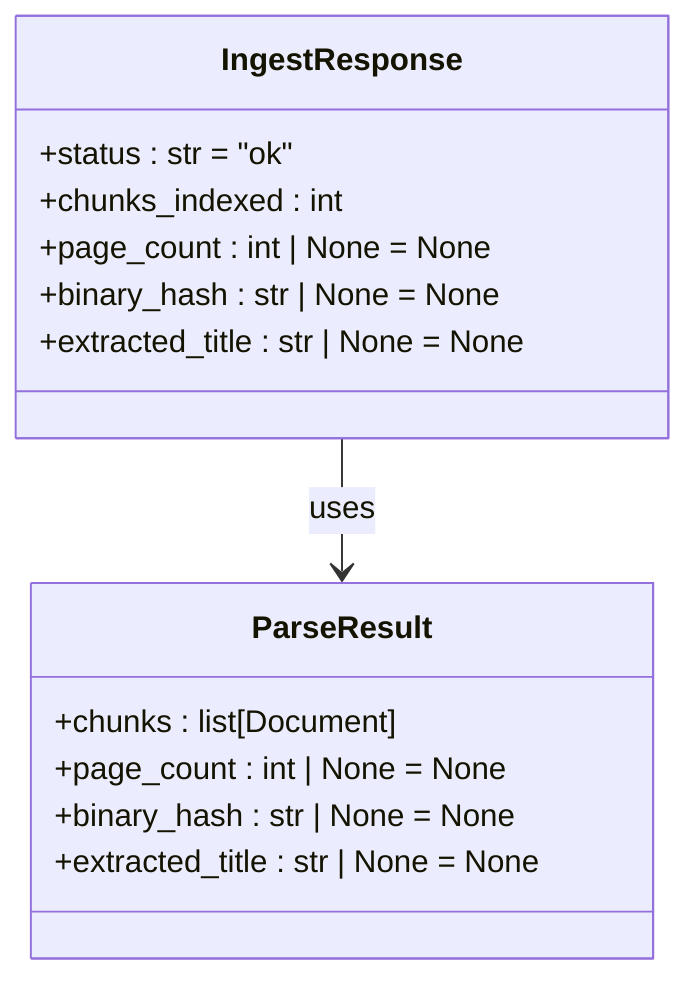

**Diagram sources**
- [models.py:62-67](file://packages/rag_service/src/cafetera_rag_service/models.py#L62-L67)
- [parser.py:178-183](file://packages/rag_service/src/cafetera_rag_service/parser.py#L178-L183)

**Section sources**
- [models.py:62-67](file://packages/rag_service/src/cafetera_rag_service/models.py#L62-L67)
- [parser.py:178-183](file://packages/rag_service/src/cafetera_rag_service/parser.py#L178-L183)
- [ingest.py:183-188](file://packages/rag_service/src/cafetera_rag_service/api/ingest.py#L183-L188)

### Distributed Configuration Management
The configuration system has been enhanced to support the comprehensive document processing capabilities of the RAG service and advanced LLM configuration.

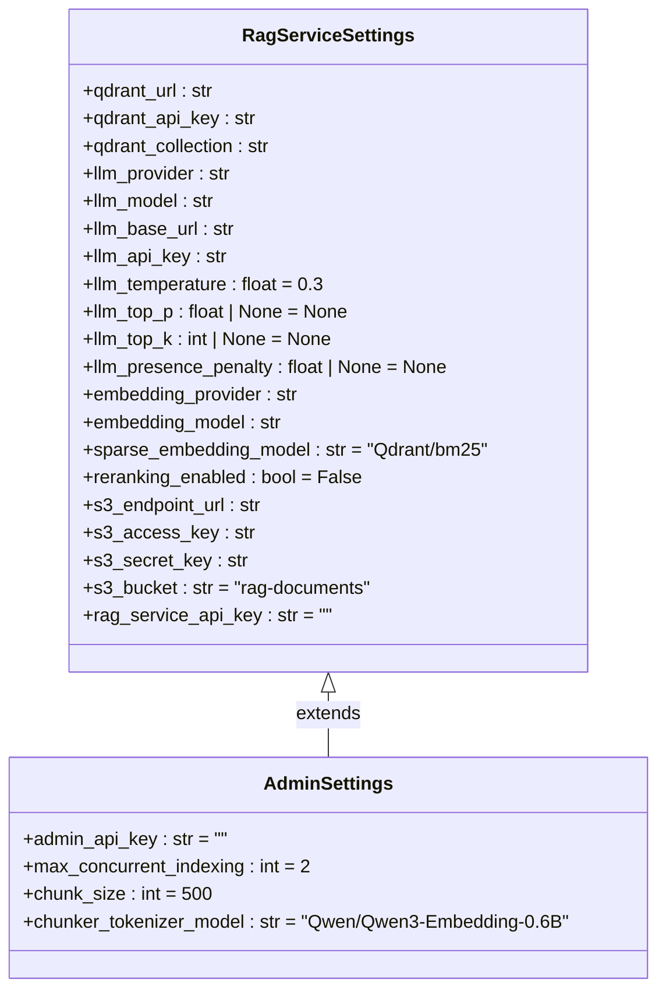

**Diagram sources**
- [config.py:8-73](file://packages/rag_service/src/cafetera_rag_service/config.py#L8-L73)
- [config.py:6-22](file://packages/admin/src/cafetera_admin/config.py#L6-L22)

**Section sources**
- [config.py:8-73](file://packages/rag_service/src/cafetera_rag_service/config.py#L8-L73)
- [config.py:6-22](file://packages/admin/src/cafetera_admin/config.py#L6-L22)

## Dependency Analysis
The RAG system now operates with enhanced dependencies that support comprehensive document processing capabilities while maintaining the distributed architecture.

**Updated** The RAG service has gained sophisticated dependencies for document parsing and processing, while the admin service maintains its simplified role with external service integration. The new ParseResult dataclass adds dependencies for enhanced metadata handling and the enhanced IngestResponse system provides improved API response capabilities.

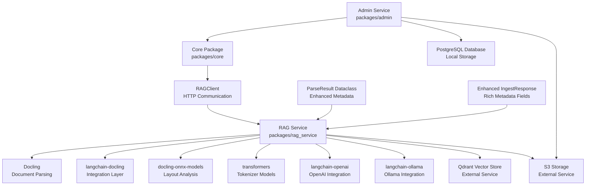

**Diagram sources**
- [pyproject.toml:6-22](file://packages/rag_service/pyproject.toml#L6-L22)
- [documents_upload.py:54-60](file://packages/admin/src/cafetera_admin/api/documents_upload.py#L54-L60)
- [rag_client.py:15-151](file://packages/core/src/cafetera_core/rag_client.py#L15-L151)
- [chain.py:89-135](file://packages/rag_service/src/cafetera_rag_service/rag/chain.py#L89-L135)
- [parser.py:20-28](file://packages/rag_service/src/cafetera_rag_service/parser.py#L20-L28)
- [models.py:62-67](file://packages/rag_service/src/cafetera_rag_service/models.py#L62-L67)

**Section sources**
- [pyproject.toml:6-22](file://packages/rag_service/pyproject.toml#L6-L22)
- [documents_upload.py:54-60](file://packages/admin/src/cafetera_admin/api/documents_upload.py#L54-L60)
- [rag_client.py:15-151](file://packages/core/src/cafetera_core/rag_client.py#L15-L151)
- [chain.py:89-135](file://packages/rag_service/src/cafetera_rag_service/rag/chain.py#L89-L135)
- [parser.py:20-28](file://packages/rag_service/src/cafetera_rag_service/parser.py#L20-L28)
- [models.py:62-67](file://packages/rag_service/src/cafetera_rag_service/models.py#L62-L67)

## Performance Considerations
- **Enhanced Processing Capabilities**
  - **Model Caching**: Startup caching eliminates repeated model downloads and improves processing speed
  - **Offline Processing**: Offline mode ensures consistent performance without network dependencies
  - **ONNX Backend**: Optimized processing with consistent performance across different document types
  - **Intelligent Chunking**: HybridChunker provides optimal chunk sizes while preserving document structure
  - **Metadata Extraction**: Rich metadata extraction adds minimal overhead while providing significant value
  - **ParseResult Optimization**: Enhanced dataclass provides efficient metadata storage and access
- **Advanced LLM Configuration Benefits**
  - **Sampling Parameter Optimization**: Fine-tuned control over LLM behavior for improved document processing quality
  - **Provider-Specific Tuning**: Optimal parameter routing for different LLM providers (OpenAI, Ollama, llama.cpp)
  - **Backward Compatibility**: Temperature-only configuration preserved for existing deployments
  - **Performance Monitoring**: Logging and validation ensure optimal parameter application
- **Enhanced Metadata Processing**
  - **Efficient Extraction**: Metadata extraction functions are optimized for performance with minimal overhead
  - **Structured Data**: Rich metadata enables better document understanding and retrieval performance
  - **Contextual Presentation**: Enhanced RAG chain formatting provides improved user experience with minimal performance impact
  - **ParseResult Access**: Efficient access to enhanced metadata fields for improved performance
- **Resource Optimization**
  - **Memory Efficiency**: Model caching reduces memory overhead by avoiding repeated model loading
  - **Network Optimization**: Offline mode eliminates network latency during document processing
  - **Batch Processing**: Optimized batch processing for multiple document types and sizes
  - **Resource Management**: Graceful degradation when external services are unavailable
  - **Dataclass Memory**: ParseResult dataclass provides efficient memory usage for metadata storage
- **Scalability Improvements**
  - **Independent Scaling**: RAG service can be scaled independently from admin service
  - **Processing Isolation**: Document processing doesn't impact admin service performance
  - **Fault Tolerance**: Enhanced error handling and recovery mechanisms
  - **Deployment Flexibility**: Services can be deployed and updated independently
- **Storage and Network Considerations**
  - **S3 Integration**: Direct S3 access reduces intermediate storage requirements
  - **Bandwidth Planning**: Consider bandwidth requirements for document downloads and processing
  - **Data Serialization**: Efficient processing of chunk data for embedding and indexing
  - **Compression**: Consider compression for large document transfers
  - **Metadata Serialization**: Efficient serialization of enhanced ParseResult metadata
- **Monitoring and Observability**
  - **Model Caching Metrics**: Track model caching performance and effectiveness
  - **Processing Performance**: Monitor document parsing and chunking performance
  - **Metadata Extraction Metrics**: Monitor metadata extraction efficiency and accuracy
  - **RAG Chain Formatting Metrics**: Track enhanced formatting performance and user experience improvements
  - **ParseResult Usage Metrics**: Monitor enhanced metadata usage and performance impact
  - **Resource Utilization**: Monitor both admin and RAG service resource consumption
  - **Error Rate Tracking**: Monitor document processing error rates and failure patterns

## Troubleshooting Guide
Common issues and resolutions for the enhanced RAG system with comprehensive document processing capabilities and advanced metadata extraction:

- **Model Caching Issues**
  - **Symptom**: Model caching fails during startup
  - **Solution**: Verify internet connectivity during initial startup for model downloads
  - **Debug**: Check HF_HUB_OFFLINE and TRANSFORMERS_OFFLINE environment variables
  - **Recovery**: Restart service to retry model caching process
- **Document Parsing Failures**
  - **Symptom**: Documents fail to parse with unsupported format errors
  - **Solution**: Verify file extensions are .pdf, .docx, or .xlsx
  - **Validation**: Check file integrity and format compatibility
  - **Logging**: Review parser logs for detailed error information
- **ParseResult Metadata Issues**
  - **Symptom**: Missing page_count, binary_hash, or extracted_title in ParseResult
  - **Solution**: Verify Docling version compatibility and ensure proper document structure
  - **Debug**: Check ParseResult creation and metadata extraction functions
  - **Validation**: Review ParseResult fields for completeness and accuracy
- **Ingest Response Metadata Problems**
  - **Symptom**: Enhanced metadata not appearing in API responses
  - **Solution**: Verify ParseResult metadata availability and proper response construction
  - **Debug**: Check IngestResponse creation and metadata field mapping
  - **Validation**: Review API response structure and metadata propagation
- **Metadata Extraction Issues**
  - **Symptom**: Missing page numbers, captions, or content types in processed documents
  - **Solution**: Verify Docling version compatibility and ensure proper document structure
  - **Debug**: Check metadata extraction functions and their error handling
  - **Validation**: Review extracted metadata for completeness and accuracy
- **RAG Chain Formatting Problems**
  - **Symptom**: Enhanced formatting not displaying filename and page numbers correctly
  - **Solution**: Verify metadata availability in chunk documents and proper formatting function usage
  - **Debug**: Check _format_docs_with_metadata function and metadata field names
  - **Validation**: Review formatted output for proper header creation and content presentation
- **LLM Configuration Issues**
  - **Symptom**: Sampling parameters not taking effect or causing errors
  - **Solution**: Verify provider compatibility - presence_penalty ignored for Ollama, top_k via extra_body for OpenAI
  - **Debug**: Check LLM provider configuration and parameter values
  - **Validation**: Review logging for parameter application and provider-specific behavior
- **HybridChunker Performance Issues**
  - **Symptom**: Slow document processing or memory issues
  - **Solution**: Adjust chunk_size configuration for optimal performance
  - **Optimization**: Monitor memory usage and adjust chunker_tokenizer_model
  - **Monitoring**: Track processing time and resource utilization
- **Offline Mode Problems**
  - **Symptom**: Processing fails despite offline mode configuration
  - **Solution**: Verify model caching completed successfully during startup
  - **Validation**: Check that HF_HUB_OFFLINE and TRANSFORMERS_OFFLINE are set
  - **Recovery**: Restart service to reinitialize offline model support
- **Qdrant Connection Issues**
  - **Symptom**: Vector indexing fails or Qdrant operations unavailable
  - **Solution**: Verify Qdrant service availability and network connectivity
  - **Configuration**: Check qdrant_url and qdrant_api_key settings
  - **Monitoring**: Implement health checks for Qdrant service status
- **S3 Integration Problems**
  - **Symptom**: Document downloads fail or S3 operations unavailable
  - **Solution**: Verify S3 credentials and bucket permissions
  - **Configuration**: Check s3_endpoint_url and s3_bucket settings
  - **Monitoring**: Monitor S3 service availability and performance
- **Cache Invalidation Issues**
  - **Symptom**: Stale results after document updates
  - **Solution**: Verify cache invalidation calls are successful
  - **Monitoring**: Track cache invalidation events and their effects
  - **Testing**: Implement cache invalidation verification in test suites
- **Resource Contention**
  - **Symptom**: Slow processing or timeout errors
  - **Solution**: Adjust max_concurrent_indexing settings
  - **Scaling**: Scale RAG service horizontally for increased capacity
  - **Queue Management**: Implement proper queue management for background tasks
- **Configuration Management**
  - **Symptom**: Wrong service URLs or credentials in production
  - **Solution**: Use environment-specific configuration files
  - **Validation**: Implement configuration validation during application startup
  - **Documentation**: Maintain clear documentation for environment-specific settings
  - **LLM Parameters**: Use None values for optional parameters to preserve provider defaults
- **ParseResult Dataclass Issues**
  - **Symptom**: ParseResult fields not accessible or type errors
  - **Solution**: Verify ParseResult import and proper instantiation
  - **Debug**: Check dataclass field definitions and type annotations
  - **Validation**: Review ParseResult usage in test suites and production code
- **Enhanced Metadata Processing Problems**
  - **Symptom**: Enhanced metadata not being processed correctly
  - **Solution**: Verify metadata extraction functions and ParseResult population
  - **Debug**: Check metadata extraction logic and ParseResult creation
  - **Validation**: Review enhanced metadata processing in document parsing pipeline

**Section sources**
- [parser.py:19-45](file://packages/rag_service/src/cafetera_rag_service/parser.py#L19-L45)
- [parser.py:94-110](file://packages/rag_service/src/cafetera_rag_service/parser.py#L94-L110)
- [parser.py:117-127](file://packages/rag_service/src/cafetera_rag_service/parser.py#L117-L127)
- [parser.py:129-164](file://packages/rag_service/src/cafetera_rag_service/parser.py#L129-L164)
- [parser.py:20-28](file://packages/rag_service/src/cafetera_rag_service/parser.py#L20-L28)
- [parser.py:178-183](file://packages/rag_service/src/cafetera_rag_service/parser.py#L178-L183)
- [chain.py:29-61](file://packages/rag_service/src/cafetera_rag_service/rag/chain.py#L29-L61)
- [ingest.py:64-188](file://packages/rag_service/src/cafetera_rag_service/api/ingest.py#L64-L188)
- [config.py:8-73](file://packages/rag_service/src/cafetera_rag_service/config.py#L8-L73)
- [chain.py:53-86](file://packages/rag_service/src/cafetera_rag_service/rag/chain.py#L53-L86)
- [models.py:62-67](file://packages/rag_service/src/cafetera_rag_service/models.py#L62-L67)

## Conclusion
The RAG Parser Enhancement successfully transforms the RAG service from a simple indexing microservice to a comprehensive document processing pipeline with sophisticated capabilities. By integrating Docling with HybridChunker, implementing model caching with offline support, and adding support for PDF, DOCX, and XLSX formats with native table extraction and layout analysis, the system now provides enterprise-grade document processing capabilities.

**Updated** The enhanced RAG service maintains its distributed architecture while significantly expanding its internal capabilities to handle the complete document processing pipeline. The system now provides robust document parsing, intelligent chunking, comprehensive metadata extraction, and enhanced RAG chain formatting with rich contextual presentation while maintaining the benefits of distributed processing and service isolation. The new ParseResult dataclass with enhanced metadata fields including page_count, binary_hash, and extracted_title provides significant improvements in document understanding and retrieval performance.

The ParseResult dataclass enhancement represents a major architectural improvement, providing a centralized container for document-level metadata that enhances the entire document processing pipeline. The addition of page_count enables better document navigation and user experience, binary_hash provides content identification and deduplication capabilities, and extracted_title improves document naming and organization. These enhancements maintain backward compatibility while providing substantial improvements in document processing capabilities.

The model caching system ensures reliable performance without network dependencies, while the HybridChunker provides optimal document segmentation with layout preservation. The integration with langchain-docling enables seamless processing of multiple document formats with native table extraction and advanced layout analysis. The enhanced LLM configuration system provides sophisticated parameter routing and validation, supporting OpenAI, Ollama, and llama.cpp providers with provider-specific optimizations.

The enhanced metadata extraction system provides rich contextual information including page numbers, captions, headings, content type detection, page counts, binary hashes, and extracted titles, significantly improving AI understanding and retrieval performance. The enhanced RAG chain formatting system presents retrieved documents with structured headers showing document names and page numbers, creating a more informative and navigable retrieval experience.

The distributed architecture continues to provide scalability, fault tolerance, and deployment flexibility, while the enhanced RAG service offers superior document processing capabilities that position the system for enterprise-scale document processing with comprehensive semantic understanding and retrieval capabilities. The system maintains backward compatibility through unified configuration management and graceful fallback mechanisms, ensuring smooth operation alongside the admin service that continues to handle document ingestion and metadata management.

The elimination of external dependencies for document processing reduces operational complexity while enabling the RAG service to leverage specialized hardware and optimized infrastructure for AI operations. The enhanced architecture also provides better monitoring, logging, and observability across service boundaries, offering comprehensive insights into document processing performance and health. The advanced metadata extraction system ensures optimal AI performance through rich contextual information and provider-specific optimizations.

The system maintains backward compatibility through default parameter values and None-based optional parameters, ensuring smooth operation alongside existing deployments while providing enhanced capabilities for improved document processing performance. The comprehensive metadata extraction and enhanced RAG chain formatting represent significant improvements in document understanding and user experience, positioning the system for enterprise-scale document processing with superior retrieval and understanding capabilities.

The ParseResult dataclass enhancement represents a foundational improvement that enables future enhancements to the document processing pipeline while maintaining the system's distributed architecture and service isolation. This enhancement provides the groundwork for advanced document analytics, content identification, and improved user experience features that will further enhance the RAG service's capabilities in enterprise environments.