# RAG Parser Enhancement

<cite>
**Referenced Files in This Document**
- [parser.py](file://app/rag/parser.py)
- [indexer.py](file://app/rag/indexer.py)
- [retriever.py](file://app/rag/retriever.py)
- [chain.py](file://app/rag/chain.py)
- [prompts.py](file://app/rag/prompts.py)
- [ingest.py](file://scripts/ingest.py)
- [document_service.py](file://app/domain/document_service.py)
- [document_repo.py](file://app/storage/document_repo.py)
- [config.py](file://app/config.py)
- [documents.py](file://app/api/documents.py)
- [qa_service.py](file://app/domain/qa_service.py)
- [main.py](file://app/main.py)
- [resources.py](file://app/resources.py)
- [test_parser.py](file://tests/test_parser.py)
- [test_semantic_chunker.py](file://tests/test_semantic_chunker.py)
- [test_hybrid_search.py](file://tests/test_hybrid_search.py)
- [test_rag_block6.py](file://tests/test_rag_block6.py)
- [test_indexer.py](file://tests/test_indexer.py)
- [pyproject.toml](file://pyproject.toml)
</cite>

## Update Summary
**Changes Made**
- Added semantic chunking functionality with new chunking strategies ('recursive' and 'semantic')
- Enhanced configuration options for breakpoint thresholds with four threshold types
- Integrated LangChain's SemanticChunker for embedding-based semantic chunking
- Added hybrid search capabilities with sparse embeddings support for BM25 keyword matching
- Extended parser functions to support semantic chunking with configurable breakpoint thresholds
- Updated retriever to support hybrid dense-sparse retrieval modes
- Enhanced indexer to support sparse embeddings during vector indexing
- Added comprehensive test coverage for semantic chunking and hybrid search functionality
- Updated configuration system to support semantic chunking parameters and hybrid retrieval modes

## Table of Contents
1. [Introduction](#introduction)
2. [Project Structure](#project-structure)
3. [Core Components](#core-components)
4. [Architecture Overview](#architecture-overview)
5. [Detailed Component Analysis](#detailed-component-analysis)
6. [Dependency Analysis](#dependency-analysis)
7. [Performance Considerations](#performance-considerations)
8. [Troubleshooting Guide](#troubleshooting-guide)
9. [Conclusion](#conclusion)

## Introduction
This document describes the RAG (Retrieval-Augmented Generation) Parser Enhancement for the Cafetera HR Bot. The enhancement significantly expands document processing capabilities by implementing advanced chunking strategies including semantic chunking with LangChain's SemanticChunker, enhanced configuration options for breakpoint thresholds, and hybrid search functionality with sparse embeddings support for BM25 keyword matching. The system now features dual chunking strategies ('recursive' and 'semantic'), comprehensive test coverage for new functionality, and robust integration with Qdrant vector storage supporting both dense and sparse embeddings. The enhancement maintains backward compatibility while providing superior text segmentation accuracy, improved retrieval performance through semantic understanding, and enhanced search capabilities through hybrid dense-sparse retrieval modes.

## Project Structure
The RAG system is organized into cohesive modules with enhanced semantic chunking capabilities, hybrid search support, and comprehensive testing infrastructure:
- app/rag: Core RAG components with semantic chunking and hybrid search (parser, indexer, retriever, chain, prompts)
- scripts: Batch ingestion utilities with semantic chunking and configurable parameters
- app/domain: Business services orchestrating document lifecycle with enhanced chunking strategies
- app/storage: Metadata persistence and S3 integration
- app/api: Admin endpoints for document management with semantic-aware processing
- app/config: Environment-driven configuration with semantic chunking and hybrid retrieval parameters
- app/resources: Resource management with hybrid search capability initialization
- tests: Comprehensive unit and integration tests for semantic chunking and hybrid search functionality

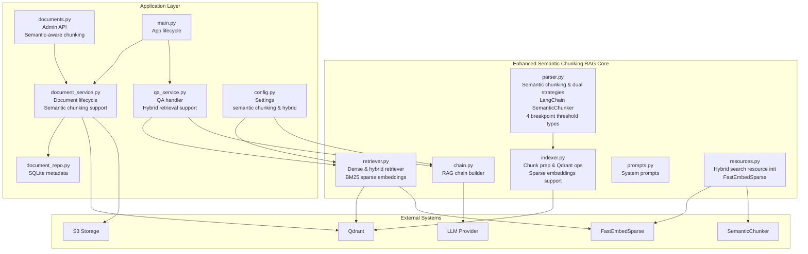

**Diagram sources**
- [parser.py:16-174](file://app/rag/parser.py#L16-L174)
- [indexer.py:49-71](file://app/rag/indexer.py#L49-L71)
- [retriever.py:88-160](file://app/rag/retriever.py#L88-L160)
- [chain.py:98-122](file://app/rag/chain.py#L98-L122)
- [prompts.py:1-19](file://app/rag/prompts.py#L1-L19)
- [resources.py:120-132](file://app/resources.py#L120-L132)
- [document_service.py:106-120](file://app/domain/document_service.py#L106-L120)
- [documents.py:154-163](file://app/api/documents.py#L154-L163)
- [qa_service.py:102-148](file://app/domain/qa_service.py#L102-L148)
- [config.py:54-62](file://app/config.py#L54-L62)
- [main.py:29-38](file://app/main.py#L29-L38)

**Section sources**
- [parser.py:16-174](file://app/rag/parser.py#L16-L174)
- [indexer.py:49-71](file://app/rag/indexer.py#L49-L71)
- [retriever.py:88-160](file://app/rag/retriever.py#L88-L160)
- [chain.py:98-122](file://app/rag/chain.py#L98-L122)
- [prompts.py:1-19](file://app/rag/prompts.py#L1-L19)
- [resources.py:120-132](file://app/resources.py#L120-L132)
- [document_service.py:106-120](file://app/domain/document_service.py#L106-L120)
- [documents.py:154-163](file://app/api/documents.py#L154-L163)
- [qa_service.py:102-148](file://app/domain/qa_service.py#L102-L148)
- [config.py:54-62](file://app/config.py#L54-L62)
- [main.py:29-38](file://app/main.py#L29-L38)

## Core Components
This section outlines the primary components of the RAG Parser Enhancement with semantic chunking capabilities, hybrid search support, and comprehensive testing infrastructure.

- **Semantic Chunking Parser and Dual Strategy Engine**
  - Implements dual chunking strategies: 'recursive' (token-based) and 'semantic' (embedding-based)
  - Integrates LangChain's SemanticChunker for intelligent semantic boundary detection
  - Supports four breakpoint threshold types: 'percentile', 'standard_deviation', 'interquartile', 'gradient'
  - Configurable breakpoint threshold amounts with default 95th percentile setting
  - Extracts text from both .docx and .doc files with semantic-aware processing
  - .docx files: Structured section extraction with semantic chunking preserving heading relationships
  - .doc files: Legacy format processing with semantic chunking treating entire text as single section
  - **Enhanced**: Semantic chunking with configurable breakpoint thresholds for optimal chunk boundaries
  - Returns LangChain Document objects with semantic-aware metadata and chunk positioning

- **Hybrid Search Retriever with Sparse Embeddings**
  - Supports both dense vector retrieval and hybrid dense-sparse retrieval modes
  - Integrates FastEmbedSparse for BM25 keyword matching alongside dense vector embeddings
  - Configurable retrieval modes: 'dense' (vector-only) and 'hybrid' (dense + sparse)
  - Automatic sparse embedding initialization when hybrid mode is enabled
  - Graceful fallback to dense-only retrieval when sparse embeddings are unavailable
  - Maintains backward compatibility with existing dense retrieval workflows

- **Enhanced Indexer with Sparse Embedding Support**
  - Extends chunk preparation to support sparse embeddings alongside dense vectors
  - Passes sparse_embedding parameter through to QdrantVectorStore constructor
  - Maintains consistency between dense and sparse embedding indexing operations
  - Supports hybrid indexing workflows with both embedding types

- **Resource Management with Hybrid Search Integration**
  - Initializes sparse embeddings automatically when hybrid search mode is enabled
  - Graceful degradation when sparse embedding dependencies are unavailable
  - Integrates FastEmbedSparse model initialization with configurable model names
  - Supports both automatic and manual sparse embedding configuration

- **Configuration System with Semantic and Hybrid Capabilities**
  - Centralized Settings class with semantic chunking parameters
  - Default chunk_strategy set to 'recursive' for backward compatibility
  - Semantic breakpoint threshold configuration with four supported types
  - Hybrid retrieval mode configuration with sparse embedding model specification
  - Retrieval mode selection between 'dense' and 'hybrid' operations

**Section sources**
- [parser.py:58-174](file://app/rag/parser.py#L58-L174)
- [parser.py:177-266](file://app/rag/parser.py#L177-L266)
- [retriever.py:88-160](file://app/rag/retriever.py#L88-L160)
- [indexer.py:49-71](file://app/rag/indexer.py#L49-L71)
- [resources.py:120-132](file://app/resources.py#L120-L132)
- [config.py:54-62](file://app/config.py#L54-L62)

## Architecture Overview
The RAG Parser Enhancement integrates semantic chunking, hybrid search capabilities, and dual retrieval strategies into a comprehensive pipeline with enhanced chunking accuracy and flexible retrieval modes. The system now supports both traditional token-based chunking and intelligent semantic chunking, with optional hybrid search combining dense vector similarity with sparse BM25 keyword matching for superior retrieval performance.

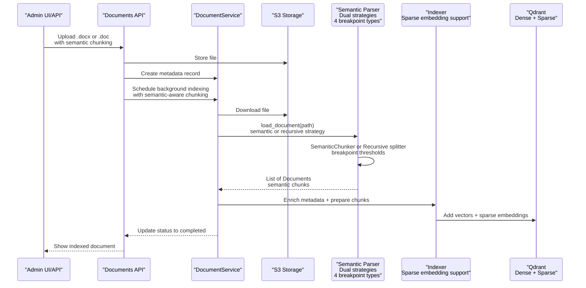

**Diagram sources**
- [documents.py:154-163](file://app/api/documents.py#L154-L163)
- [document_service.py:106-120](file://app/domain/document_service.py#L106-L120)
- [parser.py:134-140](file://app/rag/parser.py#L134-L140)
- [indexer.py:65-71](file://app/rag/indexer.py#L65-L71)

**Section sources**
- [documents.py:154-163](file://app/api/documents.py#L154-L163)
- [document_service.py:106-120](file://app/domain/document_service.py#L106-L120)
- [ingest.py:49-155](file://scripts/ingest.py#L49-L155)

## Detailed Component Analysis

### Semantic Chunking System with Multiple Strategies
The parser now features a sophisticated dual-strategy chunking system supporting both traditional token-based chunking and intelligent semantic chunking. The semantic chunking leverages LangChain's SemanticChunker with configurable breakpoint thresholds for optimal chunk boundaries based on semantic similarity.

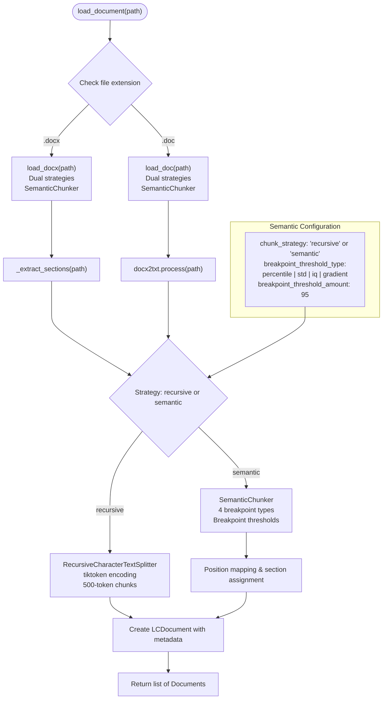

**Diagram sources**
- [parser.py:270-323](file://app/rag/parser.py#L270-L323)
- [parser.py:58-174](file://app/rag/parser.py#L58-L174)
- [parser.py:177-266](file://app/rag/parser.py#L177-L266)
- [config.py:54-57](file://app/config.py#L54-L57)

**Section sources**
- [parser.py:270-323](file://app/rag/parser.py#L270-L323)
- [parser.py:58-174](file://app/rag/parser.py#L58-L174)
- [parser.py:177-266](file://app/rag/parser.py#L177-L266)
- [config.py:54-57](file://app/config.py#L54-L57)

### Semantic Chunking with LangChain SemanticChunker
The semantic chunking functionality integrates LangChain's SemanticChunker for intelligent boundary detection based on embedding similarity. This approach identifies natural semantic boundaries rather than relying solely on structural markers or fixed token counts.

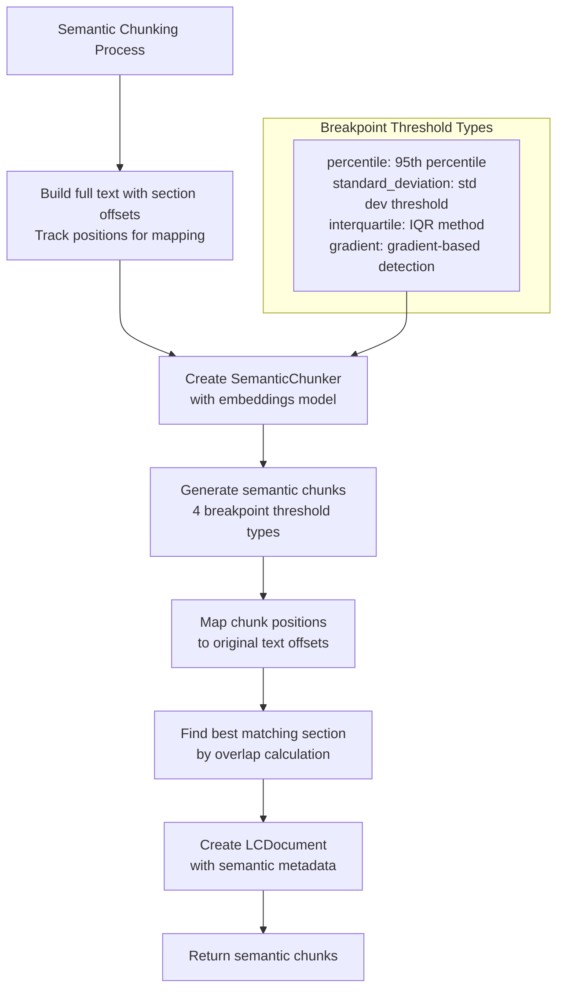

**Diagram sources**
- [parser.py:115-172](file://app/rag/parser.py#L115-L172)
- [parser.py:240-264](file://app/rag/parser.py#L240-L264)

**Section sources**
- [parser.py:115-172](file://app/rag/parser.py#L115-L172)
- [parser.py:240-264](file://app/rag/parser.py#L240-L264)

### Hybrid Search Architecture with Sparse Embeddings
The retriever system now supports hybrid dense-sparse retrieval combining vector similarity with BM25 keyword matching. This dual approach leverages both semantic understanding and lexical matching for superior search results.

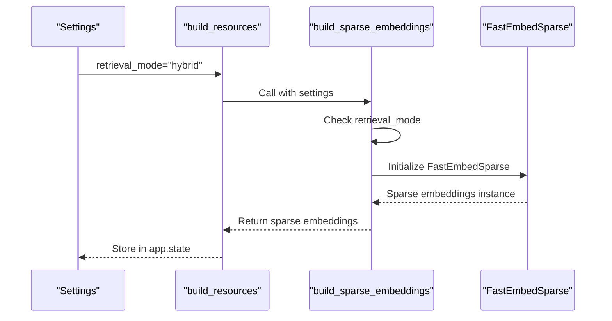

**Diagram sources**
- [retriever.py:88-103](file://app/rag/retriever.py#L88-L103)
- [resources.py:120-132](file://app/resources.py#L120-L132)
- [config.py:59-62](file://app/config.py#L59-L62)

**Section sources**
- [retriever.py:88-103](file://app/rag/retriever.py#L88-L103)
- [resources.py:120-132](file://app/resources.py#L120-L132)
- [config.py:59-62](file://app/config.py#L59-L62)

### Sparse Embeddings Integration for BM25 Keyword Matching
The system integrates FastEmbedSparse for efficient BM25 keyword matching alongside dense vector embeddings. This enables keyword-based relevance scoring in addition to semantic similarity.

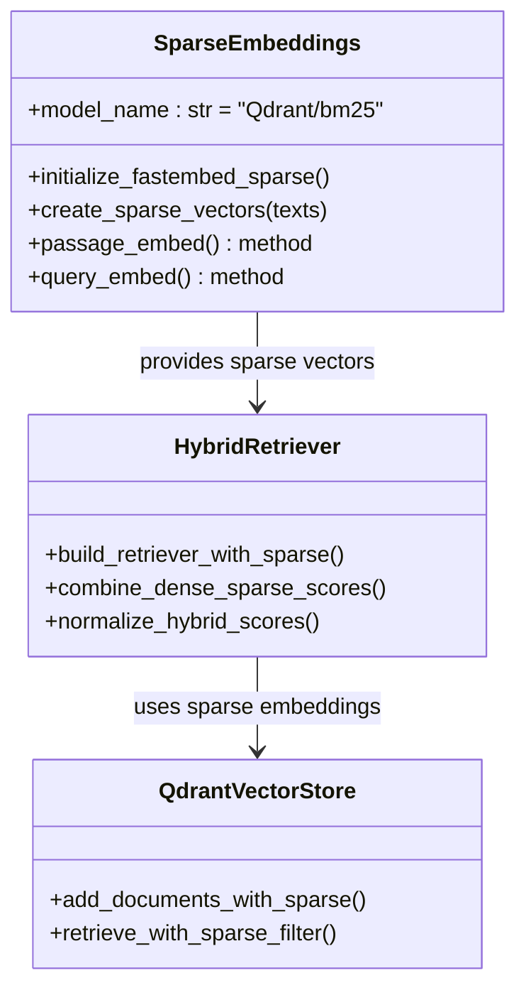

**Diagram sources**
- [retriever.py:88-121](file://app/rag/retriever.py#L88-L121)
- [indexer.py:65-71](file://app/rag/indexer.py#L65-L71)

**Section sources**
- [retriever.py:88-121](file://app/rag/retriever.py#L88-L121)
- [indexer.py:65-71](file://app/rag/indexer.py#L65-L71)

### Enhanced Configuration System for Semantic and Hybrid Features
The Settings class now includes comprehensive configuration for semantic chunking and hybrid retrieval modes, providing centralized control over all new functionality.

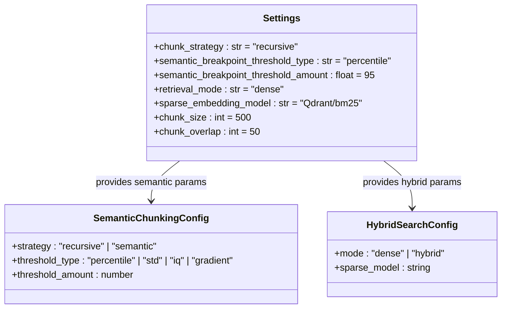

**Diagram sources**
- [config.py:54-62](file://app/config.py#L54-L62)

**Section sources**
- [config.py:54-62](file://app/config.py#L54-L62)

### Semantic Chunking Test Coverage and Validation
The testing infrastructure includes comprehensive validation for semantic chunking functionality, ensuring reliable operation across different document types and chunking strategies.

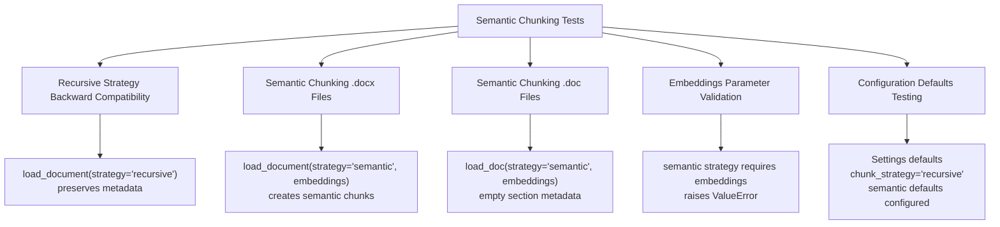

**Diagram sources**
- [test_semantic_chunker.py:94-237](file://tests/test_semantic_chunker.py#L94-L237)

**Section sources**
- [test_semantic_chunker.py:94-237](file://tests/test_semantic_chunker.py#L94-L237)

### Hybrid Search Testing and Validation
The hybrid search functionality includes comprehensive testing for sparse embeddings initialization, vector store integration, and retrieval mode switching.

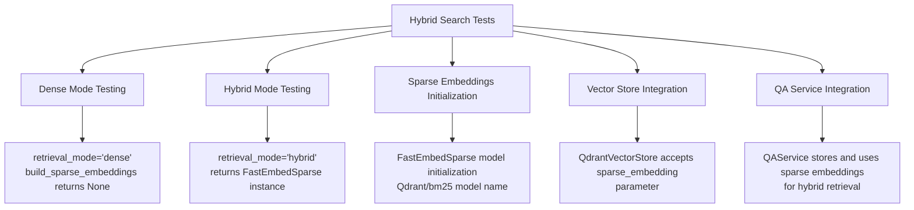

**Diagram sources**
- [test_hybrid_search.py:17-169](file://tests/test_hybrid_search.py#L17-L169)

**Section sources**
- [test_hybrid_search.py:17-169](file://tests/test_hybrid_search.py#L17-L169)

### Document Lifecycle Service with Semantic Chunking Support
The DocumentService now supports semantic chunking through enhanced indexing operations that handle both dense and sparse embedding indexing workflows.

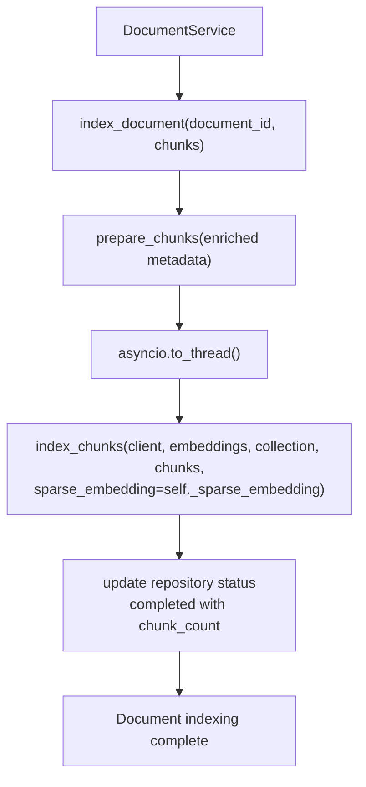

**Diagram sources**
- [document_service.py:106-120](file://app/domain/document_service.py#L106-L120)

**Section sources**
- [document_service.py:106-120](file://app/domain/document_service.py#L106-L120)

### Admin Upload Flow with Semantic Chunking Options
The admin upload flow now supports semantic chunking strategies with configurable breakpoint thresholds, providing users with flexible document processing options.

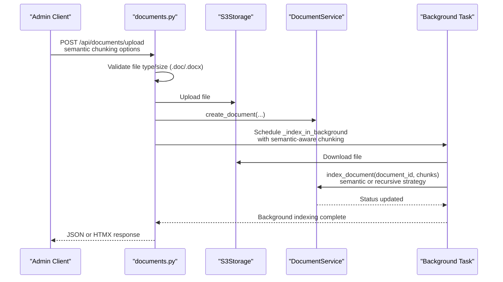

**Diagram sources**
- [documents.py:154-163](file://app/api/documents.py#L154-L163)

**Section sources**
- [documents.py:154-163](file://app/api/documents.py#L154-L163)

## Dependency Analysis
The RAG Parser Enhancement exhibits enhanced dependency management with new semantic chunking and hybrid search capabilities while maintaining backward compatibility. The system now integrates LangChain Experimental for semantic chunking and FastEmbed for sparse embeddings, with graceful fallback mechanisms for optional dependencies.

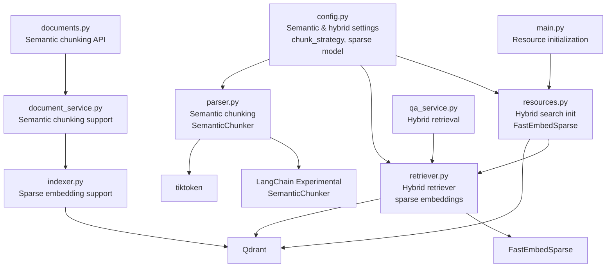

**Diagram sources**
- [config.py:54-62](file://app/config.py#L54-L62)
- [resources.py:120-132](file://app/resources.py#L120-L132)
- [retriever.py:88-160](file://app/rag/retriever.py#L88-L160)
- [parser.py:16-17](file://app/rag/parser.py#L16-L17)
- [indexer.py:65-71](file://app/rag/indexer.py#L65-L71)
- [document_service.py:106-120](file://app/domain/document_service.py#L106-L120)
- [documents.py:154-163](file://app/api/documents.py#L154-L163)
- [qa_service.py:102-148](file://app/domain/qa_service.py#L102-L148)
- [main.py:29-38](file://app/main.py#L29-L38)

**Section sources**
- [config.py:54-62](file://app/config.py#L54-L62)
- [resources.py:120-132](file://app/resources.py#L120-L132)
- [retriever.py:88-160](file://app/rag/retriever.py#L88-L160)
- [parser.py:16-17](file://app/rag/parser.py#L16-L17)
- [indexer.py:65-71](file://app/rag/indexer.py#L65-L71)
- [document_service.py:106-120](file://app/domain/document_service.py#L106-L120)
- [documents.py:154-163](file://app/api/documents.py#L154-L163)
- [qa_service.py:102-148](file://app/domain/qa_service.py#L102-L148)
- [main.py:29-38](file://app/main.py#L29-L38)

## Performance Considerations
- **Enhanced Semantic Chunking Strategy**
  - The parser now supports dual chunking strategies with intelligent semantic boundary detection using LangChain's SemanticChunker
  - Four breakpoint threshold types provide flexibility for different document characteristics: percentile (default 95%), standard deviation, interquartile, and gradient-based detection
  - Semantic chunking requires embedding model initialization, adding computational overhead but improving semantic coherence
  - Breakpoint threshold configuration allows tuning chunk granularity based on document complexity and retrieval requirements
  - Legacy .doc files benefit from semantic chunking despite lacking structured headings, with empty section metadata for uniform processing
- **Hybrid Search Performance Optimization**
  - Sparse embeddings add minimal overhead compared to dense embeddings while providing complementary keyword matching capabilities
  - FastEmbedSparse offers efficient BM25 implementation with configurable model selection
  - Hybrid retrieval combines dense and sparse scores with configurable weighting strategies
  - Automatic fallback to dense-only retrieval when sparse embeddings are unavailable prevents performance degradation
- **Provider Selection and Resource Management**
  - Embedding and LLM providers impact both semantic chunking performance and hybrid search capabilities
  - Choose providers aligned with deployment constraints and enable caching where supported for semantic chunking operations
  - Monitor resource usage during semantic chunking as it requires additional computational resources for embedding calculations
- **Batch Processing and Memory Management**
  - Batch ingestion (scripts/ingest.py) supports both semantic and recursive strategies with configurable parameters
  - Admin uploads leverage background tasks with semantic-aware chunking parameters and breakpoint thresholds
  - Memory considerations for semantic chunking include embedding model loading and breakpoint threshold calculations
  - Consider chunk size adjustments when using semantic chunking to balance semantic coherence with computational efficiency
- **Vector Store and Hybrid Indexing**
  - Qdrant filtering excludes non-searchable chunks efficiently in both dense and hybrid modes
  - Sparse embedding indexing requires additional storage space but enables keyword-based retrieval capabilities
  - Collection indices should account for both dense and sparse embedding dimensions in hybrid configurations
  - Monitor query performance differences between dense-only and hybrid retrieval modes for optimal configuration

## Troubleshooting Guide
Common issues and resolutions for the enhanced RAG system:

- **Missing Semantic Chunking Dependencies**
  - The system requires langchain-experimental for SemanticChunker functionality. Ensure `langchain-experimental>=0.3.0` is installed as part of project dependencies.
  - Semantic chunking raises ImportError if LangChain Experimental is not available during initialization.
- **Missing Hybrid Search Dependencies**
  - Hybrid search requires fastembed for sparse embeddings. Install the 'hybrid' extra: `uv sync --extra hybrid`
  - FastEmbedSparse import failures trigger ImportError with guidance for installing hybrid dependencies.
  - Sparse embeddings initialization gracefully falls back to dense-only retrieval when dependencies are unavailable.
- **Semantic Chunking Configuration Issues**
  - Invalid chunk_strategy values raise ValueError in parser functions. Use 'recursive' or 'semantic' only.
  - Missing embeddings parameter for semantic strategy raises ValueError with clear error message.
  - Breakpoint threshold type validation ensures only supported types are used: 'percentile', 'standard_deviation', 'interquartile', 'gradient'.
  - Breakpoint threshold amount validation prevents invalid numeric values outside expected ranges.
- **Hybrid Search Mode Configuration**
  - retrieval_mode must be 'dense' or 'hybrid'. Invalid values fall back to dense mode.
  - sparse_embedding_model configuration affects FastEmbedSparse initialization and model availability.
  - Sparse embedding initialization failures log warnings and disable hybrid mode gracefully.
- **Resource Initialization Failures**
  - Qdrant client initialization failures prevent semantic chunking and hybrid search functionality.
  - Embeddings model initialization errors affect both chunking strategies and retrieval operations.
  - Resource cleanup handles partial initialization failures without blocking application shutdown.
- **Performance and Memory Issues**
  - Semantic chunking requires additional memory for embedding model loading and breakpoint calculations.
  - Large documents with semantic chunking may require increased memory allocation for embedding computations.
  - Monitor chunk count growth when switching from recursive to semantic chunking as semantic boundaries may create more chunks.
- **Backward Compatibility**
  - Default chunk_strategy remains 'recursive' to maintain backward compatibility with existing deployments.
  - Legacy .doc files automatically use semantic chunking when strategy is 'semantic' with empty section metadata.
  - Existing API endpoints continue to work with semantic chunking parameters passed through configuration.

**Section sources**
- [retriever.py:88-103](file://app/rag/retriever.py#L88-L103)
- [parser.py:115-118](file://app/rag/parser.py#L115-L118)
- [parser.py:240-242](file://app/rag/parser.py#L240-L242)
- [config.py:54-62](file://app/config.py#L54-L62)
- [resources.py:120-132](file://app/resources.py#L120-L132)

## Conclusion
The RAG Parser Enhancement delivers a comprehensive, production-ready pipeline for processing HR documents with advanced semantic understanding and hybrid search capabilities. By implementing dual chunking strategies (recursive and semantic) with configurable breakpoint thresholds, integrating LangChain's SemanticChunker for intelligent boundary detection, supporting hybrid dense-sparse retrieval with BM25 keyword matching, and providing robust configuration management, the system significantly enhances document processing accuracy and retrieval performance. The modular architecture with graceful fallback mechanisms ensures backward compatibility while enabling cutting-edge retrieval capabilities. The enhanced testing infrastructure validates both semantic chunking functionality and hybrid search operations, while the centralized configuration system provides fine-grained control over chunking strategies and retrieval modes. The system's ability to automatically initialize sparse embeddings for hybrid search, combined with comprehensive error handling and resource management, makes it suitable for enterprise-scale document processing with superior semantic understanding and flexible retrieval options.