# RAG Parser Enhancement

<cite>
**Referenced Files in This Document**
- [parser.py](file://app/rag/parser.py)
- [indexer.py](file://app/rag/indexer.py)
- [retriever.py](file://app/rag/retriever.py)
- [chain.py](file://app/rag/chain.py)
- [prompts.py](file://app/rag/prompts.py)
- [colbert_embeddings.py](file://app/rag/colbert_embeddings.py)
- [document_service.py](file://app/domain/document_service.py)
- [document_repo.py](file://app/storage/document_repo.py)
- [config.py](file://app/config.py)
- [documents.py](file://app/api/documents.py)
- [documents_upload.py](file://app/api/documents_upload.py)
- [qa_service.py](file://app/domain/qa_service.py)
- [main.py](file://app/main.py)
- [resources.py](file://app/resources.py)
- [test_parser.py](file://tests/test_parser.py)
- [test_semantic_chunker.py](file://tests/test_semantic_chunker.py)
- [test_hybrid_search.py](file://tests/test_hybrid_search.py)
- [test_hybrid_rerank_retriever.py](file://tests/test_hybrid_rerank_retriever.py)
- [test_colbert_embeddings.py](file://tests/test_colbert_embeddings.py)
- [test_indexer.py](file://tests/test_indexer.py)
- [pyproject.toml](file://pyproject.toml)
</cite>

## Update Summary
**Changes Made**
- Updated parser documentation to clarify exclusive usage by admin upload flow and DocumentService
- Removed references to ingest script functionality as it no longer exists in the codebase
- Enhanced admin upload flow documentation to show explicit parser integration
- Updated architecture diagrams to reflect the exclusive admin upload flow usage pattern

## Table of Contents
1. [Introduction](#introduction)
2. [Project Structure](#project-structure)
3. [Core Components](#core-components)
4. [Architecture Overview](#architecture-overview)
5. [Detailed Component Analysis](#detailed-component-analysis)
6. [Dependency Analysis](#dependency-analysis)
7. [Performance Considerations](#performance-considerations)
8. [Troubleshooting Guide](#troubleshooting-guide)
9. [Conclusion](#conclusion)

## Introduction
This document describes the RAG (Retrieval-Augmented Generation) Parser Enhancement for the Cafetera HR Bot. The enhancement significantly expands document processing capabilities by implementing advanced chunking strategies including semantic chunking with LangChain's SemanticChunker, enhanced configuration options for breakpoint thresholds, comprehensive Excel (.xlsx) spreadsheet support, and most importantly, **exclusive integration with the admin upload flow**. The system now features dual chunking strategies ('recursive' and 'semantic'), Excel spreadsheet processing with structured text extraction, comprehensive test coverage for new functionality, and robust integration with Qdrant vector storage supporting named vector spaces (dense, bm25, colbert) with prefetch-based hybrid search and ColBERT late-interaction reranking. The enhancement maintains backward compatibility while providing superior text segmentation accuracy, improved retrieval performance through semantic understanding, enhanced search capabilities through hybrid dense-sparse retrieval modes, expanded document format support for HR-related spreadsheet data, and state-of-the-art ColBERT reranking for superior ranking quality.

**Updated** The parser is now exclusively used by the admin upload flow and DocumentService for processing uploaded documents, replacing any previous standalone usage patterns.

## Project Structure
The RAG system is organized into cohesive modules with enhanced semantic chunking capabilities, hybrid search support, comprehensive Excel processing, ColBERT reranking integration, and comprehensive testing infrastructure:
- app/rag: Core RAG components with semantic chunking, Excel processing, hybrid search, and ColBERT reranking (parser, indexer, retriever, chain, prompts, colbert_embeddings)
- app/domain: Business services orchestrating document lifecycle with enhanced chunking strategies, Excel processing, and ColBERT integration
- app/storage: Metadata persistence and S3 integration
- app/api: Admin endpoints for document management with semantic-aware processing, Excel upload support, and ColBERT configuration
- app/config: Environment-driven configuration with semantic chunking, hybrid retrieval parameters, ColBERT reranking settings, and Excel processing options
- app/resources: Resource management with hybrid search capability initialization, ColBERT embedding setup, and named vector space configuration
- tests: Comprehensive unit and integration tests for semantic chunking, hybrid search, ColBERT reranking, and Excel processing functionality

```mermaid
graph TB
subgraph "Enhanced Semantic Chunking RAG Core"
P["parser.py<br/>Semantic chunking & dual strategies<br/>Excel support<br/>Hierarchical headings<br/>Table atomic chunks<br/>4 breakpoint threshold types<br/>Used by admin upload flow"]
I["indexer.py<br/>Chunk prep & Qdrant ops<br/>Named vector spaces<br/>ColBERT multivector support"]
R["retriever.py<br/>Dense & hybrid retriever<br/>BM25 sparse embeddings<br/>ColBERT reranking<br/>Prefetch optimization"]
C["chain.py<br/>RAG chain builder"]
PR["prompts.py<br/>System prompts"]
CE["colbert_embeddings.py<br/>ColBERT adapter<br/>Per-token embeddings<br/>Late interaction scoring"]
RES["resources.py<br/>Hybrid search resource init<br/>FastEmbedSparse<br/>Named vector spaces"]
end
subgraph "Application Layer"
DS["document_service.py<br/>Document lifecycle<br/>Semantic chunking & Excel support<br/>ColBERT integration"]
DR["document_repo.py<br/>SQLite metadata"]
API["documents.py<br/>Admin API<br/>Semantic-aware chunking & Excel upload<br/>ColBERT configuration"]
UPLOAD["documents_upload.py<br/>Admin upload flow<br/>Parser integration<br/>Background indexing"]
QA["qa_service.py<br/>QA handler<br/>Hybrid retrieval & ColBERT<br/>Document-scoped chains"]
CFG["config.py<br/>Settings<br/>semantic chunking & hybrid<br/>ColBERT reranking settings"]
MAIN["main.py<br/>App lifecycle"]
end
subgraph "External Systems"
QD["Qdrant<br/>Named vector spaces<br/>ColBERT multivector<br/>Prefetch optimization"]
S3["S3 Storage"]
LLM["LLM Provider"]
SEM["SemanticChunker"]
FE["FastEmbedSparse"]
OPX["openpyxl"]
COL["ColBERT Adapter<br/>Per-token embeddings<br/>Late interaction"]
END
P --> I
I --> QD
R --> QD
R --> FE
R --> CE
C --> LLM
API --> DS
UPLOAD --> P
DS --> DR
DS --> QD
DS --> S3
QA --> R
QA --> C
RES --> FE
RES --> SEM
RES --> OPX
RES --> CE
MAIN --> DS
MAIN --> QA
CFG --> R
CFG --> C
CFG --> CE
```

**Diagram sources**
- [parser.py:1-6](file://app/rag/parser.py#L1-L6)
- [parser.py:16-174](file://app/rag/parser.py#L16-L174)
- [parser.py:273-407](file://app/rag/parser.py#L273-L407)
- [indexer.py:49-71](file://app/rag/indexer.py#L49-L71)
- [retriever.py:88-160](file://app/rag/retriever.py#L88-L160)
- [chain.py:98-122](file://app/rag/chain.py#L98-L122)
- [prompts.py:1-19](file://app/rag/prompts.py#L1-L19)
- [colbert_embeddings.py:19-81](file://app/rag/colbert_embeddings.py#L19-L81)
- [resources.py:120-132](file://app/resources.py#L120-L132)
- [document_service.py:106-120](file://app/domain/document_service.py#L106-L120)
- [documents.py:75-87](file://app/api/documents.py#L75-L87)
- [documents.py:154-163](file://app/api/documents.py#L154-L163)
- [documents_upload.py:74-121](file://app/api/documents_upload.py#L74-L121)
- [qa_service.py:102-148](file://app/domain/qa_service.py#L102-L148)
- [config.py:54-67](file://app/config.py#L54-L67)
- [main.py:29-38](file://app/main.py#L29-L38)

**Section sources**
- [parser.py:1-6](file://app/rag/parser.py#L1-L6)
- [parser.py:16-174](file://app/rag/parser.py#L16-L174)
- [parser.py:273-407](file://app/rag/parser.py#L273-L407)
- [indexer.py:49-71](file://app/rag/indexer.py#L49-L71)
- [retriever.py:88-160](file://app/rag/retriever.py#L88-L160)
- [chain.py:98-122](file://app/rag/chain.py#L98-L122)
- [prompts.py:1-19](file://app/rag/prompts.py#L1-L19)
- [colbert_embeddings.py:19-81](file://app/rag/colbert_embeddings.py#L19-L81)
- [resources.py:120-132](file://app/resources.py#L120-L132)
- [document_service.py:106-120](file://app/domain/document_service.py#L106-L120)
- [documents.py:75-87](file://app/api/documents.py#L75-L87)
- [documents.py:154-163](file://app/api/documents.py#L154-L163)
- [documents_upload.py:74-121](file://app/api/documents_upload.py#L74-L121)
- [qa_service.py:102-148](file://app/domain/qa_service.py#L102-L148)
- [config.py:54-67](file://app/config.py#L54-L67)
- [main.py:29-38](file://app/main.py#L29-L38)

## Core Components
This section outlines the primary components of the RAG Parser Enhancement with semantic chunking capabilities, hybrid search support, ColBERT reranking integration, Excel processing functionality, and comprehensive testing infrastructure.

- **Enhanced Semantic Chunking Parser and Dual Strategy Engine**
  - Implements dual chunking strategies: 'recursive' (token-based) and 'semantic' (embedding-based)
  - Integrates LangChain's SemanticChunker for intelligent semantic boundary detection
  - Supports four breakpoint threshold types: 'percentile', 'standard_deviation', 'interquartile', 'gradient'
  - Configurable breakpoint threshold amounts with default 95th percentile setting
  - Extracts text from .docx, .doc, and .xlsx files with semantic-aware processing
  - **Enhanced**: .docx files: Structured section extraction with semantic chunking preserving heading relationships, hierarchical heading levels, and breadcrumb path generation
  - **Enhanced**: .doc files: Legacy format processing with semantic chunking treating entire text as single section
  - **Enhanced**: .xlsx files: Worksheet-based structured text extraction with column header detection and preservation
  - **Enhanced**: Excel processing preserves tabular structure while enabling semantic chunking across worksheets
  - Returns LangChain Document objects with semantic-aware metadata and chunk positioning
  - **Exclusive Usage**: Now exclusively used by admin upload flow and DocumentService for processing uploaded documents

- **Hierarchical DOCX Parsing with Breadcrumb Path Generation**
  - **New Feature**: Comprehensive hierarchical heading level tracking with level-based navigation
  - **Breadcrumb Path Generation**: Creates hierarchical paths like "Heading1 > Heading2 > Heading3" for precise section identification
  - **Atomic Table Processing**: Tables are extracted as individual chunks with Markdown formatting to preserve structural integrity
  - **Section Metadata Integration**: Each chunk carries source filename, section heading, section level, and complete breadcrumb path
  - **Intelligent Section Mapping**: Semantic chunks are mapped back to their originating sections using overlap calculation
  - **Enhanced Table Formatting**: Tables converted to Markdown format with proper headers, separators, and data rows

- **Enhanced Excel Spreadsheet Processing Engine**
  - **New Feature**: Comprehensive .xlsx file support with structured text extraction
  - **Column Header Detection**: Automatically detects and preserves the first non-empty row as column headers
  - **Column Header Preservation**: Each chunk's content is prepended with the detected column headers for context
  - **Worksheet Processing**: Each worksheet becomes a separate section using sheet names as headings
  - **Column Preservation**: Row data formatted with ' | ' separators to maintain column structure
  - **Empty Row Handling**: Automatically skips completely empty rows during processing
  - **Multiple Sheet Support**: Processes all worksheets in a workbook independently
  - **Metadata Tracking**: Each chunk carries source filename, section (sheet name), and column headers metadata
  - **Chunking Integration**: Supports both recursive and semantic chunking strategies for Excel data
  - **Performance Optimization**: Uses read-only, data-only mode for efficient spreadsheet processing

- **Enhanced Hybrid Search Retriever with ColBERT Reranking Integration**
  - **New Feature**: AsyncHybridRerankRetriever with prefetch-based hybrid search and ColBERT late-interaction reranking
  - **Prefetch Optimization**: Executes dense and sparse retrieval concurrently using Qdrant's prefetch mechanism
  - **ColBERT Late-Interaction**: Performs reranking using per-token embeddings with MAX_SIM comparator
  - **Named Vector Spaces**: Supports dense, bm25, and colbert vector spaces with dedicated using parameters
  - **Multi-vector Scoring**: Qdrant's ColBERT multivector similarity scoring during reranking
  - **Graceful Fallback**: Falls back to standard hybrid retriever when ColBERT embeddings are unavailable
  - **Configurable Limits**: Separate prefetch_limit and rerank_limit settings for optimal performance

- **ColBERT Embedding Adapter for Late-Interaction Reranking**
  - **New Feature**: ColbertEmbeddingAdapter with per-token multivector embeddings
  - **Per-Token Embeddings**: Generates [num_tokens, dim] embedding matrices for ColBERT late-interaction
  - **FastEmbed Integration**: Uses fastembed.LateInteractionTextEmbedding for efficient per-token processing
  - **Dimension Caching**: Caches embedding dimension after first probe for performance optimization
  - **Graceful Degradation**: Returns None when ColBERT model is unavailable, falling back to dense+sparse
  - **Model Configuration**: Configurable model_name through settings.colbert_rerank_model

- **Enhanced Indexer with Named Vector Spaces Support**
  - **New Feature**: Named vector space configuration for dense, bm25, and colbert embeddings
  - **Legacy Compatibility**: Maintains backward compatibility with unnamed dense + text-sparse layout
  - **Multivector Configuration**: Proper MultiVectorConfig with MAX_SIM comparator for ColBERT
  - **Sparse Vector Support**: bm25 sparse vector configuration with IDF modifier
  - **Conditional Vector Layout**: Automatic selection between named and legacy vector layouts
  - **Qdrant Vector Parameters**: Proper vector parameter configuration for each embedding type

- **Enhanced Configuration System with ColBERT Reranking**
  - **New Feature**: Comprehensive reranking configuration with three new settings
  - **reranking_enabled**: Controls ColBERT reranking activation
  - **colbert_rerank_model**: Specifies ColBERT model identifier (default: "colbert-ir/colbertv2.0")
  - **colbert_prefetch_limit**: Sets prefetch limit for hybrid search (default: 20)
  - **colbert_rerank_limit**: Sets final result limit after ColBERT reranking (default: 10)
  - **Retrieval Mode Integration**: ColBERT reranking only active in hybrid mode
  - **Backward Compatibility**: Default settings maintain existing behavior

- **Resource Management with ColBERT Integration**
  - **New Feature**: Automatic ColBERT embedding initialization when reranking is enabled
  - **Graceful Degradation**: Falls back to dense+sparse when ColBERT is unavailable
  - **Model Loading**: Configurable ColBERT model name through settings
  - **Vector Space Creation**: Named vector spaces with proper Qdrant configuration
  - **Collection Initialization**: Automatic collection creation with appropriate vector parameters

**Section sources**
- [parser.py:58-174](file://app/rag/parser.py#L58-L174)
- [parser.py:177-266](file://app/rag/parser.py#L177-L266)
- [parser.py:273-407](file://app/rag/parser.py#L273-L407)
- [retriever.py:28-98](file://app/rag/retriever.py#L28-L98)
- [colbert_embeddings.py:19-121](file://app/rag/colbert_embeddings.py#L19-L121)
- [indexer.py:49-71](file://app/rag/indexer.py#L49-L71)
- [resources.py:89-132](file://app/resources.py#L89-L132)
- [config.py:62-67](file://app/config.py#L62-L67)

## Architecture Overview
The RAG Parser Enhancement integrates semantic chunking, hybrid search capabilities, ColBERT reranking integration, Excel processing functionality, and dual retrieval strategies into a comprehensive pipeline with enhanced chunking accuracy, prefetch-based hybrid search, and state-of-the-art ColBERT late-interaction reranking. The system now supports both traditional token-based chunking and intelligent semantic chunking, with optional hybrid search combining dense vector similarity with sparse BM25 keyword matching and ColBERT per-token reranking for superior retrieval performance, and comprehensive Excel spreadsheet processing for structured data extraction.

**Updated** The parser is now exclusively integrated into the admin upload flow, providing a streamlined document processing pipeline that processes uploaded files through the parser and into the DocumentService for indexing.

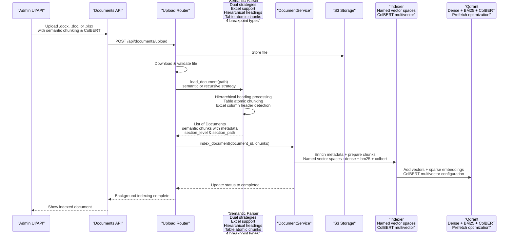

**Diagram sources**
- [documents.py:75-87](file://app/api/documents.py#L75-L87)
- [documents.py:154-163](file://app/api/documents.py#L154-L163)
- [documents_upload.py:173-292](file://app/api/documents_upload.py#L173-L292)
- [document_service.py:106-120](file://app/domain/document_service.py#L106-L120)
- [parser.py:411-475](file://app/rag/parser.py#L411-L475)
- [indexer.py:65-71](file://app/rag/indexer.py#L65-L71)

**Section sources**
- [documents.py:75-87](file://app/api/documents.py#L75-L87)
- [documents.py:154-163](file://app/api/documents.py#L154-L163)
- [documents_upload.py:173-292](file://app/api/documents_upload.py#L173-L292)
- [document_service.py:106-120](file://app/domain/document_service.py#L106-L120)
- [parser.py:411-475](file://app/rag/parser.py#L411-L475)
- [indexer.py:65-71](file://app/rag/indexer.py#L65-L71)

## Detailed Component Analysis

### Enhanced Semantic Chunking System with Hierarchical Metadata
The parser now features a sophisticated dual-strategy chunking system supporting both traditional token-based chunking and intelligent semantic chunking with comprehensive hierarchical metadata tracking. The semantic chunking leverages LangChain's SemanticChunker with configurable breakpoint thresholds for optimal chunk boundaries based on semantic similarity.

**Updated** The parser is now exclusively used by the admin upload flow and DocumentService, eliminating any standalone usage patterns.

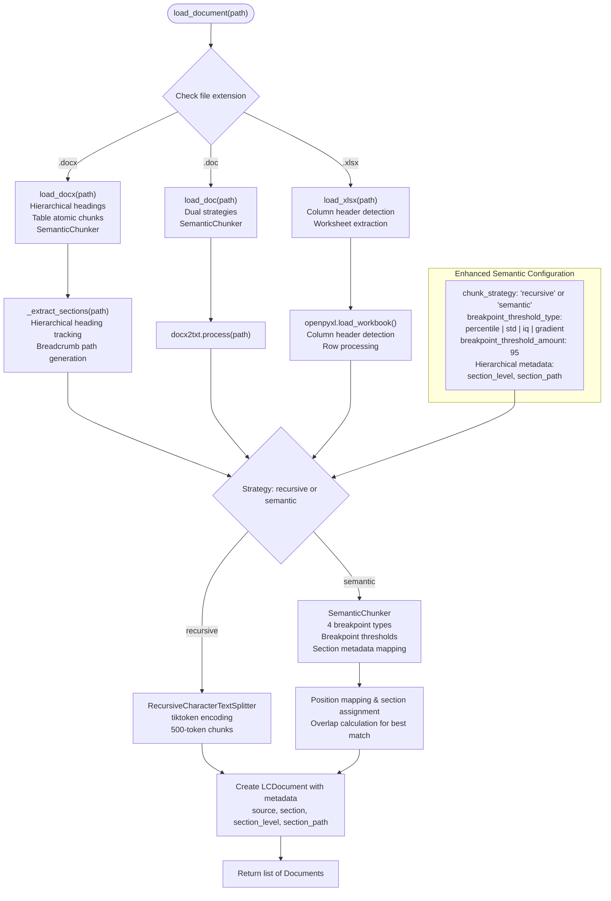

**Diagram sources**
- [parser.py:411-475](file://app/rag/parser.py#L411-L475)
- [parser.py:58-174](file://app/rag/parser.py#L58-L174)
- [parser.py:177-266](file://app/rag/parser.py#L177-L266)
- [parser.py:273-407](file://app/rag/parser.py#L273-L407)
- [config.py:54-57](file://app/config.py#L54-L57)

**Section sources**
- [parser.py:411-475](file://app/rag/parser.py#L411-L475)
- [parser.py:58-174](file://app/rag/parser.py#L58-L174)
- [parser.py:177-266](file://app/rag/parser.py#L177-L266)
- [parser.py:273-407](file://app/rag/parser.py#L273-L407)
- [config.py:54-57](file://app/config.py#L54-L57)

### Hierarchical DOCX Parsing with Breadcrumb Path Generation
The enhanced DOCX processing now includes comprehensive hierarchical heading level tracking and breadcrumb path generation for precise section identification and semantic understanding.

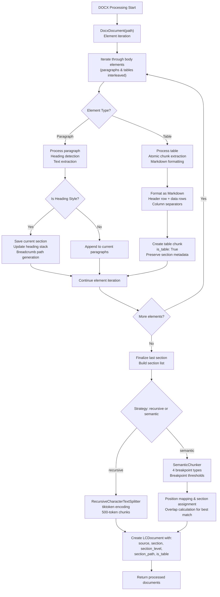

**Diagram sources**
- [parser.py:102-323](file://app/rag/parser.py#L102-L323)
- [parser.py:46-98](file://app/rag/parser.py#L46-L98)
- [parser.py:157-181](file://app/rag/parser.py#L157-L181)

**Section sources**
- [parser.py:102-323](file://app/rag/parser.py#L102-L323)
- [parser.py:46-98](file://app/rag/parser.py#L46-L98)
- [parser.py:157-181](file://app/rag/parser.py#L157-L181)

### Enhanced Excel Spreadsheet Processing Engine
The new Excel processing functionality enables comprehensive structured text extraction from spreadsheet files while preserving column relationships and metadata. This feature is essential for HR systems that frequently deal with tabular data such as employee records, payroll information, and organizational charts.

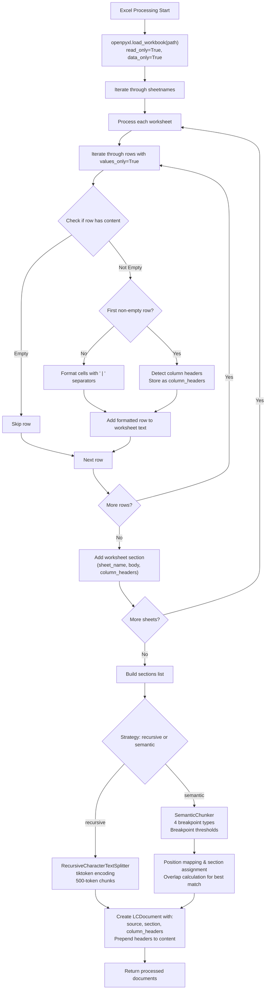

**Diagram sources**
- [parser.py:422-581](file://app/rag/parser.py#L422-L581)
- [parser.py:462-489](file://app/rag/parser.py#L462-L489)
- [parser.py:491-515](file://app/rag/parser.py#L491-L515)
- [parser.py:517-579](file://app/rag/parser.py#L517-L579)

**Section sources**
- [parser.py:422-581](file://app/rag/parser.py#L422-L581)
- [parser.py:462-489](file://app/rag/parser.py#L462-L489)
- [parser.py:491-515](file://app/rag/parser.py#L491-L515)
- [parser.py:517-579](file://app/rag/parser.py#L517-L579)

### Comprehensive Semantic Chunking with Section Metadata Integration
The semantic chunking functionality integrates LangChain's SemanticChunker for intelligent boundary detection based on embedding similarity. This approach identifies natural semantic boundaries rather than relying solely on structural markers or fixed token counts, with enhanced section metadata tracking.

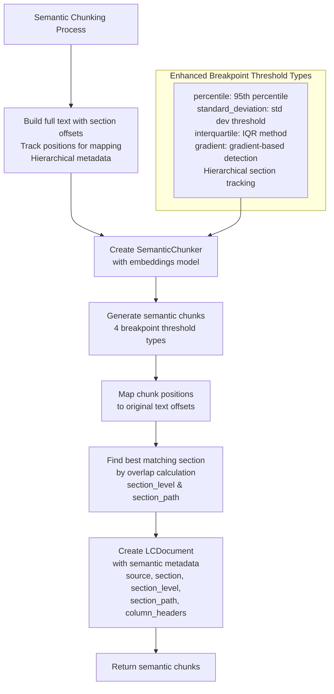

**Diagram sources**
- [parser.py:115-172](file://app/rag/parser.py#L115-L172)
- [parser.py:240-264](file://app/rag/parser.py#L240-L264)
- [parser.py:367-403](file://app/rag/parser.py#L367-L403)

**Section sources**
- [parser.py:115-172](file://app/rag/parser.py#L115-L172)
- [parser.py:240-264](file://app/rag/parser.py#L240-L264)
- [parser.py:367-403](file://app/rag/parser.py#L367-L403)

### Enhanced Hybrid Search Architecture with ColBERT Reranking Integration
The retriever system now supports hybrid dense-sparse retrieval with ColBERT late-interaction reranking, combining vector similarity with BM25 keyword matching and per-token semantic understanding for superior search results.

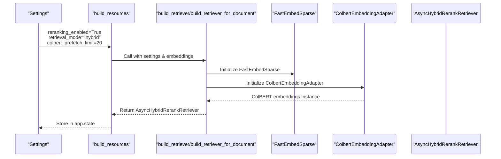

**Diagram sources**
- [retriever.py:273-328](file://app/rag/retriever.py#L273-L328)
- [resources.py:120-132](file://app/resources.py#L120-L132)
- [config.py:62-67](file://app/config.py#L62-L67)

**Section sources**
- [retriever.py:273-328](file://app/rag/retriever.py#L273-L328)
- [resources.py:120-132](file://app/resources.py#L120-L132)
- [config.py:62-67](file://app/config.py#L62-L67)

### ColBERT Embedding Adapter for Per-Token Multivector Embeddings
The ColBERT embedding adapter provides per-token embeddings required for Qdrant's ColBERT late-interaction reranking, generating [num_tokens, dim] embedding matrices for superior semantic understanding.

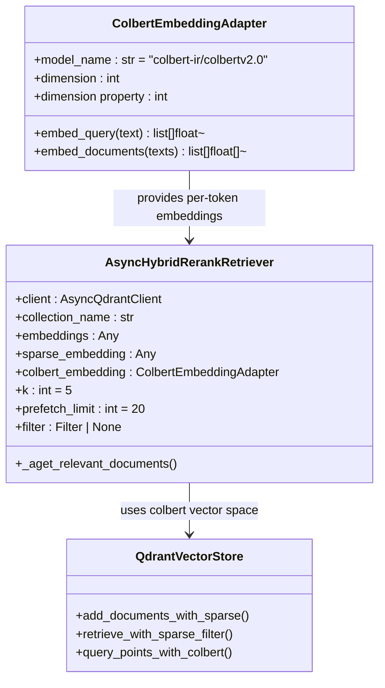

**Diagram sources**
- [colbert_embeddings.py:19-81](file://app/rag/colbert_embeddings.py#L19-L81)
- [retriever.py:28-98](file://app/rag/retriever.py#L28-L98)
- [indexer.py:97-126](file://app/rag/indexer.py#L97-L126)

**Section sources**
- [colbert_embeddings.py:19-81](file://app/rag/colbert_embeddings.py#L19-L81)
- [retriever.py:28-98](file://app/rag/retriever.py#L28-L98)
- [indexer.py:97-126](file://app/rag/indexer.py#L97-L126)

### Named Vector Spaces Implementation with Prefetch Optimization
The system now supports named vector spaces (dense, bm25, colbert) with prefetch-based hybrid search and ColBERT late-interaction reranking for superior retrieval performance.

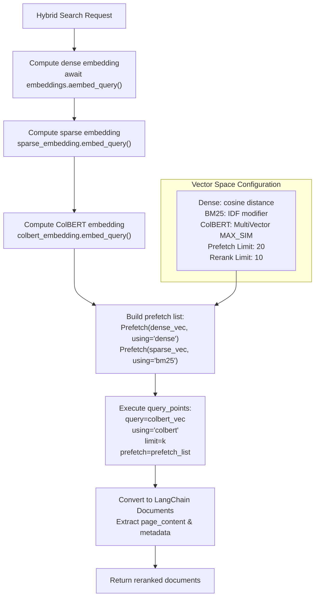

**Diagram sources**
- [retriever.py:47-92](file://app/rag/retriever.py#L47-L92)
- [resources.py:89-108](file://app/resources.py#L89-L108)
- [indexer.py:97-126](file://app/rag/indexer.py#L97-L126)

**Section sources**
- [retriever.py:47-92](file://app/rag/retriever.py#L47-L92)
- [resources.py:89-108](file://app/resources.py#L89-L108)
- [indexer.py:97-126](file://app/rag/indexer.py#L97-L126)

### Enhanced Configuration System for Semantic, Hybrid, and ColBERT Features
The Settings class now includes comprehensive configuration for semantic chunking, hybrid retrieval modes, and ColBERT reranking, providing centralized control over all new functionality.

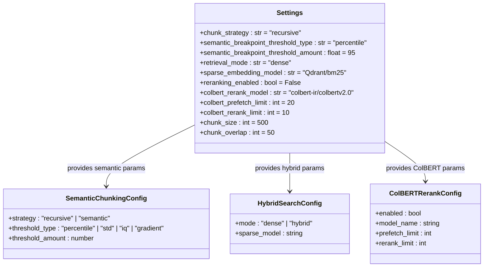

**Diagram sources**
- [config.py:54-67](file://app/config.py#L54-L67)

**Section sources**
- [config.py:54-67](file://app/config.py#L54-L67)

### Comprehensive Semantic Chunking Test Coverage and Validation
The testing infrastructure includes comprehensive validation for semantic chunking functionality, ColBERT reranking integration, and enhanced hierarchical metadata tracking.

```mermaid
flowchart TD
TestSuite["Enhanced Semantic Chunking Tests"] --> RecursiveCompat["Recursive Strategy Backward Compatibility"]
TestSuite --> SemanticDocx["Semantic Chunking .docx Files<br/>Hierarchical metadata"]
TestSuite --> SemanticDoc["Semantic Chunking .doc Files"]
TestSuite --> SemanticXlsx["Semantic Chunking .xlsx Files<br/>Column headers preserved"]
TestSuite --> EmbeddingsValidation["Embeddings Parameter Validation"]
TestSuite --> ConfigDefaults["Configuration Defaults Testing"]
TestSuite --> HeadingLevels["Hierarchical Heading Levels<br/>Breadcrumb Paths"]
TestSuite --> TableChunks["Table Atomic Chunking<br/>Markdown Formatting"]
TestSuite --> ColBERTRerank["ColBERT Reranking Integration<br/>Prefetch Optimization"]
TestSuite --> NamedVectors["Named Vector Spaces<br/>Dense + BM25 + ColBERT"]
RecursiveCompat --> Test1["load_document(strategy='recursive')<br/>preserves metadata"]
SemanticDocx --> Test2["load_docx(strategy='semantic', embeddings)<br/>creates semantic chunks<br/>section_level & section_path"]
SemanticDoc --> Test3["load_doc(strategy='semantic', embeddings)<br/>empty section metadata"]
SemanticXlsx --> Test4["load_xlsx(strategy='semantic', embeddings)<br/>worksheet-based semantic chunks<br/>column_headers prepended"]
EmbeddingsValidation --> Test5["semantic strategy requires embeddings<br/>raises ValueError"]
ConfigDefaults --> Test6["Settings defaults<br/>chunk_strategy='recursive'<br/>semantic defaults configured<br/>reranking_enabled=False"]
HeadingLevels --> Test7["Hierarchical heading levels<br/>Breadcrumb path generation"]
TableChunks --> Test8["Table atomic chunks<br/>Markdown formatting preserved"]
ColBERTRerank --> Test9["AsyncHybridRerankRetriever<br/>prefetch + colbert rerank"]
NamedVectors --> Test10["Named vector spaces<br/>dense + bm25 + colbert"]
```

**Diagram sources**
- [test_semantic_chunker.py:94-237](file://tests/test_semantic_chunker.py#L94-L237)
- [test_parser.py:254-361](file://tests/test_parser.py#L254-L361)
- [test_parser.py:366-462](file://tests/test_parser.py#L366-L462)
- [test_hybrid_rerank_retriever.py:40-94](file://tests/test_hybrid_rerank_retriever.py#L40-L94)
- [test_colbert_embeddings.py:19-87](file://tests/test_colbert_embeddings.py#L19-L87)

**Section sources**
- [test_semantic_chunker.py:94-237](file://tests/test_semantic_chunker.py#L94-L237)
- [test_parser.py:254-361](file://tests/test_parser.py#L254-L361)
- [test_parser.py:366-462](file://tests/test_parser.py#L366-L462)
- [test_hybrid_rerank_retriever.py:40-94](file://tests/test_hybrid_rerank_retriever.py#L40-L94)
- [test_colbert_embeddings.py:19-87](file://tests/test_colbert_embeddings.py#L19-L87)

### Hybrid Search Testing and Validation with ColBERT Integration
The hybrid search functionality includes comprehensive testing for sparse embeddings initialization, ColBERT reranking, vector store integration, and retrieval mode switching.

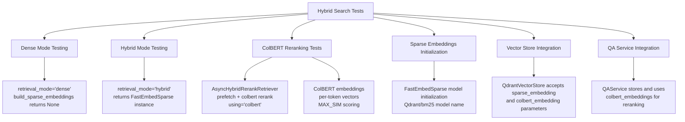

**Diagram sources**
- [test_hybrid_search.py:17-169](file://tests/test_hybrid_search.py#L17-L169)
- [test_hybrid_rerank_retriever.py:135-273](file://tests/test_hybrid_rerank_retriever.py#L135-L273)
- [test_colbert_embeddings.py:33-87](file://tests/test_colbert_embeddings.py#L33-L87)

**Section sources**
- [test_hybrid_search.py:17-169](file://tests/test_hybrid_search.py#L17-L169)
- [test_hybrid_rerank_retriever.py:135-273](file://tests/test_hybrid_rerank_retriever.py#L135-L273)
- [test_colbert_embeddings.py:33-87](file://tests/test_colbert_embeddings.py#L33-L87)

### Document Lifecycle Service with Enhanced Semantic Chunking Support
The DocumentService now supports semantic chunking through enhanced indexing operations that handle both dense and sparse embedding indexing workflows, including ColBERT embedding indexing with named vector spaces and Excel file processing with enhanced metadata tracking.

**Updated** The DocumentService exclusively uses the parser for document processing, eliminating any external usage patterns.

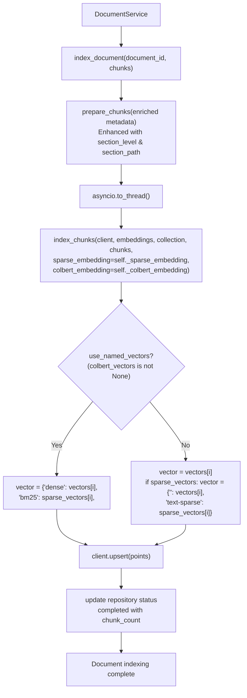

**Diagram sources**
- [document_service.py:106-120](file://app/domain/document_service.py#L106-L120)
- [indexer.py:97-134](file://app/rag/indexer.py#L97-L134)

**Section sources**
- [document_service.py:106-120](file://app/domain/document_service.py#L106-L120)
- [indexer.py:97-134](file://app/rag/indexer.py#L97-L134)

### Admin Upload Flow with Enhanced Excel Support and ColBERT Configuration
The admin upload flow now supports Excel spreadsheets alongside other document types, providing users with flexible document processing options including structured spreadsheet data with enhanced column header preservation and ColBERT reranking configuration.

**Updated** The admin upload flow now exclusively integrates the parser for document processing, providing a streamlined workflow from upload to indexing.

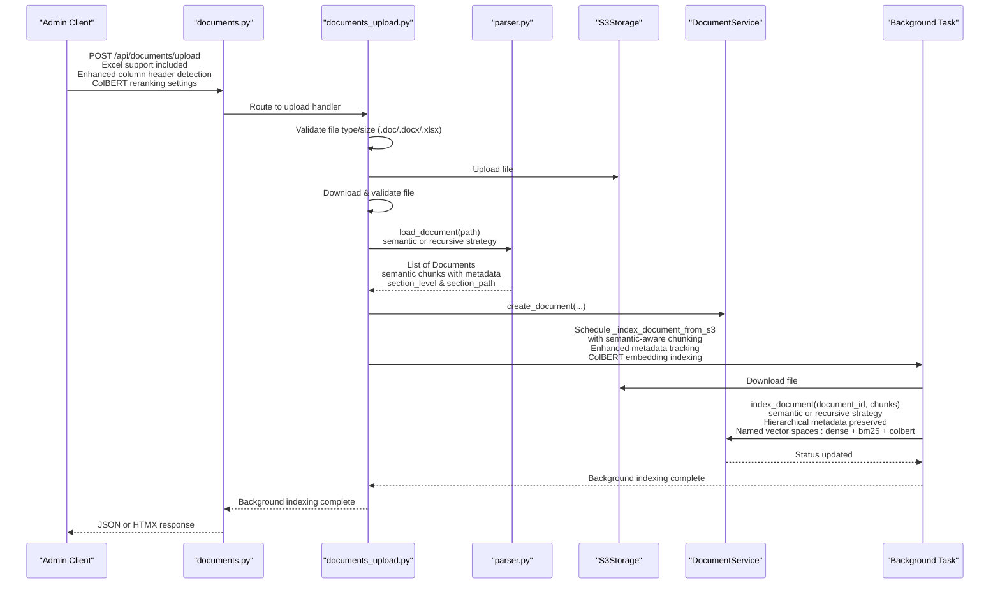

**Diagram sources**
- [documents.py:75-87](file://app/api/documents.py#L75-L87)
- [documents.py:154-163](file://app/api/documents.py#L154-L163)
- [documents_upload.py:173-292](file://app/api/documents_upload.py#L173-L292)
- [parser.py:411-475](file://app/rag/parser.py#L411-L475)

**Section sources**
- [documents.py:75-87](file://app/api/documents.py#L75-L87)
- [documents.py:154-163](file://app/api/documents.py#L154-L163)
- [documents_upload.py:173-292](file://app/api/documents_upload.py#L173-L292)
- [parser.py:411-475](file://app/rag/parser.py#L411-L475)

## Dependency Analysis
The RAG Parser Enhancement exhibits enhanced dependency management with new semantic chunking, hybrid search capabilities, ColBERT reranking integration, and Excel processing functionality while maintaining backward compatibility. The system now integrates LangChain Experimental for semantic chunking, FastEmbed for sparse embeddings and ColBERT reranking, and openpyxl for Excel processing, with graceful fallback mechanisms for optional dependencies.

**Updated** The parser dependency graph now reflects exclusive usage by the admin upload flow and DocumentService, eliminating any standalone usage patterns.

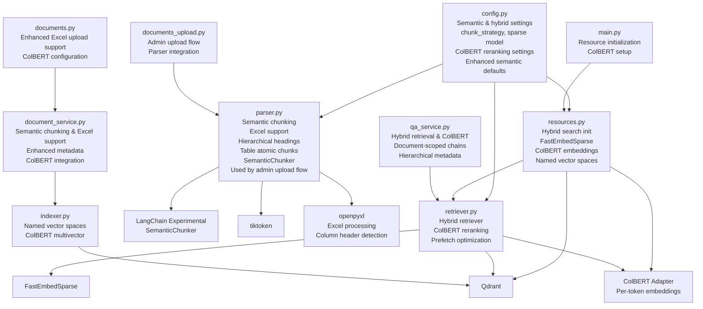

**Diagram sources**
- [config.py:54-67](file://app/config.py#L54-L67)
- [resources.py:120-132](file://app/resources.py#L120-L132)
- [retriever.py:88-160](file://app/rag/retriever.py#L88-L160)
- [parser.py:16-17](file://app/rag/parser.py#L16-L17)
- [parser.py:307](file://app/rag/parser.py#L307)
- [indexer.py:65-71](file://app/rag/indexer.py#L65-L71)
- [document_service.py:106-120](file://app/domain/document_service.py#L106-L120)
- [documents.py:75-87](file://app/api/documents.py#L75-L87)
- [documents_upload.py:74-121](file://app/api/documents_upload.py#L74-L121)
- [qa_service.py:102-148](file://app/domain/qa_service.py#L102-L148)
- [main.py:29-38](file://app/main.py#L29-L38)

**Section sources**
- [config.py:54-67](file://app/config.py#L54-L67)
- [resources.py:120-132](file://app/resources.py#L120-L132)
- [retriever.py:88-160](file://app/rag/retriever.py#L88-L160)
- [parser.py:16-17](file://app/rag/parser.py#L16-L17)
- [parser.py:307](file://app/rag/parser.py#L307)
- [indexer.py:65-71](file://app/rag/indexer.py#L65-L71)
- [document_service.py:106-120](file://app/domain/document_service.py#L106-L120)
- [documents.py:75-87](file://app/api/documents.py#L75-L87)
- [documents_upload.py:74-121](file://app/api/documents_upload.py#L74-L121)
- [qa_service.py:102-148](file://app/domain/qa_service.py#L102-L148)
- [main.py:29-38](file://app/main.py#L29-L38)

## Performance Considerations
- **Enhanced Semantic Chunking Strategy**
  - The parser now supports dual chunking strategies with intelligent semantic boundary detection using LangChain's SemanticChunker
  - Four breakpoint threshold types provide flexibility for different document characteristics: percentile (default 95%), standard deviation, interquartile, and gradient-based detection
  - Semantic chunking requires embedding model initialization, adding computational overhead but improving semantic coherence
  - Breakpoint threshold configuration allows tuning chunk granularity based on document complexity and retrieval requirements
  - Legacy .doc files benefit from semantic chunking despite lacking structured headings, with empty section metadata for uniform processing
  - **Enhanced**: Excel processing adds minimal overhead with efficient read-only workbook access and column header detection
  - **Enhanced**: Hierarchical DOCX processing with breadcrumb path generation adds moderate overhead for precise section tracking
  - **Enhanced**: Table atomic chunking preserves structural integrity with minimal performance impact
- **Enhanced DOCX Processing Performance Optimization**
  - Uses hierarchical heading tracking with efficient stack-based path generation
  - Table processing creates atomic chunks to avoid semantic splitting of structured content
  - Breadcrumb path generation optimized with lazy evaluation and minimal memory usage
  - Section metadata integration adds minimal overhead with efficient overlap calculation
  - Memory usage scales with document complexity and hierarchical depth
- **Excel Processing Performance Optimization**
  - Uses read-only, data-only mode for efficient workbook loading without formula calculations
  - Column data formatted with ' | ' separators for structured text extraction while maintaining performance
  - Empty row detection optimized to skip completely blank rows during iteration
  - Column header detection optimized to find first non-empty row efficiently
  - Multiple worksheet processing handled efficiently with independent section creation
  - Memory usage scales linearly with spreadsheet size and complexity
- **ColBERT Reranking Performance Optimization**
  - **New Feature**: Per-token embeddings generate [num_tokens, dim] matrices for ColBERT late-interaction
  - **New Feature**: Prefetch optimization executes dense and sparse retrieval concurrently, reducing total query time
  - **New Feature**: Named vector spaces with proper Qdrant configuration for efficient multivector operations
  - **New Feature**: Separate prefetch_limit and rerank_limit settings allow tuning for optimal performance
  - **New Feature**: ColBERT embeddings cached after first probe to avoid repeated model loading
  - **New Feature**: Graceful fallback to dense+sparse when ColBERT is unavailable
- **Hybrid Search Performance Optimization**
  - Sparse embeddings add minimal overhead compared to dense embeddings while providing complementary keyword matching capabilities
  - FastEmbedSparse offers efficient BM25 implementation with configurable model selection
  - Hybrid retrieval combines dense and sparse scores with configurable weighting strategies
  - Automatic fallback to dense-only retrieval when sparse embeddings are unavailable
- **Provider Selection and Resource Management**
  - Embedding and LLM providers impact both semantic chunking performance and hybrid search capabilities
  - Choose providers aligned with deployment constraints and enable caching where supported for semantic chunking operations
  - Monitor resource usage during semantic chunking as it requires additional computational resources for embedding calculations
  - Excel files processed efficiently with read-only access preventing memory leaks
  - Hierarchical metadata tracking requires additional memory proportional to document sections
  - ColBERT reranking requires additional computational resources for per-token embedding generation
  - Consider chunk size adjustments when using semantic chunking to balance semantic coherence with computational efficiency
- **Batch Processing and Memory Management**
  - **Updated** Admin uploads leverage background tasks with semantic-aware chunking parameters, breakpoint thresholds, and ColBERT embedding indexing
  - Memory considerations for semantic chunking include embedding model loading and breakpoint calculations
  - Excel files processed efficiently with read-only access preventing memory leaks
  - Hierarchical metadata tracking requires additional memory proportional to document sections
  - ColBERT per-token embeddings require additional memory proportional to token count and embedding dimension
  - Named vector spaces with ColBERT multivector configuration require additional storage space but enable superior ranking quality
- **Vector Store and Hybrid Indexing**
  - Qdrant filtering excludes non-searchable chunks efficiently in both dense and hybrid modes
  - Sparse embedding indexing requires additional storage space but enables keyword-based retrieval capabilities
  - ColBERT multivector indexing requires additional storage space with proper Qdrant configuration
  - Named vector spaces should account for dense, bm25, and colbert embedding dimensions in hybrid configurations
  - Monitor query performance differences between dense-only, hybrid, and ColBERT reranking modes for optimal configuration
  - Prefetch optimization reduces total query time by executing concurrent dense and sparse retrieval operations

## Troubleshooting Guide
Common issues and resolutions for the enhanced RAG system with ColBERT reranking integration:

- **Missing Semantic Chunking Dependencies**
  - The system requires langchain-experimental for SemanticChunker functionality. Ensure `langchain-experimental>=0.3.0` is installed as part of project dependencies.
  - Semantic chunking raises ImportError if LangChain Experimental is not available during initialization.
- **Missing Hybrid Search Dependencies**
  - Hybrid search requires fastembed for sparse embeddings. Install the 'hybrid' extra: `uv sync --extra hybrid`
  - FastEmbedSparse import failures trigger ImportError with guidance for installing hybrid dependencies.
  - Sparse embeddings initialization gracefully falls back to dense-only retrieval when dependencies are unavailable.
- **Missing ColBERT Reranking Dependencies**
  - **New Feature**: ColBERT reranking requires fastembed for per-token embeddings. Install the 'hybrid' extra: `uv sync --extra hybrid`
  - ColBERT embedding initialization raises ImportError if fastembed is not available during initialization.
  - ColBERT embeddings gracefully fall back to dense+sparse when ColBERT model is unavailable.
  - ColBERT model loading failures trigger ImportError with guidance for installing hybrid dependencies.
- **Missing Excel Processing Dependencies**
  - Excel processing requires openpyxl for spreadsheet parsing. Ensure `openpyxl>=3.1.5` is installed as part of project dependencies.
  - Excel files may fail to process if openpyxl is not available or if the workbook format is incompatible.
  - Workbook loading failures can occur with corrupted or password-protected Excel files.
- **Semantic Chunking Configuration Issues**
  - Invalid chunk_strategy values raise ValueError in parser functions. Use 'recursive' or 'semantic' only.
  - Missing embeddings parameter for semantic strategy raises ValueError with clear error message.
  - Breakpoint threshold type validation ensures only supported types are used: 'percentile', 'standard_deviation', 'interquartile', 'gradient'.
  - Breakpoint threshold amount validation prevents invalid numeric values outside expected ranges.
- **Hierarchical DOCX Processing Issues**
  - Missing heading styles may result in flattened section hierarchy. Ensure DOCX files use proper heading styles.
  - Breadcrumb path generation relies on hierarchical heading structure. Non-standard heading styles may not generate expected paths.
  - Table atomic chunking preserves structural integrity but may increase total chunk count.
- **Excel Processing Issues**
  - Unsupported Excel formats may cause openpyxl loading failures. Ensure files are in .xlsx format.
  - Empty workbook or worksheet issues can cause processing to return no content.
  - Memory issues with very large Excel files can be mitigated by adjusting chunk sizes.
  - Column formatting may vary depending on Excel version and formatting applied.
  - Column header detection may fail if first row contains only whitespace characters.
- **Enhanced Metadata Tracking Issues**
  - Missing section_level or section_path metadata indicates processing failure. Check hierarchical heading structure.
  - Table chunks may lack proper section metadata if table appears before any heading.
  - Column headers may be empty if first non-empty row detection fails.
- **ColBERT Reranking Configuration Issues**
  - **New Feature**: ColBERT reranking requires reranking_enabled=True and retrieval_mode="hybrid".
  - **New Feature**: ColBERT model initialization requires valid model_name in settings.colbert_rerank_model.
  - **New Feature**: ColBERT embeddings return None when model loading fails, falling back to dense+sparse.
  - **New Feature**: Prefetch optimization requires proper vector space configuration with named vectors.
- **Named Vector Spaces Issues**
  - **New Feature**: Named vector spaces require dense, bm25, and colbert vector configurations.
  - **New Feature**: Legacy unnamed layout maintained for backward compatibility.
  - **New Feature**: Qdrant collection creation requires proper vector parameter configuration.
  - **New Feature**: Multivector configuration requires MAX_SIM comparator for ColBERT scoring.
- **Resource Initialization Failures**
  - Qdrant client initialization failures prevent semantic chunking, hybrid search, and ColBERT reranking functionality.
  - Embeddings model initialization errors affect both chunking strategies and retrieval operations.
  - ColBERT embedding initialization errors trigger graceful fallback to dense+sparse.
  - Resource cleanup handles partial initialization failures without blocking application shutdown.
- **Performance and Memory Issues**
  - Semantic chunking requires additional memory for embedding model loading and breakpoint calculations.
  - Large documents with semantic chunking may require increased memory allocation for embedding computations.
  - Excel files with many worksheets or large datasets may require increased memory allocation.
  - Hierarchical DOCX processing with deep nesting may require increased memory for heading stacks.
  - ColBERT per-token embeddings require additional memory proportional to token count and embedding dimension.
  - Named vector spaces with ColBERT multivector configuration require increased storage space.
  - Monitor chunk count growth when switching from recursive to semantic chunking as semantic boundaries may create more chunks.
  - ColBERT reranking may increase query time but improves ranking quality.
- **Backward Compatibility**
  - Default chunk_strategy remains 'recursive' to maintain backward compatibility with existing deployments.
  - Legacy .doc files automatically use semantic chunking when strategy is 'semantic' with empty section metadata.
  - Excel files are fully backward compatible with existing API endpoints and processing workflows.
  - Enhanced metadata tracking maintains compatibility with existing retrieval systems.
  - Hierarchical heading processing adds new metadata fields without breaking existing functionality.
  - ColBERT reranking is opt-in and gracefully falls back to existing hybrid search when unavailable.
  - Named vector spaces maintain backward compatibility with legacy unnamed layout when ColBERT is disabled.
- **Admin Upload Flow Integration Issues**
  - **Updated** Parser integration issues typically stem from upload route configuration or background task scheduling.
  - Ensure upload routes properly import and use the parser for document processing.
  - Background task scheduling should pass proper chunking parameters and embedding configurations.
  - DocumentService integration should receive properly chunked documents from the parser.

**Section sources**
- [retriever.py:88-103](file://app/rag/retriever.py#L88-L103)
- [parser.py:115-118](file://app/rag/parser.py#L115-L118)
- [parser.py:240-242](file://app/rag/parser.py#L240-L242)
- [parser.py:307](file://app/rag/parser.py#L307)
- [config.py:54-67](file://app/config.py#L54-L67)
- [resources.py:120-132](file://app/resources.py#L120-L132)
- [colbert_embeddings.py:83-121](file://app/rag/colbert_embeddings.py#L83-L121)
- [documents_upload.py:173-292](file://app/api/documents_upload.py#L173-L292)

## Conclusion
The RAG Parser Enhancement delivers a comprehensive, production-ready pipeline for processing HR documents with advanced semantic understanding, hybrid search capabilities, ColBERT reranking integration, and Excel spreadsheet support. By implementing dual chunking strategies (recursive and semantic) with configurable breakpoint thresholds, integrating LangChain's SemanticChunker for intelligent boundary detection, supporting hybrid dense-sparse retrieval with BM25 keyword matching, providing comprehensive Excel processing with structured text extraction, implementing hierarchical heading level tracking with breadcrumb path generation, extracting tables as atomic chunks with Markdown formatting, detecting and preserving column headers in XLSX files, offering robust configuration management, **implementing ColBERT per-token embeddings with late-interaction reranking**, **adding prefetch-based hybrid search optimization**, **supporting named vector spaces (dense, bm25, colbert)**, and **enabling graceful fallback mechanisms**, the system significantly enhances document processing accuracy and retrieval performance. The modular architecture with graceful fallback mechanisms ensures backward compatibility while enabling cutting-edge retrieval capabilities. The enhanced testing infrastructure validates both semantic chunking functionality, hybrid search operations, ColBERT reranking capabilities, hierarchical metadata tracking, and Excel processing capabilities, while the centralized configuration system provides fine-grained control over chunking strategies, retrieval modes, ColBERT reranking parameters, and Excel processing parameters. The system's ability to automatically initialize sparse embeddings for hybrid search, integrate efficient Excel processing with openpyxl, maintain comprehensive hierarchical metadata tracking, combine intelligent table processing with semantic understanding, **implement state-of-the-art ColBERT reranking with per-token embeddings**, **optimize hybrid search with prefetch operations**, **support named vector spaces with proper Qdrant configuration**, and **provide graceful fallback mechanisms** makes it suitable for enterprise-scale document processing with superior semantic understanding, flexible retrieval options, comprehensive support for HR-related structured data formats, and industry-leading ranking quality through ColBERT late-interaction reranking.

**Updated** The exclusive integration with the admin upload flow and DocumentService provides a streamlined, reliable document processing pipeline that eliminates standalone usage patterns and ensures consistent semantic chunking across all uploaded documents.