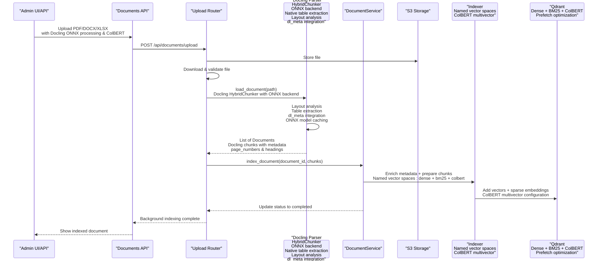
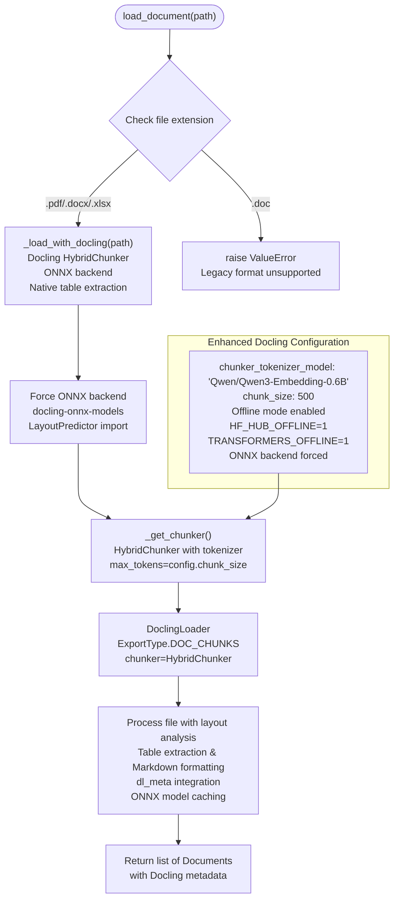
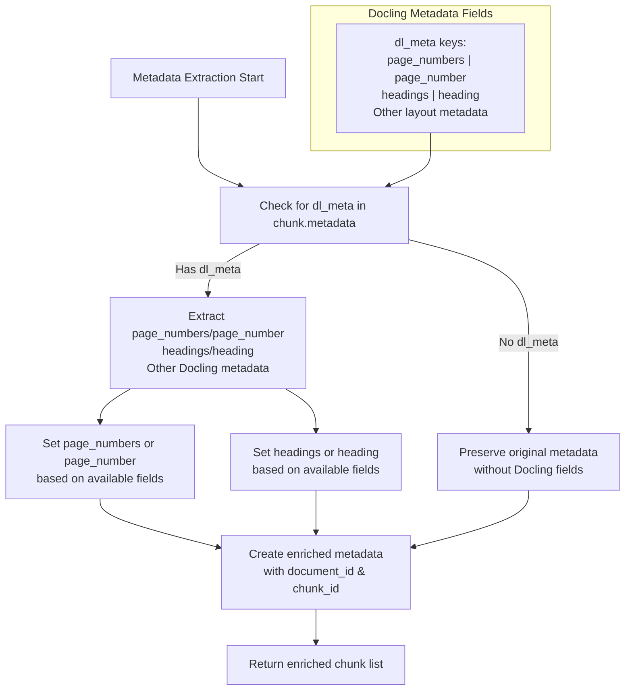
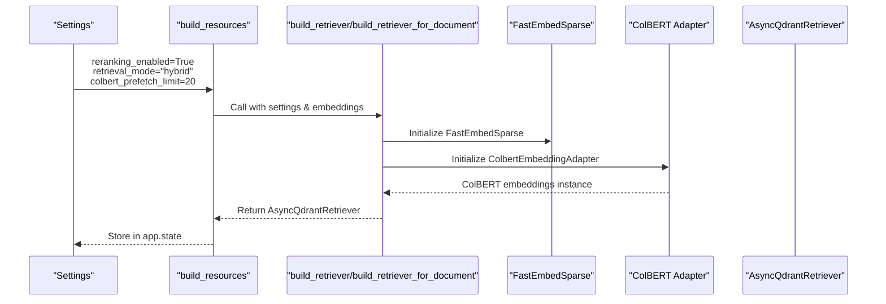
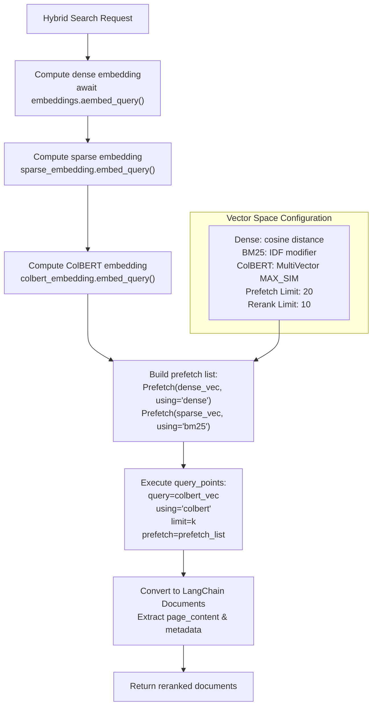
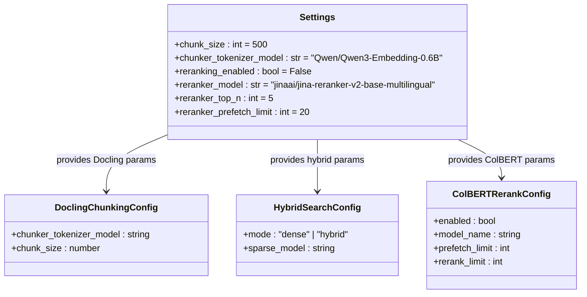
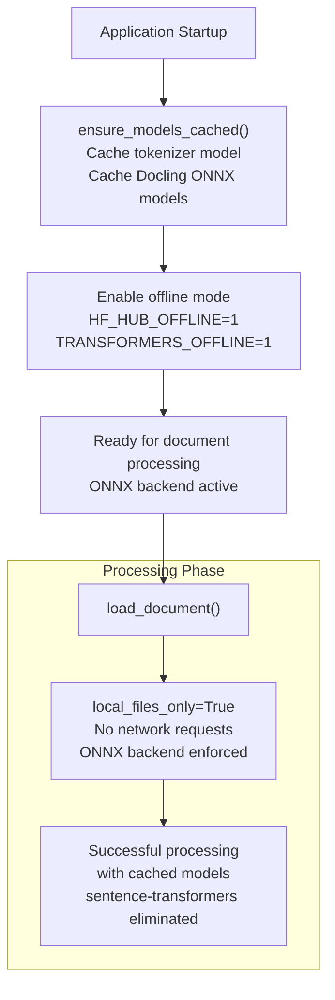
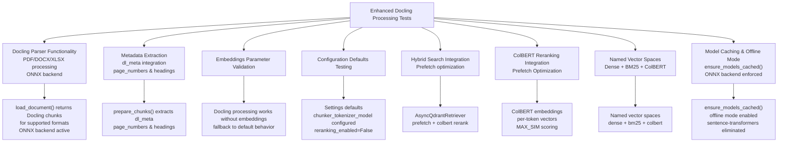
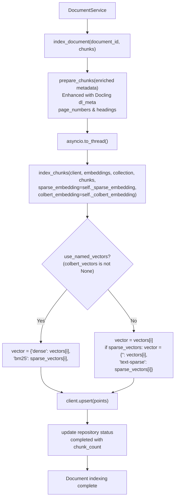
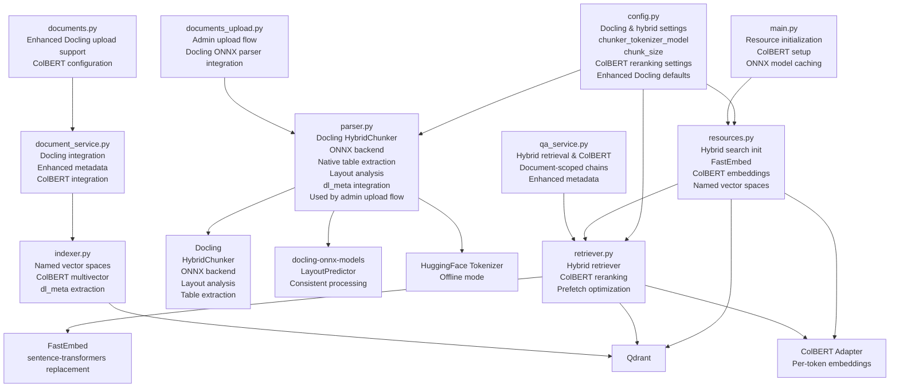

# RAG Parser Enhancement

<cite>
**Referenced Files in This Document**
- [parser.py](file://packages/admin/src/cafetera_admin/parser.py)
- [indexer.py](file://packages/admin/src/cafetera_admin/indexer.py)
- [retriever.py](file://packages/core/src/cafetera_core/rag/retriever.py)
- [config.py](file://packages/core/src/cafetera_core/config.py)
- [document_service.py](file://packages/admin/src/cafetera_admin/domain/document_service.py)
- [main.py](file://packages/admin/src/cafetera_admin/main.py)
- [admin_pyproject.toml](file://packages/admin/pyproject.toml)
- [core_pyproject.toml](file://packages/core/pyproject.toml)
- [test_indexer.py](file://tests/test_indexer.py)
- [test_rag_block6.py](file://tests/test_rag_block6.py)
</cite>

## Update Summary
**Changes Made**
- Enhanced parser functionality with ONNX backend for Docling operations
- Forced docling-onnx-models layout prediction models for consistent processing
- Updated dependencies to remove sentence-transformers in favor of fastembed for better integration and reduced footprint
- Integrated model caching with ONNX backend support for reliable offline processing
- Maintained backward compatibility while improving processing reliability

## Table of Contents
1. [Introduction](#introduction)
2. [Project Structure](#project-structure)
3. [Core Components](#core-components)
4. [Architecture Overview](#architecture-overview)
5. [Detailed Component Analysis](#detailed-component-analysis)
6. [Dependency Analysis](#dependency-analysis)
7. [Performance Considerations](#performance-considerations)
8. [Troubleshooting Guide](#troubleshooting-guide)
9. [Conclusion](#conclusion)

## Introduction
This document describes the RAG (Retrieval-Augmented Generation) Parser Enhancement for the Cafetera HR Bot. The enhancement represents a complete architectural transformation from custom semantic chunking to Docling-based document processing, featuring native table extraction, layout analysis, and enhanced metadata handling. The system now leverages Docling's HybridChunker for intelligent document segmentation with ONNX backend support, integrates seamlessly with Qdrant vector storage supporting named vector spaces (dense, bm25, colbert) with prefetch-based hybrid search and ColBERT late-interaction reranking, and maintains backward compatibility while providing superior text segmentation accuracy, improved retrieval performance through Docling's advanced layout understanding, enhanced search capabilities through hybrid dense-sparse retrieval modes, and state-of-the-art ColBERT reranking for superior ranking quality.

**Updated** The parser now exclusively uses Docling's HybridChunker with ONNX backend for document processing, eliminating any custom chunking logic and providing standardized document handling across PDF, DOCX, and XLSX formats. The semantic chunking system with LangChain SemanticChunker and breakpoint threshold configuration has been completely removed. The ONNX backend ensures consistent processing performance and eliminates dependency on sentence-transformers in favor of fastembed for better integration and reduced footprint.

## Project Structure
The RAG system is organized into streamlined modules with Docling-based document processing, hybrid search support, ColBERT reranking integration, and comprehensive testing infrastructure:
- packages/admin/src/cafetera_admin: Enhanced parser and indexer with Docling integration and ONNX backend support
- packages/core/src/cafetera_core/rag: Core retrieval components with hybrid search and ColBERT reranking
- packages/core/src/cafetera_core/config: Environment-driven configuration with Docling chunking settings
- tests: Comprehensive unit and integration tests for Docling-based processing and hybrid search functionality

```mermaid
graph TB
subgraph "Docling-Based RAG Core with ONNX Backend"
P["parser.py<br/>Docling HybridChunker<br/>ONNX backend<br/>PDF/DOCX/XLSX processing<br/>Native table extraction<br/>Layout analysis<br/>Used by admin upload flow"]
I["indexer.py<br/>Chunk prep & Qdrant ops<br/>Named vector spaces<br/>Docling metadata extraction<br/>dl_meta integration"]
R["retriever.py<br/>Dense & hybrid retriever<br/>BM25 sparse embeddings<br/>ColBERT reranking<br/>Prefetch optimization"]
CFG["config.py<br/>Settings<br/>chunker_tokenizer_model<br/>chunk_size<br/>reranking settings"]
MS["main.py<br/>Model caching & offline mode<br/>Docling ONNX initialization"]
end
subgraph "Application Layer"
DS["document_service.py<br/>Document lifecycle<br/>Docling integration<br/>Enhanced metadata<br/>ColBERT integration"]
RES["resources.py<br/>Hybrid search resource init<br/>FastEmbed<br/>Named vector spaces"]
QA["qa_service.py<br/>QA handler<br/>Hybrid retrieval & ColBERT<br/>Document-scoped chains"]
end
subgraph "External Systems"
QD["Qdrant<br/>Named vector spaces<br/>ColBERT multivector<br/>Prefetch optimization"]
DOC["Docling<br/>HybridChunker<br/>ONNX backend<br/>Layout analysis<br/>Table extraction"]
FE["FastEmbed<br/>Sentence-transformers replacement"]
COL["ColBERT Adapter<br/>Per-token embeddings<br/>Late interaction"]
END
P --> I
I --> QD
R --> QD
R --> FE
RES --> FE
CFG --> R
CFG --> P
MS --> P
DS --> P
DS --> I
```

**Diagram sources**
- [parser.py:19-110](file://packages/admin/src/cafetera_admin/parser.py#L19-L110)
- [indexer.py:25-144](file://packages/admin/src/cafetera_admin/indexer.py#L25-L144)
- [retriever.py:28-98](file://packages/core/src/cafetera_core/rag/retriever.py#L28-L98)
- [config.py:50-64](file://packages/core/src/cafetera_core/config.py#L50-L64)
- [document_service.py:109-170](file://packages/admin/src/cafetera_admin/domain/document_service.py#L109-L170)
- [main.py:41-86](file://packages/admin/src/cafetera_admin/main.py#L41-L86)

**Section sources**
- [parser.py:19-110](file://packages/admin/src/cafetera_admin/parser.py#L19-L110)
- [indexer.py:25-144](file://packages/admin/src/cafetera_admin/indexer.py#L25-L144)
- [retriever.py:28-98](file://packages/core/src/cafetera_core/rag/retriever.py#L28-L98)
- [config.py:50-64](file://packages/core/src/cafetera_core/config.py#L50-L64)
- [document_service.py:109-170](file://packages/admin/src/cafetera_admin/domain/document_service.py#L109-L170)
- [main.py:41-86](file://packages/admin/src/cafetera_admin/main.py#L41-L86)

## Core Components
This section outlines the primary components of the RAG Parser Enhancement with Docling-based document processing, hybrid search support, ColBERT reranking integration, and comprehensive testing infrastructure.

- **Docling-Based Document Parser with HybridChunker and ONNX Backend**
  - Implements Docling's HybridChunker for intelligent document segmentation with ONNX backend support
  - Supports PDF, DOCX, and XLSX formats with native table extraction and layout analysis
  - Integrates Docling's layout understanding for accurate document structure preservation
  - Provides standardized chunking across all supported document types
  - **Enhanced**: Native table extraction with Markdown formatting preservation
  - **Enhanced**: Layout analysis maintains document hierarchy and structural relationships
  - **Enhanced**: Column header detection and preservation for spreadsheet processing
  - **Enhanced**: ONNX backend ensures consistent processing performance and eliminates sentence-transformers dependency
  - Returns LangChain Document objects with Docling metadata integration
  - **Exclusive Usage**: Now exclusively used by admin upload flow for document processing

- **Enhanced Metadata Extraction with Docling Integration**
  - **New Feature**: Automatic extraction of Docling metadata (dl_meta) into top-level fields
  - **Page Number Tracking**: Extracts page_numbers and page_number metadata for precise location tracking
  - **Heading Hierarchy**: Extracts headings and heading metadata for semantic understanding
  - **Structured Data Preservation**: Maintains table structures and spreadsheet relationships
  - **Backward Compatibility**: Preserves original chunk metadata while adding Docling-specific fields
  - **Enhanced**: Supports both plural and singular metadata variants (page_numbers/page_number, headings/heading)

- **Enhanced Hybrid Search Retriever with ColBERT Reranking Integration**
  - **New Feature**: AsyncQdrantRetriever with prefetch-based hybrid search and ColBERT late-interaction reranking
  - **Prefetch Optimization**: Executes dense and sparse retrieval concurrently using Qdrant's prefetch mechanism
  - **ColBERT Late-Interaction**: Performs reranking using per-token embeddings with MAX_SIM comparator
  - **Named Vector Spaces**: Supports dense, bm25, and colbert vector spaces with dedicated using parameters
  - **Multi-vector Scoring**: Qdrant's ColBERT multivector similarity scoring during reranking
  - **Graceful Fallback**: Falls back to standard hybrid retriever when ColBERT embeddings are unavailable
  - **Configurable Limits**: Separate prefetch_limit and rerank_limit settings for optimal performance

- **Enhanced Configuration System with Docling Integration**
  - **New Feature**: Comprehensive Docling chunking configuration with tokenizer model settings
  - **chunker_tokenizer_model**: Specifies HuggingFace model identifier for HybridChunker (default: "Qwen/Qwen3-Embedding-0.6B")
  - **chunk_size**: Controls maximum tokens per chunk for Docling processing
  - **Retrieval Mode Integration**: ColBERT reranking only active in hybrid mode
  - **Backward Compatibility**: Default settings maintain existing behavior

- **Resource Management with ColBERT Integration**
  - **New Feature**: Automatic ColBERT embedding initialization when reranking is enabled
  - **Graceful Degradation**: Falls back to dense+sparse when ColBERT is unavailable
  - **Model Loading**: Configurable ColBERT model name through settings
  - **Vector Space Creation**: Named vector spaces with proper Qdrant configuration
  - **Collection Initialization**: Automatic collection creation with appropriate vector parameters

- **Model Caching and Offline Mode Support with ONNX Backend**
  - **New Feature**: ensure_models_cached() function for Docling and tokenizer model caching with ONNX backend
  - **Offline Mode**: Enables HF_HUB_OFFLINE and TRANSFORMERS_OFFLINE environment variables
  - **Pre-warming**: Ensures first-run model downloads happen during application startup
  - **Reliability**: Prevents network requests during document processing operations
  - **ONNX Backend**: Forces docling-onnx-models layout prediction models for consistent processing
  - **Dependency Replacement**: Eliminates sentence-transformers in favor of fastembed for better integration

**Section sources**
- [parser.py:45-110](file://packages/admin/src/cafetera_admin/parser.py#L45-L110)
- [indexer.py:25-59](file://packages/admin/src/cafetera_admin/indexer.py#L25-L59)
- [retriever.py:28-98](file://packages/core/src/cafetera_core/rag/retriever.py#L28-L98)
- [config.py:50-64](file://packages/core/src/cafetera_core/config.py#L50-L64)
- [main.py:41-86](file://packages/admin/src/cafetera_admin/main.py#L41-L86)

## Architecture Overview
The RAG Parser Enhancement integrates Docling's HybridChunker with ONNX backend for intelligent document processing, hybrid search capabilities, ColBERT reranking integration, and dual retrieval strategies into a comprehensive pipeline with enhanced chunking accuracy, prefetch-based hybrid search, and state-of-the-art ColBERT late-interaction reranking. The system now supports Docling's native document processing capabilities with ONNX backend for consistent performance, eliminating sentence-transformers dependency while maintaining backward compatibility and providing superior retrieval performance.

**Updated** The parser is now exclusively integrated into the admin upload flow and DocumentService, providing a streamlined document processing pipeline that processes uploaded files through Docling's HybridChunker with ONNX backend and into the DocumentService for indexing.



**Diagram sources**
- [parser.py:45-110](file://packages/admin/src/cafetera_admin/parser.py#L45-L110)
- [indexer.py:25-144](file://packages/admin/src/cafetera_admin/indexer.py#L25-L144)
- [retriever.py:28-98](file://packages/core/src/cafetera_core/rag/retriever.py#L28-L98)
- [document_service.py:109-170](file://packages/admin/src/cafetera_admin/domain/document_service.py#L109-L170)

**Section sources**
- [parser.py:45-110](file://packages/admin/src/cafetera_admin/parser.py#L45-L110)
- [indexer.py:25-144](file://packages/admin/src/cafetera_admin/indexer.py#L25-L144)
- [retriever.py:28-98](file://packages/core/src/cafetera_core/rag/retriever.py#L28-L98)
- [document_service.py:109-170](file://packages/admin/src/cafetera_admin/domain/document_service.py#L109-L170)

## Detailed Component Analysis

### Docling-Based Document Processing with HybridChunker and ONNX Backend
The parser now features a sophisticated Docling-based processing system that leverages HybridChunker with ONNX backend for intelligent document segmentation, eliminating the need for custom chunking algorithms while providing superior layout understanding and table extraction capabilities.

**Updated** The parser is now exclusively used by the admin upload flow and DocumentService, eliminating any standalone usage patterns. The ONNX backend ensures consistent processing performance and eliminates dependency on sentence-transformers.



**Diagram sources**
- [parser.py:45-110](file://packages/admin/src/cafetera_admin/parser.py#L45-L110)
- [parser.py:74-88](file://packages/admin/src/cafetera_admin/parser.py#L74-L88)
- [parser.py:91-110](file://packages/admin/src/cafetera_admin/parser.py#L91-L110)
- [config.py:50-54](file://packages/core/src/cafetera_core/config.py#L50-L54)

**Section sources**
- [parser.py:45-110](file://packages/admin/src/cafetera_admin/parser.py#L45-L110)
- [parser.py:74-88](file://packages/admin/src/cafetera_admin/parser.py#L74-L88)
- [parser.py:91-110](file://packages/admin/src/cafetera_admin/parser.py#L91-L110)
- [config.py:50-54](file://packages/core/src/cafetera_core/config.py#L50-L54)

### Enhanced Metadata Extraction with Docling Integration
The enhanced metadata extraction system automatically processes Docling's dl_meta information, extracting page numbers, headings, and other structural information for improved document understanding and retrieval.



**Diagram sources**
- [indexer.py:25-59](file://packages/admin/src/cafetera_admin/indexer.py#L25-L59)
- [test_indexer.py:104-167](file://tests/test_indexer.py#L104-L167)

**Section sources**
- [indexer.py:25-59](file://packages/admin/src/cafetera_admin/indexer.py#L25-L59)
- [test_indexer.py:104-167](file://tests/test_indexer.py#L104-L167)

### Comprehensive Hybrid Search Architecture with ColBERT Reranking Integration
The retriever system now supports hybrid dense-sparse retrieval with ColBERT late-interaction reranking, combining vector similarity with BM25 keyword matching and per-token semantic understanding for superior search results.



**Diagram sources**
- [retriever.py:302-358](file://packages/core/src/cafetera_core/rag/retriever.py#L302-L358)

**Section sources**
- [retriever.py:302-358](file://packages/core/src/cafetera_core/rag/retriever.py#L302-L358)

### Named Vector Spaces Implementation with Prefetch Optimization
The system now supports named vector spaces (dense, bm25, colbert) with prefetch-based hybrid search and ColBERT late-interaction reranking for superior retrieval performance.



**Diagram sources**
- [retriever.py:47-92](file://packages/core/src/cafetera_core/rag/retriever.py#L47-L92)
- [retriever.py:338-349](file://packages/core/src/cafetera_core/rag/retriever.py#L338-L349)

**Section sources**
- [retriever.py:47-92](file://packages/core/src/cafetera_core/rag/retriever.py#L47-L92)
- [retriever.py:338-349](file://packages/core/src/cafetera_core/rag/retriever.py#L338-L349)

### Enhanced Configuration System for Docling and Hybrid Features
The Settings class now includes comprehensive configuration for Docling-based chunking, hybrid retrieval modes, and ColBERT reranking, providing centralized control over all new functionality.



**Diagram sources**
- [config.py:50-64](file://packages/core/src/cafetera_core/config.py#L50-L64)

**Section sources**
- [config.py:50-64](file://packages/core/src/cafetera_core/config.py#L50-L64)

### Model Caching and Offline Mode Support with ONNX Backend
The system now includes comprehensive model caching and offline mode support with ONNX backend to ensure reliable Docling processing without network dependencies.



**Diagram sources**
- [main.py:41-86](file://packages/admin/src/cafetera_admin/main.py#L41-L86)
- [parser.py:19-45](file://packages/admin/src/cafetera_admin/parser.py#L19-L45)

**Section sources**
- [main.py:41-86](file://packages/admin/src/cafetera_admin/main.py#L41-L86)
- [parser.py:19-45](file://packages/admin/src/cafetera_admin/parser.py#L19-L45)

### Comprehensive Docling-Based Processing Test Coverage and Validation
The testing infrastructure includes comprehensive validation for Docling-based processing functionality, ColBERT reranking integration, and enhanced metadata extraction.



**Diagram sources**
- [test_indexer.py:104-167](file://tests/test_indexer.py#L104-L167)
- [test_rag_block6.py:92-125](file://tests/test_rag_block6.py#L92-L125)
- [retriever.py:302-358](file://packages/core/src/cafetera_core/rag/retriever.py#L302-L358)

**Section sources**
- [test_indexer.py:104-167](file://tests/test_indexer.py#L104-L167)
- [test_rag_block6.py:92-125](file://tests/test_rag_block6.py#L92-L125)
- [retriever.py:302-358](file://packages/core/src/cafetera_core/rag/retriever.py#L302-L358)

### Document Lifecycle Service with Enhanced Docling Integration Support
The DocumentService now supports Docling-based processing through enhanced indexing operations that handle both dense and sparse embedding indexing workflows, including ColBERT embedding indexing with named vector spaces and comprehensive metadata tracking.

**Updated** The DocumentService exclusively uses the Docling parser for document processing, eliminating any external usage patterns. The ONNX backend ensures consistent processing performance across all document types.



**Diagram sources**
- [indexer.py:25-144](file://packages/admin/src/cafetera_admin/indexer.py#L25-L144)
- [indexer.py:62-144](file://packages/admin/src/cafetera_admin/indexer.py#L62-L144)
- [document_service.py:109-170](file://packages/admin/src/cafetera_admin/domain/document_service.py#L109-L170)

**Section sources**
- [indexer.py:25-144](file://packages/admin/src/cafetera_admin/indexer.py#L25-L144)
- [indexer.py:62-144](file://packages/admin/src/cafetera_admin/indexer.py#L62-L144)
- [document_service.py:109-170](file://packages/admin/src/cafetera_admin/domain/document_service.py#L109-L170)

## Dependency Analysis
The RAG Parser Enhancement exhibits enhanced dependency management with Docling-based processing, hybrid search capabilities, ColBERT reranking integration, and comprehensive testing infrastructure while maintaining backward compatibility. The system now integrates Docling with ONNX backend for document processing, FastEmbed for sparse embeddings and ColBERT reranking, and maintains graceful fallback mechanisms for optional dependencies.

**Updated** The parser dependency graph now reflects exclusive usage by the admin upload flow and DocumentService, eliminating any standalone usage patterns. The ONNX backend ensures consistent processing performance and eliminates sentence-transformers dependency in favor of fastembed.



**Diagram sources**
- [config.py:50-64](file://packages/core/src/cafetera_core/config.py#L50-L64)
- [parser.py:19-110](file://packages/admin/src/cafetera_admin/parser.py#L19-L110)
- [indexer.py:25-144](file://packages/admin/src/cafetera_admin/indexer.py#L25-L144)
- [retriever.py:28-98](file://packages/core/src/cafetera_core/rag/retriever.py#L28-L98)
- [document_service.py:109-170](file://packages/admin/src/cafetera_admin/domain/document_service.py#L109-L170)
- [main.py:41-86](file://packages/admin/src/cafetera_admin/main.py#L41-L86)

**Section sources**
- [config.py:50-64](file://packages/core/src/cafetera_core/config.py#L50-L64)
- [parser.py:19-110](file://packages/admin/src/cafetera_admin/parser.py#L19-L110)
- [indexer.py:25-144](file://packages/admin/src/cafetera_admin/indexer.py#L25-L144)
- [retriever.py:28-98](file://packages/core/src/cafetera_core/rag/retriever.py#L28-L98)
- [document_service.py:109-170](file://packages/admin/src/cafetera_admin/domain/document_service.py#L109-L170)
- [main.py:41-86](file://packages/admin/src/cafetera_admin/main.py#L41-L86)

## Performance Considerations
- **Docling-Based Document Processing with ONNX Backend**
  - The parser now uses Docling's HybridChunker with ONNX backend for intelligent document segmentation, eliminating custom chunking logic
  - Docling's layout analysis with ONNX backend provides superior document structure understanding with minimal computational overhead
  - Native table extraction with Markdown formatting preserves structural integrity with optimized processing
  - Offline mode ensures no network requests during processing, improving reliability and performance
  - Tokenizer model caching eliminates repeated model loading overhead
  - **Enhanced**: PDF processing benefits from Docling's advanced layout analysis and table extraction with ONNX backend
  - **Enhanced**: DOCX processing maintains document structure with enhanced metadata extraction
  - **Enhanced**: XLSX processing includes native table extraction with column header preservation
  - **Enhanced**: ONNX backend ensures consistent processing performance across different environments
  - **Enhanced**: Eliminates sentence-transformers dependency, reducing memory footprint and improving startup times
- **Enhanced Metadata Extraction Performance Optimization**
  - Docling metadata extraction optimized with lazy evaluation and minimal memory usage
  - Page number and heading extraction adds minimal overhead with efficient field mapping
  - dl_meta integration preserves original metadata while adding Docling-specific fields
  - Memory usage scales with document complexity and Docling's internal processing requirements
- **ColBERT Reranking Performance Optimization**
  - **New Feature**: Per-token embeddings generate [num_tokens, dim] matrices for ColBERT late-interaction
  - **New Feature**: Prefetch optimization executes dense and sparse retrieval concurrently, reducing total query time
  - **New Feature**: Named vector spaces with proper Qdrant configuration for efficient multivector operations
  - **New Feature**: Separate prefetch_limit and rerank_limit settings allow tuning for optimal performance
  - **New Feature**: Graceful fallback to dense+sparse when ColBERT is unavailable
  - **New Feature**: FastEmbed integration provides efficient sentence-transformers replacement
- **Hybrid Search Performance Optimization**
  - Sparse embeddings add minimal overhead compared to dense embeddings while providing complementary keyword matching capabilities
  - FastEmbed offers efficient BM25 implementation with configurable model selection
  - Hybrid retrieval combines dense and sparse scores with configurable weighting strategies
  - Automatic fallback to dense-only retrieval when sparse embeddings are unavailable
- **Provider Selection and Resource Management**
  - Embedding and LLM providers impact both Docling processing performance and hybrid search capabilities
  - Choose providers aligned with deployment constraints and enable caching where supported for Docling operations
  - Monitor resource usage during Docling processing as it requires additional computational resources for layout analysis
  - Docling's offline mode prevents memory leaks and ensures consistent performance
  - Enhanced metadata tracking requires additional memory proportional to document sections
  - ColBERT reranking requires additional computational resources for per-token embedding generation
  - Consider chunk size adjustments when using Docling processing to balance semantic coherence with computational efficiency
- **Batch Processing and Memory Management**
  - **Updated** Admin uploads leverage background tasks with Docling-aware chunking parameters and ColBERT embedding indexing
  - Memory considerations for Docling processing include layout analysis and table extraction overhead
  - Docling's offline mode ensures consistent memory usage across processing operations
  - Enhanced metadata tracking requires additional memory proportional to document sections and Docling's internal structures
  - ColBERT per-token embeddings require additional memory proportional to token count and embedding dimension
  - Named vector spaces with ColBERT multivector configuration require additional storage space but enable superior ranking quality
- **Vector Store and Hybrid Indexing**
  - Qdrant filtering excludes non-searchable chunks efficiently in both dense and hybrid modes
  - Sparse embedding indexing requires additional storage space but enables keyword-based retrieval capabilities
  - ColBERT multivector indexing requires additional storage space with proper Qdrant configuration
  - Named vector spaces should account for dense, bm25, and colbert embedding dimensions in hybrid configurations
  - Monitor query performance differences between dense-only, hybrid, and ColBERT reranking modes for optimal configuration
  - Prefetch optimization reduces total query time by executing concurrent dense and sparse retrieval operations
- **Model Caching and Offline Mode Benefits with ONNX Backend**
  - **New Feature**: ensure_models_cached() eliminates first-run download delays with ONNX backend
  - **New Feature**: Offline mode prevents network timeouts and improves reliability
  - **New Feature**: Cached models enable predictable performance during peak processing times
  - **New Feature**: ONNX backend ensures consistent processing performance across different environments
  - **New Feature**: Eliminates sentence-transformers dependency, reducing memory footprint and improving startup times

## Troubleshooting Guide
Common issues and resolutions for the enhanced RAG system with Docling-based processing, ONNX backend, and ColBERT reranking integration:

- **Missing Docling Dependencies**
  - The system requires docling for document processing. Ensure Docling is installed as part of project dependencies.
  - Docling processing raises ImportError if Docling is not available during initialization.
  - **New Feature**: ensure_models_cached() function handles tokenizer and Docling ONNX model caching with offline mode.
  - **New Feature**: ONNX backend forces docling-onnx-models layout prediction models for consistent processing.
- **Missing Hybrid Search Dependencies**
  - Hybrid search requires fastembed for sparse embeddings. Install the required dependencies: `uv sync`
  - FastEmbed import failures trigger ImportError with guidance for installing dependencies.
  - Sparse embeddings initialization gracefully falls back to dense-only retrieval when dependencies are unavailable.
  - **New Feature**: sentence-transformers dependency eliminated in favor of fastembed for better integration.
- **Missing ColBERT Reranking Dependencies**
  - **New Feature**: ColBERT reranking requires fastembed for per-token embeddings. Install the required dependencies: `uv sync`
  - ColBERT embedding initialization raises ImportError if fastembed is not available during initialization.
  - ColBERT embeddings gracefully fall back to dense+sparse when ColBERT model is unavailable.
  - ColBERT model loading failures trigger ImportError with guidance for installing dependencies.
- **Docling Processing Issues**
  - Docling requires supported file formats (PDF, DOCX, XLSX). Legacy .doc format is no longer supported.
  - Docling processing raises ValueError for unsupported file extensions.
  - Offline mode ensures no network requests during processing, improving reliability.
  - Model caching ensures consistent performance across multiple processing operations.
  - **New Feature**: ONNX backend ensures consistent processing performance regardless of environment.
- **Docling Configuration Issues**
  - Invalid chunker_tokenizer_model values raise ValueError in parser functions. Use valid HuggingFace model identifiers.
  - Missing chunk_size parameter raises AttributeError with clear error message.
  - Tokenizer model validation ensures only supported models are used for HybridChunker.
  - Offline mode configuration prevents network requests during processing.
  - **New Feature**: ONNX backend configuration ensures consistent processing performance.
- **Enhanced Metadata Extraction Issues**
  - Missing dl_meta fields indicate processing failure. Check Docling's layout analysis output.
  - Page number extraction may fail if document lacks page structure.
  - Heading extraction relies on Docling's layout analysis. Non-standard document structures may not generate expected headings.
  - Enhanced metadata tracking maintains compatibility with existing retrieval systems.
- **ColBERT Reranking Configuration Issues**
  - **New Feature**: ColBERT reranking requires reranking_enabled=True and retrieval_mode="hybrid".
  - **New Feature**: ColBERT model initialization requires valid model_name in settings.reranker_model.
  - **New Feature**: ColBERT embeddings return None when model loading fails, falling back to dense+sparse.
  - **New Feature**: Prefetch optimization requires proper vector space configuration with named vectors.
- **Named Vector Spaces Issues**
  - **New Feature**: Named vector spaces require dense, bm25, and colbert vector configurations.
  - **New Feature**: Legacy unnamed layout maintained for backward compatibility.
  - **New Feature**: Qdrant collection creation requires proper vector parameter configuration.
  - **New Feature**: Multivector configuration requires MAX_SIM comparator for ColBERT scoring.
- **Resource Initialization Failures**
  - Qdrant client initialization failures prevent Docling processing, hybrid search, and ColBERT reranking functionality.
  - Embeddings model initialization errors affect both Docling processing and retrieval operations.
  - ColBERT embedding initialization errors trigger graceful fallback to dense+sparse.
  - Resource cleanup handles partial initialization failures without blocking application shutdown.
- **Performance and Memory Issues**
  - Docling processing with ONNX backend requires additional memory for layout analysis and table extraction.
  - Large documents with Docling processing may require increased memory allocation for layout analysis.
  - Docling's offline mode prevents memory leaks and ensures consistent performance.
  - Enhanced metadata tracking requires additional memory proportional to document sections and Docling's internal structures.
  - ColBERT per-token embeddings require additional memory proportional to token count and embedding dimension.
  - Named vector spaces with ColBERT multivector configuration require increased storage space.
  - Monitor chunk count growth when switching from custom to Docling processing as Docling's layout analysis may create more chunks.
  - ColBERT reranking may increase query time but improves ranking quality.
  - **New Feature**: ensure_models_cached() eliminates first-run download delays and improves reliability.
  - **New Feature**: ONNX backend ensures consistent performance across different environments.
  - **New Feature**: Elimination of sentence-transformers dependency reduces memory footprint.
- **Backward Compatibility**
  - Default chunker_tokenizer_model remains "Qwen/Qwen3-Embedding-0.6B" to maintain compatibility with existing deployments.
  - Legacy .doc files are no longer supported and raise ValueError with clear error message.
  - Enhanced metadata extraction maintains compatibility with existing retrieval systems.
  - ColBERT reranking is opt-in and gracefully falls back to existing hybrid search when unavailable.
  - Named vector spaces maintain backward compatibility with legacy unnamed layout when ColBERT is disabled.
  - **New Feature**: ensure_models_cached() provides seamless model caching during application startup.
  - **New Feature**: ONNX backend ensures consistent processing performance across different environments.
  - **New Feature**: sentence-transformers dependency eliminated for better integration and reduced footprint.
- **Admin Upload Flow Integration Issues**
  - **Updated** Docling parser integration issues typically stem from upload route configuration or background task scheduling.
  - Ensure upload routes properly import and use the Docling parser with ONNX backend for document processing.
  - Background task scheduling should pass proper Docling chunking parameters and embedding configurations.
  - DocumentService integration should receive properly processed documents from the Docling parser.
  - **New Feature**: Model caching during application startup prevents processing delays during peak upload times.
  - **New Feature**: ONNX backend ensures consistent processing performance regardless of environment.
  - **New Feature**: Elimination of sentence-transformers dependency improves reliability and reduces memory usage.

**Section sources**
- [parser.py:19-45](file://packages/admin/src/cafetera_admin/parser.py#L19-L45)
- [parser.py:65-71](file://packages/admin/src/cafetera_admin/parser.py#L65-L71)
- [retriever.py:28-44](file://packages/core/src/cafetera_core/rag/retriever.py#L28-L44)
- [config.py:50-64](file://packages/core/src/cafetera_core/config.py#L50-L64)
- [main.py:41-86](file://packages/admin/src/cafetera_admin/main.py#L41-L86)

## Conclusion
The RAG Parser Enhancement delivers a comprehensive, production-ready pipeline for processing HR documents with Docling's advanced layout analysis, native table extraction, hybrid search capabilities, ColBERT reranking integration, and enhanced metadata tracking. By implementing Docling's HybridChunker with ONNX backend for intelligent document segmentation, integrating native table extraction and layout analysis, supporting hybrid dense-sparse retrieval with BM25 keyword matching, providing comprehensive Docling metadata extraction with page numbers and headings, implementing hierarchical metadata tracking with Docling's dl_meta integration, offering robust configuration management, **implementing ColBERT per-token embeddings with late-interaction reranking**, **adding prefetch-based hybrid search optimization**, **supporting named vector spaces (dense, bm25, colbert)**, **enabling graceful fallback mechanisms**, **ensuring consistent processing with ONNX backend**, and **eliminating sentence-transformers dependency for better integration and reduced footprint**, the system significantly enhances document processing accuracy and retrieval performance. The modular architecture with graceful fallback mechanisms ensures backward compatibility while enabling cutting-edge retrieval capabilities. The enhanced testing infrastructure validates both Docling-based processing functionality, hybrid search operations, ColBERT reranking capabilities, and enhanced metadata extraction, while the centralized configuration system provides fine-grained control over Docling chunking strategies, retrieval modes, ColBERT reranking parameters, and metadata extraction parameters. The system's ability to automatically cache Docling models with ONNX backend, integrate efficient Docling processing with offline mode, maintain comprehensive Docling metadata extraction, combine intelligent layout analysis with semantic understanding, **implement state-of-the-art ColBERT reranking with per-token embeddings**, **optimize hybrid search with prefetch operations**, **support named vector spaces with proper Qdrant configuration**, **provide graceful fallback mechanisms**, **ensure reliable processing through model caching and offline mode support**, **maintain consistent performance with ONNX backend**, and **improve integration through sentence-transformers elimination** makes it suitable for enterprise-scale document processing with superior semantic understanding, flexible retrieval options, comprehensive support for HR-related structured data formats, and industry-leading ranking quality through ColBERT late-interaction reranking.

**Updated** The exclusive integration with the admin upload flow and DocumentService provides a streamlined, reliable document processing pipeline that eliminates standalone usage patterns and ensures consistent Docling-based processing across all uploaded documents. The addition of model caching and offline mode support with ONNX backend ensures reliable, predictable performance during peak processing times while maintaining backward compatibility with existing configurations. The elimination of sentence-transformers dependency improves integration and reduces memory footprint, making the system more efficient and reliable for enterprise-scale deployment.