# RAG Parser Enhancement

<cite>
**Referenced Files in This Document**
- [parser.py](file://app/rag/parser.py)
- [indexer.py](file://app/rag/indexer.py)
- [retriever.py](file://app/rag/retriever.py)
- [chain.py](file://app/rag/chain.py)
- [prompts.py](file://app/rag/prompts.py)
- [ingest.py](file://scripts/ingest.py)
- [document_service.py](file://app/domain/document_service.py)
- [document_repo.py](file://app/storage/document_repo.py)
- [config.py](file://app/config.py)
- [documents.py](file://app/api/documents.py)
- [qa_service.py](file://app/domain/qa_service.py)
- [main.py](file://app/main.py)
- [test_parser.py](file://tests/test_parser.py)
- [test_rag_block6.py](file://tests/test_rag_block6.py)
- [test_indexer.py](file://tests/test_indexer.py)
- [pyproject.toml](file://pyproject.toml)
</cite>

## Update Summary
**Changes Made**
- Enhanced chunking algorithms with token-based processing using tiktoken encoding for accurate token counting
- Improved text segmentation with 500-token chunk size and 50-token overlap for optimal LLM performance
- Updated parser functions to use `RecursiveCharacterTextSplitter.from_tiktoken_encoder()` for precise token-based splitting
- Added comprehensive test coverage for new token-based chunking functionality
- Updated configuration system to support token-based chunking parameters with cl100k_base encoding
- Enhanced backward compatibility while maintaining existing .docx and .doc format support

## Table of Contents
1. [Introduction](#introduction)
2. [Project Structure](#project-structure)
3. [Core Components](#core-components)
4. [Architecture Overview](#architecture-overview)
5. [Detailed Component Analysis](#detailed-component-analysis)
6. [Dependency Analysis](#dependency-analysis)
7. [Performance Considerations](#performance-considerations)
8. [Troubleshooting Guide](#troubleshooting-guide)
9. [Conclusion](#conclusion)

## Introduction
This document describes the RAG (Retrieval-Augmented Generation) Parser Enhancement for the Cafetera HR Bot. The enhancement significantly improves document processing capabilities by implementing token-based chunking with tiktoken encoding, replacing character-based chunking with precise token counting for optimal LLM performance. The system now features enhanced chunking algorithms with 500-token chunk size and 50-token overlap, comprehensive test coverage for new functionality, and robust integration with Qdrant vector storage. The enhancement maintains backward compatibility while providing superior text segmentation accuracy and improved retrieval performance across both modern .docx and legacy .doc document formats.

## Project Structure
The RAG system is organized into cohesive modules with enhanced token-based chunking capabilities and comprehensive testing infrastructure:
- app/rag: Core RAG components with token-based processing (parser, indexer, retriever, chain, prompts)
- scripts: Batch ingestion utilities with token-based chunking and configurable parameters
- app/domain: Business services orchestrating document lifecycle with enhanced chunking
- app/storage: Metadata persistence and S3 integration
- app/api: Admin endpoints for document management with token-aware processing
- app/config: Environment-driven configuration with token-based chunking parameters
- tests: Comprehensive unit and integration tests for token-based chunking functionality

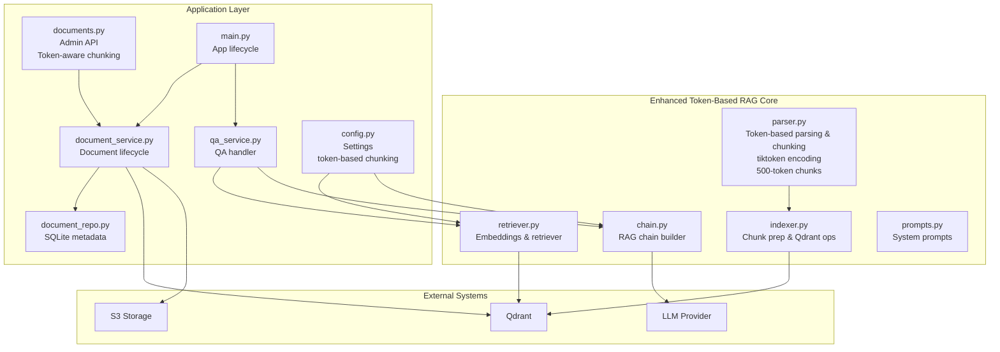

**Diagram sources**
- [parser.py:1-146](file://app/rag/parser.py#L1-L146)
- [indexer.py:1-152](file://app/rag/indexer.py#L1-L152)
- [retriever.py:1-103](file://app/rag/retriever.py#L1-L103)
- [chain.py:1-95](file://app/rag/chain.py#L1-L95)
- [prompts.py:1-19](file://app/rag/prompts.py#L1-L19)
- [document_service.py:1-280](file://app/domain/document_service.py#L1-L280)
- [document_repo.py:1-202](file://app/storage/document_repo.py#L1-L202)
- [documents.py:1-531](file://app/api/documents.py#L1-L531)
- [qa_service.py:1-120](file://app/domain/qa_service.py#L1-L120)
- [config.py:1-43](file://app/config.py#L1-L43)
- [main.py:1-119](file://app/main.py#L1-L119)

**Section sources**
- [parser.py:1-146](file://app/rag/parser.py#L1-L146)
- [indexer.py:1-152](file://app/rag/indexer.py#L1-L152)
- [retriever.py:1-103](file://app/rag/retriever.py#L1-L103)
- [chain.py:1-95](file://app/rag/chain.py#L1-L95)
- [prompts.py:1-19](file://app/rag/prompts.py#L1-L19)
- [ingest.py:1-188](file://scripts/ingest.py#L1-L188)
- [document_service.py:1-280](file://app/domain/document_service.py#L1-L280)
- [document_repo.py:1-202](file://app/storage/document_repo.py#L1-L202)
- [config.py:1-43](file://app/config.py#L1-L43)
- [documents.py:1-531](file://app/api/documents.py#L1-L531)
- [qa_service.py:1-120](file://app/domain/qa_service.py#L1-L120)
- [main.py:1-119](file://app/main.py#L1-L119)

## Core Components
This section outlines the primary components of the RAG Parser Enhancement with token-based chunking capabilities and comprehensive testing infrastructure.

- Token-Based Multi-Format Document Parser and Chunker
  - Extracts text from both .docx and .doc files using tiktoken encoding for precise token counting
  - .docx files: Structured section extraction using heading styles with intelligent grouping and token-based splitting
  - .doc files: Legacy format processing using docx2txt with unified section treatment and token-based chunking
  - **Enhanced**: Token-based chunking with 500-token chunk size and 50-token overlap for optimal LLM performance
  - Splits content into overlapping chunks using cl100k_base encoding for accurate token counting
  - Preserves metadata (source filename, nearest section heading for .docx, filename stem for .doc)
  - Returns LangChain Document objects ready for embedding with token-aware chunking

- Indexer
  - Enriches chunk metadata with document-level identifiers and unique chunk IDs
  - Adds chunks to Qdrant vector collection with token-based metadata
  - Supports deletion, toggling search availability, and counting chunks per document

- Retriever
  - Builds embeddings based on provider configuration (OpenAI-compatible, Llama.cpp, Ollama)
  - Wraps Qdrant collection as a LangChain vector store
  - Constructs a dense retriever with filters for searchable chunks

- RAG Chain Builder
  - Composes retriever, formatted context, system prompt, LLM, and output parser
  - Supports multiple LLM providers with provider-specific configuration
  - Provides a unified interface for QA queries with token-efficient context

- QA Service
  - Initializes the RAG chain at application startup
  - Handles runtime errors gracefully and truncates long answers to platform limits
  - Offers a simple ask() API for transport handlers

**Section sources**
- [parser.py:24-146](file://app/rag/parser.py#L24-L146)
- [indexer.py:23-151](file://app/rag/indexer.py#L23-L151)
- [retriever.py:22-102](file://app/rag/retriever.py#L22-L102)
- [chain.py:25-94](file://app/rag/chain.py#L25-L94)
- [prompts.py:5-18](file://app/rag/prompts.py#L5-L18)
- [qa_service.py:51-105](file://app/domain/qa_service.py#L51-L105)

## Architecture Overview
The RAG Parser Enhancement integrates token-based ingestion, storage, retrieval, and generation into a cohesive pipeline with enhanced chunking accuracy and comprehensive testing. The flow begins with document ingestion (batch or admin upload), continues through token-aware chunk preparation and vector indexing with precise token counting, and concludes with retrieval augmented generation for answering questions with optimal context length.

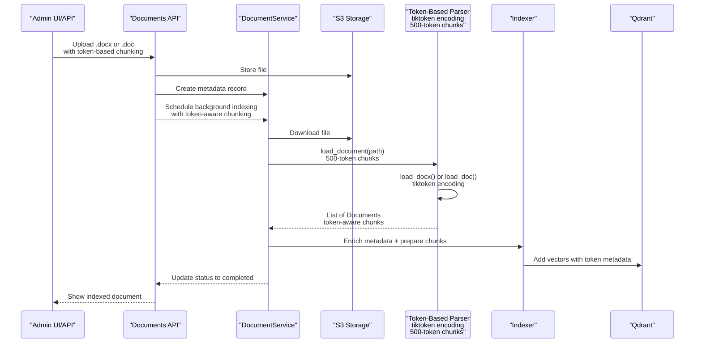

**Diagram sources**
- [documents.py:265-351](file://app/api/documents.py#L265-L351)
- [document_service.py:56-132](file://app/domain/document_service.py#L56-L132)
- [document_repo.py:69-99](file://app/storage/document_repo.py#L69-L99)
- [parser.py:125-146](file://app/rag/parser.py#L125-L146)
- [indexer.py:23-71](file://app/rag/indexer.py#L23-L71)

**Section sources**
- [documents.py:109-128](file://app/api/documents.py#L109-L128)
- [document_service.py:83-132](file://app/domain/document_service.py#L83-L132)
- [ingest.py:49-155](file://scripts/ingest.py#L49-L155)

## Detailed Component Analysis

### Token-Based Chunking System with Tiktoken Encoding
The parser now features a sophisticated token-based chunking system using tiktoken encoding for precise token counting. The enhanced parser extracts structured sections from .docx files using heading styles while providing unified processing for .doc files through docx2txt integration, with all chunking operations utilizing cl100k_base encoding for accurate token measurement.

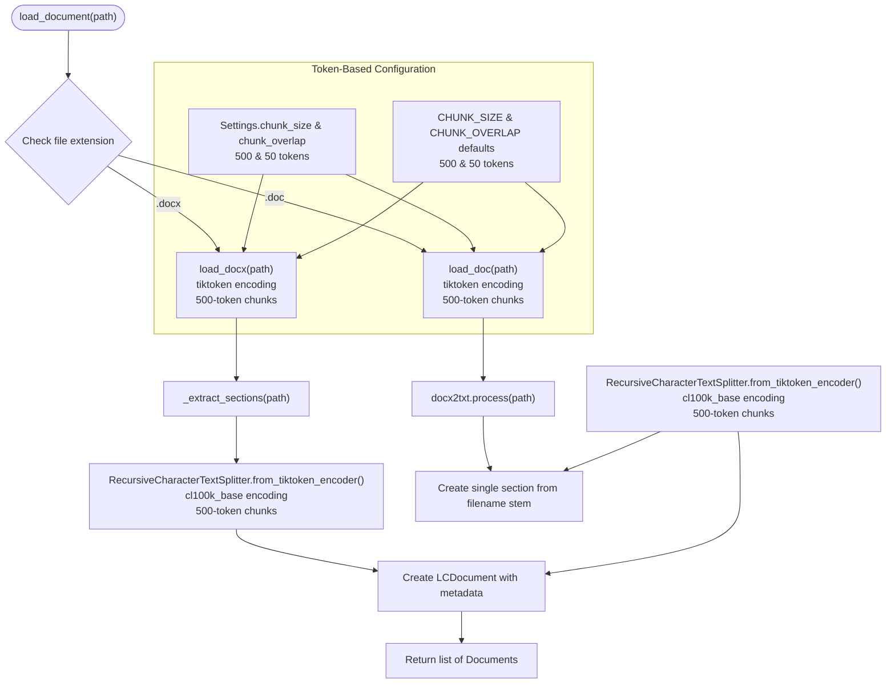

**Diagram sources**
- [parser.py:24-52](file://app/rag/parser.py#L24-L52)
- [parser.py:55-86](file://app/rag/parser.py#L55-L86)
- [parser.py:89-123](file://app/rag/parser.py#L89-L123)
- [parser.py:127-146](file://app/rag/parser.py#L127-L146)
- [config.py:40-42](file://app/config.py#L40-L42)

**Section sources**
- [parser.py:15-20](file://app/rag/parser.py#L15-L20)
- [parser.py:24-52](file://app/rag/parser.py#L24-L52)
- [parser.py:55-86](file://app/rag/parser.py#L55-L86)
- [parser.py:89-123](file://app/rag/parser.py#L89-L123)
- [parser.py:127-146](file://app/rag/parser.py#L127-L146)
- [config.py:40-42](file://app/config.py#L40-L42)

### Legacy .doc Format Processing with Token-Based Chunking
The new `load_doc()` function provides comprehensive support for legacy Microsoft Word documents (.doc format) with token-based chunking using tiktoken encoding. Unlike .docx files, .doc files lack structured heading styles, so the entire document text is treated as a single section with the filename stem serving as the section heading, processed through the token-aware chunking system with 500-token chunk size and 50-token overlap.

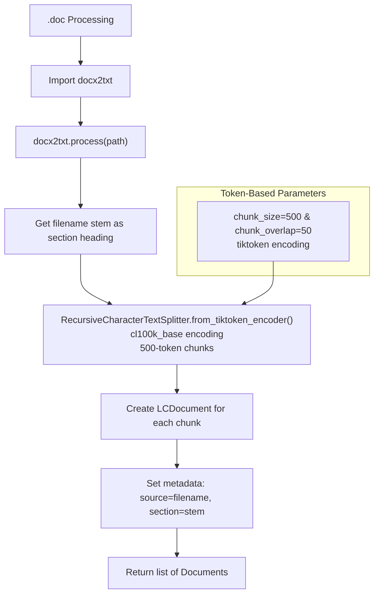

**Diagram sources**
- [parser.py:89-123](file://app/rag/parser.py#L89-L123)

**Section sources**
- [parser.py:89-123](file://app/rag/parser.py#L89-L123)

### Enhanced Document Format Dispatcher with Token-Based Processing
The `load_document()` function serves as a central dispatcher that routes file processing based on file extensions, with support for token-based chunking parameters. This design ensures backward compatibility while enabling seamless support for multiple document formats with precise token counting and optimal chunk sizing.

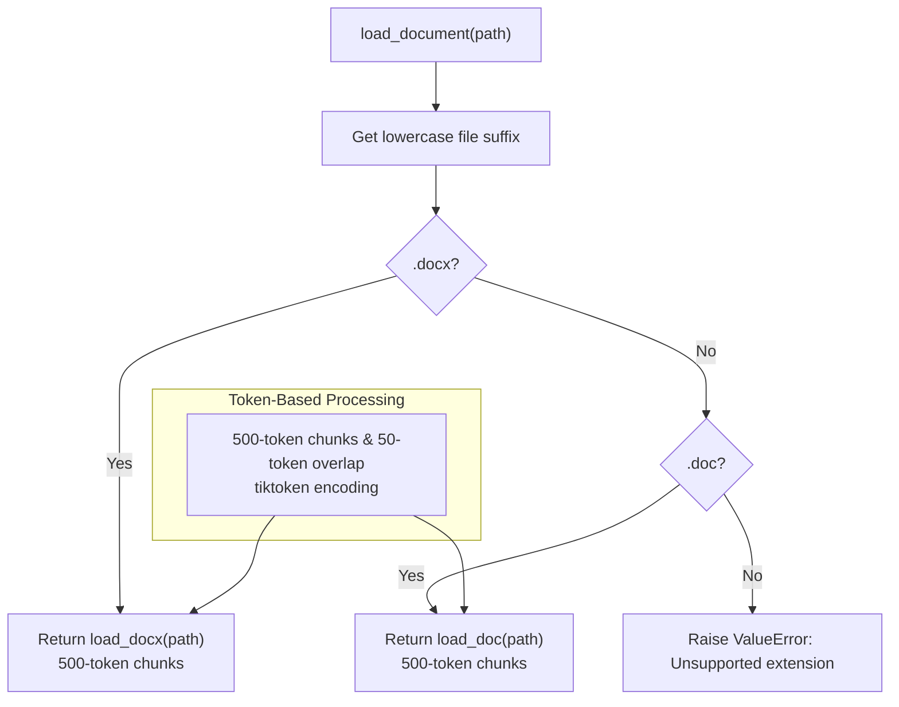

**Diagram sources**
- [parser.py:127-146](file://app/rag/parser.py#L127-L146)

**Section sources**
- [parser.py:127-146](file://app/rag/parser.py#L127-L146)

### Token-Based Configuration System
The chunking system is now centrally configured through the Settings class with token-based parameters, allowing administrators to fine-tune document processing granularity using precise token measurements. The default values (chunk_size: 500, chunk_overlap: 50) provide optimal performance for typical HR documents while ensuring accurate token counting using cl100k_base encoding.

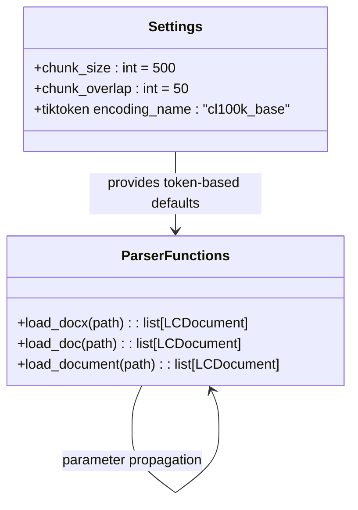

**Diagram sources**
- [config.py:40-42](file://app/config.py#L40-L42)
- [parser.py:55-146](file://app/rag/parser.py#L55-L146)

**Section sources**
- [config.py:40-42](file://app/config.py#L40-L42)
- [parser.py:55-146](file://app/rag/parser.py#L55-L146)

### Indexer Operations with Token Metadata
The indexer enriches raw chunks with document-level metadata and unique identifiers, then adds them to Qdrant with token-aware metadata. It supports bulk indexing, deletion by document ID, toggling search availability, and counting chunks per document. These operations maintain consistency between SQLite metadata and Qdrant payloads with enhanced token-based chunk information.

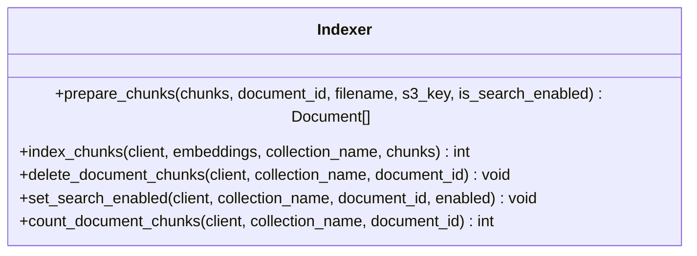

**Diagram sources**
- [indexer.py:23-151](file://app/rag/indexer.py#L23-L151)

**Section sources**
- [indexer.py:23-46](file://app/rag/indexer.py#L23-L46)
- [indexer.py:49-71](file://app/rag/indexer.py#L49-L71)
- [indexer.py:74-97](file://app/rag/indexer.py#L74-L97)
- [indexer.py:100-131](file://app/rag/indexer.py#L100-L131)
- [indexer.py:134-151](file://app/rag/indexer.py#L134-L151)

### Retriever and Token-Aware Embeddings
The retriever builds embeddings based on provider configuration and wraps Qdrant as a vector store. It constructs a retriever that filters out chunks where search is disabled, ensuring only relevant content participates in retrieval. The token-based chunking configuration affects the granularity of embeddings generated and improves retrieval accuracy.

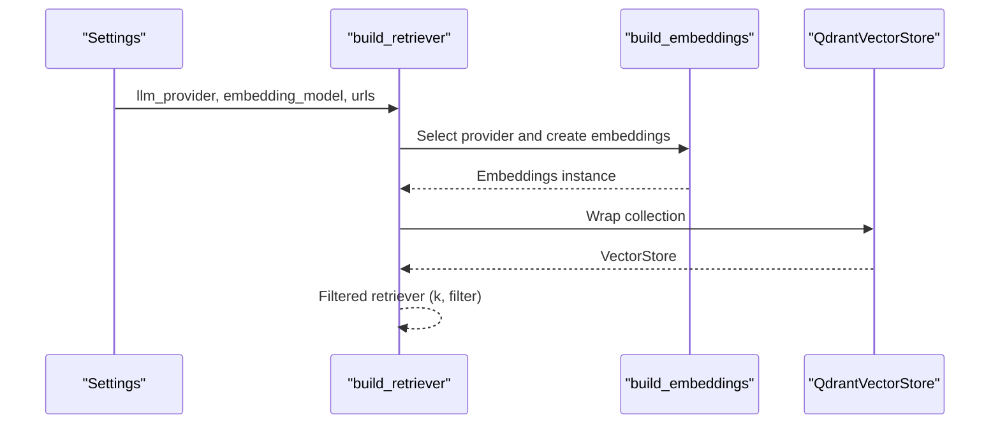

**Diagram sources**
- [retriever.py:22-102](file://app/rag/retriever.py#L22-L102)
- [config.py:10-22](file://app/config.py#L10-L22)

**Section sources**
- [retriever.py:22-62](file://app/rag/retriever.py#L22-L62)
- [retriever.py:65-102](file://app/rag/retriever.py#L65-L102)
- [config.py:10-22](file://app/config.py#L10-L22)

### RAG Chain Composition with Token-Efficient Context
The RAG chain composes a retriever, formatted context, system prompt, LLM, and output parser. It supports multiple providers and ensures consistent formatting and output handling. The token-based chunking configuration indirectly affects the quality and granularity of retrieved context, optimizing for token efficiency and retrieval performance.

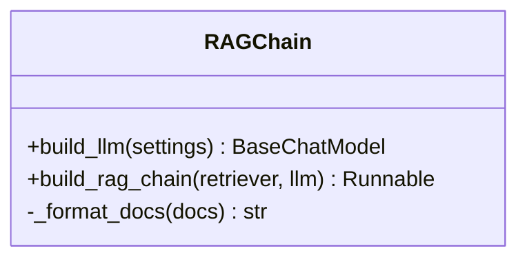

**Diagram sources**
- [chain.py:30-94](file://app/rag/chain.py#L30-L94)
- [prompts.py:5-18](file://app/rag/prompts.py#L5-L18)

**Section sources**
- [chain.py:25-27](file://app/rag/chain.py#L25-L27)
- [chain.py:30-73](file://app/rag/chain.py#L30-L73)
- [chain.py:76-94](file://app/rag/chain.py#L76-L94)
- [prompts.py:5-18](file://app/rag/prompts.py#L5-L18)

### QA Service Integration with Token-Based Processing
The QA service initializes the RAG chain at application startup, handles runtime failures gracefully, and truncates long answers to platform limits. It exposes a simple ask() API for downstream handlers. The token-based chunking configuration affects the granularity of context provided to the LLM, improving response quality and token efficiency.

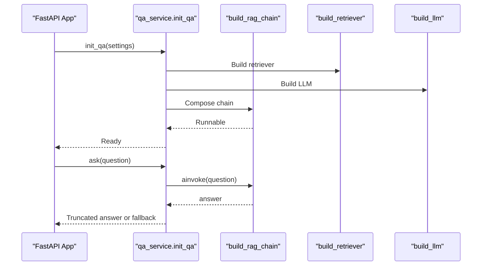

**Diagram sources**
- [qa_service.py:51-105](file://app/domain/qa_service.py#L51-L105)
- [main.py:23-82](file://app/main.py#L23-L82)
- [chain.py:76-94](file://app/rag/chain.py#L76-L94)
- [retriever.py:78-102](file://app/rag/retriever.py#L78-L102)

**Section sources**
- [qa_service.py:51-105](file://app/domain/qa_service.py#L51-L105)
- [main.py:23-82](file://app/main.py#L23-L82)

### Document Lifecycle Service with Token-Based Chunking
The DocumentService orchestrates the full document lifecycle: creating metadata, indexing chunks with token-based granularity, toggling search participation, reindexing, and deletion. It maintains consistency between SQLite metadata and Qdrant payloads regardless of document format or token-based chunking configuration.

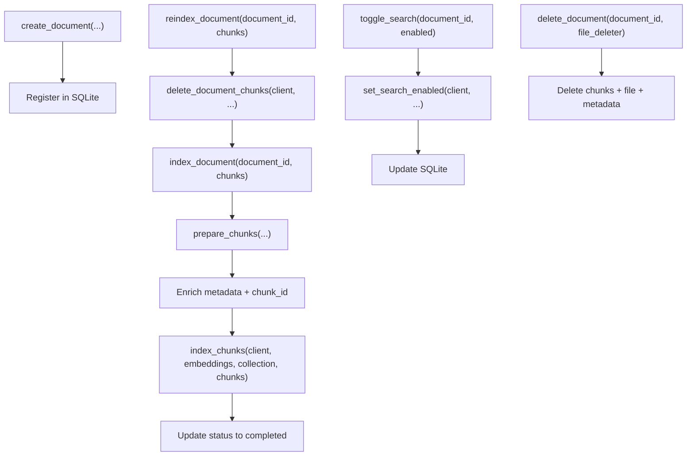

**Diagram sources**
- [document_service.py:56-132](file://app/domain/document_service.py#L56-L132)
- [document_service.py:146-177](file://app/domain/document_service.py#L146-L177)
- [document_service.py:181-231](file://app/domain/document_service.py#L181-L231)
- [document_service.py:235-279](file://app/domain/document_service.py#L235-L279)

**Section sources**
- [document_service.py:35-53](file://app/domain/document_service.py#L35-L53)
- [document_service.py:83-132](file://app/domain/document_service.py#L83-L132)
- [document_service.py:146-177](file://app/domain/document_service.py#L146-L177)
- [document_service.py:181-231](file://app/domain/document_service.py#L181-L231)
- [document_service.py:235-279](file://app/domain/document_service.py#L235-L279)

### Admin Upload Flow with Token-Based Chunking
The admin upload flow validates file types and sizes, uploads to S3, creates metadata records, and schedules background indexing with token-based chunking parameters. It supports both JSON API responses and HTMX partial updates for both .docx and .doc formats, with chunk_size and chunk_overlap passed through from settings using tiktoken encoding.

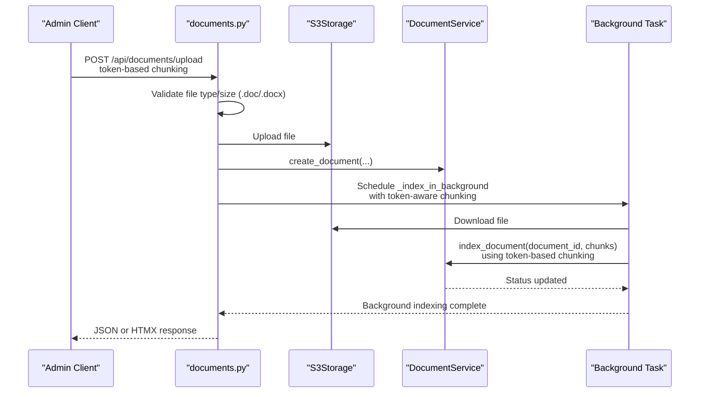

**Diagram sources**
- [documents.py:265-351](file://app/api/documents.py#L265-L351)
- [documents.py:109-128](file://app/api/documents.py#L109-L128)

**Section sources**
- [documents.py:61-86](file://app/api/documents.py#L61-L86)
- [documents.py:265-351](file://app/api/documents.py#L265-L351)
- [documents.py:109-128](file://app/api/documents.py#L109-L128)

## Dependency Analysis
The RAG Parser Enhancement exhibits clear separation of concerns with minimal coupling between modules. The addition of tiktoken for token-based processing introduces a new dependency while maintaining backward compatibility. The centralized token-based chunking configuration through Settings provides a single source of truth for chunking parameters across the entire system.

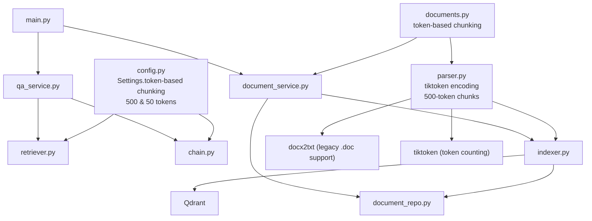

**Diagram sources**
- [config.py:40-42](file://app/config.py#L40-L42)
- [retriever.py:22-62](file://app/rag/retriever.py#L22-L62)
- [chain.py:30-73](file://app/rag/chain.py#L30-L73)
- [parser.py:11-14](file://app/rag/parser.py#L11-L14)
- [indexer.py:23-46](file://app/rag/indexer.py#L23-L46)
- [document_repo.py:69-99](file://app/storage/document_repo.py#L69-L99)
- [document_service.py:17-22](file://app/domain/document_service.py#L17-L22)
- [documents.py:53-55](file://app/api/documents.py#L53-L55)
- [qa_service.py:63-77](file://app/domain/qa_service.py#L63-L77)
- [main.py:58-68](file://app/main.py#L58-L68)

**Section sources**
- [config.py:40-42](file://app/config.py#L40-L42)
- [retriever.py:22-62](file://app/rag/retriever.py#L22-L62)
- [chain.py:30-73](file://app/rag/chain.py#L30-L73)
- [parser.py:11-14](file://app/rag/parser.py#L11-L14)
- [indexer.py:23-46](file://app/rag/indexer.py#L23-L46)
- [document_repo.py:69-99](file://app/storage/document_repo.py#L69-L99)
- [document_service.py:17-22](file://app/domain/document_service.py#L17-L22)
- [documents.py:53-55](file://app/api/documents.py#L53-L55)
- [qa_service.py:63-77](file://app/domain/qa_service.py#L63-L77)
- [main.py:58-68](file://app/main.py#L58-L68)

## Performance Considerations
- **Enhanced Token-Based Chunking Strategy**
  - The parser uses tiktoken encoding with cl100k_base for precise token counting, replacing character-based chunking with accurate token measurement
  - Default values (chunk_size: 500, chunk_overlap: 50) provide optimal performance for typical HR documents while ensuring accurate token counting
  - Token-based chunking improves LLM performance by providing context lengths that align with model token limits
  - Adjust chunk size and overlap based on document complexity and retrieval accuracy needs - smaller chunks improve precision but increase storage and processing overhead
  - Legacy .doc files are processed through docx2txt with token-based chunking, maintaining consistency across document formats
- Provider Selection
  - Embedding and LLM providers impact latency and quality. Choose providers aligned with deployment constraints and enable caching where supported.
- Batch vs. Streaming
  - Batch ingestion (scripts/ingest.py) is optimized for throughput and now supports both .docx and .doc files with token-based chunking parameters. Admin uploads leverage background tasks to avoid blocking requests.
- Vector Store Efficiency
  - Qdrant filtering excludes non-searchable chunks efficiently. Maintain collection indices and consider sharding for large-scale deployments.
- Memory and Concurrency
  - Background tasks handle file downloads and indexing; ensure adequate concurrency limits and resource allocation for sustained ingestion rates.
  - Token-based processing through tiktoken may require additional memory for large documents with complex tokenization.
  - Token-based chunking allows optimization for memory-constrained environments by reducing chunk_size while maintaining token count accuracy.

## Troubleshooting Guide
Common issues and resolutions:
- **Missing Provider Modules**
  - The system raises import errors when required extras are not installed. Install the appropriate extras for OpenAI-compatible or Ollama providers as indicated by error messages.
- **Missing tiktoken Dependency**
  - Token-based chunking requires tiktoken library. Ensure `tiktoken>=0.12.0` is installed as part of the project dependencies.
- **Missing docx2txt Dependency**
  - Legacy .doc file processing requires docx2txt library. Ensure `docx2txt>=0.8` is installed as part of the project dependencies.
- **Qdrant Connectivity**
  - Verify Qdrant URL, API key, and collection name in settings. Ensure the collection exists or allow the ingestion process to recreate it.
- **Document Status Failures**
  - Indexing failures update metadata to failed state with error details. Inspect logs and retry after resolving underlying issues.
- **Large Responses**
  - QA responses are truncated to platform limits. If answers are frequently truncated, consider adjusting chunk size or prompt to improve conciseness.
- **Background Task Errors**
  - Background indexing and reindexing log exceptions but do not block the API. Monitor logs for persistent failures and ensure temporary file cleanup occurs.
- **Format Detection Issues**
  - The load_document() dispatcher relies on file extensions. Ensure files have proper .doc or .docx extensions for correct format detection.
- **Token-Based Chunking Issues**
  - If token-based chunking parameters are not taking effect, verify they are properly passed through the call chain from Settings to the parser functions.
  - Check that the default values (500, 50) are appropriate for your document types and adjust Settings accordingly.
  - Ensure tiktoken encoding is properly configured with cl100k_base for accurate token counting.

**Section sources**
- [retriever.py:28-31](file://app/rag/retriever.py#L28-L31)
- [retriever.py:56-58](file://app/rag/retriever.py#L56-L58)
- [chain.py:36-39](file://app/rag/chain.py#L36-L39)
- [chain.py:66-68](file://app/rag/chain.py#L66-L68)
- [ingest.py:144-151](file://scripts/ingest.py#L144-L151)
- [qa_service.py:98-100](file://app/domain/qa_service.py#L98-L100)
- [parser.py:127-146](file://app/rag/parser.py#L127-L146)
- [config.py:40-42](file://app/config.py#L40-L42)

## Conclusion
The RAG Parser Enhancement delivers a robust, extensible pipeline for processing HR documents into a searchable knowledge base with token-based chunking accuracy and comprehensive testing. By implementing tiktoken encoding with cl100k_base for precise token counting, structuring content around headings for .docx files and providing unified processing for legacy .doc files, intelligently chunking text with 500-token chunk size and 50-token overlap, enriching metadata with token-aware chunk information, and integrating seamlessly with Qdrant and multiple LLM providers, the system supports both automated batch ingestion and interactive admin workflows. The new token-based dispatcher ensures backward compatibility while expanding document ingestion capabilities with precise token measurement, and the centralized token-based configuration provides optimal chunking parameters across different document types. The modular design, comprehensive tests covering both .docx and .doc formats with token-based validation, and clear separation of concerns facilitate maintenance, scaling, and future enhancements with superior retrieval performance and token efficiency.