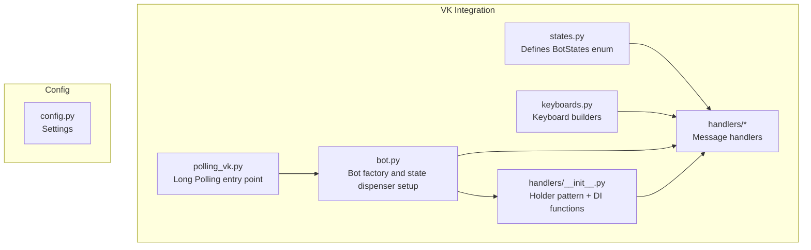
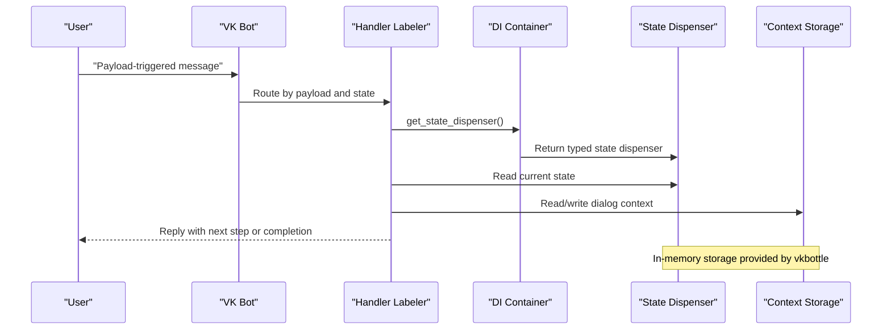
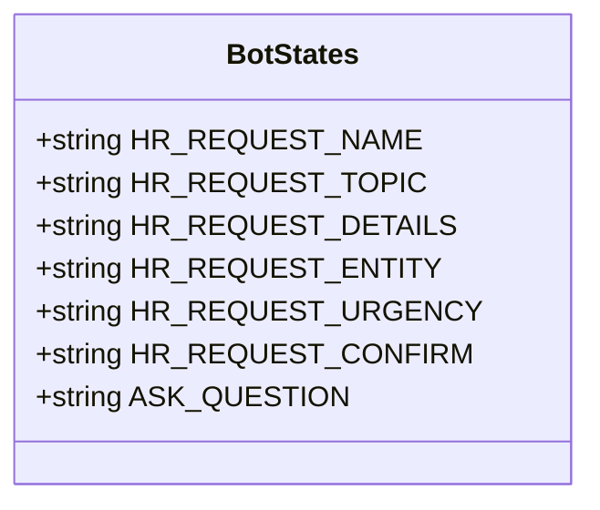
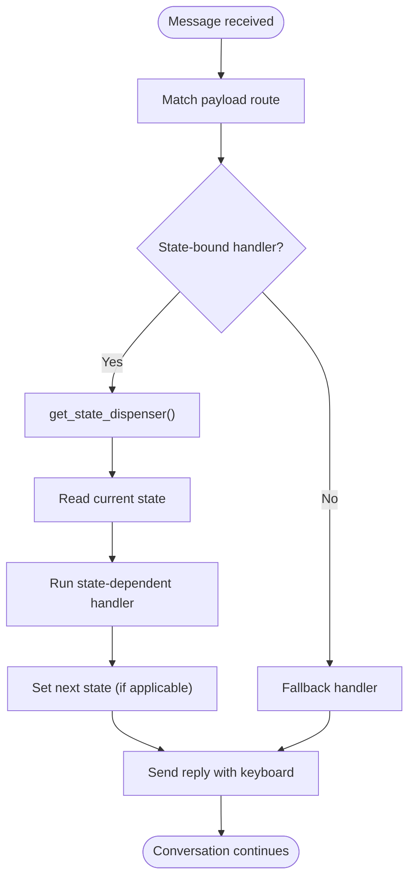
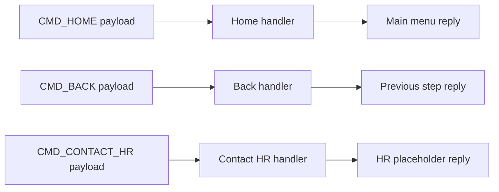
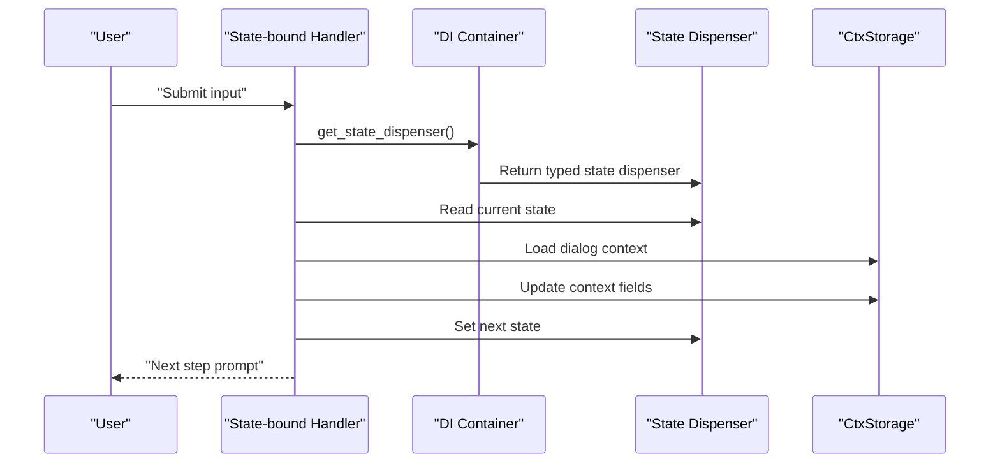
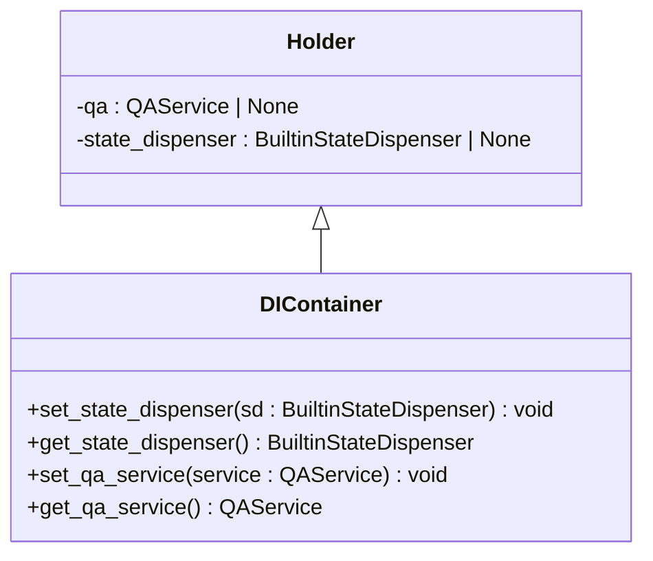
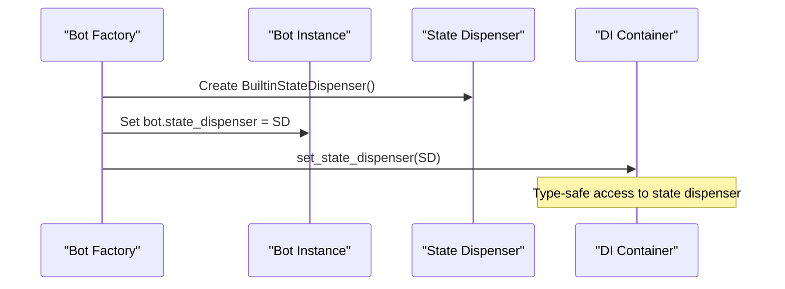
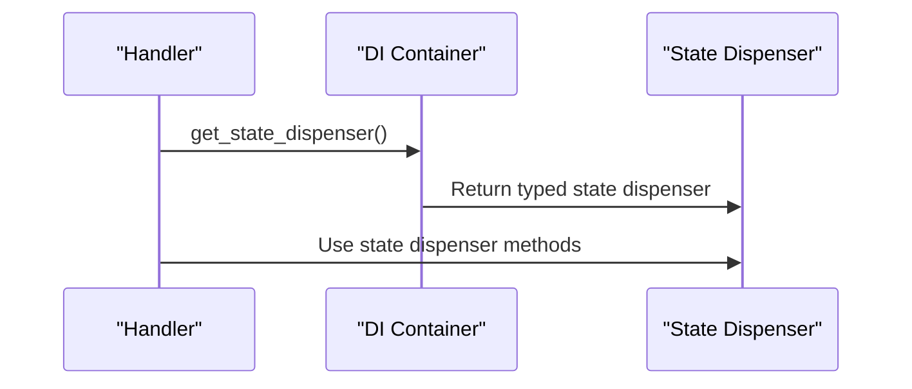
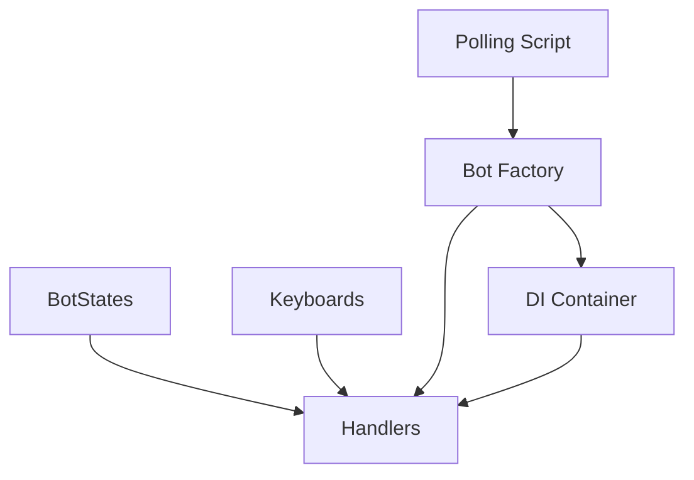

# State Management

<cite>
**Referenced Files in This Document**
- [states.py](file://app/integrations/vk/states.py)
- [test_states.py](file://tests/test_states.py)
- [bot.py](file://app/integrations/vk/bot.py)
- [keyboards.py](file://app/integrations/vk/keyboards.py)
- [polling_vk.py](file://scripts/polling_vk.py)
- [PLAN.md](file://PLAN.md)
- [config.py](file://app/config.py)
- [start.py](file://app/integrations/vk/handlers/start.py)
- [sections.py](file://app/integrations/vk/handlers/sections.py)
- [fallback.py](file://app/integrations/vk/handlers/fallback.py)
- [__init__.py](file://app/integrations/vk/handlers/__init__.py)
- [hr_request.py](file://app/integrations/vk/handlers/hr_request.py)
- [ask.py](file://app/integrations/vk/handlers/ask.py)
</cite>

## Update Summary
**Changes Made**
- Updated centralized state dispenser management section to reflect new set_state_dispenser() and get_state_dispenser() functions
- Added documentation for the new Holder pattern and dependency injection approach
- Updated architecture diagrams to show the centralized state dispenser pattern
- Enhanced troubleshooting guide with new state dispenser-related debugging strategies

## Table of Contents
1. [Introduction](#introduction)
2. [Project Structure](#project-structure)
3. [Core Components](#core-components)
4. [Architecture Overview](#architecture-overview)
5. [Detailed Component Analysis](#detailed-component-analysis)
6. [Centralized State Dispenser Management](#centralized-state-dispenser-management)
7. [Dependency Analysis](#dependency-analysis)
8. [Performance Considerations](#performance-considerations)
9. [Troubleshooting Guide](#troubleshooting-guide)
10. [Conclusion](#conclusion)

## Introduction
This document explains the multi-step dialog state management system used by the VK bot. It covers the state machine implementation, enum-based state definitions, context management, and state transition patterns. The system now features centralized state dispenser management through a dependency injection pattern, improving type safety, reducing coupling, and providing better testability. It also documents how states control complex HR request workflows, manage conversation context, and handle user input validation. Practical examples show how to add new states, implement complex dialog flows, and debug state-related issues. Finally, it addresses state persistence considerations and best practices for maintaining conversation continuity.

## Project Structure
The state management system centers around a dedicated VK integration module with a clear separation of concerns and centralized state dispenser management:
- State definitions live in a single enum-like class.
- Handlers register routes and bind state-dependent behavior.
- Keyboards provide consistent navigation and service actions.
- The bot factory wires handlers and manages state dispenser lifecycle.
- A centralized dependency injection system provides type-safe access to the state dispenser.
- Tests validate state definitions and expected behaviors.

**Diagram sources**
- [states.py:1-17](file://app/integrations/vk/states.py#L1-L17)
- [bot.py:1-59](file://app/integrations/vk/bot.py#L1-L59)
- [handlers/__init__.py:1-63](file://app/integrations/vk/handlers/__init__.py#L1-L63)
- [keyboards.py:1-322](file://app/integrations/vk/keyboards.py#L1-L322)
- [polling_vk.py:1-33](file://scripts/polling_vk.py#L1-L33)
- [config.py:1-9](file://app/config.py#L1-L9)

**Section sources**
- [states.py:1-17](file://app/integrations/vk/states.py#L1-L17)
- [bot.py:14-59](file://app/integrations/vk/bot.py#L14-L59)
- [handlers/__init__.py:1-63](file://app/integrations/vk/handlers/__init__.py#L1-L63)
- [keyboards.py:1-322](file://app/integrations/vk/keyboards.py#L1-L322)
- [polling_vk.py:24-28](file://scripts/polling_vk.py#L24-L28)
- [config.py:4-9](file://app/config.py#L4-L9)

## Core Components
- State definitions: Enum-like states for multi-step dialogs, including a six-step HR request flow and free-text question handling.
- Handler labelers: Ordered routing of messages to handlers based on payload and state.
- Navigation keys: Consistent service buttons (Back/Home/Contact HR) across all screens.
- Centralized state dispenser: Dependency injection pattern providing type-safe access to vkbottle's state dispenser.
- Bot wiring: Factory that loads labelers, initializes state dispenser, and manages DI setup.
- Tests: Assertions validating state shape, uniqueness, and DI functionality.

Key implementation references:
- State definitions and HR request steps: [states.py:4-17](file://app/integrations/vk/states.py#L4-L17)
- Handler loading order and bot wiring: [bot.py:45-59](file://app/integrations/vk/bot.py#L45-L59)
- Centralized DI pattern: [handlers/__init__.py:13-39](file://app/integrations/vk/handlers/__init__.py#L13-L39)
- Keyboard payload constants and service row builder: [keyboards.py:13-83](file://app/integrations/vk/keyboards.py#L13-L83)
- Test coverage for state definitions: [test_states.py:8-31](file://tests/test_states.py#L8-L31)

**Section sources**
- [states.py:4-17](file://app/integrations/vk/states.py#L4-L17)
- [bot.py:45-59](file://app/integrations/vk/bot.py#L45-L59)
- [handlers/__init__.py:13-39](file://app/integrations/vk/handlers/__init__.py#L13-L39)
- [keyboards.py:13-83](file://app/integrations/vk/keyboards.py#L13-L83)
- [test_states.py:8-31](file://tests/test_states.py#L8-L31)

## Architecture Overview
The state management architecture leverages vkbottle's state dispenser with a centralized dependency injection pattern. The bot factory creates and registers the state dispenser, then injects it into the handlers module via set_state_dispenser(). Handlers access the state dispenser through get_state_dispenser(), providing type safety and improved testability. Payload-driven routing ensures deterministic transitions. The bot factory registers labelers in a specific order to guarantee proper precedence.

**Diagram sources**
- [bot.py:45-59](file://app/integrations/vk/bot.py#L45-L59)
- [handlers/__init__.py:32-39](file://app/integrations/vk/handlers/__init__.py#L32-L39)
- [PLAN.md:20-28](file://PLAN.md#L20-L28)

**Section sources**
- [bot.py:45-59](file://app/integrations/vk/bot.py#L45-L59)
- [handlers/__init__.py:32-39](file://app/integrations/vk/handlers/__init__.py#L32-L39)
- [PLAN.md:20-28](file://PLAN.md#L20-L28)

## Detailed Component Analysis

### State Definitions and Enum-Based States
The BotStates class defines the canonical set of states for multi-step dialogs. The HR request flow is modeled as a sequence of six states, enabling structured progression and validation at each step. A free-text question state is also included for Block 9 functionality.

**Diagram sources**
- [states.py:4-17](file://app/integrations/vk/states.py#L4-L17)

Implementation highlights:
- States are string-valued identifiers suitable for vkbottle's BaseStateGroup.
- The HR request states are grouped under a single class for discoverability and testing.
- Tests confirm subclassing from BaseStateGroup, count of HR states, uniqueness of values, and presence of expected names.
- Free-text question state supports Block 9 scenarios.

Practical usage references:
- Defining states: [states.py:8-17](file://app/integrations/vk/states.py#L8-L17)
- Tests asserting state shape and values: [test_states.py:9-30](file://tests/test_states.py#L9-L30)

**Section sources**
- [states.py:4-17](file://app/integrations/vk/states.py#L4-L17)
- [test_states.py:9-30](file://tests/test_states.py#L9-L30)

### Handler Routing and State-Dependent Transitions
Handlers are organized by labelers and loaded in a specific order to ensure fallback behavior is last. Payload-driven routing enables state-dependent transitions and consistent navigation. The centralized state dispenser pattern allows handlers to access the state dispenser through dependency injection.

**Diagram sources**
- [bot.py:45-59](file://app/integrations/vk/bot.py#L45-L59)
- [handlers/__init__.py:32-39](file://app/integrations/vk/handlers/__init__.py#L32-L39)
- [start.py:31-50](file://app/integrations/vk/handlers/start.py#L31-L50)
- [sections.py:28-81](file://app/integrations/vk/handlers/sections.py#L28-L81)
- [fallback.py:15-18](file://app/integrations/vk/handlers/fallback.py#L15-L18)

Behavioral anchors:
- Ordered labelers: [bot.py:32-42](file://app/integrations/vk/bot.py#L32-L42)
- Start and home handlers: [start.py:31-50](file://app/integrations/vk/handlers/start.py#L31-L50)
- Section entry handlers (stubs): [sections.py:28-81](file://app/integrations/vk/handlers/sections.py#L28-L81)
- Fallback handler: [fallback.py:15-18](file://app/integrations/vk/handlers/fallback.py#L15-L18)

**Section sources**
- [bot.py:32-59](file://app/integrations/vk/bot.py#L32-L59)
- [handlers/__init__.py:32-39](file://app/integrations/vk/handlers/__init__.py#L32-L39)
- [start.py:31-50](file://app/integrations/vk/handlers/start.py#L31-L50)
- [sections.py:28-81](file://app/integrations/vk/handlers/sections.py#L28-L81)
- [fallback.py:15-18](file://app/integrations/vk/handlers/fallback.py#L15-L18)

### Navigation Keys and Conversation Context
Navigation keys provide consistent service actions across all screens, ensuring users can move backward, return to the main menu, or contact HR at any time. These payloads are used by handlers to trigger state transitions and maintain context continuity. The centralized state dispenser pattern ensures consistent access to state management across all handlers.

**Diagram sources**
- [keyboards.py:13-26](file://app/integrations/vk/keyboards.py#L13-L26)
- [start.py:39-50](file://app/integrations/vk/handlers/start.py#L39-L50)
- [sections.py:28-81](file://app/integrations/vk/handlers/sections.py#L28-L81)

References:
- Payload constants: [keyboards.py:13-26](file://app/integrations/vk/keyboards.py#L13-L26)
- Service row builder: [keyboards.py:62-83](file://app/integrations/vk/keyboards.py#L62-L83)
- Home handler: [start.py:39-50](file://app/integrations/vk/handlers/start.py#L39-L50)
- Contact HR handler: [start.py:43-49](file://app/integrations/vk/handlers/start.py#L43-L49)

**Section sources**
- [keyboards.py:13-83](file://app/integrations/vk/keyboards.py#L13-L83)
- [start.py:39-50](file://app/integrations/vk/handlers/start.py#L39-L50)
- [sections.py:28-81](file://app/integrations/vk/handlers/sections.py#L28-L81)

### Context Management and Persistence
According to the development plan, dialog context for scenario S-70 is stored using CtxStorage, an in-memory storage provided by vkbottle. This enables conversation continuity across steps without external persistence during early development. The centralized state dispenser pattern ensures consistent access to context storage across all handlers.

**Diagram sources**
- [PLAN.md:20-28](file://PLAN.md#L20-L28)
- [handlers/__init__.py:32-39](file://app/integrations/vk/handlers/__init__.py#L32-L39)

Operational notes:
- Context storage is in-memory and part of vkbottle's state management toolkit.
- State transitions are explicit and driven by handlers and user actions.
- The centralized DI pattern ensures type-safe access to the state dispenser.
- Persistence considerations are deferred to later phases; current implementation relies on in-memory storage.

**Section sources**
- [PLAN.md:20-28](file://PLAN.md#L20-L28)
- [handlers/__init__.py:32-39](file://app/integrations/vk/handlers/__init__.py#L32-L39)

### Adding New States and Extending Dialog Flows
To add a new multi-step dialog:
1. Define new state constants in the BotStates class.
2. Create state-bound handlers that read and update context, validate input, and set the next state using the centralized state dispenser pattern.
3. Wire keyboard payloads to support Back/Home/Contact HR actions.
4. Register new labelers and ensure proper ordering relative to fallback.
5. Import and use get_state_dispenser() in new handlers for type-safe state access.

Example references:
- Define states: [states.py:8-17](file://app/integrations/vk/states.py#L8-L17)
- Handler pattern (payload routes): [sections.py:28-81](file://app/integrations/vk/handlers/sections.py#L28-L81)
- Keyboard payload constants: [keyboards.py:13-26](file://app/integrations/vk/keyboards.py#L13-L26)
- State dispenser usage: [hr_request.py:19](file://app/integrations/vk/handlers/hr_request.py#L19)

Best practices:
- Keep state values unique and descriptive.
- Validate inputs at each step and guide users back on invalid entries.
- Use consistent navigation keys to avoid disorientation.
- Add tests mirroring the existing state tests to ensure correctness.
- Always use get_state_dispenser() for accessing the state dispenser in handlers.

**Section sources**
- [states.py:8-17](file://app/integrations/vk/states.py#L8-L17)
- [sections.py:28-81](file://app/integrations/vk/handlers/sections.py#L28-L81)
- [keyboards.py:13-26](file://app/integrations/vk/keyboards.py#L13-L26)
- [test_states.py:12-18](file://tests/test_states.py#L12-L18)
- [hr_request.py:19](file://app/integrations/vk/handlers/hr_request.py#L19)

### Debugging State-Related Issues
Common debugging strategies:
- Verify handler loading order to ensure fallback is last: [bot.py:32-42](file://app/integrations/vk/bot.py#L32-L42)
- Confirm state values match expectations using tests: [test_states.py:20-30](file://tests/test_states.py#L20-L30)
- Inspect payload routing by checking handler decorators: [sections.py:28-81](file://app/integrations/vk/handlers/sections.py#L28-L81)
- Validate keyboard payloads and service rows: [keyboards.py:13-83](file://app/integrations/vk/keyboards.py#L13-L83)
- Check DI container initialization: [bot.py:49-52](file://app/integrations/vk/bot.py#L49-L52)
- Verify state dispenser access: [handlers/__init__.py:32-39](file://app/integrations/vk/handlers/__init__.py#L32-L39)

**Section sources**
- [bot.py:32-59](file://app/integrations/vk/bot.py#L32-L59)
- [test_states.py:20-30](file://tests/test_states.py#L20-L30)
- [sections.py:28-81](file://app/integrations/vk/handlers/sections.py#L28-L81)
- [keyboards.py:13-83](file://app/integrations/vk/keyboards.py#L13-L83)
- [bot.py:49-52](file://app/integrations/vk/bot.py#L49-L52)
- [handlers/__init__.py:32-39](file://app/integrations/vk/handlers/__init__.py#L32-L39)

## Centralized State Dispenser Management

**Updated** The state management system now features centralized state dispenser management through a dependency injection pattern, replacing the previous global state dispenser approach.

### Dependency Injection Pattern
The system uses a Holder pattern with set_state_dispenser() and get_state_dispenser() functions to manage state dispenser lifecycle:

**Diagram sources**
- [handlers/__init__.py:13-39](file://app/integrations/vk/handlers/__init__.py#L13-L39)

### Bot Factory Integration
The bot factory creates and registers the state dispenser, then injects it into the DI container:

**Diagram sources**
- [bot.py:49-52](file://app/integrations/vk/bot.py#L49-L52)

### Handler Access Pattern
Handlers access the state dispenser through the DI container, ensuring type safety and testability:

**Diagram sources**
- [handlers/__init__.py:32-39](file://app/integrations/vk/handlers/__init__.py#L32-L39)
- [hr_request.py:69](file://app/integrations/vk/handlers/hr_request.py#L69)

Implementation highlights:
- The Holder class maintains a single instance of the state dispenser.
- set_state_dispenser() provides type-safe injection of the state dispenser.
- get_state_dispenser() provides type-safe access with runtime validation.
- The DI pattern reduces coupling between handlers and the underlying state management system.
- Improved testability allows mocking of the state dispenser in unit tests.

**Section sources**
- [handlers/__init__.py:13-39](file://app/integrations/vk/handlers/__init__.py#L13-L39)
- [bot.py:49-52](file://app/integrations/vk/bot.py#L49-L52)
- [hr_request.py:69](file://app/integrations/vk/handlers/hr_request.py#L69)

## Dependency Analysis
The state management system exhibits low coupling and high cohesion with improved dependency management:
- States are decoupled from handlers and keyboards via payload routing.
- Handlers depend on the DI container for state dispenser access, not on global state.
- The DI container centralizes state dispenser lifecycle management.
- The bot factory coordinates state dispenser creation and injection.
- Handlers depend on keyboards for consistent navigation.
- The bot factory centralizes labeler registration and startup.

**Diagram sources**
- [states.py:4-17](file://app/integrations/vk/states.py#L4-L17)
- [bot.py:45-59](file://app/integrations/vk/bot.py#L45-L59)
- [handlers/__init__.py:13-39](file://app/integrations/vk/handlers/__init__.py#L13-L39)
- [keyboards.py:13-83](file://app/integrations/vk/keyboards.py#L13-L83)
- [polling_vk.py:24-28](file://scripts/polling_vk.py#L24-L28)
- [config.py:4-9](file://app/config.py#L4-L9)

**Section sources**
- [states.py:4-17](file://app/integrations/vk/states.py#L4-L17)
- [bot.py:45-59](file://app/integrations/vk/bot.py#L45-L59)
- [handlers/__init__.py:13-39](file://app/integrations/vk/handlers/__init__.py#L13-L39)
- [keyboards.py:13-83](file://app/integrations/vk/keyboards.py#L13-L83)
- [polling_vk.py:24-28](file://scripts/polling_vk.py#L24-L28)
- [config.py:4-9](file://app/config.py#L4-L9)

## Performance Considerations
- In-memory state and context storage simplify deployment but limit cross-instance continuity.
- The centralized DI pattern adds minimal overhead while providing better type safety.
- Keep handler logic lightweight; delegate heavy processing to asynchronous tasks or external services.
- Reuse keyboard builders to minimize repeated construction overhead.
- Avoid unnecessary state transitions; only advance when validated input is received.
- The DI pattern enables better caching and reuse of state dispenser instances.

## Troubleshooting Guide
- Symptom: Messages not routed to state-bound handlers.
  - Check handler loading order and ensure fallback is last: [bot.py:32-42](file://app/integrations/vk/bot.py#L32-L42)
- Symptom: Duplicate or missing state values.
  - Validate with tests asserting uniqueness and presence: [test_states.py:16-18](file://tests/test_states.py#L16-L18), [test_states.py:20-30](file://tests/test_states.py#L20-L30)
- Symptom: Navigation keys not working.
  - Confirm payload constants and service row builder usage: [keyboards.py:13-83](file://app/integrations/vk/keyboards.py#L13-L83)
- Symptom: Unexpected fallback replies.
  - Review fallback handler and ensure payload routes are defined: [fallback.py:15-18](file://app/integrations/vk/handlers/fallback.py#L15-L18)
- Symptom: State dispenser not initialized error.
  - Verify bot factory initialization: [bot.py:49-52](file://app/integrations/vk/bot.py#L49-L52)
- Symptom: Type errors when accessing state dispenser.
  - Ensure handlers import get_state_dispenser(): [hr_request.py:19](file://app/integrations/vk/handlers/hr_request.py#L19)

**Section sources**
- [bot.py:32-59](file://app/integrations/vk/bot.py#L32-L59)
- [test_states.py:16-18](file://tests/test_states.py#L16-L18)
- [test_states.py:20-30](file://tests/test_states.py#L20-L30)
- [keyboards.py:13-83](file://app/integrations/vk/keyboards.py#L13-L83)
- [fallback.py:15-18](file://app/integrations/vk/handlers/fallback.py#L15-L18)
- [bot.py:49-52](file://app/integrations/vk/bot.py#L49-L52)
- [hr_request.py:19](file://app/integrations/vk/handlers/hr_request.py#L19)

## Conclusion
The state management system provides a clean, extensible foundation for multi-step dialogs in the VK bot. The centralized state dispenser management through dependency injection improves type safety, reduces coupling, and enhances testability while maintaining the existing state machine architecture. By defining states in a centralized enum, binding handlers to those states through the DI pattern, and enforcing consistent navigation via keyboards, the system supports complex HR request workflows while maintaining clarity and testability. As development progresses, consider migrating to persistent context storage and expanding validation logic to further improve reliability and user experience.