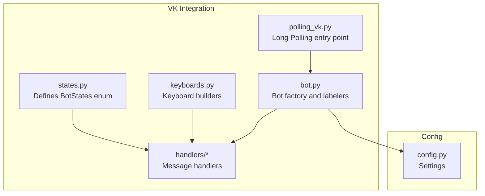
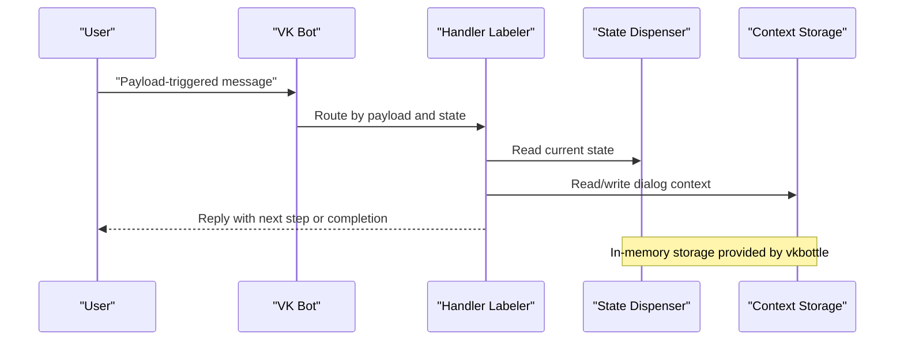
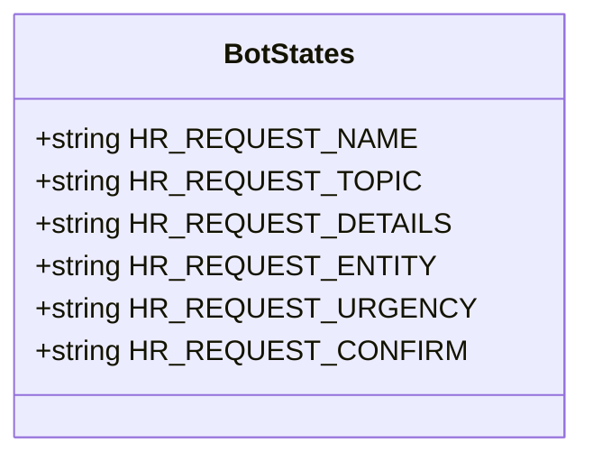
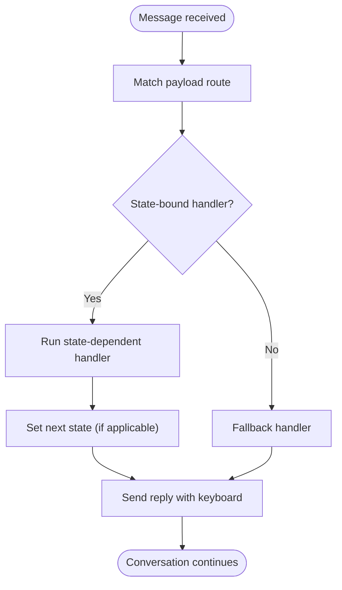
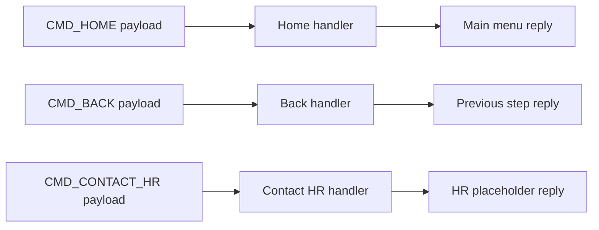
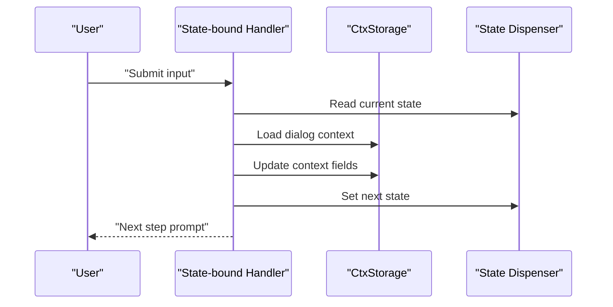
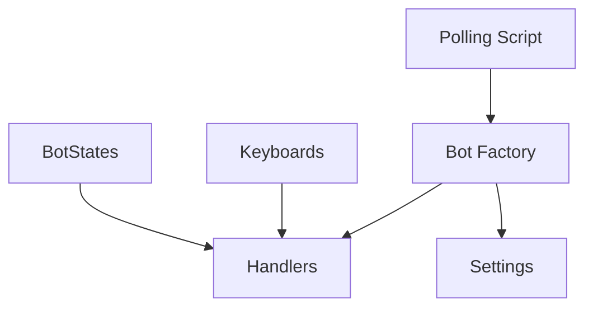

# State Management

<cite>
**Referenced Files in This Document**
- [states.py](file://app/integrations/vk/states.py)
- [test_states.py](file://tests/test_states.py)
- [bot.py](file://app/integrations/vk/bot.py)
- [keyboards.py](file://app/integrations/vk/keyboards.py)
- [polling_vk.py](file://scripts/polling_vk.py)
- [PLAN.md](file://PLAN.md)
- [config.py](file://app/config.py)
- [start.py](file://app/integrations/vk/handlers/start.py)
- [sections.py](file://app/integrations/vk/handlers/sections.py)
- [fallback.py](file://app/integrations/vk/handlers/fallback.py)
</cite>

## Table of Contents
1. [Introduction](#introduction)
2. [Project Structure](#project-structure)
3. [Core Components](#core-components)
4. [Architecture Overview](#architecture-overview)
5. [Detailed Component Analysis](#detailed-component-analysis)
6. [Dependency Analysis](#dependency-analysis)
7. [Performance Considerations](#performance-considerations)
8. [Troubleshooting Guide](#troubleshooting-guide)
9. [Conclusion](#conclusion)

## Introduction
This document explains the multi-step dialog state management system used by the VK bot. It covers the state machine implementation, enum-based state definitions, context management, and state transition patterns. It also documents how states control complex HR request workflows, manage conversation context, and handle user input validation. Practical examples show how to add new states, implement complex dialog flows, and debug state-related issues. Finally, it addresses state persistence considerations and best practices for maintaining conversation continuity.

## Project Structure
The state management system centers around a dedicated VK integration module with a clear separation of concerns:
- State definitions live in a single enum-like class.
- Handlers register routes and bind state-dependent behavior.
- Keyboards provide consistent navigation and service actions.
- The bot factory wires handlers and runs the polling loop.
- Tests validate state definitions and expected behaviors.

**Diagram sources**
- [states.py:1-14](file://app/integrations/vk/states.py#L1-L14)
- [bot.py:1-32](file://app/integrations/vk/bot.py#L1-L32)
- [keyboards.py:1-108](file://app/integrations/vk/keyboards.py#L1-L108)
- [polling_vk.py:1-33](file://scripts/polling_vk.py#L1-L33)
- [config.py:1-9](file://app/config.py#L1-L9)

**Section sources**
- [states.py:1-14](file://app/integrations/vk/states.py#L1-L14)
- [bot.py:14-31](file://app/integrations/vk/bot.py#L14-L31)
- [keyboards.py:1-108](file://app/integrations/vk/keyboards.py#L1-L108)
- [polling_vk.py:24-28](file://scripts/polling_vk.py#L24-L28)
- [config.py:4-9](file://app/config.py#L4-L9)

## Core Components
- State definitions: Enum-like states for multi-step dialogs, including a six-step HR request flow.
- Handler labelers: Ordered routing of messages to handlers based on payload and state.
- Navigation keys: Consistent service buttons (Back/Home/Contact HR) across all screens.
- Bot wiring: Factory that loads labelers and starts long polling.
- Tests: Assertions validating state shape and uniqueness.

Key implementation references:
- State definitions and HR request steps: [states.py:4-13](file://app/integrations/vk/states.py#L4-L13)
- Handler loading order and bot wiring: [bot.py:16-31](file://app/integrations/vk/bot.py#L16-L31)
- Keyboard payload constants and service row builder: [keyboards.py:13-50](file://app/integrations/vk/keyboards.py#L13-L50)
- Test coverage for state definitions: [test_states.py:8-31](file://tests/test_states.py#L8-L31)

**Section sources**
- [states.py:4-13](file://app/integrations/vk/states.py#L4-L13)
- [bot.py:16-31](file://app/integrations/vk/bot.py#L16-L31)
- [keyboards.py:13-50](file://app/integrations/vk/keyboards.py#L13-L50)
- [test_states.py:8-31](file://tests/test_states.py#L8-L31)

## Architecture Overview
The state management architecture leverages vkbottle’s state dispenser and context storage. States are bound to handlers to control multi-step flows. Payload-driven routing ensures deterministic transitions. The bot factory registers labelers in a specific order to guarantee proper precedence.

**Diagram sources**
- [bot.py:16-31](file://app/integrations/vk/bot.py#L16-L31)
- [PLAN.md:20-28](file://PLAN.md#L20-L28)

**Section sources**
- [bot.py:16-31](file://app/integrations/vk/bot.py#L16-L31)
- [PLAN.md:20-28](file://PLAN.md#L20-L28)

## Detailed Component Analysis

### State Definitions and Enum-Based States
The BotStates class defines the canonical set of states for multi-step dialogs. The HR request flow is modeled as a sequence of six states, enabling structured progression and validation at each step.

**Diagram sources**
- [states.py:4-13](file://app/integrations/vk/states.py#L4-L13)

Implementation highlights:
- States are string-valued identifiers suitable for vkbottle’s BaseStateGroup.
- The HR request states are grouped under a single class for discoverability and testing.
- Tests confirm subclassing from BaseStateGroup, count of HR states, uniqueness of values, and presence of expected names.

Practical usage references:
- Defining states: [states.py:8-13](file://app/integrations/vk/states.py#L8-L13)
- Tests asserting state shape and values: [test_states.py:9-30](file://tests/test_states.py#L9-L30)

**Section sources**
- [states.py:4-13](file://app/integrations/vk/states.py#L4-L13)
- [test_states.py:9-30](file://tests/test_states.py#L9-L30)

### Handler Routing and State-Dependent Transitions
Handlers are organized by labelers and loaded in a specific order to ensure fallback behavior is last. Payload-driven routing enables state-dependent transitions and consistent navigation.

**Diagram sources**
- [bot.py:16-20](file://app/integrations/vk/bot.py#L16-L20)
- [start.py:31-33](file://app/integrations/vk/handlers/start.py#L31-L33)
- [sections.py:28-81](file://app/integrations/vk/handlers/sections.py#L28-L81)
- [fallback.py:15-17](file://app/integrations/vk/handlers/fallback.py#L15-L17)

Behavioral anchors:
- Ordered labelers: [bot.py:16-20](file://app/integrations/vk/bot.py#L16-L20)
- Start and home handlers: [start.py:31-41](file://app/integrations/vk/handlers/start.py#L31-L41)
- Section entry handlers (stubs): [sections.py:28-81](file://app/integrations/vk/handlers/sections.py#L28-L81)
- Fallback handler: [fallback.py:15-17](file://app/integrations/vk/handlers/fallback.py#L15-L17)

**Section sources**
- [bot.py:16-20](file://app/integrations/vk/bot.py#L16-L20)
- [start.py:31-41](file://app/integrations/vk/handlers/start.py#L31-L41)
- [sections.py:28-81](file://app/integrations/vk/handlers/sections.py#L28-L81)
- [fallback.py:15-17](file://app/integrations/vk/handlers/fallback.py#L15-L17)

### Navigation Keys and Conversation Context
Navigation keys provide consistent service actions across all screens, ensuring users can move backward, return to the main menu, or contact HR at any time. These payloads are used by handlers to trigger state transitions and maintain context continuity.

**Diagram sources**
- [keyboards.py:13-24](file://app/integrations/vk/keyboards.py#L13-L24)
- [start.py:39-54](file://app/integrations/vk/handlers/start.py#L39-L54)
- [sections.py:28-81](file://app/integrations/vk/handlers/sections.py#L28-L81)

References:
- Payload constants: [keyboards.py:13-24](file://app/integrations/vk/keyboards.py#L13-L24)
- Service row builder: [keyboards.py:29-50](file://app/integrations/vk/keyboards.py#L29-L50)
- Home handler: [start.py:39-41](file://app/integrations/vk/handlers/start.py#L39-L41)
- Contact HR handler: [start.py:47-54](file://app/integrations/vk/handlers/start.py#L47-L54)

**Section sources**
- [keyboards.py:13-50](file://app/integrations/vk/keyboards.py#L13-L50)
- [start.py:39-54](file://app/integrations/vk/handlers/start.py#L39-L54)
- [sections.py:28-81](file://app/integrations/vk/handlers/sections.py#L28-L81)

### Context Management and Persistence
According to the development plan, dialog context for scenario S-70 is stored using CtxStorage, an in-memory storage provided by vkbottle. This enables conversation continuity across steps without external persistence during early development.

**Diagram sources**
- [PLAN.md:20-28](file://PLAN.md#L20-L28)

Operational notes:
- Context storage is in-memory and part of vkbottle’s state management toolkit.
- State transitions are explicit and driven by handlers and user actions.
- Persistence considerations are deferred to later phases; current implementation relies on in-memory storage.

**Section sources**
- [PLAN.md:20-28](file://PLAN.md#L20-L28)

### Adding New States and Extending Dialog Flows
To add a new multi-step dialog:
1. Define new state constants in the BotStates class.
2. Create state-bound handlers that read and update context, validate input, and set the next state.
3. Wire keyboard payloads to support Back/Home/Contact HR actions.
4. Register new labelers and ensure proper ordering relative to fallback.

Example references:
- Define states: [states.py:8-13](file://app/integrations/vk/states.py#L8-L13)
- Handler pattern (payload routes): [sections.py:28-81](file://app/integrations/vk/handlers/sections.py#L28-L81)
- Keyboard payload constants: [keyboards.py:13-24](file://app/integrations/vk/keyboards.py#L13-L24)

Best practices:
- Keep state values unique and descriptive.
- Validate inputs at each step and guide users back on invalid entries.
- Use consistent navigation keys to avoid disorientation.
- Add tests mirroring the existing state tests to ensure correctness.

**Section sources**
- [states.py:8-13](file://app/integrations/vk/states.py#L8-L13)
- [sections.py:28-81](file://app/integrations/vk/handlers/sections.py#L28-L81)
- [keyboards.py:13-24](file://app/integrations/vk/keyboards.py#L13-L24)
- [test_states.py:12-18](file://tests/test_states.py#L12-L18)

### Debugging State-Related Issues
Common debugging strategies:
- Verify handler loading order to ensure fallback is last: [bot.py:16-20](file://app/integrations/vk/bot.py#L16-L20)
- Confirm state values match expectations using tests: [test_states.py:20-30](file://tests/test_states.py#L20-L30)
- Inspect payload routing by checking handler decorators: [sections.py:28-81](file://app/integrations/vk/handlers/sections.py#L28-L81)
- Validate keyboard payloads and service rows: [keyboards.py:13-50](file://app/integrations/vk/keyboards.py#L13-L50)

**Section sources**
- [bot.py:16-20](file://app/integrations/vk/bot.py#L16-L20)
- [test_states.py:20-30](file://tests/test_states.py#L20-L30)
- [sections.py:28-81](file://app/integrations/vk/handlers/sections.py#L28-L81)
- [keyboards.py:13-50](file://app/integrations/vk/keyboards.py#L13-L50)

## Dependency Analysis
The state management system exhibits low coupling and high cohesion:
- States are decoupled from handlers and keyboards via payload routing.
- Handlers depend on keyboards for consistent navigation.
- The bot factory centralizes labeler registration and startup.

**Diagram sources**
- [states.py:4-13](file://app/integrations/vk/states.py#L4-L13)
- [bot.py:16-31](file://app/integrations/vk/bot.py#L16-L31)
- [keyboards.py:13-50](file://app/integrations/vk/keyboards.py#L13-L50)
- [polling_vk.py:24-28](file://scripts/polling_vk.py#L24-L28)
- [config.py:4-9](file://app/config.py#L4-L9)

**Section sources**
- [states.py:4-13](file://app/integrations/vk/states.py#L4-L13)
- [bot.py:16-31](file://app/integrations/vk/bot.py#L16-L31)
- [keyboards.py:13-50](file://app/integrations/vk/keyboards.py#L13-L50)
- [polling_vk.py:24-28](file://scripts/polling_vk.py#L24-L28)
- [config.py:4-9](file://app/config.py#L4-L9)

## Performance Considerations
- In-memory state and context storage simplify deployment but limit cross-instance continuity.
- Keep handler logic lightweight; delegate heavy processing to asynchronous tasks or external services.
- Reuse keyboard builders to minimize repeated construction overhead.
- Avoid unnecessary state transitions; only advance when validated input is received.

## Troubleshooting Guide
- Symptom: Messages not routed to state-bound handlers.
  - Check handler loading order and ensure fallback is last: [bot.py:16-20](file://app/integrations/vk/bot.py#L16-L20)
- Symptom: Duplicate or missing state values.
  - Validate with tests asserting uniqueness and presence: [test_states.py:16-18](file://tests/test_states.py#L16-L18), [test_states.py:20-30](file://tests/test_states.py#L20-L30)
- Symptom: Navigation keys not working.
  - Confirm payload constants and service row builder usage: [keyboards.py:13-50](file://app/integrations/vk/keyboards.py#L13-L50)
- Symptom: Unexpected fallback replies.
  - Review fallback handler and ensure payload routes are defined: [fallback.py:15-17](file://app/integrations/vk/handlers/fallback.py#L15-L17)

**Section sources**
- [bot.py:16-20](file://app/integrations/vk/bot.py#L16-L20)
- [test_states.py:16-18](file://tests/test_states.py#L16-L18)
- [test_states.py:20-30](file://tests/test_states.py#L20-L30)
- [keyboards.py:13-50](file://app/integrations/vk/keyboards.py#L13-L50)
- [fallback.py:15-17](file://app/integrations/vk/handlers/fallback.py#L15-L17)

## Conclusion
The state management system provides a clean, extensible foundation for multi-step dialogs in the VK bot. By defining states in a centralized enum, binding handlers to those states, and enforcing consistent navigation via keyboards, the system supports complex HR request workflows while maintaining clarity and testability. As development progresses, consider migrating to persistent context storage and expanding validation logic to further improve reliability and user experience.