# Testing Strategy

<cite>
**Referenced Files in This Document**
- [pyproject.toml](file://pyproject.toml)
- [tests/test_config.py](file://tests/test_config.py)
- [tests/test_bot_factory.py](file://tests/test_bot_factory.py)
- [tests/test_keyboards.py](file://tests/test_keyboards.py)
- [tests/test_keyboards_block2.py](file://tests/test_keyboards_block2.py)
- [tests/test_content.py](file://tests/test_content.py)
- [tests/test_entities.py](file://tests/test_entities.py)
- [tests/test_rag_stub_block3.py](file://tests/test_rag_stub_block3.py)
- [tests/test_rag_block6.py](file://tests/test_rag_block6.py)
- [tests/test_parser.py](file://tests/test_parser.py)
- [tests/test_qa_service.py](file://tests/test_qa_service.py)
- [tests/test_rules.py](file://tests/test_rules.py)
- [tests/test_states.py](file://tests/test_states.py)
- [tests/test_ask_block9.py](file://tests/test_ask_block9.py)
- [tests/test_storage.py](file://tests/test_storage.py)
- [tests/test_api_documents.py](file://tests/test_api_documents.py)
- [tests/test_document_service.py](file://tests/test_document_service.py)
- [tests/test_indexer.py](file://tests/test_indexer.py)
- [app/api/documents.py](file://app/api/documents.py)
- [app/api/deps.py](file://app/api/deps.py)
- [app/integrations/vk/bot.py](file://app/integrations/vk/bot.py)
- [app/integrations/vk/keyboards.py](file://app/integrations/vk/keyboards.py)
- [app/integrations/vk/rules.py](file://app/integrations/vk/rules.py)
- [app/integrations/vk/states.py](file://app/integrations/vk/states.py)
- [app/integrations/vk/handlers/start.py](file://app/integrations/vk/handlers/start.py)
- [app/integrations/vk/handlers/sections.py](file://app/integrations/vk/handlers/sections.py)
- [app/integrations/vk/handlers/fallback.py](file://app/integrations/vk/handlers/fallback.py)
- [app/integrations/vk/handlers/fire.py](file://app/integrations/vk/handlers/fire.py)
- [app/integrations/vk/handlers/vacation.py](file://app/integrations/vk/handlers/vacation.py)
- [app/integrations/vk/handlers/ask.py](file://app/integrations/vk/handlers/ask.py)
- [app/domain/content.py](file://app/domain/content.py)
- [app/domain/entities.py](file://app/domain/entities.py)
- [app/domain/qa_service.py](file://app/domain/qa_service.py)
- [app/domain/topic_hints.py](file://app/domain/topic_hints.py)
- [app/domain/document_service.py](file://app/domain/document_service.py)
- [app/config.py](file://app/config.py)
- [app/rag/chain.py](file://app/rag/chain.py)
- [app/rag/retriever.py](file://app/rag/retriever.py)
- [app/rag/parser.py](file://app/rag/parser.py)
- [app/rag/indexer.py](file://app/rag/indexer.py)
- [app/storage/models.py](file://app/storage/models.py)
- [app/storage/database.py](file://app/storage/database.py)
- [app/storage/document_repo.py](file://app/storage/document_repo.py)
- [templates/login.html](file://templates/login.html)
- [templates/documents.html](file://templates/documents.html)
- [templates/partials/pagination.html](file://templates/partials/pagination.html)
- [scripts/run_llama_qwen.sh](file://scripts/run_llama_qwen.sh)
- [scripts/admin_server.py](file://scripts/admin_server.py)
</cite>

## Update Summary
**Changes Made**
- Added comprehensive test coverage for new filtering and sorting API endpoints
- Enhanced DocumentRepository filtering and sorting capabilities testing
- Expanded RAG pipeline testing with indexer and document service validation
- Added extensive test suites validating new functionality across multiple test files
- Updated to reflect Applied Changes: Comprehensive test coverage for new filtering and sorting API endpoints, DocumentRepository filtering and sorting capabilities, enhanced RAG pipeline testing, and extensive test suites validating new functionality across multiple test files

## Table of Contents
1. [Introduction](#introduction)
2. [Project Structure](#project-structure)
3. [Core Components](#core-components)
4. [Architecture Overview](#architecture-overview)
5. [Detailed Component Analysis](#detailed-component-analysis)
6. [Dependency Analysis](#dependency-analysis)
7. [Performance Considerations](#performance-considerations)
8. [Troubleshooting Guide](#troubleshooting-guide)
9. [Conclusion](#conclusion)
10. [Appendices](#appendices)

## Introduction
This document describes the comprehensive testing strategy and approach used in cafetera_hr_bot, covering unit testing methodologies, configuration and setup, handler testing patterns, keyboard testing strategies, state management testing, and domain content validation. The testing infrastructure has been significantly expanded to cover new domain content, entity definitions, keyboard builders, RAG stub functionality, custom rules, enhanced handler registration testing, comprehensive Block 9 functionality including scenario detection, background-topic disclaimer handling, QA service integration, the new Block 12 admin document API with authentication and Russian localization, **comprehensive filtering and sorting API endpoint testing**, **enhanced DocumentRepository filtering and sorting capabilities**, **expanded RAG pipeline testing with indexer validation**, and **extensive test suites validating new functionality across multiple test files**. It explains how pytest is configured and used, how to test asynchronous bot components, and how to validate behavior without relying on live external services. Practical examples are provided via file references to the actual test suite and implementation.

**Updated** Enhanced with comprehensive test coverage for new RAG stub features, including dedicated test classes for FR-11 (vacation schedule navigator) and FR-12 (dismissal grounds) functionality, expanded handler registration verification with detailed count breakdown, comprehensive Block 9 testing infrastructure for scenario detection and QA service integration, extensive llama.cpp provider testing infrastructure, **comprehensive filtering and sorting API endpoint testing**, **enhanced DocumentRepository filtering and sorting capabilities**, **expanded RAG pipeline testing with indexer validation**, and **extensive test suites validating new functionality across multiple test files**.

## Project Structure
The testing effort is organized under the tests/ directory and targets all major components of the VK integration, the new document storage system, the RAG pipeline, and the Block 12 admin functionality:
- Configuration loading and defaults with explicit environment file control
- Bot factory and handler registration order with detailed handler counting
- Keyboard builders and payload constants (including Block 2 and Block 9 functionality)
- Domain content validation (static content and formatters)
- Entity definitions and legal entity management
- RAG stub service and knowledge base integration with specialized test classes
- QA service testing with RAG chain wrapper functionality
- Custom payload matching rules
- State machine definitions
- Handler modules (start, sections, fallback, fire, vacation, ask)
- Topic hints detection for scenario linking and disclaimer handling
- **Document storage system testing with comprehensive database initialization, CRUD operations, status transitions, search enablement functionality, and filtering/sorting capabilities**
- **Enhanced RAG infrastructure testing with llama.cpp provider dispatch logic, configuration parameter validation, and integration with existing RAG components**
- **Comprehensive parser testing for document ingestion, section extraction, chunking, and dispatcher functionality**
- **Block 12 admin document API testing with authentication, authorization, Russian localization validation, and filtering/sorting functionality**
- **Expanded RAG pipeline testing with indexer validation and document service lifecycle management**
- **Comprehensive filtering and sorting API endpoint testing with status, source type, and sort field validation**

```mermaid
graph TB
T["tests/"]
T_CFG["test_config.py"]
T_BOT["test_bot_factory.py"]
T_KB["test_keyboards.py"]
T_KB2["test_keyboards_block2.py"]
T_CONTENT["test_content.py"]
T_ENTITIES["test_entities.py"]
T_RAG3["test_rag_stub_block3.py"]
T_RAG6["test_rag_block6.py"]
T_PARSER["test_parser.py"]
T_QA["test_qa_service.py"]
T_RULES["test_rules.py"]
T_STATES["test_states.py"]
T_ASK["test_ask_block9.py"]
T_STORAGE["test_storage.py"]
T_DOCS["test_api_documents.py"]
T_DOC_SERVICE["test_document_service.py"]
T_INDEXER["test_indexer.py"]
APP["app/integrations/vk/"]
BOT["bot.py"]
KB["keyboards.py"]
RULES["rules.py"]
STATES["states.py"]
DOMAIN["app/domain/"]
CONTENT["content.py"]
ENTITIES["entities.py"]
QA["qa_service.py"]
TOPIC_HINTS["topic_hints.py"]
DOCUMENT_SERVICE["document_service.py"]
STORAGE["app/storage/"]
MODELS["models.py"]
DATABASE["database.py"]
REPO["document_repo.py"]
RAG["app/rag/"]
PARSER["parser.py"]
CHAIN["chain.py"]
RETRIEVER["retriever.py"]
INDEXER["indexer.py"]
API["app/api/"]
DOCS_API["documents.py"]
DOCS_DEPS["deps.py"]
TEMPLATES["templates/"]
LOGIN_HTML["login.html"]
DOCS_HTML["documents.html"]
PARTIALS["partials/"]
PAGINATION["pagination.html"]
SCRIPTS["scripts/"]
RUN_LLAMA["run_llama_qwen.sh"]
T --> T_CFG
T --> T_BOT
T --> T_KB
T --> T_KB2
T --> T_CONTENT
T --> T_ENTITIES
T --> T_RAG3
T --> T_RAG6
T --> T_PARSER
T --> T_QA
T --> T_RULES
T --> T_STATES
T --> T_ASK
T --> T_STORAGE
T --> T_DOCS
T --> T_DOC_SERVICE
T --> T_INDEXER
APP --> BOT
APP --> KB
APP --> RULES
APP --> STATES
APP --> HANDLERS
DOMAIN --> CONTENT
DOMAIN --> ENTITIES
DOMAIN --> QA
DOMAIN --> TOPIC_HINTS
DOMAIN --> DOCUMENT_SERVICE
STORAGE --> MODELS
STORAGE --> DATABASE
STORAGE --> REPO
RAG --> PARSER
RAG --> CHAIN
RAG --> RETRIEVER
RAG --> INDEXER
API --> DOCS_API
API --> DOCS_DEPS
TEMPLATES --> LOGIN_HTML
TEMPLATES --> DOCS_HTML
TEMPLATES --> PARTIALS
PARTIALS --> PAGINATION
APP --> CFG
RAG --> CHAIN
RAG --> RETRIEVER
SCRIPTS --> RUN_LLAMA
```

**Diagram sources**
- [tests/test_config.py:1-28](file://tests/test_config.py#L1-L28)
- [tests/test_bot_factory.py:1-85](file://tests/test_bot_factory.py#L1-L85)
- [tests/test_keyboards.py:1-236](file://tests/test_keyboards.py#L1-L236)
- [tests/test_keyboards_block2.py:1-254](file://tests/test_keyboards_block2.py#L1-L254)
- [tests/test_content.py:1-93](file://tests/test_content.py#L1-L93)
- [tests/test_entities.py:1-29](file://tests/test_entities.py#L1-L29)
- [tests/test_rag_stub_block3.py:1-98](file://tests/test_rag_stub_block3.py#L1-L98)
- [tests/test_rag_block6.py:1-413](file://tests/test_rag_block6.py#L1-L413)
- [tests/test_parser.py:1-94](file://tests/test_parser.py#L1-L94)
- [tests/test_qa_service.py:1-198](file://tests/test_qa_service.py#L1-L198)
- [tests/test_rules.py:1-70](file://tests/test_rules.py#L1-L70)
- [tests/test_states.py:1-31](file://tests/test_states.py#L1-L31)
- [tests/test_ask_block9.py:1-112](file://tests/test_ask_block9.py#L1-L112)
- [tests/test_storage.py:1-278](file://tests/test_storage.py#L1-L278)
- [tests/test_api_documents.py:1-751](file://tests/test_api_documents.py#L1-L751)
- [tests/test_document_service.py:1-348](file://tests/test_document_service.py#L1-L348)
- [tests/test_indexer.py:1-100](file://tests/test_indexer.py#L1-L100)
- [app/integrations/vk/bot.py:1-32](file://app/integrations/vk/bot.py#L1-L32)
- [app/integrations/vk/keyboards.py:1-322](file://app/integrations/vk/keyboards.py#L1-L322)
- [app/integrations/vk/rules.py:1-31](file://app/integrations/vk/rules.py#L1-L31)
- [app/integrations/vk/states.py:1-14](file://app/integrations/vk/states.py#L1-L14)
- [app/integrations/vk/handlers/start.py:1-55](file://app/integrations/vk/handlers/start.py#L1-L55)
- [app/integrations/vk/handlers/sections.py:1-82](file://app/integrations/vk/handlers/sections.py#L1-L82)
- [app/integrations/vk/handlers/fallback.py:1-18](file://app/integrations/vk/handlers/fallback.py#L1-L18)
- [app/integrations/vk/handlers/fire.py:1-77](file://app/integrations/vk/handlers/fire.py#L1-L77)
- [app/integrations/vk/handlers/vacation.py:1-88](file://app/integrations/vk/handlers/vacation.py#L1-L88)
- [app/integrations/vk/handlers/ask.py:1-86](file://app/integrations/vk/handlers/ask.py#L1-L86)
- [app/domain/content.py:1-177](file://app/domain/content.py#L1-L177)
- [app/domain/entities.py:1-24](file://app/domain/entities.py#L1-L24)
- [app/domain/qa_service.py:1-120](file://app/domain/qa_service.py#L1-L120)
- [app/domain/topic_hints.py:1-109](file://app/domain/topic_hints.py#L1-L109)
- [app/domain/document_service.py:1-279](file://app/domain/document_service.py#L1-L279)
- [app/storage/models.py:1-36](file://app/storage/models.py#L1-L36)
- [app/storage/database.py:1-38](file://app/storage/database.py#L1-L38)
- [app/storage/document_repo.py:1-288](file://app/storage/document_repo.py#L1-L288)
- [app/rag/parser.py:1-138](file://app/rag/parser.py#L1-L138)
- [app/rag/indexer.py:1-100](file://app/rag/indexer.py#L1-L100)
- [app/config.py:1-39](file://app/config.py#L1-L39)
- [app/rag/chain.py:1-95](file://app/rag/chain.py#L1-L95)
- [app/rag/retriever.py:1-103](file://app/rag/retriever.py#L1-L103)
- [app/api/documents.py:1-951](file://app/api/documents.py#L1-L951)
- [app/api/deps.py:1-51](file://app/api/deps.py#L1-L51)
- [templates/login.html:1-56](file://templates/login.html#L1-L56)
- [templates/documents.html:1-553](file://templates/documents.html#L1-L553)
- [templates/partials/pagination.html:1-65](file://templates/partials/pagination.html#L1-L65)
- [scripts/run_llama_qwen.sh:1-60](file://scripts/run_llama_qwen.sh#L1-L60)

**Section sources**
- [pyproject.toml:40-42](file://pyproject.toml#L40-L42)
- [tests/test_config.py:1-28](file://tests/test_config.py#L1-L28)
- [tests/test_bot_factory.py:1-85](file://tests/test_bot_factory.py#L1-L85)
- [tests/test_keyboards.py:1-236](file://tests/test_keyboards.py#L1-L236)
- [tests/test_keyboards_block2.py:1-254](file://tests/test_keyboards_block2.py#L1-L254)
- [tests/test_content.py:1-93](file://tests/test_content.py#L1-L93)
- [tests/test_entities.py:1-29](file://tests/test_entities.py#L1-L29)
- [tests/test_rag_stub_block3.py:1-98](file://tests/test_rag_stub_block3.py#L1-L98)
- [tests/test_rag_block6.py:1-413](file://tests/test_rag_block6.py#L1-L413)
- [tests/test_parser.py:1-94](file://tests/test_parser.py#L1-L94)
- [tests/test_qa_service.py:1-198](file://tests/test_qa_service.py#L1-L198)
- [tests/test_rules.py:1-70](file://tests/test_rules.py#L1-L70)
- [tests/test_states.py:1-31](file://tests/test_states.py#L1-L31)
- [tests/test_ask_block9.py:1-112](file://tests/test_ask_block9.py#L1-L112)
- [tests/test_storage.py:1-278](file://tests/test_storage.py#L1-L278)
- [tests/test_api_documents.py:1-751](file://tests/test_api_documents.py#L1-L751)
- [tests/test_document_service.py:1-348](file://tests/test_document_service.py#L1-L348)
- [tests/test_indexer.py:1-100](file://tests/test_indexer.py#L1-L100)

## Core Components
- Configuration tests validate default values and environment overrides with explicit environment file control.
- Bot factory tests verify handler registration order and token forwarding, with detailed handler count breakdown.
- Keyboard tests validate structure, payloads, and service-row behavior (including Block 2 and Block 9 functionality).
- Domain content tests validate static content, formatters, and RAG stub functionality.
- Entity tests validate legal entity definitions and management.
- QA service tests validate RAG chain wrapper functionality with truncation, error handling, and resource management.
- Custom rule tests validate payload matching and routing logic.
- State machine tests validate the state machine definition and uniqueness.
- Handler modules are tested indirectly via bot wiring and keyboard payloads.
- Enhanced RAG stub testing covers specialized features with dedicated test classes for different functionality blocks.
- Topic hints tests validate scenario detection and background-topic disclaimer handling.
- Ask handler tests validate state management, QA service integration, and scenario navigation.
- **Document storage system tests validate database initialization, CRUD operations, status transitions, search enablement functionality, and comprehensive filtering/sorting capabilities with 278 lines of new test coverage.**
- **Enhanced RAG infrastructure testing validates llama.cpp provider functionality, configuration parameter validation, and error handling scenarios.**
- **Comprehensive parser testing validates document ingestion, section extraction, chunking, and dispatcher functionality for .docx and .doc file processing.**
- **Block 12 admin document API tests validate authentication, authorization, Russian localization, and comprehensive filtering/sorting functionality with 751 lines of new test coverage.**
- **Expanded RAG pipeline testing validates indexer chunk preparation, document service lifecycle management, and comprehensive RAG functionality.**
- **Comprehensive filtering and sorting API endpoint testing validates status filtering, source type filtering, sort field validation, and pagination functionality.**

Key testing characteristics:
- Uses pytest with asyncio_mode set to auto for async-friendly tests.
- Tests are structured around class-per-subject for readability and isolation.
- Environment variables are mocked using pytest's monkeypatch fixture.
- Keyboard assertions rely on parsing JSON and inspecting button arrays and payloads.
- Configuration tests explicitly control environment file loading with `_env_file=None`.
- Comprehensive domain content validation ensures content integrity and formatting.
- Entity validation ensures legal entity consistency across the application.
- QA service testing validates RAG chain integration with proper error handling and resource cleanup.
- RAG stub testing validates knowledge base integration placeholders with specialized test classes.
- Custom rule testing validates advanced payload matching functionality.
- Handler registration testing provides detailed breakdown of handler counts by functional area.
- Topic hints testing validates keyword-based scenario detection with background-topic priority.
- Ask handler testing validates state management and integration with QA service and topic hints.
- **Document storage system testing validates comprehensive database operations including timestamp management, status transitions, search enablement toggling, and filtering/sorting capabilities.**
- **Llama.cpp provider testing validates provider selection logic, configuration parameter handling, import error scenarios, and integration with existing RAG components.**
- **Parser testing validates document ingestion pipeline with section extraction, chunking, and metadata handling.**
- **Admin document API testing validates authentication cookie handling, authorization enforcement, Russian UI localization, and filtering/sorting functionality.**
- **Auth client fixture provides authenticated TestClient instances with pre-set admin_session cookies for comprehensive admin functionality testing.**
- **Document service testing validates complete document lifecycle including indexing, reindexing, and metadata management.**
- **Indexer testing validates chunk preparation, metadata enrichment, and search enablement handling.**
- **Filtering and sorting API testing validates comprehensive filtering by status, source type, and sorting by multiple fields.**

**Updated** Enhanced with comprehensive testing coverage for domain content, entity definitions, keyboard builders, RAG stub functionality, QA service integration, custom payload matching rules, topic hints detection, ask handler validation, document storage system testing, extensive llama.cpp provider testing infrastructure, **comprehensive filtering and sorting API endpoint testing**, **enhanced DocumentRepository filtering and sorting capabilities**, **expanded RAG pipeline testing with indexer validation**, and **extensive test suites validating new functionality across multiple test files**.

**Section sources**
- [pyproject.toml:40-42](file://pyproject.toml#L40-L42)
- [tests/test_config.py:1-28](file://tests/test_config.py#L1-L28)
- [tests/test_bot_factory.py:1-85](file://tests/test_bot_factory.py#L1-L85)
- [tests/test_keyboards.py:1-236](file://tests/test_keyboards.py#L1-L236)
- [tests/test_keyboards_block2.py:1-254](file://tests/test_keyboards_block2.py#L1-L254)
- [tests/test_content.py:1-93](file://tests/test_content.py#L1-L93)
- [tests/test_entities.py:1-29](file://tests/test_entities.py#L1-L29)
- [tests/test_rag_stub_block3.py:1-98](file://tests/test_rag_stub_block3.py#L1-L98)
- [tests/test_rag_block6.py:1-413](file://tests/test_rag_block6.py#L1-L413)
- [tests/test_parser.py:1-94](file://tests/test_parser.py#L1-L94)
- [tests/test_qa_service.py:1-198](file://tests/test_qa_service.py#L1-L198)
- [tests/test_rules.py:1-70](file://tests/test_rules.py#L1-L70)
- [tests/test_states.py:1-31](file://tests/test_states.py#L1-L31)
- [tests/test_ask_block9.py:1-112](file://tests/test_ask_block9.py#L1-L112)
- [tests/test_storage.py:1-278](file://tests/test_storage.py#L1-L278)
- [tests/test_api_documents.py:1-751](file://tests/test_api_documents.py#L1-L751)
- [tests/test_document_service.py:1-348](file://tests/test_document_service.py#L1-L348)
- [tests/test_indexer.py:1-100](file://tests/test_indexer.py#L1-L100)

## Architecture Overview
The VK bot registers handlers in a specific order to ensure routing correctness. The fallback handler must be last because it matches any message. The tests enforce this ordering and verify that the expected number of handlers are registered, with detailed breakdown by functional area. The expanded testing infrastructure now covers the complete bot architecture including domain content, entity management, keyboard builders, custom rules, QA service integration, comprehensive Block 9 functionality, document storage system testing, extensive RAG infrastructure testing with llama.cpp provider support, **comprehensive filtering and sorting API endpoint testing**, **enhanced DocumentRepository filtering and sorting capabilities**, **expanded RAG pipeline testing with indexer validation**, and **extensive test suites validating new functionality across multiple test files**.

```mermaid
sequenceDiagram
participant Test as "Test Case"
participant Factory as "create_bot()"
participant Bot as "vkbottle.Bot"
participant Labelers as "_HANDLER_LABELERS"
Test->>Factory : "create_bot(Settings)"
Factory->>Bot : "Bot(token)"
loop "Load labelers in order"
Factory->>Labelers : "Iterate [start, sections, fallback]"
Labelers-->>Factory : "labeler bl"
Factory->>Bot : "load(labeler)"
end
Factory-->>Test : "Bot instance"
Test->>Bot : "Inspect handler_count"
Test-->>Test : "Assert ordering and counts"
```

**Diagram sources**
- [app/integrations/vk/bot.py:14-31](file://app/integrations/vk/bot.py#L14-L31)
- [tests/test_bot_factory.py:23-38](file://tests/test_bot_factory.py#L23-L38)

**Section sources**
- [app/integrations/vk/bot.py:14-31](file://app/integrations/vk/bot.py#L14-L31)
- [tests/test_bot_factory.py:8-21](file://tests/test_bot_factory.py#L8-L21)

## Detailed Component Analysis

### Configuration Testing
Purpose:
- Verify default values for settings with explicit environment file control.
- Verify environment variable overrides using monkeypatch.
- Ensure environment file integration works as configured while maintaining test isolation.

Methodology:
- Instantiate Settings with explicit overrides and `_env_file=None` to test defaults without environment file interference.
- Use monkeypatch to set environment variables and assert resulting values.
- Confirm that environment file is used for loading settings when `_env_file` is not explicitly set.

Best practices:
- Keep environment variable names explicit and documented.
- Isolate environment-dependent tests using fixtures and explicit `_env_file=None` parameter.
- Prefer explicit Settings construction with `_env_file=None` for deterministic tests that don't rely on external environment files.
- Use monkeypatch for environment variable testing to avoid modifying system-wide environment.

**Updated** Enhanced with explicit `_env_file=None` parameter usage for improved test isolation and reliability. This prevents tests from accidentally loading environment files from the project directory, ensuring consistent and predictable test behavior. The embedding model default is now verified to be 'qwen3-embedding:4b-q4_K_M' instead of 'nomic-embed-text'.

**Section sources**
- [tests/test_config.py:6-27](file://tests/test_config.py#L6-L27)
- [app/config.py:4-9](file://app/config.py#L4-L9)

### Bot Factory and Handler Registration Testing
Purpose:
- Enforce handler registration order.
- Verify the number of registered handlers with detailed breakdown by functional area.
- Ensure the token is forwarded to the underlying VK API client.

Methodology:
- Assert the last labeler is the fallback handler and the first is the start handler.
- Build a bot and count the number of registered message handlers.
- Assert that the bot's token equals the provided Settings token.
- Verify detailed handler counts: start (2), hr_request (9), ask (2), hire (5), fire (5), vacation (5), pay (3), sections (2), fallback (1) = 34 total.

Asynchronous considerations:
- The tests themselves are synchronous; they do not await async handlers.
- The focus is on wiring and configuration, not runtime behavior.

Security note:
- Tests use a placeholder token to avoid exposing secrets.

**Updated** Enhanced with detailed handler count breakdown reflecting 34 total handlers distributed across functional areas: start (2), hr_request (9), ask (2), hire (5), fire (5), vacation (5), pay (3), sections (2), fallback (1).

**Section sources**
- [tests/test_bot_factory.py:8-85](file://tests/test_bot_factory.py#L8-L85)
- [app/integrations/vk/bot.py:14-31](file://app/integrations/vk/bot.py#L14-L31)

### Keyboard Builders and Payload Constants Testing
Purpose:
- Validate main menu layout and payloads.
- Validate service-row behavior (Home, Back, Contact HR).
- Validate Block 2 keyboard builders and new payload constants.
- Validate Block 9 ask-specific keyboard builders and scenario navigation.
- Validate stub keyboard composition.
- Ensure payload constants are well-formed and unique.

Methodology:
- Parse Keyboard JSON and flatten button arrays.
- Assert row counts, button counts, and presence of expected payloads.
- Verify service-row labels and optional visibility flags.
- Parameterized tests check payload structure across all constants.
- Validate Block 2 keyboard builders including entity selection, hire actions, fire menu, vacation menu, and HR-request keyboards.
- Validate ask_input_kb and ask_result_kb functions for Block 9 functionality.
- Test scenario navigation buttons in ask_result_kb based on detected topic hints.

Testing patterns:
- Helper functions encapsulate JSON parsing and button extraction.
- Assertions target specific UI semantics (e.g., "Contact HR" in last row).
- Unique value checks prevent regressions in command dispatch.
- Comprehensive validation of payload structure and entity IDs.
- Scenario-based keyboard validation ensures proper navigation flow.

**Updated** Enhanced with comprehensive Block 2 keyboard testing covering entity selection, hire actions, fire menu, vacation menu, HR-request keyboards, payload validation, and Block 9 ask-specific keyboard builders with scenario navigation functionality.

**Section sources**
- [tests/test_keyboards.py:24-236](file://tests/test_keyboards.py#L24-L236)
- [tests/test_keyboards_block2.py:30-254](file://tests/test_keyboards_block2.py#L30-L254)
- [app/integrations/vk/keyboards.py:11-322](file://app/integrations/vk/keyboards.py#L11-L322)

### Domain Content and Static Content Testing
Purpose:
- Validate static content for hire, fire, and vacation processes.
- Validate HR-request formatting and topic management.
- Ensure content integrity and proper formatting.
- Test RAG stub functionality for knowledge base integration.
- Validate QA service integration with proper error handling.

Methodology:
- Test hire content validation including checklists, contracts, and onboarding.
- Validate fire content including last-day checklist and bypass sheet.
- Test vacation template content and disclaimer inclusion.
- Validate HR-request topics, urgency options, and formatted request text.
- Test RAG stub function for standardized placeholder responses.
- Ensure entity names are properly included in generated content.
- Test QA service error handling and response truncation.

Testing patterns:
- Content validation focuses on text inclusion and formatting.
- Entity-based content testing ensures proper entity name injection.
- RAG stub testing validates standardized placeholder responses.
- HR-request formatting tests ensure complete field inclusion.
- QA service testing validates error handling and resource management.

**Updated** Added comprehensive domain content testing covering static content validation, HR-request formatting, RAG stub functionality, and QA service integration with error handling and resource management.

**Section sources**
- [tests/test_content.py:18-93](file://tests/test_content.py#L18-L93)
- [app/domain/content.py:12-177](file://app/domain/content.py#L12-L177)
- [tests/test_qa_service.py:28-198](file://tests/test_qa_service.py#L28-L198)
- [app/domain/qa_service.py:1-120](file://app/domain/qa_service.py#L1-L120)

### Entity Definitions and Management Testing
Purpose:
- Validate legal entity definitions and management.
- Ensure entity uniqueness and proper identification.
- Test entity lookup by ID and name validation.

Methodology:
- Test entity count validation (exactly 4 entities).
- Validate all entities are LegalEntity instances.
- Test entity ID uniqueness.
- Validate entity lookup by ID dictionary.
- Test entity name properties (full_name and short_name).

Testing patterns:
- Entity validation uses dataclass properties and frozen constraints.
- Lookup testing ensures bidirectional entity mapping.
- Name validation ensures non-empty string properties.

**Updated** Added comprehensive entity definitions testing for legal entity validation and management.

**Section sources**
- [tests/test_entities.py:6-29](file://tests/test_entities.py#L6-L29)
- [app/domain/entities.py:8-24](file://app/domain/entities.py#L8-L24)

### QA Service and RAG Chain Integration Testing
Purpose:
- Validate QA service wrapper functionality for RAG chain integration.
- Ensure proper error handling and fallback responses.
- Test response truncation for VK message limits.
- Validate resource management and cleanup.
- Test handler integration with QA service for Blocks 7-8 functionality.

Methodology:
- Test QA service initialization with proper error handling for unavailable services.
- Validate ask() function returns fallback responses when chain is not available.
- Test ask() function returns answers from RAG chain when available.
- Validate exception handling and fallback responses for chain failures.
- Test response truncation logic with proper word boundary preservation.
- Test resource cleanup and client closing functionality.
- Validate handler imports and usage of qa_service across P0+P1 handlers.

Testing patterns:
- Module-level state reset using autouse fixtures for clean test environment.
- Async mock usage for chain invocation testing.
- Error scenario testing with exception raising and fallback validation.
- Resource management testing with proper cleanup verification.

**Updated** Enhanced with comprehensive QA service testing including RAG chain initialization, error handling, response truncation, resource management, and handler integration validation for Blocks 7-8 functionality.

**Section sources**
- [tests/test_qa_service.py:15-198](file://tests/test_qa_service.py#L15-L198)
- [app/domain/qa_service.py:23-120](file://app/domain/qa_service.py#L23-L120)

### Topic Hints Detection and Scenario Navigation Testing
Purpose:
- Validate keyword-based scenario detection for clickable scenarios.
- Test background-topic disclaimer handling for sensitive HR topics.
- Ensure proper priority handling between background topics and scenarios.
- Validate integration with ask handler for scenario navigation.
- Test handler import validation for topic hints usage.

Methodology:
- Test scenario detection for hire, fire, vacation, pay, sick, and probation keywords.
- Validate case-insensitive keyword matching.
- Test background-topic detection for transfer, discipline, and absenteeism topics.
- Validate disclaimer attachment for background topics.
- Test combined scenario and disclaimer detection.
- Validate ask handler imports and topic hints integration.
- Test QA service usage instead of rag_stub in ask handler.

Testing patterns:
- Keyword-based detection testing with comprehensive keyword coverage.
- Priority testing ensures background topics take precedence over scenarios.
- Integration testing validates ask handler state management and navigation.
- Import testing ensures proper module dependencies.

**Updated** Added comprehensive topic hints testing for Block 9 functionality including scenario detection, background-topic disclaimer handling, priority validation, ask handler integration, and QA service usage instead of rag_stub.

**Section sources**
- [tests/test_ask_block9.py:1-112](file://tests/test_ask_block9.py#L1-L112)
- [app/domain/topic_hints.py:14-109](file://app/domain/topic_hints.py#L14-L109)
- [app/integrations/vk/handlers/ask.py:15-86](file://app/integrations/vk/handlers/ask.py#L15-L86)

### Custom Payload Matching Rules Testing
Purpose:
- Validate custom payload matching functionality.
- Test PayloadCmdRule for command-based routing.
- Ensure proper JSON payload parsing and validation.
- Test async rule evaluation.

Methodology:
- Test successful command matching with payload data extraction.
- Test rejection of wrong commands.
- Test rejection of missing payloads.
- Test rejection of invalid JSON payloads.
- Test rejection of non-dictionary payloads.
- Test rejection of missing command keys.
- Test full payload data return in match results.

Testing patterns:
- Async testing uses pytest-asyncio mark.
- Mock message objects simulate VK API payloads.
- Comprehensive error case testing ensures robust validation.

**Updated** Added comprehensive custom payload matching rule testing for advanced routing functionality.

**Section sources**
- [tests/test_rules.py:17-70](file://tests/test_rules.py#L17-L70)
- [app/integrations/vk/rules.py:11-31](file://app/integrations/vk/rules.py#L11-L31)

### State Machine Testing
Purpose:
- Validate the state group type and structure.
- Ensure all expected states are present.
- Verify uniqueness of state values.

Methodology:
- Assert subclass relationship to the base state group.
- Filter states by prefix to count HR-related states.
- Check uniqueness of state values and presence of expected names.

**Section sources**
- [tests/test_states.py:8-31](file://tests/test_states.py#L8-L31)
- [app/integrations/vk/states.py:4-14](file://app/integrations/vk/states.py#L4-L14)

### Document Storage System Testing
**New Section** - Comprehensive testing coverage for the document storage system

Purpose:
- Validate DocumentRecord model with proper default values and status enumeration.
- Test database initialization with table creation and idempotent behavior.
- Validate CRUD operations including create, read, update, and delete functionality.
- Test status transitions and error handling in document processing.
- Validate search enablement toggling without affecting document status.
- Test timestamp management and data persistence across operations.
- **Validate comprehensive filtering and sorting capabilities including status filtering, source type filtering, and multi-field sorting.**

Methodology:
- Test DocumentRecord default values including status (pending), search enablement (True), and chunk count (0).
- Validate DocumentStatus enum values match expected string representations.
- Test database initialization creates documents table and handles idempotent operations.
- Validate create operation preserves all record fields and sets timestamps.
- Test read operations including get by ID, list_all ordering, and missing record handling.
- Validate update operations including selective field updates, status transitions, and timestamp bumping.
- Test search enablement toggling maintains document status while updating search flag.
- Validate delete operations and their effects on other records.
- **Test status filtering with 'completed', 'pending', 'failed', and 'all' values.**
- **Test source type filtering with 'docx', 'doc', 'other', and 'all' values.**
- **Test multi-field sorting with 'title', 'created_at', and 'status' fields.**
- **Test sort direction validation with 'asc' and 'desc' directions.**
- **Validate combined filtering and sorting scenarios.**

Testing patterns:
- Use temporary SQLite databases with pytest fixtures for isolation.
- Test timestamp precision using UTC timezone for consistent comparisons.
- Validate data type conversions including boolean to integer conversion for search flag.
- Test error handling scenarios including non-existent records and empty lists.
- Use comprehensive assertion patterns to validate data integrity across operations.
- **Use parameterized tests for filtering and sorting scenarios.**
- **Validate SQL query construction and parameter binding.**

**Updated** Added comprehensive document storage system testing with 278 lines of new test coverage validating database initialization, CRUD operations, status transitions, search enablement functionality, timestamp management, and **comprehensive filtering and sorting capabilities**.

**Section sources**
- [tests/test_storage.py:1-278](file://tests/test_storage.py#L1-L278)
- [app/storage/models.py:1-36](file://app/storage/models.py#L1-L36)
- [app/storage/database.py:1-38](file://app/storage/database.py#L1-L38)
- [app/storage/document_repo.py:1-288](file://app/storage/document_repo.py#L1-L288)

### Parser Testing Infrastructure
**New Section** - Comprehensive testing coverage for document ingestion and processing

Purpose:
- Validate document ingestion pipeline for .docx and .doc file formats.
- Test section extraction from structured .docx documents.
- Validate text chunking with configurable chunk size and overlap.
- Test metadata handling including source filename and section headings.
- Validate dispatcher functionality for file extension-based routing.
- Test error handling for unsupported file formats.

Methodology:
- Test load_docx function for structured .docx parsing with heading-based section extraction.
- Validate load_doc function for legacy .doc file processing using docx2txt library.
- Test load_document dispatcher for file extension-based routing to appropriate loaders.
- Validate section extraction preserves paragraph structure and handles empty paragraphs.
- Test chunking logic with configurable chunk size (1000) and overlap (200).
- Validate metadata includes source filename and section headings for both formats.
- Test error handling raises ValueError for unsupported file extensions.
- Test multi-paragraph content preservation and combined content validation.

Testing patterns:
- Use TemporaryDirectory fixtures for isolated file operations.
- Mock docx2txt.process for .doc file processing to avoid external dependencies.
- Validate LangChain Document objects with proper metadata structure.
- Test chunk size constraints and content length validation.
- Use parameterized tests for different file formats and content scenarios.
- Validate error scenarios with pytest.raises for unsupported extensions.

**Updated** Added comprehensive parser testing infrastructure with 94 lines of new test coverage validating document ingestion pipeline, section extraction, chunking logic, metadata handling, dispatcher functionality, and error scenarios for .docx and .doc file processing.

**Section sources**
- [tests/test_parser.py:1-94](file://tests/test_parser.py#L1-L94)
- [app/rag/parser.py:1-138](file://app/rag/parser.py#L1-L138)

### Admin Document API Testing
**New Section** - Comprehensive testing coverage for Block 12 admin functionality

Purpose:
- Validate authentication and authorization mechanisms for admin document API.
- Test Russian localization strings in admin interface.
- Validate authenticated client fixture with pre-set admin_session cookies.
- Test document management operations with proper authentication.
- Validate partial rendering with authentication requirements.
- **Validate comprehensive filtering and sorting functionality including status filtering, source type filtering, and sort field validation.**
- **Test pagination with filtering and sorting parameters.**

Methodology:
- Test login page renders with Russian title "HR-панель управления".
- Test valid API key authentication and admin_session cookie setting.
- Test invalid API key handling with proper error redirection.
- Test authentication enforcement for protected routes (/documents, /api/documents).
- Test logout functionality clears admin_session cookie.
- Validate authenticated client fixture creates TestClient with pre-set cookies.
- Test document listing, creation, update, deletion with authentication.
- Test partial rendering (document-table, document-row) with authentication.
- Validate Russian localization strings throughout admin interface.
- **Test status filtering with 'completed', 'pending', 'failed', and 'all' values.**
- **Test source type filtering with 'docx', 'doc', 'other', and 'all' values.**
- **Test multi-field sorting with 'title', 'created_at', and 'status' fields.**
- **Test sort direction validation with 'asc' and 'desc' directions.**
- **Test pagination with filtering and sorting parameters.**
- **Validate filter metadata in API responses.**

Testing patterns:
- Use auth_client fixture for authenticated requests.
- Validate cookie-based authentication mechanism.
- Test localization strings in HTML templates.
- Validate partial rendering with HTMX requests.
- Test pagination with authentication and localization.
- **Use parameterized tests for filtering and sorting scenarios.**
- **Validate URL parameter construction and HTMX integration.**

**Updated** Added comprehensive Block 12 admin document API testing with authentication, authorization, and Russian localization validation. This includes the new auth_client fixture that creates authenticated TestClient instances with pre-set admin_session cookies, validation of Russian UI strings throughout the admin interface, and **comprehensive filtering and sorting functionality testing**.

**Section sources**
- [tests/test_api_documents.py:1-751](file://tests/test_api_documents.py#L1-L751)
- [app/api/documents.py:1-951](file://app/api/documents.py#L1-L951)
- [app/api/deps.py:1-51](file://app/api/deps.py#L1-L51)
- [templates/login.html:1-56](file://templates/login.html#L1-L56)
- [templates/documents.html:1-553](file://templates/documents.html#L1-L553)
- [templates/partials/pagination.html:1-65](file://templates/partials/pagination.html#L1-L65)

### Document Service Testing
**New Section** - Comprehensive testing coverage for document lifecycle management

Purpose:
- Validate complete document lifecycle including creation, indexing, reindexing, and deletion.
- Test document metadata management and status transitions.
- Validate Qdrant integration for vector storage and retrieval.
- Test chunk preparation and metadata enrichment.
- Validate error handling and status marking for failed operations.

Methodology:
- Test create_document function with proper metadata initialization.
- Validate index_document function with chunk processing and status updates.
- Test reindex_document function with chunk deletion and re-insertion.
- Test update_metadata function with selective field updates.
- Test toggle_search function with Qdrant payload updates.
- Validate delete_document function with metadata and chunk cleanup.
- Test error handling scenarios with proper status marking.
- **Test document service integration with DocumentRepository and Qdrant client.**

Testing patterns:
- Use MagicMock for Qdrant client and embeddings mocking.
- Test async operations with proper await patterns.
- Validate error propagation and status updates.
- Test concurrent operations with asyncio.gather.
- **Use parameterized tests for different document states and operations.**

**Updated** Added comprehensive document service testing with 348 lines of new test coverage validating complete document lifecycle management, Qdrant integration, chunk preparation, and error handling scenarios.

**Section sources**
- [tests/test_document_service.py:1-348](file://tests/test_document_service.py#L1-L348)
- [app/domain/document_service.py:1-279](file://app/domain/document_service.py#L1-L279)

### Indexer Testing
**New Section** - Comprehensive testing coverage for chunk preparation and metadata enrichment

Purpose:
- Validate chunk preparation and metadata enrichment process.
- Test document ID assignment and chunk ID generation.
- Validate metadata preservation and enrichment.
- Test search enablement handling in chunk metadata.
- Validate chunk preparation edge cases and error conditions.

Methodology:
- Test prepare_chunks function with metadata enrichment.
- Validate document_id, filename, and s3_key assignment.
- Test chunk_id generation with unique identifiers.
- Test metadata preservation from original documents.
- Test search enablement handling with boolean values.
- Test empty input validation and edge cases.
- **Validate chunk preparation does not mutate original documents.**

Testing patterns:
- Use LangChain Document objects for testing.
- Test metadata enrichment with comprehensive assertions.
- Validate unique chunk_id generation across multiple chunks.
- Test boolean metadata handling and type preservation.
- **Use parameterized tests for different metadata scenarios.**

**Updated** Added comprehensive indexer testing with 100 lines of new test coverage validating chunk preparation, metadata enrichment, search enablement handling, and edge case validation.

**Section sources**
- [tests/test_indexer.py:1-100](file://tests/test_indexer.py#L1-L100)
- [app/rag/indexer.py:1-100](file://app/rag/indexer.py#L1-L100)

### Handler Testing Patterns
Current coverage:
- Handlers are validated indirectly via bot wiring and keyboard payloads.
- The start handler registers a greeting and main menu.
- Section handlers register stub responses with back payloads.
- Fallback handler ensures unmatched messages route to the main menu.
- Custom rules enable advanced payload-based routing.
- Enhanced RAG stub testing validates specialized feature implementations.
- QA service testing validates RAG chain integration across handlers.
- Topic hints testing validates scenario detection and navigation.
- Ask handler testing validates state management and integration with QA service.
- **Document storage system testing validates comprehensive database operations and lifecycle management.**
- **Extensive RAG infrastructure testing validates llama.cpp provider functionality, configuration parameter handling, and error scenarios.**
- **Comprehensive parser testing validates document ingestion pipeline and dispatcher functionality.**
- **Admin document API testing validates authentication, authorization, Russian localization, and comprehensive filtering/sorting functionality.**
- **Document service testing validates complete document lifecycle management and Qdrant integration.**
- **Indexer testing validates chunk preparation and metadata enrichment.**
- **Comprehensive filtering and sorting API testing validates status, source type, and sort field functionality.**

Testing approach:
- Since handlers are async and depend on message events, tests focus on wiring and keyboard payloads.
- To test handler execution, introduce event-driven tests that simulate message events and assert outcomes.
- Custom rules testing validates payload matching logic and async evaluation.
- Specialized RAG stub testing validates feature-specific handler implementations.
- QA service testing validates proper module imports and error handling.
- Topic hints testing validates keyword-based detection and integration with ask handler.
- Ask handler testing validates state management and scenario navigation.
- **Document storage system testing validates repository operations and data integrity.**
- **Llama.cpp provider testing validates provider selection logic, configuration parameter handling, import error scenarios, and integration with existing RAG components.**
- **Parser testing validates document ingestion pipeline with section extraction and chunking logic.**
- **Admin document API testing validates authentication mechanisms, authorization enforcement, Russian localization, and filtering/sorting functionality.**
- **Document service testing validates complete document lifecycle with proper error handling and status management.**
- **Indexer testing validates chunk preparation with metadata enrichment and search enablement handling.**
- **Filtering and sorting API testing validates comprehensive filtering and sorting scenarios with proper parameter handling.**
- **Auth client fixture testing validates authenticated TestClient creation with pre-set cookies.**
- **Use comprehensive test suites to validate new functionality across multiple components.**

Mocking external dependencies:
- Replace VK API calls with mocks or fakes in higher-level integration tests.
- For unit tests, avoid network calls by isolating logic that does not require VK.
- Use mock message objects for rule testing and handler simulation.
- Use AsyncMock for QA service testing to simulate RAG chain responses.
- **Use temporary SQLite databases for document storage system testing.**
- **Use patch.dict for mocking module imports in llama.cpp provider testing.**
- **Use auth_client fixture for authenticated admin API testing.**
- **Use auth_cookies fixture for manual cookie manipulation in tests.**
- **Use TemporaryDirectory fixtures for parser testing with isolated file operations.**
- **Use patch for mocking docx2txt.process in .doc file processing tests.**
- **Use MagicMock for Qdrant client and embeddings in document service testing.**
- **Use parameterized tests for filtering and sorting scenarios.**
- **Validate comprehensive filtering and sorting functionality across multiple test files.**

Validation tips:
- Use keyboard payload assertions to confirm routing correctness.
- Validate handler counts and ordering to ensure no unintended matches.
- Test custom rules with various payload scenarios.
- Validate domain content generation with different entity contexts.
- Test specialized RAG stub features with dedicated test classes.
- Validate handler availability for new feature implementations.
- Test QA service error handling and resource management.
- Validate topic hints detection with comprehensive keyword coverage.
- Test ask handler state management and scenario navigation.
- **Validate document storage operations including timestamp management and status transitions.**
- **Test search enablement toggling and its effects on retrieval functionality.**
- **Validate database initialization and table creation.**
- **Validate CRUD operations and data persistence across operations.**
- **Validate parser section extraction and chunking logic.**
- **Validate dispatcher functionality for file extension-based routing.**
- **Test error handling for unsupported file formats.**
- **Validate metadata handling for source and section information.**
- **Validate llama.cpp provider selection logic and configuration parameter handling.**
- **Test import error scenarios and fallback mechanisms.**
- **Validate integration with existing RAG components (chain.py, retriever.py).**
- **Validate authentication cookie handling and session management.**
- **Test Russian localization strings throughout admin interface.**
- **Validate partial rendering with authentication requirements.**
- **Validate document service lifecycle management and Qdrant integration.**
- **Test indexer chunk preparation and metadata enrichment.**
- **Validate comprehensive filtering and sorting API functionality.**
- **Test pagination with filtering and sorting parameters.**
- **Validate filter metadata in API responses.**

**Updated** Enhanced with custom rule testing, expanded handler validation patterns, specialized RAG stub testing for FR-11 and FR-12 functionality, comprehensive QA service testing, topic hints detection testing, ask handler testing with state management and integration validation, document storage system testing for comprehensive database operations, extensive llama.cpp provider testing infrastructure, **comprehensive filtering and sorting API endpoint testing**, **enhanced DocumentRepository filtering and sorting capabilities**, **expanded RAG pipeline testing with indexer validation**, and **extensive test suites validating new functionality across multiple test files**.

**Section sources**
- [app/integrations/vk/handlers/start.py:23-55](file://app/integrations/vk/handlers/start.py#L23-L55)
- [app/integrations/vk/handlers/sections.py:28-82](file://app/integrations/vk/handlers/sections.py#L28-L82)
- [app/integrations/vk/handlers/fallback.py:15-18](file://app/integrations/vk/handlers/fallback.py#L15-L18)
- [app/integrations/vk/keyboards.py:104-108](file://app/integrations/vk/keyboards.py#L104-L108)
- [app/integrations/vk/rules.py:21-30](file://app/integrations/vk/rules.py#L21-L30)
- [app/integrations/vk/handlers/fire.py:68-77](file://app/integrations/vk/handlers/fire.py#L68-L77)
- [app/integrations/vk/handlers/vacation.py:79-88](file://app/integrations/vk/handlers/vacation.py#L79-L88)
- [app/integrations/vk/handlers/ask.py:34-86](file://app/integrations/vk/handlers/ask.py#L34-L86)
- [tests/test_storage.py:1-278](file://tests/test_storage.py#L1-L278)
- [tests/test_parser.py:1-94](file://tests/test_parser.py#L1-L94)
- [tests/test_api_documents.py:1-751](file://tests/test_api_documents.py#L1-L751)
- [tests/test_document_service.py:1-348](file://tests/test_document_service.py#L1-L348)
- [tests/test_indexer.py:1-100](file://tests/test_indexer.py#L1-L100)

### Llama.cpp Provider Testing Infrastructure
**New Section** - Extensive testing coverage for llama.cpp provider functionality

Purpose:
- Validate llama.cpp provider selection logic in RAG infrastructure.
- Test configuration parameter handling for llama.cpp provider.
- Validate error handling scenarios including import errors.
- Ensure integration with existing RAG components (chain.py, retriever.py).
- Test environment variable configuration for llama.cpp provider.

Methodology:
- Test llama.cpp provider selection from environment variables.
- Validate default configuration parameters for llama.cpp provider.
- Test custom base URL and API key configuration.
- Validate import error handling and fallback mechanisms.
- Test integration with ChatOpenAI and OpenAIEmbeddings for llama.cpp compatibility.
- Validate provider-specific parameter defaults and overrides.

Testing patterns:
- Use monkeypatch for environment variable testing.
- Use patch.dict for mocking module imports.
- Validate provider-specific parameter handling.
- Test error scenarios with ImportError simulation.
- Validate integration with existing RAG infrastructure.

**Updated** Added comprehensive llama.cpp provider testing infrastructure with 160+ lines of new test code covering provider selection, configuration parameters, error handling scenarios, and integration validation.

**Section sources**
- [tests/test_rag_block6.py:75-83](file://tests/test_rag_block6.py#L75-L83)
- [tests/test_rag_block6.py:267-347](file://tests/test_rag_block6.py#L267-L347)
- [tests/test_rag_block6.py:349-413](file://tests/test_rag_block6.py#L349-L413)
- [app/rag/chain.py:47-60](file://app/rag/chain.py#L47-L60)
- [app/rag/retriever.py:38-50](file://app/rag/retriever.py#L38-L50)

### Embedding Model Configuration Testing
**New Section** - Testing coverage for embedding model configuration changes

Purpose:
- Validate the new default embedding model 'qwen3-embedding:4b-q4_K_M'.
- Test embedding model selection across different providers (ollama, openai, llamacpp).
- Ensure backward compatibility with previous embedding model configurations.
- Validate embedding model parameter handling in retriever module.

Methodology:
- Test Settings embedding_model default value is 'qwen3-embedding:4b-q4_K_M'.
- Test embedding model selection for ollama provider with 'qwen3-embedding:4b-q4_K_M'.
- Test embedding model selection for openai provider with 'text-embedding-3-small'.
- Test embedding model selection for llamacpp provider with 'qwen3-embedding'.
- Validate embedding model parameter is passed correctly to embedding functions.
- Test error handling for missing embedding models in different providers.

Testing patterns:
- Use Settings constructor with explicit overrides for provider-specific testing.
- Validate embedding model parameter in build_embeddings function.
- Test provider-specific embedding model defaults and overrides.
- Validate error messages for missing dependencies in different providers.

**Updated** Added comprehensive embedding model configuration testing to validate the change from 'nomic-embed-text' to 'qwen3-embedding:4b-q4_K_M' as the new default embedding model, with provider-specific model validation and error handling scenarios.

**Section sources**
- [tests/test_rag_block6.py:50-53](file://tests/test_rag_block6.py#L50-L53)
- [app/config.py:22-25](file://app/config.py#L22-L25)
- [app/rag/retriever.py:22-62](file://app/rag/retriever.py#L22-L62)

### Filtering and Sorting API Testing
**New Section** - Comprehensive testing coverage for filtering and sorting functionality

Purpose:
- Validate comprehensive filtering functionality for document API endpoints.
- Test status filtering with 'completed', 'pending', 'failed', and 'all' values.
- Test source type filtering with 'docx', 'doc', 'other', and 'all' values.
- Validate multi-field sorting with 'title', 'created_at', and 'status' fields.
- Test sort direction validation with 'asc' and 'desc' directions.
- Validate pagination with filtering and sorting parameters.
- Test filter metadata in API responses.

Methodology:
- Test status filter functionality with status='completed' parameter.
- Test source type filter functionality with source_type='docx' parameter.
- Test sort field validation with sort_field='title' and sort_dir='asc' parameters.
- Test filter metadata inclusion in API responses.
- Test partial rendering acceptance of filter parameters.
- Test documents page acceptance of filter parameters.
- Test pagination with filtering and sorting parameters.
- **Validate combined filtering and sorting scenarios.**
- **Test date range filtering with date_from and date_to parameters.**
- **Test search term filtering with search parameter.**

Testing patterns:
- Use parameterized tests for different filter combinations.
- Validate URL parameter construction and HTMX integration.
- Test filter metadata validation in API responses.
- **Use comprehensive test suites to validate filtering and sorting scenarios.**
- **Validate SQL query construction and parameter binding in DocumentRepository.**

**Updated** Added comprehensive filtering and sorting API testing with 140+ lines of new test coverage validating status filtering, source type filtering, multi-field sorting, pagination with filtering parameters, and filter metadata validation.

**Section sources**
- [tests/test_api_documents.py:612-709](file://tests/test_api_documents.py#L612-L709)
- [app/api/documents.py:500-550](file://app/api/documents.py#L500-L550)
- [app/storage/document_repo.py:120-210](file://app/storage/document_repo.py#L120-L210)

## Dependency Analysis
The test suite depends on:
- pytest and pytest-asyncio for async-friendly test execution.
- vkbottle Keyboard and BotLabeler for constructing and validating UI and handler wiring.
- pydantic-settings for configuration loading with explicit environment file control.
- dataclasses for entity definitions and frozen constraints.
- json for payload parsing and validation in rule testing.
- Specialized RAG stub testing infrastructure for feature-specific validation.
- AsyncMock for QA service testing and RAG chain simulation.
- unittest.mock for comprehensive mocking and patching scenarios.
- **Temporary SQLite databases for document storage system testing.**
- **Extended mocking infrastructure for module imports in llama.cpp provider testing.**
- **Auth client fixture for authenticated admin API testing.**
- **Cookie-based authentication testing infrastructure.**
- **TemporaryDirectory fixtures for parser testing with isolated file operations.**
- **Patch decorators for mocking docx2txt.process in .doc file processing.**
- **Comprehensive embedding model configuration testing infrastructure.**
- **MagicMock for Qdrant client and embeddings in document service testing.**
- **Parameterized tests for filtering and sorting scenarios.**
- **Comprehensive test suites validation across multiple components.**

```mermaid
graph TB
PY["pyproject.toml"]
P["pytest"]
PA["pytest-asyncio"]
VK["vkbottle"]
PS["pydantic-settings"]
DC["dataclasses"]
JSON["json"]
RS["RAG Stub Infrastructure"]
AM["AsyncMock"]
UM["unittest.mock"]
QA["QA Service Testing"]
TH["Topic Hints Testing"]
DS["Document Storage Testing"]
LP["Llama.cpp Provider Testing"]
PARSER["Parser Testing"]
AD["Admin Document API Testing"]
AC["Auth Client Fixture"]
EM["Embedding Model Testing"]
DOC_SERVICE["Document Service Testing"]
INDEXER["Indexer Testing"]
FS["Filtering & Sorting Testing"]
PY --> P
PY --> PA
PY --> VK
PY --> PS
PY --> DC
PY --> JSON
PY --> RS
PY --> AM
PY --> UM
PY --> QA
PY --> TH
PY --> DS
PY --> LP
PY --> PARSER
PY --> AD
PY --> AC
PY --> EM
PY --> DOC_SERVICE
PY --> INDEXER
PY --> FS
```

**Diagram sources**
- [pyproject.toml:21-38](file://pyproject.toml#L21-L38)

**Section sources**
- [pyproject.toml:21-38](file://pyproject.toml#L21-L38)

## Performance Considerations
- Keep unit tests fast by avoiding network calls and focusing on pure logic and structure validation.
- Use small, isolated fixtures to reduce setup overhead.
- Prefer deterministic structures (e.g., Keyboard instances) over dynamic generation in tests.
- Group related assertions per test class to minimize repeated work.
- Use explicit `_env_file=None` in Settings initialization to prevent unnecessary environment file loading during tests.
- Leverage parameterized tests for repetitive validation scenarios.
- Use helper functions for common validation patterns across keyboard builders.
- Test domain content generation with minimal entity context to reduce complexity.
- Specialized RAG stub testing should focus on functionality validation rather than performance.
- Handler registration testing should verify counts efficiently without excessive computation.
- QA service testing should use lightweight mocks to avoid heavy initialization overhead.
- Topic hints testing should validate keyword matching performance with comprehensive test coverage.
- Ask handler testing should focus on state management and integration rather than heavy computation.
- **Document storage system testing should use temporary SQLite databases for efficient isolation.**
- **Document storage testing should validate timestamp precision and data type conversions.**
- **Llama.cpp provider testing should use lightweight mocking to avoid heavy initialization overhead.**
- **Import error testing should use minimal mock setup to validate error scenarios efficiently.**
- **Admin document API testing should leverage auth_client fixture for efficient authenticated testing.**
- **Authentication testing should minimize cookie manipulation overhead.**
- **Russian localization testing should validate strings efficiently without network dependencies.**
- **Parser testing should use TemporaryDirectory fixtures for isolated file operations.**
- **Mock docx2txt.process to avoid external dependencies in .doc file processing tests.**
- **Chunking validation should test performance with large text inputs.**
- **Embedding model testing should validate provider-specific model selection efficiently.**
- **Configuration testing should validate default values without external dependencies.**
- **Document service testing should use lightweight mocking for Qdrant and embeddings.**
- **Indexer testing should validate chunk preparation performance with metadata enrichment.**
- **Filtering and sorting API testing should validate SQL query performance with parameter binding.**
- **Pagination testing should validate efficient query construction with filtering parameters.**

**Updated** Enhanced with guidance on leveraging parameterized tests and helper functions for efficient validation across expanded test suite, including specialized RAG stub testing considerations, QA service testing optimization, topic hints performance validation, ask handler state management testing, document storage system testing with temporary databases, llama.cpp provider testing optimization, **comprehensive filtering and sorting API testing with parameterized scenarios**, **comprehensive document service testing with lightweight mocking**, and **comprehensive indexer testing with metadata enrichment validation**.

## Troubleshooting Guide
Common issues and resolutions:
- Async test failures: Ensure asyncio_mode is enabled and avoid mixing sync/async incorrectly.
- Environment variable mismatches: Use monkeypatch in tests to override environment variables deterministically.
- Keyboard layout regressions: Add new assertions for row/button counts and payload presence.
- State duplicates: Add uniqueness checks to catch accidental duplication early.
- Configuration test failures: Ensure Settings are initialized with `_env_file=None` to prevent environment file interference.
- Domain content validation failures: Check entity context injection and content formatting.
- Entity validation failures: Verify entity count, ID uniqueness, and name properties.
- RAG stub failures: Ensure standardized placeholder format and topic inclusion.
- Custom rule failures: Test various payload scenarios and error cases comprehensively.
- Handler registration failures: Verify detailed handler counts and ordering.
- Specialized RAG stub feature failures: Check handler availability and feature-specific integration.
- FR-11/FR-12 feature validation failures: Ensure dedicated test classes are properly targeting new functionality.
- QA service failures: Check RAG chain initialization, error handling, and resource management.
- Topic hints failures: Validate keyword matching logic and priority handling.
- Ask handler failures: Test state management, QA service integration, and scenario navigation.
- Keyboard validation failures: Ensure proper scenario button generation and service row consistency.
- **Document storage failures: Validate database initialization, CRUD operations, and timestamp management.**
- **Document storage CRUD failures: Test create, read, update, and delete operations with proper error handling.**
- **Document storage status transition failures: Validate processing, completed, and failed status handling.**
- **Document storage search enablement failures: Test toggle functionality without affecting document status.**
- **Parser failures: Validate section extraction, chunking logic, and metadata handling.**
- **Parser dispatcher failures: Test file extension-based routing and error handling.**
- **Parser metadata failures: Validate source and section metadata for both .docx and .doc formats.**
- **Parser chunking failures: Test chunk size constraints and content length validation.**
- **Llama.cpp provider failures: Validate provider selection logic and configuration parameter handling.**
- **Import error scenarios: Test ImportError handling and fallback mechanisms.**
- **Integration failures: Verify llama.cpp provider integration with existing RAG components.**
- **Admin authentication failures: Validate cookie-based authentication and session management.**
- **Admin authorization failures: Test protected route access with and without authentication.**
- **Russian localization failures: Validate localization strings in admin interface templates.**
- **Auth client fixture failures: Test authenticated TestClient creation and cookie handling.**
- **Embedding model configuration failures: Validate provider-specific model selection and defaults.**
- **Embedding model default failures: Test that qwen3-embedding:4b-q4_K_M is used as default.**
- **Embedding model parameter failures: Validate model parameter passing to embedding functions.**
- **Document service failures: Validate complete document lifecycle with proper error handling.**
- **Document service indexing failures: Test chunk processing and status updates.**
- **Document service Qdrant integration failures: Test vector storage and retrieval.**
- **Indexer failures: Validate chunk preparation and metadata enrichment.**
- **Indexer metadata failures: Test document ID and chunk ID assignment.**
- **Indexer search enablement failures: Test boolean metadata handling.**
- **Filtering and sorting API failures: Validate status filtering with all values.**
- **Filtering and sorting API source type failures: Test source type filtering with all values.**
- **Filtering and sorting API sort failures: Test multi-field sorting with all directions.**
- **Filtering and sorting API pagination failures: Test pagination with filtering parameters.**
- **Filtering and sorting API metadata failures: Validate filter metadata in responses.**

Debugging tips:
- Print or log parsed keyboard JSON during development to validate structure.
- Temporarily disable specific handler registrations to isolate failing tests.
- Use explicit `_env_file=None` in Settings constructor for configuration tests to ensure isolation from system environment.
- Test domain content generation with different entity contexts for debugging.
- Use mock message objects with various payload scenarios for rule testing.
- Validate specialized RAG stub features with dedicated test classes for targeted debugging.
- Check handler availability and integration for new feature implementations.
- Use AsyncMock for QA service testing to simulate chain responses without network dependencies.
- Validate topic hints detection with comprehensive keyword coverage and priority testing.
- Test ask handler state management with proper cleanup and error handling.
- **Use temporary SQLite databases for document storage system debugging.**
- **Validate timestamp precision and data type conversions in storage tests.**
- **Use patch.dict for mocking module imports in llama.cpp provider testing.**
- **Test environment variable configuration for llama.cpp provider selection.**
- **Validate provider-specific parameter defaults and overrides.**
- **Use auth_client fixture for authenticated admin API testing.**
- **Test cookie-based authentication with auth_cookies fixture.**
- **Validate Russian localization strings in HTML templates.**
- **Test partial rendering with authentication requirements.**
- **Use TemporaryDirectory fixtures for parser testing with isolated file operations.**
- **Use patch for mocking docx2txt.process in .doc file processing tests.**
- **Validate section extraction preserves paragraph structure and handles empty paragraphs.**
- **Test chunking logic with configurable chunk size and overlap constraints.**
- **Validate embedding model selection across different providers.**
- **Test embedding model parameter passing to build_embeddings function.**
- **Validate error handling for missing embedding models in different providers.**
- **Use MagicMock for Qdrant client and embeddings in document service debugging.**
- **Validate document service lifecycle with proper error propagation.**
- **Test indexer chunk preparation with metadata enrichment validation.**
- **Validate filtering and sorting API functionality with parameterized scenarios.**
- **Test pagination with filtering and sorting parameters.**
- **Validate filter metadata inclusion in API responses.**

**Updated** Enhanced troubleshooting guide covering new domain content, entity, RAG stub, custom rule testing scenarios, specialized RAG stub feature testing for FR-11 and FR-12 functionality, QA service testing, topic hints detection, ask handler validation, keyboard validation failures, document storage system testing with comprehensive debugging strategies, llama.cpp provider testing scenarios, **comprehensive filtering and sorting API testing with parameterized debugging**, **comprehensive document service testing with lightweight mocking**, and **comprehensive indexer testing with metadata validation debugging**.

**Section sources**
- [pyproject.toml:40-42](file://pyproject.toml#L40-L42)
- [tests/test_keyboards.py:24-44](file://tests/test_keyboards.py#L24-L44)
- [tests/test_states.py:16-18](file://tests/test_states.py#L16-L18)
- [tests/test_content.py:18-93](file://tests/test_content.py#L18-L93)
- [tests/test_entities.py:6-29](file://tests/test_entities.py#L6-L29)
- [tests/test_rag_stub_block3.py:6-98](file://tests/test_rag_stub_block3.py#L6-L98)
- [tests/test_rules.py:17-70](file://tests/test_rules.py#L17-L70)
- [tests/test_qa_service.py:15-23](file://tests/test_qa_service.py#L15-L23)
- [tests/test_ask_block9.py:8-87](file://tests/test_ask_block9.py#L8-L87)
- [tests/test_storage.py:1-278](file://tests/test_storage.py#L1-L278)
- [tests/test_parser.py:1-94](file://tests/test_parser.py#L1-L94)
- [tests/test_rag_block6.py:75-83](file://tests/test_rag_block6.py#L75-L83)
- [tests/test_api_documents.py:1-751](file://tests/test_api_documents.py#L1-L751)
- [tests/test_document_service.py:1-348](file://tests/test_document_service.py#L1-L348)
- [tests/test_indexer.py:1-100](file://tests/test_indexer.py#L1-L100)

## Conclusion
The current testing strategy emphasizes comprehensive structural and wiring correctness for the expanded VK bot:
- Configuration defaults and environment overrides are verified with explicit environment file control.
- Bot factory enforces handler registration order and validates handler counts with detailed breakdown.
- Keyboard builders are validated for layout, payloads, and service-row behavior (including Block 2 and Block 9 functionality).
- Domain content is validated for static content integrity and proper formatting.
- Entity definitions are validated for consistency and uniqueness.
- RAG stub functionality is tested for knowledge base integration with specialized test classes.
- QA service testing validates RAG chain integration with proper error handling and resource management.
- Custom payload matching rules are validated for advanced routing.
- State machine definitions are validated for completeness and uniqueness.
- Handler testing validates both general functionality and specialized feature implementations.
- Topic hints testing validates scenario detection and background-topic disclaimer handling.
- Ask handler testing validates state management, QA service integration, and scenario navigation.
- **Document storage system testing validates comprehensive database operations including timestamp management, status transitions, search enablement functionality, and filtering/sorting capabilities with 278 lines of new test coverage.**
- **Extensive RAG infrastructure testing validates llama.cpp provider functionality, configuration parameter handling, and error scenarios.**
- **Comprehensive parser testing validates document ingestion pipeline with section extraction, chunking, and metadata handling.**
- **Admin document API testing validates authentication, authorization, Russian localization, and comprehensive filtering/sorting functionality with 751 lines of new test coverage.**
- **Document service testing validates complete document lifecycle management with proper error handling and Qdrant integration.**
- **Indexer testing validates chunk preparation with metadata enrichment and search enablement handling.**
- **Comprehensive filtering and sorting API testing validates status, source type, and sort field functionality with 140+ lines of new test coverage.**
- **Comprehensive embedding model configuration testing validates the new default 'qwen3-embedding:4b-q4_K_M' and provider-specific model selection.**

To evolve the test suite:
- Introduce event-driven tests for handlers to validate async behavior.
- Mock external VK API calls to improve reliability and speed.
- Expand parameterized tests for keyboard layouts and payloads.
- Add property-based tests for keyboard JSON structure where appropriate.
- Continue using explicit `_env_file=None` parameter in Settings initialization for improved test isolation and reliability.
- Implement comprehensive handler execution tests with mock message objects.
- Add integration tests for domain content generation with various entity contexts.
- Expand custom rule testing to cover edge cases and error scenarios.
- Enhance specialized RAG stub testing for new feature implementations.
- Continue expanding handler registration testing with detailed functional area breakdown.
- Add comprehensive QA service testing with realistic error scenarios.
- Expand topic hints testing with performance validation and edge case coverage.
- Implement ask handler testing with state management and integration validation.
- Add keyboard validation testing for scenario navigation and service row consistency.
- **Add comprehensive document storage system testing for lifecycle management and data integrity with filtering/sorting validation.**
- **Validate database initialization and table creation with proper error handling.**
- **Test CRUD operations with comprehensive error scenarios and data validation.**
- **Validate status transitions and their effects on processing workflows.**
- **Test search enablement toggling and its integration with retrieval systems.**
- **Test comprehensive filtering and sorting capabilities with parameterized scenarios.**
- **Expand llama.cpp provider testing to cover additional configuration scenarios.**
- **Add integration tests for llama.cpp provider with existing RAG components.**
- **Implement comprehensive error scenario testing for provider selection failures.**
- **Add comprehensive admin document API testing for authentication, authorization, Russian localization, and filtering/sorting functionality.**
- **Validate auth_client fixture for authenticated TestClient creation.**
- **Test cookie-based authentication and session management.**
- **Validate Russian localization strings throughout admin interface.**
- **Add comprehensive parser testing for document ingestion pipeline validation.**
- **Test section extraction, chunking logic, and metadata handling for both .docx and .doc formats.**
- **Validate dispatcher functionality for file extension-based routing.**
- **Test error handling for unsupported file formats.**
- **Add comprehensive document service testing for complete lifecycle management.**
- **Test Qdrant integration and error handling scenarios.**
- **Add comprehensive indexer testing for chunk preparation and metadata enrichment.**
- **Validate chunk preparation edge cases and metadata validation.**
- **Add comprehensive filtering and sorting API testing for comprehensive functionality validation.**
- **Test pagination with filtering and sorting parameters.**
- **Validate filter metadata in API responses.**
- **Add comprehensive embedding model configuration testing for provider-specific model validation.**
- **Test embedding model parameter passing to build_embeddings function.**
- **Validate error handling for missing embedding models in different providers.**

**Updated** Enhanced conclusion to emphasize the comprehensive test coverage achieved through expanded testing infrastructure for domain content, entity management, keyboard builders, RAG stub functionality, QA service integration, custom rules, topic hints detection, ask handler validation, specialized feature testing for FR-11 and FR-12 functionality, document storage system testing with 278 lines of new coverage, extensive llama.cpp provider testing infrastructure, **comprehensive filtering and sorting API endpoint testing with 140+ lines of new coverage**, **enhanced DocumentRepository filtering and sorting capabilities**, **expanded RAG pipeline testing with indexer validation**, **comprehensive embedding model configuration testing**, and **comprehensive test suites validating new functionality across multiple test files**.

## Appendices

### How to Run Tests
- Install dev dependencies and run pytest with the configured asyncio_mode.
- Use the testpaths setting to run only the tests directory.
- Run specific test modules for focused validation (e.g., `pytest tests/test_content.py`).
- Run specialized RAG stub tests for feature-specific validation (e.g., `pytest tests/test_rag_stub_block3.py`).
- Run QA service tests for RAG chain integration validation (e.g., `pytest tests/test_qa_service.py`).
- Run topic hints tests for scenario detection validation (e.g., `pytest tests/test_ask_block9.py`).
- **Run document storage tests for comprehensive database validation (e.g., `pytest tests/test_storage.py`).**
- **Run parser tests for document ingestion pipeline validation (e.g., `pytest tests/test_parser.py`).**
- **Run llama.cpp provider tests for comprehensive provider validation (e.g., `pytest tests/test_rag_block6.py::TestBuildLlmLlamaCpp`).**
- **Run admin document API tests for authentication and localization validation (e.g., `pytest tests/test_api_documents.py::TestAuth`).**
- **Run auth client fixture tests for authenticated TestClient validation (e.g., `pytest tests/test_api_documents.py::TestAuth::test_login_with_valid_key`).**
- **Run embedding model configuration tests for provider-specific model validation (e.g., `pytest tests/test_rag_block6.py::TestSettingsFromEnv::test_defaults_for_embeddings`).**
- **Run document service tests for complete lifecycle management validation (e.g., `pytest tests/test_document_service.py`).**
- **Run indexer tests for chunk preparation validation (e.g., `pytest tests/test_indexer.py`).**
- **Run filtering and sorting API tests for comprehensive filtering/sorting functionality (e.g., `pytest tests/test_api_documents.py::TestFilterSortAPI`).**

**Section sources**
- [pyproject.toml:40-42](file://pyproject.toml#L40-L42)

### Writing Effective Tests for Bot Functionality
- Focus on structure and wiring in unit tests; defer behavioral tests to integration tests.
- Use helpers to parse and assert on keyboard JSON.
- Validate handler counts and ordering to prevent routing errors.
- Keep environment-dependent tests isolated with fixtures.
- Use explicit `_env_file=None` parameter in Settings initialization for configuration tests to ensure environment file isolation.
- Leverage parameterized tests for repetitive validation scenarios.
- Use helper functions for common validation patterns across keyboard builders.
- Test domain content generation with minimal entity context to reduce complexity.
- Implement comprehensive custom rule testing with various payload scenarios.
- Validate entity management with proper ID uniqueness and name validation.
- Test specialized RAG stub features with dedicated test classes for targeted validation.
- Validate handler availability and integration for new feature implementations.
- Use detailed handler count breakdown to ensure comprehensive coverage.
- Add comprehensive QA service testing with error handling and resource management.
- Validate topic hints detection with keyword-based matching and priority handling.
- Test ask handler state management and integration with QA service and topic hints.
- Implement keyboard validation testing for scenario navigation and service row consistency.
- **Use temporary SQLite databases for document storage system testing.**
- **Validate timestamp precision and data type conversions in storage tests.**
- **Use monkeypatch for environment variable testing in llama.cpp provider scenarios.**
- **Use patch.dict for mocking module imports in provider-specific testing.**
- **Validate provider selection logic and configuration parameter handling.**
- **Test error scenarios including ImportError simulation.**
- **Validate integration with existing RAG components (chain.py, retriever.py).**
- **Use auth_client fixture for authenticated admin API testing.**
- **Test cookie-based authentication and session management.**
- **Validate Russian localization strings in admin interface templates.**
- **Test partial rendering with authentication requirements.**
- **Use TemporaryDirectory fixtures for parser testing with isolated file operations.**
- **Use patch for mocking docx2txt.process in .doc file processing tests.**
- **Validate section extraction preserves paragraph structure and handles empty paragraphs.**
- **Test chunking logic with configurable chunk size and overlap constraints.**
- **Validate metadata handling for source and section information.**
- **Validate dispatcher functionality for file extension-based routing.**
- **Use comprehensive embedding model configuration testing for provider-specific model validation.**
- **Test embedding model parameter passing to build_embeddings function.**
- **Validate error handling for missing embedding models in different providers.**
- **Use MagicMock for Qdrant client and embeddings in document service testing.**
- **Validate document service lifecycle with proper error propagation.**
- **Test indexer chunk preparation with metadata enrichment validation.**
- **Use parameterized tests for filtering and sorting scenarios.**
- **Validate comprehensive filtering and sorting API functionality.**
- **Test pagination with filtering and sorting parameters.**
- **Validate filter metadata in API responses.**

**Updated** Enhanced guidance covering expanded testing infrastructure, new specialized RAG stub testing patterns, detailed handler registration validation, comprehensive feature testing strategies, QA service testing, topic hints detection validation, ask handler testing, keyboard validation testing, document storage system testing with temporary databases, llama.cpp provider testing strategies, **comprehensive filtering and sorting API testing with parameterized scenarios**, **comprehensive document service testing with lightweight mocking**, **comprehensive indexer testing with metadata enrichment validation**, and **comprehensive embedding model configuration testing**.