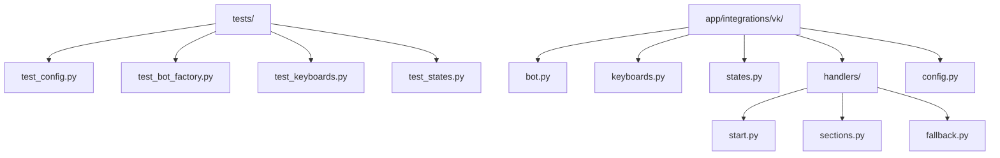
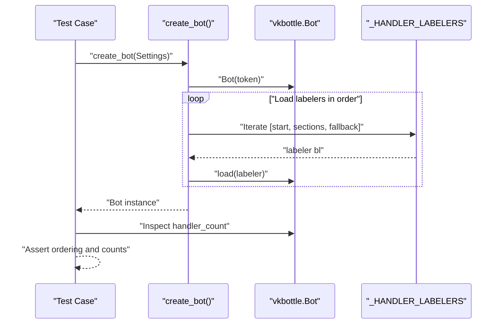
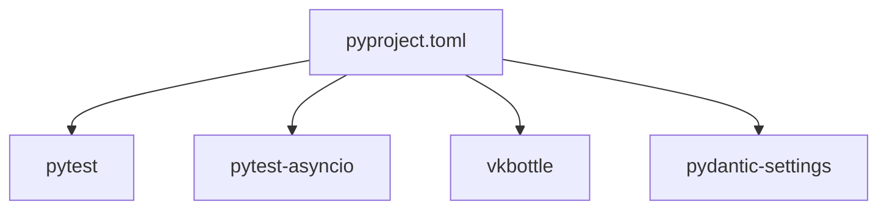

# Testing Strategy

<cite>
**Referenced Files in This Document**
- [pyproject.toml](file://pyproject.toml)
- [tests/test_bot_factory.py](file://tests/test_bot_factory.py)
- [tests/test_config.py](file://tests/test_config.py)
- [tests/test_keyboards.py](file://tests/test_keyboards.py)
- [tests/test_states.py](file://tests/test_states.py)
- [app/integrations/vk/bot.py](file://app/integrations/vk/bot.py)
- [app/integrations/vk/keyboards.py](file://app/integrations/vk/keyboards.py)
- [app/integrations/vk/states.py](file://app/integrations/vk/states.py)
- [app/integrations/vk/handlers/start.py](file://app/integrations/vk/handlers/start.py)
- [app/integrations/vk/handlers/sections.py](file://app/integrations/vk/handlers/sections.py)
- [app/integrations/vk/handlers/fallback.py](file://app/integrations/vk/handlers/fallback.py)
- [app/config.py](file://app/config.py)
</cite>

## Table of Contents
1. [Introduction](#introduction)
2. [Project Structure](#project-structure)
3. [Core Components](#core-components)
4. [Architecture Overview](#architecture-overview)
5. [Detailed Component Analysis](#detailed-component-analysis)
6. [Dependency Analysis](#dependency-analysis)
7. [Performance Considerations](#performance-considerations)
8. [Troubleshooting Guide](#troubleshooting-guide)
9. [Conclusion](#conclusion)
10. [Appendices](#appendices)

## Introduction
This document describes the testing strategy and approach used in cafetera_hr_bot with a focus on unit testing, configuration and setup, handler testing patterns, keyboard testing strategies, and state management testing. It explains how pytest is configured and used, how to test asynchronous bot components, and how to validate behavior without relying on live external services. Practical examples are provided via file references to the actual test suite and implementation.

## Project Structure
The testing effort is organized under the tests/ directory and targets core components of the VK integration:
- Configuration loading and defaults
- Bot factory and handler registration order
- Keyboard builders and payload constants
- State machine definitions
- Handler modules (start, sections, fallback)

**Diagram sources**
- [tests/test_config.py:1-28](file://tests/test_config.py#L1-L28)
- [tests/test_bot_factory.py:1-45](file://tests/test_bot_factory.py#L1-L45)
- [tests/test_keyboards.py:1-192](file://tests/test_keyboards.py#L1-L192)
- [tests/test_states.py:1-31](file://tests/test_states.py#L1-L31)
- [app/integrations/vk/bot.py:1-32](file://app/integrations/vk/bot.py#L1-L32)
- [app/integrations/vk/keyboards.py:1-108](file://app/integrations/vk/keyboards.py#L1-L108)
- [app/integrations/vk/states.py:1-14](file://app/integrations/vk/states.py#L1-L14)
- [app/integrations/vk/handlers/start.py:1-55](file://app/integrations/vk/handlers/start.py#L1-L55)
- [app/integrations/vk/handlers/sections.py:1-82](file://app/integrations/vk/handlers/sections.py#L1-L82)
- [app/integrations/vk/handlers/fallback.py:1-18](file://app/integrations/vk/handlers/fallback.py#L1-L18)
- [app/config.py:1-9](file://app/config.py#L1-L9)

**Section sources**
- [pyproject.toml:40-42](file://pyproject.toml#L40-L42)
- [tests/test_config.py:1-28](file://tests/test_config.py#L1-L28)
- [tests/test_bot_factory.py:1-45](file://tests/test_bot_factory.py#L1-L45)
- [tests/test_keyboards.py:1-192](file://tests/test_keyboards.py#L1-L192)
- [tests/test_states.py:1-31](file://tests/test_states.py#L1-L31)

## Core Components
- Configuration tests validate default values and environment overrides.
- Bot factory tests verify handler registration order and token forwarding.
- Keyboard tests validate structure, payloads, and service-row behavior.
- States tests validate the state machine definition and uniqueness.
- Handlers are tested indirectly via bot wiring and keyboard payloads.

Key testing characteristics:
- Uses pytest with asyncio_mode set to auto for async-friendly tests.
- Tests are structured around class-per-subject for readability and isolation.
- Environment variables are mocked using pytest’s monkeypatch fixture.
- Keyboard assertions rely on parsing JSON and inspecting button arrays and payloads.

**Section sources**
- [pyproject.toml:40-42](file://pyproject.toml#L40-L42)
- [tests/test_config.py:1-28](file://tests/test_config.py#L1-L28)
- [tests/test_bot_factory.py:1-45](file://tests/test_bot_factory.py#L1-L45)
- [tests/test_keyboards.py:1-192](file://tests/test_keyboards.py#L1-L192)
- [tests/test_states.py:1-31](file://tests/test_states.py#L1-L31)

## Architecture Overview
The VK bot registers handlers in a specific order to ensure routing correctness. The fallback handler must be last because it matches any message. The tests enforce this ordering and verify that the expected number of handlers are registered.

**Diagram sources**
- [app/integrations/vk/bot.py:14-31](file://app/integrations/vk/bot.py#L14-L31)
- [tests/test_bot_factory.py:23-38](file://tests/test_bot_factory.py#L23-L38)

**Section sources**
- [app/integrations/vk/bot.py:14-31](file://app/integrations/vk/bot.py#L14-L31)
- [tests/test_bot_factory.py:8-21](file://tests/test_bot_factory.py#L8-L21)

## Detailed Component Analysis

### Configuration Testing
Purpose:
- Verify default values for settings.
- Verify environment variable overrides using monkeypatch.
- Ensure environment file integration works as configured.

Methodology:
- Instantiate Settings with explicit overrides to test defaults.
- Use monkeypatch to set environment variables and assert resulting values.
- Confirm that environment file is used for loading settings.

Best practices:
- Keep environment variable names explicit and documented.
- Isolate environment-dependent tests using fixtures.
- Prefer explicit Settings construction for deterministic tests.

**Section sources**
- [tests/test_config.py:6-27](file://tests/test_config.py#L6-L27)
- [app/config.py:4-9](file://app/config.py#L4-L9)

### Bot Factory and Handler Registration Testing
Purpose:
- Enforce handler registration order.
- Verify the number of registered handlers.
- Ensure the token is forwarded to the underlying VK API client.

Methodology:
- Assert the last labeler is the fallback handler and the first is the start handler.
- Build a bot and count the number of registered message handlers.
- Assert that the bot’s token equals the provided Settings token.

Asynchronous considerations:
- The tests themselves are synchronous; they do not await async handlers.
- The focus is on wiring and configuration, not runtime behavior.

Security note:
- Tests use a placeholder token to avoid exposing secrets.

**Section sources**
- [tests/test_bot_factory.py:8-44](file://tests/test_bot_factory.py#L8-L44)
- [app/integrations/vk/bot.py:14-31](file://app/integrations/vk/bot.py#L14-L31)

### Keyboard Builders and Payload Constants Testing
Purpose:
- Validate main menu layout and payloads.
- Validate service-row behavior (Home, Back, Contact HR).
- Validate stub keyboard composition.
- Ensure payload constants are well-formed and unique.

Methodology:
- Parse Keyboard JSON and flatten button arrays.
- Assert row counts, button counts, and presence of expected payloads.
- Verify service-row labels and optional visibility flags.
- Parameterized tests check payload structure across all constants.

Testing patterns:
- Helper functions encapsulate JSON parsing and button extraction.
- Assertions target specific UI semantics (e.g., “Contact HR” in last row).
- Unique value checks prevent regressions in command dispatch.

**Section sources**
- [tests/test_keyboards.py:24-192](file://tests/test_keyboards.py#L24-L192)
- [app/integrations/vk/keyboards.py:11-108](file://app/integrations/vk/keyboards.py#L11-L108)

### State Machine Testing
Purpose:
- Validate the state group type and structure.
- Ensure all expected states are present.
- Verify uniqueness of state values.

Methodology:
- Assert subclass relationship to the base state group.
- Filter states by prefix to count HR-related states.
- Check uniqueness of state values and presence of expected names.

**Section sources**
- [tests/test_states.py:8-31](file://tests/test_states.py#L8-L31)
- [app/integrations/vk/states.py:4-14](file://app/integrations/vk/states.py#L4-L14)

### Handler Testing Patterns
Current coverage:
- Handlers are validated indirectly via bot wiring and keyboard payloads.
- The start handler registers a greeting and main menu.
- Section handlers register stub responses with back payloads.
- Fallback handler ensures unmatched messages route to the main menu.

Testing approach:
- Since handlers are async and depend on message events, tests focus on wiring and keyboard payloads.
- To test handler execution, introduce event-driven tests that simulate message events and assert outcomes.

Mocking external dependencies:
- Replace VK API calls with mocks or fakes in higher-level integration tests.
- For unit tests, avoid network calls by isolating logic that does not require VK.

Validation tips:
- Use keyboard payload assertions to confirm routing correctness.
- Validate handler counts and ordering to ensure no unintended matches.

**Section sources**
- [app/integrations/vk/handlers/start.py:23-55](file://app/integrations/vk/handlers/start.py#L23-L55)
- [app/integrations/vk/handlers/sections.py:28-82](file://app/integrations/vk/handlers/sections.py#L28-L82)
- [app/integrations/vk/handlers/fallback.py:15-18](file://app/integrations/vk/handlers/fallback.py#L15-L18)
- [app/integrations/vk/keyboards.py:104-108](file://app/integrations/vk/keyboards.py#L104-L108)

## Dependency Analysis
The test suite depends on:
- pytest and pytest-asyncio for async-friendly test execution.
- vkbottle Keyboard and BotLabeler for constructing and validating UI and handler wiring.
- pydantic-settings for configuration loading.

**Diagram sources**
- [pyproject.toml:21-38](file://pyproject.toml#L21-L38)

**Section sources**
- [pyproject.toml:21-38](file://pyproject.toml#L21-L38)

## Performance Considerations
- Keep unit tests fast by avoiding network calls and focusing on pure logic and structure validation.
- Use small, isolated fixtures to reduce setup overhead.
- Prefer deterministic structures (e.g., Keyboard instances) over dynamic generation in tests.
- Group related assertions per test class to minimize repeated work.

## Troubleshooting Guide
Common issues and resolutions:
- Async test failures: Ensure asyncio_mode is enabled and avoid mixing sync/async incorrectly.
- Environment variable mismatches: Use monkeypatch in tests to override environment variables deterministically.
- Keyboard layout regressions: Add new assertions for row/button counts and payload presence.
- State duplicates: Add uniqueness checks to catch accidental duplication early.

Debugging tips:
- Print or log parsed keyboard JSON during development to validate structure.
- Temporarily disable specific handler registrations to isolate failing tests.

**Section sources**
- [pyproject.toml:40-42](file://pyproject.toml#L40-L42)
- [tests/test_keyboards.py:24-44](file://tests/test_keyboards.py#L24-L44)
- [tests/test_states.py:16-18](file://tests/test_states.py#L16-L18)

## Conclusion
The current testing strategy emphasizes structural and wiring correctness for the VK bot:
- Configuration defaults and environment overrides are verified.
- Bot factory enforces handler registration order and validates handler counts.
- Keyboard builders are validated for layout, payloads, and service-row behavior.
- State machine definitions are validated for completeness and uniqueness.

To evolve the test suite:
- Introduce event-driven tests for handlers to validate async behavior.
- Mock external VK API calls to improve reliability and speed.
- Expand parameterized tests for keyboard layouts and payloads.
- Add property-based tests for keyboard JSON structure where appropriate.

## Appendices

### How to Run Tests
- Install dev dependencies and run pytest with the configured asyncio_mode.
- Use the testpaths setting to run only the tests directory.

**Section sources**
- [pyproject.toml:40-42](file://pyproject.toml#L40-L42)

### Writing Effective Tests for Bot Functionality
- Focus on structure and wiring in unit tests; defer behavioral tests to integration tests.
- Use helpers to parse and assert on keyboard JSON.
- Validate handler counts and ordering to prevent routing errors.
- Keep environment-dependent tests isolated with fixtures.

[No sources needed since this section provides general guidance]