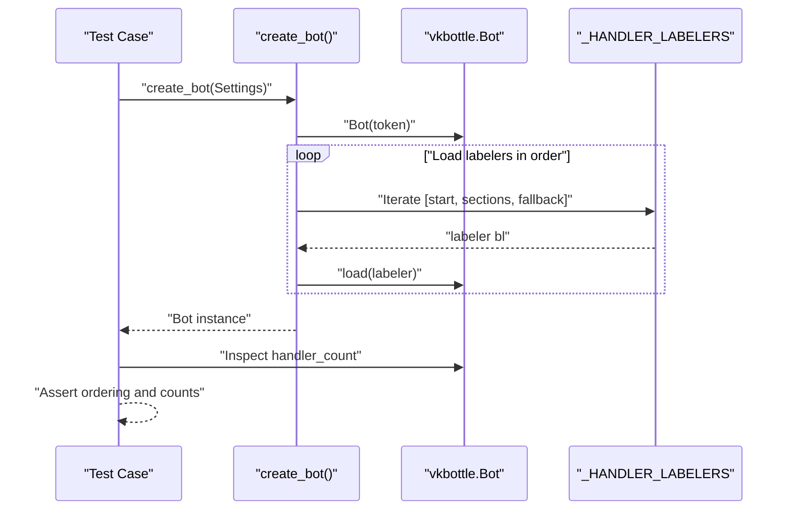
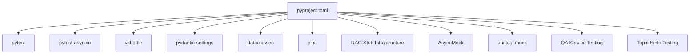

# Testing Strategy

<cite>
**Referenced Files in This Document**
- [pyproject.toml](file://pyproject.toml)
- [tests/test_config.py](file://tests/test_config.py)
- [tests/test_bot_factory.py](file://tests/test_bot_factory.py)
- [tests/test_keyboards.py](file://tests/test_keyboards.py)
- [tests/test_keyboards_block2.py](file://tests/test_keyboards_block2.py)
- [tests/test_content.py](file://tests/test_content.py)
- [tests/test_entities.py](file://tests/test_entities.py)
- [tests/test_rag_stub_block3.py](file://tests/test_rag_stub_block3.py)
- [tests/test_rag_block6.py](file://tests/test_rag_block6.py)
- [tests/test_qa_service.py](file://tests/test_qa_service.py)
- [tests/test_rules.py](file://tests/test_rules.py)
- [tests/test_states.py](file://tests/test_states.py)
- [tests/test_ask_block9.py](file://tests/test_ask_block9.py)
- [app/integrations/vk/bot.py](file://app/integrations/vk/bot.py)
- [app/integrations/vk/keyboards.py](file://app/integrations/vk/keyboards.py)
- [app/integrations/vk/rules.py](file://app/integrations/vk/rules.py)
- [app/integrations/vk/states.py](file://app/integrations/vk/states.py)
- [app/integrations/vk/handlers/start.py](file://app/integrations/vk/handlers/start.py)
- [app/integrations/vk/handlers/sections.py](file://app/integrations/vk/handlers/sections.py)
- [app/integrations/vk/handlers/fallback.py](file://app/integrations/vk/handlers/fallback.py)
- [app/integrations/vk/handlers/fire.py](file://app/integrations/vk/handlers/fire.py)
- [app/integrations/vk/handlers/vacation.py](file://app/integrations/vk/handlers/vacation.py)
- [app/integrations/vk/handlers/ask.py](file://app/integrations/vk/handlers/ask.py)
- [app/domain/content.py](file://app/domain/content.py)
- [app/domain/entities.py](file://app/domain/entities.py)
- [app/domain/qa_service.py](file://app/domain/qa_service.py)
- [app/domain/topic_hints.py](file://app/domain/topic_hints.py)
- [app/config.py](file://app/config.py)
</cite>

## Update Summary
**Changes Made**
- Enhanced test coverage for comprehensive Block 9 functionality including scenario detection, background-topic disclaimer handling, and ask handler integration tests
- Added dedicated test suite for topic hints detection with keyword-based scenario matching
- Integrated QA service testing with RAG chain wrapper functionality
- Expanded keyboard testing to include ask-specific keyboard builders and scenario navigation
- Updated handler testing patterns to include Block 9 ask handler with state management and topic hint integration

## Table of Contents
1. [Introduction](#introduction)
2. [Project Structure](#project-structure)
3. [Core Components](#core-components)
4. [Architecture Overview](#architecture-overview)
5. [Detailed Component Analysis](#detailed-component-analysis)
6. [Dependency Analysis](#dependency-analysis)
7. [Performance Considerations](#performance-considerations)
8. [Troubleshooting Guide](#troubleshooting-guide)
9. [Conclusion](#conclusion)
10. [Appendices](#appendices)

## Introduction
This document describes the comprehensive testing strategy and approach used in cafetera_hr_bot, covering unit testing methodologies, configuration and setup, handler testing patterns, keyboard testing strategies, state management testing, and domain content validation. The testing infrastructure has been significantly expanded to cover new domain content, entity definitions, keyboard builders, RAG stub functionality, custom rules, enhanced handler registration testing, and the comprehensive Block 9 functionality including scenario detection, background-topic disclaimer handling, and QA service integration. It explains how pytest is configured and used, how to test asynchronous bot components, and how to validate behavior without relying on live external services. Practical examples are provided via file references to the actual test suite and implementation.

**Updated** Enhanced with comprehensive test coverage for new RAG stub features, including dedicated test classes for FR-11 (vacation schedule navigator) and FR-12 (dismissal grounds) functionality, expanded handler registration verification with detailed count breakdown, and comprehensive Block 9 testing infrastructure for scenario detection and QA service integration.

## Project Structure
The testing effort is organized under the tests/ directory and targets all major components of the VK integration:
- Configuration loading and defaults with explicit environment file control
- Bot factory and handler registration order with detailed handler counting
- Keyboard builders and payload constants (including Block 2 and Block 9 functionality)
- Domain content validation (static content and formatters)
- Entity definitions and legal entity management
- RAG stub service and knowledge base integration with specialized test classes
- QA service testing with RAG chain wrapper functionality
- Custom payload matching rules
- State machine definitions
- Handler modules (start, sections, fallback, fire, vacation, ask)
- Topic hints detection for scenario linking and disclaimer handling

```mermaid
graph TB
T["tests/"]
T_CFG["test_config.py"]
T_BOT["test_bot_factory.py"]
T_KB["test_keyboards.py"]
T_KB2["test_keyboards_block2.py"]
T_CONTENT["test_content.py"]
T_ENTITIES["test_entities.py"]
T_RAG3["test_rag_stub_block3.py"]
T_RAG6["test_rag_block6.py"]
T_QA["test_qa_service.py"]
T_RULES["test_rules.py"]
T_STATES["test_states.py"]
T_ASK["test_ask_block9.py"]
APP["app/integrations/vk/"]
BOT["bot.py"]
KB["keyboards.py"]
RULES["rules.py"]
STATES["states.py"]
DOMAIN["app/domain/"]
CONTENT["content.py"]
ENTITIES["entities.py"]
QA["qa_service.py"]
TOPIC_HINTS["topic_hints.py"]
HANDLERS["handlers/"]
START["start.py"]
SECTIONS["sections.py"]
FALLBACK["fallback.py"]
FIRE["fire.py"]
VACATION["vacation.py"]
ASK["ask.py"]
CFG["config.py"]
T --> T_CFG
T --> T_BOT
T --> T_KB
T --> T_KB2
T --> T_CONTENT
T --> T_ENTITIES
T --> T_RAG3
T --> T_RAG6
T --> T_QA
T --> T_RULES
T --> T_STATES
T --> T_ASK
APP --> BOT
APP --> KB
APP --> RULES
APP --> STATES
APP --> HANDLERS
DOMAIN --> CONTENT
DOMAIN --> ENTITIES
DOMAIN --> QA
DOMAIN --> TOPIC_HINTS
APP --> CFG
```

**Diagram sources**
- [tests/test_config.py:1-28](file://tests/test_config.py#L1-L28)
- [tests/test_bot_factory.py:1-85](file://tests/test_bot_factory.py#L1-L85)
- [tests/test_keyboards.py:1-236](file://tests/test_keyboards.py#L1-L236)
- [tests/test_keyboards_block2.py:1-254](file://tests/test_keyboards_block2.py#L1-L254)
- [tests/test_content.py:1-93](file://tests/test_content.py#L1-L93)
- [tests/test_entities.py:1-29](file://tests/test_entities.py#L1-L29)
- [tests/test_rag_stub_block3.py:1-98](file://tests/test_rag_stub_block3.py#L1-L98)
- [tests/test_rag_block6.py:1-251](file://tests/test_rag_block6.py#L1-L251)
- [tests/test_qa_service.py:1-198](file://tests/test_qa_service.py#L1-L198)
- [tests/test_rules.py:1-70](file://tests/test_rules.py#L1-L70)
- [tests/test_states.py:1-31](file://tests/test_states.py#L1-L31)
- [tests/test_ask_block9.py:1-112](file://tests/test_ask_block9.py#L1-L112)
- [app/integrations/vk/bot.py:1-32](file://app/integrations/vk/bot.py#L1-L32)
- [app/integrations/vk/keyboards.py:1-322](file://app/integrations/vk/keyboards.py#L1-L322)
- [app/integrations/vk/rules.py:1-31](file://app/integrations/vk/rules.py#L1-L31)
- [app/integrations/vk/states.py:1-14](file://app/integrations/vk/states.py#L1-L14)
- [app/integrations/vk/handlers/start.py:1-55](file://app/integrations/vk/handlers/start.py#L1-L55)
- [app/integrations/vk/handlers/sections.py:1-82](file://app/integrations/vk/handlers/sections.py#L1-L82)
- [app/integrations/vk/handlers/fallback.py:1-18](file://app/integrations/vk/handlers/fallback.py#L1-L18)
- [app/integrations/vk/handlers/fire.py:1-77](file://app/integrations/vk/handlers/fire.py#L1-L77)
- [app/integrations/vk/handlers/vacation.py:1-88](file://app/integrations/vk/handlers/vacation.py#L1-L88)
- [app/integrations/vk/handlers/ask.py:1-86](file://app/integrations/vk/handlers/ask.py#L1-L86)
- [app/domain/content.py:1-177](file://app/domain/content.py#L1-L177)
- [app/domain/entities.py:1-24](file://app/domain/entities.py#L1-L24)
- [app/domain/qa_service.py:1-120](file://app/domain/qa_service.py#L1-L120)
- [app/domain/topic_hints.py:1-109](file://app/domain/topic_hints.py#L1-L109)
- [app/config.py:1-9](file://app/config.py#L1-L9)

**Section sources**
- [pyproject.toml:40-42](file://pyproject.toml#L40-L42)
- [tests/test_config.py:1-28](file://tests/test_config.py#L1-L28)
- [tests/test_bot_factory.py:1-85](file://tests/test_bot_factory.py#L1-L85)
- [tests/test_keyboards.py:1-236](file://tests/test_keyboards.py#L1-L236)
- [tests/test_keyboards_block2.py:1-254](file://tests/test_keyboards_block2.py#L1-L254)
- [tests/test_content.py:1-93](file://tests/test_content.py#L1-L93)
- [tests/test_entities.py:1-29](file://tests/test_entities.py#L1-L29)
- [tests/test_rag_stub_block3.py:1-98](file://tests/test_rag_stub_block3.py#L1-L98)
- [tests/test_rag_block6.py:1-251](file://tests/test_rag_block6.py#L1-L251)
- [tests/test_qa_service.py:1-198](file://tests/test_qa_service.py#L1-L198)
- [tests/test_rules.py:1-70](file://tests/test_rules.py#L1-L70)
- [tests/test_states.py:1-31](file://tests/test_states.py#L1-L31)
- [tests/test_ask_block9.py:1-112](file://tests/test_ask_block9.py#L1-L112)

## Core Components
- Configuration tests validate default values and environment overrides with explicit environment file control.
- Bot factory tests verify handler registration order and token forwarding, with detailed handler count breakdown.
- Keyboard tests validate structure, payloads, and service-row behavior (including Block 2 and Block 9 functionality).
- Domain content tests validate static content, formatters, and RAG stub functionality.
- Entity tests validate legal entity definitions and management.
- QA service tests validate RAG chain wrapper functionality with truncation, error handling, and resource management.
- Custom rule tests validate payload matching and routing logic.
- State machine tests validate the state machine definition and uniqueness.
- Handler modules are tested indirectly via bot wiring and keyboard payloads.
- Enhanced RAG stub testing covers specialized features with dedicated test classes for different functionality blocks.
- Topic hints tests validate scenario detection and background-topic disclaimer handling.
- Ask handler tests validate state management, QA service integration, and scenario navigation.

Key testing characteristics:
- Uses pytest with asyncio_mode set to auto for async-friendly tests.
- Tests are structured around class-per-subject for readability and isolation.
- Environment variables are mocked using pytest's monkeypatch fixture.
- Keyboard assertions rely on parsing JSON and inspecting button arrays and payloads.
- Configuration tests explicitly control environment file loading with `_env_file=None`.
- Comprehensive domain content validation ensures content integrity and formatting.
- Entity validation ensures legal entity consistency across the application.
- QA service testing validates RAG chain integration with proper error handling and resource cleanup.
- RAG stub testing validates knowledge base integration placeholders with specialized test classes.
- Custom rule testing validates advanced payload matching functionality.
- Handler registration testing provides detailed breakdown of handler counts by functional area.
- Topic hints testing validates keyword-based scenario detection with background-topic priority.
- Ask handler testing validates state management and integration with QA service and topic hints.

**Updated** Enhanced with comprehensive testing coverage for domain content, entity definitions, keyboard builders, RAG stub functionality, QA service integration, custom payload matching rules, topic hints detection, and detailed handler registration verification.

**Section sources**
- [pyproject.toml:40-42](file://pyproject.toml#L40-L42)
- [tests/test_config.py:1-28](file://tests/test_config.py#L1-L28)
- [tests/test_bot_factory.py:1-85](file://tests/test_bot_factory.py#L1-L85)
- [tests/test_keyboards.py:1-236](file://tests/test_keyboards.py#L1-L236)
- [tests/test_keyboards_block2.py:1-254](file://tests/test_keyboards_block2.py#L1-L254)
- [tests/test_content.py:1-93](file://tests/test_content.py#L1-L93)
- [tests/test_entities.py:1-29](file://tests/test_entities.py#L1-L29)
- [tests/test_rag_stub_block3.py:1-98](file://tests/test_rag_stub_block3.py#L1-L98)
- [tests/test_rag_block6.py:1-251](file://tests/test_rag_block6.py#L1-L251)
- [tests/test_qa_service.py:1-198](file://tests/test_qa_service.py#L1-L198)
- [tests/test_rules.py:1-70](file://tests/test_rules.py#L1-L70)
- [tests/test_states.py:1-31](file://tests/test_states.py#L1-L31)
- [tests/test_ask_block9.py:1-112](file://tests/test_ask_block9.py#L1-L112)

## Architecture Overview
The VK bot registers handlers in a specific order to ensure routing correctness. The fallback handler must be last because it matches any message. The tests enforce this ordering and verify that the expected number of handlers are registered, with detailed breakdown by functional area. The expanded testing infrastructure now covers the complete bot architecture including domain content, entity management, keyboard builders, custom rules, QA service integration, and comprehensive Block 9 functionality.

**Diagram sources**
- [app/integrations/vk/bot.py:14-31](file://app/integrations/vk/bot.py#L14-L31)
- [tests/test_bot_factory.py:23-38](file://tests/test_bot_factory.py#L23-L38)

**Section sources**
- [app/integrations/vk/bot.py:14-31](file://app/integrations/vk/bot.py#L14-L31)
- [tests/test_bot_factory.py:8-21](file://tests/test_bot_factory.py#L8-L21)

## Detailed Component Analysis

### Configuration Testing
Purpose:
- Verify default values for settings with explicit environment file control.
- Verify environment variable overrides using monkeypatch.
- Ensure environment file integration works as configured while maintaining test isolation.

Methodology:
- Instantiate Settings with explicit overrides and `_env_file=None` to test defaults without environment file interference.
- Use monkeypatch to set environment variables and assert resulting values.
- Confirm that environment file is used for loading settings when `_env_file` is not explicitly set.

Best practices:
- Keep environment variable names explicit and documented.
- Isolate environment-dependent tests using fixtures and explicit `_env_file=None` parameter.
- Prefer explicit Settings construction with `_env_file=None` for deterministic tests that don't rely on external environment files.
- Use monkeypatch for environment variable testing to avoid modifying system-wide environment.

**Updated** Enhanced with explicit `_env_file=None` parameter usage for improved test isolation and reliability. This prevents tests from accidentally loading environment files from the project directory, ensuring consistent and predictable test behavior.

**Section sources**
- [tests/test_config.py:6-27](file://tests/test_config.py#L6-L27)
- [app/config.py:4-9](file://app/config.py#L4-L9)

### Bot Factory and Handler Registration Testing
Purpose:
- Enforce handler registration order.
- Verify the number of registered handlers with detailed breakdown by functional area.
- Ensure the token is forwarded to the underlying VK API client.

Methodology:
- Assert the last labeler is the fallback handler and the first is the start handler.
- Build a bot and count the number of registered message handlers.
- Assert that the bot's token equals the provided Settings token.
- Verify detailed handler counts: start (2), hr_request (9), ask (2), hire (5), fire (5), vacation (5), pay (3), sections (2), fallback (1) = 34 total.

Asynchronous considerations:
- The tests themselves are synchronous; they do not await async handlers.
- The focus is on wiring and configuration, not runtime behavior.

Security note:
- Tests use a placeholder token to avoid exposing secrets.

**Updated** Enhanced with detailed handler count breakdown reflecting 34 total handlers distributed across functional areas: start (2), hr_request (9), ask (2), hire (5), fire (5), vacation (5), pay (3), sections (2), fallback (1).

**Section sources**
- [tests/test_bot_factory.py:8-85](file://tests/test_bot_factory.py#L8-L85)
- [app/integrations/vk/bot.py:14-31](file://app/integrations/vk/bot.py#L14-L31)

### Keyboard Builders and Payload Constants Testing
Purpose:
- Validate main menu layout and payloads.
- Validate service-row behavior (Home, Back, Contact HR).
- Validate Block 2 keyboard builders and new payload constants.
- Validate Block 9 ask-specific keyboard builders and scenario navigation.
- Validate stub keyboard composition.
- Ensure payload constants are well-formed and unique.

Methodology:
- Parse Keyboard JSON and flatten button arrays.
- Assert row counts, button counts, and presence of expected payloads.
- Verify service-row labels and optional visibility flags.
- Parameterized tests check payload structure across all constants.
- Validate Block 2 keyboard builders including entity selection, hire actions, fire menu, vacation menu, and HR-request keyboards.
- Validate ask_input_kb and ask_result_kb functions for Block 9 functionality.
- Test scenario navigation buttons in ask_result_kb based on detected topic hints.

Testing patterns:
- Helper functions encapsulate JSON parsing and button extraction.
- Assertions target specific UI semantics (e.g., "Contact HR" in last row).
- Unique value checks prevent regressions in command dispatch.
- Comprehensive validation of payload structure and entity IDs.
- Scenario-based keyboard validation ensures proper navigation flow.

**Updated** Enhanced with comprehensive Block 2 keyboard testing covering entity selection, hire actions, fire menu, vacation menu, HR-request keyboards, payload validation, and Block 9 ask-specific keyboard builders with scenario navigation functionality.

**Section sources**
- [tests/test_keyboards.py:24-236](file://tests/test_keyboards.py#L24-L236)
- [tests/test_keyboards_block2.py:30-254](file://tests/test_keyboards_block2.py#L30-L254)
- [app/integrations/vk/keyboards.py:11-322](file://app/integrations/vk/keyboards.py#L11-L322)

### Domain Content and Static Content Testing
Purpose:
- Validate static content for hire, fire, and vacation processes.
- Validate HR-request formatting and topic management.
- Ensure content integrity and proper formatting.
- Test RAG stub functionality for knowledge base integration.
- Validate QA service integration with proper error handling.

Methodology:
- Test hire content validation including checklists, contracts, and onboarding.
- Validate fire content including last-day checklist and bypass sheet.
- Test vacation template content and disclaimer inclusion.
- Validate HR-request topics, urgency options, and formatted request text.
- Test RAG stub function for standardized placeholder responses.
- Ensure entity names are properly included in generated content.
- Test QA service error handling and response truncation.

Testing patterns:
- Content validation focuses on text inclusion and formatting.
- Entity-based content testing ensures proper entity name injection.
- RAG stub testing validates standardized placeholder responses.
- HR-request formatting tests ensure complete field inclusion.
- QA service testing validates error handling and resource management.

**Updated** Added comprehensive domain content testing covering static content validation, HR-request formatting, RAG stub functionality, and QA service integration with error handling and resource management.

**Section sources**
- [tests/test_content.py:18-93](file://tests/test_content.py#L18-L93)
- [app/domain/content.py:12-177](file://app/domain/content.py#L12-L177)
- [tests/test_qa_service.py:28-198](file://tests/test_qa_service.py#L28-L198)
- [app/domain/qa_service.py:1-120](file://app/domain/qa_service.py#L1-L120)

### Entity Definitions and Management Testing
Purpose:
- Validate legal entity definitions and management.
- Ensure entity uniqueness and proper identification.
- Test entity lookup by ID and name validation.

Methodology:
- Test entity count validation (exactly 4 entities).
- Validate all entities are LegalEntity instances.
- Test entity ID uniqueness.
- Validate entity lookup by ID dictionary.
- Test entity name properties (full_name and short_name).

Testing patterns:
- Entity validation uses dataclass properties and frozen constraints.
- Lookup testing ensures bidirectional entity mapping.
- Name validation ensures non-empty string properties.

**Updated** Added comprehensive entity definitions testing for legal entity validation and management.

**Section sources**
- [tests/test_entities.py:6-29](file://tests/test_entities.py#L6-L29)
- [app/domain/entities.py:8-24](file://app/domain/entities.py#L8-L24)

### QA Service and RAG Chain Integration Testing
Purpose:
- Validate QA service wrapper functionality for RAG chain integration.
- Ensure proper error handling and fallback responses.
- Test response truncation for VK message limits.
- Validate resource management and cleanup.
- Test handler integration with QA service for Blocks 7-8 functionality.

Methodology:
- Test QA service initialization with proper error handling for unavailable services.
- Validate ask() function returns fallback responses when chain is not available.
- Test ask() function returns answers from RAG chain when available.
- Validate exception handling and fallback responses for chain failures.
- Test response truncation logic with proper word boundary preservation.
- Test resource cleanup and client closing functionality.
- Validate handler imports and usage of qa_service across P0+P1 handlers.

Testing patterns:
- Module-level state reset using autouse fixtures for clean test environment.
- Async mock usage for chain invocation testing.
- Error scenario testing with exception raising and fallback validation.
- Resource management testing with proper cleanup verification.

**Updated** Enhanced with comprehensive QA service testing including RAG chain initialization, error handling, response truncation, resource management, and handler integration validation for Blocks 7-8 functionality.

**Section sources**
- [tests/test_qa_service.py:15-198](file://tests/test_qa_service.py#L15-L198)
- [app/domain/qa_service.py:23-120](file://app/domain/qa_service.py#L23-L120)

### Topic Hints Detection and Scenario Navigation Testing
Purpose:
- Validate keyword-based scenario detection for clickable scenarios.
- Test background-topic disclaimer handling for sensitive HR topics.
- Ensure proper priority handling between background topics and scenarios.
- Validate integration with ask handler for scenario navigation.
- Test handler import validation for topic hints usage.

Methodology:
- Test scenario detection for hire, fire, vacation, pay, sick, and probation keywords.
- Validate case-insensitive keyword matching.
- Test background-topic detection for transfer, discipline, and absenteeism topics.
- Validate disclaimer attachment for background topics.
- Test combined scenario and disclaimer detection.
- Validate ask handler imports and topic hints integration.
- Test QA service usage instead of rag_stub in ask handler.

Testing patterns:
- Keyword-based detection testing with comprehensive keyword coverage.
- Priority testing ensures background topics take precedence over scenarios.
- Integration testing validates ask handler state management and navigation.
- Import testing ensures proper module dependencies.

**Updated** Added comprehensive topic hints testing for Block 9 functionality including scenario detection, background-topic disclaimer handling, priority validation, ask handler integration, and QA service usage instead of rag_stub.

**Section sources**
- [tests/test_ask_block9.py:1-112](file://tests/test_ask_block9.py#L1-L112)
- [app/domain/topic_hints.py:14-109](file://app/domain/topic_hints.py#L14-L109)
- [app/integrations/vk/handlers/ask.py:15-86](file://app/integrations/vk/handlers/ask.py#L15-L86)

### Custom Payload Matching Rules Testing
Purpose:
- Validate custom payload matching functionality.
- Test PayloadCmdRule for command-based routing.
- Ensure proper JSON payload parsing and validation.
- Test async rule evaluation.

Methodology:
- Test successful command matching with payload data extraction.
- Test rejection of wrong commands.
- Test rejection of missing payloads.
- Test rejection of invalid JSON payloads.
- Test rejection of non-dictionary payloads.
- Test rejection of missing command keys.
- Test full payload data return in match results.

Testing patterns:
- Async testing uses pytest-asyncio mark.
- Mock message objects simulate VK API payloads.
- Comprehensive error case testing ensures robust validation.

**Updated** Added comprehensive custom payload matching rule testing for advanced routing functionality.

**Section sources**
- [tests/test_rules.py:17-70](file://tests/test_rules.py#L17-L70)
- [app/integrations/vk/rules.py:11-31](file://app/integrations/vk/rules.py#L11-L31)

### State Machine Testing
Purpose:
- Validate the state group type and structure.
- Ensure all expected states are present.
- Verify uniqueness of state values.

Methodology:
- Assert subclass relationship to the base state group.
- Filter states by prefix to count HR-related states.
- Check uniqueness of state values and presence of expected names.

**Section sources**
- [tests/test_states.py:8-31](file://tests/test_states.py#L8-L31)
- [app/integrations/vk/states.py:4-14](file://app/integrations/vk/states.py#L4-L14)

### Handler Testing Patterns
Current coverage:
- Handlers are validated indirectly via bot wiring and keyboard payloads.
- The start handler registers a greeting and main menu.
- Section handlers register stub responses with back payloads.
- Fallback handler ensures unmatched messages route to the main menu.
- Custom rules enable advanced payload-based routing.
- Enhanced RAG stub testing validates specialized feature implementations.
- QA service testing validates RAG chain integration across handlers.
- Topic hints testing validates scenario detection and navigation.
- Ask handler testing validates state management and integration with QA service.

Testing approach:
- Since handlers are async and depend on message events, tests focus on wiring and keyboard payloads.
- To test handler execution, introduce event-driven tests that simulate message events and assert outcomes.
- Custom rules testing validates payload matching logic and async evaluation.
- Specialized RAG stub testing validates feature-specific handler implementations.
- QA service testing validates proper module imports and error handling.
- Topic hints testing validates keyword-based detection and integration with ask handler.
- Ask handler testing validates state management and scenario navigation.

Mocking external dependencies:
- Replace VK API calls with mocks or fakes in higher-level integration tests.
- For unit tests, avoid network calls by isolating logic that does not require VK.
- Use mock message objects for rule testing and handler simulation.
- Use AsyncMock for QA service testing to simulate RAG chain responses.

Validation tips:
- Use keyboard payload assertions to confirm routing correctness.
- Validate handler counts and ordering to ensure no unintended matches.
- Test custom rules with various payload scenarios.
- Validate domain content generation with different entity contexts.
- Test specialized RAG stub features with dedicated test classes.
- Validate handler availability for new feature implementations.
- Test QA service error handling and resource management.
- Validate topic hints detection with comprehensive keyword coverage.
- Test ask handler state management and scenario navigation.

**Updated** Enhanced with custom rule testing, expanded handler validation patterns, specialized RAG stub testing for FR-11 and FR-12 functionality, comprehensive QA service testing, topic hints detection testing, and ask handler testing with state management and integration validation.

**Section sources**
- [app/integrations/vk/handlers/start.py:23-55](file://app/integrations/vk/handlers/start.py#L23-L55)
- [app/integrations/vk/handlers/sections.py:28-82](file://app/integrations/vk/handlers/sections.py#L28-L82)
- [app/integrations/vk/handlers/fallback.py:15-18](file://app/integrations/vk/handlers/fallback.py#L15-L18)
- [app/integrations/vk/keyboards.py:104-108](file://app/integrations/vk/keyboards.py#L104-L108)
- [app/integrations/vk/rules.py:21-30](file://app/integrations/vk/rules.py#L21-L30)
- [app/integrations/vk/handlers/fire.py:68-77](file://app/integrations/vk/handlers/fire.py#L68-L77)
- [app/integrations/vk/handlers/vacation.py:79-88](file://app/integrations/vk/handlers/vacation.py#L79-L88)
- [app/integrations/vk/handlers/ask.py:34-86](file://app/integrations/vk/handlers/ask.py#L34-L86)

## Dependency Analysis
The test suite depends on:
- pytest and pytest-asyncio for async-friendly test execution.
- vkbottle Keyboard and BotLabeler for constructing and validating UI and handler wiring.
- pydantic-settings for configuration loading with explicit environment file control.
- dataclasses for entity definitions and frozen constraints.
- json for payload parsing and validation in rule testing.
- Specialized RAG stub testing infrastructure for feature-specific validation.
- AsyncMock for QA service testing and RAG chain simulation.
- unittest.mock for comprehensive mocking and patching scenarios.

**Diagram sources**
- [pyproject.toml:21-38](file://pyproject.toml#L21-L38)

**Section sources**
- [pyproject.toml:21-38](file://pyproject.toml#L21-L38)

## Performance Considerations
- Keep unit tests fast by avoiding network calls and focusing on pure logic and structure validation.
- Use small, isolated fixtures to reduce setup overhead.
- Prefer deterministic structures (e.g., Keyboard instances) over dynamic generation in tests.
- Group related assertions per test class to minimize repeated work.
- Use explicit `_env_file=None` in Settings initialization to prevent unnecessary environment file loading during tests.
- Leverage parameterized tests for repetitive validation scenarios.
- Use helper functions for common validation patterns across keyboard builders.
- Test domain content generation with minimal entity context to reduce complexity.
- Specialized RAG stub testing should focus on functionality validation rather than performance.
- Handler registration testing should verify counts efficiently without excessive computation.
- QA service testing should use lightweight mocks to avoid heavy initialization overhead.
- Topic hints testing should validate keyword matching performance with comprehensive test coverage.
- Ask handler testing should focus on state management and integration rather than heavy computation.

**Updated** Enhanced with guidance on leveraging parameterized tests and helper functions for efficient validation across expanded test suite, including specialized RAG stub testing considerations, QA service testing optimization, topic hints performance validation, and ask handler state management testing.

## Troubleshooting Guide
Common issues and resolutions:
- Async test failures: Ensure asyncio_mode is enabled and avoid mixing sync/async incorrectly.
- Environment variable mismatches: Use monkeypatch in tests to override environment variables deterministically.
- Keyboard layout regressions: Add new assertions for row/button counts and payload presence.
- State duplicates: Add uniqueness checks to catch accidental duplication early.
- Configuration test failures: Ensure Settings are initialized with `_env_file=None` to prevent environment file interference.
- Domain content validation failures: Check entity context injection and content formatting.
- Entity validation failures: Verify entity count, ID uniqueness, and name properties.
- RAG stub failures: Ensure standardized placeholder format and topic inclusion.
- Custom rule failures: Test various payload scenarios and error cases comprehensively.
- Handler registration failures: Verify detailed handler counts and ordering.
- Specialized RAG stub feature failures: Check handler availability and feature-specific integration.
- FR-11/FR-12 feature validation failures: Ensure dedicated test classes are properly targeting new functionality.
- QA service failures: Check RAG chain initialization, error handling, and resource management.
- Topic hints failures: Validate keyword matching logic and priority handling.
- Ask handler failures: Test state management, QA service integration, and scenario navigation.
- Keyboard validation failures: Ensure proper scenario button generation and service row consistency.

Debugging tips:
- Print or log parsed keyboard JSON during development to validate structure.
- Temporarily disable specific handler registrations to isolate failing tests.
- Use explicit `_env_file=None` in Settings constructor for configuration tests to ensure isolation from system environment.
- Test domain content generation with different entity contexts for debugging.
- Use mock message objects with various payload scenarios for rule testing.
- Validate specialized RAG stub features with dedicated test classes for targeted debugging.
- Check handler availability and integration for new feature implementations.
- Use AsyncMock for QA service testing to simulate chain responses without network dependencies.
- Validate topic hints detection with comprehensive keyword coverage and priority testing.
- Test ask handler state management with proper cleanup and error handling.

**Updated** Enhanced troubleshooting guide covering new domain content, entity, RAG stub, custom rule testing scenarios, specialized RAG stub feature testing for FR-11 and FR-12 functionality, QA service testing, topic hints detection, ask handler validation, and keyboard validation failures.

**Section sources**
- [pyproject.toml:40-42](file://pyproject.toml#L40-L42)
- [tests/test_keyboards.py:24-44](file://tests/test_keyboards.py#L24-L44)
- [tests/test_states.py:16-18](file://tests/test_states.py#L16-L18)
- [tests/test_content.py:18-93](file://tests/test_content.py#L18-L93)
- [tests/test_entities.py:6-29](file://tests/test_entities.py#L6-L29)
- [tests/test_rag_stub_block3.py:6-98](file://tests/test_rag_stub_block3.py#L6-L98)
- [tests/test_rules.py:17-70](file://tests/test_rules.py#L17-L70)
- [tests/test_qa_service.py:15-23](file://tests/test_qa_service.py#L15-L23)
- [tests/test_ask_block9.py:8-87](file://tests/test_ask_block9.py#L8-L87)

## Conclusion
The current testing strategy emphasizes comprehensive structural and wiring correctness for the expanded VK bot:
- Configuration defaults and environment overrides are verified with explicit environment file control.
- Bot factory enforces handler registration order and validates handler counts with detailed breakdown.
- Keyboard builders are validated for layout, payloads, and service-row behavior (including Block 2 and Block 9 functionality).
- Domain content is validated for static content integrity and proper formatting.
- Entity definitions are validated for consistency and uniqueness.
- RAG stub functionality is tested for knowledge base integration with specialized test classes.
- QA service testing validates RAG chain integration with proper error handling and resource management.
- Custom payload matching rules are validated for advanced routing.
- State machine definitions are validated for completeness and uniqueness.
- Handler testing validates both general functionality and specialized feature implementations.
- Topic hints testing validates scenario detection and background-topic disclaimer handling.
- Ask handler testing validates state management, QA service integration, and scenario navigation.

To evolve the test suite:
- Introduce event-driven tests for handlers to validate async behavior.
- Mock external VK API calls to improve reliability and speed.
- Expand parameterized tests for keyboard layouts and payloads.
- Add property-based tests for keyboard JSON structure where appropriate.
- Continue using explicit `_env_file=None` parameter in Settings initialization for improved test isolation and reliability.
- Implement comprehensive handler execution tests with mock message objects.
- Add integration tests for domain content generation with various entity contexts.
- Expand custom rule testing to cover edge cases and error scenarios.
- Enhance specialized RAG stub testing for new feature implementations.
- Continue expanding handler registration testing with detailed functional area breakdown.
- Add comprehensive QA service testing with realistic error scenarios.
- Expand topic hints testing with performance validation and edge case coverage.
- Implement ask handler testing with state management and integration validation.
- Add keyboard validation testing for scenario navigation and service row consistency.

**Updated** Enhanced conclusion to emphasize the comprehensive test coverage achieved through expanded testing infrastructure for domain content, entity management, keyboard builders, RAG stub functionality, QA service integration, custom rules, topic hints detection, ask handler validation, and specialized feature testing for FR-11 and FR-12 functionality.

## Appendices

### How to Run Tests
- Install dev dependencies and run pytest with the configured asyncio_mode.
- Use the testpaths setting to run only the tests directory.
- Run specific test modules for focused validation (e.g., `pytest tests/test_content.py`).
- Run specialized RAG stub tests for feature-specific validation (e.g., `pytest tests/test_rag_stub_block3.py`).
- Run QA service tests for RAG chain integration validation (e.g., `pytest tests/test_qa_service.py`).
- Run topic hints tests for scenario detection validation (e.g., `pytest tests/test_ask_block9.py`).

**Section sources**
- [pyproject.toml:40-42](file://pyproject.toml#L40-L42)

### Writing Effective Tests for Bot Functionality
- Focus on structure and wiring in unit tests; defer behavioral tests to integration tests.
- Use helpers to parse and assert on keyboard JSON.
- Validate handler counts and ordering to prevent routing errors.
- Keep environment-dependent tests isolated with fixtures.
- Use explicit `_env_file=None` parameter in Settings initialization for configuration tests to ensure environment file isolation.
- Leverage parameterized tests for repetitive validation scenarios.
- Use helper functions for common validation patterns across keyboard builders.
- Test domain content generation with minimal entity context to reduce complexity.
- Implement comprehensive custom rule testing with various payload scenarios.
- Validate entity management with proper ID uniqueness and name validation.
- Test specialized RAG stub features with dedicated test classes for targeted validation.
- Validate handler availability and integration for new feature implementations.
- Use detailed handler count breakdown to ensure comprehensive coverage.
- Add comprehensive QA service testing with error handling and resource management.
- Validate topic hints detection with keyword-based matching and priority handling.
- Test ask handler state management and integration with QA service and topic hints.
- Implement keyboard validation testing for scenario navigation and service row consistency.

**Updated** Enhanced guidance covering expanded testing infrastructure, new specialized RAG stub testing patterns, detailed handler registration validation, comprehensive feature testing strategies, QA service testing, topic hints detection validation, ask handler testing, and keyboard validation testing.