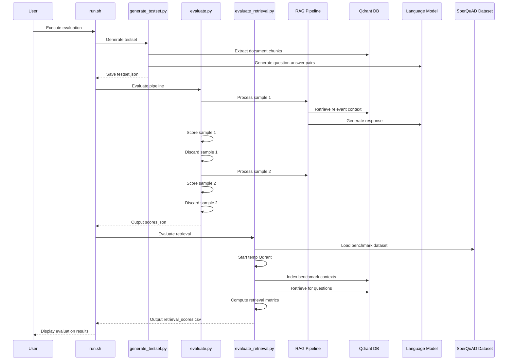
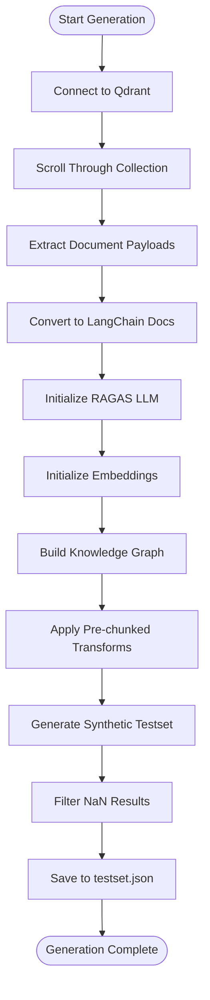
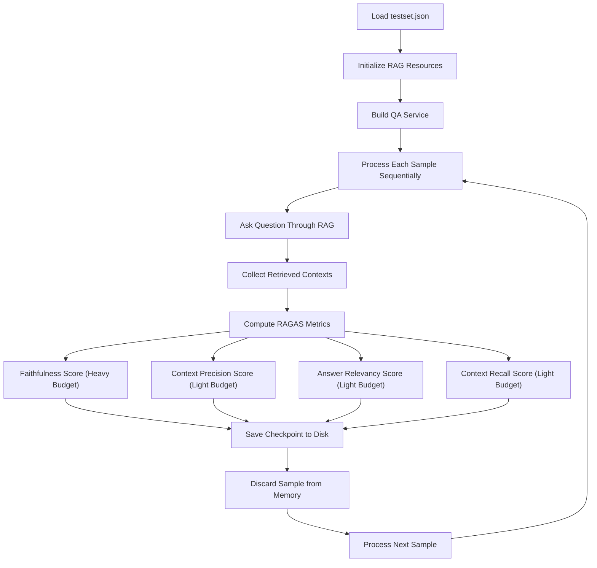
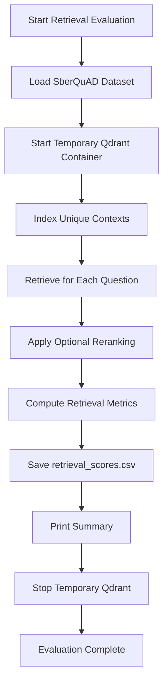

# RAGAS Quality Evaluation Framework

<cite>
**Referenced Files in This Document**
- [evaluate.py](file://ragas/evaluate.py)
- [evaluate_retrieval.py](file://ragas/evaluate_retrieval.py)
- [generate_testset.py](file://ragas/generate_testset.py)
- [run.sh](file://ragas/run.sh)
- [config.py](file://packages/rag_service/src/cafetera_rag_service/config.py)
- [resources.py](file://packages/rag_service/src/cafetera_rag_service/resources.py)
- [chain.py](file://packages/rag_service/src/cafetera_rag_service/rag/chain.py)
- [retriever.py](file://packages/rag_service/src/cafetera_rag_service/rag/retriever.py)
- [pyproject.toml](file://pyproject.toml)
</cite>

## Update Summary
**Changes Made**
- Updated to reflect major architectural improvements in RAGAS evaluation system
- Pipelined processing model replacing two-phase approach for memory efficiency
- Enhanced LLM endpoint resolution with per-metric token budgeting
- Improved resource management with automatic cleanup and graceful degradation
- Enhanced embedding configuration with chunk size support
- Added comprehensive retrieval evaluation capabilities with SberQuAD benchmark

## Table of Contents
1. [Introduction](#introduction)
2. [Project Structure](#project-structure)
3. [Core Components](#core-components)
4. [Architecture Overview](#architecture-overview)
5. [Detailed Component Analysis](#detailed-component-analysis)
6. [Dependency Analysis](#dependency-analysis)
7. [Performance Considerations](#performance-considerations)
8. [Troubleshooting Guide](#troubleshooting-guide)
9. [Conclusion](#conclusion)

## Introduction

The RAGAS Quality Evaluation Framework is a comprehensive automated testing system designed to evaluate the quality of Retrieval-Augmented Generation (RAG) pipelines. This framework provides four key quality metrics: Faithfulness, Context Precision, Answer Relevancy, and Context Recall, enabling teams to quantitatively assess their AI-powered chatbot's performance.

**Enhanced** The framework now operates on a pipelined processing model that replaces the previous two-phase approach, providing significant memory efficiency improvements. The new architecture features per-metric token budgeting, enhanced LLM endpoint resolution for different providers, and comprehensive resource management with automatic cleanup capabilities.

The framework supports both full RAG evaluation and isolated retrieval evaluation workflows. The retrieval evaluation system provides standalone assessment capabilities using the SberQuAD benchmark, allowing teams to test retrieval quality independently of the generation component.

## Project Structure

The RAGAS evaluation framework is organized into several key components that work together to provide comprehensive quality assessment:

```mermaid
graph TB
subgraph "RAGAS Framework"
RUN[run.sh - Main Orchestrator]
GEN[generate_testset.py - Testset Generator]
EVAL[evaluate.py - Quality Evaluator]
RETEVAL[evaluate_retrieval.py - Standalone Retriever]
TESTSET[testset.json - Generated Test Cases]
SCORES[scores.json - Evaluation Results]
RETSCORES[retrieval_scores.csv - Retrieval Results]
END
subgraph "RAG Service Integration"
CFG[RagServiceSettings - Configuration]
RES[RagResources - Resource Management]
CHAIN[build_llm - LLM Builder]
RET[build_qdrant_client - Vector Store]
END
subgraph "External Dependencies"
QDRANT[Qdrant Vector Database]
LLM[Language Model Provider]
EMB[Embedding Provider]
DATASETS[Datasets Library]
PANDAS[Pandas Library]
END
RUN --> GEN
RUN --> EVAL
RUN --> RETEVAL
GEN --> TESTSET
EVAL --> SCORES
RETEVAL --> RETSCORES
EVAL --> RES
RES --> CFG
RES --> CHAIN
RES --> RET
RES --> QDRANT
CHAIN --> LLM
RET --> EMB
RETEVAL --> DATASETS
RETEVAL --> PANDAS
```

**Diagram sources**
- [run.sh:1-291](file://ragas/run.sh#L1-L291)
- [evaluate.py:1-470](file://ragas/evaluate.py#L1-L470)
- [evaluate_retrieval.py:1-658](file://ragas/evaluate_retrieval.py#L1-L658)
- [generate_testset.py:1-344](file://ragas/generate_testset.py#L1-L344)

The framework consists of four primary modules working in coordination:

- **run.sh**: The main orchestrator script that manages the entire evaluation workflow, handles provider selection, and coordinates between generation, evaluation, and retrieval phases
- **generate_testset.py**: Creates synthetic test datasets by extracting document chunks from Qdrant and generating question-answer pairs using the configured LLM
- **evaluate.py**: Executes the complete RAG pipeline against test cases using a pipelined processing model with per-metric token budgeting and memory-efficient evaluation
- **evaluate_retrieval.py**: Provides standalone retrieval evaluation using the SberQuAD benchmark with temporary Qdrant containers

**Section sources**
- [run.sh:1-291](file://ragas/run.sh#L1-L291)
- [evaluate.py:365-452](file://ragas/evaluate.py#L365-L452)
- [evaluate_retrieval.py:569-646](file://ragas/evaluate_retrieval.py#L569-L646)
- [generate_testset.py:231-326](file://ragas/generate_testset.py#L231-L326)

## Core Components

### Pipelined Processing Engine

**Updated** The evaluation engine now implements a memory-efficient pipelined processing model that processes samples sequentially rather than loading all results into memory simultaneously. This approach provides significant memory savings and crash resilience.

Key capabilities include:
- **Sequential Processing**: Each sample is processed, scored, and immediately discarded from memory
- **Checkpoint Persistence**: Results are saved to disk after each sample to prevent data loss
- **Memory Optimization**: Large strings and context arrays are released immediately after scoring
- **Crash Recovery**: Partial results are preserved even if the evaluation is interrupted

### Enhanced LLM Endpoint Resolution

**Updated** The framework now features sophisticated LLM endpoint resolution with per-metric token budgeting:

- **Provider Abstraction**: Supports OpenAI, Ollama, and llama.cpp through unified interfaces
- **Per-Metric Budgeting**: Different token limits for Faithfulness (65536) vs other metrics (4096)
- **Backend-Specific Tuning**: Automatic adjustment of generation caps for different providers
- **Connection Pooling**: Shared AsyncOpenAI clients across multiple metrics for efficiency

### Comprehensive Retrieval Evaluation System

**New Feature** The retrieval evaluation system provides independent assessment of retrieval quality without requiring the generation component:

- **SberQuAD Benchmark Integration**: Loads the SberQuAD dataset from HuggingFace for comprehensive evaluation
- **Temporary Qdrant Containers**: Automatically starts and manages temporary Qdrant instances for isolated testing
- **Offline Evaluation**: Supports evaluation without production data, using public benchmarks
- **Comprehensive Metrics**: Computes MRR, NDCG, Hit Rate, Recall, and Precision metrics
- **Model Comparison**: Enables comparison of different embedding models and retrieval configurations

### Enhanced Resource Management

**Updated** The framework integrates seamlessly with the broader RAG service infrastructure through a sophisticated resource management system that handles graceful degradation and automatic cleanup:

- **Provider Abstraction**: Supporting OpenAI, Ollama, and llama.cpp through unified interfaces
- **Graceful Degradation**: Resources are initialized with fallback mechanisms when services are unavailable
- **Automatic Cleanup**: Comprehensive cleanup of all resources with try/except blocks for error handling
- **Connection Pooling**: Efficient management of database and API connections

### Advanced Embedding Configuration

**Updated** Enhanced embedding configuration with chunk size support and provider-specific optimizations:

- **Chunk Size Control**: Configurable embedding chunk sizes for memory optimization
- **Provider-Specific Tuning**: Different embedding configurations for OpenAI, Ollama, and llama.cpp
- **Query Instruction Support**: Optional query instruction formatting for asymmetric embeddings
- **FastEmbed Integration**: Optimized sparse embeddings for BM25 retrieval

**Section sources**
- [evaluate.py:365-452](file://ragas/evaluate.py#L365-L452)
- [evaluate.py:125-224](file://ragas/evaluate.py#L125-L224)
- [evaluate_retrieval.py:569-646](file://ragas/evaluate_retrieval.py#L569-L646)
- [resources.py:202-301](file://packages/rag_service/src/cafetera_rag_service/resources.py#L202-L301)
- [retriever.py:221-277](file://packages/rag_service/src/cafetera_rag_service/rag/retriever.py#L221-L277)

## Architecture Overview

The RAGAS evaluation framework employs a modern pipelined architecture that separates concerns between data generation, pipeline execution, and quality assessment:



**Diagram sources**
- [run.sh:253-290](file://ragas/run.sh#L253-L290)
- [evaluate.py:365-452](file://ragas/evaluate.py#L365-L452)
- [evaluate_retrieval.py:569-646](file://ragas/evaluate_retrieval.py#L569-L646)

The architecture ensures clean separation of responsibilities while maintaining efficient data flow between components. The pipelined processing model eliminates memory bottlenecks by processing samples sequentially, while the enhanced resource management provides robust error handling and automatic cleanup.

**Section sources**
- [run.sh:253-290](file://ragas/run.sh#L253-L290)
- [evaluate.py:365-452](file://ragas/evaluate.py#L365-L452)
- [evaluate_retrieval.py:569-646](file://ragas/evaluate_retrieval.py#L569-L646)

## Detailed Component Analysis

### Pipelined Testset Generation Workflow

**Updated** The testset generation process follows an enhanced sequential approach designed to create high-quality synthetic evaluation data with improved error handling:



**Diagram sources**
- [generate_testset.py:231-326](file://ragas/generate_testset.py#L231-L326)

The workflow begins with establishing connections to Qdrant and extracting all document chunks. Each chunk is processed through a knowledge graph construction phase where transformations are applied to prepare the content for question generation. The system then generates synthetic question-answer pairs using the configured LLM, implementing safety measures to handle potential NaN values from local LLM execution.

**Section sources**
- [generate_testset.py:51-88](file://ragas/generate_testset.py#L51-L88)
- [generate_testset.py:268-290](file://ragas/generate_testset.py#L268-L290)
- [generate_testset.py:306-326](file://ragas/generate_testset.py#L306-L326)

### Memory-Efficient Quality Evaluation Pipeline

**Updated** The evaluation phase implements a pipelined processing model that processes each test case sequentially for optimal memory usage:



**Diagram sources**
- [evaluate.py:365-452](file://ragas/evaluate.py#L365-L452)

Each test case undergoes identical processing, ensuring consistent evaluation conditions. The system captures not only the final response but also the retrieved contexts, enabling comprehensive metric calculation. The pipelined approach processes samples sequentially, saving results to disk after each sample and immediately discarding the data from memory to prevent memory accumulation.

**Section sources**
- [evaluate.py:365-452](file://ragas/evaluate.py#L365-L452)
- [evaluate.py:275-335](file://ragas/evaluate.py#L275-L335)

### Standalone Retrieval Evaluation System

**New Feature** The retrieval evaluation system provides comprehensive offline assessment of retrieval quality:



**Diagram sources**
- [evaluate_retrieval.py:569-646](file://ragas/evaluate_retrieval.py#L569-L646)

The retrieval evaluation system operates independently of the generation component, using the SberQuAD benchmark to provide objective assessment of retrieval quality. It automatically manages temporary Qdrant containers, indexes benchmark contexts, and computes comprehensive retrieval metrics including MRR, NDCG, Hit Rate, Recall, and Precision.

**Section sources**
- [evaluate_retrieval.py:569-646](file://ragas/evaluate_retrieval.py#L569-L646)

### Enhanced Provider Configuration Management

**Updated** The framework supports multiple language model providers through an enhanced configuration system with per-metric token budgeting:

| Provider | Base URL Pattern | Authentication | Token Budgeting | Special Considerations |
|----------|------------------|----------------|-----------------|----------------------|
| OpenAI | `{base_url}` | API Key Required | Standard Limits | Production-grade reliability |
| Ollama | `{base_url}` | API Key: "ollama" | Standard Limits | Local deployment support |
| llama.cpp | `{base_url}/v1` | API Key: "no-key" | Extended Limits | Custom server deployment |

The configuration system automatically adapts LLM parameters based on provider capabilities, including context window sizing and token limits. The per-metric budgeting ensures that Faithfulness scoring receives adequate token allocation for complex NER extraction while other metrics use conservative limits to optimize memory usage.

**Section sources**
- [evaluate.py:125-224](file://ragas/evaluate.py#L125-L224)
- [evaluate_retrieval.py:569-646](file://ragas/evaluate_retrieval.py#L569-L646)
- [generate_testset.py:113-144](file://ragas/generate_testset.py#L113-L144)

## Dependency Analysis

The RAGAS evaluation framework maintains minimal external dependencies while leveraging powerful libraries for specific tasks:

```mermaid
graph TB
subgraph "Framework Dependencies"
RAGAS[RAGAS >= 0.4.0]
OPENAI[openai >= 1.0.0]
LANGCHAIN[langchain-core]
NUMPY[numpy]
QDRANT[qdrant-client]
DATASETS[datasets >= 3.0.0]
PANDAS[pandas >= 3.0.2]
END
subgraph "Internal Dependencies"
CORE[cafetera-core]
ADMIN[cafetera-admin]
VK_BOT[cafetera-vk-bot]
RAG_SERVICE[cafetera-rag-service]
END
subgraph "Development Tools"
RUFF[ruff >= 0.15.12]
MYPY[mypy >= 1.20.2]
PYTEST[pytest >= 9.0.3]
END
RAGAS --> OPENAI
RAGAS --> LANGCHAIN
RAGAS --> QDRANT
DATASETS --> PANDAS
CORE --> RAGAS
RAG_SERVICE --> RAGAS
ADMIN --> RAGAS
VK_BOT --> RAGAS
```

**Diagram sources**
- [pyproject.toml:9-26](file://pyproject.toml#L9-L26)
- [pyproject.toml:40-48](file://pyproject.toml#L40-L48)

The dependency structure reflects a clean separation between evaluation-specific requirements and the broader application ecosystem. The framework relies on established libraries for robust functionality while maintaining compatibility with the larger system architecture. The addition of datasets and pandas libraries enables comprehensive retrieval evaluation capabilities.

**Section sources**
- [pyproject.toml:1-80](file://pyproject.toml#L1-L80)

## Performance Considerations

The RAGAS evaluation framework is designed with performance optimization in mind, particularly for large-scale document collections and resource-constrained environments.

### Memory Management

**Updated** The framework implements several memory optimization strategies through its pipelined processing model:
- **Sequential Processing**: Each sample is processed and immediately discarded from memory
- **Checkpoint Persistence**: Results are saved to disk after each sample to prevent data loss
- **Automatic Cleanup**: Comprehensive cleanup of database connections and API clients
- **Resource Pooling**: Shared AsyncOpenAI clients across multiple metrics reduce memory overhead

### Enhanced Execution Optimization

**Updated** Performance improvements include:
- **Per-Metric Token Budgeting**: Different token limits for Faithfulness (65536) vs other metrics (4096)
- **Connection Pooling**: Shared AsyncOpenAI clients across LLM and embeddings
- **Graceful Degradation**: Resources are initialized with fallback mechanisms when services are unavailable
- **Efficient Batch Processing**: Optimized handling of document chunks during testset generation

### Scalability Features

**Updated** The framework scales effectively across different deployment scenarios:
- **Containerized Deployment**: Full Docker Compose support for consistent environments
- **Enhanced Environment Abstraction**: Unified configuration system supporting multiple providers
- **Pipelined Design**: Sequential processing eliminates memory bottlenecks
- **Robust Error Handling**: Automatic cleanup and resource management prevent resource leaks

**Section sources**
- [evaluate.py:365-452](file://ragas/evaluate.py#L365-L452)
- [evaluate.py:125-224](file://ragas/evaluate.py#L125-L224)
- [resources.py:304-339](file://packages/rag_service/src/cafetera_rag_service/resources.py#L304-L339)

## Troubleshooting Guide

Common issues and their solutions when working with the RAGAS evaluation framework:

### Provider Configuration Issues

**Problem**: LLM provider connection failures
**Solution**: Verify provider URLs, API keys, and network connectivity. Check that the selected provider is properly initialized in the configuration system. The enhanced endpoint resolution automatically handles provider-specific URL patterns and authentication.

**Problem**: Embedding model loading errors  
**Solution**: Ensure embedding models are available on the target provider. For local deployments, verify model files exist and are properly loaded. Check that the embedding chunk size configuration is appropriate for your model.

### Data Generation Problems

**Problem**: Empty testset generation results
**Solution**: Confirm that Qdrant contains indexed document chunks. Verify collection names and connection parameters. Check that the LLM has sufficient context for question generation.

**Problem**: NaN values in testset generation
**Solution**: The framework includes automatic NaN filtering. The enhanced LLM configuration provides increased token budgets (65536) and reduced temperature (0.2) to minimize repetition loops that cause NaN values.

### Evaluation Pipeline Issues

**Problem**: Memory exhaustion during evaluation
**Solution**: The pipelined processing model should prevent memory issues. If problems persist, verify that the evaluation is using the latest version with sequential processing. Check that checkpoint files are being written to disk.

**Problem**: Inconsistent metric values across runs
**Solution**: Ensure consistent embedding models are used. Verify deterministic LLM settings and stable provider configurations. Check that the per-metric token budgeting is functioning correctly.

### Standalone Retrieval Evaluation Issues

**Problem**: Temporary Qdrant container startup failures
**Solution**: Verify Docker installation and permissions. Check that port 6333 is available and Docker daemon is running. The enhanced cleanup mechanism ensures containers are properly terminated.

**Problem**: SberQuAD dataset download errors
**Solution**: Ensure internet connectivity and HuggingFace access. Check dataset availability and network restrictions.

**Problem**: Retrieval metric computation failures
**Solution**: Verify embedding provider availability and model loading. Check that the temporary Qdrant container is healthy and responsive.

### Resource Management

**Problem**: Memory leaks or connection exhaustion
**Solution**: Verify proper resource cleanup in all execution paths. The enhanced cleanup mechanism automatically closes all resources including Qdrant clients, HTTP clients, and S3 storage. Monitor resource usage during long-running evaluations.

**Section sources**
- [evaluate.py:365-452](file://ragas/evaluate.py#L365-L452)
- [resources.py:304-339](file://packages/rag_service/src/cafetera_rag_service/resources.py#L304-L339)
- [evaluate_retrieval.py:569-646](file://ragas/evaluate_retrieval.py#L569-L646)

## Conclusion

The RAGAS Quality Evaluation Framework provides a comprehensive solution for automated RAG pipeline assessment. By combining synthetic test generation with standardized quality metrics and implementing a memory-efficient pipelined processing model, it enables teams to quantitatively measure and improve their AI-powered chatbot performance.

**Enhanced** The framework's major architectural improvements include the transition to a pipelined processing model that eliminates memory bottlenecks, enhanced LLM endpoint resolution with per-metric token budgeting for optimal resource utilization, comprehensive resource management with automatic cleanup and graceful degradation, and enhanced embedding configuration with chunk size support for memory optimization.

The framework's addition of standalone retrieval evaluation capabilities using the SberQuAD benchmark significantly strengthens its utility by providing independent assessment of retrieval quality without requiring generation components. This dual approach enables comprehensive evaluation of both retrieval and generation aspects of RAG systems.

The framework's modular design, robust provider abstraction, and comprehensive error handling make it suitable for various deployment scenarios while maintaining high standards for evaluation accuracy. Its integration with the broader cafetera ecosystem demonstrates practical applicability in real-world applications.

Through systematic evaluation and continuous monitoring, organizations can maintain high-quality AI assistants that consistently meet user expectations while adapting to evolving content and requirements. The inclusion of offline retrieval evaluation capabilities ensures that teams can thoroughly assess their retrieval systems even without access to production data.

The enhanced memory efficiency, automatic resource management, and comprehensive error handling make this framework particularly suitable for production environments where reliability and resource optimization are critical concerns.