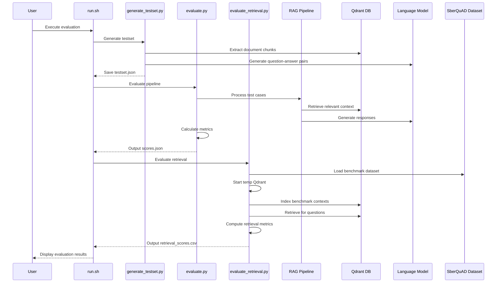
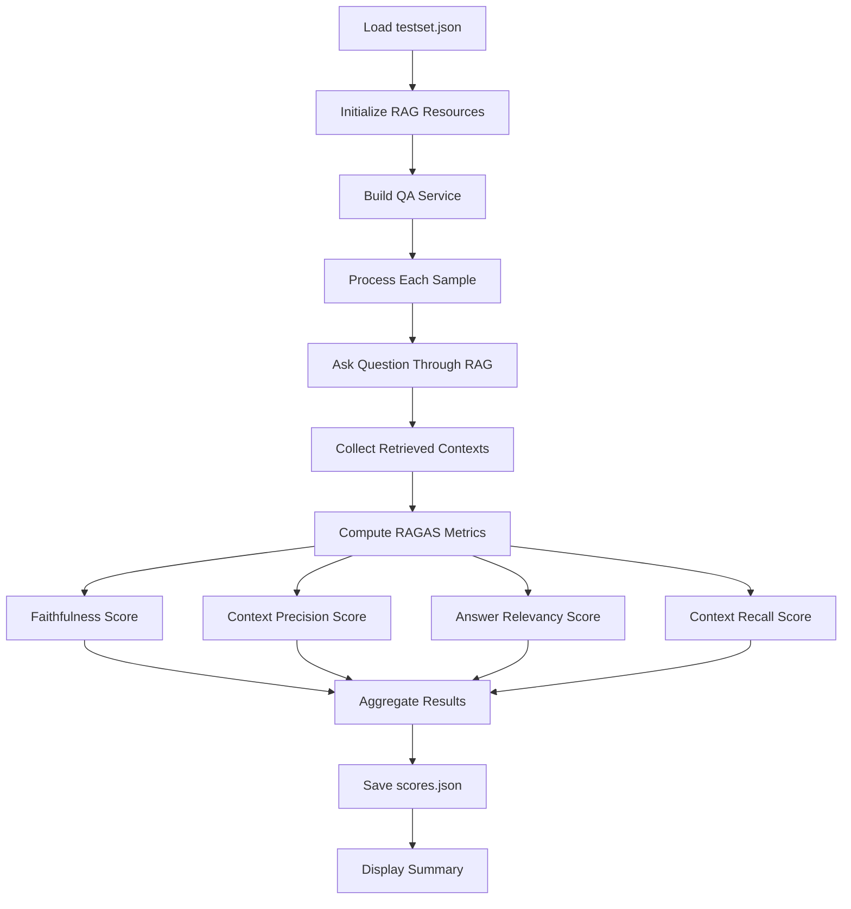
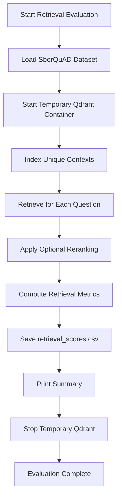

# RAGAS Quality Evaluation Framework

<cite>
**Referenced Files in This Document**
- [evaluate.py](file://ragas/evaluate.py)
- [evaluate_retrieval.py](file://ragas/evaluate_retrieval.py)
- [generate_testset.py](file://ragas/generate_testset.py)
- [run.sh](file://ragas/run.sh)
- [ragas.md](file://docs/ragas.md)
- [pyproject.toml](file://pyproject.toml)
- [docker-compose.yml](file://docker-compose.yml)
- [config.py](file://packages/rag_service/src/cafetera_rag_service/config.py)
- [resources.py](file://packages/rag_service/src/cafetera_rag_service/resources.py)
- [chain.py](file://packages/rag_service/src/cafetera_rag_service/rag/chain.py)
- [retriever.py](file://packages/rag_service/src/cafetera_rag_service/rag/retriever.py)
</cite>

## Update Summary
**Changes Made**
- Added comprehensive documentation for the new standalone retrieval evaluation system
- Updated architecture diagrams to include the SberQuAD benchmark workflow
- Enhanced troubleshooting guide with retrieval-specific issues
- Added new section covering offline retrieval evaluation capabilities
- Updated dependency analysis to include datasets and pandas libraries

## Table of Contents
1. [Introduction](#introduction)
2. [Project Structure](#project-structure)
3. [Core Components](#core-components)
4. [Architecture Overview](#architecture-overview)
5. [Detailed Component Analysis](#detailed-component-analysis)
6. [Dependency Analysis](#dependency-analysis)
7. [Performance Considerations](#performance-considerations)
8. [Troubleshooting Guide](#troubleshooting-guide)
9. [Conclusion](#conclusion)

## Introduction

The RAGAS Quality Evaluation Framework is a comprehensive automated testing system designed to evaluate the quality of Retrieval-Augmented Generation (RAG) pipelines. This framework provides four key quality metrics: Faithfulness, Context Precision, Answer Relevancy, and Context Recall, enabling teams to quantitatively assess their AI-powered chatbot's performance.

**Enhanced** The framework now supports both full RAG evaluation and isolated retrieval evaluation workflows. The new retrieval evaluation system provides standalone evaluation capabilities using the SberQuAD benchmark, allowing teams to test retrieval quality independently of the generation component.

The framework operates on a dual-phase approach: first generating synthetic test datasets from existing document collections, then systematically evaluating the RAG pipeline against these test cases using industry-standard metrics. Additionally, it supports offline retrieval evaluation using public benchmarks for comprehensive quality assessment.

## Project Structure

The RAGAS evaluation framework is organized into several key components that work together to provide comprehensive quality assessment:

```mermaid
graph TB
subgraph "RAGAS Framework"
RUN[run.sh - Main Orchestrator]
GEN[generate_testset.py - Testset Generator]
EVAL[evaluate.py - Quality Evaluator]
RETEVAL[evaluate_retrieval.py - Standalone Retriever]
TESTSET[testset.json - Generated Test Cases]
SCORES[scores.json - Evaluation Results]
RETSCORES[retrieval_scores.csv - Retrieval Results]
END
subgraph "RAG Service Integration"
CFG[RagServiceSettings - Configuration]
RES[RagResources - Resource Management]
CHAIN[build_llm - LLM Builder]
RET[build_qdrant_client - Vector Store]
END
subgraph "External Dependencies"
QDRANT[Qdrant Vector Database]
LLM[Language Model Provider]
EMB[Embedding Provider]
DATASETS[Datasets Library]
PANDAS[Pandas Library]
END
RUN --> GEN
RUN --> EVAL
RUN --> RETEVAL
GEN --> TESTSET
EVAL --> SCORES
RETEVAL --> RETSCORES
EVAL --> RES
RES --> CFG
RES --> CHAIN
RES --> RET
RES --> QDRANT
CHAIN --> LLM
RET --> EMB
RETEVAL --> DATASETS
RETEVAL --> PANDAS
```

**Diagram sources**
- [run.sh:1-250](file://ragas/run.sh#L1-L250)
- [evaluate.py:1-387](file://ragas/evaluate.py#L1-L387)
- [evaluate_retrieval.py:1-597](file://ragas/evaluate_retrieval.py#L1-L597)
- [generate_testset.py:1-333](file://ragas/generate_testset.py#L1-L333)

The framework consists of four primary modules working in coordination:

- **run.sh**: The main orchestrator script that manages the entire evaluation workflow, handles provider selection, and coordinates between generation, evaluation, and retrieval phases
- **generate_testset.py**: Creates synthetic test datasets by extracting document chunks from Qdrant and generating question-answer pairs using the configured LLM
- **evaluate.py**: Executes the complete RAG pipeline against test cases and computes quality metrics using the RAGAS library
- **evaluate_retrieval.py**: Provides standalone retrieval evaluation using the SberQuAD benchmark with temporary Qdrant containers

**Section sources**
- [run.sh:1-250](file://ragas/run.sh#L1-L250)
- [evaluate.py:1-387](file://ragas/evaluate.py#L1-L387)
- [evaluate_retrieval.py:1-597](file://ragas/evaluate_retrieval.py#L1-L597)
- [generate_testset.py:1-333](file://ragas/generate_testset.py#L1-L333)

## Core Components

### Testset Generation Engine

The testset generation component serves as the foundation for quality evaluation by creating realistic scenarios from existing document collections. It connects to Qdrant, extracts document chunks, and leverages the configured LLM to generate synthetic question-answer pairs.

Key capabilities include:
- **Chunk Extraction**: Scrolling through entire Qdrant collections to gather document fragments
- **Knowledge Graph Construction**: Building structured representations of document content for intelligent question generation
- **Synthetic Data Creation**: Generating contextually relevant questions with appropriate answers
- **Quality Filtering**: Implementing NaN-safe execution to handle local LLM limitations

### RAG Pipeline Evaluator

The evaluation engine executes the complete RAG workflow against generated test cases, measuring performance across four critical dimensions:

**Faithfulness Metric**: Verifies factual accuracy by decomposing responses into statements and checking against retrieved context
**Context Precision**: Measures relevance of retrieved documents using position-weighted precision calculations  
**Answer Relevancy**: Ensures responses address the specific query using semantic similarity comparisons
**Context Recall**: Validates completeness of retrieved information against reference answers

### Standalone Retrieval Evaluator

**New Feature** The retrieval evaluation system provides independent assessment of retrieval quality without requiring the generation component:

**SberQuAD Benchmark Integration**: Loads the SberQuAD dataset from HuggingFace for comprehensive evaluation
**Temporary Qdrant Containers**: Automatically starts and manages temporary Qdrant instances for isolated testing
**Offline Evaluation**: Supports evaluation without production data, using public benchmarks
**Comprehensive Metrics**: Computes MRR, NDCG, Hit Rate, Recall, and Precision metrics
**Model Comparison**: Enables comparison of different embedding models and retrieval configurations

### Resource Management System

The framework integrates seamlessly with the broader RAG service infrastructure through a sophisticated resource management system that handles:

- **Provider Abstraction**: Supporting OpenAI, Ollama, and llama.cpp through unified interfaces
- **Connection Pooling**: Efficient management of database and API connections
- **Configuration Management**: Centralized settings for all external service integrations
- **Lifecycle Management**: Proper initialization and cleanup of all resources

**Section sources**
- [generate_testset.py:220-315](file://ragas/generate_testset.py#L220-L315)
- [evaluate.py:178-295](file://ragas/evaluate.py#L178-L295)
- [evaluate_retrieval.py:136-153](file://ragas/evaluate_retrieval.py#L136-L153)
- [evaluate_retrieval.py:524-587](file://ragas/evaluate_retrieval.py#L524-L587)
- [resources.py:1-200](file://packages/rag_service/src/cafetera_rag_service/resources.py#L1-L200)

## Architecture Overview

The RAGAS evaluation framework employs a modular architecture that separates concerns between data generation, pipeline execution, and quality assessment:



**Diagram sources**
- [run.sh:220-249](file://ragas/run.sh#L220-L249)
- [generate_testset.py:220-315](file://ragas/generate_testset.py#L220-L315)
- [evaluate.py:339-387](file://ragas/evaluate.py#L339-L387)
- [evaluate_retrieval.py:524-587](file://ragas/evaluate_retrieval.py#L524-L587)

The architecture ensures clean separation of responsibilities while maintaining efficient data flow between components. Each module can be executed independently, allowing for flexible testing workflows and targeted debugging. The addition of standalone retrieval evaluation provides comprehensive coverage for both generation and retrieval quality assessment.

**Section sources**
- [run.sh:1-250](file://ragas/run.sh#L1-L250)
- [evaluate.py:339-387](file://ragas/evaluate.py#L339-L387)
- [evaluate_retrieval.py:524-587](file://ragas/evaluate_retrieval.py#L524-L587)
- [generate_testset.py:220-315](file://ragas/generate_testset.py#L220-L315)

## Detailed Component Analysis

### Testset Generation Workflow

The testset generation process follows a sophisticated multi-stage approach designed to create high-quality synthetic evaluation data:


**Diagram sources**
- [generate_testset.py:220-315](file://ragas/generate_testset.py#L220-L315)

The workflow begins with establishing connections to Qdrant and extracting all document chunks. Each chunk is processed through a knowledge graph construction phase where transformations are applied to prepare the content for question generation. The system then generates synthetic question-answer pairs using the configured LLM, implementing safety measures to handle potential NaN values from local LLM execution.

**Section sources**
- [generate_testset.py:51-88](file://ragas/generate_testset.py#L51-L88)
- [generate_testset.py:257-285](file://ragas/generate_testset.py#L257-L285)
- [generate_testset.py:295-309](file://ragas/generate_testset.py#L295-L309)

### Quality Evaluation Pipeline

The evaluation phase systematically processes each test case through the complete RAG pipeline while computing multiple quality metrics:



**Diagram sources**
- [evaluate.py:178-295](file://ragas/evaluate.py#L178-L295)

Each test case undergoes identical processing, ensuring consistent evaluation conditions. The system captures not only the final response but also the retrieved contexts, enabling comprehensive metric calculation. The evaluation supports both synchronous and asynchronous processing patterns depending on the underlying RAG service implementation.

**Section sources**
- [evaluate.py:178-212](file://ragas/evaluate.py#L178-L212)
- [evaluate.py:214-295](file://ragas/evaluate.py#L214-L295)

### Standalone Retrieval Evaluation System

**New Feature** The retrieval evaluation system provides comprehensive offline assessment of retrieval quality:



**Diagram sources**
- [evaluate_retrieval.py:524-587](file://ragas/evaluate_retrieval.py#L524-L587)

The retrieval evaluation system operates independently of the generation component, using the SberQuAD benchmark to provide objective assessment of retrieval quality. It automatically manages temporary Qdrant containers, indexes benchmark contexts, and computes comprehensive retrieval metrics including MRR, NDCG, Hit Rate, Recall, and Precision.

**Section sources**
- [evaluate_retrieval.py:136-153](file://ragas/evaluate_retrieval.py#L136-L153)
- [evaluate_retrieval.py:524-587](file://ragas/evaluate_retrieval.py#L524-L587)

### Provider Configuration Management

The framework supports multiple language model providers through a unified configuration system:

| Provider | Base URL Pattern | Authentication | Special Considerations |
|----------|------------------|----------------|----------------------|
| OpenAI | `{base_url}/v1` | API Key Required | Production-grade reliability |
| Ollama | `{base_url}/v1` | API Key: "ollama" | Local deployment support |
| llama.cpp | `{base_url}/v1` | API Key: "no-key" | Custom server deployment |

The configuration system automatically adapts LLM parameters based on provider capabilities, including context window sizing and token limits. This abstraction enables seamless switching between different deployment environments without code changes.

**Section sources**
- [evaluate.py:117-153](file://ragas/evaluate.py#L117-L153)
- [evaluate_retrieval.py:531](file://ragas/evaluate_retrieval.py#L531)
- [generate_testset.py:113-155](file://ragas/generate_testset.py#L113-L155)

## Dependency Analysis

The RAGAS evaluation framework maintains minimal external dependencies while leveraging powerful libraries for specific tasks:

```mermaid
graph TB
subgraph "Framework Dependencies"
RAGAS[RAGAS >= 0.4.0]
OPENAI[openai >= 1.0.0]
LANGCHAIN[langchain-core]
NUMPY[numpy]
QDRANT[qdrant-client]
DATASETS[datasets >= 3.0.0]
PANDAS[pandas >= 3.0.2]
END
subgraph "Internal Dependencies"
CORE[cafetera-core]
ADMIN[cafetera-admin]
VK_BOT[cafetera-vk-bot]
RAG_SERVICE[cafetera-rag-service]
END
subgraph "Development Tools"
RUFF[ruff >= 0.15.12]
MYPY[mypy >= 1.20.2]
PYTEST[pytest >= 9.0.3]
END
RAGAS --> OPENAI
RAGAS --> LANGCHAIN
RAGAS --> QDRANT
DATASETS --> PANDAS
CORE --> RAGAS
RAG_SERVICE --> RAGAS
ADMIN --> RAGAS
VK_BOT --> RAGAS
```

**Diagram sources**
- [pyproject.toml:9-25](file://pyproject.toml#L9-L25)
- [pyproject.toml:41-46](file://pyproject.toml#L41-L46)

The dependency structure reflects a clean separation between evaluation-specific requirements and the broader application ecosystem. The framework relies on established libraries for robust functionality while maintaining compatibility with the larger system architecture. The addition of datasets and pandas libraries enables comprehensive retrieval evaluation capabilities.

**Section sources**
- [pyproject.toml:1-79](file://pyproject.toml#L1-L79)

## Performance Considerations

The RAGAS evaluation framework is designed with performance optimization in mind, particularly for large-scale document collections and resource-constrained environments.

### Memory Management

The framework implements several memory optimization strategies:
- **Streaming Data Processing**: Uses iterative scrolling for large Qdrant collections
- **Resource Cleanup**: Automatic cleanup of database connections and API clients
- **Batch Processing**: Efficient handling of document chunks during testset generation
- **Temporary Container Management**: Automatic cleanup of temporary Qdrant containers in retrieval evaluation

### Execution Optimization

Performance improvements include:
- **Parallel Processing**: Asynchronous execution for concurrent test case evaluation
- **Caching Strategies**: Intelligent reuse of embeddings and model responses
- **Timeout Management**: Configurable timeouts for external service calls
- **Concurrent Retrieval**: Parallel processing of retrieval queries in standalone evaluation

### Scalability Features

The framework scales effectively across different deployment scenarios:
- **Containerized Deployment**: Full Docker Compose support for consistent environments
- **Environment Abstraction**: Unified configuration system supporting multiple providers
- **Modular Design**: Independent execution of generation, evaluation, and retrieval phases
- **Benchmark Independence**: Standalone evaluation capability reduces production data dependencies

**Section sources**
- [generate_testset.py:51-88](file://ragas/generate_testset.py#L51-L88)
- [evaluate.py:178-212](file://ragas/evaluate.py#L178-L212)
- [evaluate_retrieval.py:569-572](file://ragas/evaluate_retrieval.py#L569-L572)

## Troubleshooting Guide

Common issues and their solutions when working with the RAGAS evaluation framework:

### Provider Configuration Issues

**Problem**: LLM provider connection failures
**Solution**: Verify provider URLs, API keys, and network connectivity. Check that the selected provider is properly initialized in the configuration system.

**Problem**: Embedding model loading errors  
**Solution**: Ensure embedding models are available on the target provider. For local deployments, verify model files exist and are properly loaded.

### Data Generation Problems

**Problem**: Empty testset generation results
**Solution**: Confirm that Qdrant contains indexed document chunks. Verify collection names and connection parameters. Check that the LLM has sufficient context for question generation.

**Problem**: NaN values in testset generation
**Solution**: The framework includes automatic NaN filtering. Increase testset size requests and verify LLM stability for local deployments.

### Evaluation Pipeline Issues

**Problem**: Timeout errors during evaluation
**Solution**: Adjust timeout configurations for external services. Consider reducing testset size or optimizing LLM response times.

**Problem**: Inconsistent metric values across runs
**Solution**: Ensure consistent embedding models are used. Verify deterministic LLM settings and stable provider configurations.

### Standalone Retrieval Evaluation Issues

**Problem**: Temporary Qdrant container startup failures
**Solution**: Verify Docker installation and permissions. Check that port 6333 is available and Docker daemon is running.

**Problem**: SberQuAD dataset download errors
**Solution**: Ensure internet connectivity and HuggingFace access. Check dataset availability and network restrictions.

**Problem**: Retrieval metric computation failures
**Solution**: Verify embedding provider availability and model loading. Check that the temporary Qdrant container is healthy and responsive.

### Resource Management

**Problem**: Memory leaks or connection exhaustion
**Solution**: Verify proper resource cleanup in all execution paths. Monitor resource usage during long-running evaluations.

**Section sources**
- [generate_testset.py:168-188](file://ragas/generate_testset.py#L168-L188)
- [evaluate.py:195-200](file://ragas/evaluate.py#L195-L200)
- [evaluate_retrieval.py:534-101](file://ragas/evaluate_retrieval.py#L534-L101)

## Conclusion

The RAGAS Quality Evaluation Framework provides a comprehensive solution for automated RAG pipeline assessment. By combining synthetic test generation with standardized quality metrics, it enables teams to quantitatively measure and improve their AI-powered chatbot performance.

**Enhanced** The framework's addition of standalone retrieval evaluation capabilities using the SberQuAD benchmark significantly strengthens its utility by providing independent assessment of retrieval quality without requiring generation components. This dual approach enables comprehensive evaluation of both retrieval and generation aspects of RAG systems.

The framework's modular design, robust provider abstraction, and comprehensive error handling make it suitable for various deployment scenarios while maintaining high standards for evaluation accuracy. Its integration with the broader cafetera ecosystem demonstrates practical applicability in real-world applications.

Through systematic evaluation and continuous monitoring, organizations can maintain high-quality AI assistants that consistently meet user expectations while adapting to evolving content and requirements. The inclusion of offline retrieval evaluation capabilities ensures that teams can thoroughly assess their retrieval systems even without access to production data.