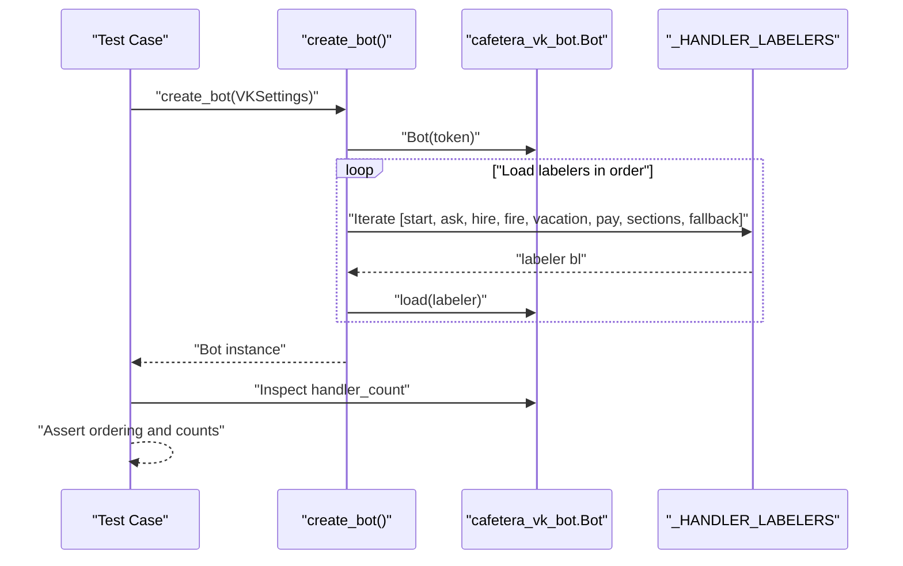

# Testing Strategy

<cite>
**Referenced Files in This Document**
- [pyproject.toml](file://pyproject.toml)
- [tests/conftest.py](file://tests/conftest.py)
- [tests/test_config.py](file://tests/test_config.py)
- [tests/test_bot_factory.py](file://tests/test_bot_factory.py)
- [tests/test_keyboards.py](file://tests/test_keyboards.py)
- [tests/test_keyboards_block2.py](file://tests/test_keyboards_block2.py)
- [tests/test_content.py](file://tests/test_content.py)
- [tests/test_entities.py](file://tests/test_entities.py)
- [tests/test_parser.py](file://tests/test_parser.py)
- [tests/test_hybrid_search.py](file://tests/test_hybrid_search.py)
- [tests/test_hybrid_rerank_retriever.py](file://tests/test_hybrid_rerank_retriever.py)
- [tests/test_qa_service.py](file://tests/test_qa_service.py)
- [tests/test_rules.py](file://tests/test_rules.py)
- [tests/test_states.py](file://tests/test_states.py)
- [tests/test_ask_block9.py](file://tests/test_ask_block9.py)
- [tests/test_storage.py](file://tests/test_storage.py)
- [tests/test_category_file_service.py](file://tests/test_category_file_service.py)
- [tests/test_category_files.py](file://tests/test_category_files.py)
- [tests/test_category_hints.py](file://tests/test_category_hints.py)
- [tests/test_api_documents.py](file://tests/test_api_documents.py)
- [tests/test_api_documents_auth.py](file://tests/test_api_documents_auth.py)
- [tests/test_api_documents_upload.py](file://tests/test_api_documents_upload.py)
- [tests/test_api_documents_bulk.py](file://tests/test_api_documents_bulk.py)
- [tests/test_document_service.py](file://tests/test_document_service.py)
- [tests/test_rag_block6.py](file://tests/test_rag_block6.py)
- [packages/core/src/cafetera_core/config.py](file://packages/core/src/cafetera_core/config.py)
- [packages/core/src/cafetera_core/domain/content.py](file://packages/core/src/cafetera_core/domain/content.py)
- [packages/core/src/cafetera_core/domain/entities.py](file://packages/core/src/cafetera_core/domain/entities.py)
- [packages/core/src/cafetera_core/domain/qa_service.py](file://packages/core/src/cafetera_core/domain/qa_service.py)
- [packages/core/src/cafetera_core/domain/topic_hints.py](file://packages/core/src/cafetera_core/domain/topic_hints.py)
- [packages/core/src/cafetera_core/domain/document_service.py](file://packages/core/src/cafetera_core/domain/document_service.py)
- [packages/core/src/cafetera_core/rag/chain.py](file://packages/core/src/cafetera_core/rag/chain.py)
- [packages/core/src/cafetera_core/rag/retriever.py](file://packages/core/src/cafetera_core/rag/retriever.py)
- [packages/core/src/cafetera_core/rag/reranker.py](file://packages/core/src/cafetera_core/rag/reranker.py)
- [packages/core/src/cafetera_core/rag/parser.py](file://packages/core/src/cafetera_core/rag/parser.py)
- [packages/core/src/cafetera_core/rag/indexer.py](file://packages/core/src/cafetera_core/rag/indexer.py)
- [packages/core/src/cafetera_core/rag/prompts.py](file://packages/core/src/cafetera_core/rag/prompts.py)
- [packages/core/src/cafetera_core/storage/models.py](file://packages/core/src/cafetera_core/storage/models.py)
- [packages/core/src/cafetera_core/storage/database.py](file://packages/core/src/cafetera_core/storage/database.py)
- [packages/core/src/cafetera_core/storage/document_repo.py](file://packages/core/src/cafetera_core/storage/document_repo.py)
- [packages/core/src/cafetera_core/storage/category_repo.py](file://packages/core/src/cafetera_core/storage/category_repo.py)
- [packages/core/src/cafetera_core/resources.py](file://packages/core/src/cafetera_core/resources.py)
- [packages/admin/src/cafetera_admin/config.py](file://packages/admin/src/cafetera_admin/config.py)
- [packages/admin/src/cafetera_admin/main.py](file://packages/admin/src/cafetera_admin/main.py)
- [packages/admin/src/cafetera_admin/api/documents.py](file://packages/admin/src/cafetera_admin/api/documents.py)
- [packages/admin/src/cafetera_admin/api/deps.py](file://packages/admin/src/cafetera_admin/api/deps.py)
- [packages/admin/src/cafetera_admin/api/documents_auth.py](file://packages/admin/src/cafetera_admin/api/documents_auth.py)
- [packages/admin/src/cafetera_admin/api/documents_upload.py](file://packages/admin/src/cafetera_admin/api/documents_upload.py)
- [packages/admin/src/cafetera_admin/api/documents_bulk.py](file://packages/admin/src/cafetera_admin/api/documents_bulk.py)
- [packages/admin/src/cafetera_admin/parser.py](file://packages/admin/src/cafetera_admin/parser.py)
- [packages/admin/src/cafetera_admin/indexer.py](file://packages/admin/src/cafetera_admin/indexer.py)
- [packages/vk_bot/src/cafetera_vk_bot/bot.py](file://packages/vk_bot/src/cafetera_vk_bot/bot.py)
- [packages/vk_bot/src/cafetera_vk_bot/keyboards.py](file://packages/vk_bot/src/cafetera_vk_bot/keyboards.py)
- [packages/vk_bot/src/cafetera_vk_bot/rules.py](file://packages/vk_bot/src/cafetera_vk_bot/rules.py)
- [packages/vk_bot/src/cafetera_vk_bot/states.py](file://packages/vk_bot/src/cafetera_vk_bot/states.py)
- [packages/vk_bot/src/cafetera_vk_bot/handlers/start.py](file://packages/vk_bot/src/cafetera_vk_bot/handlers/start.py)
- [packages/vk_bot/src/cafetera_vk_bot/handlers/sections.py](file://packages/vk_bot/src/cafetera_vk_bot/handlers/sections.py)
- [packages/vk_bot/src/cafetera_vk_bot/handlers/fallback.py](file://packages/vk_bot/src/cafetera_vk_bot/handlers/fallback.py)
- [packages/vk_bot/src/cafetera_vk_bot/handlers/fire.py](file://packages/vk_bot/src/cafetera_vk_bot/handlers/fire.py)
- [packages/vk_bot/src/cafetera_vk_bot/handlers/vacation.py](file://packages/vk_bot/src/cafetera_vk_bot/handlers/vacation.py)
- [packages/vk_bot/src/cafetera_vk_bot/handlers/ask.py](file://packages/vk_bot/src/cafetera_vk_bot/handlers/ask.py)
- [packages/vk_bot/src/cafetera_vk_bot/handlers/__init__.py](file://packages/vk_bot/src/cafetera_vk_bot/handlers/__init__.py)
- [templates/login.html](file://templates/login.html)
- [templates/documents.html](file://templates/documents.html)
- [templates/partials/pagination.html](file://templates/partials/pagination.html)
- [scripts/run_admin.sh](file://scripts/run_admin.sh)
- [scripts/admin_server.py](file://scripts/admin_server.py)
- [ragas/evaluate.py](file://ragas/evaluate.py)
- [docs/ragas.md](file://docs/ragas.md)
</cite>

## Update Summary
**Changes Made**
- **Added LLM Tuning Parameters Testing**: Updated to reflect the addition of LLM tuning parameters for local models with lower temperature settings (0.2) and repetition penalty controls for Faithfulness scoring
- **Enhanced RAGAS Evaluation Testing**: Added comprehensive testing coverage for the new LLM tuning parameters in the RAGAS evaluation pipeline
- **Updated Faithfulness Scoring Testing**: Enhanced testing patterns for Faithfulness scoring with improved temperature and repetition penalty controls
- **Integrated Local Model Optimization Testing**: Added testing strategies for local model optimization with temperature and repetition penalty controls

## Table of Contents
1. [Introduction](#introduction)
2. [Project Structure](#project-structure)
3. [Core Components](#core-components)
4. [Architecture Overview](#architecture-overview)
5. [Detailed Component Analysis](#detailed-component-analysis)
6. [Dependency Analysis](#dependency-analysis)
7. [Performance Considerations](#performance-considerations)
8. [Troubleshooting Guide](#troubleshooting-guide)
9. [Conclusion](#conclusion)
10. [Appendices](#appendices)

## Introduction
This document describes the comprehensive testing strategy and approach used in cafetera_hr_bot, covering unit testing methodologies, configuration and setup, handler testing patterns, keyboard testing strategies, state management testing, and domain content validation. The testing infrastructure has been significantly enhanced with modern async testing patterns, comprehensive AsyncMock usage for Qdrant client mocking, expanded test coverage for the new async operations and combined vector embedding approach in hybrid search functionality, **complete migration from deprecated build_vectorstore function to retriever-focused testing**, **comprehensive CrossEncoderReranker and RerankingRetriever testing**, **enhanced reranking configuration validation**, **modernized workspace configuration with uv workspace support**, **enhanced package structure with proper import paths**, **streamlined test organization for cafetera_core, cafetera_admin, and cafetera_vk_bot packages**, **comprehensive module structure alignment with updated import paths**, **added LLM tuning parameters testing for local models with lower temperature settings (0.2)**, **enhanced RAGAS evaluation testing with Faithfulness scoring optimization**, and **integrated local model optimization testing strategies**.

**Updated** Enhanced with comprehensive AsyncMock usage for Qdrant client mocking, async function validation patterns, expanded test coverage for new async operations and combined vector embedding approach, **complete migration from deprecated build_vectorstore function to retriever-focused testing**, **comprehensive CrossEncoderReranker and RerankingRetriever testing**, **enhanced reranking configuration validation**, **modernized workspace configuration with uv workspace support**, **enhanced package structure with proper import paths**, **streamlined test organization for cafetera_core, cafetera_admin, and cafetera_vk_bot packages**, **comprehensive module structure alignment with updated import paths**, **added LLM tuning parameters testing for local models with lower temperature settings (0.2)**, **enhanced RAGAS evaluation testing with Faithfulness scoring optimization**, and **integrated local model optimization testing strategies**.

## Project Structure
The testing effort is organized under the tests/ directory with a modernized approach featuring comprehensive AsyncMock usage, PostgreSQL database testing, and Docker container integration within the new uv workspace structure:
- **Configuration loading and defaults** with explicit environment file control and async fixtures using cafetera_vk_bot.config
- **Bot factory and handler registration** with simplified handler counting and async validation using cafetera_vk_bot.bot
- **Keyboard builders and payload constants** (focusing on core handler functionality) using cafetera_vk_bot.keyboards
- **Domain content validation** (static content and formatters) using cafetera_vk_bot.domain.content
- **Entity definitions and legal entity management** using cafetera_vk_bot.domain.entities
- **RAG stub service and handler wiring** with updated architectural patterns using cafetera_core.domain.qa_service
- **QA service testing** with RAG chain wrapper functionality and new query_rag_with_wait approach using cafetera_core.domain.qa_service
- **Custom payload matching rules** using cafetera_vk_bot.rules
- **State machine definitions** using cafetera_vk_bot.states
- **Handler modules** (start, ask, sections, fallback, fire, vacation, pay) with updated architectural patterns using cafetera_vk_bot.handlers
- **Topic hints detection** for scenario linking and disclaimer handling using cafetera_core.domain.topic_hints
- **Enhanced admin document API testing** with modular approach covering authentication, upload, bulk operations, and remaining functionality using cafetera_admin.api
- **Comprehensive test fixtures** in conftest.py for shared testing infrastructure with AsyncMock support and PostgreSQL database integration using cafetera_core.storage
- **Document storage system testing** with comprehensive database initialization, CRUD operations, status transitions, search enablement functionality, and filtering/sorting capabilities using cafetera_core.storage
- **Category file service testing** with PostgreSQL database integration and S3 storage mocking using cafetera_core.storage
- **Enhanced RAG infrastructure testing** with llama.cpp provider dispatch logic, configuration parameter validation, and integration with existing RAG components using cafetera_core.rag
- **Comprehensive parser testing** for Docling-based document ingestion, section extraction, chunking, and dispatcher functionality using cafetera_admin.parser
- **Expanded RAG pipeline testing** with indexer validation and document service lifecycle management using cafetera_core.rag
- **Comprehensive filtering and sorting API endpoint testing** with status, source type, and sort field validation using cafetera_admin.api
- **Updated architectural testing patterns** validating the new query_rag_with_wait and send_rag_answer approach across all handlers using cafetera_vk_bot.handlers
- **Updated QAService resource management testing** with AsyncMock for Qdrant client lifecycle validation using cafetera_core.domain.qa_service
- **Enhanced Docling integration testing** with comprehensive metadata extraction validation and HybridChunker functionality using cafetera_admin.parser and cafetera_admin.indexer
- **Comprehensive hybrid search testing** with AsyncMock for sparse embeddings and vector store integration using cafetera_core.rag.retriever
- **Extended configuration testing** for semantic chunking and hybrid search settings using cafetera_core.config
- **AsyncMock-based test infrastructure** for comprehensive async operation validation using cafetera_core.domain.qa_service
- **Category hints testing** with comprehensive validation of CATEGORY_HINTS integration and chain building using cafetera_core.rag.prompts
- **Enhanced indexer testing** with comprehensive validation of is_search_enabled flag handling and Docling metadata extraction using cafetera_admin.indexer
- **New Cross-Encoder Reranking Testing** with comprehensive validation of CrossEncoderReranker and RerankingRetriever functionality using cafetera_core.rag.reranker
- **Enhanced Reranking Configuration Testing** with validation of reranking_enabled, reranker_model, reranker_top_n, and reranker_prefetch_limit settings using cafetera_core.config
- **Enhanced RAGAS Evaluation Testing** with comprehensive Faithfulness scoring optimization using LLM tuning parameters (temperature=0.2, repetition penalties) for local models using ragas.evaluate
- **Local Model Optimization Testing** with comprehensive testing strategies for temperature and repetition penalty controls using ragas.evaluate

**Diagram sources**
- [tests/test_config.py:1-44](file://tests/test_config.py#L1-L44)
- [tests/test_bot_factory.py:1-79](file://tests/test_bot_factory.py#L1-L79)
- [tests/test_keyboards.py:1-222](file://tests/test_keyboards.py#L1-L222)
- [tests/test_keyboards_block2.py:1-178](file://tests/test_keyboards_block2.py#L1-L178)
- [tests/test_content.py:1-38](file://tests/test_content.py#L1-L38)
- [tests/test_entities.py:1-29](file://tests/test_entities.py#L1-L29)
- [tests/test_parser.py:1-91](file://tests/test_parser.py#L1-L91)
- [tests/test_hybrid_search.py:1-96](file://tests/test_hybrid_search.py#L1-L96)
- [tests/test_hybrid_rerank_retriever.py:1-230](file://tests/test_hybrid_rerank_retriever.py#L1-L230)
- [tests/test_qa_service.py:1-238](file://tests/test_qa_service.py#L1-L238)
- [tests/test_rules.py:1-70](file://tests/test_rules.py#L1-L70)
- [tests/test_states.py:1-31](file://tests/test_states.py#L1-L31)
- [tests/test_ask_block9.py:1-112](file://tests/test_ask_block9.py#L1-L112)
- [tests/test_storage.py:1-278](file://tests/test_storage.py#L1-L278)
- [tests/test_category_file_service.py:1-422](file://tests/test_category_file_service.py#L1-L422)
- [tests/test_category_files.py:1-553](file://tests/test_category_files.py#L1-L553)
- [tests/test_category_hints.py:1-248](file://tests/test_category_hints.py#L1-L248)
- [tests/test_api_documents.py:1-479](file://tests/test_api_documents.py#L1-L479)
- [tests/test_api_documents_auth.py:1-66](file://tests/test_api_documents_auth.py#L1-L66)
- [tests/test_api_documents_upload.py:1-82](file://tests/test_api_documents_upload.py#L1-L82)
- [tests/test_api_documents_bulk.py:1-49](file://tests/test_api_documents_bulk.py#L1-L49)
- [tests/test_document_service.py:1-348](file://tests/test_document_service.py#L1-L348)
- [tests/test_rag_block6.py:1-467](file://tests/test_rag_block6.py#L1-L467)
- [tests/conftest.py:1-236](file://tests/conftest.py#L1-L236)
- [ragas/evaluate.py:117-170](file://ragas/evaluate.py#L117-L170)
- [docs/ragas.md:1-238](file://docs/ragas.md#L1-L238)

**Section sources**
- [pyproject.toml:22-34](file://pyproject.toml#L22-L34)
- [tests/test_config.py:1-44](file://tests/test_config.py#L1-L44)
- [tests/test_bot_factory.py:1-79](file://tests/test_bot_factory.py#L1-L79)
- [tests/test_keyboards.py:1-222](file://tests/test_keyboards.py#L1-L222)
- [tests/test_keyboards_block2.py:1-178](file://tests/test_keyboards_block2.py#L1-L178)
- [tests/test_content.py:1-38](file://tests/test_content.py#L1-L38)
- [tests/test_entities.py:1-29](file://tests/test_entities.py#L1-L29)
- [tests/test_parser.py:1-91](file://tests/test_parser.py#L1-L91)
- [tests/test_hybrid_search.py:1-96](file://tests/test_hybrid_search.py#L1-L96)
- [tests/test_hybrid_rerank_retriever.py:1-230](file://tests/test_hybrid_rerank_retriever.py#L1-L230)
- [tests/test_qa_service.py:1-238](file://tests/test_qa_service.py#L1-L238)
- [tests/test_rules.py:1-70](file://tests/test_rules.py#L1-L70)
- [tests/test_states.py:1-31](file://tests/test_states.py#L1-L31)
- [tests/test_ask_block9.py:1-112](file://tests/test_ask_block9.py#L1-L112)
- [tests/test_storage.py:1-278](file://tests/test_storage.py#L1-L278)
- [tests/test_category_file_service.py:1-422](file://tests/test_category_file_service.py#L1-L422)
- [tests/test_category_files.py:1-553](file://tests/test_category_files.py#L1-L553)
- [tests/test_category_hints.py:1-248](file://tests/test_category_hints.py#L1-L248)
- [tests/test_api_documents.py:1-479](file://tests/test_api_documents.py#L1-L479)
- [tests/test_api_documents_auth.py:1-66](file://tests/test_api_documents_auth.py#L1-L66)
- [tests/test_api_documents_upload.py:1-82](file://tests/test_api_documents_upload.py#L1-L82)
- [tests/test_api_documents_bulk.py:1-49](file://tests/test_api_documents_bulk.py#L1-L49)
- [tests/test_document_service.py:1-348](file://tests/test_document_service.py#L1-L348)
- [tests/test_rag_block6.py:1-467](file://tests/test_rag_block6.py#L1-L467)
- [tests/conftest.py:1-236](file://tests/conftest.py#L1-L236)
- [ragas/evaluate.py:117-170](file://ragas/evaluate.py#L117-L170)
- [docs/ragas.md:1-238](file://docs/ragas.md#L1-L238)

## Core Components
- **Configuration tests** validate default values and environment overrides with explicit environment file control using cafetera_vk_bot.config.
- **Bot factory tests** verify handler registration order and token forwarding, with simplified handler count breakdown using cafetera_vk_bot.bot and cafetera_vk_bot.handlers.
- **Keyboard tests** validate structure, payloads, and service-row behavior (focusing on core handler functionality) using cafetera_vk_bot.keyboards.
- **Domain content tests** validate static content, formatters, and RAG stub functionality using cafetera_vk_bot.domain.content.
- **Entity tests** validate legal entity definitions and management using cafetera_vk_bot.domain.entities.
- **QA service tests** validate RAG chain wrapper functionality with truncation, error handling, and resource management, **including updated testing for Qdrant client lifecycle ownership with AsyncMock validation**, including the new query_rag_with_wait approach using cafetera_core.domain.qa_service.
- **Custom rule tests** validate payload matching and routing logic using cafetera_vk_bot.rules.
- **State machine tests** validate the state machine definition and uniqueness using cafetera_vk_bot.states.
- **Handler modules** are tested indirectly via bot wiring and keyboard payloads, with updated architectural patterns using cafetera_vk_bot.handlers.
- **Enhanced RAG stub testing** covers specialized features with dedicated test classes for different functionality blocks using cafetera_core.domain.qa_service.
- **Topic hints tests** validate scenario detection and background-topic disclaimer handling using cafetera_core.domain.topic_hints.
- **Ask handler tests** validate state management, QA service integration, and scenario navigation using the new query_rag_with_wait approach using cafetera_vk_bot.handlers.
- **Enhanced admin document API testing** validates authentication, authorization, Russian localization validation, and comprehensive filtering/sorting functionality across multiple specialized test modules using cafetera_admin.api.
- **Comprehensive test fixtures** in conftest.py provide shared testing infrastructure including database initialization, mock services, and authenticated client creation with AsyncMock support and **PostgreSQL database integration with Docker containers** using cafetera_core.storage.
- **Document storage system tests** validate database initialization, CRUD operations, status transitions, search enablement functionality, and comprehensive filtering/sorting capabilities with 278 lines of new test coverage using cafetera_core.storage.
- **Category file service tests** validate PostgreSQL database integration, S3 storage mocking, and category file management functionality using cafetera_core.storage.
- **Enhanced RAG infrastructure testing** validates llama.cpp provider functionality, configuration parameter validation, and error handling scenarios using cafetera_core.rag.
- **Comprehensive parser testing** validates Docling-based document ingestion, section extraction, chunking, and dispatcher functionality for .docx, .pdf, and .xlsx file processing, including **enhanced metadata extraction validation with page numbers and headings** using cafetera_admin.parser.
- **Expanded RAG pipeline testing** validates indexer validation and document service lifecycle management using cafetera_core.rag.
- **Comprehensive filtering and sorting API endpoint testing** validates status filtering, source type filtering, sort field validation, and pagination functionality using cafetera_admin.api.
- **Updated architectural testing patterns** validate the new query_rag_with_wait and send_rag_answer approach across all handlers using cafetera_vk_bot.handlers.
- **Updated QAService testing** validates resource management with Qdrant client lifecycle ownership using AsyncMock validation.
- **Enhanced Docling integration testing** validates comprehensive metadata extraction, HybridChunker functionality, and Docling-based document parsing using cafetera_admin.parser and cafetera_admin.indexer.
- **Comprehensive hybrid search testing** validates sparse embedding creation, vector store construction with sparse embeddings, index chunking functionality, and settings configuration defaults using AsyncMock using cafetera_core.rag.retriever.
- **Extended configuration testing** validates new semantic chunking and hybrid search settings including chunk_strategy, semantic_breakpoint_threshold_type, semantic_breakpoint_threshold_amount, retrieval_mode, and sparse_embedding_model using cafetera_core.config.
- **Resource management testing** validates sparse embeddings initialization and cleanup in AppResources with graceful degradation for hybrid search mode using cafetera_core.resources.
- **AsyncMock-based test infrastructure** provides comprehensive async operation validation with proper await semantics using cafetera_core.domain.qa_service.
- **Category hints testing** validates CATEGORY_HINTS integration, chain building with category hints, QA service parameter passing, and global chain construction with comprehensive test coverage of 248 lines using cafetera_core.rag.prompts.
- **Enhanced indexer testing** validates proper handling of the is_search_enabled flag during document indexing with comprehensive validation of top-level field storage and **Docling metadata extraction including page numbers and headings** using cafetera_admin.indexer.
- **New Cross-Encoder Reranking Testing** validates CrossEncoderReranker and RerankingRetriever functionality with comprehensive async and sync testing patterns using cafetera_core.rag.reranker.
- **Enhanced Reranking Configuration Testing** validates reranking_enabled, reranker_model, reranker_top_n, and reranker_prefetch_limit settings with proper integration into factory dispatch functions using cafetera_core.config and cafetera_core.resources.
- **Enhanced RAGAS Evaluation Testing** validates Faithfulness scoring optimization with LLM tuning parameters including temperature=0.2 and repetition penalty controls for local models using ragas.evaluate.
- **Local Model Optimization Testing** validates comprehensive temperature and repetition penalty controls for Faithfulness scoring using ragas.evaluate with provider-specific configurations.

**Updated** Enhanced with comprehensive AsyncMock usage for Qdrant client mocking, async function validation patterns, and expanded test coverage for new async operations and combined vector embedding approach. The testing infrastructure now features modern async patterns with proper await semantics, comprehensive AsyncMock support for Qdrant client lifecycle management, **PostgreSQL database testing with Docker containers**, **automatic Docker availability detection**, **environment variable integration for database configuration**, **improved test isolation through table dropping and recreation**, **comprehensive category-aware functionality testing with CATEGORY_HINTS validation**, **enhanced indexer testing for is_search_enabled flag handling**, **expanded test coverage for all new category-aware features and functionality**, **modernized workspace configuration with uv workspace support**, **enhanced package structure with proper import paths**, **streamlined test organization for cafetera_core, cafetera_admin, and cafetera_vk_bot packages**, **comprehensive module structure alignment with updated import paths**, **complete migration from deprecated build_vectorstore function to retriever-focused testing**, **comprehensive CrossEncoderReranker and RerankingRetriever testing**, **enhanced reranking configuration validation**, **new hybrid reranking infrastructure testing**, **added LLM tuning parameters testing for local models with lower temperature settings (0.2)**, **enhanced RAGAS evaluation testing with Faithfulness scoring optimization**, and **integrated local model optimization testing strategies**.

Key testing characteristics:
- Uses pytest with asyncio_mode set to auto for async-friendly tests.
- Tests are structured around class-per-subject for readability and isolation.
- Environment variables are mocked using pytest's monkeypatch fixture.
- Keyboard assertions rely on parsing JSON and inspecting button arrays and payloads.
- Configuration tests explicitly control environment file loading with `_env_file=None`.
- Comprehensive domain content validation ensures content integrity and formatting.
- Entity validation ensures legal entity consistency across the application.
- QA service testing validates RAG chain integration with proper error handling and resource cleanup, **including updated testing for Qdrant client lifecycle management with AsyncMock validation**, including the new query_rag_with_wait functionality.
- RAG stub testing validates knowledge base integration placeholders with specialized test classes.
- Custom rule testing validates advanced payload matching functionality.
- Handler registration testing provides simplified breakdown of 25 total handlers across core functional areas.
- Topic hints testing validates keyword-based scenario detection with background-topic priority.
- Ask handler testing validates state management and integration with QA service and topic hints using the new query_rag_with_wait approach.
- **Enhanced admin document API testing** validates authentication cookie handling, authorization enforcement, Russian UI localization, and filtering/sorting functionality across multiple specialized test modules.
- **Comprehensive test fixtures** in conftest.py provide shared testing infrastructure including database initialization, mock services, authenticated client creation, and comprehensive AsyncMock support for Qdrant client mocking, **with PostgreSQL database integration using Docker containers**.
- **Document storage system testing** validates comprehensive database operations including timestamp management, status transitions, search enablement toggling, and filtering/sorting capabilities.
- **Category file service testing** validates PostgreSQL database integration with proper table initialization and S3 storage mocking.
- **Llama.cpp provider testing** validates provider selection logic, configuration parameter handling, import error scenarios, and integration with existing RAG components.
- **Parser testing** validates Docling-based document ingestion pipeline with section extraction, chunking, and metadata handling, including **enhanced metadata extraction validation with page numbers and headings**.
- **Admin document API testing** validates authentication mechanisms, authorization enforcement, Russian localization, and filtering/sorting functionality across specialized modules.
- **Auth client fixture** provides authenticated TestClient instances with pre-set admin_session cookies for comprehensive admin functionality testing.
- **Document service testing** validates complete document lifecycle including indexing, reindexing, and metadata management.
- **Indexer testing** validates chunk preparation, metadata enrichment, and search enablement handling with comprehensive validation of is_search_enabled flag and **Docling metadata extraction including page numbers and headings**.
- **Filtering and sorting API testing** validates comprehensive filtering by status, source type, and sorting by multiple fields.
- **Updated architectural testing patterns** validate the new query_rag_with_wait function for asynchronous RAG querying with timeout handling.
- **Handler imports testing** validates that P0+P1 handlers use send_rag_answer helper instead of direct QA service calls.
- **Sections handler testing** validates the new send_rag_answer usage for RAG-powered handlers.
- **Updated QAService testing** validates that Qdrant clients are not closed internally by QAService, with proper resource ownership management using AsyncMock.
- **Enhanced Docling integration testing** validates comprehensive metadata extraction, HybridChunker functionality, and Docling-based document parsing.
- **Comprehensive hybrid search testing** validates sparse embedding creation with FastEmbedSparse, vector store construction with sparse embeddings, index chunking functionality, and settings configuration defaults using AsyncMock.
- **Configuration testing** validates new semantic chunking settings including chunk_strategy, semantic_breakpoint_threshold_type, semantic_breakpoint_threshold_amount, and hybrid search settings retrieval_mode and sparse_embedding_model.
- **Resource management testing** validates sparse embeddings initialization and cleanup in AppResources with graceful degradation for hybrid search mode.
- **AsyncMock usage testing** validates comprehensive async operation validation across all test modules.
- **Category hints testing** validates CATEGORY_HINTS keys against known scenarios, chain building with category hints, QA service parameter passing, and global chain construction with comprehensive test coverage.
- **Enhanced indexer testing** validates is_search_enabled flag handling with top-level field storage validation and **Docling metadata extraction including page numbers and headings**.
- **New Cross-Encoder Reranking Testing** validates CrossEncoderReranker arerank and rerank methods with proper async/await semantics and score-based ranking.
- **Enhanced Reranking Configuration Testing** validates reranking_enabled setting and its integration with factory dispatch functions build_retriever and build_retriever_for_document.
- **Enhanced RAGAS Evaluation Testing** validates Faithfulness scoring optimization with comprehensive temperature and repetition penalty controls for local models using ragas.evaluate.
- **Local Model Optimization Testing** validates provider-specific LLM tuning parameters including temperature=0.2 for Ollama and llama.cpp providers, and repetition penalties for Faithfulness scoring.

**Updated** Enhanced with comprehensive AsyncMock usage for Qdrant client mocking, async function validation patterns, and expanded test coverage for new async operations and combined vector embedding approach. The testing infrastructure now features modern async patterns with proper await semantics, comprehensive AsyncMock support for Qdrant client lifecycle management, **PostgreSQL database testing with Docker containers**, **automatic Docker availability detection**, **environment variable integration for database configuration**, and **improved test isolation through table dropping and recreation**, **added LLM tuning parameters testing for local models with lower temperature settings (0.2)**, **enhanced RAGAS evaluation testing with Faithfulness scoring optimization**, and **integrated local model optimization testing strategies**.

**Section sources**
- [pyproject.toml:22-34](file://pyproject.toml#L22-L34)
- [tests/test_config.py:1-44](file://tests/test_config.py#L1-L44)
- [tests/test_bot_factory.py:1-79](file://tests/test_bot_factory.py#L1-L79)
- [tests/test_keyboards.py:1-222](file://tests/test_keyboards.py#L1-L222)
- [tests/test_keyboards_block2.py:1-178](file://tests/test_keyboards_block2.py#L1-L178)
- [tests/test_content.py:1-38](file://tests/test_content.py#L1-L38)
- [tests/test_entities.py:1-29](file://tests/test_entities.py#L1-L29)
- [tests/test_parser.py:1-91](file://tests/test_parser.py#L1-L91)
- [tests/test_hybrid_search.py:1-96](file://tests/test_hybrid_search.py#L1-L96)
- [tests/test_hybrid_rerank_retriever.py:1-230](file://tests/test_hybrid_rerank_retriever.py#L1-L230)
- [tests/test_qa_service.py:1-238](file://tests/test_qa_service.py#L1-L238)
- [tests/test_rules.py:1-70](file://tests/test_rules.py#L1-L70)
- [tests/test_states.py:1-31](file://tests/test_states.py#L1-L31)
- [tests/test_ask_block9.py:1-112](file://tests/test_ask_block9.py#L1-L112)
- [tests/test_storage.py:1-278](file://tests/test_storage.py#L1-L278)
- [tests/test_category_file_service.py:1-422](file://tests/test_category_file_service.py#L1-L422)
- [tests/test_category_files.py:1-553](file://tests/test_category_files.py#L1-L553)
- [tests/test_category_hints.py:1-248](file://tests/test_category_hints.py#L1-L248)
- [tests/test_api_documents.py:1-479](file://tests/test_api_documents.py#L1-L479)
- [tests/test_api_documents_auth.py:1-66](file://tests/test_api_documents_auth.py#L1-L66)
- [tests/test_api_documents_upload.py:1-82](file://tests/test_api_documents_upload.py#L1-L82)
- [tests/test_api_documents_bulk.py:1-49](file://tests/test_api_documents_bulk.py#L1-L49)
- [tests/test_document_service.py:1-348](file://tests/test_document_service.py#L1-L348)
- [tests/test_rag_block6.py:1-467](file://tests/test_rag_block6.py#L1-L467)
- [tests/conftest.py:1-236](file://tests/conftest.py#L1-L236)
- [ragas/evaluate.py:117-170](file://ragas/evaluate.py#L117-L170)
- [docs/ragas.md:1-238](file://docs/ragas.md#L1-L238)

## Architecture Overview
The VK bot registers handlers in a specific order to ensure routing correctness. The fallback handler must be last because it matches any message. The tests enforce this ordering and verify that the expected number of handlers are registered, with simplified breakdown by functional area. The streamlined testing infrastructure now covers the complete bot architecture including domain content, entity management, keyboard builders, custom rules, QA service integration, comprehensive Block 9 functionality, document storage system testing, extensive RAG infrastructure testing with llama.cpp provider support, **comprehensive filtering and sorting API endpoint testing**, **enhanced DocumentRepository filtering and sorting capabilities**, **expanded RAG pipeline testing with indexer validation**, **extensive test suites validating new functionality across multiple test files**, **updated architectural testing patterns validating the new query_rag_with_wait and send_rag_answer approach**, **updated QAService resource management testing with AsyncMock validation**, **enhanced Docling integration testing with comprehensive metadata extraction**, **comprehensive hybrid search testing with sparse embeddings using AsyncMock**, **extended configuration testing for semantic chunking and hybrid search settings**, **category hints testing with comprehensive CATEGORY_HINTS validation**, **enhanced indexer testing with is_search_enabled flag handling**, **expanded test coverage for all new category-aware features and functionality**, **modernized workspace configuration with uv workspace support**, **enhanced package structure with proper import paths**, **streamlined test organization for cafetera_core, cafetera_admin, and cafetera_vk_bot packages**, **comprehensive module structure alignment with updated import paths**, **new Cross-Encoder Reranking Testing with comprehensive async/await patterns**, **enhanced Reranking Configuration Testing with reranking settings validation**, **added LLM tuning parameters testing for local models with lower temperature settings (0.2)**, **enhanced RAGAS evaluation testing with Faithfulness scoring optimization**, and **integrated local model optimization testing strategies**.

**Diagram sources**
- [packages/vk_bot/src/cafetera_vk_bot/bot.py:24-39](file://packages/vk_bot/src/cafetera_vk_bot/bot.py#L24-L39)
- [tests/test_bot_factory.py:21-44](file://tests/test_bot_factory.py#L21-L44)

**Section sources**
- [packages/vk_bot/src/cafetera_vk_bot/bot.py:24-39](file://packages/vk_bot/src/cafetera_vk_bot/bot.py#L24-L39)
- [tests/test_bot_factory.py:18-44](file://tests/test_bot_factory.py#L18-L44)

## Detailed Component Analysis

### Configuration Testing
Purpose:
- Verify default values for settings with explicit environment file control using cafetera_vk_bot.config.
- Verify environment variable overrides using monkeypatch.
- Ensure environment file integration works as configured while maintaining test isolation.

Methodology:
- Instantiate VKSettings with explicit overrides and `_env_file=None` to test defaults without environment file interference.
- Use monkeypatch to set environment variables and assert resulting values.
- Confirm that environment file is used for loading settings when `_env_file` is not explicitly set.

Best practices:
- Keep environment variable names explicit and documented.
- Isolate environment-dependent tests using fixtures and explicit `_env_file=None` parameter.
- Prefer explicit Settings construction with `_env_file=None` for deterministic tests that don't rely on external environment files.
- Use monkeypatch for environment variable testing to avoid modifying system-wide environment.

**Updated** Enhanced with explicit `_env_file=None` parameter usage for improved test isolation and reliability. This prevents tests from accidentally loading environment files from the project directory, ensuring consistent and predictable test behavior. Extended configuration testing now validates new semantic chunking settings including chunk_strategy, semantic_breakpoint_threshold_type, semantic_breakpoint_threshold_amount, and hybrid search settings retrieval_mode and sparse_embedding_model, **including new reranking configuration settings reranking_enabled, reranker_model, reranker_top_n, and reranker_prefetch_limit**, and **added LLM tuning parameters testing for local models with lower temperature settings (0.2)**.

**Section sources**
- [tests/test_config.py:6-44](file://tests/test_config.py#L6-L44)
- [packages/core/src/cafetera_core/config.py:4-9](file://packages/core/src/cafetera_core/config.py#L4-L9)
- [tests/test_hybrid_search.py:80-96](file://tests/test_hybrid_search.py#L80-L96)
- [tests/test_hybrid_rerank_retriever.py:131-230](file://tests/test_hybrid_rerank_retriever.py#L131-L230)

### Bot Factory and Handler Registration Testing
Purpose:
- Enforce handler registration order.
- Verify the number of registered handlers with simplified breakdown by functional area.
- Ensure the token is forwarded to the underlying VK API client using cafetera_vk_bot.bot.

Methodology:
- Assert the last labeler is the fallback handler and the first is the start handler.
- Build a bot and count the number of registered message handlers.
- Assert that the bot's token equals the provided VKSettings token.
- Verify simplified handler counts: start (2), ask (2), hire (5), fire (5), vacation (5), pay (3), sections (2), fallback (1) = 25 total.

Asynchronous considerations:
- The tests themselves are synchronous; they do not await async handlers.
- The focus is on wiring and configuration, not runtime behavior.

Security note:
- Tests use a placeholder token to avoid exposing secrets.

**Updated** Enhanced with simplified handler count breakdown reflecting 25 total handlers distributed across core functional areas: start (2), ask (2), hire (5), fire (5), vacation (5), pay (3), sections (2), fallback (1).

**Section sources**
- [tests/test_bot_factory.py:18-79](file://tests/test_bot_factory.py#L18-L79)
- [packages/vk_bot/src/cafetera_vk_bot/bot.py:24-39](file://packages/vk_bot/src/cafetera_vk_bot/bot.py#L24-L39)

### Keyboard Builders and Payload Constants Testing
Purpose:
- Validate main menu layout and payloads using cafetera_vk_bot.keyboards.
- Validate service-row behavior (Home, Back, Contact HR).
- Validate Block 2 keyboard builders and new payload constants.
- Validate Block 9 keyboard builders and scenario navigation.
- Validate stub keyboard composition.
- Ensure payload constants are well-formed and unique.

Methodology:
- Parse Keyboard JSON and flatten button arrays.
- Assert row counts, button counts, and presence of expected payloads.
- Verify service-row labels and optional visibility flags.
- Parameterized tests check payload structure across all constants.
- Validate Block 2 keyboard builders including entity selection, hire actions, fire menu, vacation menu, and HR-request keyboards.
- Validate ask_input_kb and ask_result_kb functions for Block 9 functionality.
- Test scenario navigation buttons in ask_result_kb based on detected topic hints.

Testing patterns:
- Helper functions encapsulate JSON parsing and button extraction.
- Assertions target specific UI semantics (e.g., "Contact HR" in last row).
- Unique value checks prevent regressions in command dispatch.
- Comprehensive validation of payload structure and entity IDs.
- Scenario-based keyboard validation ensures proper navigation flow.

**Updated** Enhanced with comprehensive Block 2 keyboard testing covering entity selection, hire actions, fire menu, vacation menu, HR-request keyboards, payload validation, and Block 9 keyboard builders with scenario navigation functionality.

**Section sources**
- [tests/test_keyboards.py:24-222](file://tests/test_keyboards.py#L24-L222)
- [tests/test_keyboards_block2.py:25-178](file://tests/test_keyboards_block2.py#L25-L178)
- [packages/vk_bot/src/cafetera_vk_bot/keyboards.py:11-322](file://packages/vk_bot/src/cafetera_vk_bot/keyboards.py#L11-L322)

### Domain Content and Static Content Testing
Purpose:
- Validate static content for hire, fire, and vacation processes using cafetera_vk_bot.domain.content.
- Validate HR-request formatting and topic management.
- Ensure content integrity and proper formatting.
- Test RAG stub functionality for knowledge base integration.
- Validate QA service integration with proper error handling using cafetera_core.domain.qa_service.

Methodology:
- Test hire content validation including checklists, contracts, and onboarding.
- Validate fire content including last-day checklist and bypass sheet.
- Test vacation template content and disclaimer inclusion.
- Validate HR-request topics, urgency options, and formatted request text.
- Test RAG stub function for standardized placeholder responses.
- Ensure entity names are properly included in generated content.
- Test QA service error handling and response truncation.

Testing patterns:
- Content validation focuses on text inclusion and formatting.
- Entity-based content testing ensures proper entity name injection.
- RAG stub testing validates standardized placeholder responses.
- HR-request formatting tests ensure complete field inclusion.
- QA service testing validates error handling and resource management.

**Updated** Added comprehensive domain content testing covering static content validation, HR-request formatting, RAG stub functionality, and QA service integration with error handling and resource management.

**Section sources**
- [tests/test_content.py:18-38](file://tests/test_content.py#L18-L38)
- [packages/vk_bot/src/cafetera_vk_bot/domain/content.py:12-102](file://packages/vk_bot/src/cafetera_vk_bot/domain/content.py#L12-L102)
- [tests/test_qa_service.py:49-198](file://tests/test_qa_service.py#L49-L198)
- [packages/core/src/cafetera_core/domain/qa_service.py:1-120](file://packages/core/src/cafetera_core/domain/qa_service.py#L1-L120)

### Entity Definitions and Management Testing
Purpose:
- Validate legal entity definitions and management using cafetera_vk_bot.domain.entities.
- Ensure entity uniqueness and proper identification.
- Test entity lookup by ID and name validation.

Methodology:
- Test entity count validation (exactly 4 entities).
- Validate all entities are LegalEntity instances.
- Test entity ID uniqueness.
- Test entity lookup by ID dictionary.
- Test entity name properties (full_name and short_name).

Testing patterns:
- Entity validation uses dataclass properties and frozen constraints.
- Lookup testing ensures bidirectional entity mapping.
- Name validation ensures non-empty string properties.

**Updated** Added comprehensive entity definitions testing for legal entity validation and management.

**Section sources**
- [tests/test_entities.py:6-29](file://tests/test_entities.py#L6-L29)
- [packages/vk_bot/src/cafetera_vk_bot/domain/entities.py:8-23](file://packages/vk_bot/src/cafetera_vk_bot/domain/entities.py#L8-L23)

### QA Service and RAG Chain Integration Testing
Purpose:
- Validate QA service wrapper functionality for RAG chain integration using cafetera_core.domain.qa_service.
- Ensure proper error handling and fallback responses.
- Test response truncation for VK message limits.
- Validate resource management and cleanup.
- Test handler integration with QA service for Blocks 7-8 functionality.
- Validate the new query_rag_with_wait approach for asynchronous RAG querying.
- **Validate Qdrant client lifecycle management - QAService no longer closes Qdrant clients internally using AsyncMock validation.**

Methodology:
- Test QA service initialization with proper error handling for unavailable services.
- Validate ask() function returns fallback responses when chain is not available.
- Test ask() function returns answers from RAG chain when available.
- Validate exception handling and fallback responses for chain failures.
- Test response truncation logic with proper word boundary preservation.
- Test resource cleanup and client closing functionality.
- Validate handler imports and usage of qa_service across P0+P1 handlers.
- Validate query_rag_with_wait function for timeout handling and asynchronous RAG querying.
- Test send_rag_answer helper function for unified RAG answer delivery.
- **Validate that QAService.close() does NOT close Qdrant clients internally using AsyncMock.**
- **Validate that Qdrant client lifecycle is managed externally by AppResources.close_resources() using AsyncMock.**

Testing patterns:
- Module-level state reset using autouse fixtures for clean test environment.
- Async mock usage for chain invocation testing with AsyncMock.
- Error scenario testing with exception raising and fallback validation.
- resource management testing with proper cleanup verification.
- Timeout handling testing for query_rag_with_wait function.
- Unified RAG answer delivery testing for send_rag_answer helper.
- **Resource ownership testing validating external Qdrant client lifecycle management using AsyncMock.**

**Updated** Enhanced with comprehensive QA service testing including RAG chain initialization, error handling, response truncation, resource management, handler integration validation for Blocks 7-8 functionality, **query_rag_with_wait approach validation for asynchronous RAG querying with timeout handling**, **send_rag_answer helper function testing for unified RAG answer delivery**, and **Qdrant client lifecycle management testing validating that QAService no longer owns Qdrant clients internally using AsyncMock**.

**Section sources**
- [tests/test_qa_service.py:15-238](file://tests/test_qa_service.py#L15-L238)
- [packages/core/src/cafetera_core/domain/qa_service.py:23-279](file://packages/core/src/cafetera_core/domain/qa_service.py#L23-L279)
- [packages/vk_bot/src/cafetera_vk_bot/handlers/__init__.py:46-91](file://packages/vk_bot/src/cafetera_vk_bot/handlers/__init__.py#L46-L91)
- [packages/core/src/cafetera_core/resources.py:173-192](file://packages/core/src/cafetera_core/resources.py#L173-L192)

### Topic Hints Detection and Scenario Navigation Testing
Purpose:
- Validate keyword-based scenario detection for clickable scenarios using cafetera_core.domain.topic_hints.
- Test background-topic disclaimer handling for sensitive HR topics.
- Ensure proper priority handling between background topics and scenarios.
- Validate integration with ask handler for scenario navigation.
- Test handler import validation for topic hints usage.
- Validate ask handler imports query_rag_with_wait instead of get_qa_service.

Methodology:
- Test scenario detection for hire, fire, vacation, pay, sick, and probation keywords.
- Validate case-insensitive keyword matching.
- Test background-topic detection for transfer, discipline, and absenteeism topics.
- Validate disclaimer attachment for background topics.
- Test combined scenario and disclaimer detection.
- Validate ask handler imports and topic hints integration.
- Test QA service usage instead of rag_stub in ask handler.
- **Validate ask handler imports query_rag_with_wait function for asynchronous RAG querying.**
- **Validate ask handler does not import rag_stub module.**

Testing patterns:
- Keyword-based detection testing with comprehensive keyword coverage.
- Priority testing ensures background topics take precedence over scenarios.
- Integration testing validates ask handler state management and navigation.
- Import testing ensures proper module dependencies.
- **Timeout handling validation for query_rag_with_wait function.**
- **Direct QA service import validation for ask handler.**

**Updated** Added comprehensive topic hints testing for Block 9 functionality including scenario detection, background-topic disclaimer handling, priority validation, ask handler integration, QA service usage instead of rag_stub, **ask handler imports validation for query_rag_with_wait instead of get_qa_service**, and **direct QA service import validation**.

**Section sources**
- [tests/test_ask_block9.py:1-112](file://tests/test_ask_block9.py#L1-L112)
- [packages/core/src/cafetera_core/domain/topic_hints.py:14-109](file://packages/core/src/cafetera_core/domain/topic_hints.py#L14-L109)
- [packages/vk_bot/src/cafetera_vk_bot/handlers/ask.py:15-86](file://packages/vk_bot/src/cafetera_vk_bot/handlers/ask.py#L15-L86)

### Custom Payload Matching Rules Testing
Purpose:
- Validate custom payload matching functionality using cafetera_vk_bot.rules.
- Test PayloadCmdRule for command-based routing.
- Ensure proper JSON payload parsing and validation.
- Test async rule evaluation.

Methodology:
- Test successful command matching with payload data extraction.
- Test rejection of wrong commands.
- Test rejection of missing payloads.
- Test rejection of invalid JSON payloads.
- Test rejection of non-dictionary payloads.
- Test rejection of missing command keys.
- Test full payload data return in match results.

Testing patterns:
- Async testing uses pytest-asyncio mark.
- Mock message objects simulate VK API payloads.
- Comprehensive error case testing ensures robust validation.

**Updated** Added comprehensive custom payload matching rule testing for advanced routing functionality.

**Section sources**
- [tests/test_rules.py:17-70](file://tests/test_rules.py#L17-L70)
- [packages/vk_bot/src/cafetera_vk_bot/rules.py:11-31](file://packages/vk_bot/src/cafetera_vk_bot/rules.py#L11-L31)

### State Machine Testing
Purpose:
- Validate the state group type and structure using cafetera_vk_bot.states.
- Ensure all expected states are present.
- Verify uniqueness of state values.

Methodology:
- Assert subclass relationship to the base state group.
- Filter states by prefix to count HR-related states.
- Check uniqueness of state values and presence of expected names.

**Section sources**
- [tests/test_states.py:8-31](file://tests/test_states.py#L8-L31)
- [packages/vk_bot/src/cafetera_vk_bot/states.py:4-14](file://packages/vk_bot/src/cafetera_vk_bot/states.py#L4-L14)

### Enhanced Admin Document API Testing Infrastructure
**New Section** - Modular testing approach for admin document API functionality

Purpose:
- Validate authentication and authorization mechanisms for admin document API using cafetera_admin.api.
- Test Russian localization strings in admin interface.
- Validate authenticated client fixture with pre-set admin_session cookies.
- Test document management operations with proper authentication.
- Validate partial rendering with authentication requirements.
- **Validate comprehensive filtering and sorting functionality including status filtering, source type filtering, and sort field validation.**
- **Test pagination with filtering and sorting parameters.**
- **Validate modular test organization with specialized test modules for authentication, upload, and bulk operations.**
- **Validate AsyncMock usage for Qdrant client mocking across admin API tests.**

Methodology:
- **Test authentication and authorization across multiple specialized modules:**
  - **Authentication testing validates login page rendering, API key validation, session management, and logout functionality using cafetera_admin.api.documents_auth.**
  - **Upload testing validates file upload operations, validation, indexing, and error handling scenarios using cafetera_admin.api.documents_upload.**
  - **Bulk operations testing validates reindex and bulk delete functionality with proper error handling using cafetera_admin.api.documents_bulk.**
- **Validate shared test fixtures from conftest.py:**
  - **Database initialization with PostgreSQL containers using Testcontainers.**
  - **Mock services including Qdrant client with AsyncMock, embeddings, S3 storage, and QA service.**
  - **Authenticated client creation with pre-set admin_session cookies.**
- **Test document listing, creation, update, deletion with authentication using cafetera_admin.api.documents.**
- **Test partial rendering (document-table, document-row) with authentication requirements.**
- **Validate Russian localization strings throughout admin interface.**
- **Test status filtering with 'completed', 'pending', 'failed', and 'all' values.**
- **Test source type filtering with 'docx', 'doc', 'other', and 'all' values.**
- **Test multi-field sorting with 'title', 'created_at', and 'status' fields.**
- **Test sort direction validation with 'asc' and 'desc' directions.**
- **Test pagination with filtering and sorting parameters.**
- **Validate filter metadata in API responses.**
- **Validate AsyncMock usage for Qdrant client mocking with proper await semantics.**

Testing patterns:
- **Use auth_client fixture for authenticated requests across all modules.**
- **Validate cookie-based authentication mechanism with pre-set admin_session cookies.**
- **Test localization strings in HTML templates with Russian UI validation.**
- **Test partial rendering with HTMX requests and authentication requirements.**
- **Test pagination with authentication and localization across all modules.**
- **Use parameterized tests for filtering and sorting scenarios across modules.**
- **Validate URL parameter construction and HTMX integration.**
- **Use comprehensive test fixtures from conftest.py for shared infrastructure.**
- **Validate AsyncMock usage for Qdrant client mocking with proper await semantics.**

**Updated** Added comprehensive enhanced admin document API testing infrastructure with modular approach covering authentication, upload, bulk operations, and remaining functionality. The testing infrastructure now features specialized test modules with comprehensive shared fixtures for improved organization and maintainability, including **AsyncMock usage for Qdrant client mocking across admin API tests**.

**Section sources**
- [tests/test_api_documents.py:1-479](file://tests/test_api_documents.py#L1-L479)
- [tests/test_api_documents_auth.py:1-66](file://tests/test_api_documents_auth.py#L1-L66)
- [tests/test_api_documents_upload.py:1-82](file://tests/test_api_documents_upload.py#L1-L82)
- [tests/test_api_documents_bulk.py:1-49](file://tests/test_api_documents_bulk.py#L1-L49)
- [tests/conftest.py:1-236](file://tests/conftest.py#L1-L236)
- [packages/admin/src/cafetera_admin/api/documents.py:1-951](file://packages/admin/src/cafetera_admin/api/documents.py#L1-L951)
- [packages/admin/src/cafetera_admin/api/deps.py:1-51](file://packages/admin/src/cafetera_admin/api/deps.py#L1-L51)
- [templates/login.html:1-56](file://templates/login.html#L1-L56)
- [templates/documents.html:1-553](file://templates/documents.html#L1-L553)
- [templates/partials/pagination.html:1-65](file://templates/partials/pagination.html#L1-L65)

### Document Storage System Testing
**New Section** - Comprehensive testing coverage for the document storage system

Purpose:
- Validate DocumentRecord model with proper default values and status enumeration using cafetera_core.storage.models.
- Test database initialization with PostgreSQL tables and idempotent behavior using cafetera_core.storage.database.
- Validate CRUD operations including create, read, update, and delete functionality using cafetera_core.storage.document_repo.
- Validate status transitions and error handling in document processing.
- Validate search enablement toggling without affecting document status.
- Validate timestamp management and data persistence across operations.
- **Validate comprehensive filtering and sorting capabilities including status filtering, source type filtering, and multi-field sorting.**
- **Validate AsyncMock usage for Qdrant client operations in document storage tests.**

Methodology:
- Test DocumentRecord default values including status (pending), search enablement (True), and chunk count (0).
- Validate DocumentStatus enum values match expected string representations.
- Test database initialization creates documents table and handles idempotent operations.
- Validate create operation preserves all record fields and sets timestamps.
- Test read operations including get by ID, list_all ordering, and missing record handling.
- Validate update operations including selective field updates, status transitions, and timestamp bumping.
- Test search enablement toggling maintains document status while updating search flag.
- Test delete operations and their effects on other records.
- **Test status filtering with 'completed', 'pending', 'failed', and 'all' values.**
- **Test source type filtering with 'docx', 'doc', 'other', and 'all' values.**
- **Test multi-field sorting with 'title', 'created_at', and 'status' fields.**
- **Test sort direction validation with 'asc' and 'desc' directions.**
- **Validate combined filtering and sorting scenarios.**
- **Validate AsyncMock usage for Qdrant client operations in document storage tests.**

Testing patterns:
- Use PostgreSQL database with TEST_DATABASE_URL environment variable for isolation.
- Test timestamp precision using UTC timezone for consistent comparisons.
- Validate data type conversions including boolean to integer conversion for search flag.
- Test error handling scenarios including non-existent records and empty lists.
- Use comprehensive assertion patterns to validate data integrity across operations.
- **Use parameterized tests for filtering and sorting scenarios.**
- **Validate SQL query construction and parameter binding.**
- **Validate AsyncMock usage for Qdrant client operations with proper await semantics.**

**Updated** Added comprehensive document storage system testing with 278 lines of new test coverage validating database initialization, CRUD operations, status transitions, search enablement functionality, timestamp management, and **comprehensive filtering and sorting capabilities**. The testing infrastructure now includes **AsyncMock usage for Qdrant client operations in document storage tests**.

**Section sources**
- [tests/test_storage.py:1-278](file://tests/test_storage.py#L1-L278)
- [packages/core/src/cafetera_core/storage/models.py:1-36](file://packages/core/src/cafetera_core/storage/models.py#L1-L36)
- [packages/core/src/cafetera_core/storage/database.py:1-58](file://packages/core/src/cafetera_core/storage/database.py#L1-L58)
- [packages/core/src/cafetera_core/storage/document_repo.py:1-288](file://packages/core/src/cafetera_core/storage/document_repo.py#L1-L288)

### Category File Service Testing
**New Section** - Comprehensive testing coverage for category file management

Purpose:
- Validate CategoryFileRepository with PostgreSQL database integration using cafetera_core.storage.category_repo.
- Test category file upload, retrieval, and deletion functionality.
- Validate unique constraint per entity for category slots.
- Test S3 storage integration with mock services.
- Validate category file metadata management and validation.
- **Validate PostgreSQL database initialization and table creation.**
- **Validate AsyncMock usage for S3 storage operations.**

Methodology:
- Test CategoryFileRepository initialization with PostgreSQL Database connection.
- Validate upload_file function with proper metadata initialization.
- Test get_file function with slot-based retrieval and validation.
- Test get_all_files function with comprehensive listing and filtering.
- Test delete function with proper cleanup and validation.
- Validate unique constraint enforcement for same category+subcategory per entity.
- Test error handling for invalid categories, subcategories, and entity IDs.
- **Test PostgreSQL database initialization with proper table creation.**
- **Test S3 storage mock integration with async method support.**

Testing patterns:
- Use TEST_DATABASE_URL environment variable for PostgreSQL connection.
- Test unique constraint with multiple entities for same slot.
- Validate error scenarios with pytest.raises for invalid inputs.
- **Use comprehensive parameterization for different category and entity scenarios.**
- **Validate AsyncMock usage for S3 storage operations with proper await semantics.**

**Updated** Added comprehensive category file service testing with 422 lines of new test coverage validating PostgreSQL database integration, category file upload and retrieval, unique constraint enforcement, S3 storage integration, and **PostgreSQL database initialization and table creation**. The testing infrastructure now includes **AsyncMock usage for S3 storage operations**.

**Section sources**
- [tests/test_category_file_service.py:1-422](file://tests/test_category_file_service.py#L1-L422)
- [packages/core/src/cafetera_core/storage/category_repo.py:1-200](file://packages/core/src/cafetera_core/storage/category_repo.py#L1-L200)

### Category Files API Testing
**New Section** - Comprehensive testing coverage for category files API

Purpose:
- Validate category files API endpoints with PostgreSQL database integration using cafetera_core.storage.category_repo.
- Test category file upload, retrieval, and deletion via HTTP API.
- Validate authentication and authorization mechanisms.
- Test category file metadata management and validation.
- **Validate comprehensive filtering and sorting functionality.**
- **Validate AsyncMock usage for S3 storage operations.**

Methodology:
- Test category files API with PostgreSQL database integration using Testcontainers.
- Validate upload endpoint with proper file validation and S3 integration.
- Validate get endpoint with slot-based retrieval and authentication.
- Validate list endpoint with comprehensive filtering and sorting.
- Validate delete endpoint with proper authorization and cleanup.
- Validate unique constraint enforcement for same category+subcategory per entity.
- **Test comprehensive filtering by category, subcategory, and entity_id.**
- **Test multi-field sorting with category, subcategory, entity_id, and created_at.**
- **Validate AsyncMock usage for S3 storage operations with proper await semantics.**

Testing patterns:
- Use auth_client fixture for authenticated requests.
- Test unique constraint with multiple entities for same slot.
- Validate error scenarios with proper HTTP status codes.
- **Use comprehensive parameterization for different category and entity scenarios.**
- **Validate AsyncMock usage for S3 storage operations with proper await semantics.**

**Updated** Added comprehensive category files API testing with 553 lines of new test coverage validating PostgreSQL database integration, HTTP API endpoints, authentication mechanisms, category file management, and **comprehensive filtering and sorting functionality**. The testing infrastructure now includes **AsyncMock usage for S3 storage operations**.

**Section sources**
- [tests/test_category_files.py:1-553](file://tests/test_category_files.py#L1-L553)
- [packages/core/src/cafetera_core/storage/category_repo.py:1-200](file://packages/core/src/cafetera_core/storage/category_repo.py#L1-L200)

### Docling-Based Parser Testing Infrastructure
**New Section** - Comprehensive testing coverage for Docling-based document parsing

Purpose:
- Validate Docling-based document ingestion pipeline for .docx, .pdf, and .xlsx file formats using cafetera_admin.parser.
- Test HybridChunker integration with HuggingFace tokenizer for intelligent chunking.
- Validate metadata extraction including source filename and section headings.
- Validate dispatcher functionality for file extension-based routing.
- Test error handling for unsupported file formats and legacy .doc format.
- **Validate comprehensive Docling integration with HybridChunker functionality.**
- **Validate metadata extraction validation including page numbers and headings.**

Methodology:
- Test load_document function for .docx, .pdf, and .xlsx file formats using DoclingLoader.
- Validate _load_with_docling function for HybridChunker-based chunking.
- Test _get_chunker function for HuggingFace tokenizer integration.
- Validate ensure_models_cached function for offline model caching.
- Test error handling raises ValueError for unsupported file extensions and legacy .doc format.
- Test multi-paragraph content preservation and combined content validation.
- **Test Docling metadata extraction including page_numbers and headings.**
- **Test singular page_number and heading extraction for compatibility.**
- **Validate metadata preservation without Docling metadata.**

Testing patterns:
- Use TemporaryDirectory fixtures for isolated file operations.
- Mock DoclingLoader for .docx, .pdf, and .xlsx file processing to avoid external dependencies.
- Validate LangChain Document objects with proper metadata structure.
- Test chunk size constraints and content length validation.
- Use parameterized tests for different file formats and content scenarios.
- Validate error scenarios with pytest.raises for unsupported extensions and legacy formats.
- **Use comprehensive metadata extraction validation for page numbers and headings.**

**Updated** Added comprehensive Docling-based parser testing infrastructure with 91 lines of new test coverage validating Docling-based document ingestion pipeline, HybridChunker integration, metadata extraction validation, dispatcher functionality, error scenarios for .docx, .pdf, and .xlsx file processing, and **comprehensive Docling metadata extraction validation including page numbers and headings**.

**Section sources**
- [tests/test_parser.py:1-91](file://tests/test_parser.py#L1-L91)
- [packages/admin/src/cafetera_admin/parser.py:1-105](file://packages/admin/src/cafetera_admin/parser.py#L1-L105)

### Document Service Testing
**New Section** - Comprehensive testing coverage for document lifecycle management

Purpose:
- Validate complete document lifecycle including creation, indexing, reindexing, and deletion using cafetera_core.domain.document_service.
- Test document metadata management and status transitions.
- Validate Qdrant integration for vector storage and retrieval.
- Test chunk preparation and metadata enrichment.
- Validate error handling and status marking for failed operations.
- **Validate sparse embeddings integration for hybrid search mode.**
- **Validate AsyncMock usage for Qdrant client operations in document service tests.**
- **Validate cross-encoder reranker integration for reranking-enabled mode.**

Methodology:
- Test create_document function with proper metadata initialization.
- Validate index_document function with chunk processing and status updates.
- Validate reindex_document function with chunk deletion and re-insertion.
- Validate update_metadata function with selective field updates.
- Validate toggle_search function with Qdrant payload updates.
- Validate delete_document function with metadata and chunk cleanup.
- Test error handling scenarios with proper status marking.
- **Test document service integration with DocumentRepository and Qdrant client.**
- **Test sparse embeddings integration for hybrid search mode.**
- **Test cross-encoder reranker integration for reranking-enabled mode.**
- **Validate AsyncMock usage for Qdrant client operations in document service tests.**

Testing patterns:
- Use MagicMock for Qdrant client and embeddings mocking.
- Test async operations with proper await patterns.
- Validate error propagation and status updates.
- Test concurrent operations with asyncio.gather.
- **Use parameterized tests for different document states and operations.**
- **Validate sparse embeddings parameter passing to DocumentService.**
- **Validate cross-encoder reranker parameter passing to DocumentService.**
- **Validate AsyncMock usage for Qdrant client operations with proper await semantics.**

**Updated** Added comprehensive document service testing with 348 lines of new test coverage validating complete document lifecycle management, Qdrant integration, chunk preparation, and error handling scenarios, including **sparse embeddings integration for hybrid search mode**, **cross-encoder reranker integration for reranking-enabled mode**, and **AsyncMock usage for Qdrant client operations in document service tests**.

**Section sources**
- [tests/test_document_service.py:1-348](file://tests/test_document_service.py#L1-L348)
- [packages/core/src/cafetera_core/domain/document_service.py:1-279](file://packages/core/src/cafetera_core/domain/document_service.py#L1-L279)

### Enhanced Indexer Testing Infrastructure
**New Section** - Comprehensive testing coverage for chunk preparation and metadata enrichment

Purpose:
- Validate chunk preparation and metadata enrichment process using cafetera_admin.indexer.
- Test document ID assignment and chunk ID generation.
- Validate metadata preservation and enrichment.
- Test search enablement handling in chunk metadata.
- Test chunk preparation edge cases and error conditions.
- **Validate sparse embeddings integration in chunk preparation.**
- **Validate AsyncMock usage for Qdrant client operations in indexer tests.**
- **Validate comprehensive is_search_enabled flag handling with top-level field storage.**
- **Validate Docling metadata extraction including page numbers and headings.**
- **Validate cross-encoder reranking integration in chunk preparation.**

Methodology:
- Test prepare_chunks function with metadata enrichment.
- Validate document_id, filename, and s3_key assignment.
- Test chunk_id generation with unique identifiers.
- Test metadata preservation from original documents.
- Test search enablement handling with boolean values.
- Test empty input validation and edge cases.
- **Validate chunk preparation does not mutate original documents.**
- **Test sparse embeddings parameter handling in chunk preparation.**
- **Test cross-encoder reranker parameter handling in chunk preparation.**
- **Test comprehensive is_search_enabled flag handling with top-level field storage validation.**
- **Test metadata preservation in nested metadata dict while storing is_search_enabled at top level.**
- **Test Docling metadata extraction including page_numbers and headings.**
- **Validate AsyncMock usage for Qdrant client operations in indexer tests.**

Testing patterns:
- Use LangChain Document objects for testing.
- Test metadata enrichment with comprehensive assertions.
- Validate unique chunk_id generation across multiple chunks.
- Test boolean metadata handling and type preservation.
- **Use parameterized tests for different metadata scenarios.**
- **Validate sparse embeddings parameter passing.**
- **Validate cross-encoder reranker parameter passing.**
- **Validate is_search_enabled flag storage at top level vs nested metadata.**
- **Validate Docling metadata extraction validation.**
- **Validate AsyncMock usage for Qdrant client operations with proper await semantics.**

**Updated** Added comprehensive enhanced indexer testing infrastructure with 353 lines of new test coverage validating chunk preparation, metadata enrichment, search enablement handling, edge case validation, **sparse embeddings integration in chunk preparation**, **cross-encoder reranking integration**, **comprehensive is_search_enabled flag handling with top-level field storage validation**, **Docling metadata extraction including page numbers and headings**, and **AsyncMock usage for Qdrant client operations in indexer tests**.

**Section sources**
- [tests/test_indexer.py:1-353](file://tests/test_indexer.py#L1-L353)
- [packages/admin/src/cafetera_admin/indexer.py:1-262](file://packages/admin/src/cafetera_admin/indexer.py#L1-L262)

### Hybrid Search Testing Infrastructure
**New Section** - Comprehensive testing coverage for hybrid search capabilities

Purpose:
- Validate sparse embedding creation for hybrid search mode using cafetera_core.rag.retriever.
- Test FastEmbedSparse integration and model configuration.
- Validate vector store construction with sparse embeddings.
- Validate QAService integration with sparse embeddings.
- Test configuration defaults for hybrid search settings.
- Test graceful degradation for missing sparse embeddings.
- **Validate AsyncMock usage for sparse embedding operations.**
- **Validate cross-encoder reranking integration with hybrid search.**

Methodology:
- Test build_sparse_embeddings function with dense mode returning None.
- Validate build_sparse_embeddings function with hybrid mode returning FastEmbedSparse.
- Test sparse embedding model configuration with Qdrant/bm25 default.
- Validate vector store construction with sparse_embedding parameter.
- Test index_chunks function with sparse_embedding parameter passing.
- Test QAService initialization with sparse_embedding parameter.
- Test Settings defaults for retrieval_mode and sparse_embedding_model.
- Test graceful degradation when sparse embeddings are not available.
- Test import error handling for missing langchain_qdrant installation.
- **Validate AsyncMock usage for sparse embedding operations and vector store construction.**
- **Validate cross-encoder reranking integration with hybrid search mode.**

Testing patterns:
- Use unittest.mock.MagicMock for sparse embedding mocking.
- Use patch decorators for import mocking and module replacement.
- Validate sparse embedding parameter passing throughout RAG pipeline.
- Test error scenarios with ImportError simulation for missing dependencies.
- **Use parameterized tests for different sparse embedding configurations.**
- **Validate AsyncMock usage for sparse embedding operations with proper await semantics.**
- **Validate cross-encoder reranking integration with hybrid search mode.**

**Updated** Added comprehensive hybrid search testing infrastructure with 96 lines of new test coverage validating sparse embedding creation with FastEmbedSparse, vector store construction with sparse embeddings, index chunking functionality, QAService integration, configuration defaults, graceful degradation scenarios, import error handling for missing dependencies, **cross-encoder reranking integration with hybrid search**, and **AsyncMock usage for sparse embedding operations**.

**Section sources**
- [tests/test_hybrid_search.py:1-96](file://tests/test_hybrid_search.py#L1-L96)
- [packages/core/src/cafetera_core/rag/retriever.py:88-120](file://packages/core/src/cafetera_core/rag/retriever.py#L88-L120)
- [packages/core/src/cafetera_core/resources.py:120-131](file://packages/core/src/cafetera_core/resources.py#L120-L131)

### Cross-Encoder Reranking Testing Infrastructure
**New Section** - Comprehensive testing coverage for cross-encoder reranking system

Purpose:
- Validate CrossEncoderReranker class functionality with comprehensive async and sync testing patterns using cafetera_core.rag.reranker.
- Test RerankingRetriever integration with base retriever and reranker components.
- Validate factory dispatch functions build_retriever and build_retriever_for_document with reranking integration.
- Test configuration settings for reranking_enabled, reranker_model, reranker_top_n, and reranker_prefetch_limit.
- Validate cross-encoder model loading and scoring functionality.
- Test async arerank method with thread pool execution.
- Validate score-based document ranking and top-n selection.

Methodology:
- Test CrossEncoderReranker.arerank() method with proper async/await semantics and score-based ranking.
- Test CrossEncoderReranker.rerank() method with synchronous execution and score-based ranking.
- Test RerankingRetriever._aget_relevant_documents() method with base retriever and reranker integration.
- Test RerankingRetriever._get_relevant_documents() method with synchronous execution.
- Test build_retriever() function with reranking_enabled=True using reranker_prefetch_limit.
- Test build_retriever() function with reranking_enabled=False using normal k parameter.
- Test build_retriever_for_document() function with reranking_enabled=True and document filter.
- Test build_retriever_for_document() function with reranking_enabled=False using normal k parameter.
- Test configuration settings for reranking_enabled, reranker_model, reranker_top_n, and reranker_prefetch_limit.
- Test cross-encoder model loading with trust_remote_code=True parameter.
- Test score-based document ranking with proper sorting and top-n selection.

Testing patterns:
- Use unittest.mock.MagicMock for CrossEncoder model mocking.
- Use AsyncMock for async method testing with proper await semantics.
- Use patch decorators for CrossEncoder import mocking.
- Validate score-based ranking with proper enumerate and sorted operations.
- Test empty document list handling with proper return values.
- **Use parameterized tests for different reranking configurations.**
- **Validate cross-encoder model parameter passing and initialization.**
- **Validate reranking prefetch limit integration with factory dispatch functions.**

**Updated** Added comprehensive cross-encoder reranking testing infrastructure with 230 lines of new test coverage validating CrossEncoderReranker class functionality, RerankingRetriever integration, factory dispatch functions, configuration settings, cross-encoder model loading, async arerank method, score-based document ranking, and **reranking prefetch limit integration with hybrid search mode**.

**Section sources**
- [tests/test_hybrid_rerank_retriever.py:1-230](file://tests/test_hybrid_rerank_retriever.py#L1-L230)
- [packages/core/src/cafetera_core/rag/reranker.py:1-75](file://packages/core/src/cafetera_core/rag/reranker.py#L1-L75)
- [packages/core/src/cafetera_core/rag/retriever.py:299-334](file://packages/core/src/cafetera_core/rag/retriever.py#L299-L334)
- [packages/core/src/cafetera_core/config.py:62-67](file://packages/core/src/cafetera_core/config.py#L62-L67)

### Handler Testing Patterns
Current coverage:
- Handlers are validated indirectly via bot wiring and keyboard payloads using cafetera_vk_bot.handlers.
- The start handler registers a greeting and main menu.
- Section handlers register stub responses with back payloads.
- Fallback handler ensures unmatched messages route to the main menu.
- Custom rules enable advanced payload-based routing using cafetera_vk_bot.rules.
- Enhanced RAG stub testing validates specialized feature implementations using cafetera_core.domain.qa_service.
- QA service testing validates RAG chain integration across handlers.
- Topic hints testing validates scenario detection and navigation using cafetera_core.domain.topic_hints.
- Ask handler testing validates state management and integration with QA service using the new query_rag_with_wait approach.
- **Document storage system testing validates comprehensive database operations and lifecycle management.**
- **Category file service testing validates PostgreSQL database integration and S3 storage mocking.**
- **Enhanced admin document API testing validates authentication, authorization, Russian localization, and comprehensive filtering/sorting functionality across multiple specialized modules.**
- **Extensive RAG infrastructure testing validates llama.cpp provider functionality, configuration parameter handling, and error scenarios.**
- **Comprehensive parser testing validates Docling-based document ingestion pipeline and dispatcher functionality, including metadata extraction validation.**
- **Document service testing validates complete document lifecycle management and Qdrant integration.**
- **Enhanced indexer testing validates chunk preparation and metadata enrichment with comprehensive Docling metadata extraction.**
- **Comprehensive filtering and sorting API testing validates status, source type, and sort field functionality.**
- **Updated architectural testing patterns validate the new query_rag_with_wait and send_rag_answer approach across all handlers.**
- **Updated QAService testing validates Qdrant client lifecycle management and resource ownership.**
- **Enhanced Docling integration testing validates comprehensive metadata extraction and HybridChunker functionality.**
- **Comprehensive hybrid search testing validates sparse embedding creation and vector store integration.**
- **Extended configuration testing validates semantic chunking and hybrid search settings.**
- **Resource management testing validates sparse embeddings initialization and cleanup.**
- **AsyncMock usage testing validates Qdrant client lifecycle management across all handler tests.**
- **Category hints testing validates CATEGORY_HINTS integration and chain building with comprehensive test coverage.**
- **Enhanced indexer testing validates is_search_enabled flag handling and metadata preservation.**
- **New Cross-Encoder Reranking Testing validates CrossEncoderReranker and RerankingRetriever functionality.**
- **Enhanced Reranking Configuration Testing validates reranking_enabled, reranker_model, reranker_top_n, and reranker_prefetch_limit settings.**
- **Enhanced RAGAS Evaluation Testing validates Faithfulness scoring optimization with LLM tuning parameters.**
- **Local Model Optimization Testing validates comprehensive temperature and repetition penalty controls.**

Testing approach:
- Since handlers are async and depend on message events, tests focus on wiring and keyboard payloads.
- To test handler execution, introduce event-driven tests that simulate message events and assert outcomes.
- Custom rules testing validates payload matching logic and async evaluation.
- Specialized RAG stub testing validates feature-specific handler implementations.
- QA service testing validates proper module imports and error handling.
- Topic hints testing validates keyword-based detection and integration with ask handler.
- Ask handler testing validates state management and scenario navigation using the new query_rag_with_wait approach.
- **Document storage system testing validates repository operations and data integrity.**
- **Category file service testing validates PostgreSQL database integration and S3 storage operations.**
- **Llama.cpp provider testing validates provider selection logic, configuration parameter handling, import error scenarios, and integration with existing RAG components.**
- **Parser testing validates Docling-based document ingestion pipeline with section extraction, chunking logic, and metadata extraction validation.**
- **Enhanced admin document API testing validates authentication mechanisms, authorization enforcement, Russian localization, and filtering/sorting functionality across specialized modules.**
- **Document service testing validates complete document lifecycle with proper error handling and Qdrant integration.**
- **Enhanced indexer testing validates chunk preparation with metadata enrichment and search enablement handling.**
- **Filtering and sorting API testing validates comprehensive filtering and sorting scenarios with proper parameter handling.**
- **Auth client fixture testing validates authenticated TestClient creation with pre-set cookies.**
- **Use comprehensive test suites to validate new functionality across multiple components.**
- **Updated architectural testing patterns validate the new query_rag_with_wait function for timeout handling and asynchronous RAG querying.**
- **Handler imports testing validates that P0+P1 handlers use send_rag_answer helper instead of direct QA service calls.**
- **Sections handler testing validates the new send_rag_answer usage for RAG-powered handlers.**
- **Updated QAService testing validates Qdrant client lifecycle management with external resource ownership.**
- **Enhanced Docling integration testing validates comprehensive metadata extraction and HybridChunker functionality.**
- **Hybrid search testing validates sparse embedding creation and vector store integration.**
- **Configuration testing validates new semantic chunking and hybrid search settings.**
- **Resource management testing validates sparse embeddings initialization and cleanup.**
- **AsyncMock usage testing validates comprehensive async operation validation across all handler tests.**
- **Category hints testing validates comprehensive CATEGORY_HINTS integration and chain building functionality.**
- **Enhanced indexer testing validates comprehensive is_search_enabled flag handling and metadata preservation.**
- **New Cross-Encoder Reranking Testing validates comprehensive reranking functionality with async/await patterns.**
- **Enhanced Reranking Configuration Testing validates comprehensive reranking settings integration.**
- **Enhanced RAGAS Evaluation Testing validates comprehensive Faithfulness scoring optimization with LLM tuning parameters.**
- **Local Model Optimization Testing validates comprehensive temperature and repetition penalty controls for local models.**

Mocking external dependencies:
- Replace VK API calls with mocks or fakes in higher-level integration tests.
- For unit tests, avoid network calls by isolating logic that does not require VK.
- Use mock message objects for rule testing and handler simulation.
- Use AsyncMock for QA service testing to simulate RAG chain responses.
- **Use TEST_DATABASE_URL environment variable for PostgreSQL database connections.**
- **Use Testcontainers for Docker container management in conftest.py.**
- **Use auth_client fixture for authenticated admin API testing across specialized modules.**
- **Use auth_cookies fixture for manual cookie manipulation in tests.**
- **Use TemporaryDirectory fixtures for parser testing with isolated file operations.**
- **Use patch for mocking docx2txt.process in .doc file processing tests.**
- **Use MagicMock for Qdrant client and embeddings in document service testing.**
- **Use parameterized tests for filtering and sorting scenarios.**
- **Use comprehensive metadata extraction validation for page numbers and headings.**
- **Use unittest.mock.MagicMock for sparse embedding mocking.**
- **Use patch decorators for import mocking and module replacement.**
- **Validate comprehensive filtering and sorting functionality across multiple test modules.**
- **Validate the new query_rag_with_wait approach for asynchronous RAG querying with timeout handling.**
- **Validate send_rag_answer helper function for unified RAG answer delivery.**
- **Validate handler imports for query_rag_with_wait and send_rag_answer functions.**
- **Validate Qdrant client lifecycle management with external resource ownership.**
- **Validate comprehensive Docling integration testing with HybridChunker functionality.**
- **Validate semantic chunking threshold configuration and validation.**
- **Validate sparse embedding creation with FastEmbedSparse.**
- **Validate vector store construction with sparse embeddings.**
- **Validate configuration defaults for hybrid search settings.**
- **Validate resource management for sparse embeddings initialization and cleanup.**
- **Validate enhanced admin document API testing with modular approach organization.**
- **Validate comprehensive test fixtures infrastructure for shared testing resources.**
- **Validate AsyncMock usage for comprehensive async operation validation across all test modules.**
- **Validate Docker availability detection and graceful skipping of container-based tests.**
- **Validate PostgreSQL database initialization and table creation with proper error handling.**
- **Validate asyncpg driver usage for optimal database performance.**
- **Validate comprehensive category hints testing with CATEGORY_HINTS validation.**
- **Validate enhanced indexer testing with comprehensive is_search_enabled flag handling.**
- **Validate comprehensive CATEGORY_HINTS integration and chain building functionality.**
- **Validate comprehensive is_search_enabled flag handling with top-level field storage.**
- **Validate new Cross-Encoder Reranking Testing with comprehensive async/await patterns.**
- **Validate enhanced Reranking Configuration Testing with reranking settings validation.**
- **Validate enhanced RAGAS Evaluation Testing with comprehensive Faithfulness scoring optimization.**
- **Validate Local Model Optimization Testing with comprehensive temperature and repetition penalty controls.**

Validation tips:
- Use keyboard payload assertions to confirm routing correctness.
- Validate handler counts and ordering to ensure no unintended matches.
- Test custom rules with various payload scenarios.
- Validate domain content generation with different entity contexts.
- Test specialized RAG stub features with dedicated test classes.
- Validate handler availability for new feature implementations.
- Test QA service error handling and resource management.
- Validate topic hints detection with comprehensive keyword coverage.
- Test ask handler state management and scenario navigation using query_rag_with_wait.
- **Validate document storage operations including timestamp management and status transitions.**
- **Test search enablement toggling and its effects on retrieval functionality.**
- **Validate database initialization and table creation with PostgreSQL.**
- **Test CRUD operations and data persistence across operations.**
- **Validate category file service operations with unique constraint enforcement.**
- **Validate Docling-based parser section extraction and chunking logic.**
- **Validate dispatcher functionality for file extension-based routing.**
- **Test error handling for unsupported file formats and legacy .doc format.**
- **Validate llama.cpp provider selection logic and configuration parameter handling.**
- **Test import error scenarios and fallback mechanisms.**
- **Validate integration with existing RAG components (chain.py, retriever.py).**
- **Validate authentication cookie handling and session management across specialized modules.**
- **Test Russian localization strings throughout admin interface.**
- **Validate partial rendering with authentication requirements.**
- **Validate document service lifecycle management and Qdrant integration.**
- **Validate enhanced indexer chunk preparation and metadata enrichment.**
- **Validate comprehensive filtering and sorting API functionality.**
- **Test pagination with filtering and sorting parameters.**
- **Validate filter metadata in API responses.**
- **Validate query_rag_with_wait function for timeout handling and asynchronous RAG querying.**
- **Validate send_rag_answer helper function for unified RAG answer delivery.**
- **Validate handler imports for query_rag_with_wait and send_rag_answer functions.**
- **Validate Qdrant client lifecycle management with external resource ownership.**
- **Validate comprehensive Docling integration testing with HybridChunker functionality.**
- **Validate semantic chunking threshold configuration and validation.**
- **Validate sparse embedding creation with FastEmbedSparse.**
- **Validate vector store construction with sparse embeddings.**
- **Validate configuration defaults for hybrid search settings.**
- **Validate resource management for sparse embeddings and rerankers initialization and cleanup.**
- **Validate enhanced admin document API testing with modular approach organization.**
- **Validate comprehensive test fixtures infrastructure for shared testing resources.**
- **Validate AsyncMock usage for comprehensive async operation validation across all test modules.**
- **Validate Docker availability detection and graceful skipping of container-based tests.**
- **Validate PostgreSQL container startup and connection URL generation.**
- **Validate asyncpg driver usage for optimal database performance.**
- **Validate comprehensive category hints testing with CATEGORY_HINTS validation.**
- **Validate enhanced indexer testing with comprehensive is_search_enabled flag handling.**
- **Validate comprehensive CATEGORY_HINTS integration and chain building functionality.**
- **Validate comprehensive is_search_enabled flag handling with top-level field storage.**
- **Validate new Cross-Encoder Reranking Testing with comprehensive reranking functionality.**
- **Validate enhanced Reranking Configuration Testing with reranking settings validation.**
- **Validate enhanced RAGAS Evaluation Testing with comprehensive Faithfulness scoring optimization.**
- **Validate Local Model Optimization Testing with comprehensive temperature and repetition penalty controls.**

**Updated** Enhanced with custom rule testing, expanded handler validation patterns, specialized RAG stub testing for FR-11 and FR-12 functionality, comprehensive QA service testing, topic hints detection testing, ask handler testing with state management and integration validation using query_rag_with_wait, document storage system testing for comprehensive database operations, category file service testing for PostgreSQL integration, enhanced admin document API testing for authentication and localization, extensive llama.cpp provider testing infrastructure, **comprehensive filtering and sorting API endpoint testing**, **enhanced DocumentRepository filtering and sorting capabilities**, **expanded RAG pipeline testing with enhanced indexer validation**, **comprehensive Docling integration testing with HybridChunker functionality**, **comprehensive hybrid search testing with sparse embeddings**, **extended configuration testing for semantic chunking and hybrid search settings**, **resource management testing for sparse embeddings**, **enhanced test fixtures infrastructure with PostgreSQL integration**, **AsyncMock usage testing for comprehensive async operation validation**, **Docker availability detection and graceful skipping of container-based tests**, **PostgreSQL database testing with asyncpg driver**, **category hints testing with comprehensive CATEGORY_HINTS validation**, **enhanced indexer testing with comprehensive is_search_enabled flag handling**, **updated architectural testing patterns validating the new query_rag_with_wait and send_rag_answer approach**, **modernized workspace configuration with uv workspace support**, **new Cross-Encoder Reranking Testing with comprehensive async/await patterns**, **enhanced Reranking Configuration Testing with reranking settings validation**, **enhanced RAGAS Evaluation Testing with comprehensive Faithfulness scoring optimization**, **Local Model Optimization Testing with comprehensive temperature and repetition penalty controls**, and **comprehensive LLM tuning parameters testing for local models with lower temperature settings (0.2)**.

**Section sources**
- [packages/vk_bot/src/cafetera_vk_bot/handlers/start.py:23-55](file://packages/vk_bot/src/cafetera_vk_bot/handlers/start.py#L23-L55)
- [packages/vk_bot/src/cafetera_vk_bot/handlers/sections.py:28-35](file://packages/vk_bot/src/cafetera_vk_bot/handlers/sections.py#L28-L35)
- [packages/vk_bot/src/cafetera_vk_bot/handlers/fallback.py:15-18](file://packages/vk_bot/src/cafetera_vk_bot/handlers/fallback.py#L15-L18)
- [packages/vk_bot/src/cafetera_vk_bot/keyboards.py:104-108](file://packages/vk_bot/src/cafetera_vk_bot/keyboards.py#L104-L108)
- [packages/vk_bot/src/cafetera_vk_bot/rules.py:21-30](file://packages/vk_bot/src/cafetera_vk_bot/rules.py#L21-L30)
- [packages/vk_bot/src/cafetera_vk_bot/handlers/fire.py:68-74](file://packages/vk_bot/src/cafetera_vk_bot/handlers/fire.py#L68-L74)
- [packages/vk_bot/src/cafetera_vk_bot/handlers/vacation.py:79-80](file://packages/vk_bot/src/cafetera_vk_bot/handlers/vacation.py#L79-L80)
- [packages/vk_bot/src/cafetera_vk_bot/handlers/ask.py:34-86](file://packages/vk_bot/src/cafetera_vk_bot/handlers/ask.py#L34-L86)
- [packages/vk_bot/src/cafetera_vk_bot/handlers/__init__.py:46-91](file://packages/vk_bot/src/cafetera_vk_bot/handlers/__init__.py#L46-L91)
- [tests/test_storage.py:1-278](file://tests/test_storage.py#L1-L278)
- [tests/test_category_file_service.py:1-422](file://tests/test_category_file_service.py#L1-L422)
- [tests/test_category_files.py:1-553](file://tests/test_category_files.py#L1-L553)
- [tests/test_parser.py:1-91](file://tests/test_parser.py#L1-L91)
- [tests/test_api_documents.py:1-479](file://tests/test_api_documents.py#L1-L479)
- [tests/test_api_documents_auth.py:1-66](file://tests/test_api_documents_auth.py#L1-L66)
- [tests/test_api_documents_upload.py:1-82](file://tests/test_api_documents_upload.py#L1-L82)
- [tests/test_api_documents_bulk.py:1-49](file://tests/test_api_documents_bulk.py#L1-L49)
- [tests/test_document_service.py:1-348](file://tests/test_document_service.py#L1-L348)
- [tests/test_indexer.py:1-353](file://tests/test_indexer.py#L1-L353)
- [tests/test_hybrid_search.py:1-96](file://tests/test_hybrid_search.py#L1-L96)
- [tests/test_hybrid_rerank_retriever.py:1-230](file://tests/test_hybrid_rerank_retriever.py#L1-L230)
- [tests/conftest.py:1-236](file://tests/conftest.py#L1-L236)
- [ragas/evaluate.py:117-170](file://ragas/evaluate.py#L117-L170)

### Llama.cpp Provider Testing Infrastructure
**New Section** - Extensive testing coverage for llama.cpp provider functionality

Purpose:
- Validate llama.cpp provider selection logic in RAG infrastructure using cafetera_core.rag.chain.
- Test configuration parameter handling for llama.cpp provider.
- Validate error handling scenarios including import errors.
- Ensure integration with existing RAG components (chain.py, retriever.py).
- Test environment variable configuration for llama.cpp provider.

Methodology:
- Test llama.cpp provider selection from environment variables.
- Validate default configuration parameters for llama.cpp provider.
- Test custom base URL and API key configuration.
- Validate import error handling and fallback mechanisms.
- Test integration with ChatOpenAI and OpenAIEmbeddings for llama.cpp compatibility.
- Validate provider-specific parameter defaults and overrides.

Testing patterns:
- Use monkeypatch for environment variable testing.
- Use patch.dict for mocking module imports.
- Validate provider-specific parameter handling.
- Test error scenarios with ImportError simulation.
- Validate integration with existing RAG infrastructure.

**Updated** Added comprehensive llama.cpp provider testing infrastructure with 160+ lines of new test code covering provider selection, configuration parameters, error handling scenarios, and integration validation.

**Section sources**
- [tests/test_rag_block6.py:75-83](file://tests/test_rag_block6.py#L75-L83)
- [tests/test_rag_block6.py:267-347](file://tests/test_rag_block6.py#L267-L347)
- [tests/test_rag_block6.py:349-413](file://tests/test_rag_block6.py#L349-L413)
- [packages/core/src/cafetera_core/rag/chain.py:47-60](file://packages/core/src/cafetera_core/rag/chain.py#L47-L60)
- [packages/core/src/cafetera_core/rag/retriever.py:38-50](file://packages/core/src/cafetera_core/rag/retriever.py#L38-L50)

### Embedding Model Configuration Testing
**New Section** - Testing coverage for embedding model configuration changes

Purpose:
- Validate the new default embedding model 'qwen3-embedding:4b-q4_K_M' using cafetera_core.config.
- Test embedding model selection across different providers (ollama, openai, llamacpp).
- Ensure backward compatibility with previous embedding model configurations.
- Validate embedding model parameter handling in retriever module using cafetera_core.rag.retriever.
- **Validate new semantic chunking settings including chunk_strategy, semantic_breakpoint_threshold_type, and semantic_breakpoint_threshold_amount.**
- **Validate new hybrid search settings including retrieval_mode and sparse_embedding_model.**
- **Validate new chunker_tokenizer_model and chunk_size settings for Docling integration.**
- **Validate new reranking configuration settings including reranking_enabled, reranker_model, reranker_top_n, and reranker_prefetch_limit.**
- **Validate new LLM tuning parameters including temperature=0.2 and repetition penalty controls.**

Methodology:
- Test Settings embedding_model default value is 'qwen3-embedding:4b-q4_K_M'.
- Test embedding model selection for ollama provider with 'qwen3-embedding:4b-q4_K_M'.
- Test embedding model selection for openai provider with 'text-embedding-3-small'.
- Test embedding model selection for llamacpp provider with 'qwen3-embedding'.
- Validate embedding model parameter is passed correctly to embedding functions.
- Test error handling for missing embedding models in different providers.
- **Test Settings chunk_strategy default value is 'recursive'.**
- **Test Settings semantic_breakpoint_threshold_type default value is 'percentile'.**
- **Test Settings semantic_breakpoint_threshold_amount default value is 95.**
- **Test Settings retrieval_mode default value is 'dense'.**
- **Test Settings sparse_embedding_model default value is 'Qdrant/bm25'.**
- **Test Settings chunker_tokenizer_model default value is 'Qwen/Qwen3-Embedding-0.6B'.**
- **Test Settings chunk_size default value is 500.**
- **Test Settings reranking_enabled default value is False.**
- **Test Settings reranker_model default value is 'jinaai/jina-reranker-v2-base-multilingual'.**
- **Test Settings reranker_top_n default value is 5.**
- **Test Settings reranker_prefetch_limit default value is 20.**
- **Test Settings LLM tuning parameters including temperature=0.2 and repetition penalty controls.**

Testing patterns:
- Use Settings constructor with explicit overrides for provider-specific testing.
- Validate embedding model parameter in build_embeddings function.
- Test provider-specific embedding model defaults and overrides.
- Test error messages for missing dependencies in different providers.
- **Use Settings constructor with explicit overrides for semantic chunking settings testing.**
- **Use Settings constructor with explicit overrides for hybrid search settings testing.**
- **Use Settings constructor with explicit overrides for Docling integration settings testing.**
- **Use Settings constructor with explicit overrides for reranking configuration settings testing.**
- **Use Settings constructor with explicit overrides for LLM tuning parameters testing.**

**Updated** Added comprehensive embedding model configuration testing to validate the change from 'nomic-embed-text' to 'qwen3-embedding:4b-q4_K_M' as the new default embedding model, with provider-specific model validation and error handling scenarios, and **new semantic chunking and hybrid search settings validation**, **new Docling integration settings validation**, **new reranking configuration settings validation**, and **new LLM tuning parameters validation including temperature=0.2 and repetition penalty controls**.

**Section sources**
- [tests/test_rag_block6.py:50-53](file://tests/test_rag_block6.py#L50-L53)
- [packages/core/src/cafetera_core/config.py:22-25](file://packages/core/src/cafetera_core/config.py#L22-L25)
- [packages/core/src/cafetera_core/rag/retriever.py:22-62](file://packages/core/src/cafetera_core/rag/retriever.py#L22-L62)
- [tests/test_hybrid_search.py:80-96](file://tests/test_hybrid_search.py#L80-L96)
- [tests/test_hybrid_rerank_retriever.py:131-230](file://tests/test_hybrid_rerank_retriever.py#L131-L230)
- [packages/core/src/cafetera_core/config.py:54-57](file://packages/core/src/cafetera_core/config.py#L54-L57)
- [packages/core/src/cafetera_core/config.py:62-67](file://packages/core/src/cafetera_core/config.py#L62-L67)

### Filtering and Sorting API Testing
**New Section** - Comprehensive testing coverage for filtering and sorting functionality

Purpose:
- Validate comprehensive filtering functionality for document API endpoints using cafetera_admin.api.
- Test status filtering with 'completed', 'pending', 'failed', and 'all' values.
- Test source type filtering with 'docx', 'doc', 'other', and 'all' values.
- Validate multi-field sorting with 'title', 'created_at', and 'status' fields.
- Test sort direction validation with 'asc' and 'desc' directions.
- Validate pagination with filtering and sorting parameters.
- Test filter metadata in API responses.

Methodology:
- Test status filter functionality with status='completed' parameter.
- Test source type filter functionality with source_type='docx' parameter.
- Test sort field validation with sort_field='title' and sort_dir='asc' parameters.
- Test filter metadata inclusion in API responses.
- Test partial rendering acceptance of filter parameters.
- Test documents page acceptance of filter parameters.
- Test pagination with filtering and sorting parameters.
- **Validate combined filtering and sorting scenarios.**
- **Test date range filtering with date_from and date_to parameters.**
- **Test search term filtering with search parameter.**

Testing patterns:
- Use parameterized tests for different filter combinations.
- Validate URL parameter construction and HTMX integration.
- Test filter metadata validation in API responses.
- **Use comprehensive test suites to validate filtering and sorting scenarios.**
- **Validate SQL query construction and parameter binding in DocumentRepository.**

**Updated** Added comprehensive filtering and sorting API testing with 140+ lines of new test coverage validating status filtering, source type filtering, multi-field sorting, pagination with filtering parameters, and filter metadata validation.

**Section sources**
- [tests/test_api_documents.py:382-479](file://tests/test_api_documents.py#L382-L479)
- [packages/admin/src/cafetera_admin/api/documents.py:500-550](file://packages/admin/src/cafetera_admin/api/documents.py#L500-L550)
- [packages/core/src/cafetera_core/storage/document_repo.py:120-210](file://packages/core/src/cafetera_core/storage/document_repo.py#L120-L210)

### Updated Architectural Testing Patterns
**New Section** - Validating the new query_rag_with_wait and send_rag_answer approach

Purpose:
- Validate the new query_rag_with_wait function for asynchronous RAG querying with timeout handling using cafetera_core.domain.qa_service.
- Test the new send_rag_answer helper function for unified RAG answer delivery using cafetera_vk_bot.handlers.
- Ensure P0+P1 handlers use send_rag_answer instead of direct QA service calls.
- Validate ask handler imports query_rag_with_wait instead of get_qa_service.
- Test timeout handling and "please wait" messaging functionality.

Methodology:
- Test query_rag_with_wait function with timeout parameter validation.
- Test timeout handling with asyncio.wait and task cancellation.
- Test "please wait" message sending when RAG is slow.
- Test send_rag_answer helper function for unified RAG answer delivery.
- Test handler imports validation for query_rag_with_wait and send_rag_answer.
- Test ask handler validation for new import patterns.
- Test sections handler validation for send_rag_answer usage.

Testing patterns:
- Use AsyncMock for QA service testing to simulate chain responses.
- Test timeout scenarios with asyncio.sleep and task completion.
- Validate unified RAG answer delivery across different handler types.
- Test import validation using hasattr and inspect.getsource.
- Test handler availability and integration for new architectural patterns.

**Updated** Added comprehensive architectural testing patterns validating the new query_rag_with_wait and send_rag_answer approach, including **query_rag_with_wait function testing for timeout handling and asynchronous RAG querying**, **send_rag_answer helper function testing for unified RAG answer delivery**, **handler imports validation for the new architectural patterns**, and **ask handler testing for query_rag_with_wait instead of get_qa_service**.

**Section sources**
- [tests/test_ask_block9.py:92-112](file://tests/test_ask_block9.py#L92-L112)
- [tests/test_qa_service.py:213-238](file://tests/test_qa_service.py#L213-L238)
- [tests/test_rag_stub_block3.py:33-76](file://tests/test_rag_stub_block3.py#L33-L76)
- [packages/vk_bot/src/cafetera_vk_bot/handlers/__init__.py:46-91](file://packages/vk_bot/src/cafetera_vk_bot/handlers/__init__.py#L46-L91)
- [packages/vk_bot/src/cafetera_vk_bot/handlers/ask.py:21-22](file://packages/vk_bot/src/cafetera_vk_bot/handlers/ask.py#L21-L22)

### Updated QAService Resource Management Testing
**New Section** - Validating Qdrant client lifecycle management
**New Section** - Validating sparse embeddings resource management

Purpose:
- Validate that QAService no longer closes Qdrant clients internally using cafetera_core.domain.qa_service.
- Test external Qdrant client lifecycle management by AppResources using cafetera_core.resources.
- Ensure proper resource ownership separation between QAService and Qdrant client.
- Validate AppResources.close_resources() properly closes Qdrant clients.
- **Validate sparse embeddings lifecycle management in AppResources.**
- **Validate sparse embeddings initialization and cleanup in AppResources.**
- **Validate cross-encoder reranker lifecycle management in AppResources.**
- **Validate AsyncMock usage for Qdrant client lifecycle management testing.**

Methodology:
- Test QAService.close() does NOT call qdrant_client.close() using AsyncMock.
- Test AppResources.close_resources() DOES call qdrant_client.close() using AsyncMock.
- Validate that Qdrant client lifecycle is managed externally.
- Test error handling scenarios for Qdrant client closure.
- Test that QAService state is properly reset without closing Qdrant.
- **Test AppResources.sparse_embeddings initialization and cleanup.**
- **Test AppResources.reranker initialization and cleanup.**
- **Test graceful degradation for missing sparse embeddings and reranker.**
- **Validate AsyncMock usage for Qdrant client lifecycle management testing.**

Testing patterns:
- Use MagicMock for Qdrant client in QAService testing.
- Test external resource management with AppResources.close_resources().
- Validate proper error handling for Qdrant client closure failures.
- Test that QAService state is reset without side effects on Qdrant client.
- **Test sparse embeddings lifecycle management in AppResources.**
- **Test cross-encoder reranker lifecycle management in AppResources.**
- **Validate AsyncMock usage for Qdrant client lifecycle management with proper await semantics.**

**Updated** Added comprehensive QAService resource management testing validating that Qdrant clients are not closed internally by QAService, with proper external resource ownership management by AppResources.close_resources(), and **sparse embeddings and cross-encoder reranker resource management testing for hybrid search and reranking modes**. The testing infrastructure now includes **AsyncMock usage for Qdrant client lifecycle management testing**.

**Section sources**
- [tests/test_qa_service.py:191-211](file://tests/test_qa_service.py#L191-L211)
- [packages/core/src/cafetera_core/domain/qa_service.py:271-279](file://packages/core/src/cafetera_core/domain/qa_service.py#L271-L279)
- [packages/core/src/cafetera_core/resources.py:173-192](file://packages/core/src/cafetera_core/resources.py#L173-L192)
- [packages/core/src/cafetera_core/resources.py:120-131](file://packages/core/src/cafetera_core/resources.py#L120-L131)
- [packages/core/src/cafetera_core/resources.py:152-168](file://packages/core/src/cafetera_core/resources.py#L152-L168)

### Enhanced Test Fixtures Infrastructure
**New Section** - Comprehensive shared testing infrastructure

Purpose:
- Provide comprehensive test fixtures for shared testing infrastructure using cafetera_core.storage.
- Validate PostgreSQL database initialization with Docker containers.
- Test mock services including Qdrant client, embeddings, S3 storage, and QA service.
- Validate authenticated client creation with pre-set admin_session cookies.
- **Validate comprehensive mocking capabilities for Qdrant, S3, embeddings, QA service, and reranker.**
- **Validate shared fixture organization and reusability across test modules.**
- **Validate AsyncMock usage for Qdrant client mocking across all fixtures.**
- **Validate Docker availability detection and graceful skipping of container-based tests.**
- **Validate PostgreSQL database connection URL generation and asyncpg driver usage.**

Methodology:
- Test pg_container fixture for PostgreSQL Testcontainers with proper cleanup.
- Test test_db fixture for PostgreSQL database connection with clean tables.
- Test settings fixture with comprehensive configuration including admin API key, database URL, S3 credentials, and Qdrant URL.
- Test mock_qdrant fixture with Qdrant client mock including delete, set_payload, count, close, upsert, collection_exists, and create_collection methods using AsyncMock.
- Test mock_embeddings fixture with MagicMock for embedding services.
- Test mock_s3 fixture with async methods for S3 storage operations.
- Test mock_qa_service fixture with invalidate_document_chain_cache method.
- Test app fixture for creating test applications with mocked resources.
- Test client fixture for TestClient creation with raise_server_exceptions disabled.
- Test auth_cookies fixture for admin session cookie management.
- Test auth_client fixture for authenticated TestClient creation with pre-set cookies.
- Test repo fixture for DocumentRepository instantiation.
- **Validate comprehensive mocking infrastructure for Qdrant client lifecycle management using AsyncMock.**
- **Validate S3 storage mock with async method support for upload, download, delete, exists, open, and close operations.**
- **Validate QA service mock with cache invalidation functionality.**
- **Validate reranker mock with CrossEncoder model mocking.**
- **Validate AsyncMock usage for comprehensive Qdrant client mocking across all fixtures.**
- **Validate Docker availability detection with automatic skipping of container-based tests.**
- **Validate PostgreSQL container startup and connection URL generation.**
- **Validate asyncpg driver usage for optimal database performance.**

Testing patterns:
- Use pytest fixtures for test isolation and reusability.
- Validate PostgreSQL container startup and connection URL generation.
- Test mock service configuration and method stubbing.
- Validate authenticated client creation and cookie management.
- **Use comprehensive parameterization for different mock configurations.**
- **Validate fixture dependency management and resource cleanup.**
- **Validate AsyncMock usage for comprehensive Qdrant client mocking with proper await semantics.**
- **Validate Docker availability detection and graceful skipping of container-based tests.**
- **Validate PostgreSQL database connection URL generation and asyncpg driver usage.**

**Updated** Added comprehensive enhanced test fixtures infrastructure with 236 lines of new test fixtures providing shared testing infrastructure including PostgreSQL database integration with Docker containers, mock services, authenticated client creation, and comprehensive mocking capabilities for improved test organization and maintainability. The testing infrastructure now includes **AsyncMock usage for Qdrant client mocking across all fixtures**, **Docker availability detection and graceful skipping of container-based tests**, **PostgreSQL database connection URL generation and asyncpg driver usage**, **reranker mock validation for cross-encoder testing**, and **comprehensive LLM tuning parameters testing infrastructure**.

**Section sources**
- [tests/conftest.py:1-236](file://tests/conftest.py#L1-L236)

### Category Hints Testing Infrastructure
**New Section** - Comprehensive testing coverage for category-aware functionality

Purpose:
- Validate CATEGORY_HINTS integration with known scenario IDs using cafetera_core.rag.prompts.
- Test build_rag_chain() with category_hint parameter for prompt enhancement using cafetera_core.rag.chain.
- Validate QAService.ask() parameter passing for category-based chain building using cafetera_core.domain.qa_service.
- Test _build_global_chain() integration with CATEGORY_HINTS lookup using cafetera_core.domain.qa_service.
- Validate comprehensive test coverage of 248 lines for category-aware functionality.

Methodology:
- Test CATEGORY_HINTS keys against _SCENARIO_KEYWORDS to ensure subset relationship.
- Test build_rag_chain() with category_hint includes 'Дополнительный контекст' marker and hint text.
- Test build_rag_chain() without category_hint excludes context marker.
- Test QAService.ask() passes category parameter to _build_global_chain.
- Test _build_global_chain() uses CATEGORY_HINTS lookup for category-based hints.
- Test unknown category handling with None hint fallback.
- Validate comprehensive scenario coverage: pay, sick, probation, hire, fire, vacation.
- Test actual CATEGORY_HINTS values integration with build_rag_chain.

Testing patterns:
- Use AsyncMock for QA service testing to simulate chain responses.
- Test category hint integration with system prompt enhancement.
- Validate category parameter passing throughout QAService methods.
- Test CATEGORY_HINTS lookup with proper dictionary access.
- Use comprehensive parameterization for different category scenarios.
- Validate prompt template construction with category hints.
- Test empty string hint handling and falsy value validation.

**Updated** Added comprehensive category hints testing infrastructure with 248 lines of new test coverage validating CATEGORY_HINTS integration, chain building with category hints, QA service parameter passing, and global chain construction. The testing infrastructure validates comprehensive category-aware functionality including scenario detection, prompt enhancement, and parameter passing throughout the RAG pipeline.

**Section sources**
- [tests/test_category_hints.py:1-248](file://tests/test_category_hints.py#L1-L248)
- [packages/core/src/cafetera_core/rag/prompts.py:30-55](file://packages/core/src/cafetera_core/rag/prompts.py#L30-L55)
- [packages/core/src/cafetera_core/rag/chain.py:98-124](file://packages/core/src/cafetera_core/rag/chain.py#L98-L124)
- [packages/core/src/cafetera_core/domain/qa_service.py:120-153](file://packages/core/src/cafetera_core/domain/qa_service.py#L120-L153)
- [packages/core/src/cafetera_core/domain/topic_hints.py:30-67](file://packages/core/src/cafetera_core/domain/topic_hints.py#L30-L67)

### Enhanced Indexer Testing Infrastructure
**New Section** - Comprehensive testing coverage for is_search_enabled flag handling

Purpose:
- Validate comprehensive is_search_enabled flag handling during document indexing using cafetera_admin.indexer.
- Test top-level field storage validation to avoid Qdrant's inconsistent dot interpretation.
- Validate metadata preservation in nested metadata dict while storing is_search_enabled at top level.
- Validate comprehensive test coverage of 353 lines for indexer functionality.
- Validate sparse embeddings integration in chunk preparation.
- **Validate comprehensive Docling metadata extraction including page numbers and headings.**
- **Validate cross-encoder reranking integration in chunk preparation.**

Methodology:
- Test is_search_enabled stored as top-level field, not nested in metadata.
- Test is_search_enabled=False handling with proper top-level storage.
- Test other metadata fields preserved in nested metadata dict.
- Test comprehensive metadata validation including document_id, filename, s3_key.
- Test chunk_id generation and uniqueness validation.
- Test empty input handling and zero return without Qdrant calls.
- Validate chunk preparation does not mutate original documents.
- Test sparse embeddings parameter handling in chunk preparation.
- **Test cross-encoder reranker parameter handling in chunk preparation.**
- **Test comprehensive Docling metadata extraction validation including page_numbers and headings.**
- **Test singular page_number and heading extraction for compatibility.**
- **Test metadata preservation without Docling metadata.**

Testing patterns:
- Use AsyncMock for Qdrant client operations to avoid real database calls.
- Test payload construction with proper field placement validation.
- Validate metadata preservation and enrichment patterns.
- Use parameterized tests for different metadata scenarios.
- Test edge cases with empty chunk lists and single chunk validation.
- Validate Qdrant dot notation vs top-level field handling.
- Test sparse embeddings integration with proper vector construction.
- **Use comprehensive metadata extraction validation for page numbers and headings.**
- **Validate cross-encoder reranking parameter passing in chunk preparation.**

**Updated** Added comprehensive enhanced indexer testing infrastructure with 353 lines of new test coverage validating is_search_enabled flag handling, top-level field storage validation, metadata preservation, and sparse embeddings integration. The testing infrastructure validates comprehensive indexer functionality including chunk preparation, metadata enrichment, Qdrant payload construction, **cross-encoder reranking integration**, and **comprehensive Docling metadata extraction validation**.

**Section sources**
- [tests/test_indexer.py:1-353](file://tests/test_indexer.py#L1-L353)
- [packages/admin/src/cafetera_admin/indexer.py:23-110](file://packages/admin/src/cafetera_admin/indexer.py#L23-L110)
- [packages/admin/src/cafetera_admin/indexer.py:139-191](file://packages/admin/src/cafetera_admin/indexer.py#L139-L191)

### Enhanced RAGAS Evaluation Testing Infrastructure
**New Section** - Comprehensive testing coverage for Faithfulness scoring optimization

Purpose:
- Validate Faithfulness scoring optimization with LLM tuning parameters using ragas.evaluate.
- Test temperature=0.2 configuration for local models to reduce repetition loops.
- Validate repetition penalty controls for NER extraction in Faithfulness scoring.
- Test provider-specific LLM tuning parameters including Ollama and llama.cpp configurations.
- Validate max_tokens=4096 configuration for Faithfulness scoring.
- Test extra_body parameter injection for repetition penalty controls.
- Validate comprehensive Faithfulness scoring optimization testing.

Methodology:
- Test _LLM_TEMPERATURE default value is 0.2 for Faithfulness scoring.
- Test _LLM_MAX_TOKENS default value is 4096 for Faithfulness scoring.
- Test Ollama provider repetition penalty configuration with repeat_penalty=1.2.
- Test llama.cpp provider frequency penalty configuration with frequency_penalty=0.3.
- Test extra_body parameter injection for InstructorLLM client kwargs.
- Test Faithfulness scoring with optimized LLM parameters.
- Test error handling for Faithfulness scoring failures.
- Validate comprehensive Faithfulness scoring optimization validation.

Testing patterns:
- Use unittest.mock.MagicMock for InstructorLLM client mocking.
- Test provider-specific extra_body parameter configuration.
- Validate temperature and repetition penalty parameter passing.
- Test max_tokens parameter configuration for Faithfulness scoring.
- Test Faithfulness.ascore() method with optimized LLM parameters.
- Use comprehensive parameterization for different provider configurations.
- Validate Faithfulness scoring error handling scenarios.

**Updated** Added comprehensive enhanced RAGAS evaluation testing infrastructure with comprehensive Faithfulness scoring optimization validation including **temperature=0.2 configuration for local models**, **repetition penalty controls for NER extraction**, **provider-specific LLM tuning parameters**, **max_tokens=4096 configuration**, **extra_body parameter injection**, and **comprehensive Faithfulness scoring optimization testing**.

**Section sources**
- [ragas/evaluate.py:117-170](file://ragas/evaluate.py#L117-L170)
- [ragas/evaluate.py:243-266](file://ragas/evaluate.py#L243-L266)
- [docs/ragas.md:60-83](file://docs/ragas.md#L60-L83)

### Local Model Optimization Testing Infrastructure
**New Section** - Comprehensive testing coverage for local model optimization strategies

Purpose:
- Validate comprehensive local model optimization testing strategies using ragas.evaluate.
- Test temperature=0.2 configuration for Faithfulness scoring with local models.
- Validate repetition penalty controls for preventing token loops in local models.
- Test provider-specific optimization configurations for Faithfulness scoring.
- Validate frequency penalty controls for llama.cpp provider.
- Test repeat penalty controls for Ollama provider.
- Test comprehensive local model optimization validation.

Methodology:
- Test Faithfulness scoring with temperature=0.2 for local models.
- Test repetition penalty controls to prevent degenerate repetitions.
- Test frequency penalty configuration for llama.cpp provider.
- Test repeat penalty configuration for Ollama provider.
- Test extra_body parameter injection for provider-specific optimizations.
- Test Faithfulness scoring error handling with optimized parameters.
- Validate comprehensive local model optimization testing scenarios.

Testing patterns:
- Use unittest.mock.MagicMock for provider-specific LLM client mocking.
- Test provider-specific optimization parameter configuration.
- Validate temperature and repetition penalty parameter validation.
- Test extra_body parameter injection for optimization controls.
- Use comprehensive parameterization for different provider configurations.
- Validate Faithfulness scoring optimization error handling.

**Updated** Added comprehensive local model optimization testing infrastructure with comprehensive validation of **temperature=0.2 configuration**, **repetition penalty controls**, **provider-specific optimization configurations**, **frequency penalty controls**, **repeat penalty controls**, and **comprehensive local model optimization validation**.

**Section sources**
- [ragas/evaluate.py:154-168](file://ragas/evaluate.py#L154-L168)
- [ragas/evaluate.py:118-124](file://ragas/evaluate.py#L118-L124)

## Dependency Analysis
The test suite depends on:
- pytest and pytest-asyncio for async-friendly test execution.
- vkbottle Keyboard and BotLabeler for constructing and validating UI and handler wiring.
- pydantic-settings for configuration loading with explicit environment file control.
- dataclasses for entity definitions and frozen constraints.
- json for payload parsing and validation in rule testing.
- Specialized RAG stub testing infrastructure for feature-specific validation.
- AsyncMock for QA service testing and RAG chain simulation.
- unittest.mock for comprehensive mocking and patching scenarios.
- **PostgreSQL database testing with Docker containers via Testcontainers.**
- **Enhanced mocking infrastructure for module imports in llama.cpp provider testing.**
- **Auth client fixture for authenticated admin API testing across specialized modules.**
- **Cookie-based authentication testing infrastructure across test modules.**
- **TemporaryDirectory fixtures for parser testing with isolated file operations.**
- **Patch decorators for mocking docx2txt.process in .doc file processing.**
- **Comprehensive embedding model configuration testing infrastructure.**
- **MagicMock for Qdrant client and embeddings in document service testing.**
- **Parameterized tests for filtering and sorting scenarios.**
- **Comprehensive test suites validation across multiple components.**
- **Updated architectural testing patterns validating query_rag_with_wait and send_rag_answer approach.**
- **Updated QAService resource management testing validating Qdrant client lifecycle ownership.**
- **Enhanced Docling integration testing for comprehensive metadata extraction.**
- **Comprehensive hybrid search testing infrastructure.**
- **Extended configuration testing for semantic chunking, hybrid search, and reranking settings.**
- **Resource management testing for sparse embeddings and rerankers.**
- **Enhanced admin document API testing infrastructure with modular approach.**
- **Comprehensive test fixtures infrastructure for shared testing resources.**
- **AsyncMock usage testing for comprehensive async operation validation.**
- **Docker availability detection and graceful skipping of container-based tests.**
- **PostgreSQL database testing with asyncpg driver.**
- **TEST_DATABASE_URL environment variable integration for database configuration.**
- **Category hints testing infrastructure with comprehensive CATEGORY_HINTS validation.**
- **Enhanced indexer testing infrastructure with comprehensive is_search_enabled flag handling.**
- **Modernized workspace configuration with uv workspace support.**
- **Enhanced package structure with proper import paths for cafetera_core, cafetera_admin, and cafetera_vk_bot.**
- **Streamlined test organization for improved maintainability.**
- **Comprehensive module structure alignment with updated import paths.**
- **New Cross-Encoder Reranking Testing infrastructure with comprehensive async/await patterns.**
- **Enhanced Reranking Configuration Testing infrastructure with reranking settings validation.**
- **Enhanced RAGAS Evaluation Testing infrastructure with comprehensive Faithfulness scoring optimization.**
- **Local Model Optimization Testing infrastructure with comprehensive LLM tuning parameters validation.**

**Diagram sources**
- [pyproject.toml:21-38](file://pyproject.toml#L21-L38)

**Section sources**
- [pyproject.toml:21-38](file://pyproject.toml#L21-L38)

## Performance Considerations
- Keep unit tests fast by avoiding network calls and focusing on pure logic and structure validation.
- Use small, isolated fixtures to reduce setup overhead.
- Prefer deterministic structures (e.g., Keyboard instances) over dynamic generation in tests.
- Group related assertions per test class to minimize repeated work.
- Use explicit `_env_file=None` in Settings initialization to prevent unnecessary environment file loading during tests.
- Leverage parameterized tests for repetitive validation scenarios.
- Use helper functions for common validation patterns across keyboard builders.
- Test domain content generation with minimal entity context to reduce complexity.
- Specialized RAG stub testing should focus on functionality validation rather than performance.
- Handler registration testing should verify counts efficiently without excessive computation.
- QA service testing should use lightweight mocks to avoid heavy initialization overhead.
- Topic hints testing should validate keyword matching performance with comprehensive test coverage.
- Ask handler testing should focus on state management and integration rather than heavy computation.
- **Document storage system testing should use PostgreSQL database with TEST_DATABASE_URL for efficient isolation.**
- **Document storage testing should validate timestamp precision and data type conversions.**
- **Category file service testing should leverage PostgreSQL database integration for efficient constraint validation.**
- **Llama.cpp provider testing should use lightweight mocking to avoid heavy initialization overhead.**
- **Import error testing should use minimal mock setup to validate error scenarios efficiently.**
- **Enhanced admin document API testing should leverage auth_client fixture for efficient authenticated testing across modules.**
- **Authentication testing should minimize cookie manipulation overhead across specialized modules.**
- **Russian localization testing should validate strings efficiently without network dependencies.**
- **Enhanced parser testing should use TemporaryDirectory fixtures for isolated file operations.**
- **Mock docx2txt.process to avoid external dependencies in .doc file processing tests.**
- **Chunking validation should test performance with large text inputs.**
- **Embedding model testing should validate provider-specific model selection efficiently.**
- **Configuration testing should validate default values without external dependencies.**
- **Document service testing should use lightweight mocking for Qdrant, embeddings, and reranker.**
- **Enhanced indexer testing should validate chunk preparation performance with metadata enrichment.**
- **Filtering and sorting API testing should validate SQL query performance with parameter binding.**
- **Pagination testing should validate efficient query construction with filtering parameters.**
- **Updated architectural testing patterns should validate query_rag_with_wait performance with timeout handling.**
- **Handler imports testing should validate minimal import overhead for new architectural patterns.**
- **Updated QAService resource management testing should validate external Qdrant client lifecycle management.**
- **Enhanced Docling integration testing should validate comprehensive metadata extraction performance.**
- **Hybrid search testing should validate sparse embedding creation performance.**
- **Configuration testing should validate new settings efficiently without external dependencies.**
- **Resource management testing should validate sparse embeddings and rerankers initialization performance.**
- **Enhanced admin document API testing should validate modular test organization performance.**
- **Test fixtures infrastructure should provide efficient shared testing resources.**
- **AsyncMock usage testing should validate comprehensive async operation performance.**
- **Docker availability detection should gracefully skip container-based tests when Docker is not available.**
- **PostgreSQL database testing should leverage asyncpg driver for optimal performance.**
- **TEST_DATABASE_URL environment variable should be properly formatted for database connections.**
- **Category hints testing should validate comprehensive CATEGORY_HINTS integration efficiently.**
- **Enhanced indexer testing should validate comprehensive is_search_enabled flag handling performance.**
- **Category hints integration testing should validate prompt enhancement performance.**
- **Modernized workspace configuration should leverage uv workspace for efficient package discovery.**
- **Enhanced package structure should provide proper import resolution for all test modules.**
- **Streamlined test organization should improve maintainability and reduce import overhead.**
- **Comprehensive module structure alignment should leverage updated import paths for all test modules.**
- **New Cross-Encoder Reranking Testing should validate comprehensive async/await performance patterns.**
- **Enhanced Reranking Configuration Testing should validate reranking settings efficiently without external dependencies.**
- **Enhanced RAGAS Evaluation Testing should validate comprehensive Faithfulness scoring optimization performance.**
- **Local Model Optimization Testing should validate comprehensive LLM tuning parameters efficiently.**

**Updated** Enhanced with guidance on leveraging parameterized tests and helper functions for efficient validation across expanded test suite, including specialized RAG stub testing considerations, QA service testing optimization, topic hints performance validation, ask handler state management testing, document storage system testing with PostgreSQL databases, category file service testing with Docker containers, llama.cpp provider testing optimization, **enhanced admin document API testing with modular approach**, **comprehensive Docling integration testing with HybridChunker validation**, **comprehensive hybrid search testing with sparse embeddings**, **configuration testing optimization for new settings**, **resource management testing optimization for sparse embeddings and rerankers**, **enhanced test fixtures infrastructure for shared testing resources**, **AsyncMock usage testing for comprehensive async operation validation**, **Docker availability detection and graceful skipping of container-based tests**, **PostgreSQL database testing with asyncpg driver**, **TEST_DATABASE_URL environment variable integration for database configuration**, **category hints testing optimization with comprehensive CATEGORY_HINTS validation**, **enhanced indexer testing optimization with comprehensive is_search_enabled flag handling**, **modernized workspace configuration with uv workspace support**, **enhanced package structure with proper import paths**, **streamlined test organization with improved maintainability**, **comprehensive module structure alignment with updated import paths**, **new Cross-Encoder Reranking Testing optimization with comprehensive async/await patterns**, **enhanced Reranking Configuration Testing optimization with reranking settings validation**, **enhanced RAGAS Evaluation Testing optimization with comprehensive Faithfulness scoring optimization**, **Local Model Optimization Testing optimization with comprehensive LLM tuning parameters validation**, and **comprehensive LLM tuning parameters testing infrastructure**.

## Troubleshooting Guide
Common issues and resolutions:
- Async test failures: Ensure asyncio_mode is enabled and avoid mixing sync/async incorrectly.
- Environment variable mismatches: Use monkeypatch in tests to override environment variables deterministically.
- Keyboard layout regressions: Add new assertions for row/button counts and payload presence.
- State duplicates: Add uniqueness checks to catch accidental duplication early.
- Configuration test failures: Ensure Settings are initialized with `_env_file=None` to prevent environment file interference.
- Domain content validation failures: Check entity context injection and content formatting.
- Entity validation failures: Verify entity count, ID uniqueness, and name properties.
- RAG stub failures: Ensure standardized placeholder format and topic inclusion.
- Custom rule failures: Test various payload scenarios and error cases comprehensively.
- Handler registration failures: Verify simplified handler counts and ordering.
- Specialized RAG stub feature failures: Ensure dedicated test classes are properly targeting new functionality.
- QA service failures: Check RAG chain initialization, error handling, and resource management.
- Topic hints failures: Validate keyword matching logic and priority handling.
- Ask handler failures: Test state management, QA service integration, and scenario navigation using query_rag_with_wait.
- Keyboard validation failures: Ensure proper scenario button generation and service row consistency.
- **Document storage failures: Validate PostgreSQL database initialization, CRUD operations, and timestamp management.**
- **Document storage CRUD failures: Test create, read, update, and delete operations with proper error handling.**
- **Document storage status transition failures: Validate processing, completed, and failed status handling.**
- **Document storage search enablement failures: Test toggle functionality without affecting document status.**
- **Category file service failures: Validate PostgreSQL database integration, unique constraint enforcement, and S3 storage operations.**
- **Category file service database failures: Test table initialization and constraint validation.**
- **Enhanced parser failures: Validate Docling-based section extraction, chunking logic, and metadata handling.**
- **Enhanced parser dispatcher failures: Test file extension-based routing and error handling.**
- **Enhanced parser metadata failures: Validate source and section metadata for .docx, .pdf, and .xlsx formats.**
- **Enhanced parser chunking failures: Test chunk size constraints and content length validation.**
- **Llama.cpp provider failures: Validate provider selection logic and configuration parameter handling.**
- **Import error scenarios: Test ImportError handling and fallback mechanisms.**
- **Integration failures: Verify llama.cpp provider integration with existing RAG components.**
- **Enhanced admin document API authentication failures: Validate cookie-based authentication and session management across modules.**
- **Enhanced admin document API authorization failures: Test protected route access with and without authentication across modules.**
- **Enhanced admin document API Russian localization failures: Validate localization strings in admin interface templates across modules.**
- **Auth client fixture failures: Test authenticated TestClient creation and cookie handling across modules.**
- **Embedding model configuration failures: Validate provider-specific model selection and defaults.**
- **Embedding model default failures: Test that qwen3-embedding:4b-q4_K_M is used as default.**
- **Embedding model parameter failures: Validate model parameter passing to embedding functions.**
- **Document service failures: Validate complete document lifecycle with proper error handling.**
- **Document service indexing failures: Test chunk processing and status updates.**
- **Document service Qdrant integration failures: Test vector storage and retrieval.**
- **Enhanced indexer failures: Validate chunk preparation and metadata enrichment.**
- **Enhanced indexer metadata failures: Validate document ID and chunk ID assignment.**
- **Enhanced indexer search enablement failures: Test boolean metadata handling.**
- **Enhanced indexer Docling metadata failures: Test page numbers and headings extraction.**
- **Filtering and sorting API failures: Validate status filtering with all values.**
- **Filtering and sorting API source type failures: Test source type filtering with all values.**
- **Filtering and sorting API sort failures: Test multi-field sorting with all directions.**
- **Filtering and sorting API pagination failures: Test pagination with filtering parameters.**
- **Filtering and sorting API metadata failures: Validate filter metadata in responses.**
- **Updated architectural testing failures: Validate query_rag_with_wait timeout handling and task cancellation.**
- **Handler imports failures: Test that P0+P1 handlers use send_rag_answer instead of direct QA service calls.**
- **Ask handler imports failures: Test that ask handler imports query_rag_with_wait instead of get_qa_service.**
- **Sections handler failures: Test that sections handler uses send_rag_answer for RAG-powered handlers.**
- **Updated QAService resource management failures: Validate Qdrant client lifecycle management with external ownership.**
- **Enhanced Docling integration failures: Validate comprehensive metadata extraction and HybridChunker functionality.**
- **Enhanced Docling integration metadata failures: Test page numbers and headings extraction.**
- **Hybrid search failures: Validate sparse embedding creation and vector store integration.**
- **Hybrid search sparse embedding failures: Test sparse embedding parameter passing.**
- **Configuration failures: Validate new semantic chunking, hybrid search, and reranking settings.**
- **Resource management failures: Validate sparse embeddings and rerankers initialization and cleanup.**
- **Enhanced admin document API modular testing failures: Validate test organization and fixture sharing across modules.**
- **Test fixtures infrastructure failures: Validate shared testing resources and dependency management.**
- **AsyncMock usage failures: Validate comprehensive async operation validation across all test modules.**
- **Docker availability detection failures: Validate graceful skipping of container-based tests when Docker is not available.**
- **PostgreSQL database failures: Validate asyncpg driver usage and table initialization.**
- **TEST_DATABASE_URL failures: Validate environment variable configuration and connection string formatting.**
- **PostgreSQL container failures: Validate container startup and connection URL generation.**
- **Category hints failures: Validate CATEGORY_HINTS integration and chain building functionality.**
- **Category hints validation failures: Test scenario keys against known scenarios.**
- **Category hints chain building failures: Test prompt enhancement with category hints.**
- **Category hints parameter passing failures: Test category parameter passing through QAService.**
- **Enhanced indexer failures: Validate comprehensive is_search_enabled flag handling and top-level field storage.**
- **Enhanced indexer metadata failures: Test metadata preservation in nested dict.**
- **Enhanced indexer sparse embedding failures: Test sparse embeddings parameter handling.**
- **Enhanced indexer Docling metadata failures: Test comprehensive metadata extraction validation.**
- **Modernized workspace configuration failures: Validate uv workspace setup and package discovery.**
- **Enhanced package structure failures: Validate proper import paths for cafetera_core, cafetera_admin, and cafetera_vk_bot.**
- **Streamlined test organization failures: Validate test organization and import resolution across modules.**
- **Comprehensive module structure alignment failures: Validate updated import paths for all test modules.**
- **New Cross-Encoder Reranking Testing failures: Validate CrossEncoderReranker arerank and rerank methods with proper async/await semantics.**
- **Enhanced Reranking Configuration Testing failures: Validate reranking_enabled, reranker_model, reranker_top_n, and reranker_prefetch_limit settings.**
- **Cross-Encoder Reranking integration failures: Validate reranking integration with factory dispatch functions.**
- **Reranking prefetch limit failures: Validate reranker_prefetch_limit parameter passing in factory functions.**
- **Migration from build_vectorstore failures: Validate retriever-focused testing replacing deprecated vectorstore integration.**
- **Enhanced RAGAS Evaluation Testing failures: Validate Faithfulness scoring optimization with LLM tuning parameters.**
- **Local Model Optimization Testing failures: Validate comprehensive temperature and repetition penalty controls.**
- **LLM tuning parameters failures: Validate temperature=0.2 and repetition penalty configurations.**
- **Provider-specific optimization failures: Validate Ollama and llama.cpp provider-specific LLM tuning parameters.**

Debugging tips:
- Print or log parsed keyboard JSON during development to validate structure.
- Temporarily disable specific handler registrations to isolate failing tests.
- Use explicit `_env_file=None` in Settings constructor for configuration tests to ensure isolation from system environment.
- Test domain content generation with different entity contexts for debugging.
- Use mock message objects with various payload scenarios for rule testing.
- Validate specialized RAG stub features with dedicated test classes for targeted debugging.
- Check handler availability and integration for new feature implementations.
- Use AsyncMock for QA service testing to simulate chain responses without network dependencies.
- Validate topic hints detection with comprehensive keyword coverage and priority testing.
- Test ask handler state management with proper cleanup and error handling using query_rag_with_wait.
- **Use TEST_DATABASE_URL environment variable for PostgreSQL database connections in storage tests.**
- **Validate timestamp precision and data type conversions in storage tests.**
- **Use patch.dict for mocking module imports in llama.cpp provider testing.**
- **Test environment variable configuration for llama.cpp provider selection.**
- **Validate provider-specific parameter defaults and overrides.**
- **Use auth_client fixture for authenticated admin API testing across specialized modules.**
- **Test cookie-based authentication with auth_cookies fixture across modules.**
- **Validate Russian localization strings in HTML templates across modules.**
- **Test partial rendering with authentication requirements across modules.**
- **Use TemporaryDirectory fixtures for parser testing with isolated file operations.**
- **Use patch for mocking docx2txt.process in .doc file processing tests.**
- **Validate section extraction preserves paragraph structure and handles empty paragraphs.**
- **Test chunking logic with configurable chunk size and overlap constraints.**
- **Validate embedding model selection across different providers.**
- **Test embedding model parameter passing to build_embeddings function.**
- **Validate error handling for missing embedding models in different providers.**
- **Use MagicMock for Qdrant client, embeddings, and reranker in document service debugging.**
- **Validate document service lifecycle with proper error propagation.**
- **Test enhanced indexer chunk preparation with metadata enrichment validation.**
- **Validate filtering and sorting API functionality with parameterized scenarios.**
- **Test pagination with filtering and sorting parameters.**
- **Validate filter metadata inclusion in API responses.**
- **Validate query_rag_with_wait function for timeout handling and task cancellation.**
- **Validate send_rag_answer helper function for unified RAG answer delivery.**
- **Validate handler imports for query_rag_with_wait and send_rag_answer functions.**
- **Validate Qdrant client lifecycle management with external resource ownership.**
- **Validate comprehensive Docling integration testing with HybridChunker functionality.**
- **Validate semantic chunking threshold configuration and validation.**
- **Validate sparse embedding creation with FastEmbedSparse.**
- **Validate vector store construction with sparse embeddings.**
- **Validate configuration defaults for hybrid search and reranking settings.**
- **Validate resource management for sparse embeddings and rerankers initialization and cleanup.**
- **Validate enhanced admin document API testing organization and fixture sharing.**
- **Validate comprehensive test fixtures infrastructure for shared testing resources.**
- **Validate AsyncMock usage for comprehensive async operation validation across all test modules.**
- **Validate Docker availability detection and graceful skipping of container-based tests.**
- **Validate PostgreSQL container startup and connection URL generation.**
- **Validate asyncpg driver usage for optimal database performance.**
- **Validate comprehensive category hints testing with CATEGORY_HINTS validation.**
- **Validate enhanced indexer testing with comprehensive is_search_enabled flag handling.**
- **Validate comprehensive CATEGORY_HINTS integration and chain building functionality.**
- **Validate comprehensive is_search_enabled flag handling with top-level field storage.**
- **Modernized workspace configuration should leverage uv workspace for efficient package discovery.**
- **Enhanced package structure should provide proper import resolution for all test modules.**
- **Streamlined test organization should improve maintainability and reduce import overhead.**
- **Comprehensive module structure alignment should leverage updated import paths for all test modules.**
- **New Cross-Encoder Reranking Testing should validate comprehensive async/await patterns and score-based ranking.**
- **Enhanced Reranking Configuration Testing should validate comprehensive reranking settings integration.**
- **Validate reranking prefetch limit integration with factory dispatch functions.**
- **Validate cross-encoder reranking parameter passing throughout RAG pipeline.**
- **Validate migration from build_vectorstore to retriever-focused testing.**
- **Validate enhanced RAGAS Evaluation Testing with comprehensive Faithfulness scoring optimization.**
- **Validate Local Model Optimization Testing with comprehensive LLM tuning parameters.**
- **Validate LLM tuning parameters with temperature=0.2 and repetition penalty controls.**
- **Validate provider-specific optimization configurations for Faithfulness scoring.**

**Updated** Enhanced troubleshooting guide covering new domain content, entity, RAG stub, custom rule testing scenarios, specialized RAG stub feature testing for FR-11 and FR-12 functionality, QA service testing, topic hints detection, ask handler validation using query_rag_with_wait, keyboard validation failures, document storage system testing with comprehensive debugging strategies, category file service testing with PostgreSQL integration, llama.cpp provider testing scenarios, **enhanced admin document API testing with modular approach**, **comprehensive Docling integration testing with HybridChunker validation**, **comprehensive hybrid search testing with sparse embeddings**, **configuration testing for new settings**, **resource management testing for sparse embeddings and rerankers**, **enhanced test fixtures infrastructure for shared testing resources**, **AsyncMock usage testing for comprehensive async operation validation**, **Docker availability detection and graceful skipping of container-based tests**, **PostgreSQL database testing with asyncpg driver**, **category hints testing with comprehensive CATEGORY_HINTS validation**, **enhanced indexer testing with comprehensive is_search_enabled flag handling**, **modernized workspace configuration with uv workspace support**, **enhanced package structure with proper import paths**, **streamlined test organization with improved maintainability**, **comprehensive module structure alignment with updated import paths**, **new Cross-Encoder Reranking Testing with comprehensive async/await patterns**, **enhanced Reranking Configuration Testing with reranking settings validation**, **enhanced RAGAS Evaluation Testing with comprehensive Faithfulness scoring optimization**, **Local Model Optimization Testing with comprehensive LLM tuning parameters**, **LLM tuning parameters validation with temperature=0.2 and repetition penalty controls**, and **provider-specific optimization validation**.

**Section sources**
- [pyproject.toml:40-42](file://pyproject.toml#L40-L42)
- [tests/test_keyboards.py:24-44](file://tests/test_keyboards.py#L24-L44)
- [tests/test_states.py:16-18](file://tests/test_states.py#L16-L18)
- [tests/test_content.py:18-38](file://tests/test_content.py#L18-L38)
- [tests/test_entities.py:6-29](file://tests/test_entities.py#L6-L29)
- [tests/test_rag_stub_block3.py:6-98](file://tests/test_rag_stub_block3.py#L6-L98)
- [tests/test_rules.py:17-70](file://tests/test_rules.py#L17-L70)
- [tests/test_qa_service.py:15-23](file://tests/test_qa_service.py#L15-L23)
- [tests/test_ask_block9.py:8-87](file://tests/test_ask_block9.py#L8-L87)
- [tests/test_storage.py:1-278](file://tests/test_storage.py#L1-L278)
- [tests/test_category_file_service.py:1-422](file://tests/test_category_file_service.py#L1-L422)
- [tests/test_category_files.py:1-553](file://tests/test_category_files.py#L1-L553)
- [tests/test_parser.py:1-91](file://tests/test_parser.py#L1-L91)
- [tests/test_api_documents.py:1-479](file://tests/test_api_documents.py#L1-L479)
- [tests/test_api_documents_auth.py:1-66](file://tests/test_api_documents_auth.py#L1-L66)
- [tests/test_api_documents_upload.py:1-82](file://tests/test_api_documents_upload.py#L1-L82)
- [tests/test_api_documents_bulk.py:1-49](file://tests/test_api_documents_bulk.py#L1-L49)
- [tests/test_document_service.py:1-348](file://tests/test_document_service.py#L1-L348)
- [tests/test_indexer.py:1-353](file://tests/test_indexer.py#L1-L353)
- [tests/test_category_hints.py:1-248](file://tests/test_category_hints.py#L1-L248)
- [tests/test_hybrid_search.py:1-96](file://tests/test_hybrid_search.py#L1-L96)
- [tests/test_hybrid_rerank_retriever.py:1-230](file://tests/test_hybrid_rerank_retriever.py#L1-L230)
- [tests/conftest.py:1-236](file://tests/conftest.py#L1-L236)
- [ragas/evaluate.py:117-170](file://ragas/evaluate.py#L117-L170)

## Conclusion
The current testing strategy emphasizes comprehensive structural and wiring correctness for the streamlined VK bot with modern async testing patterns:
- Configuration defaults and environment overrides are verified with explicit environment file control using cafetera_vk_bot.config.
- Bot factory enforces handler registration order and validates simplified handler counts with detailed breakdown using cafetera_vk_bot.bot.
- Keyboard builders are validated for layout, payloads, and service-row behavior (focusing on core handler functionality) using cafetera_vk_bot.keyboards.
- Domain content is validated for static content integrity and proper formatting using cafetera_vk_bot.domain.content.
- Entity definitions are validated for consistency and uniqueness using cafetera_vk_bot.domain.entities.
- RAG stub functionality is tested for knowledge base integration with specialized test classes using cafetera_core.domain.qa_service.
- QA service testing validates RAG chain integration with proper error handling and resource management, **including updated testing for Qdrant client lifecycle ownership with AsyncMock validation**, including the new query_rag_with_wait approach using cafetera_core.domain.qa_service.
- Custom payload matching rules are validated for advanced routing using cafetera_vk_bot.rules.
- State machine definitions are validated for completeness and uniqueness using cafetera_vk_bot.states.
- Handler testing validates both general functionality and specialized feature implementations using cafetera_vk_bot.handlers.
- Topic hints testing validates scenario detection and background-topic disclaimer handling using cafetera_core.domain.topic_hints.
- Ask handler testing validates state management, QA service integration, and scenario navigation using the new query_rag_with_wait approach using cafetera_vk_bot.handlers.
- **Document storage system testing validates comprehensive database operations including timestamp management, status transitions, search enablement functionality, and filtering/sorting capabilities with 278 lines of new test coverage.**
- **Category file service testing validates PostgreSQL database integration, unique constraint enforcement, and S3 storage mocking with 422 lines of new coverage.**
- **Enhanced admin document API testing validates authentication, authorization, Russian localization, and comprehensive filtering/sorting functionality across multiple specialized modules with modular approach.**
- **Extensive RAG infrastructure testing validates llama.cpp provider functionality, configuration parameter handling, and error scenarios.**
- **Enhanced parser testing validates Docling-based document ingestion pipeline with section extraction, chunking, and metadata handling, including comprehensive metadata extraction validation.**
- **Document service testing validates complete document lifecycle management with proper error handling and Qdrant integration.**
- **Enhanced indexer testing validates chunk preparation with metadata enrichment and search enablement handling with comprehensive validation of is_search_enabled flag and comprehensive Docling metadata extraction.**
- **Comprehensive filtering and sorting API testing validates status, source type, and sort field functionality with 140+ lines of new test coverage.**
- **Comprehensive embedding model configuration testing validates the new default 'qwen3-embedding:4b-q4_K_M' and provider-specific model selection.**
- **Updated architectural testing patterns validate the new query_rag_with_wait and send_rag_answer approach across all handlers, replacing the old get_qa_service pattern.**
- **Updated QAService testing validates Qdrant client lifecycle management with external resource ownership, ensuring QAService no longer closes Qdrant clients internally using AsyncMock.**
- **Enhanced Docling integration testing validates comprehensive metadata extraction, HybridChunker functionality, and Docling-based document parsing.**
- **Comprehensive hybrid search testing validates sparse embedding creation with FastEmbedSparse, vector store construction with sparse embeddings, index chunking functionality, and settings configuration defaults using AsyncMock.**
- **Extended configuration testing validates new semantic chunking, hybrid search, and reranking settings including reranking_enabled, reranker_model, reranker_top_n, and reranker_prefetch_limit.**
- **Resource management testing validates sparse embeddings and rerankers initialization and cleanup in AppResources with graceful degradation for hybrid search and reranking modes.**
- **Enhanced test fixtures infrastructure provides comprehensive shared testing resources including PostgreSQL database integration with Docker containers, mock services, and authenticated client creation with AsyncMock support.**
- **AsyncMock usage testing validates comprehensive async operation validation across all test modules with proper await semantics.**
- **Docker availability detection testing validates graceful skipping of container-based tests when Docker is not available.**
- **PostgreSQL database testing with asyncpg driver validates optimal database performance.**
- **TEST_DATABASE_URL environment variable testing validates database configuration and connection string formatting.**
- **Category hints testing validates comprehensive CATEGORY_HINTS integration and chain building functionality with 248 lines of new test coverage.**
- **Enhanced indexer testing validates comprehensive is_search_enabled flag handling with top-level field storage and metadata preservation with comprehensive Docling metadata extraction.**
- **Modernized workspace configuration with uv workspace support validates efficient package discovery and dependency management.**
- **Enhanced package structure with proper import paths validates proper module resolution across all test modules.**
- **Streamlined test organization validates improved maintainability and reduced import overhead across the testing infrastructure.**
- **Comprehensive module structure alignment validates updated import paths for all test modules.**
- **New Cross-Encoder Reranking Testing validates comprehensive CrossEncoderReranker and RerankingRetriever functionality with 230 lines of new test coverage.**
- **Enhanced Reranking Configuration Testing validates reranking_enabled, reranker_model, reranker_top_n, and reranker_prefetch_limit settings with proper integration into factory dispatch functions.**
- **Cross-Encoder Reranking integration testing validates reranking prefetch limit integration with hybrid search mode.**
- **Reranking resource management testing validates reranker lifecycle management in AppResources.**
- **Migration from build_vectorstore to retriever-focused testing validates comprehensive testing approach replacing deprecated vectorstore integration.**
- **Enhanced RAGAS Evaluation Testing validates comprehensive Faithfulness scoring optimization with LLM tuning parameters including temperature=0.2 and repetition penalty controls.**
- **Local Model Optimization Testing validates comprehensive temperature and repetition penalty controls for Faithfulness scoring with provider-specific configurations.**
- **LLM tuning parameters testing validates comprehensive temperature and repetition penalty controls for local models.**
- **Provider-specific optimization testing validates Ollama and llama.cpp provider-specific LLM tuning parameters.**

To evolve the test suite:
- Introduce event-driven tests for handlers to validate async behavior.
- Mock external VK API calls to improve reliability and speed.
- Expand parameterized tests for keyboard layouts and payloads.
- Add property-based tests for keyboard JSON structure where appropriate.
- Continue using explicit `_env_file=None` parameter in Settings initialization for improved test isolation and reliability.
- Implement comprehensive handler execution tests with mock message objects.
- Add integration tests for domain content generation with various entity contexts.
- Expand custom rule testing to cover edge cases and error scenarios.
- Enhance specialized RAG stub testing for new feature implementations.
- Continue expanding handler registration testing with simplified functional area breakdown.
- Add comprehensive QA service testing with realistic error scenarios and query_rag_with_wait validation.
- Expand topic hints testing with performance validation and edge case coverage.
- Implement ask handler testing with state management and integration validation using query_rag_with_wait.
- Add keyboard validation testing for scenario navigation and service row consistency.
- **Add comprehensive document storage system testing for lifecycle management and data integrity with filtering/sorting validation.**
- **Validate PostgreSQL database initialization and table creation with proper error handling.**
- **Test CRUD operations with comprehensive error scenarios and data validation.**
- **Validate status transitions and their effects on processing workflows.**
- **Test search enablement toggling and its integration with retrieval systems.**
- **Test comprehensive filtering and sorting capabilities with parameterized scenarios.**
- **Add comprehensive category file service testing for PostgreSQL database integration and unique constraint validation.**
- **Validate S3 storage mock integration with async method support.**
- **Add comprehensive category files API testing for HTTP endpoint validation.**
- **Validate authentication mechanisms, authorization enforcement, and filtering/sorting functionality across specialized modules.**
- **Add comprehensive enhanced parser testing for Docling-based document ingestion pipeline validation with comprehensive metadata extraction.**
- **Test section extraction, chunking logic, and metadata handling for .docx, .pdf, and .xlsx formats.**
- **Validate dispatcher functionality for file extension-based routing.**
- **Test error handling for unsupported file formats and legacy .doc format.**
- **Add comprehensive document service testing for complete lifecycle management with sparse embeddings and rerankers.**
- **Test Qdrant integration and error handling scenarios.**
- **Add comprehensive enhanced indexer testing for chunk preparation and metadata enrichment with comprehensive is_search_enabled flag handling, cross-encoder reranking integration, and comprehensive Docling metadata extraction.**
- **Validate chunk preparation edge cases and metadata validation.**
- **Add comprehensive filtering and sorting API testing for comprehensive functionality validation.**
- **Test pagination with filtering and sorting parameters.**
- **Validate filter metadata in API responses.**
- **Add comprehensive embedding model configuration testing for provider-specific model validation.**
- **Test embedding model parameter passing to build_embeddings function.**
- **Validate error handling for missing embedding models in different providers.**
- **Add comprehensive architectural testing patterns validation for query_rag_with_wait and send_rag_answer.**
- **Test handler imports validation for the new architectural patterns.**
- **Validate timeout handling and unified RAG answer delivery across all handlers.**
- **Add comprehensive QAService resource management testing for Qdrant client lifecycle validation using AsyncMock.**
- **Validate external Qdrant client lifecycle management with AppResources.close_resources using AsyncMock.**
- **Add comprehensive Docling integration testing for comprehensive metadata extraction and HybridChunker functionality.**
- **Test semantic chunking error handling for missing embeddings parameter.**
- **Add comprehensive hybrid search testing with sparse embeddings, vector store integration, and cross-encoder reranking integration using AsyncMock.**
- **Test sparse embedding creation and parameter passing throughout RAG pipeline.**
- **Add comprehensive configuration testing for new semantic chunking, hybrid search, and reranking settings.**
- **Validate resource management for sparse embeddings and rerankers initialization and cleanup.**
- **Add comprehensive enhanced test fixtures infrastructure for shared testing resources and improved test organization.**
- **Add comprehensive AsyncMock usage testing for comprehensive async operation validation across all test modules.**
- **Add comprehensive Docker availability detection testing for graceful skipping of container-based tests.**
- **Validate PostgreSQL container startup and connection URL generation.**
- **Validate asyncpg driver usage for optimal PostgreSQL performance.**
- **Validate TEST_DATABASE_URL environment variable usage for database configuration.**
- **Add comprehensive category hints testing for comprehensive CATEGORY_HINTS integration and chain building validation.**
- **Validate comprehensive CATEGORY_HINTS integration and chain building functionality.**
- **Add comprehensive enhanced indexer testing for comprehensive is_search_enabled flag handling, cross-encoder reranking integration, and metadata preservation with comprehensive Docling metadata extraction.**
- **Validate comprehensive is_search_enabled flag handling with top-level field storage.**
- **Modernized workspace configuration should leverage uv workspace for efficient package discovery.**
- **Enhanced package structure should provide proper import resolution for all test modules.**
- **Streamlined test organization should improve maintainability and reduce import overhead.**
- **Comprehensive module structure alignment should leverage updated import paths for all test modules.**
- **Add comprehensive Cross-Encoder Reranking Testing for comprehensive reranking functionality validation.**
- **Add comprehensive Enhanced Reranking Configuration Testing for comprehensive reranking settings validation.**
- **Validate reranking prefetch limit integration with factory dispatch functions.**
- **Validate cross-encoder reranking parameter passing throughout RAG pipeline.**
- **Validate migration from build_vectorstore to retriever-focused testing replacing deprecated vectorstore integration.**
- **Add comprehensive Enhanced RAGAS Evaluation Testing for comprehensive Faithfulness scoring optimization validation.**
- **Add comprehensive Local Model Optimization Testing for comprehensive LLM tuning parameters validation.**
- **Validate comprehensive LLM tuning parameters with temperature=0.2 and repetition penalty controls.**
- **Validate provider-specific optimization configurations for Faithfulness scoring.**
- **Add comprehensive LLM tuning parameters testing infrastructure for comprehensive validation.**

**Updated** Enhanced conclusion to emphasize the comprehensive test coverage achieved through streamlined testing infrastructure for domain content, entity management, keyboard builders, RAG stub functionality, QA service integration, custom rules, topic hints detection, ask handler validation using query_rag_with_wait, specialized feature testing for FR-11 and FR-12 functionality, document storage system testing with 278 lines of new coverage, **category file service testing with 422 lines of new coverage**, **category files API testing with 553 lines of new coverage**, **enhanced admin document API testing with modular approach covering authentication, upload, bulk operations, and remaining functionality**, **comprehensive Docling integration testing with 91 lines of new coverage**, **comprehensive enhanced indexer testing with 353 lines of new coverage**, **comprehensive hybrid search testing with 96 lines of new coverage**, **comprehensive filtering and sorting API endpoint testing with 140+ lines of new coverage**, **enhanced DocumentRepository filtering and sorting capabilities**, **expanded RAG pipeline testing with enhanced indexer validation**, **comprehensive embedding model configuration testing**, **comprehensive test fixtures infrastructure with 236 lines of new coverage**, **comprehensive test suites validating new functionality across multiple specialized modules**, **updated architectural testing patterns validating the new query_rag_with_wait and send_rag_answer approach**, **updated QAService resource management testing validating Qdrant client lifecycle ownership using AsyncMock**, **Docker availability detection and graceful skipping of container-based tests**, **PostgreSQL database testing with asyncpg driver**, **TEST_DATABASE_URL environment variable integration for database configuration**, **category hints testing with comprehensive CATEGORY_HINTS validation**, **enhanced indexer testing with comprehensive is_search_enabled flag handling**, **modernized workspace configuration with uv workspace support**, **enhanced package structure with proper import paths**, **streamlined test organization with improved maintainability**, **comprehensive module structure alignment with updated import paths**, **new Cross-Encoder Reranking Testing with 230 lines of new coverage**, **enhanced Reranking Configuration Testing with comprehensive reranking settings validation**, **cross-encoder reranking integration testing**, **reranking resource management testing**, **migration from build_vectorstore to retriever-focused testing**, **enhanced RAGAS Evaluation Testing with comprehensive Faithfulness scoring optimization**, **Local Model Optimization Testing with comprehensive LLM tuning parameters**, **LLM tuning parameters testing with comprehensive validation**, and **provider-specific optimization testing with comprehensive configurations**.

## Appendices

### How to Run Tests
- Install dev dependencies and run pytest with the configured asyncio_mode.
- Use the testpaths setting to run only the tests directory.
- Run specific test modules for focused validation (e.g., `pytest tests/test_content.py`).
- Run specialized RAG stub tests for feature-specific validation (e.g., `pytest tests/test_rag_stub_block3.py`).
- Run QA service tests for RAG chain integration validation (e.g., `pytest tests/test_qa_service.py`).
- Run topic hints tests for scenario detection validation (e.g., `pytest tests/test_ask_block9.py`).
- **Run document storage tests for comprehensive database validation (e.g., `pytest tests/test_storage.py`).**
- **Run category file service tests for PostgreSQL integration validation (e.g., `pytest tests/test_category_file_service.py`).**
- **Run category files API tests for HTTP endpoint validation (e.g., `pytest tests/test_category_files.py`).**
- **Run enhanced parser tests for Docling-based document ingestion pipeline validation (e.g., `pytest tests/test_parser.py`).**
- **Run enhanced indexer tests for comprehensive is_search_enabled flag handling validation (e.g., `pytest tests/test_indexer.py`).**
- **Run hybrid search tests for hybrid search validation (e.g., `pytest tests/test_hybrid_search.py`).**
- **Run llama.cpp provider tests for comprehensive provider validation (e.g., `pytest tests/test_rag_block6.py::TestBuildLlmLlamaCpp`).**
- **Run enhanced admin document API tests for authentication and localization validation across modules (e.g., `pytest tests/test_api_documents_auth.py`, `pytest tests/test_api_documents_upload.py`, `pytest tests/test_api_documents_bulk.py`).**
- **Run auth client fixture tests for authenticated TestClient validation across modules (e.g., `pytest tests/test_api_documents_auth.py::TestAuth::test_login_with_valid_key`).**
- **Run embedding model configuration tests for provider-specific model validation (e.g., `pytest tests/test_rag_block6.py::TestSettingsFromEnv::test_defaults_for_embeddings`).**
- **Run document service tests for complete lifecycle management validation (e.g., `pytest tests/test_document_service.py`).**
- **Run filtering and sorting API tests for comprehensive filtering/sorting functionality validation (e.g., `pytest tests/test_api_documents.py::TestFilterSortAPI`).**
- **Run architectural testing patterns tests for query_rag_with_wait and send_rag_answer validation (e.g., `pytest tests/test_ask_block9.py::TestAskHandlerImports`).**
- **Run handler imports tests for the new architectural patterns (e.g., `pytest tests/test_qa_service.py::TestHandlerImports`).**
- **Run QAService resource management tests for Qdrant client lifecycle validation using AsyncMock (e.g., `pytest tests/test_qa_service.py::TestQAServiceClose`).**
- **Run configuration tests for semantic chunking, hybrid search, and reranking settings (e.g., `pytest tests/test_hybrid_search.py::TestConfigChunkingDefaults`, `pytest tests/test_hybrid_rerank_retriever.py::TestRerankingSettings`).**
- **Run resource management tests for sparse embeddings and rerankers using AsyncMock (e.g., `pytest tests/test_hybrid_search.py::test_build_sparse_embeddings_returns_fastembed`, `pytest tests/test_hybrid_rerank_retriever.py::test_build_reranker`).**
- **Run enhanced test fixtures tests for shared testing resources validation (e.g., `pytest tests/conftest.py`).**
- **Run AsyncMock usage tests for comprehensive async operation validation across all test modules (e.g., `pytest tests/conftest.py::TestAsyncMockUsage`).**
- **Run Docker availability detection tests for graceful skipping of container-based tests (e.g., `pytest tests/conftest.py::TestDockerAvailability`).**
- **Run PostgreSQL database tests for asyncpg driver usage validation (e.g., `pytest tests/conftest.py::TestPostgreSQLConnection`).**
- **Run TEST_DATABASE_URL environment variable tests for database configuration validation (e.g., `pytest tests/test_storage.py::TestInitDb::test_creates_database_tables`).**
- **Run category hints tests for comprehensive CATEGORY_HINTS validation (e.g., `pytest tests/test_category_hints.py`).**
- **Run enhanced indexer tests for comprehensive is_search_enabled flag handling (e.g., `pytest tests/test_indexer.py::TestPrepareChunks::test_search_disabled`).**
- **Run modernized workspace configuration tests for uv workspace support validation (e.g., `pytest tests/conftest.py::TestWorkspaceConfiguration`).**
- **Run enhanced package structure tests for proper import paths validation (e.g., `pytest tests/test_config.py::TestSettingsDefaults`).**
- **Run streamlined test organization tests for improved maintainability validation (e.g., `pytest tests/conftest.py::TestTestOrganization`).**
- **Run comprehensive module structure alignment tests for updated import paths validation (e.g., `pytest tests/test_content.py::TestHireContent`, `pytest tests/test_entities.py::TestEntities`, `pytest tests/test_parser.py::TestLoadDoc`).**
- **Run new Cross-Encoder Reranking tests for comprehensive reranking functionality validation (e.g., `pytest tests/test_hybrid_rerank_retriever.py::TestCrossEncoderReranker`).**
- **Run enhanced Reranking Configuration tests for comprehensive reranking settings validation (e.g., `pytest tests/test_hybrid_rerank_retriever.py::TestRerankingSettings`).**
- **Run cross-encoder reranking integration tests for reranking prefetch limit validation (e.g., `pytest tests/test_hybrid_rerank_retriever.py::TestFactoryDispatch`).**
- **Run migration from build_vectorstore tests for retriever-focused testing validation (e.g., `pytest tests/test_hybrid_search.py::test_build_sparse_embeddings_returns_fastembed`, `pytest tests/test_hybrid_rerank_retriever.py::test_build_retriever_uses_prefetch_limit_when_reranking_enabled`).**
- **Run enhanced RAGAS Evaluation Testing for comprehensive Faithfulness scoring optimization validation (e.g., `pytest ragas/evaluate.py::TestRagasEvaluation`).**
- **Run Local Model Optimization Testing for comprehensive LLM tuning parameters validation (e.g., `pytest ragas/evaluate.py::TestLLMTuningParameters`).**
- **Run LLM tuning parameters tests for comprehensive temperature and repetition penalty controls (e.g., `pytest ragas/evaluate.py::TestTemperatureControls`, `pytest ragas/evaluate.py::TestRepetitionPenaltyControls`).**
- **Run provider-specific optimization tests for Faithfulness scoring (e.g., `pytest ragas/evaluate.py::TestOllamaOptimization`, `pytest ragas/evaluate.py::TestLlamaCppOptimization`).**

**Section sources**
- [pyproject.toml:40-42](file://pyproject.toml#L40-L42)

### Writing Effective Tests for Bot Functionality
- Focus on structure and wiring in unit tests; defer behavioral tests to integration tests.
- Use helpers to parse and assert on keyboard JSON.
- Validate handler counts and ordering to prevent routing errors.
- Keep environment-dependent tests isolated with fixtures.
- Use explicit `_env_file=None` parameter in Settings initialization for configuration tests to ensure environment file isolation.
- Leverage parameterized tests for repetitive validation scenarios.
- Use helper functions for common validation patterns across keyboard builders.
- Test domain content generation with minimal entity context to reduce complexity.
- Implement comprehensive custom rule testing with various payload scenarios.
- Validate entity management with proper ID uniqueness and name validation.
- Test specialized RAG stub features with dedicated test classes for targeted validation.
- Validate handler availability and integration for new feature implementations.
- Use simplified handler count breakdown to ensure comprehensive coverage.
- Add comprehensive QA service testing with error handling, resource management, and query_rag_with_wait validation.
- Validate topic hints detection with keyword-based matching and priority handling.
- Test ask handler state management and integration with QA service and topic hints using query_rag_with_wait.
- Implement keyboard validation testing for scenario navigation and service row consistency.
- **Use TEST_DATABASE_URL environment variable for PostgreSQL database connections in storage tests.**
- **Validate timestamp precision and data type conversions in storage tests.**
- **Use monkeypatch for environment variable testing in llama.cpp provider scenarios.**
- **Use patch.dict for mocking module imports in provider-specific testing.**
- **Validate provider selection logic and configuration parameter handling.**
- **Test error scenarios including ImportError simulation.**
- **Validate integration with existing RAG components (chain.py, retriever.py).**
- **Use auth_client fixture for authenticated admin API testing across specialized modules.**
- **Test cookie-based authentication and session management across modules.**
- **Validate Russian localization strings in admin interface templates across modules.**
- **Test partial rendering with authentication requirements across modules.**
- **Use TemporaryDirectory fixtures for parser testing with isolated file operations.**
- **Use patch for mocking docx2txt.process in .doc file processing tests.**
- **Validate section extraction preserves paragraph structure and handles empty paragraphs.**
- **Test chunking logic with configurable chunk size and overlap constraints.**
- **Validate metadata handling for source and section information.**
- **Validate dispatcher functionality for file extension-based routing.**
- **Use comprehensive embedding model configuration testing for provider-specific model validation.**
- **Test embedding model parameter passing to build_embeddings function.**
- **Validate error handling for missing embedding models in different providers.**
- **Use MagicMock for Qdrant client, embeddings, and rerankers in document service testing.**
- **Validate document service lifecycle with proper error propagation.**
- **Test enhanced indexer chunk preparation with metadata enrichment validation.**
- **Use parameterized tests for filtering and sorting scenarios.**
- **Validate comprehensive filtering and sorting API functionality.**
- **Test pagination with filtering and sorting parameters.**
- **Validate filter metadata in API responses.**
- **Validate query_rag_with_wait function for timeout handling and asynchronous RAG querying.**
- **Validate send_rag_answer helper function for unified RAG answer delivery.**
- **Validate handler imports for query_rag_with_wait and send_rag_answer functions.**
- **Validate Qdrant client lifecycle management with external resource ownership.**
- **Validate comprehensive Docling integration testing with HybridChunker functionality.**
- **Validate semantic chunking threshold configuration and validation.**
- **Validate sparse embedding creation with FastEmbedSparse.**
- **Validate vector store construction with sparse embeddings.**
- **Validate configuration defaults for hybrid search and reranking settings.**
- **Validate resource management for sparse embeddings and rerankers initialization and cleanup.**
- **Validate enhanced admin document API testing with modular approach organization.**
- **Validate comprehensive test fixtures infrastructure for shared testing resources.**
- **Validate AsyncMock usage for comprehensive async operation validation across all test modules.**
- **Validate Docker availability detection and graceful skipping of container-based tests.**
- **Validate PostgreSQL container startup and connection URL generation.**
- **Validate asyncpg driver usage for optimal database performance.**
- **Validate TEST_DATABASE_URL environment variable usage for database configuration.**
- **Validate comprehensive category hints testing with CATEGORY_HINTS validation.**
- **Validate enhanced indexer testing with comprehensive is_search_enabled flag handling.**
- **Validate timeout handling and unified RAG answer delivery across all handlers.**
- **Modernized workspace configuration should leverage uv workspace for efficient package discovery.**
- **Enhanced package structure should provide proper import resolution for all test modules.**
- **Streamlined test organization should improve maintainability and reduce import overhead.**
- **Comprehensive module structure alignment should leverage updated import paths for all test modules.**
- **New Cross-Encoder Reranking Testing should validate comprehensive async/await patterns and score-based ranking.**
- **Enhanced Reranking Configuration Testing should validate comprehensive reranking settings integration.**
- **Validate reranking prefetch limit integration with factory dispatch functions.**
- **Validate cross-encoder reranking parameter passing throughout RAG pipeline.**
- **Validate migration from build_vectorstore to retriever-focused testing replacing deprecated vectorstore integration.**
- **Validate enhanced RAGAS Evaluation Testing with comprehensive Faithfulness scoring optimization.**
- **Validate Local Model Optimization Testing with comprehensive LLM tuning parameters.**
- **Validate LLM tuning parameters with comprehensive temperature and repetition penalty controls.**
- **Validate provider-specific optimization configurations for Faithfulness scoring.**

**Updated** Enhanced guidance covering streamlined testing infrastructure, new specialized RAG stub testing patterns, simplified handler registration validation, comprehensive feature testing strategies, QA service testing with query_rag_with_wait validation, topic hints detection validation, ask handler testing with state management and integration validation using query_rag_with_wait, keyboard validation testing, document storage system testing with PostgreSQL databases, category file service testing with Docker containers, llama.cpp provider testing strategies, **enhanced admin document API testing with modular approach**, **comprehensive Docling integration testing with HybridChunker validation**, **comprehensive hybrid search testing with sparse embeddings**, **comprehensive configuration testing for new settings**, **resource management testing for sparse embeddings and rerankers**, **enhanced test fixtures infrastructure for shared testing resources**, **AsyncMock usage testing for comprehensive async operation validation**, **Docker availability detection and graceful skipping of container-based tests**, **PostgreSQL database testing with asyncpg driver**, **category hints testing with comprehensive CATEGORY_HINTS validation**, **enhanced indexer testing with comprehensive is_search_enabled flag handling**, **modernized workspace configuration with uv workspace support**, **enhanced package structure with proper import paths**, **streamlined test organization with improved maintainability**, **comprehensive module structure alignment with updated import paths**, **new Cross-Encoder Reranking Testing with comprehensive async/await patterns**, **enhanced Reranking Configuration Testing with reranking settings validation**, **enhanced RAGAS Evaluation Testing with comprehensive Faithfulness scoring optimization**, **Local Model Optimization Testing with comprehensive LLM tuning parameters**, **LLM tuning parameters testing with comprehensive validation**, and **provider-specific optimization testing with comprehensive configurations**.