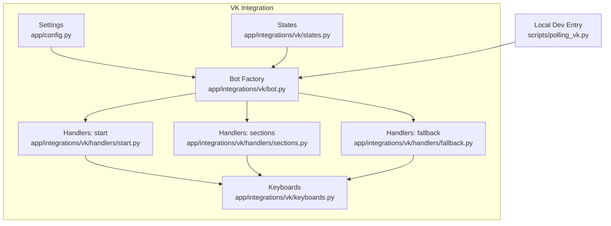
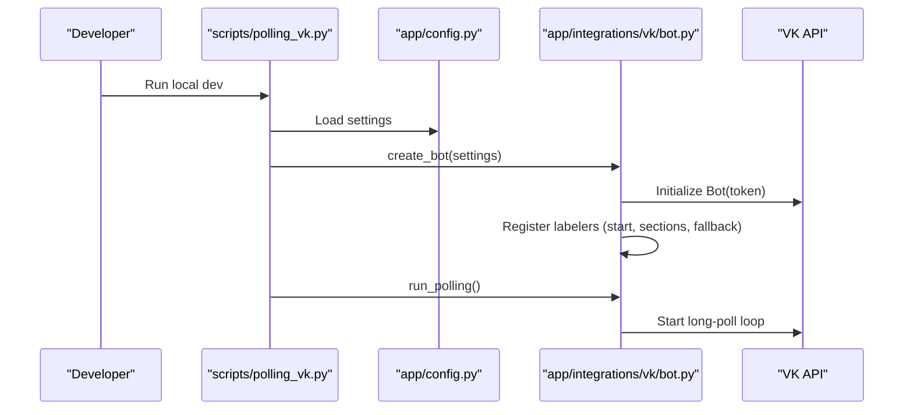
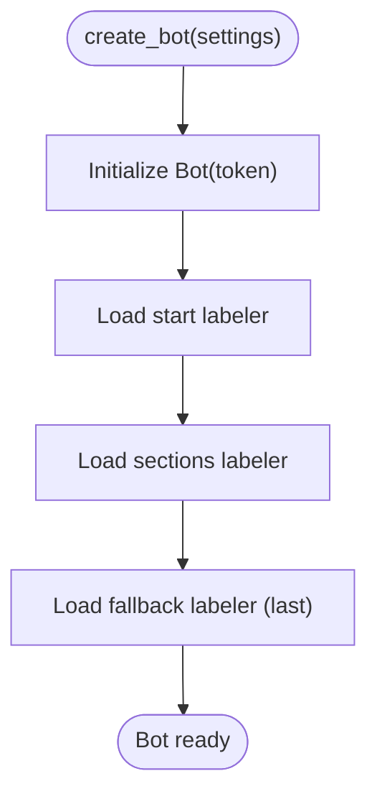
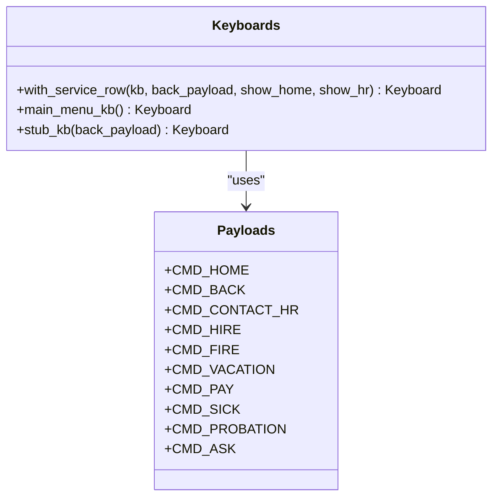
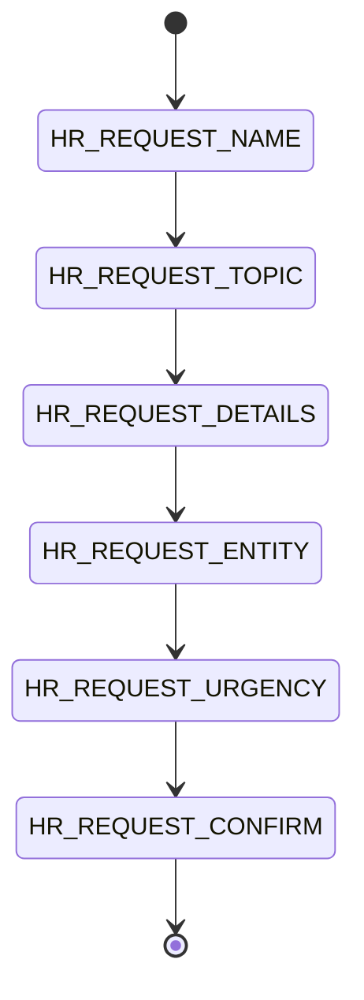
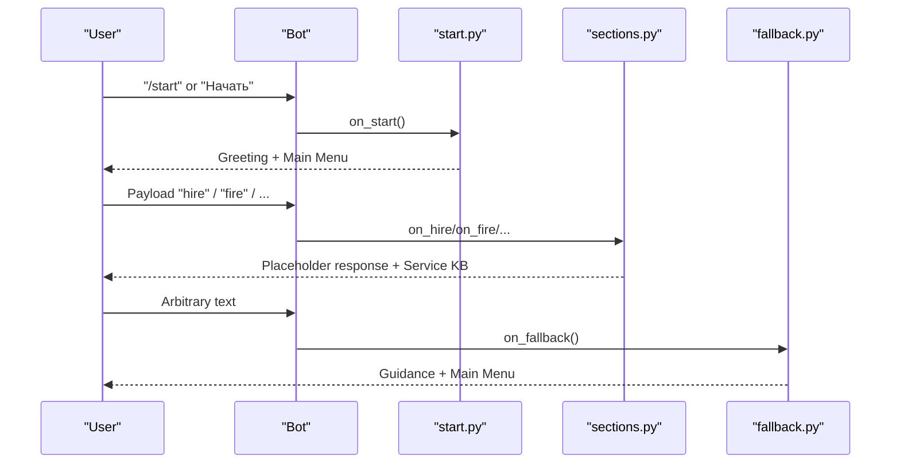
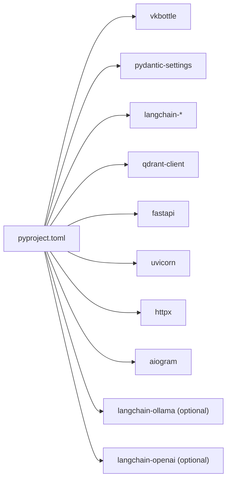

# Troubleshooting and FAQ

<cite>
**Referenced Files in This Document**
- [app/config.py](file://app/config.py)
- [app/integrations/vk/bot.py](file://app/integrations/vk/bot.py)
- [app/integrations/vk/keyboards.py](file://app/integrations/vk/keyboards.py)
- [app/integrations/vk/states.py](file://app/integrations/vk/states.py)
- [app/integrations/vk/handlers/start.py](file://app/integrations/vk/handlers/start.py)
- [app/integrations/vk/handlers/sections.py](file://app/integrations/vk/handlers/sections.py)
- [app/integrations/vk/handlers/fallback.py](file://app/integrations/vk/handlers/fallback.py)
- [scripts/polling_vk.py](file://scripts/polling_vk.py)
- [docker-compose.yml](file://docker-compose.yml)
- [pyproject.toml](file://pyproject.toml)
- [tests/test_config.py](file://tests/test_config.py)
- [tests/test_keyboards.py](file://tests/test_keyboards.py)
- [tests/test_states.py](file://tests/test_states.py)
- [tests/test_bot_factory.py](file://tests/test_bot_factory.py)
</cite>

## Table of Contents
1. [Introduction](#introduction)
2. [Project Structure](#project-structure)
3. [Core Components](#core-components)
4. [Architecture Overview](#architecture-overview)
5. [Detailed Component Analysis](#detailed-component-analysis)
6. [Dependency Analysis](#dependency-analysis)
7. [Performance Considerations](#performance-considerations)
8. [Troubleshooting Guide](#troubleshooting-guide)
9. [Security Considerations](#security-considerations)
10. [Migration and Extension Guide](#migration-and-extension-guide)
11. [Conclusion](#conclusion)

## Introduction
This document provides a comprehensive troubleshooting and FAQ guide for cafetera_hr_bot. It focuses on diagnosing and resolving common issues during development and deployment, debugging techniques for VK integration, state management, keyboard rendering, and configuration validation. It also includes performance optimization strategies, security best practices, and practical guidance for migrating between versions or extending functionality.

## Project Structure
The project is organized around a modular VK bot implementation with clear separation of concerns:
- Configuration and environment loading
- VK bot factory and handler wiring
- Keyboard builders and payload constants
- State machine for multi-step dialogs
- Handler modules for start, sections, and fallback
- Local development entrypoint for VK long poll mode
- Docker Compose services for supporting infrastructure (Qdrant, MinIO)
- Pydantic-based settings with environment variable support
- Tests validating configuration, keyboards, states, and bot wiring

**Diagram sources**
- [app/config.py:1-9](file://app/config.py#L1-L9)
- [app/integrations/vk/bot.py:23-32](file://app/integrations/vk/bot.py#L23-L32)
- [app/integrations/vk/keyboards.py:1-108](file://app/integrations/vk/keyboards.py#L1-L108)
- [app/integrations/vk/states.py:1-14](file://app/integrations/vk/states.py#L1-L14)
- [app/integrations/vk/handlers/start.py:1-55](file://app/integrations/vk/handlers/start.py#L1-L55)
- [app/integrations/vk/handlers/sections.py:1-82](file://app/integrations/vk/handlers/sections.py#L1-L82)
- [app/integrations/vk/handlers/fallback.py:1-18](file://app/integrations/vk/handlers/fallback.py#L1-L18)
- [scripts/polling_vk.py:24-33](file://scripts/polling_vk.py#L24-L33)

**Section sources**
- [app/config.py:1-9](file://app/config.py#L1-L9)
- [app/integrations/vk/bot.py:23-32](file://app/integrations/vk/bot.py#L23-L32)
- [app/integrations/vk/keyboards.py:1-108](file://app/integrations/vk/keyboards.py#L1-L108)
- [app/integrations/vk/states.py:1-14](file://app/integrations/vk/states.py#L1-L14)
- [app/integrations/vk/handlers/start.py:1-55](file://app/integrations/vk/handlers/start.py#L1-L55)
- [app/integrations/vk/handlers/sections.py:1-82](file://app/integrations/vk/handlers/sections.py#L1-L82)
- [app/integrations/vk/handlers/fallback.py:1-18](file://app/integrations/vk/handlers/fallback.py#L1-L18)
- [scripts/polling_vk.py:1-33](file://scripts/polling_vk.py#L1-L33)
- [docker-compose.yml:1-34](file://docker-compose.yml#L1-L34)
- [pyproject.toml:1-56](file://pyproject.toml#L1-L56)

## Core Components
- Settings: Loads VK credentials and group ID from environment with pydantic-settings.
- Bot Factory: Creates a vkbottle Bot instance and registers labelers in the correct order.
- Handlers: Define message routes for start, sections, and fallback behavior.
- Keyboards: Build structured keyboards with standardized service buttons and payload constants.
- States: Multi-step dialog states for HR request workflows.
- Local Dev Entry: Starts the VK bot in long-poll mode for local testing.

**Section sources**
- [app/config.py:4-9](file://app/config.py#L4-L9)
- [app/integrations/vk/bot.py:23-32](file://app/integrations/vk/bot.py#L23-L32)
- [app/integrations/vk/handlers/start.py:31-55](file://app/integrations/vk/handlers/start.py#L31-L55)
- [app/integrations/vk/handlers/sections.py:28-82](file://app/integrations/vk/handlers/sections.py#L28-L82)
- [app/integrations/vk/handlers/fallback.py:15-18](file://app/integrations/vk/handlers/fallback.py#L15-L18)
- [app/integrations/vk/keyboards.py:29-108](file://app/integrations/vk/keyboards.py#L29-L108)
- [app/integrations/vk/states.py:4-14](file://app/integrations/vk/states.py#L4-L14)
- [scripts/polling_vk.py:24-33](file://scripts/polling_vk.py#L24-L33)

## Architecture Overview
The VK bot follows a layered architecture:
- Configuration layer loads environment variables.
- Factory layer constructs the bot and wires labelers.
- Handler layer defines message routing.
- UI layer builds keyboards and payloads.
- State layer manages multi-step flows.
- Local dev entrypoint runs the bot in long-poll mode.

**Diagram sources**
- [scripts/polling_vk.py:24-33](file://scripts/polling_vk.py#L24-L33)
- [app/config.py:4-9](file://app/config.py#L4-L9)
- [app/integrations/vk/bot.py:23-32](file://app/integrations/vk/bot.py#L23-L32)

## Detailed Component Analysis

### VK Bot Factory and Handler Wiring
- The factory creates a Bot with the configured token and registers labelers in a strict order to ensure proper routing.
- The fallback labeler must be last to avoid intercepting messages intended for earlier handlers.

**Diagram sources**
- [app/integrations/vk/bot.py:23-32](file://app/integrations/vk/bot.py#L23-L32)

**Section sources**
- [app/integrations/vk/bot.py:14-20](file://app/integrations/vk/bot.py#L14-L20)
- [app/integrations/vk/bot.py:23-32](file://app/integrations/vk/bot.py#L23-L32)
- [tests/test_bot_factory.py:8-21](file://tests/test_bot_factory.py#L8-L21)

### Keyboard Builders and Payload Constants
- Standardized service row with Back/Home/Contact HR buttons.
- Main menu keyboard with seven sections plus a dedicated Contact HR button.
- Payload constants ensure consistent routing across handlers.

**Diagram sources**
- [app/integrations/vk/keyboards.py:29-108](file://app/integrations/vk/keyboards.py#L29-L108)

**Section sources**
- [app/integrations/vk/keyboards.py:13-24](file://app/integrations/vk/keyboards.py#L13-L24)
- [app/integrations/vk/keyboards.py:56-98](file://app/integrations/vk/keyboards.py#L56-L98)
- [tests/test_keyboards.py:49-92](file://tests/test_keyboards.py#L49-L92)
- [tests/test_keyboards.py:176-192](file://tests/test_keyboards.py#L176-L192)

### State Management for Multi-Step Dialogs
- States define a six-step HR request dialog flow.
- Tests validate uniqueness and presence of expected state names/values.

**Diagram sources**
- [app/integrations/vk/states.py:4-14](file://app/integrations/vk/states.py#L4-L14)

**Section sources**
- [app/integrations/vk/states.py:4-14](file://app/integrations/vk/states.py#L4-L14)
- [tests/test_states.py:8-31](file://tests/test_states.py#L8-L31)

### Handler Modules
- Start handler responds to initial commands and navigations.
- Sections handler provides placeholders for future functionality.
- Fallback handler ensures users stay on-path with menu guidance.

**Diagram sources**
- [app/integrations/vk/handlers/start.py:31-55](file://app/integrations/vk/handlers/start.py#L31-L55)
- [app/integrations/vk/handlers/sections.py:28-82](file://app/integrations/vk/handlers/sections.py#L28-L82)
- [app/integrations/vk/handlers/fallback.py:15-18](file://app/integrations/vk/handlers/fallback.py#L15-L18)

**Section sources**
- [app/integrations/vk/handlers/start.py:14-55](file://app/integrations/vk/handlers/start.py#L14-L55)
- [app/integrations/vk/handlers/sections.py:20-82](file://app/integrations/vk/handlers/sections.py#L20-L82)
- [app/integrations/vk/handlers/fallback.py:9-18](file://app/integrations/vk/handlers/fallback.py#L9-L18)

## Dependency Analysis
External dependencies include VK integration, configuration, and optional RAG-related packages. The VK bot relies on vkbottle for message routing and keyboard building.

**Diagram sources**
- [pyproject.toml:7-31](file://pyproject.toml#L7-L31)

**Section sources**
- [pyproject.toml:1-56](file://pyproject.toml#L1-L56)

## Performance Considerations
- Keep handler logic lightweight; offload heavy work to background tasks or external services.
- Reuse keyboard builders to minimize JSON serialization overhead.
- Avoid unnecessary state transitions; validate payloads early to prevent redundant steps.
- Monitor VK API rate limits and implement backoff strategies if integrating with external APIs.
- Use long-poll mode for local development; prefer webhook mode in production for lower latency.

[No sources needed since this section provides general guidance]

## Troubleshooting Guide

### VK Integration Issues
Symptoms:
- Bot does not respond to messages.
- Messages routed to fallback unexpectedly.
- Token-related authentication errors.

Root causes and resolutions:
- Incorrect or missing VK access token in environment variables. Verify the token is set and loaded by Settings.
  - Check: [app/config.py:7-8](file://app/config.py#L7-L8)
  - Validate: [tests/test_config.py:16-28](file://tests/test_config.py#L16-L28)
- Handler order incorrect. The fallback labeler must be last; otherwise, it intercepts all messages.
  - Check order: [app/integrations/vk/bot.py:16-20](file://app/integrations/vk/bot.py#L16-L20)
  - Validate wiring: [tests/test_bot_factory.py:30-38](file://tests/test_bot_factory.py#L30-L38)
- Long-poll mode not started or blocked by network/firewall.
  - Confirm entrypoint: [scripts/polling_vk.py:24-33](file://scripts/polling_vk.py#L24-L33)

Debugging steps:
- Enable INFO logs and reproduce the issue locally.
  - Logging setup: [scripts/polling_vk.py:17-21](file://scripts/polling_vk.py#L17-L21)
- Inspect handler registration count and token forwarding.
  - Validation: [tests/test_bot_factory.py:30-45](file://tests/test_bot_factory.py#L30-L45)

**Section sources**
- [app/config.py:7-8](file://app/config.py#L7-L8)
- [tests/test_config.py:16-28](file://tests/test_config.py#L16-L28)
- [app/integrations/vk/bot.py:16-20](file://app/integrations/vk/bot.py#L16-L20)
- [tests/test_bot_factory.py:30-45](file://tests/test_bot_factory.py#L30-L45)
- [scripts/polling_vk.py:17-21](file://scripts/polling_vk.py#L17-L21)
- [scripts/polling_vk.py:24-33](file://scripts/polling_vk.py#L24-L33)

### State Management Problems
Symptoms:
- Users stuck in a state or unable to navigate back.
- Duplicate or conflicting state values.

Root causes and resolutions:
- Missing or duplicated state values in the state group.
  - Validate states: [tests/test_states.py:12-31](file://tests/test_states.py#L12-L31)
- Improper state transitions in handlers (not shown in current files; ensure transitions align with expected flow).

Debugging steps:
- Confirm state names and values match expectations.
  - Reference: [app/integrations/vk/states.py:4-14](file://app/integrations/vk/states.py#L4-L14)

**Section sources**
- [tests/test_states.py:12-31](file://tests/test_states.py#L12-L31)
- [app/integrations/vk/states.py:4-14](file://app/integrations/vk/states.py#L4-L14)

### Keyboard Rendering Errors
Symptoms:
- Buttons missing or mislabeled.
- Service buttons (Back/Home/Contact HR) not appearing.
- Keyboard not displayed as expected.

Root causes and resolutions:
- Payload mismatch or missing payload keys.
  - Validate payloads: [tests/test_keyboards.py:176-192](file://tests/test_keyboards.py#L176-L192)
- Incorrect keyboard configuration (inline/one_time flags).
  - Validate flags: [tests/test_keyboards.py:80-84](file://tests/test_keyboards.py#L80-L84)
- Service row not appended to keyboards.
  - Use with_service_row consistently: [app/integrations/vk/keyboards.py:29-50](file://app/integrations/vk/keyboards.py#L29-L50)

Debugging steps:
- Parse keyboard JSON and assert button counts and labels.
  - Example assertions: [tests/test_keyboards.py:49-92](file://tests/test_keyboards.py#L49-L92)
- Ensure Contact HR button is in the last row and colored appropriately.
  - Validation: [tests/test_keyboards.py:69-79](file://tests/test_keyboards.py#L69-L79)

**Section sources**
- [tests/test_keyboards.py:49-92](file://tests/test_keyboards.py#L49-L92)
- [tests/test_keyboards.py:69-79](file://tests/test_keyboards.py#L69-L79)
- [tests/test_keyboards.py:176-192](file://tests/test_keyboards.py#L176-L192)
- [app/integrations/vk/keyboards.py:29-50](file://app/integrations/vk/keyboards.py#L29-L50)

### Configuration Validation Failures
Symptoms:
- Empty VK access token or zero group ID.
- Environment variables not applied.

Root causes and resolutions:
- Missing or empty environment variables.
  - Defaults: [app/config.py:7-8](file://app/config.py#L7-L8)
- Environment overrides not taking effect.
  - Behavior verified: [tests/test_config.py:16-28](file://tests/test_config.py#L16-L28)

Debugging steps:
- Print loaded settings during startup.
  - Local entrypoint: [scripts/polling_vk.py:25-28](file://scripts/polling_vk.py#L25-L28)
- Use pytest with monkeypatch to simulate environment variables.
  - Example usage: [tests/test_config.py:16-28](file://tests/test_config.py#L16-L28)

**Section sources**
- [app/config.py:7-8](file://app/config.py#L7-L8)
- [tests/test_config.py:16-28](file://tests/test_config.py#L16-L28)
- [scripts/polling_vk.py:25-28](file://scripts/polling_vk.py#L25-L28)

### Local Development and Deployment
Symptoms:
- Local dev server fails to start.
- VK long-poll mode not responding.

Root causes and resolutions:
- Missing environment variables for VK credentials.
  - Load via Settings: [app/config.py:4-9](file://app/config.py#L4-L9)
- Incorrect Python path or module import issues.
  - Path fix: [scripts/polling_vk.py:11-12](file://scripts/polling_vk.py#L11-L12)
- Container dependencies not running (Qdrant/MinIO).
  - Services: [docker-compose.yml:1-34](file://docker-compose.yml#L1-L34)

Debugging steps:
- Run the local entrypoint and confirm INFO logs.
  - Entry: [scripts/polling_vk.py:24-33](file://scripts/polling_vk.py#L24-L33)
- Verify containers health and ports.
  - Healthcheck: [docker-compose.yml:11-16](file://docker-compose.yml#L11-L16)

**Section sources**
- [app/config.py:4-9](file://app/config.py#L4-L9)
- [scripts/polling_vk.py:11-12](file://scripts/polling_vk.py#L11-L12)
- [scripts/polling_vk.py:24-33](file://scripts/polling_vk.py#L24-L33)
- [docker-compose.yml:11-16](file://docker-compose.yml#L11-L16)

## Security Considerations
- Secrets management: Store VK access tokens and other secrets in environment variables, not in code.
  - Reference: [app/config.py:7-8](file://app/config.py#L7-L8)
- Least privilege: Use the minimal required permissions for the VK bot token.
- Input validation: Validate and sanitize user inputs before processing.
- Logging: Avoid logging sensitive data; keep logs at appropriate verbosity levels.
  - Logging setup: [scripts/polling_vk.py:17-21](file://scripts/polling_vk.py#L17-L21)
- Dependency hygiene: Pin versions and audit dependencies regularly.
  - Dependencies: [pyproject.toml:7-31](file://pyproject.toml#L7-L31)

**Section sources**
- [app/config.py:7-8](file://app/config.py#L7-L8)
- [scripts/polling_vk.py:17-21](file://scripts/polling_vk.py#L17-L21)
- [pyproject.toml:7-31](file://pyproject.toml#L7-L31)

## Migration and Extension Guide

### Migrating Between Versions
- Review breaking changes in VK integration libraries and update handler signatures accordingly.
- Validate handler order and labeler registration after upgrades.
  - Order: [app/integrations/vk/bot.py:16-20](file://app/integrations/vk/bot.py#L16-L20)
- Re-run tests to catch regressions.
  - Tests: [tests/test_bot_factory.py:30-38](file://tests/test_bot_factory.py#L30-L38), [tests/test_keyboards.py:49-92](file://tests/test_keyboards.py#L49-L92), [tests/test_states.py:12-31](file://tests/test_states.py#L12-L31)

### Extending Functionality
- Add new handlers by creating new labelers and registering them in the factory in the correct order.
  - Registration pattern: [app/integrations/vk/bot.py:27-28](file://app/integrations/vk/bot.py#L27-L28)
- Introduce new keyboard layouts using existing builders and payload constants.
  - Builders: [app/integrations/vk/keyboards.py:29-108](file://app/integrations/vk/keyboards.py#L29-L108)
- Extend state machine for new multi-step flows.
  - States: [app/integrations/vk/states.py:4-14](file://app/integrations/vk/states.py#L4-L14)
- Integrate optional providers (Ollama/OpenAI-compatible) via extras.
  - Extras: [pyproject.toml:24-31](file://pyproject.toml#L24-L31)

**Section sources**
- [app/integrations/vk/bot.py:16-20](file://app/integrations/vk/bot.py#L16-L20)
- [app/integrations/vk/bot.py:27-28](file://app/integrations/vk/bot.py#L27-L28)
- [app/integrations/vk/keyboards.py:29-108](file://app/integrations/vk/keyboards.py#L29-L108)
- [app/integrations/vk/states.py:4-14](file://app/integrations/vk/states.py#L4-L14)
- [pyproject.toml:24-31](file://pyproject.toml#L24-L31)

## Conclusion
This guide consolidates actionable troubleshooting steps, debugging techniques, and best practices for cafetera_hr_bot. By validating configuration, ensuring correct handler ordering, maintaining keyboard and state integrity, and following security and performance recommendations, teams can reliably develop and deploy the VK bot. Use the provided references to quickly locate relevant code and tests for diagnosis and verification.