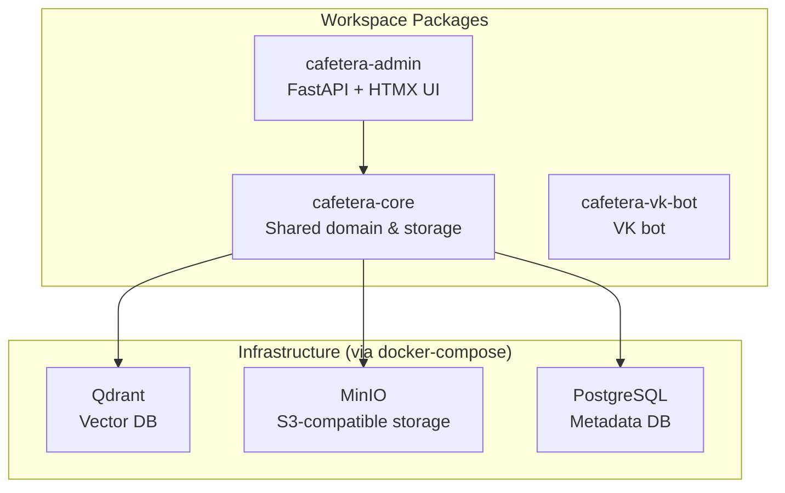
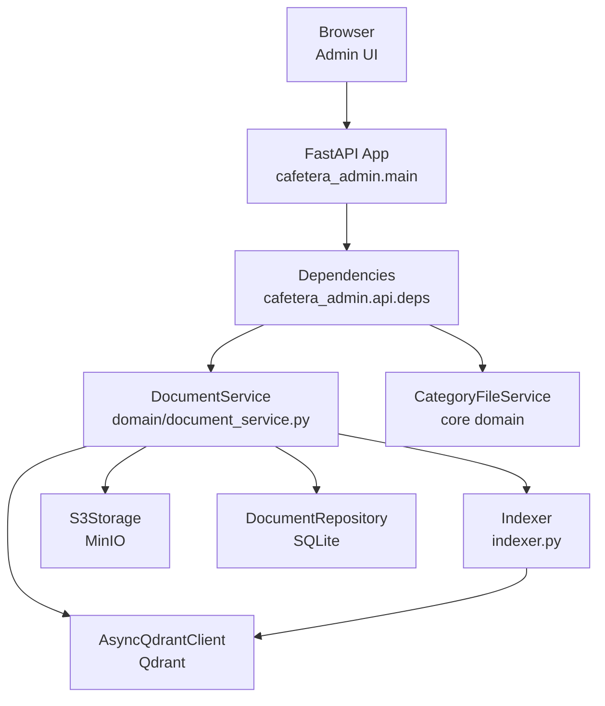
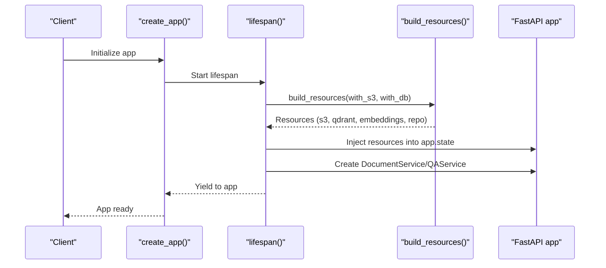
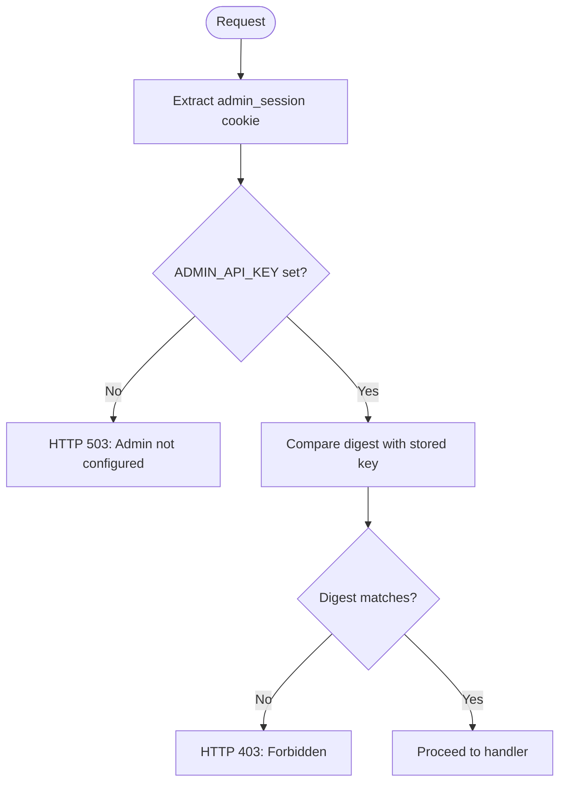
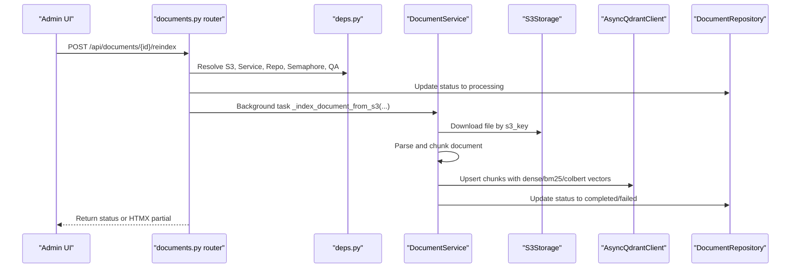
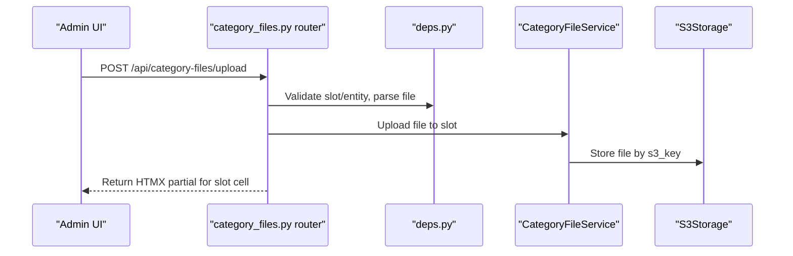
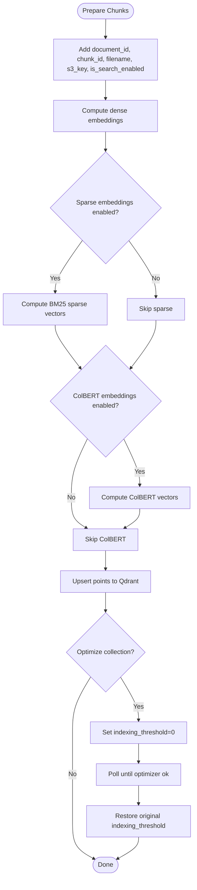
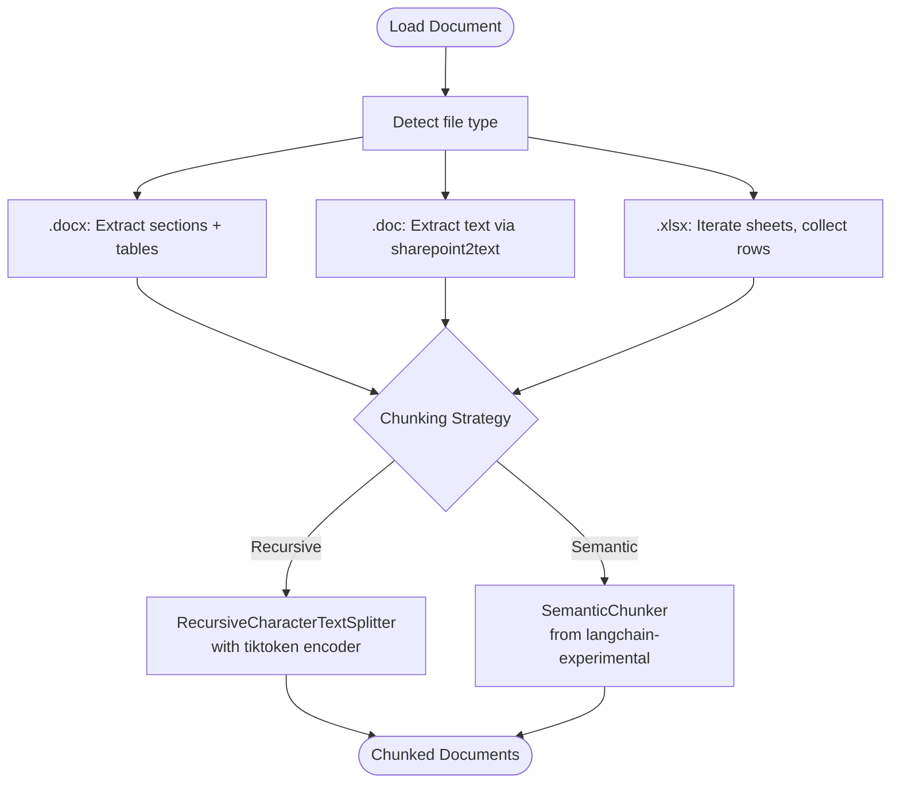
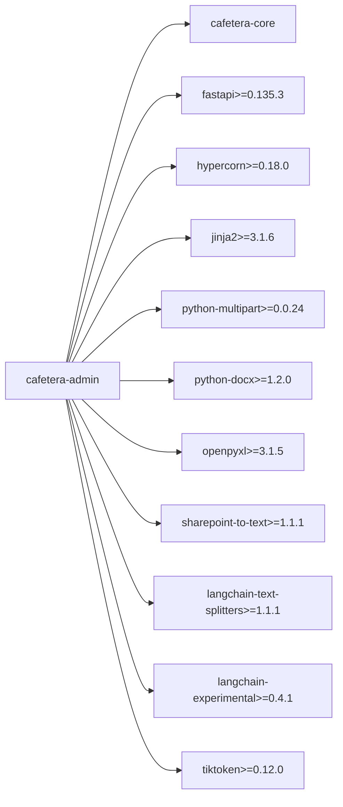

# Admin Package Integration

<cite>
**Referenced Files in This Document**
- [README.md](file://README.md)
- [Dockerfile.admin](file://Dockerfile.admin)
- [docker-compose.yml](file://docker-compose.yml)
- [pyproject.toml](file://pyproject.toml)
- [packages/admin/pyproject.toml](file://packages/admin/pyproject.toml)
- [packages/admin/src/cafetera_admin/main.py](file://packages/admin/src/cafetera_admin/main.py)
- [packages/admin/src/cafetera_admin/server.py](file://packages/admin/src/cafetera_admin/server.py)
- [packages/admin/src/cafetera_admin/config.py](file://packages/admin/src/cafetera_admin/config.py)
- [packages/admin/src/cafetera_admin/indexer.py](file://packages/admin/src/cafetera_admin/indexer.py)
- [packages/admin/src/cafetera_admin/domain/document_service.py](file://packages/admin/src/cafetera_admin/domain/document_service.py)
- [packages/admin/src/cafetera_admin/api/documents.py](file://packages/admin/src/cafetera_admin/api/documents.py)
- [packages/admin/src/cafetera_admin/api/category_files.py](file://packages/admin/src/cafetera_admin/api/category_files.py)
- [packages/admin/src/cafetera_admin/api/deps.py](file://packages/admin/src/cafetera_admin/api/deps.py)
- [packages/admin/src/cafetera_admin/parser.py](file://packages/admin/src/cafetera_admin/parser.py)
</cite>

## Update Summary
**Changes Made**
- Updated dependency analysis section to reflect new langchain-text-splitters, langchain-experimental, and tiktoken dependencies
- Enhanced document parsing and chunking section to explain the new semantic chunking capabilities
- Updated architecture diagrams to show the enhanced text processing pipeline

## Table of Contents
1. [Introduction](#introduction)
2. [Project Structure](#project-structure)
3. [Core Components](#core-components)
4. [Architecture Overview](#architecture-overview)
5. [Detailed Component Analysis](#detailed-component-analysis)
6. [Enhanced Text Processing Capabilities](#enhanced-text-processing-capabilities)
7. [Dependency Analysis](#dependency-analysis)
8. [Performance Considerations](#performance-considerations)
9. [Troubleshooting Guide](#troubleshooting-guide)
10. [Conclusion](#conclusion)

## Introduction
This document explains how the Admin Package integrates with the broader Cafetera HR Bot ecosystem. It covers the FastAPI-based admin web UI, its routing, authentication, document lifecycle management, vector indexing, and integration with shared infrastructure (Qdrant, MinIO, PostgreSQL) through the core package. It also describes the Dockerized deployment and local development workflow.

## Project Structure
The project is organized as a uv workspace with three packages:
- cafetera-core: Shared domain logic, storage, RAG components, and services
- cafetera-admin: Admin web UI (FastAPI + HTMX) with document management and category file administration
- cafetera-vk-bot: VK bot implementation

The admin package exposes both HTML pages and JSON APIs, with HTMX partials for dynamic UI updates. It relies on the core package for shared services and models.

**Diagram sources**
- [pyproject.toml:22-28](file://pyproject.toml#L22-L28)
- [docker-compose.yml:56-84](file://docker-compose.yml#L56-L84)

**Section sources**
- [README.md:262-273](file://README.md#L262-L273)
- [pyproject.toml:22-28](file://pyproject.toml#L22-L28)

## Core Components
- Application factory and lifespan: Creates and configures the FastAPI app, mounts static assets and templates, and manages resource lifecycle (Qdrant, S3, embeddings, repositories).
- Settings: Extends core settings with admin-specific fields (e.g., API key).
- Domain service: Orchestrates document lifecycle across metadata, vector store, and file storage.
- Indexer: Handles chunk preparation, embedding computation, upsert to Qdrant, deletion, toggling search visibility, and collection optimization.
- API routers: Provide HTML pages, JSON endpoints, and HTMX partials for document management and category file administration.
- Authentication: Session cookie validation against the admin API key.
- Parser: Loads and chunks .docx, .doc, and .xlsx files for indexing with enhanced semantic chunking capabilities.

**Section sources**
- [packages/admin/src/cafetera_admin/main.py:85-114](file://packages/admin/src/cafetera_admin/main.py#L85-L114)
- [packages/admin/src/cafetera_admin/config.py:6-20](file://packages/admin/src/cafetera_admin/config.py#L6-L20)
- [packages/admin/src/cafetera_admin/domain/document_service.py:38-374](file://packages/admin/src/cafetera_admin/domain/document_service.py#L38-L374)
- [packages/admin/src/cafetera_admin/indexer.py:25-251](file://packages/admin/src/cafetera_admin/indexer.py#L25-L251)
- [packages/admin/src/cafetera_admin/api/documents.py:1-539](file://packages/admin/src/cafetera_admin/api/documents.py#L1-L539)
- [packages/admin/src/cafetera_admin/api/category_files.py:1-347](file://packages/admin/src/cafetera_admin/api/category_files.py#L1-L347)
- [packages/admin/src/cafetera_admin/api/deps.py:77-121](file://packages/admin/src/cafetera_admin/api/deps.py#L77-L121)
- [packages/admin/src/cafetera_admin/parser.py:585-649](file://packages/admin/src/cafetera_admin/parser.py#L585-L649)

## Architecture Overview
The admin package runs as a FastAPI application with Hypercorn in production and supports local development. It authenticates requests via a session cookie validated against the admin API key. The app state holds shared resources built by the core package, including S3 storage, Qdrant client, embeddings, document repository, and QA service.

**Diagram sources**
- [packages/admin/src/cafetera_admin/main.py:40-83](file://packages/admin/src/cafetera_admin/main.py#L40-L83)
- [packages/admin/src/cafetera_admin/api/deps.py:48-109](file://packages/admin/src/cafetera_admin/api/deps.py#L48-L109)
- [packages/admin/src/cafetera_admin/domain/document_service.py:38-60](file://packages/admin/src/cafetera_admin/domain/document_service.py#L38-L60)
- [packages/admin/src/cafetera_admin/indexer.py:51-134](file://packages/admin/src/cafetera_admin/indexer.py#L51-L134)

## Detailed Component Analysis

### Application Factory and Lifespan
The application factory creates a FastAPI app, resolves repository root for static and template paths, mounts static assets and templates, and registers routers. The lifespan builds shared resources from the core package and injects them into app state. It also constructs the DocumentService and QAService when dependencies are available, and initializes a concurrency semaphore for indexing.

**Diagram sources**
- [packages/admin/src/cafetera_admin/main.py:85-114](file://packages/admin/src/cafetera_admin/main.py#L85-L114)
- [packages/admin/src/cafetera_admin/main.py:40-83](file://packages/admin/src/cafetera_admin/main.py#L40-L83)

**Section sources**
- [packages/admin/src/cafetera_admin/main.py:85-114](file://packages/admin/src/cafetera_admin/main.py#L85-L114)
- [packages/admin/src/cafetera_admin/main.py:40-83](file://packages/admin/src/cafetera_admin/main.py#L40-L83)

### Authentication and Dependencies
Authentication is enforced via a cookie validator that compares the incoming session cookie to the admin API key from settings. The dependency injection layer provides typed accessors for settings, templates, repositories, S3 storage, DocumentService, QAService, and a concurrency semaphore for indexing.

**Diagram sources**
- [packages/admin/src/cafetera_admin/api/deps.py:77-89](file://packages/admin/src/cafetera_admin/api/deps.py#L77-L89)

**Section sources**
- [packages/admin/src/cafetera_admin/api/deps.py:77-121](file://packages/admin/src/cafetera_admin/api/deps.py#L77-L121)

### Document Management API
The documents router provides:
- HTML pages: login, logout, main documents table, and HTMX partials
- JSON API: list documents with filtering and pagination, get document details, update title, toggle search participation, reindex, delete, and download
- Background indexing via a semaphore to limit concurrent operations

**Diagram sources**
- [packages/admin/src/cafetera_admin/api/documents.py:390-473](file://packages/admin/src/cafetera_admin/api/documents.py#L390-L473)
- [packages/admin/src/cafetera_admin/domain/document_service.py:109-171](file://packages/admin/src/cafetera_admin/domain/document_service.py#L109-L171)
- [packages/admin/src/cafetera_admin/indexer.py:51-134](file://packages/admin/src/cafetera_admin/indexer.py#L51-L134)

**Section sources**
- [packages/admin/src/cafetera_admin/api/documents.py:1-539](file://packages/admin/src/cafetera_admin/api/documents.py#L1-L539)
- [packages/admin/src/cafetera_admin/domain/document_service.py:109-171](file://packages/admin/src/cafetera_admin/domain/document_service.py#L109-L171)

### Category Files Administration
The category files router supports:
- Listing category slots and legal entities
- Uploading Word documents to specific category/subcategory/entity slots
- Downloading and deleting files
- Rendering HTMX partials for individual slot cells

**Diagram sources**
- [packages/admin/src/cafetera_admin/api/category_files.py:174-248](file://packages/admin/src/cafetera_admin/api/category_files.py#L174-L248)

**Section sources**
- [packages/admin/src/cafetera_admin/api/category_files.py:1-347](file://packages/admin/src/cafetera_admin/api/category_files.py#L1-L347)

### Vector Indexing Pipeline
The indexer prepares chunks with enriched metadata, computes dense, sparse (BM25), and optional ColBERT vectors, and upserts them into Qdrant. It also supports deleting chunks for a document, toggling search participation, and optimizing the collection to improve performance.

**Diagram sources**
- [packages/admin/src/cafetera_admin/indexer.py:25-251](file://packages/admin/src/cafetera_admin/indexer.py#L25-L251)

**Section sources**
- [packages/admin/src/cafetera_admin/indexer.py:25-251](file://packages/admin/src/cafetera_admin/indexer.py#L25-L251)

## Enhanced Text Processing Capabilities

### Advanced Document Parsing and Chunking
The parser now provides enhanced text processing capabilities through three distinct chunking strategies:

#### Recursive Character Text Splitting
Uses `RecursiveCharacterTextSplitter.from_tiktoken_encoder()` with `tiktoken>=0.12.0` for token-aware splitting based on the `cl100k_base` encoding. This ensures chunks align with token boundaries for optimal embedding efficiency.

#### Semantic Chunking
Powered by `langchain-experimental>=0.4.1` and `SemanticChunker`, this approach analyzes text semantics to create meaningful chunks that preserve contextual coherence, automatically detecting natural breakpoints in the content.

#### Enhanced Text Processing Pipeline
The parser processes .docx, .doc, and .xlsx files with sophisticated handling:
- **.docx files**: Extract sections with heading preservation, table formatting, and hierarchical breadcrumb paths
- **.doc files**: Convert legacy Microsoft Word format using `sharepoint-to-text>=1.1.1`
- **.xlsx files**: Transform spreadsheets into structured markdown tables with column header preservation

**Diagram sources**
- [packages/admin/src/cafetera_admin/parser.py:585-649](file://packages/admin/src/cafetera_admin/parser.py#L585-L649)
- [packages/admin/src/cafetera_admin/parser.py:229-235](file://packages/admin/src/cafetera_admin/parser.py#L229-L235)
- [packages/admin/src/cafetera_admin/parser.py:275-281](file://packages/admin/src/cafetera_admin/parser.py#L275-L281)

**Section sources**
- [packages/admin/src/cafetera_admin/parser.py:102-420](file://packages/admin/src/cafetera_admin/parser.py#L102-L420)
- [packages/admin/src/cafetera_admin/parser.py:585-649](file://packages/admin/src/cafetera_admin/parser.py#L585-L649)

## Dependency Analysis
The admin package depends on cafetera-core for shared domain services, storage, and configuration. The enhanced workspace configuration ensures consistent dependency resolution across packages with the latest text processing capabilities.

**Updated** Added three new dependencies for enhanced text processing:
- `langchain-text-splitters>=1.1.1`: Provides `RecursiveCharacterTextSplitter.from_tiktoken_encoder()` for token-aware splitting
- `langchain-experimental>=0.4.1`: Enables `SemanticChunker` for intelligent semantic chunking
- `tiktoken>=0.12.0`: Supports tokenization with `cl100k_base` encoding for optimal embedding alignment

**Diagram sources**
- [packages/admin/pyproject.toml:6-18](file://packages/admin/pyproject.toml#L6-L18)
- [pyproject.toml:22-28](file://pyproject.toml#L22-L28)

**Section sources**
- [packages/admin/pyproject.toml:1-25](file://packages/admin/pyproject.toml#L1-L25)
- [pyproject.toml:22-28](file://pyproject.toml#L22-L28)

## Performance Considerations
- Concurrency control: A semaphore limits concurrent indexing tasks to prevent resource exhaustion.
- Collection optimization: Post-index optimization temporarily lowers the indexing threshold to merge segments, reducing storage overhead and improving query performance.
- Embedding caching: The Dockerfile pre-downloads FastEmbed models to speed up cold starts.
- HTTP/2: Production server uses Hypercorn with HTTP/2 enabled for improved throughput.
- Token-aware chunking: Enhanced text processing ensures optimal chunk sizes aligned with token boundaries for better embedding efficiency.

**Section sources**
- [packages/admin/src/cafetera_admin/main.py:78-79](file://packages/admin/src/cafetera_admin/main.py#L78-L79)
- [packages/admin/src/cafetera_admin/indexer.py:196-251](file://packages/admin/src/cafetera_admin/indexer.py#L196-L251)
- [Dockerfile.admin:44-50](file://Dockerfile.admin#L44-L50)
- [packages/admin/src/cafetera_admin/server.py:50-55](file://packages/admin/src/cafetera_admin/server.py#L50-L55)

## Troubleshooting Guide
- Admin not configured: If the admin API key is missing, authentication raises HTTP 503. Ensure the .env file contains ADMIN_API_KEY.
- Resource unavailability: If S3, Qdrant, or DocumentService is missing from app state, handlers return HTTP 503.
- Port conflicts: The admin server binds to port 8000 by default; override with ADMIN_PORT if needed.
- Docker services failing: Check health checks for Qdrant and MinIO; verify ports 6333 and 9000 are free.
- Text processing errors: Ensure `langchain-text-splitters`, `langchain-experimental`, and `tiktoken` dependencies are properly installed for semantic chunking functionality.

**Section sources**
- [packages/admin/src/cafetera_admin/api/deps.py:82-89](file://packages/admin/src/cafetera_admin/api/deps.py#L82-L89)
- [packages/admin/src/cafetera_admin/api/deps.py:62-69](file://packages/admin/src/cafetera_admin/api/deps.py#L62-L69)
- [packages/admin/src/cafetera_admin/api/deps.py:52-59](file://packages/admin/src/cafetera_admin/api/deps.py#L52-L59)
- [README.md:287-307](file://README.md#L287-L307)

## Conclusion
The Admin Package provides a cohesive FastAPI-based interface for managing documents and category files within the Cafetera HR Bot ecosystem. It leverages shared infrastructure and domain services from cafetera-core, integrates HTMX for responsive UI updates, and ensures secure access via cookie-based authentication. The enhanced text processing capabilities through `langchain-text-splitters`, `langchain-experimental`, and `tiktoken` enable sophisticated document parsing and chunking strategies, supporting both token-aware recursive splitting and intelligent semantic chunking for improved RAG performance. The Dockerized deployment and workspace configuration simplify local development and production operations.