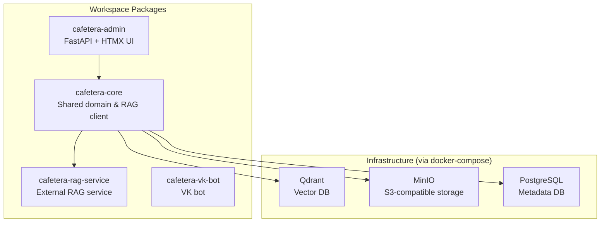
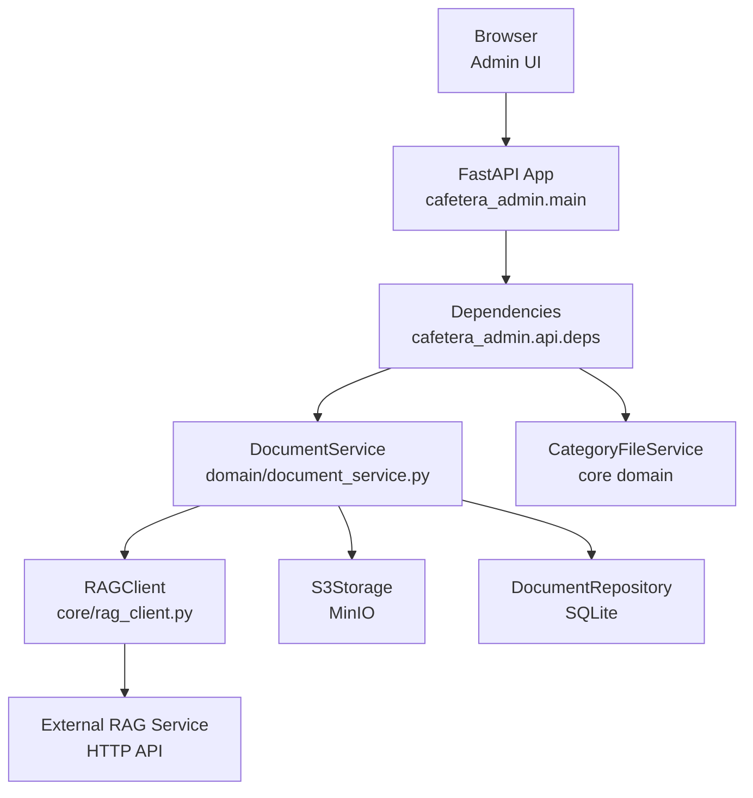
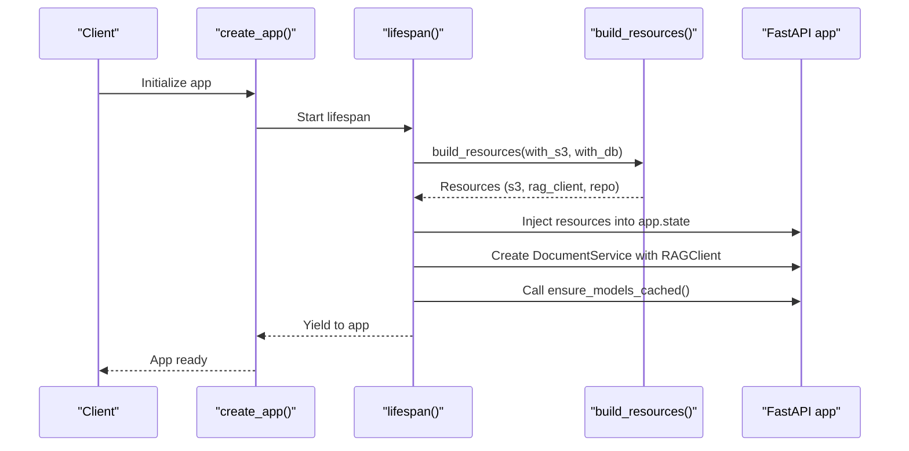
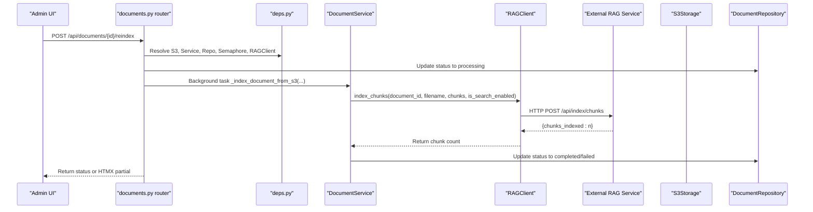
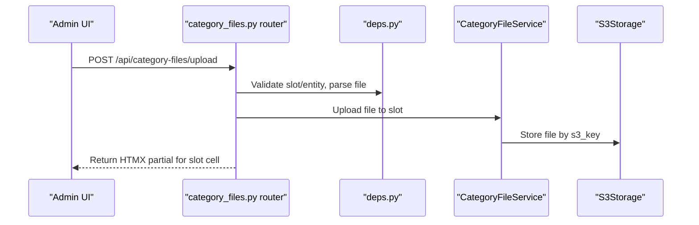
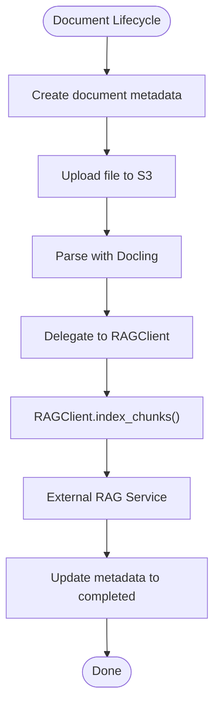
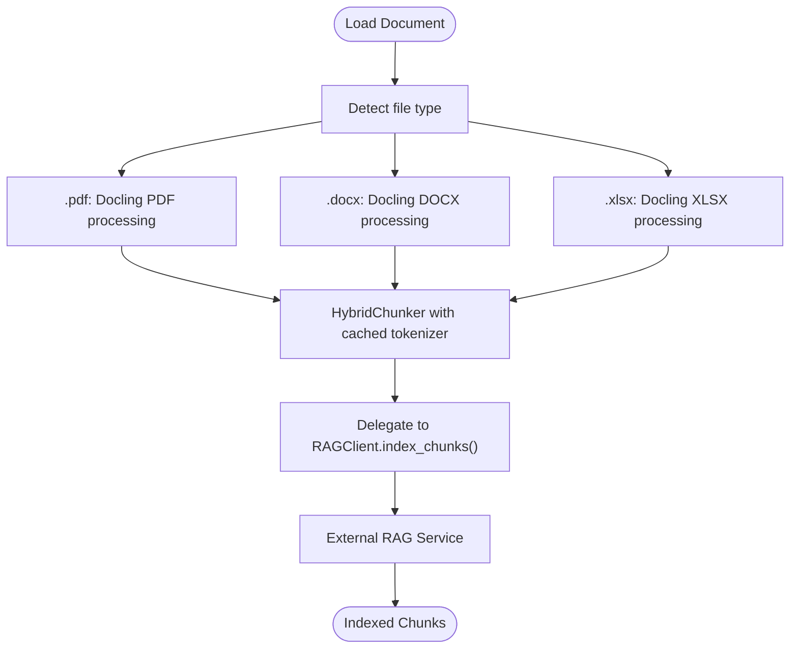
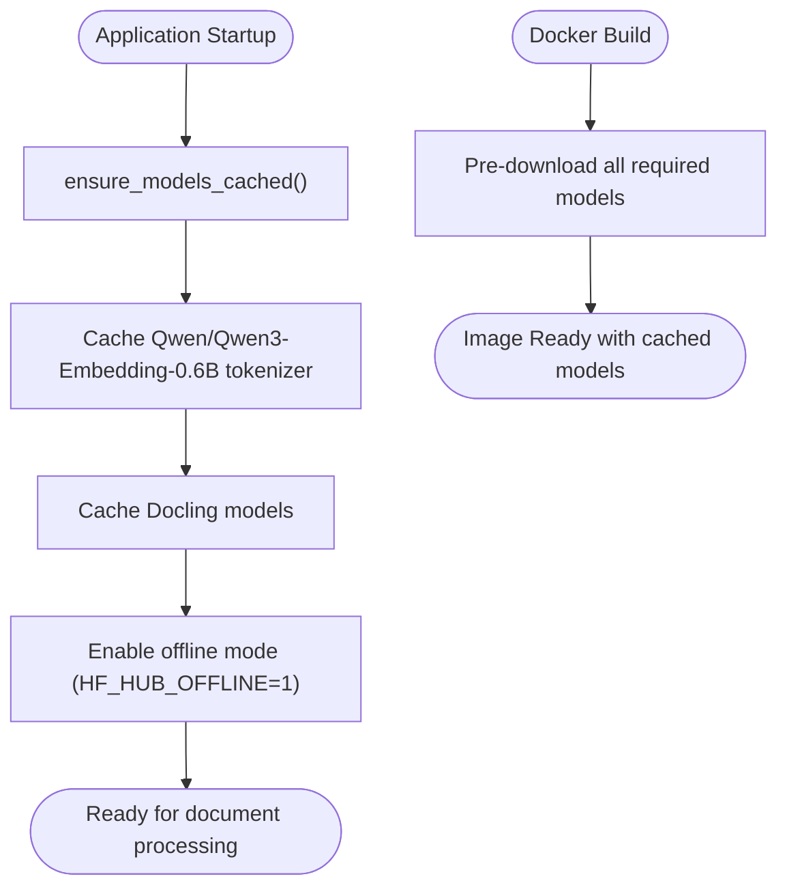
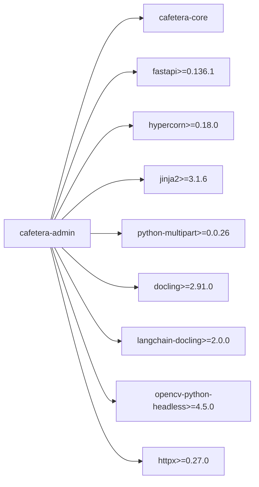

# Admin Package Integration

<cite>
**Referenced Files in This Document**
- [README.md](file://README.md)
- [Dockerfile.admin](file://Dockerfile.admin)
- [docker-compose.yml](file://docker-compose.yml)
- [pyproject.toml](file://pyproject.toml)
- [packages/admin/pyproject.toml](file://packages/admin/pyproject.toml)
- [packages/admin/src/cafetera_admin/main.py](file://packages/admin/src/cafetera_admin/main.py)
- [packages/admin/src/cafetera_admin/server.py](file://packages/admin/src/cafetera_admin/server.py)
- [packages/admin/src/cafetera_admin/config.py](file://packages/admin/src/cafetera_admin/config.py)
- [packages/admin/src/cafetera_admin/domain/document_service.py](file://packages/admin/src/cafetera_admin/domain/document_service.py)
- [packages/admin/src/cafetera_admin/api/documents.py](file://packages/admin/src/cafetera_admin/api/documents.py)
- [packages/admin/src/cafetera_admin/api/category_files.py](file://packages/admin/src/cafetera_admin/api/category_files.py)
- [packages/admin/src/cafetera_admin/api/deps.py](file://packages/admin/src/cafetera_admin/api/deps.py)
- [packages/admin/src/cafetera_admin/api/documents_upload.py](file://packages/admin/src/cafetera_admin/api/documents_upload.py)
- [packages/admin/src/cafetera_admin/parser.py](file://packages/admin/src/cafetera_admin/parser.py)
- [packages/admin/src/cafetera_admin/api/documents_helpers.py](file://packages/admin/src/cafetera_admin/api/documents_helpers.py)
- [packages/core/src/cafetera_core/rag_client.py](file://packages/core/src/cafetera_core/rag_client.py)
- [packages/core/src/cafetera_core/resources.py](file://packages/core/src/cafetera_core/resources.py)
- [packages/core/src/cafetera_core/storage/models.py](file://packages/core/src/cafetera_core/storage/models.py)
- [tests/test_parser.py](file://tests/test_parser.py)
- [packages/core/src/cafetera_core/config.py](file://packages/core/src/cafetera_core/config.py)
</cite>

## Update Summary
**Changes Made**
- Updated architecture overview to reflect delegation of RAG operations to external RAG service via RAGClient
- Removed direct Qdrant and embedding management references from admin package documentation
- Updated core components section to show RAGClient dependency instead of direct Qdrant operations
- Revised vector indexing pipeline to show external RAG service handling instead of local Qdrant operations
- Updated dependency analysis to reflect RAGClient integration instead of local embedding management
- Enhanced troubleshooting guide to address RAG service connectivity and HTTP client issues

## Table of Contents
1. [Introduction](#introduction)
2. [Project Structure](#project-structure)
3. [Core Components](#core-components)
4. [Architecture Overview](#architecture-overview)
5. [Detailed Component Analysis](#detailed-component-analysis)
6. [RAG Operations Delegation to External Service](#rag-operations-delegation-to-external-service)
7. [Current Docling-Based Document Processing](#current-docling-based-document-processing)
8. [Model Caching and Offline Processing](#model-caching-and-offline-processing)
9. [Dependency Analysis](#dependency-analysis)
10. [Performance Considerations](#performance-considerations)
11. [Troubleshooting Guide](#troubleshooting-guide)
12. [Conclusion](#conclusion)

## Introduction
This document explains how the Admin Package integrates with the broader Cafetera HR Bot ecosystem. It covers the FastAPI-based admin web UI, its routing, authentication, document lifecycle management, and delegation of RAG operations to an external RAG service via RAGClient. The admin package now acts as a thin orchestration layer that handles document uploads, parsing, and metadata management while delegating vector indexing and retrieval to the dedicated RAG service. It also describes the Dockerized deployment and local development workflow with current Docling-based document processing capabilities.

## Project Structure
The project is organized as a uv workspace with four packages:
- cafetera-core: Shared domain logic, storage, RAG client, and services
- cafetera-admin: Admin web UI (FastAPI + HTMX) with document management and category file administration
- cafetera-rag-service: Dedicated RAG service handling vector indexing, Qdrant operations, and retrieval
- cafetera-vk-bot: VK bot implementation

The admin package exposes both HTML pages and JSON APIs, with HTMX partials for dynamic UI updates. It relies on the core package for shared services and RAG client, while the actual RAG operations are handled by the external RAG service.

**Diagram sources**
- [pyproject.toml:22-28](file://pyproject.toml#L22-L28)
- [docker-compose.yml:56-84](file://docker-compose.yml#L56-L84)

**Section sources**
- [README.md:262-273](file://README.md#L262-L273)
- [pyproject.toml:22-28](file://pyproject.toml#L22-L28)

## Core Components
- Application factory and lifespan: Creates and configures the FastAPI app, mounts static assets and templates, and manages resource lifecycle (RAG client, S3, repositories).
- Settings: Extends core settings with admin-specific fields (e.g., API key).
- Domain service: Orchestrates document lifecycle across metadata and file storage, delegating RAG operations to external RAG service via RAGClient.
- API routers: Provide HTML pages, JSON endpoints, and HTMX partials for document management and category file administration.
- Authentication: Session cookie validation against the admin API key.
- Parser: Loads and chunks .pdf, .docx, and .xlsx files using Docling for advanced document processing with comprehensive model caching.

**Section sources**
- [packages/admin/src/cafetera_admin/main.py:85-114](file://packages/admin/src/cafetera_admin/main.py#L85-L114)
- [packages/admin/src/cafetera_admin/config.py:6-20](file://packages/admin/src/cafetera_admin/config.py#L6-L20)
- [packages/admin/src/cafetera_admin/domain/document_service.py:38-374](file://packages/admin/src/cafetera_admin/domain/document_service.py#L38-L374)
- [packages/admin/src/cafetera_admin/api/documents.py:1-534](file://packages/admin/src/cafetera_admin/api/documents.py#L1-L534)
- [packages/admin/src/cafetera_admin/api/category_files.py:1-347](file://packages/admin/src/cafetera_admin/api/category_files.py#L1-L347)
- [packages/admin/src/cafetera_admin/api/deps.py:77-121](file://packages/admin/src/cafetera_admin/api/deps.py#L77-L121)
- [packages/admin/src/cafetera_admin/parser.py:45-105](file://packages/admin/src/cafetera_admin/parser.py#L45-L105)

## Architecture Overview
The admin package runs as a FastAPI application with Hypercorn in production and supports local development. It authenticates requests via a session cookie validated against the admin API key. The app state holds shared resources built by the core package, including S3 storage, RAG client, document repository, and category file service. All RAG operations are delegated to the external RAG service via RAGClient, removing direct Qdrant and embedding management responsibilities from the admin package.

**Diagram sources**
- [packages/admin/src/cafetera_admin/main.py:40-83](file://packages/admin/src/cafetera_admin/main.py#L40-L83)
- [packages/admin/src/cafetera_admin/api/deps.py:48-109](file://packages/admin/src/cafetera_admin/api/deps.py#L48-L109)
- [packages/admin/src/cafetera_admin/domain/document_service.py:38-60](file://packages/admin/src/cafetera_admin/domain/document_service.py#L38-L60)
- [packages/core/src/cafetera_core/rag_client.py:15-33](file://packages/core/src/cafetera_core/rag_client.py#L15-L33)

## Detailed Component Analysis

### Application Factory and Lifespan
The application factory creates a FastAPI app, resolves repository root for static and template paths, mounts static assets and templates, and registers routers. The lifespan builds shared resources from the core package and injects them into app state. It constructs the DocumentService with RAGClient dependency and initializes a concurrency semaphore for indexing.

**Diagram sources**
- [packages/admin/src/cafetera_admin/main.py:85-114](file://packages/admin/src/cafetera_admin/main.py#L85-L114)
- [packages/admin/src/cafetera_admin/main.py:40-83](file://packages/admin/src/cafetera_admin/main.py#L40-L83)

**Section sources**
- [packages/admin/src/cafetera_admin/main.py:85-114](file://packages/admin/src/cafetera_admin/main.py#L85-L114)
- [packages/admin/src/cafetera_admin/main.py:40-83](file://packages/admin/src/cafetera_admin/main.py#L40-L83)

### Authentication and Dependencies
Authentication is enforced via a cookie validator that compares the incoming session cookie to the admin API key from settings. The dependency injection layer provides typed accessors for settings, templates, repositories, S3 storage, DocumentService, CategoryFileService, and RAGClient with a concurrency semaphore for indexing.

**Diagram sources**
- [packages/admin/src/cafetera_admin/api/deps.py:77-89](file://packages/admin/src/cafetera_admin/api/deps.py#L77-L89)

**Section sources**
- [packages/admin/src/cafetera_admin/api/deps.py:77-121](file://packages/admin/src/cafetera_admin/api/deps.py#L77-L121)

### Document Management API
The documents router provides:
- HTML pages: login, logout, main documents table, and HTMX partials
- JSON API: list documents with filtering and pagination, get document details, update title, toggle search participation, reindex, delete, and download
- Background indexing via a semaphore to limit concurrent operations

**Diagram sources**
- [packages/admin/src/cafetera_admin/api/documents.py:390-473](file://packages/admin/src/cafetera_admin/api/documents.py#L390-L473)
- [packages/admin/src/cafetera_admin/domain/document_service.py:109-171](file://packages/admin/src/cafetera_admin/domain/document_service.py#L109-L171)
- [packages/core/src/cafetera_core/rag_client.py:112-131](file://packages/core/src/cafetera_core/rag_client.py#L112-L131)

**Section sources**
- [packages/admin/src/cafetera_admin/api/documents.py:1-534](file://packages/admin/src/cafetera_admin/api/documents.py#L1-L534)
- [packages/admin/src/cafetera_admin/domain/document_service.py:109-171](file://packages/admin/src/cafetera_admin/domain/document_service.py#L109-L171)

### Category Files Administration
The category files router supports:
- Listing category slots and legal entities
- Uploading Word documents to specific category/subcategory/entity slots
- Downloading and deleting files
- Rendering HTMX partials for individual slot cells

**Diagram sources**
- [packages/admin/src/cafetera_admin/api/category_files.py:174-248](file://packages/admin/src/cafetera_admin/api/category_files.py#L174-L248)

**Section sources**
- [packages/admin/src/cafetera_admin/api/category_files.py:1-347](file://packages/admin/src/cafetera_admin/api/category_files.py#L1-L347)

### RAG Operations Delegation
The admin package now delegates all RAG operations to the external RAG service via RAGClient. The DocumentService coordinates document lifecycle but forwards vector indexing, chunk deletion, and cache invalidation to the RAG service through HTTP API calls.

**Diagram sources**
- [packages/admin/src/cafetera_admin/domain/document_service.py:93-143](file://packages/admin/src/cafetera_admin/domain/document_service.py#L93-L143)
- [packages/core/src/cafetera_core/rag_client.py:112-131](file://packages/core/src/cafetera_core/rag_client.py#L112-L131)

**Section sources**
- [packages/admin/src/cafetera_admin/domain/document_service.py:93-143](file://packages/admin/src/cafetera_admin/domain/document_service.py#L93-L143)
- [packages/core/src/cafetera_core/rag_client.py:112-131](file://packages/core/src/cafetera_core/rag_client.py#L112-L131)

## RAG Operations Delegation to External Service

### External RAG Service Integration
The admin package now acts as a thin orchestration layer, delegating all RAG operations to an external RAG service via RAGClient. This architectural change removes direct Qdrant and embedding management responsibilities from the admin package.

#### RAGClient Integration
The RAGClient provides a thin async HTTP client wrapper around the RAG service API, supporting:
- Indexing document chunks via HTTP POST to `/api/index/chunks`
- Deleting document chunks via HTTP DELETE to `/api/index/documents/{document_id}`
- Cache invalidation via HTTP POST to `/api/index/cache/invalidate`
- Health checking via HTTP GET to `/api/health`

#### Document Lifecycle Delegation
The DocumentService now delegates all RAG operations to the external service:
- `index_document()`: Calls `rag_client.index_chunks()` instead of local Qdrant operations
- `reindex_document()`: First deletes old chunks via `rag_client.delete_document()`, then indexes new chunks
- `delete_document()`: Deletes RAG chunks via `rag_client.delete_document()` before metadata deletion
- `toggle_search()`: Invalidates cache via `rag_client.invalidate_cache()` to respect search participation changes

#### Benefits of External RAG Service
- **Separation of Concerns**: Admin package focuses on UI and orchestration, RAG service handles vector operations
- **Scalability**: RAG service can be scaled independently from admin interface
- **Resource Optimization**: Centralized vector operations reduce duplication across services
- **Maintainability**: Clear boundaries between admin UI and RAG processing logic

**Section sources**
- [packages/admin/src/cafetera_admin/domain/document_service.py:93-325](file://packages/admin/src/cafetera_admin/domain/document_service.py#L93-L325)
- [packages/core/src/cafetera_core/rag_client.py:15-151](file://packages/core/src/cafetera_core/rag_client.py#L15-L151)

### HTTP Client Implementation
The RAGClient implements a comprehensive HTTP client with proper error handling and streaming support:

#### Core Methods
- `ask()`: Standard question answering with optional category filtering
- `stream_ask()`: Streaming question answering with Server-Sent Events
- `ask_about_document()`: Document-specific question answering
- `stream_about_document()`: Streaming document-specific responses
- `index_chunks()`: Bulk chunk indexing with extended timeout
- `delete_document()`: Document chunk deletion
- `invalidate_cache()`: Cache invalidation for search optimization
- `health()`: Service health checking

#### Error Handling and Timeouts
The RAGClient implements robust error handling with different timeouts for regular operations (60s) and indexing operations (300s) to accommodate large document processing.

**Section sources**
- [packages/core/src/cafetera_core/rag_client.py:15-151](file://packages/core/src/cafetera_core/rag_client.py#L15-L151)

## Current Docling-Based Document Processing

### Docling Integration for Document Parsing
The parser provides document processing capabilities through Docling, a modern document processing library that supports multiple document formats with sophisticated layout analysis and table extraction. The system leverages Docling for reliable document parsing before delegating RAG operations to the external service.

#### Supported Document Formats
The parser supports three document formats through Docling integration:
- **PDF files**: Full-text extraction with layout preservation and table detection
- **DOCX files**: Rich text processing with paragraph structure and table handling
- **XLSX files**: Spreadsheet conversion to structured markdown tables with column headers

#### Document Processing Pipeline
The system implements a two-stage processing pipeline:
1. **Parsing Stage**: Docling processes documents into structured chunks with metadata
2. **Delegation Stage**: Parsed chunks are sent to external RAG service for vector indexing

#### Model Caching and Offline Processing
The system implements comprehensive model caching for optimal performance:
- **Tokenizer caching**: Ensures `Qwen/Qwen3-Embedding-0.6B` tokenizer is available offline
- **Docling models**: Downloads layout analysis and TableFormer models during startup
- **Offline mode**: Disables network requests after initial model downloads

**Important Note**: The Docling integration provides significant performance improvements while maintaining compatibility with the external RAG service architecture. The explicit model caching ensures reliable operation in production environments without network dependencies.

**Diagram sources**
- [packages/admin/src/cafetera_admin/parser.py:45-105](file://packages/admin/src/cafetera_admin/parser.py#L45-L105)
- [packages/admin/src/cafetera_admin/parser.py:19-43](file://packages/admin/src/cafetera_admin/parser.py#L19-L43)

**Section sources**
- [packages/admin/src/cafetera_admin/parser.py:1-111](file://packages/admin/src/cafetera_admin/parser.py#L1-L111)
- [packages/admin/src/cafetera_admin/api/documents_upload.py:74-103](file://packages/admin/src/cafetera_admin/api/documents_upload.py#L74-L103)

### Enhanced Text Processing Pipeline
The Docling-based processing pipeline provides sophisticated document understanding:
- **Layout-aware chunking**: Preserves document structure and content hierarchy
- **Intelligent table extraction**: Converts spreadsheets to structured markdown tables
- **Multi-format support**: Unified processing pipeline for PDF, DOCX, and XLSX
- **Model caching**: Pre-downloads and caches all required ML models during startup
- **Offline reliability**: All models loaded with `local_files_only=True`

**Updated** Current implementation maintains Docling integration for core document processing functionality while delegating vector operations to the external RAG service. The system ensures reliable operation in production environments while maintaining the flexibility for future enhancements.

**Section sources**
- [packages/admin/src/cafetera_admin/parser.py:45-105](file://packages/admin/src/cafetera_admin/parser.py#L45-L105)
- [packages/admin/src/cafetera_admin/api/documents_upload.py:74-103](file://packages/admin/src/cafetera_admin/api/documents_upload.py#L74-L103)

## Model Caching and Offline Processing

### Comprehensive Model Caching Implementation
The system implements a two-tier model caching strategy to ensure optimal performance and offline reliability:

#### Application-Level Model Caching
During application startup, the `ensure_models_cached()` function performs the following operations:
1. **Tokenizer Caching**: Pre-downloads and caches the `Qwen/Qwen3-Embedding-0.6B` tokenizer
2. **Docling Models**: Downloads layout analysis and TableFormer models during startup
3. **Offline Mode Activation**: Sets environment variables to disable future network requests

#### Docker Build-Time Model Caching
The Dockerfile implements build-time model caching to eliminate cold start delays:
- **BM25 Sparse Embedding Model**: Pre-downloaded during build
- **ColBERT Model**: Pre-downloaded during build  
- **Docling Models**: Pre-downloaded during build
- **HybridChunker Tokenizer**: Pre-downloaded during build

**Important Note**: The Docker build-time model caching implementation ensures the admin package operates reliably without network dependencies, while the external RAG service handles vector operations independently.

**Diagram sources**
- [packages/admin/src/cafetera_admin/parser.py:19-43](file://packages/admin/src/cafetera_admin/parser.py#L19-L43)
- [Dockerfile.admin:52-62](file://Dockerfile.admin#L52-L62)

**Section sources**
- [packages/admin/src/cafetera_admin/parser.py:19-43](file://packages/admin/src/cafetera_admin/parser.py#L19-L43)
- [Dockerfile.admin:52-62](file://Dockerfile.admin#L52-L62)

### Offline Processing Capabilities
The system ensures reliable offline operation through:
- **Environment Variable Configuration**: `HF_HUB_OFFLINE=1` and `TRANSFORMERS_OFFLINE=1`
- **Local File Usage**: All models loaded with `local_files_only=True`
- **Pre-downloaded Cache Paths**: Configured cache directories for persistent storage
- **Thread-Safe Initialization**: Model caching performed in separate thread during startup

**Section sources**
- [packages/admin/src/cafetera_admin/parser.py:39-42](file://packages/admin/src/cafetera_admin/parser.py#L39-L42)
- [Dockerfile.admin:97-103](file://Dockerfile.admin#L97-L103)

## Dependency Analysis
The admin package depends on cafetera-core for shared domain services, storage, and RAG client. The current workspace configuration focuses on external RAG service integration with essential dependencies.

**Updated** Current dependencies focusing on external RAG service integration:
- `docling>=2.91.0`: Core document processing library with layout analysis
- `langchain-docling>=2.0.0`: LangChain integration for document loading
- `httpx>=0.27.0`: HTTP client for RAG service communication
- `opencv-python-headless>=4.5.0`: Headless OpenCV for image processing
- Removed direct Qdrant and embedding dependencies
- Retained semantic chunking dependencies for core functionality
- Retained custom DOC parsing dependencies for backward compatibility

**Important Note**: The current dependency structure reflects the external RAG service architecture where the admin package relies on RAGClient for all vector operations, eliminating the need for direct Qdrant and embedding management dependencies.

**Diagram sources**
- [packages/admin/pyproject.toml:6-18](file://packages/admin/pyproject.toml#L6-L18)
- [pyproject.toml:22-28](file://pyproject.toml#L22-L28)

**Section sources**
- [packages/admin/pyproject.toml:1-25](file://packages/admin/pyproject.toml#L1-L25)
- [pyproject.toml:22-28](file://pyproject.toml#L22-L28)

## Performance Considerations
- Concurrency control: A semaphore limits concurrent indexing tasks to prevent resource exhaustion.
- External RAG service: Delegating RAG operations to dedicated service improves scalability and resource utilization.
- Model caching: Dockerfile pre-downloads Docling models and tokenizer during build to speed up cold starts.
- HTTP/2: Production server uses Hypercorn with HTTP/2 enabled for improved throughput.
- Layout-aware processing: Docling's native chunking preserves document structure for better retrieval performance.
- Offline reliability: Comprehensive model caching eliminates network dependencies during operation.
- **External service optimization**: RAG service can optimize vector operations independently from admin interface.
- **Reduced coupling**: Separation of concerns improves maintainability and reduces complexity.

**Section sources**
- [packages/admin/src/cafetera_admin/main.py:78-79](file://packages/admin/src/cafetera_admin/main.py#L78-L79)
- [Dockerfile.admin:51-57](file://Dockerfile.admin#L51-L57)
- [packages/admin/src/cafetera_admin/server.py:50-55](file://packages/admin/src/cafetera_admin/server.py#L50-L55)

## Troubleshooting Guide
- Admin not configured: If the admin API key is missing, authentication raises HTTP 503. Ensure the .env file contains ADMIN_API_KEY.
- Resource unavailability: If S3, RAG client, or DocumentService is missing from app state, handlers return HTTP 503.
- Port conflicts: The admin server binds to port 8000 by default; override with ADMIN_PORT if needed.
- Docker services failing: Check health checks for Qdrant and MinIO; verify ports 6333 and 9000 are free.
- **RAG service connectivity**: If RAG service is unreachable, RAGClient will raise connection errors. Verify RAG_SERVICE_URL and API key configuration.
- **HTTP client timeouts**: RAG operations may timeout if documents are large or service is overloaded. Check RAG service logs and increase timeouts if needed.
- **Cache invalidation**: If search results appear stale, verify cache invalidation is working correctly via `rag_client.invalidate_cache()`.
- **Model caching failures**: Verify that the `ensure_models_cached()` function completes successfully during application startup.
- **Offline mode problems**: Check that `HF_HUB_OFFLINE=1` and `TRANSFORMERS_OFFLINE=1` environment variables are set correctly.
- **Format errors**: Legacy .doc format is no longer supported. Convert to .docx format before uploading.
- **Unsupported formats**: Only .pdf, .docx, and .xlsx files are supported. Other formats will raise ValueError.

**Updated** Added comprehensive troubleshooting guidance for RAG service connectivity, HTTP client issues, cache invalidation, and external service integration. The guide now focuses on RAGClient configuration and external service health rather than local Qdrant operations.

**Section sources**
- [packages/admin/src/cafetera_admin/api/deps.py:82-89](file://packages/admin/src/cafetera_admin/api/deps.py#L82-L89)
- [packages/admin/src/cafetera_admin/api/deps.py:62-69](file://packages/admin/src/cafetera_admin/api/deps.py#L62-L69)
- [packages/admin/src/cafetera_admin/api/deps.py:52-59](file://packages/admin/src/cafetera_admin/api/deps.py#L52-L59)
- [packages/core/src/cafetera_core/rag_client.py:144-147](file://packages/core/src/cafetera_core/rag_client.py#L144-L147)
- [packages/admin/src/cafetera_admin/parser.py:65-71](file://packages/admin/src/cafetera_admin/parser.py#L65-L71)
- [packages/admin/src/cafetera_admin/parser.py:19-43](file://packages/admin/src/cafetera_admin/parser.py#L19-L43)
- [README.md:287-307](file://README.md#L287-L307)

## Conclusion
The Admin Package provides a cohesive FastAPI-based interface for managing documents and category files within the Cafetera HR Bot ecosystem. It leverages shared infrastructure and domain services from cafetera-core, integrates HTMX for responsive UI updates, and ensures secure access via cookie-based authentication. The current architecture delegates all RAG operations to an external RAG service via RAGClient, removing direct Qdrant and embedding management responsibilities from the admin package. This separation of concerns enables better scalability, maintainability, and resource optimization while the admin package focuses on UI orchestration and document lifecycle management.

**Important Note**: The system now includes external RAG service integration through RAGClient, providing a clean architectural boundary between admin UI and vector operations. The enhanced implementation with external service delegation ensures reliable operation in production environments while maintaining the flexibility for future enhancements. The comprehensive dependency structure, offline processing capabilities, and robust error handling make the system suitable for enterprise deployment scenarios with improved scalability over previous implementations.