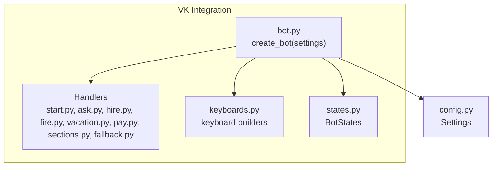
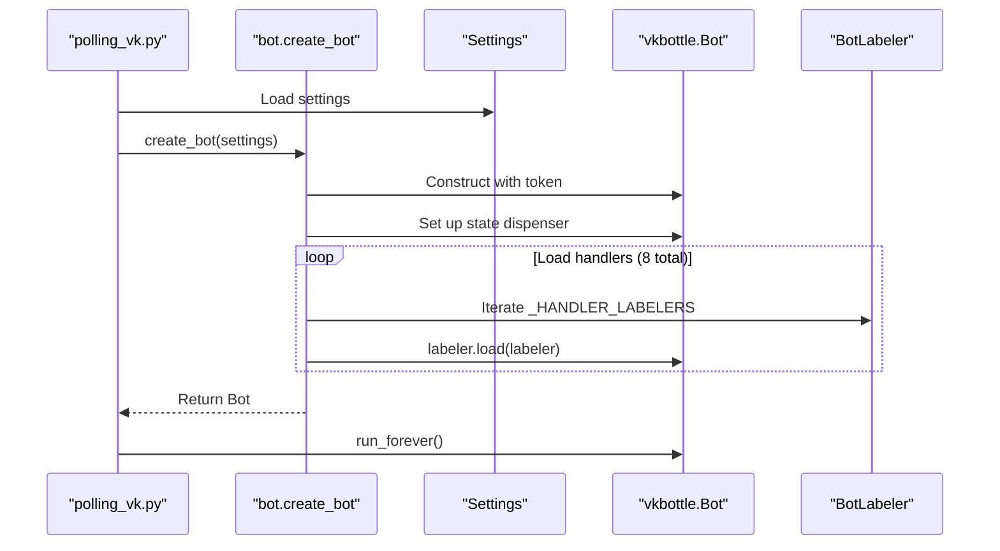
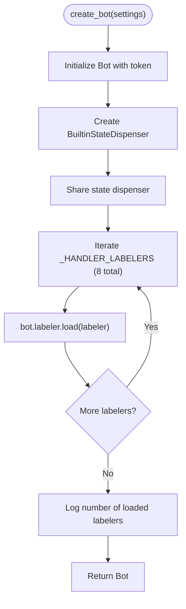
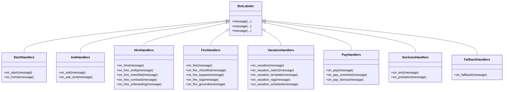
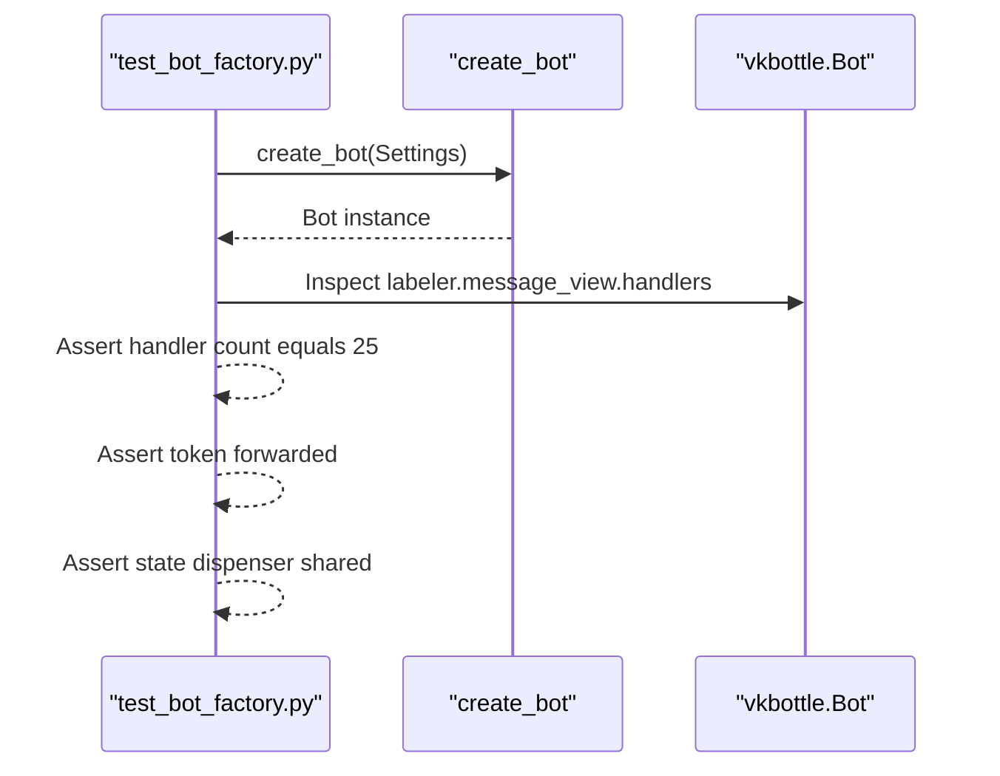
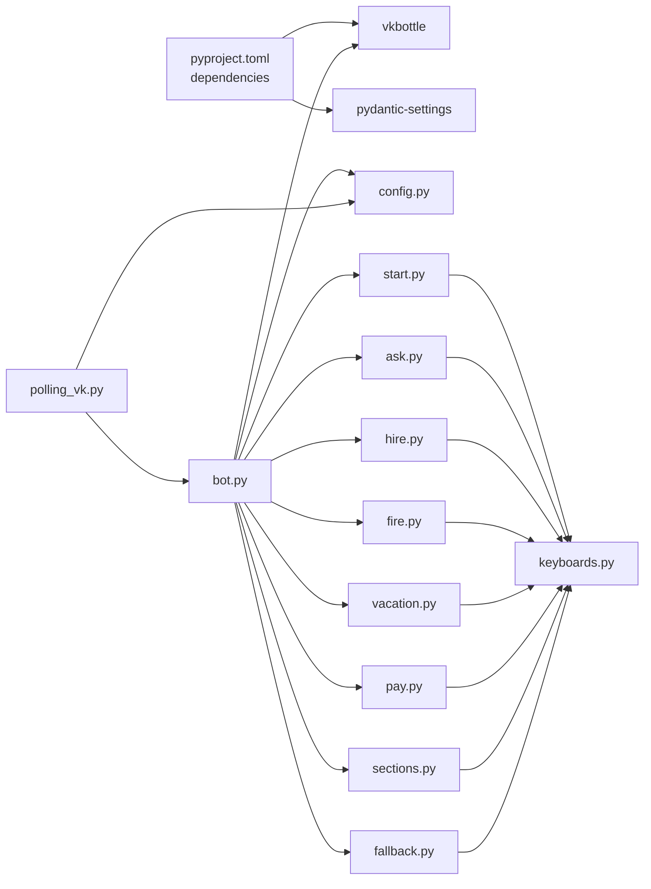

# Bot Factory

<cite>
**Referenced Files in This Document**
- [bot.py](file://app/integrations/vk/bot.py)
- [config.py](file://app/config.py)
- [start.py](file://app/integrations/vk/handlers/start.py)
- [ask.py](file://app/integrations/vk/handlers/ask.py)
- [hire.py](file://app/integrations/vk/handlers/hire.py)
- [fire.py](file://app/integrations/vk/handlers/fire.py)
- [vacation.py](file://app/integrations/vk/handlers/vacation.py)
- [pay.py](file://app/integrations/vk/handlers/pay.py)
- [sections.py](file://app/integrations/vk/handlers/sections.py)
- [fallback.py](file://app/integrations/vk/handlers/fallback.py)
- [keyboards.py](file://app/integrations/vk/keyboards.py)
- [states.py](file://app/integrations/vk/states.py)
- [polling_vk.py](file://scripts/polling_vk.py)
- [test_bot_factory.py](file://tests/test_bot_factory.py)
- [pyproject.toml](file://pyproject.toml)
</cite>

## Table of Contents
1. [Introduction](#introduction)
2. [Project Structure](#project-structure)
3. [Core Components](#core-components)
4. [Architecture Overview](#architecture-overview)
5. [Detailed Component Analysis](#detailed-component-analysis)
6. [Dependency Analysis](#dependency-analysis)
7. [Performance Considerations](#performance-considerations)
8. [Troubleshooting Guide](#troubleshooting-guide)
9. [Conclusion](#conclusion)
10. [Appendices](#appendices)

## Introduction
This document explains the VK bot factory implementation that creates a fully wired vkbottle Bot instance with all handlers registered. It covers the factory pattern, handler registration mechanism, the critical importance of handler ordering, the create_bot function's parameters and return value, and practical guidance for extending the bot with new handlers, customizing behavior, centralized configuration via Settings, logging integration, error handling patterns, and testing strategies.

## Project Structure
The VK integration is organized around a factory that wires a Bot instance with a set of labeled handlers. Handlers are grouped by feature and exposed as BotLabeler instances. The factory centralizes configuration and handler loading.

**Diagram sources**
- [bot.py:1-56](file://app/integrations/vk/bot.py#L1-L56)
- [config.py:1-53](file://app/config.py#L1-L53)
- [start.py:1-42](file://app/integrations/vk/handlers/start.py#L1-L42)
- [ask.py:1-90](file://app/integrations/vk/handlers/ask.py#L1-L90)
- [hire.py:1-98](file://app/integrations/vk/handlers/hire.py#L1-L98)
- [fire.py:1-74](file://app/integrations/vk/handlers/fire.py#L1-L74)
- [vacation.py:1-80](file://app/integrations/vk/handlers/vacation.py#L1-L80)
- [pay.py:1-46](file://app/integrations/vk/handlers/pay.py#L1-L46)
- [sections.py:1-35](file://app/integrations/vk/handlers/sections.py#L1-L35)
- [fallback.py:1-18](file://app/integrations/vk/handlers/fallback.py#L1-L18)
- [keyboards.py:1-108](file://app/integrations/vk/keyboards.py#L1-L108)
- [states.py:1-14](file://app/integrations/vk/states.py#L1-L14)

**Section sources**
- [bot.py:1-56](file://app/integrations/vk/bot.py#L1-L56)
- [config.py:1-53](file://app/config.py#L1-L53)

## Core Components
- Bot factory: create_bot(settings) constructs a Bot and registers handlers in a fixed order.
- Handler labelers: Each handler module exports a BotLabeler instance (bl) with decorated message handlers.
- Centralized configuration: Settings holds VK credentials and group ID.
- Keyboard builders: Shared keyboard construction utilities used by handlers.
- States: A state group for multi-step dialogs.

Key responsibilities:
- create_bot(settings): Creates a Bot, loads labelers, logs creation, and returns the instance.
- Settings: Provides VK access token and group ID from environment.
- Handlers: Define message routes and responses using BotLabeler decorators.
- Keyboards: Provide reusable keyboard layouts and service rows.
- States: Define state names for multi-step flows.

**Section sources**
- [bot.py:42-56](file://app/integrations/vk/bot.py#L42-L56)
- [config.py:14-19](file://app/config.py#L14-L19)
- [start.py:12](file://app/integrations/vk/handlers/start.py#L12)
- [ask.py:32](file://app/integrations/vk/handlers/ask.py#L32)
- [hire.py:24](file://app/integrations/vk/handlers/hire.py#L24)
- [fire.py:22](file://app/integrations/vk/handlers/fire.py#L22)
- [vacation.py:24](file://app/integrations/vk/handlers/vacation.py#L24)
- [pay.py:18](file://app/integrations/vk/handlers/pay.py#L18)
- [sections.py:18](file://app/integrations/vk/handlers/sections.py#L18)
- [fallback.py:7](file://app/integrations/vk/handlers/fallback.py#L7)
- [keyboards.py:11-108](file://app/integrations/vk/keyboards.py#L11-L108)
- [states.py:4-14](file://app/integrations/vk/states.py#L4-L14)

## Architecture Overview
The factory pattern encapsulates Bot creation and wiring. The create_bot function:
- Initializes a Bot with the VK access token from Settings.
- Iterates through a predefined list of BotLabeler instances and loads them into the bot's labeler.
- Sets up state dispenser for multi-step dialogs.
- Logs successful creation and returns the configured Bot.

**Diagram sources**
- [polling_vk.py:30-40](file://scripts/polling_vk.py#L30-L40)
- [bot.py:42-56](file://app/integrations/vk/bot.py#L42-L56)
- [config.py:14-19](file://app/config.py#L14-L19)

**Section sources**
- [bot.py:24-56](file://app/integrations/vk/bot.py#L24-L56)
- [polling_vk.py:30-40](file://scripts/polling_vk.py#L30-L40)

## Detailed Component Analysis

### Bot Factory: create_bot
Purpose:
- Build a fully configured vkbottle Bot instance.
- Centralize token provisioning and handler registration.

Parameters:
- settings: app.config.Settings containing vk_access_token and vk_group_id.

Processing logic:
- Construct Bot with token from settings.
- Create and share state dispenser between bot and handlers.
- Iterate over _HANDLER_LABELERS and load each labeler into bot.labeler.
- Log the number of loaded labelers.
- Return the configured Bot.

Return value:
- vkbottle.Bot instance ready for polling or callbacks.

Important note:
- The order of _HANDLER_LABELERS is critical because vkbottle evaluates handlers top-to-bottom. The fallback labeler must be last to avoid intercepting messages intended for earlier handlers.

**Diagram sources**
- [bot.py:42-56](file://app/integrations/vk/bot.py#L42-L56)

**Section sources**
- [bot.py:42-56](file://app/integrations/vk/bot.py#L42-L56)

### Handler Registration Mechanism
Each handler module defines a BotLabeler instance (bl) and registers message handlers using decorators. The factory loads these labelers in a fixed order.

- start.py: Registers greeting and home navigation handlers.
- ask.py: Registers free-text question handler with state management.
- hire.py: Registers employee hiring flow handlers (5 handlers).
- fire.py: Registers employee termination flow handlers (5 handlers).
- vacation.py: Registers vacation/sick leave flow handlers (5 handlers).
- pay.py: Registers payroll and bonus flow handlers (3 handlers).
- sections.py: Registers remaining section handlers (2 handlers).
- fallback.py: Registers a catch-all handler for unmatched messages.

**Updated** Handler count reduced from 9 HR request handlers to 5 handlers in the registration sequence: start, ask, hire, fire, vacation, pay, sections, fallback.

**Diagram sources**
- [start.py:12](file://app/integrations/vk/handlers/start.py#L12)
- [ask.py:32](file://app/integrations/vk/handlers/ask.py#L32)
- [hire.py:24](file://app/integrations/vk/handlers/hire.py#L24)
- [fire.py:22](file://app/integrations/vk/handlers/fire.py#L22)
- [vacation.py:24](file://app/integrations/vk/handlers/vacation.py#L24)
- [pay.py:18](file://app/integrations/vk/handlers/pay.py#L18)
- [sections.py:18](file://app/integrations/vk/handlers/sections.py#L18)
- [fallback.py:7](file://app/integrations/vk/handlers/fallback.py#L7)

**Section sources**
- [start.py:12](file://app/integrations/vk/handlers/start.py#L12)
- [ask.py:32](file://app/integrations/vk/handlers/ask.py#L32)
- [hire.py:24](file://app/integrations/vk/handlers/hire.py#L24)
- [fire.py:22](file://app/integrations/vk/handlers/fire.py#L22)
- [vacation.py:24](file://app/integrations/vk/handlers/vacation.py#L24)
- [pay.py:18](file://app/integrations/vk/handlers/pay.py#L18)
- [sections.py:18](file://app/integrations/vk/handlers/sections.py#L18)
- [fallback.py:7](file://app/integrations/vk/handlers/fallback.py#L7)

### Handler Ordering and Its Importance
The factory maintains a strict order for handler labelers:
- start.bl (first)
- ask.bl (second)
- hire.bl (third)
- fire.bl (fourth)
- vacation.bl (fifth)
- pay.bl (sixth)
- sections.bl (seventh)
- fallback.bl (last)

Why this matters:
- vkbottle checks handlers top-to-bottom.
- If fallback were loaded earlier, it would match all messages and prevent more specific handlers from firing.
- The ask handler must come before fallback to handle free-text questions properly.
- The sections handler comes before fallback to handle remaining RAG-powered sections.

**Updated** The handler sequence now reflects the new order: start → ask → hire/fire/vacation/pay → sections → fallback.

Validation in tests ensures:
- Fallback is last.
- Start is first.
- Ask is second and before fallback.
- Sections appear before fallback.

**Section sources**
- [bot.py:24-39](file://app/integrations/vk/bot.py#L24-L39)
- [test_bot_factory.py:18-45](file://tests/test_bot_factory.py#L18-L45)

### Centralized Configuration with Settings
Settings provides:
- vk_access_token: Used by create_bot to initialize the Bot.
- vk_group_id: Available for future use (e.g., group-specific logic).

Environment binding:
- Settings reads from .env via pydantic-settings.

**Section sources**
- [config.py:14-19](file://app/config.py#L14-L19)
- [bot.py:44](file://app/integrations/vk/bot.py#L44)

### Logging Integration
Logging behavior:
- The factory logs a message upon successful creation and number of loaded labelers.
- Development entry-point sets up basic logging configuration.

**Section sources**
- [bot.py:22](file://app/integrations/vk/bot.py#L22)
- [bot.py:54](file://app/integrations/vk/bot.py#L54)
- [polling_vk.py:31](file://scripts/polling_vk.py#L31)

### Error Handling Patterns
Current implementation:
- No explicit try/catch blocks in the factory.
- Tests validate token forwarding and handler counts, indirectly asserting robustness.
- State dispenser is shared between bot and handlers for consistent state management.

Recommended patterns (conceptual):
- Wrap bot initialization and labeler loading in try/except.
- Log initialization failures and re-raise or return None with structured error info.
- Validate settings presence before creating the Bot.

### Practical Examples

#### Extending the bot with a new handler
Steps:
1. Create a new handler module under app/integrations/vk/handlers/ with a BotLabeler instance and decorated handlers.
2. Export bl from the module.
3. Add the new bl to _HANDLER_LABELERS in the correct position (before fallback).
4. Run tests to confirm ordering and handler count.

Example references:
- New handler module: [new_handler.py](file://app/integrations/vk/handlers/new_handler.py)
- Updated labelers list: [bot.py:30-39](file://app/integrations/vk/bot.py#L30-L39)

#### Modifying the handler loading sequence
- Adjust the order in _HANDLER_LABELERS to change precedence.
- Ensure fallback remains last.
- Verify tests pass to maintain correctness.

Example references:
- Labelers list: [bot.py:30-39](file://app/integrations/vk/bot.py#L30-L39)
- Tests enforcing order: [test_bot_factory.py:18-45](file://tests/test_bot_factory.py#L18-L45)

#### Customizing bot behavior
- Add or modify keyboard builders in keyboards.py to change UI behavior.
- Introduce new states in states.py for multi-step flows.
- Update Settings to support new configuration keys.

Example references:
- Keyboard builders: [keyboards.py:29-108](file://app/integrations/vk/keyboards.py#L29-L108)
- States: [states.py:4-14](file://app/integrations/vk/states.py#L4-L14)
- Settings: [config.py:14-19](file://app/config.py#L14-L19)

### Testing the Bot Factory and Validating Handler Registration
Test coverage includes:
- Handler labeler order enforcement.
- Bot instance creation and token forwarding.
- Total handler count verification (25 total handlers across 8 handler modules).

**Updated** Test validates the new handler sequence with 25 total handlers: start (2), ask (2), hire (5), fire (5), vacation (5), pay (3), sections (2), fallback (1).

**Diagram sources**
- [test_bot_factory.py:47-79](file://tests/test_bot_factory.py#L47-L79)
- [bot.py:42-56](file://app/integrations/vk/bot.py#L42-L56)

**Section sources**
- [test_bot_factory.py:18-79](file://tests/test_bot_factory.py#L18-L79)

## Dependency Analysis
External dependencies:
- vkbottle: Provides Bot and BotLabeler.
- pydantic-settings: Provides Settings with env_file binding.

Internal dependencies:
- bot.py depends on Settings and handler labelers.
- Handlers depend on keyboards and BotLabeler.
- polling script depends on bot factory and Settings.

**Diagram sources**
- [pyproject.toml:7-21](file://pyproject.toml#L7-L21)
- [bot.py:7-20](file://app/integrations/vk/bot.py#L7-L20)
- [config.py:1](file://app/config.py#L1)
- [start.py:5](file://app/integrations/vk/handlers/start.py#L5)
- [ask.py:19](file://app/integrations/vk/handlers/ask.py#L19)
- [hire.py:8](file://app/integrations/vk/handlers/hire.py#L8)
- [fire.py:8](file://app/integrations/vk/handlers/fire.py#L8)
- [vacation.py:8](file://app/integrations/vk/handlers/vacation.py#L8)
- [pay.py:8](file://app/integrations/vk/handlers/pay.py#L8)
- [sections.py:9](file://app/integrations/vk/handlers/sections.py#L9)
- [fallback.py:3](file://app/integrations/vk/handlers/fallback.py#L3)
- [keyboards.py:9](file://app/integrations/vk/keyboards.py#L9)
- [polling_vk.py:17-21](file://scripts/polling_vk.py#L17-L21)

**Section sources**
- [pyproject.toml:7-21](file://pyproject.toml#L7-L21)
- [bot.py:7-20](file://app/integrations/vk/bot.py#L7-L20)

## Performance Considerations
- Handler registration cost: Minimal overhead; executed once during bot creation.
- Token provisioning: One-time operation; ensure settings are cached if reused frequently.
- State dispenser sharing: Reduces memory overhead by sharing state between bot and handlers.
- Logging: Low overhead; consider async logging for high-throughput scenarios.

## Troubleshooting Guide
Common issues and resolutions:
- Incorrect handler order: Ensure fallback is last; verify tests enforce ordering.
- Missing handlers: Confirm all bl instances are included in _HANDLER_LABELERS.
- Token errors: Validate vk_access_token in Settings; tests assert token forwarding.
- State dispenser errors: Ensure state dispenser is properly shared between bot and handlers.
- Keyboard inconsistencies: Review keyboards.py builders and payload constants.

Validation steps:
- Run tests to confirm handler count and ordering.
- Manually test long-poll mode via polling script.

**Section sources**
- [test_bot_factory.py:18-79](file://tests/test_bot_factory.py#L18-L79)
- [polling_vk.py:30-40](file://scripts/polling_vk.py#L30-L40)

## Conclusion
The VK bot factory cleanly applies the factory pattern to construct a configured Bot with a deterministic handler loading sequence. Centralized configuration via Settings and shared keyboard utilities promote maintainability. The new handler sequence (start → ask → hire/fire/vacation/pay → sections → fallback) with 8 handler modules and 25 total handlers ensures predictable routing, validated by tests. The design supports easy extension with new handlers and customization while preserving reliability and testability.

## Appendices

### API Summary
- create_bot(settings: Settings) -> Bot
  - Constructs a Bot with token from settings.
  - Sets up shared state dispenser.
  - Loads 8 labelers in a fixed order.
  - Returns the configured Bot.

**Section sources**
- [bot.py:42-56](file://app/integrations/vk/bot.py#L42-L56)

### Example References
- Factory usage in development: [polling_vk.py:30-40](file://scripts/polling_vk.py#L30-L40)
- Handler modules: [start.py:1-42](file://app/integrations/vk/handlers/start.py#L1-L42), [ask.py:1-90](file://app/integrations/vk/handlers/ask.py#L1-L90), [hire.py:1-98](file://app/integrations/vk/handlers/hire.py#L1-L98), [fire.py:1-74](file://app/integrations/vk/handlers/fire.py#L1-L74), [vacation.py:1-80](file://app/integrations/vk/handlers/vacation.py#L1-L80), [pay.py:1-46](file://app/integrations/vk/handlers/pay.py#L1-L46), [sections.py:1-35](file://app/integrations/vk/handlers/sections.py#L1-L35), [fallback.py:1-18](file://app/integrations/vk/handlers/fallback.py#L1-L18)
- Keyboard builders: [keyboards.py:1-108](file://app/integrations/vk/keyboards.py#L1-L108)
- States: [states.py:1-14](file://app/integrations/vk/states.py#L1-L14)
- Configuration: [config.py:1-53](file://app/config.py#L1-L53)