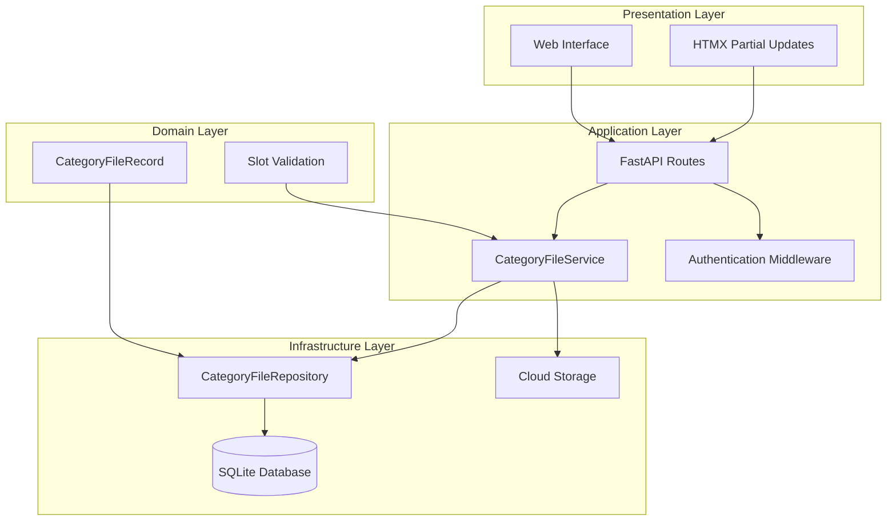
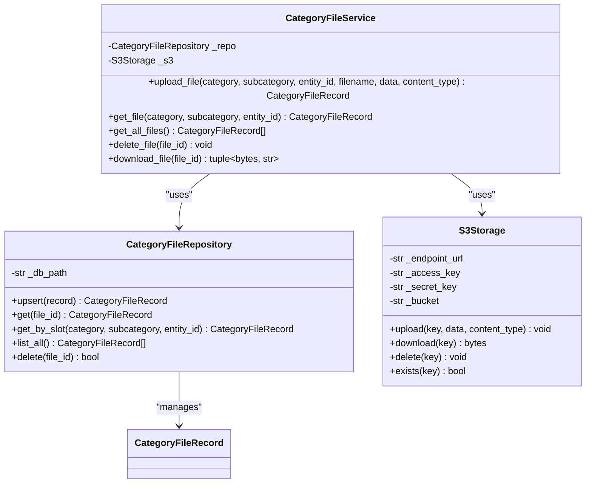
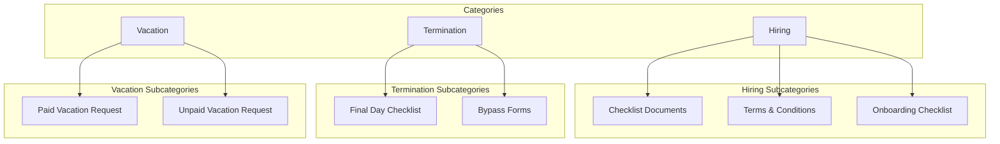
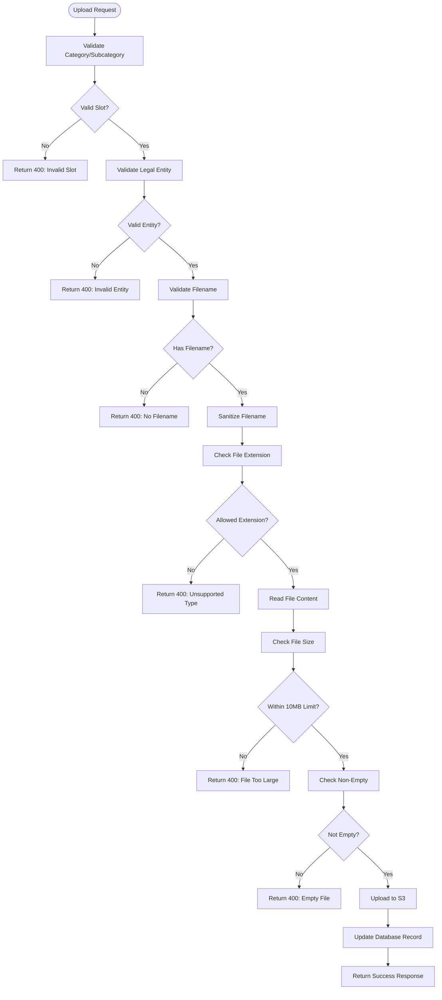
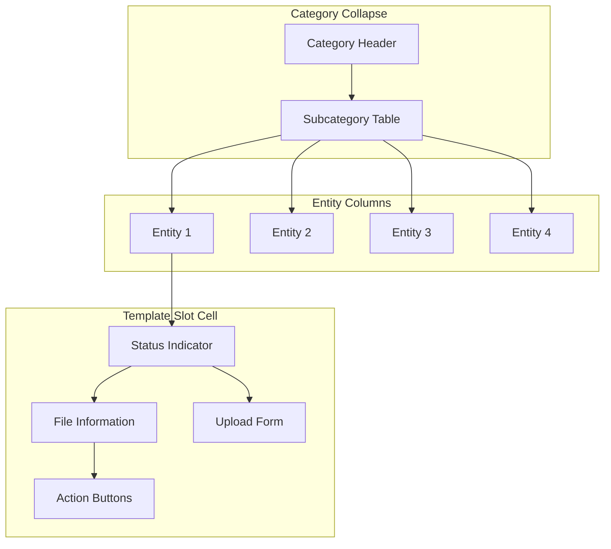
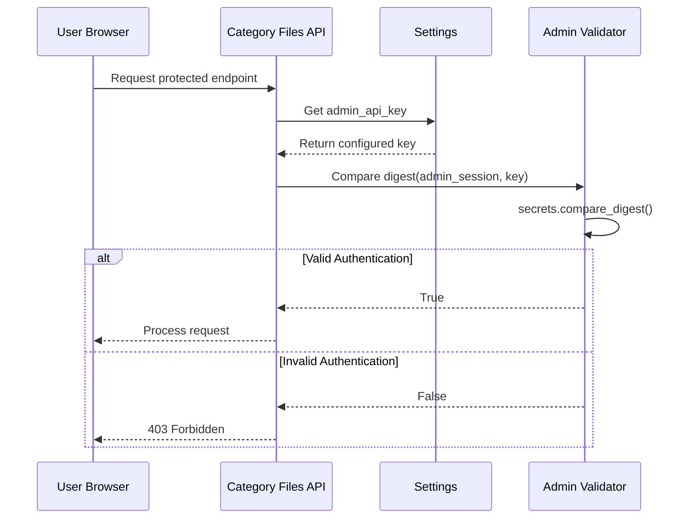
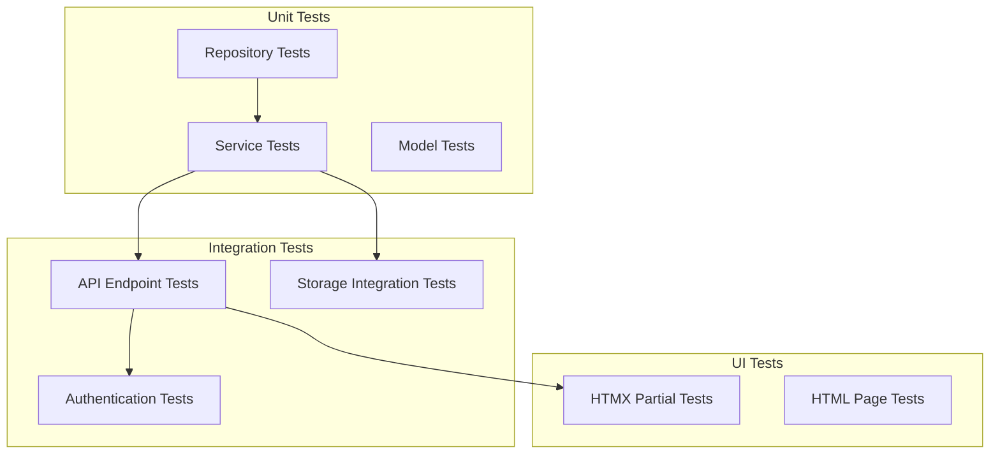
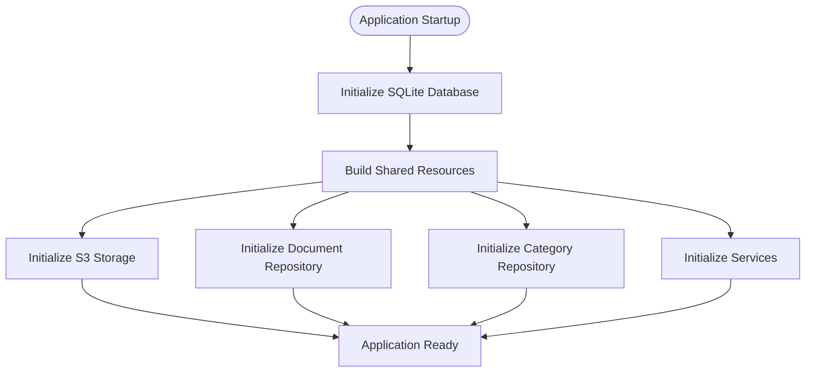

# Category File Template Management System

<cite>
**Referenced Files in This Document**
- [category_files.py](file://app/api/category_files.py)
- [category_file_service.py](file://app/domain/category_file_service.py)
- [category_repo.py](file://app/storage/category_repo.py)
- [category_models.py](file://app/storage/category_models.py)
- [s3.py](file://app/storage/s3.py)
- [deps.py](file://app/api/deps.py)
- [main.py](file://app/main.py)
- [config.py](file://app/config.py)
- [database.py](file://app/storage/database.py)
- [resources.py](file://app/resources.py)
- [category_files.html](file://templates/category_files.html)
- [category_slot.html](file://templates/partials/category_slot.html)
- [test_category_files.py](file://tests/test_category_files.py)
- [test_category_file_service.py](file://tests/test_category_file_service.py)
</cite>

## Table of Contents
1. [Introduction](#introduction)
2. [System Architecture](#system-architecture)
3. [Core Components](#core-components)
4. [Template Management System](#template-management-system)
5. [Data Model and Storage](#data-model-and-storage)
6. [API Endpoints](#api-endpoints)
7. [User Interface](#user-interface)
8. [Security and Authentication](#security-and-authentication)
9. [Testing Strategy](#testing-strategy)
10. [Deployment and Configuration](#deployment-and-configuration)
11. [Troubleshooting Guide](#troubleshooting-guide)
12. [Conclusion](#conclusion)

## Introduction

The Category File Template Management System is a specialized document management solution designed for the Cafetera HR Bot. This system enables administrators to manage document templates for different HR categories and legal entities through a web-based interface. The system supports multiple file formats (primarily Microsoft Word documents), provides real-time template management via HTMX, and integrates with cloud storage for scalable document handling.

The system organizes templates into a hierarchical structure: Categories (such as hiring, termination, and vacations) contain subcategories (specific document types), and each subcategory can have templates for different legal entities. This structure ensures that HR professionals can quickly access the correct templates for their specific needs while maintaining organizational consistency across different company entities.

## System Architecture

The Category File Template Management System follows a clean architecture pattern with clear separation of concerns across multiple layers:



**Diagram sources**
- [category_files.py:115-141](file://app/api/category_files.py#L115-L141)
- [category_file_service.py:22-31](file://app/domain/category_file_service.py#L22-L31)
- [category_repo.py:47-52](file://app/storage/category_repo.py#L47-L52)
- [s3.py:14-38](file://app/storage/s3.py#L14-L38)

The architecture consists of four main layers:

1. **Presentation Layer**: Handles user interaction through FastAPI routes and Jinja2 templates
2. **Application Layer**: Contains business logic and orchestration through the CategoryFileService
3. **Domain Layer**: Defines core data structures and validation logic
4. **Infrastructure Layer**: Manages persistent storage and external services

## Core Components

### CategoryFileService

The CategoryFileService acts as the central coordinator for all template management operations. It orchestrates between the SQLite repository and S3 storage while ensuring data consistency and proper error handling.



**Diagram sources**
- [category_file_service.py:22-31](file://app/domain/category_file_service.py#L22-L31)
- [category_repo.py:47-52](file://app/storage/category_repo.py#L47-L52)
- [s3.py:14-38](file://app/storage/s3.py#L14-L38)

**Section sources**
- [category_file_service.py:22-116](file://app/domain/category_file_service.py#L22-L116)

### CategoryFileRepository

The CategoryFileRepository provides asynchronous CRUD operations for managing template records in SQLite. It implements proper transaction handling and maintains referential integrity through unique constraints.

**Section sources**
- [category_repo.py:47-137](file://app/storage/category_repo.py#L47-L137)

### S3Storage

The S3Storage component provides asynchronous cloud storage operations using aiobotocore. It handles lazy initialization, automatic bucket creation, and proper error handling for cloud operations.

**Section sources**
- [s3.py:14-124](file://app/storage/s3.py#L14-L124)

## Template Management System

### Category Structure

The system organizes templates into a hierarchical structure that mirrors HR processes:



**Diagram sources**
- [category_models.py:33-56](file://app/storage/category_models.py#L33-L56)

Each category contains predefined subcategories with localized Russian labels, ensuring intuitive navigation for Russian-speaking users. The system validates all template uploads against this predefined structure to maintain consistency.

**Section sources**
- [category_models.py:33-65](file://app/storage/category_models.py#L33-L65)

### Legal Entities Support

The system supports multiple legal entities within the Cafetera Group, each with distinct company names and template requirements:

| Entity ID | Company Name | Template Isolation |
|-----------|--------------|-------------------|
| 1 | ООО «Кафетера Групп Рус» | Separate template storage |
| 2 | ООО «Вкусно» | Independent template management |
| 3 | ООО «Аврора РусКо» | Isolated template environment |
| 4 | ООО «СМАРТ ПИТАНИЕ» | Complete template separation |

**Section sources**
- [category_models.py:25-30](file://app/storage/category_models.py#L25-L30)

## Data Model and Storage

### CategoryFileRecord Structure

The core data model defines the structure for storing template metadata and file references:

```mermaid
erDiagram
CATEGORY_FILES {
INTEGER id PK
TEXT file_id UK
TEXT category
TEXT subcategory
INTEGER entity_id
TEXT filename
TEXT s3_key
TEXT mime_type
INTEGER size_bytes
TEXT created_at
TEXT updated_at
}
INDEX uq_cat_sub_entity {
category
subcategory
entity_id
TYPE UNIQUE
}
CATEGORY_FILES ||--o{ LEGAL_ENTITIES : "belongs_to"
CATEGORY_FILES ||--o{ CATEGORY_SLOTS : "organized_by"
```

**Diagram sources**
- [database.py:31-50](file://app/storage/database.py#L31-L50)
- [category_models.py:9-21](file://app/storage/category_models.py#L9-L21)

The database schema enforces uniqueness at the category-subcategory-entity level, preventing duplicate templates within the same organizational context while allowing the same template type across different entities.

**Section sources**
- [category_models.py:9-21](file://app/storage/category_models.py#L9-L21)
- [database.py:31-50](file://app/storage/database.py#L31-L50)

## API Endpoints

### Administrative Interface

The system provides a comprehensive administrative interface with both HTML pages and RESTful API endpoints:

| Endpoint | Method | Description | Authentication |
|----------|--------|-------------|----------------|
| `/category-files` | GET | Main admin page displaying template matrix | Admin Cookie |
| `/api/category-files/slots` | GET | Returns available categories and entities | Admin Cookie |
| `/api/category-files` | GET | Lists all uploaded templates | Admin Cookie |
| `/api/category-files/upload` | POST | Uploads new template file | Admin Cookie |
| `/api/category-files/{file_id}/download` | GET | Downloads specific template | Admin Cookie |
| `/api/category-files/{file_id}` | DELETE | Removes template file | Admin Cookie |
| `/partials/category-slot/{category}/{subcategory}/{entity_id}` | GET | Returns HTMX partial for slot cell | Admin Cookie |

**Section sources**
- [category_files.py:1-15](file://app/api/category_files.py#L1-L15)

### File Upload Validation

The upload process includes comprehensive validation to ensure file integrity and security:



**Diagram sources**
- [category_files.py:173-247](file://app/api/category_files.py#L173-L247)

**Section sources**
- [category_files.py:173-247](file://app/api/category_files.py#L173-L247)

## User Interface

### Template Matrix Interface

The primary interface presents templates in an organized matrix format that displays all categories, subcategories, and legal entities:



**Diagram sources**
- [category_files.html:14-61](file://templates/category_files.html#L14-L61)

The interface uses HTMX for seamless updates without full page reloads, providing immediate feedback for template operations.

**Section sources**
- [category_files.html:1-78](file://templates/category_files.html#L1-L78)

### Template Slot Partial

Each template slot cell provides consistent functionality regardless of whether a template is currently loaded:

| State | Display Elements | Available Actions |
|-------|------------------|-------------------|
| Template Present | ✓ icon, filename, file size | Download, Delete, Replace |
| No Template | Upload button, "Not Loaded" badge | Upload |
| Hover State | Action buttons appear | All actions available |

**Section sources**
- [category_slot.html:1-88](file://templates/partials/category_slot.html#L1-L88)

## Security and Authentication

### Admin Authentication

The system implements cookie-based authentication for administrative access:



**Diagram sources**
- [deps.py:77-89](file://app/api/deps.py#L77-L89)

The authentication system uses constant-time comparison to prevent timing attacks and requires a properly configured admin API key for access.

**Section sources**
- [deps.py:77-89](file://app/api/deps.py#L77-L89)
- [config.py:45-45](file://app/config.py#L45-L45)

### File Security Measures

Multiple security measures protect the system and data:

1. **Path Traversal Prevention**: Filename sanitization removes directory traversal attempts
2. **File Type Validation**: Strict whitelist of allowed extensions (`.docx`, `.doc`)
3. **Size Limits**: Maximum 10MB file size enforcement
4. **Content Validation**: Empty file detection prevents malicious uploads
5. **MIME Type Handling**: Proper content-type management for downloads

**Section sources**
- [category_files.py:63-74](file://app/api/category_files.py#L63-L74)
- [category_files.py:46-57](file://app/api/category_files.py#L46-L57)

## Testing Strategy

### Comprehensive Test Coverage

The system includes extensive testing across all layers:



**Diagram sources**
- [test_category_files.py:1-515](file://tests/test_category_files.py#L1-L515)
- [test_category_file_service.py:1-410](file://tests/test_category_file_service.py#L1-L410)

The testing strategy includes:

- **Repository Tests**: Validate CRUD operations and database constraints
- **Service Tests**: Test business logic and error handling scenarios
- **API Tests**: Verify endpoint behavior and authentication
- **Integration Tests**: Ensure proper coordination between components
- **UI Tests**: Validate HTMX partials and template rendering

**Section sources**
- [test_category_files.py:1-515](file://tests/test_category_files.py#L1-L515)
- [test_category_file_service.py:1-410](file://tests/test_category_file_service.py#L1-L410)

## Deployment and Configuration

### Environment Configuration

The system uses Pydantic settings for flexible deployment configurations:

| Setting | Purpose | Default Value |
|---------|---------|---------------|
| `admin_api_key` | Administrator authentication | Empty string |
| `db_path` | SQLite database location | `"data/cafetera.db"` |
| `s3_endpoint_url` | Cloud storage endpoint | `"http://localhost:9000"` |
| `s3_access_key` | Storage credentials | `"minioadmin"` |
| `s3_secret_key` | Storage credentials | `"minioadmin"` |
| `s3_bucket` | Storage bucket name | `"rag-documents"` |
| `max_concurrent_indexing` | Concurrency limit | `2` |

**Section sources**
- [config.py:14-62](file://app/config.py#L14-L62)

### Resource Initialization

The application initializes resources during startup:



**Diagram sources**
- [main.py:22-49](file://app/main.py#L22-L49)
- [resources.py:63-231](file://app/resources.py#L63-L231)

**Section sources**
- [main.py:22-80](file://app/main.py#L22-L80)
- [resources.py:63-231](file://app/resources.py#L63-L231)

## Troubleshooting Guide

### Common Issues and Solutions

| Issue | Symptoms | Solution |
|-------|----------|----------|
| Authentication Failure | 403 Forbidden responses | Verify `admin_api_key` is set in environment |
| S3 Connection Errors | Upload failures, service unavailable | Check S3 endpoint URL and credentials |
| Database Lock Errors | Transaction failures | Ensure single database connection |
| File Upload Rejections | 400 Bad Request responses | Verify file format and size limits |
| Template Not Showing | Empty slot cells | Check entity-specific template uploads |

### Debug Information

Enable debug logging by setting the logging configuration:

```python
logging.basicConfig(
    level=logging.DEBUG,
    format="%(asctime)s  %(levelname)-8s  %(name)s  %(message)s",
)
```

Monitor these key log messages:
- Database initialization status
- S3 client connection state
- File upload/download progress
- Authentication validation results

**Section sources**
- [config.py:6-11](file://app/config.py#L6-L11)

## Conclusion

The Category File Template Management System provides a robust, scalable solution for HR document template management. Its clean architecture, comprehensive validation, and user-friendly interface make it suitable for enterprise HR departments managing multiple legal entities and complex template hierarchies.

Key strengths of the system include:

- **Hierarchical Organization**: Logical categorization that mirrors HR processes
- **Multi-Entity Support**: Isolated template management across different legal entities
- **Real-Time Updates**: Seamless user experience through HTMX partial updates
- **Security Focus**: Comprehensive validation and authentication mechanisms
- **Scalable Infrastructure**: Cloud storage integration with proper error handling
- **Comprehensive Testing**: Extensive test coverage ensuring reliability

The system successfully balances functionality with maintainability, providing HR professionals with efficient access to standardized templates while ensuring data integrity and security across all organizational contexts.