# Domain Content Management

<cite>
**Referenced Files in This Document**
- [content.py](file://app/domain/content.py)
- [entities.py](file://app/domain/entities.py)
- [bot.py](file://app/integrations/vk/bot.py)
- [config.py](file://app/config.py)
- [keyboards.py](file://app/integrations/vk/keyboards.py)
- [states.py](file://app/integrations/vk/states.py)
- [rules.py](file://app/integrations/vk/rules.py)
- [start.py](file://app/integrations/vk/handlers/start.py)
- [hr_request.py](file://app/integrations/vk/handlers/hr_request.py)
- [hire.py](file://app/integrations/vk/handlers/hire.py)
- [fire.py](file://app/integrations/vk/handlers/fire.py)
- [vacation.py](file://app/integrations/vk/handlers/vacation.py)
- [pay.py](file://app/integrations/vk/handlers/pay.py)
- [sections.py](file://app/integrations/vk/handlers/sections.py)
- [fallback.py](file://app/integrations/vk/handlers/fallback.py)
- [polling_vk.py](file://scripts/polling_vk.py)
- [pyproject.toml](file://pyproject.toml)
- [test_content.py](file://tests/test_content.py)
- [test_entities.py](file://tests/test_entities.py)
</cite>

## Table of Contents
1. [Introduction](#introduction)
2. [Project Structure](#project-structure)
3. [Core Components](#core-components)
4. [Architecture Overview](#architecture-overview)
5. [Detailed Component Analysis](#detailed-component-analysis)
6. [Dependency Analysis](#dependency-analysis)
7. [Performance Considerations](#performance-considerations)
8. [Troubleshooting Guide](#troubleshooting-guide)
9. [Conclusion](#conclusion)

## Introduction
This document describes the Domain Content Management system that powers the Cafetera HR Bot. The system centralizes static content, document templates, checklists, and structured formatters used across multiple HR-related flows in the VKontakte chatbot. It ensures consistency, maintainability, and separation of concerns by keeping content definitions separate from handler logic, enabling thin handlers and reusable content modules.

## Project Structure
The Domain Content Management spans two primary areas:
- Domain layer: Static content definitions and formatters
- Integration layer: VK bot wiring, handlers, keyboards, and state management

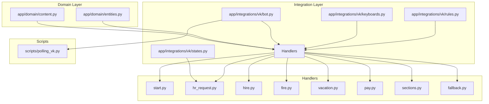

**Diagram sources**
- [content.py:1-177](file://app/domain/content.py#L1-L177)
- [entities.py:1-24](file://app/domain/entities.py#L1-L24)
- [bot.py:1-56](file://app/integrations/vk/bot.py#L1-L56)
- [keyboards.py:1-293](file://app/integrations/vk/keyboards.py#L1-L293)
- [states.py:1-17](file://app/integrations/vk/states.py#L1-L17)
- [rules.py:1-31](file://app/integrations/vk/rules.py#L1-L31)
- [start.py:1-50](file://app/integrations/vk/handlers/start.py#L1-L50)
- [hr_request.py:1-305](file://app/integrations/vk/handlers/hr_request.py#L1-L305)
- [hire.py:1-108](file://app/integrations/vk/handlers/hire.py#L1-L108)
- [fire.py:1-65](file://app/integrations/vk/handlers/fire.py#L1-L65)
- [vacation.py:1-76](file://app/integrations/vk/handlers/vacation.py#L1-L76)
- [pay.py:1-53](file://app/integrations/vk/handlers/pay.py#L1-L53)
- [sections.py:1-42](file://app/integrations/vk/handlers/sections.py#L1-L42)
- [fallback.py:1-18](file://app/integrations/vk/handlers/fallback.py#L1-L18)
- [polling_vk.py:1-32](file://scripts/polling_vk.py#L1-L32)

**Section sources**
- [content.py:1-177](file://app/domain/content.py#L1-L177)
- [entities.py:1-24](file://app/domain/entities.py#L1-L24)
- [bot.py:1-56](file://app/integrations/vk/bot.py#L1-L56)
- [keyboards.py:1-293](file://app/integrations/vk/keyboards.py#L1-L293)
- [states.py:1-17](file://app/integrations/vk/states.py#L1-L17)
- [rules.py:1-31](file://app/integrations/vk/rules.py#L1-L31)
- [polling_vk.py:1-32](file://scripts/polling_vk.py#L1-L32)

## Core Components
- Domain content module: Centralizes static content, disclaimers, templates, checklists, and formatters for HR requests.
- Entities module: Defines legal entity data structures and lookup maps used across flows.
- VK bot factory: Creates and wires the VK bot with all handlers and shared state.
- Keyboard builders: Generate consistent UI layouts and payload commands for navigation and actions.
- Multi-step state machine: Manages conversational flows for HR requests and other dialogs.
- Handler modules: Thin handlers that orchestrate user interactions and delegate content rendering to domain modules.

Key responsibilities:
- Content stability: All long-form content lives in the domain module to keep handlers concise.
- Entity consistency: Legal entities are defined centrally and referenced by ID across flows.
- Reusability: Formatters and templates are pure functions that accept entity context.
- Extensibility: New content can be added to the domain module without changing handler logic.

**Section sources**
- [content.py:1-177](file://app/domain/content.py#L1-L177)
- [entities.py:1-24](file://app/domain/entities.py#L1-L24)
- [bot.py:1-56](file://app/integrations/vk/bot.py#L1-L56)
- [keyboards.py:1-293](file://app/integrations/vk/keyboards.py#L1-L293)
- [states.py:1-17](file://app/integrations/vk/states.py#L1-L17)

## Architecture Overview
The system follows a layered architecture:
- Presentation layer: VK bot and handlers
- Domain layer: Content and entity definitions
- Infrastructure layer: VK integration, keyboards, state management, and routing rules

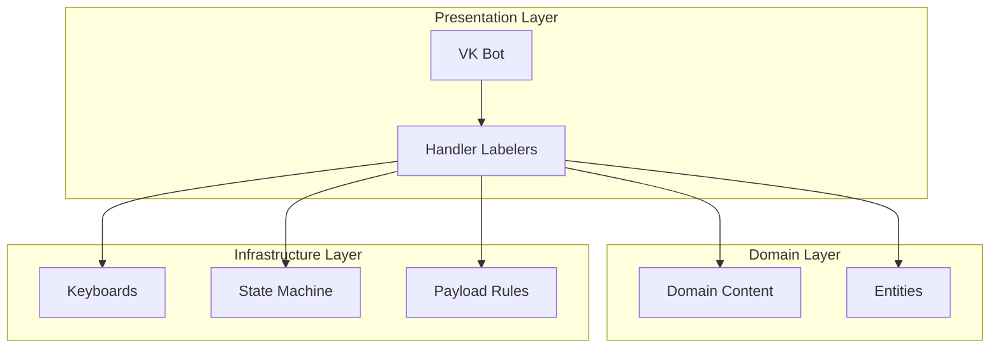

**Diagram sources**
- [bot.py:44-56](file://app/integrations/vk/bot.py#L44-L56)
- [content.py:1-177](file://app/domain/content.py#L1-L177)
- [entities.py:1-24](file://app/domain/entities.py#L1-L24)
- [keyboards.py:1-293](file://app/integrations/vk/keyboards.py#L1-L293)
- [states.py:1-17](file://app/integrations/vk/states.py#L1-L17)
- [rules.py:1-31](file://app/integrations/vk/rules.py#L1-L31)

## Detailed Component Analysis

### Domain Content Module
The domain content module defines:
- Disclaimers and file stubs for document templates
- Hire-related checklists and onboarding lists
- Fire-related checklists and bypass sheet text
- Vacation template text
- HR-request topics and urgency options
- RAG stub placeholders for future knowledge base integration
- Error messages for unavailable documents and missing answers
- Structured formatter for HR requests

Implementation highlights:
- Pure functions that accept a LegalEntity context to render localized content
- Centralized error and disclaimer text for consistency
- Standardized formatting for HR requests with structured headers and fields

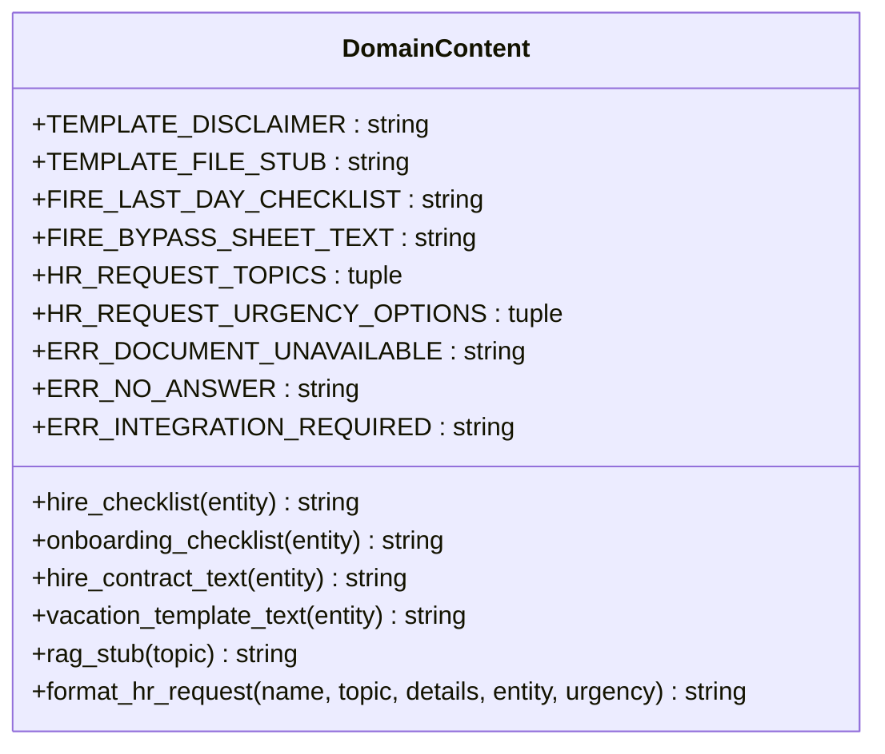

**Diagram sources**
- [content.py:1-177](file://app/domain/content.py#L1-L177)

**Section sources**
- [content.py:1-177](file://app/domain/content.py#L1-L177)

### Entities Module
Defines LegalEntity dataclass and a fixed set of legal entities used across flows. Provides:
- Full and short names for display and selection
- Lookup dictionary by ID for fast resolution

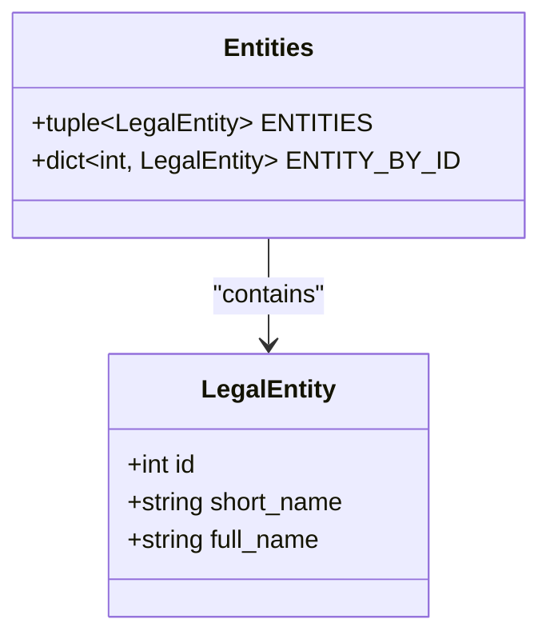

**Diagram sources**
- [entities.py:8-24](file://app/domain/entities.py#L8-L24)

**Section sources**
- [entities.py:1-24](file://app/domain/entities.py#L1-L24)

### VK Bot Factory and Handler Wiring
The bot factory:
- Creates a VK bot instance with a shared state dispenser
- Registers handler labelers in a specific order to ensure proper routing
- Logs successful initialization

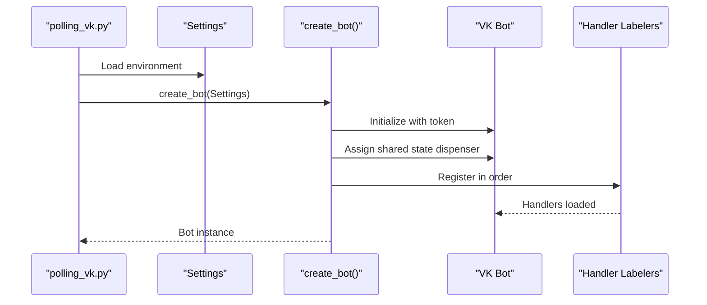

**Diagram sources**
- [polling_vk.py:23-27](file://scripts/polling_vk.py#L23-L27)
- [bot.py:44-56](file://app/integrations/vk/bot.py#L44-L56)
- [config.py:4-9](file://app/config.py#L4-L9)

**Section sources**
- [bot.py:1-56](file://app/integrations/vk/bot.py#L1-L56)
- [polling_vk.py:1-32](file://scripts/polling_vk.py#L1-L32)
- [config.py:1-9](file://app/config.py#L1-L9)

### Keyboard Builders and Navigation
Keyboards provide consistent navigation and action buttons:
- Main menu keyboard with seven sections
- Entity selection keyboards for hire and vacation flows
- Action menus for hire (checklist, contract, onboarding)
- Menus for fire (last-day checklist, bypass sheet, RAG stub)
- Pay menu (overtime, bonuses)
- HR-request step-specific keyboards for topic, entity, urgency, and confirmation
- Service row with Back/Home/Contact HR buttons

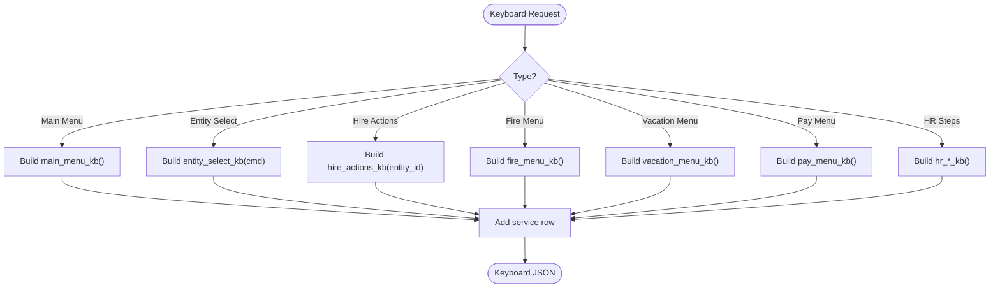

**Diagram sources**
- [keyboards.py:87-293](file://app/integrations/vk/keyboards.py#L87-L293)

**Section sources**
- [keyboards.py:1-293](file://app/integrations/vk/keyboards.py#L1-L293)

### Multi-Step Dialog: HR Request
The HR-request dialog is a six-step form managed by a state machine:
1. Name input
2. Topic selection
3. Details input
4. Entity selection
5. Urgency selection
6. Confirmation

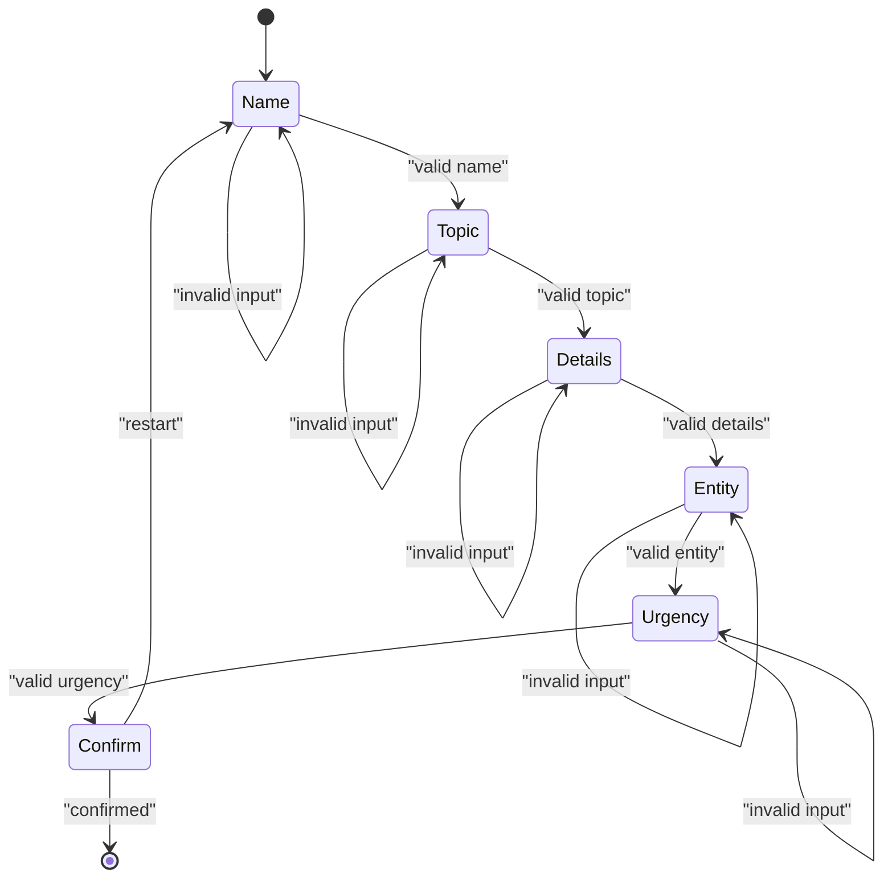

**Diagram sources**
- [states.py:4-17](file://app/integrations/vk/states.py#L4-L17)
- [hr_request.py:69-305](file://app/integrations/vk/handlers/hr_request.py#L69-L305)

**Section sources**
- [states.py:1-17](file://app/integrations/vk/states.py#L1-L17)
- [hr_request.py:1-305](file://app/integrations/vk/handlers/hr_request.py#L1-L305)

### Hire Flow
The hire flow guides users through entity selection and action choices:
- Entity selection with full legal entity names
- Action menu for checklist, contract template, and onboarding checklist
- Content retrieval delegated to domain content functions

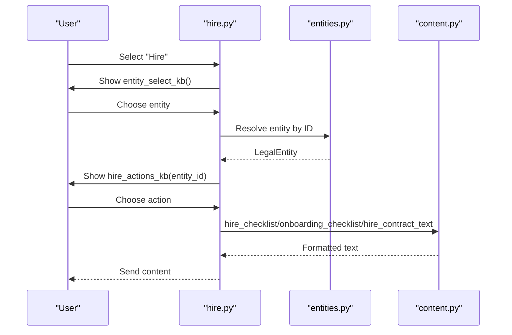

**Diagram sources**
- [hire.py:32-108](file://app/integrations/vk/handlers/hire.py#L32-L108)
- [entities.py:16-24](file://app/domain/entities.py#L16-L24)
- [content.py:40-72](file://app/domain/content.py#L40-L72)

**Section sources**
- [hire.py:1-108](file://app/integrations/vk/handlers/hire.py#L1-L108)
- [content.py:24-72](file://app/domain/content.py#L24-L72)

### Fire Flow
The fire flow provides:
- Last-day checklist
- Bypass sheet text with disclaimer and file stub
- RAG stub for voluntary dismissal

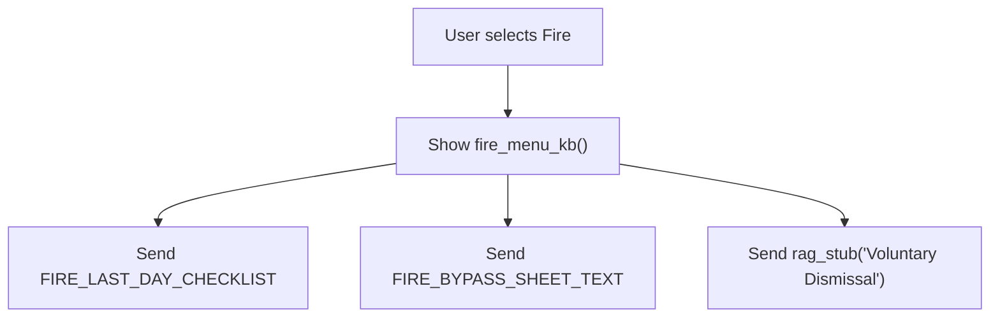

**Diagram sources**
- [fire.py:26-65](file://app/integrations/vk/handlers/fire.py#L26-L65)
- [content.py:75-94](file://app/domain/content.py#L75-L94)

**Section sources**
- [fire.py:1-65](file://app/integrations/vk/handlers/fire.py#L1-L65)
- [content.py:75-94](file://app/domain/content.py#L75-L94)

### Vacation Flow
The vacation flow supports:
- Template selection with entity context
- Disclaimer and file stub for leave application
- RAG stub for leave procedures

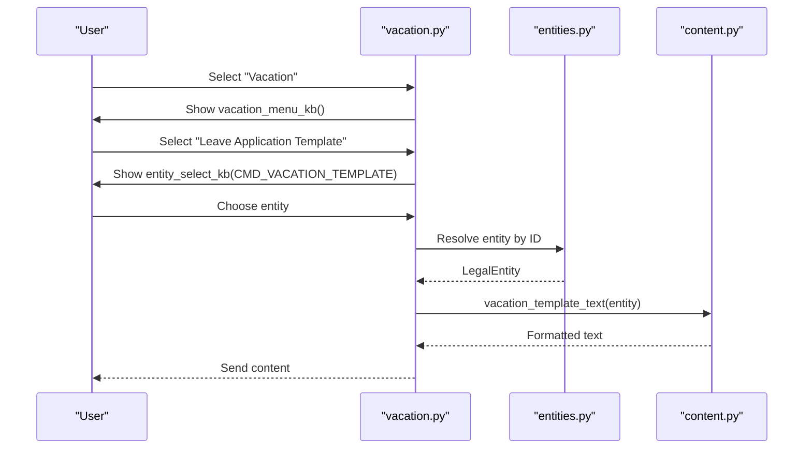

**Diagram sources**
- [vacation.py:29-76](file://app/integrations/vk/handlers/vacation.py#L29-L76)
- [entities.py:16-24](file://app/domain/entities.py#L16-L24)
- [content.py:99-104](file://app/domain/content.py#L99-L104)

**Section sources**
- [vacation.py:1-76](file://app/integrations/vk/handlers/vacation.py#L1-L76)
- [content.py:96-104](file://app/domain/content.py#L96-L104)

### Pay and Sections Flows
- Pay flow: Overtime and bonus conditions routed to RAG stubs
- Sections flow: Sick leave and probation routes to RAG stubs

These flows demonstrate consistent patterns of delegating content to domain modules and using stubs for future enhancements.

**Section sources**
- [pay.py:1-53](file://app/integrations/vk/handlers/pay.py#L1-L53)
- [sections.py:1-42](file://app/integrations/vk/handlers/sections.py#L1-L42)

### Fallback Handler
The fallback handler ensures users stay on track by responding to arbitrary text with a reminder to use menu buttons and returning to the main menu.

**Section sources**
- [fallback.py:1-18](file://app/integrations/vk/handlers/fallback.py#L1-L18)

## Dependency Analysis
The system exhibits low coupling and high cohesion:
- Handlers depend on domain content and entities but not on each other
- Keyboard builders encapsulate UI logic
- State machine isolates conversational logic
- Payload rules enable flexible routing based on JSON payloads

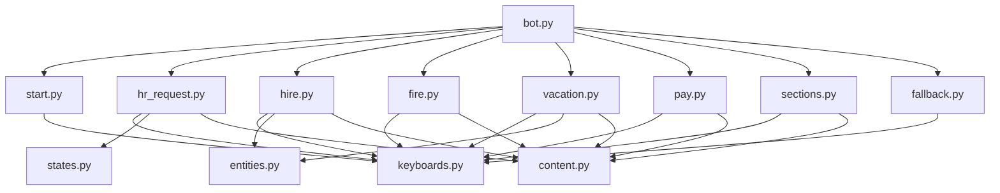

**Diagram sources**
- [bot.py:10-56](file://app/integrations/vk/bot.py#L10-L56)
- [start.py:1-50](file://app/integrations/vk/handlers/start.py#L1-L50)
- [hr_request.py:1-35](file://app/integrations/vk/handlers/hr_request.py#L1-L35)
- [hire.py:1-23](file://app/integrations/vk/handlers/hire.py#L1-L23)
- [fire.py:1-19](file://app/integrations/vk/handlers/fire.py#L1-L19)
- [vacation.py:1-22](file://app/integrations/vk/handlers/vacation.py#L1-L22)
- [pay.py:1-18](file://app/integrations/vk/handlers/pay.py#L1-L18)
- [sections.py:1-18](file://app/integrations/vk/handlers/sections.py#L1-L18)
- [fallback.py:1-18](file://app/integrations/vk/handlers/fallback.py#L1-L18)
- [keyboards.py:1-293](file://app/integrations/vk/keyboards.py#L1-L293)
- [states.py:1-17](file://app/integrations/vk/states.py#L1-L17)
- [content.py:1-177](file://app/domain/content.py#L1-L177)
- [entities.py:1-24](file://app/domain/entities.py#L1-L24)

**Section sources**
- [bot.py:1-56](file://app/integrations/vk/bot.py#L1-L56)
- [keyboards.py:1-293](file://app/integrations/vk/keyboards.py#L1-L293)
- [states.py:1-17](file://app/integrations/vk/states.py#L1-L17)
- [content.py:1-177](file://app/domain/content.py#L1-L177)
- [entities.py:1-24](file://app/domain/entities.py#L1-L24)

## Performance Considerations
- Content retrieval is constant-time string concatenations and lookups
- Keyboard generation is lightweight and cached as JSON
- State storage uses in-memory BuiltinStateDispenser; consider persistence for production
- Handler logic remains thin, minimizing CPU overhead and improving responsiveness
- RAG stubs defer heavy computation to future integration

## Troubleshooting Guide
Common issues and resolutions:
- Missing or invalid entity ID: Handlers validate entity presence and return user-friendly messages with navigation back to previous steps
- Invalid inputs in HR-request dialog: Handlers enforce minimum length and acceptable values, prompting users to retry
- Session expiration: State clearing prevents stale contexts; handlers guide users to restart flows
- Unmatched text input: Fallback handler redirects users to the main menu with clear guidance

Operational tips:
- Verify VK access token and group ID in environment settings
- Ensure handler registration order is preserved to avoid unintended routing
- Monitor logs for state management errors during multi-step dialogs

**Section sources**
- [hr_request.py:59-64](file://app/integrations/vk/handlers/hr_request.py#L59-L64)
- [hire.py:44-52](file://app/integrations/vk/handlers/hire.py#L44-L52)
- [vacation.py:51-60](file://app/integrations/vk/handlers/vacation.py#L51-L60)
- [fallback.py:9-12](file://app/integrations/vk/handlers/fallback.py#L9-L12)
- [config.py:4-9](file://app/config.py#L4-L9)

## Conclusion
The Domain Content Management system successfully separates content from presentation, ensuring maintainable and scalable HR bot functionality. By centralizing content definitions, enforcing consistent entity handling, and using thin handlers with robust state management, the system provides a solid foundation for future enhancements, including integration with a knowledge base and expanded HR workflows.