# Domain Content Management

<cite>
**Referenced Files in This Document**
- [content.py](file://app/domain/content.py)
- [entities.py](file://app/domain/entities.py)
- [topic_hints.py](file://app/domain/topic_hints.py)
- [bot.py](file://app/integrations/vk/bot.py)
- [config.py](file://app/config.py)
- [keyboards.py](file://app/integrations/vk/keyboards.py)
- [states.py](file://app/integrations/vk/states.py)
- [rules.py](file://app/integrations/vk/rules.py)
- [start.py](file://app/integrations/vk/handlers/start.py)
- [ask.py](file://app/integrations/vk/handlers/ask.py)
- [hire.py](file://app/integrations/vk/handlers/hire.py)
- [fire.py](file://app/integrations/vk/handlers/fire.py)
- [vacation.py](file://app/integrations/vk/handlers/vacation.py)
- [pay.py](file://app/integrations/vk/handlers/pay.py)
- [sections.py](file://app/integrations/vk/handlers/sections.py)
- [fallback.py](file://app/integrations/vk/handlers/fallback.py)
- [polling_vk.py](file://scripts/polling_vk.py)
- [pyproject.toml](file://pyproject.toml)
- [test_content.py](file://tests/test_content.py)
- [test_entities.py](file://tests/test_entities.py)
</cite>

## Update Summary
**Changes Made**
- Removed all HR request-related content definitions and formatting logic from Domain Content Management
- Updated architecture to reflect transition from HR request form to free-text question handling via RAG
- Revised core components to focus on content-only modules (content.py, entities.py, topic_hints.py)
- Updated handler architecture to remove HR request state machine and multi-step dialog
- Removed HR request topics, urgency options, and format_hr_request function
- Integrated Topic Hints module for intelligent scenario detection from free-text questions

## Table of Contents
1. [Introduction](#introduction)
2. [Project Structure](#project-structure)
3. [Core Components](#core-components)
4. [Architecture Overview](#architecture-overview)
5. [Detailed Component Analysis](#detailed-component-analysis)
6. [Dependency Analysis](#dependency-analysis)
7. [Performance Considerations](#performance-considerations)
8. [Troubleshooting Guide](#troubleshooting-guide)
9. [Conclusion](#conclusion)

## Introduction
This document describes the Domain Content Management system that powers the Cafetera HR Bot. The system centralizes static content, document templates, checklists, and structured formatters used across HR-related flows in the VKontakte chatbot. It ensures consistency, maintainability, and separation of concerns by keeping content definitions separate from handler logic, enabling thin handlers and reusable content modules.

**Updated** The system now focuses exclusively on content management rather than multi-step HR request processing, with free-text question handling via RAG integration.

## Project Structure
The Domain Content Management spans three primary areas:
- Domain layer: Static content definitions, entity definitions, and topic hint detection
- Integration layer: VK bot wiring, handlers, keyboards, and state management
- RAG integration: Question processing and scenario detection

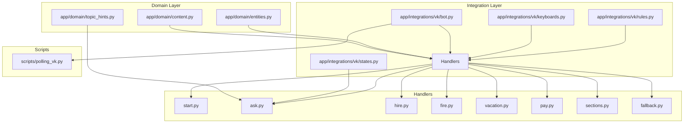

**Diagram sources**
- [content.py:1-140](file://app/domain/content.py#L1-L140)
- [entities.py:1-24](file://app/domain/entities.py#L1-L24)
- [topic_hints.py:1-109](file://app/domain/topic_hints.py#L1-L109)
- [bot.py:1-56](file://app/integrations/vk/bot.py#L1-L56)
- [keyboards.py:1-234](file://app/integrations/vk/keyboards.py#L1-L234)
- [states.py:1-9](file://app/integrations/vk/states.py#L1-L9)
- [rules.py:1-31](file://app/integrations/vk/rules.py#L1-L31)
- [start.py:1-42](file://app/integrations/vk/handlers/start.py#L1-L42)
- [ask.py:1-90](file://app/integrations/vk/handlers/ask.py#L1-L90)
- [hire.py:1-108](file://app/integrations/vk/handlers/hire.py#L1-L108)
- [fire.py:1-65](file://app/integrations/vk/handlers/fire.py#L1-L65)
- [vacation.py:1-76](file://app/integrations/vk/handlers/vacation.py#L1-L76)
- [pay.py:1-53](file://app/integrations/vk/handlers/pay.py#L1-L53)
- [sections.py:1-42](file://app/integrations/vk/handlers/sections.py#L1-L42)
- [fallback.py:1-18](file://app/integrations/vk/handlers/fallback.py#L1-L18)
- [polling_vk.py:1-32](file://scripts/polling_vk.py#L1-L32)

**Section sources**
- [content.py:1-140](file://app/domain/content.py#L1-L140)
- [entities.py:1-24](file://app/domain/entities.py#L1-L24)
- [topic_hints.py:1-109](file://app/domain/topic_hints.py#L1-L109)
- [bot.py:1-56](file://app/integrations/vk/bot.py#L1-L56)
- [keyboards.py:1-234](file://app/integrations/vk/keyboards.py#L1-L234)
- [states.py:1-9](file://app/integrations/vk/states.py#L1-L9)
- [rules.py:1-31](file://app/integrations/vk/rules.py#L1-L31)
- [polling_vk.py:1-32](file://scripts/polling_vk.py#L1-L32)

## Core Components
- Domain content module: Centralizes static content, disclaimers, templates, checklists, and formatters for HR-related content.
- Entities module: Defines legal entity data structures and lookup maps used across flows.
- Topic hints module: Detects clickable scenarios and background-topic disclaimers from free-text questions.
- VK bot factory: Creates and wires the VK bot with all handlers and shared state.
- Keyboard builders: Generate consistent UI layouts and payload commands for navigation and actions.
- Single-state question handler: Processes free-text questions via RAG integration with intelligent scenario detection.
- Handler modules: Thin handlers that orchestrate user interactions and delegate content rendering to domain modules.

Key responsibilities:
- Content stability: All long-form content lives in the domain module to keep handlers concise.
- Entity consistency: Legal entities are defined centrally and referenced by ID across flows.
- Scenario detection: Topic hints intelligently route users to appropriate HR sections from free-text questions.
- Reusability: Formatters and templates are pure functions that accept entity context.
- Extensibility: New content can be added to the domain module without changing handler logic.

**Updated** Removed HR request multi-step state machine and replaced with single-state question handler using RAG integration.

**Section sources**
- [content.py:1-140](file://app/domain/content.py#L1-L140)
- [entities.py:1-24](file://app/domain/entities.py#L1-L24)
- [topic_hints.py:1-109](file://app/domain/topic_hints.py#L1-L109)
- [bot.py:1-56](file://app/integrations/vk/bot.py#L1-L56)
- [keyboards.py:1-234](file://app/integrations/vk/keyboards.py#L1-L234)
- [states.py:1-9](file://app/integrations/vk/states.py#L1-L9)

## Architecture Overview
The system follows a layered architecture:
- Presentation layer: VK bot and handlers
- Domain layer: Content, entity, and topic hint definitions
- Infrastructure layer: VK integration, keyboards, state management, and routing rules

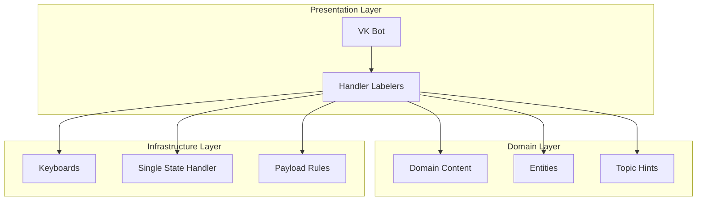

**Diagram sources**
- [bot.py:44-56](file://app/integrations/vk/bot.py#L44-L56)
- [content.py:1-140](file://app/domain/content.py#L1-L140)
- [entities.py:1-24](file://app/domain/entities.py#L1-L24)
- [topic_hints.py:1-109](file://app/domain/topic_hints.py#L1-L109)
- [keyboards.py:1-234](file://app/integrations/vk/keyboards.py#L1-L234)
- [states.py:1-9](file://app/integrations/vk/states.py#L1-L9)
- [rules.py:1-31](file://app/integrations/vk/rules.py#L1-L31)

## Detailed Component Analysis

### Domain Content Module
The domain content module defines:
- Disclaimers and file stubs for document templates
- Hire-related checklists and onboarding lists
- Fire-related checklists and bypass sheet text
- Vacation template text
- RAG stub placeholders for future knowledge base integration
- Error messages for unavailable documents and missing answers

Implementation highlights:
- Pure functions that accept a LegalEntity context to render localized content
- Centralized error and disclaimer text for consistency
- Standardized formatting for HR-related content with structured headers and fields

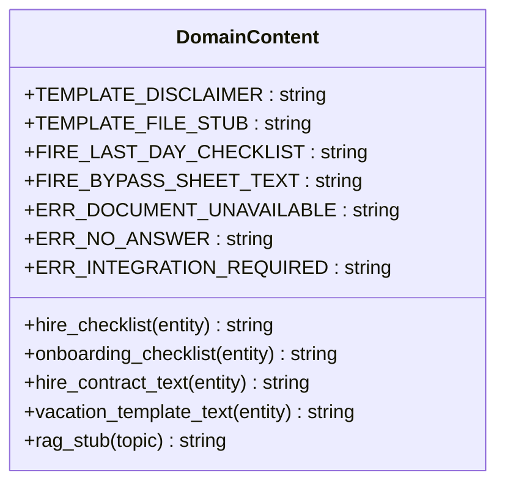

**Diagram sources**
- [content.py:1-140](file://app/domain/content.py#L1-L140)

**Section sources**
- [content.py:1-140](file://app/domain/content.py#L1-L140)

### Entities Module
Defines LegalEntity dataclass and a fixed set of legal entities used across flows. Provides:
- Full and short names for display and selection
- Lookup dictionary by ID for fast resolution

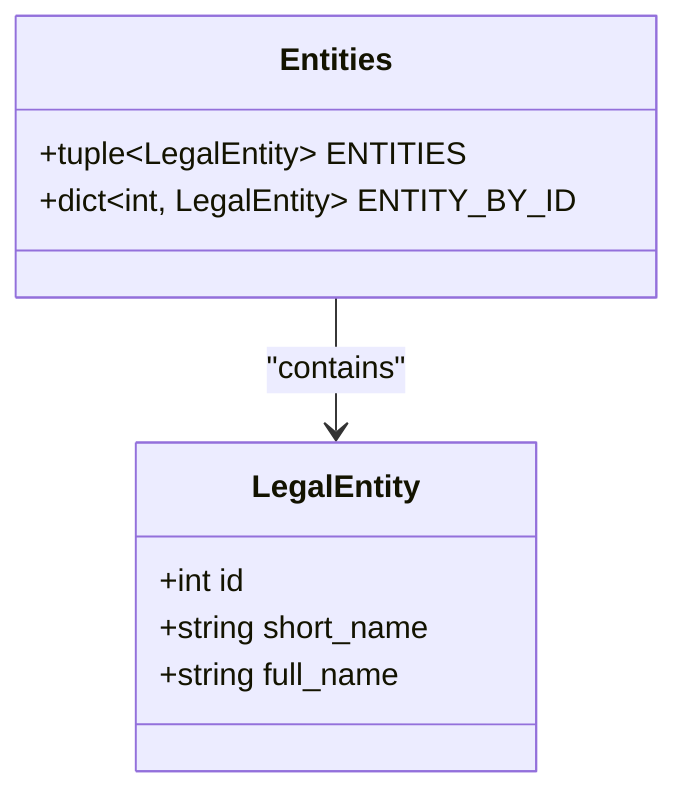

**Diagram sources**
- [entities.py:8-24](file://app/domain/entities.py#L8-L24)

**Section sources**
- [entities.py:1-24](file://app/domain/entities.py#L1-L24)

### Topic Hints Module
The topic hints module provides intelligent scenario detection from free-text questions:
- Clickable scenario keywords for hire, fire, vacation, pay, sick, and probation
- Background-topic keywords with contextual disclaimers
- Deterministic keyword-based detection for fast and reliable routing

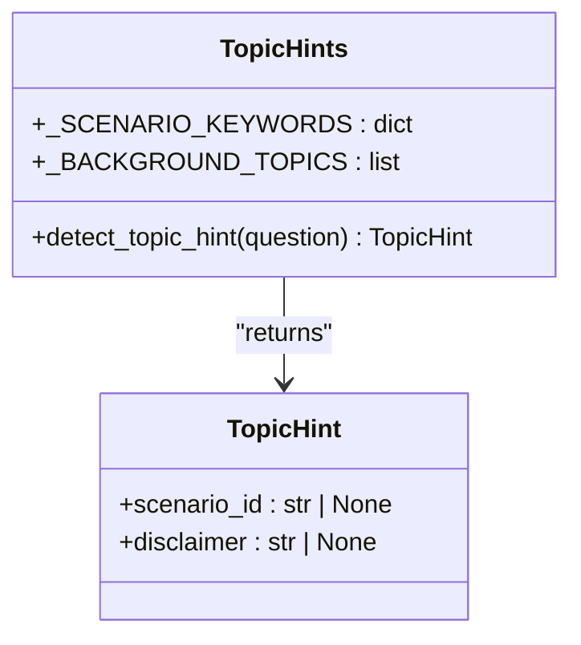

**Diagram sources**
- [topic_hints.py:14-109](file://app/domain/topic_hints.py#L14-L109)

**Section sources**
- [topic_hints.py:1-109](file://app/domain/topic_hints.py#L1-L109)

### VK Bot Factory and Handler Wiring
The bot factory:
- Creates a VK bot instance with a shared state dispenser
- Registers handler labelers in a specific order to ensure proper routing
- Logs successful initialization

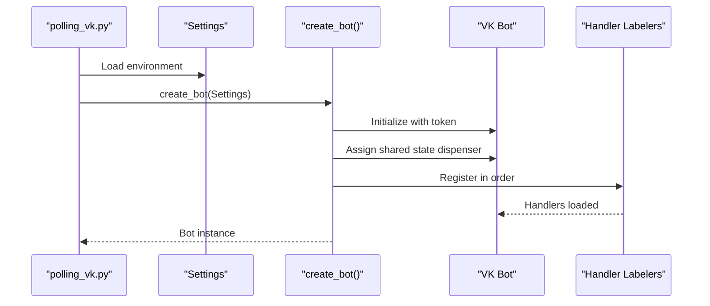

**Diagram sources**
- [polling_vk.py:23-27](file://scripts/polling_vk.py#L23-L27)
- [bot.py:44-56](file://app/integrations/vk/bot.py#L44-L56)
- [config.py:4-9](file://app/config.py#L4-L9)

**Section sources**
- [bot.py:1-56](file://app/integrations/vk/bot.py#L1-L56)
- [polling_vk.py:1-32](file://scripts/polling_vk.py#L1-L32)
- [config.py:1-9](file://app/config.py#L1-L9)

### Keyboard Builders and Navigation
Keyboards provide consistent navigation and action buttons:
- Main menu keyboard with seven sections
- Entity selection keyboards for hire and vacation flows
- Action menus for hire (checklist, contract, onboarding)
- Menus for fire (last-day checklist, bypass sheet, RAG stub)
- Pay menu (overtime, bonuses)
- Ask question input and result keyboards with scenario suggestions
- Service row with Back/Home/Contact HR buttons

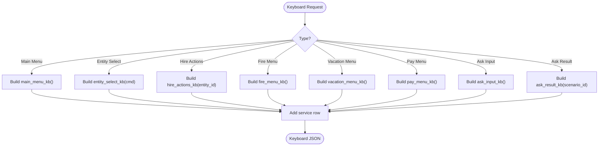

**Diagram sources**
- [keyboards.py:75-234](file://app/integrations/vk/keyboards.py#L75-L234)

**Section sources**
- [keyboards.py:1-234](file://app/integrations/vk/keyboards.py#L1-L234)

### Free-Text Question Handler
The ask handler processes free-text questions through a streamlined flow:
1. Entry point: CMD_ASK payload triggers question input
2. State management: Sets ASK_QUESTION state to capture free text
3. Question processing: Validates input and clears state
4. RAG integration: Queries knowledge base with typing indicator
5. Scenario detection: Uses topic hints to detect clickable scenarios
6. Response formatting: Appends disclaimers and scenario suggestions

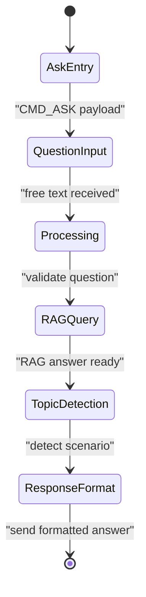

**Diagram sources**
- [states.py:4-9](file://app/integrations/vk/states.py#L4-L9)
- [ask.py:38-90](file://app/integrations/vk/handlers/ask.py#L38-L90)

**Section sources**
- [states.py:1-9](file://app/integrations/vk/states.py#L1-L9)
- [ask.py:1-90](file://app/integrations/vk/handlers/ask.py#L1-L90)

### Hire Flow
The hire flow guides users through entity selection and action choices:
- Entity selection with full legal entity names
- Action menu for checklist, contract template, and onboarding checklist
- Content retrieval delegated to domain content functions

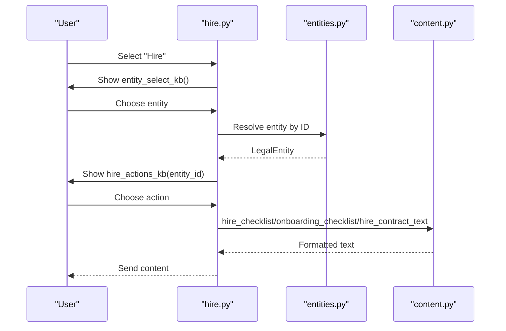

**Diagram sources**
- [hire.py:32-108](file://app/integrations/vk/handlers/hire.py#L32-L108)
- [entities.py:16-24](file://app/domain/entities.py#L16-L24)
- [content.py:40-72](file://app/domain/content.py#L40-L72)

**Section sources**
- [hire.py:1-108](file://app/integrations/vk/handlers/hire.py#L1-L108)
- [content.py:24-72](file://app/domain/content.py#L24-L72)

### Fire Flow
The fire flow provides:
- Last-day checklist
- Bypass sheet text with disclaimer and file stub
- RAG stub for voluntary dismissal

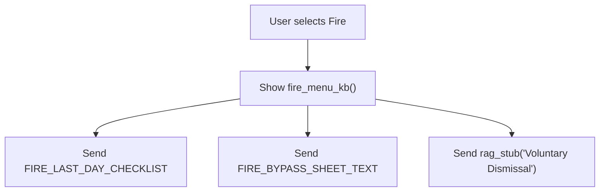

**Diagram sources**
- [fire.py:26-65](file://app/integrations/vk/handlers/fire.py#L26-L65)
- [content.py:75-94](file://app/domain/content.py#L75-L94)

**Section sources**
- [fire.py:1-65](file://app/integrations/vk/handlers/fire.py#L1-L65)
- [content.py:75-94](file://app/domain/content.py#L75-L94)

### Vacation Flow
The vacation flow supports:
- Template selection with entity context
- Disclaimer and file stub for leave application
- RAG stub for leave procedures

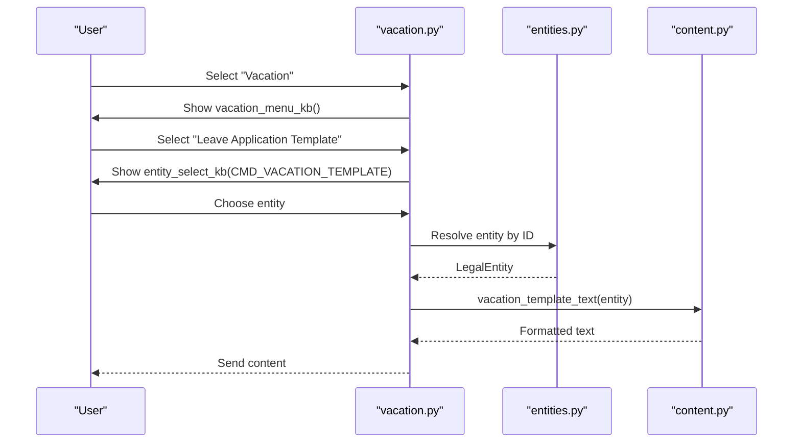

**Diagram sources**
- [vacation.py:29-76](file://app/integrations/vk/handlers/vacation.py#L29-L76)
- [entities.py:16-24](file://app/domain/entities.py#L16-L24)
- [content.py:99-104](file://app/domain/content.py#L99-L104)

**Section sources**
- [vacation.py:1-76](file://app/integrations/vk/handlers/vacation.py#L1-L76)
- [content.py:96-104](file://app/domain/content.py#L96-L104)

### Pay and Sections Flows
- Pay flow: Overtime and bonus conditions routed to RAG stubs
- Sections flow: Sick leave and probation routes to RAG stubs

These flows demonstrate consistent patterns of delegating content to domain modules and using stubs for future enhancements.

**Section sources**
- [pay.py:1-53](file://app/integrations/vk/handlers/pay.py#L1-L53)
- [sections.py:1-42](file://app/integrations/vk/handlers/sections.py#L1-L42)

### Fallback Handler
The fallback handler ensures users stay on track by responding to arbitrary text with a reminder to use menu buttons and returning to the main menu.

**Section sources**
- [fallback.py:1-18](file://app/integrations/vk/handlers/fallback.py#L1-L18)

## Dependency Analysis
The system exhibits low coupling and high cohesion:
- Handlers depend on domain content, entities, and topic hints but not on each other
- Keyboard builders encapsulate UI logic
- Single-state question handler processes free-text input efficiently
- Payload rules enable flexible routing based on JSON payloads

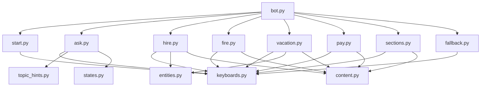

**Diagram sources**
- [bot.py:10-56](file://app/integrations/vk/bot.py#L10-L56)
- [start.py:1-42](file://app/integrations/vk/handlers/start.py#L1-L42)
- [ask.py:1-30](file://app/integrations/vk/handlers/ask.py#L1-L30)
- [hire.py:1-23](file://app/integrations/vk/handlers/hire.py#L1-L23)
- [fire.py:1-19](file://app/integrations/vk/handlers/fire.py#L1-L19)
- [vacation.py:1-22](file://app/integrations/vk/handlers/vacation.py#L1-L22)
- [pay.py:1-18](file://app/integrations/vk/handlers/pay.py#L1-L18)
- [sections.py:1-18](file://app/integrations/vk/handlers/sections.py#L1-L18)
- [fallback.py:1-18](file://app/integrations/vk/handlers/fallback.py#L1-L18)
- [keyboards.py:1-234](file://app/integrations/vk/keyboards.py#L1-L234)
- [states.py:1-9](file://app/integrations/vk/states.py#L1-L9)
- [content.py:1-140](file://app/domain/content.py#L1-L140)
- [entities.py:1-24](file://app/domain/entities.py#L1-L24)
- [topic_hints.py:1-109](file://app/domain/topic_hints.py#L1-L109)

**Section sources**
- [bot.py:1-56](file://app/integrations/vk/bot.py#L1-L56)
- [keyboards.py:1-234](file://app/integrations/vk/keyboards.py#L1-L234)
- [states.py:1-9](file://app/integrations/vk/states.py#L1-L9)
- [content.py:1-140](file://app/domain/content.py#L1-L140)
- [entities.py:1-24](file://app/domain/entities.py#L1-L24)
- [topic_hints.py:1-109](file://app/domain/topic_hints.py#L1-L109)

## Performance Considerations
- Content retrieval is constant-time string concatenations and lookups
- Keyboard generation is lightweight and cached as JSON
- Single-state handler eliminates complex state management overhead
- Topic hint detection uses efficient keyword matching for fast response times
- Handler logic remains thin, minimizing CPU overhead and improving responsiveness
- RAG integration handles heavy computation asynchronously

## Troubleshooting Guide
Common issues and resolutions:
- Missing or invalid entity ID: Handlers validate entity presence and return user-friendly messages with navigation back to previous steps
- Empty question input: Ask handler validates free text and prompts users to re-enter questions
- RAG processing delays: Typing indicators provide feedback during asynchronous processing
- Session expiration: State clearing prevents stale contexts; handlers guide users to restart flows
- Unmatched text input: Fallback handler redirects users to the main menu with clear guidance

Operational tips:
- Verify VK access token and group ID in environment settings
- Ensure handler registration order is preserved to avoid unintended routing
- Monitor logs for state management errors during question processing
- Test topic hint detection with various question formulations

**Section sources**
- [ask.py:51-90](file://app/integrations/vk/handlers/ask.py#L51-L90)
- [hire.py:44-52](file://app/integrations/vk/handlers/hire.py#L44-L52)
- [vacation.py:51-60](file://app/integrations/vk/handlers/vacation.py#L51-L60)
- [fallback.py:9-12](file://app/integrations/vk/handlers/fallback.py#L9-L12)
- [config.py:4-9](file://app/config.py#L4-L9)

## Conclusion
The Domain Content Management system successfully separates content from presentation, ensuring maintainable and scalable HR bot functionality. By centralizing content definitions, enforcing consistent entity handling, and using thin handlers with intelligent scenario detection, the system provides a solid foundation for future enhancements, including integration with a knowledge base and expanded HR workflows. The transition from multi-step HR request processing to free-text question handling via RAG integration maintains system reliability while improving user experience and reducing complexity.