# Employment Lifecycle Management

<cite>
**Referenced Files in This Document**
- [app/domain/entities.py](file://app/domain/entities.py)
- [app/domain/content.py](file://app/domain/content.py)
- [app/integrations/vk/bot.py](file://app/integrations/vk/bot.py)
- [app/integrations/vk/states.py](file://app/integrations/vk/states.py)
- [app/integrations/vk/keyboards.py](file://app/integrations/vk/keyboards.py)
- [app/integrations/vk/handlers/start.py](file://app/integrations/vk/handlers/start.py)
- [app/integrations/vk/handlers/hire.py](file://app/integrations/vk/handlers/hire.py)
- [app/integrations/vk/handlers/fire.py](file://app/integrations/vk/handlers/fire.py)
- [app/integrations/vk/handlers/vacation.py](file://app/integrations/vk/handlers/vacation.py)
- [app/integrations/vk/handlers/pay.py](file://app/integrations/vk/handlers/pay.py)
- [app/integrations/vk/handlers/sections.py](file://app/integrations/vk/handlers/sections.py)
- [app/integrations/vk/handlers/ask.py](file://app/integrations/vk/handlers/ask.py)
- [app/integrations/vk/handlers/fallback.py](file://app/integrations/vk/handlers/fallback.py)
- [app/integrations/vk/rules.py](file://app/integrations/vk/rules.py)
- [app/config.py](file://app/config.py)
</cite>

## Update Summary
**Changes Made**
- Enhanced vacation workflow with new two-step selection process (vacation type selection before entity selection)
- Added vacation_type handler and vacation_type_kb keyboard builder
- Updated vacation template handler to support vacation type parameter
- Modified vacation content function to accept and process vacation type parameter
- Updated handler registration order to maintain proper matching precedence
- Enhanced entity selection keyboard to pass vacation type through extra_payload

## Table of Contents
1. [Introduction](#introduction)
2. [Project Structure](#project-structure)
3. [Core Components](#core-components)
4. [Architecture Overview](#architecture-overview)
5. [Detailed Component Analysis](#detailed-component-analysis)
6. [Dependency Analysis](#dependency-analysis)
7. [Performance Considerations](#performance-considerations)
8. [Troubleshooting Guide](#troubleshooting-guide)
9. [Conclusion](#conclusion)

## Introduction
This document describes the Employment Lifecycle Management system implemented as a VKontakte chatbot. The system automates core HR tasks across the employee lifecycle: hiring, onboarding, employment termination, vacation requests, payroll questions, sick leave, and probation periods. It provides structured menus, multi-step dialogs, and standardized content templates while maintaining a clean separation between UI, business logic, and domain data. The system focuses exclusively on core HR operations without HR request integration or external communication workflows.

## Project Structure
The project follows a layered architecture:
- Domain layer: reusable entities and static content
- Integration layer: VK bot wiring, keyboards, handlers, and state management
- Configuration: environment-driven settings

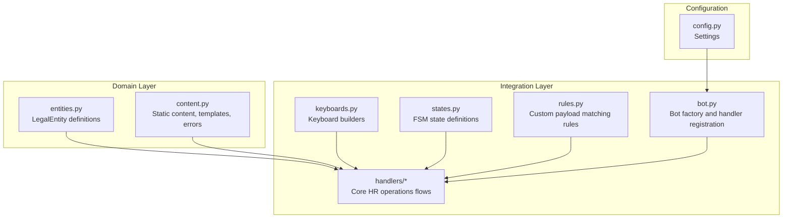

**Diagram sources**
- [app/domain/entities.py:1-24](file://app/domain/entities.py#L1-L24)
- [app/domain/content.py:1-146](file://app/domain/content.py#L1-L146)
- [app/integrations/vk/bot.py:1-56](file://app/integrations/vk/bot.py#L1-L56)
- [app/integrations/vk/keyboards.py:1-265](file://app/integrations/vk/keyboards.py#L1-L265)
- [app/integrations/vk/states.py:1-9](file://app/integrations/vk/states.py#L1-L9)
- [app/integrations/vk/rules.py:1-31](file://app/integrations/vk/rules.py#L1-L31)
- [app/config.py:1-9](file://app/config.py#L1-L9)

**Section sources**
- [app/domain/entities.py:1-24](file://app/domain/entities.py#L1-L24)
- [app/domain/content.py:1-146](file://app/domain/content.py#L1-L146)
- [app/integrations/vk/bot.py:1-56](file://app/integrations/vk/bot.py#L1-L56)
- [app/integrations/vk/keyboards.py:1-265](file://app/integrations/vk/keyboards.py#L1-L265)
- [app/integrations/vk/states.py:1-9](file://app/integrations/vk/states.py#L1-L9)
- [app/integrations/vk/rules.py:1-31](file://app/integrations/vk/rules.py#L1-L31)
- [app/config.py:1-9](file://app/config.py#L1-L9)

## Core Components
- LegalEntity and entity registry: central identifiers for Russian legal entities used across hiring and vacation flows.
- Static content and templates: standardized messages, checklists, and placeholders for documents and RAG stubs.
- VK bot factory: wires handlers and state dispensation to a vkbottle Bot instance.
- Keyboard builders: reusable keyboards for main menu, entity selection, vacation type selection, and multi-step dialogs.
- Handler modules: feature-specific flows for hire, fire, vacation, pay, sick leave, probation, ask-a-question, and fallback.
- Custom payload rules: specialized matching for complex payload structures.

**Section sources**
- [app/domain/entities.py:8-24](file://app/domain/entities.py#L8-L24)
- [app/domain/content.py:10-146](file://app/domain/content.py#L10-L146)
- [app/integrations/vk/bot.py:42-56](file://app/integrations/vk/bot.py#L42-L56)
- [app/integrations/vk/keyboards.py:75-265](file://app/integrations/vk/keyboards.py#L75-L265)
- [app/integrations/vk/handlers/hire.py:32-98](file://app/integrations/vk/handlers/hire.py#L32-L98)
- [app/integrations/vk/handlers/fire.py:28-74](file://app/integrations/vk/handlers/fire.py#L28-L74)
- [app/integrations/vk/handlers/vacation.py:30-105](file://app/integrations/vk/handlers/vacation.py#L30-L105)
- [app/integrations/vk/handlers/pay.py:24-46](file://app/integrations/vk/handlers/pay.py#L24-L46)
- [app/integrations/vk/handlers/sections.py:24-35](file://app/integrations/vk/handlers/sections.py#L24-L35)
- [app/integrations/vk/handlers/ask.py:38-90](file://app/integrations/vk/handlers/ask.py#L38-L90)
- [app/integrations/vk/handlers/fallback.py:15-18](file://app/integrations/vk/handlers/fallback.py#L15-L18)
- [app/integrations/vk/rules.py:11-31](file://app/integrations/vk/rules.py#L11-L31)

## Architecture Overview
The system uses a modular handler architecture with explicit ordering and state management:
- Handlers are registered in a specific order to ensure proper matching precedence.
- Multi-step dialogs use a shared state dispenser to persist user context.
- Content is centralized in domain modules to keep handlers thin and maintainable.
- Focus remains on core HR operations without external communication workflows.
- Custom payload rules enable sophisticated matching for complex workflows.

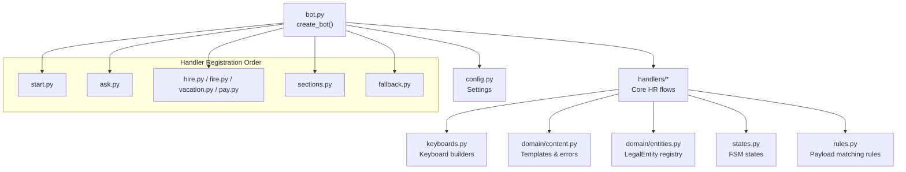

**Diagram sources**
- [app/integrations/vk/bot.py:42-56](file://app/integrations/vk/bot.py#L42-L56)
- [app/integrations/vk/handlers/start.py:31-42](file://app/integrations/vk/handlers/start.py#L31-L42)
- [app/integrations/vk/handlers/ask.py:38-90](file://app/integrations/vk/handlers/ask.py#L38-L90)
- [app/integrations/vk/handlers/hire.py:32-98](file://app/integrations/vk/handlers/hire.py#L32-L98)
- [app/integrations/vk/handlers/fire.py:28-74](file://app/integrations/vk/handlers/fire.py#L28-L74)
- [app/integrations/vk/handlers/vacation.py:30-105](file://app/integrations/vk/handlers/vacation.py#L30-L105)
- [app/integrations/vk/handlers/pay.py:24-46](file://app/integrations/vk/handlers/pay.py#L24-L46)
- [app/integrations/vk/handlers/sections.py:24-35](file://app/integrations/vk/handlers/sections.py#L24-L35)
- [app/integrations/vk/handlers/fallback.py:15-18](file://app/integrations/vk/handlers/fallback.py#L15-L18)
- [app/integrations/vk/keyboards.py:75-265](file://app/integrations/vk/keyboards.py#L75-L265)
- [app/domain/content.py:10-146](file://app/domain/content.py#L10-L146)
- [app/domain/entities.py:8-24](file://app/domain/entities.py#L8-L24)
- [app/integrations/vk/states.py:4-9](file://app/integrations/vk/states.py#L4-L9)
- [app/integrations/vk/rules.py:11-31](file://app/integrations/vk/rules.py#L11-L31)
- [app/config.py:4-9](file://app/config.py#L4-L9)

## Detailed Component Analysis

### Legal Entities Registry
Centralized definition of legal entities used across hire and vacation flows. Provides both lookup by ID and enumeration for selection UIs.

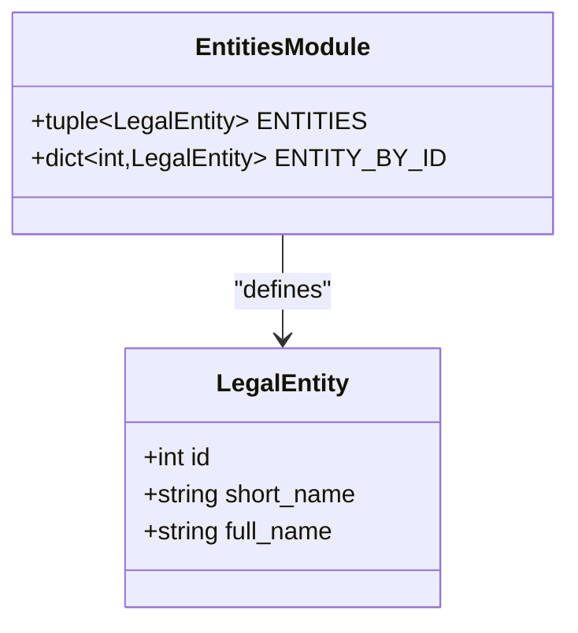

**Diagram sources**
- [app/domain/entities.py:8-24](file://app/domain/entities.py#L8-L24)

**Section sources**
- [app/domain/entities.py:8-24](file://app/domain/entities.py#L8-L24)

### Static Content and Templates
Centralized content for:
- Hire: document checklists, onboarding checklist, contract template
- Fire: last-day checklist, bypass sheet text
- Vacation: leave application template with vacation type support
- RAG stub: placeholder responses during knowledge base integration
- Error states: document unavailable, no answer, integration required

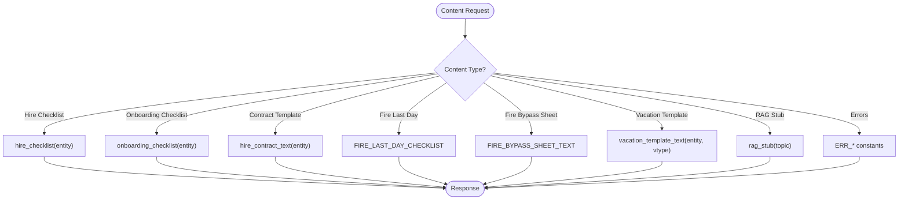

**Diagram sources**
- [app/domain/content.py:24-146](file://app/domain/content.py#L24-L146)

**Section sources**
- [app/domain/content.py:10-146](file://app/domain/content.py#L10-L146)

### VK Bot Factory and Handler Registration
Creates a vkbottle Bot instance, shares state dispenser with ask handlers, and loads labelers in a strict order to ensure correct matching precedence.

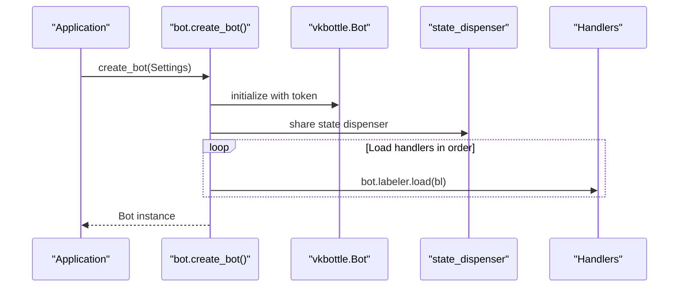

**Diagram sources**
- [app/integrations/vk/bot.py:42-56](file://app/integrations/vk/bot.py#L42-L56)

**Section sources**
- [app/integrations/vk/bot.py:24-56](file://app/integrations/vk/bot.py#L24-L56)

### Keyboard Builders
Provides reusable keyboards for:
- Main menu with seven sections
- Entity selection for hire and vacation
- Vacation type selection for leave application templates
- Action menus for hire, fire, vacation, pay
- Service row with Back/Home buttons

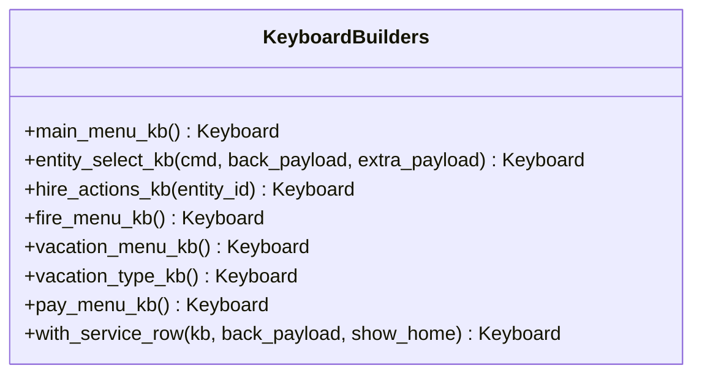

**Diagram sources**
- [app/integrations/vk/keyboards.py:75-265](file://app/integrations/vk/keyboards.py#L75-L265)

**Section sources**
- [app/integrations/vk/keyboards.py:13-265](file://app/integrations/vk/keyboards.py#L13-L265)

### Hiring Flow (S-10, S-11)
End-to-end flow for new hires:
- Select legal entity
- Choose action: checklist, contract template, or onboarding checklist
- Receive templated content with service buttons

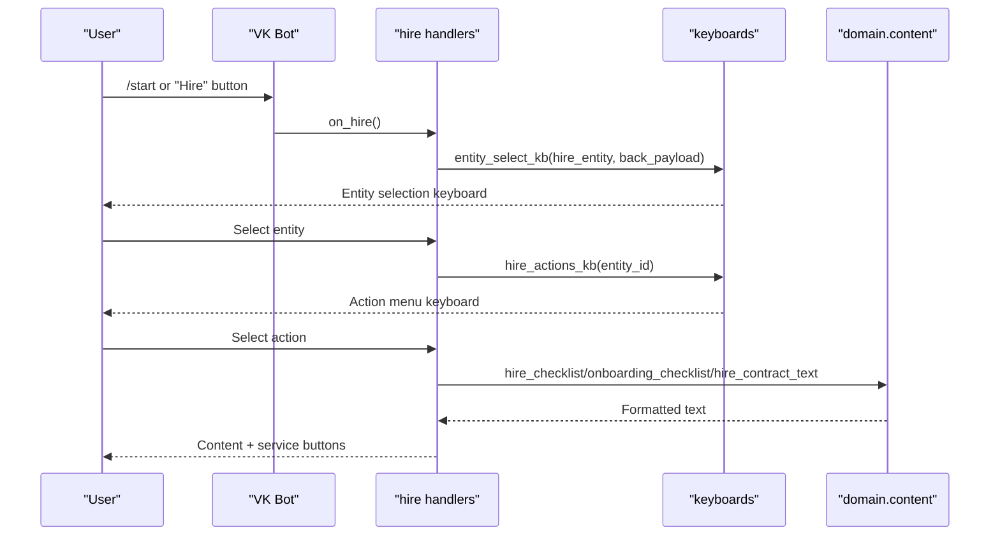

**Diagram sources**
- [app/integrations/vk/handlers/hire.py:32-98](file://app/integrations/vk/handlers/hire.py#L32-L98)
- [app/integrations/vk/keyboards.py:126-171](file://app/integrations/vk/keyboards.py#L126-L171)
- [app/domain/content.py:24-73](file://app/domain/content.py#L24-L73)

**Section sources**
- [app/integrations/vk/handlers/hire.py:26-98](file://app/integrations/vk/handlers/hire.py#L26-L98)
- [app/integrations/vk/keyboards.py:126-171](file://app/integrations/vk/keyboards.py#L126-L171)
- [app/domain/content.py:24-73](file://app/domain/content.py#L24-L73)

### Termination Flow (S-20, S-21b)
Flow for employment termination:
- Open fire menu
- Choose last-day checklist, bypass sheet, voluntary dismissal (RAG stub), or dismissal grounds

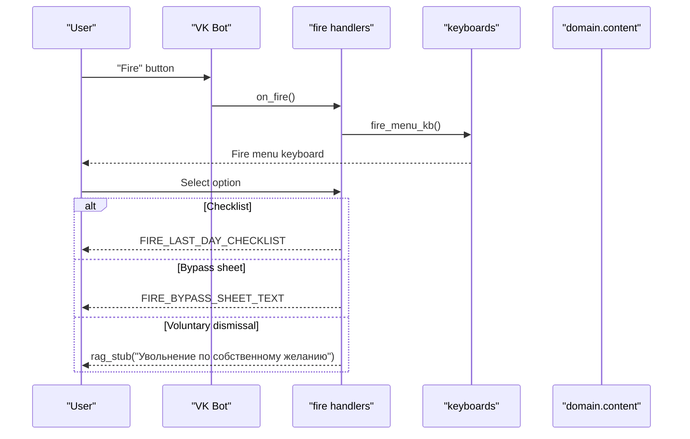

**Diagram sources**
- [app/integrations/vk/handlers/fire.py:28-74](file://app/integrations/vk/handlers/fire.py#L28-L74)
- [app/integrations/vk/keyboards.py:177-187](file://app/integrations/vk/keyboards.py#L177-L187)
- [app/domain/content.py:75-95](file://app/domain/content.py#L75-L95)

**Section sources**
- [app/integrations/vk/handlers/fire.py:24-74](file://app/integrations/vk/handlers/fire.py#L24-L74)
- [app/integrations/vk/keyboards.py:177-187](file://app/integrations/vk/keyboards.py#L177-L187)
- [app/domain/content.py:75-95](file://app/domain/content.py#L75-L95)

### Enhanced Vacation Flow (S-30)
Enhanced two-step flow for vacation requests:
- Open vacation menu
- Select vacation type (paid/unpaid)
- Select legal entity
- Receive template with type indicator and disclaimer

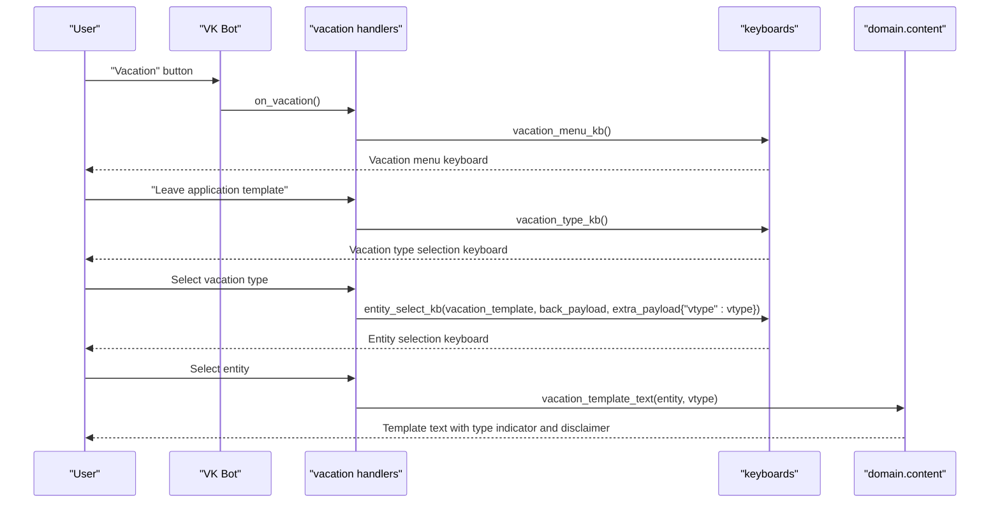

**Diagram sources**
- [app/integrations/vk/handlers/vacation.py:30-105](file://app/integrations/vk/handlers/vacation.py#L30-L105)
- [app/integrations/vk/keyboards.py:193-221](file://app/integrations/vk/keyboards.py#L193-L221)
- [app/domain/content.py:96-110](file://app/domain/content.py#L96-L110)

**Section sources**
- [app/integrations/vk/handlers/vacation.py:26-105](file://app/integrations/vk/handlers/vacation.py#L26-L105)
- [app/integrations/vk/keyboards.py:193-221](file://app/integrations/vk/keyboards.py#L193-L221)
- [app/domain/content.py:96-110](file://app/domain/content.py#L96-L110)

### Pay & Bonus Flow (S-40)
Flow for payroll questions:
- Open pay menu
- Choose overtime/weekend pay or bonus conditions (both RAG stubs)

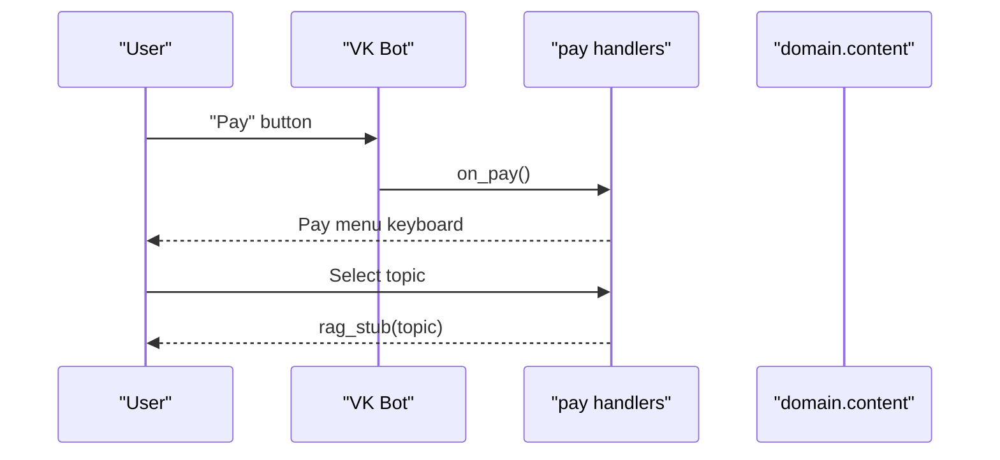

**Diagram sources**
- [app/integrations/vk/handlers/pay.py:24-46](file://app/integrations/vk/handlers/pay.py#L24-L46)
- [app/integrations/vk/keyboards.py:226-232](file://app/integrations/vk/keyboards.py#L226-L232)

**Section sources**
- [app/integrations/vk/handlers/pay.py:22-46](file://app/integrations/vk/handlers/pay.py#L22-L46)
- [app/integrations/vk/keyboards.py:226-232](file://app/integrations/vk/keyboards.py#L226-L232)

### Sick Leave and Probation Flows (S-50, S-60)
RAG-powered flows for:
- Sick leave/ELN procedures
- Probation period guidance

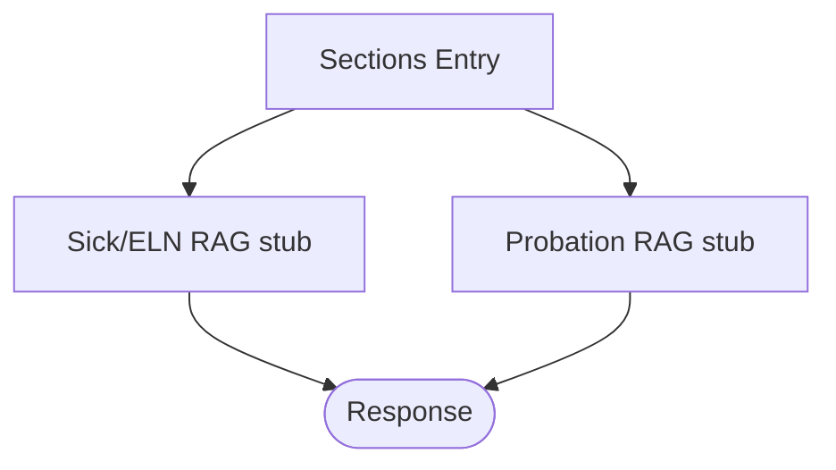

**Diagram sources**
- [app/integrations/vk/handlers/sections.py:24-35](file://app/integrations/vk/handlers/sections.py#L24-L35)

**Section sources**
- [app/integrations/vk/handlers/sections.py:22-35](file://app/integrations/vk/handlers/sections.py#L22-L35)

### Ask-A-Question Flow (Block 4, section 4.4)
- Sets a temporary state to prevent fallback from consuming free text
- Receives free text input and responds with a standardized RAG stub

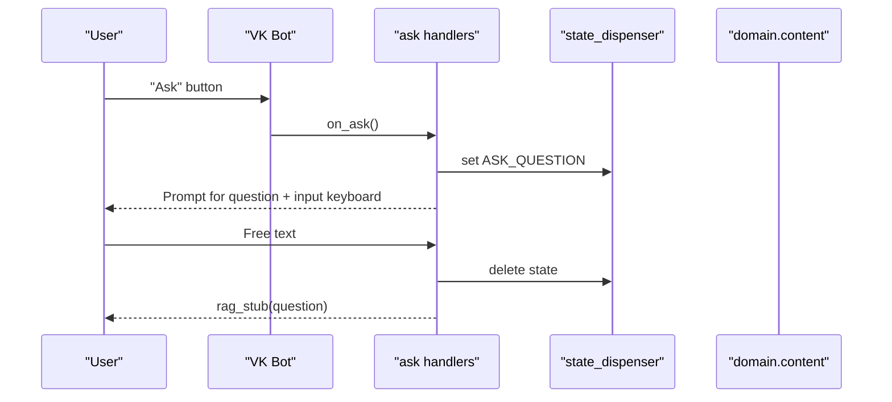

**Diagram sources**
- [app/integrations/vk/handlers/ask.py:38-90](file://app/integrations/vk/handlers/ask.py#L38-L90)
- [app/integrations/vk/states.py:7-9](file://app/integrations/vk/states.py#L7-L9)

**Section sources**
- [app/integrations/vk/handlers/ask.py:23-90](file://app/integrations/vk/handlers/ask.py#L23-L90)
- [app/integrations/vk/states.py:7-9](file://app/integrations/vk/states.py#L7-L9)

### Fallback Handler
Catches any unmatched text input and prompts the user to use menu buttons.

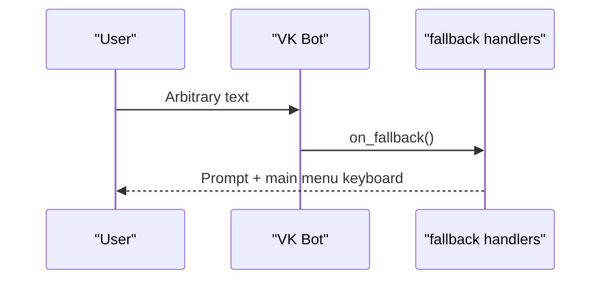

**Diagram sources**
- [app/integrations/vk/handlers/fallback.py:15-18](file://app/integrations/vk/handlers/fallback.py#L15-L18)
- [app/integrations/vk/keyboards.py:75-112](file://app/integrations/vk/keyboards.py#L75-L112)

**Section sources**
- [app/integrations/vk/handlers/fallback.py:15-18](file://app/integrations/vk/handlers/fallback.py#L15-L18)
- [app/integrations/vk/keyboards.py:75-112](file://app/integrations/vk/keyboards.py#L75-L112)

### Custom Payload Matching Rules
Enables sophisticated payload matching for complex workflows:
- PayloadCmdRule: matches messages with specific command payloads
- Supports extraction of additional payload data for handlers

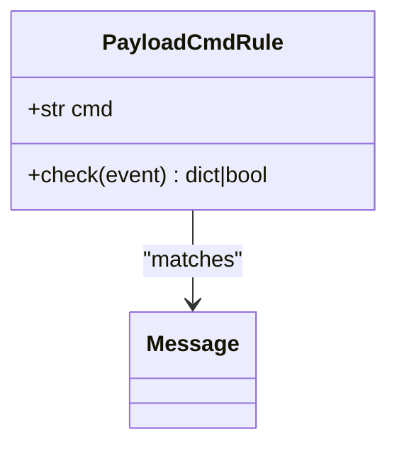

**Diagram sources**
- [app/integrations/vk/rules.py:11-31](file://app/integrations/vk/rules.py#L11-L31)

**Section sources**
- [app/integrations/vk/rules.py:11-31](file://app/integrations/vk/rules.py#L11-L31)

## Dependency Analysis
The system exhibits low coupling and high cohesion:
- Handlers depend on domain content and keyboards but remain thin.
- Shared state dispenser enables persistent multi-step dialogs.
- Strict handler registration order prevents unintended message routing.
- Custom payload rules enable sophisticated matching without complex handler logic.

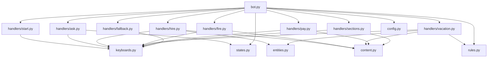

**Diagram sources**
- [app/integrations/vk/bot.py:42-56](file://app/integrations/vk/bot.py#L42-L56)
- [app/integrations/vk/handlers/start.py:31-42](file://app/integrations/vk/handlers/start.py#L31-L42)
- [app/integrations/vk/handlers/ask.py:38-90](file://app/integrations/vk/handlers/ask.py#L38-L90)
- [app/integrations/vk/handlers/hire.py:32-98](file://app/integrations/vk/handlers/hire.py#L32-L98)
- [app/integrations/vk/handlers/fire.py:28-74](file://app/integrations/vk/handlers/fire.py#L28-L74)
- [app/integrations/vk/handlers/vacation.py:30-105](file://app/integrations/vk/handlers/vacation.py#L30-L105)
- [app/integrations/vk/handlers/pay.py:24-46](file://app/integrations/vk/handlers/pay.py#L24-L46)
- [app/integrations/vk/handlers/sections.py:24-35](file://app/integrations/vk/handlers/sections.py#L24-L35)
- [app/integrations/vk/handlers/fallback.py:15-18](file://app/integrations/vk/handlers/fallback.py#L15-L18)
- [app/integrations/vk/keyboards.py:75-265](file://app/integrations/vk/keyboards.py#L75-L265)
- [app/domain/content.py:10-146](file://app/domain/content.py#L10-L146)
- [app/domain/entities.py:8-24](file://app/domain/entities.py#L8-L24)
- [app/integrations/vk/states.py:4-9](file://app/integrations/vk/states.py#L4-L9)
- [app/integrations/vk/rules.py:11-31](file://app/integrations/vk/rules.py#L11-L31)
- [app/config.py:4-9](file://app/config.py#L4-L9)

**Section sources**
- [app/integrations/vk/bot.py:24-56](file://app/integrations/vk/bot.py#L24-L56)

## Performance Considerations
- Handler registration order ensures efficient routing and avoids unnecessary fallback matching.
- Keyboard building is lightweight and reused across flows to minimize overhead.
- State dispenser is used sparingly and cleared promptly to avoid memory bloat.
- Centralized content reduces duplication and improves cache locality for repeated messages.
- Custom payload rules provide efficient matching without complex handler logic.

## Troubleshooting Guide
Common issues and resolutions:
- Handler precedence: If a message is not recognized, verify the handler order in the bot factory and ensure fallback is last.
- State persistence: If multi-step dialogs fail, confirm the shared state dispenser is attached to the bot and state transitions occur in the correct order.
- Entity selection: If entity selection fails, verify the payload command and entity ID mapping.
- Vacation type handling: If vacation type selection fails, verify the vacation_type payload structure and extra_payload forwarding.
- Content availability: For document templates, ensure the document storage integration is configured; in the meantime, the system returns a standardized placeholder message.
- Free-text input: For ask-a-question, ensure the state is set before accepting free text to prevent fallback consumption.
- Payload matching: For custom payload rules, ensure the JSON payload structure matches the expected format.

**Section sources**
- [app/integrations/vk/bot.py:24-56](file://app/integrations/vk/bot.py#L24-L56)
- [app/integrations/vk/handlers/ask.py:51-90](file://app/integrations/vk/handlers/ask.py#L51-L90)
- [app/integrations/vk/handlers/vacation.py:53-68](file://app/integrations/vk/handlers/vacation.py#L53-L68)
- [app/domain/content.py:124-146](file://app/domain/content.py#L124-L146)
- [app/integrations/vk/rules.py:21-31](file://app/integrations/vk/rules.py#L21-L31)

## Conclusion
The Employment Lifecycle Management system provides a robust, extensible foundation for automating core HR-related workflows in a VKontakte chatbot. Its modular design, centralized content, and state-managed dialogs enable clear user experiences while keeping business logic maintainable. The system focuses exclusively on essential HR operations (hiring, firing, vacation, payment, sick leave, probation) without external communication workflows, providing a streamlined and efficient solution for employee lifecycle management.

The recent enhancement to the vacation workflow demonstrates the system's flexibility and ability to evolve with business requirements. The addition of the two-step selection process (vacation type selection before entity selection) improves user experience by providing clearer context and more precise template generation. The implementation maintains backward compatibility while extending functionality through well-defined interfaces and reusable components.