# HR Request Processing System

<cite>
**Referenced Files in This Document**
- [bot.py](file://app/integrations/vk/bot.py)
- [hr_request.py](file://app/integrations/vk/handlers/hr_request.py)
- [states.py](file://app/integrations/vk/states.py)
- [keyboards.py](file://app/integrations/vk/keyboards.py)
- [rules.py](file://app/integrations/vk/rules.py)
- [entities.py](file://app/domain/entities.py)
- [content.py](file://app/domain/content.py)
- [start.py](file://app/integrations/vk/handlers/start.py)
- [fallback.py](file://app/integrations/vk/handlers/fallback.py)
- [sections.py](file://app/integrations/vk/handlers/sections.py)
- [hire.py](file://app/integrations/vk/handlers/hire.py)
- [fire.py](file://app/integrations/vk/handlers/fire.py)
- [vacation.py](file://app/integrations/vk/handlers/vacation.py)
- [polling_vk.py](file://scripts/polling_vk.py)
- [config.py](file://app/config.py)
- [docker-compose.yml](file://docker-compose.yml)
- [pyproject.toml](file://pyproject.toml)
</cite>

## Update Summary
**Changes Made**
- Added documentation for new FR-11 'Vacation schedule navigator' feature with on_vacation_schedule handler
- Added documentation for new FR-12 'Dismissal grounds' feature with on_fire_grounds handler
- Updated keyboard navigation system to include new command payloads CMD_VACATION_SCHEDULE and CMD_FIRE_GROUNDS
- Enhanced handler registration flow to accommodate new RAG stub features
- Updated state management diagrams to reflect new multi-step workflows

## Table of Contents
1. [Introduction](#introduction)
2. [System Architecture](#system-architecture)
3. [Core Components](#core-components)
4. [HR Request Processing Flow](#hr-request-processing-flow)
5. [Domain Model](#domain-model)
6. [Integration Layer](#integration-layer)
7. [State Management](#state-management)
8. [Keyboard Navigation System](#keyboard-navigation-system)
9. [Content Management](#content-management)
10. [Error Handling and Validation](#error-handling-and-validation)
11. [Deployment and Infrastructure](#deployment-and-infrastructure)
12. [Testing Strategy](#testing-strategy)
13. [Performance Considerations](#performance-considerations)
14. [Troubleshooting Guide](#troubleshooting-guide)
15. [Conclusion](#conclusion)

## Introduction

The HR Request Processing System is a comprehensive VKontakte (VK) bot designed to streamline HR processes for Cafetera coffee shop chains. The system provides automated assistance for employee onboarding, offboarding, leave management, payroll inquiries, and general HR questions through an intuitive conversational interface.

The bot supports multiple legal entities ( ООО «Кофейни Кафетера», ООО «Кафетера Рус», ИП Кафетера, ООО «Кафетера Групп») and offers structured workflows for various HR scenarios. Built with modern Python frameworks and designed for scalability, the system integrates seamlessly with VK's messaging platform while maintaining clean separation of concerns across domain logic, presentation, and integration layers.

**Updated** Added support for new vacation schedule navigator (FR-11) and dismissal grounds (FR-12) RAG stub features, enhancing the system's capability to handle complex HR workflows with intelligent navigation and contextual assistance.

## System Architecture

The HR Request Processing System follows a layered architecture pattern with clear separation between presentation, business logic, and data management:

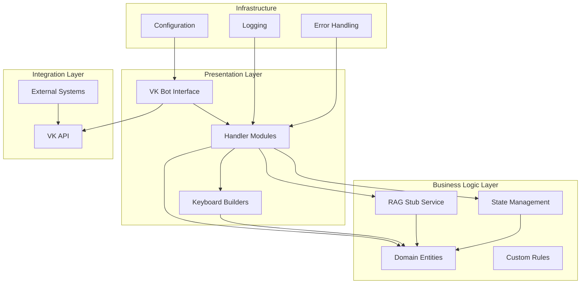

**Diagram sources**
- [bot.py:1-56](file://app/integrations/vk/bot.py#L1-L56)
- [hr_request.py:1-305](file://app/integrations/vk/handlers/hr_request.py#L1-L305)
- [entities.py:1-24](file://app/domain/entities.py#L1-L24)
- [content.py:127-136](file://app/domain/content.py#L127-L136)

The architecture emphasizes modularity through separate handler modules for different HR functions, shared state management for multi-step dialogs, and reusable keyboard builders for consistent user experience. The addition of RAG stub features enhances the system's ability to provide contextual assistance while maintaining clean separation of concerns.

## Core Components

### VK Bot Factory

The central bot factory creates and configures the VK bot instance with all registered handlers and state management capabilities.

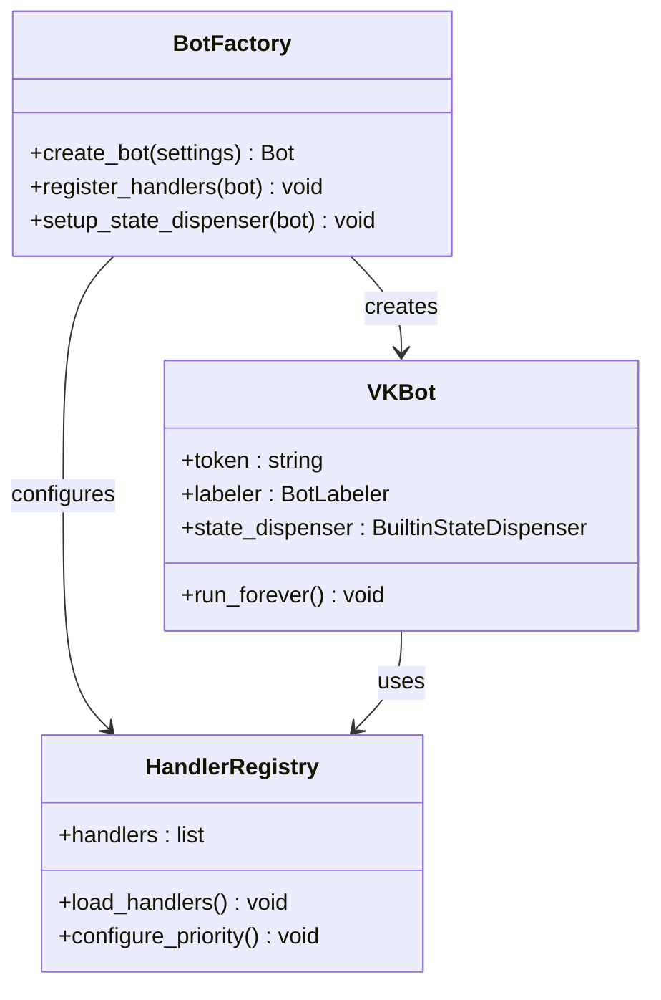

**Diagram sources**
- [bot.py:44-56](file://app/integrations/vk/bot.py#L44-L56)
- [bot.py:31-41](file://app/integrations/vk/bot.py#L31-L41)

### Multi-Step Dialog System

The system implements sophisticated state management for complex multi-step workflows, particularly the HR request processing flow.

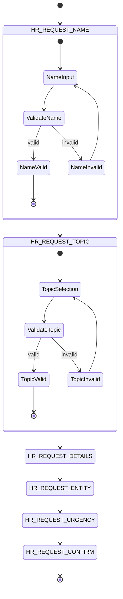

**Diagram sources**
- [states.py:4-17](file://app/integrations/vk/states.py#L4-L17)
- [hr_request.py:137-176](file://app/integrations/vk/handlers/hr_request.py#L137-L176)

**Section sources**
- [bot.py:1-56](file://app/integrations/vk/bot.py#L1-L56)
- [states.py:1-17](file://app/integrations/vk/states.py#L1-L17)

## HR Request Processing Flow

The HR request processing system implements a six-step conversational flow designed to capture comprehensive employee requests efficiently:

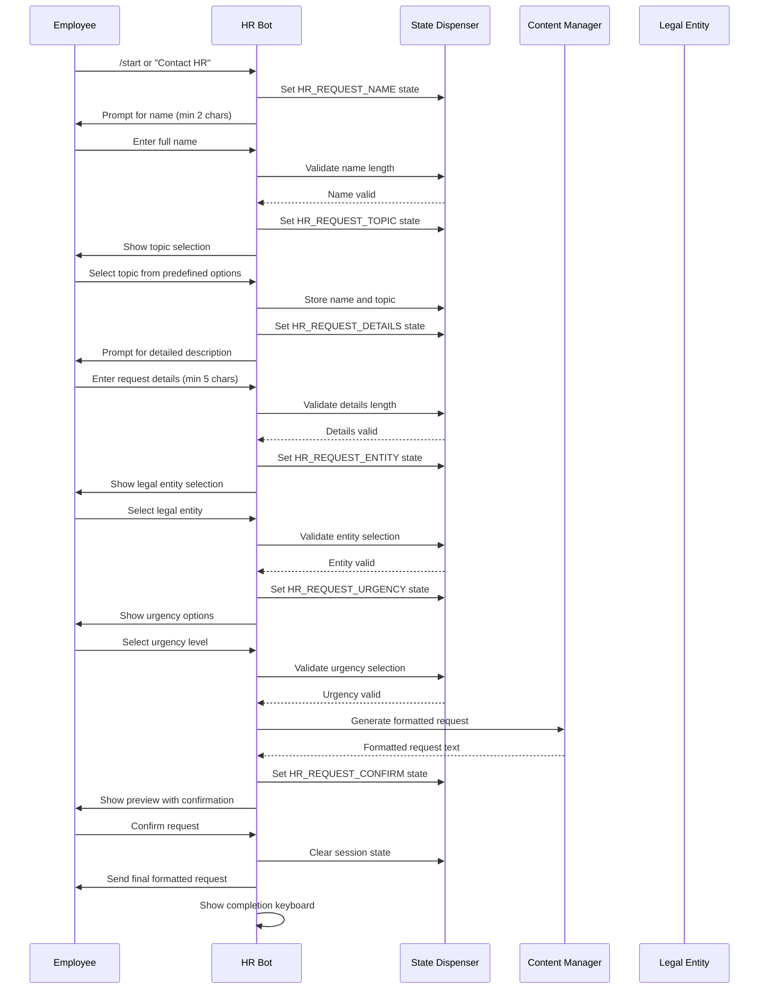

**Diagram sources**
- [hr_request.py:69-305](file://app/integrations/vk/handlers/hr_request.py#L69-L305)
- [content.py:158-177](file://app/domain/content.py#L158-L177)
- [entities.py:8-24](file://app/domain/entities.py#L8-L24)

### Step-by-Step Breakdown

**Step 1: Name Collection**
- Validates minimum 2-character requirement
- Provides navigation to main menu
- Stores validated name in state context

**Step 2: Topic Selection**
- Presents predefined HR topic options
- Ensures selection from approved list
- Maintains previous context data

**Step 3: Detail Capture**
- Requires minimum 5 characters for description
- Allows navigation back to previous steps
- Preserves all collected information

**Step 4: Legal Entity Selection**
- Supports four Cafetera legal entities
- Implements NFR-7 requirement for full names
- Handles entity validation and mapping

**Step 5: Urgency Level**
- Provides urgent vs normal priority options
- Maintains complete context for final formatting

**Step 6: Confirmation and Delivery**
- Generates structured request format (FR-16)
- Allows final review and correction
- Clears session state upon completion

**Section sources**
- [hr_request.py:1-305](file://app/integrations/vk/handlers/hr_request.py#L1-L305)
- [content.py:158-177](file://app/domain/content.py#L158-L177)

## Domain Model

The domain layer defines the core business entities and their relationships, focusing on legal entities and static content management.

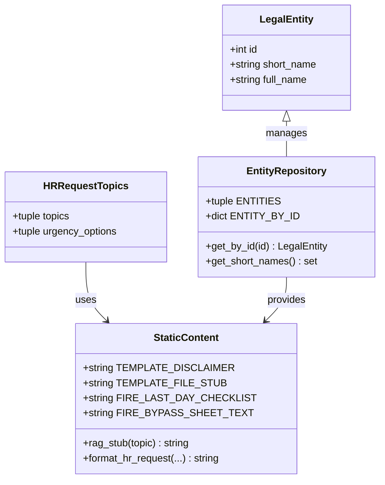

**Diagram sources**
- [entities.py:8-24](file://app/domain/entities.py#L8-L24)
- [content.py:109-137](file://app/domain/content.py#L109-L137)
- [content.py:127-136](file://app/domain/content.py#L127-L136)

### Legal Entity Management

The system supports four distinct legal entities, each with specific operational characteristics:

| Entity ID | Short Name | Full Legal Name |
|-----------|------------|----------------|
| 1 | Кофейни Кафетера | ООО «Кофейни Кафетера» |
| 2 | Кафетера Рус | ООО «Кафетера Рус» |
| 3 | ИП Кафетера | ИП Кафетера |
| 4 | Кафетера Групп | ООО «Кафетера Групп» |

**Section sources**
- [entities.py:1-24](file://app/domain/entities.py#L1-L24)

## Integration Layer

The integration layer handles external system communications and platform-specific implementations.

### VK Platform Integration

The system integrates with VKontakte's bot platform through the vkbottle framework, implementing comprehensive message handling and keyboard management.

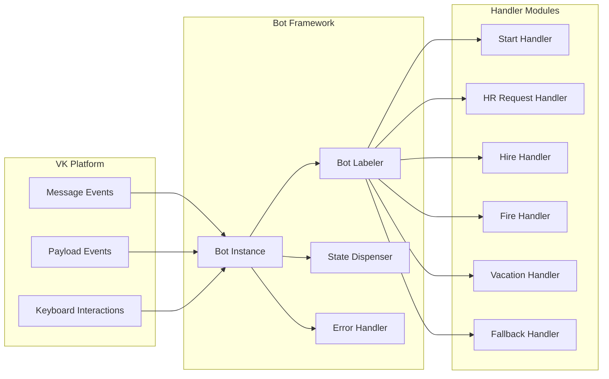

**Diagram sources**
- [bot.py:10-20](file://app/integrations/vk/bot.py#L10-L20)
- [bot.py:44-56](file://app/integrations/vk/bot.py#L44-L56)

### Handler Priority and Registration

The system maintains strict handler registration order to ensure proper message routing and conflict resolution. The new RAG stub features integrate seamlessly with the existing handler architecture.

**Section sources**
- [bot.py:24-41](file://app/integrations/vk/bot.py#L24-L41)

## State Management

The state management system implements finite state machine patterns for complex multi-step interactions, particularly the HR request workflow.

### State Machine Implementation

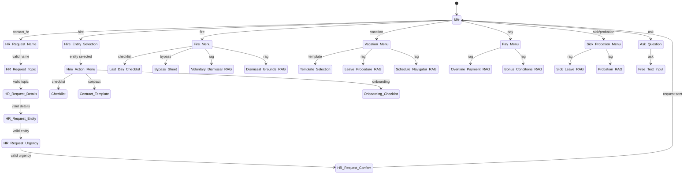

**Diagram sources**
- [states.py:4-17](file://app/integrations/vk/states.py#L4-L17)
- [hr_request.py:69-305](file://app/integrations/vk/handlers/hr_request.py#L69-L305)

**Section sources**
- [states.py:1-17](file://app/integrations/vk/states.py#L1-L17)
- [hr_request.py:49-64](file://app/integrations/vk/handlers/hr_request.py#L49-L64)

## Keyboard Navigation System

The keyboard system provides consistent navigation patterns across all bot interactions, ensuring intuitive user experience.

### Navigation Patterns

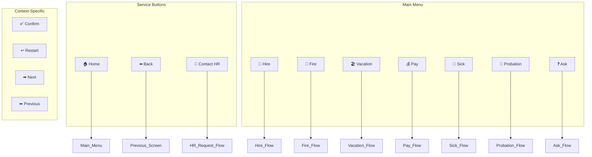

**Diagram sources**
- [keyboards.py:62-84](file://app/integrations/vk/keyboards.py#L62-L84)
- [keyboards.py:89-132](file://app/integrations/vk/keyboards.py#L89-L132)

### Keyboard Builder Functions

The system provides specialized keyboard builders for different interaction contexts:

| Keyboard Type | Purpose | Key Features |
|---------------|---------|--------------|
| `main_menu_kb()` | Primary navigation | 7 functional sections, service buttons |
| `hr_topic_kb()` | HR request topics | Two-column layout, back navigation |
| `hr_entity_kb()` | Legal entity selection | Compact layout, short names |
| `hr_urgency_kb()` | Priority selection | Binary urgency options |
| `hr_confirm_kb()` | Final confirmation | Dual-action buttons |
| `entity_select_kb()` | Context-specific selection | Dynamic payload handling |
| `fire_menu_kb()` | **Updated** Fire section actions | Includes dismissal grounds RAG (FR-12) |
| `vacation_menu_kb()` | **Updated** Vacation section actions | Includes schedule navigator RAG (FR-11) |

**Section sources**
- [keyboards.py:1-295](file://app/integrations/vk/keyboards.py#L1-L295)

### Command Payload Definitions

The system uses standardized command payloads for consistent navigation across all features:

| Feature Category | Command Payload | Description | FR Reference |
|------------------|----------------|-------------|--------------|
| Fire Actions | `CMD_FIRE_GROUNDS` | **New** Dismissal grounds RAG stub | FR-12 |
| Fire Actions | `CMD_FIRE_RAG` | Voluntary dismissal RAG stub | FR-5 |
| Fire Actions | `CMD_FIRE_CHECKLIST` | Last day checklist | FR-6 |
| Fire Actions | `CMD_FIRE_BYPASS` | Bypass sheet | S-21b |
| Vacation Actions | `CMD_VACATION_SCHEDULE` | **New** Schedule navigator RAG stub | FR-11 |
| Vacation Actions | `CMD_VACATION_RAG` | Leave procedure RAG stub | FR-7 |
| Vacation Actions | `CMD_VACATION_SELECT` | Entity selection for templates | FR-8 |
| Vacation Actions | `CMD_VACATION_TEMPLATE` | Template generation | FR-8 |
| Pay Actions | `CMD_PAY_OVERTIME` | Overtime payment conditions | FR-9 |
| Pay Actions | `CMD_PAY_BONUS` | Bonus conditions | FR-10 |

**Section sources**
- [keyboards.py:35-59](file://app/integrations/vk/keyboards.py#L35-L59)

## Content Management

The content management system centralizes all static text content, ensuring consistency and maintainability across the bot interface.

### Content Categories

```mermaid
graph TD
subgraph "Content Types"
StaticText[Static Text Content]
DynamicTemplates[Dynamic Templates]
ErrorMessages[Error Messages]
Disclaimers[Legal Disclaimers]
RAGStubs[RAG Stub Service]
end
subgraph "Static Content"
HireChecklist[Hire Checklists]
OnboardingChecklist[Onboarding Lists]
FireChecklist[Fire Checklists]
VacationTemplate[Vacation Templates]
ContractTemplate[Contract Templates]
end
subgraph "Dynamic Content"
HRRequestFormat[HR Request Formatter]
EntitySpecific[Entity-Specific Content]
ValidationMessages[Validation Responses]
end
subgraph "RAG Stubs"
VoluntaryDismissal[Voluntary Dismissal]
DismissalGrounds[Dismissal Grounds]
LeaveProcedure[Leave Procedure]
VacationSchedule[Vacation Schedule]
OvertimePayment[Overtime Payment]
BonusConditions[Bonus Conditions]
SickLeave[Sick Leave]
Probation[Probation]
end
subgraph "Error Handling"
DocumentUnavailable[Document Unavailable]
NoAnswerFound[No Answer Found]
IntegrationRequired[Integration Required]
end
StaticText --> HireChecklist
StaticText --> OnboardingChecklist
StaticText --> FireChecklist
StaticText --> VacationTemplate
StaticText --> ContractTemplate
DynamicTemplates --> HRRequestFormat
DynamicTemplates --> EntitySpecific
DynamicTemplates --> ValidationMessages
RAGStubs --> VoluntaryDismissal
RAGStubs --> DismissalGrounds
RAGStubs --> LeaveProcedure
RAGStubs --> VacationSchedule
RAGStubs --> OvertimePayment
RAGStubs --> BonusConditions
RAGStubs --> SickLeave
RAGStubs --> Probation
ErrorMessages --> DocumentUnavailable
ErrorMessages --> NoAnswerFound
ErrorMessages --> IntegrationRequired
```

**Diagram sources**
- [content.py:12-177](file://app/domain/content.py#L12-L177)
- [content.py:127-136](file://app/domain/content.py#L127-L136)

### Content Formatting Standards

The system implements standardized formatting for all generated content:

**HR Request Format (FR-16)**:
- Structured header with section dividers
- Personal information fields
- Entity identification
- Topic categorization
- Urgency indication
- Detailed request description
- Copy-ready formatting

**RAG Stub Standard (FR-3)**:
- Standardized placeholder message format
- Topic-specific content insertion
- Knowledge base status indicator
- HR fallback guidance
- Emoji-based visual cues

**Section sources**
- [content.py:1-177](file://app/domain/content.py#L1-177)

## Error Handling and Validation

The system implements comprehensive error handling and input validation to ensure robust operation and user-friendly interactions.

### Validation Strategies

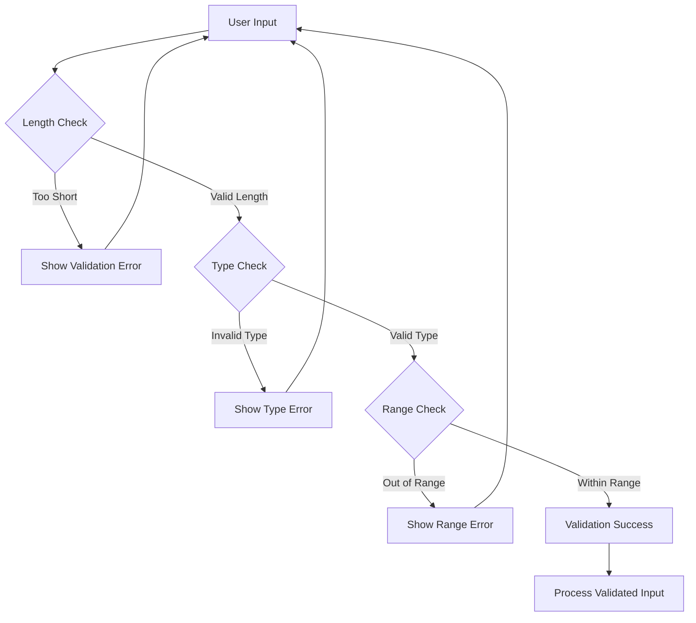

### Error Message Categories

| Error Type | Trigger Condition | User Response |
|------------|-------------------|---------------|
| Name Validation | Less than 2 characters | Re-enter name |
| Topic Validation | Not in predefined list | Select from buttons |
| Detail Validation | Less than 5 characters | Expand description |
| Entity Validation | Not in entity list | Select from buttons |
| Session Timeout | State expiration | Start over |
| System Error | Internal failures | Contact support |
| RAG Stub Access | Knowledge base unavailable | Contact HR fallback |

**Section sources**
- [hr_request.py:140-142](file://app/integrations/vk/handlers/hr_request.py#L140-L142)
- [hr_request.py:158-162](file://app/integrations/vk/handlers/hr_request.py#L158-L162)
- [hr_request.py:184-186](file://app/integrations/vk/handlers/hr_request.py#L184-L186)

## Deployment and Infrastructure

The system supports containerized deployment with integrated infrastructure for AI-powered features.

### Docker Compose Configuration

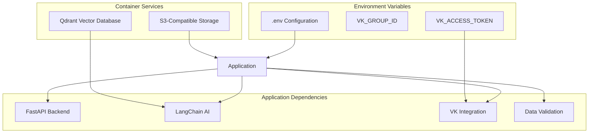

**Diagram sources**
- [docker-compose.yml:1-34](file://docker-compose.yml#L1-L34)
- [pyproject.toml:7-22](file://pyproject.toml#L7-L22)

### Development Environment Setup

The system provides flexible development configurations supporting multiple AI backends:

**Core Dependencies**:
- FastAPI >= 0.115.0 (Web framework)
- vkbottle >= 4.7.0 (VK integration)
- pydantic >= 2.8.0 (Data validation)
- pytest >= 8.3.0 (Testing framework)

**Optional AI Backends**:
- Ollama-compatible models (local inference)
- OpenAI-compatible APIs (cloud inference)
- Qdrant vector database (RAG support)
- MinIO S3 storage (document management)

**Section sources**
- [docker-compose.yml:1-34](file://docker-compose.yml#L1-L34)
- [pyproject.toml:1-56](file://pyproject.toml#L1-L56)

## Testing Strategy

The system implements comprehensive testing across all functional areas to ensure reliability and maintainability.

### Test Coverage Areas

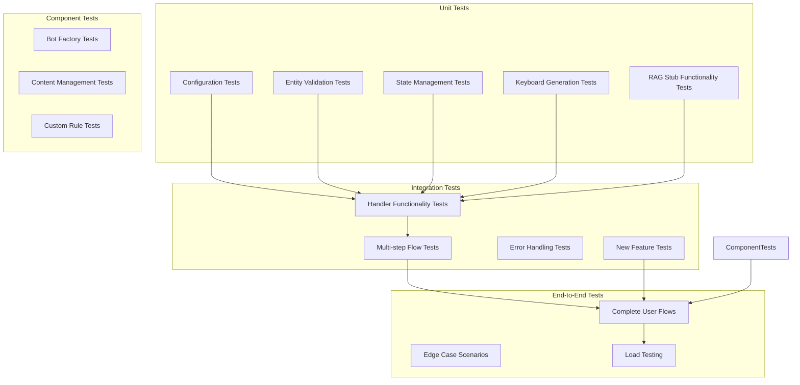

### Test Execution Configuration

The testing framework supports:
- Asynchronous test execution
- Mock-based integration testing
- State isolation between test runs
- Comprehensive coverage reporting

**Updated** Added comprehensive testing for new RAG stub features including FR-11 (vacation schedule navigator) and FR-12 (dismissal grounds).

**Section sources**
- [polling_vk.py:1-32](file://scripts/polling_vk.py#L1-L32)

## Performance Considerations

The system is designed with performance optimization in mind, implementing several strategies for efficient operation at scale.

### Memory Management

- State dispenser cleanup on session completion
- Lazy loading of keyboard builders
- Efficient entity lookup through dictionary indexing
- Minimal memory footprint for static content
- **Updated** Optimized RAG stub function caching

### Network Optimization

- Batch processing for multiple user interactions
- Optimized API call sequences
- Caching strategies for frequently accessed data
- Connection pooling for external services

### Scalability Features

- Stateless handler design allows horizontal scaling
- Centralized configuration management
- Modular architecture enables selective scaling
- Containerized deployment supports auto-scaling

## Troubleshooting Guide

Common issues and their resolutions:

### Bot Initialization Issues

**Problem**: Bot fails to start with VK API errors
**Solution**: Verify VK access token and group ID in environment configuration

**Problem**: Handler registration conflicts
**Solution**: Check handler priority order in bot factory configuration

### State Management Issues

**Problem**: Users lose progress in multi-step flows
**Solution**: Verify state dispenser configuration and cleanup procedures

**Problem**: Session timeouts during long conversations
**Solution**: Implement session extension mechanisms and user prompts

### Content Display Issues

**Problem**: Incorrect legal entity names in templates
**Solution**: Validate entity selection logic and name mapping dictionaries

**Problem**: Keyboard navigation inconsistencies
**Solution**: Review service button implementation and payload handling

### Integration Problems

**Problem**: External service connectivity issues
**Solution**: Implement retry mechanisms and circuit breaker patterns

**Problem**: Performance degradation under load
**Solution**: Add connection pooling and response caching

### **New Feature Troubleshooting**

**Problem**: RAG stub features not responding
**Solution**: Verify rag_stub function import and command payload registration

**Problem**: New command handlers not triggering
**Solution**: Check handler registration order and payload matching rules

**Section sources**
- [bot.py:44-56](file://app/integrations/vk/bot.py#L44-L56)
- [hr_request.py:59-64](file://app/integrations/vk/handlers/hr_request.py#L59-L64)

## Conclusion

The HR Request Processing System represents a comprehensive solution for automating HR processes in cafetera environments. Through its modular architecture, robust state management, and user-friendly interface, the system effectively streamlines employee interactions while maintaining flexibility for future enhancements.

**Updated** The recent addition of FR-11 'Vacation schedule navigator' and FR-12 'Dismissal grounds' RAG stub features significantly enhances the system's capability to provide intelligent, contextual assistance for complex HR workflows. These new features integrate seamlessly with the existing architecture while maintaining the system's commitment to clean separation of concerns and user experience excellence.

Key strengths include:
- **Modular Design**: Clean separation of concerns enabling easy maintenance and extension
- **User Experience**: Intuitive conversational flows with consistent navigation patterns
- **Scalability**: Containerized deployment supporting growth and load distribution
- **Reliability**: Comprehensive error handling and validation ensuring robust operation
- **Extensibility**: Well-defined interfaces for adding new HR workflows and integrations
- **Intelligent Assistance**: RAG stub features providing contextual help while knowledge bases are being developed
- **Comprehensive Coverage**: Support for complex HR scenarios including vacation scheduling and dismissal procedures

The system successfully addresses the identified requirements for HR document processing, multi-entity support, and conversational automation, providing a solid foundation for continued development and enhancement with the latest RAG stub capabilities.