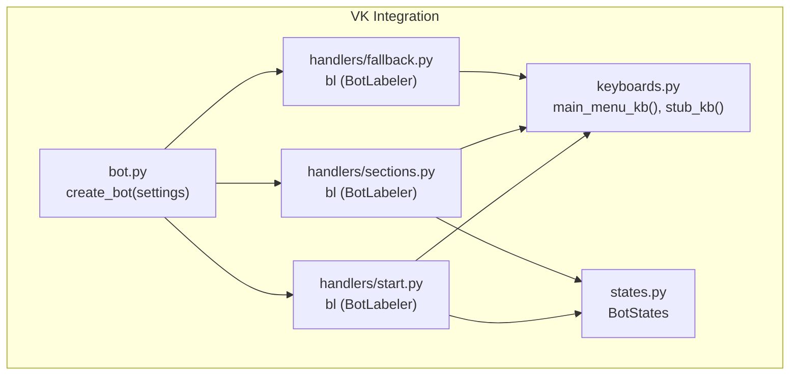
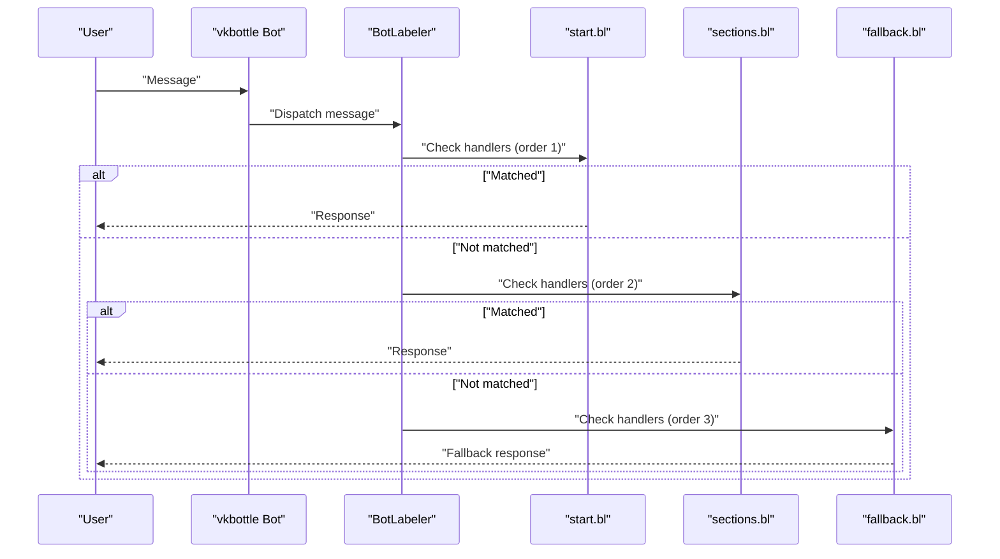
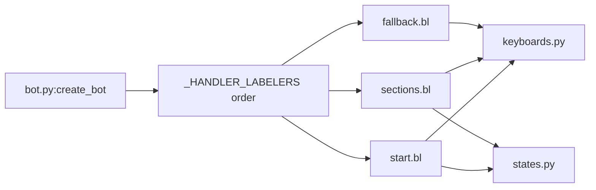

# Handler Registration and Ordering

<cite>
**Referenced Files in This Document**
- [bot.py](file://app/integrations/vk/bot.py)
- [start.py](file://app/integrations/vk/handlers/start.py)
- [sections.py](file://app/integrations/vk/handlers/sections.py)
- [fallback.py](file://app/integrations/vk/handlers/fallback.py)
- [keyboards.py](file://app/integrations/vk/keyboards.py)
- [states.py](file://app/integrations/vk/states.py)
- [polling_vk.py](file://scripts/polling_vk.py)
- [test_bot_factory.py](file://tests/test_bot_factory.py)
- [config.py](file://app/config.py)
</cite>

## Table of Contents
1. [Introduction](#introduction)
2. [Project Structure](#project-structure)
3. [Core Components](#core-components)
4. [Architecture Overview](#architecture-overview)
5. [Detailed Component Analysis](#detailed-component-analysis)
6. [Dependency Analysis](#dependency-analysis)
7. [Performance Considerations](#performance-considerations)
8. [Troubleshooting Guide](#troubleshooting-guide)
9. [Conclusion](#conclusion)
10. [Appendices](#appendices)

## Introduction
This document explains the handler registration system and message routing mechanism used by the VK bot. It focuses on the vkbottle BotLabeler concept, the importance of handler ordering, and the specific order enforced in the application: start, sections, fallback. It also covers how handlers are loaded, how matching works, why fallback must be last, and provides practical guidance for adding new handlers, understanding precedence, and debugging routing issues.

## Project Structure
The VK bot lives under app/integrations/vk and is composed of:
- A bot factory that wires the bot instance and registers handlers
- Three handler modules: start, sections, and fallback
- Keyboard builders used by handlers
- A state group for multi-step dialogs
- A local development entrypoint that runs the bot in Long Poll mode

**Diagram sources**
- [bot.py:23-31](file://app/integrations/vk/bot.py#L23-L31)
- [start.py:12](file://app/integrations/vk/handlers/start.py#L12)
- [sections.py:17](file://app/integrations/vk/handlers/sections.py#L17)
- [fallback.py:7](file://app/integrations/vk/handlers/fallback.py#L7)
- [keyboards.py:56](file://app/integrations/vk/keyboards.py#L56)
- [states.py:4](file://app/integrations/vk/states.py#L4)

**Section sources**
- [bot.py:14-31](file://app/integrations/vk/bot.py#L14-L31)
- [polling_vk.py:24-28](file://scripts/polling_vk.py#L24-L28)

## Core Components
- Bot factory: Creates a vkbottle Bot and registers handler labelers in a fixed order.
- Handler labelers: Each module defines a BotLabeler instance and registers message handlers with decorators.
- Matching: Handlers match incoming messages based on decorator criteria (text, payload).
- Fallback: Catches unmatched messages and redirects users to the main menu.

Key facts:
- The order of handler labelers is explicit and enforced: start, sections, fallback.
- The fallback labeler must be last because it matches any message.
- The bot loads handlers by iterating over the ordered list and calling bot.labeler.load(labeler).

**Section sources**
- [bot.py:14-31](file://app/integrations/vk/bot.py#L14-L31)
- [start.py:12](file://app/integrations/vk/handlers/start.py#L12)
- [sections.py:17](file://app/integrations/vk/handlers/sections.py#L17)
- [fallback.py:7](file://app/integrations/vk/handlers/fallback.py#L7)

## Architecture Overview
The routing pipeline is a simple, deterministic chain:
- Incoming Message arrives at the bot
- vkbottle checks handlers in the order they were loaded
- First matching handler executes; others are not considered
- If no handler matches, the fallback handler responds

**Diagram sources**
- [bot.py:27-28](file://app/integrations/vk/bot.py#L27-L28)
- [start.py:30-54](file://app/integrations/vk/handlers/start.py#L30-L54)
- [sections.py:28-81](file://app/integrations/vk/handlers/sections.py#L28-L81)
- [fallback.py:15-17](file://app/integrations/vk/handlers/fallback.py#L15-L17)

## Detailed Component Analysis

### Bot Factory and Handler Loading
- The factory constructs a Bot with the configured token.
- It defines an ordered list of BotLabeler instances.
- It iterates over the list and loads each labeler into bot.labeler.
- This guarantees top-to-bottom evaluation order.

Best practices:
- Keep the order list immutable and centralized.
- Add new labelers to the list in the intended precedence order.
- Ensure the fallback labeler is last.

**Section sources**
- [bot.py:23-31](file://app/integrations/vk/bot.py#L23-L31)

### Start Handlers (Priority 1)
- Defines greeting and main menu behavior.
- Matches initial commands and home navigation.
- Uses payload-based routing for menu actions.

Key elements:
- A BotLabeler instance bl is created.
- Decorators define matching rules for text and payload.
- Keyboard builders are used to render menus.

**Section sources**
- [start.py:12](file://app/integrations/vk/handlers/start.py#L12)
- [start.py:30-54](file://app/integrations/vk/handlers/start.py#L30-L54)

### Sections Handlers (Priority 2)
- Provides stub responses for each section.
- Routes via payload constants defined in keyboards.
- Uses a shared stub template and a minimal keyboard with service buttons.

Key elements:
- A BotLabeler instance bl is created.
- Seven payload-based handlers cover the main menu sections.
- Keyboard helpers are reused for consistent UX.

**Section sources**
- [sections.py:17](file://app/integrations/vk/handlers/sections.py#L17)
- [sections.py:28-81](file://app/integrations/vk/handlers/sections.py#L28-L81)

### Fallback Handler (Priority 3)
- Catches any unmatched message.
- Sends a friendly reminder to use the menu and offers the main menu keyboard.

Key elements:
- A BotLabeler instance bl is created.
- A catch-all message handler ensures no message goes unhandled.
- Keyboard builders are used to guide the user back to the main menu.

**Section sources**
- [fallback.py:7](file://app/integrations/vk/handlers/fallback.py#L7)
- [fallback.py:15-17](file://app/integrations/vk/handlers/fallback.py#L15-L17)

### Keyboard Builders and States
- Keyboard builders centralize menu construction and service buttons.
- States define multi-step dialog identifiers used elsewhere in the system.

**Section sources**
- [keyboards.py:56](file://app/integrations/vk/keyboards.py#L56)
- [keyboards.py:104](file://app/integrations/vk/keyboards.py#L104)
- [states.py:4](file://app/integrations/vk/states.py#L4)

### Matching Algorithm and Precedence
- vkbottle evaluates handlers in the order they were loaded.
- Each handler specifies matching criteria via decorators:
  - text: matches exact or variant texts
  - payload: matches structured payloads (used for menu navigation)
  - message(): matches any message (fallback)
- The first matching handler wins; subsequent handlers are not evaluated.

Why fallback must be last:
- If placed earlier, it would intercept messages intended for earlier handlers.
- Placing it last ensures unmatched messages are handled gracefully.

**Section sources**
- [bot.py:14-20](file://app/integrations/vk/bot.py#L14-L20)
- [start.py:30-41](file://app/integrations/vk/handlers/start.py#L30-L41)
- [sections.py:28-81](file://app/integrations/vk/handlers/sections.py#L28-L81)
- [fallback.py:15](file://app/integrations/vk/handlers/fallback.py#L15)

### Practical Examples

- Adding a new handler module:
  - Create a new module under app/integrations/vk/handlers/ with a BotLabeler instance bl.
  - Define message handlers decorated with matching criteria (text or payload).
  - Import the new module in the bot factory and append its bl to the ordered list.

- Understanding handler precedence:
  - Handlers are checked in the order they appear in the list.
  - If two handlers could match the same message, the earlier one takes precedence.

- Debugging routing issues:
  - Verify the order list places your labeler before fallback.
  - Temporarily add logging inside handlers to confirm which branch executes.
  - Confirm payload values match exactly (case-sensitive and punctuation-sensitive).
  - Ensure fallback remains last to avoid swallowing intended messages.

**Section sources**
- [bot.py:14-31](file://app/integrations/vk/bot.py#L14-L31)
- [test_bot_factory.py:8-21](file://tests/test_bot_factory.py#L8-L21)

## Dependency Analysis
The bot depends on three handler labelers, which in turn depend on keyboard builders. The factory controls the loading order and therefore the routing order.

**Diagram sources**
- [bot.py:14-31](file://app/integrations/vk/bot.py#L14-L31)
- [start.py:12](file://app/integrations/vk/handlers/start.py#L12)
- [sections.py:17](file://app/integrations/vk/handlers/sections.py#L17)
- [fallback.py:7](file://app/integrations/vk/handlers/fallback.py#L7)
- [keyboards.py:56](file://app/integrations/vk/keyboards.py#L56)
- [states.py:4](file://app/integrations/vk/states.py#L4)

**Section sources**
- [bot.py:14-31](file://app/integrations/vk/bot.py#L14-L31)
- [test_bot_factory.py:30-37](file://tests/test_bot_factory.py#L30-L37)

## Performance Considerations
- Handler evaluation is O(n) in the number of loaded handlers, where n is the length of the ordered list.
- Keeping fallback last avoids unnecessary checks and maintains predictable performance.
- Centralizing keyboard building reduces duplication and potential errors.

[No sources needed since this section provides general guidance]

## Troubleshooting Guide
Common issues and resolutions:
- A handler never triggers:
  - Check that its labeler appears before fallback in the ordered list.
  - Verify matching criteria (text vs payload) align with incoming messages.
- Unexpected fallback activation:
  - Confirm payload values and casing match exactly.
  - Ensure no earlier handler matches the message unintentionally.
- New handler not taking effect:
  - Confirm the new module is imported and its bl appended to the ordered list.
  - Re-run the bot to reload handlers.

Validation via tests:
- Tests assert the correct order and total handler count.
- Tests verify the token is forwarded to the bot instance.

**Section sources**
- [test_bot_factory.py:8-21](file://tests/test_bot_factory.py#L8-L21)
- [test_bot_factory.py:30-37](file://tests/test_bot_factory.py#L30-L37)
- [polling_vk.py:24-28](file://scripts/polling_vk.py#L24-L28)

## Conclusion
The VK bot’s routing relies on a strict, explicit order: start, sections, fallback. This design ensures predictable behavior, clear precedence, and robust fallback handling. By centralizing the order in the bot factory and keeping fallback last, the system remains maintainable and easy to debug. Following the best practices outlined here will help you add new handlers safely and keep the routing pipeline efficient and reliable.

[No sources needed since this section summarizes without analyzing specific files]

## Appendices

### Best Practices for Handler Organization and Naming
- Group related handlers in a single module with a descriptive filename (e.g., sections.py).
- Use a single BotLabeler instance per module named bl.
- Place matching decorators close to handler functions for readability.
- Keep fallback last in the ordered list.
- Use keyboard builders consistently to maintain UX parity.

**Section sources**
- [bot.py:14-20](file://app/integrations/vk/bot.py#L14-L20)
- [keyboards.py:56](file://app/integrations/vk/keyboards.py#L56)

### Example Flow: Adding a New Handler Module
- Create a new module under app/integrations/vk/handlers/ with a BotLabeler instance bl.
- Add message handlers decorated with matching criteria.
- Import the module in the bot factory and append its bl to the ordered list.
- Run the bot to verify the new handlers are loaded and take precedence as intended.

**Section sources**
- [bot.py:14-31](file://app/integrations/vk/bot.py#L14-L31)