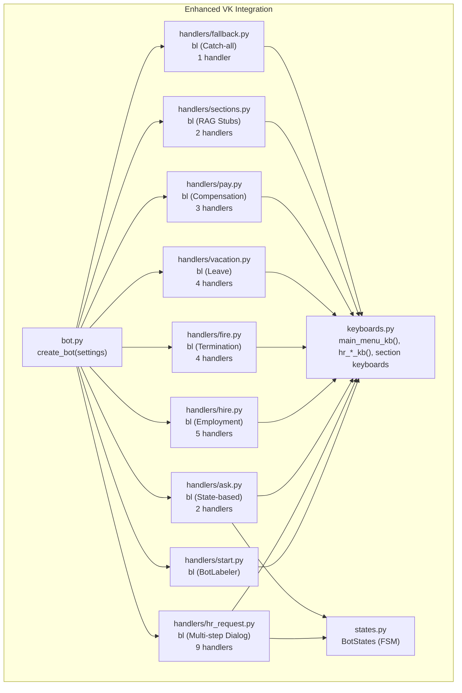
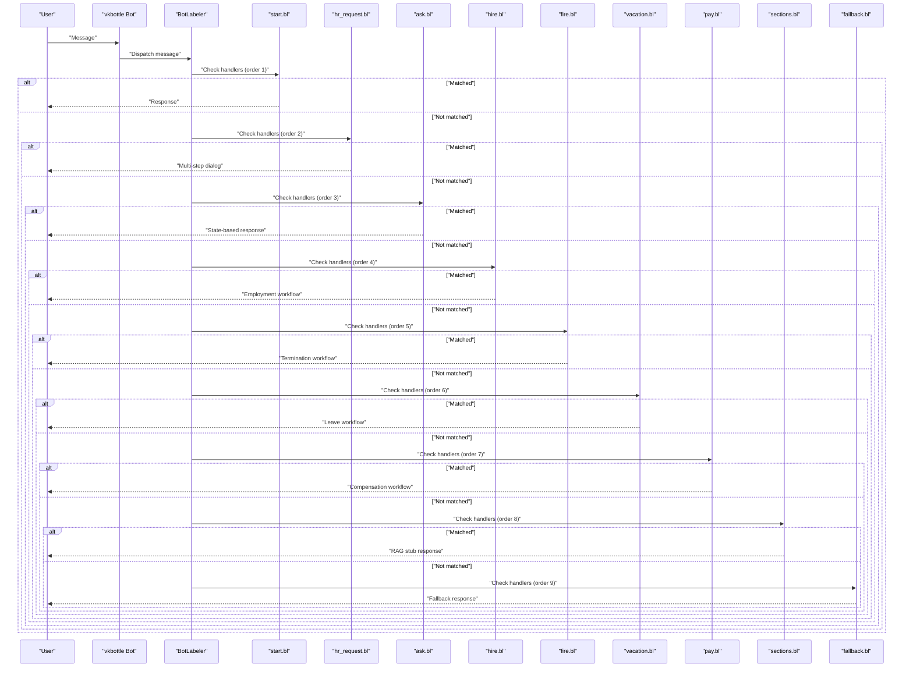
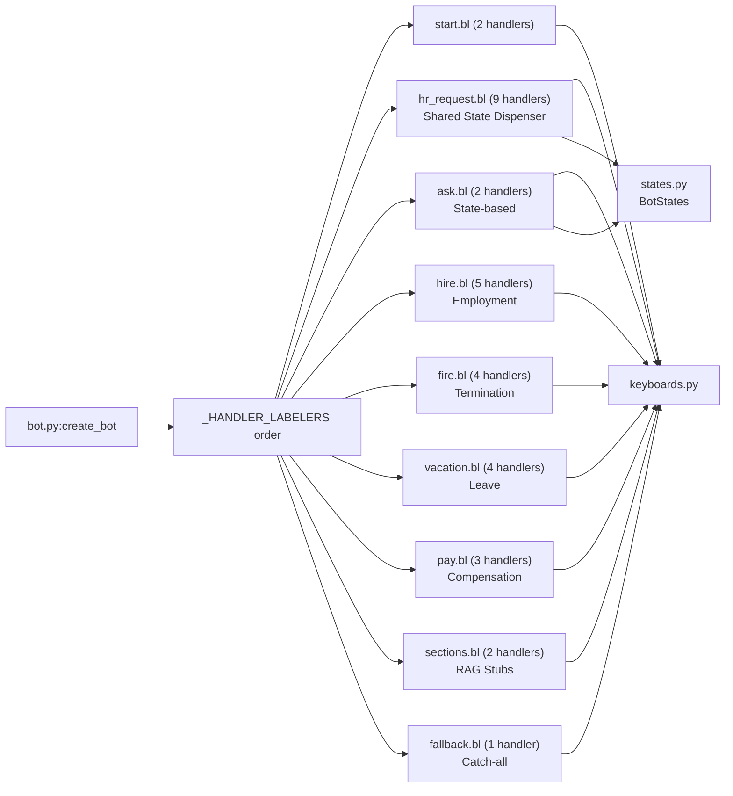

# Handler Registration and Ordering

<cite>
**Referenced Files in This Document**
- [bot.py](file://app/integrations/vk/bot.py)
- [start.py](file://app/integrations/vk/handlers/start.py)
- [hr_request.py](file://app/integrations/vk/handlers/hr_request.py)
- [ask.py](file://app/integrations/vk/handlers/ask.py)
- [hire.py](file://app/integrations/vk/handlers/hire.py)
- [fire.py](file://app/integrations/vk/handlers/fire.py)
- [vacation.py](file://app/integrations/vk/handlers/vacation.py)
- [pay.py](file://app/integrations/vk/handlers/pay.py)
- [sections.py](file://app/integrations/vk/handlers/sections.py)
- [fallback.py](file://app/integrations/vk/handlers/fallback.py)
- [keyboards.py](file://app/integrations/vk/keyboards.py)
- [states.py](file://app/integrations/vk/states.py)
- [polling_vk.py](file://scripts/polling_vk.py)
- [test_bot_factory.py](file://tests/test_bot_factory.py)
- [config.py](file://app/config.py)
</cite>

## Update Summary
**Changes Made**
- Updated handler registration system to include new modules: hire, fire, vacation, pay, ask, hr_request
- Modified bot factory ordering to prioritize HR request handlers before section handlers
- Enhanced handler documentation with detailed flow descriptions for each new module
- Updated handler count verification to reflect 32 total handlers across all modules
- Added comprehensive coverage of multi-step dialog handling and state management

## Table of Contents
1. [Introduction](#introduction)
2. [Project Structure](#project-structure)
3. [Core Components](#core-components)
4. [Architecture Overview](#architecture-overview)
5. [Detailed Component Analysis](#detailed-component-analysis)
6. [Dependency Analysis](#dependency-analysis)
7. [Performance Considerations](#performance-considerations)
8. [Troubleshooting Guide](#troubleshooting-guide)
9. [Conclusion](#conclusion)
10. [Appendices](#appendices)

## Introduction
This document explains the enhanced handler registration system and message routing mechanism used by the VK bot. The system now includes sophisticated multi-step dialog handling through dedicated handler modules for HR processes, employment workflows, and specialized business functions. It focuses on the vkbottle BotLabeler concept, the importance of handler ordering, and the specific order enforced in the application: start, hr_request, ask, hire, fire, vacation, pay, sections, fallback. It also covers how handlers are loaded, how matching works, why fallback must be last, and provides practical guidance for adding new handlers, understanding precedence, and debugging routing issues.

## Project Structure
The VK bot lives under app/integrations/vk and is composed of:
- A bot factory that wires the bot instance and registers handlers in a carefully orchestrated order
- Nine handler modules: start, hr_request (multi-step dialog), ask (free-text questions), hire, fire, vacation, pay, sections, and fallback
- Keyboard builders used by handlers for consistent user experience
- A state group for multi-step dialogs and per-user context management
- A local development entrypoint that runs the bot in Long Poll mode

**Diagram sources**
- [bot.py:31-41](file://app/integrations/vk/bot.py#L31-L41)
- [hr_request.py:38](file://app/integrations/vk/handlers/hr_request.py#L38)
- [ask.py:20](file://app/integrations/vk/handlers/ask.py#L20)
- [hire.py:24](file://app/integrations/vk/handlers/hire.py#L24)
- [fire.py:20](file://app/integrations/vk/handlers/fire.py#L20)
- [vacation.py:23](file://app/integrations/vk/handlers/vacation.py#L23)
- [pay.py:19](file://app/integrations/vk/handlers/pay.py#L19)
- [sections.py:19](file://app/integrations/vk/handlers/sections.py#L19)
- [fallback.py:7](file://app/integrations/vk/handlers/fallback.py#L7)

**Section sources**
- [bot.py:14-56](file://app/integrations/vk/bot.py#L14-L56)
- [polling_vk.py:24-28](file://scripts/polling_vk.py#L24-L28)

## Core Components
- **Enhanced Bot factory**: Creates a vkbottle Bot and registers nine handler labelers in a carefully orchestrated order with state sharing
- **Multi-step Dialog Handler**: HR request module with sophisticated state management using BuiltinStateDispenser
- **Dedicated Workflow Handlers**: Specialized modules for hire, fire, vacation, and pay processes with structured flows
- **State-based Handlers**: Ask module with state management to prevent fallback interception
- **RAG Stub Handlers**: Sections module for remaining knowledge-based responses
- **Matching System**: Handlers match incoming messages based on decorator criteria (text, payload, state)
- **Centralized State Management**: Shared state dispenser coordinates multi-step dialogs

Key facts:
- The order of handler labelers is explicit and enforced: start, hr_request, ask, hire, fire, vacation, pay, sections, fallback
- The fallback labeler must be last because it matches any message
- The bot loads handlers by iterating over the ordered list and calling bot.labeler.load(labeler)
- Multi-step dialogs share a single state dispenser for consistent context management
- HR request handlers are prioritized before section handlers for better routing priority

**Section sources**
- [bot.py:24-41](file://app/integrations/vk/bot.py#L24-L41)
- [hr_request.py:40-41](file://app/integrations/vk/handlers/hr_request.py#L40-L41)
- [ask.py:28](file://app/integrations/vk/handlers/ask.py#L28)

## Architecture Overview
The enhanced routing pipeline is a sophisticated, deterministic chain with state-aware processing:
- Incoming Message arrives at the bot
- vkbottle checks handlers in the predefined order they were loaded
- First matching handler (including state-based handlers) executes; others are not considered
- Multi-step dialogs maintain context through shared state dispensers
- If no handler matches, the fallback handler responds

**Diagram sources**
- [bot.py:31-41](file://app/integrations/vk/bot.py#L31-L41)
- [hr_request.py:69](file://app/integrations/vk/handlers/hr_request.py#L69)
- [ask.py:26](file://app/integrations/vk/handlers/ask.py#L26)
- [hire.py:32](file://app/integrations/vk/handlers/hire.py#L32)
- [fire.py:26](file://app/integrations/vk/handlers/fire.py#L26)
- [vacation.py:29](file://app/integrations/vk/handlers/vacation.py#L29)
- [pay.py:25](file://app/integrations/vk/handlers/pay.py#L25)
- [sections.py:25](file://app/integrations/vk/handlers/sections.py#L25)
- [fallback.py:15](file://app/integrations/vk/handlers/fallback.py#L15)

## Detailed Component Analysis

### Enhanced Bot Factory and Handler Loading
- The factory constructs a Bot with the configured token and shares state dispenser between bot and hr_request handlers
- It defines an ordered list of nine BotLabeler instances with strategic priority placement
- It iterates over the list and loads each labeler into bot.labeler
- This guarantees top-to-bottom evaluation order with HR request handlers prioritized

Best practices:
- Keep the order list immutable and centralized
- Add new labelers to the list in the intended precedence order
- Ensure the fallback labeler is last
- Share state dispensers for coordinated multi-step dialogs
- Maintain clear separation between workflow handlers and RAG stub handlers

**Section sources**
- [bot.py:44-56](file://app/integrations/vk/bot.py#L44-L56)
- [bot.py:48-49](file://app/integrations/vk/bot.py#L48-L49)

### Start Handlers (Priority 1) - Foundation Layer
- Defines greeting and main menu behavior with state clearing
- Matches initial commands and home navigation
- Uses payload-based routing for menu actions
- Clears any lingering dialog state before responding

Key elements:
- A BotLabeler instance bl is created
- Decorators define matching rules for text and payload
- Keyboard builders are used to render menus
- State clearing prevents conflicts with active dialogs

**Section sources**
- [start.py:12](file://app/integrations/vk/handlers/start.py#L12)
- [start.py:31](file://app/integrations/vk/handlers/start.py#L31)

### HR Request Multi-step Dialog (Priority 2) - Core Business Logic
- Provides sophisticated 6-step form processing for HR requests
- Uses BuiltinStateDispenser for finite state machine and per-user context storage
- Handles name → topic → details → entity → urgency → confirmation workflow
- Supports back navigation, restart, and confirmation steps

Key elements:
- Shared state dispenser assigned to Bot in bot.py
- Nine distinct handlers covering entry points, state transitions, and confirmation
- Comprehensive error handling and validation
- Integration with entity selection and urgency options

**Section sources**
- [hr_request.py:38](file://app/integrations/vk/handlers/hr_request.py#L38)
- [hr_request.py:69](file://app/integrations/vk/handlers/hr_request.py#L69)
- [hr_request.py:137](file://app/integrations/vk/handlers/hr_request.py#L137)

### Ask Handler (Priority 3) - State-based Interaction
- Enables free-text question submission with state management
- Prevents fallback interception by setting ASK_QUESTION state
- Uses shared state dispenser from hr_request module
- Provides RAG stub answers with navigation back to ask flow

Key elements:
- State-based handler pattern to coordinate with fallback
- Integration with shared state dispenser
- Navigation keyboard support for seamless user experience

**Section sources**
- [ask.py:20](file://app/integrations/vk/handlers/ask.py#L20)
- [ask.py:26](file://app/integrations/vk/handlers/ask.py#L26)

### Employment Workflow Handlers (Priority 4-6) - Structured Processes
- **Hire Flow**: Entity selection → action menu → checklist/contract/onboarding templates
- **Fire Flow**: Menu → checklist/bypass sheet/RAG stub responses
- **Vacation Flow**: Menu → entity selection → disclaimer + template
- **Pay Flow**: Menu → overtime/bonus RAG stub responses

Each workflow follows structured patterns:
- Payload-based routing for menu navigation
- Entity selection with validation
- Context-aware responses with navigation keyboards
- Integration with domain content modules

**Section sources**
- [hire.py:24](file://app/integrations/vk/handlers/hire.py#L24)
- [fire.py:20](file://app/integrations/vk/handlers/fire.py#L20)
- [vacation.py:23](file://app/integrations/vk/handlers/vacation.py#L23)
- [pay.py:19](file://app/integrations/vk/handlers/pay.py#L19)

### Sections Handlers (Priority 7) - Knowledge Base Integration
- Provides RAG stub responses for remaining sections
- Currently handles sick leave and probation sections
- Routes via payload constants defined in keyboards
- Uses shared stub template and navigation keyboards

Key elements:
- Two payload-based handlers for remaining knowledge sections
- Integration with domain content rag_stub function
- Consistent keyboard navigation patterns

**Section sources**
- [sections.py:19](file://app/integrations/vk/handlers/sections.py#L19)
- [sections.py:25](file://app/integrations/vk/handlers/sections.py#L25)

### Fallback Handler (Priority 9) - Safety Net
- Catches any unmatched message regardless of state
- Sends a friendly reminder to use the menu and offers the main menu keyboard
- Must be last in the ordered list to avoid intercepting intended messages

Key elements:
- Catch-all message handler using @bl.message() decorator
- Integration with main menu keyboard for user guidance
- Essential safety net for unhandled user input

**Section sources**
- [fallback.py:7](file://app/integrations/vk/handlers/fallback.py#L7)
- [fallback.py:15](file://app/integrations/vk/handlers/fallback.py#L15)

### Keyboard Builders and State Management
- Keyboard builders centralize menu construction and service buttons
- States define multi-step dialog identifiers used across handler modules
- Shared state dispenser coordinates context across different dialog flows
- Consistent navigation patterns improve user experience

**Section sources**
- [keyboards.py:56](file://app/integrations/vk/keyboards.py#L56)
- [states.py:4](file://app/integrations/vk/states.py#L4)

### Enhanced Matching Algorithm and Precedence
- vkbottle evaluates handlers in the predefined order they were loaded
- Each handler specifies matching criteria via decorators:
  - text: matches exact or variant texts (start handlers)
  - payload: matches structured payloads (menu navigation)
  - state: matches specific dialog states (multi-step flows)
  - message(): matches any message (fallback)
- The first matching handler wins; subsequent handlers are not evaluated
- State-based handlers take precedence over payload-based handlers when both match

Why fallback must be last:
- If placed earlier, it would intercept messages intended for earlier handlers
- Placing it last ensures unmatched messages are handled gracefully
- State-based handlers can still prevent fallback interception when properly designed

**Section sources**
- [bot.py:24-30](file://app/integrations/vk/bot.py#L24-L30)
- [hr_request.py:137](file://app/integrations/vk/handlers/hr_request.py#L137)
- [ask.py:41](file://app/integrations/vk/handlers/ask.py#L41)
- [fallback.py:15](file://app/integrations/vk/handlers/fallback.py#L15)

### Practical Examples

- **Adding a new handler module**:
  - Create a new module under app/integrations/vk/handlers/ with a BotLabeler instance bl
  - Define message handlers decorated with matching criteria (text, payload, or state)
  - Import the new module in the bot factory and place it in the appropriate position
  - Consider whether the handler needs state management or should be placed before fallback

- **Understanding handler precedence**:
  - Handlers are checked in the order they appear in the _HANDLER_LABELERS list
  - State-based handlers take precedence over payload-based handlers when both match
  - If two handlers could match the same message, the earlier one in the list takes precedence

- **Debugging routing issues**:
  - Verify the order list places your labeler in the correct position
  - Check state dispenser sharing for multi-step dialogs
  - Temporarily add logging inside handlers to confirm which branch executes
  - Confirm payload values match exactly (case-sensitive and punctuation-sensitive)
  - Ensure fallback remains last to avoid swallowing intended messages

**Section sources**
- [bot.py:31-41](file://app/integrations/vk/bot.py#L31-L41)
- [test_bot_factory.py:18-50](file://tests/test_bot_factory.py#L18-L50)

## Dependency Analysis
The enhanced bot depends on nine handler labelers, which in turn depend on keyboard builders and state management. The factory controls the loading order and therefore the routing order, with strategic placement for optimal user experience.

**Diagram sources**
- [bot.py:31-41](file://app/integrations/vk/bot.py#L31-L41)
- [hr_request.py:38](file://app/integrations/vk/handlers/hr_request.py#L38)
- [ask.py:20](file://app/integrations/vk/handlers/ask.py#L20)
- [hire.py:24](file://app/integrations/vk/handlers/hire.py#L24)
- [fire.py:20](file://app/integrations/vk/handlers/fire.py#L20)
- [vacation.py:23](file://app/integrations/vk/handlers/vacation.py#L23)
- [pay.py:19](file://app/integrations/vk/handlers/pay.py#L19)
- [sections.py:19](file://app/integrations/vk/handlers/sections.py#L19)
- [fallback.py:7](file://app/integrations/vk/handlers/fallback.py#L7)

**Section sources**
- [bot.py:31-41](file://app/integrations/vk/bot.py#L31-L41)
- [test_bot_factory.py:37-85](file://tests/test_bot_factory.py#L37-L85)

## Performance Considerations
- Handler evaluation is O(n) in the number of loaded handlers, where n is the length of the ordered list (currently 9 labelers)
- Multi-step dialogs add minimal overhead through state dispenser operations
- Keeping fallback last avoids unnecessary checks and maintains predictable performance
- Shared state dispensers reduce memory usage compared to separate state management
- Centralizing keyboard building reduces duplication and potential errors

## Troubleshooting Guide
Common issues and resolutions:
- **A handler never triggers**:
  - Check that its labeler appears before fallback in the ordered list
  - Verify matching criteria (text vs payload vs state) align with incoming messages
  - For state-based handlers, ensure the state is properly set before expected matching

- **Unexpected fallback activation**:
  - Confirm payload values and casing match exactly
  - Ensure no earlier handler matches the message unintentionally
  - Check state-based handlers aren't inadvertently preventing expected matches

- **New handler not taking effect**:
  - Confirm the new module is imported and its bl appended to the ordered list
  - Verify the handler is placed in the correct position for desired precedence
  - Re-run the bot to reload handlers

- **Multi-step dialog issues**:
  - Verify state dispenser sharing between bot and dialog handlers
  - Check that state transitions occur in the correct order
  - Ensure error handling paths reset state appropriately

Validation via tests:
- Tests assert the correct order and total handler count (32 total handlers)
- Tests verify the token is forwarded to the bot instance
- Tests confirm state dispenser sharing between bot and hr_request handlers
- Tests validate that HR request handlers are positioned before section handlers

**Section sources**
- [test_bot_factory.py:18-85](file://tests/test_bot_factory.py#L18-L85)
- [polling_vk.py:24-28](file://scripts/polling_vk.py#L24-L28)

## Conclusion
The enhanced VK bot's routing relies on a sophisticated, strictly ordered system: start, hr_request, ask, hire, fire, vacation, pay, sections, fallback. This design ensures predictable behavior, clear precedence, robust multi-step dialog handling, and comprehensive fallback protection. The strategic placement of HR request handlers before section handlers optimizes user experience by prioritizing complex business workflows. By centralizing the order in the bot factory, sharing state dispensers for coordinated dialogs, and keeping fallback last, the system remains maintainable, scalable, and easy to debug. Following the best practices outlined here will help you add new handlers safely, coordinate complex multi-step dialogs, and keep the routing pipeline efficient and reliable.

## Appendices

### Best Practices for Enhanced Handler Organization and Naming
- Group related handlers in a single module with a descriptive filename (e.g., hire.py, fire.py, vacation.py)
- Use a single BotLabeler instance per module named bl
- Place matching decorators close to handler functions for readability
- Keep fallback last in the ordered list
- Use keyboard builders consistently to maintain UX parity
- Implement state-based handlers for multi-step dialogs requiring context preservation
- Share state dispensers between related dialog flows for coordinated user experience
- Consider handler precedence when designing new workflow modules

**Section sources**
- [bot.py:24-30](file://app/integrations/vk/bot.py#L24-L30)
- [hr_request.py:40](file://app/integrations/vk/handlers/hr_request.py#L40)
- [ask.py:28](file://app/integrations/vk/handlers/ask.py#L28)

### Example Flow: Adding a New Handler Module
- Create a new module under app/integrations/vk/handlers/ with a BotLabeler instance bl
- Add message handlers decorated with appropriate matching criteria (text, payload, or state)
- Import the module in the bot factory and place it in the ordered list according to precedence needs
- For multi-step dialogs, consider sharing state dispenser with existing dialog flows
- Run the bot to verify the new handlers are loaded and take precedence as intended
- Update tests to reflect new handler count and positioning

**Section sources**
- [bot.py:31-41](file://app/integrations/vk/bot.py#L31-L41)
- [test_bot_factory.py:59-85](file://tests/test_bot_factory.py#L59-L85)