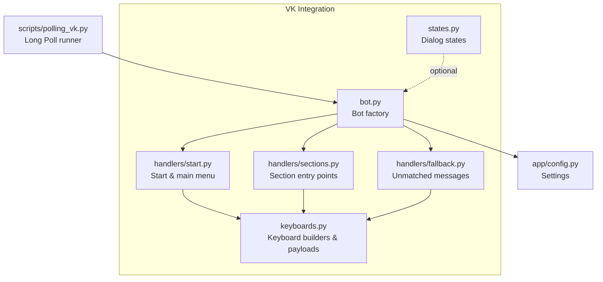
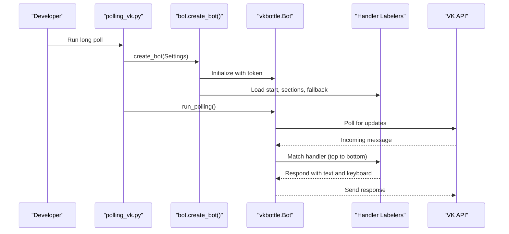
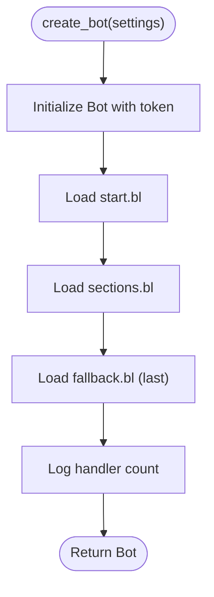
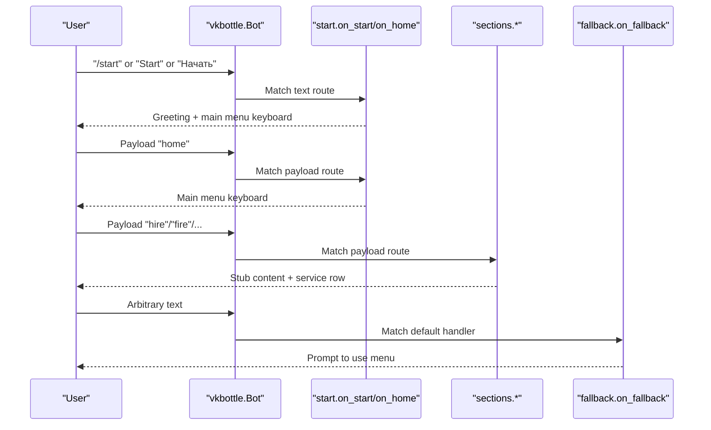
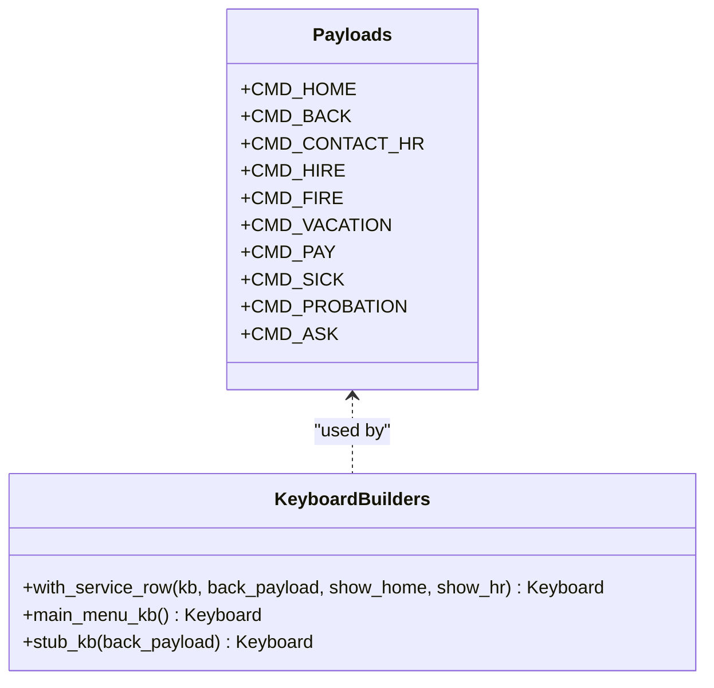
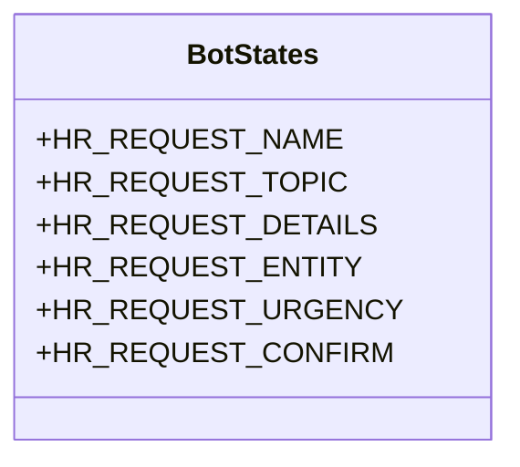
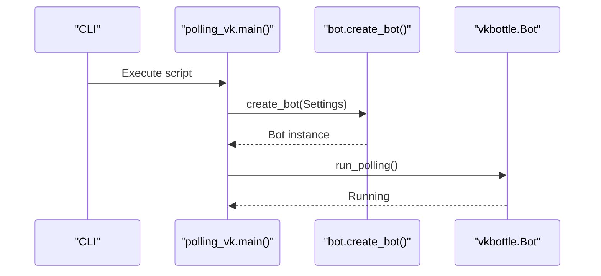
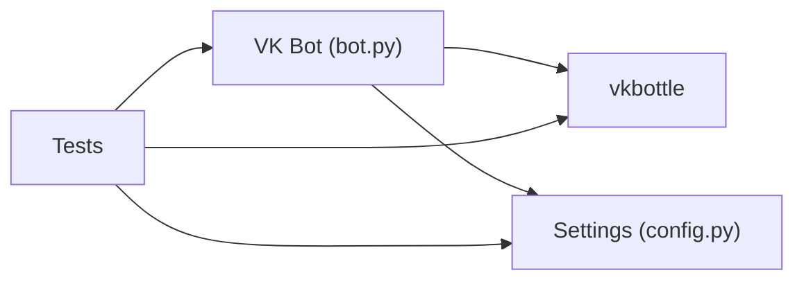

# VK Integration

<cite>
**Referenced Files in This Document**
- [bot.py](file://app/integrations/vk/bot.py)
- [start.py](file://app/integrations/vk/handlers/start.py)
- [sections.py](file://app/integrations/vk/handlers/sections.py)
- [fallback.py](file://app/integrations/vk/handlers/fallback.py)
- [keyboards.py](file://app/integrations/vk/keyboards.py)
- [states.py](file://app/integrations/vk/states.py)
- [polling_vk.py](file://scripts/polling_vk.py)
- [config.py](file://app/config.py)
- [test_bot_factory.py](file://tests/test_bot_factory.py)
- [test_keyboards.py](file://tests/test_keyboards.py)
- [test_states.py](file://tests/test_states.py)
- [pyproject.toml](file://pyproject.toml)
</cite>

## Table of Contents
1. [Introduction](#introduction)
2. [Project Structure](#project-structure)
3. [Core Components](#core-components)
4. [Architecture Overview](#architecture-overview)
5. [Detailed Component Analysis](#detailed-component-analysis)
6. [Dependency Analysis](#dependency-analysis)
7. [Performance Considerations](#performance-considerations)
8. [Troubleshooting Guide](#troubleshooting-guide)
9. [Conclusion](#conclusion)
10. [Appendices](#appendices)

## Introduction
This document explains the VKontakte integration system built with the vkbottle framework. It focuses on the bot factory pattern, handler registration and ordering, payload-based navigation, and VK API integration patterns. It also covers bot initialization, message routing, and practical guidance for extending the bot, customizing behavior, and integrating with VK’s webhook system. Common integration challenges, error handling, and best practices are addressed to help developers build robust VK bots.

## Project Structure
The VK integration resides under app/integrations/vk and includes:
- A bot factory that wires a vkbottle Bot with labeled handlers
- Handler modules for start/main menu, section entry points, and fallback
- Keyboard builders for consistent UI and payload-driven navigation
- State definitions for multi-step dialogs
- A local development script to run the bot in Long Poll mode
- Tests validating factory wiring, keyboard layouts, and state definitions

**Diagram sources**
- [bot.py:1-32](file://app/integrations/vk/bot.py#L1-L32)
- [start.py:1-55](file://app/integrations/vk/handlers/start.py#L1-L55)
- [sections.py:1-82](file://app/integrations/vk/handlers/sections.py#L1-L82)
- [fallback.py:1-18](file://app/integrations/vk/handlers/fallback.py#L1-L18)
- [keyboards.py:1-108](file://app/integrations/vk/keyboards.py#L1-L108)
- [states.py:1-14](file://app/integrations/vk/states.py#L1-L14)
- [polling_vk.py:1-33](file://scripts/polling_vk.py#L1-L33)
- [config.py:1-9](file://app/config.py#L1-L9)

**Section sources**
- [bot.py:1-32](file://app/integrations/vk/bot.py#L1-L32)
- [polling_vk.py:1-33](file://scripts/polling_vk.py#L1-L33)
- [config.py:1-9](file://app/config.py#L1-L9)

## Core Components
- Bot factory: Creates a vkbottle Bot, loads handler labelers in a strict order, and logs successful wiring.
- Handlers: Define message routes for start, main menu navigation, section entry points, and fallback.
- Keyboard builders: Provide consistent UI and payload constants for navigation.
- States: Define multi-step dialog states for complex flows.
- Local runner: Initializes Settings and starts the bot in Long Poll mode.

Key implementation references:
- Factory and handler loading order: [bot.py:23-31](file://app/integrations/vk/bot.py#L23-L31)
- Start handler and main menu: [start.py:23-34](file://app/integrations/vk/handlers/start.py#L23-L34)
- Section entry points: [sections.py:28-81](file://app/integrations/vk/handlers/sections.py#L28-L81)
- Fallback handler: [fallback.py:15-17](file://app/integrations/vk/handlers/fallback.py#L15-L17)
- Keyboard builders and payloads: [keyboards.py:13-98](file://app/integrations/vk/keyboards.py#L13-L98)
- Dialog states: [states.py:4-14](file://app/integrations/vk/states.py#L4-L14)
- Local runner: [polling_vk.py:24-28](file://scripts/polling_vk.py#L24-L28)
- Settings: [config.py:4-9](file://app/config.py#L4-L9)

**Section sources**
- [bot.py:14-31](file://app/integrations/vk/bot.py#L14-L31)
- [start.py:23-55](file://app/integrations/vk/handlers/start.py#L23-L55)
- [sections.py:20-82](file://app/integrations/vk/handlers/sections.py#L20-L82)
- [fallback.py:9-18](file://app/integrations/vk/handlers/fallback.py#L9-L18)
- [keyboards.py:13-108](file://app/integrations/vk/keyboards.py#L13-L108)
- [states.py:4-14](file://app/integrations/vk/states.py#L4-L14)
- [polling_vk.py:24-28](file://scripts/polling_vk.py#L24-L28)
- [config.py:4-9](file://app/config.py#L4-L9)

## Architecture Overview
The VK bot follows a modular architecture:
- The factory constructs a Bot and registers labelers in a fixed order to ensure deterministic routing.
- Handlers react to text commands and payload events, responding with templated messages and keyboards.
- Payload constants drive navigation across screens, ensuring consistent UX.
- Optional state groups enable multi-step dialogs.

**Diagram sources**
- [polling_vk.py:24-28](file://scripts/polling_vk.py#L24-L28)
- [bot.py:23-31](file://app/integrations/vk/bot.py#L23-L31)
- [start.py:31-34](file://app/integrations/vk/handlers/start.py#L31-L34)
- [sections.py:28-81](file://app/integrations/vk/handlers/sections.py#L28-L81)
- [fallback.py:15-17](file://app/integrations/vk/handlers/fallback.py#L15-L17)

## Detailed Component Analysis

### Bot Factory Pattern and Handler Registration
- The factory initializes a Bot with the VK access token from Settings.
- It loads three labelers in a specific order: start, sections, fallback.
- The order is crucial because vkbottle evaluates handlers top-to-bottom; fallback must be last to avoid intercepting intended matches.

**Diagram sources**
- [bot.py:23-31](file://app/integrations/vk/bot.py#L23-L31)

**Section sources**
- [bot.py:14-31](file://app/integrations/vk/bot.py#L14-L31)
- [test_bot_factory.py:8-21](file://tests/test_bot_factory.py#L8-L21)

### Message Routing and Navigation with Payloads
- Start handler responds to initial commands and sends the main menu with service buttons.
- Payload constants define navigation actions (Home, Back, Contact HR, Section commands).
- Section handlers reply with stub content and a service row keyboard.
- Fallback handler ensures users stay within the menu-driven interface.

**Diagram sources**
- [start.py:31-54](file://app/integrations/vk/handlers/start.py#L31-L54)
- [sections.py:28-81](file://app/integrations/vk/handlers/sections.py#L28-L81)
- [fallback.py:15-17](file://app/integrations/vk/handlers/fallback.py#L15-L17)
- [keyboards.py:13-50](file://app/integrations/vk/keyboards.py#L13-L50)

**Section sources**
- [start.py:14-55](file://app/integrations/vk/handlers/start.py#L14-L55)
- [sections.py:20-82](file://app/integrations/vk/handlers/sections.py#L20-L82)
- [fallback.py:9-18](file://app/integrations/vk/handlers/fallback.py#L9-L18)
- [keyboards.py:13-108](file://app/integrations/vk/keyboards.py#L13-L108)

### Keyboard Builders and Payload Constants
- Payload constants define navigation semantics (home, back, contact HR, section commands).
- Keyboard builders assemble rows and append a standard service row with Back/Home/Contact HR.
- The main menu keyboard organizes seven sections plus a dedicated “Contact HR” button.

**Diagram sources**
- [keyboards.py:13-108](file://app/integrations/vk/keyboards.py#L13-L108)

**Section sources**
- [keyboards.py:13-108](file://app/integrations/vk/keyboards.py#L13-L108)
- [test_keyboards.py:49-92](file://tests/test_keyboards.py#L49-L92)
- [test_keyboards.py:97-150](file://tests/test_keyboards.py#L97-L150)
- [test_keyboards.py:155-171](file://tests/test_keyboards.py#L155-L171)
- [test_keyboards.py:176-192](file://tests/test_keyboards.py#L176-L192)

### Dialog States for Multi-Step Flows
- States are defined as a typed group to support multi-step dialogs (e.g., HR request wizard).
- Tests confirm the state group inherits from the base type and contains expected state names/values.

**Diagram sources**
- [states.py:4-14](file://app/integrations/vk/states.py#L4-L14)

**Section sources**
- [states.py:4-14](file://app/integrations/vk/states.py#L4-L14)
- [test_states.py:8-31](file://tests/test_states.py#L8-L31)

### Bot Initialization and Long Poll Runner
- The local runner loads Settings, creates the Bot via the factory, and starts Long Polling.
- Logging is configured for development visibility.

**Diagram sources**
- [polling_vk.py:24-28](file://scripts/polling_vk.py#L24-L28)
- [bot.py:23-31](file://app/integrations/vk/bot.py#L23-L31)

**Section sources**
- [polling_vk.py:17-33](file://scripts/polling_vk.py#L17-L33)
- [config.py:4-9](file://app/config.py#L4-L9)

## Dependency Analysis
External dependencies relevant to VK integration:
- vkbottle is the primary framework for VK bot development.
- pydantic-settings provides typed configuration from environment variables.
- pytest is used for unit tests covering factory wiring, keyboards, and states.

**Diagram sources**
- [bot.py:7-10](file://app/integrations/vk/bot.py#L7-L10)
- [config.py:4-9](file://app/config.py#L4-L9)
- [pyproject.toml:17-21](file://pyproject.toml#L17-L21)

**Section sources**
- [pyproject.toml:17-21](file://pyproject.toml#L17-L21)
- [bot.py:7-10](file://app/integrations/vk/bot.py#L7-L10)
- [config.py:4-9](file://app/config.py#L4-L9)

## Performance Considerations
- Handler order minimizes unnecessary evaluations; keep fallback last.
- Keyboard construction is lightweight; reuse shared keyboards and payloads to reduce overhead.
- Long Poll mode is suitable for small to medium workloads; consider webhooks for higher throughput.
- Avoid heavy synchronous operations inside handlers; delegate to async tasks when needed.

## Troubleshooting Guide
Common issues and resolutions:
- Handler not triggered:
  - Verify handler order and that fallback is last.
  - Confirm payload keys match exactly (case-sensitive).
- Incorrect keyboard layout:
  - Validate main menu composition and service row inclusion.
  - Ensure payloads are present and unique.
- Token errors:
  - Confirm VK access token is set in environment and forwarded to the Bot.
- Multi-step dialogs:
  - Use state groups to track user progress and avoid ambiguous replies.

Validation references:
- Handler order and counts: [test_bot_factory.py:23-45](file://tests/test_bot_factory.py#L23-L45)
- Keyboard composition and payloads: [test_keyboards.py:49-92](file://tests/test_keyboards.py#L49-L92), [test_keyboards.py:176-192](file://tests/test_keyboards.py#L176-L192)
- State definitions: [test_states.py:8-31](file://tests/test_states.py#L8-L31)

**Section sources**
- [test_bot_factory.py:23-45](file://tests/test_bot_factory.py#L23-L45)
- [test_keyboards.py:49-92](file://tests/test_keyboards.py#L49-L92)
- [test_keyboards.py:176-192](file://tests/test_keyboards.py#L176-L192)
- [test_states.py:8-31](file://tests/test_states.py#L8-L31)

## Conclusion
The VK integration leverages a clean factory pattern, deterministic handler ordering, and payload-driven navigation to deliver a consistent, extensible bot. By following the established patterns—registering labelers in order, using shared keyboard builders, and defining state groups—the system supports easy extension and maintenance. For production, consider migrating to VK webhooks and adding structured error handling and logging.

## Appendices

### Extending the Bot with New Handlers
Steps to add a new section:
- Define a payload constant for the new command.
- Add a handler in a new or existing module annotated with the payload.
- Build a keyboard with the service row to ensure Back/Home/Contact HR are always available.
- Register the new labeler in the factory’s loader list and ensure it precedes fallback.

References:
- Payload constants: [keyboards.py:13-24](file://app/integrations/vk/keyboards.py#L13-L24)
- Handler registration order: [bot.py:16-20](file://app/integrations/vk/bot.py#L16-L20)
- Keyboard service row: [keyboards.py:29-50](file://app/integrations/vk/keyboards.py#L29-L50)

**Section sources**
- [keyboards.py:13-50](file://app/integrations/vk/keyboards.py#L13-L50)
- [bot.py:16-20](file://app/integrations/vk/bot.py#L16-L20)

### Integrating with VK Webhook System
Guidance:
- Configure a VK community webhook endpoint pointing to your server.
- Replace Long Poll runner with a FastAPI route that accepts VK POST callbacks.
- Parse incoming update objects and dispatch to the same handler labelers.
- Ensure the Bot is initialized with the same token and labelers as in Long Poll mode.

References:
- Bot initialization and token forwarding: [bot.py:23-31](file://app/integrations/vk/bot.py#L23-L31), [test_bot_factory.py:39-45](file://tests/test_bot_factory.py#L39-L45)
- Handler registration: [bot.py:27-28](file://app/integrations/vk/bot.py#L27-L28)

**Section sources**
- [bot.py:23-31](file://app/integrations/vk/bot.py#L23-L31)
- [test_bot_factory.py:39-45](file://tests/test_bot_factory.py#L39-L45)

### Best Practices for VK Bot Development
- Keep handler order explicit and documented.
- Use payload constants to prevent typos and ensure consistency.
- Prefer keyboard-driven navigation to reduce ambiguity.
- Centralize keyboard building logic to enforce UX standards.
- Add logging around handler execution for observability.
- Validate configuration at startup and fail fast on missing tokens.

[No sources needed since this section provides general guidance]