# VK Integration

<cite>
**Referenced Files in This Document**
- [bot.py](file://app/integrations/vk/bot.py)
- [start.py](file://app/integrations/vk/handlers/start.py)
- [sections.py](file://app/integrations/vk/handlers/sections.py)
- [ask.py](file://app/integrations/vk/handlers/ask.py)
- [fire.py](file://app/integrations/vk/handlers/fire.py)
- [pay.py](file://app/integrations/vk/handlers/pay.py)
- [vacation.py](file://app/integrations/vk/handlers/vacation.py)
- [fallback.py](file://app/integrations/vk/handlers/fallback.py)
- [hire.py](file://app/integrations/vk/handlers/hire.py)
- [keyboards.py](file://app/integrations/vk/keyboards.py)
- [states.py](file://app/integrations/vk/states.py)
- [handlers/__init__.py](file://app/integrations/vk/handlers/__init__.py)
- [rules.py](file://app/integrations/vk/rules.py)
- [entities.py](file://app/domain/entities.py)
- [qa_service.py](file://app/domain/qa_service.py)
- [chain.py](file://app/rag/chain.py)
- [polling_vk.py](file://scripts/polling_vk.py)
- [resources.py](file://app/resources.py)
- [config.py](file://app/config.py)
- [test_bot_factory.py](file://tests/test_bot_factory.py)
- [test_qa_service.py](file://tests/test_qa_service.py)
- [test_keyboards.py](file://tests/test_keyboards.py)
- [test_states.py](file://tests/test_states.py)
- [test_ask_block9.py](file://tests/test_ask_block9.py)
- [category_file_service.py](file://app/domain/category_file_service.py)
- [category_files.py](file://app/api/category_files.py)
- [s3.py](file://app/storage/s3.py)
- [category_models.py](file://app/storage/category_models.py)
- [category_repo.py](file://app/storage/category_repo.py)
- [deps.py](file://app/api/deps.py)
- [category_files.html](file://templates/category_files.html)
- [category_slot.html](file://templates/partials/category_slot.html)
- [pyproject.toml](file://pyproject.toml)
</cite>

## Update Summary
**Changes Made**
- Added comprehensive document template management system with CategoryFileService
- Integrated S3 storage for document template hosting with MinIO/AWS S3 compatibility
- Implemented administrative UI for category-based file management
- Enhanced vacation workflow with document template attachment capability
- Added CategoryFileService dependency injection and centralized access patterns
- Integrated category file service into VK bot handler utilities
- Added FastAPI endpoints for template administration and HTMX partials
- Implemented SQLite-backed metadata storage for template management

## Table of Contents
1. [Introduction](#introduction)
2. [Project Structure](#project-structure)
3. [Core Components](#core-components)
4. [Architecture Overview](#architecture-overview)
5. [Centralized State Management](#centralized-state-management)
6. [Centralized QA Service Access Layer](#centralized-qa-service-access-layer)
7. [Enhanced RAG Response Handling](#enhanced-rag-response-handling)
8. [Document Template Management System](#document-template-management-system)
9. [QA Service and RAG Integration](#qa-service-and-rag-integration)
10. [Detailed Component Analysis](#detailed-component-analysis)
11. [Dependency Analysis](#dependency-analysis)
12. [Performance Considerations](#performance-considerations)
13. [Troubleshooting Guide](#troubleshooting-guide)
14. [Conclusion](#conclusion)
15. [Appendices](#appendices)

## Introduction
This document explains the VKontakte integration system built with the vkbottle framework, featuring a comprehensive QA service integration for Retrieval-Augmented Generation (RAG) processing across all HR-related handlers. The system implements a bot factory pattern with centralized state dispenser sharing, advanced handler registration and ordering, payload-based navigation, and sophisticated VK API integration patterns. It covers bot initialization, message routing, RAG-powered content delivery, and practical guidance for extending the bot with new handlers, customizing behavior, and integrating with VK's webhook system. Common integration challenges, robust error handling, and best practices for VK bot development are addressed.

**Updated** The system now features a comprehensive document template management system with CategoryFileService, S3 storage integration, and administrative UI components for category-based file management. The vacation workflow has been enhanced with document template attachment capabilities, allowing HR templates to be dynamically served to users based on legal entity selection.

## Project Structure
The VK integration resides under app/integrations/vk and includes:
- A bot factory that wires a vkbottle Bot with labeled handlers, shared state management, and centralized QA service access
- Handler modules for start/main menu, section entry points, dedicated ask-a-question functionality, and HR request workflows
- Keyboard builders for consistent UI and payload-driven navigation
- State definitions for multi-step dialogs using centralized state dispenser
- A domain-level QA service that provides RAG processing capabilities
- A new centralized utilities module that manages QA service access patterns, state dispenser sharing, and category file service integration
- A document template management system with CategoryFileService, S3 storage, and administrative UI
- A local development script to run the bot in Long Poll mode with proper resource management
- Tests validating factory wiring, keyboard layouts, state definitions, QA service integration, and category file service functionality
- Enhanced legal entity management with updated company names and centralized entity validation

```mermaid
graph TB
subgraph "VK Integration"
BOT["bot.py<br/>Bot factory with centralized state sharing"]
START["handlers/start.py<br/>Start & main menu"]
SECTIONS["handlers/sections.py<br/>Section entry points (RAG)"]
ASK["handlers/ask.py<br/>Ask-a-question (RAG)"]
HIRE["handlers/hire.py<br/>Hiring flows (multi-step)"]
FIRE["handlers/fire.py<br/>Dismissal flows (RAG)"]
PAY["handlers/pay.py<br/>Pay & bonus flows (RAG)"]
VACATION["handlers/vacation.py<br/>Enhanced vacation flows (templates)"]
FALLBACK["handlers/fallback.py<br/>Unmatched messages"]
KEYBOARDS["keyboards.py<br/>Keyboard builders & payloads"]
STATES["states.py<br/>Dialog states"]
UTILS["handlers/__init__.py<br/>Centralized state & QA access<br/>Enhanced with category file service"]
RULES["rules.py<br/>Custom payload rules"]
ENTITIES["entities.py<br/>Updated legal entities"]
end
subgraph "Document Template System"
CF_SERVICE["category_file_service.py<br/>CategoryFileService"]
CF_API["category_files.py<br/>Admin API endpoints"]
CF_MODELS["category_models.py<br/>CategoryFileRecord & slots"]
CF_REPO["category_repo.py<br/>SQLite repository"]
S3_STORAGE["s3.py<br/>S3/MinIO storage"]
CF_DEPS["deps.py<br/>Category file service dependencies"]
end
subgraph "Administrative UI"
ADMIN_PAGE["category_files.html<br/>Main admin page"]
PARTIALS["category_slot.html<br/>HTMX partials"]
end
RESOURCES["resources.py<br/>Resource management"]
QA_SERVICE["domain/qa_service.py<br/>RAG chain wrapper"]
CHAIN["rag/chain.py<br/>RAG implementation"]
SCRIPT["scripts/polling_vk.py<br/>Long Poll runner"]
CONFIG["app/config.py<br/>Settings"]
TESTS["tests/<br/>Integration tests"]
BOT --> START
BOT --> SECTIONS
BOT --> ASK
BOT --> HIRE
BOT --> FIRE
BOT --> PAY
BOT --> VACATION
BOT --> FALLBACK
START --> KEYBOARDS
SECTIONS --> KEYBOARDS
ASK --> KEYBOARDS
HIRE --> KEYBOARDS
FIRE --> KEYBOARDS
PAY --> KEYBOARDS
VACATION --> KEYBOARDS
ASK --> UTILS
FIRE --> UTILS
PAY --> UTILS
VACATION --> UTILS
SECTIONS --> UTILS
HIRE --> UTILS
UTILS --> QA_SERVICE
UTILS --> STATES
UTILS --> ENTITIES
UTILS --> CF_SERVICE
CF_SERVICE --> CF_REPO
CF_SERVICE --> S3_STORAGE
CF_API --> CF_SERVICE
CF_API --> CF_DEPS
CF_API --> ADMIN_PAGE
CF_API --> PARTIALS
RESOURCES --> SCRIPT
RESOURCES --> QA_SERVICE
RESOURCES --> CF_SERVICE
QA_SERVICE --> CHAIN
BOT --> CONFIG
TESTS --> BOT
TESTS --> QA_SERVICE
TESTS --> UTILS
TESTS --> ENTITIES
TESTS --> CF_SERVICE
```

**Diagram sources**
- [bot.py:45-58](file://app/integrations/vk/bot.py#L45-L58)
- [ask.py:22-28](file://app/integrations/vk/handlers/ask.py#L22-L28)
- [hire.py:19-34](file://app/integrations/vk/handlers/hire.py#L19-L34)
- [fire.py:11](file://app/integrations/vk/handlers/fire.py#L11)
- [pay.py:1-46](file://app/integrations/vk/handlers/pay.py#L1-L46)
- [vacation.py:1-105](file://app/integrations/vk/handlers/vacation.py#L1-L105)
- [sections.py:1-35](file://app/integrations/vk/handlers/sections.py#L1-L35)
- [handlers/__init__.py:13-39](file://app/integrations/vk/handlers/__init__.py#L13-L39)
- [entities.py:16-21](file://app/domain/entities.py#L16-L21)
- [resources.py:32-49](file://app/resources.py#L32-L49)
- [qa_service.py:1-120](file://app/domain/qa_service.py#L1-L120)
- [chain.py:1-80](file://app/rag/chain.py#L1-L80)
- [polling_vk.py:17-31](file://scripts/polling_vk.py#L17-L31)
- [config.py:1-9](file://app/config.py#L1-L9)
- [category_file_service.py:22-115](file://app/domain/category_file_service.py#L22-L115)
- [category_files.py:1-346](file://app/api/category_files.py#L1-L346)
- [category_models.py:9-65](file://app/storage/category_models.py#L9-L65)
- [category_repo.py:47-137](file://app/storage/category_repo.py#L47-L137)
- [s3.py:14-124](file://app/storage/s3.py#L14-L124)
- [deps.py:102-121](file://app/api/deps.py#L102-121)
- [category_files.html:1-78](file://templates/category_files.html#L1-L78)
- [category_slot.html:1-88](file://templates/partials/category_slot.html#L1-L88)

**Section sources**
- [bot.py:1-59](file://app/integrations/vk/bot.py#L1-L59)
- [polling_vk.py:1-36](file://scripts/polling_vk.py#L1-L36)
- [config.py:1-9](file://app/config.py#L1-L9)

## Core Components
- Bot factory: Creates a vkbottle Bot with shared state dispenser, loads handler labelers in strict order, and integrates the QA service for RAG processing
- Centralized state management: Uses BuiltinStateDispenser singleton pattern shared between bot and handlers for consistent state persistence
- Handlers: Define message routes for start, main menu navigation, section entry points, dedicated ask-a-question functionality, and multi-step HR request workflows
- Centralized QA utilities: Provide unified access patterns for QA service initialization, retrieval, and error handling across all handlers
- QA Service: Provides centralized RAG processing with proper resource management, error handling, and VK message length truncation
- Document Template Management: CategoryFileService coordinates between SQLite repository and S3 storage for HR document templates
- Administrative UI: FastAPI endpoints and HTMX partials for category-based file management
- Keyboard builders: Provide consistent UI and payload constants for navigation
- States: Define multi-step dialog states for complex HR workflows using centralized state dispenser
- Legal entities: Manage company information with updated names and centralized entity lookup
- Local runner: Initializes Settings and starts the bot in Long Poll mode with proper resource management
- Resource management: Handles graceful initialization and cleanup of RAG resources and category file service

Key implementation references:
- Factory and handler loading order with centralized state sharing: [bot.py:49-52](file://app/integrations/vk/bot.py#L49-L52)
- Centralized state dispenser sharing pattern: [bot.py:50-52](file://app/integrations/vk/bot.py#L50-L52), [handlers/__init__.py:32-39](file://app/integrations/vk/handlers/__init__.py#L32-L39)
- Centralized QA service access patterns: [handlers/__init__.py:22-29](file://app/integrations/vk/handlers/__init__.py#L22-L29)
- Category file service integration: [handlers/__init__.py:38-43](file://app/integrations/vk/handlers/__init__.py#L38-L43)
- QA service initialization and RAG processing: [qa_service.py:51-105](file://app/domain/qa_service.py#L51-L105)
- Ask-a-question handler with RAG integration: [ask.py:40-45](file://app/integrations/vk/handlers/ask.py#L40-L45)
- HR request multi-step dialog with centralized state: [hire.py:69-74](file://app/integrations/vk/handlers/hire.py#L69-L74)
- Enhanced RAG-enabled HR handlers with centralized access: [fire.py:63-65](file://app/integrations/vk/handlers/fire.py#L63-L65), [pay.py:36-46](file://app/integrations/vk/handlers/pay.py#L36-L46), [vacation.py:67-80](file://app/integrations/vk/handlers/vacation.py#L67-L80)
- Category file service implementation: [category_file_service.py:32-115](file://app/domain/category_file_service.py#L32-L115)
- S3 storage integration: [s3.py:14-124](file://app/storage/s3.py#L14-L124)
- Administrative API endpoints: [category_files.py:115-346](file://app/api/category_files.py#L115-L346)
- Keyboard builders and payloads: [keyboards.py:13-108](file://app/integrations/vk/keyboards.py#L13-L108)
- Dialog states: [states.py:4-17](file://app/integrations/vk/states.py#L4-L17)
- Enhanced vacation workflow with template attachment: [vacation.py:80-116](file://app/integrations/vk/handlers/vacation.py#L80-L116)
- Updated legal entities with new company names: [entities.py:16-21](file://app/domain/entities.py#L16-L21)
- Local runner with resource management: [polling_vk.py:17-31](file://scripts/polling_vk.py#L17-L31)
- Settings: [config.py:4-9](file://app/config.py#L4-L9)
- Resource management: [resources.py:51-165](file://app/resources.py#L51-L165)

**Section sources**
- [bot.py:24-59](file://app/integrations/vk/bot.py#L24-L59)
- [handlers/__init__.py:13-63](file://app/integrations/vk/handlers/__init__.py#L13-L63)
- [qa_service.py:1-120](file://app/domain/qa_service.py#L1-L120)
- [ask.py:1-90](file://app/integrations/vk/handlers/ask.py#L1-L90)
- [hire.py:1-98](file://app/integrations/vk/handlers/hire.py#L1-L98)
- [fire.py:1-74](file://app/integrations/vk/handlers/fire.py#L1-L74)
- [pay.py:1-46](file://app/integrations/vk/handlers/pay.py#L1-L46)
- [vacation.py:1-134](file://app/integrations/vk/handlers/vacation.py#L1-L134)
- [sections.py:1-35](file://app/integrations/vk/handlers/sections.py#L1-L35)
- [keyboards.py:13-108](file://app/integrations/vk/keyboards.py#L13-L108)
- [states.py:4-17](file://app/integrations/vk/states.py#L4-L17)
- [entities.py:1-24](file://app/domain/entities.py#L1-L24)
- [polling_vk.py:17-31](file://scripts/polling_vk.py#L17-L31)
- [config.py:4-9](file://app/config.py#L4-L9)
- [resources.py:51-165](file://app/resources.py#L51-L165)
- [category_file_service.py:1-115](file://app/domain/category_file_service.py#L1-L115)
- [category_files.py:1-346](file://app/api/category_files.py#L1-L346)
- [s3.py:1-124](file://app/storage/s3.py#L1-L124)
- [category_models.py:1-65](file://app/storage/category_models.py#L1-L65)
- [category_repo.py:1-137](file://app/storage/category_repo.py#L1-L137)
- [deps.py:1-121](file://app/api/deps.py#L1-L121)

## Architecture Overview
The VK bot follows a modular architecture with integrated RAG capabilities and centralized service management:
- The factory constructs a Bot with shared state dispenser and registers labelers in a fixed order to ensure deterministic routing
- Handlers react to text commands and payload events, leveraging centralized state dispenser for persistent user context and centralized QA service access patterns for intelligent content generation
- The centralized utilities module provides consistent error handling and resource management across all handlers, including category file service integration
- Payload constants drive navigation across screens, ensuring consistent UX
- Optional state groups enable multi-step dialogs with sophisticated HR workflows
- Resource management handles graceful initialization and cleanup of RAG components and category file service
- Enhanced legal entity management provides centralized company information with updated names
- Document template management system provides category-based file hosting with S3 storage and administrative UI

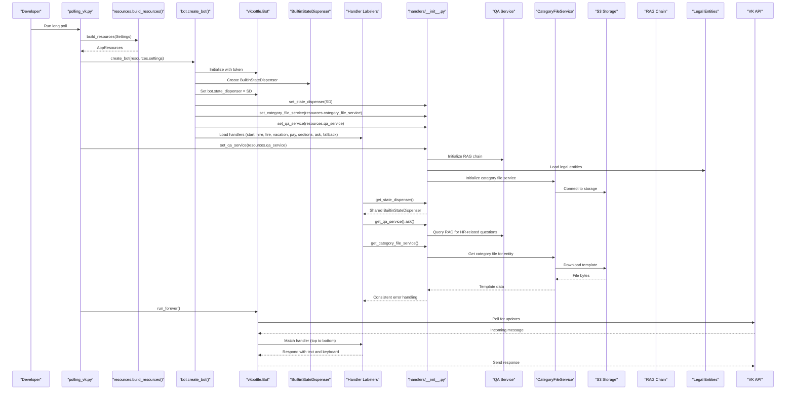

**Diagram sources**
- [polling_vk.py:17-31](file://scripts/polling_vk.py#L17-L31)
- [resources.py:51-165](file://app/resources.py#L51-L165)
- [bot.py:49-52](file://app/integrations/vk/bot.py#L49-L52)
- [handlers/__init__.py:32-39](file://app/integrations/vk/handlers/__init__.py#L32-L39)
- [handlers/__init__.py:22-29](file://app/integrations/vk/handlers/__init__.py#L22-L29)
- [handlers/__init__.py:38-43](file://app/integrations/vk/handlers/__init__.py#L38-L43)
- [qa_service.py:51-105](file://app/domain/qa_service.py#L51-L105)
- [category_file_service.py:28-31](file://app/domain/category_file_service.py#L28-L31)
- [s3.py:39-51](file://app/storage/s3.py#L39-L51)
- [chain.py:61-79](file://app/rag/chain.py#L61-L79)
- [ask.py:75-85](file://app/integrations/vk/handlers/ask.py#L75-L85)
- [entities.py:16-21](file://app/domain/entities.py#L16-L21)

## Centralized State Management

### Centralized State Dispenser Sharing
The new centralized state management system ensures consistent state persistence across all handlers through a shared BuiltinStateDispenser instance:

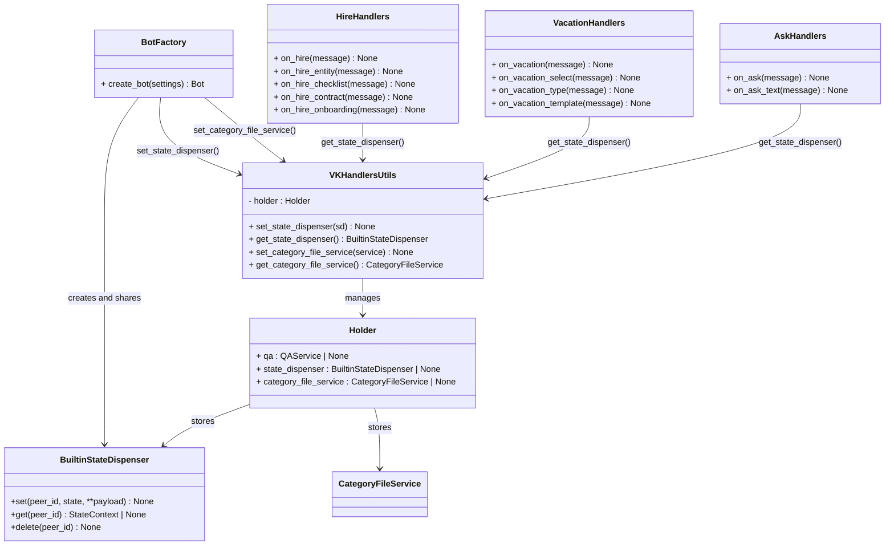

**Diagram sources**
- [bot.py:50-52](file://app/integrations/vk/bot.py#L50-L52)
- [handlers/__init__.py:13-63](file://app/integrations/vk/handlers/__init__.py#L13-L63)
- [hire.py:56-60](file://app/integrations/vk/handlers/hire.py#L56-L60)
- [vacation.py:50-86](file://app/integrations/vk/handlers/vacation.py#L50-L86)
- [ask.py:40](file://app/integrations/vk/handlers/ask.py#L40)

### Centralized State Access Patterns
All handlers now use centralized state dispenser access patterns for consistent state management:

**Updated** All handlers (hire, vacation, ask, fire, pay, sections) now use the centralized state dispenser through get_state_dispenser() calls, replacing direct imports with consistent shared state access patterns. The enhanced vacation workflow utilizes state management for the two-step selection process and category file service integration for template attachment.

**Section sources**
- [bot.py:49-52](file://app/integrations/vk/bot.py#L49-L52)
- [handlers/__init__.py:32-39](file://app/integrations/vk/handlers/__init__.py#L32-L39)
- [handlers/__init__.py:38-43](file://app/integrations/vk/handlers/__init__.py#L38-L43)
- [hire.py:56-60](file://app/integrations/vk/handlers/hire.py#L56-L60)
- [vacation.py:50-86](file://app/integrations/vk/handlers/vacation.py#L50-L86)
- [ask.py:40](file://app/integrations/vk/handlers/ask.py#L40)
- [fire.py:63-65](file://app/integrations/vk/handlers/fire.py#L63-L65)
- [pay.py:36-46](file://app/integrations/vk/handlers/pay.py#L36-L46)
- [sections.py:25-45](file://app/integrations/vk/handlers/sections.py#L25-L45)

## Centralized QA Service Access Layer

### Centralized Utilities Module
The new centralized utilities module provides a consistent interface for QA service access, state dispenser management, and category file service integration across all VK handlers:

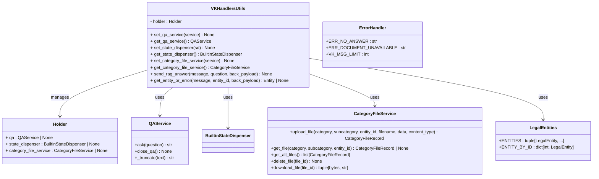

**Diagram sources**
- [handlers/__init__.py:13-63](file://app/integrations/vk/handlers/__init__.py#L13-L63)
- [qa_service.py:23-105](file://app/domain/qa_service.py#L23-L105)
- [category_file_service.py:22-115](file://app/domain/category_file_service.py#L22-L115)
- [entities.py:16-24](file://app/domain/entities.py#L16-L24)

### Centralized Access Patterns
All HR-related handlers now use centralized service access patterns for consistent error handling and resource management:

**Updated** All HR-related handlers (hire, fire, pay, vacation, sections) now use the centralized utilities module for QA service access, category file service integration, and state dispenser management, replacing direct imports with consistent get_*_service() calls and improved error handling patterns. The enhanced legal entity management provides centralized access to company information.

**Section sources**
- [handlers/__init__.py:22-29](file://app/integrations/vk/handlers/__init__.py#L22-L29)
- [handlers/__init__.py:32-39](file://app/integrations/vk/handlers/__init__.py#L32-L39)
- [handlers/__init__.py:38-43](file://app/integrations/vk/handlers/__init__.py#L38-L43)
- [hire.py:63-65](file://app/integrations/vk/handlers/hire.py#L63-L65)
- [fire.py:63-65](file://app/integrations/vk/handlers/fire.py#L63-L65)
- [pay.py:36-46](file://app/integrations/vk/handlers/pay.py#L36-L46)
- [vacation.py:67-80](file://app/integrations/vk/handlers/vacation.py#L67-L80)
- [sections.py:25-45](file://app/integrations/vk/handlers/sections.py#L25-L45)
- [entities.py:16-24](file://app/domain/entities.py#L16-L24)

## Enhanced RAG Response Handling

### Intelligent Timeout Handling
The new `query_rag_with_wait()` function implements sophisticated timeout handling to improve user experience during slow RAG responses:

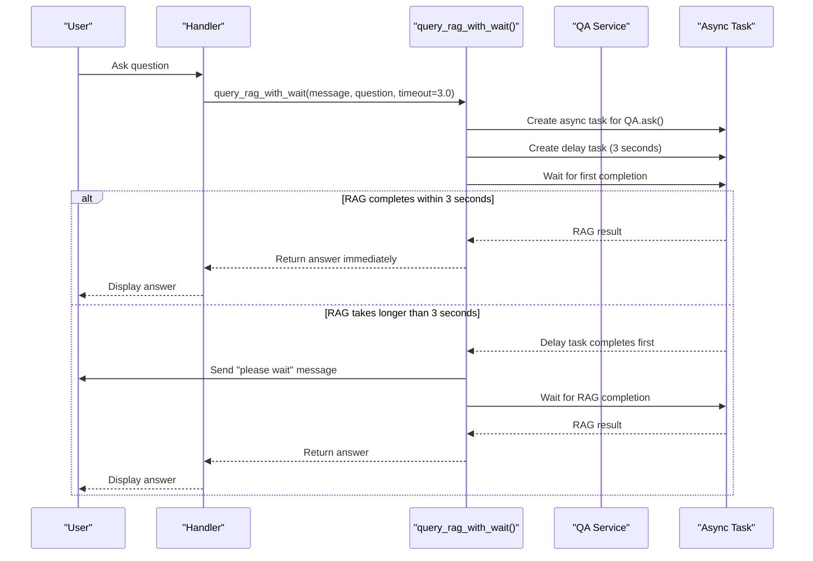

**Diagram sources**
- [handlers/__init__.py:46-68](file://app/integrations/vk/handlers/__init__.py#L46-L68)

### Automatic Question Context Prepending
The enhanced `send_rag_answer()` function automatically prepends user question context to all answers for better clarity and traceability:

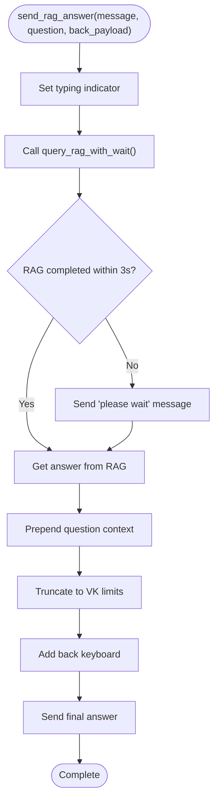

**Diagram sources**
- [handlers/__init__.py:70-86](file://app/integrations/vk/handlers/__init__.py#L70-L86)

### Key Features of Enhanced RAG Handling
- **Intelligent Timeout Detection**: Automatically detects slow RAG responses and sends "please wait" notifications
- **User Experience Enhancement**: Prevents user frustration with unresponsive bots during slow RAG processing
- **Automatic Context Preservation**: Ensures user questions remain visible in the conversation history
- **Consistent Formatting**: Maintains standardized answer presentation across all handlers
- **Graceful Degradation**: Continues processing even when RAG responses are delayed

**Updated** The new timeout handling system provides a seamless user experience by automatically managing slow RAG responses, while the automatic question context prepending ensures users always have clear reference to their original questions. All RAG-enabled handlers now use the enhanced `send_rag_answer()` function for consistent user experience.

**Section sources**
- [handlers/__init__.py:46-86](file://app/integrations/vk/handlers/__init__.py#L46-L86)
- [ask.py:75-90](file://app/integrations/vk/handlers/ask.py#L75-L90)
- [test_ask_block9.py:94-112](file://tests/test_ask_block9.py#L94-L112)

## Document Template Management System

### CategoryFileService Implementation
The CategoryFileService manages document templates for VK bot categories with comprehensive lifecycle management:

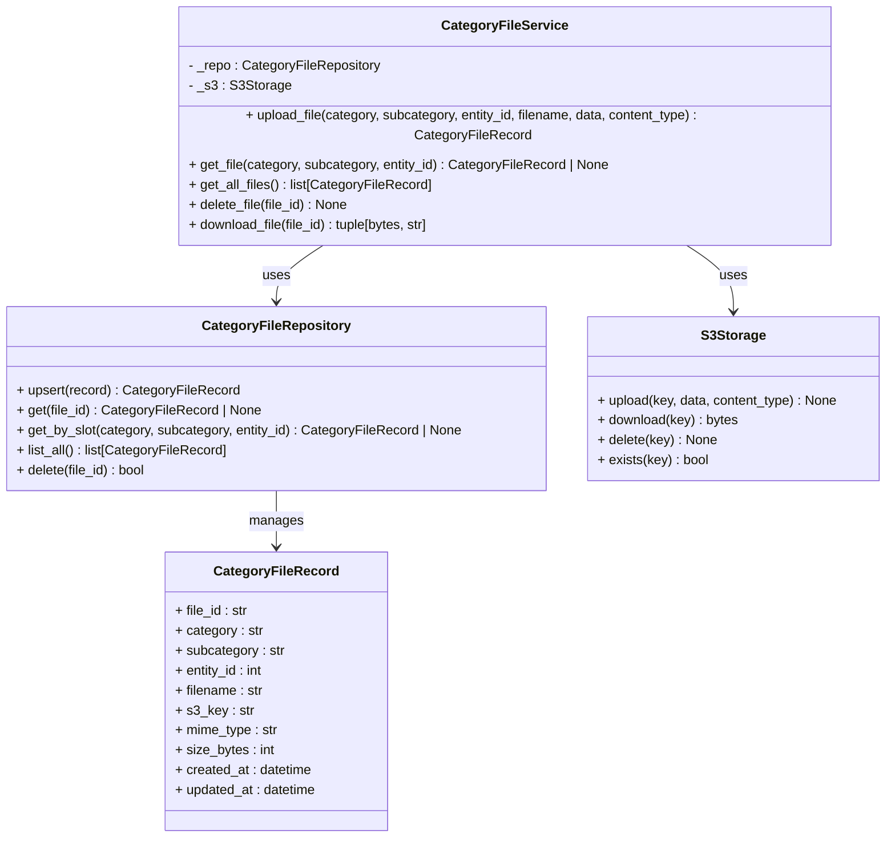

**Diagram sources**
- [category_file_service.py:22-115](file://app/domain/category_file_service.py#L22-L115)
- [category_repo.py:47-137](file://app/storage/category_repo.py#L47-L137)
- [s3.py:14-124](file://app/storage/s3.py#L14-L124)
- [category_models.py:9-21](file://app/storage/category_models.py#L9-L21)

### Administrative UI and API Endpoints
The system provides comprehensive administrative capabilities for template management:

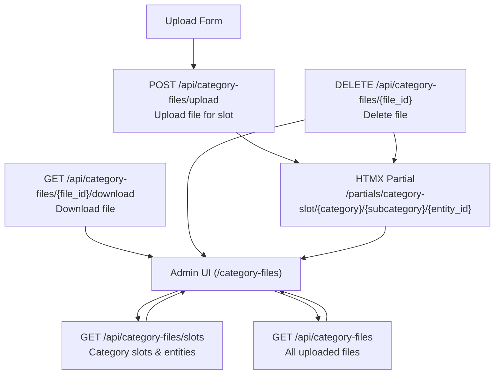

**Diagram sources**
- [category_files.py:115-346](file://app/api/category_files.py#L115-L346)
- [category_files.html:14-61](file://templates/category_files.html#L14-L61)
- [category_slot.html:1-88](file://templates/partials/category_slot.html#L1-L88)

### Key Features of Document Template Management
- **Category-Based Organization**: Templates organized by category (hire, fire, vacation) and subcategory (checklists, contracts, etc.)
- **Entity-Specific Templates**: Support for different templates per legal entity (1-4)
- **S3 Storage Integration**: Cloud storage with MinIO/AWS S3 compatibility
- **SQLite Metadata Storage**: Persistent metadata tracking with timestamps and file information
- **Administrative Interface**: Web-based management with HTMX partials for real-time updates
- **Security**: Admin authentication via cookie-based authorization
- **File Validation**: Size limits, allowed extensions (.docx, .doc), and MIME type checking
- **Atomic Operations**: Transactional uploads with rollback on failures

**Updated** The document template management system provides a comprehensive solution for HR document distribution, enabling administrators to manage templates across categories and entities while providing seamless integration with the VK bot's vacation workflow and other HR processes.

**Section sources**
- [category_file_service.py:1-115](file://app/domain/category_file_service.py#L1-L115)
- [category_files.py:1-346](file://app/api/category_files.py#L1-L346)
- [s3.py:1-124](file://app/storage/s3.py#L1-L124)
- [category_models.py:1-65](file://app/storage/category_models.py#L1-L65)
- [category_repo.py:1-137](file://app/storage/category_repo.py#L1-L137)
- [deps.py:102-121](file://app/api/deps.py#L102-L121)
- [category_files.html:1-78](file://templates/category_files.html#L1-L78)
- [category_slot.html:1-88](file://templates/partials/category_slot.html#L1-L88)

## QA Service and RAG Integration

### QA Service Architecture
The QA service provides a centralized RAG processing layer with robust error handling and resource management:

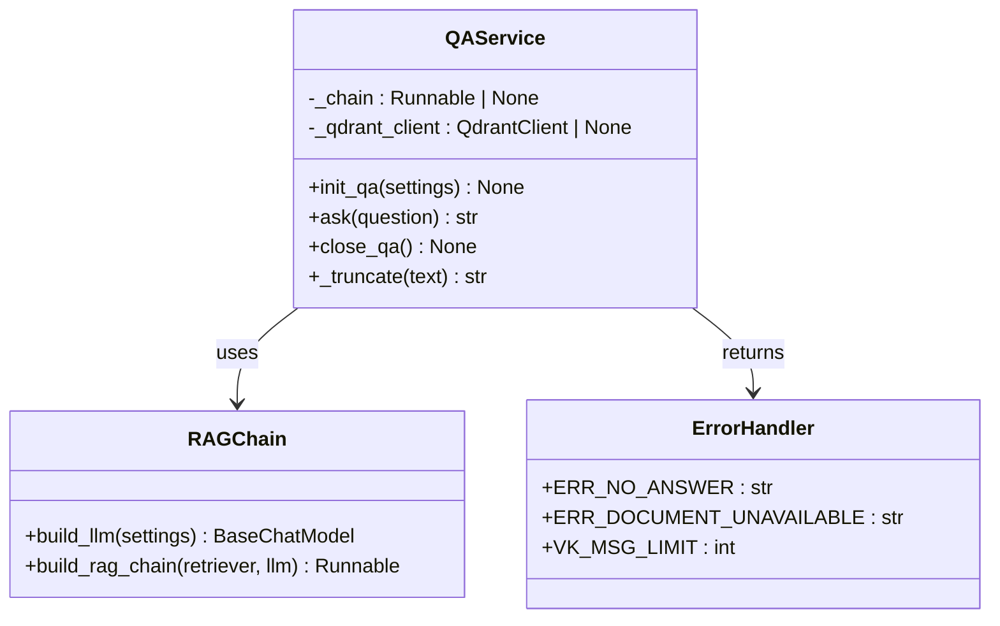

**Diagram sources**
- [qa_service.py:23-105](file://app/domain/qa_service.py#L23-L105)
- [chain.py:30-79](file://app/rag/chain.py#L30-L79)

### RAG Processing Pipeline
The RAG system integrates Qdrant vector database with configurable LLM providers:

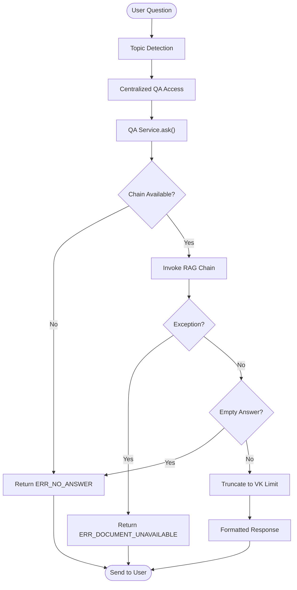

**Diagram sources**
- [qa_service.py:86-105](file://app/domain/qa_service.py#L86-L105)
- [chain.py:61-79](file://app/rag/chain.py#L61-L79)

### Handler Integration Patterns
All HR-related handlers now leverage the centralized QA service for intelligent content delivery:

**Updated** All HR-related handlers (hire, fire, pay, vacation, sections) now use the centralized utilities module for consistent QA service access, category file service integration, and state dispenser management, providing improved error handling and resource management across all handlers. The enhanced legal entity management provides centralized access to company information for all entity-dependent handlers.

**Section sources**
- [handlers/__init__.py:22-29](file://app/integrations/vk/handlers/__init__.py#L22-L29)
- [handlers/__init__.py:38-43](file://app/integrations/vk/handlers/__init__.py#L38-L43)
- [qa_service.py:1-120](file://app/domain/qa_service.py#L1-L120)
- [chain.py:1-80](file://app/rag/chain.py#L1-L80)
- [hire.py:63-65](file://app/integrations/vk/handlers/hire.py#L63-L65)
- [fire.py:63-65](file://app/integrations/vk/handlers/fire.py#L63-L65)
- [pay.py:36-46](file://app/integrations/vk/handlers/pay.py#L36-L46)
- [vacation.py:67-80](file://app/integrations/vk/handlers/vacation.py#L67-L80)
- [sections.py:25-45](file://app/integrations/vk/handlers/sections.py#L25-L45)

## Detailed Component Analysis

### Bot Factory Pattern and Handler Registration
- The factory initializes a Bot with the VK access token from Settings and establishes shared state management through BuiltinStateDispenser
- It creates a BuiltinStateDispenser instance and assigns it to both the bot and the centralized utilities module
- It loads 26 labelers in a specific order: start, ask, hire, fire, vacation, pay, sections, fallback
- The order is crucial because vkbottle evaluates handlers top-to-bottom; fallback must be last to avoid intercepting intended matches
- The QA service and CategoryFileService are initialized during bot creation and registered with the centralized utilities module for consistent access patterns

**Updated** The factory now registers 26 total handlers across all VK integration modules, with the enhanced vacation workflow and hiring processes providing comprehensive HR coverage. The CategoryFileService is now integrated into the centralized utilities module for consistent access across all handlers.

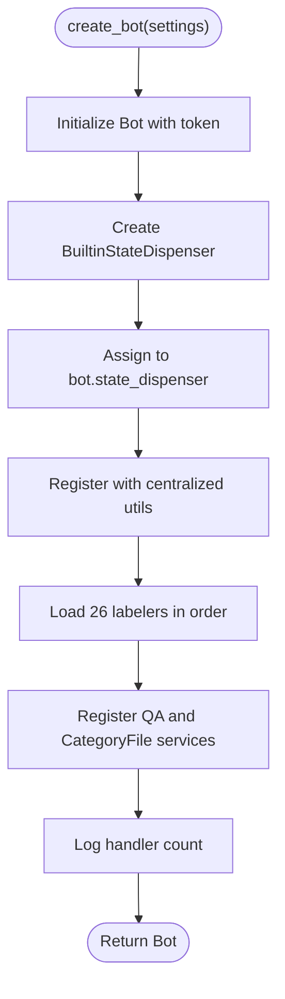

**Diagram sources**
- [bot.py:45-58](file://app/integrations/vk/bot.py#L45-L58)

**Section sources**
- [bot.py:24-59](file://app/integrations/vk/bot.py#L24-L59)
- [test_bot_factory.py:54-67](file://tests/test_bot_factory.py#L54-L67)

### Message Routing and Navigation with Payloads
- Start handler responds to initial commands and sends the main menu with service buttons
- Payload constants define navigation actions (Home, Back, Contact HR, Section commands)
- Section handlers reply with RAG-generated content and a service row keyboard
- Ask handler provides dedicated question-answering with state management using centralized state dispenser
- Fallback handler ensures users stay within the menu-driven interface
- HR request handlers manage complex multi-step workflows with state persistence through centralized state dispenser
- Enhanced vacation workflow provides two-step selection process for better user experience and template attachment
- Category file service integration enables document template delivery based on user selections

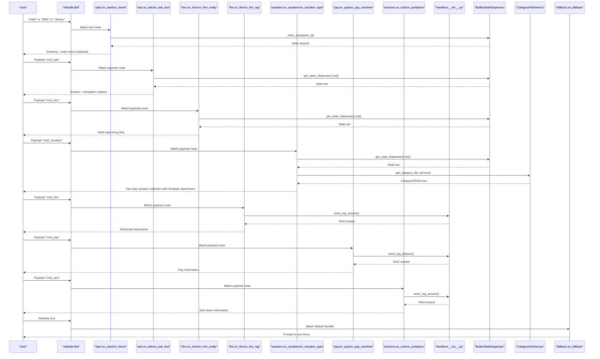

**Diagram sources**
- [start.py:34-49](file://app/integrations/vk/handlers/start.py#L34-L49)
- [ask.py:40](file://app/integrations/vk/handlers/ask.py#L40)
- [hire.py:69](file://app/integrations/vk/handlers/hire.py#L69)
- [vacation.py:50-116](file://app/integrations/vk/handlers/vacation.py#L50-L116)
- [fire.py:63-65](file://app/integrations/vk/handlers/fire.py#L63-L65)
- [pay.py:36-46](file://app/integrations/vk/handlers/pay.py#L36-L46)
- [sections.py:25-45](file://app/integrations/vk/handlers/sections.py#L25-L45)
- [handlers/__init__.py:32-39](file://app/integrations/vk/handlers/__init__.py#L32-L39)
- [handlers/__init__.py:38-43](file://app/integrations/vk/handlers/__init__.py#L38-L43)
- [fallback.py:15-17](file://app/integrations/vk/handlers/fallback.py#L15-L17)

**Section sources**
- [start.py:14-50](file://app/integrations/vk/handlers/start.py#L14-L50)
- [ask.py:1-90](file://app/integrations/vk/handlers/ask.py#L1-L90)
- [hire.py:1-98](file://app/integrations/vk/handlers/hire.py#L1-L98)
- [vacation.py:1-134](file://app/integrations/vk/handlers/vacation.py#L1-L134)
- [fire.py:1-74](file://app/integrations/vk/handlers/fire.py#L1-L74)
- [pay.py:1-46](file://app/integrations/vk/handlers/pay.py#L1-L46)
- [sections.py:1-35](file://app/integrations/vk/handlers/sections.py#L1-L35)
- [handlers/__init__.py:13-63](file://app/integrations/vk/handlers/__init__.py#L13-L63)
- [fallback.py:9-18](file://app/integrations/vk/handlers/fallback.py#L9-L18)
- [keyboards.py:13-108](file://app/integrations/vk/keyboards.py#L13-L108)

### Keyboard Builders and Payload Constants
- Payload constants define navigation semantics (home, back, contact HR, section commands)
- Keyboard builders assemble rows and append a standard service row with Back/Home/Contact HR
- The main menu keyboard organizes eight sections plus a dedicated "Contact HR" button
- Specialized keyboards support multi-step dialog flows and RAG-powered content presentation
- Enhanced vacation workflow keyboards support two-step selection process with template attachment
- Category file service integration enables dynamic template loading based on user selections

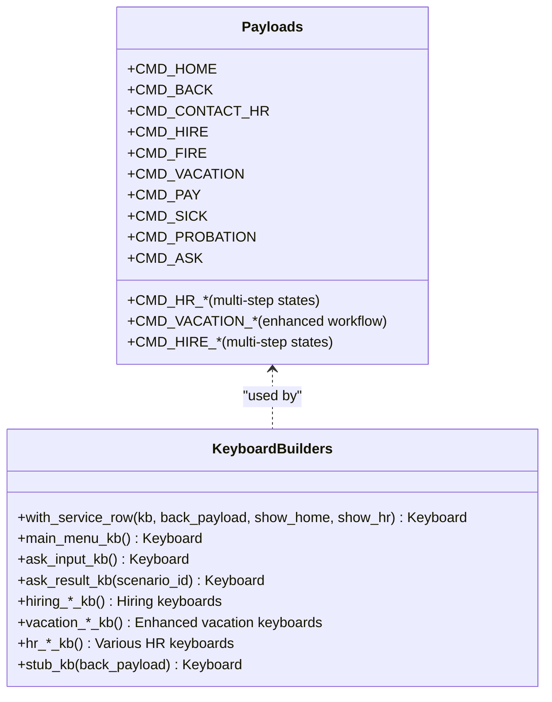

**Diagram sources**
- [keyboards.py:13-108](file://app/integrations/vk/keyboards.py#L13-L108)

**Section sources**
- [keyboards.py:13-108](file://app/integrations/vk/keyboards.py#L13-L108)
- [test_keyboards.py:49-92](file://tests/test_keyboards.py#L49-L92)
- [test_keyboards.py:97-150](file://tests/test_keyboards.py#L97-L150)
- [test_keyboards.py:155-171](file://tests/test_keyboards.py#L155-L171)
- [test_keyboards.py:176-192](file://tests/test_keyboards.py#L176-L192)

### Dialog States for Multi-Step Flows
- States are defined as a typed group to support multi-step dialogs (e.g., HR request wizard)
- The ask-a-question flow uses dedicated state management to handle free-text input
- The enhanced vacation workflow uses state management for the two-step selection process and category file service integration
- Tests confirm the state group inherits from the base type and contains expected state names/values
- All state operations now use the centralized BuiltinStateDispenser for consistency

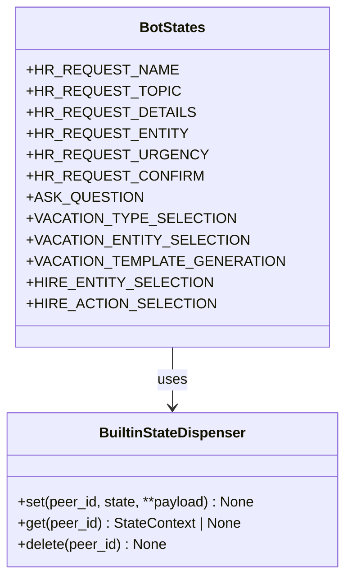

**Diagram sources**
- [states.py:4-17](file://app/integrations/vk/states.py#L4-L17)

**Section sources**
- [states.py:4-17](file://app/integrations/vk/states.py#L4-L17)
- [test_states.py:8-31](file://tests/test_states.py#L8-L31)

### Bot Initialization and Long Poll Runner
- The local runner loads Settings, creates the Bot via the factory, and starts Long Polling
- The factory initializes the QA service and CategoryFileService during bot creation and registers them with centralized utilities for immediate RAG and template capabilities
- Resource management handles graceful initialization and cleanup of RAG components and category file service
- Logging is configured for development visibility with RAG processing metrics

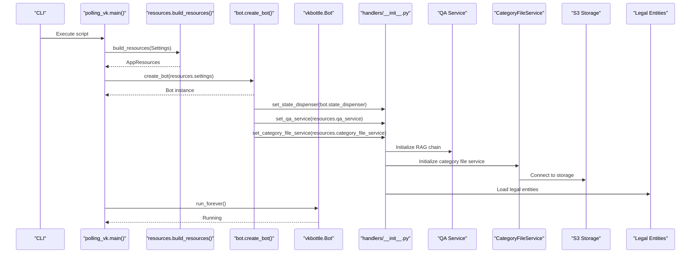

**Diagram sources**
- [polling_vk.py:17-31](file://scripts/polling_vk.py#L17-L31)
- [resources.py:51-165](file://app/resources.py#L51-L165)
- [bot.py:49-52](file://app/integrations/vk/bot.py#L49-L52)
- [handlers/__init__.py:32-39](file://app/integrations/vk/handlers/__init__.py#L32-L39)
- [handlers/__init__.py:38-43](file://app/integrations/vk/handlers/__init__.py#L38-L43)
- [qa_service.py:51-81](file://app/domain/qa_service.py#L51-L81)
- [category_file_service.py:28-31](file://app/domain/category_file_service.py#L28-L31)
- [entities.py:16-21](file://app/domain/entities.py#L16-L21)

**Section sources**
- [polling_vk.py:17-31](file://scripts/polling_vk.py#L17-L31)
- [resources.py:51-165](file://app/resources.py#L51-L165)
- [config.py:4-9](file://app/config.py#L4-L9)

### Enhanced Ask Handler with Better UX
The ask handler has been significantly improved with better user experience:

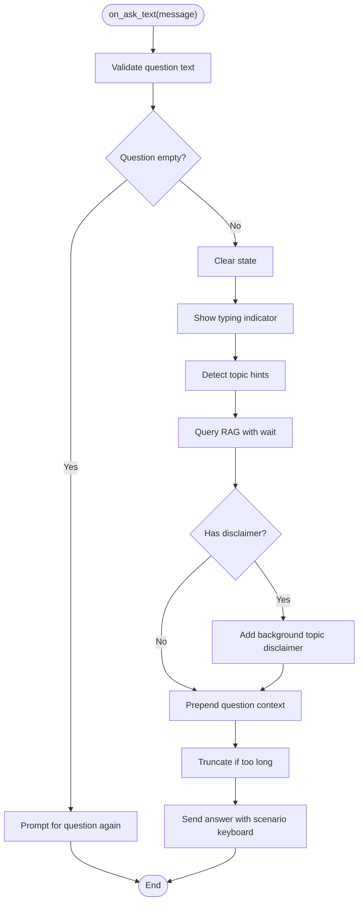

**Diagram sources**
- [ask.py:51-89](file://app/integrations/vk/handlers/ask.py#L51-L89)

**Section sources**
- [ask.py:1-90](file://app/integrations/vk/handlers/ask.py#L1-L90)

### Enhanced Vacation Workflow with Two-Step Selection and Template Attachment
The vacation workflow has been significantly enhanced with a two-step selection process and document template attachment:

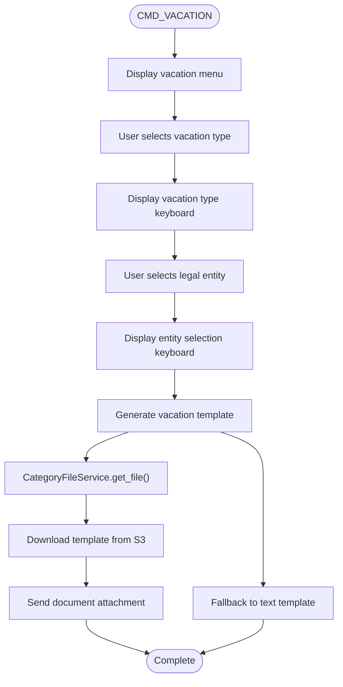

**Diagram sources**
- [vacation.py:50-116](file://app/integrations/vk/handlers/vacation.py#L50-L116)

**Updated** The vacation workflow now features a two-step selection process: first selecting the vacation type (paid/unpaid), then selecting the legal entity for template generation. The system attempts to send document attachments first, falling back to text templates if no template is available. This provides better user experience and ensures accurate template generation based on company-specific policies.

**Section sources**
- [vacation.py:1-134](file://app/integrations/vk/handlers/vacation.py#L1-L134)

### Enhanced Legal Entity Definitions
The legal entity definitions have been updated with new company names:

**Updated** The legal entities now include four companies with their full legal names:
- "Кафетера" (Ooo "Кафетера Групп Рус")
- "Вкусно" (Ooo "Вкусно") 
- "Аврора" (Ooo "Аврора РусКо")
- "СМАРТ" (Ooo "СМАРТ ПИТАНИЕ")

These entities are used across hiring, vacation, and HR request workflows for accurate policy generation.

**Section sources**
- [entities.py:1-24](file://app/domain/entities.py#L1-L24)

### Sections Handler Using New Helper Function
The sections handler now uses the new `send_rag_answer()` helper function for consistent RAG response handling:

**Updated** The sections handler has been simplified to use the centralized `send_rag_answer()` function, which automatically handles typing indicators, timeout detection, question context prepending, and keyboard generation. This ensures consistent user experience across all RAG-enabled handlers.

**Section sources**
- [sections.py:1-35](file://app/integrations/vk/handlers/sections.py#L1-L35)

### Category File Service Integration in Handlers
The CategoryFileService is now integrated into the centralized utilities module and accessible to all handlers:

**Updated** The CategoryFileService is now part of the centralized utilities module, providing consistent access patterns across all VK handlers. The `get_category_file_service()` function returns the service instance for use in handlers that need to access document templates.

**Section sources**
- [handlers/__init__.py:38-43](file://app/integrations/vk/handlers/__init__.py#L38-L43)
- [category_file_service.py:22-115](file://app/domain/category_file_service.py#L22-L115)

## Dependency Analysis
External dependencies relevant to VK integration:
- vkbottle is the primary framework for VK bot development
- pydantic-settings provides typed configuration from environment variables
- pytest is used for unit tests covering factory wiring, keyboards, states, QA service integration, and category file service functionality
- LangChain provides the RAG framework with configurable LLM providers
- Qdrant client provides vector database capabilities for document retrieval
- aiobotocore provides async S3/MinIO client for cloud storage
- aiosqlite provides async SQLite access for metadata storage

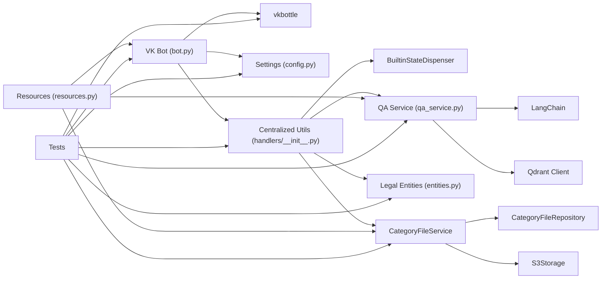

**Diagram sources**
- [bot.py:7-10](file://app/integrations/vk/bot.py#L7-L10)
- [config.py:4-9](file://app/config.py#L4-L9)
- [handlers/__init__.py:32-39](file://app/integrations/vk/handlers/__init__.py#L32-L39)
- [qa_service.py:60-81](file://app/domain/qa_service.py#L60-L81)
- [entities.py:16-24](file://app/domain/entities.py#L16-L24)
- [category_file_service.py:28-31](file://app/domain/category_file_service.py#L28-L31)
- [category_repo.py:47-52](file://app/storage/category_repo.py#L47-L52)
- [s3.py:14-37](file://app/storage/s3.py#L14-L37)
- [resources.py:51-165](file://app/resources.py#L51-L165)
- [pyproject.toml:17-21](file://pyproject.toml#L17-L21)

**Section sources**
- [pyproject.toml:17-21](file://pyproject.toml#L17-L21)
- [bot.py:7-10](file://app/integrations/vk/bot.py#L7-L10)
- [config.py:4-9](file://app/config.py#L4-L9)
- [handlers/__init__.py:32-39](file://app/integrations/vk/handlers/__init__.py#L32-L39)
- [qa_service.py:60-81](file://app/domain/qa_service.py#L60-L81)
- [entities.py:16-24](file://app/domain/entities.py#L16-L24)
- [category_file_service.py:28-31](file://app/domain/category_file_service.py#L28-L31)
- [category_repo.py:47-52](file://app/storage/category_repo.py#L47-L52)
- [s3.py:14-37](file://app/storage/s3.py#L14-L37)
- [resources.py:51-165](file://app/resources.py#L51-L165)

## Performance Considerations
- Handler order minimizes unnecessary evaluations; keep fallback last
- Centralized state dispenser sharing provides consistent resource management with connection pooling and graceful degradation
- Centralized QA service access provides consistent resource management with connection pooling and graceful degradation
- Category file service integration provides efficient template retrieval with S3 caching and SQLite metadata optimization
- RAG responses are truncated to VK message limits to prevent API errors
- Keyboard construction is lightweight; reuse shared keyboards and payloads to reduce overhead
- Long Poll mode is suitable for small to medium workloads; consider webhooks for higher throughput
- Avoid heavy synchronous operations inside handlers; delegate to async tasks when needed
- Centralized utilities provide consistent error handling and fallback responses for QA service failures
- Shared state dispenser reduces memory overhead across handlers
- Resource management handles graceful initialization and cleanup of RAG components and category file service
- **New** Intelligent timeout handling prevents blocking operations and improves perceived performance
- **New** Automatic question context prepending reduces user confusion and improves conversation clarity
- **New** The `send_rag_answer()` helper function standardizes RAG response handling across all handlers, reducing code duplication and improving consistency
- **New** Enhanced vacation workflow with two-step selection process improves user experience and reduces errors
- **New** Updated legal entity definitions with full company names improve accuracy and professionalism
- **New** S3 storage integration provides scalable document template hosting with lazy initialization
- **New** Category file service provides atomic operations with transactional integrity and rollback capabilities
- **New** Administrative UI with HTMX partials enables real-time template management without page reloads

## Troubleshooting Guide
Common issues and resolutions:
- Handler not triggered:
  - Verify handler order and that fallback is last
  - Confirm payload keys match exactly (case-sensitive)
- Incorrect keyboard layout:
  - Validate main menu composition and service row inclusion
  - Ensure payloads are present and unique
- Token errors:
  - Confirm VK access token is set in environment and forwarded to the Bot
- QA service failures:
  - Check Qdrant connectivity and LLM provider availability
  - Verify settings for qdrant_url, qdrant_api_key, qdrant_collection
  - Monitor for RAG chain initialization warnings
  - Ensure centralized QA service is properly initialized before handlers are loaded
- Category file service failures:
  - Check S3 connectivity and bucket permissions
  - Verify settings for s3_endpoint_url, s3_access_key, s3_secret_key, s3_bucket
  - Ensure CategoryFileService is properly initialized before handlers are loaded
  - Monitor for S3 client initialization warnings
- Multi-step dialogs:
  - Use state groups to track user progress and avoid ambiguous replies
  - Verify state dispenser is properly shared between bot and handlers
- RAG response issues:
  - Check for VK message length truncation
  - Verify topic detection and scenario linking
- Centralized access errors:
  - Ensure set_qa_service() and set_category_file_service() are called before handler registration
  - Verify get_qa_service() and get_category_file_service() are imported correctly in handler modules
- State management issues:
  - Verify BuiltinStateDispenser is properly shared between bot and handlers
  - Check that set_state_dispenser() is called during bot creation
  - Ensure get_state_dispenser() is used consistently across all handlers
- **New** Timeout handling issues:
  - Verify query_rag_with_wait() is properly imported in handlers
  - Check that timeout values are appropriate for your RAG service performance
  - Ensure "please wait" messages are being sent correctly
- **New** Question context issues:
  - Verify send_rag_answer() is being used instead of direct QA service calls
  - Check that question truncation logic is working correctly
  - Ensure back_payload parameters are properly passed to maintain navigation
- **New** Helper function integration issues:
  - Verify send_rag_answer() is imported from the centralized utilities module
  - Check that all handlers using the helper function are properly updated
  - Ensure the helper function is available in the handlers/__init__.py module
- **New** Vacation workflow issues:
  - Verify two-step selection process is working correctly
  - Check that entity selection keyboard is properly generated
  - Ensure template generation uses correct entity information
  - Verify CategoryFileService is properly initialized for template attachment
- **New** Legal entity issues:
  - Verify entity IDs match between keyboards and entity lookup
  - Check that full company names are displayed correctly
  - Ensure entity validation returns proper error messages
- **New** Administrative UI issues:
  - Verify admin authentication cookie is properly set
  - Check that HTMX partials are loading correctly
  - Ensure file upload validation is working (size, type, extension)
  - Verify S3 storage connectivity for template downloads

Validation references:
- Handler order and counts: [test_bot_factory.py:18-86](file://tests/test_bot_factory.py#L18-L86)
- QA service integration: [test_qa_service.py:176-198](file://tests/test_qa_service.py#L176-L198)
- Keyboard composition and payloads: [test_keyboards.py:49-92](file://tests/test_keyboards.py#L49-L92), [test_keyboards.py:176-192](file://tests/test_keyboards.py#L176-L192)
- State definitions: [test_states.py:8-31](file://tests/test_states.py#L8-L31)
- Centralized access patterns: [handlers/__init__.py:22-39](file://app/integrations/vk/handlers/__init__.py#L22-L39)
- Category file service functionality: [test_category_file_service.py:209-351](file://tests/test_category_file_service.py#L209-L351)
- State dispenser sharing: [test_bot_factory.py:82-86](file://tests/test_bot_factory.py#L82-L86)
- **New** Timeout handling validation: [test_ask_block9.py:94-112](file://tests/test_ask_block9.py#L94-L112)
- **New** Helper function integration: [test_qa_service.py:216-236](file://tests/test_qa_service.py#L216-L236)
- **New** Handler count validation: [test_bot_factory.py:66](file://tests/test_bot_factory.py#L66)
- **New** Vacation workflow validation: [vacation.py:50-116](file://app/integrations/vk/handlers/vacation.py#L50-L116)
- **New** Legal entity validation: [entities.py:16-24](file://app/domain/entities.py#L16-L24)
- **New** Administrative UI validation: [test_category_files.py:347-483](file://tests/test_category_files.py#L347-L483)

**Section sources**
- [test_bot_factory.py:18-86](file://tests/test_bot_factory.py#L18-L86)
- [test_qa_service.py:176-198](file://tests/test_qa_service.py#L176-L198)
- [test_keyboards.py:49-92](file://tests/test_keyboards.py#L49-L92)
- [test_keyboards.py:176-192](file://tests/test_keyboards.py#L176-L192)
- [test_states.py:8-31](file://tests/test_states.py#L8-L31)
- [handlers/__init__.py:22-39](file://app/integrations/vk/handlers/__init__.py#L22-L39)
- [test_category_file_service.py:209-351](file://tests/test_category_file_service.py#L209-L351)
- [test_category_files.py:347-483](file://tests/test_category_files.py#L347-L483)

## Conclusion
The VK integration leverages a clean factory pattern with centralized state dispenser sharing, deterministic handler ordering, payload-driven navigation, and comprehensive RAG integration with centralized service management to deliver a sophisticated, extensible bot. The system now includes significant user experience improvements through intelligent timeout handling for RAG responses, automatic question context prepending, enhanced vacation workflow with two-step selection process, document template attachment capabilities, and updated legal entity definitions with new company names.

**Updated** The system now features 26 total handlers across all VK integration modules, providing comprehensive HR coverage with enhanced user experience. The new CategoryFileService provides document template management with S3 storage integration and administrative UI components, enabling dynamic template delivery based on user selections. The centralized state management system ensures consistent state persistence across all handlers through a shared BuiltinStateDispenser instance, while the centralized QA service and category file service access layers provide consistent error handling and resource management across all HR-related handlers. The enhanced vacation workflow with two-step selection process and document template attachment demonstrates the system's commitment to continuous improvement and user-centric design.

The new `query_rag_with_wait()` function provides intelligent timeout detection that automatically sends "please wait" notifications when RAG responses take longer than 3 seconds, while the `send_rag_answer()` helper function standardizes RAG response handling across all handlers by automatically setting typing indicators, querying RAG with timeout handling, prepending question context, truncating responses to VK limits, and adding appropriate navigation keyboards.

By following the established patterns—registering labelers in order, using shared keyboard builders, implementing centralized state management, integrating the centralized QA service and category file service access layers, and following the centralized initialization process—the system supports easy extension and maintenance. For production, consider migrating to VK webhooks, adding structured error handling and logging, and implementing proper QA service and category file service lifecycle management.

## Appendices

### Extending the Bot with New Handlers
Steps to add a new section:
- Define a payload constant for the new command
- Add a handler in a new or existing module annotated with the payload
- Import and use the centralized state dispenser, QA service, and category file service access patterns:
  - Use `from app.integrations.vk.handlers import get_state_dispenser` for state management
  - Use `from app.integrations.vk.handlers import get_qa_service` for direct access
  - Use `from app.integrations.vk.handlers import get_category_file_service` for template access
  - Use `from app.integrations.vk.handlers import send_rag_answer` for standardized RAG responses
- Build a keyboard with the service row to ensure Back/Home/Contact HR are always available
- Register the new labeler in the factory's loader list and ensure it precedes fallback

**Updated** When adding new handlers, integrate with the centralized state dispenser, QA service, and category file service by importing from `app.integrations.vk.handlers` and using the provided utility functions for consistent error handling and resource management. **New** Consider using `query_rag_with_wait()` for any handler that processes user questions to provide better user experience during slow RAG responses, and use `send_rag_answer()` for standardized RAG response handling across all handlers. **New** For multi-step workflows with template attachment, consider implementing category file service integration using the centralized CategoryFileService for better user experience.

References:
- Payload constants: [keyboards.py:13-24](file://app/integrations/vk/keyboards.py#L13-L24)
- Handler registration order: [bot.py:31-41](file://app/integrations/vk/bot.py#L31-L41)
- Centralized state dispenser access: [handlers/__init__.py:32-39](file://app/integrations/vk/handlers/__init__.py#L32-L39)
- Centralized QA access patterns: [handlers/__init__.py:22-29](file://app/integrations/vk/handlers/__init__.py#L22-L29)
- Category file service integration: [handlers/__init__.py:38-43](file://app/integrations/vk/handlers/__init__.py#L38-L43)
- Keyboard service row: [keyboards.py:29-50](file://app/integrations/vk/keyboards.py#L29-L50)
- **New** Timeout handling: [handlers/__init__.py:46-86](file://app/integrations/vk/handlers/__init__.py#L46-L86)
- **New** State management patterns: [states.py:4-17](file://app/integrations/vk/states.py#L4-L17)
- **New** Category file service usage: [category_file_service.py:32-115](file://app/domain/category_file_service.py#L32-L115)

**Section sources**
- [keyboards.py:13-50](file://app/integrations/vk/keyboards.py#L13-L50)
- [bot.py:31-41](file://app/integrations/vk/bot.py#L31-L41)
- [handlers/__init__.py:22-39](file://app/integrations/vk/handlers/__init__.py#L22-L39)
- [handlers/__init__.py:38-43](file://app/integrations/vk/handlers/__init__.py#L38-L43)

### Integrating with VK Webhook System
Guidance:
- Configure a VK community webhook endpoint pointing to your server
- Replace Long Poll runner with a FastAPI route that accepts VK POST callbacks
- Parse incoming update objects and dispatch to the same handler labelers
- Ensure the Bot is initialized with the same token, labelers, and centralized state dispenser access as in Long Poll mode
- Implement proper error handling for webhook processing failures
- Maintain the centralized QA service and category file service initialization patterns for consistent access across all handlers
- Ensure state dispenser is properly shared between bot and handlers in webhook mode

References:
- Bot initialization and token forwarding: [bot.py:45-58](file://app/integrations/vk/bot.py#L45-L58), [test_bot_factory.py:75-81](file://tests/test_bot_factory.py#L75-L81)
- Handler registration: [bot.py:54-55](file://app/integrations/vk/bot.py#L54-L55)
- Centralized state dispenser sharing: [bot.py:49-52](file://app/integrations/vk/bot.py#L49-L52)
- Centralized QA service initialization: [handlers/__init__.py:22-29](file://app/integrations/vk/handlers/__init__.py#L22-L29)
- Category file service initialization: [handlers/__init__.py:38-43](file://app/integrations/vk/handlers/__init__.py#L38-L43)

**Section sources**
- [bot.py:45-58](file://app/integrations/vk/bot.py#L45-L58)
- [test_bot_factory.py:75-81](file://tests/test_bot_factory.py#L75-L81)
- [handlers/__init__.py:22-29](file://app/integrations/vk/handlers/__init__.py#L22-L29)
- [handlers/__init__.py:38-43](file://app/integrations/vk/handlers/__init__.py#L38-L43)

### Best Practices for VK Bot Development
- Keep handler order explicit and documented
- Use payload constants to prevent typos and ensure consistency
- Prefer keyboard-driven navigation to reduce ambiguity
- Centralize keyboard building logic to enforce UX standards
- Integrate the centralized state dispenser for dynamic content generation across HR-related flows
- Integrate the centralized QA service access layer for dynamic content generation across HR-related flows
- Integrate the centralized category file service for document template management
- Implement proper error handling and fallback responses for QA service and category file service failures using centralized patterns
- Add logging around handler execution and RAG processing for observability
- Validate configuration at startup and fail fast on missing tokens or service initialization failures
- Manage service lifecycles with proper resource cleanup during shutdown
- Use centralized utilities for consistent state management, error handling, and service access patterns
- Ensure state dispenser is properly shared between bot and handlers for consistent state persistence
- Implement proper resource management for graceful initialization and cleanup of RAG components and category file service
- **New** Use intelligent timeout handling for any handler that processes user questions to improve user experience
- **New** Always use automatic question context prepending to maintain conversation clarity and traceability
- **New** Standardize RAG response handling across all handlers using the `send_rag_answer()` helper function
- **New** Use `query_rag_with_wait()` for any handler that processes user questions to provide intelligent timeout handling
- **New** Implement state management for multi-step workflows using the centralized BuiltinStateDispenser
- **New** Utilize the enhanced vacation workflow patterns for improved user experience
- **New** Leverage updated legal entity definitions for accurate company-specific content generation
- **New** Use CategoryFileService for all document template management needs with proper error handling
- **New** Implement S3 storage integration for scalable document hosting with lazy initialization
- **New** Provide administrative UI for template management with HTMX partials for real-time updates

### Centralized State and Service Integration Patterns
- Initialize state dispenser during bot creation and register with centralized utilities for immediate state management capabilities
- Initialize QA service and CategoryFileService during bot creation and register with centralized utilities for immediate RAG and template capabilities
- Use `from app.integrations.vk.handlers import get_state_dispenser` for all state management operations
- Use `from app.integrations.vk.handlers import get_qa_service` for all HR-related content generation
- Use `from app.integrations.vk.handlers import get_category_file_service` for all template-related operations
- Use `from app.integrations.vk.handlers import send_rag_answer` for standardized RAG response handling
- Use `from app.integrations.vk.handlers import get_entity_or_error` for consistent entity validation
- Implement proper error handling with fallback responses using centralized patterns
- Truncate long responses to VK message limits automatically through centralized access
- Close QA service and CategoryFileService resources properly during application shutdown using centralized management
- Monitor service health and implement graceful degradation strategies through centralized access layer
- Ensure centralized state dispenser is initialized before handler registration to prevent runtime errors
- Ensure centralized QA service and CategoryFileService are initialized before handler registration to prevent runtime errors
- **New** Use `query_rag_with_wait()` for any handler that processes user questions to provide intelligent timeout handling
- **New** Always use `send_rag_answer()` instead of direct QA service calls to ensure consistent user experience and question context preservation
- **New** Leverage the centralized utilities module for consistent error handling and resource management patterns across all handlers
- **New** Implement state management patterns for multi-step workflows using the centralized BuiltinStateDispenser
- **New** Utilize the enhanced vacation workflow patterns for improved user experience with template attachment
- **New** Access updated legal entity definitions through the centralized utilities module for accurate content generation
- **New** Use CategoryFileService for all document template operations with proper validation and error handling
- **New** Implement S3 storage integration patterns for scalable document hosting with proper connection management

**Section sources**
- [handlers/__init__.py:22-39](file://app/integrations/vk/handlers/__init__.py#L22-L39)
- [handlers/__init__.py:38-43](file://app/integrations/vk/handlers/__init__.py#L38-L43)
- [bot.py:49-52](file://app/integrations/vk/bot.py#L49-L52)
- [qa_service.py:51-120](file://app/domain/qa_service.py#L51-L120)
- [category_file_service.py:28-31](file://app/domain/category_file_service.py#L28-L31)
- [test_qa_service.py:1-198](file://tests/test_qa_service.py#L1-L198)
- [test_bot_factory.py:82-86](file://tests/test_bot_factory.py#L82-L86)
- [test_ask_block9.py:94-112](file://tests/test_ask_block9.py#L94-L112)
- [states.py:4-17](file://app/integrations/vk/states.py#L4-L17)
- [vacation.py:50-116](file://app/integrations/vk/handlers/vacation.py#L50-L116)
- [entities.py:16-24](file://app/domain/entities.py#L16-L24)
- [category_file_service.py:32-115](file://app/domain/category_file_service.py#L32-L115)
- [s3.py:39-51](file://app/storage/s3.py#L39-L51)
- [category_repo.py:53-87](file://app/storage/category_repo.py#L53-L87)