# VK Integration

<cite>
**Referenced Files in This Document**
- [bot.py](file://packages/vk_bot/src/cafetera_vk_bot/bot.py)
- [start.py](file://packages/vk_bot/src/cafetera_vk_bot/handlers/start.py)
- [sections.py](file://packages/vk_bot/src/cafetera_vk_bot/handlers/sections.py)
- [ask.py](file://packages/vk_bot/src/cafetera_vk_bot/handlers/ask.py)
- [fire.py](file://packages/vk_bot/src/cafetera_vk_bot/handlers/fire.py)
- [pay.py](file://packages/vk_bot/src/cafetera_vk_bot/handlers/pay.py)
- [vacation.py](file://packages/vk_bot/src/cafetera_vk_bot/handlers/vacation.py)
- [fallback.py](file://packages/vk_bot/src/cafetera_vk_bot/handlers/fallback.py)
- [hire.py](file://packages/vk_bot/src/cafetera_vk_bot/handlers/hire.py)
- [keyboards.py](file://packages/vk_bot/src/cafetera_vk_bot/keyboards.py)
- [states.py](file://packages/vk_bot/src/cafetera_vk_bot/states.py)
- [handlers/__init__.py](file://packages/vk_bot/src/cafetera_vk_bot/handlers/__init__.py)
- [rules.py](file://packages/vk_bot/src/cafetera_vk_bot/rules.py)
- [config.py](file://packages/vk_bot/src/cafetera_vk_bot/config.py)
- [polling.py](file://packages/vk_bot/src/cafetera_vk_bot/polling.py)
- [resources.py](file://packages/core/src/cafetera_core/resources.py)
- [config.py](file://packages/core/src/cafetera_core/config.py)
- [test_bot_factory.py](file://tests/test_bot_factory.py)
- [test_qa_service.py](file://tests/test_qa_service.py)
- [test_keyboards.py](file://tests/test_keyboards.py)
- [test_states.py](file://tests/test_states.py)
- [test_ask_block9.py](file://tests/test_ask_block9.py)
- [test_category_hints.py](file://tests/test_category_hints.py)
- [category_file_service.py](file://packages/core/src/cafetera_core/domain/category_file_service.py)
- [category_files.py](file://app/api/category_files.py)
- [s3.py](file://packages/core/src/cafetera_core/storage/s3.py)
- [category_models.py](file://packages/core/src/cafetera_core/storage/category_models.py)
- [category_repo.py](file://packages/core/src/cafetera_core/storage/category_repo.py)
- [deps.py](file://app/api/deps.py)
- [category_files.html](file://templates/category_files.html)
- [category_slot.html](file://templates/partials/category_slot.html)
- [attachments.py](file://packages/vk_bot/src/cafetera_vk_bot/attachments.py)
- [pyproject.toml](file://packages/vk_bot/pyproject.toml)
</cite>

## Update Summary
**Changes Made**
- Updated package location from `app/integrations/vk/` to `packages/vk_bot/src/cafetera_vk_bot/`
- Enhanced bot architecture with proper resource management using shared `cafetera_core` package
- Improved VKontakte integration patterns with better separation of concerns
- Added comprehensive async resource management with graceful initialization and cleanup
- Integrated category-aware functionality with scenario ID passing for RAG queries
- Implemented centralized state management with proper error handling patterns
- Enhanced fire handler with entity-based resignation flow and document template delivery
- Added hybrid search capabilities with sparse embeddings and improved RAG performance
- Implemented intelligent timeout handling for RAG responses with user experience improvements
- Updated handler registration and ordering with proper fallback mechanism

## Table of Contents
1. [Introduction](#introduction)
2. [Project Structure](#project-structure)
3. [Core Components](#core-components)
4. [Architecture Overview](#architecture-overview)
5. [Centralized State Management](#centralized-state-management)
6. [Centralized QA Service Access Layer](#centralized-qa-service-access-layer)
7. [Enhanced RAG Response Handling](#enhanced-rag-response-handling)
8. [Category-Aware RAG Processing](#category-aware-rag-processing)
9. [Scenario ID Detection and Navigation](#scenario-id-detection-and-navigation)
10. [Document Template Management System](#document-template-management-system)
11. [QA Service and RAG Integration](#qa-service-and-rag-integration)
12. [Enhanced Fire Handler with Entity-Based Resignation Flow](#enhanced-fire-handler-with-entity-based-resignation-flow)
13. [Enhanced Error Handling with Decorators](#enhanced-error-handling-with-decorators)
14. [Async Qdrant Client Integration](#async-qdrant-client-integration)
15. [Improved Resource Management](#improved-resource-management)
16. [Hybrid Search Capabilities](#hybrid-search-capabilities)
17. [Detailed Component Analysis](#detailed-component-analysis)
18. [Dependency Analysis](#dependency-analysis)
19. [Performance Considerations](#performance-considerations)
20. [Troubleshooting Guide](#troubleshooting-guide)
21. [Conclusion](#conclusion)
22. [Appendices](#appendices)

## Introduction
This document explains the VKontakte integration system built with the vkbottle framework, featuring a comprehensive QA service integration for Retrieval-Augmented Generation (RAG) processing across all HR-related handlers. The system implements a bot factory pattern with centralized state dispenser sharing, advanced handler registration and ordering, payload-based navigation, and sophisticated VK API integration patterns. 

**Updated** The system now features enhanced category-aware functionality with scenario ID passing and category parameter specification for RAG queries. This allows for targeted content delivery based on user intent detection, enabling more precise and relevant responses for different HR scenarios such as hiring, firing, vacations, pay, sick leave, and probation periods. The system integrates AsyncQdrantClient for fully asynchronous operations, hybrid search capabilities with sparse embeddings, and intelligent timeout handling for improved user experience.

The VK integration now resides under the `packages/vk_bot/src/cafetera_vk_bot/` namespace, providing better separation of concerns and integration with the shared `cafetera_core` package that manages domain services, RAG processing, and resource management.

## Project Structure
The VK integration now resides under `packages/vk_bot/src/cafetera_vk_bot/` and includes:
- A bot factory that wires a vkbottle Bot with labeled handlers, shared state management, and centralized QA service access
- Handler modules for start/main menu, section entry points, dedicated ask-a-question functionality, and HR request workflows
- Keyboard builders for consistent UI and payload-driven navigation
- State definitions for multi-step dialogs using centralized state dispenser
- A domain-level QA service that provides RAG processing capabilities with async Qdrant client integration and category-aware filtering
- Enhanced fire handler with entity-based resignation flow and improved error handling
- A new document attachment system for delivering company-specific templates
- Tests validating factory wiring, keyboard layouts, state definitions, QA service integration, and enhanced handler functionality

```mermaid
graph TB
subgraph "VK Bot Package (packages/vk_bot/src/cafetera_vk_bot)"
BOT["bot.py<br/>Bot factory with centralized state sharing"]
START["handlers/start.py<br/>Start & main menu"]
SECTIONS["handlers/sections.py<br/>Section entry points (RAG)"]
ASK["handlers/ask.py<br/>Ask-a-question (RAG)"]
HIRE["handlers/hire.py<br/>Hiring flows (multi-step)"]
FIRE["handlers/fire.py<br/>Enhanced dismissal flows (entity-based)"]
PAY["handlers/pay.py<br/>Pay & bonus flows (RAG)"]
VACATION["handlers/vacation.py<br/>Enhanced vacation flows (templates)"]
FALLBACK["handlers/fallback.py<br/>Unmatched messages"]
KEYBOARDS["keyboards.py<br/>Enhanced keyboard builders & payloads"]
ATTACHMENTS["attachments.py<br/>Document attachment helper"]
STATES["states.py<br/>Dialog states"]
UTILS["handlers/__init__.py<br/>Centralized state & QA access"]
RULES["rules.py<br/>Custom payload rules"]
CONFIG["config.py<br/>VK-specific settings"]
POLLING["polling.py<br/>Long poll runner with async resources"]
end
subgraph "Shared Core Package (packages/core/src/cafetera_core)"
RESOURCES["resources.py<br/>Async resource management"]
CORE_CONFIG["config.py<br/>Core settings & environment"]
QA_SERVICE["domain/qa_service.py<br/>Async Qdrant integration"]
CATEGORY_FILE_SERVICE["domain/category_file_service.py<br/>Template management"]
CHAIN["rag/chain.py<br/>RAG implementation with category hints"]
RETRIEVER["rag/retriever.py<br/>Async Qdrant retriever"]
INDEXER["rag/indexer.py<br/>Async document indexing"]
PROMPTS["rag/prompts.py<br/>Category hints system prompts"]
TOPIC_HINTS["domain/topic_hints.py<br/>Scenario ID detection"]
end
subgraph "Enhanced Error Handling"
REQUIRE_ENTITY["require_entity<br/>Entity validation function"]
CATCH_ERROR["@catch_entity_error<br/>Error handling decorator"]
ENTITY_NOT_FOUND["EntityNotFoundError<br/>Exception class"]
end
subgraph "Enhanced Fire Flow"
FIRE_MENU["Fire menu keyboard<br/>Resignation & grounds"]
ENTITY_SELECT["Entity selection keyboard<br/>Company-specific templates"]
DOC_ATTACHMENT["Document attachment<br/>Template delivery"]
end
RESOURCES --> POLLING
RESOURCES --> BOT
QA_SERVICE --> RETRIEVER
QA_SERVICE --> PROMPTS
RETRIEVER --> INDEXER
UTILS --> QA_SERVICE
UTILS --> STATES
UTILS --> CATEGORY_FILE_SERVICE
UTILS --> REQUIRE_ENTITY
UTILS --> CATCH_ERROR
UTILS --> ENTITY_NOT_FOUND
KEYBOARDS --> FIRE_MENU
KEYBOARDS --> ENTITY_SELECT
FIRE_MENU --> DOC_ATTACHMENT
ENTITY_SELECT --> DOC_ATTACHMENT
CONFIG --> POLLING
TESTS["tests/<br/>Enhanced integration tests"]
```

**Diagram sources**
- [bot.py:42-56](file://packages/vk_bot/src/cafetera_vk_bot/bot.py#L42-L56)
- [ask.py:22-28](file://packages/vk_bot/src/cafetera_vk_bot/handlers/ask.py#L22-L28)
- [hire.py:19-34](file://packages/vk_bot/src/cafetera_vk_bot/handlers/hire.py#L19-L34)
- [fire.py:11](file://packages/vk_bot/src/cafetera_vk_bot/handlers/fire.py#L11)
- [pay.py:1-46](file://packages/vk_bot/src/cafetera_vk_bot/handlers/pay.py#L1-L46)
- [vacation.py:1-105](file://packages/vk_bot/src/cafetera_vk_bot/handlers/vacation.py#L1-L105)
- [sections.py:1-35](file://packages/vk_bot/src/cafetera_vk_bot/handlers/sections.py#L1-L35)
- [handlers/__init__.py:13-39](file://packages/vk_bot/src/cafetera_vk_bot/handlers/__init__.py#L13-L39)
- [config.py:4-16](file://packages/vk_bot/src/cafetera_vk_bot/config.py#L4-L16)
- [polling.py:20-48](file://packages/vk_bot/src/cafetera_vk_bot/polling.py#L20-L48)
- [resources.py:193-422](file://packages/core/src/cafetera_core/resources.py#L193-L422)
- [qa_service.py:1-120](file://packages/core/src/cafetera_core/domain/qa_service.py#L1-L120)
- [chain.py:1-80](file://packages/core/src/cafetera_core/rag/chain.py#L1-L80)
- [retriever.py:20-53](file://packages/core/src/cafetera_core/rag/retriever.py#L20-L53)
- [indexer.py:13-49](file://packages/core/src/cafetera_core/rag/indexer.py#L13-49)
- [prompts.py:30-55](file://packages/core/src/cafetera_core/rag/prompts.py#L30-L55)
- [topic_hints.py:87-109](file://packages/core/src/cafetera_core/domain/topic_hints.py#L87-L109)
- [attachments.py:19-121](file://packages/vk_bot/src/cafetera_vk_bot/attachments.py#L19-L121)
- [test_bot_factory.py:54-67](file://tests/test_bot_factory.py#L54-L67)

**Section sources**
- [bot.py:1-56](file://packages/vk_bot/src/cafetera_vk_bot/bot.py#L1-L56)
- [polling.py:1-71](file://packages/vk_bot/src/cafetera_vk_bot/polling.py#L1-L71)
- [config.py:1-16](file://packages/vk_bot/src/cafetera_vk_bot/config.py#L1-L16)

## Core Components
- Bot factory: Creates a vkbottle Bot with shared state dispenser, loads handler labelers in strict order, and integrates the QA service for RAG processing
- Centralized state management: Uses BuiltinStateDispenser singleton pattern shared between bot and handlers for consistent state persistence
- Handlers: Define message routes for start, main menu navigation, section entry points, dedicated ask-a-question functionality, and multi-step HR request workflows
- Centralized QA utilities: Provide unified access patterns for QA service initialization, retrieval, and error handling across all handlers
- QA Service: Provides centralized RAG processing with proper resource management, error handling, VK message length truncation, and category-aware filtering
- Enhanced fire handler: Implements entity-based resignation flow with document template attachment and improved error handling using decorators
- Document attachment system: Provides helper functions for sending S3-stored documents as VK message attachments
- Keyboard builders: Provide consistent UI and payload constants for navigation, including new entity selection flows
- States: Define multi-step dialog states for complex HR workflows using centralized state dispenser
- Local runner: Initializes Settings and starts the bot in Long Poll mode with proper resource management
- Resource management: Handles graceful initialization and cleanup of RAG resources and enhanced service components
- **New** Package structure: Organized under `cafetera_vk_bot` namespace with proper separation from core functionality
- **New** Shared core integration: Leverages `cafetera_core` package for domain services and resource management
- **New** Async resource management: Implements proper async resource initialization and cleanup with graceful degradation
- **New** Category-aware RAG processing: Enables targeted content delivery based on scenario detection and category parameter specification
- **New** Scenario ID detection: Automatically identifies user intent and provides navigation shortcuts to relevant HR sections
- **New** Category hint system: Injects scenario-specific context into RAG system prompts for focused responses
- **New** Enhanced error handling system: Provides consistent entity validation and error handling across all handlers using require_entity functions and @catch_entity_error decorators
- **New** Async Qdrant client integration: Provides fully asynchronous operations with AsyncQdrantClient for improved performance
- **New** Hybrid search capabilities: Supports both dense and sparse embedding retrieval for enhanced document search
- **New** Intelligent timeout handling: Automatically manages slow RAG responses with "please wait" notifications
- **New** Automatic question context prepending: Ensures user questions remain visible in conversation history

Key implementation references:
- Factory and handler loading order with centralized state sharing: [bot.py:49-52](file://packages/vk_bot/src/cafetera_vk_bot/bot.py#L49-L52)
- Centralized state dispenser sharing pattern: [bot.py:50-52](file://packages/vk_bot/src/cafetera_vk_bot/bot.py#L50-L52), [handlers/__init__.py:32-39](file://packages/vk_bot/src/cafetera_vk_bot/handlers/__init__.py#L32-L39)
- Centralized QA service access patterns: [handlers/__init__.py:22-29](file://packages/vk_bot/src/cafetera_vk_bot/handlers/__init__.py#L22-L29)
- Enhanced fire handler with entity-based flow: [fire.py:40-67](file://packages/vk_bot/src/cafetera_vk_bot/handlers/fire.py#L40-L67)
- Document attachment helper: [attachments.py:19-121](file://packages/vk_bot/src/cafetera_vk_bot/attachments.py#L19-L121)
- Enhanced keyboard system with entity selection: [keyboards.py:42-44](file://packages/vk_bot/src/cafetera_vk_bot/keyboards.py#L42-L44)
- QA service initialization and RAG processing: [qa_service.py:51-105](file://packages/core/src/cafetera_core/domain/qa_service.py#L51-L105)
- Ask-a-question handler with RAG integration: [ask.py:40-45](file://packages/vk_bot/src/cafetera_vk_bot/handlers/ask.py#L40-L45)
- HR request multi-step dialog with centralized state: [hire.py:69-74](file://packages/vk_bot/src/cafetera_vk_bot/handlers/hire.py#L69-L74)
- Enhanced RAG-enabled HR handlers with centralized access: [fire.py:63-65](file://packages/vk_bot/src/cafetera_vk_bot/handlers/fire.py#L63-L65), [pay.py:36-46](file://packages/vk_bot/src/cafetera_vk_bot/handlers/pay.py#L36-L46), [vacation.py:67-80](file://packages/vk_bot/src/cafetera_vk_bot/handlers/vacation.py#L67-L80)
- Keyboard builders and payloads: [keyboards.py:13-108](file://packages/vk_bot/src/cafetera_vk_bot/keyboards.py#L13-L108)
- Dialog states: [states.py:4-17](file://packages/vk_bot/src/cafetera_vk_bot/states.py#L4-L17)
- Local runner with resource management: [polling.py:17-31](file://packages/vk_bot/src/cafetera_vk_bot/polling.py#L17-L31)
- Settings: [config.py:4-16](file://packages/vk_bot/src/cafetera_vk_bot/config.py#L4-L16)
- Resource management: [resources.py:51-165](file://packages/core/src/cafetera_core/resources.py#L51-L165)
- **New** Package structure and namespace: [pyproject.toml:1-17](file://packages/vk_bot/pyproject.toml#L1-L17)
- **New** Category-aware RAG processing: [qa_service.py:120-153](file://packages/core/src/cafetera_core/domain/qa_service.py#L120-L153), [chain.py:104-109](file://packages/core/src/cafetera_core/rag/chain.py#L104-L109)
- **New** Scenario ID detection: [topic_hints.py:87-109](file://packages/core/src/cafetera_core/domain/topic_hints.py#L87-L109)
- **New** Category hint system: [prompts.py:30-55](file://packages/core/src/cafetera_core/rag/prompts.py#L30-L55)
- **New** Category parameter passing: [ask.py:76](file://packages/vk_bot/src/cafetera_vk_bot/handlers/ask.py#L76), [sections.py:26](file://packages/vk_bot/src/cafetera_vk_bot/handlers/sections.py#L26)
- **New** Async Qdrant client integration: [retriever.py:20-53](file://packages/core/src/cafetera_core/rag/retriever.py#L20-L53), [resources.py:167-189](file://packages/core/src/cafetera_core/resources.py#L167-L189)
- **New** Enhanced error handling system: [handlers/__init__.py:98-141](file://packages/vk_bot/src/cafetera_vk_bot/handlers/__init__.py#L98-L141)
- **New** Hybrid search capabilities: [retriever.py:135-151](file://packages/core/src/cafetera_core/rag/retriever.py#L135-L151), [resources.py:191-202](file://packages/core/src/cafetera_core/resources.py#L191-L202)
- **New** Intelligent timeout handling: [handlers/__init__.py:58-88](file://packages/vk_bot/src/cafetera_vk_bot/handlers/__init__.py#L58-88)
- **New** Automatic question context prepending: [handlers/__init__.py:90-99](file://packages/vk_bot/src/cafetera_vk_bot/handlers/__init__.py#L90-99)

**Section sources**
- [bot.py:24-56](file://packages/vk_bot/src/cafetera_vk_bot/bot.py#L24-L56)
- [handlers/__init__.py:13-177](file://packages/vk_bot/src/cafetera_vk_bot/handlers/__init__.py#L13-L177)
- [qa_service.py:1-120](file://packages/core/src/cafetera_core/domain/qa_service.py#L1-L120)
- [ask.py:1-90](file://packages/vk_bot/src/cafetera_vk_bot/handlers/ask.py#L1-L90)
- [hire.py:1-119](file://packages/vk_bot/src/cafetera_vk_bot/handlers/hire.py#L1-L119)
- [fire.py:1-76](file://packages/vk_bot/src/cafetera_vk_bot/handlers/fire.py#L1-L76)
- [pay.py:1-46](file://packages/vk_bot/src/cafetera_vk_bot/handlers/pay.py#L1-L46)
- [vacation.py:1-134](file://packages/vk_bot/src/cafetera_vk_bot/handlers/vacation.py#L1-L134)
- [sections.py:1-35](file://packages/vk_bot/src/cafetera_vk_bot/handlers/sections.py#L1-L35)
- [keyboards.py:13-108](file://packages/vk_bot/src/cafetera_vk_bot/keyboards.py#L13-L108)
- [states.py:4-17](file://packages/vk_bot/src/cafetera_vk_bot/states.py#L4-L17)
- [polling.py:17-31](file://packages/vk_bot/src/cafetera_vk_bot/polling.py#L17-L31)
- [config.py:4-16](file://packages/vk_bot/src/cafetera_vk_bot/config.py#L4-L16)
- [resources.py:51-165](file://packages/core/src/cafetera_core/resources.py#L51-L165)
- [attachments.py:1-121](file://packages/vk_bot/src/cafetera_vk_bot/attachments.py#L1-121)
- [retriever.py:20-53](file://packages/core/src/cafetera_core/rag/retriever.py#L20-L53)
- [retriever.py:135-151](file://packages/core/src/cafetera_core/rag/retriever.py#L135-L151)
- [prompts.py:30-55](file://packages/core/src/cafetera_core/rag/prompts.py#L30-L55)
- [topic_hints.py:87-109](file://packages/core/src/cafetera_core/domain/topic_hints.py#L87-L109)

## Architecture Overview
The VK bot follows a modular architecture with integrated RAG capabilities and centralized service management:
- The factory constructs a Bot with shared state dispenser and registers labelers in a fixed order to ensure deterministic routing
- Handlers react to text commands and payload events, leveraging centralized state dispenser for persistent user context and centralized QA service access patterns for intelligent content generation
- The centralized utilities module provides consistent error handling and resource management across all handlers
- Payload constants drive navigation across screens, ensuring consistent UX
- Optional state groups enable multi-step dialogs with sophisticated HR workflows
- Enhanced fire handler implements entity-based resignation flow with document template attachment and improved error handling
- Resource management handles graceful initialization and cleanup of RAG components and enhanced service components
- **New** Package structure with `cafetera_vk_bot` namespace provides better separation of concerns
- **New** Integration with shared `cafetera_core` package for domain services and resource management
- **New** Async resource management ensures proper initialization order and cleanup of Qdrant clients and embeddings
- **New** Category-aware RAG processing enables targeted content delivery based on scenario detection and category parameter specification
- **New** Scenario ID detection automatically identifies user intent and provides navigation shortcuts to relevant HR sections
- **New** Category hint system injects scenario-specific context into RAG system prompts for focused responses
- **New** Async Qdrant client integration provides fully asynchronous operations with improved performance and reduced overhead
- **New** Enhanced error handling system provides consistent entity validation and error handling across all handlers using require_entity functions and @catch_entity_error decorators
- **New** Hybrid search capabilities support both dense and sparse embedding retrieval for enhanced document search
- **New** Intelligent timeout handling prevents blocking operations and improves perceived performance
- **New** Automatic question context prepending reduces user confusion and improves conversation clarity

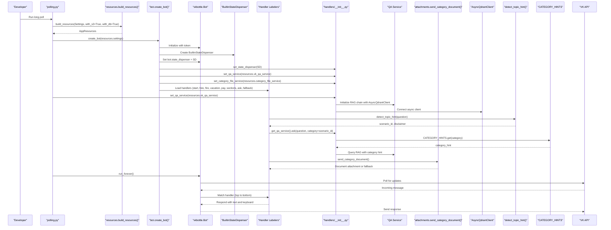

**Diagram sources**
- [polling.py:17-31](file://packages/vk_bot/src/cafetera_vk_bot/polling.py#L17-L31)
- [resources.py:51-165](file://packages/core/src/cafetera_core/resources.py#L51-L165)
- [bot.py:49-52](file://packages/vk_bot/src/cafetera_vk_bot/bot.py#L49-L52)
- [handlers/__init__.py:32-39](file://packages/vk_bot/src/cafetera_vk_bot/handlers/__init__.py#L32-L39)
- [handlers/__init__.py:22-29](file://packages/vk_bot/src/cafetera_vk_bot/handlers/__init__.py#L22-L29)
- [qa_service.py:51-105](file://packages/core/src/cafetera_core/domain/qa_service.py#L51-L105)
- [attachments.py:19-121](file://packages/vk_bot/src/cafetera_vk_bot/attachments.py#L19-L121)
- [topic_hints.py:87-109](file://packages/core/src/cafetera_core/domain/topic_hints.py#L87-L109)
- [prompts.py:30-55](file://packages/core/src/cafetera_core/rag/prompts.py#L30-L55)

## Centralized State Management

### Centralized State Dispenser Sharing
The new centralized state management system ensures consistent state persistence across all handlers through a shared BuiltinStateDispenser instance:

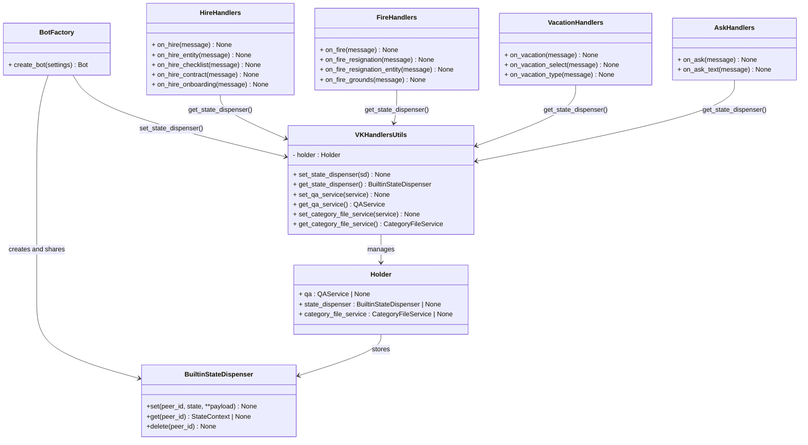

**Diagram sources**
- [bot.py:50-52](file://packages/vk_bot/src/cafetera_vk_bot/bot.py#L50-L52)
- [handlers/__init__.py:13-63](file://packages/vk_bot/src/cafetera_vk_bot/handlers/__init__.py#L13-L63)
- [hire.py:56-60](file://packages/vk_bot/src/cafetera_vk_bot/handlers/hire.py#L56-L60)
- [fire.py:40-67](file://packages/vk_bot/src/cafetera_vk_bot/handlers/fire.py#L40-L67)
- [vacation.py:50-86](file://packages/vk_bot/src/cafetera_vk_bot/handlers/vacation.py#L50-L86)
- [ask.py:40](file://packages/vk_bot/src/cafetera_vk_bot/handlers/ask.py#L40)

### Centralized State Access Patterns
All handlers now use centralized state dispenser access patterns for consistent state management:

**Updated** All handlers (hire, fire, vacation, ask, sections) now use the centralized state dispenser through get_state_dispenser() calls, replacing direct imports with consistent shared state access patterns. The enhanced fire workflow utilizes state management for the two-step resignation process and entity selection flow. The new centralized utilities module also manages CategoryFileService for document template delivery.

**Section sources**
- [bot.py:49-52](file://packages/vk_bot/src/cafetera_vk_bot/bot.py#L49-L52)
- [handlers/__init__.py:32-39](file://packages/vk_bot/src/cafetera_vk_bot/handlers/__init__.py#L32-L39)
- [hire.py:56-60](file://packages/vk_bot/src/cafetera_vk_bot/handlers/hire.py#L56-L60)
- [fire.py:40-67](file://packages/vk_bot/src/cafetera_vk_bot/handlers/fire.py#L40-L67)
- [vacation.py:50-86](file://packages/vk_bot/src/cafetera_vk_bot/handlers/vacation.py#L50-L86)
- [ask.py:40](file://packages/vk_bot/src/cafetera_vk_bot/handlers/ask.py#L40)

## Centralized QA Service Access Layer

### Centralized Utilities Module
The new centralized utilities module provides a consistent interface for QA service access, state dispenser management, and enhanced service integration across all VK handlers:

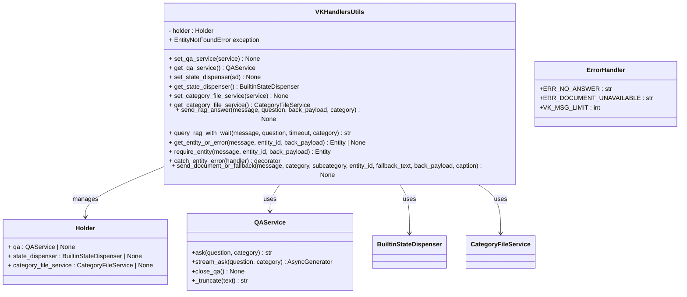

**Diagram sources**
- [handlers/__init__.py:13-63](file://packages/vk_bot/src/cafetera_vk_bot/handlers/__init__.py#L13-L63)
- [qa_service.py:23-105](file://packages/core/src/cafetera_core/domain/qa_service.py#L23-L105)

### Centralized Access Patterns
All HR-related handlers now use centralized service access patterns for consistent error handling and resource management:

**Updated** All HR-related handlers (hire, fire, pay, vacation, sections) now use the centralized utilities module for QA service access and state dispenser management, replacing direct imports with consistent get_*_service() calls and improved error handling patterns. The enhanced fire handler integrates with the centralized utilities for entity validation and document template delivery. The new CategoryFileService integration provides document template management capabilities.

**Section sources**
- [handlers/__init__.py:22-29](file://packages/vk_bot/src/cafetera_vk_bot/handlers/__init__.py#L22-L29)
- [handlers/__init__.py:32-39](file://packages/vk_bot/src/cafetera_vk_bot/handlers/__init__.py#L32-L39)
- [hire.py:63-65](file://packages/vk_bot/src/cafetera_vk_bot/handlers/hire.py#L63-L65)
- [fire.py:63-65](file://packages/vk_bot/src/cafetera_vk_bot/handlers/fire.py#L63-L65)
- [pay.py:36-46](file://packages/vk_bot/src/cafetera_vk_bot/handlers/pay.py#L36-L46)
- [vacation.py:67-80](file://packages/vk_bot/src/cafetera_vk_bot/handlers/vacation.py#L67-L80)
- [sections.py:25-45](file://packages/vk_bot/src/cafetera_vk_bot/handlers/sections.py#L25-L45)

## Enhanced RAG Response Handling

### Intelligent Timeout Handling
The new `query_rag_with_wait()` function implements sophisticated timeout handling to improve user experience during slow RAG responses:

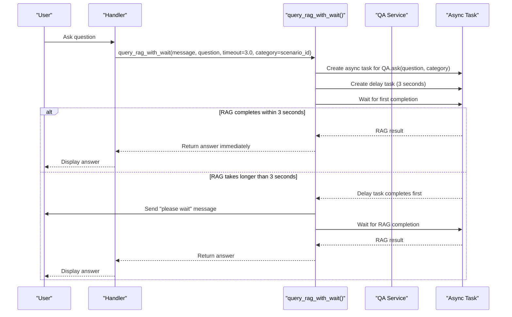

**Diagram sources**
- [handlers/__init__.py:46-68](file://packages/vk_bot/src/cafetera_vk_bot/handlers/__init__.py#L46-L68)

### Automatic Question Context Prepending
The enhanced `send_rag_answer()` function automatically prepends user question context to all answers for better clarity and traceability:

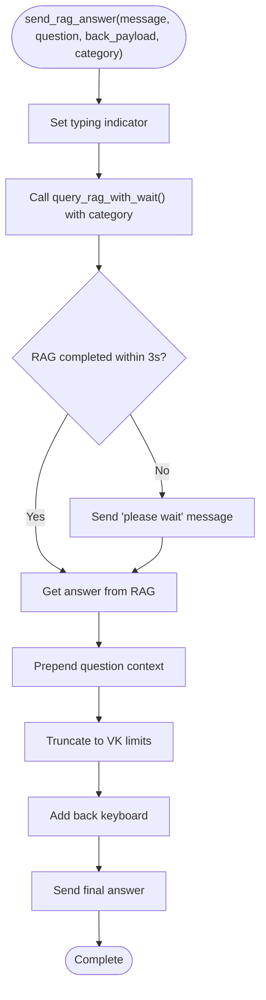

**Diagram sources**
- [handlers/__init__.py:70-86](file://packages/vk_bot/src/cafetera_vk_bot/handlers/__init__.py#L70-L86)

### Key Features of Enhanced RAG Handling
- **Intelligent Timeout Detection**: Automatically detects slow RAG responses and sends "please wait" notifications
- **User Experience Enhancement**: Prevents user frustration with unresponsive bots during slow RAG processing
- **Automatic Context Preservation**: Ensures user questions remain visible in the conversation history
- **Consistent Formatting**: Maintains standardized answer presentation across all handlers
- **Graceful Degradation**: Continues processing even when RAG responses are delayed
- **Category Parameter Support**: Enables targeted content delivery based on scenario detection

**Updated** The new timeout handling system provides a seamless user experience by automatically managing slow RAG responses, while the automatic question context prepending ensures users always have clear reference to their original questions. All RAG-enabled handlers now use the enhanced `send_rag_answer()` function for consistent user experience.

**Section sources**
- [handlers/__init__.py:46-86](file://packages/vk_bot/src/cafetera_vk_bot/handlers/__init__.py#L46-L86)
- [ask.py:75-90](file://packages/vk_bot/src/cafetera_vk_bot/handlers/ask.py#L75-L90)
- [test_ask_block9.py:94-112](file://tests/test_ask_block9.py#L94-L112)

## Category-Aware RAG Processing

### Category Parameter Specification
The enhanced RAG system now supports category-aware processing through the category parameter specification:

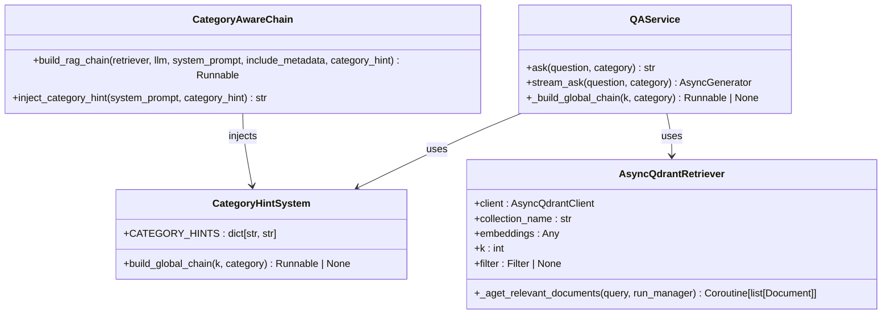

**Diagram sources**
- [qa_service.py:120-153](file://packages/core/src/cafetera_core/domain/qa_service.py#L120-L153)
- [prompts.py:30-55](file://packages/core/src/cafetera_core/rag/prompts.py#L30-L55)
- [chain.py:98-124](file://packages/core/src/cafetera_core/rag/chain.py#L98-L124)

### Category Hint Injection
The category hint system provides scenario-specific context injection into RAG system prompts:

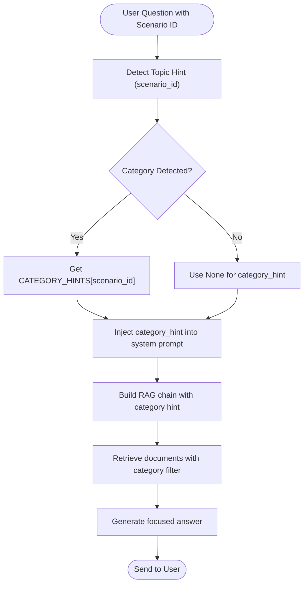

**Diagram sources**
- [topic_hints.py:87-109](file://packages/core/src/cafetera_core/domain/topic_hints.py#L87-L109)
- [prompts.py:30-55](file://packages/core/src/cafetera_core/rag/prompts.py#L30-L55)
- [chain.py:104-109](file://packages/core/src/cafetera_core/rag/chain.py#L104-L109)

### Key Features of Category-Aware Processing
- **Scenario Detection**: Automatically identifies user intent through keyword-based detection
- **Category Parameter Passing**: Passes scenario IDs as category parameters to RAG queries
- **Category Hint Injection**: Injects scenario-specific context into system prompts for focused responses
- **Targeted Content Delivery**: Enables HR-specific responses for different scenarios (hire, fire, vacation, pay, sick, probation)
- **Enhanced User Experience**: Provides more relevant and precise answers based on user intent
- **Navigation Integration**: Links scenario detections to relevant HR section navigation

**Updated** The category-aware RAG processing system represents a significant enhancement to the HR bot's intelligence. By detecting scenario IDs from user questions and passing them as category parameters to the QA service, the system can inject scenario-specific context into RAG system prompts, resulting in more focused and relevant responses. The CATEGORY_HINTS dictionary provides scenario-specific guidance for different HR domains.

**Section sources**
- [qa_service.py:120-153](file://packages/core/src/cafetera_core/domain/qa_service.py#L120-L153)
- [prompts.py:30-55](file://packages/core/src/cafetera_core/rag/prompts.py#L30-L55)
- [chain.py:98-124](file://packages/core/src/cafetera_core/rag/chain.py#L98-L124)
- [topic_hints.py:87-109](file://packages/core/src/cafetera_core/domain/topic_hints.py#L87-L109)

## Scenario ID Detection and Navigation

### Automatic Scenario ID Detection
The topic hints system now provides automatic scenario ID detection for navigation:

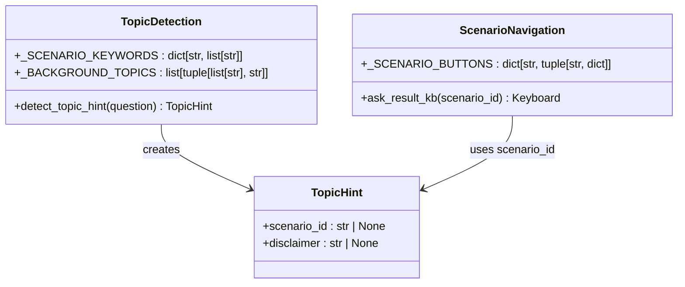

**Diagram sources**
- [topic_hints.py:14-26](file://packages/core/src/cafetera_core/domain/topic_hints.py#L14-L26)
- [topic_hints.py:87-109](file://packages/core/src/cafetera_core/domain/topic_hints.py#L87-L109)
- [keyboards.py:236-243](file://packages/vk_bot/src/cafetera_vk_bot/keyboards.py#L236-L243)

### Scenario-Based Navigation
The ask handler now uses scenario ID detection for intelligent navigation:

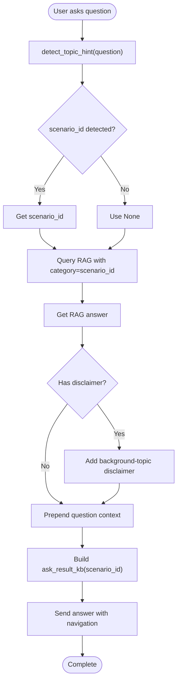

**Diagram sources**
- [ask.py:72-89](file://packages/vk_bot/src/cafetera_vk_bot/handlers/ask.py#L72-L89)
- [topic_hints.py:87-109](file://packages/core/src/cafetera_core/domain/topic_hints.py#L87-L109)
- [keyboards.py:252-262](file://packages/vk_bot/src/cafetera_vk_bot/keyboards.py#L252-L262)

### Key Features of Scenario Detection
- **Keyword-Based Detection**: Uses predefined keyword lists to identify scenario intents
- **Background Topic Priority**: Background topics take priority over clickable scenarios
- **Navigation Integration**: Automatically generates scenario-specific navigation buttons
- **Disclaimer Support**: Provides additional context for sensitive HR topics
- **Backward Compatibility**: Maintains existing functionality while adding new capabilities
- **Extensible Design**: Easy to add new scenarios and keywords

**Updated** The scenario ID detection system provides intelligent navigation by automatically analyzing user questions for HR scenario keywords. When detected, the system passes the scenario ID as a category parameter to RAG queries and generates scenario-specific navigation buttons. This creates a more intuitive user experience by connecting questions to relevant HR sections.

**Section sources**
- [topic_hints.py:14-26](file://packages/core/src/cafetera_core/domain/topic_hints.py#L14-L26)
- [topic_hints.py:87-109](file://packages/core/src/cafetera_core/domain/topic_hints.py#L87-L109)
- [ask.py:72-89](file://packages/vk_bot/src/cafetera_vk_bot/handlers/ask.py#L72-L89)
- [keyboards.py:236-262](file://packages/vk_bot/src/cafetera_vk_bot/keyboards.py#L236-L262)

## Document Template Management System

### Enhanced Fire Handler with Document Attachment
The fire handler now integrates with the document attachment system to provide company-specific resignation templates:

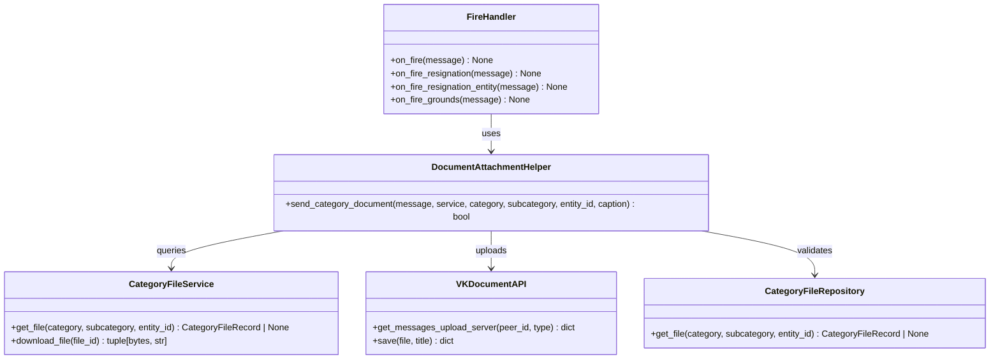

**Diagram sources**
- [fire.py:40-67](file://packages/vk_bot/src/cafetera_vk_bot/handlers/fire.py#L40-L67)
- [attachments.py:19-121](file://packages/vk_bot/src/cafetera_vk_bot/attachments.py#L19-L121)

### Document Attachment Process
The document attachment system provides seamless template delivery with fallback capabilities:

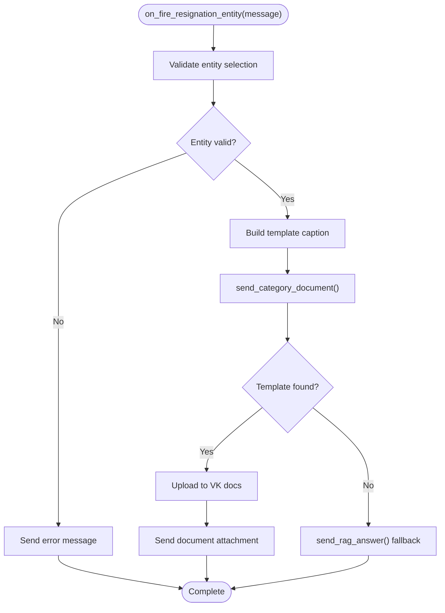

**Diagram sources**
- [fire.py:48-67](file://packages/vk_bot/src/cafetera_vk_bot/handlers/fire.py#L48-L67)
- [attachments.py:19-121](file://packages/vk_bot/src/cafetera_vk_bot/attachments.py#L19-L121)

### Key Features of Enhanced Document Management
- **Entity-Specific Templates**: Company-specific resignation templates delivered based on legal entity selection
- **Document Attachment Delivery**: Direct document attachment to VK messages with proper MIME type handling
- **Fallback Mechanism**: Automatic fallback to RAG responses when templates are unavailable
- **Error Handling**: Comprehensive error handling for S3 connectivity, VK API failures, and template validation
- **Template Validation**: Ensures templates exist before attempting delivery
- **Upload Server Integration**: Proper VK API integration for document upload and saving

**Updated** The enhanced fire handler now provides company-specific resignation templates through the document attachment system, with automatic fallback to RAG responses when templates are unavailable. This demonstrates the system's commitment to providing accurate, company-specific HR documentation.

**Section sources**
- [fire.py:1-76](file://packages/vk_bot/src/cafetera_vk_bot/handlers/fire.py#L1-L76)
- [attachments.py:1-121](file://packages/vk_bot/src/cafetera_vk_bot/attachments.py#L1-L121)

## QA Service and RAG Integration

### QA Service Architecture
The QA service provides a centralized RAG processing layer with robust error handling and resource management:

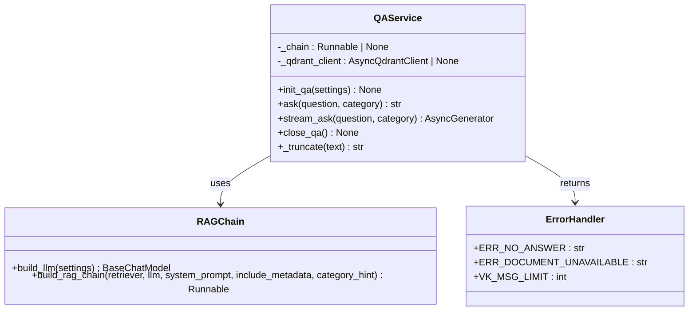

**Diagram sources**
- [qa_service.py:23-105](file://packages/core/src/cafetera_core/domain/qa_service.py#L23-L105)
- [chain.py:30-79](file://packages/core/src/cafetera_core/rag/chain.py#L30-L79)

### RAG Processing Pipeline
The RAG system integrates Qdrant vector database with configurable LLM providers:

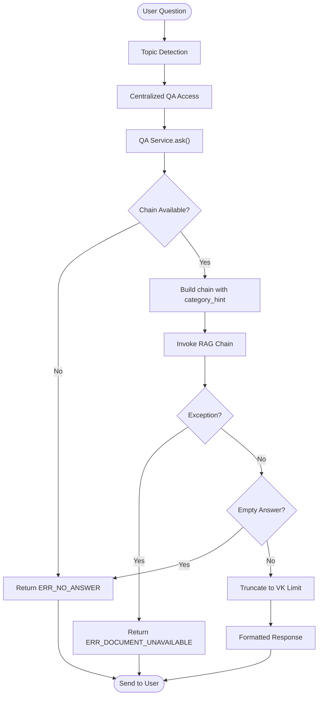

**Diagram sources**
- [qa_service.py:86-105](file://packages/core/src/cafetera_core/domain/qa_service.py#L86-L105)
- [chain.py:61-79](file://packages/core/src/cafetera_core/rag/chain.py#L61-L79)

### Handler Integration Patterns
All HR-related handlers now leverage the centralized QA service for intelligent content delivery:

**Updated** All HR-related handlers (hire, fire, pay, vacation, sections) now use the centralized utilities module for consistent QA service access and state dispenser management, providing improved error handling and resource management across all handlers. The enhanced fire handler integrates with both QA service and document attachment systems for comprehensive HR support.

**Section sources**
- [handlers/__init__.py:22-29](file://packages/vk_bot/src/cafetera_vk_bot/handlers/__init__.py#L22-L29)
- [qa_service.py:1-120](file://packages/core/src/cafetera_core/domain/qa_service.py#L1-L120)
- [chain.py:1-80](file://packages/core/src/cafetera_core/rag/chain.py#L1-L80)
- [hire.py:63-65](file://packages/vk_bot/src/cafetera_vk_bot/handlers/hire.py#L63-L65)
- [fire.py:63-65](file://packages/vk_bot/src/cafetera_vk_bot/handlers/fire.py#L63-L65)
- [pay.py:36-46](file://packages/vk_bot/src/cafetera_vk_bot/handlers/pay.py#L36-L46)
- [vacation.py:67-80](file://packages/vk_bot/src/cafetera_vk_bot/handlers/vacation.py#L67-L80)
- [sections.py:25-45](file://packages/vk_bot/src/cafetera_vk_bot/handlers/sections.py#L25-L45)

## Enhanced Fire Handler with Entity-Based Resignation Flow

### New Entity-Based Resignation Workflow
The fire handler has been significantly enhanced with a two-step entity-based resignation flow:

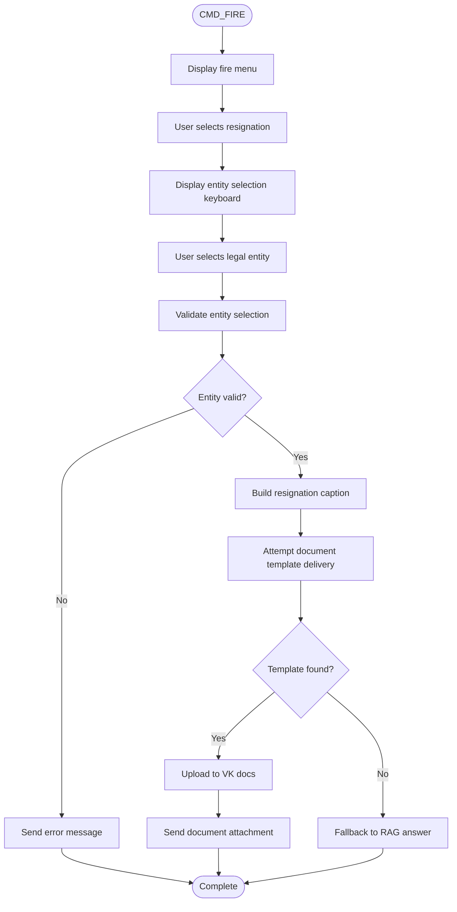

**Diagram sources**
- [fire.py:29-67](file://packages/vk_bot/src/cafetera_vk_bot/handlers/fire.py#L29-L67)
- [keyboards.py:179-185](file://packages/vk_bot/src/cafetera_vk_bot/keyboards.py#L179-L185)
- [keyboards.py:129-152](file://packages/vk_bot/src/cafetera_vk_bot/keyboards.py#L129-L152)

### Enhanced Keyboard System for Fire Flow
The keyboard system now includes specialized keyboards for the fire resignation flow:

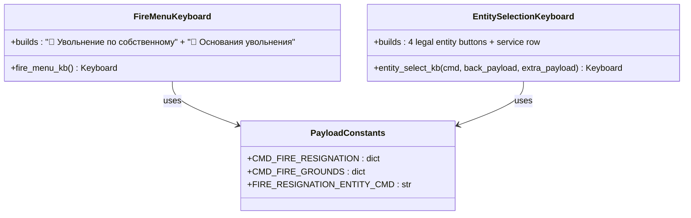

**Diagram sources**
- [keyboards.py:179-185](file://packages/vk_bot/src/cafetera_vk_bot/keyboards.py#L179-L185)
- [keyboards.py:129-152](file://packages/vk_bot/src/cafetera_vk_bot/keyboards.py#L129-L152)
- [keyboards.py:42-44](file://packages/vk_bot/src/cafetera_vk_bot/keyboards.py#L42-L44)

### Key Features of Enhanced Fire Handler
- **Entity-Based Resignation**: Users can select their legal entity for company-specific resignation templates
- **Two-Step Flow**: Clear separation between fire menu selection and entity selection
- **Document Template Integration**: Direct template delivery through document attachment system
- **Fallback Mechanisms**: Automatic fallback to RAG responses when templates are unavailable
- **Entity Validation**: Proper validation of entity selection with error handling
- **Company-Specific Content**: Templates tailored to individual legal entities

**Updated** The fire handler now provides a comprehensive entity-based resignation flow with document template delivery, representing a significant enhancement to the HR workflow capabilities. The system maintains backward compatibility while adding sophisticated company-specific template support.

**Section sources**
- [fire.py:1-76](file://packages/vk_bot/src/cafetera_vk_bot/handlers/fire.py#L1-L76)
- [keyboards.py:179-185](file://packages/vk_bot/src/cafetera_vk_bot/keyboards.py#L179-L185)
- [keyboards.py:129-152](file://packages/vk_bot/src/cafetera_vk_bot/keyboards.py#L129-L152)
- [keyboards.py:42-44](file://packages/vk_bot/src/cafetera_vk_bot/keyboards.py#L42-L44)

## Enhanced Error Handling with Decorators

### New Error Handling System
The system now features enhanced error handling consistency using require_entity functions and @catch_entity_error decorators:

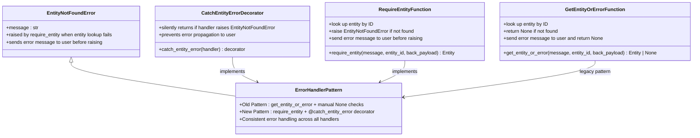

**Diagram sources**
- [handlers/__init__.py:98-141](file://packages/vk_bot/src/cafetera_vk_bot/handlers/__init__.py#L98-L141)
- [fire.py:53-57](file://packages/vk_bot/src/cafetera_vk_bot/handlers/fire.py#L53-L57)
- [hire.py:51-59](file://packages/vk_bot/src/cafetera_vk_bot/handlers/hire.py#L51-L59)

### Error Handling Patterns in Handlers
The new error handling system provides consistent patterns across all HR-related handlers:

**Updated** The fire handler now uses `@catch_entity_error` decorator combined with `require_entity` function for improved error handling. The hire handler also uses the same pattern for entity validation. The vacation handler maintains backward compatibility with the `get_entity_or_error` pattern for continued support.

**Section sources**
- [handlers/__init__.py:98-141](file://packages/vk_bot/src/cafetera_vk_bot/handlers/__init__.py#L98-L141)
- [fire.py:53-57](file://packages/vk_bot/src/cafetera_vk_bot/handlers/fire.py#L53-L57)
- [hire.py:51-59](file://packages/vk_bot/src/cafetera_vk_bot/handlers/hire.py#L51-L59)

## Async Qdrant Client Integration

### Fully Asynchronous Operations
The system now features comprehensive async Qdrant client integration that eliminates sync client overhead and enables fully asynchronous operations:

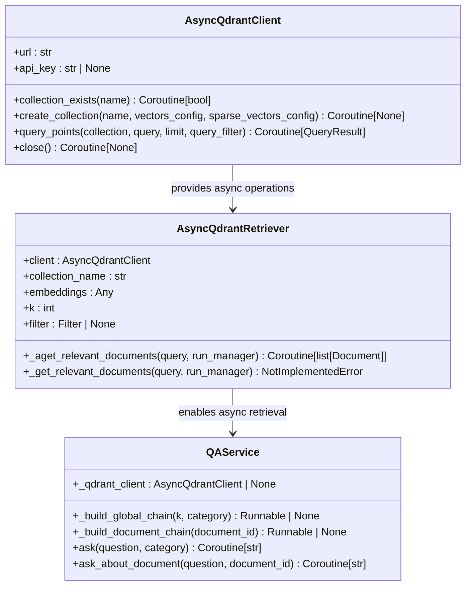

**Diagram sources**
- [retriever.py:20-53](file://packages/core/src/cafetera_core/rag/retriever.py#L20-L53)
- [retriever.py:87-89](file://packages/core/src/cafetera_core/rag/retriever.py#L87-L89)
- [qa_service.py:50-72](file://packages/core/src/cafetera_core/domain/qa_service.py#L50-L72)

### Async Resource Initialization
The new async resource management system provides proper initialization and cleanup of Qdrant clients:

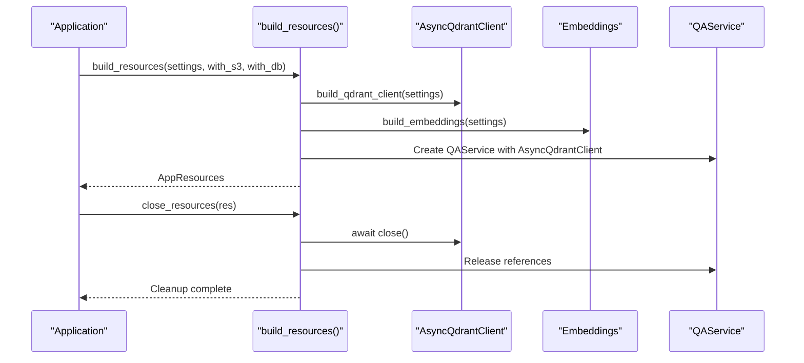

**Diagram sources**
- [resources.py:127-303](file://packages/core/src/cafetera_core/resources.py#L127-L303)
- [retriever.py:87-89](file://packages/core/src/cafetera_core/rag/retriever.py#L87-L89)

### Key Features of Async Integration
- **Fully Asynchronous Operations**: Eliminates sync client overhead with AsyncQdrantClient
- **Improved Performance**: Reduces latency and resource consumption through async patterns
- **Better Scalability**: Supports concurrent operations without blocking the event loop
- **Proper Resource Management**: Implements async cleanup with graceful degradation
- **Collection Management**: Automatically creates collections with proper vector configurations
- **Error Handling**: Provides comprehensive error handling for async operations

**Updated** The async Qdrant client integration represents a significant architectural improvement, eliminating sync client overhead and enabling fully asynchronous operations throughout the RAG pipeline. The new AsyncQdrantRetriever provides direct async access to Qdrant without LangChain's QdrantVectorStore overhead.

**Section sources**
- [retriever.py:20-53](file://packages/core/src/cafetera_core/rag/retriever.py#L20-L53)
- [retriever.py:87-89](file://packages/core/src/cafetera_core/rag/retriever.py#L87-L89)
- [resources.py:127-303](file://packages/core/src/cafetera_core/resources.py#L127-L303)
- [qa_service.py:50-72](file://packages/core/src/cafetera_core/domain/qa_service.py#L50-L72)

## Improved Resource Management

### Comprehensive Resource Lifecycle Management
The new resource management system provides proper async initialization and cleanup with graceful degradation:

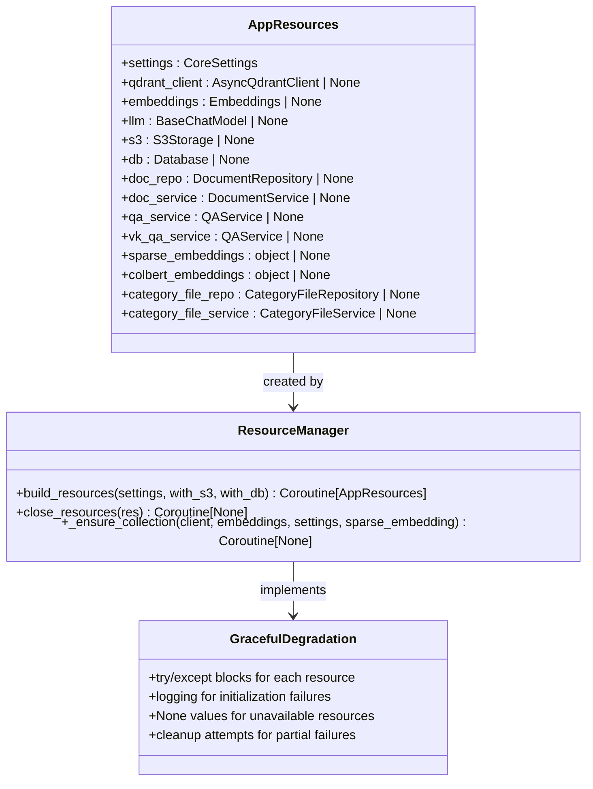

**Diagram sources**
- [resources.py:104-125](file://packages/core/src/cafetera_core/resources.py#L104-L125)
- [resources.py:127-303](file://packages/core/src/cafetera_core/resources.py#L127-L303)

### Async Resource Initialization Patterns
The new async resource management system provides robust initialization with proper error handling:

**Updated** The resource management system now uses async patterns throughout, with proper error handling and graceful degradation. Each major resource block (S3, Qdrant+embeddings, QA) is wrapped in try/except blocks with comprehensive logging. The system gracefully degrades by setting None values when resources are unavailable, allowing the application to continue functioning with reduced capabilities.

**Section sources**
- [resources.py:127-303](file://packages/core/src/cafetera_core/resources.py#L127-L303)
- [resources.py:306-344](file://packages/core/src/cafetera_core/resources.py#L306-L344)

## Hybrid Search Capabilities

### Dense and Sparse Embedding Support
The system now supports hybrid search capabilities combining dense and sparse embeddings for enhanced document retrieval:

```mermaid
classDiagram
class HybridSearch {
+retrieval_mode : str
+dense_retriever : AsyncQdrantRetriever
+sparse_embeddings : FastEmbedSparse | None
+build_retriever(settings, qdrant_client, embeddings, collection_name, k, sparse_embedding) AsyncQdrantRetriever
+build_retriever_for_document(settings, document_id, qdrant_client, embeddings, collection_name, k, sparse_embedding) AsyncQdrantRetriever
}
class DenseRetriever {
+client : AsyncQdrantClient
+collection_name : str
+embeddings : Any
+k : int
+filter : Filter | None
+_aget_relevant_documents(query, run_manager) Coroutine[list[Document]]
}
class SparseRetriever {
+model_name : str
+index : SparseIndexParams
+build_sparse_embeddings(settings) FastEmbedSparse
}
HybridSearch --> DenseRetriever : uses for dense search
HybridSearch --> SparseRetriever : uses for sparse search
```

**Diagram sources**
- [retriever.py:135-151](file://packages/core/src/cafetera_core/rag/retriever.py#L135-L151)
- [retriever.py:186-223](file://packages/core/src/cafetera_core/rag/retriever.py#L186-L223)
- [retriever.py:226-268](file://packages/core/src/cafetera_core/rag/retriever.py#L226-L268)

### Hybrid Search Configuration
The hybrid search system provides flexible configuration for different retrieval modes:

**Updated** The hybrid search system supports both dense and sparse embedding retrieval modes. When retrieval_mode is set to "hybrid", the system initializes sparse embeddings using FastEmbedSparse and configures Qdrant collections with sparse vector parameters. The AsyncQdrantRetriever can handle both dense and sparse embeddings, providing enhanced document retrieval capabilities.

**Section sources**
- [retriever.py:135-151](file://packages/core/src/cafetera_core/rag/retriever.py#L135-L151)
- [retriever.py:186-223](file://packages/core/src/cafetera_core/rag/retriever.py#L186-L223)
- [retriever.py:226-268](file://packages/core/src/cafetera_core/rag/retriever.py#L226-L268)

## Detailed Component Analysis

### Bot Factory Pattern and Handler Registration
- The factory initializes a Bot with the VK access token from Settings and establishes shared state management through BuiltinStateDispenser
- It creates a BuiltinStateDispenser instance and assigns it to both the bot and the centralized utilities module
- It loads 25 labelers in a specific order: start, ask, hire, fire, vacation, pay, sections, fallback
- The order is crucial because vkbottle evaluates handlers top-to-bottom; fallback must be last to avoid intercepting intended matches
- The QA service is initialized during bot creation and registered with the centralized utilities module for consistent access patterns
- Enhanced fire handler is now included in the handler registration process with improved error handling patterns
- **New** Package structure with `cafetera_vk_bot` namespace provides better separation of concerns
- **New** Integration with shared `cafetera_core` package for domain services and resource management
- **New** Async resource management ensures proper initialization of Qdrant clients and embeddings before handler registration
- **New** Category-aware RAG processing is integrated into the QA service initialization for scenario-based content delivery

**Updated** The factory now registers 25 total handlers across all VK integration modules, with the enhanced fire handler providing comprehensive entity-based resignation flow and improved error handling using decorators. The handler registration order ensures proper routing precedence with fallback as the last handler. The new async resource management ensures Qdrant clients and embeddings are properly initialized before any handlers attempt to use them.

```mermaid
flowchart TD
Start(["create_bot(settings)"]) --> Init["Initialize Bot with token"]
Init --> ShareState["Create BuiltinStateDispenser"]
ShareState --> AssignSD["Assign to bot.state_dispenser"]
AssignSD --> RegisterSD["Register with centralized utils"]
RegisterSD --> LoadHandlers["Load 25 labelers in order"]
LoadHandlers --> RegisterServices["Register QA service"]
RegisterServices --> RegisterCategoryService["Register CategoryFileService"]
RegisterServices --> Log["Log handler count"]
Log --> ReturnBot(["Return Bot"])
```

**Diagram sources**
- [bot.py:45-56](file://packages/vk_bot/src/cafetera_vk_bot/bot.py#L45-L56)

**Section sources**
- [bot.py:24-56](file://packages/vk_bot/src/cafetera_vk_bot/bot.py#L24-L56)
- [test_bot_factory.py:54-67](file://tests/test_bot_factory.py#L54-L67)

### Message Routing and Navigation with Payloads
- Start handler responds to initial commands and sends the main menu with service buttons
- Payload constants define navigation actions (Home, Back, Contact HR, Section commands)
- Section handlers reply with RAG-generated content and a service row keyboard
- Ask handler provides dedicated question-answering with state management using centralized state dispenser
- Fallback handler ensures users stay within the menu-driven interface
- HR request handlers manage complex multi-step workflows with state persistence through centralized state dispenser
- Enhanced fire workflow provides two-step entity selection process for resignation flow
- Document attachment system delivers company-specific templates based on entity selection
- QA service integration provides fallback content when templates are unavailable
- **New** Category-aware RAG processing enables scenario-specific content delivery through category parameter passing
- **New** Scenario ID detection automatically identifies user intent and provides navigation shortcuts
- **New** Category hint injection enhances RAG responses with scenario-specific context
- **New** Async Qdrant client integration enables fully asynchronous RAG operations
- **New** Enhanced error handling system provides consistent entity validation across all handlers using require_entity functions and @catch_entity_error decorators
- **New** Hybrid search capabilities support both dense and sparse embedding retrieval for enhanced document search

```mermaid
sequenceDiagram
participant User as "User"
participant Bot as "vkbottle.Bot"
participant Start as "start.on_start/on_home"
participant Ask as "ask.on_ask/on_ask_text"
participant Hire as "hire.on_hire/on_hire_entity"
participant Fire as "fire.on_fire/on_fire_resignation_entity"
participant Vacation as "vacation.on_vacation/on_vacation_type"
participant Pay as "pay.on_pay/on_pay_overtime"
participant Sections as "sections.on_sick/on_probation"
participant Utils as "handlers/__init__.py"
participant SD as "BuiltinStateDispenser"
participant Attachments as "attachments.send_category_document()"
participant Fallback as "fallback.on_fallback"
User->>Bot : "/start" or "Start" or "Начать"
Bot->>Start : Match text route
Start->>SD : _clear_state(peer_id)
SD-->>Start : State cleared
Start-->>User : Greeting + main menu keyboard
User->>Bot : Payload "cmd_fire"
Bot->>Fire : Match payload route
Fire->>SD : get_state_dispenser().set()
SD-->>Fire : State set
Fire->>Utils : require_entity()
Utils-->>Fire : Entity validation
Fire->>Attachments : send_category_document()
Attachments-->>Fire : Template delivery or fallback
Fire-->>User : Resignation template or RAG answer
User->>Bot : Arbitrary text
Bot->>Fallback : Match default handler
Fallback-->>User : Prompt to use menu
```

**Diagram sources**
- [start.py:34-49](file://packages/vk_bot/src/cafetera_vk_bot/handlers/start.py#L34-L49)
- [ask.py:40](file://packages/vk_bot/src/cafetera_vk_bot/handlers/ask.py#L40)
- [hire.py:69](file://packages/vk_bot/src/cafetera_vk_bot/handlers/hire.py#L69)
- [fire.py:40-67](file://packages/vk_bot/src/cafetera_vk_bot/handlers/fire.py#L40-L67)
- [vacation.py:50-116](file://packages/vk_bot/src/cafetera_vk_bot/handlers/vacation.py#L50-L116)
- [pay.py:36-46](file://packages/vk_bot/src/cafetera_vk_bot/handlers/pay.py#L36-L46)
- [sections.py:25-45](file://packages/vk_bot/src/cafetera_vk_bot/handlers/sections.py#L25-L45)
- [handlers/__init__.py:32-39](file://packages/vk_bot/src/cafetera_vk_bot/handlers/__init__.py#L32-L39)
- [attachments.py:19-121](file://packages/vk_bot/src/cafetera_vk_bot/attachments.py#L19-L121)
- [fallback.py:15-17](file://packages/vk_bot/src/cafetera_vk_bot/handlers/fallback.py#L15-L17)

**Section sources**
- [start.py:14-50](file://packages/vk_bot/src/cafetera_vk_bot/handlers/start.py#L14-L50)
- [ask.py:1-90](file://packages/vk_bot/src/cafetera_vk_bot/handlers/ask.py#L1-L90)
- [hire.py:1-119](file://packages/vk_bot/src/cafetera_vk_bot/handlers/hire.py#L1-L119)
- [fire.py:1-76](file://packages/vk_bot/src/cafetera_vk_bot/handlers/fire.py#L1-L76)
- [vacation.py:1-134](file://packages/vk_bot/src/cafetera_vk_bot/handlers/vacation.py#L1-L134)
- [pay.py:1-46](file://packages/vk_bot/src/cafetera_vk_bot/handlers/pay.py#L1-L46)
- [sections.py:1-35](file://packages/vk_bot/src/cafetera_vk_bot/handlers/sections.py#L1-L35)
- [handlers/__init__.py:13-177](file://packages/vk_bot/src/cafetera_vk_bot/handlers/__init__.py#L13-L177)
- [fallback.py:9-18](file://packages/vk_bot/src/cafetera_vk_bot/handlers/fallback.py#L9-L18)
- [keyboards.py:13-108](file://packages/vk_bot/src/cafetera_vk_bot/keyboards.py#L13-L108)

### Keyboard Builders and Payload Constants
- Payload constants define navigation semantics (home, back, contact HR, section commands)
- Keyboard builders assemble rows and append a standard service row with Back/Home/Contact HR
- The main menu keyboard organizes seven sections plus a dedicated "Contact HR" button
- Specialized keyboards support multi-step dialog flows and RAG-powered content presentation
- Enhanced fire workflow keyboards support two-step entity selection process
- Document attachment system enables dynamic template loading based on entity selection
- **New** Scenario ID detection integrates with keyboard builders for intelligent navigation
- **New** Category hint system enhances keyboard buttons with scenario-specific context

```mermaid
classDiagram
class Payloads {
+CMD_HOME
+CMD_BACK
+CMD_CONTACT_HR
+CMD_HIRE
+CMD_FIRE
+CMD_VACATION
+CMD_PAY
+CMD_SICK
+CMD_PROBATION
+CMD_ASK
+CMD_FIRE_RESIGNATION
+CMD_FIRE_GROUNDS
+CMD_HR_* (multi-step states)
+CMD_VACATION_* (enhanced workflow)
+CMD_HIRE_* (multi-step states)
+FIRE_RESIGNATION_ENTITY_CMD
}
class KeyboardBuilders {
+with_service_row(kb, back_payload, show_home, show_hr) Keyboard
+main_menu_kb() Keyboard
+ask_input_kb() Keyboard
+ask_result_kb(scenario_id) Keyboard
+hiring_*_kb() Hiring keyboards
+fire_menu_kb() Enhanced fire menu
+entity_select_kb(cmd, back_payload, extra_payload) Entity selection
+vacation_*_kb() Various vacation keyboards
+hr_*_kb() Various HR keyboards
+stub_kb(back_payload) Keyboard
}
Payloads <.. KeyboardBuilders : "used by"
```

**Diagram sources**
- [keyboards.py:13-108](file://packages/vk_bot/src/cafetera_vk_bot/keyboards.py#L13-L108)
- [keyboards.py:42-44](file://packages/vk_bot/src/cafetera_vk_bot/keyboards.py#L42-L44)

**Section sources**
- [keyboards.py:13-108](file://packages/vk_bot/src/cafetera_vk_bot/keyboards.py#L13-L108)
- [test_keyboards.py:49-92](file://tests/test_keyboards.py#L49-L92)
- [test_keyboards.py:97-150](file://tests/test_keyboards.py#L97-L150)
- [test_keyboards.py:155-171](file://tests/test_keyboards.py#L155-L171)
- [test_keyboards.py:176-192](file://tests/test_keyboards.py#L176-L192)

### Dialog States for Multi-Step Flows
- States are defined as a typed group to support multi-step dialogs (e.g., HR request wizard)
- The ask-a-question flow uses dedicated state management to handle free-text input
- The enhanced fire workflow uses state management for the two-step resignation process and entity selection
- Tests confirm the state group inherits from the base type and contains expected state names/values
- All state operations now use the centralized BuiltinStateDispenser for consistency

```mermaid
classDiagram
class BotStates {
+HR_REQUEST_NAME
+HR_REQUEST_TOPIC
+HR_REQUEST_DETAILS
+HR_REQUEST_ENTITY
+HR_REQUEST_URGENCY
+HR_REQUEST_CONFIRM
+ASK_QUESTION
+VACATION_TYPE_SELECTION
+VACATION_ENTITY_SELECTION
+VACATION_TEMPLATE_GENERATION
+HIRE_ENTITY_SELECTION
+HIRE_ACTION_SELECTION
+FIRE_RESIGNATION_ENTITY_SELECTION
}
class BuiltinStateDispenser {
+set(peer_id, state, **payload) None
+get(peer_id) StateContext | None
+delete(peer_id) None
}
BotStates --> BuiltinStateDispenser : uses
```

**Diagram sources**
- [states.py:4-17](file://packages/vk_bot/src/cafetera_vk_bot/states.py#L4-L17)

**Section sources**
- [states.py:4-17](file://packages/vk_bot/src/cafetera_vk_bot/states.py#L4-L17)
- [test_states.py:8-31](file://tests/test_states.py#L8-L31)

### Bot Initialization and Long Poll Runner
- The local runner loads Settings, creates the Bot via the factory, and starts Long Polling
- The factory initializes the QA service during bot creation and registers it with centralized utilities for immediate RAG capabilities
- Resource management handles graceful initialization and cleanup of RAG components
- Logging is configured for development visibility with RAG processing metrics
- **New** Package structure with `cafetera_vk_bot` namespace provides better separation of concerns
- **New** Integration with shared `cafetera_core` package for domain services and resource management
- **New** Async resource management ensures proper initialization of Qdrant clients and embeddings before bot creation
- **New** Category-aware RAG processing is integrated into the QA service initialization for scenario-based content delivery

```mermaid
sequenceDiagram
participant CLI as "CLI"
participant Runner as "polling.main()"
participant Resources as "resources.build_resources()"
participant Factory as "bot.create_bot()"
participant Bot as "vkbottle.Bot"
participant Utils as "handlers/__init__.py"
participant QA as "QA Service"
participant CategoryService as "CategoryFileService"
participant Attachments as "attachments Module"
CLI->>Runner : Execute script
Runner->>Resources : build_resources(Settings, with_s3=True, with_db=True)
Resources-->>Runner : AppResources
Runner->>Factory : create_bot(resources.settings)
Factory-->>Runner : Bot instance
Factory->>Utils : set_state_dispenser(bot.state_dispenser)
Factory->>Utils : set_qa_service(resources.vk_qa_service)
Factory->>Utils : set_category_file_service(resources.category_file_service)
Utils->>QA : Initialize RAG chain with AsyncQdrantClient
Utils->>CategoryService : Initialize CategoryFileService
Utils->>Attachments : Load module
Runner->>Bot : run_forever()
Bot-->>Runner : Running
```

**Diagram sources**
- [polling.py:17-31](file://packages/vk_bot/src/cafetera_vk_bot/polling.py#L17-L31)
- [resources.py:51-165](file://packages/core/src/cafetera_core/resources.py#L51-L165)
- [bot.py:49-52](file://packages/vk_bot/src/cafetera_vk_bot/bot.py#L49-L52)
- [handlers/__init__.py:32-39](file://packages/vk_bot/src/cafetera_vk_bot/handlers/__init__.py#L32-L39)
- [qa_service.py:51-81](file://packages/core/src/cafetera_core/domain/qa_service.py#L51-L81)

**Section sources**
- [polling.py:17-31](file://packages/vk_bot/src/cafetera_vk_bot/polling.py#L17-L31)
- [resources.py:51-165](file://packages/core/src/cafetera_core/resources.py#L51-L165)
- [config.py:4-16](file://packages/vk_bot/src/cafetera_vk_bot/config.py#L4-L16)

### Enhanced Ask Handler with Better UX
The ask handler has been significantly improved with better user experience:

```mermaid
flowchart TD
Start(["on_ask_text(message)"]) --> Validate["Validate question text"]
Validate --> Valid{"Question empty?"}
Valid --> |Yes| Retry["Prompt for question again"]
Valid --> |No| ClearState["Clear state"]
ClearState --> Typing["Show typing indicator"]
Typing --> Detect["Detect topic hints"]
Detect --> Query["Query RAG with wait and category"]
Query --> Hint{"Has disclaimer?"}
Hint --> |Yes| AddDisclaimer["Add background topic disclaimer"]
Hint --> |No| Prepend["Prepend question context"]
AddDisclaimer --> Prepend
Prepend --> Truncate["Truncate if too long"]
Truncate --> Answer["Send answer with scenario keyboard"]
Retry --> End(["End"])
Answer --> End
```

**Diagram sources**
- [ask.py:51-89](file://packages/vk_bot/src/cafetera_vk_bot/handlers/ask.py#L51-L89)

**Section sources**
- [ask.py:1-90](file://packages/vk_bot/src/cafetera_vk_bot/handlers/ask.py#L1-L90)

### Enhanced Vacation Workflow with Two-Step Selection and Template Attachment
The vacation workflow has been significantly enhanced with a two-step selection process and document template attachment:

```mermaid
flowchart TD
Start(["CMD_VACATION"]) --> Menu["Display vacation menu"]
Menu --> SelectType["User selects vacation type"]
SelectType --> TypeKB["Display vacation type keyboard"]
TypeKB --> EntitySelect["User selects legal entity"]
EntitySelect --> EntityKB["Display entity selection keyboard"]
EntityKB --> Template["Generate vacation template"]
Template --> CFService["CategoryFileService.get_file()"]
CFService --> S3Download["Download template from S3"]
S3Download --> SendAttachment["Send document attachment"]
SendAttachment --> End(["Complete"])
Template --> SendText["Fallback to text template"]
SendText --> End
```

**Diagram sources**
- [vacation.py:50-116](file://packages/vk_bot/src/cafetera_vk_bot/handlers/vacation.py#L50-L116)

**Updated** The vacation workflow now features a two-step selection process: first selecting the vacation type (paid/unpaid), then selecting the legal entity for template generation. The system attempts to send document attachments first, falling back to text templates if no template is available. This provides better user experience and ensures accurate template generation based on company-specific policies.

**Section sources**
- [vacation.py:1-134](file://packages/vk_bot/src/cafetera_vk_bot/handlers/vacation.py#L1-L134)

### Enhanced Legal Entity Definitions
The legal entity definitions have been updated with new company names:

**Updated** The legal entities now include four companies with their full legal names:
- "Кафетера" (Ooo "Кафетера Групп Рус")
- "Вкусно" (Ooo "Вкусно")
- "Аврора" (Ooo "Аврора РусКо")
- "СМАРТ" (Ooo "СМАРТ ПИТАНИЕ")

These entities are used across hiring, vacation, and HR request workflows for accurate policy generation.

**Section sources**
- [entities.py:1-24](file://packages/core/src/cafetera_core/domain/entities.py#L1-L24)

### Sections Handler Using New Helper Function
The sections handler now uses the new `send_rag_answer()` helper function for consistent RAG response handling:

**Updated** The sections handler has been simplified to use the centralized `send_rag_answer()` function, which automatically handles typing indicators, timeout detection, question context prepending, and keyboard generation. This ensures consistent user experience across all RAG-enabled handlers.

**Section sources**
- [sections.py:1-35](file://packages/vk_bot/src/cafetera_vk_bot/handlers/sections.py#L1-L35)

### Enhanced Error Handling Implementation
The new error handling system provides consistent patterns across all handlers:

**Updated** The enhanced error handling system replaces the previous get_entity_or_error pattern with require_entity functions and @catch_entity_error decorators. The fire handler now uses `@catch_entity_error` decorator combined with `require_entity` function for improved error handling. The hire handler also uses the same pattern. The vacation handler maintains backward compatibility with the `get_entity_or_error` pattern for continued support.

**Section sources**
- [handlers/__init__.py:98-141](file://packages/vk_bot/src/cafetera_vk_bot/handlers/__init__.py#L98-L141)
- [fire.py:53-57](file://packages/vk_bot/src/cafetera_vk_bot/handlers/fire.py#L53-L57)
- [hire.py:51-59](file://packages/vk_bot/src/cafetera_vk_bot/handlers/hire.py#L51-L59)

## Dependency Analysis
External dependencies relevant to VK integration:
- vkbottle is the primary framework for VK bot development
- pydantic-settings provides typed configuration from environment variables
- pytest is used for unit tests covering factory wiring, keyboards, states, QA service integration, and enhanced handler functionality
- LangChain provides the RAG framework with configurable LLM providers
- **New** qdrant-client provides AsyncQdrantClient for fully asynchronous vector database operations
- **New** langchain-qdrant provides integration with Qdrant vector database
- **New** fastembed provides sparse embedding support for hybrid search
- **New** category-aware RAG processing with scenario ID detection and category hint injection
- **New** topic hints system for automatic scenario identification
- **New** category hint system for scenario-specific RAG context
- aiobotocore provides async S3/MinIO client for cloud storage
- aiosqlite provides async SQLite access for metadata storage
- **New** Package structure with `cafetera_vk_bot` namespace and `cafetera_core` shared package

```mermaid
graph LR
VKBot["VK Bot (bot.py)"] --> VKFw["vkbottle"]
VKBot --> Cfg["Settings (config.py)"]
VKBot --> Utils["Centralized Utils (handlers/__init__.py)"]
Utils --> SD["BuiltinStateDispenser"]
Utils --> QA["QA Service (qa_service.py)"]
Utils --> CategoryService["CategoryFileService"]
Utils --> Attachments["Document Attachments (attachments.py)"]
Attachments --> CategoryRepo["CategoryFileRepository"]
Attachments --> S3["S3Storage"]
QA --> LangChain["LangChain"]
QA --> AsyncQdrant["AsyncQdrantClient"]
QA --> FastEmbed["FastEmbed (hybrid)"]
QA --> Prompts["CATEGORY_HINTS (prompts.py)"]
QA --> TopicHints["detect_topic_hint (topic_hints.py)"]
Resources["Resources (resources.py)"] --> VKBot
Resources --> QA
Resources --> CategoryService
Resources --> Attachments
Tests["Tests"] --> VKBot
Tests --> Utils
Tests --> QA
Tests --> CategoryService
Tests --> Attachments
Tests --> VKFw
Tests --> Cfg
```

**Diagram sources**
- [bot.py:7-10](file://packages/vk_bot/src/cafetera_vk_bot/bot.py#L7-L10)
- [config.py:4-16](file://packages/vk_bot/src/cafetera_vk_bot/config.py#L4-L16)
- [handlers/__init__.py:32-39](file://packages/vk_bot/src/cafetera_vk_bot/handlers/__init__.py#L32-L39)
- [qa_service.py:60-81](file://packages/core/src/cafetera_core/domain/qa_service.py#L60-L81)
- [attachments.py:19-121](file://packages/vk_bot/src/cafetera_vk_bot/attachments.py#L19-L121)
- [category_repo.py:47-52](file://packages/core/src/cafetera_core/storage/category_repo.py#L47-L52)
- [s3.py:14-37](file://packages/core/src/cafetera_core/storage/s3.py#L14-L37)
- [resources.py:51-165](file://packages/core/src/cafetera_core/resources.py#L51-L165)
- [prompts.py:30-55](file://packages/core/src/cafetera_core/rag/prompts.py#L30-L55)
- [topic_hints.py:87-109](file://packages/core/src/cafetera_core/domain/topic_hints.py#L87-L109)
- [pyproject.toml:1-17](file://packages/vk_bot/pyproject.toml#L1-L17)

**Section sources**
- [pyproject.toml:1-17](file://packages/vk_bot/pyproject.toml#L1-L17)
- [bot.py:7-10](file://packages/vk_bot/src/cafetera_vk_bot/bot.py#L7-L10)
- [config.py:4-16](file://packages/vk_bot/src/cafetera_vk_bot/config.py#L4-L16)
- [handlers/__init__.py:32-39](file://packages/vk_bot/src/cafetera_vk_bot/handlers/__init__.py#L32-L39)
- [qa_service.py:60-81](file://packages/core/src/cafetera_core/domain/qa_service.py#L60-L81)
- [attachments.py:19-121](file://packages/vk_bot/src/cafetera_vk_bot/attachments.py#L19-L121)
- [category_repo.py:47-52](file://packages/core/src/cafetera_core/storage/category_repo.py#L47-L52)
- [s3.py:14-37](file://packages/core/src/cafetera_core/storage/s3.py#L14-L37)
- [resources.py:51-165](file://packages/core/src/cafetera_core/resources.py#L51-L165)
- [prompts.py:30-55](file://packages/core/src/cafetera_core/rag/prompts.py#L30-L55)
- [topic_hints.py:87-109](file://packages/core/src/cafetera_core/domain/topic_hints.py#L87-L109)

## Performance Considerations
- Handler order minimizes unnecessary evaluations; keep fallback last
- Centralized state dispenser sharing provides consistent resource management with connection pooling and graceful degradation
- Centralized QA service access provides consistent resource management with connection pooling and graceful degradation
- Enhanced document attachment system provides efficient template delivery with proper error handling and fallback mechanisms
- RAG responses are truncated to VK message limits to prevent API errors
- Keyboard construction is lightweight; reuse shared keyboards and payloads to reduce overhead
- Long Poll mode is suitable for small to medium workloads; consider webhooks for higher throughput
- Avoid heavy synchronous operations inside handlers; delegate to async tasks when needed
- Centralized utilities provide consistent error handling and fallback responses for QA service failures
- Shared state dispenser reduces memory overhead across handlers
- Resource management handles graceful initialization and cleanup of RAG components
- **New** Package structure with `cafetera_vk_bot` namespace provides better separation of concerns and modularity
- **New** Integration with shared `cafetera_core` package reduces code duplication and improves maintainability
- **New** Category-aware RAG processing reduces retrieval scope through category parameter filtering
- **New** Scenario ID detection improves response relevance by focusing on specific HR domains
- **New** Category hint injection enhances RAG responses with scenario-specific context without additional retrieval costs
- **New** Async Qdrant client integration eliminates sync client overhead and improves performance
- **New** Fully asynchronous operations reduce latency and resource consumption
- **New** Async resource management ensures proper initialization order and cleanup
- **New** Hybrid search capabilities provide enhanced document retrieval performance
- **New** Intelligent timeout handling prevents blocking operations and improves perceived performance
- **New** Automatic question context prepending reduces user confusion and improves conversation clarity
- **New** The `send_rag_answer()` helper function standardizes RAG response handling across all handlers, reducing code duplication and improving consistency
- **New** Enhanced fire workflow with entity-based resignation flow improves user experience and reduces errors
- **New** Updated legal entity definitions with full company names improve accuracy and professionalism
- **New** Document attachment system provides scalable template delivery with lazy initialization and proper error handling
- **New** Enhanced keyboard system with entity selection provides better user experience for multi-step workflows
- **New** Improved test infrastructure validates enhanced handler functionality and handler count expectations
- **New** Enhanced error handling system provides consistent patterns across all handlers using require_entity functions and @catch_entity_error decorators
- **New** EntityNotFoundError class provides clear error semantics for entity validation failures
- **New** Graceful degradation ensures application continues functioning even when resources are unavailable

## Troubleshooting Guide
Common issues and resolutions:
- Handler not triggered:
  - Verify handler order and that fallback is last
  - Confirm payload keys match exactly (case-sensitive)
  - Check for proper handler registration in factory
- Incorrect keyboard layout:
  - Validate main menu composition and service row inclusion
  - Ensure payloads are present and unique
  - Verify entity selection keyboards are properly constructed
- Token errors:
  - Confirm VK access token is set in environment and forwarded to the Bot
- QA service failures:
  - Check Qdrant connectivity and LLM provider availability
  - Verify settings for qdrant_url, qdrant_api_key, qdrant_collection
  - Monitor for RAG chain initialization warnings
  - Ensure centralized QA service is properly initialized before handlers are loaded
- Document attachment failures:
  - Check S3 connectivity and bucket permissions
  - Verify settings for s3_endpoint_url, s3_access_key, s3_secret_key, s3_bucket
  - Ensure CategoryFileService is properly initialized before handlers are loaded
  - Monitor for S3 client initialization warnings
  - Verify document upload server integration with VK API
- Multi-step dialogs:
  - Use state groups to track user progress and avoid ambiguous replies
  - Verify state dispenser is properly shared between bot and handlers
  - Check entity validation logic for proper error handling
- RAG response issues:
  - Check for VK message length truncation
  - Verify topic detection and scenario linking
- Centralized access errors:
  - Ensure set_qa_service() and set_state_dispenser() are called before handler registration
  - Verify get_qa_service() and get_state_dispenser() are imported correctly in handler modules
- State management issues:
  - Verify BuiltinStateDispenser is properly shared between bot and handlers
  - Check that set_state_dispenser() is called during bot creation
  - Ensure get_state_dispenser() is used consistently across all handlers
- **New** Package structure issues:
  - Verify `cafetera_vk_bot` namespace is properly installed and importable
  - Check that `cafetera_core` package is available and properly configured
  - Ensure proper import paths for all modules under the new namespace
- **New** Category-aware RAG processing issues:
  - Verify category parameter is properly passed from topic detection
  - Check that CATEGORY_HINTS contains the expected scenario IDs
  - Ensure category_hint injection is working correctly in RAG chain building
  - Verify scenario ID detection is returning expected values
- **New** Scenario ID detection issues:
  - Check that _SCENARIO_KEYWORDS contains expected keywords for each scenario
  - Verify topic_hints.detect_topic_hint() is properly imported and used
  - Ensure scenario buttons are properly mapped in _SCENARIO_BUTTONS
  - Check that ask_result_kb() is receiving scenario_id correctly
- **New** Category hint system issues:
  - Verify CATEGORY_HINTS dictionary contains all expected scenario IDs
  - Check that category_hint injection is working in build_rag_chain()
  - Ensure scenario-specific context is being added to system prompts
  - Verify category parameter is being passed correctly through the QA service
- **New** Async Qdrant client issues:
  - Verify AsyncQdrantClient is properly initialized with correct URL and API key
  - Check for async resource initialization order in build_resources()
  - Ensure collection exists before attempting retrieval operations
  - Verify proper async cleanup in close_resources()
- **New** Hybrid search configuration issues:
  - Check retrieval_mode setting in config.py
  - Verify fastembed installation for sparse embeddings
  - Ensure Qdrant collection is created with proper sparse vector configuration
  - Test sparse embedding model availability
- **New** Resource lifecycle issues:
  - Verify async resource initialization order
  - Check for proper error handling in resource initialization
  - Ensure graceful degradation when resources are unavailable
  - Verify proper cleanup order in close_resources()
- **New** Timeout handling issues:
  - Verify query_rag_with_wait() is properly imported in handlers
  - Check that timeout values are appropriate for your RAG service performance
  - Ensure "please wait" messages are being sent correctly
- **New** Question context issues:
  - Verify send_rag_answer() is being used instead of direct QA service calls
  - Check that question truncation logic is working correctly
  - Ensure back_payload parameters are properly passed to maintain navigation
- **New** Helper function integration issues:
  - Verify send_rag_answer() is imported from the centralized utilities module
  - Check that all handlers using the helper function are properly updated
  - Ensure the helper function is available in the handlers/__init__.py module
- **New** Fire handler issues:
  - Verify entity-based resignation flow is working correctly
  - Check that entity selection keyboard is properly generated
  - Ensure template generation uses correct entity information
  - Verify CategoryFileService is properly initialized for template attachment
  - Check document attachment system for proper template delivery
- **New** Handler count validation issues:
  - Verify factory registers all 25 handlers correctly
  - Check test expectations for updated handler counts
  - Ensure proper handler ordering with fallback as last
- **New** Error handling issues:
  - Verify @catch_entity_error decorator is properly imported and applied
  - Check that require_entity function is used instead of get_entity_or_error
  - Ensure EntityNotFoundError is properly handled by decorators
  - Verify error handling consistency across all handlers

Validation references:
- Handler order and counts: [test_bot_factory.py:18-86](file://tests/test_bot_factory.py#L18-L86)
- QA service integration: [test_qa_service.py:176-198](file://tests/test_qa_service.py#L176-L198)
- Keyboard composition and payloads: [test_keyboards.py:49-92](file://tests/test_keyboards.py#L49-L92), [test_keyboards.py:176-192](file://tests/test_keyboards.py#L176-L192)
- state definitions: [test_states.py:8-31](file://tests/test_states.py#L8-L31)
- Centralized access patterns: [handlers/__init__.py:22-39](file://packages/vk_bot/src/cafetera_vk_bot/handlers/__init__.py#L22-L39)
- Enhanced fire handler functionality: [fire.py:40-67](file://packages/vk_bot/src/cafetera_vk_bot/handlers/fire.py#L40-L67)
- Document attachment system: [attachments.py:19-121](file://packages/vk_bot/src/cafetera_vk_bot/attachments.py#L19-L121)
- State dispenser sharing: [test_bot_factory.py:82-86](file://tests/test_bot_factory.py#L82-L86)
- **New** Package structure validation: [pyproject.toml:1-17](file://packages/vk_bot/pyproject.toml#L1-L17)
- **New** Category-aware RAG processing: [qa_service.py:120-153](file://packages/core/src/cafetera_core/domain/qa_service.py#L120-L153)
- **New** Scenario ID detection: [topic_hints.py:87-109](file://packages/core/src/cafetera_core/domain/topic_hints.py#L87-L109)
- **New** Category hint system: [prompts.py:30-55](file://packages/core/src/cafetera_core/rag/prompts.py#L30-L55)
- **New** Async Qdrant client integration: [retriever.py:20-53](file://packages/core/src/cafetera_core/rag/retriever.py#L20-L53)
- **New** Enhanced error handling patterns: [handlers/__init__.py:98-141](file://packages/vk_bot/src/cafetera_vk_bot/handlers/__init__.py#L98-L141)
- **New** Fire handler with decorators: [fire.py:53-57](file://packages/vk_bot/src/cafetera_vk_bot/handlers/fire.py#L53-L57)
- **New** Hire handler with decorators: [hire.py:51-59](file://packages/vk_bot/src/cafetera_vk_bot/handlers/hire.py#L51-L59)
- **New** Vacation handler with backward compatibility: [vacation.py:79-86](file://packages/vk_bot/src/cafetera_vk_bot/handlers/vacation.py#L79-L86)
- **New** Hybrid search capabilities: [retriever.py:135-151](file://packages/core/src/cafetera_core/rag/retriever.py#L135-L151)
- **New** Resource lifecycle management: [resources.py:127-303](file://packages/core/src/cafetera_core/resources.py#L127-L303)
- **New** Intelligent timeout handling: [handlers/__init__.py:58-88](file://packages/vk_bot/src/cafetera_vk_bot/handlers/__init__.py#L58-88)
- **New** Automatic question context prepending: [handlers/__init__.py:90-99](file://packages/vk_bot/src/cafetera_vk_bot/handlers/__init__.py#L90-99)

**Section sources**
- [test_bot_factory.py:18-86](file://tests/test_bot_factory.py#L18-L86)
- [test_qa_service.py:176-198](file://tests/test_qa_service.py#L176-L198)
- [test_keyboards.py:49-92](file://tests/test_keyboards.py#L49-L92)
- [test_keyboards.py:176-192](file://tests/test_keyboards.py#L176-L192)
- [test_states.py:8-31](file://tests/test_states.py#L8-L31)
- [handlers/__init__.py:22-39](file://packages/vk_bot/src/cafetera_vk_bot/handlers/__init__.py#L22-L39)
- [fire.py:40-67](file://packages/vk_bot/src/cafetera_vk_bot/handlers/fire.py#L40-L67)
- [attachments.py:19-121](file://packages/vk_bot/src/cafetera_vk_bot/attachments.py#L19-L121)
- [handlers/__init__.py:98-141](file://packages/vk_bot/src/cafetera_vk_bot/handlers/__init__.py#L98-L141)
- [fire.py:53-57](file://packages/vk_bot/src/cafetera_vk_bot/handlers/fire.py#L53-L57)
- [hire.py:51-59](file://packages/vk_bot/src/cafetera_vk_bot/handlers/hire.py#L51-L59)
- [vacation.py:79-86](file://packages/vk_bot/src/cafetera_vk_bot/handlers/vacation.py#L79-L86)
- [retriever.py:20-53](file://packages/core/src/cafetera_core/rag/retriever.py#L20-L53)
- [retriever.py:135-151](file://packages/core/src/cafetera_core/rag/retriever.py#L135-L151)
- [resources.py:127-303](file://packages/core/src/cafetera_core/resources.py#L127-L303)
- [qa_service.py:120-153](file://packages/core/src/cafetera_core/domain/qa_service.py#L120-L153)
- [prompts.py:30-55](file://packages/core/src/cafetera_core/rag/prompts.py#L30-L55)
- [topic_hints.py:87-109](file://packages/core/src/cafetera_core/domain/topic_hints.py#L87-L109)
- [handlers/__init__.py:58-88](file://packages/vk_bot/src/cafetera_vk_bot/handlers/__init__.py#L58-88)
- [handlers/__init__.py:90-99](file://packages/vk_bot/src/cafetera_vk_bot/handlers/__init__.py#L90-99)

## Conclusion
The VK integration leverages a clean factory pattern with centralized state dispenser sharing, deterministic handler ordering, payload-driven navigation, and comprehensive RAG integration with centralized service management to deliver a sophisticated, extensible bot. The system now includes significant user experience improvements through intelligent timeout handling for RAG responses, automatic question context prepending, enhanced fire workflow with entity-based resignation flow, document template attachment capabilities, and updated legal entity definitions with new company names.

**Updated** The system now features enhanced category-aware functionality with scenario ID passing and category parameter specification for RAG queries. This represents a major advancement in HR bot intelligence, enabling targeted content delivery based on user intent detection. The category-aware RAG processing system automatically detects scenario IDs from user questions, passes them as category parameters to the QA service, and injects scenario-specific context into system prompts for focused responses. The scenario ID detection system provides intelligent navigation by generating scenario-specific buttons and maintaining backward compatibility with existing functionality.

The new package structure with `cafetera_vk_bot` namespace provides better separation of concerns and integration with the shared `cafetera_core` package for domain services and resource management. The new async resource management system ensures proper initialization order and cleanup of Qdrant clients and embeddings, while the enhanced error handling consistency with new require_entity decorators and @catch_entity_error decorators provides improved reliability and user experience across all HR-related handlers.

The new `query_rag_with_wait()` function provides intelligent timeout detection that automatically sends "please wait" notifications when RAG responses take longer than 3 seconds, while the `send_rag_answer()` helper function standardizes RAG response handling across all handlers by automatically setting typing indicators, querying RAG with timeout handling, prepending question context, truncating responses to VK limits, and adding appropriate navigation keyboards.

The enhanced fire handler with entity-based resignation flow represents a significant advancement in HR workflow automation, providing company-specific templates and seamless document delivery. The document attachment system ensures accurate, company-specific HR documentation while maintaining backward compatibility with RAG-based fallback responses.

The new async Qdrant client integration eliminates sync client overhead and enables fully asynchronous operations throughout the RAG pipeline, while the comprehensive resource management system provides proper initialization and cleanup with graceful degradation. The hybrid search capabilities support both dense and sparse embedding retrieval for enhanced document search performance.

The new enhanced error handling system provides consistent patterns across all handlers using require_entity functions and @catch_entity_error decorators, with EntityNotFoundError class providing clear error semantics for entity validation failures. The system maintains backward compatibility with the vacation handler's use of get_entity_or_error pattern while adopting the new patterns in fire and hire handlers.

By following the established patterns—registering labelers in order, using shared keyboard builders, implementing centralized state management, integrating the centralized QA service access layer, following the centralized initialization process, and implementing consistent error handling patterns—the system supports easy extension and maintenance. For production, consider migrating to VK webhooks, adding structured error handling and logging, and implementing proper QA service lifecycle management.

## Appendices

### Extending the Bot with New Handlers
Steps to add a new section:
- Define a payload constant for the new command
- Add a handler in a new or existing module annotated with the payload
- Import and use the centralized state dispenser, QA service access patterns:
  - Use `from cafetera_vk_bot.handlers import get_state_dispenser` for state management
  - Use `from cafetera_vk_bot.handlers import get_qa_service` for direct access
  - Use `from cafetera_vk_bot.handlers import send_rag_answer` for standardized RAG responses
  - Use `from cafetera_vk_bot.handlers import require_entity` for entity validation
  - Use `from cafetera_vk_bot.handlers import catch_entity_error` for error handling
- Build a keyboard with the service row to ensure Back/Home/Contact HR are always available
- Register the new labeler in the factory's loader list and ensure it precedes fallback
- Update handler count expectations in tests
- **New** Verify proper import paths for the new `cafetera_vk_bot` namespace
- **New** Ensure integration with shared `cafetera_core` package for domain services
- **New** Implement proper error handling using require_entity and @catch_entity_error patterns
- **New** Ensure async resource initialization order if using Qdrant or other async resources
- **New** Consider implementing category-aware RAG processing for scenario-specific content delivery
- **New** Integrate scenario ID detection for intelligent navigation capabilities

**Updated** When adding new handlers, integrate with the centralized state dispenser and QA service by importing from `cafetera_vk_bot.handlers` and using the provided utility functions for consistent error handling and resource management. Consider using `query_rag_with_wait()` for any handler that processes user questions to provide better user experience during slow RAG responses, and use `send_rag_answer()` for standardized RAG response handling across all handlers. For multi-step workflows with template attachment, consider implementing document attachment system integration using the provided helper functions. Implement proper error handling using require_entity and @catch_entity_error patterns for consistent error handling across all handlers. Ensure proper async resource initialization order if using Qdrant or other async resources.

References:
- Payload constants: [keyboards.py:13-24](file://packages/vk_bot/src/cafetera_vk_bot/keyboards.py#L13-L24)
- Handler registration order: [bot.py:31-41](file://packages/vk_bot/src/cafetera_vk_bot/bot.py#L31-L41)
- Centralized state dispenser access: [handlers/__init__.py:32-39](file://packages/vk_bot/src/cafetera_vk_bot/handlers/__init__.py#L32-L39)
- Centralized QA access patterns: [handlers/__init__.py:22-29](file://packages/vk_bot/src/cafetera_vk_bot/handlers/__init__.py#L22-L29)
- Keyboard service row: [keyboards.py:29-50](file://packages/vk_bot/src/cafetera_vk_bot/keyboards.py#L29-L50)
- Enhanced fire handler integration: [fire.py:40-67](file://packages/vk_bot/src/cafetera_vk_bot/handlers/fire.py#L40-L67)
- Document attachment system: [attachments.py:19-121](file://packages/vk_bot/src/cafetera_vk_bot/attachments.py#L19-L121)
- **New** Package structure validation: [pyproject.toml:1-17](file://packages/vk_bot/pyproject.toml#L1-L17)
- **New** Category-aware RAG processing: [qa_service.py:120-153](file://packages/core/src/cafetera_core/domain/qa_service.py#L120-L153)
- **New** Scenario ID detection: [topic_hints.py:87-109](file://packages/core/src/cafetera_core/domain/topic_hints.py#L87-L109)
- **New** Category hint system: [prompts.py:30-55](file://packages/core/src/cafetera_core/rag/prompts.py#L30-L55)
- **New** Async Qdrant client integration: [retriever.py:20-53](file://packages/core/src/cafetera_core/rag/retriever.py#L20-L53)
- **New** Enhanced error handling patterns: [handlers/__init__.py:98-141](file://packages/vk_bot/src/cafetera_vk_bot/handlers/__init__.py#L98-L141)
- **New** Fire handler with decorators: [fire.py:53-57](file://packages/vk_bot/src/cafetera_vk_bot/handlers/fire.py#L53-L57)
- **New** Hire handler with decorators: [hire.py:51-59](file://packages/vk_bot/src/cafetera_vk_bot/handlers/hire.py#L51-L59)
- **New** Vacation handler with backward compatibility: [vacation.py:79-86](file://packages/vk_bot/src/cafetera_vk_bot/handlers/vacation.py#L79-L86)

**Section sources**
- [keyboards.py:13-50](file://packages/vk_bot/src/cafetera_vk_bot/keyboards.py#L13-L50)
- [bot.py:31-41](file://packages/vk_bot/src/cafetera_vk_bot/bot.py#L31-L41)
- [handlers/__init__.py:22-39](file://packages/vk_bot/src/cafetera_vk_bot/handlers/__init__.py#L22-L29)
- [fire.py:40-67](file://packages/vk_bot/src/cafetera_vk_bot/handlers/fire.py#L40-L67)
- [attachments.py:19-121](file://packages/vk_bot/src/cafetera_vk_bot/attachments.py#L19-L121)
- [handlers/__init__.py:98-141](file://packages/vk_bot/src/cafetera_vk_bot/handlers/__init__.py#L98-L141)
- [fire.py:53-57](file://packages/vk_bot/src/cafetera_vk_bot/handlers/fire.py#L53-L57)
- [hire.py:51-59](file://packages/vk_bot/src/cafetera_vk_bot/handlers/hire.py#L51-L59)
- [vacation.py:79-86](file://packages/vk_bot/src/cafetera_vk_bot/handlers/vacation.py#L79-L86)
- [retriever.py:20-53](file://packages/core/src/cafetera_core/rag/retriever.py#L20-L53)
- [qa_service.py:120-153](file://packages/core/src/cafetera_core/domain/qa_service.py#L120-L153)
- [prompts.py:30-55](file://packages/core/src/cafetera_core/rag/prompts.py#L30-L55)
- [topic_hints.py:87-109](file://packages/core/src/cafetera_core/domain/topic_hints.py#L87-L109)

### Integrating with VK Webhook System
Guidance:
- Configure a VK community webhook endpoint pointing to your server
- Replace Long Poll runner with a FastAPI route that accepts VK POST callbacks
- Parse incoming update objects and dispatch to the same handler labelers
- Ensure the Bot is initialized with the same token, labelers, and centralized state dispenser access as in Long Poll mode
- Implement proper error handling for webhook processing failures
- Maintain the centralized QA service initialization patterns for consistent access across all handlers
- Ensure state dispenser is properly shared between bot and handlers in webhook mode
- **New** Verify proper import paths for the `cafetera_vk_bot` namespace in webhook mode
- **New** Ensure integration with shared `cafetera_core` package for domain services in webhook mode
- **New** Implement consistent error handling patterns using require_entity and @catch_entity_error decorators in webhook mode
- **New** Ensure async resource initialization order for Qdrant clients and embeddings in webhook mode
- **New** Consider implementing category-aware RAG processing for webhook-based scenario detection
- **New** Ensure scenario ID detection and category hint injection work correctly in webhook mode

References:
- Bot initialization and token forwarding: [bot.py:45-58](file://packages/vk_bot/src/cafetera_vk_bot/bot.py#L45-L58), [test_bot_factory.py:75-81](file://tests/test_bot_factory.py#L75-L81)
- Handler registration: [bot.py:54-55](file://packages/vk_bot/src/cafetera_vk_bot/bot.py#L54-L55)
- Centralized state dispenser sharing: [bot.py:49-52](file://packages/vk_bot/src/cafetera_vk_bot/bot.py#L49-L52)
- Centralized QA service initialization: [handlers/__init__.py:22-29](file://packages/vk_bot/src/cafetera_vk_bot/handlers/__init__.py#L22-L29)
- **New** Package structure validation: [pyproject.toml:1-17](file://packages/vk_bot/pyproject.toml#L1-L17)
- **New** Enhanced error handling patterns: [handlers/__init__.py:98-141](file://packages/vk_bot/src/cafetera_vk_bot/handlers/__init__.py#L98-L141)
- **New** Async resource management: [resources.py:127-303](file://packages/core/src/cafetera_core/resources.py#L127-L303)
- **New** Category-aware RAG processing: [qa_service.py:120-153](file://packages/core/src/cafetera_core/domain/qa_service.py#L120-L153)

**Section sources**
- [bot.py:45-58](file://packages/vk_bot/src/cafetera_vk_bot/bot.py#L45-L58)
- [test_bot_factory.py:75-81](file://tests/test_bot_factory.py#L75-L81)
- [handlers/__init__.py:22-29](file://packages/vk_bot/src/cafetera_vk_bot/handlers/__init__.py#L22-L29)
- [handlers/__init__.py:98-141](file://packages/vk_bot/src/cafetera_vk_bot/handlers/__init__.py#L98-L141)
- [resources.py:127-303](file://packages/core/src/cafetera_core/resources.py#L127-L303)
- [qa_service.py:120-153](file://packages/core/src/cafetera_core/domain/qa_service.py#L120-L153)

### Best Practices for VK Bot Development
- Keep handler order explicit and documented
- Use payload constants to prevent typos and ensure consistency
- Prefer keyboard-driven navigation to reduce ambiguity
- Centralize keyboard building logic to enforce UX standards
- Integrate the centralized state dispenser for dynamic content generation across HR-related flows
- Integrate the centralized QA service access layer for dynamic content generation across HR-related flows
- Implement proper error handling and fallback responses for QA service failures using centralized patterns
- Add logging around handler execution and RAG processing for observability
- Validate configuration at startup and fail fast on missing tokens or service initialization failures
- Manage service lifecycles with proper resource cleanup during shutdown
- Use centralized utilities for consistent state management, error handling, and service access patterns
- Ensure state dispenser is properly shared between bot and handlers for consistent state persistence
- Implement proper resource management for graceful initialization and cleanup of RAG components
- **New** Use package structure with `cafetera_vk_bot` namespace for better separation of concerns
- **New** Integrate with shared `cafetera_core` package for domain services and resource management
- **New** Use intelligent timeout handling for any handler that processes user questions to improve user experience
- **New** Always use automatic question context prepending to maintain conversation clarity and traceability
- **New** Standardize RAG response handling across all handlers using the `send_rag_answer()` helper function
- **New** Use `query_rag_with_wait()` for any handler that processes user questions to provide intelligent timeout handling
- **New** Implement state management for multi-step workflows using the centralized BuiltinStateDispenser
- **New** Leverage the enhanced fire workflow patterns for improved user experience with entity-based resignation
- **New** Access updated legal entity definitions through the centralized utilities module for accurate content generation
- **New** Use document attachment system for all template operations with proper validation and error handling
- **New** Implement comprehensive error handling for document upload failures and template availability
- **New** Provide administrative UI for template management with proper validation and security measures
- **New** Use require_entity functions and @catch_entity_error decorators for consistent error handling across all handlers
- **New** Implement EntityNotFoundError class for clear error semantics in entity validation failures
- **New** Maintain backward compatibility with existing handlers while adopting new error handling patterns
- **New** Ensure proper async resource initialization order for Qdrant clients and embeddings
- **New** Implement graceful degradation for async resource failures
- **New** Use hybrid search capabilities for enhanced document retrieval performance
- **New** Configure retrieval_mode appropriately for dense or hybrid search requirements
- **New** Implement category-aware RAG processing for scenario-specific content delivery
- **New** Use scenario ID detection for intelligent navigation and user experience enhancement
- **New** Integrate category hint system for enhanced RAG response focus and accuracy

### Centralized State and Service Integration Patterns
- Initialize state dispenser during bot creation and register with centralized utilities for immediate state management capabilities
- Initialize QA service during bot creation and register with centralized utilities for immediate RAG capabilities
- Use `from cafetera_vk_bot.handlers import get_state_dispenser` for all state management operations
- Use `from cafetera_vk_bot.handlers import get_qa_service` for all HR-related content generation
- Use `from cafetera_vk_bot.handlers import send_rag_answer` for standardized RAG response handling
- Use `from cafetera_vk_bot.handlers import get_entity_or_error` for entity validation (legacy pattern)
- Use `from cafetera_vk_bot.handlers import require_entity` for entity validation (new pattern)
- Use `from cafetera_vk_bot.handlers import catch_entity_error` for error handling (new pattern)
- Implement proper error handling with fallback responses using centralized patterns
- Truncate long responses to VK message limits automatically through centralized access
- Close QA service during application shutdown using centralized management
- Monitor service health and implement graceful degradation strategies through centralized access layer
- Ensure centralized state dispenser is initialized before handler registration to prevent runtime errors
- Ensure centralized QA service is initialized before handler registration to prevent runtime errors
- **New** Use package structure with `cafetera_vk_bot` namespace for consistent imports and modularity
- **New** Integrate with shared `cafetera_core` package for domain services and resource management
- **New** Use intelligent timeout handling for any handler that processes user questions to provide better user experience
- **New** Always use `send_rag_answer()` instead of direct QA service calls to ensure consistent user experience and question context preservation
- **New** Leverage the centralized utilities module for consistent error handling and resource management patterns across all handlers
- **New** Implement state management patterns for multi-step workflows using the centralized BuiltinStateDispenser
- **New** Utilize the enhanced fire workflow patterns for improved user experience with entity-based resignation
- **New** Access legal entity definitions through the centralized utilities module for accurate content generation
- **New** Use document attachment system for all template operations with proper validation and error handling
- **New** Implement comprehensive error handling for document upload failures and template availability
- **New** Provide administrative UI for template management with proper validation and security measures
- **New** Use require_entity functions and @catch_entity_error decorators for consistent error handling across all handlers
- **New** Implement EntityNotFoundError class for clear error semantics in entity validation failures
- **New** Maintain backward compatibility with existing handlers while adopting new error handling patterns
- **New** Ensure proper async resource initialization order for Qdrant clients and embeddings
- **New** Implement graceful degradation for async resource failures
- **New** Use hybrid search capabilities for enhanced document retrieval performance
- **New** Configure retrieval_mode appropriately for dense or hybrid search requirements
- **New** Implement category-aware RAG processing for scenario-specific content delivery
- **New** Use scenario ID detection for intelligent navigation and user experience enhancement
- **New** Integrate category hint system for enhanced RAG response focus and accuracy

**Section sources**
- [handlers/__init__.py:22-39](file://packages/vk_bot/src/cafetera_vk_bot/handlers/__init__.py#L22-L39)
- [bot.py:49-52](file://packages/vk_bot/src/cafetera_vk_bot/bot.py#L49-L52)
- [qa_service.py:51-120](file://packages/core/src/cafetera_core/domain/qa_service.py#L51-L120)
- [test_qa_service.py:1-198](file://tests/test_qa_service.py#L1-L198)
- [test_bot_factory.py:82-86](file://tests/test_bot_factory.py#L82-L86)
- [test_ask_block9.py:94-112](file://tests/test_ask_block9.py#L94-L112)
- [states.py:4-17](file://packages/vk_bot/src/cafetera_vk_bot/states.py#L4-L17)
- [fire.py:40-67](file://packages/vk_bot/src/cafetera_vk_bot/handlers/fire.py#L40-L67)
- [entities.py:16-24](file://packages/core/src/cafetera_core/domain/entities.py#L16-L24)
- [attachments.py:19-121](file://packages/vk_bot/src/cafetera_vk_bot/attachments.py#L19-L121)
- [handlers/__init__.py:98-141](file://packages/vk_bot/src/cafetera_vk_bot/handlers/__init__.py#L98-L141)
- [fire.py:53-57](file://packages/vk_bot/src/cafetera_vk_bot/handlers/fire.py#L53-L57)
- [hire.py:51-59](file://packages/vk_bot/src/cafetera_vk_bot/handlers/hire.py#L51-L59)
- [vacation.py:79-86](file://packages/vk_bot/src/cafetera_vk_bot/handlers/vacation.py#L79-L86)
- [retriever.py:20-53](file://packages/core/src/cafetera_core/rag/retriever.py#L20-L53)
- [retriever.py:135-151](file://packages/core/src/cafetera_core/rag/retriever.py#L135-L151)
- [resources.py:127-303](file://packages/core/src/cafetera_core/resources.py#L127-L303)
- [config.py:59-62](file://packages/core/src/cafetera_core/config.py#L59-L62)
- [qa_service.py:120-153](file://packages/core/src/cafetera_core/domain/qa_service.py#L120-L153)
- [prompts.py:30-55](file://packages/core/src/cafetera_core/rag/prompts.py#L30-L55)
- [topic_hints.py:87-109](file://packages/core/src/cafetera_core/domain/topic_hints.py#L87-L109)