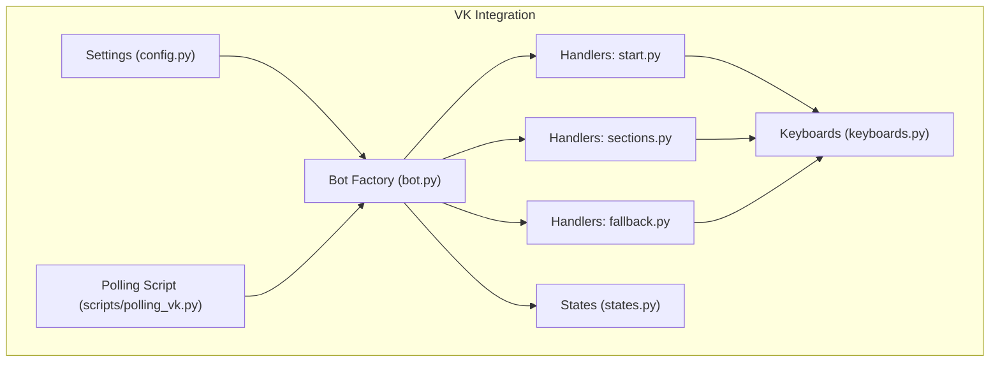
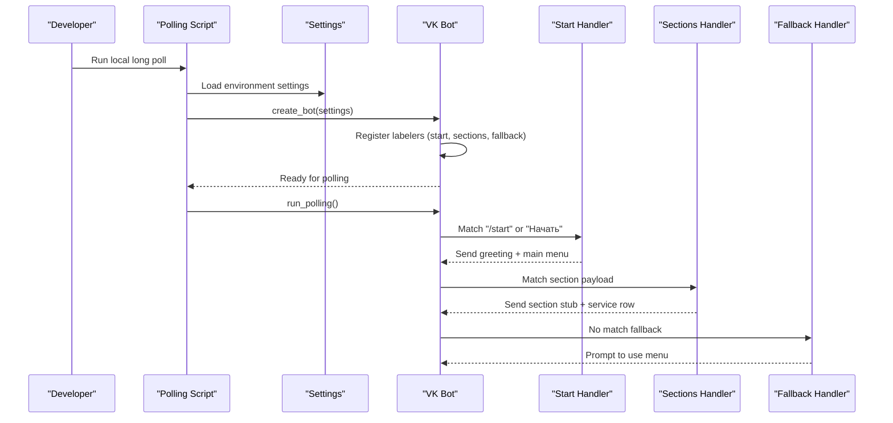
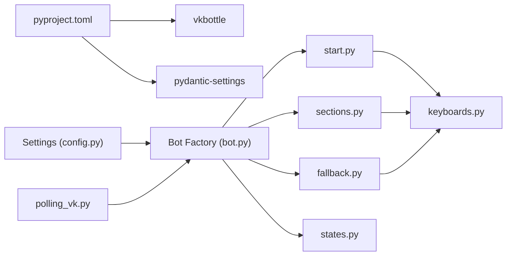

# VKontakte API Integration Patterns

<cite>
**Referenced Files in This Document**
- [bot.py](file://app/integrations/vk/bot.py)
- [config.py](file://app/config.py)
- [polling_vk.py](file://scripts/polling_vk.py)
- [start.py](file://app/integrations/vk/handlers/start.py)
- [sections.py](file://app/integrations/vk/handlers/sections.py)
- [fallback.py](file://app/integrations/vk/handlers/fallback.py)
- [keyboards.py](file://app/integrations/vk/keyboards.py)
- [states.py](file://app/integrations/vk/states.py)
- [pyproject.toml](file://pyproject.toml)
- [docker-compose.yml](file://docker-compose.yml)
- [test_config.py](file://tests/test_config.py)
- [test_bot_factory.py](file://tests/test_bot_factory.py)
</cite>

## Table of Contents
1. [Introduction](#introduction)
2. [Project Structure](#project-structure)
3. [Core Components](#core-components)
4. [Architecture Overview](#architecture-overview)
5. [Detailed Component Analysis](#detailed-component-analysis)
6. [Dependency Analysis](#dependency-analysis)
7. [Performance Considerations](#performance-considerations)
8. [Troubleshooting Guide](#troubleshooting-guide)
9. [Conclusion](#conclusion)
10. [Appendices](#appendices)

## Introduction
This document explains VKontakte API integration patterns implemented in the project, focusing on token-based authentication, bot initialization with access tokens, and the relationship between Settings configuration and VK API connectivity. It also covers common integration scenarios, error handling strategies, performance considerations, and practical guidance for webhook vs. polling modes, message processing workflows, security, rate limiting, and production deployment patterns.

## Project Structure
The VK integration is organized under app/integrations/vk with clear separation of concerns:
- Configuration and environment-driven settings
- Bot factory and handler registration
- Handler modules for start, sections, and fallback
- Keyboard builders and state management
- Local development polling entry point
- Tests validating configuration and bot wiring

**Diagram sources**
- [bot.py:23-31](file://app/integrations/vk/bot.py#L23-L31)
- [config.py:4-9](file://app/config.py#L4-L9)
- [polling_vk.py:24-28](file://scripts/polling_vk.py#L24-L28)
- [start.py:12](file://app/integrations/vk/handlers/start.py#L12)
- [sections.py:17](file://app/integrations/vk/handlers/sections.py#L17)
- [fallback.py:7](file://app/integrations/vk/handlers/fallback.py#L7)
- [keyboards.py:11-24](file://app/integrations/vk/keyboards.py#L11-L24)
- [states.py:4-14](file://app/integrations/vk/states.py#L4-L14)

**Section sources**
- [bot.py:1-32](file://app/integrations/vk/bot.py#L1-L32)
- [config.py:1-9](file://app/config.py#L1-L9)
- [polling_vk.py:1-33](file://scripts/polling_vk.py#L1-L33)
- [keyboards.py:1-108](file://app/integrations/vk/keyboards.py#L1-L108)
- [states.py:1-14](file://app/integrations/vk/states.py#L1-L14)

## Core Components
- Settings: Centralized configuration with environment-backed defaults for VK access token and group ID.
- Bot Factory: Creates a vkbottle Bot instance, injects the access token, and registers handler labelers in order.
- Handlers: Modular message handlers for start flow, section entry points, and fallback.
- Keyboards: Reusable keyboard builders with standardized service actions.
- States: Multi-step dialog state machine for complex flows.
- Polling Script: Local development entry point that runs the bot in Long Poll mode.

Key integration points:
- Token propagation: The access token from Settings is passed to the Bot constructor.
- Handler ordering: Fallback handler is intentionally last to avoid intercepting intended routes.
- Keyboard-driven UX: Payload-based navigation ensures predictable message routing.

**Section sources**
- [config.py:4-9](file://app/config.py#L4-L9)
- [bot.py:23-31](file://app/integrations/vk/bot.py#L23-L31)
- [start.py:12](file://app/integrations/vk/handlers/start.py#L12)
- [sections.py:17](file://app/integrations/vk/handlers/sections.py#L17)
- [fallback.py:7](file://app/integrations/vk/handlers/fallback.py#L7)
- [keyboards.py:11-24](file://app/integrations/vk/keyboards.py#L11-L24)
- [states.py:4-14](file://app/integrations/vk/states.py#L4-L14)
- [polling_vk.py:24-28](file://scripts/polling_vk.py#L24-L28)

## Architecture Overview
The VK integration follows a layered architecture:
- Configuration layer supplies credentials and identifiers.
- Bot factory composes the VK bot with handlers and states.
- Handlers process incoming messages and delegate to keyboard builders for UX.
- Polling script provides a local development runtime.

**Diagram sources**
- [polling_vk.py:24-28](file://scripts/polling_vk.py#L24-L28)
- [config.py:4-9](file://app/config.py#L4-L9)
- [bot.py:23-31](file://app/integrations/vk/bot.py#L23-L31)
- [start.py:31-41](file://app/integrations/vk/handlers/start.py#L31-L41)
- [sections.py:28-81](file://app/integrations/vk/handlers/sections.py#L28-L81)
- [fallback.py:15-17](file://app/integrations/vk/handlers/fallback.py#L15-L17)

## Detailed Component Analysis

### Settings and Environment Configuration
- Settings class defines VK access token and group ID with environment-backed defaults.
- Tests confirm environment variable overrides and default values.
- The VK access token is the primary credential for API access.

Best practices:
- Store sensitive tokens in environment variables.
- Keep defaults empty to prevent accidental misuse.
- Validate presence of required settings before bot creation.

**Section sources**
- [config.py:4-9](file://app/config.py#L4-L9)
- [test_config.py:6-27](file://tests/test_config.py#L6-L27)

### Bot Factory and Handler Registration
- The factory constructs a Bot using the access token from Settings.
- Handler labelers are registered in a specific order: start, sections, fallback.
- The fallback labeler must be last to avoid intercepting intended routes.

Operational notes:
- The order of handler registration determines precedence.
- Logging confirms successful handler loading.

**Section sources**
- [bot.py:23-31](file://app/integrations/vk/bot.py#L23-L31)
- [test_bot_factory.py:8-21](file://tests/test_bot_factory.py#L8-L21)

### Start Handler and Main Menu
- Responds to multiple start commands and sends a greeting with the main menu.
- Uses keyboard builders to render service actions.

UX considerations:
- Clear entry points for new users.
- Consistent navigation via payload-based buttons.

**Section sources**
- [start.py:31-41](file://app/integrations/vk/handlers/start.py#L31-L41)
- [keyboards.py:56-98](file://app/integrations/vk/keyboards.py#L56-L98)

### Sections Handler (Stubs)
- Provides payload-based entry points for HR-related sections.
- Returns stub responses with a service row for navigation.

Extensibility:
- Replace stubs with actual processing logic as features mature.
- Maintain consistent navigation via service row.

**Section sources**
- [sections.py:28-81](file://app/integrations/vk/handlers/sections.py#L28-L81)
- [keyboards.py:104-108](file://app/integrations/vk/keyboards.py#L104-L108)

### Fallback Handler
- Catches unmatched messages and prompts users to use the menu.
- Ensures graceful handling of unexpected input.

**Section sources**
- [fallback.py:15-17](file://app/integrations/vk/handlers/fallback.py#L15-L17)

### Keyboard Builders and Navigation
- Payload constants define navigation semantics.
- Service row builder adds Back/Home/Contact HR consistently.
- Main menu keyboard organizes HR sections and a prominent contact action.

Design principles:
- Every screen includes service actions for discoverability.
- Inline keyboards with explicit payloads improve reliability.

**Section sources**
- [keyboards.py:11-24](file://app/integrations/vk/keyboards.py#L11-L24)
- [keyboards.py:29-50](file://app/integrations/vk/keyboards.py#L29-L50)
- [keyboards.py:56-98](file://app/integrations/vk/keyboards.py#L56-L98)

### State Machine for Multi-Step Dialogs
- Defines states for a multi-step HR request flow.
- Enables structured conversation handling.

Implementation tip:
- Use states alongside handlers to manage conversation context.

**Section sources**
- [states.py:4-14](file://app/integrations/vk/states.py#L4-L14)

### Polling Mode Workflow
- Local development entry point initializes Settings and starts long-polling.
- Suitable for small-scale or development environments.

**Section sources**
- [polling_vk.py:24-28](file://scripts/polling_vk.py#L24-L28)

### Webhook vs. Polling Guidance
- Current implementation supports long polling via the polling script.
- For production webhook deployments, integrate VK Callback API endpoints and replace polling with webhook ingestion and response handling.

[No sources needed since this section provides general guidance]

## Dependency Analysis
External dependencies relevant to VK integration:
- vkbottle: Core VK bot framework and message handling.
- pydantic-settings: Environment-backed configuration.

Internal dependencies:
- Settings feeds into the bot factory.
- Handlers depend on keyboards for UX and on states for multi-step flows.
- Polling script depends on Settings and the bot factory.

**Diagram sources**
- [pyproject.toml:19](file://pyproject.toml#L19)
- [pyproject.toml:11](file://pyproject.toml#L11)
- [config.py:4-9](file://app/config.py#L4-L9)
- [bot.py:23-31](file://app/integrations/vk/bot.py#L23-L31)
- [start.py:12](file://app/integrations/vk/handlers/start.py#L12)
- [sections.py:17](file://app/integrations/vk/handlers/sections.py#L17)
- [fallback.py:7](file://app/integrations/vk/handlers/fallback.py#L7)
- [keyboards.py:11-24](file://app/integrations/vk/keyboards.py#L11-L24)
- [states.py:4-14](file://app/integrations/vk/states.py#L4-L14)
- [polling_vk.py:24-28](file://scripts/polling_vk.py#L24-L28)

**Section sources**
- [pyproject.toml:7-22](file://pyproject.toml#L7-L22)
- [bot.py:9-10](file://app/integrations/vk/bot.py#L9-L10)
- [polling_vk.py:14-15](file://scripts/polling_vk.py#L14-L15)

## Performance Considerations
- Handler ordering minimizes unnecessary processing by placing fallback last.
- Keyboard reuse reduces message payload overhead.
- Long polling is suitable for low-to-moderate traffic; consider rate limits and scaling strategies for higher loads.
- For production, prefer webhook-based delivery with efficient message queuing and concurrency controls.

[No sources needed since this section provides general guidance]

## Troubleshooting Guide
Common issues and remedies:
- Missing or empty access token: Ensure environment variables are set; verify with configuration tests.
- Handler precedence errors: Confirm fallback is last and specific handlers precede it.
- Keyboard navigation failures: Verify payload constants and service row usage.
- Polling not starting: Check logging output and environment configuration loading.

Validation references:
- Configuration tests demonstrate environment variable loading and default behavior.
- Bot factory tests verify handler registration count and token forwarding.

**Section sources**
- [test_config.py:6-27](file://tests/test_config.py#L6-L27)
- [test_bot_factory.py:23-44](file://tests/test_bot_factory.py#L23-L44)

## Conclusion
The VK integration employs a clean, modular architecture centered on environment-driven configuration, a bot factory, and ordered handler registration. The current implementation focuses on long polling for development and provides a solid foundation for extending to production-grade webhook patterns, robust error handling, and scalable message processing workflows.

## Appendices

### Security Considerations
- Store VK access tokens in environment variables; avoid committing secrets to version control.
- Validate and sanitize incoming payloads; prefer explicit payload-based navigation.
- Limit token scope where possible and rotate credentials periodically.

[No sources needed since this section provides general guidance]

### Rate Limiting and Production Deployment
- Monitor VK API rate limits and implement backoff/retry strategies.
- Use webhook endpoints for production to reduce polling overhead.
- Containerize the application and orchestrate with health checks and autoscaling.

[No sources needed since this section provides general guidance]