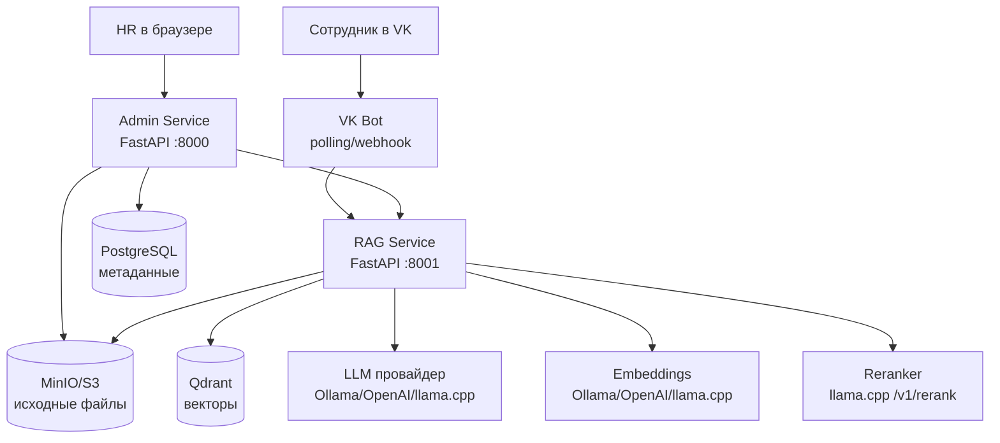
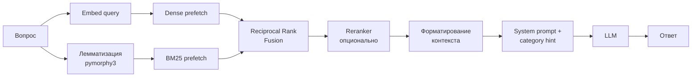
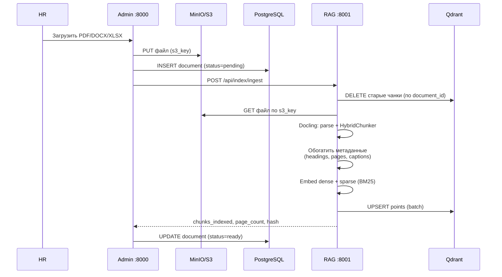
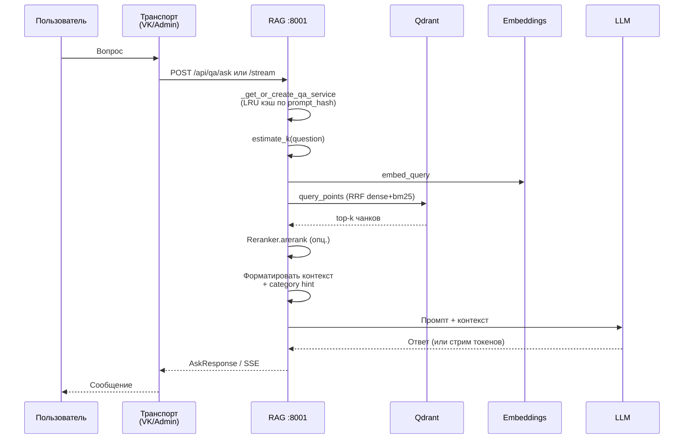
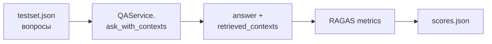
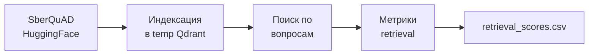

# Архитектура ML-составляющей проекта

Документ описывает, как устроена ИИ-часть Cafetera HR Bot: пайплайн RAG (Retrieval-Augmented Generation), границы микросервисов, поток обработки документов и запросов, провайдеры моделей и оценка качества.

> Это техническая документация для разработчиков. Если вы запускаете проект впервые — начните с [README.md](../README.md).

---

## Содержание

1. [Высокоуровневая схема](#1-высокоуровневая-схема)
2. [Микросервисы и границы ответственности](#2-микросервисы-и-границы-ответственности)
3. [Пайплайн RAG](#3-пайплайн-rag)
4. [Поток приёма документов (Ingestion)](#4-поток-приёма-документов-ingestion)
5. [Поток ответа на вопрос (Query)](#5-поток-ответа-на-вопрос-query)
6. [Провайдеры моделей](#6-провайдеры-моделей)
7. [Хранилища данных](#7-хранилища-данных)
8. [HTTP API RAG-сервиса](#8-http-api-rag-сервиса)
9. [Жизненный цикл ресурсов](#9-жизненный-цикл-ресурсов)
10. [Безопасность и аутентификация](#10-безопасность-и-аутентификация)
11. [Оценка качества](#11-оценка-качества)
12. [Ключевые конфигурационные параметры](#12-ключевые-конфигурационные-параметры)

---

## 1. Высокоуровневая схема



Система состоит из трёх Python-сервисов и трёх инфраструктурных хранилищ. Вся ML-логика (парсинг, эмбеддинги, поиск, генерация) сосредоточена в **RAG-сервисе** — отдельном микросервисе, к которому Admin и VK Bot обращаются по HTTP.

---

## 2. Микросервисы и границы ответственности

### Admin Service (порт 8000)

Пакет: [packages/admin](file:///Users/aleksandrrevenskij/Projects/cafetera_hr_bot/packages/admin)

- Веб-панель на FastAPI + HTMX + Alpine.js + Tailwind/DaisyUI.
- Загружает документы в S3 и записывает метаданные в PostgreSQL.
- Делегирует парсинг, эмбеддинг и индексацию RAG-сервису через HTTP.
- Предоставляет «экспертный режим» — задаёт вопросы к глобальной базе знаний или к конкретному документу.

### VK Bot

Пакет: [packages/vk_bot](file:///Users/aleksandrrevenskij/Projects/cafetera_hr_bot/packages/vk_bot)

- Транспортный адаптер на vkbottle 4.x.
- Принимает сообщения сотрудников в VK-сообществе.
- Отправляет вопросы в RAG-сервис, возвращает ответы пользователю.
- Поддерживает потоковый режим (SSE) для пошаговой выдачи токенов.

### RAG Service (порт 8001)

Пакет: [packages/rag_service](file:///Users/aleksandrrevenskij/Projects/cafetera_hr_bot/packages/rag_service)

- Микросервис на FastAPI с собственным жизненным циклом ресурсов.
- Содержит **всю** ML-логику: парсинг, чанкинг, эмбеддинги, гибридный поиск, реранкинг, генерацию.
- Не имеет своей БД метаданных — работает с тем, что ему передают (`document_id`, `s3_key`).
- Защищён API-ключом (`X-API-Key`), не должен быть доступен из публичного интернета.

### Core Package

Пакет: [packages/core](file:///Users/aleksandrrevenskij/Projects/cafetera_hr_bot/packages/core)

- Общий код: настройки (`CoreSettings`), репозитории PostgreSQL, S3-клиент, `RAGClient` (HTTP-обёртка над RAG-сервисом).
- Используется как Admin, так и VK Bot.

---

## 3. Пайплайн RAG



Пайплайн собирается из независимых компонентов LangChain в [chain.py](file:///Users/aleksandrrevenskij/Projects/cafetera_hr_bot/packages/rag_service/src/cafetera_rag_service/rag/chain.py):

```
retriever  →  format_docs  →  prompt  →  LLM  →  StrOutputParser
```

### Гибридный поиск (Dense + BM25 + RRF)

Реализован в [`AsyncQdrantRetriever`](file:///Users/aleksandrrevenskij/Projects/cafetera_hr_bot/packages/rag_service/src/cafetera_rag_service/rag/retriever.py):

1. Вопрос превращается в плотный вектор через embedding-модель.
2. Параллельно вопрос лемматизируется ([pymorphy3](file:///Users/aleksandrrevenskij/Projects/cafetera_hr_bot/packages/rag_service/src/cafetera_rag_service/rag/text_processor.py)) и превращается в разреженный BM25-вектор (`Qdrant/bm25`).
3. Qdrant выполняет два prefetch-запроса (`using="dense"` и `using="bm25"`) и сливает результаты через **Reciprocal Rank Fusion**.
4. Если sparse-вектор оказался пустым после удаления стоп-слов — фоллбек на dense-only.
5. Применяется `dense_score_threshold` с гарантией min-1 (никогда не возвращаем пустой результат).
6. Документы с `is_search_enabled=false` исключаются фильтром Qdrant.

### Адаптивный k

Функция `estimate_k` подбирает количество извлекаемых чанков по длине вопроса:

| Длина вопроса | k |
|---|---|
| ≤ 5 слов | 4 |
| 6–15 слов | 6 |
| > 15 слов | `GLOBAL_MAX_K` (по умолчанию 10) |

При включённом реранкинге retriever всё равно тянет `RERANKER_PREFETCH_LIMIT` (20) кандидатов, чтобы реранкер мог выбрать лучшие.

### Реранкинг

`HttpRerankerClient` ([reranker.py](file:///Users/aleksandrrevenskij/Projects/cafetera_hr_bot/packages/rag_service/src/cafetera_rag_service/rag/reranker.py)) вызывает внешний HTTP-эндпоинт `POST /v1/rerank` (совместим с llama.cpp). Ответ сортируется по `relevance_score`, оставляются `top_n` (по умолчанию 5) документов. При сетевой ошибке безопасный фоллбек — вернуть первые `top_n` без переранжирования.

### Промпты и категории

Файл [prompts.py](file:///Users/aleksandrrevenskij/Projects/cafetera_hr_bot/packages/rag_service/src/cafetera_rag_service/rag/prompts.py) содержит:

- `DOCUMENT_EXPERTS_PROMPT` — для запросов к одному документу.
- `CATEGORY_HINTS` — словарь подсказок по 6 HR-категориям (`pay`, `sick`, `probation`, `hire`, `fire`, `vacation`), которые добавляются к системному промпту.

Системные промпты для глобальных запросов хранятся в вызывающих сервисах (VK Bot и Admin) — это намеренная изоляция, чтобы один сервис не мог переопределить промпт другого.

### Стриминг

Эндпоинты `/api/qa/stream` и `/api/qa/stream-document` отдают ответ через **Server-Sent Events**: каждый токен LLM упаковывается в `data: {"token": "..."}\n\n`. По завершении — `data: [DONE]\n\n`. Корректно обрабатывается `asyncio.CancelledError` при разрыве соединения с клиентом.

---

## 4. Поток приёма документов (Ingestion)



### Парсинг

Реализован в [parser.py](file:///Users/aleksandrrevenskij/Projects/cafetera_hr_bot/packages/rag_service/src/cafetera_rag_service/parser.py) на базе **Docling**:

- Поддерживаются `.pdf`, `.docx`, `.xlsx`. Формат `.doc` отклоняется с явной ошибкой.
- PDF обрабатывается через `PyPdfiumDocumentBackend`, OCR по умолчанию выключен.
- `HybridChunker` режет документ на чанки до `CHUNK_SIZE` токенов (по умолчанию 512), используя токенизатор `Qwen/Qwen3-Embedding-0.6B`.
- На старте RAG-сервиса вызывается `ensure_models_cached`, который скачивает ONNX-модели Docling и токенизатор HuggingFace, после чего включается режим `HF_HUB_OFFLINE=1` — никаких сетевых обращений в рантайме.

### Обогащение чанков

Каждому чанку дописываются:

- В `page_content` — префиксы `[Документ: ...]`, `[Разделы: ...]`, `[Страница: ...]`, `[Подпись: ...]`.
- В `metadata` — `headings`, `captions`, `page_numbers`, `content_type` (`text`/`table`/`figure`), `section_path`, `document_id`, `chunk_id`, `filename`, `s3_key`, `is_search_enabled`.
- Чанки таблиц **не** контекстуализируются — их структура важнее для LLM, чем хедер раздела.
- Чанки короче 30 символов отбрасываются.

### Индексация в Qdrant

Реализована в [api/ingest.py](file:///Users/aleksandrrevenskij/Projects/cafetera_hr_bot/packages/rag_service/src/cafetera_rag_service/api/ingest.py):

1. Идемпотентное удаление старых точек по `metadata.document_id` (поддержка переиндексации).
2. `embeddings.aembed_documents(texts)` — массовый embedding.
3. Опционально: BM25 sparse-векторы, тексты пропускаются через `preprocess_russian` (если `BM25_LEMMATIZE=true`).
4. Сборка `PointStruct` с двумя именованными векторами (`dense` и `bm25`) и payload-ом.
5. Батчевый `upsert` с размером `QDRANT_UPSERT_BATCH_SIZE` (32).

---

## 5. Поток ответа на вопрос (Query)



`QAService` ([qa_service.py](file:///Users/aleksandrrevenskij/Projects/cafetera_hr_bot/packages/rag_service/src/cafetera_rag_service/qa_service.py)) — это лёгкая обёртка над цепочкой LangChain. Он:

- Пересобирает цепочку под каждый запрос (с нужным `k` и `category_hint`), но переиспользует уже инициализированные `qdrant_client`, `embeddings`, `llm`, `sparse_embeddings`, `reranker`.
- Кэшируется на уровне эндпоинта по ключу `(sha256(system_prompt)[:16], include_metadata)`, максимум 32 экземпляра (LRU-эвикция).
- Обрезает ответ до лимита VK (4096 символов).
- Возвращает понятные русские сообщения об ошибках вместо сырых трейсбеков.

---

## 6. Провайдеры моделей

Все три типа моделей (LLM, embeddings, reranker) абстрагированы за LangChain-интерфейсами и переключаются через переменные окружения.

### LLM

Фабрика `build_llm` в [chain.py](file:///Users/aleksandrrevenskij/Projects/cafetera_hr_bot/packages/rag_service/src/cafetera_rag_service/rag/chain.py):

| Провайдер | Класс | Особенности |
|---|---|---|
| `ollama` (по умолчанию) | `ChatOllama` | Нативно поддерживает `top_p`, `top_k`, `num_ctx`. `presence_penalty` игнорируется (Ollama использует `repeat_penalty`). |
| `openai` | `ChatOpenAI` | `top_k` передаётся через `extra_body` (vLLM/llama-server совместимы). |
| `llamacpp` | `ChatOpenAI` (через `/v1`) | `n_ctx` и `chat_template_kwargs.enable_thinking=False` через `extra_body`. |

Параметр `LLM_DISABLE_THINKING=true` (по умолчанию) выключает «режим размышления» у моделей семейства Qwen3/Qwen3.5.

### Embeddings

Фабрика `build_embeddings` в [retriever.py](file:///Users/aleksandrrevenskij/Projects/cafetera_hr_bot/packages/rag_service/src/cafetera_rag_service/rag/retriever.py):

| Провайдер | Класс |
|---|---|
| `ollama` | `OllamaEmbeddings` |
| `openai` | `OpenAIEmbeddings` |
| `llamacpp` | `OpenAIEmbeddings` с `base_url=…/v1` |

Подробное руководство — [docs/providers.md](providers.md), специфика llama.cpp — [docs/llamacpp.md](llamacpp.md).

### Reranker

Только HTTP-провайдер с эндпоинтом `POST /v1/rerank` (формат llama.cpp). Включается флагом `RERANKING_ENABLED=true`. По умолчанию выключен.

### Sparse embeddings (BM25)

Используется `Qdrant/bm25` через `fastembed`. Загружается лениво в `build_sparse_embeddings`. При сбое инициализации система автоматически деградирует до dense-only поиска.

---

## 7. Хранилища данных

| Хранилище | Что хранит | Как используется |
|---|---|---|
| **PostgreSQL** | Метаданные документов: `document_id`, `filename`, `s3_key`, статус обработки, владелец, время загрузки. | Только Admin-сервис. Источник истины для UI. |
| **MinIO / S3** | Исходные файлы (PDF/DOCX/XLSX) под ключом `s3_key`. | Admin загружает, RAG скачивает при ingestion. |
| **Qdrant** | Чанки с двумя векторами (`dense` cosine + `bm25` sparse), payload содержит `page_content` и `metadata`. | RAG-сервис — единственный потребитель. |

### Схема коллекции Qdrant

- `dense`: cosine, INT8 scalar quantization (`quantile=0.99`, `always_ram=False`).
- `bm25`: sparse-вектор с модификатором IDF, `on_disk=true`.
- Payload-индексы: `BOOL` на `is_search_enabled`, `KEYWORD` на `metadata.document_id`, `metadata.filename`, `metadata.headings`.
- Оптимизатор: `indexing_threshold=10000`, `deleted_threshold=0.2`.

---

## 8. HTTP API RAG-сервиса

Все эндпоинты, кроме `/api/health`, требуют заголовок `X-API-Key`.

### Health

| Метод | Путь | Описание |
|---|---|---|
| `GET` | `/api/health` | Возвращает статус Qdrant и LLM (`ok` / `degraded` / `error`). |

### Question Answering

| Метод | Путь | Описание |
|---|---|---|
| `POST` | `/api/qa/ask` | Глобальный запрос, синхронный ответ. |
| `POST` | `/api/qa/stream` | Глобальный запрос, SSE-стрим. |
| `POST` | `/api/qa/ask-document` | Запрос в рамках одного документа. |
| `POST` | `/api/qa/stream-document` | То же, стримом. |

Тело `AskRequest`: `{question, system_prompt, include_metadata, category?}`.

### Indexing

| Метод | Путь | Описание |
|---|---|---|
| `POST` | `/api/index/chunks` | Индексация заранее подготовленных чанков. |
| `POST` | `/api/index/ingest` | Полный пайплайн: S3 → парсинг → чанкинг → эмбеддинг → Qdrant. |
| `DELETE` | `/api/index/documents/{document_id}` | Удалить все чанки документа. |
| `PATCH` | `/api/index/documents/{document_id}/search` | Включить/выключить документ в поиске. |

Pydantic-схемы запросов и ответов — в [models.py](file:///Users/aleksandrrevenskij/Projects/cafetera_hr_bot/packages/rag_service/src/cafetera_rag_service/models.py).

---

## 9. Жизненный цикл ресурсов

RAG-сервис управляет ресурсами через FastAPI `lifespan` и dataclass `RagResources` ([resources.py](file:///Users/aleksandrrevenskij/Projects/cafetera_hr_bot/packages/rag_service/src/cafetera_rag_service/resources.py)):

```python
@dataclass
class RagResources:
    settings: RagServiceSettings
    qdrant_client: AsyncQdrantClient | None
    embeddings: Embeddings | None
    llm: BaseChatModel | None
    sparse_embeddings: object | None
    reranker: HttpRerankerClient | None
    reranker_http_client: httpx.AsyncClient | None
    s3_storage: S3Storage | None
```

`build_rag_resources` инициализирует компоненты с **graceful degradation**: если, например, недоступен reranker, остальные продолжат работать. `close_rag_resources` корректно закрывает HTTP-клиенты, S3 и Qdrant в обратном порядке.

На старте (см. [main.py](file:///Users/aleksandrrevenskij/Projects/cafetera_hr_bot/packages/rag_service/src/cafetera_rag_service/main.py)):

1. Загружаются настройки из `.env`.
2. `ensure_models_cached` прогревает токенизатор и Docling ONNX-модели.
3. Создаются ресурсы и привязываются к `app.state`.
4. Создаётся пустой LRU-кэш `app.state.qa_services`.

---

## 10. Безопасность и аутентификация

- **Inter-service auth.** Admin и VK Bot ходят в RAG-сервис с заголовком `X-API-Key`. Значение задаётся переменной `RAG_SERVICE_API_KEY`. Проверка — `secrets.compare_digest` ([api/deps.py](file:///Users/aleksandrrevenskij/Projects/cafetera_hr_bot/packages/rag_service/src/cafetera_rag_service/api/deps.py)).
- **Сетевая изоляция.** В продакшне порт 8001 не должен быть открыт наружу — только во внутренней Docker-сети.
- **Изоляция промптов.** `SYSTEM_PROMPT` VK-бота и `GLOBAL_EXPERTS_PROMPT` админки хранятся в своих пакетах. Каждый запрос явно передаёт нужный prompt — RAG-сервис не имеет «дефолтного» глобального промпта.
- **Контент-граундинг.** Все промпты явно требуют опираться только на переданный контекст и не использовать общие знания.
- **Валидация загрузок.** Допустимы только `.pdf`, `.docx`, `.xlsx`; имя файла санитизируется на стороне Admin перед сохранением в S3.

Полный набор правил — в файлах [`.qoder/rules/09-security.md`](file:///Users/aleksandrrevenskij/Projects/cafetera_hr_bot/.qoder/rules/09-security.md) и [`AGENTS.md`](file:///Users/aleksandrrevenskij/Projects/cafetera_hr_bot/AGENTS.md).

---

## 11. Оценка качества

Папка [`ragas/`](file:///Users/aleksandrrevenskij/Projects/cafetera_hr_bot/ragas) содержит два независимых пайплайна оценки качества.

### A. RAGAS (полный RAG-пайплайн)

Оценка всей цепочки «поиск → генерация ответа» на синтетическом тестсете.



Метрики (см. [evaluate.py](file:///Users/aleksandrrevenskij/Projects/cafetera_hr_bot/ragas/evaluate.py)):

- **Faithfulness** — насколько ответ опирается на извлечённые контексты.
- **ContextPrecisionWithoutReference** — релевантность ранжированного контекста запросу.
- **AnswerRelevancy** — семантическая близость ответа к вопросу (через embeddings).
- **ContextRecall** — опционально, если в `testset.json` есть `reference`-ответ.

Эвалюатор использует тот же `RagServiceSettings`, что и продакшен, поэтому оценивается реальная конфигурация.

### B. Retrieval Evaluation (оценка поиска на SberQuAD)

Отдельный пайплайн для оценки **только поисковой части** — без участия LLM. Позволяет изолированно проверить качество эмбеддингов и гибридного поиска на публичном бенчмарке.



Особенности:

- Поднимает **временный контейнер Qdrant** (`docker run --rm`) — не затрагивает продакшен-базу.
- Использует датасет **SberQuAD** (русскоязычный бенчмарк вопросов-ответов с HuggingFace).
- Требует **только Embedding-провайдер** — LLM не нужен.

5 метрик поиска (см. [evaluate_retrieval.py](file:///Users/aleksandrrevenskij/Projects/cafetera_hr_bot/ragas/evaluate_retrieval.py)):

| Метрика | Что измеряет |
|---|---|
| **MRR@10** | Средняя обратная позиция первого релевантного результата |
| **NDCG@10** | Качество ранжирования: учитывает позицию релевантного документа |
| **HitRate@10** | Доля запросов, где нужный документ попал в top-10 |
| **Recall@10** | Доля найденных релевантных документов |
| **Precision@10** | Доля релевантных среди найденных |

Результаты сохраняются в `ragas/retrieval_scores.csv`. Запуск: `bash ragas/run.sh retrieval`.

Подробнее — [docs/ragas.md](ragas.md), раздел 9.

---

## 12. Ключевые конфигурационные параметры

Все параметры — из `RagServiceSettings` ([config.py](file:///Users/aleksandrrevenskij/Projects/cafetera_hr_bot/packages/rag_service/src/cafetera_rag_service/config.py)).

### LLM

| Переменная | По умолчанию | Назначение |
|---|---|---|
| `LLM_PROVIDER` | `ollama` | `ollama` / `openai` / `llamacpp` |
| `LLM_MODEL` | `qwen3.5:4b-q4_K_M` | Имя модели |
| `LLM_BASE_URL` | `http://localhost:11434` | URL провайдера |
| `LLM_TEMPERATURE` | `0.3` | Температура сэмплинга |
| `LLM_NUM_CTX` | `8192` | Контекстное окно |
| `LLM_TOP_P` / `LLM_TOP_K` / `LLM_PRESENCE_PENALTY` | `None` | Опциональные |
| `LLM_DISABLE_THINKING` | `true` | Выключить thinking-режим Qwen3 |

### Embeddings

| Переменная | По умолчанию |
|---|---|
| `EMBEDDING_PROVIDER` | `ollama` |
| `EMBEDDING_MODEL` | `qwen3-embedding:4b-q4_K_M` |
| `EMBEDDING_BASE_URL` | `http://localhost:11434` |

### Гибридный поиск

| Переменная | По умолчанию |
|---|---|
| `SPARSE_EMBEDDING_MODEL` | `Qdrant/bm25` |
| `BM25_LEMMATIZE` | `true` |
| `DOC_QUERY_K` | `15` |
| `GLOBAL_MAX_K` | `10` |
| `DENSE_SCORE_THRESHOLD` | `0.5` |

### Reranker

| Переменная | По умолчанию |
|---|---|
| `RERANKING_ENABLED` | `false` |
| `RERANKER_URL` | `http://localhost:8082` |
| `RERANKER_TOP_N` | `5` |
| `RERANKER_PREFETCH_LIMIT` | `20` |
| `RERANKER_TIMEOUT` | `30.0` |

### Чанкинг

| Переменная | По умолчанию |
|---|---|
| `CHUNK_SIZE` | `512` |
| `CHUNKER_TOKENIZER_MODEL` | `Qwen/Qwen3-Embedding-0.6B` |

### Qdrant / S3 / API-key

| Переменная | По умолчанию |
|---|---|
| `QDRANT_URL` | `http://localhost:6333` |
| `QDRANT_COLLECTION` | `hr_documents` |
| `QDRANT_UPSERT_BATCH_SIZE` | `32` |
| `S3_ENDPOINT_URL` | `http://localhost:9000` |
| `S3_BUCKET` | `rag-documents` |
| `RAG_SERVICE_API_KEY` | `""` (без аутентификации — только для dev) |

---

## См. также

- [README.md](../README.md) — установка и запуск.
- [docs/providers.md](providers.md) — детали по провайдерам моделей.
- [docs/llamacpp.md](llamacpp.md) — настройка llama.cpp.
- [docs/ragas.md](ragas.md) — RAGAS-метрики простым языком.
- [docs/troubleshooting.md](troubleshooting.md) — частые ошибки.
- [AGENTS.md](../AGENTS.md) — правила для разработчиков и AI-агентов.
